# 第八章。迁移到 BizTalk Services

在本章的最后，我们将讨论如何迁移到 BizTalk Services。整本书中，我们探讨了 BizTalk Services 的新特性和它们能做什么，但很可能会想要将现有的解决方案迁移到 BizTalk Services。当你阅读这本书时，我们还将进一步假设你想要了解更多关于将本地 BizTalk Server 解决方案迁移到 BizTalk Services 的信息。

在本章中，我们将探讨以下主题：

+   可用于帮助将 BizTalk Server 解决方案迁移到 BizTalk Services 的资源

+   如何处理产品之间的差异

+   BizTalk Services 的未来计划

到本章结束时，你应该对如何处理将现有的 BizTalk Server 解决方案迁移到 BizTalk Services 以及 BizTalk Services 发展中计划如何使这一过程更加容易有一个很好的理解。

# 从 BizTalk Server 迁移

BizTalk Server 由多个架构组件组成，其中只有一些在 BizTalk Services 中具有等效性。这些组件在以下表中列出，该表显示了 BizTalk Server 和 BizTalk Services 的比较：

| BizTalk Server | BizTalk Services |
| --- | --- |
| 映射 | 转换 |
| 管道 | 桥梁 |
| 业务规则引擎 | 无等效/无需自定义编码 |
| 业务活动监控 | 无等效/无需自定义编码 |
| 集成 | 集成 |
| 适配器 | 桥接源和目标 |
| 架构 | 架构 |
| 跟踪 | 跟踪 |
| 交易伙伴管理 | 交易伙伴管理 |

如前表所示，BizTalk Services v1.0 和 BizTalk Server 之间存在许多功能差异。这是可以预料的，因为 BizTalk Server 是一个在 2000 年首次发布并经过多次更新的成熟产品；而 BizTalk Services 则是在 2013 年 11 月 21 日 GA（发布为通用可用）的。然而，并非所有努力都白费，因为有多种方法可以减轻从一种产品迁移到另一种产品的努力。在接下来的章节中，我们将探讨 BizTalk Server 解决方案中的不同类型的工作件以及如何迁移到 BizTalk Services。

## 映射

第二章，*消息和转换*，详细介绍了映射，并提到了我们将在此处更详细地查看的工具。首先，让我们回答一下你是否真的需要这样的工具。

BizTalk Server 提供了运行自定义 **可扩展样式表语言转换**（**XSLT**）的能力——只需提供 XSLT 模板文件的路径，就可以忽略映射内容。以这种方式编写的映射不需要转换工具，因为你可以直接将 XSLT 配置在 BizTalk Services 转换中。

BizTalk 中的映射在 BizTalk Services 中的功能等价物是转换，正如您已经看到的。然而，这些技术的实现却非常不同，无法在 BizTalk Services 中执行 BizTalk 服务器映射。

微软发布了一个转换工具，它以 BizTalk 映射（`.btm` 文件）作为输入，并输出 BizTalk Services 转换文件（`.trfm`）。让我们看看它是如何工作的。

在 第二章 中，我们探讨了 BizTalk Services 转换及其源和目标架构。在这里，我们将重新审视这些架构，并查看等效的原始 BizTalk 服务器映射。如下面的截图所示：

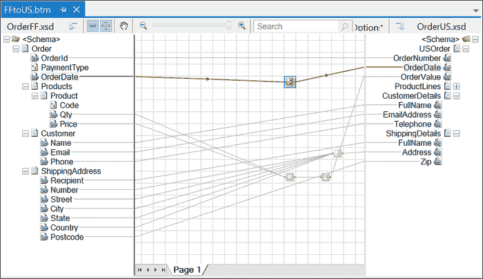

BizTalk 服务器映射

转换工具是 BizTalk Services SDK 的一部分，可在 [`www.microsoft.com/en-us/download/details.aspx?id=39087`](http://www.microsoft.com/en-us/download/details.aspx?id=39087) 获取。选择 `Tools.zip` 下载并解压到您的本地计算机上。这是一个命令行驱动的工具，因此在这里，我将打开一个命令窗口，如下面的截图所示。可执行文件只接受两个参数：BizTalk `.btm` 文件的路径和输出 `.trfm` 文件（实际上这是可选的）。

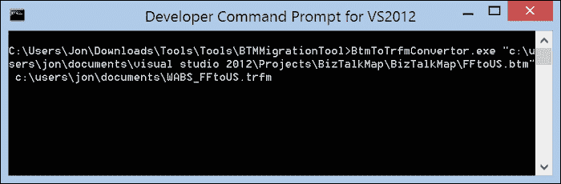

BizTalk 映射转换工具

如下面的截图所示的结果 BizTalk Services 转换与我们在 第二章 中创建的转换产生完全相同的输出。

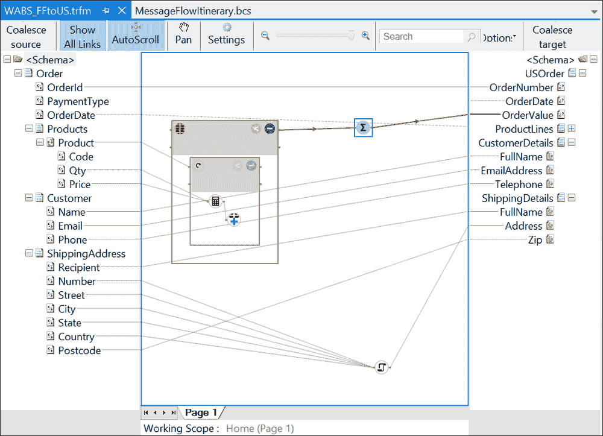

转换后的映射

正如您刚才看到的，转换工具是重用 BizTalk Services 中现有映射的有用方式。通常情况下，已经在 BizTalk 映射上投入了大量资金，而这个工具允许它们在许多情况下以最小的努力进行转换。然而，这个工具并非没有一些限制，这需要对生成的转换进行一些修改。

如果生成的转换无法正确加载，可能需要进行的修复之一是更改文件中的 ID 值，因为它有时会发出重复项。当您尝试在 Visual Studio 中打开映射时，您可能会看到以下截图所示的错误：

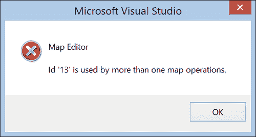

映射错误消息

这应该是一个简单的案例，当您尝试打开转换并标记为重复的 ID 时，找到该 ID 并用新的唯一值替换其值。如果 ID 指的是脚本，则至少需要更改重复 ID 的两个地方。以下代码示例中，`Value` 标签的内容包含重复的 ID。将其更改为唯一值，例如 `14`，将修复本章附带的示例中的问题。

```cs
<a1:KeyValueOfstringanyType>
   <a1:Key>Id</a1:Key>
   <a1:Value i:type="xs:int">13</a1:Value>
</a1:KeyValueOfstringanyType>
```

通常，如果工具无法转换映射，它将尽可能转换，并用算术表达式函数对象替换无法转换的函数对象。这将是一个空对象，因此不会编译，以指示你需要审查它。如果一个函数对象转换不可行，转换中的等效函数对象将没有输入，再次表示某些内容尚未转换。当前限制的完整列表在工具所在位置的`ReadMe.txt`文件中提供。

工具会生成一个日志文件，指示转换映射所采取的步骤。`Log.txt`文件将写入命令行中运行工具的文件夹。

## 管道

BizTalk 服务器中的管道用于在适配器和 MessageBox 之间处理数据。现在，这一需求由 BizTalk 服务的桥梁提供。我们已在本书的其他部分详细介绍了桥梁（第三章，*桥梁*和第四章，*企业应用集成*）。你应该会发现桥梁的使用和在其中部署自定义代码的能力提供了与管道和自定义管道组件遇到的大多数功能。BizTalk 服务标准的桥梁阶段与 BizTalk 服务器非常相似，如下表所示：

| BizTalk 服务器阶段 | BizTalk 服务阶段 |
| --- | --- |
| 接收：解码 | 丰富（1） |
| 接收：拆装 | 消息类型/丰富（2） |
| 接收：验证 | 验证 |
| 接收：解析方 | N/A |
| 发送：预组装 | 丰富（1） |
| 发送：组装 | 丰富（2） |
| 发送：编码 | 发送回复 |
| 接收和发送：端口映射 | 转换阶段 |

如果前表中的阶段看起来有些随意，那是因为它们确实是。就像在 BizTalk 服务器中，完全有可能在单个阶段完成所有操作（当然，这取决于是哪个阶段），BizTalk 服务也是如此。虽然 BizTalk 服务没有管道组件的概念，但它提供了足够的阶段占位符供你自己的代码使用，当然，它还提供了许多你传统上会为自定义管道组件编写的功能，例如属性提升。尽管 BizTalk 服务器提供了四个接收管道阶段，实际上，管道阶段是可以配置的（你可以定义自己的），但没有人真正关心这一点，几乎所有解决方案都只使用了解码和验证阶段（如果有的话）。发送管道甚至不那么重要，但同样，BizTalk 服务提供了与阶段相似的镜像，如果你需要，你可以在这里对通过的消息执行操作。

话虽如此，应该清楚的是，如果您遇到一个包含自定义管道组件的解决方案，您有一些工作要做，即尝试将其转换为 BizTalk Services。

## 架构

BizTalk Services 对架构的支持在很大程度上是相同的，并且通常，您在将架构在两者之间移动时不应遇到太多问题。有一些值得注意的例外，例如将多个架构传递到 BizTalk Server 映射中，这在 BizTalk Services 中目前是不可能的，但通常架构可以以直接的方式重用。

## 适配器

BizTalk Services 与适配器的概念相同，尽管适配器的集合要小得多。此外，BizTalk Services 提供了两种集成方法：桥接的源和目标以及 BizTalk Adapter Service，它使用服务总线中继将消息传递到由 Internet Information Services (IIS)托管的业务线（LOB）适配器（实际上，与 BizTalk 一起提供的相同的 LOB 适配器）。因此，如果您的 BizTalk Server 解决方案需要的适配器在 BizTalk Services 集合中表示，转换过程将非常直接。然而，对于 BizTalk Server 有数百个适配器可用，而对于 BizTalk Services 则有十几个左右，因此显然存在一些差距。其中一些对于云托管平台来说可能没有意义（例如，备受喜爱的文件适配器），但对于其他一些，这可能会带来问题。

微软认识到这个问题，当然会随着时间的推移根据客户反馈引入新的源和目标。微软还计划开放架构，提供适配器 SDK，以便您（或第三方）构建自己的适配器，从而提供另一种解决方案。因此，随着时间的推移，这个问题可能会减少。

## 交易伙伴管理（TPM）

BizTalk Server 使用 TPM 来定义和管理 EDI 交易伙伴。使用 BizTalk 的 EDI 功能的组织可能会在 BizTalk 中设置数百甚至数千个交易伙伴，并且如果他们希望采用 BizTalk Services，他们将希望有一种将这些合作伙伴迁移到 BizTalk Services 的方法。

BizTalk Services 在合作伙伴管理方面采取了与 BizTalk 相同的方法，并且对 BizTalk Server 2010 中 TPM 模型和架构所做的更改也被 BizTalk Services 采用。这意味着这两个系统实际上非常相似，迁移可以通过几种方式完成。

对于现有的 BizTalk Server 用户，Microsoft 提供了 TPM 数据迁移工具。这个工具包含在之前讨论的映射转换工具相同的`Tools.zip`下载中，并且能够将 TPM 数据从 BizTalk Server 2010 或 2013 迁移过来。

下面的屏幕截图显示了 BizTalk Server 管理控制台。在这里，您可以看到两个参与方和一个我们希望迁移到 BizTalk Services 的协议。

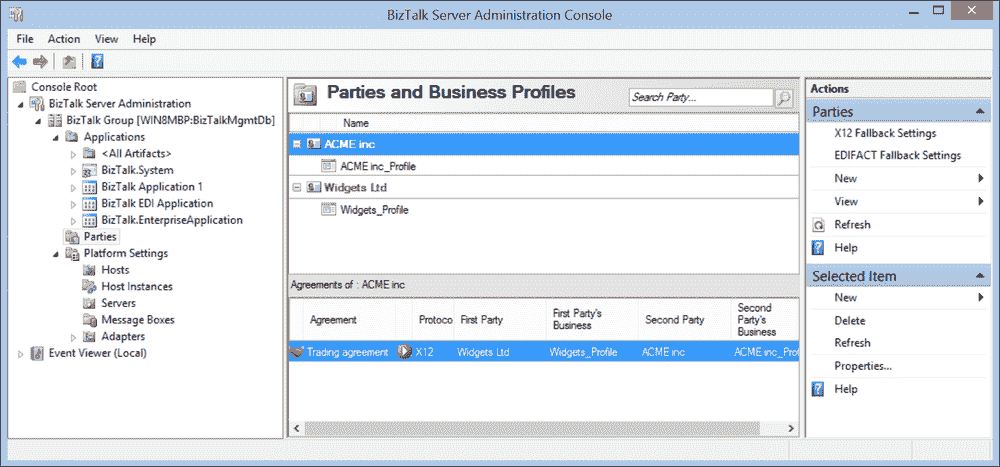

BizTalk Server 管理控制台

要启动它，双击 `TPMMigration.exe`，应用程序将如以下截图所示出现：

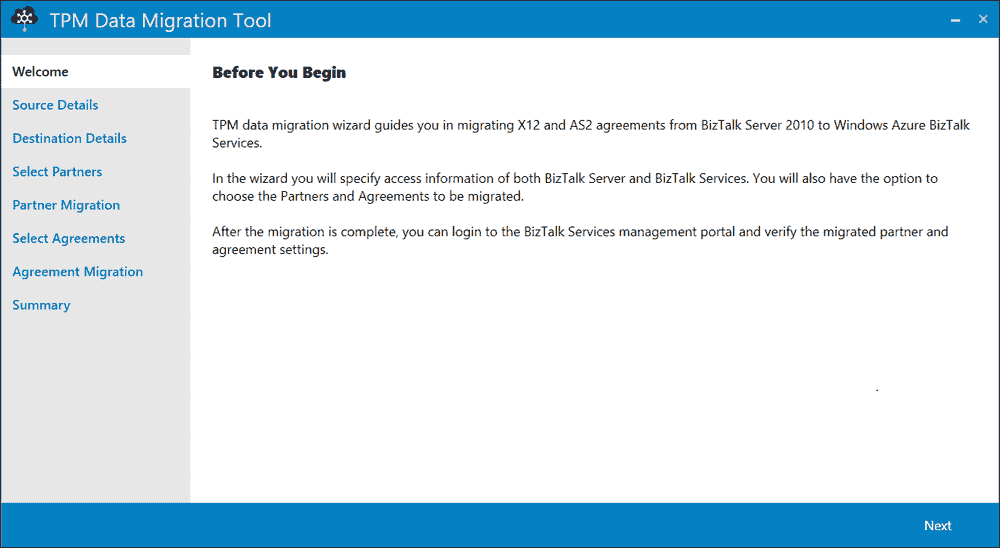

TPM 数据迁移工具

工具以 SQL Server 的机器名作为 BizTalk Server 管理数据库的存放位置，以及 BizTalk 服务连接详情作为输入。然后，它将显示如下截图所示的可用合作伙伴以供迁移：

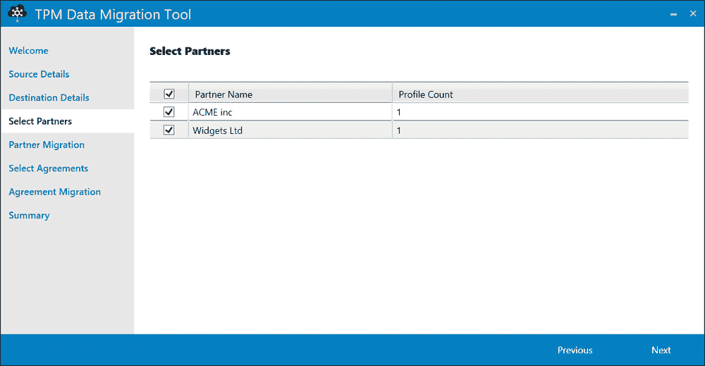

选择要迁移的合作伙伴

在这里，我从 BizTalk Server 管理控制台中选择了两个合作伙伴。点击 **下一步** 然后显示协议。我只有一个，如下截图所示，这是两个当事人之间的协议，因此选择此协议并点击 **下一步** 将开始将合作伙伴和协议迁移到 BizTalk 服务的过程：

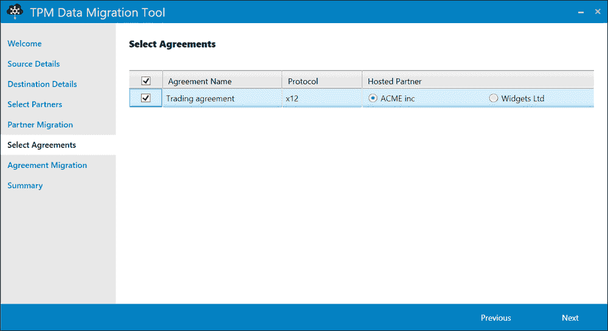

选择协议

一旦在 BizTalk 服务中创建了合作伙伴和协议，**摘要** 页面将详细说明已完成的工作，如下截图所示：

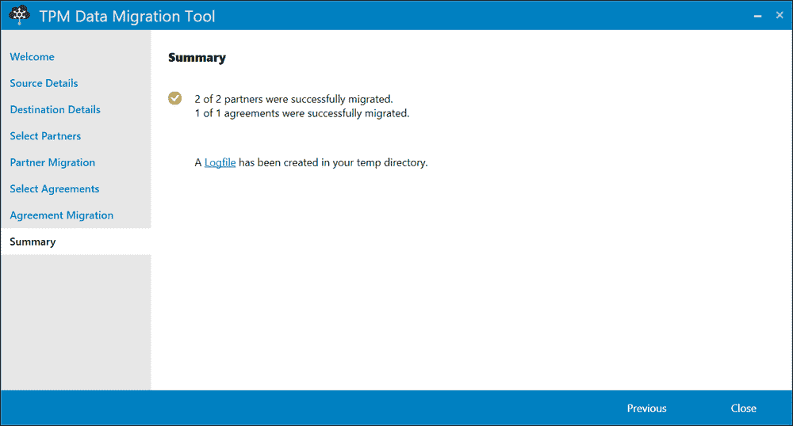

迁移摘要

现在，在 BizTalk 服务门户中查看，我们可以看到已经创建了合作伙伴和协议，如下截图所示：

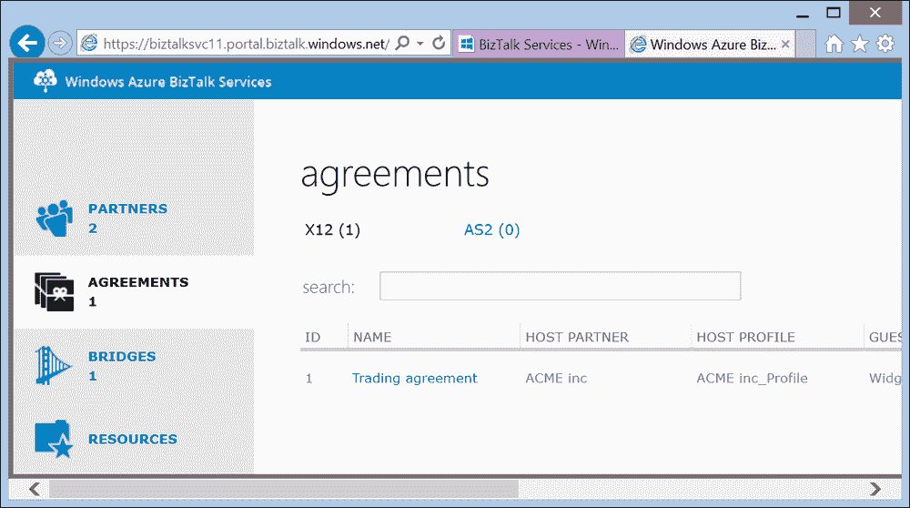

BizTalk 服务门户

工具应该能够迁移您在 BizTalk Server 中设置的各方和协议。工具的一个限制是它不会迁移您用于保护您组织与交易伙伴之间对话的证书。这些需要手动迁移。

当从 BizTalk Server 2010/2013 迁移到 BizTalk 服务时，TPM 数据迁移工具非常有用。然而，如果您需要从不同的产品或 BizTalk Server 的早期版本迁移，也存在另一种选择。如果您想通过自定义应用程序或与其他产品集成来程序化创建交易伙伴，这种方法也是一个有用的方法。此方法使用 TPM API。实际上，迁移工具也利用此 API 来完成其工作。

此前，TPM 使用的 API 没有文档记录，因此如果客户希望在 BizTalk 中程序化创建交易伙伴，则不会得到支持。现在情况不再是这样。微软现在已在 MSDN 上发布了该 API，从而允许客户以受支持的方式利用它。

BizTalk 服务 TPM API 的文档位于以下位置：

[`msdn.microsoft.com/en-us/library/windowsazure/dn232369.aspx`](http://msdn.microsoft.com/en-us/library/windowsazure/dn232369.aspx)

为了调用 TPM API，需要 OAuth WRAP 令牌进行身份验证。这个令牌只是一个包含以下信息的字符串：

+   用户名：`owner`

+   密码：来自 ACS 的发行者密钥

+   BizTalk 服务端点名称：`https://<yourservice>.biztalk.windows.net/`

调用 API 的过程由两个步骤组成。首先，POST 一个 WRAP 请求并接收一个 WRAP 令牌，然后将其传递到后续请求中。API 与我们在第六章（Chapter 6）中查看的其他 API 一样是基于 REST 的。由于 OAuth 要求（与相互证书认证相对），在 Fiddler（或浏览器）中调用它们更困难（尽管并非不可能）。因此，让我们以获取合作伙伴列表的代码为例来查看所需的代码。

以下代码将使用 WRAP 请求调用 Azure 并获取令牌：

```cs
string nameSpace = "<your WABS  namespace>"; // WABS namespace
string defaultIssuer = "owner"; // WABS issuer - usually "owner"
string defaultKey = "<your WABS key>"; // WABS issuer key
string serviceName = "gettingstartedwabs";
string address = string.Format((IFormatProvider)CultureInfo.InvariantCulture, "https://{0}.{1}/{2}/",
nameSpace, "accesscontrol.windows.net", "WRAPv0.9");
string payload = string.Format((IFormatProvider) CultureInfo.InvariantCulture,
"wrap_name={0}&wrap_password={1}&wrap_scope={2}", defaultIssuer,
                Uri.EscapeDataString(defaultKey),
                Uri.EscapeDataString("http://" + serviceName + ".biztalk.windows.net/default/$PartnerManagement/Partners"));
            HttpContent content = new StringContent(payload);
            content.Headers.ContentType.MediaType = "application/x-www-form-urlencoded";
using (var client = new HttpClient())
{
   // get WRAP token
   var response = await client.PostAsync(address, content);
   response.EnsureSuccessStatusCode();
   string token = await response.Content.ReadAsStringAsync();
   token = Uri.UnescapeDataString(token.Split('&')[0]);
}
```

这相当简单。需要四条信息。要获取 BizTalk 服务实例的 ACS 详细信息，请转到 Azure 门户，在左侧边栏中单击 **BizTalk Services**，选择您的实例，然后单击 **连接信息**。您将在这里找到用于替换前面代码的命名空间、发行者和密钥。服务名称是您在创建 BizTalk 服务实例时给出的名称，将在 Azure 门户仪表板上显示为标题。

这些信息被连接并发送到 ACS。它验证并返回一个身份验证令牌——一个可以在后续调用中使用的字符串。

以下代码（应放置在 `using` 语句前面的最后一个大括号内）将在请求中传递令牌并接收指定 BizTalk 服务实例中的合作伙伴列表：

```cs
// get partner list
client.DefaultRequestHeaders.Add("x-ms-version", "1.0");
client.DefaultRequestHeaders.Authorization = new AuthenticationHeaderValue("WRAP", "access_token=\"" + token.Substring(18) + "\"");
response = await client.GetAsync("https://" + serviceName + ".biztalk.windows.net/default/$PartnerManagement/Partners");
// write out partner list
Console.WriteLine("Partners:");
System.Xml.XmlDocument doc = new XmlDocument();
doc.LoadXml(await response.Content.ReadAsStringAsync());
foreach (XmlElement node in doc.SelectNodes("//*[local-name()='feed']//*[local-name()='entry']//*[local-name()='content']//*[local-name()='properties']//*[local-name()='Name']"))
{
   Console.WriteLine(node.InnerText);
}
Console.ReadLine(); // wait
```

之前的代码在您的 BizTalk 服务实例端点执行 HTTP GET 请求，附加操作（`$PartnerManagement/Partners`）并传递令牌。响应是一个包含 BizTalk 服务实例中设置的所有合作伙伴的 XML 文档。要尝试此操作，请在 Visual Studio 中创建一个控制台应用程序，并将代码粘贴到 `Main` 方法中，用您自己的服务详细信息替换代码中标记的值。以下截图显示了之前执行的合作伙伴导入的结果：

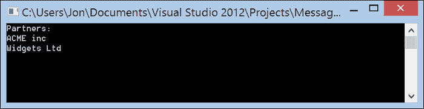

合作伙伴列表

使用 API 可以做很多事情，例如创建合作伙伴、更新或删除它们。然而，方法始终相同，所以请随意探索并看看您能做什么！

## EDIFACT 支持

BizTalk 服务最初支持 X12 和 AS/2。截至 2014 年 2 月的服务更新，现在也提供了 EDIFACT 支持，这对于欧洲客户来说将特别受欢迎。

## 业务规则引擎 (BRE)

现在我们来到一些更成问题的地方。自 2004 年以来，BizTalk 服务器已经提供了业务规则引擎和编辑器，因此它被用于许多 BizTalk 服务器解决方案中。目前 BizTalk 服务中没有等效的组件。

微软计划在某个时候将规则引擎作为 BizTalk 服务的一部分提供，但目前还没有具体的时间表。目的是提供与 BizTalk Server 相同的功能和改进的工具，这两项发展将在推出时使从服务器迁移到服务变得更加容易。

同时，一个选择是将 BizTalk BRE 规则转换为代码。有一些解决方案可以将 BizTalk 规则转换为 Windows Workflow 规则，而 Windows Workflow 规则是以代码定义的。Windows Workflow 也是 .NET 框架的一部分，因此使用它没有许可费用。因此，可以在 BizTalk 服务解决方案中的某个地方运行代码，例如在网桥或转换中。当然，这有点简化了问题，因为 BRE 规则可以访问数据库和其他资源，所以可能需要做更多的工作。然而，这是一个根据规则所执行的操作的选择。

## 编排

将 BizTalk Server 解决方案迁移到 BizTalk 服务中最大的挑战可能是编排。目前，还没有银弹般的、自动的或零成本的方法来转换或迁移编排到 BizTalk 服务。尽管如此，也有一些选择。

微软计划将工作流引入 BizTalk 服务，这无疑将有助于填补这一空白。这意味着编排可以被重新编码为工作流，并保持相似的架构。

首先，记住网桥实际上是一个工作流。这意味着网桥已经提供了一些编排可能曾经用过的功能，例如消息丰富和路由（占很大比例），因此可能已经可以迁移基于编排的解决方案。

然而，在过渡期间，可能需要找到另一种解决方案。一种解决方案是使用 Azure 中的工作角色云服务托管的工作流，例如。BizTalk 服务可以通过传递消息或数据来调用云服务，服务将运行工作流并返回结果。但这多少改变了架构，因为通常编排是控制者——它可能等待一个设定的时间间隔或来自其他系统的特定响应，并且通常编排用作业务流程的驱动程序。值得注意的是，网桥可以串联，因此这种流程定义风格可以用 BizTalk 服务来模仿，其中消息被处理，根据路由（到更多网桥）做出决策，等等。然而，这样的解决方案可能会变得复杂，最好避免。

也许遗憾的是，在 BizTalk Server 中过度使用编排一直很普遍。编排被视为早期 BizTalk 中的“啊哈”时刻，当时像业务流程管理（BPM）这样的缩写词很流行。这是不幸的，因为编排经常在不必要的时候被使用，而一个没有它的简单解决方案本可以创建。虽然随着时间的推移教育有所帮助，但仍然存在大量以复杂编排为中心的 BizTalk Server 应用程序。如果我们面临这种场景，今天迁移到 BizTalk 服务将具有挑战性。

# 何时不迁移

在关闭之前，值得指出的是，BizTalk 服务并不是用来取代 BizTalk Server 的。虽然这两个产品在提供的功能上确实有许多相似之处（并且还有更多即将到来），但使用每个产品的理由是不同的。以下是一些你应该继续在本地使用 BizTalk Server 的原因：

+   所有的连接点（应用程序、服务等）都在本地

+   在 BizTalk Server 专用解决方案上的大量投资——因为这可能需要完全重写，因此，超过了某些好处

+   使用不在 BizTalk 服务中或不适合云模型的功能，例如，文件和 MQ 系列适配器

+   云不是正确的解决方案，因为例如，安全性和/或监管限制、数据分类或当地法律可能阻止通过公共互联网发送此类数据或阻止在本地以外存储数据

# 未来

微软承诺将继续投资 BizTalk Server 并为 BizTalk 服务制定一个强大的路线图。以下是对两个产品即将到来的关键宣布发展：

+   BizTalk Server 将每隔一年发布一个主要版本

+   从今年的 BizTalk Server 2013 R2 开始，每两年将发布一次 BizTalk Server 的平台更新版本

+   计划为 BizTalk 服务添加以下功能，目标是每季度发布一次：

    +   工作流集成

    +   规则引擎集成

    +   业务活动监控

    +   适配器可扩展性/SDK

    +   桥接中的自定义代码改进

    +   与 Windows Azure Active Directory (WAAD) 集成

    +   支持业务流程建模符号（BPMN）

    +   Windows Azure 存储第三方组件

    +   定期备份

# 摘要

在本章中，我们探讨了从 BizTalk Server 迁移到 BizTalk Services 的策略和方法，以及 BizTalk Services 将添加的一些功能，这些功能将使迁移过程更加容易。我们试图涵盖 BizTalk Server 架构的所有主要构建块及其在 BizTalk Services 中的等效项（或替代方案）。正如你所看到的，尽管功能上有显著的重叠，但 BizTalk Services 的功能集要达到相同水平还需要时间。BizTalk Services 的未来光明，微软“云优先”愿景的基本原则是以一种在本地产品中不可能实现的方式提供频繁的更新和增强。因此，可以预期微软将更加关注客户，能够比以前更快地采取反馈和功能请求，所有这些都将使微软能够帮助你将现有解决方案迁移到云端。
