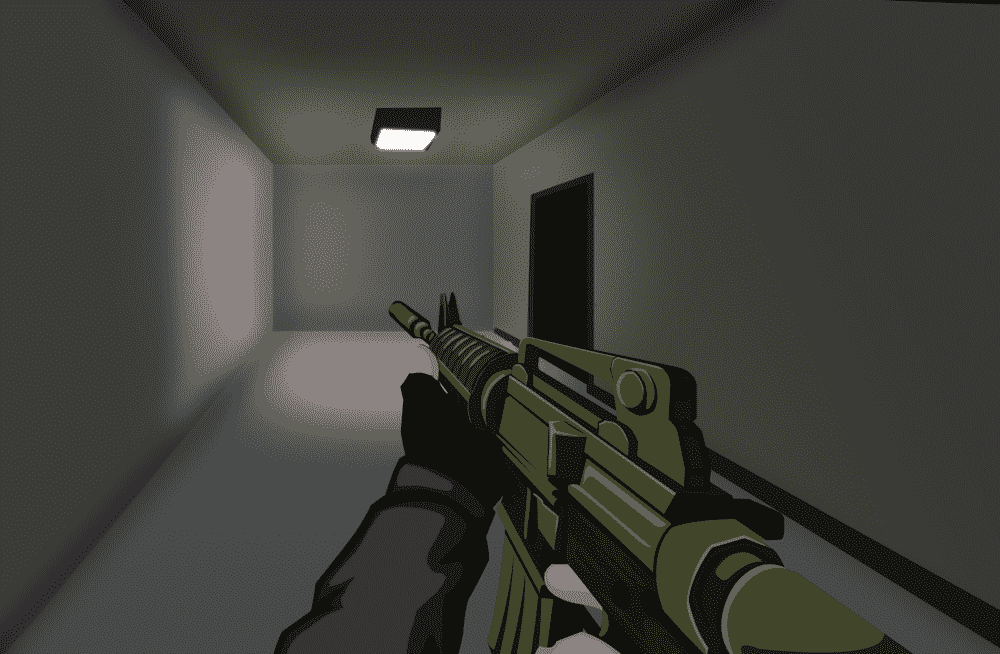
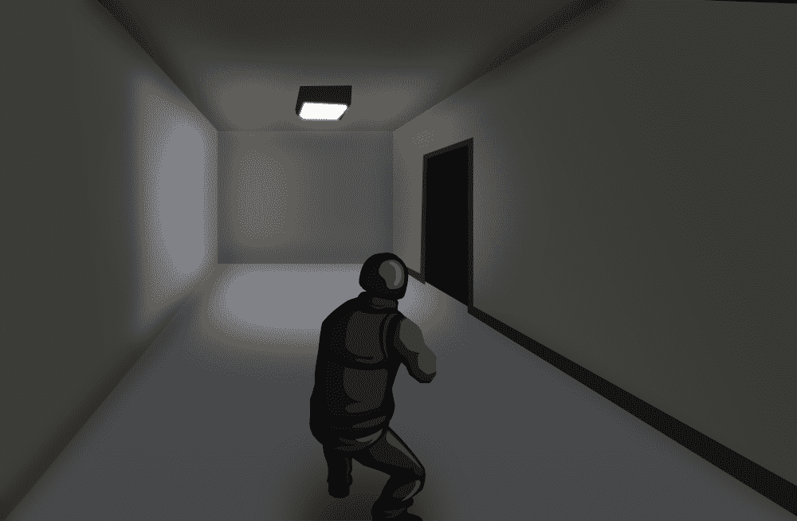
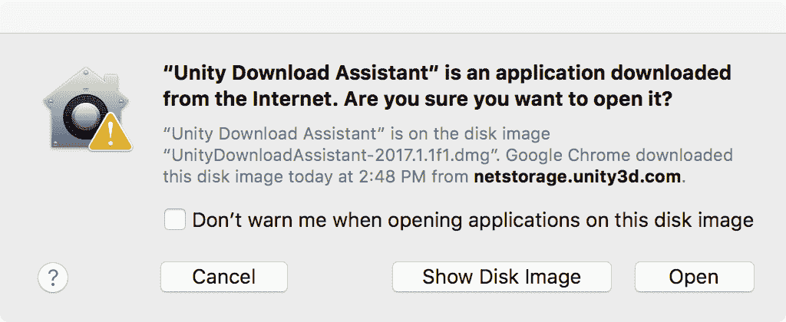
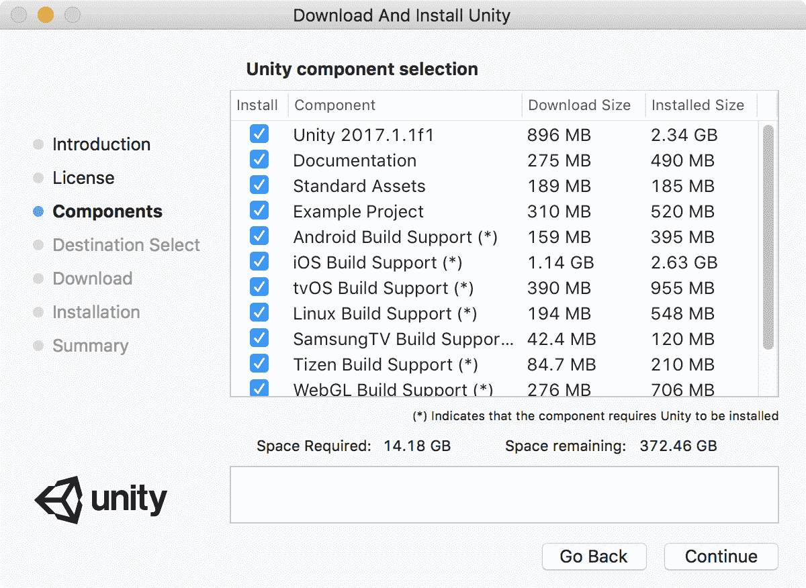
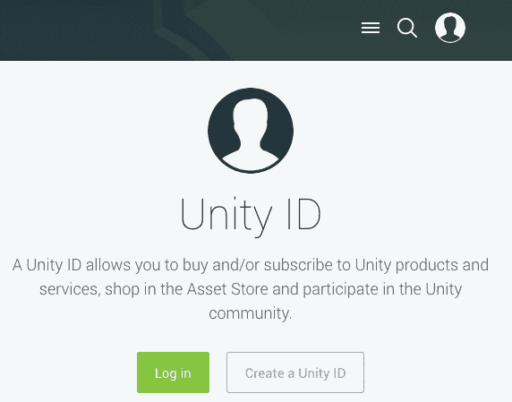

# 下载和安装 Unity

在本章中，你将了解游戏引擎，并查看四种不同类型，然后再专注于 Unity。一旦打下这个基础，我们就会开始深入探讨 Unity 的起源，了解游戏引擎的现状，以及它是如何发展成为今天使用最多的顶级游戏引擎之一的。我们将突出 Unity 的功能和特性。然后，我们将回顾开发 Unity 以及运行 Unity 游戏所需的系统要求。最后，我们将下载并安装 Unity。

本章的主题包括：

+   游戏引擎概述

+   Unity——过去、现在和未来

+   Unity 的优势

+   系统要求

+   下载 Unity

+   安装 Unity

# 游戏引擎概述

可以将游戏引擎定义为提供你开发部署视频游戏所需功能的一套工具。对于游戏引擎，没有单一的行业标准定义。这很大程度上归因于它们的多样性和用途。通常，游戏引擎至少具备以下功能集：

+   2D 和/或 3D 图形设计工具

+   动画

+   资产管理——创建和导入游戏资产的能力

+   音频支持

+   跨平台部署——游戏可以制作适用于多个平台（如桌面、移动和游戏机）

+   图形用户界面

+   网络——支持多人游戏

+   物理

+   支持一种或多种语言的脚本编写

游戏引擎的基本概念是它们提供了一套强大的工具来处理游戏开发中的大部分繁琐工作，使开发者能够专注于游戏的美学和游戏玩法。在电子游戏的早期，每个游戏都是从头开始编写的，没有游戏引擎的库或功能。为了避免为每个游戏重新发明轮子，游戏引擎开始出现，这使得游戏工作室能够更容易地制作游戏。

游戏引擎不是可以创建任何可想象游戏的通用软件套件。它们高度专业化，尽管非常灵活，但旨在针对特定范围的游戏类型。例如，Codemasters 的 Ego 游戏技术引擎主要用于创建赛车游戏；Wildfire Games 的 Pyrogenesis 用于创建**实时策略**（**RTS**）游戏；Nival Interactive 的 Silent Storm 引擎主要用于回合制战术游戏；Naomi Takahashi 的 ONScripter 用于创建视觉小说和第一人称冒险游戏。

# 针对特定游戏类型的游戏引擎

可用的游戏引擎种类繁多；其中许多是免费的，一些是开源的，还有一些是专有软件。为你的游戏项目选择正确的游戏引擎是开发前的关键步骤。并非每个游戏引擎都适用于你的游戏，也没有单一的游戏引擎适用于所有游戏。幸运的是，我们有大量可供选择。

在决定为特定的游戏项目选择哪个游戏引擎时，请考虑你的游戏所属的主要游戏类型的典型特征。

我们使用“主要类型”这个短语，因为许多现代游戏模糊了类型界限，并融合了两个或更多类型的特点。这种类型模糊可以导致新的和创新的游戏。

# 第一人称射击（FPS）

这个游戏类型有许多成功的作品；以下是一些例子：

+   战场

+   生化奇兵

+   边缘之地

+   召唤师

+   命运

+   恶魔城

+   半条命

+   霍尔

+   左 4 死

+   守望先锋

+   红色警戒

第一人称射击（FPS）游戏旨在让玩家沉浸在游戏世界中。玩家扮演一个角色，为了达到理想的沉浸感，动画、音频和图形质量至关重要。特别关注角色的手臂和武器：

这些游戏通常具有以下特点：

+   大型 3D 分段游戏世界（室内和室外）

+   角色主要步行移动

+   一些车辆使用

+   标准摄像机和瞄准控制

+   逼真的动画

+   大量逼真的手持物体（武器）库存

+   **非玩家角色**（**NPCs**）具有逼真的人工智能

+   单人和多人模式

# 第三人称游戏

第三人称游戏是玩家角色在游戏场景中几乎或完全可见的游戏。这个类型包括**第三人称射击**（**TPS**）和第三人称动作/冒险。这意味着需要投入相当大的精力来关注角色的外观和动画。这些游戏基于第三人称角色视角，如下所示：

这里有一些更成功和受欢迎的第三人称游戏：

+   死亡空间

+   战争机器

+   贪婪城市

+   波斯王子

+   红色警戒

+   生化危机

+   美国海军陆战队

+   突袭细胞

+   无主之地

这些游戏通常具有以下特点，除了上一节中列出的 FPS 游戏的特点：

+   重视玩家角色

+   跟随玩家的摄像机

+   玩家控制的角色动作序列

+   全身动画

+   角色和摄像机旋转

# 其他游戏类型

还有大量其他游戏类型，如射击、平台、赛车、格斗、策略、战争、模拟和益智。识别特定游戏类型困难在于游戏类型分类的多种方式。例如，你可以有一个既是**大型多人在线游戏**（**MMOG**）的 TPS 游戏，因为它包含大量益智元素，所以它可以被添加到益智游戏类型中。

这不是需要过分担心的事情。重要的是能够识别出你游戏的关键组成部分，这样你就可以为你的项目选择最佳的可用游戏引擎。

# 可用的 3D 游戏引擎

在本节中，我们将简要回顾一些领先的游戏引擎，以给你一个关于可用性和它们功能的感觉。

由于 Unity 游戏引擎将在本章后面介绍，并且贯穿整本书，因此本节没有涉及。

# CryENGINE

CryENGINE 由 Crytek 开发。有趣的是，这个游戏引擎最初是为了为显卡制造商 Nvidia 制作一个游戏演示而创建的，由于这个演示取得了巨大成功，游戏（孤岛惊魂）被全面投入生产，并成为商业上的成功。这个游戏引擎本身也非常成功。

该引擎及其完整源代码都是免费提供的。对于商业使用 CryENGINE，如版税等，没有财务义务。这个引擎能够提供高质量的视觉效果和出色的性能，你可以为以下平台开发游戏：

+   Linux PC

+   Oculus Rift

+   PlayStation 4

+   Windows PC

+   Xbox One

关于 CryENGINE 的更多信息，我推荐 Packt Publishing 出版的《精通 CryENGINE》：[`www.packtpub.com/game-development/mastering-cryengine`](https://www.packtpub.com/game-development/mastering-cryengine)。

# Lumberyard

Lumberyard 是 Amazon Web Services（AWS）平台的一部分，在本书出版时仍处于测试阶段。这是一个基于 CryENGINE 的免费 AAA 游戏引擎。Lumberyard 的独特卖点在于没有其他游戏引擎提供与 Amazon Web Services 和 Twitch 的深度集成。

AAA（发音为“三 A”），指的是那些拥有极其庞大的生产和营销预算的游戏。

使用这个引擎，你可以为以下平台开发：

+   Android

+   HTC Vive

+   iOS

+   Oculus Rift

+   OSVR

+   PC

+   PlayStation 4

+   PlayStation VR

+   Xbox One

关于 AWS Lumberyard 的更多信息，我推荐 Packt Publishing 出版的《学习 AWS Lumberyard 游戏开发》：[`www.packtpub.com/game-development/learning-aws-lumberyard-game-development`](https://www.packtpub.com/game-development/learning-aws-lumberyard-game-development)。

# 微软的 XNA 游戏工作室

微软的 XNA 游戏工作室是一套基于微软 .NET 框架的工具。它是免费提供的。如果你计划使用这个工具，有一些重新分发限制需要你审查。

使用 XNA，你可以为以下平台开发：

+   Windows PC

+   Windows Phone

+   Xbox 360

关于 XNA 的更多信息，我推荐 Packt Publishing 出版的《Microsoft XNA 4.0 游戏开发食谱》：[`www.packtpub.com/game-development/microsoft-xna-40-game-development-cookbook`](https://www.packtpub.com/game-development/microsoft-xna-40-game-development-cookbook)。

# Unreal 游戏引擎

Epic Games 开发的 Unreal 游戏引擎最初是一款近 20 年前的第一人称射击游戏（FPS）。从那时起，Unreal 游戏引擎经历了显著的发展，现在是一个免费提供的 AAA 游戏引擎。你可以使用 C++ 或蓝图（一个可视化脚本系统）来用 Unreal 开发游戏。

Unreal 随带了一些模板，使得入门变得非常容易。这些模板包括：

+   2D 文件滚动器

+   第一人称

+   飞行

+   拼图

+   滚动

+   侧滚动

+   第三人称

+   俯视角

+   双摇杆射击游戏

+   车辆

+   车辆高级

使用 Unreal，你可以为以下平台进行开发：

+   Android

+   Daydream

+   HTML 5

+   iOS

+   Linux

+   macOS

+   Nintendo Switch

+   Oculus Rift

+   PlayStation 4

+   PlayStation VR

+   Samsung Gear VR

+   Steam

+   Viveport

+   Windows PC

+   Xbox One

关于 Unreal 的更多信息，我推荐 Packt 出版的《Unreal Engine: Game Development from A to Z》：[`www.packtpub.com/game-development/unreal-engine-game-development-z`](https://www.packtpub.com/game-development/unreal-engine-game-development-z)。

# Unity – 过去、现在和未来

Unity 游戏引擎由 David Helgason、Nicolas Francis 和 Joachim Ante 在丹麦哥本哈根于 2004 年创建。他们创建游戏引擎是为了开发游戏，但最终专注于游戏引擎。以下是其发布历史的简要概述。

如果你在本节中遇到不熟悉的术语或功能，不要担心，我们将在后续章节中介绍它们。

# 版本 1.0 - 2005

此初始版本可用于开发针对 macOS X 操作系统的项目。Unity 1.0 的主要功能包括：

+   一些文档

+   变换脚本接口

+   Alpha 映射着色器

+   颜色编码的控制台警告和错误

+   完全沙盒化的网络播放器

版本 1.1 支持 Microsoft Windows 和网络浏览器作为分发平台。它还包括对 C/C++ 外部插件的支持。

# 版本 2.0 - 2007

版本 2.0 几个令人印象深刻的功能，包括对为 Windows 平台制作的项目更好的支持。此版本还改善了跨平台的网络播放器兼容性。

引擎更新包括更好的图形处理性能，支持微软的 DirectX 和 OpenGL。在此版本中，还引入了地形引擎，以及实时软阴影和网络功能。

Unity 资产服务器也在 2.0 版本中引入。这是一个用于在 Unity 项目上工作的团队的资产和版本控制系统。

Unity 2.0 的主要功能包括：

+   地形引擎

+   视频播放

+   DirectX 9.0 渲染器

+   网络多人游戏

+   实时动态阴影

+   游戏 GUI

+   网络播放器流和压缩

+   Unity 资产服务器

+   物理增强

+   脚本增强

+   水效果

此后，还有增量发布。最值得注意的是，2009 年发布了 2.5 版本，包括跨平台支持，这样 Unity 游戏引擎就可以在 Mac 和 Windows 计算机上运行。

# 版本 3.0 - 2010

3.0 版本的发布包括大量新功能和改进，以及编辑器、渲染、iOS 相关、物理、脚本和网络的大量错误修复。

Unity 3.0 的主要功能包括：

+   支持 Android 操作系统

+   改进的标准资产包

+   改进的编辑器

+   新的图形功能

+   资产管道改进

+   音频改进

+   物理改进

+   脚本功能文档

版本 3.5 代表了巨大的更新，并于 2011 年发布。它包括对 Flash 部署的支持。其他关键更新包括：

+   Shuriken 粒子系统

+   内置路径查找

+   升级了遮挡剔除

+   新的细节级别

+   线性空间照明

# 版本 4.0 - 2012

版本 4.0 于 2012 年发布，使游戏开发者能够创建令人惊叹的游戏玩法和动画。为此版本的游戏引擎的主要更新包括：

+   一个名为 Mecanim 的新动画系统

+   实时阴影（适用于所有平台）

+   支持 DirectX 11 渲染

+   更新了 Shuriken 粒子系统，包括对世界碰撞的支持

+   添加了新的部署平台：

    +   Linux

    +   Adobe Flash

+   支持跨平台动态字体

# 版本 5.0 - 2015

Unity 5.0 以免费个人版启动。此版本提供给收入或资金低于 10 万美元的任何人。也没有收取版税，这使得在没有初始游戏引擎技术成本的情况下进入游戏行业成为可能。使用免费版本，发布的游戏包含一个不可定制的启动画面。

版本 5.0 的关键特性包括：

+   3D 物理性能改进

+   动画系统更新

+   WebGL 预览

+   使用 HDR 反射探针的视觉保真度增强

+   音频混音器

+   实时全局照明

+   基于物理的标准着色器

# 版本 2017 - 2017

2017 年，Unity Technologies 宣布，他们将从增量数字版本转向发布年份的版本。因此，2017 年的主要版本是 2017 版，从那时起，该年度的所有次要版本都遵循语义版本控制。

语义版本控制是一种正式的软件版本控制约定，它使用一个三部分版本标识模式：主要.minor.patch。

实际上，2017 年的第一个版本是 2017.1，发布于 2017 年 7 月。以下是 Unity 2017 引入的一些主要特性：

+   时间轴——一个用于创建电影内容的可视化工具

+   Cinemachine——一个高级相机系统

+   后处理——你可以应用过滤器、控件等功能的特性

+   Unity Teams——一个基于云的新协作服务

+   改进的图形和平台支持

+   粒子系统改进

+   渐进式光映射改进

+   2D 改进

+   动画改进

+   实时阴影改进

# 版本 2018 – 2018

Unity 2018 的发布预计在 2018 年春季。游戏引擎将有一些令人兴奋的增强，特别是图形方面的重点。

下面是预期对 Unity 2018 的变更亮点：

+   **可脚本渲染管线**（**SRP**）：将提供新的 SRP API，通过 C# 脚本提供对渲染管线的有限控制。Unity 2018 将包括两个渲染管线（轻量级和高清），可用于使用、复制或修改。

+   升级了后处理堆栈：新的后处理堆栈版本包括自动体积混合，以及增强的自定义效果控制。

+   着色器图：创建着色器的可视化界面。

+   集成 IDE：MonoDevelop 将不再作为脚本集成开发环境与 Unity 一起发货。Windows 用户将收到 Visual Studio 2017，Mac 用户将收到 Visual Studio for Mac。Visual Studio 是一个更强大的开发环境。

+   C#作业系统：此系统将使开发者能够创建更安全的多线程代码，并提高性能。

# Unity 的优势

在 2D 和 3D 游戏开发中，有如此多的游戏引擎选项可用，你可能会想知道为什么你应该选择 Unity。2005 年的首次发布让我们了解了一个优秀的游戏引擎，在过去十年中，它通过新功能、支持和改进不断得到提升。每次新版本发布，开发者都会获得更多功能，以帮助他们开发令人惊叹的游戏。

Unity Technologies，Unity 的创造者，是一家致力于游戏引擎持续改进的成熟公司。随着新的处理技术和平台的出现，Unity 的支持也不会落后。与所有 Unity 功能一样，所有新的功能都有优秀的官方文档相伴。

能够使用无需支付版税的免费游戏引擎，这是一个游戏规则的改变。个人、爱好者和小型工作室可以使用与大型工作室相同功能强大的游戏引擎来制作游戏。此外，强大的功能集和 Unity 社区是使 Unity 成为您游戏开发项目的正确选择的其他因素。

# Unity 功能

在本节中，我们将列出 Unity 游戏引擎的核心功能。我们将在随后的章节中详细探讨它们。Unity 可用于开发以下设备的应用程序，这些设备涵盖了控制台、桌面、移动、AR、电视、VR 和网页：

+   Android/Android TV

+   Daydream

+   Facebook Gameroom

+   Fire OS

+   Gear VR

+   Google Cardboard

+   iOS/tvOS

+   Linux

+   macOS

+   Microsoft Hololens

+   Nintendo 3DS/Nintendo Switch

+   Oculus Rift

+   PlayStation 4/PlayStation Vita/PlayStation VR

+   三星 SMART TV

+   Steam OS/Steam VR

+   Tizen

+   WebGL

+   Wii Universe（Unity 2018 不再支持）

+   Windows/Windows Phone/Windows Store Apps

+   Xbox One

# 编辑器

Unity 的编辑器是主要的游戏引擎界面，你将在其中度过大部分时间。以下是 Unity 编辑器的关键功能：

+   可在 Mac 和 Windows PC 上使用

+   2D 和 3D 场景设计工具

+   即时播放模式

+   强大的动画工具

+   时间轴工具用于创建电影序列

+   Cinemachine 工具用于智能相机

+   **人工智能**（**AI**）路径查找工具

+   可扩展——有大量可用的插件

+   粒子系统

+   支持 C#和 JavaScript

+   支持单人和多人游戏

+   包含协作工具

# 图形

Unity 游戏引擎的图形功能令人印象深刻。我们能够在游戏引擎中使用几何形状、网格、纹理和材质原生创建游戏对象。我们还可以使用从外部、专业软件工具（包括 Maya、3DS Max 和 Blender）导入的高质量图形。高级光照和阴影控制以及细节级别功能为我们的游戏增添了重要的真实感。

关键图形功能包括：

+   实时渲染

+   全局照明

+   基于物理的着色

+   原生图形 API，用于更快的渲染

+   多种光照技术

# Unity 社区

Unity 拥有最活跃的社区之一。社区成员分享内容并帮助解答有关使用 Unity 进行开发的问题。Unity Technologies 推崇这个社区。除了官方教程外，您还可以找到大量博客、教程和视频，帮助您开始 Unity 开发，以及学习如何使用您的游戏完成特定操作。

Unity 资产商店包括 Unity Technologies 和 Unity 社区提供的免费和付费资产。可用的资产包括模型、艺术作品、动画、脚本和工具。资产商店具有直观的界面，使查找所需内容变得容易。我们将在第六章“为我们的游戏创建和导入 3D 对象”中探讨资产商店。

Unity 定期举办现场活动，让您可以直接从 Unity Technologies 了解 Unity，并与同行设计师和开发者建立联系。Unity Unite 活动每年在美国、亚洲和欧洲举办。您可以在以下位置了解过去和未来的 Unite 活动：[`unite.unity.com/`](https://unite.unity.com/)。

# 系统要求

系统要求分为两部分。第一部分指的是您需要哪些硬件和软件才能使用 Unity 进行游戏开发。第二部分指的是您需要哪些硬件和软件来运行在 Unity 中开发的游戏。虽然这些要求可能会变化，但截至 Unity 2017，这些要求在接下来的两个部分中详细说明。

# 开发系统要求

您可以使用 Mac 或 Windows 计算机进行 Unity 开发。Mac 必须运行 macOS X 10.9 或更高版本。对于 Windows 计算机，您必须拥有 Windows 7 SP1+、Windows 8 或 Windows 10。

Windows XP 和 Windows Vista 不受官方支持。

您的开发计算机上的**图形处理单元**（**GPU**）必须具有 DX9（着色器模型 3.0）或 DX11，并具有 9.3 功能级别的功能。

根据您要针对的发行平台，还有其他特定要求。请参考以下表格以获取更多信息。

| **如果您正在为...** | **您必须具有...** |
| --- | --- |
| Android |

+   Android SDK

+   Java 开发工具包

|

| iOS |
| --- |

+   macOS X 10.9.4 或更高版本

+   Xcode 7.0 或更高版本

|

| WebGL | 以下之一：

+   macOS X 10.9+

+   Windows 7 SP1+（64 位）

|

| Windows Store | Windows 8.1（64 位）以及以下之一（根据适用情况）：

&#124; IL2CPP（用于编译.NET 程序集） &#124; 带有 C++编译器功能的 Visual Studio &#124;

&#124; **通用 Windows 平台** (**UWP**) &#124; Visual Studio 2015 或更高版本 Windows 10 SDK &#124;

&#124; Windows 8.1/Windows Phone 8.1 &#124; Visual Studio 2013 或更高版本 Windows 8.1 SDK &#124;

|

# 播放系统要求

对于在您开发的设备上玩 Unity 游戏的用户来说，要求并不多。通常，拥有硬件和操作系统都最新的设备将带来最佳的游玩体验。

基本要求如下详细说明：

| **设备/平台** | **要求** |
| --- | --- |
| Android |

+   支持 NEON 的 ARMv7（Cortex）CPU 或 Atom CPU

+   OpenGL ES 2.0 或更高版本

+   OS 4.1 或更高版本

|

| 桌面 | CPU

+   必须支持 SSE2 指令集

图形卡选项

+   DX9（着色器模型 3.0）

+   DX11 具有 9.3 功能级别的功能

操作系统选项

+   macOS X 10.9+

+   SteamOS+

+   Ubuntu 12.04+

+   Windows XP SP2+

|

| iOS | iOS 7.0 或更高版本 |
| --- | --- |

| WebGL | 以下浏览器之一的最新版本

+   Chrome

+   Edge

+   Firefox

+   Safari

|

| Windows Phone | Windows Phone 8.1 或更高版本 |
| --- | --- |

# 下载 Unity

获取 Unity 相对简单。首先访问 Unity 网站[`unity3d.com`](https://unity3d.com)。在右上角，如图所示，您将看到一个获取 Unity 的链接：

该链接将带您到[`store.unity.com`](https://store.unity.com)页面，您可以在个人计划选项中点击尝试个人链接。

您将被带到下载 Unity 个人版页面。您应该查看该页面的信息，以确保您符合个人计划的要求。

根据您的系统，您可能会被提示选择 Windows 或 macOS X 按钮。如果遇到此选择，请选择适合您计算机的适当操作系统。

一旦您确认您的资格，下载安装程序按钮将被启用。

安装程序下载非常快。它只是一个安装程序，而不是游戏引擎本身。我们将在下一节中回顾安装过程。

# 安装 Unity

在上一节中，您已下载了 Unity 安装程序。找到该文件，可能位于您的`下载`文件夹中，然后启动程序。

对于剩余的步骤，以及在这本书的整个过程中，我们将使用在 macOS 上运行的 Unity。安装和使用 Unity 的步骤和过程对两个系统都是相同的；界面在外观上可能略有不同。

一旦您启动下载助手，您的计算机可能会提示您进行安全提示：

一旦您接受安全警告，并点击打开按钮，您将看到简介面板。点击继续按钮。

接下来，您将看到软件许可协议面板（此处未显示）。您可以阅读、打印和保存软件许可协议。点击继续按钮以继续。这将弹出一个窗口询问您是否同意软件许可协议的条款。如果您同意，请点击同意按钮。

下一个步骤是 Unity 组件选择屏幕。默认情况下，所有组件都将被选中。您将看到安装这些组件在您的计算机上需要多少空间以及您还剩下多少空间。您可以禁用您知道马上不需要的组件，稍后再安装它们。或者，如果您不介意空间问题，您可以安装所有组件：

为了跟随本书的教程，您至少需要选择以下组件：

+   Unity 2017.1（或界面中显示的后续版本）

+   标准资产

此外，以下组件也强烈推荐：

+   文档

+   示例项目

接下来，您将选择一个安装目标并点击继续按钮。

下载助手将开始下载您之前标识的组件（此处未显示）。如果您有较慢的互联网连接，这可能需要一段时间。

现在是创建您的免费 Unity ID 的好时机。如果您在浏览器中仍然打开了 Unity，您将在页面的右上角看到人物图标。如果您看不到该图标，您可以重新访问[`unity3d.com`](https://unity3d.com)。当您点击该图标时，您将看到一个带有创建 Unity ID 按钮的新界面。点击该按钮并填写注册表单：

您需要您的账户来使用 Unity 资产商店，即使是获取免费内容也是如此。

一旦所有组件都已下载并安装，下载助手将通知您。

当您首次启动 Unity 时，您需要选择一个许可。现在 Unity 已成功安装在您的计算机上，您可以使用它了。

# 摘要

在本章中，我们探讨了游戏引擎，并查看了四个不同的游戏引擎以支持我们对游戏引擎的基础知识。我们还探讨了 Unity 的历史以及它是如何从一个版本发展到下一个版本的。此外，我们还发现了 Unity 的关键功能和特性。涵盖了开发 Unity 游戏所需的 Unity 的系统要求，以及运行它们所需的系统要求。最后，我们下载并安装了 Unity。

在第二章“Unity 界面”中，我们将提供 Unity 编辑器用户界面的详细信息。您将了解各种视图、窗口、布局和变换工具。
