# 第二章：Unity 界面

在第一章“下载和安装 Unity”中，我们探讨了游戏引擎，并快速浏览了四个替代游戏引擎，以帮助我们更好地欣赏 Unity。我们回顾了 Unity 的历史以及它是如何从一个版本发展到下一个版本的。此外，我们还发现了 Unity 的关键功能和特性。我们涵盖了开发 Unity 游戏所需的系统要求和运行它们所需的系统要求。最后，我们下载并安装了 Unity。

在本章中，我们将检查 Unity 的主要视图和窗口；我们还将涵盖布局和工具栏。本章涵盖的界面组件是使用最频繁的。随着新功能和工具的引入，后续章节将涵盖更多界面组件。

具体来说，我们将涵盖以下组件：

+   屏幕空间

+   菜单

+   场景视图

+   游戏视图

+   项目窗口

+   层级窗口

+   检查器窗口

+   工具栏

+   布局

Unity 可以在 Windows PC 和 Mac 上运行。本章及全书使用的屏幕图像均来自在 Mac 上运行的 Unity。提供的截图与您在 Windows PC 上运行 Unity 时看到的界面可能会有细微差别。

# 屏幕空间

当我们第一次启动 Unity 时，我们可能会被界面上所有的区域、标签、菜单和按钮所吓到。Unity 是一个功能丰富的游戏引擎，因此我们应该期待有更多的组件供我们交互。如果我们把界面分解成独立的组件，我们可以独立检查每个组件，从而全面了解整个界面。

正如您所看到的，我们已经确定了界面的六个主要区域。我们将在后续章节中逐一检查这些区域。您很快就会了解到，这个界面是可以定制的。以下截图显示了 Unity 用户界面的默认配置。

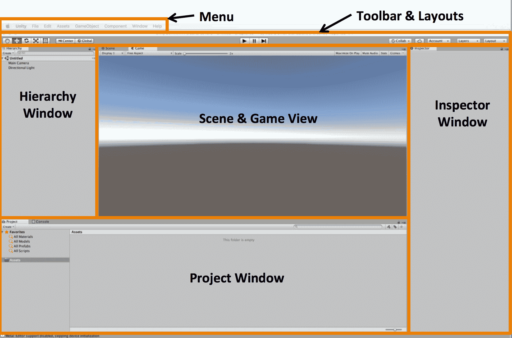

Unity 游戏引擎用户界面的概述。

在下一节中，我们将涵盖前一个截图所示的所有以下组件：

+   菜单

+   场景视图

+   游戏视图

+   项目窗口

+   层级窗口

+   检查器窗口

+   工具栏

+   布局

当这本书出版时，Unity 2017 是最新版本，因此截图反映了 Unity 2017 的界面。Unity 2018 处于测试版，因此本章中提供了信息框中的界面差异。

# 菜单

如图中所示，Unity 编辑器的主菜单栏包含八个下拉选项。在本节中，我们将简要回顾每个菜单选项。更多细节将在后续章节中提供，随着我们开始开发我们的*Cucumber Beetle*游戏：

Unity 的菜单是上下文相关的。这意味着只有与当前选中对象相关的菜单项才会被启用。其他不适用的菜单项将显示为灰色而不是黑色，并且不可选择。

从 Unity 2018 开始，还有一个额外的顶部菜单是 Mobile Input。此菜单项允许您切换移动输入的开启和关闭。

# Unity

如此显示的 Unity 菜单项为我们提供了访问 Unity 信息、我们的软件许可、显示选项、模块信息和访问预设的功能：

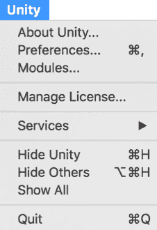

选择 Unity | 关于 Unity... 菜单选项可以访问您正在运行的引擎版本。还有其他信息，但您可能只会使用此菜单选项来检查您的 Unity 版本。

Unity | Preferences... 选项会弹出 Unity 预设对话框窗口。该界面有七个侧标签：常规、外部工具、颜色、按键、GI 缓存、2D 和缓存服务器。随着您在 Unity 中经验的积累，我们鼓励您熟悉它们。我们将在第十三章 优化我们的游戏以部署中使用外部工具标签。

Unity | 模块 选项为您提供正在运行的播放引擎列表以及任何 Unity 扩展。

您可以通过选择 Unity | 退出 菜单选项来退出 Unity 游戏引擎。

在 Unity 2018 中，Unity 菜单项不存在。该功能将移至帮助菜单。

# 文件

Unity 的文件菜单包括访问您的游戏场景和项目。我们将在整个游戏开发过程中使用这些功能。如您在以下屏幕截图中所见，我们还可以访问构建设置...。我们将在第十三章 优化我们的游戏以部署中探讨此功能。

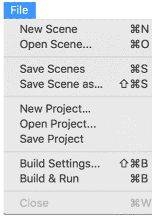

# 编辑

Edit 菜单具有与标准编辑器类似的功能，而不仅仅是游戏引擎。例如，标准的剪切、复制、粘贴、删除、撤销和重做选项都在那里。此外，快捷键与软件行业标准一致。

如您从以下屏幕截图中所见，这里还有额外的功能可供访问。这里有播放、暂停和单步执行命令。我们还可以登录和注销我们的 Unity 账户：

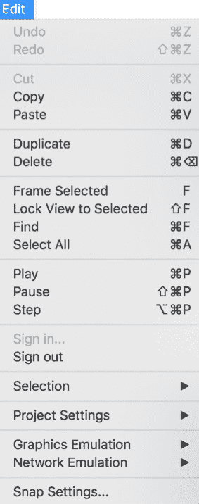

Edit | Project Settings 选项为我们提供了访问输入、标签和图层、音频、时间、播放器、物理、2D 物理、质量、图形、网络、编辑器和脚本执行顺序的功能。在大多数情况下，选择这些选项之一将打开或聚焦键盘控制到特定的功能。

# 资产

我们将在本书中广泛使用 Assets 菜单功能，从第四章 创建我们的地形 开始。资产是我们可以在游戏中使用的事物的表示。例如，包括音频文件、艺术文件和 3D 模型。Unity 中可以使用几种类型的资产。正如您可以从以下屏幕截图中看到的那样，我们能够创建、导入和导出资产：

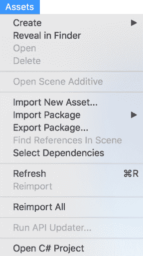

随着您通过本书并开始开发您的游戏，您将越来越熟悉这一系列功能。

# GameObject

GameObject 菜单为我们提供了创建和操作 GameObject 的能力。在 Unity 中，GameObject 是我们在游戏中使用的事物，例如灯光、摄像机、3D 对象、树木、角色、汽车等等。正如您所看到的，我们可以创建一个空的 GameObject，以及一个空的子 GameObject：

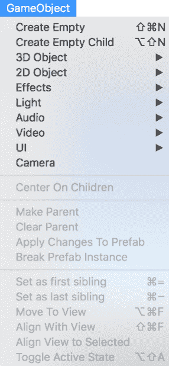

在本书中，我们将全面地使用 GameObject 菜单项。在此阶段，重要的是要知道这是您创建 GameObject 以及对它们进行一些操作的地方。

# 组件

在上一节中，我们提到 GameObject 只是 *事物*。实际上，只有当我们向它们添加组件时，它们才变得有意义。组件是 Unity 中的一个重要概念，随着我们游戏开发的进展，我们将大量使用它们。组件为我们的 GameObject 实现了功能。

以下屏幕截图显示了各种组件类别。这是在 Unity 中创建组件的一种方法：

# 窗口

窗口菜单选项提供了访问许多额外功能的方法。正如您所看到的，这里有一个最小化选项，可以将主 Unity 编辑器窗口最小化。缩放选项切换全屏和缩放视图：

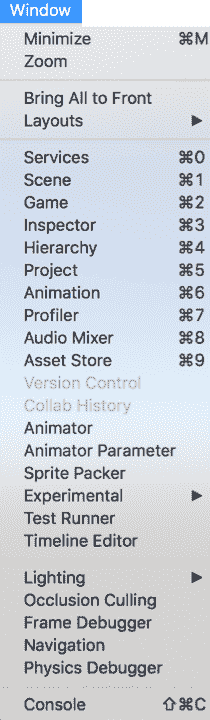

布局选项提供了访问各种编辑器布局、保存或删除布局的功能。布局将在本章后面更深入地介绍。

以下表格提供了通过窗口菜单项可用的剩余选项的简要描述。随着您通过本书的进展，您将获得这些窗口的实践经验：

| **窗口选项** | **描述** |
| --- | --- |
| 服务 | 访问集成服务：广告、分析、云构建、协作、性能报告、应用内购买和多玩家。 |
| 场景 | 将焦点集中在场景视图中。如果尚未打开，则打开窗口。更多详细信息将在本章后面提供。 |
| 游戏 | 将焦点集中在游戏视图中。如果尚未打开，则打开窗口。更多详细信息将在本章后面提供。 |
| 检查器 | 将焦点集中在检查器窗口上。如果尚未打开，则打开窗口。更多详细信息将在本章后面提供。 |
| 层级 | 将焦点置于层级窗口。如果窗口尚未打开，则打开它。本章后面将提供更多详细信息。 |
| 项目 | 将焦点置于项目窗口。如果窗口尚未打开，则打开它。本章后面将提供更多详细信息。 |
| 动画 | 将焦点置于动画窗口。如果窗口尚未打开，则打开它。在第七章 实现我们的玩家角色 中提供了更多详细信息。 |
| 性能分析器 | 将焦点置于性能分析器窗口。如果窗口尚未打开，则打开它。在第十三章 优化我们的游戏以部署 中提供了更多详细信息。 |
| 音频混音器 | 将焦点置于音频混音器窗口。如果窗口尚未打开，则打开它。 |
| 资产商店 | 将焦点置于资产商店窗口。如果窗口尚未打开，则打开它。 |
| 版本控制 | Unity 为大多数流行的版本控制系统提供功能。 |
| 协作历史 | 如果您使用的是集成协作工具，您可以通过此处访问您项目更改的历史记录。 |
| 动画师 | 将焦点置于动画师窗口。如果窗口尚未打开，则打开它。 |
| 动画师参数 | 将焦点置于动画师参数窗口。如果窗口尚未打开，则打开它。 |
| 精灵打包器 | 将焦点置于精灵打包器窗口。如果窗口尚未打开，则打开它。为了使用此功能，您需要在项目设置中启用旧版精灵打包。 |
| 实验 | 将焦点置于实验窗口。如果窗口尚未打开，则打开它。默认情况下，Look Dev 实验功能可用。更多实验功能可以在 Unity 资产商店中找到。 |
| 测试运行器 | 将焦点置于实验窗口。如果窗口尚未打开，则打开它。这是一个在编辑和播放模式下对您的代码进行测试的工具。也可以测试构建。 |
| 时间轴编辑器 | 将焦点置于时间轴编辑器窗口。如果窗口尚未打开，则打开它。这是一个上下文菜单项。 |
| 灯光 | 访问灯光窗口和灯光资源管理器窗口。灯光将在第五章 灯光、相机和阴影 中介绍。 |
| 次要渲染 | 此功能允许您选择和编辑对象的绘制方式。使用遮挡剔除，只有当前相机可视范围内的对象，且未被其他对象遮挡的对象，才会被渲染。 |
| 帧调试器 | 此功能允许您逐帧遍历游戏，以便您可以看到给定帧上的绘制调用。  |
| 导航 | Unity 的导航系统使我们能够实现与 NPC（非玩家角色）移动相关的人工智能。我们将在第八章 实现我们的非玩家角色 中介绍这个概念。 |
| 物理调试器 | 将焦点置于物理调试器窗口。如果窗口未打开，则打开窗口。在此，我们可以切换几个与物理相关的组件，以帮助调试游戏中的物理问题。 |
| 控制台 | 将焦点置于控制台窗口。如果窗口未打开，则打开窗口。控制台窗口显示警告和错误。在游戏过程中，您也可以在此处输出数据，这是一种常见的内部测试方法。 |

一些窗口将以标签的形式打开。您可以拖放窗口使其成为标签。您还可以将标签拖放到空白区域以使其成为自己的窗口。

# 帮助

如以下截图所示，您可以通过帮助菜单选择访问 Unity 的文档和脚本手册：

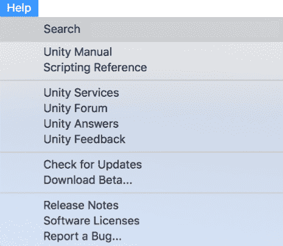

通过帮助菜单提供的附加功能如下：

| **帮助内容** | **描述** |
| --- | --- |
| Unity 服务 | 此菜单选项将带您访问一个 Unity 页面，该页面作为获取集成 Unity 服务信息的入口。 |
| Unity 论坛 | 此菜单选项将带您访问 Unity 论坛网站，该网站包含多个不同的 Unity 论坛，并具有搜索功能。 |
| Unity 问答 | 此菜单选项将带您访问 Unity 问答网页。在这里，您可以就 Unity 开发提出新问题，并搜索以前的问题和答案。 |
| Unity 反馈 | 搜索以前的反馈或直接向 Unity 输入您的反馈。 |
| 检查更新 | 这有助于确保您拥有 Unity 游戏引擎的最新版本。 |
| 下载 Beta... | 这将带您访问 Unity 测试计划的网页。 |
| 发布说明 | 这是一个快速链接到 Unity 当前版本发布说明的网页。 |
| 软件许可 | 这提供了 Unity 使用的软件组件的法律信息。 |
| 报告一个 Bug... | 这将打开 Unity 错误报告器，允许您输入错误报告。 |

Unity 2018 中的附加帮助菜单选项将包括：

+   关于 Unity

+   管理许可

+   重置包到默认设置

+   故障排除

# 场景视图

参考本章的第一张截图，场景视图通常位于 Unity 编辑器的中央，可能位于游戏视图标签旁边。

场景视图是您将在其中花费大部分时间来制作游戏的地方。您将在这里构建和操作游戏关卡。您在此视图中执行的一些操作包括添加和修改游戏角色、灯光、摄像机以及与您的游戏相关的其他对象。

如以下截图所示，场景视图在界面的顶部有一组控件。这被称为控制栏：

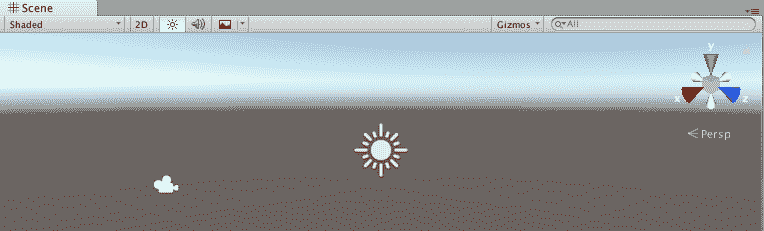

以下是对这些控件的总览：

| **图标** | **控制** | **描述** |
| --- | --- | --- |
| 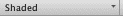 | 渲染模式 | 影响场景视图中事物外观的各种绘图选项。 |
| 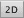 | 2D/3D | 这是一个在 2D 和 3D 视图之间的切换。  |
|  | 灯光 | 切换灯光的开启和关闭。 |
| 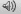 | 音频 | 切换音频的开启和关闭。 |
|  | 特效 | 此控制包含对 Skybox、雾、光晕、动画材质和图像效果的切换。 |
|  | 仪器 | 此控制提供了大量选项，用于显示某些对象的方式。 |
|  | 搜索 | 这个强大的搜索功能使你能够在场景视图中过滤对象。  |

# 游戏视图

游戏视图允许你在编辑器中工作时预览你的游戏。在这个视图中，你不会操作你的游戏，但可以预览它。

你还可以玩游戏。要启动游戏模式，你点击位于工具栏顶部中央的播放按钮：

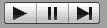

你可以在游戏模式下更改你的游戏。你在游戏模式下所做的任何更改都是临时的。一旦你退出游戏模式，这些更改将自动撤销。

如以下截图所示，游戏视图在界面的顶部有一组控制按钮。这被称为控制栏：

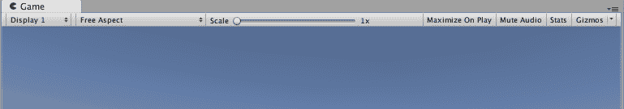

下表包括上述控制栏的每个组件。每个组件都提供了图像、控件名称和描述：

| **图标** | **控件** | **描述** |
| --- | --- | --- |
| 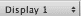 | 显示 | 如果你场景中有多个相机，你可以更改视图到特定的相机。 |

|  | 比例 | 可用的宽高比包括：

+   低分辨率宽高比

+   自由比例

+   5:4

+   4:3

+   3:2

+   16:10

+   16:9

+   独立（1024x768）

|

|  | 缩放滑块 | 此滑块允许你放大到特定区域以获得更详细的视图。  |
| --- | --- | --- |
| 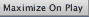 | 在播放时最大化 | 此控件是一个切换按钮，允许你在游戏模式下将游戏视图最大化到编辑器的全尺寸。 |
| 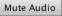 | 静音音频 | 此切换按钮允许你在游戏模式下静音游戏音频。 |
|  | 统计信息 | 此控件切换统计信息的叠加开启和关闭。  |
| 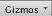 | 仪器 | 这个强大的搜索功能使你能够在游戏视图中过滤对象。  |

# 项目窗口

项目窗口是您将经常使用的窗口，并提供快速访问项目中的对象。如图所示，项目窗口在左侧以分层视图组织。选择左侧的文件夹将显示右侧面板中的内容。

该面板在顶部显示面包屑，并在右下角有一个滑块来控制图标的大小：

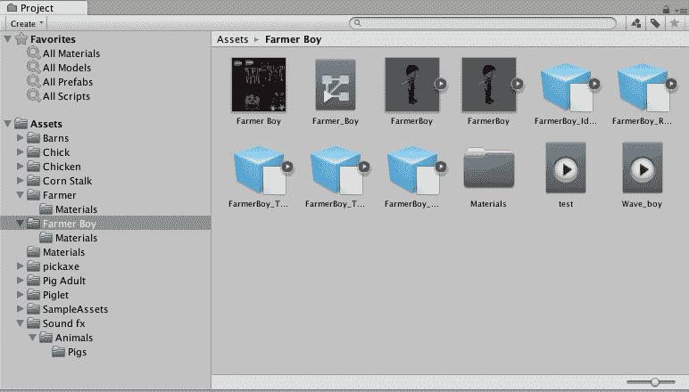

项目窗口右上角的创建下拉菜单为您提供快速访问在当前文件夹中创建游戏资源。

创建下拉菜单的右侧是一个搜索栏，后面跟着三个图标。前两个图标分别是按类型搜索和按标签搜索。第三个图标允许您保存搜索。

本节提供的项目窗口内容是代表性的，但不属于本书的游戏。

# 层级窗口

层级窗口列出了当前场景中的所有 GameObject。这与项目窗口中显示的内容不同，因为游戏项目包含一个或多个场景，并且项目中的不是每个对象都在场景中。如图所示，层级窗口中的一些项目左侧有一个三角形。单击三角形将展开内容，显示子对象。将 GameObject 相互关联或从属化是重要的，并且您将在开始向游戏添加 GameObject 时接触到这一点：

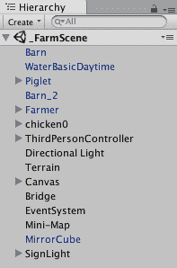

层级窗口右上角的创建下拉菜单为您提供快速访问创建游戏资源。

创建下拉菜单的右侧是一个搜索栏。在搜索栏下方和右侧是一个菜单图标。单击该图标将显示以下选项列表：

如上图菜单所示，它是上下文相关的，因此并非所有项目都会始终启用。

# 检查器窗口

检查器窗口是我们检查 GameObject 的地方。您会记得 GameObject 由多个组件组成，而这些组件是使 GameObject 在我们的游戏中变得有价值的原因。

此示例截图显示了一个具有 11 个组件的 ThirdPersonController GameObject。每个组件左侧的灰色三角形允许您展开组件并对该组件的属性进行任何所需的更改：

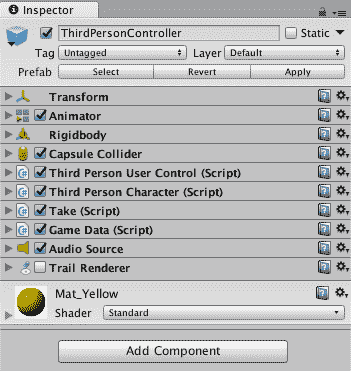

当您在场景视图中选择一个 GameObject、层级窗口或项目窗口时，检查器窗口将显示所选 GameObject 的组件和属性。每个组件都有不同的属性集。

在检查器窗口的底部，当选择了一个 GameObject 时，您将看到添加组件按钮。单击此按钮允许您向当前 GameObject 添加组件。

# 工具栏

这里所示的是 Unity 的工具栏，位于编辑器界面的顶部。它横跨窗口的整个宽度，间距取决于当前宽度。

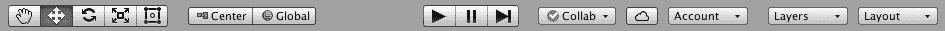

工具栏可以从理论上组织成以下类别：变换工具、 Gizmo 切换、播放按钮、云和账户按钮，以及图层和布局。我们在*游戏视图*部分介绍了播放按钮；其余的工具栏类别如下详细说明。

# 变换工具

变换工具是一组在场景视图中操纵 GameObject 的五个基本工具。每个工具都由一个图标表示：

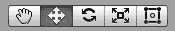

第一个按钮是手工具或视图工具。当选择此工具时，场景视图中的光标将变成一只手。这让我们知道我们处于哪种模式。使用此工具选择后，我们可以用鼠标滚动来放大和缩小场景。如果你点击左鼠标按钮，你能够绕场景移动。点击右鼠标按钮，你能够根据光标当前位置四处查看。

如果你在一个 PC 上按住 *Alt* 键或在 Mac 上按住 *Option* 键，然后点击左鼠标按钮，你可以围绕当前区域旋转。按下相同的键和右鼠标按钮允许你在场景中放大和缩小。

第二个按钮是平移工具，形状为一个四箭头。当选择一个对象时，点击平移工具；对象将有三个 Gizmo，每个轴一个。点击并拖动这些 Gizmo 中的任何一个将沿相应轴移动对象，如下面的截图所示：

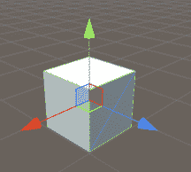

使用变换平移工具的立方体

第三个变换工具是旋转工具，看起来像两个旋转的箭头。这个工具允许我们沿任何轴（`x`、`y` 或 `z`）旋转对象。这个工具不是用线和箭头 Gizmo 实例化的，而是用三个彩色环表示，每个轴一个。点击一个环并拖动它将沿该轴旋转对象，如下面的截图所示：

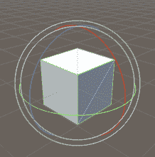

使用变换旋转工具的立方体

第四个变换工具是缩放工具，它由线和块形 Gizmo 表示。与其他变换工具一样，每个轴都有一个 Gizmo。点击并拖动这些 Gizmo 中的一个会增加或减少对象沿选定轴的尺寸。例如，你可以使立方体更宽、更窄、更高或更短。如果你想保持纵横比，你可以点击中心正方形而不是红色、蓝色或绿色的正方形。现在，当你点击并拖动时，你的对象将以完美的纵横比增长或缩小，如下面的截图所示：

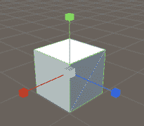

使用变换缩放工具的立方体

最后一个变换工具是矩形工具，它由一个带有交叉点的矩形表示。矩形工具可以用来在场景视图中移动、调整大小和旋转对象。因此，这是一个多功能工具，它还具有您可以直接使用检查器视图编辑的相应属性。请看以下截图：

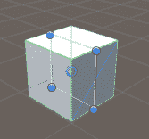

使用变换矩形工具的立方体

Unity 2018 将引入第六个变换工具，允许移动、旋转和缩放选定的对象。

# 工具切换

如此所示，工具栏上有两个工具切换，称为**变换工具切换**：

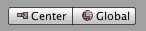

变换工具切换：中心与全局

第一个是中心与枢轴之间的切换。第二个切换是全局与局部之间的切换。

# 云和账户按钮

此类别中有三个按钮，如图所示：

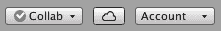

工具栏：Collab、云和动作按钮

第一个按钮是 Collab 或协作按钮。如果您使用的是集成协作工具，您可以在此处访问项目更改的历史记录。

第二个按钮是云按钮。这个按钮只是打开 Unity 服务窗口。

第三个按钮是账户按钮。这是一个下拉按钮，允许您访问您的 Unity 账户。

# 层和布局

工具栏上按钮的最后部分包括层下拉按钮和布局下拉按钮。这些按钮如图所示，位于工具栏的右端：

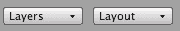

工具栏：层和布局下拉按钮

选择层下拉按钮允许您选择您想要查看、不查看和锁定哪些层。此外，如您所见，您有权编辑层：

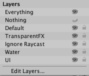

编辑层包括创建用户定义的层，您可以重新排序和重命名这些层。

布局下拉菜单显示了以下选项集：

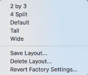

布局将在下一节中介绍。

# 布局

与 Unity 一起工作的美妙之处之一是您可以自定义用户界面的布局方式。您可以使用 2x3、4 分割、高或宽的预定义布局之一，或者您可以创建自己的布局。布局指的是 Unity 中各种视图在屏幕上的排列方式。

要更改布局，我们只需点击位于 Unity 界面右上角远端处的布局按钮。让我们逐一查看每个布局以了解其差异。

第一个布局是 2x3 布局。此布局提供了很好的排列，场景和游戏视图位于左侧，层次和项目视图位于中间，右侧是一个完整的检查器视图，如图所示：

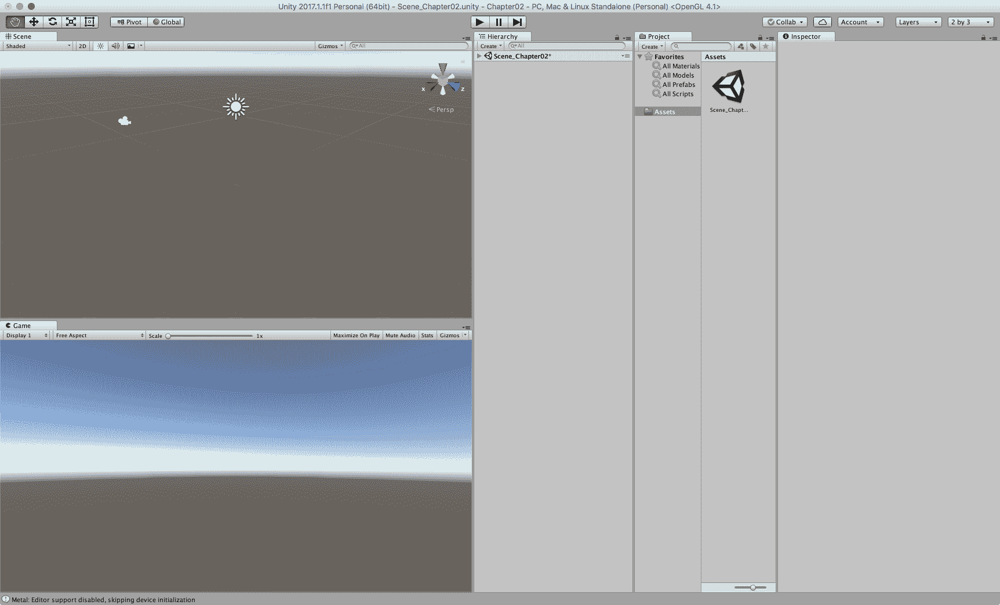

4 分割布局提供了对同一场景的四种不同视图，如下面的截图所示。这是检查您游戏中光照和着色实现的好方法。我们将在本书的后面部分讨论光照和着色。4 分割布局如下所示：

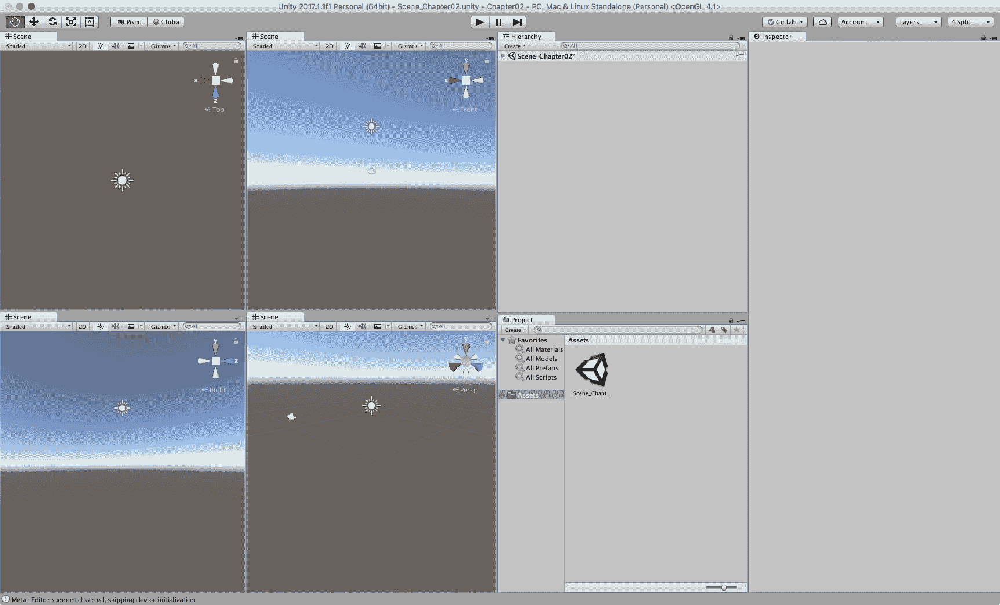

高布局提供了高但不是宽的视角来查看场景视图，其他视图位于右侧，如下面的截图所示：

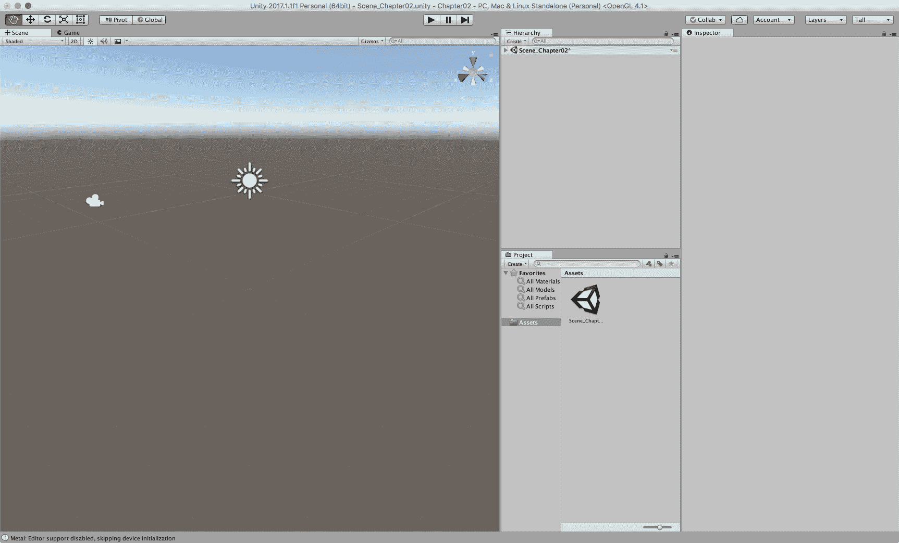

宽布局提供了场景视图的宽视角，其他视图位于底部和右侧，如下面的截图所示：

默认布局是宽布局的一种变体。区别在于，使用默认布局时，层次结构视图位于左侧，如下面的截图所示：

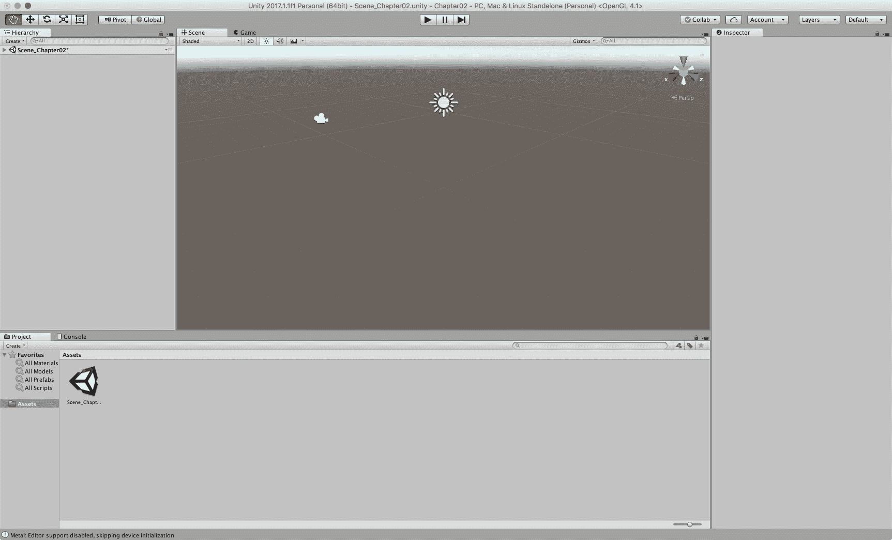

您可以在任何时候切换布局，而不会影响您的游戏。大多数 Unity 开发者不会只在一个布局下工作。不同的布局提供不同的好处，适用于不同的任务。您还可以通过拖动视图或窗口的任何边框来修改任何布局。如果您想保存布局，对当前布局进行任何更改，然后选择布局按钮并选择保存布局。您将被提示输入名称。

# 摘要

在本章中，我们检查了 Unity 用户界面的主要组件。这包括场景和游戏视图。我们还查看了项目、层次结构和检查器窗口。然后我们回顾了各种布局以及工具栏。最后，我们确定将在后续章节中介绍新的功能和工具时覆盖额外的界面组件。

在下一章中，我们将开始设计我们的*3D 黄瓜甲虫*游戏。这个设计将指导我们在本书的其余部分开发游戏。
