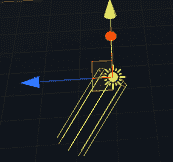
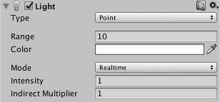
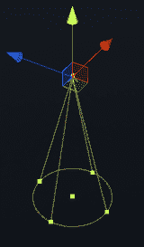
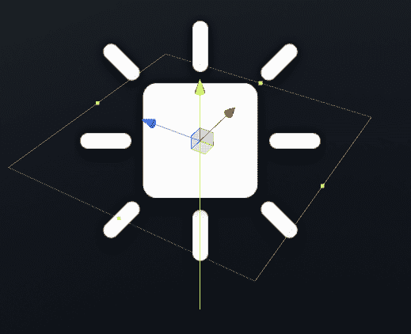
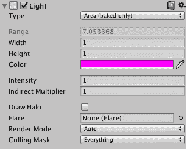
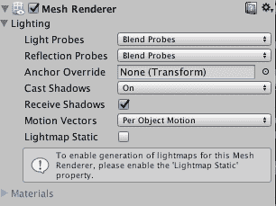

# 灯光、摄像机和阴影

在上一章中，我们创建了我们的游戏地形，并根据我们在第三章设计游戏中的设计草图对地形进行了自定义。我们使用了造型工具，绘制了地形，并添加了水。我们甚至从头开始创建了自己的树。此外，我们还创建了一个材质并导入了一个纹理文件。

在本章中，我们将探讨 Unity 中的摄像机和灯光。我们将从查看摄像机开始，包括透视、视锥体和 Skybox。接下来，我们将学习一些使用多个摄像机的用途，包括迷你地图。我们还将涵盖不同类型的灯光，探索反射探针，并以查看阴影结束。

具体来说，我们将涵盖以下概念：

+   与摄像机协同工作

+   使用多个摄像机

+   与灯光协同工作

+   实现反射探针

+   理解阴影

如果你想要使用本章中介绍的相同 Unity 项目，你可以从出版商的配套网站上下载`Starting-Chapter-05.zip`文件。下载文件后，解压缩它，然后在 Unity 中打开项目。它包含了前几章的完成工作。

# 与摄像机协同工作

摄像机渲染场景，以便用户可以查看。考虑一下这个陈述中隐藏的复杂性。我们的游戏是 3D 的，但玩我们游戏的人是在 2D 显示设备上查看的，如电视、计算机显示器或移动设备。幸运的是，Unity 使实现摄像机变得容易。

摄像机是 GameObject，可以使用场景视图和检查器面板中的变换工具进行编辑。每个场景至少必须有一个摄像机。实际上，当创建新场景时，Unity 会创建一个名为 Main Camera 的摄像机。正如你将在本章后面看到的那样，一个场景可以有多个摄像机。

在场景视图中，摄像机用白色摄像机轮廓表示，如下面的截图所示：

当我们在层次结构面板中点击主摄像机时，我们在场景视图中提供了一个摄像机预览。这让我们可以看到摄像机在游戏模式下的视图。我们将在第七章实现我们的玩家角色中更改这一点。我们还可以通过检查器面板访问几个参数。检查器面板中的摄像机组件如下所示：

让我们根据我们的*Cucumber Beetle*游戏来查看每个参数：

+   Clear Flags 参数允许你在 Skybox、纯色、深度只清除和不清除之间切换。这里的选项告诉 Unity 要清除屏幕的哪些部分。我们将保持此设置为 Skybox。你将在本章后面的内容中了解更多关于 Skybox 的信息。

+   背景参数用于设置游戏世界的默认背景填充（颜色）。此设置仅在所有游戏对象渲染完毕且没有天空盒的情况下可见。我们的*Cucumber Beetle*游戏将包含天空盒，因此此参数可以保留默认颜色。

+   剪裁遮罩参数允许您选择和取消选择相机要渲染的层。默认选择选项包括无、所有、默认、透明 FX、忽略射线投射、水和其他 UI。对于我们的游戏，我们将选择所有。如果您不确定游戏对象关联的层，请选择它，并在检查器面板顶部的层参数中查看。在那里您将看到分配的层。您可以轻松更改层以及创建自己的独特层。这为您提供了有限的渲染控制。

+   投影参数允许您选择相机所需的投影类型，是透视还是正交。我们将在本章后面讨论这两种投影。当选择透视投影时，我们将获得访问视场参数的权限。这是指相机视场角度的宽度。值范围是 1-179°。您可以使用滑块更改值，并在相机预览窗口中查看结果。当选择正交投影时，将可用一个额外的尺寸参数。这指的是视口大小。对于我们的游戏，我们将选择透视投影，并将视场设置为`60`。

+   剪裁平面参数包括近剪裁和远剪裁。这些设置确定了相对于相机，渲染将发生的最近和最远点。目前，我们将保留近剪裁参数的默认值`0.3`和远剪裁参数的默认值`1000`。

+   视口矩形参数有四个组件——X、Y、W 和 H——它们确定相机将在屏幕上的哪个位置绘制。正如您所期望的，X 和 Y 组件指的是水平和垂直位置，而 W 和 H 组件指的是宽度和高度。您可以尝试这些值，并在相机预览中查看变化。对于我们的游戏，我们将保留默认设置。

+   深度参数在实现多个相机时使用。我们可以在此设置一个值以确定相机相对于其他相机的优先级。较大的值表示更高的优先级。对于我们的游戏，默认设置是足够的。

+   渲染路径参数定义了我们的相机将使用哪些渲染方法。选项包括使用图形设置、前向渲染、延迟渲染、旧版顶点着色和旧版延迟（光预渲染）。我们将为我们的游戏使用使用图形设置选项，这也使用了默认设置。

+   目标纹理参数在我们的游戏中不会使用。当设置渲染纹理时，相机无法将渲染输出到屏幕。

+   消隐裁剪参数是一个强大的设置。如果启用，Unity 将不会渲染被遮挡或未被相机看到的对象。一个例子是建筑物内的对象。如果相机目前只能看到建筑物的外部墙壁，那么那些墙壁内的所有对象都不可见。因此，不渲染这些对象是有意义的。我们只想渲染绝对必要的对象，以确保我们的游戏有流畅的游戏体验和没有延迟。我们将保持这个设置为启用，用于我们的游戏。

+   允许 HDR 参数是一个复选框，用于切换相机的**高动态范围**（**HDR**）渲染。我们将保持游戏的默认设置为启用。

+   允许 MSAA 参数是一个切换，用于确定我们的相机是否将使用**多采样抗锯齿**（**MSAA**）渲染目标。MSAA 是一种计算机图形优化技术，我们希望为我们的游戏启用它。

# 理解相机投影

Unity 中使用了两种相机投影：透视和正交。使用透视投影，相机根据场景中的相机角度渲染场景。使用这种投影，离相机越远，对象显示得越小。这模仿了我们现实世界中看到事物的样子。由于制作逼真游戏或近似现实世界的游戏的愿望，透视投影在现代游戏中是最常用的。它也是我们将在我们的*Cucumber Beetle*游戏中使用的投影。

另一种投影是正交投影。正交透视相机以均匀的方式渲染场景，没有任何透视。这意味着远离相机的对象不会比靠近相机的对象显示得更小。这种类型的相机通常用于俯视游戏，并且在 2D 和 Unity 的 UI 系统中是默认使用的相机投影。

我们将为我们的*Cucumber Beetle*游戏使用透视投影。

# 定位你的视锥体

当在层次视图中选择相机时，其视锥体在场景视图中可见。视锥体是一种几何形状，看起来像被切掉顶部的金字塔，如图所示：

近平面或顶部平面与其底部平行。底部也被称为远平面。视锥体的形状代表了你游戏的可视区域。只有该区域内的对象会被渲染。使用场景视图中的相机对象，我们可以改变我们相机的视锥体形状。

# 创建天空盒

当我们创建游戏世界时，我们通常会创建地面、建筑物、角色、树木和其他游戏对象。那么天空呢？默认情况下，你的 Unity 游戏项目中将有一个纹理化的蓝色天空。那个天空对于测试来说是足够的，但不会增加沉浸式游戏体验。我们想要更多的现实感，比如云彩，这可以通过创建天空盒来实现。

Skybox 是一个六面立方体，玩家可以看到它，而其他所有对象都看不到。因此，当玩家看向您的对象之外时，他们看到的是您的 Skybox。正如我们所说的，Skyboxes 是六面立方体，这意味着您将需要六个单独的图像，这些图像基本上可以相互夹紧以形成立方体。

以下截图显示了 Unity 项目开始时的**默认 Skybox**以及您将在本节中创建的**自定义 Skybox**：

为了跟随，您将需要位于出版商配套网站上的`Chapter5-Skybox.zip`文件中的六个图像。

执行以下步骤以创建 Skybox：

1.  在项目面板中，在`Assets`文件夹中创建一个`Skybox`子文件夹。我们将使用此文件夹来存储我们的 Skybox 纹理和材质。

1.  将提供的六个 Skybox 图像或您自己的图像拖放到新的`Skybox`文件夹中。

1.  确保在`Project`面板中选择了`Skybox`文件夹。

1.  从顶部菜单中选择 Assets | Create | Material。在项目面板中，将材质命名为`Skybox`。

1.  在选择 Skybox 材质后，将注意力转向检查器面板。

1.  选择着色器下拉菜单，然后选择 SkyBox | 6 Sided。

1.  使用每个图像的“选择”按钮，导航到步骤 2 中添加的图像。务必将适当的纹理匹配到相应的立方面。例如，`SkyBox_Front`纹理与 Skybox 材料的`Front[+Z]`立方面相匹配。

1.  为了将我们的新 Skybox 分配到场景中，从顶部菜单中选择 Window | Lighting | Settings。这将打开照明设置对话框窗口。

1.  在照明设置对话框窗口中，单击 Skybox 材质输入字段右侧的小圆圈。然后，关闭选择窗口和照明窗口。参见图表：

现在，您将在场景视图中看到您的 Skybox。当您在层次结构面板中单击相机时，您也将看到从相机视角看到的 Skybox。

请务必保存您的场景和项目。

# 使用多个相机

我们的 Unity 游戏必须至少有一个相机，但我们并不局限于只使用一个。正如您将在第七章中看到的，*实现我们的玩家角色*，我们将把我们的主相机或主要相机连接到我们的玩家角色上。这将意味着相机将跟随角色在游戏环境中移动。这将成为我们角色的眼睛。我们将通过角色的视角玩游戏。

第二个摄像头的常见用途是在游戏显示顶部的窗口中创建一个迷你地图。这些迷你地图可以设置为可切换的或永久/固定的显示组件。实现方式可能包括战争迷雾显示、显示敌人的雷达，或用于定位的全局俯视图。你受到的限制仅限于你的想象力。在第九章，*添加抬头显示*中，我们将创建一个迷你地图，作为一个雷达，显示甲虫相对于黄瓜人的当前位置。

多个摄像头的另一个用途是给玩家提供在第三人称和第一人称视角之间切换的能力。你会记得从第一章，*下载和安装 Unity*中，第一人称视角将玩家的手臂放入视野，而在第三人称视角中，玩家的整个身体都是可见的。我们可以使用两个摄像头在适当的位置来支持从任一摄像头观看。在游戏中，你可能会将其设置为切换——比如使用*C*键盘键——从一台摄像头切换到另一台。根据游戏中的情况，玩家可能会享受这种能力。

一些单人游戏具有多个可玩角色。给玩家切换这些角色的能力，使他们能够更好地控制游戏策略。为了实现这一点，我们需要为每个可玩角色安装摄像头，并给玩家切换角色的能力。我们会通过脚本来实现。这是多角色的高级实现方式。

多个摄像头的另一个用途是在游戏中添加特殊视角。这些特殊视角可能包括通过门上的猫眼观察，通过高楼顶部的双筒望远镜观察，甚至通过潜望镜观察。我们可以将摄像头附着在物体上，并改变它们的观看参数，以在我们的游戏中创建独特的摄像头使用方式。我们受到的限制仅限于我们自己的游戏设计和想象力。

我们还可以将摄像头用作摄像头。没错！我们可以使用摄像头游戏对象来模拟实际游戏中的摄像头。一个例子是在越狱游戏中实现安全摄像头。

# 与照明工作

在前面的章节中，我们探讨了 Unity 游戏中使用摄像头的作用。就像在现实世界中一样，摄像头需要灯光来显示物体。在 Unity 游戏中，我们使用多个灯光来照亮游戏环境。

在 Unity 中，我们既有动态照明技术，也有光照烘焙选项，以获得更好的性能。我们可以在场景中添加多个光源，并选择性地启用或禁用对象投射或接收阴影的能力。这种具体性为我们提供了巨大的机会来创建逼真的游戏场景。

Unity 能够如此真实地渲染光线和阴影的秘密可能在于 Unity 对光线和阴影的实际行为进行了建模。实时全局光照使我们能够在每个场景中实例化多个光源，每个光源都有能力直接或间接影响场景中光线源范围内的物体。

间接光照指的是光线从物体上弹跳并反射到其他物体上。

我们还可以在我们的游戏场景中添加和操作环境光。这通常是通过 Skyboxes、三色渐变或甚至单色来实现的。在 Unity 中，每个新的场景都有默认的环境光照，我们可以通过编辑光照窗口中的值来控制它。在那个窗口中，你可以访问以下设置：

+   环境

+   实时光照

+   混合光照

+   光照贴图设置

+   其他设置

+   调试设置

目前我们的游戏不需要对这些设置进行更改。我们已经将环境光照设置到了 Skybox 中。在第十二章“为我们的游戏添加音频和视觉效果”中，我们将探讨雾气，这是在光照窗口的其他设置部分中可用的。

当我们在 Unity 中创建场景时，我们有三种光照选项。我们可以使用实时动态光照，使用烘焙光照方法，或者使用两者的混合。与实时动态光照相比，烘焙光照在性能上表现更佳，所以如果性能是考虑因素，尝试使用烘焙光照会更好。

除了环境光照外，还有四种类型的光：方向性、点光源、聚光灯和区域光。我们将在以下章节中探讨每种类型。

# 方向性光照

当我们在 Unity 中创建一个新的场景时，会自动为我们创建一个方向性光源。这强调了方向性光源的重要性。这种类型的光源在特定方向上提供照明。使用变换工具，我们可以完全控制这些光源的方向。

方向性光照的一个例子是在场景中生成阳光。尽管方向性光源的光线与阳光相似，但并没有实际类似太阳的光源物体。如图所示，当选择方向性光源时，黄色光线指示其照明的方向：

使用方向性光照的一个优点是光照强度不依赖于物体与方向性光源对象的距离。这种类型的光照定义了光线的方向，距离对光照没有影响。

选择方向光后，您可以在检查器面板中访问几个参数。除了变换部分外，还有一个灯光部分，您可以在其中更改几个设置，包括灯光颜色和强度。其余参数值得探索，并且不需要更改以完成我们的游戏。

要添加额外的方向光，您可以从顶部菜单中选择 GameObject | Light | Directional Light。

对于*Cucumber Beetle*游戏，我们将保持默认的方向光。您可以使用变换工具修改位置、旋转和光方向。

# 点光源照明

点光源的名字来源于它们是从一个特定点发出的光源。如图所示，这些灯光对象向所有方向发射光线：

这些灯光通常用于模拟火球或灯泡。它们也可以用来模拟一些魔法或特殊灯光效果。正如您可以从以下屏幕截图中所见，点光源有几个属性会影响它们对游戏环境的影响：

范围是指光源中心到光线外侧弧的距离。我们还可以更改颜色和强度以产生我们想要的结果。

要创建点光源，我们从顶部菜单中选择 GameObject | Light | Directional Light。

# 聚光灯照明

聚光灯是 Unity 中另一种类型的灯光。它们旨在为特定区域提供照明。常见的例子包括手电筒和车辆车头灯。正如您可以从以下屏幕截图中所见，光线从光源以向外锥形形状发出：

在检查器面板中，我们可以更改范围、聚光角度、颜色和强度。在这个上下文中，范围指的是光源与锥形最远点之间的距离。聚光角度是锥形外边缘的角度。聚光角度范围是 1-179°。数值越大，锥形面就越大。

要创建聚光灯，我们从顶部菜单中选择 GameObject | Light | Spot Light。

# 区域照明

要使用区域灯光，我们使用变换工具或检查器面板定义一个矩形。区域灯光从其矩形的侧面发射光线。以下屏幕截图显示了在 Unity 编辑器中区域灯光对象的外观：

区域灯光与其他类型的灯光不同，因为它们只能烘焙。这意味着在游戏过程中不会进行实时渲染。这样做的原因是在游戏开始之前完成所有关于区域灯光的处理。如果在游戏中实时完成这些处理，很可能会产生足够的延迟。

正如您可以从以下屏幕截图中所见，类型设置为区域（仅烘焙）且无法更改：

当烘焙光照可以接受且你希望使用软件阴影时，可以使用面光源代替点光源。

要创建面光源，我们从顶部菜单中选择 GameObject | Light | Area Light。

# 实现反射探针

反射探针捕捉其周围环境的 360°球形视图。在这方面，它有点像相机。捕获的图像被附近具有反射材料的物体使用。

要创建反射探针，我们从顶部菜单中选择 GameObject | Light | Reflection Probe。

如以下截图所示，你可以看到反射探针是一个球体，并捕捉了其周围环境的视图。当物体放置在反射探针附近时，反射将出现在物体上：

如下所示的检查器面板中的反射探针审查，揭示了我们可以更改的几个设置，以影响探针的工作方式和它对我们游戏环境的影响：

以下属性列表突出了你可能在创建的 Unity 游戏中最有可能更改的属性：

+   类型：你可以选择烘焙、自定义或实时。记住，如果我们尽可能烘焙光照，我们可以提高游戏性能。

+   重要性：当区域中有多个渲染探针时，你可以设置每个探针的重要性。值越高，重要性越大。

+   强度：最低值是零。你可以尝试改变此设置的结果。

+   分辨率：你可以选择 16、32、64、128、256、512、1024 或 2048 作为捕获图像反射的分辨率。

# 理解阴影

如本章前面所述，我们的游戏场景可以有多个光源，我们可以启用或禁用对象投射或接收阴影的能力。在现实世界中我们有阴影，对于我们的 Unity 游戏来说，考虑哪些物体投射阴影以及哪些物体接收阴影是很重要的。

以下截图显示了检查器面板中对象的网格渲染器组件。让我们回顾一下此组件的关键设置：

+   光探针：可以设置为混合探针、使用代理体积或关闭。对于简单的 Unity 游戏，你很可能会使用默认的混合探针。

+   反射探针：此设置可以关闭或设置为混合探针、混合探针和天空盒或简单。

+   投影阴影：此设置可以设置为开启、关闭、双面或仅阴影。默认是开启，所以你应该为所有不需要投射阴影的对象禁用此设置。

+   接收阴影：此设置是一个切换，告诉 Unity 是否希望该对象接收阴影。正如你所期望的，这需要额外的处理来在游戏期间显示。因此，如果你不需要对象接收阴影，取消选择此选项以获得更好的性能。

# 摘要

在本章中，我们探讨了摄像机和照明。我们从观察包括透视、视锥体和 Skyboxes 在内的摄像机开始。接下来，我们学习了 Unity 游戏中多个摄像机的可能用途。我们还涵盖了不同类型的照明，探讨了反射探针，并以观察阴影结束。

在下一章中，我们将使用 Unity 的内置工具集创建 3D 对象。我们还将导入几个对象到我们的游戏中，以完成我们的游戏环境，包括我们在第四章中制作的树，*创建我们的地形*。
