# 为我们的游戏创建和导入 3D 对象

在上一章中，我们探讨了摄像机和照明。我们首先查看摄像机，以及透视、视锥体和天空盒的概念。接下来，我们学习了 Unity 游戏中多个摄像机的可能用途。我们还介绍了不同类型的照明，探讨了反射探针，并以阴影的查看作为结束。

我们已经准备好开始制作我们的游戏环境，使其更加健壮。我们将通过向场景中添加树木和其他对象来实现这一点。在本章中，我们将使用 Unity 的原生建模工具创建 3D 对象。我们还将从两个来源导入和使用资产。我们的第一个来源将是 Unity 资产商店，我们将从中下载免费使用的游戏资产。我们还将导入为我们的*Cucumber Beetle*游戏专门准备的 3D 资产。随着我们获取资产，我们将它们整合到游戏项目中，并观察我们的游戏开始成形。

本章我们将涵盖以下概念：

+   理解资产和 GameObject

+   在 Unity 中创建 3D 对象

+   使用 Unity 资产商店

+   在我们的游戏中整合自定义资产

+   使用导入的资产

如果您想使用本章中介绍的相同 Unity 项目，您可以从出版商的配套网站上下载`Starting-Chapter-06.zip`文件。下载文件后，解压缩它，然后在 Unity 中打开项目。它包含前几章的完成工作。

# 理解资产和 GameObject

资产被定义为有用的或有价值的东西。在 Unity 中，资产是您将与 GameObject 一起在游戏中使用的东西。我们将在本节后面讨论 GameObject。根据其来源，资产分为三类：Unity、用户创建和第三方。Unity 游戏引擎附带免费资产并提供一个付费（非免费）资产的库。用户创建的资产是您自己创建的。我们将在本章后面创建自己的资产。最后一种资产类型是第三方，这意味着它是由您或 Unity 之外的人创建的。

当我们选择“资产”下拉菜单，如图所示，我们有几个可供选择。在本章中，您将熟悉创建、导入新资产和导入包选项：

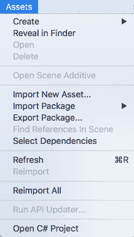

无论资产来源是 Unity、用户创建还是第三方，资产都可以有多种类型。如图所示，这些资产类型包括脚本、场景、预制体、材质、动画等等：

# 资产包

资产包是将资产分组在一起的集合。我们可以创建包与他人共享我们的资产，或者为在另一款游戏或 Unity 应用程序中使用而保存它们。我们甚至可以创建在 Unity 资产商店中出售的资产包。

要创建一个`asset`包，您只需使用项目面板选择包中所有想要的资源。然后您有两个选项。第一个选项是右键单击并选择导出包。第二个选项是从顶部菜单选择资产 | 导出包。两种选项都会产生相同的结果。

除了可以从 Unity 导出包外，我们还可以将`asset`包导入到我们的 Unity 游戏中。要导入一个`asset`包，我们只需选择资产 | 导入包菜单选项。这会显示以下截图中的选项：

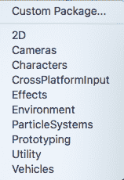

当导入`asset`包时，我们可以从列出的标准资产包中选择一个：2D、相机、角色、跨平台输入、效果、环境、粒子系统、原型设计、实用工具和车辆。我们还可以从计算机文件系统中导入自定义包。

当选择一个包时，Unity 将解压缩该包，然后向您显示包内容。我们将在本章后面执行此操作。

# 理解 GameObject

GameObjects 是我们游戏中使用的东西，例如 2D 对象、3D 对象、音频、相机、灯光、用户界面和视觉效果。GameObject 具有属性，这些属性根据其类型和组件而异。组件可以包括脚本、动画等。随着我们继续制作游戏，您将了解很多关于 GameObject 及其如何与之协同工作的内容。

GameObject 由组件组成。正如您可以在以下检查器面板截图中所见，我们游戏的主相机有四个组件：变换、相机、GUI 层、闪光层和音频监听器：

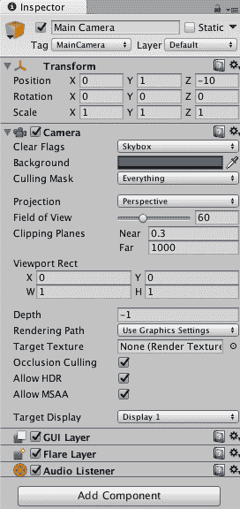

在检查器面板底部是添加组件按钮。该按钮通过以下类别为我们提供了访问 Unity 组件的权限：

+   网格

+   效果

+   物理

+   二维物理

+   导航

+   音频

+   视频

+   渲染

+   布局

+   可播放对象

+   AR

+   杂项

+   分析学

+   脚本

+   事件

+   网络

+   用户界面

+   新脚本

# 在 Unity 中创建 3D 对象

如前所述，GameObject 可以包括具有属性和组件的 3D 对象。在本节中，我们将创建一个 3D 对象来表示血滴，这样我们就可以在黄瓜人战斗黄瓜甲虫时使用它。在我们创建对象之前，让我们创建一个材质，以便我们的血滴可以呈现逼真的红色。按照以下步骤创建材质：

1.  在项目面板中，点击材质，然后在文件夹中右键单击并选择创建 | 材质

1.  将新材质命名为红色

1.  在选择新材质后，点击检查器面板主图部分中的颜色框

1.  在弹出的颜色选择器窗口中，选择红色并关闭选择框

您的新材质，在检查器面板中查看时，应类似于以下截图：

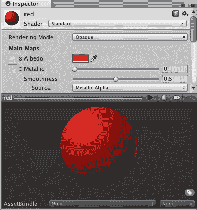

接下来，让我们创建球体：

1.  从顶部菜单中选择 GameObject | 3D Object | Sphere。

1.  使用变换工具定位新球体，以便在场景视图中可以看到它。

1.  使用检查器面板的变换部分，将 X、Y 和 Z 缩放参数的缩放增加到 5，这将有助于使球体更大，更容易操作。

1.  接下来，我们将红色材质分配给球体。在层次结构面板中选择球体，并在项目面板中选择`Materials`文件夹，将红色材质从`Materials`文件夹拖动到检查器面板 Mesh Renderer 组件的 Materials | Element 0 参数。

现在，你将看到场景视图中的球体变成了红色。

如果我们打算使用这个球体来模拟血液滴落，我们可能需要几十个这样的球体。我们将在下一节中探讨我们的选项。

# 使用预制件

在上一节中，你创建了一个球体来模拟血液滴落。你还创建了一个红色材质并将其应用到球体上。在游戏中，我们可能想要模拟一场大战，并让多个血液滴落同时可见。在 Unity 中，我们可以根据需要制作我们主球体的任意多个副本。例如，假设我们有 100 个球体，它们都是从我们的主球体复制的。当我们想要修改它们，比如改变大小或材质时，这将是一项费力的任务。

另一个选择是使用预制件。在 Unity 中，预制件是一种资产类型，它作为 GameObject 的壳，并包含属性和组件。我们创建的球体是一个 GameObject，正如你在下面的截图中所看到的，我们的球体有多个组件和属性：

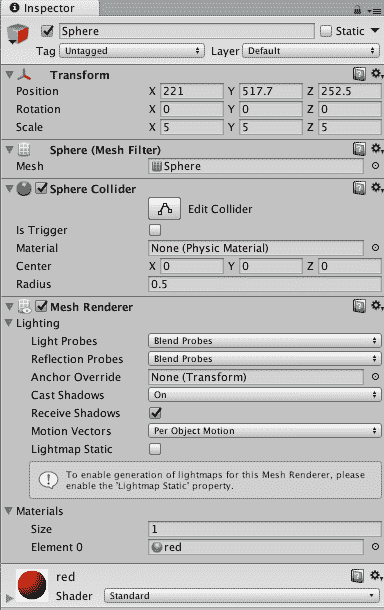

因此，让我们创建一个预制件来存放我们的球体。按照以下步骤操作：

1.  在项目面板中，选择`Prefabs`文件夹。

1.  右键单击`Prefabs`文件夹，然后选择 Create | Prefab。或者，你也可以从顶部菜单中选择 Assets | Create | Prefab。

1.  将预制件命名为`bloodDroplet`。你将注意到，在检查器面板中对于新预制件没有可见的组件或属性。

1.  接下来，将层次结构面板中的`Sphere`游戏对象拖动到项目面板中的新`bloodDroplet`预制件上。现在，当你查看检查器面板中的预制件时，你可以看到我们的球体所拥有的组件和属性。

1.  我们不再需要原始的球体，所以在层次结构面板中将其删除。

现在我们有了`bloodDroplet`预制件，我们可以根据需要将其拖动到场景中多次。我们也可以使用脚本将它们添加到场景中。

要体验 Unity 中预制件的强大功能，请尝试以下操作：

1.  在项目面板中选择`bloodDroplet`预制件。

1.  将几个`bloodDroplet`预制件的副本拖动到你的场景中。

1.  在检查器面板中更改颜色。你将注意到，根据你对预制件所做的更改，场景中的所有`bloodDroplets`都发生了变化。

1.  将预制件的颜色恢复到红色材质。

1.  从你的场景中删除任何`bloodDroplets`。这最容易在层次结构面板中完成。

从你的场景中删除`bloodDroplets`并不会从你的游戏中删除所有的`bloodDroplets`。因为我们有`bloodDroplet`预制件，我们可以在任何时候将`bloodDroplets`添加到我们的场景中。

# 使用额外的 3D 对象

在上一节中，你创建了一个球体。Unity 还允许我们原生创建其他 3D 对象：立方体、胶囊、圆柱体、平面、四边形、布娃娃、地形、树木、风区以及 3D 文本。基本形状——立方体、球体、胶囊、圆柱体、平面和四边形——可能不是你游戏所需的，我们当然不需要它们在我们的*Cucumber Beetle*游戏中。这些 3D 对象非常适合在 Unity 项目中测试组件和脚本。我们可以比创建它们更容易地删除它们，因此它们是很好的、可消耗的测试资产。我们可以在我们的游戏中使用它们来实验，在我们花费任何时间在最终图形之前。

# 使用 Unity 资产商店

Unity 运营一个名为 Unity Asset Store 的商店。有许多资产可供 Unity 开发者使用。该商店可以通过[`assetstore.unity3d.com`](http://assetstore.unity3d.com)直接在网络上访问。你还可以在 Unity 中打开一个窗口来显示资产商店。这是通过选择 Window | Asset Store 来完成的。

无论你如何连接到 Unity 资产商店，你都会在商店右上角看到一个分层类别列表。正如以下截图所示，有十一个资产类别：

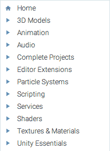

点击每个类别左侧的三角形图标可以显示子类别。一些类别有多个子类别，这有助于你快速找到你想要的东西。你还可以使用资产商店的搜索功能。

当你点击一个类别时，其内容将可查看。点击特定的资产将显示该资产的几个特性。这些特性包括以下内容：

+   标题

+   发布者

+   评分

+   价格

+   添加到购物车按钮，或者，在免费资产的情况下，下载按钮

+   所需 Unity 版本

+   发布日期

+   描述

+   包含内容

+   文件大小

+   资产版本号

+   图片

+   视频（不一定总是可用）

+   发布者网站链接

+   用户评价

在从 Unity 资产商店获取资产方面，有一些事情需要考虑。首先，你想要确保你有使用该资产的必要权利，正如你计划的那样。例如，如果你没有商业使用权利，你不会想在你的商业游戏中使用那个特定的资产。

在从资产商店选择资产之前，还需要考虑的一个问题是文件的大小。幸运的是，当你在预览资产时，这部分信息是元数据的一部分。

在下一节中，我们将访问 Unity 资产商店，选择一个资产，并将其添加到我们的游戏项目中。

# 亲身体验 Unity 资产商店

在本节中，我们将介绍获取 Unity Asset Store 中资源的必要步骤。请遵循以下步骤：

1.  使用顶部菜单，选择 Window | Asset Store。

1.  在搜索框中输入`Unity Particle Pack`并按下键盘的回车键。

1.  在结果中，通过 Unity Technologies 找到 Unity Particle Pack 项目。它将是一个免费资源包。通过点击标题选择该包。

1.  在 Asset Store 中显示 Unity Particle Pack 后，点击下载按钮。

1.  您将被提示接受许可协议。如果您同意条款，请点击接受按钮。这将开始下载过程。

1.  下载完成后，将出现导入按钮。点击该按钮。

1.  您现在将看到导入 Unity Package 对话框窗口。默认情况下，包中的所有资源都将被选中。点击界面底部的导入按钮。导入进度将在弹出窗口中显示，并在过程完成后自动关闭。

1.  导入过程完成后，通过右键点击标签并选择 Close tab 来关闭 Asset Store。

如您从下面的截图中所见，在您的项目面板的“资产”下将会有一个新的`EffectExamples`文件夹：

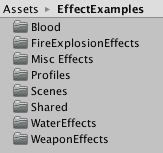

我们现在有一套很好的特效可以用于我们的游戏。我们将在第十二章，“为我们的游戏添加音频和视觉效果”中整合一些。

# 在我们的游戏中整合自定义资源

到目前为止，在本章中，我们已经创建了自己的游戏资源并从 Unity Asset Store 下载了一个资源包。在本节中，我们将从出版者的配套网站上下载资源用于我们的游戏。

按照以下步骤获取为我们的*Cucumber Beetle*游戏专门创建的资源包：

1.  导航到出版者的网站并下载以下文件：

    +   `CherriesAndTree.unitypackage`

    +   `CucumberAndPatches.unitypackage`

1.  从顶部菜单选择 Assets | Import Package | Custom Package，并导航到`CherriesAndTree.unitypackage`文件。点击打开按钮。

1.  如以下截图所示，导入 Unity Package 对话框窗口将包含我们樱桃树和樱桃所需的所有文件。点击导入按钮：

接下来，我们将导入黄瓜和两个 Cucumber Patches。这些包含在`CucumberAndPatches.unitypackage`资源包中。按照前面的步骤将此资源包导入到您的游戏中。

如您在下面的截图中所见，这个资源包中有几个与黄瓜和 Cucumber Patches 相关的文件。

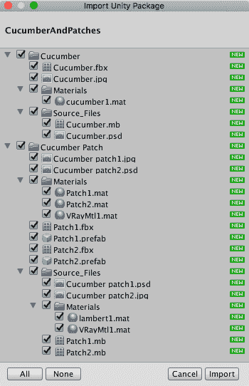

在第七章，*实现我们的玩家角色*和第八章，*实现我们的非玩家角色*中，您将下载额外的资产包。

# 与导入的资产一起工作

在上一节中，您将以下列出的资产添加到您的游戏中：

+   樱桃

+   樱桃树

+   黄瓜

+   黄瓜地

我们将在第十章，*脚本化我们的得分系统*中结合樱桃和黄瓜资产。在本节中，我们将种植樱桃树和黄瓜地。

如您从第三章，*设计游戏*中回忆的那样，我们在游戏环境的四个角落和中心创建了出生点。我们还选择了四个种植樱桃树的区域。现在我们有了实际的地形，我们可以更具体地设计。查看以下图表以确定种植樱桃树和黄瓜地的位置：

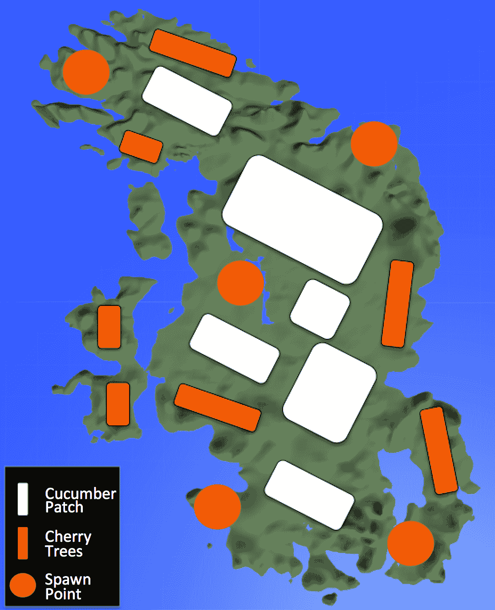

在种植我们的樱桃树和黄瓜地时，我们将参考此图的前两个部分。

# 植树樱桃树

在第四章，*创建我们的地形*中，我们创建了一棵树来演示如何从头开始创建。由于我们在上一节中下载了樱桃树，我们不再需要我们的实验树。在层次面板中，删除我们之前创建的三个。接下来，删除项目面板中的任何树木资产和与树木相关的纹理文件夹。这将帮助我们保持组织并最小化我们的 Unity 游戏项目的大小。

在 Unity 中，基本树木可以绘制在地形上。要完成此操作，您首先需要调整场景视图，以便您有一个从上到下的地形视图。然后，在层次面板中，选择您的地形。接下来，您在检查器面板的地形组件中使用放置树木按钮来绘制地形上的树木。

由于我们的樱桃树是特殊的，包含多个网格，我们无法使用地形绘制工具。相反，我们将制作多个樱桃树预制件的副本，并使用之前提供的图作为参考，将它们放置在我们游戏世界中想要的位置。

在种植我们的樱桃树之前，我们需要采取一些准备步骤。按照以下步骤准备预制件：

1.  在项目面板中，右键单击`Prefabs`文件夹，然后选择创建 | 预制件。将预制件命名为`CherryTreeCollider`。

1.  在项目面板中，将上一节中导入的`CherryTree.prefab`拖动到场景视图中。位置不重要。

1.  在层次面板中，选择您刚刚添加到场景视图中的樱桃树。

1.  在检查器面板中，单击盒子碰撞体组件中的“是触发器”复选框。

1.  仍然在检查器面板中，点击添加组件按钮，然后选择物理|方块碰撞器。我们将使用这个碰撞器帮助我们确定当黄瓜人从樱桃树中收集樱桃时。

1.  接下来，我们将编辑碰撞器以确保它包含整个树。在检查器面板的方块碰撞器区域，点击编辑碰撞器按钮。

如以下截图所示，碰撞器位于`Cherry Tree`预制体的底部：

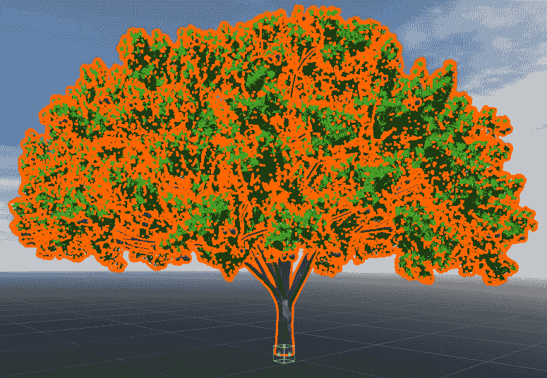

1.  使用场景视图中的方块碰撞器的方块，放大碰撞器，使其包含大部分樱桃树。它不需要包含树干。以下截图显示了示例配置：

1.  在项目面板中，确保已选择`Prefabs`文件夹。

1.  将樱桃树从层次结构面板拖动到`Prefabs`文件夹中的`CherryTreeCollider`预制体。这创建了一个具有方块碰撞器的`Cherry Tree`预制体。

1.  在层次结构面板中，删除樱桃树，除非它位于你想要的位置。

1.  在`Prefabs`文件夹中选择`CherryTreeCollider`预制体。

1.  在检查器面板中，点击标签旁边的下拉菜单。选择添加标签按钮。

1.  如以下截图中的箭头所示，点击空列表底部的+图标：

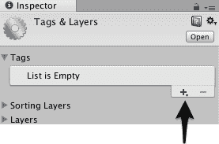

1.  在弹出的窗口中，输入`CherryTree`作为标签名称，然后点击保存按钮。

1.  在`Prefabs`文件夹中选择`CherryTreeCollider`预制体。

1.  在检查器面板中，点击标签旁边的下拉菜单。选择`CherryTree`标签。

现在你可以开始种植你的樱桃树了。只需将预制体拖动到你想放置樱桃树的地方。你可以创建任意多或少的樱桃树。本书提供的示例包含 25 棵樱桃树。

当你的樱桃树放置到你想要的位置后，你的层次结构面板可能变得杂乱无章。一个快速整理的方法是在层次结构面板内右键点击并选择创建空对象。然后，将 GameObject 重命名为`Cherry Trees`。最后，在层次结构面板中，选择所有樱桃树并将它们放入该 GameObject 中。现在这个 GameObject 作为一个文件夹用于查看。你可以根据需要折叠和展开文件夹。

如果你使用俯视图在场景视图中放置樱桃树，一些树木可能需要根据你的地形进行升高或降低。你可以在层次结构视图中双击樱桃树以自动缩放场景视图。

完成樱桃树的工作后，保存你的场景和项目。

# 种植黄瓜地

我们之前为我们的黄瓜补丁确定了六个区域。我们可以像我们对樱桃树所做的那样，在游戏环境中放置黄瓜补丁时采用相同的方法。如果我们采用自动种植的方法来种植黄瓜补丁，我们可能会得到比我们想要的更多的黄瓜补丁。因此，我们将采取手动方法。

我们在早期导入的`Cucumber Patch`文件夹中有预制体。让我们做一些事情来准备这些预制体以供我们使用。请按照以下步骤操作：

1.  在项目面板中，在`Prefabs`文件夹中右键单击并选择创建 | 预制体。将预制体命名为`CucumberPatch1`。

1.  重复步骤 1，并将第二个预制体命名为`CucumberPatch2`。

1.  在项目面板中，将上一节中导入的`Patch1prefab`拖动到场景视图中。位置无关紧要。

1.  在层级面板中，选择您刚刚添加到场景视图中的黄瓜补丁。

1.  在项目面板中，确保已选择`Prefabs`文件夹。

1.  将层级面板中的黄瓜补丁拖动到`Prefabs`文件夹中的`CucumberPatch1`预制体。

1.  从层级面板中删除黄瓜补丁。

1.  在项目面板中，将上一节中导入的`Patch2prefab`拖动到场景视图中。位置无关紧要。

1.  在层级面板中，选择您刚刚添加到场景视图中的黄瓜补丁。

1.  在项目面板中，确保已选择`Prefabs`文件夹。

1.  将黄瓜补丁从层级视图中拖动到`Prefabs`文件夹中的`CucumberPatch2`预制体。

1.  从层级面板中删除黄瓜补丁。

我们本可以将导入的预制体直接移动到`Prefabs`文件夹。我们的方法是将它们复制，以便在需要时可以使用原始的。

接下来，我们将为游戏世界中的黄瓜补丁准备六个区域。我们的目标是确定每个都有平坦地面的矩形区域。

使用以下参考图像和您用于创建地形的 Unity 技能，我们需要将六个区域压平并记录它们的矩形边界：

为了准备我们的黄瓜补丁区域，请按照以下步骤操作：

1.  使用高度绘制工具将黄瓜补丁区域压平。

1.  从顶部菜单选择 GameObject | 3D Object | 平面。

1.  将平面放置在地面上，具体是在压平的区域。

1.  在检查器视图中，将材料 | 元素 0 参数设置为 SpatialMappingOcclusion。这将使平面变得透明。

1.  一旦平面就位，记下变换信息。

1.  对剩余的黄瓜补丁重复步骤 1 至 5。

1.  将平面重命名为`CucumberPatchArea1`、`CucumberPatchArea2`、`CucumberPatchArea3`、`CucumberPatchArea4`、`CucumberPatchArea5`和`CucumberPatchArea6`。

完成后，您应该有六个定义好的黄瓜补丁区域。为了参考，书中示例中使用的六个区域如下表所示：

| **平面** | **变换** |
| --- | --- |
| `CucumberPatchArea1` |

|  | X | Y | Z |

| 位置 | 7373 | 40.03 | 1689 |

| 旋转 | 0 | 10.082 | 0 |

|

| `CucumberPatchArea2` |
| --- |

|  | X | Y | Z |

| 位置 | 1211 | 40.03 | 1142 |

| 旋转 | 0 | 53.984 | 0 |

|

| `CucumberPatchArea3` |
| --- |

|  | X | Y | Z |

| 位置 | 1160 | 40.03 | 831 |

| 旋转 | 0 | 87.876 | 0 |

|

| `CucumberPatchArea4` |
| --- |

|  | X | Y | Z |

| 位置 | 892 | 40.03 | 849 |

| 旋转 | 0 | 120.877 | 0 |

|

| `CucumberPatchArea5` |
| --- |

|  | X | Y | Z |

| 位置 | 1200 | 40.03 | 568 |

| 旋转 | 0 | 143.801 | 0 |

|

| `CucumberPatchArea6` |
| --- |

|  | X | Y | Z |

| 位置 | 1184 | 40.03 | 330 |

| 旋转 | 0 | 103.911 | 0 |

|

我们的最后一步是将六个黄瓜补丁在层次面板中分组，以保持组织有序。就像我们对樱桃树所做的那样，我们将在层次面板内部右键单击并选择创建空对象。然后将 GameObject 重命名为`Cucumber Patch Areas`。最后，在层次面板中，选择所有六个黄瓜补丁窗格并将它们放置在那个 GameObject 中。

在第八章，*实现我们的非玩家角色*，我们将使用窗格来添加黄瓜补丁、黄瓜和甲虫。

# 摘要

在本章中，我们花费了大量时间使我们的游戏环境更加健壮。我们导入了并使用了几个资产。我们在场景中添加了树木和其他对象。我们使用 Unity 的原生建模工具创建了 3D 对象，并从 Unity 资产商店以及出版商的配套网站上导入资产。具体来说，我们添加了游戏中的樱桃树，并为黄瓜补丁准备了区域。

在第七章，*实现我们的玩家角色*，我们将整合游戏中的玩家角色，黄瓜人。我们将导入角色，审查控制，检查动画，并做出必要的配置更改，以便在游戏中完全使用我们的角色。到本章结束时，你将能够开始测试游戏。
