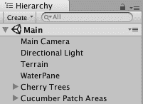
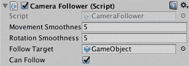
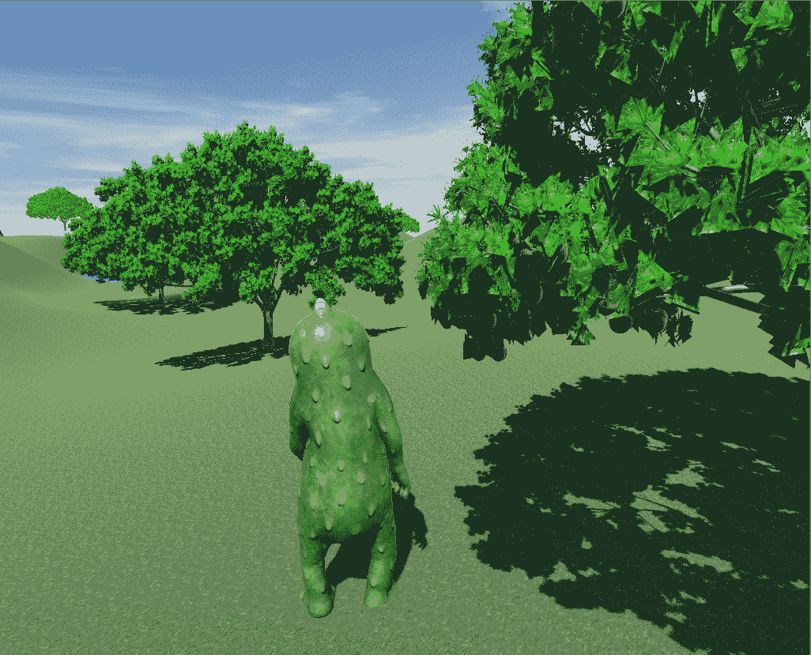
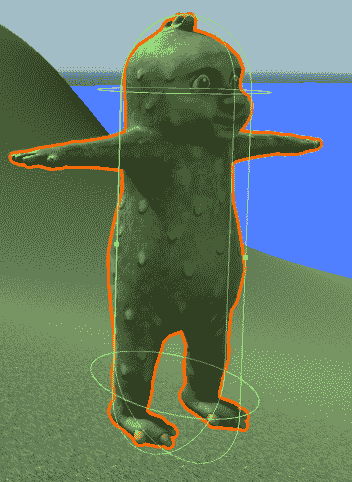
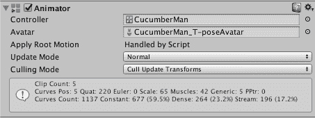
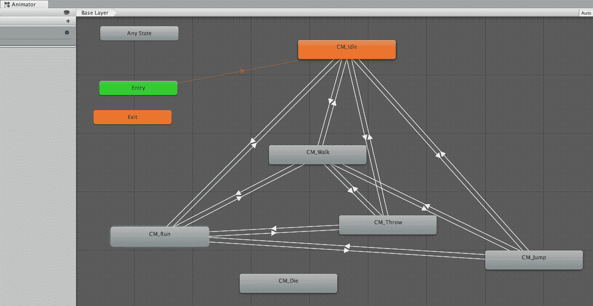
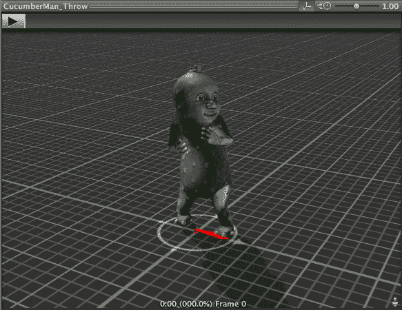

# 第七章：实现我们的玩家角色

在 第六章，*为我们的游戏创建和导入 3D 对象*，我们处理了我们的游戏环境，并将几个资产添加到我们的游戏项目中。我们添加并种植了我们的樱桃树，并为我们的黄瓜地准备了六个区域。我们还学习了如何从 Unity 资产商店以及第三方来源导入资产。

在本章中，我们将整合我们游戏的角色，即黄瓜人。我们将导入角色，审查控制方式，检查动画，并对角色进行必要的配置更改，以便在游戏中完全使用我们的角色。到本章结束时，您将能够开始以游戏模式测试游戏。

本章我们将探讨以下主题：

+   使用 Unity 的标准资产包

+   导入游戏角色

+   配置玩家控制器

+   微调我们的角色

+   为我们的玩家角色制作动画

+   为我们的黄瓜人地形进行改造

# 使用 Unity 的标准资产包

游戏角色、玩家角色、用户控制的玩家——这些都是用来指代我们游戏的主要角色，即黄瓜人，人类玩家将控制这个角色。在 Unity 中，我们称这个角色为玩家角色。为了有一个玩家角色，我们需要一个控制器。在我们的案例中，我们将使用第三人称控制器。第三人称控制器是一个用于从第三人称摄像机视角控制角色的框架。

Unity 标准资产包包括一个 `ThirdPersonController` 资产包。该包，如下面的截图所示，包含 `Animation`、`Materials`、`Models`、`Scripts`、`Textures` 和 `Prefabs`：


本节演示了如何使用 Unity 创建的角色。它将不会整合到 *黄瓜甲虫* 游戏中。通过以下步骤，您将熟悉使用 Unity 提供的 `ThirdPersonCharacter` 的过程：

1.  启动 Unity。

1.  从顶部菜单选择 Assets | 导入包 | 角色。

1.  您将看到一个导入 Unity 包的对话框窗口。点击导入按钮。

1.  在项目面板中，您将看到 `Standard Assets`。导航到 `Standard Assets` | 角色 | `ThirdPersonCharacter` | `Prefabs` 并将 `ThirdPersonController` 预制件拖动到层次结构面板。

1.  在层次结构面板中双击 `ThirdPersonController` 以在场景视图中自动聚焦到控制器。如下面的截图所示，角色被胶囊控制器包围：


1.  在层次结构面板中，将主摄像机拖动，使其成为 `ThirdPersonController` 的下级。这是必要的，以便在游戏过程中摄像机跟随玩家角色。

1.  在场景视图中，使用变换工具将摄像机放置在角色上方和后方。选择摄像机后，场景视图中的摄像机预览窗口应类似于以下截图：


现在你可以将游戏设置为游戏模式，并使用键盘和鼠标导航游戏世界。正如你所看到的，默认角色可以在世界中移动，摄像机将跟随。

使用提供的`ThirdPersonController`非常适合测试目的，但你不会想使用这些标准资产部署游戏。尽管 Unity Technologies 允许商业使用他们的标准资产，但使用它们会侵蚀你游戏的特点，因此建议它们仅用于测试。

# 导入游戏角色

我们将为我们的*黄瓜甲虫*游戏使用自定义的第三人称角色控制器。首先，我们应该确保你的游戏项目中没有冲突的资产。让我们从启动 Unity 并打开基于你在第六章，*为我们的游戏创建和导入 3D 对象*中完成的工作的游戏项目开始。或者，你也可以从出版商的配套网站上加载`Starting-Chapter-07` Unity 项目。一旦你的项目在 Unity 中加载，请从层次结构面板中删除以下列出的任何项目：

+   摄像机（你将保留在第五章，*灯光、摄像机和阴影*）中首先探索的主摄像机）

+   `ThirdPersonController`

删除不必要的资产后，你的层次结构面板应只包含以下层次结构面板截图中的资产：



现在你可以导入我们游戏玩家角色，黄瓜人的资产包了。按照以下步骤导入包：

1.  从出版商的配套网站上下载`CucumberMan_Controller.unitypackage`文件

1.  在 Unity 中，打开你的游戏项目后，从顶部菜单选择 Assets | 导入包 | 自定义包

1.  导航到步骤 1 中下载的资产包位置，并点击打开按钮

1.  当出现导入资产包对话框时，点击导入按钮

如你所注意到的，黄瓜人资产包包含与黄瓜人相关的多个资产，包括控制器、脚本、预制体和其他资产。在下一节中，我们将把黄瓜人添加到我们的游戏中。

# 配置玩家控制器

到目前为止，我们已经花费了很多时间来塑造我们的世界，并用樱桃树和出生点填充它，为黄瓜田做准备。我们一直在为我们的玩家角色，黄瓜人，创建游戏世界。现在是时候将我们的黄瓜人添加到游戏中了。

下面是将黄瓜人添加到我们的游戏并配置控制器的步骤：

1.  在项目面板中，选择预制体。

1.  将`CucumberMan`预制体拖动到层级面板。使用以下截图作为参考，确保您正在拖动以下截图中突出显示的预制体。请注意，下级`Cucumbor_Man`已被故意拼写错误，以确保使用`CucumberMan`预制体：


1.  在层级面板中，选择主摄像机。

1.  在选择主摄像机的情况下，在检查器面板中点击添加组件按钮。

1.  选择脚本 | 摄像机跟随，将摄像机跟随脚本添加到主摄像机。

1.  在主摄像机的摄像机跟随组件中，在检查器面板中，将移动平滑度设置为`5`。

1.  在主摄像机的摄像机跟随组件中，将旋转平滑度设置为`5`。

1.  在层级面板中，点击`CucumberMan`左侧的灰色三角形。这将显示下级组件。

1.  在层级面板中重新选择主摄像机。

1.  在层级面板中点击`CucumberMan`下的 GameObject，并将其拖动到主摄像机摄像机跟随组件的跟随目标字段。

1.  确保已勾选“可以跟随”复选框。

您主摄像机的摄像机跟随组件应与以下图像完全相同。如果不同，请重新检查步骤 6 至 11：



接下来，我们将编辑`CucumberMan`的玩家电机（脚本）组件。按照以下重要步骤正确配置玩家电机（脚本）组件：

1.  在层级面板中，选择`CucumberMan`。

1.  如有必要，展开检查器面板中`CucumberMan`的玩家电机（脚本）组件。

1.  将主摄像机从层级面板拖动到检查器面板中`CucumberMan`的玩家电机（脚本）组件的 Cam 字段。

接下来，让我们将黄瓜人放置到游戏的一个逻辑起始位置。你将黄瓜人放置在哪里由你决定。建议将其放置在其中一个重生点。一旦你知道角色在每场游戏中应该从哪里开始，请按照以下步骤操作：

1.  在层级面板中，选择`CucumberMan`。

1.  使用变换工具，将角色移动到其中一个出生点。

1.  放大并确保角色的脚在或略高于地面。我们还需要完成一个步骤，使黄瓜人成为我们游戏的可玩角色。

1.  在选择`CucumberMan`的情况下，在检查器面板中选择标签下拉菜单并选择玩家。这将使我们更容易引用碰撞。你将在第十章中了解更多关于*脚本我们的得分系统*。

现在，你可以将游戏设置为游戏模式并测试玩家角色。你可以使用以下表格中列出的键盘按键来控制黄瓜人：

| **键盘按键** | **操作** |
| --- | --- |
| *W* | 向上行走 |
| *A* | 向左行走 |
| *S* | 向下行走 |
| *D* | 向右行走 |
| *E* | 投掷 |
| 左键 *Shift* 键 | 跑步 |
| 空格键 | 跳跃 |

在下一节中，我们将微调 Cucumber Man。

# 微调我们的角色

现在 Cucumber Man 已经进入我们的游戏，我们可以开始尝试这个角色，以确保它看起来和表现方式符合我们的期望。在本节中，我们将查看对 Cucumber Man 的以下改进：

+   电机控制

+   缩放

+   胶囊碰撞体

+   输入控制

# 微调电机控制

您可以将游戏置于游戏模式，并使用上一节中详细说明的键盘输入来实验 Cucumber Man 的移动。您可能已经注意到的一件事是，玩家角色似乎移动得不太快。当然，这与我们的地形大小和角色大小有关。让我们通过查看相关脚本来看看如何增加角色的速度。

以下代码片段来自与 Cucumber Man 一起导入的`PlayerMotor.cs`脚本。这个片段是脚本的第一部分，而不是整个脚本。如您所见，有`JumpPower`、`MoveSpeed`和`RunSpeed`变量。这些变量在代码中创建，其值可以在 Unity 编辑器中控制：

```cs
using System.Collections;
using System.Collections.Generic;
using UnityEngine;
using UnityStandardAssets.CrossPlatformInput;

[RequireComponent(typeof(Rigidbody))]
public class PlayerMotor : MonoBehaviour {

  float horizontal, vertical;
  Rigidbody m_Rigidbody;

  public float JumpPower;
  public float MoveSpeed, RunSpeed;

  private float currentJumpPower = 0;
  private float currentMoveSpeed = 0;

  // Use this for initialization
  void Start () 
  {
    m_Rigidbody = GetComponent<Rigidbody>();
    currentMoveSpeed = MoveSpeed;
  // m_Cam = Camera.main.transform;
    m_Animator = GetComponent<Animator>(); 
}
. . .
```

以下截图来自 Cucumber Man 的检查器面板。在这里，您可以看到我们有能力更新跳跃力量、移动速度、奔跑速度、静止转向速度和移动转向速度的值：


使用 Cucumber Man 的玩家电机（脚本）组件，您可以尝试不同的值，使玩家角色的移动方式符合您的期望。您始终可以参考之前的截图来重置您的值。

您可以在游戏模式下实验玩家电机（脚本）参数。在游戏模式下做出的任何更改在离开游戏模式时都不会保留。这是一种在不影响任何已保存设置的情况下进行实验的好方法。

这里是 Cucumber Man 电机控制的一组典型参数：


我们还可以选择编辑移动速度乘数变量，以影响所有电机速度值。您可以在检查器面板中手动设置，也可以通过编程方式设置。要手动设置乘数，只需在检查器面板中编辑`CucumberMan`的玩家电机（脚本）组件中的值。要编程更改此值，您可以编辑`PlayerMotor.cs`脚本。以下代码片段来自该脚本，并代表该脚本的后续部分：

```cs
. . . 
Animator m_Animator;
[SerializeField] float m_MoveSpeedMultiplier = 1f;
public void OnAnimatorMove()
{
   // we implement this function to override the default root motion.
   // this allows us to modify the positional speed before it's applied.
  if (m_IsGrounded && Time.deltaTime > 0)
  {
     Vector3 v = (m_Animator.deltaPosition * m_MoveSpeedMultiplier) / Time.deltaTime;

     // we preserve the existing y part of the current velocity.
     v.y = m_Rigidbody.velocity.y;
     m_Rigidbody.velocity = v;
  }
}
. . . 
```

如您在之前的代码片段中所见，`m_MoveSpeedMultiplier`设置为`1`。您可以直接在脚本中更改该值，作为使用 Unity 编辑器的替代方法。

# 微调缩放

我们的黄瓜人有一个变换，包括 X、Y 和 Z 的缩放值。默认情况下，这些值都设置为 1。我们可以通过增加或减少缩放值来轻松改变黄瓜人的大小。使用这种方法，你可以创建黄瓜宝宝或黄瓜巨人的黄瓜人副本。

以下截图显示了三个黄瓜人的副本。从左到右，每个黄瓜人都比前一个大：


下面是前面截图中的每个黄瓜人的变换设置：

|  | **变换比例设置** |
| --- | --- |
| **黄瓜人版本** | **X** | **Y** | **Z** |
| 黄瓜宝宝 | 0.5 | .5 | .5 |
| 黄瓜人 | 1 | 1 | 1 |
| 黄瓜巨人 | 2 | 2 | 2 |

对于我们的游戏，我们只会有一个黄瓜人，我们希望他比甲虫大，比樱桃树小。默认比例的结果是黄瓜人的高度理想。这可以通过他与樱桃树的相对大小来明显看出，如下面的截图所示：



在第八章，“实现我们的非玩家角色”中，我们将检查我们的黄瓜甲虫的比例，并确保它们与黄瓜人的大小成适当比例。

# 精细调整胶囊碰撞体

胶囊碰撞体的形状是药丸——即一个两端圆润的圆柱体。我们可以通过在层级面板或场景视图中选择我们的角色，然后在检查器面板中查看胶囊碰撞体组件来查看胶囊碰撞体。如下面的截图所示，我们可以通过点击编辑碰撞体按钮来编辑胶囊碰撞体：


下面是胶囊碰撞体组件每个参数的简要描述：

+   **是否触发**：当我们启用此选项时，物理引擎将忽略胶囊碰撞体

+   **材质**：我们可以指定胶囊碰撞体如何与其他碰撞游戏对象交互

+   **中心**：有 X、Y 和 Z 字段来识别胶囊相对于自身的中心

+   **半径**：碰撞体宽度的半径

+   **高度**：碰撞体的高度

+   **方向**：胶囊的纵向方向

为了提高精度，胶囊碰撞体应该接受高度调整，以便黄瓜人能够适应其中，如下面的截图所示：



对你的黄瓜人的胶囊碰撞体进行任何必要的调整，以确保其类似于前面的截图。一旦完成调整，请务必保存你的工作。

本章中详细描述的关于“黄瓜人”游戏的全部更改都将包含在第八章，“实现我们的非玩家角色”开头的`Starting-Chapter-08.zip`文件中。

# 更改和优化输入控制

当我们使用 Unity 开发游戏时，在游戏过程中收集用户输入我们有几种选项。以下是一个输入选项列表：

+   键盘

+   鼠标

+   游戏手柄

+   触摸屏

+   移动设备运动传感器

+   麦克风

+   摄像机

如我们在本章前面所述，我们将使用键盘作为 *Cucumber Man* 游戏的唯一输入设备。让我们看看如果你想要实验或只是想要改变用户与游戏交互的方式，你可以在哪里更改游戏输入控制。我们将使用 Unity 的输入管理器来完成这项工作。

你的游戏项目输入管理器可以通过以下截图所示的方式访问，通过选择编辑 | 项目设置 | 输入下拉菜单选项：


这会导致输入管理器在检查器面板中显示。在那里，你可以找到游戏的相关虚拟轴。在下面的屏幕截图中，水平虚拟轴和垂直虚拟轴并排显示。你可以看到键盘的 *W*、*A*、*S* 和 *D* 键是如何设置为控制水平和垂直移动的。例如，*W* 键在垂直虚拟轴中被识别，并分配给 Alt 正按钮，这意味着它是向前移动的替代按钮。而主要的负和正按钮被列为使用左右箭头键进行水平移动，上下箭头键用于垂直导航，我们将实现 *W*、*A*、*S* 和 *D* 键作为我们在游戏世界中移动黄瓜人角色的默认方法：


输入管理器使我们能够确定所有的输入控制，并且是你设置鼠标、键盘和游戏手柄输入的地方。输入管理器中还有一个额外的设置，用于跳跃功能。如图所示，跳跃功能使用键盘的空格键作为正输入设备。你会注意到没有分配负按钮，因为假设角色只能向上跳，不能向下跳：


# 为我们的玩家角色动画

你的黄瓜人角色控制器包包括支持角色六种动画所需的资产。在本节中，我们将查看黄瓜人的动画，如下所示：

+   空闲

+   走路

+   跑步

+   跳跃

+   投掷

+   死亡

# 检查玩家控制器脚本

在 Unity 中，有几个区域可以审查 Cucumber Man 的动画。让我们首先查看`CucumberMan`控制器对象的`Player Controller (Script)`组件。当你选择层次结构面板中的 CucumberMan 控制器时，你应该在检查器面板中看到`Player Controller (Script)`组件。你可能需要点击组件左侧的展开按钮，以便显示组件的详细信息。

如以下截图所示，我们每个角色的动画都与一个状态相关联：


现在，让我们审查`PlayerController.cs`脚本。你可以通过在项目面板的“收藏”下选择“所有脚本”按钮来访问此文件。然后，在项目面板中滚动到`PlayerController (Script)`。以下代码片段显示了脚本的前 14 行：

```cs
using System.Collections;
using System.Collections.Generic;
using UnityEngine;

public class PlayerController : MonoBehaviour {

  public string RunState, WalkState, IdleState, JumpState, DieState, ThrowState;
  bool isWalking, isRunning, isJumping, isIdle, isDie, forward,left,right,back;
  Animator mAnim;
  // Use this for initialization
  void Start () {
    mAnim = GetComponent<Animator>();
    isIdle = true;
   }
```

前三行简单地标识了我们脚本中想要使用的命名空间。这些是`System.Collections`、`System.Collections.Generic`和`UnityEngine`。接下来，我们有`PlayerController`类的类声明。接下来的三行代码是我们的变量定义。正如你所见，我们为六个动画中的每一个都有一个公共字符串：`RunState`、`WalkState`、`IdleState`、`JumpState`、`DieState`和`ThrowState`。还有几个`boolean`(`bool`)变量，包括`isWalking`、`isRunning`、`isJumping`、`isIdle`和`isDie`。我们还标识`mAnim`为我们自己的 Animator。我们将在脚本中的后续部分看到这些是如何被使用的。

`Start()`方法将我们的初始状态`isIdle`设置为 true，并通过`mAnim = GetComponent<Animator>();`语句获取我们的 Animator 引用。

我们`PlayerController.cs`脚本中最大的方法是`Update()`方法。`Update()`方法每帧调用一次。以下代码段提供了此方法，其中省略号(...)表示为了简洁而删除的代码区域。你可以在 Unity 中查看完整的脚本。第一个代码段将适当的设置设置为 true 或 false。例如，当用户按下*W*键且玩家当前未跑步时，`isWalking`变量被设置为 true，并将两个参数(`WalkState`和`true`)传递给`mAnim.SetBool`。对*A*、*S*和*D*键也采取类似行动：

```cs
. . . 
void Update () {
  //Down states
  if( Input.GetKeyDown(KeyCode.W))
  {
    if( !isRunning )
    {
      isWalking = true;
      isIdle = false;
      forward = true;
      mAnim.SetBool(WalkState, true);
      mAnim.SetBool(IdleState, false);
      }
   }
   if( Input.GetKeyDown(KeyCode.A))
   {
      . . . 
   }
   if( Input.GetKeyDown(KeyCode.S))
   {
      . . . 
   }
   if( Input.GetKeyDown(KeyCode.D))
   {
      . . .
   }
. . . 
```

以下`Update()`方法的下一个代码片段，如以下片段所示，处理当按下左*Shift*键时的跑步动画。在这种情况下，动画从`WalkState`更改为`RunState`：

```cs
. . . 
if( Input.GetKeyDown(KeyCode.LeftShift))
{
  if( isWalking )
  {
    isRunning = true;
    mAnim.SetBool(RunState, true);
    mAnim.SetBool(WalkState, false);
  }
}
. . . 
```

以下代码段，如以下片段所示，展示了检测空格键输入导致`Jump()`动画运行，以及当检测到*E*键时`Throw()`动画运行的情况：

```cs
. . . 
if( Input.GetKeyDown(KeyCode.Space))
{
  Jump();
}

if( Input.GetKeyDown(KeyCode.E))
{
  Throw();
}
. . . 
```

# 审查 Animator 组件

在`CucumberMan`控制器对象中，还有一个最终组件需要检查：动画组件。如下面的截图所示，动画组件有两个关键属性：控制器和头像：



控制器指向`CucumberMan.controller`文件。该文件的`.controller`文件扩展名在组件界面中不会显示，但它是对该文件的引用。您可以在项目面板中导航到该文件。它位于资产 | Cucumber Man 下。当您双击该文件时，它将在动画窗口中打开，如下面的截图所示：


在这里，您可以查看每个状态，每个动画一个状态，以及它们之间的可能转换。每个状态都带有`CM_`前缀，以指示`CucumberMan`。这些状态如下列出：

+   CM_Idle

+   CM_Walk

+   CM_Run

+   CM_Jump

+   CM_Throw

+   CM_Die

如果动画窗口的布局混乱或不清晰，您可以重新排列动画窗口中的对象，以便更容易理解。您可以通过单击一个状态，将其拖动到您想要的位置，然后释放鼠标按钮来完成此操作。以下图形显示了 Cucumber Man 的状态和转换的一种可能的组织方法。如果您愿意，您的做法可以不同：



您可以保留这些转换，就像它们提供给您的那样，或者，如果您想的话，您可以使用动画窗口进行更改。

# 预览动画

您可以选择预览单个动画，而无需将游戏置于游戏模式。在项目面板中，选择资产 | Cucumber Man，您将看到列出的单个动画。例如，点击`CucumberMan_Throw`动画。这是您在本章早期导入的包中的一部分`CucumberMan_Throw.fbx`文件。

选择动画后，检查器面板为您提供了访问模型、绑定和动画标签的权限。虽然您在这里不需要做任何修改，但花时间探索各种功能是值得的。当您选择动画标签时，您可以在检查器面板底部预览动画，如下面的截图所示：



您可以点击动画预览窗口左上角的播放按钮来播放动画。动画将播放并循环，直到您停止播放。

您可以通过玩游戏来预览每个动画。这适用于所有动画，除了死亡动画；我们将不得不编写一个脚本来触发该动画。我们将在第十一章，*脚本胜利与失败*中这样做。

# 为我们的 Cucumber Man 地形进行改造

在进行游戏测试时，建议让黄瓜人行走、奔跑和跳跃到你希望玩家在游戏中能够执行这些动作的地方。这是一个常常被忽视或未给予足够关注的步骤。回想一下你玩过的游戏或过去玩过的游戏。你的角色是否曾经卡住或无法到达某个区域？很可能其中一些是由于测试不足造成的。

建议你着手进行这项工作。地形可能太陡峭，以至于角色无法攀爬。使用你在第四章，*创建我们的地形*中学到的技能来修改你的地形，以便玩家角色能够以你想要的方式导航你的游戏世界。

在这个重要步骤上花费的时间将有助于确保非玩家角色，我们的黄瓜甲虫，能够到达你希望它们去的地方。你将在下一章第八章，*实现我们的非玩家角色*中收到提示来检查这一点。

现在是保存你的场景和项目的绝佳时机。记住，尽早保存，经常保存！

# 摘要

在本章中，我们整合了我们的游戏玩家角色，黄瓜人。我们导入了角色，审查了控制方式，检查了动画，并进行了必要的配置更改，以便在游戏中完全使用我们的角色。

在第八章，*实现我们的非玩家角色*中，我们将实现我们的非玩家角色，黄瓜甲虫。我们将导入并审查与甲虫相关的资产，并开始编写游戏特定于甲虫的部分。这包括随机化黄瓜植物和黄瓜的位置。
