# 实现我们的非玩家角色

在上一章中，我们专注于我们的游戏玩家角色——黄瓜人。我们导入了角色，审查了控制方式，检查了动画，并对游戏中的角色进行了必要的配置更改，以便完全使用我们的角色。我们审查了玩家角色的动画和角色的动画控制器。我们还确定了与玩家角色相关的脚本，并审查了其中几个。此外，我们还对游戏的地形进行了修改，以便在游戏过程中更好地适应玩家角色。

在本章中，我们将专注于非玩家角色。我们的黄瓜甲虫将作为我们游戏中的非玩家角色，并将成为黄瓜人的敌人。我们将通过直接放置的方式将黄瓜甲虫纳入我们的游戏。我们将回顾甲虫的 11 个动画，并对非玩家角色的动画控制器进行修改。此外，我们将编写脚本以控制非玩家角色。我们还将向游戏世界中添加黄瓜地、黄瓜和樱桃。

在本章中，我们将涵盖以下主题：

+   理解非玩家角色

+   将非玩家角色导入我们的游戏

+   为我们的非玩家角色动画

+   将非玩家角色纳入我们的游戏

+   为我们的黄瓜甲虫地形进行地形改造

+   将黄瓜地皮添加到我们的地形中

+   将黄瓜添加到我们的地形中

+   编写我们的非玩家角色脚本

# 理解非玩家角色

非玩家角色，通常简称为 NPC，只是不受人类玩家控制的游戏角色。这些角色通过脚本进行控制，其行为通常对游戏中的条件做出响应。

我们游戏中的非玩家角色是黄瓜甲虫。如图所示，这些甲虫有六条腿可以行走；在特殊情况下，它们也可以用后腿行走：


黄瓜甲虫是真实的昆虫，对黄瓜构成威胁。它们实际上不能用后腿行走，但在我们的游戏中可以。

在下一节中，你将导入为这款游戏专门准备的黄瓜甲虫资产包。该资产包中只有一个甲虫。我们将通过脚本制作多个甲虫副本。

在你继续到下一节之前，你应该打开你的 Unity 游戏项目。或者，你也可以从出版商的配套网站上下载可用的`Starting-Chapter-08` Unity 项目。

# 将非玩家角色导入我们的游戏

现在，你已经准备好导入我们游戏非玩家角色——黄瓜甲虫的资产包了。按照以下步骤导入包：

1.  从出版商的配套网站上下载`Cucumber_Beetle.unitypackage`文件

1.  在 Unity 中，打开你的游戏项目后，从顶部菜单选择 Assets | Import Package | Custom Package。

1.  导航到步骤 1 中下载的资产包的位置，并点击打开按钮

1.  当出现导入资产包对话框窗口时，点击导入按钮

正如您将注意到的，`Cucumber_Beetle`资产包包含与黄瓜甲虫相关的多个资产，包括控制器、脚本、预制体、动画和其他资产：


现在将`Cucumber_Beetle`资产包导入到我们的游戏项目中后，我们应该保存我们的项目。使用文件 | 保存项目菜单选项。

接下来，让我们回顾一下导入的内容。

在项目面板中，在资产 | 预制体下，您将看到一个新的`Beetle.Prefab`。同样，在项目面板中，在资产下，您将看到一个`Beetle`文件夹。了解文件夹中每个组件的作用非常重要。请参考以下截图，了解您在本章中将使用的与黄瓜甲虫相关的资产概览：

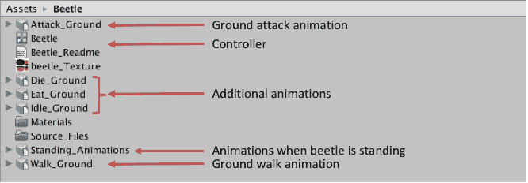

上一个截图中的其他资产包括`readme.txt`文件、黄瓜甲虫的纹理和材质以及源文件。我们将在下一节中回顾黄瓜甲虫的动画。

# 动画我们的非玩家角色

我们已经为游戏中的黄瓜甲虫准备了几个动画。以下是动画名称及其在项目中的出现顺序，以及我们将如何将动画融入游戏的简要描述。动画按名称字母顺序列出：

| **动画名称** | **使用详情** |
| --- | --- |
| `Attack_Ground` | 甲虫从地面攻击黄瓜人的脚 |
| `Attack_Standing` | 甲虫从站立位置攻击黄瓜人 |
| `Die_Ground` | 甲虫从地面起始位置死亡 |
| `Die_Standing` | 甲虫从站立位置的后腿起始位置死亡 |
| `Eat_Ground` | 甲虫在地面上吃黄瓜 |
| `Idle_Ground` | 甲虫没有进食、行走、战斗或站立 |
| `Idle_Standing` | 甲虫站立，但没有行走、奔跑或攻击 |
| `Run_Standing` | 甲虫用其后腿奔跑 |
| `Stand` | 甲虫从地面位置站立（它站立起来） |
| `Walk_Ground` | 甲虫用其六条腿行走 |
| `Walk_Standing` | 甲虫用其后腿行走 |

您可以通过在项目面板中点击动画文件（如`Eat_Ground.fbx`）来预览这些动画。然后，在检查器面板中，点击播放按钮来观看动画。

我们有 11 个黄瓜甲虫动画，我们将在本章后面使用脚本确定何时播放动画。

在下一节中，我们将把黄瓜甲虫添加到我们的游戏中。

# 将非玩家角色融入我们的游戏

首先，让我们简单地将`Beetle.Prefab`从项目面板的`Assets`/`Prefab`文件夹拖到场景视图中。将甲虫放在黄瓜人前面，以便在将游戏置于游戏模式时即可看到甲虫。

建议的放置方式如图所示：

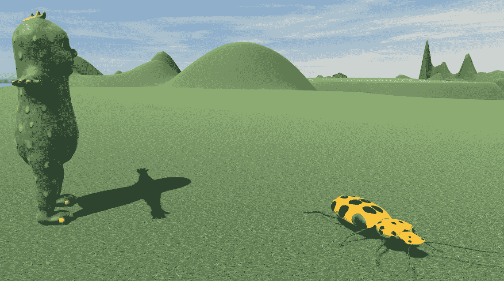

当您将游戏置于游戏模式时，您会注意到甲虫会循环播放其动画。如果您在项目面板的`Assets`|`Beetle`文件夹中双击`Beetle.controller`，您将看到，如图所示，我们目前有多个动画被设置为依次和重复播放：


这个初始设置旨在为您提供一种快速预览各种动画的方法。在下一节中，我们将修改动画控制器。

# 使用动画控制器

我们将使用动画控制器来组织 NPC 的动画。动画控制器还将用于管理动画之间的转换。

在我们开始修改动画控制器之前，我们需要确定我们的甲虫有哪些状态，然后确定每个状态相对于其他状态可以有哪些转换。

动画状态可以称为角色的动画状态。例如，行走是一个状态，跑步和跳跃也是如此。

这里是甲虫可以拥有的状态，每个状态都关联一个动画：

+   地面闲置

+   地面行走

+   地面进食

+   地面攻击

+   地面死亡

+   站立

+   站立闲置

+   站立行走

+   站立奔跑

+   站立攻击

+   站立死亡

在前面的状态列表中，我们可以分配以下转换：

+   从地面闲置到：

    +   地面行走

    +   在地面上奔跑

    +   地面进食

    +   地面攻击

    +   站立

+   从站立到：

    +   站立闲置

    +   站立行走

    +   站立奔跑

    +   站立攻击

查看从地面闲置到站立的转换演示了您需要为游戏做出的状态到状态转换决策。

让我们将注意力转回到动画控制器窗口。您会注意到该窗口的左侧面板中有两个标签：层和参数。层标签显示一个基础层。虽然我们可以创建额外的层，但我们的游戏不需要这样做。参数标签为空，这是正常的。我们将使用动画控制器窗口的布局区域进行更改。这就是带有网格背景的区域。

让我们从以下更改开始。对于所有 11 个新状态按钮，执行以下操作：

1.  左键点击状态按钮

1.  在检查器面板中查看以确定哪个动画与状态按钮关联

1.  在检查器面板中重命名状态名称以反映动画。

1.  点击返回按钮

1.  再次检查状态按钮以确保您的更改已生效

当你完成了前五个步骤的所有 11 个状态后，你的动画控制器窗口应该与以下截图相匹配：

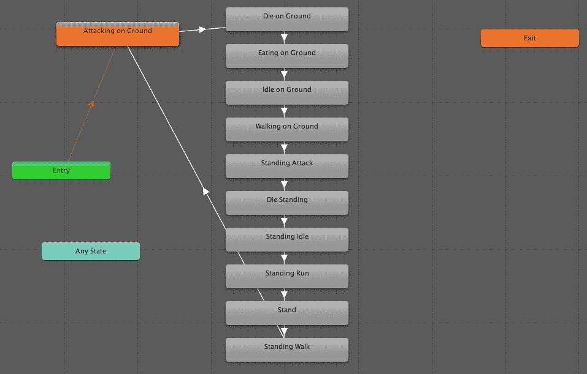

如果你将游戏设置为游戏模式，你会看到没有任何变化。我们只是更改了状态名称，使其对我们更有意义。因此，我们还需要对动画控制器做一些更多的工作。

目前，“地面上的攻击”状态是默认状态。这并不是我们想要的。将“Idle on Ground”状态设置为默认状态更有意义。要做出这个更改，右键单击**Idle on Ground**状态并选择“设置为层默认状态”：

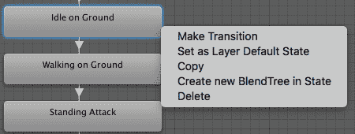

接下来，我们需要对状态转换进行一系列更改。状态很多，转换也会很多。为了使事情更简单，我们将首先删除所有默认转换。为此，左键单击带有箭头的每条白色线条，并按下键盘上的*Delete*键。不要删除从**Entry**到**Idle on Ground**的橙色线条。

删除所有转换后，您可以拖动状态，以便有更多的工作空间。您可能需要暂时以类似以下截图所示的方式重新组织它们：

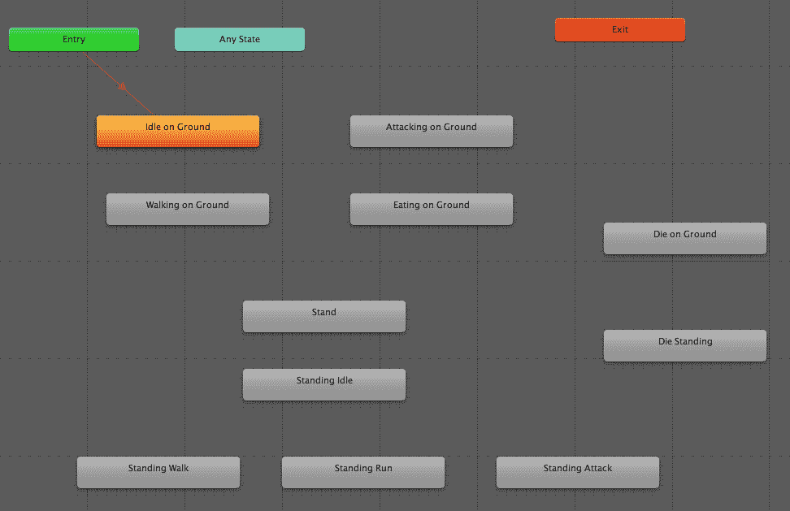

我们下一个任务是创建所有的状态转换。为每个要添加的状态转换遵循以下步骤：

1.  右键单击起始状态。

1.  选择“创建转换”。

1.  点击目标状态。

一旦您完成了所有转换，您可以将状态重新组织，以整理动画控制器布局区域。以下截图提供了一个建议的最终组织：

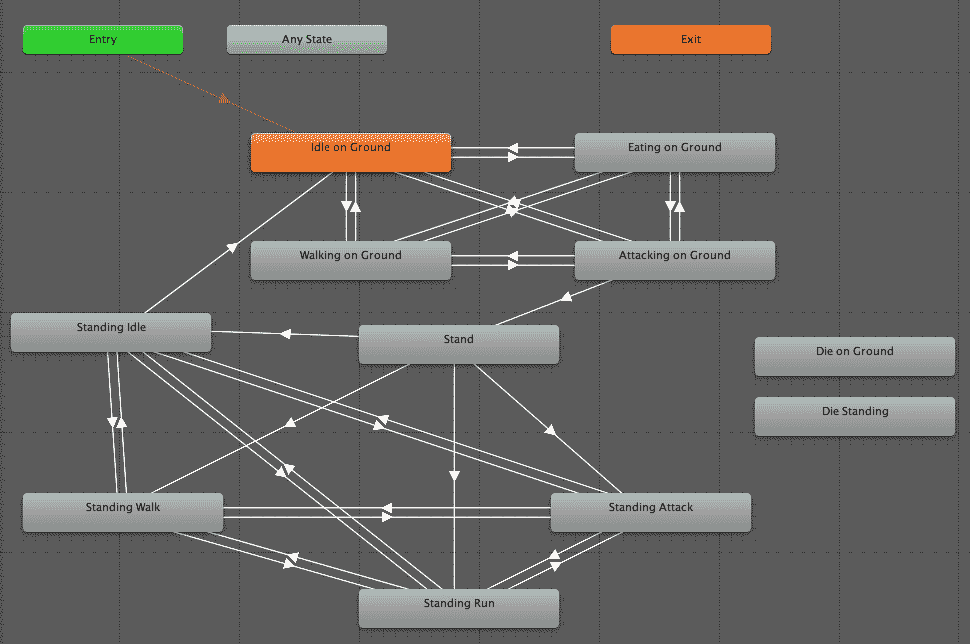

如您在最终安排中看到的，我们有 11 个状态和二十多个转换。您还会注意到**Die on Ground**和**Die Standing**状态没有任何转换。为了在我们游戏中使用这些动画，它们必须放入动画控制器中。

让我们进行一个快速实验：

1.  在层级面板中选择“甲虫”角色。

1.  在检查器面板中，点击“添加组件”按钮。

1.  选择“物理”|“盒式碰撞体”。

1.  点击“编辑碰撞体”按钮。

1.  调整盒式碰撞体的尺寸和位置，使其包围整个甲虫身体。

1.  再次点击“编辑碰撞体”按钮以退出编辑模式。

你的盒式碰撞体应该看起来与以下截图中的类似：


接下来，我们将创建一个脚本，当黄瓜人角色与甲虫碰撞时，会触发“Die on Ground”动画。这将模拟黄瓜人踩到甲虫的场景。按照以下步骤操作：

1.  在层级面板中选择“甲虫”角色。

1.  在检查器面板中，点击“添加组件”按钮。

1.  选择“新建脚本”。

1.  将脚本命名为`BeetleNPC`。

1.  点击创建和添加按钮。

1.  在项目视图中，选择收藏夹 | 所有脚本 | BeetleNPC。

1.  双击`BeetleNPC`脚本文件。

1.  编辑脚本，使其与以下代码块匹配：

```cs
 using System.Collections;
 using System.Collections.Generic;
 using UnityEngine;

 public class BeetleNPC : MonoBehaviour {

     Animator animator;

     // Use this for initialization
     void Start () {
         animator = GetComponent&lt;Animator>();    
     }

     // Collision Detection Test
     void OnCollisionEnter(Collision col) 
     {
         if (col.gameObject.CompareTag("Player"))
         {
             animator.Play("Die on Ground");
         }
     }
 } 
```

此代码检测黄瓜人和甲虫之间的碰撞。如果检测到碰撞，则播放`Die on Ground`动画。如以下截图所示，黄瓜人击败了黄瓜甲虫：

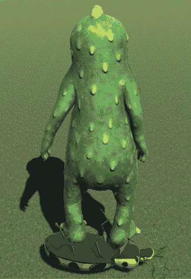

这个简短的测试展示了两个重要的东西，这将帮助我们进一步开发这个游戏：

+   在本节前面，你在动画控制器窗口中重命名了所有状态。你给状态起的名字是你在代码中要引用的名字。

+   由于我们使用的动画没有其他状态之间的过渡，黄瓜甲虫将保持在动画的最终位置，除非我们编写脚本进行其他操作。所以，如果我们有 100 只甲虫并且击败了它们，所有 100 只都会在游戏世界中保持背部朝上。

这是对我们的黄瓜甲虫进行的一个简单而成功的脚本测试。我们需要编写更多的脚本来管理游戏中的甲虫。首先，我们将对游戏世界进行一些修改。

# 为我们的黄瓜甲虫进行地形改造

我们的游戏世界目前非常大，非常适合我们构想的游戏。为了有效地演示如何编写黄瓜甲虫的脚本，我们将指定游戏中的一个沙盒区域，并将黄瓜甲虫限制在该区域内。我们还需要将一些樱花树移到那里。

我们将对游戏地形进行以下顺序修改：

+   指定一个沙盒区域

+   植种额外的樱花树

+   创建孵化点

# 指定一个沙盒区域

我们不一定想对我们的游戏地形进行重大修改。我们之前花了很多时间来规划、创建和微调地形。相反，我们将选择一个大型平坦区域作为沙盒。如果你没有大型平坦区域，你可以选择你的一个平坦区域并将其稍微扩大。

以下图像显示了相对于我们当前游戏世界的大小。图像底部中央的白色方框代表一个理想的大小：

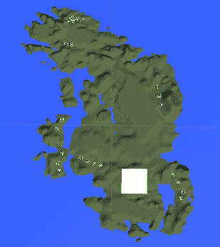

现在我们知道了沙盒的位置，让我们为沙盒创建的新项目准备层次结构面板。只需在层次结构面板的空白区域右键单击并选择创建空对象。选择那个新的`GameObject`后，在检查器面板中将其重命名为`Sandbox`。

# 植种额外的樱花树

由于我们的沙盒是我们更大游戏环境的一个较小表示，我们需要一个或多个樱花树。正如你所回忆的，黄瓜人将从樱花树上收集樱桃，并使用它们对黄瓜甲虫进行远程攻击。

在第六章，*为我们的游戏创建和导入 3D 对象*中，我们导入了我们的`樱桃树`对象，并对其进行了修改以适应我们的游戏。现在，我们只需简单地将额外的樱桃树添加到我们的沙盒区域。您可以直接从项目 | 资产 | 预制体中将 CherryTreeCollider 拖动到场景视图中的沙盒区域。

接下来，您将想要使用场景视图放大沙盒区域，以确保您的树木不在地面之上或需要额外的调整。

一旦您的额外樱桃树就位，每个新的樱桃树都将可在层次结构面板中访问。单击每个新创建的樱桃树，并将其拖动到您之前创建的`Sandbox`对象。我们只使用`Sandbox`对象进行组织。

# 创建出生点

在沙盒区域内，选择三个区域作为出生点。您创建它们的位置由您自己决定。将它们放置在彼此等距的位置是一个很好的方法。为了使这些出生点明显，让我们创建一个出生点，然后复制它并将其放置在沙盒的各个位置。

创建出生点的步骤如下：

1.  在层次结构面板中，右键单击沙盒，选择 3D 对象 | 圆柱体。

1.  在检查器面板中，将圆柱体重命名为`SpawnPad1`。

1.  单击变换 | 缩放，并按以下方式更改`SpawnPad1`的缩放比例：

    +   x = `3`

    +   y = `0.05`

    +   z = `3`

1.  通过将平台放置在黄瓜人下方来测试平台的缩放比例。它应该看起来与以下截图中的相似。进行调整，使您的平台与这里看到的一致：

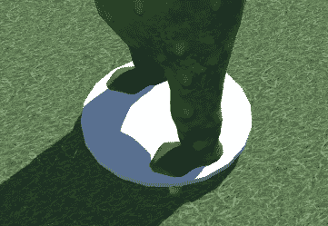

1.  选择`SpawnPad1`后，在检查器视图中取消选中 Mesh Renderer | 接收阴影复选框。这将防止阴影投射到我们的出生点。这一步并不是非常重要，但有助于使我们的出生点看起来不那么有机，而且由于我们将在该平台上生成黄瓜人，它增加了一个很好的视觉效果。

1.  使用变换工具，调整平台的位置，使其位于黄瓜人的脚底下方，正好或略高于草地水平。

1.  选择`SpawnPad1`后，单击检查器面板中材质 | 元素 0 | 缺失（材质）输入框右侧的小圆圈：


1.  从选择材质对话框窗口中选择您喜欢的材质。

1.  最后，在检查器面板中取消选中胶囊碰撞组件。我们不需要这个组件。

您现在有了第一个出生点。再复制两个，确保它们命名为`SpawnPad1`、`SpawnPad2`和`SpawnPad3`。在层次结构面板中，确保它们都在您的`Sandbox`对象中。

我们最后一个任务是将在场景视图中`Sandbox`区域中我们想要的位置放置三个出生点实例。

现在是保存您的场景和项目的好时机。

# 将黄瓜补丁添加到我们的地形中

在第六章，*为我们的游戏创建和导入 3D 对象*中，我们使用了平面来指定六个黄瓜田地区域。在本节中，我们将创建第七个黄瓜田地区域，并在沙盒区域中使用它。我们还将种植新的黄瓜田地区域内的黄瓜田地。

# 在沙盒中创建黄瓜田地区域

本节将指导你完成在沙盒中创建黄瓜田地区域所需的步骤。在层次结构面板中，你应该有一个包含各种尺寸黄瓜田地区域的`Cucumber Patch Areas`游戏对象，每个都是一个`plane`类型的 3D 对象。如果你没有这些对象，它们在下面的屏幕截图中显示，你可以通过重新访问第六章，*为我们的游戏创建和导入 3D 对象*，或者从出版商的配套网站上下载`Starting-Chapter-08`Unity 项目：


在我们的游戏中创建沙盒区域的步骤如下：

1.  在层次结构面板中，展开`Cucumber Patch Areas`游戏对象以显示六个平面。记住，我们创建了`Cucumber Patch Areas`游戏对象，以便作为我们方便的视觉组织文件夹。

1.  双击每个平面（`CucumberPatchArea1`、`CucumberPatchArea2`、`CucumberPatchArea3`、`CucumberPatchArea4`、`CucumberPatchArea5`和`CucumberPatchArea6`）。当你双击层次结构面板中的对象时，场景视图将聚焦于该对象。

1.  识别哪个黄瓜田地区域已经在你的沙盒中。

1.  在层次结构面板中，右键单击已识别的黄瓜田地区域并选择复制。

1.  将复制的黄瓜田地区域重命名为`CucumberPatchAreaSandbox`。

1.  在层次结构面板中，将`CucumberPatchAreaSandbox`拖动到`Sandbox`游戏对象下以使其成为其子对象。

1.  选择`CucumberPatchAreaSandbox`平面后，修改其形状以适应沙盒区域。使用变换工具来完成这一操作。

1.  如果需要，修改沙盒的地面部分，以确保`CucumberPatchAreaSandbox`范围内的地面是平坦的，并且可以接收黄瓜田地。

你可能需要使用提升/降低地面和平滑高度地面工具来确保带有`CucumberPatchAreaSandbox`的区域是平坦的。以下屏幕截图显示了橙色轮廓的`CucumberPatchAreaSandbox`区域、两棵樱桃树和用红色标记的三处出生点。较小的、更难看到的是黄瓜人和一只黄瓜甲虫。你的沙盒不需要看起来完全像这样，但应该具有以下屏幕截图所示相同的组件：

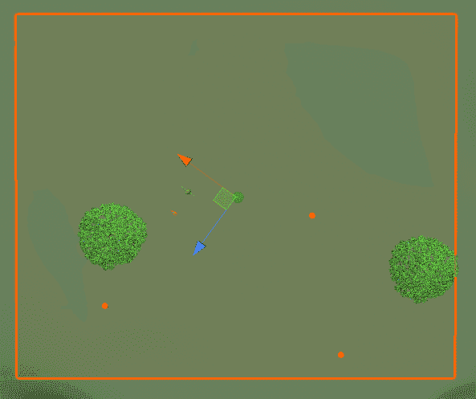

# 种植黄瓜田地

我们将使用我们的黄瓜块，`CucumberPatch1`和`CucumberPatch2`预制件，在沙盒中创建黄瓜块区域。这些区域将作为我们黄瓜的掩护。在本节中，我们将创建一个空的游戏对象来封装一系列黄瓜块。让我们开始吧：

1.  在层次结构面板中右键单击沙盒并选择创建空对象。

1.  将新创建的游戏对象重命名为`cucumberPatches`。

1.  将几个`CucumberPatch1`预制件拖放到你的沙盒场景中。

1.  将几个`CucumberPatch2`预制件拖放到你的沙盒场景中。

1.  在层次结构面板中，将所有新创建的黄瓜块移动到沙盒下的`cucumberPatches`游戏对象。这样做只是为了保持层次结构面板的整洁。

1.  在层次结构面板中展开`cucumberPatches`游戏对象。

1.  选择你添加的所有黄瓜块，并使用*Ctrl* + *C* 和 *Ctrl* + *V* 分别复制和粘贴它们。复制的结果将在层次结构面板中高亮显示，并在场景视图中可访问。

1.  在场景视图中，使用变换工具重新定位复制的黄瓜块组。

1.  重复步骤 7 和 8，直到你对你的沙盒满意为止。

以下截图展示了你的沙盒可能看起来像什么，其中包含新创建的黄瓜块。你的沙盒可能会有所不同，这是正常的：

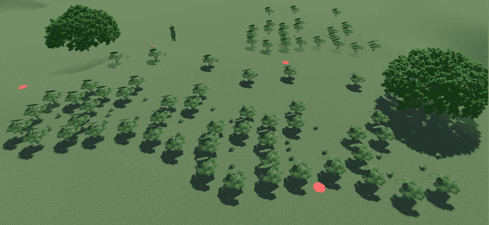

我们现在的沙盒中有足够的黄瓜块。在下一节中，我们将专注于黄瓜。

# 将黄瓜添加到我们的地形中

在我们的游戏中，黄瓜将被用来给甲虫提供寻找和食用的东西。我们将在沙盒区域放置几个黄瓜，并在第十章“脚本我们的得分系统”中，在游戏过程中跟踪它们的数量。在本节中，我们将为我们的使用准备黄瓜，并在游戏中填充它们。

你之前已经下载了必要的黄瓜资源。如以下截图所示，`Cucumber`在`Assets/Cucumber`文件夹中是可访问的。你会注意到当我们选择`Cucumber`时，项目面板底部将`Cucumber`文件识别为`.fbx`文件：

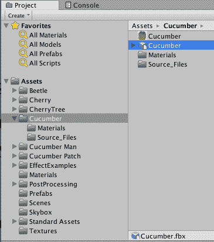

`.fbx`文件是从 3D 建模软件导出的，这样我们就可以在游戏中使用它。当选择该资源时，检查器视图会显示导入设置。我们想要访问变换、网格渲染器和其他组件，因此我们将将其转换为预制件并做一些更改。以下是初始步骤：

1.  将`Cucumber.fbx`文件从 Assets | Cucumber 拖动到层次结构面板。

1.  在层次结构面板中选择`Cucumber`，将其拖动到项目面板中的`Assets`/`Prefabs`文件夹。

1.  从层次结构面板中删除`Cucumber`。

1.  在项目面板中，选择 Assets | Prefabs | Cucumber。

当我们从层级面板将刚刚移动的`Cucumber`文件拖到`Prefabs`文件夹时，项目面板底部显示的以下截图将`Cucumber`识别为预制件：


现在，当我们查看检查器面板时，我们可以访问我们需要的组件，以进一步准备黄瓜在游戏中的使用。让我们对预制件做一些修改：

1.  在检查器面板中，选择标签 | 添加标签。

1.  在标签和图层界面中，点击视图右侧的加号图标。如下所示，加号图标下方是 CherryTree 标签，右侧：


1.  输入名称黄瓜。

1.  点击保存按钮。

1.  在项目面板中选择资产 | 预制件 | 黄瓜预制件。

1.  在检查器面板中，选择标签 | 黄瓜。

现在我们已经为`cucumber`预制件添加了标签，所有副本都将具有相同的标签。这个标签将帮助我们进行以下游戏操作：

+   轻松计算游戏中剩余的黄瓜数量

+   识别甲虫找到黄瓜的时间

我们需要对我们的`cucumber`预制件进行一项修改——添加一个碰撞器：

1.  在项目面板中选择资产 | 预制件 | 黄瓜预制件。

1.  在检查器面板中，点击添加组件按钮

1.  选择物理 | 矩形碰撞器

接下来，我们可以将黄瓜添加到沙盒区域。首先，让我们采取与黄瓜田地组织相同的方法：

1.  在层级面板中右键单击沙盒并选择创建空对象。

1.  将新的`GameObject`重命名为`cucumbers`。

1.  将几个`Cucumber`预制件拖到场景中，在你的沙盒里。你也可以将单个预制件拖到场景视图中，并使用快捷键*Ctrl* + *D*来复制它，这将复制所有当前选定的对象。

1.  使用变换工具旋转、调整大小和重新定位黄瓜。

1.  确保你的沙盒区域至少有 10 个黄瓜。

1.  在层级面板中，将所有新创建的黄瓜移动到沙盒下的`cucumbers`游戏对象中。这只是为了保持层级面板的整洁。

一旦你在游戏世界的沙盒区域中分散了黄瓜，你就可以开始编写黄瓜甲虫的脚本了。我们将在下一节中处理这个问题。

现在是保存你的场景和项目的好时机。

# 编写非玩家角色的脚本

在本节中，我们将编写必要的脚本以管理游戏中的黄瓜甲虫。具体来说，我们将编写以下脚本来完成以下任务：

+   甲虫巡逻

+   甲虫找到并吃黄瓜

+   甲虫攻击地面上的玩家

+   甲虫站立准备攻击

# 整理组织

由于我们将编写多个脚本，我们应该保持组织。我们可以在项目面板中点击收藏 | 所有脚本以获取项目中所有脚本的列表，但它们有很多，其中大部分我们不会为我们的游戏进行编辑。因此，让我们在项目面板中创建一个文件夹来组织我们的自定义脚本。以下是步骤：

1.  在项目面板中，右键点击`Assets`文件夹

1.  选择创建 | 文件夹

1.  将新文件夹命名为`Custom Scripts`

现在我们已经有了自定义脚本的文件夹，让我们移动一些脚本：

1.  在项目面板中，点击收藏 | 所有脚本。

1.  滚动直到找到本章早期创建的`BeetleNPC`脚本。

1.  将`BeetleNPC`脚本拖到我们的`Custom Scripts`文件夹。这将把`BeetleNPC`脚本移动到指定的文件夹。您仍然会在收藏 | 所有脚本中看到它，因为此功能显示所有脚本，无论它们的位置如何。

1.  将`CameraFollower`脚本移动到`Custom Scripts`文件夹。

1.  将`PlayerController`脚本移动到`Custom Scripts`文件夹。

1.  将`PlayerMotor`脚本移动到`Custom Scripts`文件夹。

当您完成移动脚本后，您的`Cucumber Scripts`文件夹应与以下截图相同：


在我们的游戏中，甲虫将具有以下行为：

+   搜索黄瓜（巡逻）

+   当找到黄瓜时吃掉它们

+   在地面上防御来自黄瓜人的攻击

+   站立以防御来自黄瓜人的攻击

下面的章节将向您展示如何编写这些行为。

# 甲虫巡逻

我们游戏中的甲虫将在沙盒区域内寻找黄瓜。在本节中，我们将编写一个脚本来管理它们的巡逻。让我们做一些准备工作。

我们将从为我们的`Beetle`预制体创建一个角色控制器开始。以下是步骤：

1.  在项目面板中，选择资产 | 预制体，并点击`Beetle`预制体

1.  在检查器面板中，点击添加组件按钮

1.  选择物理 | 角色控制器

确保您将角色控制器添加到`Beetle`预制体，而不是场景中的甲虫。

我们不需要对默认的角色控制器进行任何更改，但我们确实需要一个。

接下来，让我们简化操作，为甲虫创建一些临时的包含墙壁。您可以简单地添加 3D 立方体游戏对象，并使用变换工具将它们定位，以便它们与沙盒或沙盒的一部分相邻。您可以将墙壁放入名为`Walls`的空游戏对象中，并在层次结构面板中组织它们，使其位于`Sandbox`游戏对象内部。以下截图是一个示例：

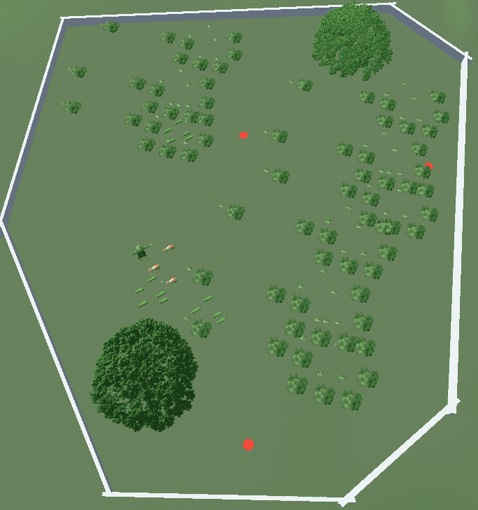

好的，现在我们准备开始编写甲虫巡逻的脚本。要开始，在项目面板中右键点击 Assets | Custom Scripts 文件夹。选择 Create | C# Script，然后给脚本命名为 `BeetlePatrol`。这将在我们的 `Custom Scripts` 文件夹中为我们创建一个 C# 脚本。我们将从小块开始，从上到下逐步分析这个脚本。

这段代码的第一个部分简单地导入了 `System.Collections`、`System.Collections.Generic` 和 `UnityEngine`。该部分还包括我们的 `BeetlePatrol` 类头：

```cs
 using System.Collections;
 using System.Collections.Generic;
 using UnityEngine;

 public class BeetlePatrol : MonoBehaviour { 
```

在下一节中，我们提供了变量。第一个变量 `isDie` 是一个全局变量，我们将使用它来确定黄瓜甲虫是否应该停止巡逻。其余的变量是局部的。它们的使用在查看后续代码部分后将是显而易见的：

```cs
// Variables
public static bool isDie = false;

public float speed = 5;
public float directionChangeInterval = 1;
public float maxHeadingChange = 30;

Animator beetleAnim;

CharacterController controller;
float heading;
Vector3 targetRotation;

```

下一个代码部分是我们的 `Start()` 方法，它只在游戏开始时运行。这段代码设置了甲虫巡逻的初始旋转：

```cs
void Start () {

     controller = GetComponent&lt;CharacterController>();
     beetleAnim = GetComponent&lt;Animator> ();

     // Set random initial rotation
     heading = Random.Range(0, 360);
     transform.eulerAngles = new Vector3(0, heading, 0);

     StartCoroutine(NewHeading()); 
} 
```

在以下代码中显示的我们的 `Update()` 方法是下一个部分。这段代码将在每个游戏帧中执行一次。在这里，您可以看到如果条件 `isDie` 是 `false`（或不是 `true`），则代码将被执行：

```cs
void Update () {

     if (!isDie) {
          transform.eulerAngles = Vector3.Slerp (transform.eulerAngles, targetRotation, 
               Time.deltaTime * directionChangeInterval);
          var forward = transform.TransformDirection (Vector3.forward);
          controller.SimpleMove (forward * speed);
     }

} 
```

这最后一段代码提供了两个方法。`NewHeading()` 和 `NewHeadingRoutine()` 方法计算甲虫移动的新方向：

```cs
IEnumerator NewHeading () {

     while (true) {
          NewHeadingRoutine();
          yield return new WaitForSeconds(directionChangeInterval);
     }
}

void NewHeadingRoutine () {

     var floor = transform.eulerAngles.y - maxHeadingChange;
     var ceil  = transform.eulerAngles.y + maxHeadingChange;
     heading = Random.Range(floor, ceil);
     targetRotation = new Vector3(0, heading, 0);
 }

} // this is the end of the Beetle Patrol class
```

保存您的脚本。接下来，我们需要将其与 `Beetle` 预制件关联。选择预制件后，在检查器面板中点击添加组件按钮。然后，选择 Scripts | Beetle Patrol。

您可以将多个甲虫拖入场景并测试游戏。您应该看到它们在您建造的墙壁内四处游荡。

# 甲虫找到并吃掉黄瓜

在本章的早期，我们创建了一个 `BeetleNPC` 脚本文件并将其附加到我们的 `Beetle` 预制件上。该脚本检测与黄瓜人的碰撞。在本节中，我们将修改该脚本，使其能够检测与黄瓜的碰撞。

让我们首先确保黄瓜被正确设置。检查在检查器面板中黄瓜的 Box Collider 组件是否被选中（勾选）。接下来，在场景的沙盒区域内复制几个黄瓜。您可以将它们放在甲虫附近，以便更容易进行测试。以下截图显示了最佳测试配置：

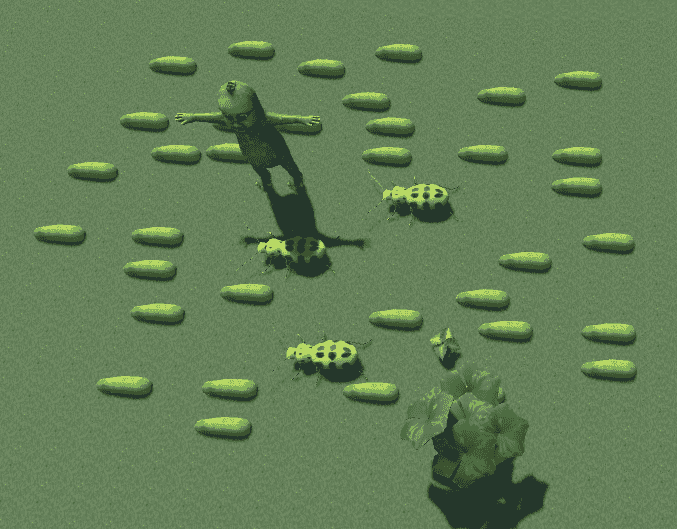

`BeetleNPC` 脚本需要一个新的变量和两个方法，其中一个将用作协程。让我们从新的变量开始。正如您在下面的代码片段中可以看到的，我们现在有一个第二个变量，`cucumberToDestroy`。我们将使用它来引用被甲虫吃掉的那个黄瓜：

```cs
Animator animator;
public GameObject cucumberToDestroy; 
```

接下来，我们将添加一个类似于我们在本章之前创建的 `OnCollissionEnter` 的 `OnTriggerEvent()` 方法。如你所见，我们正在测试草莓虫是否与黄瓜相撞。当检测到这种情况时，将执行四行代码。第一行将 `cucumberToDestroy` 变量指向草莓虫相撞的具体黄瓜。下一行将 `isEating` 值设置为 `true`。我们将更新 `BeetlePatrol` 脚本来适应这一变化。第三条语句播放进食动画。最后一条语句调用 `DestroyCucumber` 函数，我们将在下一节中查看该函数：

```cs
void OnTriggerEnter(Collider theObject) {
     if (theObject.gameObject.CompareTag ("Cucumber")) {
         cucumberToDestroy = theObject.gameObject;
         BeetlePatrol.isEating = true;
         animator.Play ("Eating on Ground");
         StartCoroutine ("DestroyCucumber");
     }
} 
```

对 `BeetleNPC` 脚本的最后修改是 `DestroyCucumber()` 函数。我们使用此函数来延迟黄瓜的销毁。这模拟了草莓虫吃黄瓜所需的时间。你可以根据需要更改 `WaitForSecondsRealTime` 参数。该参数代表现实世界中的秒数。一旦延迟结束，对象将被销毁，`isEating` 变量将被设置为 `false`：

```cs
IEnumerator DestroyCucumber() {

     yield return new WaitForSecondsRealtime (4);
     Destroy (cucumberToDestroy.gameObject);
     BeetlePatrol.isEating = false;
} 
```

我们需要对我们的 `BeetlePatrol` 脚本进行两项修改。首先，如以下代码所示，我们将添加新的 `isEating` 变量：

```cs
 public static bool isDie, isEating = false; 
```

我们对 `BeetlePatrol` 脚本的最后修改是更新条件语句，如下所示代码所示。现在，如果草莓虫正在死亡或进食，我们将停止巡逻：

```cs
void Update () {

     if (!isDie && !isEating) {
          transform.eulerAngles = Vector3.Slerp (transform.eulerAngles, targetRotation, 
               Time.deltaTime * directionChangeInterval);
          var forward = transform.TransformDirection (Vector3.forward);
          controller.SimpleMove (forward * speed);
     }
} 
```

# 草莓虫攻击地面的玩家

目前，当我们的黄瓜人与黄瓜虫相撞时，会播放死亡动画，但没有实现其他行为。在本节中，我们将修改必要的脚本，以便每次黄瓜人与黄瓜虫相撞时发生以下行为：

+   草莓虫面对黄瓜人

+   草莓虫在指定时间内攻击黄瓜人

+   草莓虫的死亡动画播放

+   草莓虫从游戏中移除

我们将在 `OnCollisionEnter()` 方法中使用以下三行代码来强制草莓虫在碰撞时面对黄瓜人。如以下代码所示，我们创建一个变量以便轻松引用黄瓜人，然后为黄瓜人的当前变换创建第二个变量。第三行代码告诉当前黄瓜虫面对黄瓜人：

```cs
var cm = GameObject.Find ("CucumberMan");
var tf = cm.transform;
this.gameObject.transform.LookAt (tf); 
```

现在，我们只需编辑 `OnCollisionEnter` 方法，包括两个语句。第一个语句播放 Attacking on Ground 动画。第二个语句调用将销毁当前黄瓜虫的函数。以下是这两行代码：

```cs
animator.Play ("Attacking on Ground");
StartCoroutine ("DestroySelf"); 
```

对 `BeetleNPC` 脚本的最后修改是 `DestroySelf()` 函数。我们使用此函数来模拟当前黄瓜虫的战斗和生命结束。函数内部有三个语句。第一个语句模拟攻击时间。第二个语句播放 `Die on Ground` 动画。最后一行销毁游戏对象，即当前黄瓜虫：

```cs
IEnumerator DestroySelf() {

     yield return new WaitForSecondsRealtime (4);
     animator.Play ("Die on Ground");
     Destroy (this.gameObject, 4);
} 
```

我们需要对我们的`BeetlePatrol`脚本进行两项修改。首先，如以下代码所示，我们将添加新的`isAttacking`变量：

```cs
 public static bool isDie, isEating, isAttacking =</span> false; 
```

我们对`BeetlePatrol`脚本的最后一次修改是更新条件语句，如下所示。现在，如果甲虫正在死亡、进食或攻击，我们将停止巡逻：

```cs
void Update () {

     if (!isDie && !isEating && !isAttacking)) {
          transform.eulerAngles = Vector3.Slerp (transform.eulerAngles, 
               targetRotation, Time.deltaTime * directionChangeInterval);
          var forward = transform.TransformDirection (Vector3.forward);
          controller.SimpleMove (forward * speed);
     }
} 
```

我们将在第十章脚本化我们的得分系统中对脚本和行为进行进一步的修改。

# 甲虫站立以攻击

你会记得黄瓜人能够向黄瓜甲虫投掷樱桃。这是一种远程攻击，如果黄瓜甲虫开始在地面行走或奔跑以攻击黄瓜人，那么甲虫很可能会在到达黄瓜人之前死亡。

因此，如果甲虫被樱桃击中，我们希望发生以下情况：

+   甲虫面向黄瓜人

+   甲虫站立

+   甲虫在站立的同时向黄瓜人奔跑

+   甲虫在站立时攻击黄瓜人

如果你需要回顾动画的外观，可以查看动画。

我们将对`BeetleNPC`脚本进行一些重大修改。更新的脚本在以下代码中完整呈现，分为按顺序的几个部分，并附有说明。

本节展示了导入和类级别变量。你会注意到最后三个变量（`cherryHit`、`smoothTime`和`smoothVelocity`）是新的。我们将使用`cherryHit`来跟踪导致甲虫死亡的序列。其余两个变量将用于控制甲虫到达黄瓜人的速度和流畅度：

```cs
 using System.Collections;
 using System.Collections.Generic;
 using UnityEngine;

 public class BeetleNPC : MonoBehaviour {

     Animator animator;
     public GameObject cucumberToDestroy;
     public bool cherryHit = false;
     public float smoothTime = 3.0f; 
     public Vector3 smoothVelocity = Vector3.zero;
```

没有对`Start()`方法进行修改：

```cs
 void Start () {
      animator = GetComponent&lt;Animator>();
 }
```

我们现在开始使用`Update()`方法。这是必要的，以便展示甲虫可以朝向黄瓜人移动的每一帧。你还可以看到我们在条件语句中使用了`cherryHit`变量：

```cs
void Update () {
     if (cherryHit) {
          var cm = GameObject.Find ("CucumberMan");
          var tf = cm.transform;
          this.gameObject.transform.LookAt (tf);

          animator.Play ("Standing Run");

          transform.position = Vector3.SmoothDamp (transform.position, tf.position,
               ref smoothVelocity, smoothTime);
     }
}

```

我们脚本的下一部分是`OnCollisionEnter()`方法。我们将之前在这个方法中的语句移动，以便它们被一个`if`语句封装。如果`cheeryHit`为`false`，则将执行原始代码，否则将执行`else`语句之后的两个代码行。我们看到那里我们触发了两个动画：

```cs

 void OnCollisionEnter(Collision col) {
      if (col.gameObject.CompareTag ("Player")) {

           if (!cherryHit) {
                BeetlePatrol.isAttacking = true;

                var cm = GameObject.Find ("CucumberMan");
                var tf = cm.transform;
                this.gameObject.transform.LookAt (tf);

                animator.Play ("Attacking on Ground");
                StartCoroutine ("DestroySelfOnGround");
           } else {
                animator.Play ("Standing Attack");
                StartCoroutine ("DestroySelfStanding");
           }
     }
}
```

下一部分代码是之前创建的用于处理与黄瓜碰撞的`OnTriggerEnter()`方法。从以下代码中可以看出，我们添加了一个`else if`语句来检查我们是否与一个标签为`Cherry`的`gameObject`发生了碰撞。当这个条件为`true`时，我们将`isAttacking`布尔变量设置为`true`，这样由`BeetlePatrol`脚本驱动的向前运动就会停止。我们还设置了`cherryHit`的值为`true`，并播放显示甲虫站立的动画：

```cs
void OnTriggerEnter(Collider theObject) {
     if (theObject.gameObject.CompareTag ("Cucumber")) {

          cucumberToDestroy = theObject.gameObject;
          BeetlePatrol.isEating = true;
          animator.Play ("Eating on Ground");
          StartCoroutine ("DestroyCucumber");
 } else if (theObject.gameObject.CompareTag ("Cherry")) {
          BeetlePatrol.isAttacking = true;
          cherryHit = true;
          animator.Play ("Stand");
 }
}
```

我们`BeetleNPC`脚本的最后部分包含三个与`Destroy`相关的函数。你已经熟悉`DestroyCucumber()`。我们将`DestroySelf()`函数重命名为`DestroySelfOnGround()`，并添加了新的`DestroySelfStanding()`：

```cs
IEnumerator DestroyCucumber() {
     yield return new WaitForSecondsRealtime (4);
     Destroy (cucumberToDestroy.gameObject);
     BeetlePatrol.isEating = false;
}

IEnumerator DestroySelfOnGround() {

     yield return new WaitForSecondsRealtime (4);
     animator.Play ("Die on Ground");
     Destroy (this.gameObject, 4);
}

IEnumerator DestroySelfStanding() {

     yield return new WaitForSecondsRealtime (4);
     animator.Play ("Die Standing");

     Destroy (this.gameObject, 4);
     cherryHit = false;
}

} // End of BeetleNPC.cs
```

为了测试这个功能，我们需要在我们的场景中放置一些樱桃。首先，从发布者的网站上下载`Cherries.unitypackage`资产包。这个包包含一个已经设置好以在我们的游戏中工作的`Cherry.prefab`文件。它有一个`Cherry`标签和一个带有`Is Trigger`选中的`Box Collider`。

在第十章，*脚本化我们的得分系统*中，我们将为黄瓜人添加投掷樱桃的能力。现在，让我们在我们的沙盒中放置一些樱桃以进行测试。以下截图所示的一种方法是将樱桃围绕在甲虫周围。这将使我们的测试更容易、更快：

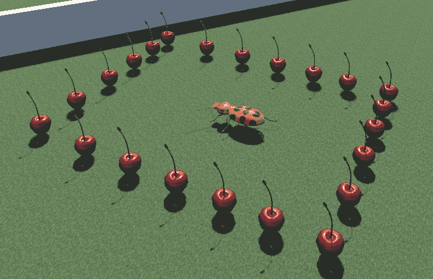

现在是保存你的场景和项目的好时机。

# 摘要

在本章中，我们专注于我们游戏中的非玩家角色——黄瓜甲虫。我们回顾了甲虫的 11 个动画，并对非玩家角色的动画控制器进行了修改。此外，我们还编写了控制非玩家角色的脚本。我们的脚本产生了几个甲虫行为：巡逻、消耗黄瓜、地面战斗，以及被樱桃击中时站立、奔跑和用后腿攻击。我们还向我们的游戏世界添加了黄瓜地、黄瓜和樱桃。

在第九章，*添加抬头显示*中，我们将设计、开发和整合一个**抬头显示**（**HUD**）到我们的游戏中。我们将创建文本和图形，提供得分、健康和额外信息的视觉指示，以帮助玩家在游戏过程中保持对局势的了解。
