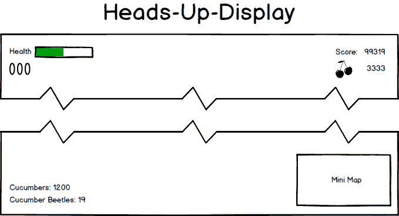
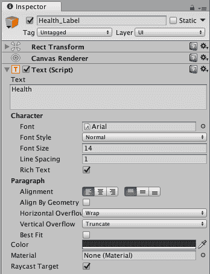
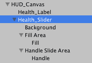
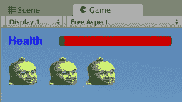
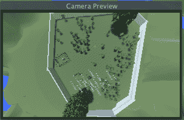
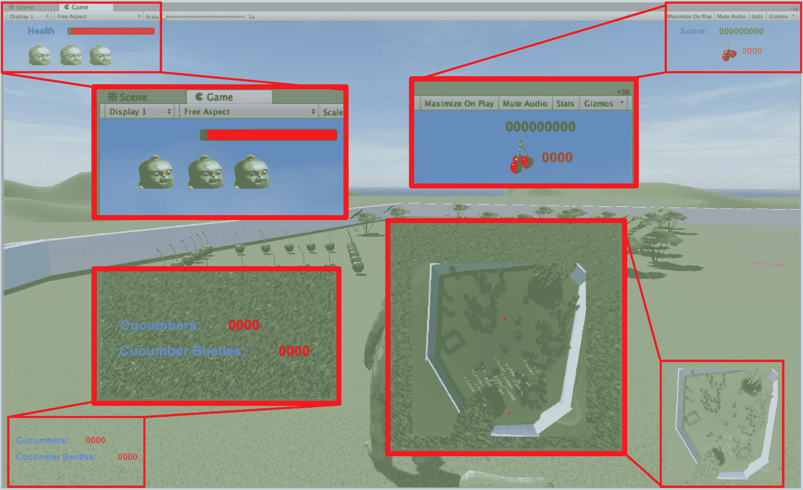

# 第九章：添加抬头显示

在上一章中，我们配置了非玩家角色，即黄瓜甲虫，并回顾了其 11 个动画。我们对非玩家角色的动画控制器进行了重大调整。我们还计划和编写了脚本以控制非玩家角色的游戏内行为，包括巡逻、吃黄瓜、地面战斗和后腿战斗。此外，我们还向游戏世界中添加了黄瓜地、黄瓜和樱桃。

在本章中，我们将设计、开发和集成我们的游戏中的**抬头显示**（**HUD**）。我们将使用画布来创建文本和图形，提供关于得分、生命值和额外信息的视觉指示，以帮助玩家在游戏过程中保持对局势的了解。我们还将使用 Unity 相机实现一个迷你地图。

在本章中，我们将涵盖以下内容：

+   设计我们的 HUD

+   使用画布

+   创建迷你地图

+   动态内容的脚本编写

# 设计我们的抬头显示

如您从第三章，“设计游戏”中记得的，我们将有六个屏幕组件：生命值、生命、得分、樱桃、黄瓜和黄瓜甲虫。现在，这个设计将修改以包括屏幕右下角的迷你地图：



现在我们将有七个组件组成我们的 HUD，让我们按区域组织来回顾每个组件：

+   **左上角**：

    +   **玩家生命值**：这将由一个指示*生命值*的文本标签和一个与黄瓜人生命值相关的生命值表组成。

    +   **生命值**：我们将有一个视觉指示，显示黄瓜人的剩余生命值。玩家开始时有三个生命值。

+   **右上角**：

    +   **得分**：我们将添加一个文本标签来指示得分，然后在这里更新玩家的实际得分。

    +   **樱桃**：黄瓜人拥有的樱桃数量将在这里更新并显示。

+   **右下角**：

    +   **迷你地图**：这将是一个迷你地图，显示游戏地图的概述，并指示黄瓜甲虫的位置。

+   **左下角**：

    +   **黄瓜**：我们将包括一个文本标签，以及游戏中剩余的黄瓜数量。

    +   **黄瓜甲虫**：HUD 的这个最后区域将包含一个文本标签和游戏中剩余的黄瓜甲虫数量。

现在我们已经为我们的 HUD 有了明确的设计，我们准备创建它。在您进入下一节之前，您应该打开您的 Unity 游戏项目。或者，您可以从出版商的配套网站上下载可用的`Starting-Chapter-09`Unity 项目。

# 使用画布

在 Unity 中，我们可以使用画布作为 UI 组件的容器。画布是 GameObject，UI 组件是我们希望在游戏过程中显示在屏幕上的视觉组件。在本节中，我们将创建一个画布，然后添加并配置必要的 UI 组件，以匹配上一节中我们设计的 HUD。

# 添加画布

添加 UI 画布的步骤如下：

1.  在层次面板的空白区域右键单击并选择 UI | Canvas。您可以在检查器面板中查看画布的详细信息。

你会在层次面板中注意到，当你创建画布时，Unity 创建了一个 `EventSystem`。此系统用于管理用户输入。

1.  将新画布 GameObject 的名称从 `Canvas` 更改为 `HUD_Canvas`。为我们的 GameObject 使用描述性的名称被认为是良好的开发实践。不需要对任何画布属性进行其他更改。

# 添加健康条 UI 组件

接下来，我们将创建 UI 组件以显示黄瓜人的健康：

1.  在层次面板中右键单击 HUD_Canvas GameObject 并选择 UI | Text。这将创建一个属于画布的文本对象。

1.  将文本组件重命名为 `Health_Label`。

1.  在层次面板中右键单击 HUD_Canvas GameObject 并选择 UI | Slider。这将创建一个属于画布的滑动对象。

1.  将滑动组件重命名为 `Health_Slider`。

到目前为止，我们已经创建了一个包含文本和滑动组件的画布。接下来，我们将对画布上的 UI 组件进行定位，以匹配上一节中我们的 HUD 设计中的位置：

1.  在层次面板中双击 HUD_Canvas。这将使场景视图中的画布聚焦，这将为您提供一个关于画布外观的概述。

1.  在层次面板中双击 Health_Label。现在，您可以看到我们创建的文本和滑动组件。

1.  缩小视图，直到您可以在场景视图中看到整个画布。

1.  在场景视图中切换 2D 视图。这将使在画布上定位我们的 UI 组件变得容易得多：


1.  确保在层次面板中选择 Health_Label。

1.  在检查器面板中，将 Text (Script) 组件的 Text 值更改为 `Health`。请参阅以下截图以获取详细信息：



1.  将 Health_Label 拖动到画布的左上角。

1.  在 Text (Script) 组件中，进行以下更改，或选择您喜欢的其他设置。您可以在游戏模式中实验游戏，看看这将如何在游戏中看起来：

| **属性** | **值** |
| --- | --- |
| 字体 | Arial |
| 字体样式 | 加粗 |
| 字体大小 | 16 |
| 颜色 | 深蓝色 |

1.  要么在检查器面板中，要么在场景视图中，调整包围 Health_Label UI 文本组件的矩形大小，以确保文本上方、下方或右侧没有过多的空白空间。

1.  将 Health_Slider 移动到 Health_Label 文本立即右侧。

1.  在检查器面板中，对 Slider (Script) 组件进行以下更改：

    +   取消选择 Interactable 复选框

    +   将最大值更改为`100`

    +   选择 Whole Numbers 复选框

1.  在层次面板中，展开 Health_Slider 对象以显示以下下属部分：



1.  在层次结构面板中，选择 HUD_Canvas | Health_Slider | 背景。

1.  在检查器面板中，选择 Image (Script) | 颜色并将颜色更改为红色。这将成为我们的生命值计的背景。

1.  在层次结构面板中，选择 HUD_Canvas | Health_Slider | Fill Area | Fill。

1.  在检查器面板中，选择 Image (Script) | 颜色并将颜色更改为绿色。这将成为我们的生命值计的填充区域。

我们生命值计的最后两个步骤将是增加高度和移除滑块把手：

1.  在层次结构面板中，选择 HUD_Canvas | Health_Slider。

1.  在检查器面板中，选择矩形变换 | 高度并将高度更改为 `30`。

1.  在层次结构面板中，选择 HUD_Canvas | Health_Slider | Handle Slide Area | Handle。

1.  取消选择 Image (Script) 组件。这将从 UI 中移除滑块的把手。

1.  在场景视图中，调整 Health_Label 和 Health_Slider，使它们在画布的左上角对齐。

您完成的工作应类似于以下来自游戏视图的截图：


在继续下一节之前，进行任何必要的调整。

# 创建剩余生命 UI 组件

在本节中，我们将在健康标签和计下方添加三个代表剩余生命的黄瓜人头像图像：

1.  从出版商的网站上下载 `cmLives.png` 文件

1.  将该图像拖动到项目面板中的 `Assets` | `Cucumber Man` 文件夹

1.  选择导入的图像，并在检查器面板中，将纹理类型更改为 Sprite (2D and UI)

1.  在层次结构面板中，右键单击 `HUD_Canvas` 并选择 UI | Image

1.  在检查器面板中，点击 Image (Script) | Source Image 下的设置右侧的小圆圈

1.  选择在步骤 2 中添加的 `cmLives.png` 图像

1.  在检查器面板中，将此图像重命名为 `Life1`

1.  点击矩形变换 | 缩放并将 Life1 的 X、Y 和 Z 缩放比例更改为 `0.4`

1.  在场景视图中，重新定位 Life1 图像，使其直接位于健康标签之前

1.  在层次结构面板中，右键单击并复制 Life1 两次，并将副本重命名为 `Life2` 和 `Life3`

1.  在场景视图中，重新定位三个图像，使它们按顺序排列并视觉上对齐

您完成的工作应类似于以下来自游戏视图的截图：



在继续下一节之前，进行任何必要的调整。

# 添加得分 UI 组件

我们游戏界面和画布的右上角将包含得分信息。本节演示如何创建必要的 UI 组件：

1.  在层次结构面板中，右键单击 HUD_Canvas GameObject 并选择 UI | 文本。我们将使用此文本对象作为得分标签。

1.  将文本组件重命名为 `Score_Label`。

1.  在检查器面板中，将文本（脚本）组件的文本值更改为`Score`。

1.  在文本（脚本）组件中，进行以下更改或根据需要选择其他设置。您可以在游戏模式中实验游戏，看看这将如何在游戏中显示：

    +   字体样式：粗体

    +   字体大小：16

    +   颜色：深蓝

1.  要么在检查器面板中，要么在场景视图中，调整包围你的`Score_Label`UI 文本组件的矩形大小，以确保文本上方、下方或右侧没有过多的空白空间。

1.  在层级面板中右键点击 HUD_Canvas GameObject 并选择 UI | 文本。我们将使用此文本对象来显示当前分数。

1.  将文本组件重命名为 `Score_Value`。

1.  在检查器面板中，将文本（脚本`）`组件的文本值更改为`000000000`。这将帮助我们确定布局。

1.  要么在检查器面板中，要么在场景视图中，调整包围你的`Score_Value`UI 文本组件的矩形大小，以确保文本上方、下方或右侧没有过多的空白空间。

1.  对`Score_Value`文本组件重复步骤 4。

现在您已经将两个与分数相关的 UI 文本组件添加到画布中，您就可以在屏幕上重新定位它们了。

1.  在场景视图中，调整 Score_Label 和 Score_Value 文本对象，使它们的矩形变换大小足以包围文本值

1.  最后，在场景视图中重新定位两个文本对象，使它们在画布的右上角对齐。

您完成的工作应类似于以下来自游戏视图的截图。


在进行下一节之前，进行任何必要的调整。

# 添加樱桃 UI 组件

在本节中，我们将添加樱桃的图像和用于显示 Cucumber Man 拥有的樱桃数量的文本对象。

我们将首先添加樱桃图像：

1.  从出版商的网站上下载`Cherries.png`文件

1.  将该图像拖动到项目面板中的`Assets` | `Cherry`文件夹

1.  选择导入的图像，并在检查器面板中，将纹理类型更改为 Sprite（2D 和 UI）

1.  在层级面板中，右键点击 HUD_Canvas 并选择 UI | 图像

1.  在检查器面板中，点击 Image（脚本）| 源图像设置右侧的小圆圈

1.  选择在步骤 2 中添加的`Cherries.png`图像

1.  在检查器面板中，将其重命名为`Cherries`

1.  点击  矩形变换 | 缩放 并将樱桃的缩放比例更改为 x、y 和 z 的`0.4`

1.  在场景视图中，将 Cherries 图像直接放置在 Score_Value 文本对象的开头下方

接下来，我们将添加一个文本对象来显示樱桃数量：

1.  在层级面板中右键点击 HUD_Canvas GameObject 并选择 UI | 文本。

1.  将文本组件重命名为 `Cherries_Count`。

1.  在检查器面板中，将文本（脚本）组件的文本值更改为`0000`。这将帮助我们确定布局。

1.  在文本（脚本）组件中，将字体样式更改为粗体，字体大小 更改为 16，颜色更改为红色，或者选择你喜欢的其他设置。

1.  要么在检查器面板中，要么在场景视图中，调整包围你的`Cherries_Count` UI 文本组件的矩形大小，以确保文本上方、下方或右侧没有过多的空白空间。

1.  在场景视图中，将`Cherry_Count` 文本对象重新定位到`Cherries`图像对象的右侧。

你的最终作品应该看起来类似于以下游戏视图的截图：


在继续下一节之前，进行任何必要的调整。

# 添加黄瓜和黄瓜甲虫 UI 组件

在本节中，我们将向画布的左下角添加四个 UI 文本组件。这些文本组件将用于以下目的：

+   黄瓜标签

+   黄瓜计数值

+   黄瓜甲虫标签

+   黄瓜甲虫计数值

到目前为止，你应该已经熟悉了向画布添加 UI 文本组件，因此本节将简短。请随时查阅前面的部分以回顾涉及到的步骤：

1.  为黄瓜标签创建一个文本对象：

    1.  在层次结构面板中右键单击 HUD_Canvas GameObject 并选择 UI | Text

    1.  将文本组件重命名为`Cucumbers_Label`

    1.  将文本（脚本）组件的文本值更改为 Cucumbers

    1.  在文本（脚本）组件中，将字体样式更改为粗体，字体大小 更改为 16，颜色更改为蓝色

    1.  要么在检查器面板中，要么在场景视图中，调整包围你的 Cucumbers_Label UI 文本组件的矩形大小，以确保文本上方、下方或右侧没有过多的空白空间

    1.  在场景视图中，将 Cucumbers_Label 文本对象重新定位，以反映本章早期提到的 HUD 设计

1.  为黄瓜甲虫标签创建一个文本对象：

    1.  在层次结构面板中右键单击 HUD_Canvas | Cucumbers_Label GameObject 并选择复制

    1.  将复制的文本组件重命名为`Beetles_Label`

    1.  将文本（脚本）组件的文本值更改为`Cucumber Beetles`

1.  1.  要么在 检查器 面板中，要么在 场景 视图中，调整包围你的 Beetles_Label UI 文本组件的矩形大小，以确保它足够宽，可以显示整个文本

    1.  在 场景 视图中，重新定位 Beetles_Label 文本对象，以反映本章早期提到的 HUD 设计

1.  为黄瓜计数创建一个文本对象：

    1.  在层次结构面板中右键单击 HUD_Canvas | Cucumbers_Label GameObject 并选择复制

    1.  将复制的文本组件重命名为`Cucumber_Count`

    1.  将文本（脚本）组件的文本值更改为`0000`

    1.  要么在检查器面板中，要么在场景视图中，调整包围你的 Cucumber_Count UI 文本组件的矩形大小，以确保文本上方、下方或右侧没有过多的空白空间

    1.  在文本（脚本）组件中，将颜色更改为红色

    1.  在场景视图中，重新定位 Cucumber_Count 文本对象以反映本章早期提到的 HUD 设计

1.  创建一个用于 Cucumber Beetle 计数的文本对象：

    1.  在层次结构面板中右键单击 HUD_Canvas | Cucumber_Count GameObject 并选择复制

    1.  将复制的文本组件重命名为 `Beetle_Count`

    1.  在场景视图中，重新定位 Beetle_Count 文本对象以反映本章早期提到的 HUD 设计

你的最终作品应该类似于以下从游戏视图中捕获的截图：


在继续下一节之前，进行任何必要的调整。

# 创建迷你图

在 第五章，*灯光、相机和阴影* 中，你学习了如何使用相机创建迷你图。在本节中，我们将为我们的游戏实现一个迷你图。这个迷你图将提供我们游戏沙盒区域的俯视图，中心位于你在 第八章，*实现我们的非玩家角色* 中创建的沙盒区域。玩家可以使用这个迷你图作为雷达来帮助在沙盒中找到 Cucumber Beetles。

首先，我们需要关闭场景 2D 切换。这将使场景视图回到 3D 模式。

下面是创建我们游戏中迷你图的步骤：

1.  在层次结构面板的空白区域右键单击并选择相机

1.  将 `camera` 重命名为 `Camera_Minimap`

1.  在层次结构面板中双击 Camera_Minimap 相机以在场景视图中聚焦于该对象

1.  将变换 | 旋转 | X 值更改为 `90`，使其朝向地面

1.  在场景视图中，使用变换工具定位相机，使其覆盖你的沙盒

1.  你可以使用相机预览来帮助确定游戏过程中的可见内容

以下截图显示了一个覆盖整个沙盒区域并带有白色矩形墙壁的相机预览：



现在，Camera_MiniMap 相机已被添加到我们的场景中，我们需要确保它不会像我们的主相机那样被对待。以下是步骤：

1.  在项目面板中，在 Assets 下，右键单击 `Textures` 文件夹并选择创建 | 渲染纹理

1.  将新的渲染纹理重命名为 `Render_Texture_Minimap`

1.  在层次结构面板中选择 Camera_Minimap 相机

1.  在检查器面板中，单击 Camera | 目标纹理属性右侧的小圆圈

1.  选择你创建的 `Render_Texture_Minimap` 纹理

现在迷你图相机已正确配置。我们的下一步需要我们修改我们的 HUD_Canvas。我们将通过以下步骤来完成：

1.  在层次结构面板中，将 Camera_Minimap 对象拖动到 HUD_Canvas 下，使其成为其子对象

1.  在层次结构面板中右键单击 HUD_Canvas 并选择 UI | 原始图像

1.  将新的原始图像 UI 组件重命名为 `RawImage_Minimap`

1.  在检查器面板中，单击 Raw Image (Script) | 纹理属性右侧的小圆圈

1.  选择您创建的`Render_Texture_Minimap`纹理

1.  打开场景视图 2D 切换

1.  在层次结构面板中双击`HUD_Canvas`，然后放大以便可以看到画布的特写

1.  将 RawImage_Minimap 重新定位，使其位于画布的右下角

1.  将 Rect Transform | Scale 的 X、Y 和 Z 值更改为`2`

您现在可以进入游戏模式测试您的游戏。您应该在屏幕的右下角看到迷你地图，如下面的截图所示：



当您努力完善游戏中的外观时，您可以使用这个迷你地图作为一个很好的起点。一些改进选项包括使迷你地图与游戏世界有更多的对比度，以及显示 Cucumber Beetles 的红点而不是只显示整个地形。

# 动态内容的脚本编写

现在您的 HUD 已经完成，是时候考虑如何更新 HUD 上的信息了。以下是我们 HUD 的以下元素需要脚本编写，以便在游戏过程中动态更新：

+   Cucumber Man 的生命值

+   Cucumber Man 剩余的生命

+   分数

+   Cucumber Man 的库存中樱桃的数量

+   黄瓜数量

+   Cucumber Beetle 的数量

在本节中，我们将为更新 HUD 信息打下基础。

# 编写黄瓜计数脚本

让我们从黄瓜计数开始：

1.  在层次结构面板中，选择`HUD_Canvas | Cucumber_Count`

1.  在检查器面板中，点击添加组件按钮

1.  选择“新建脚本”并命名为`CucumberManager`

1.  编辑脚本

在脚本打开的情况下，进行必要的修改以匹配提供的脚本，如下所示：

```cs
 using System.Collections;
 using System.Collections.Generic;
 using UnityEngine;
 using UnityEngine.UI;

 public class CucumberManager : MonoBehaviour {

     public int currentCucumberCount;
     Text Cucumber_Count;
     public GameObject[] cucumbers;

     void Awake () {

         Cucumber_Count = GetComponent&lt;Text> ();
         currentCucumberCount = 0;
     }

     void Update () {

         cucumbers = GameObject.FindGameObjectsWithTag ("Cucumber");
         Cucumber_Count.text = cucumbers.Length.ToString();
     }
 } 
```

如您所见，我们正在使用`UnityEngine.UI`命名空间。在`CucumberManager`类中，我们声明了三个变量，在`Awake()`方法中初始化计数为零，然后在`Update()`方法中每帧计算黄瓜的数量，从而在屏幕上提供剩余黄瓜数量的更新。我们能够轻松编程的部分原因是我们将`Cucumber`标签分配给了所有的黄瓜。

# 编写甲虫计数脚本

如您所想象，甲虫计数的脚本将与我们用于计数黄瓜的方法非常相似。这次，我们将添加一个`BeetleManager`脚本到我们的`Beetle_Count` UI 组件中。以下是所需的脚本：

```cs
 using System.Collections;
 using System.Collections.Generic;
 using UnityEngine;
 using UnityEngine.UI;

 public class BeetleManager : MonoBehaviour {

     public int currentBeetleCount;
     Text Beetle_Count;
     public GameObject[] beetles;

     void Awake () {

         Beetle_Count = GetComponent&lt;Text> ();
         currentBeetleCount = 0;
     }

     void Update () {

         beetles = GameObject.FindGameObjectsWithTag ("Beetle");
         Beetle_Count.text = beetles.Length.ToString();
     }
 } 
```

此代码与我们的`CucumberManager`脚本非常相似。唯一的区别是 GameObject 标签和我们的变量名。

如果此脚本对您不起作用，请确保您的甲虫被分配了`Beetle`标签。

我们 HUD 的剩余脚本将在后续章节中完成。在第十章，*脚本化我们的得分系统*中，我们将为 Cucumber Man 的库存中的得分和樱桃数量编写脚本。在第十一章，*脚本化胜利与失败*中，我们将编写必要的脚本以更新健康滑块和 Cucumber Man 剩余的生命值。

请确保保存你的 Unity 场景和项目！

# 摘要

在本章中，我们设计、开发和整合了游戏中的 HUD。我们使用画布 GameObject 创建文本和图形，提供得分、生命值和其他信息，帮助玩家在游戏过程中保持对局势的了解。此外，我们还编写了脚本以更新 HUD 的关键组件。我们还使用 Unity 相机实现了迷你地图。

在第十章，*脚本化我们的得分系统*中，我们将设计、编写和实现我们游戏的得分系统。这包括为游戏 HUD 的关键屏幕组件提供逐帧更新。
