# 第十二章：为我们的游戏添加音频和视觉效果

在第十一章“脚本化胜利与失败”中，我们设计和脚本化了游戏的胜利和失败条件。我们更新了游戏脚本以管理黄瓜人的健康，包括更新 HUD 的健康条。我们通过脚本实现了胜利和游戏结束的逻辑。我们还实现了剩余生命数，并启用了动态的屏幕指示器。最后，我们脚本化了玩家角色的随机重生。

在本章中，我们将计划和实现音频和视觉效果，以增强整体游戏体验。具体来说，我们将为我们的战斗系统中的关键事件添加音频，并使用 Unity 的粒子系统添加几个特殊效果，以增强游戏的外观。

具体来说，在本章中，我们将涵盖以下内容：

+   Unity 音频系统的概述

+   规划我们游戏的音频

+   实现我们游戏的音频

+   Unity 的灯光和阴影简介

+   Unity 特殊效果的概述

+   为我们的游戏添加视觉效果

# 探索 Unity 的音频系统

Unity 拥有令人印象深刻的音频功能。它支持 3D 空间音效，提供环绕声效果。这为我们的音频源提供了一个点和维度。Unity 还提供了广泛的混音和母带制作功能。

在本节中，我们将探讨 Unity 中音频的基础知识，并查看音频混音器。

# Unity 音频基础

Unity 支持多种音频效果，包括 Duck Volume Audio Effect，它允许我们操纵音频信号的音量。

术语`duck`指的是使音频信号变弱。

我们可以在 Unity 中使用各种音频格式。您可以看到这里列出的四种格式：

+   **音频交换文件格式**（**AIFF**）

+   MP3

+   **Ogg Vorbis**（**OGG**）

+   WAV

如果您的音频资产使用的是这四种文件格式之外的格式，您可能可以使用免费的音频转换工具来更改文件格式。

当我们将音频文件导入 Unity 游戏时，该文件成为音频剪辑。您还可以通过使用计算机的麦克风在 Unity 内部创建音频剪辑。您甚至可以在游戏过程中通过脚本创建音频剪辑。

在 Unity 中，音频源附加到对象上。这些音频源发出或播放声音，而音频监听器组件则接收音频源发出的声音。你可以将音频监听器视为游戏世界中的玩家耳朵，听到他们附近的声音。通常，一个音频监听器组件会附加到主相机上，以便它拾取的声音与游戏视图中的显示相匹配。监听器也会附加到对象上。让我们通过一个例子来看看 GameObject、音频源和监听器之间的关系。

假设我们正在创建一个动物园模拟，并正在处理牛的区域。有一个牛的饲养区。牛通常很安静，但可能会在吃东西时很吵。牛将是我们的 GameObject，它将发出“咀嚼”音频剪辑。音频剪辑的 RAW 文件（即`chewing.aiff`）将被识别为附加到牛 GameObject 上的音频源组件。现在，假设有一个农民角色。我们可以将监听器附加到农民身上，它也是一个对象。这个监听器是一个脚本，如果它听到牛的声音，就会执行某些操作。也许，如果监听器捕捉到“咀嚼”声音，他们就会知道需要更多的干草。

下面的图解展示了各个组件之间的关系：

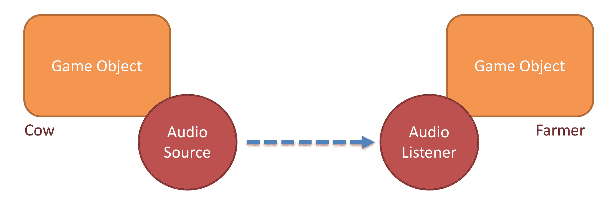

你将在本章的后面学习如何使用这些组件。

# Unity 的音频混音器

Unity 的音频混音器为你提供了混合和主控音频源和效果的能力。要访问音频混音器，你从下拉菜单中选择“窗口”，然后选择“音频混音器”。

当你第一次打开音频混音器窗口时，你会看到你的项目中没有任何混音器。正如你在下面的截图中所见，窗口的右侧有一个加号图标：

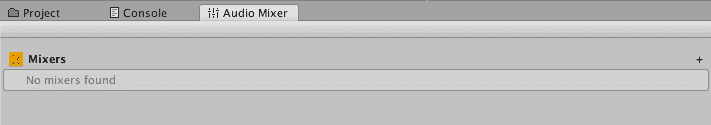

点击该图标可以让你创建一个混音器。

当你在项目中有一个混音器时，音频混音器窗口在左侧显示了四个部分。如图所示，这些是混音器、快照、组和视图。你项目中的所有混音器都将列在这里。快照是一组你可以用于混音器的参数。音频混音器组可以用来在声音到达听众之前修改音频源声音。最后一部分是视图。视图只是混音器组的保存状态：

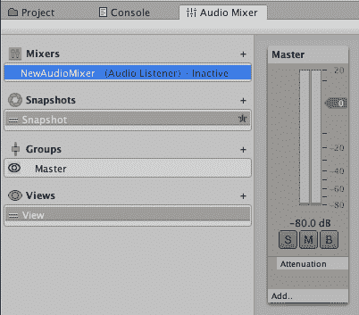

在音频混音器窗口的右侧，你看到我们项目中的一个混音器。当你点击添加按钮时，你会看到一个弹出窗口，如图所示，它显示了几个选项：

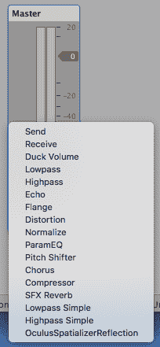

我们的游戏中不会使用这些选项，但如果你想在游戏中实现高级音频效果，它们值得探索。

# 规划我们游戏的音频

规划游戏的音频是游戏设计的重要部分。仅仅因为我们可以在音频方面做些什么，并不意味着我们应该这样做。过多的音频可能和不足的音频一样令人反感。

为黄瓜人游戏选择的音频旨在充分展示如何导入、配置和编写脚本以实现各种音频效果。为此，以下音频将在我们的黄瓜人游戏中实现：

+   需要声音的动画：

    +   黄瓜人

        +   跳跃

        +   投掷

        +   死亡

        +   重生

    +   黄瓜甲虫

        +   吃

        +   站立跑步

        +   死亡

+   需要声音的事件：

    +   玩家失败

    +   玩家胜利

我们将在下一节进行实现。

# 实现我们游戏的音频

在本节中，我们将实现上一节中列出的音频要求。我们将导入、配置和编写脚本以完成实现。在开始之前，你应该打开你的 Unity 游戏项目。或者，你可以从出版商的配套网站上下载 Starting-Chapter-12 Unity 项目。

我们将分三个步骤实现我们游戏中的音频，每个步骤将在后续章节中处理：

+   导入音频资产

+   实现黄瓜甲虫音频

+   实现黄瓜人音频

# 导入音频资产

我们的第一项任务是导入音频资产到我们的游戏项目中。以下是步骤：

1.  打开游戏项目。

1.  在项目面板中，右键点击 Assets 并选择创建 | 文件夹。

1.  将新文件夹命名为`Audio`。

1.  右键点击`Audio`文件夹，选择导入包 | 自定义包。

1.  导航到本书出版商网站上提供的`cucumber_man_audio.unitypackage`文件。你应该会在你的 Unity 界面中看到以下截图弹出：

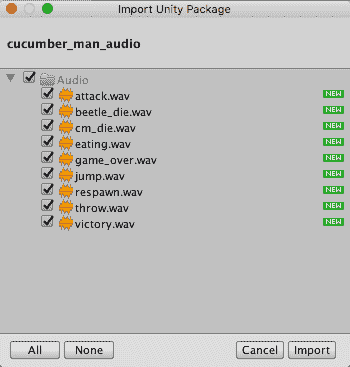

1.  在导入 Unity 包对话框窗口中，确保所有音频文件都被选中，然后点击导入按钮。

1.  在项目面板中，选择第一个音频文件。然后，在检查器面板中，使用界面播放音频剪辑。

1.  对每个九个音频剪辑重复步骤 7。这将使你熟悉每个声音并确保它们可以在你的电脑上播放。

现在我们已经将音频资产添加到我们的游戏项目中，让我们回顾一下每个资产将如何被使用。以下表格将每个音频文件映射到相应的游戏内动画或事件：

| **游戏内动画/事件** | **相关游戏对象** | **音频资产** |
| --- | --- | --- |
| 跳跃动画 | 黄瓜人 | `jump.wav` |
| 投掷动画 | 黄瓜人 | `throw.wav` |
| 死亡动画 | 黄瓜人 | `cm_die.wav` |
| 重生事件 | 黄瓜人 | `respawn.wav` |
| 吃动画 | 黄瓜甲虫 | `eating.wav` |
| 站立奔跑动画 | 黄瓜甲虫 | `attack.wav` |
| 地上死亡动画 | 黄瓜甲虫 | `beetle_die.wav` |
| 站立死亡动画 | 黄瓜甲虫 | `beetle_die.wav` |
| 玩家失败事件 | 黄瓜人 | `game_over.wav` |
| 玩家胜利事件 | 黄瓜人 | `victory.wav` |

# 实现黄瓜甲虫音频

在本节中，我们将配置黄瓜甲虫预制体，使其在黄瓜甲虫吃东西、站立时奔跑和死亡时支持音频。以下是步骤：

1.  在项目面板的`Assets` | `Prefabs`文件夹中选择甲虫预制体。如果你有多个预制体，请确保使用你在游戏中使用的那个。

1.  在检查器面板中，滚动到最底部并点击添加组件按钮。

1.  选择音频 | 音频源。

1.  取消勾选“唤醒时播放”框。

通常，我们会将`AudioClip`分配给我们的音频源组件。由于我们的黄瓜甲虫将拥有多个音频剪辑，所以我们在这里不会分配一个。

我们下一步是编辑`BeetleNPC`脚本。打开该脚本文件并做出以下修改：

1.  添加以下成员变量：

```cs
      public AudioSource audioSource;
      public AudioClip eating;
      public AudioClip attack;
      public AudioClip die; 
```

1.  将以下语句添加到`Start()`方法中：

```cs
      audioSource = GetComponent<AudioSource> ();
```

1.  按照以下所示编辑`OnTriggerEnter()`方法。您将看到两个`audioSource.PlayOneShot()`语句，每个语句对应一个`eating`和`attack`音频片段：

```cs
      void OnTriggerEnter(Collider theObject) {
         if (theObject.gameObject.CompareTag ("Cucumber")) {
              cucumberToDestroy = theObject.gameObject;
              BeetlePatrol.isEating = true;
              animator.Play ("Eating on Ground");
              audioSource.PlayOneShot (eating);
              StartCoroutine ("DestroyCucumber");
          } else if (theObject.gameObject.CompareTag ("Cherry")) {
              _ptsManager = GameObject.Find 
              ("Score_Value").GetComponent<PointsManager>();
              PointsManager.currentScore = PointsManager.currentScore + 10; 
              BeetlePatrol.isAttacking = true;
              cherryHit = true;
              animator.Play ("Stand");
              audioSource.PlayOneShot (attack);
          }
      } 
```

1.  按照以下所示编辑`DestroySelfOnGround()`方法。在这里，您可以看到我们添加了`audioSource.PlayOneShot(die)`语句：

```cs
      IEnumerator DestroySelfOnGround() {
          yield return new WaitForSecondsRealtime (4);
          animator.Play ("Die on Ground");
          audioSource.PlayOneShot (die);
          Destroy (this.gameObject, 4);
      }
```

1.  按照以下代码块所示编辑`DestroySelfStanding()`方法。在这里，您可以看到我们添加了`audioSource.PlayOneShot(die)`语句：

```cs
      IEnumerator DestroySelfStanding() {
          yield return new WaitForSecondsRealtime (4);
          animator.Play ("Die Standing");
          audioSource.PlayOneShot (die);
          Destroy (this.gameObject, 4);
          cherryHit = false;
      } 
```

现在脚本任务完成后，我们需要将指定的音频片段分配给创建的变量：

1.  在检查器面板中，滚动直到您看到 Beetle NPC (Script)组件。

1.  将`eating`音频片段从项目面板的`Assets` | `Audio`文件夹拖到 Beetle NPC (Script)组件的适当位置。

1.  对`attack`和`beetle_die`音频片段重复步骤 11。您的 Beetle NPC (Script)组件应如下所示：

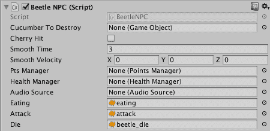

剩下的就是您通过玩游戏来测试这个新功能。

# 实现 Cucumber Man 音频

在本节中，我们将配置 Cucumber Man 预制件，以便它在 Cucumber Beetles 进食、站立时奔跑以及死亡时支持音频。以下是步骤：

1.  在层次结构面板中选择 Cucumber Man。

1.  在检查器面板中，滚动到最底部并点击添加组件按钮。

1.  选择音频 | 音频源。

1.  取消勾选“在启动时播放”框。

通常，我们会将`AudioClip`分配给我们的音频源组件。由于我们的 Cucumber Man 将拥有多个音频片段，所以我们在这里不会分配一个。

我们下一步是编辑`BeetleNPC`脚本。打开该脚本文件并做出以下修改：

1.  添加以下成员变量：

```cs
      public AudioSource audioSource;
      public AudioClip dying;
      public AudioClip respawning; 
      public AudioClip gameOver;
```

1.  创建一个如下所示的`Start()`方法：

```cs
      void Start () {
          audioSource = GetComponent<AudioSource> ();
      } 
```

1.  编辑`Update()`方法，如图所示，使其包含三个`audioSource.PlayOneShot()`语句：

```cs
      if (livesRemaining == 2) {
          Destroy (GameObject.Find ("Life3"));
          anim = GetComponent<Animator> ();
          anim.Play ("CM_Die");
          audioSource.PlayOneShot (dying);
          StartCoroutine ("ReSpawnCucumberMan");
      }
      if (livesRemaining == 1) {
          Destroy (GameObject.Find ("Life2"));
          anim = GetComponent<Animator> ();
          anim.Play ("CM_Die");
          audioSource.PlayOneShot (dying);
          StartCoroutine ("ReSpawnCucumberMan");
      }
      if (livesRemaining == 0) {
          Destroy (GameObject.Find ("Life1"));
          anim = GetComponent<Animator> ();
          anim.Play ("CM_Die");
          audioSource.PlayOneShot (gameOver);
      } 
```

1.  按照以下所示编辑`ReSpawnCucumberMan()`方法。您可以看到我们添加了`audioSource.PlayOneShot()`语句：

```cs
      IEnumerator ReSpawnCucumberMan() {
          int randomNumber = Random.Range (1, 4);
          if (randomNumber == 1) {
              yield return new WaitForSecondsRealtime (4);
              this.transform.position = SpawnPad1.transform.position;
          } else if (randomNumber == 2) {
              yield return new WaitForSecondsRealtime (4);
              this.transform.position = SpawnPad2.transform.position;
          } else {
              yield return new WaitForSecondsRealtime (4);
              this.transform.position = SpawnPad3.transform.position;
          }
          audioSource.PlayOneShot (respawning);
          anim.Play ("CM_Idle");
      } 
```

现在我们对`CucumberManManager`脚本文件的脚本更改完成后，我们需要将指定的音频片段分配给创建的变量。以下是步骤：

1.  在检查器面板中，滚动直到您看到 Cucumber Man Manager (Script)组件。

1.  将`cm_die`音频片段从项目面板的`Assets` | `Audio`文件夹拖到 Cucumber Man Manager (Script)组件的适当位置。

1.  对`respawn`和`game_over`音频片段重复步骤 10。您的 Cucumber Man Manager (Script)组件应如下所示：

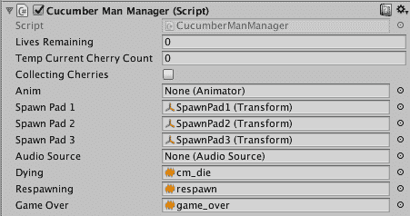

到目前为止，我们已经处理了死亡、重生和游戏结束的音频片段。接下来，我们将处理跳跃和投掷的音频片段：

1.  打开`PlayerController`脚本进行编辑。

1.  添加以下成员变量：

```cs
      public AudioSource audioSource;
      public AudioClip jumping;
      public AudioClip throwing; 
```

1.  将以下语句添加到`Start()`方法中：

```cs
       audioSource = GetComponent<AudioSource> (); 
```

1.  将以下语句添加到`Jump()`方法的开始处：

```cs
       audioSource.PlayOneShot (jumping); 
```

1.  将以下语句添加到`Throw()`方法的开始处：

```cs
       audioSource.PlayOneShot (throwing); 
```

现在我们对`PlayerController`脚本文件的修改已完成，我们需要将指定的音频剪辑分配到我们创建的变量中。以下是步骤：

1.  在检查器面板中，滚动直到你看到玩家控制器（脚本）组件。

1.  将`jump`音频剪辑从项目面板的`Assets` | `Audio`文件夹拖动到玩家控制器（脚本）组件的适当位置。

1.  将`throw`音频剪辑从项目面板的`Assets` | `Audio`文件夹拖动到玩家控制器（脚本）组件的适当位置。你的玩家控制器（脚本）组件应如下所示：

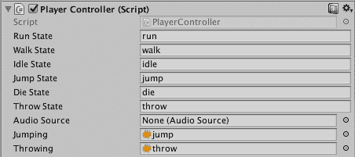

我们要实现的最后一个音频剪辑是胜利剪辑。我们将首先编辑`VictoryManager`脚本。打开该脚本文件并做出以下修改：

1.  添加以下成员变量：

```cs
      public AudioSource audioSource;
      public AudioClip victory;  
```

1.  创建一个`Start()`方法，如下所示：

```cs
      void Start () {
          audioSource = GetComponent<AudioSource> ();
      } 
```

1.  编辑`Update()`方法，如下所示。你会注意到我们只为胜利条件添加了音频剪辑播放，因为我们已经处理了失败条件：

```cs
      void Update () {
          beetleCount = BeetleManager.currentBeetleCount;
          if (beetleCount == 0) {
              Victory.text = ("You won!");
              audioSource.PlayOneShot (victory);
          }

          cucumberCount = CucumberManager.currentCucumberCount;

          if (cucumberCount == 0) {
              Victory.text = ("You Lost!");
          }
      } 
```

现在我们对`VictoryManager`脚本文件的修改已完成，我们需要将胜利音频剪辑分配到我们创建的变量中。以下是步骤：

1.  在层次结构面板中，选择`HUD_Canvas` | `EndOfGame` | 胜利。

1.  在检查器面板中，滚动直到你看到胜利管理器（脚本）组件。

1.  将`victory`音频剪辑从项目面板的`Assets` | `Audio`文件夹拖动到胜利管理器（脚本）组件的适当位置。你的胜利管理器（脚本）组件应如下截图所示：

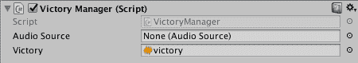

现在你已经准备好通过玩游戏来测试这个新功能。

这是一个保存你的场景和项目的绝佳时机。

# Unity 的灯光和阴影简介

游戏中的光照非常重要，因为它允许 GameObject 被看到。如果我们游戏中没有灯光，游戏屏幕将会是完全黑色的。在 Unity 中，很容易将光照视为理所当然，因为我们创建新场景时，默认有一个主摄像机和一个方向光。

游戏世界中的阴影是另一个可以视为理所当然的组件，因为 Unity 关于阴影的默认设置通常对游戏来说已经足够。

在本节中，我们将探讨光源和阴影。

# 添加光源

在 Unity 中，灯光是 GameObject，并且有几种不同类型。以下是最常见的光源类型：

+   方向光

+   点光源

+   聚光灯

+   区域光源

让我们逐一查看这些灯光。

# 方向光

轴向光就像太阳。正如您可以从以下“检查器”面板中看到，除了变换的位置、旋转和缩放之外，还有几个可以调整的轴向光设置：

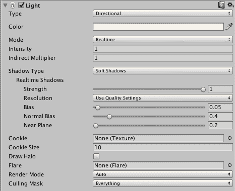

以下表格提供了关于方向光关键设置的详细信息。

| **设置** | **细节** |
| --- | --- |
| 颜色 | 您可以为灯光选择一种颜色。对于逼真的户外场景，您可能会选择浅黄色。 |
| 模式 | 您可以选择实时、烘焙或混合照明模式。当选择实时时，在游戏过程中每帧都会计算直接光线。这提供了逼真的游戏体验，并且是默认模式。 |
| 亮度 | 调整此选项以控制亮度。  |
| 阴影类型 | 这里有三个选项：软阴影、硬阴影和无阴影。软阴影产生柔和的边缘，避免了使用硬阴影产生的尖锐边缘阴影。正如您所预期的那样，软阴影比硬阴影更占用处理器资源。 |
| 实时阴影 | 此区域提供了对阴影的额外控制。 |

# 点光源

点光源就像没有灯罩的灯泡。实际上，它们是模拟小型、局部光源（例如台灯、壁灯或吊灯）的理想光源。正如您可以从以下“检查器”面板的屏幕截图中所见，您可以修改范围、颜色和亮度。您还可以选择实时、烘焙或混合渲染模式：

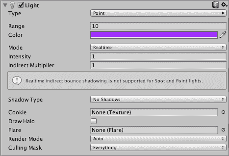

# 聚光灯

聚光灯就像手电筒，提供锥形照明。这种类型的灯光非常适合模拟手电筒、汽车前灯、飞机灯光、探照灯和聚光灯。正如您可以从以下“检查器”面板的屏幕截图中所见，有一个聚光角度属性。聚光灯也具有与其他类型灯光共有的属性。

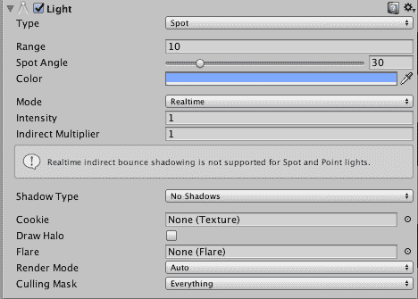

# 面光源

面光源（仅烘焙）是在将图像烘焙到纹理时使用的。这种类型的灯光非常适合模拟从建筑物中发出的光线，例如从窗户中发出的光线。面光源也适用于 LED 体育场照明。以下屏幕截图显示的宽度和高度属性在方向光、点光源和聚光灯中不存在：

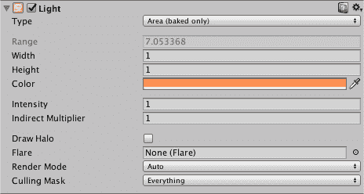

# 阴影

Unity 为我们提供了对游戏场景中阴影的强大控制。我们可以控制哪些对象投射阴影，哪些对象可以接收阴影，以及阴影的各种属性。Unity 中的阴影紧密地复制了现实世界中阴影的存在方式。正如本章前面所讨论的，有软阴影和硬阴影。

软阴影可以带来更高的真实感，但代价是额外的计算和处理。硬阴影在游戏中提供的真实感较低，但通常是可以接受的，且对处理器的需求较低。在游戏中，硬阴影的边缘通常较为锐利、块状。

# 发现 Unity 的特殊效果

Unity 在三个类别中具有强大的特殊效果能力：粒子系统、轨迹渲染器和线渲染器。这些选项可通过 GameObject | Effects 顶菜单访问。

通过检查器面板中的添加组件 | 效果选项，可以将效果组件添加到 GameObject 中。如以下截图所示，粒子系统、轨迹渲染器和线渲染器选项可通过此方法访问。还有其他选项，如镜头光晕和光环：

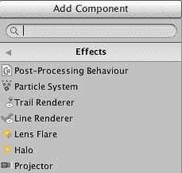

在本节中，我们将讨论粒子系统和轨迹渲染器效果。

# 粒子系统

粒子系统使用场景中大量的小 2D 图像或网格来模拟液体、烟雾、火焰、精灵尘埃、烟花和云等效果。基本概念是，一个简单的 2D 图像或网格可以大量使用，以创建强大且密集的视觉效果。这些 2D 图像或网格是粒子，它们共同构成了粒子系统。

粒子系统中的每个粒子都从特定点渲染，并具有有限的生命周期。这个生命周期有多长取决于你的实现，但通常只有几秒钟。

如以下检查器面板截图所示，有几个参数允许我们自定义粒子系统的行为。我们将在本章后面添加粒子系统到我们的游戏中：

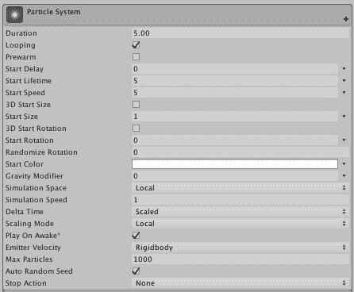

当我们将粒子系统添加到场景中时，Unity 在场景视图的右下角提供了一个界面，即粒子效果面板。此界面允许我们播放、暂停和停止粒子模拟，同时观察模拟的变化，并添加额外的参数设置：

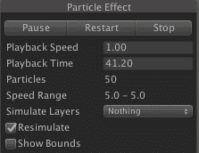

Unity 2018，在本书出版时处于测试版，支持粒子系统网格渲染的 GPU 实例化、支持轨道速度，并启用粒子发射器形状，允许纹理读取以进行遮罩和着色。

# 轨迹渲染器

轨迹渲染器是一种视觉效果，可以在 GameObject 移动时在其后面创建轨迹。经典的例子包括喷气式飞机的尾焰、汽车的排气和塔斯马尼亚魔鬼的视觉滑行（尘云）。以下检查器面板截图说明了可以调整以自定义轨迹渲染器的参数：

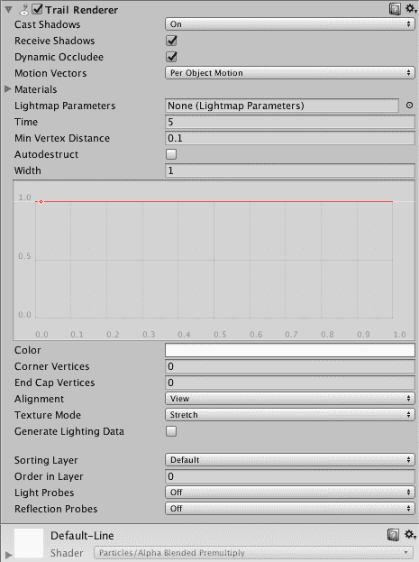

这里描述了主要的轨迹渲染器设置：

| **设置** | **描述** |
| --- | --- |
| 投影阴影 | 这里有四个选项：开启、关闭、双面和仅阴影。默认设置为开启。 |
| 接收阴影 | 这是一个开启/关闭切换。 |
| 材质 | 您可以选择粒子着色器作为材质并调整其大小。 |
| 时间 | 此设置定义了尾迹的长度。 |
| 自动销毁 | 您可以选择此选项，使尾迹游戏对象在闲置了设置在时间设置中的秒数后销毁。 |

# 为我们的游戏添加视觉效果

我们的游戏已经有一个方向光，如本章前面所讨论的，它就像太阳一样——从我们地形上方照射光线。黄瓜人、黄瓜甲虫、樱桃、樱桃树和黄瓜地的阴影可以在草地上看到。我们不需要对它们进行任何更改。

本节我们将进行的视觉效果更改包括：

+   为我们的樱桃树添加点光源

+   使用粒子系统添加特殊效果

# 为我们的樱桃树添加点光源

目前，黄瓜人可以在我们的沙盒区域内的樱桃树下行走。这些树非常密集，而且由于唯一的光源来自我们的方向光，所以对于黄瓜人来说太暗了，看不清他从树上摘的樱桃。这只是为了添加点光源而进行的模拟。因此，我们将使用以下步骤在我们的场景沙盒区域的樱桃树上添加点光源：

1.  在场景视图中，导航到一个樱桃树并放大，以便您可以清楚地看到树的底部

1.  使用顶部菜单，选择 GameObject | 光 | 点光源

1.  将点光源重新定位，使其位于树干中心

1.  在检查器面板中，选择一个如浅红色等颜色

1.  在检查器面板中，将范围更改为`11`

1.  在检查器面板中，将强度增加到`30`

1.  将点光源重新定位，使其看起来类似于以下图像：

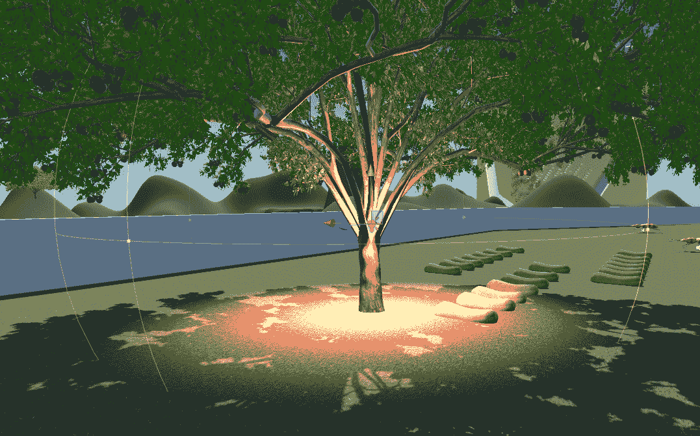

对您沙盒区域中的每一棵樱桃树重复步骤 1 至 7。在游戏模式下测试您的游戏以查看结果。

# 使用粒子系统添加特殊效果

在本节中，我们将向我们的孵化垫添加粒子系统，以便它们附加特殊效果。以下是步骤：

1.  在场景视图中，导航到一个孵化垫并放大，以便您可以清楚地看到垫子。

1.  使用顶部菜单，选择 GameObject | 效果 | 粒子系统。

1.  将粒子系统重新定位，使其位于孵化垫的中心和底部。

1.  在层次结构面板中，将粒子系统拖动到孵化垫下，使其成为其子对象。

1.  在检查器面板中，点击变换组件中的设置齿轮并选择重置。这会将粒子系统的位置重置为孵化垫的变换。

1.  在检查器面板中，选择一个与孵化垫的红色和地形以及樱桃树的绿色形成对比的颜色，例如蓝色。

1.  在检查器面板中，将最大粒子数更改为`10,000`。

1.  在检查器面板中，将形状改为边缘形状。

1.  在检查器面板中，将形状的半径增加到 1.5。

当完成时，你的粒子系统应该看起来类似于以下截图：

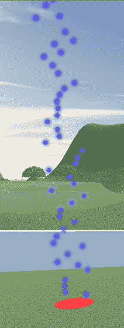

对你的沙盒区域中的每个出生点重复步骤 1 至 9。

# 摘要

在本章中，我们计划和实现了音频和视觉效果，以增强整体游戏体验。具体来说，我们在战斗系统的关键事件中添加了音频，并添加了照明和粒子特效。我们从 Unity 音频系统的概述开始，然后计划和实现了我们游戏的音频。然后转向 Unity 中灯光和阴影的介绍，并涵盖了选定的特效。最后，我们在樱桃树上添加了一个点光源，并在出生点添加了一个特效。

在第十三章，“优化我们的游戏以供部署”，你将学习如何诊断性能问题以及如何优化脚本和图形渲染。你还将学习如何将你的游戏部署到多个平台。
