# 第一章：*第一章*：介绍 C# 10.0 和.NET 6

Microsoft .NET 6 和 C# 10.0 是.NET 平台和 C#编程语言的最新版本。它们为 C#和.NET 程序员社区带来了许多性能提升。我们将从对 C#和.NET 新版本的概述开始这本书。

在本章中，你将首先下载、还原、构建和测试.NET 编译器**Roslyn**的最新版本。然后，你将回顾.NET 6 的新特性，包括性能得到极大提升的领域。然后，你将通过查看一些演示这些功能的代码示例来回顾 C# 10.0 的新特性。

在*原生编译*部分，你将构建一个项目，并以多个二进制文件的形式作为 MSIL 项目运行它，然后将其编译并作为单个本地二进制文件运行。最后，你将学习如何提高 Windows Store 应用程序和 ASP.NET 网站的性能。

在本章中，我们将涵盖以下主题：

+   **.NET 6 概述**：在本节中，我们将从高层次上介绍.NET 6 的新特性。你将了解将成为.NET 6 一部分的各种性能提升。

+   **C# 10.0 概述**：在*技术要求*部分学习了如何获取最新的 Roslyn 代码后，在本节中，你将了解将成为 C# 10.0 一部分的各种功能。这包括代码示例。

+   **原生编译**：在本节中，你将学习如何将.NET Core 应用程序编译成一个单一的本地可执行文件。你将编写一个简单的控制台应用程序，递归地将音频文件从一种格式转换为另一种格式。

+   **提高 Windows Store 性能**：这是一个简短的章节，提供了一些提高针对 Windows Store 的应用程序性能的标准指南。

+   **提高 ASP.NET 性能**：这是一个简短的章节，提供了一些提高 ASP.NET 应用程序的标准指南。

到本章结束时，你将具备以下技能：

+   你将了解 Microsoft .NET 6 的新特性。

+   你将能够在源代码中应用新的 C# 10.0 代码功能。

+   你将能够将源代码编译成原生程序集（也称为二进制文件）。

+   你将了解如何查找有关提高针对 Windows Store 的应用程序性能的信息，包括什么、如何以及在哪里查找。

+   你将了解如何查找有关提高 ASP.NET 应用程序性能的信息，包括什么、如何以及在哪里查找。

让我们从了解 Microsoft .NET 6 开始这一章。

# 技术要求

你需要以下先决条件来完成本章：

+   Visual Studio Community Edition 的最新预览版本或更高版本。

+   Microsoft .NET 6 SDK。

+   本书源代码：[`github.com/PacktPublishing/High-Performance-Programming-in-CSharp-and-.NET/tree/master/CH01`](https://github.com/PacktPublishing/High-Performance-Programming-in-CSharp-and-.NET/tree/master/CH01)。

+   可选：从源代码构建的最新 Roslyn 编译器。源代码可在 GitHub 上找到 [`github.com/dotnet/roslyn`](https://github.com/dotnet/roslyn)。在安装 Visual Studio 的最新预览版本时，这应该会自动安装。

    注意

    你可以在 [`github.com/dotnet/roslyn/blob/master/docs/Language%20Feature%20Status.md`](https://github.com/dotnet/roslyn/blob/master/docs/Language%20Feature%20Status.md) 找到最新的完整和最新的 C# 10.0 功能集。在撰写本文时，C# 10.0 仍在经历许多发展和变化。因此，本书中的内容可能无法按预期工作。如果出现这种情况，请参阅前面的 URL 获取最相关的信息，以帮助您开始工作。

## 从源代码获取和构建最新的 Roslyn 编译器

注意

所有 .NET 相关存储库的构建系统已经变动了几年。我们将在此处提供编译 Roslyn 的说明；这些说明在撰写本文时是正确的。对于最新的说明，请阅读位于 [`github.com/dotnet/roslyn`](https://github.com/dotnet/roslyn) 的 `README.md` 文件。

以下说明是关于在 Windows 10 上下载和构建 Roslyn 编译器最新版本源代码的：

1.  在 `C:\` 驱动的根目录下，使用以下命令在 Windows 命令提示符中克隆 Roslyn 源代码：

    ```cs
    git clone https://github.com/dotnet/roslyn.git
    ```

1.  然后，运行以下命令：

    ```cs
    cd Roslyn
    ```

1.  通过运行以下命令恢复 Roslyn 依赖项：

    ```cs
    restore.cmd
    ```

1.  通过运行以下命令构建 Roslyn 源代码：

    ```cs
    build.cmd
    ```

1.  通过运行以下命令测试 Roslyn 构建：

    ```cs
    test.cmd
    ```

1.  一旦所有测试都已完成，请检查新计算机可访问的 C# 版本。通过打开命令提示符窗口并导航到 `C:\roslyn\artifacts\bin\csc\Debug\net472` 来执行此操作。

1.  然后，运行以下命令：

    ```cs
    csc /langversion:?
    ```

    注意

    我总是以管理员身份运行我的命令提示符。因此，截图将显示管理员模式的命令提示符。但运行命令提示符作为管理员对于这项练习不是必需的。当需要作为管理员执行命令提示符时，这将在需要时明确说明。

您应该看到以下类似的内容：

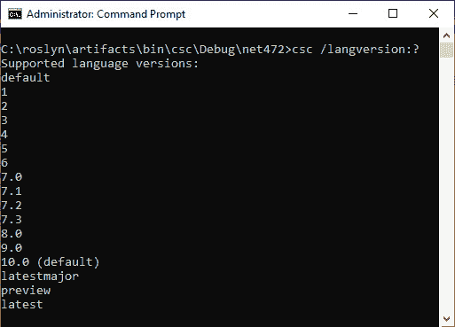


图 1.1 – 编译器支持的 C# 编程语言版本

如您所见，在撰写本文时，C# 语言的 10.0 版本可以通过 C# 编译器获得。C# 10.0 被设置为默认版本。预览版本仍在开发中。默认版本可能在您的计算机上不同。

注意

Visual Studio 2022 的最新版本应允许您使用最新的 C# 10.0 代码功能。如果不行，则编译最新的源代码并覆盖位于 `C:\Program Files (x86)\Microsoft Visual Studio\2022\Preview\MSBuild\Current\Bin\Roslyn` 的文件。

以下三组指令提供了针对特定 C# 版本编译程序并运行程序的编译器帮助。这些命令仅用于演示目的，您现在不需要运行它们：

```cs
csc /help
csc -langversion:10.0 /out:HelloWorld.exe Program.cs
csc HelloWorld
```

现在您可以从命令行和 Visual Studio 2022 内部构建 C# 10.0，让我们了解在 Microsoft .NET 6 中正在进行的新开发。

# Microsoft .NET 6 概述

Microsoft .NET 6 是 .NET 的最新版本。您可以在 [`dotnet.microsoft.com/download/dotnet/6.0`](https://dotnet.microsoft.com/download/dotnet/6.0) 访问下载。下载适用于 Windows、macOS 和 Linux 用户。

注意事项

要充分利用 .NET 6 和 C# 10.0，最好您已安装 Visual Studio 2022 或更高版本。

.NET 6 API 文档可在 [`docs.microsoft.com/dotnet/api/?view=net-6.0`](https://docs.microsoft.com/dotnet/api/?view=net-6.0) 获取。

根据以下文章，Microsoft .NET 5 及以后的版本将不再携带 *Core 或 Framework 后缀*：[`redmondmag.com/articles/2019/12/31/coming-in-2020-net-5.aspx`](https://redmondmag.com/articles/2019/12/31/coming-in-2020-net-5.aspx)。微软希望通过 .NET 平台的 5 版本及以后的版本创建一个单一的平台，用于 WinForms、WPF、Xamarin.Forms、ASP.NET Core 以及所有其他形式的 .NET 开发。Xamarin.Forms 变成了 Microsoft MAUI，版本之间的主要区别在于新的 Microsoft MAUI 将仅使用一个项目来针对所有操作系统和设备。

## 转向一个统一平台

.NET 6 的基础设施包括运行时组件、编译器和语言。Microsoft .NET SDK 将位于此基础设施之上。可用的工具包括命令行界面、Visual Studio Code、Visual Studio for Mac，以及当然，Visual Studio。

使用统一平台，您可以使用 WinForms、WPF 和 UWP 编写桌面应用程序。可以使用 ASP.NET 编写 Web 应用程序。云应用程序将针对 Microsoft Azure。移动应用程序将使用 Microsoft MAUI 编写。游戏、**虚拟现实**（**VR**）、**增强现实**（**AR**）应用程序将在 Unity 中开发，使用 Visual Studio 2022 或更高版本作为 C# 代码编辑器。物联网将针对 ARM32 和 ARM64 架构。最后，您将能够使用 ML.NET 和 .NET for Apache Spark 开发 **人工智能**（**AI**）应用程序。

微软计划生产一个单一的 .NET 运行时和框架，它在应用程序和设备之间的开发者体验和运行时行为上是一致的。这将通过构建一个单一的代码库来实现，该代码库结合了 .NET Framework、.NET Core、Mono 和 Xamarin.Forms 的最佳元素。

.NET 6 的主要功能如下：

+   统一的开发者体验，无论开发的应用程序和目标设备是什么。

+   在所有设备和平台之间提供统一的运行时体验。

+   Java 兼容性将在所有平台上可用。这在 Redmond Magazine 的文章《2020 年即将到来：.NET 5，微软 .NET 框架的下一阶段》中有说明：[`redmondmag.com/articles/2019/12/31/coming-in-2020-net-5.aspx`](https://redmondmag.com/articles/2019/12/31/coming-in-2020-net-5.aspx)。

+   将支持 Objective-C 和 Swift 的多个操作系统。

+   CoreFX 将支持 AOT（Ahead-Of-Time）编译，以提供静态 .NET 编译，支持多个操作系统，并生成更小的程序集。

现在，让我们从高层次的角度看看 .NET 6 的一些新特性。

## **垃圾回收**

垃圾回收器在标记和窃取方面的性能得到了改进。当一个线程完成其标记配额后，它可以从其他线程那里窃取未完成的标记工作。这加快了收集要回收垃圾的项目的过程。在具有更多核心的计算机上减少了锁竞争，改进了取消提交，避免了昂贵的内存重置，以及向量排序，这些都是 .NET 6 中新的垃圾回收性能改进的例子。

## **即时编译器**

在 .NET 6 中，**即时编译器**（**JIT**）也得到了改进。您可以对 JIT 应用各种优化，并且它有无限的时间来实现这些优化。**提前编译**（**AOT**）只是提供给 JIT 的多种技术之一，以便它在执行应用程序之前尽可能多地编译代码。JIT 现在将数组长度视为无符号数，这提高了对数组长度执行数学运算的性能。还有很多变化正在进行中。

仅仅说，在 JIT 和 GC（垃圾回收器）之间，针对内存和编译优化所进行的性能改进，仅仅是迁移到 .NET 6 的两个原因之一。

JIT 现在识别了超过一千种新的硬件内建方法。这些方法允许您从 C# 中针对各种硬件指令集进行操作。您不再仅限于 x86_x64 硬件指令集。

JIT（Just-In-Time）编译器中提供了几个运行时辅助函数。这些辅助函数使 JIT 编译器能够操作源代码，从而使代码运行速度必须更快。现在，泛型查找速度更快，因为它们不再需要使用较慢的查找表。

## 基于文本的处理

在.NET 6 的文本处理元素中也进行了性能提升。这包括（但不限于）在`System.Char`类中处理空白字符，这需要更少的分支和更少的参数。由于这个类在.NET 6 中的各种文本处理对象和方法中被使用，因此.NET 6 处理文本的速度将普遍提高。`DateTime`处理也因为从原始滴答计数中提取日期和时间组件的优化而至少快了 30%。由于对`StartsWith`和`EndsWith`的本地化修改，字符串操作的性能也得到了提升。通过利用堆分配和 JIT 去虚拟化，数据编码（如*UTF8*和*Latin1*编码）的性能也得到了增强。

`CharInClass`方法在确定字符是否出现在指定的字符类中时更加智能。字符和数字比较使用查找表，各种方法调用被内联，提供了改进的正则表达式处理。各种表达式的生成代码也得到了改进。正则表达式的搜索是通过基于 span 的搜索和向量化方法来执行的。在节点树优化阶段分析正则表达式时消除了回溯的需要，并添加了不改变语义但防止回溯的原子组。这些只是正则表达式性能改进的一部分。但还有更多。

注意

想了解更多关于.NET 5 对正则表达式性能改进的深入知识，请阅读 Stephen Toub 发布的以下非常详细的帖子：[`devblogs.microsoft.com/dotnet/regex-performance-improvements-in-net-5/`](https://devblogs.microsoft.com/dotnet/regex-performance-improvements-in-net-5/)。

## 线程和异步操作

在.NET 5 中，线程和异步操作也因实验性地添加了`async ValueTask`池化而得到了性能提升。你可以通过将`DOTNET_SYSTEM_THREADING_POOLASYNCVALUETASK`设置为`true`或`1`来开启池化。池化会创建实现接口`IvalueTaskSource`和`IValueTaskSource<TResult>`的状态机框对象，并将这些对象添加到池中。在`ConcurrentDictionary`中，波动性也得到了性能提升，在某些 ARM 架构上性能提升了高达 30%。

## 集合和 LINQ

集合也看到了几个性能增强，主要是对`Dictionary<TKey, TValue>`、`HashSet<T>`、`ConcurrentDictionary<TKey, TValue>`和`System.Collections.Immutable`的改进。`HashSet<T>`集合的实现已被重写，并与`Dictionary<TKey, TValue>`实现重新同步，并进一步向下移动到堆栈。在迭代`ImmutableArray<T>`时，`foreach`的性能得到了改善，并且通过将`[MethodImpl(MethodImplOptions.AggressiveInlining)]`注解添加到`ImmutableArray<T>`的`GetEnumerator`方法，减少了生成的代码大小。.NET 集合的其他元素，如`BitArray`，也看到了性能提升。

在.NET 5 中，LINQ 也看到了进一步的性能提升，包括`OrderBy`、`Comparison<T>`、`Enumerable.SkipLast`，以及通过使实现`Enumerable.Any`与`Enumerable.Count`更加一致。这些只是对集合进行的一些性能改进。

## 网络和 Blazor

网络性能改进方面已经做了大量工作，特别是对`System.Uri`类（尤其是在其构造过程中）的改进。`System.Net.Sockets`和`System.Net.Http`命名空间也看到了性能的提升。在.NET 的`System.Text.Json`库中，对 JSON 的处理方式通过`JsonSerializer`也进行了许多改进。

由于 Blazor 使用.NET mono 运行时和.NET 5 库，增加了一个链接器，它可以从程序集级别裁剪掉未使用的代码。要裁剪的代码通过*静态代码分析*来识别。在 Blazor Web Assembly 应用程序中，用户界面响应时间也得到了改善，因为客户端代码在执行之前被下载，并且表现得就像桌面应用程序一样——但这是在浏览器内部。

此外，.NET 5 中还包括了多项通用改进，包括更快的程序集加载、更快的数学运算、更快的加密和解密、更快的互操作性、更快的反射生成、更快的 I/O 以及各种库中的各种分配。

## 新的性能相关 API 和分析器

.NET 5 增加了一些新的以性能为重点的 API。内部，一些这些 API 已经被用于减少代码大小并提高.NET 5 本身的性能。它们专注于帮助程序员专注于编写高性能的代码，并移除之前难以完成的任务的复杂性。这些新的 API 和现有 API 的改进包括`Decimal`、`GC`、`MemoryExtensions`、`StringSplitOptions`、`BinaryPrimitives`、`MailAddress`、`MemoryMarshall`、`SslStream`、`HttpClient`等。

.NET 5 SDK 还增加了一些基于性能的分析器。这些分析器可以检测范围索引中的意外分配，并提供消除分配的方法。分析器将检测`Stream.Read`/`WriteAsync`方法的旧重载，并提供修复方案以启用自动切换到更新的重载方法，这些方法更倾向于使用`Memory`重载。在`StringBuilder`中，使用*类型重载*来追加非字符串值（如`int`和`long`值）更高效。当分析器遇到程序员对一个存在类型重载的、被追加的类型调用`ToString()`的情况时，修复器将检测这些情况并自动切换到使用正确的类型重载。使用 LINQ，现在使用`(!collection.IsEmpty)`语法检查`(collection.Count != 0)`更高效。旧的方法将被分析器检测并修复为使用更高效的新的方法。最后，当您努力使代码更快时，代码也会变得正确，因为分析器会标记使用`stackalloc`从堆栈分配内存的循环使用情况。这有助于防止引发堆栈溢出异常。

要了解.NET 新开发的路线图，您可以查看位于[`github.com/dotnet/core/blob/master/roadmap.md`](https://github.com/dotnet/core/blob/master/roadmap.md)的.NET Core 路线图。

现在，让我们看看 C# 10.0。

# C# 10.0 概述

您可以在 Roslyn GitHub 页面上找到将成为 C# 10.0 一部分的功能，该页面位于[`github.com/dotnet/roslyn/blob/master/docs/Language%20Feature%20Status.md`](https://github.com/dotnet/roslyn/blob/master/docs/Language%20Feature%20Status.md)。

并非所有这些功能在撰写本文时都可用。然而，我们将探讨一些可用的功能。让我们从顶层程序开始。

## 编写顶层程序

在 C# 9.0 之前，`Program.cs`文件是这样的。在这个文件中，您会有以下类似的内容：

```cs
using System;
```

```cs
namespace HelloWorld
```

```cs
{
```

```cs
class Program
```

```cs
{
```

```cs
            static void Main(string[] args)
```

```cs
            {
```

```cs
                  Console.WriteLine("Hello, World!");
```

```cs
            }
```

```cs
}
```

```cs
}
```

如您所见，首先，我们导入我们的`System`库。然后，我们有一个命名空间定义，后面是我们的类定义。然后，在类定义中，我们有`Main`方法，在这个方法中，我们将短语`"Hello, World!"`输出到控制台窗口。

在 C#编程语言的 10.0 版本中，这可以简化为单行：

```cs
System.Console.WriteLine("Hello, World");
```

在这里，我们删除了 10 行代码。运行程序将输出以下内容：

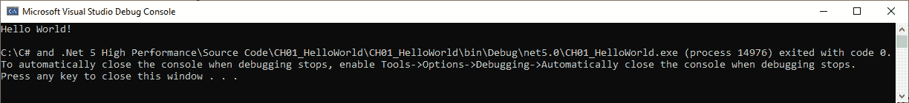

Figure 1.2 – 控制台窗口显示输出"Hello World!"

如果我们打开生成的 DLL 文件在 ILDASM 中，我们将看到以下内容：

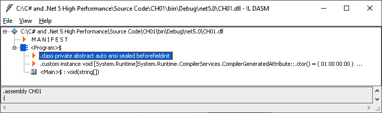

Figure 1.3 – ILDASM 显示 hello world 程序的内部结构

您将从反编译中看到编译器在编译时添加了`Main`方法。我们将要查看的 C# 10.0 的下一个新增功能是只初始化属性。

## 使用只初始化属性

只初始化属性允许您使用具有不可变字段的对象初始化器。在我们的简单演示中，我们将使用一个包含书籍名称及其作者的`Book`类：

```cs
namespace CH01_Books
```

```cs
{
```

```cs
    internal class Book
```

```cs
    {
```

```cs
        public string Title { get; init; }
```

```cs
        public string Author { get; init; }
```

```cs
    }
```

```cs
}
```

属性可以在创建书籍时初始化。但一旦创建，它们只能读取，不能更新，使得`Book`类型不可变。现在，让我们看看只初始化属性。在`Program`类中，将其内容替换为以下内容：

```cs
using System;
```

```cs
using CH01_Books;
```

```cs
var bookName = new Book { Title = "Made up book name", 
```

```cs
    Author = "Made Up Author" };
```

```cs
Console.WriteLine($"{bookName.Title} is written by 
```

```cs
    {bookName.Author}. Well worth reading!");
```

在这里，我们导入了`System`和`CH01_Books`命名空间。然后，我们声明了一个新的`Book`类型的不可变变量。之后，我们使用插值字符串输出了该`Book`类型的内容。运行程序；您应该看到以下输出：

![图 1.4 – 我们只初始化属性示例的输出]

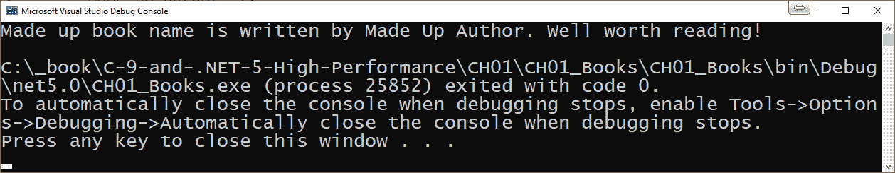

图 1.4 – 我们只初始化属性示例的输出

现在我们已经介绍了只初始化属性，让我们看看记录。

## 使用记录

在更新数据时，您不希望数据被另一个线程更改。因此，在多线程应用程序中，您将希望在使用更新时使用线程安全的对象。记录允许完整的对象不可变，并作为值行为。使用记录而不是结构体的优点是它们需要的内存分配更少。这种内存分配的减少是通过将记录编译为引用类型来实现的。然后通过引用而不是副本来访问它们。因此，除了原始记录的分配之外，不需要进一步分配内存。

让我们学习如何使用记录。启动一个新的控制台应用程序。

为了演示记录的使用，我们将使用以下`Book`示例：

```cs
internal record Book
```

```cs
{
```

```cs
public string Title { get; init; }
```

```cs
     public string Author { get; init; }
```

```cs
}
```

对`Book`类的唯一更改是将类替换为`record`。其他一切保持不变。现在，让我们将记录投入使用：

1.  将`Program`类的内容替换为以下代码：

    ```cs
    using System;
    using CH01_Records;
    var bookOne = new Book { 
        Title = "Made Up Book", 
        Author = "Made Up Author
    };
    var bookTwo = bookOne with { 
        Title = "And Another Made Up Book"
    };
    var bookThree = bookTwo with { 
        Title = "Yet Another Made Up Book"
    };
    var bookFour = bookThree with { 
        Title = "And Yet Another Made Up Book: Part 1",
    };
    var bookFive = bookFour with { 
        Title = "And Yet Another Made Up Book: Part 2"
    };
    var bookSix = bookFive with { 
        Title = "And Yet Another Made Up Book: Part 3"
    };
    Console.WriteLine($"Some of {bookThree.Author}'s 
        books include:\n");
    Console.WriteLine($"- {bookOne.Title}");
    Console.WriteLine($"- {bookTwo.Title}");
    Console.WriteLine($"- {bookThree.Title}");
    Console.WriteLine($"- {bookFour.Title}");
    Console.WriteLine($"- {bookFive.Title}");
    Console.WriteLine($"- {bookSix.Title}");
    Console.WriteLine($"\nMy favourite book by {bookOne.
        Author} is {bookOne.Title}.");
    ```

1.  如您所见，我们正在创建不可变的记录类型。我们可以从它们创建新的不可变类型，并使用`with`表达式更改任何我们喜欢的字段。原始记录不会被任何方式修改。运行代码；您将看到以下输出：

![图 1.5 – 显示其不可变性的只初始化属性]

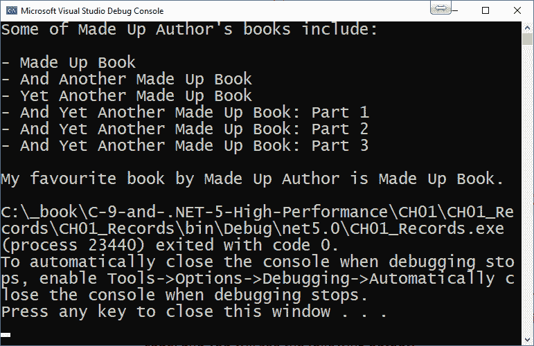

图 1.5 – 显示其不可变性的只初始化属性

尽管在分配过程中更改了标题，但原始记录根本未发生任何修改。

1.  记录也可以使用*继承*。让我们添加一个新的包含出版商名称的记录：

    ```cs
        internal record Publisher
        {
            public string PublisherName { get; init; }
        }
    ```

1.  现在，让我们让我们的`Book`类继承这个`Publisher`记录：

    ```cs
        internal record Book : Publisher
        {
            public string Title { get; init; }
            public string Author { get; init; }
        }
    ```

1.  `Book`现在将包括`PublisherName`。当我们初始化一本新书时，我们现在可以设置其`PublisherName`：

    ```cs
    var bookOne = new Book { 
        Title = "Made Up Book", 
        Author = "Made Up Author",
        PublisherName = "Made Up Publisher Ltd."
    };
    ```

1.  这里，我们创建了一个新的 `Book`，其中包含 `Publisher.PublisherName`。让我们打印出版者的名字。将以下行添加到 `Program` 类的末尾：

    ```cs
    Console.WriteLine($"These books were originally published 
        by {bookSix.PublisherName}.");
    ```

1.  运行代码；你应该看到以下输出：

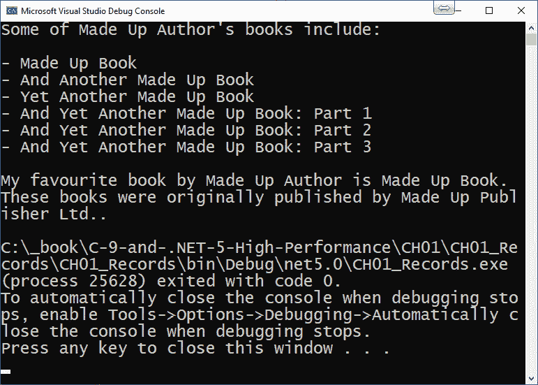

图 1.6 – 使用继承的仅初始化属性

1.  如您所见，我们从未为 `bookTwo` 到 `bookSix` 设置出版者的名字。然而，继承是从我们为 `bookOne` 设置它的时候开始的。

1.  现在，让我们执行对象等式检查。将以下代码添加到 `Program` 类的末尾：

    ```cs
    var book = bookThree with { Title = "Made Up Book" };
    var booksEqual = Object.Equals(book, bookOne) ? 
        "Yes" : "No";
    Console.WriteLine($"Are {book.Title} and 
        {bookOne.Title} equal? {booksEqual}"); 
    ```

1.  这里，我们从一个 `bookThree` 创建了一个新的 `Book`，并将标题设置为 `Made Up Book`。然后，我们执行了等式检查，并将结果输出到控制台窗口。运行代码；你会看到以下输出：

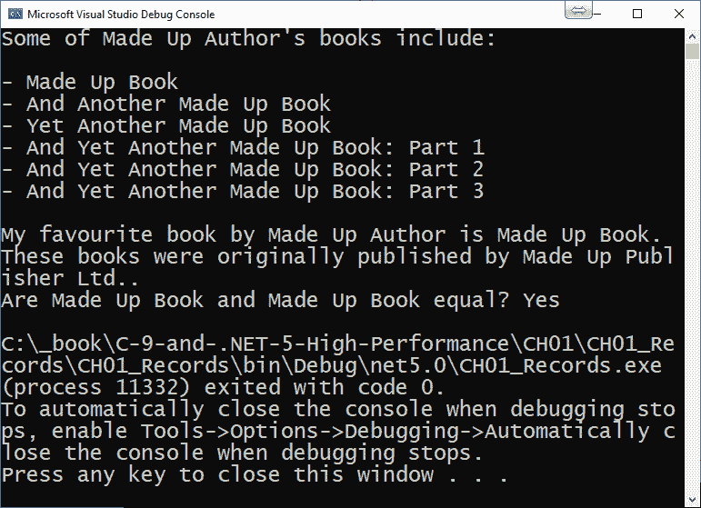

图 1.7 – 仅初始化属性显示等式检查的结果

很明显，等式检查在两个书实例相等时都起作用。

1.  我们对记录的最终审视考虑了位置记录。位置记录通过构造函数设置数据，并通过解构函数提取数据。理解这一点最好的方式是代码。添加一个名为 `Product` 的类，并用以下代码替换类：

    ```cs
        public record Product
        {
            readonly string Name;
            readonly string Description;
            public Product(string name, string 
                description) 
                => (Name, Description) = (name, 
                description);
            public void Deconstruct(out string name, out 
                string description) 
                => (name, description) = (Name, 
                    Description);
        }
    ```

1.  这里，我们有一个不可变的记录。记录有两个私有和 `readonly` 字段。它们在构造函数中设置。`Deconstruct` 方法用于返回数据。将以下代码添加到 `Program` 类中：

    ```cs
    var ide = new Product("Awesome-X", "Advanced Multi-
        Language IDE");
    var (product, description) = ide;
    Console.WriteLine($"The product called {product} is an 
        {description}.");
    ```

在此代码中，我们创建了一个新的产品，具有名称和描述的参数。然后，我们声明了两个名为 `product` 和 `description` 的字段。字段通过分配产品来设置。然后，我们将产品及其描述输出到控制台窗口，如下所示：

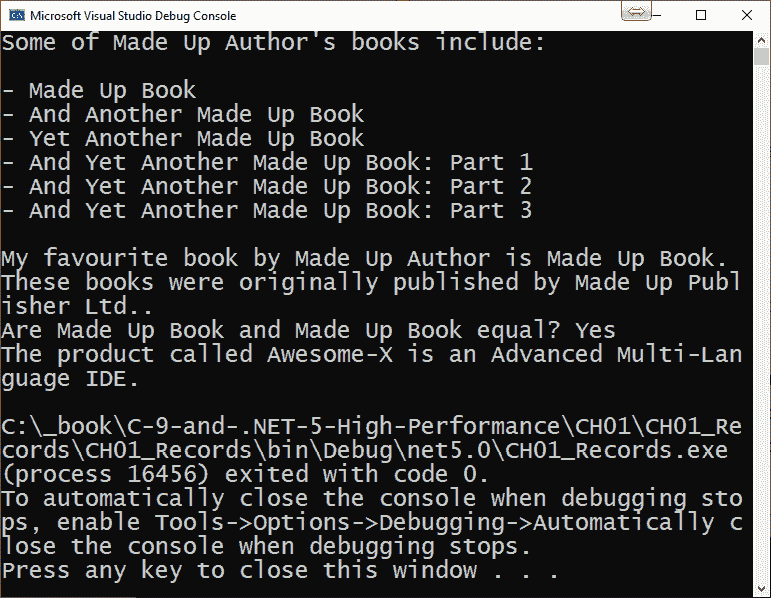

图 1.8 – 仅初始化位置记录

现在我们已经完成了对记录的查看，让我们看看 C# 10.0 改进的模式匹配功能。

## 使用新的模式匹配功能

现在，让我们看看 C# 10.0 中模式匹配的新特性，从简单的模式开始。在简单的模式匹配中，你不再需要丢弃 (`_`) 操作符来仅声明类型。在我们的例子中，我们将对订单应用折扣：

1.  在新的控制台应用程序中，向名为 `Product.cs` 的新文件中添加一个名为 `Product` 的新记录，并添加以下代码：

    ```cs
        internal record Product
        {
            public string Name { get; init; }
            public string Description { get; init; }
            public decimal UnitPrice { get; init; }
        }
    ```

1.  我们的 `Product` 记录有三个仅初始化属性，用于 `Name`、`Description` 和 `UnitPrice`。现在，添加一个继承自 `Product` 的 `OrderItem` 记录：

    ```cs
        internal record OrderItem : Product
        {
            public int QuantityOrdered { get; init; }
        }
    ```

1.  我们的 `OrderItem` 记录继承了 `Product` 记录，并添加了 `QuantityOrdered` 仅初始化属性。在 `Program` 类中，我们将添加三个 `OrderItem` 类型的变量并初始化它们。这是第一个 `OrderItem`：

    ```cs
    var orderOne = new OrderItem {
            Name = "50-80mm Scottish Cobbles", 
            Description = "These rounded stones are 
              frequently used for edging paths and to add 
                interest to gardens", 
            QuantityOrdered = 4, 
            UnitPrice = 199 
    };
    ```

如您所见，正在订购的数量是 `4`。

1.  添加`orderTwo`，具有相同的值，但`OrderQuantity`为`7`。

1.  然后，添加`orderThree`，具有相同的值，但`OrderQuantity`为`31`。我们将在`GetDiscount`方法中演示简单模式匹配：

    ```cs
    static int GetDiscount(object order) =>
        order switch
        {
            OrderItem o when o.QuantityOrdered == 0 => 
                throw 
              new ArgumentException("Quantity must be 
                  greater than zero."),
            OrderItem o when o.QuantityOrdered > 20 => 30,
            OrderItem o when o.QuantityOrdered < 5 => 10,
            OrderItem => 20,
            _ => throw new ArgumentException("Not a known 
                OrderItem!", nameof(order))
        };
    ```

1.  我们的`GetDiscount`方法接收一个订单。然后评估`QuantityOrdered`。如果订单数量为`0`或者传入的对象类型不是`OrderItem`类型，则会抛出参数异常。否则，返回一个`int`类型的折扣，对于订单数量。注意，我们在 20%折扣的行上没有使用丢弃运算符。

1.  最后，我们必须将以下行添加到`Program`类的末尾：

    ```cs
    Console.WriteLine($"The discount for Order One is 
        {GetDiscount(orderOne)}%.");
    Console.WriteLine($"The discount for Order Two is 
        {GetDiscount(orderTwo)}%.");
    Console.WriteLine($"The discount for Order Three is 
        {GetDiscount(orderThree)}%.");
    ```

1.  这些行将每个订单的折扣打印到控制台窗口。现在，让我们修改我们的代码，使其使用关系模式匹配。向`Program`类添加以下方法：

    ```cs
    static int GetDiscountRelational(OrderItem orderItem) 
        => orderItem.QuantityOrdered switch
        {
            < 1 => throw new ArgumentException("Quantity 
                must be greater than zero."),
            > 20 => 30,
            < 5 => 10,
            _ => 20
        };
    ```

1.  使用关系模式匹配，我们得到了与简单模式匹配相同的结果，但代码更少。它也非常易于阅读，这使得它很容易维护。将以下三行代码添加到`Program`类的末尾：

    ```cs
    Console.WriteLine($"The discount for Order One is 
        {GetDiscountRelational(orderOne)}%.");
    Console.WriteLine($"The discount for Order Two is 
        {GetDiscountRelational(orderTwo)}%.");
    Console.WriteLine($"The discount for Order Three is 
        {GetDiscountRelational(orderThree)}%.");
    ```

1.  在这三行中，我们只是将每个订单的折扣输出到控制台窗口。运行程序；你会看到以下输出：

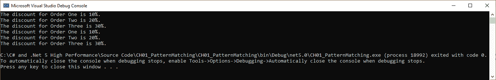

图 1.9 – 简单和关系模式匹配输出显示相同的结果

从前面的屏幕截图可以看出，两种折扣方法都得到了相同的结果。

1.  逻辑`AND`、`OR`和`NOT`方法可用于逻辑模式匹配。让我们添加以下方法：

    ```cs
    static int GetDiscountLogical(OrderItem orderItem) =>
        orderItem.QuantityOrdered switch
        {
            < 1 => throw new ArgumentException("Quantity 
                must be greater than zero."),
            > 0 and < 5 => 10,
            > 4 and < 21 => 20,
            > 20 => 30
        };
    ```

1.  在`GetDiscountLogical`方法中，我们使用逻辑 AND 运算符来检查一个值是否在该范围内。将以下三行添加到`Program`类的末尾：

    ```cs
    Console.WriteLine($"The discount for Order One is 
        {GetDiscountLogical(orderOne)}%.");
    Console.WriteLine($"The discount for Order Two is 
        {GetDiscountLogical(orderTwo)}%.");
    Console.WriteLine($"The discount for Order Three is 
        {GetDiscountLogical(orderThree)}%.");
    ```

1.  在这三行代码中，我们将订单的折扣值输出到控制台窗口。运行代码；你会看到以下输出：

![图 1.10 – 简单、关系和逻辑模式匹配显示相同的结果![图 1.10 – 简单、关系和逻辑模式匹配显示相同的结果图 1.10 – 简单、关系和逻辑模式匹配显示相同的结果逻辑模式匹配的输出与简单和关系模式匹配的输出相同。现在，让我们学习如何使用具有目标类型的新表达式。## 使用具有目标类型的新表达式你可以省略正在实例化的对象的类型。但要做到这一点，声明的类型必须是明确的，并且不能使用`var`关键字。如果你尝试使用三元运算符这样做，你会遇到一个异常：1.  创建一个新的控制台应用程序并添加`Student`记录：    ```cs        public record Student        {            private readonly string _firstName;            private readonly string _lastName;            public Student(string firstName, string                 lastName)            {                _firstName = firstName;                _lastName = lastName;            }            public void Deconstruct(out string firstName,                 out string lastName)                => (firstName, lastName) = (_firstName,                     _lastName);        }    ```1.  我们的`Student`记录存储了通过构造函数设置的姓名值。这些值是通过`Deconstruct`方法的`out`参数获得的。将以下代码添加到`Program`类中：    ```cs    Student jenniferAlbright = new ("Jennifer",         "Albright");    var studentList = new List<Student>    {        new ("Jennifer", "Albright"),        new ("Kelly", "Charmichael"),        new ("Lydia", "Braithwait")    };    var (firstName, lastName) = jenniferAlbright;    Console.WriteLine($"Student: {lastName}, {firstName}");    (firstName, lastName) = studentList.Last();    Console.WriteLine($"Student: {lastName}, {firstName}");    ```1.  首先，我们在`new`语句中没有声明类型，实例化一个新的`Student`对象。然后，我们实例化一个新的`List`对象，并向列表中添加新的学生，同时省略了`Student`类型。接着，定义了`firstName`和`lastName`字段，并通过命名学生的赋值来分配它们的值。然后，学生的姓名在控制台窗口中打印出来。接下来，我们将这些字段重新分配给列表中的最后一个学生的姓名。然后，我们将学生的姓名输出到控制台窗口。运行程序；你会看到以下输出：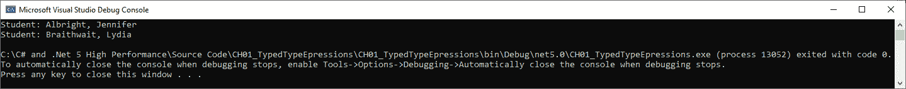


图 1.11 – 使用目标类型与 new 表达式

从前面的截图，你可以看到我们正确地打印出了学生姓名。现在，让我们看看协变返回。

## 使用协变返回

使用协变返回，基类方法可以用返回更具体类型的函数覆盖。看看以下数组声明：

```cs
object[] covariantArray = new string[] { "alpha", "beta", 
```

```cs
    "gamma", "delta" };
```

在这里，我们声明了一个`object`数组。然后，我们将一个`string`数组赋值给它。这是一个协变的例子。`object`数组是最不具体的数组类型，而`string`数组是更具体的数组类型。

在这个例子中，我们将实例化协变类型，并将它们传递给接受更不具体和更具体类型的函数。将以下类和接口声明添加到`Program`类中：

```cs
public interface ICovariant<out T> { }
```

```cs
public class Covariant<T> : ICovariant<T> { }
```

```cs
public class Person { }
```

```cs
public class Teacher : Person { }
```

```cs
public class Student : Person { }
```

在这里，我们有一个实现了协变接口的协变类。我们声明了一个通用的`Person`类型，该类型被具体的`Teacher`和`Student`类型继承。添加`CovarianceClass`，如下所示：

```cs
public class CovarianceExample
```

```cs
{
```

```cs
public void CovariantMethod(ICovariant<Person> person)
```

```cs
{ 
```

```cs
      Console.WriteLine($"The type of person passed in is 
```

```cs
          of type {person.GetType()}.");
```

```cs
}
```

```cs
}
```

在`CovarianceExample`类中，我们有一个可以接受`ICovariant<Person>`类型对象的`CovariantMethod`参数。现在，让我们通过将`CovarianceAtWork`方法添加到`CovarianceExample`类中来使用协变：

```cs
public void CovarianceAtWork()
```

```cs
{
```

```cs
ICovariant<Person> person = new Covariant<Person>();
```

```cs
ICovariant<Teacher> teacher = new Covariant<Teacher>();
```

```cs
ICovariant<Student> student = new Covariant<Student>();
```

```cs
CovariantMethod(person);
```

```cs
CovariantMethod(teacher);
```

```cs
CovariantMethod(student);
```

```cs
}
```

在这个方法中，我们有通用的`Person`类型和更具体的`Teacher`和`Student`类型。我们必须将每个类型传递给`CovariantMethod`。此方法可以接受更不具体的`Person`类型和更具体的`Teacher`和`Student`类型。

要运行`CovarianceAtWork`方法，请在`using`语句之后和`covariantArray`示例之前放置以下代码：

```cs
CovarianceExample.CovarianceAtWork();
```

现在，让我们看看本地编译。

# 本地编译

当.NET 代码编译时，它被编译成**微软中间语言**（**MSIL**）。当需要时，JIT 编译器会解释 MSIL。然后，JIT 编译器将必要的 MSIL 代码编译成本地二进制代码。随后的对同一代码的调用将调用代码的二进制版本，而不是 MSIL 版本。这意味着 MSIL 代码始终比本地代码慢，因为它在第一次运行时被编译成本地代码。

JIT 代码的优点是跨平台代码，但代价是较长的启动时间。正在运行的 MSIL 程序集的代码由 JIT 编译器编译成本地代码。JIT 编译器针对其运行的硬件优化本地代码。

默认情况下，UWP 应用程序使用 .NET Native 编译成本地代码，而 iOS 应用程序通过 Xamarin/Xamarin.Forms 编译成本地代码。Microsoft .NET Core 也可以编译成本地代码。

## 执行 .NET Core 应用程序的本地编译

当使用 `dotnet` 编译程序集到本地代码时，您需要指定一个目标框架。有关支持的目标框架列表，请参阅 [`docs.microsoft.com/en-us/dotnet/standard/frameworks`](https://docs.microsoft.com/en-us/dotnet/standard/frameworks)。您还需要指定一个 **运行时标识符**（**RID**）。有关支持 RID 的列表，请参阅 [`docs.microsoft.com/en-us/dotnet/core/rid-catalog`](https://docs.microsoft.com/en-us/dotnet/core/rid-catalog)。

注意

在撰写本文时，针对 .NET 5.0 的本地编译确实存在一些问题。因此，为了简化问题，我们将演示将本地编译成单个可执行文件的过程，针对 netcoreapp3.1 和 win10-x64。

为了演示将 Microsoft .NET Core 应用程序编译成本地编译的单个可执行文件，我们将编写一个简单的演示应用程序，它遍历目录结构并将音频文件从一种格式转换成另一种格式：

1.  开始一个新的控制台应用程序，并针对 .NET 6。

1.  访问 [`ffmpeg.org/download.html`](https://ffmpeg.org/download.html) 并下载适用于您操作系统的 `ffmpeg`。我的系统是 Windows 10。

1.  在 Windows 10 上，将 `ffmpeg` 文件解压到 `C:\Tools\ffmpeg` 文件夹。将以下 `using` 语句添加到 `Program.cs` 文件的顶部：

    ```cs
    using System;
    using System.Diagnostics;
    using System.IO;
    ```

1.  我们将在本地系统上的文件夹层次结构中批量处理音频文件。在这里，列出的 `using` 语句将帮助我们调试代码并在文件系统上执行 I/O。现在，在 `Program` 类的顶部添加以下三个字段：

    ```cs
    private static string _baseDirectory = string.Empty;
    private static string _sourceExtension = string.Empty;
    private static string _destinationExtension = string
        .Empty;
    ```

1.  `BaseDirectory` 成员保存将要处理的起始目录。`sourceExtension` 保存文件类型的扩展名，例如 `.wav`，我们希望将其转换成，而 `destinationExtension` 保存我们希望转换成的文件类型的扩展名，例如 `.ogg`。更新您的 `Main` 方法，使其看起来如下所示：

    ```cs
    static void Main(string[] args)
    {
    Console.Write("Enter Source Directory: ");
    _baseDirectory = Console.ReadLine();
    Console.Write("Enter Source Extension: ");
    _sourceExtension = Console.ReadLine();
    Console.Write("Enter Destination Extension: ");
    _destinationExtension = Console.ReadLine();
    new Program().BatchConvert();
    }
    ```

1.  在我们的 `Main` 方法中，我们要求用户输入源目录、源扩展名和目标扩展名。然后，我们设置成员变量并调用 `BatchConvert` 方法。让我们添加我们的 `BatchConvert` 方法：

    ```cs
    private void BatchConvert()
    {
    var directory = new DirectoryInfo(_baseDirectory);
    ProcessFolder(directory);
    }
    ```

1.  `BatchConvert`方法创建一个新的名为`directory`的`DirectoryInfo`对象，然后将`directory`对象传递给`ProcessFolder`方法。现在让我们添加这个方法：

    ```cs
    private void ProcessFolder(DirectoryInfo 
        directoryInfo)
    {
    Console.WriteLine($"Processing Directory: 
        {directoryInfo.FullName}");
    var fileInfos = directoryInfo.EnumerateFiles();
    var directorieInfos = directoryInfo.
        EnumerateDirectories();
           foreach (var fileInfo in fileInfos)
                 if (fileInfo.Extension.Replace(".", "") 
                     == sourceExtension)
                        ConvertFile(fileInfo);
    foreach (var dirInfo in directorieInfos)
                 ProcessFolder(dirInfo);
    }
    ```

1.  `ProcessFolder`方法将消息输出到屏幕，以便用户知道正在处理哪个文件夹。然后，它从`directoryInfo`参数中获取`FileInfo`和`DirectoryInfo`对象的枚举。之后，它将具有所需源文件扩展名的该文件夹中的所有文件进行转换。一旦所有文件都处理完毕，每个`DirectoryInfo`对象将通过递归调用`ProcessFolder`方法进行处理。最后，让我们添加我们的`ConvertFile`方法：

    ```cs
    private void ConvertFile(FileInfo fileInfo)
    {    
    }
    ```

1.  我们的`ConvertFile`方法接受一个`FileInfo`参数。该参数包含要转换的文件。剩余的代码将添加到这个`ConvertFile`方法中。添加以下三个变量：

    ```cs
    var timeout = 10000;
    var source = $"\"{fileInfo.FullName}\"";
    var destination = $"\"{fileInfo.FullName.Replace
         (_sourceExtension, _destinationExtension)}\"";
    ```

1.  `timeout`变量设置为 10 秒。这给每个文件的处理提供了 10 秒的时间。`source`变量包含要转换的文件的完整名称，而`destination`变量包含新转换文件的完整路径。现在，添加检查以查看转换文件是否存在：

    ```cs
    if (File.Exists(fileInfo.FullName.Replace
         (_sourceExtension, _destinationExtension)))
    {
    Console.WriteLine($"Unprocessed: {fileInfo.FullName}");
           return;
    }
    ```

1.  如果`destination`文件已存在，则转换已经发生，因此我们不需要处理该文件。所以，让我们向用户输出一条消息，通知他们该文件未处理，然后从方法中返回。让我们添加执行转换的代码：

    ```cs
    Console.WriteLine($"Converting file: {fileInfo.FullName}
        from {_sourceExtension} to {_destination
            Extension}.");
    using var ffmpeg = new Process
    {
    StartInfo = {
                 FileName = @"C:\Tools\ffmpeg\bin
                    \ffmpeg.exe",
                  Arguments = $"-i {source} 
                    {destination}",
                  UseShellExecute = false,
                  RedirectStandardOutput = true,
                  RedirectStandardError = true,
                  CreateNoWindow = true
    }
    };
    ffmpeg.EnableRaisingEvents = false;
    ffmpeg.OutputDataReceived += (s, e) => Debug.WriteLine
         ($"Debug: e.Data");
    ffmpeg.ErrorDataReceived += (s, e) => Debug.WriteLine
         ($@"Error: {e.Data}");
    ffmpeg.Start();
    ffmpeg.BeginOutputReadLine();
    ffmpeg.BeginErrorReadLine();
    ffmpeg.WaitForExit(timeout);
    ```

1.  在这里，我们向窗口输出一条消息，通知用户正在处理的文件。然后，我们实例化一个新的进程，执行`ffmpeg.exe`并将音频文件从一种格式转换为用户指定的另一种格式。转换后的文件随后被保存在原始文件相同的目录中。

1.  这样，我们就完成了我们的示例项目。那么，让我们看看它运行的情况。在一个外置硬盘上，我有一些我拥有的 Ghosthack 音频样本。这些文件是`.wav`格式。但是，它们需要转换成`.ogg`文件，以便用于我使用的 Android 程序。你可以使用你自己的音频文件或音乐文件夹。

    注意

    如果你没有音频文件来测试这个小程序，你可以从[`www.bensound.com`](https://www.bensound.com)下载一些免版税的声音。你可以查看以下页面以获取链接到各种公共音乐域：[`www.lifewire.com/public-domain-music-3482603`](https://www.lifewire.com/public-domain-music-3482603)。

1.  填写问题并按*Enter*键：

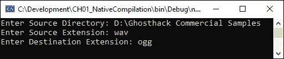

图 1.12 – 我们的文件转换器显示目录和文件转换格式

程序现在将处理指定父文件夹下的所有文件和文件夹。

程序以 MSIL 形式运行正常。然而，我们可以看到文件转换过程中的延迟。让我们将我们的文件转换器编译成一个单一的本地可执行文件，然后看看它是否明显更快：

1.  以管理员身份打开 Visual Studio 开发者命令提示符，并导航到包含您的解决方案和项目文件的文件夹。在发布文件时，请注意，项目中的`TargetFramework`属性也应更新为 netcoreapp3.1；否则，这可能不起作用——也就是说，如果它设置为`net5.0`。输入以下命令，然后按*Enter*：

    ```cs
    dotnet publish --framework netcoreapp3.1 -
        p:PublishSingleFile=true --runtime win10-x64
    ```

1.  当命令运行完成后，您的命令窗口应如下所示：

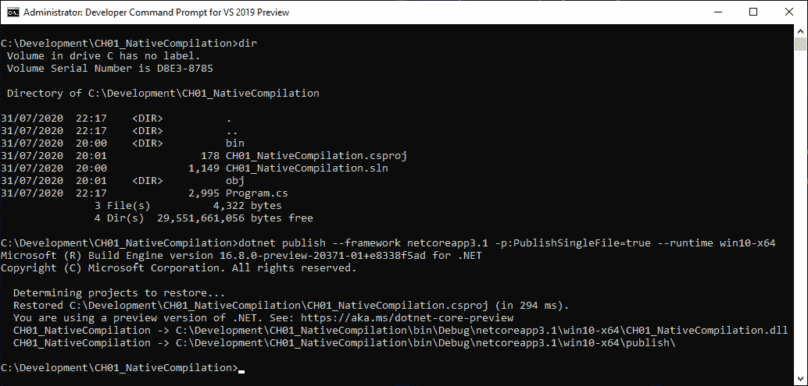

图 1.13 – 以管理员模式显示原生编译输出的开发者命令提示符

1.  如果您导航到发布目录，您将看到以下输出：

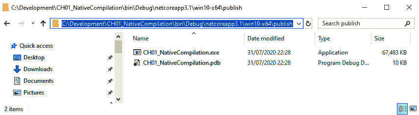

图 1.14 – Windows 资源管理器显示原生编译产生的输出文件

1.  运行`CH01_NativeCompilation.exe`文件。您将看到`.wav`文件被快速转换成`.ogg`文件。

在本节中，我们学习了如何编写控制台应用程序。我们将控制台应用程序编译成 MSIL，然后将控制台应用程序编译成一个单一的本地可执行文件。从用户的角度来看，文件以本地形式处理批处理音频文件比以 MSIL 形式快得多。

现在，让我们学习如何提高 Windows Store 应用程序的性能。

# 提升 Windows Store 性能

这里有一些提高 Windows Store 应用程序性能的基本技巧：

+   **执行 Microsoft Store 应用程序性能评估**：有关如何执行此操作的更多信息，请访问[`docs.microsoft.com/en-us/windows-hardware/test/assessments/microsoft-store-app-performance`](https://docs.microsoft.com/en-us/windows-hardware/test/assessments/microsoft-store-app-performance)。

+   **理解 Microsoft Store 应用程序性能评估的结果**：为了帮助您理解 Windows Store 应用程序性能评估的结果，请访问[`docs.microsoft.com/en-us/windows-hardware/test/assessments/results-for-the-microsoft-store-app-performance-assessment`](https://docs.microsoft.com/en-us/windows-hardware/test/assessments/results-for-the-microsoft-store-app-performance-assessment)

+   **解决 Microsoft Store 应用程序性能评估结果中突出的问题**：主要关注区域是任何在深紫色中突出显示的问题，其次是中等紫色标记的问题。主要指标将是启动：Warm、启动：Cold、启动后、空闲和挂起。您还需要注意处理器和存储使用情况，以及处理器和存储 I/O 延迟、注册表刷新、时间会计、缺失符号、长时间运行的**延迟过程调用**（**DPCs**）和**中断服务例程**（**ISRs**），这些可能会被最终用户感知为性能问题。

在下一节中，我们将学习如何使用 ASP.NET 提高性能。

# 提高 ASP.NET 性能

这里有一些提高 Web 应用程序和 API 性能的基本技巧：

+   **进行基准测量**：在更改您的 Web 应用程序或 API 的性能之前，先对程序的性能进行基准测试。这样，您可以测量任何调整，看看它们是否提高了性能或减慢了速度。

+   **从优化影响最大的代码开始**：当您完成基准测量后，开始对性能最差且对程序性能影响最大的代码片段进行性能调整。这将为您带来最大的收益。

+   **启用 HTTP 压缩**：为了减少通过 HTTP/HTTPS 传输的文件大小并提高网络性能，请启用压缩。有两种类型的压缩。GZIP 压缩已经存在很多年了，是事实上的压缩机制；它可以减少文件大小的三分之一。另一种压缩机制是 Brotli。自 2016/2017 年以来，大多数主要浏览器都支持这种压缩机制。

+   **减少 TCP/IP 连接开销**：减少 HTTP 请求严重提高了 HTTP 通信性能。每个请求都使用网络和硬件资源。当建立了特定于硬件和软件的连接数时，性能将开始显示出下降的迹象。这可以通过减少 HTTP 请求的数量来缓解。

+   **使用 SSL 上的 HTTP/2**：HTTP/2 over SSL 提供了使用 HTTP 的各种性能改进。多路复用流提供了双向的文本格式帧序列。服务器推送允许服务器在预期客户端可能会使用它的情况下，将可缓存的推送到客户端。二进制协议在解析数据时具有更低的开销，并且它们更不容易出错。二进制协议提供了更多的安全性，并且有更好的网络利用率。当您切换到 SSL 上的 HTTP/2 时，您还可以获得许多其他优化。

+   **采用最小化技术**：最小化是消除 HTML、CSS 或 JavaScript 网页文件中的空白和注释的过程。通过减小文件大小并启用压缩，您可以大大加快文件的网络传输速度，尤其是在差的 Wi-Fi 环境下。

+   **将 CSS 放在头部以便首先加载**：为了高效渲染网页，最好在渲染之前加载完整的 CSS，以防止回流。

+   `body`标签。对于基于重框架的应用程序，引导将是有益的，因为只需加载所需的 JavaScript。另一种选择是在客户端和服务器上渲染页面的同构 JavaScript。同构应用程序可以提高 SEO、性能和可维护性。

+   **减少图像大小**：图像的大小可能相差很大。减少页面上使用的图像的大小。当与最小化和压缩一起使用时，这种技术可以帮助看起来华丽的网页快速加载。

你可以在*进一步阅读*部分了解更多关于提高 ASP.NET 性能的其他技术。现在，让我们总结一下本章所学的内容。

# 摘要

在本章的开始，你下载了 C#编程语言的最新源代码。然后，你恢复了它，构建了它，并运行了各种测试。之后，你构建了一个演示 C# 9.0 特性的 Hello, World!程序。

然后，你学习了.NET 5 中的新内容。本节涵盖了垃圾回收、即时编译、基于文本的处理、线程和异步操作、集合、LINQ、网络和 Blazor 等主题。我们还介绍了基于性能的新 API 和分析器。从所涵盖的内容来看，你现在对微软和第三方为.NET 编程语言新版本所做的众多性能改进有了高层次的认识。这些性能改进是迁移到.NET 5 的坚实理由。但另一个令人信服的理由也是从单一代码库迁移到.NET 进行真正的跨平台开发。

在回顾.NET 5 的性能改进和新增功能后，我们看到了新的 C#10.0 特性。你学习了如何使用顶层语句仅用一行代码编写程序。然后，你学习了如何实现只读属性、记录、新的模式匹配功能、具有目标类型的表达式和协变返回。通过回顾 C# 9.0 语言的新增功能，你学习了如何在 MSIL 中编译和运行代码，然后在一个可执行文件中编译和运行原生代码。从视觉上看，当使用原生二进制而不是 MSIL 汇编时，最终用户体验更好。对于示例，我们使用了一个简单的音频文件格式转换器。

您已经获得了一些关于如何提高 Windows Store 应用程序性能的指导。向您展示了官方微软文档的链接，以帮助您生成性能报告，以及如何理解性能评估的结果。此指导还突出了需要注意的主要指标。最后，我们考虑了一些可以提高您的 ASP.NET 网站和 API 性能的方法。在 *进一步阅读* 部分中，您可以找到指向官方微软 ASP.NET 文档的链接。此文档将帮助您设计和构建高质量的网站。

此外，在 *进一步阅读* 部分中，您将找到一些指向文档和 .NET MAUI 的 GitHub 仓库的链接，该仓库预计将与 .NET 6 一起在 2021 年发布。这种用户界面技术是 Xamarin.Forms 的发展，基于客户研究进行了进化性改变。它看起来相当有前景。

在下一章中，我们将探讨 .NET 互操作性。但在那之前，请完成本章的问题，看看一切是否已经深入人心。

# 问题和练习

回答本章的相关问题：

1.  .NET 6 正在改进 .NET 的哪些领域？

1.  C# 10.0 有哪些新特性？

1.  用于 .NET 本地编译的工具有哪些？

1.  如何提高 Windows Store 应用程序的性能？

1.  如何加速 ASP.NET？

1.  调查 .NET MAUI 的状态，这是仍在开发中的前端桌面和移动开发的未来。

1.  编写一些控制台应用程序，并练习使用 .NET 6 和 C# 10.0 的新特性。

1.  使用 Benchmark.NET 对您的小型应用程序进行基准测试，然后升级到使用 .NET 6 和 C# 10.0。如果可能的话，在不做任何更改的情况下测量其性能，然后再次测量其性能。看看您是否通过仅升级到 C# 10.0 和 .NET 6 就注意到了性能改进。

    注意

    问题 4 和 5 的答案可以在各自章节提供的外部参考源中找到。

# 进一步阅读

要了解更多关于本章所涵盖的主题，请查看以下资源：

+   下载 .NET 6：[`dotnet.microsoft.com/download/dotnet/6.0`](https://dotnet.microsoft.com/download/dotnet/6.0).

+   下载 Visual Studio 预览版：[`visualstudio.microsoft.com/vs/preview/`](https://visualstudio.microsoft.com/vs/preview/).

+   *介绍 .NET 多平台应用 UI*：[`devblogs.microsoft.com/dotnet/introducing-net-multi-platform-app-ui/`](https://devblogs.microsoft.com/dotnet/introducing-net-multi-platform-app-ui/).

+   .NET MAUI GitHub 页面：[`github.com/dotnet/maui`](https://github.com/dotnet/maui).

+   从微软学习如何构建反映您品牌的优质 Windows 10 应用程序：[`docs.microsoft.com/en-us/windows-hardware/get-started/`](https://docs.microsoft.com/en-us/windows-hardware/get-started/).

+   从微软学习如何使用微软技术设计和构建高质量网站：https://dotnet.microsoft.com/apps/aspnet.

+   C#9.0 早期回顾：[`medium.com/dev-genius/c-9-early-review-5bcd88296c54#:~:text=Relax%20ordering%20of%20ref%20and%20partial%20modifiers%20Currently%2C,is%20a%20ref%20struct%2C%20ref%20must%20appear%20`](https://medium.com/dev-genius/c-9-early-review-5bcd88296c54#:~:text=Relax%20ordering%20of%20ref%20and%20partial%20modifiers%20Currently%2C,is%20a%20ref%20struct%2C%20ref%20must%20appear%20).

+   *.NET 6 中的文件 I/O 改进*: [`devblogs.microsoft.com/dotnet/file-io-improvements-in-dotnet-6/`](https://devblogs.microsoft.com/dotnet/file-io-improvements-in-dotnet-6/).
