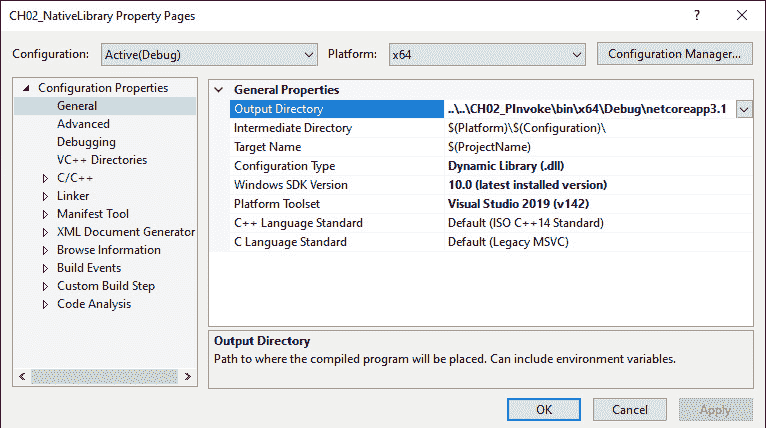
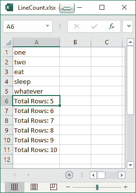
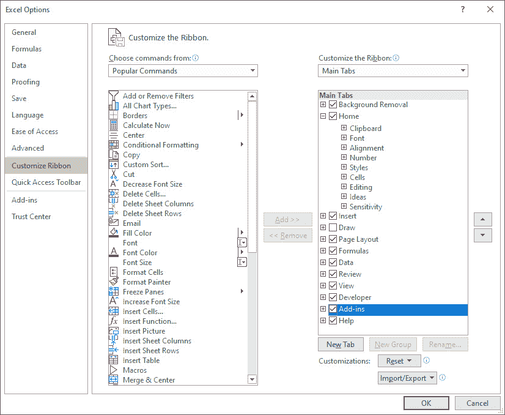
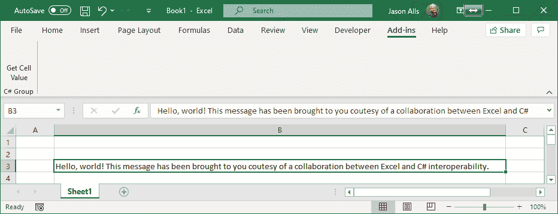
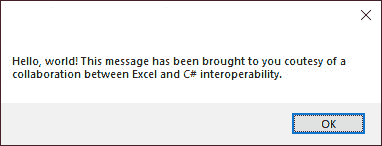

# *第二章*：实现 C# 互操作性

本章是针对那些希望或需要使用 C# 与 Excel、Python、C++ 和 **Visual Basic 6** (**VB6**) 进行互操作的用户的一个可选章节。

在最近几个月中，Python 已经成为一门非常流行的编程语言，现在在数据科学和机器学习领域扮演着非常重要的角色。由于大数据需要各种技术，这些技术需要在各种业务场景下相互协作，在本章中，您将学习如何从 C# 中执行 Python 脚本和代码。您还可以在 .NET 平台上使用 IronPython.NET，但由于本书是为 C# 程序员编写的，因此我们不会在本章中考虑 IronPython.NET。

有时候，访问用 C++ 编写的库是必要的——尤其是在性能是问题的时候，您需要额外的性能来开发高级游戏。

在本章中，您将了解 Microsoft .NET 互操作性。将您的整个代码库迁移到使用您整个开发团队都熟悉的单一语言的代码库是有利的。但有时，一次性完成这一操作往往不切实际、成本效益低，甚至不安全。这就是互操作性的作用所在。

在本章中，您将学习如何与托管和非托管代码进行交互。您将了解使用不安全代码、使用 **平台调用** (**P/Invoke**) 的非托管代码、COM 互操作性和处理不安全代码。

注意

在 C# 中使用非托管代码并不总是能提高性能。有时，它甚至会降低性能。但将本章包含在这本关于高性能的书中，是为了提供您将需要了解的知识和工具，以逐步将您的非托管代码库替换为托管代码库。通过这样做，所有开发人员只需使用一种语言及其支持的语言（在这种情况下，是 C#）。您的软件可以使用 Azure 或任何其他 .NET 云提供商的高性能和高度可扩展的功能来构建世界级的基于云的系统。这样做的好处之一是它使代码管理和维护变得更加容易。

在本章中，我们将涵盖以下主题：

+   **使用不安全代码**：C# 有效地保护程序员免于处理指针。但有时，使用指针来提高性能是必要的。因此，在本节中，我们将探讨不安全代码是什么以及如何实现它们。

+   **使用平台调用公开静态入口点**：P/Invoke 允许您从您的托管 C# 代码中访问未托管库中的代码。在本节中，我们将学习如何访问未使用 .NET 构建的代码。

+   **执行 COM 互操作性**：在本节中，我们将学习如何使 COM 组件和库对 C# 项目可见，以便使用。我们还将探讨如何使我们的组件和库对 COM 组件可见，以便使用。

+   **安全地处理不安全代码**：C# 在代码执行完毕后执行垃圾回收以释放资源方面做得非常好，但当您处理非托管代码时，您需要负责清理非托管资源。因此，在本节中，您将了解如何进行此操作。

完成本章后，您将能够做到以下事项：

+   理解 C# 中不安全代码的使用

+   从托管代码调用本地代码

+   在托管和非托管代码中使用 COM 库和组件

+   在不再需要时释放不安全资源

# 技术要求

在本章中，一些代码包括 C# 托管程序集与基于 COM 的 ActiveX 用户控件、DLL 和可执行文件之间的互操作性。

要编写本章的代码和构建项目，您需要以下内容：

+   Visual Studio 2022

+   .NET 6 的最新 x86 预览版

+   .NET 6 的最新 x64 预览版

+   可选：Visual C++

+   可选：Microsoft Office 的 Visual Studio 工具

+   可选：Visual Basic 6

本章的代码文件可以在本书的 GitHub 仓库中找到：[`github.com/PacktPublishing/High-Performance-Programming-in-CSharp-and-.NET/tree/master/CH02`](https://github.com/PacktPublishing/High-Performance-Programming-in-CSharp-and-.NET/tree/master/CH02)。

注意

虽然 Visual Basic 6 已过时，不再由 Microsoft 支持，但它仍然在各种业务和行业中的生产代码中被广泛使用，例如汽车软件提供商和教育行业。与 VB6 和 .NET 的互操作使得从 VB6 到 .NET 的逐步迁移成为可能。通过现代化使用旧技术构建的应用程序，您可以使用各种云提供商（如 Azure）使它们在时区上具有高度的可扩展性。

我们将首先查看不安全代码。

# 使用平台调用（P/Invoke）

P/Invoke 是 **通用语言基础设施**（**CLI**）的一个功能，它允许托管应用程序调用本地代码。本地代码不受 **通用语言运行时**（**CLR**）的管理，因此，代码的安全性牢牢掌握在程序员手中。

在托管代码中，垃圾回收器自动清理内存中的对象，并负责为对象分配代数。我们将在 *第四章*，*内存管理*中更详细地介绍垃圾回收器。新对象在大小小于 80,000 字节时总是以零代开始其生命周期，并将放置在小型对象堆上。大小等于或大于 80,000 字节的对象放置在大型对象堆上。在零代中存活的对象会被垃圾回收器提升到一代。最后，在一代中存活的对象会被提升到二代。

注意

实例化对象的大小等于或大于 80,000 字节可能最初是零代，但可能会提升，因此它们不会被看作是零代。

当垃圾回收器将对象从一个代提升到另一个代时，其内存地址会改变。这会破坏任何指向该地址的指针。为了防止垃圾回收器修改地址，必须使用`fixed`关键字声明指针代码。

现在，让我们来看看如何使用`unsafe`和`fixed`关键字。

## 使用不安全和固定代码

为了提醒程序员确保代码安全性的责任，未管理代码被包裹在一个使用`unsafe`关键字标记的代码块中。不安全代码利用指针来引用内存中的位置。

**不安全代码**为程序员提供了访问 C#中指针类型的权限，这在他们与底层操作系统、系统驱动程序或需要以最短时间执行的时间关键代码工作时是必要的。

尽管我们说处理指针的代码是不安全代码，但它是安全的。这样的代码用`unsafe`关键字标记。尽管被称为不安全，但这种代码在托管代码中是安全的——它只是没有经过 CLR 的验证。因此，可能会引入安全风险和/或指针错误。你可以有一个不安全的`pointer_type`、`value_type`或`reference_type`。

注意

不安全代码的主题很深，所以如果你想了解更多，请查看讨论不安全代码的语言规范，网址为 https://docs.microsoft.com/dotnet/csharp/language-reference/language-specification/unsafe-code。

在本节中，我们将编写一个控制台应用程序，将各种不安全代码机制付诸实践。你可以在[`github.com/PacktPublishing/C-9-and-.NET-5-High-Performance/tree/master/CH02/CH02_UnsafeCode`](https://github.com/PacktPublishing/C-9-and-.NET-5-High-Performance/tree/master/CH02/CH02_UnsafeCode)查看项目的源代码。

考虑以下计算机程序：

```cs
namespace CH02_UnsafeCode
```

```cs
{
```

```cs
    using System;
```

```cs
    class Program
```

```cs
    {
```

```cs
        static void Main(string[] args)
```

```cs
        {
```

```cs
            int[] array = new int[5] { 5, 4, 3, 2, 1 };
```

```cs
            Console.WriteLine(array[4]);
```

```cs
            unsafe
```

```cs
            {
```

```cs
                int* pointer = stackalloc int[5];
```

```cs
                int* cpointer = pointer;
```

```cs
                cpointer += 50;
```

```cs
                Console.WriteLine(*cpointer);
```

```cs
            }
```

```cs
        }
```

```cs
    }
```

```cs
}
```

在前面的代码中，你可以看到我们使用`new`关键字为包含五个`int`值的数组分配内存空间。我们也可以使用不安全代码来完成同样的操作。但是，我们不是使用`new`关键字，而是使用`stackalloc`，并将代码包裹在一个标记为`unsafe`的代码块中。

当处理像数组指针这样的不安全代码时，使用`fixed`关键字是必要的。要理解为什么`fixed`关键字很重要，你需要了解垃圾回收。

当对象被创建时，它们是零代对象。垃圾回收器将删除任何未引用的一代对象。如果分配零代对象的空間变满，垃圾回收器会将零代对象移动到一代。然后，新的对象可以添加到零代。如果一代和二代对象变满，并且所有对象都在使用中，那么垃圾回收器会将一代对象移动到二代。这反过来又会将零代对象移动到一代。

新对象随后被添加到零代。此时，如果第二代、第一代和零代存储空间已满，这意味着无法添加新对象，那么你最终会得到一个内存不足异常。以下图表显示了这一点：


图 2.1 – 对象代际的垃圾回收管理

由于垃圾回收器正在将项目从一个代际移动到另一个代际，内存位置会发生变化。然而，代码中指向这些对象的指针不会改变。因此，当从指针地址检索信息时，数据将是错误的。

为了防止这种情况发生，我们可以使用 `fixed` 关键字。`fixed` 关键字告诉垃圾回收器不要单独处理 `arrayPointer` 指向的地址空间。这意味着我们可以确保指针将指向正确的地址空间和数据。以下代码展示了如何使用 `unsafe` 和 `fixed` 关键字来处理数组：

```cs
unsafe 
```

```cs
{
```

```cs
     fixed (int* arrayPointer = array)
```

```cs
     {
```

```cs
     // Code omitted.
```

```cs
}
```

```cs
}
```

在前面的代码中，因为我们使用了不安全代码，所以我们使用了 `unsafe` 代码块。由于我们不希望数组受到垃圾回收器的影响，我们通过使用 `fixed` 代码块来保持对象在其当前代际。

当使用不安全代码时，你必须注意访问超出范围的数组的影响。在托管代码中访问超出范围的数组时，你会得到 `IndexOutOfBoundsException`。在非托管代码中，你没有这样的奢侈。你必须确保访问正确的索引。如果你意外地访问了数组范围之外的索引，那么你将不会抛出 `IndexOutOfBoundsException`。相反，你会得到该内存地址上的任何内容返回给你。在这种情况下，你可能或可能不会抛出某种类型的异常。以下代码演示了这一点：

```cs
int* pointerToArray = stackalloc int[100];
```

```cs
Console.WriteLine(pointerToArray[99]);
```

```cs
Console.WriteLine(pointerToArray[100]);
```

在这里，数组被添加到栈上。数组在位置 `99` 的值是正确的，但数组位置 `100` 超出了范围，因此返回了一个错误值。这意味着会抛出 `IndexOutOfBoundsException`。这就是为什么在处理索引时必须小心处理非托管代码。

注意

`unsafe` 关键字的原因是提醒程序员对代码安全性负责。在处理指针时，不会引发运行时异常。相反，返回该内存位置上的任何内容。这就是为什么在编写不安全代码时必须格外小心。当无法承受垃圾回收器切换对象代际并移动它们时，你也必须使用 `fixed` 关键字。

在 C# 中，您只能使用具有 unsafe 和 fixed 代码的结构体和原始类型。不允许访问堆的类和字符串。这意味着任何将被垃圾回收的内容都不能使用 unsafe 代码引用。因此，当使用 C# 指针时，您可以使用值类型，但不能使用引用类型。

例如，以下代码将无法编译：

```cs
unsafe
```

```cs
{
```

```cs
      fixed (TestObject* testObject = new TestObject()) { }
```

```cs
      fixed (string* text = "Hello, World!") { }
```

```cs
}
```

`testObject` 变量是一个引用类型指针，如果构建代码，编译器会抛出异常。此代码返回以下异常：

+   `CS0208`：无法获取托管类型（`'TestObject'`）的地址、大小或声明指针

`text` 变量是一个字符串指针，如果构建代码，编译器会抛出异常。此代码返回以下异常：

+   `CS0208`：无法获取托管类型（`'string'`）的地址、大小或声明指针

    注意

    使用固定对象可能会导致内存碎片化。因此，除非您真的需要，否则请避免使用 `fixed` 关键字，并且只使用您需要的最长时间。

现在，让我们看看如何使用 P/Invoke 暴露静态入口点。

## 使用 P/Invoke 暴露静态入口点

P/Invoke 允许您使静态入口点对其他应用程序可用。如果您曾经使用过 WinAPI，那么您已经通过它们的公共静态入口点访问了 DLL 中的代码。这些访问点是通过 P/Invoke 提供的。

要使用 P/Invoke，您需要导入 `System.Runtime.InteropServices` 命名空间。然后，您必须使用 `DllImportAttribute` 来进行静态入口调用：

注意

要识别文件的静态入口点，您可以使用位于 `C:\Program Files (x86)\Microsoft Visual Studio\2019\Preview\VC\Tools\MSVC\14.28.29115\bin\Hostx64\x64` 文件夹中的 `dumpbin.exe` 文件。在写作时，14.28.29.115 版本正确。当您执行以下代码时，此版本将已更改。使用您在电脑上安装的最新版本。

现在，让我们学习如何使用 `dumpbin` 通过命令行查看 `User32.dll` 系统库导出的方法和属性：

1.  打开命令行或开发者命令提示符。然后，输入以下命令（注意，您电脑上可能版本不同——使用您拥有的最新版本号）：

    ```cs
    " C:\Program Files (x86)\Microsoft Visual 
        Studio\2019\Preview\VC\Tools\MSVC\14.28.29304
          \bin\Hostx64\x64\dumpbin.exe /exports User32.dll
    ```

您应该看到以下类似的内容：


图 2.2 – 命令行显示在 User32.dll 上执行 dumpbin 的结果

1.  让我们编写一个 C++ 库，并将其命名为 `Product`，然后从 C# 使用 P/Invoke 调用它。首先，我们必须创建一个新的空 C++ 项目，如下截图所示：


图 2.3 – 创建一个新的空 C++ 项目

1.  删除 `Header Files`、`Resource File` 和 `Source Files` 文件夹。添加一个名为 `Product` 的新类。删除具有 `.h` 文件扩展名的头文件。

1.  修改 `Product.cpp` 文件，使其包含以下代码：

    ```cs
    #include <string>
    #include <iostream>
    #include <comdef.h>
    struct Product {
    int Id;
          BSTR Name;
          void BuyProduct() {
                std::wcout << "Product.BuyProduct(" << 
                  Name << ");\n";
                std::cout << "Id: " << Id;
                std::cout << "\n";
          }
    };
    extern "C" __declspec(dllexport)  Product 
        CreateProduct() {
          Product product = Product();
          product.Id = 1;
          product.Name = SysAllocString(L"New Product");
          return product;
    }
    extern "C" __declspec(dllexport) void 
        BuyProduct(Product product) {
          product.BuyProduct();
    }
    ```

1.  现在，我们必须导入三个库：`string`、`iostream` 和 `comdef.h`。然后，我们必须声明一个包含 `Id` 和 `Name` 值的结构体。在 C++ 中，字符串通常使用 `std::string` 定义，但在 .NET 中，我们按照惯例将字符串声明为 OLE/自动化中的 BSTR 类型。BSTR API 使用 `CoTask*` 内存分配器，这是 Windows 上本机隐含的互操作性合同。在非 Windows 系统上，.NET 5 使用 `malloc`/`free`。我们还有一个名为 `BuyProduct()` 的 void 方法，它将 `Id` 和 `Name` 值以及换行符打印到控制台输出窗口。

1.  我们接下来必须导出两个方法，分别命名为 `CreateProduct()` 和 `BuyProduct(Product product)`。现在，`CreateProduct()` 方法创建一个新的 `Product` 对象并将其返回给调用者，而 `BuyProduct(Product product)` 方法则调用传入的 `Product` 结构体的 `BuyProduct()` 方法。

1.  添加一个名为 `Greeting` 的新类。删除 `Greeting.h` 文件。更新 `Greeting.cpp` 文件，使其包含以下源代码：

    ```cs
    #include <iostream>
    #include <comdef.h>
    extern "C" __declspec(dllexport) void SendGreeting();
    extern "C" __declspec(dllexport) int Add(int, int);
    extern "C" __declspec(dllexport) bool 
        IsLengthGreaterThan5(const char*);
    extern "C" __declspec(dllexport) BSTR GetName();
    void SendGreeting() {
          std::cout << "Dear C#, C++ says hello!\n";
    }
    int Add(int x, int y) {
          return x + y;
    }
    bool IsLengthGreaterThan5(const char* value) {
          return strlen(value) > 5;
    }
    BSTR GetName() {
          return SysAllocString(L"Packt Publishing");
    }
    ```

在这里，我们包含了 `iostream` 和 `comdef.h`。我们有四个方法：`SendGreeting()`、`Add(int x, int y)`、`IsLengthGreaterThan5(const char* value)` 和 `GetName()`。我们将这些方法暴露给外部调用者。

`SendGreeting()` 不接受任何参数，并将字符串输出到标准输出窗口。`Add(int x, int y)` 将调用者传入的两个整数相加并返回结果。`IsLengthGreaterThan5(const char* value)` 检查调用者传入的字符串的长度是否大于 `5`。如果是，则返回 `true`。否则，返回 `false`。`GetName()` 返回一个字符串。字符串的返回类型必须是 `BSTR`。要在方法中返回字符串，必须调用 `SysAllocString(L"the string you want returning")`。这将正确地将字符串初始化为宽字符数组并初始化计数。

这就是我们的 C++ 库的全部内容。现在，我们只需要配置它。但在做之前，我们将编写我们的 C# 客户端，该客户端将使用 C++ 库。这样做的原因是，一旦我们有了 C# 客户端的构建文件夹，我们就会将 C++ 库输出的 DLL 文件放入 C# 构建文件夹中。按照以下步骤操作：

1.  在您的解决方案中添加一个新的 .NET Core 3.1 控制台应用程序项目，并将其设置为启动项目。添加一个名为 `Product` 的类。更新 `Product.cs` 文件的内容，如下所示：

    ```cs
    using System.Runtime.InteropServices;
    [StructLayout(LayoutKind.Sequential)]
    public struct Product
    {
          public int Id;
    [MarshalAs(UnmanagedType.BStr)]
    public string Name;
    }
    ```

在这里，我们已经在我们的 C# 客户端中创建了一个 C++ 结构的镜像，并包含了 `System.Runtime.InteropServices` 库。我们的 C# 结构与我们的 C++ 结构具有相同的两个字段，并且它们的顺序相同。结构本身使用 `[StructLayout(LayoutKind.Sequential)]` 进行了注释，这表示字段顺序必须按顺序处理。这确保了 C++ 库中的字段与 C# 库中的字段相匹配。此外，`Name` 属性是一个字符串，因此需要使用 `[MarshalAs(UnmanagedType.Bstr)]` 注释。这告诉编译器将 C# 字符串视为 C++ BSTR。

1.  按照以下方式修改 `Program.cs` 文件：

    ```cs
    namespace CH02_Pinvoke {
        using System;
        using System.Runtime.InteropServices;
        class Program {
            static void Main(string[] _) {
            }
        }
    }
    ```

在这里，我们导入了 `System` 和 `System.Runtime.InteropServices` 库，然后通过将 `args` 参数的名称替换为默认操作符来修改 `Main(string[] args)` 方法。

1.  将构建配置设置为 x64。

1.  将以下行添加到你的 C++ 项目文件的 `PropertyGroup` 部分：

    ```cs
    <AppendTargetFrameworkToPath>false</AppendTargetFrame
        workToPath>
    ```

1.  构建项目。这将生成我们的输出文件夹，我们将在此处放置编译后的 C++ 库。

1.  右键单击 C++ 项目并选择 **属性**。你应该会看到 **CH02_NativeLibrary 属性页** 对话框：



图 2.4 – CH02_NativeLibrary 属性页

1.  将 **输出目录** 更改为你的 C# 项目的输出目录。然后，将 **配置类型** 更改为 **动态库 (.dll)**。构建 C++ 库。

1.  在你的 C# 项目中，通过在 C# 构建文件夹中浏览来添加 COM 库。

1.  在 `Program` 类中，在 `Main` 方法之上添加以下 DLL 导入：

    ```cs
    [DllImport("CH02_NativeLibrary.dll",
          CallingConvention = CallingConvention.StdCall
    )]
    [DllImport("CH02_NativeLibrary.dll", EntryPoint = 
        "Add",CallingConvention = Calling
            Convention.StdCall
    )]
    public static extern int AddIntegers(int x, int y);
    [DllImport("CH02_NativeLibrary.dll",
          CallingConvention = CallingConvention.StdCall
    )]
    public static extern bool IsLengthGreaterThan5(string 
        value);
    [DllImport("CH02_NativeLibrary.dll",
          CallingConvention = CallingConvention.StdCall
    )]
    [return: MarshalAs(UnmanagedType.BStr)]
    public static extern string GetName();
    [DllImport("CH02_NativeLibrary.dll",
          CallingConvention = CallingConvention.StdCall
    )]
    public static extern void BuyProduct(Product product);
    [DllImport("CH02_NativeLibrary.dll")]
    public static extern Product CreateProduct();
    ```

1.  这些 `DllImport` 语句使我们的 `CH02_NativeLibrary.dll` 方法对 C# 可用。按照以下方式更新 `Main` 方法：

    ```cs
    static void Main(string[] _)
    {
    SendGreeting();
        Console.WriteLine($"1 + 2 = {AddIntegers(1, 2)}");
         var answer = IsLengthGreaterThan5("C# is 
           awesome!") ? "Yes." : "No.";
         Console.WriteLine($"Is \"C# is awesome!\" > than 
           5? {answer}");
         Console.WriteLine($"Publisher Name: {GetName()}");
         var product = CreateProduct();
         Console.WriteLine($"Product: {product.Name}");
         BuyProduct(product);
         Console.ReadKey();
    }
    ```

我们的 `Main` 方法调用从我们的 `CH02_NativeLibrary.dll` 二进制文件中导入的方法。我们传递值并接收值和结构返回。

现在你已经知道了什么是非安全代码和固定代码，让我们学习如何在 C# 中与 Python 代码交互。

# 与 Python 代码交互

Python 是世界上最顶尖的编程语言之一，是数据科学家和人工智能与机器学习领域的程序员的宠儿。基础设施专业人员使用 Python 编程语言自动化日常的平凡基础设施任务。

Python 代码的设计使得程序员可以比在 C# 中更快地编码任务。因此，Python 的编程编写体验可能比 C# 更快。一些程序员表示，Python 可能比 C# 更易读，尽管我认为与 Python 相比，C# 更容易阅读和理解。这意味着可读性相当主观，但使用 Python 编写程序的程序员比使用 C# 的更多。

在编译代码性能方面，C# 优于 Python。Python 可以更快地编写，但需要大量的测试，其垃圾回收器和解释器可能会影响 Python 应用程序的性能。C# 使用 JIT、AOT 和 Ngen，这些技术也适用于 VB.NET、C#、F# 和其他 .NET 语言，以执行各种类型的编译。结果是，C# 在目标机器上生成原生代码，从而提供比 Python 更快的执行代码。随着 Microsoft 为 .NET 5 和 C# 9.0 添加更多性能改进，C# 将比之前的版本更快。

在 Python 领域取得如此多的成就之后，对于 C# 程序员来说，能够通过在 C# 中使用 Python 代码来利用 Python 是很有好处的。同时，一些公司正努力将所有代码放在单个代码库中，因此他们希望摆脱 Java 和 Python 等语言，完全转向 C#。将现有的 Python 代码迁移到 C# 的另一个优点是，相同的任务在 C# 中的执行速度将比在 Python 中快得多。从 Python 迁移到 C# 的第一步是能够在 C# 编程语言中使用现有的 Python 代码。

在本节中，您将学习如何在 C# 中执行 Python 代码。您还将学习如何调用和执行外部 Python 脚本。按照以下步骤操作：

1.  首先，请确保您在 Visual Studio 安装程序中添加了 Python 负载，并将 Python 添加到您的 `PATH` 环境变量中。

1.  启动一个新的 .NET Core 3.1 控制台应用程序。然后，添加 `IronPython` NuGet 包。这仅适用于 Python 2.x 代码。如果您需要 Python 3.x 支持，则使用 Python.NET，可在 http//pythonnet.github.io 获取。您需要以下 `using` 语句：

    ```cs
    using System;
    using IronPython.Hosting;
    ```

我们需要 `System`，因为我们将在控制台窗口中输出文本。需要 `IronPython.Hosting` 库来在 C# 中托管和执行 Python 代码。

1.  将名为 `welcome.py` 的文件添加到项目中，将其设置为始终 `Copy`，并添加以下代码：

    ```cs
    print("Welcome to the world of Python integration with 
        C#!")
    ```

1.  此 Python 代码将在我们的控制台窗口中打印出文本。将以下代码添加到 `Main` 方法中：

    ```cs
    Console.WriteLine("Enter a string to be printed from 
        Python: ");
    var input = Console.ReadLine();
         var python = Python.CreateEngine();
         try
    {
    python.Execute("print('From Python: " + input + "')");
    python.ExecuteFile("welcome.py");
    }
    catch (Exception ex)
    {
    Console.WriteLine(ex.Message);
    }
    finally
    {
    Console.ReadKey();
    }
    ```

在这里，我们正在提示用户输入一些文本。然后，我们读取用户输入的文本行。创建一个变量，可以用来执行 Python 代码。然后使用 `try`/`catch`/`finally` 块来执行 Python 代码。首先，我们从 C# 中直接执行纯 Python 代码。然后，我们执行在 Python 脚本中执行的代码。任何异常都会捕获到写入控制台窗口的异常消息。最后，我们在退出之前等待用户按下任意键。

那就是直接在 C# 中执行 Python 代码以及通过外部 Python 脚本执行的全部内容。现在，让我们学习 COM 接口。

# 执行组件对象模型 (COM) 互操作性

**组件对象模型** (**COM**) 是微软在 1993 年引入的一个接口标准。它使得用相同或不同语言编写的组件能够相互通信，并且 COM 组件可以在彼此之间传递数据。通信是通过 **进程间通信** (**IPC**) 和动态对象创建来完成的。COM 不是一个编程语言；它提供了一个由二进制和网络标准组成的软件架构。

许多商业员工使用工作表，因为它们是结合和操作数据的简单方式，出于各种原因。工作表也是统计分析的完美工具。许多公司通过使用 C# 和其他语言构建有用的附加组件来扩展工作表的功能。但工作表对于将数据摄入数据库以进行日常操作和报告目的也是很有用的。在本节中，你将学习如何使用 C# 创建和操作工作表，以及编写 Excel 插件。

注意

**Visual Studio Tools for Office** (**VSTO**) 仅在 .NET 4.8 及以下版本中可用。它将不支持 C# 9 和 .NET 5.0。因此，我们将使用 .NET 4.8 进行 C# 互操作性。由于微软已经从 VSTO 和 COM 模型转向使用 JavaScript 进行 Excel 的跨平台扩展，因此我们将专注于 .NET 4.8 中的 VSTO。要了解更多关于使用 JavaScript API 扩展 Microsoft Office 的信息，请阅读以下文档：[`docs.microsoft.com/office/dev/add-ins/develop/understanding-the-javascript-api-for-office`](https://docs.microsoft.com/office/dev/add-ins/develop/understanding-the-javascript-api-for-office)。

在本节中，我们将提供两个演示。第一个演示将从现有工作表中读取数据。了解如何做这一点是有用的，因为程序员经常有与工作表数据一起工作的业务需求。之后，我们将添加一个 Excel VSTO 扩展程序。为最终用户提供扩展程序，使他们的工作更加便捷和愉快是非常有用的。

## 从 Excel 工作表中读取数据

在本节中，我们将编写一个小程序来读取 Excel 文件，计算行数，然后使用 C# 从内部更新 Excel 工作表中的使用行数。请按照以下步骤操作：

1.  在 `C:\Temp` 中添加一个名为 `C:\Temp` 的文件夹。然后，在该文件夹中创建一个新的工作表，命名为 `LineCount.xlsx`。在第一列中添加 10 行文本。保存并关闭工作表。

1.  添加一个新的 .NET 4.8 控制台应用程序。使用 NuGet 包管理器添加以下引用以安装最新版本：

    ```cs
    Microsoft.Office.Interop.Excel
    Microsoft.VisualStudio.Tools.Applications.Runtime
    ```

1.  将以下命名空间添加到 `Program` 类中：

    ```cs
    using System;
    using Microsoft.Office.Interop.Excel;
    ```

1.  通过这样，我们就可以从 C# 与 Excel 进行交互。现在，修改 `Main` 方法，如下所示：

    ```cs
    var excel = new Application();
    var workbook = excel.Workbooks.Open
         ("C:\\Temp\\LineCount.xlsx");
    var worksheet = excel.ActiveSheet as Worksheet;
    Range userRange = worksheet.UsedRange;
    int countRecords = userRange.Rows.Count;
    int add = countRecords + 1;
    worksheet.Cells[add, 1] = $"Total Rows: {countRecords}";
    workbook.Close(true, Type.Missing, Type.Missing);
    excel.Quit();
    ```

上述代码创建了一个新的 Excel 应用程序。我们之前创建和修改的工作簿已打开。此时，我们可以获取活动工作表上正在使用的范围以及行数。然后将计数保存在新行上，之后我们可以关闭工作簿并退出 Excel。

1.  代码可以运行多次，然后打开电子表格。你应该会看到以下类似的内容：



图 2.5 – Excel 显示由 C# 添加的行

如您所见，与 Excel 文件一起工作很简单。

提示

从数据库结果集填充 Excel 工作表的最高效方式是使用 `Worksheet.Range.CopyFromRecordset(Object, Object, Object)`。请参阅官方 Microsoft 文档 [`docs.microsoft.com/dotnet/api/microsoft.office.interop.excel.range.copyfromrecordset?view=excel-pia`](https://docs.microsoft.com/dotnet/api/microsoft.office.interop.excel.range.copyfromrecordset?view=excel-pia)。

现在，让我们创建一个 Excel 外接程序。

## 创建 Excel 外接程序

创建 Excel 外接程序与 .NET 高性能有什么关系？嗯，通过实施以下策略可以提高 VSTO 的性能：

+   按需加载 VSTO 外接程序。

+   使用 Windows Installer 发布 Office 解决方案。

+   跳过功能区反射。

+   在单独的线程中执行昂贵的操作。

在本节中，我们将编写一个 Excel 外接程序，该程序将出现在 Excel 的 **外接程序** 选项卡中。当按钮被点击时，它将读取当前选中单元格中的文本，并在消息框中显示内容。按照以下步骤操作：

1.  创建一个新的 Excel VSTO 外接程序项目。这将针对 .NET 4.8。您不能使用 VSTO 与 .NET 5.0。

1.  添加一个新的功能区（Visual Designer）并命名为 `CsRibbonExtension`。

1.  将 `group1` 重命名为 `CsGroup` 并将标签更改为 `C# Group`。

1.  向 `CsGroup` 添加一个按钮。

1.  将按钮的名称更改为 `GetCellValueButton` 并将其标签更改为 `Get Cell Value`。

1.  双击按钮以生成点击事件。更新点击事件如下：

    ```cs
    private void GetCellValueButton_Click(object sender, 
        RibbonControlEventArgs e)
    {
    CultureInfo originalLanguage = Thread.CurrentThread
        .CurrentCulture;
           Thread.CurrentThread.CurrentCulture = new 
              CultureInfo("en-US");
           var activeCell = Globals.ThisAddIn.Application
              .ActiveCell;
           if (activeCell.Value2 != null)
                 MessageBox.Show(activeCell.Value2
                    .ToString());
                Thread.CurrentThread.CurrentCulture = 
                    originalLanguage;
    }
    ```

1.  在我们的点击事件中，我们保存当前语言并将其更改为美式英语。然后，我们获取活动单元格。`Value2` 属性是动态类型。我们检查活动单元格的值是否为 null。如果单元格不是 null，则我们在消息框中显示活动单元格的值。最后，我们将语言恢复到其原始语言。

1.  构建项目。

1.  然后，按 F5 部署解决方案。

1.  打开 Excel 并创建一个新的空白工作簿。

1.  在功能区上，如果 **外接程序** 选项卡不可见，请单击 **自定义快速访问工具栏**，然后单击 **更多命令…** 以打开 **Excel 选项** 对话框，如以下截图所示：



图 2.6 – Excel 选项对话框

1.  确保已勾选 **外接程序** 选项，如前面的截图所示。

1.  点击**确定**关闭对话框。在单元格中输入任何内容，然后点击**添加插件**选项卡。你应该看到以下类似的内容：



图 2.7 – Excel 显示“插件”选项卡

1.  确保你的文本单元格被选中。然后，点击**获取单元格值**功能区项。你应该看到以下类似的消息：



图 2.8 – Excel 显示活动单元格中的文本

### 按需加载我们的 VSTO 插件

现在，让我们通过仅在客户需求时加载而不是在启动时加载来为我们的 Excel 插件添加性能改进。按照以下步骤操作：

1.  右键单击 Excel 插件项目并选择**属性**。

1.  然后，选择**发布**页面。

1.  在**发布**页面上，点击**选项**按钮。

1.  在**发布选项**对话框中，选择**Office 设置**。

1.  选择**按需加载**选项，然后点击**确定**按钮。

### 跳过功能区反射

你可以通过覆盖 `Microsoft.Office.Core.IRibbonExtensibility.CreateRibbonExtensibleObject()` 来跳过功能区反射。而不是让 VSTO 反射要加载的 Ribbon 对象，你必须使用条件语句来显式加载正确的 Ribbon。

### 在单独的执行线程中执行昂贵的操作

任何耗时任务，如数据库操作和网络上的对象传输，都应该在单独的线程中执行。

注意

你必须在主线程中执行对 Office 对象模型的调用。

### 进一步的性能改进

有关您可以对 VSTO 插件进行的性能改进的进一步指导，请参阅官方 Microsoft 文档：[`docs.microsoft.com/en-us/visualstudio/vsto/improving-the-performance-of-a-vsto-add-in?view=vs-2019`](https://docs.microsoft.com/en-us/visualstudio/vsto/improving-the-performance-of-a-vsto-add-in?view=vs-2019)。

到目前为止，我们已经探讨了与其他程序和编程语言交互的各种方法。现在，让我们学习如何安全地处理未托管代码。

# 安全地处理未托管代码

当处理未托管资源时，你必须显式地释放它们以释放资源。如果不这样做，可能会导致异常被抛出，或者更糟的是，你的应用程序可能会完全崩溃。你必须确保你的应用程序在遇到异常时不会继续运行并提供错误数据。如果在应用程序继续运行的情况下数据会变得无效，那么退出程序会更好。你还必须确保如果应用程序遇到无法恢复的灾难性异常，则在关闭之前显示消息或进行某种类型的记录。

在 C#中，有两种处理非托管资源的方法：使用可处置模式和终结器。我们将通过代码示例在本节中讨论这两种方法。

### 理解 C#终结化

**终结器**是 C#中的析构函数，用于执行任何必要的手动清理操作。你可以在类中使用终结器，但不能在结构体中使用。一个类可以有一个终结器，但不能继承或重载终结器。你不能显式调用终结器，因为它们在类被销毁时自动调用。此外，修饰符不接受修饰符或没有参数。

注意

你无法控制终结器何时运行。如果 GC 运行得太频繁，那么你可能会遇到`OutOfMemory`异常。与其依赖终结器，你应该实现 Dispose 设计模式的最佳实践，这将在最后作为后备调用终结器。当你正在处理托管和非托管对象时，将终结器代码视为一个错误。

在 C#中有两种编写终结器的语法方式。第一种是经典方法，如下所示：

```cs
public class Third : Second 
```

```cs
{
```

```cs
      ~Third() // Destructor/Finalizer
```

```cs
{
```

```cs
      // Clean-up code goes here … 
```

```cs
}
```

```cs
}
```

编写终结器的第二种方式如下：

```cs
public class Third : Second 
```

```cs
{
```

```cs
      ~Third() => Console.WriteLine("Clean-up goes 
```

```cs
          here …");
```

```cs
}
```

作为一名程序员，你必须知道，尽管使用终结器来清理代码，但你无法控制垃圾回收器何时以及是否调用它们。

注意

作为一条经验法则，你的大部分代码是托管代码。这意味着你永远不需要触摸终结器。只有在你需要清理非托管对象时才使用它们。

### 使用可处置模式释放托管和非托管资源

当你处理托管和非托管对象时，实现可处置设计模式是必要的。可处置模式实现了`Dispose(bool disposing)`方法，如 GitHub 上`CH02_ObjectCleanup`项目的源代码所示。这就是我们在本次演示中要做的。按照以下步骤操作：

1.  启动一个新的.NET 控制台应用程序。然后，添加一个名为`DisposableBase`的类，如下所示：

    ```cs
    public abstract class DisposableBase : IDisposable
    {
    protected bool _disposed = false;
    }
    ```

1.  在这里，我们声明了该类为抽象类并实现了`IDisposable`接口。我们的`_disposed`布尔值将被子类访问，因此我们需要声明它是受保护的。添加`Dispose()`方法，如下所示：

    ```cs
    public void Dispose()
    {
         Dispose(true);
         GC.SuppressFinalize(this);
    }
    ```

1.  此方法调用`Dispose(bool disposing)`方法，它清理了托管和非托管资源。然后，它停止终结器的执行。让我们添加终结器：

    ```cs
    ~DisposableBase()
    {
    Dispose(false);
    }
    ```

1.  如果我们的终结器运行了——并且它并不保证一定会运行——当程序员未能调用`Dispose()`方法时，它将调用`Dispose(bool disposing)`方法。现在，让我们添加`DisposableBase`类的最后一部分——即`Disposable(bool disposing)`方法：

    ```cs
    protected virtual void Dispose(bool disposing)
    {
    if (_disposed)
               return;
    if (disposing)
    {
               // Free up any managed objects here.
    }
    // Free up any unmanaged objects here.
    // Set large fields to null.
    _disposed = true;
    }
    ```

1.  如果我们的类已经被处置，那么我们可以退出方法。如果类尚未被处置，那么我们必须释放托管资源。一旦托管资源被清理，我们可以清理非托管对象并将大字段设置为 null。最后，我们必须将`_disposed`布尔值设置为`true`。

当一个类继承我们的抽象类时，其终结器将调用`Dispose(false)`。子类将重写`Dispose(bool disposing)`方法。

要创建对象和销毁它，你可以使用以下代码：

```cs
var objectThree = new ObjectThree();
```

```cs
objectThree.Dispose();
```

这里，`ObjectThree`类被实例化，然后通过调用`Dispose()`方法被处置。

这就结束了本章关于 C#互操作性的内容。让我们总结一下我们学到了什么。

# 摘要

在本章中，我们通过使用指针代码来探讨 C#互操作性方面的 P/Invoke。我们研究了不安全代码和固定代码。不安全代码是.NET 平台未管理的代码，而混合代码是内存中固定的对象，由于使用指针访问，因此不会被垃圾回收器提升。

然后，我们学习了如何调用 C++ DLL 中的方法，包括传递参数和返回结构体。

接下来，我们学习了如何与 Python 代码交互。我们学习了如何安装 Python，然后添加 IronPython NuGet 包。这使我们能够直接在 C#类中执行 Python 2.x 代码，并执行位于 Python 脚本中的 Python 代码。IronPython 2.7.10 库仅支持 Python 2.x 版本。

然后，我们通过从 Excel 电子表格中读取数据学习了如何执行 COM 互操作性。我们还创建了一个 Excel 插件，该插件能够读取活动单元格的数据并显示一个消息框。

最后，我们学习了如何安全地处理托管和非托管对象。我们创建了一个可重用的抽象类，名为`DisposableBase`。此时，你知道在子类终结器中调用`Disposable(false)`，如果未调用`Dispose()`，以及如何在基类中重写`Disposable(bool disposing)`。

现在，是时候回答一些问题来巩固你的学习，然后再进入*进一步阅读*部分。在下一章中，我们将学习关于基本类型和对象类型的内容。

# 问题

回答以下问题以测试你对本章知识的掌握：

1.  P/Invoke 的缩写是什么？

1.  解释 P/Invoke 是什么。

1.  `unsafe`关键字用于什么？

1.  解释对象生成。

1.  `fixed`关键字用于什么？

1.  C++的字符串类型是什么？

1.  你需要导入哪个 NuGet 包来处理 Python 代码？

1.  你使用什么模式来安全地处理托管和非托管对象？

1.  你如何处置大字段？

## 进一步阅读

要了解更多关于本章所涉及的主题，请查看以下资源：

+   *非安全代码语言规范*: [`docs.microsoft.com/en-us/dotnet/csharp/language-reference/language-specification/unsafe-code`](https://docs.microsoft.com/en-us/dotnet/csharp/language-reference/language-specification/unsafe-code).

+   *C#入门教程：什么是非安全代码?* [`www.youtube.com/watch?v=oIqEBMw_Syk`](https://www.youtube.com/watch?v=oIqEBMw_Syk).

+   *与未管理代码交互*: [`docs.microsoft.com/en-us/dotnet/framework/interop/`](https://docs.microsoft.com/en-us/dotnet/framework/interop/).

+   *互操作整理*: [`docs.microsoft.com/en-us/dotnet/framework/interop/interop-marshaling`](https://docs.microsoft.com/en-us/dotnet/framework/interop/interop-marshaling).

+   *使用平台调用整理数据*: [`docs.microsoft.com/en-us/dotnet/framework/interop/marshaling-data-with-platform-invoke`](https://docs.microsoft.com/en-us/dotnet/framework/interop/marshaling-data-with-platform-invoke).

+   *P/Invoke 技巧*: [`benbowen.blog/post/pinvoke_tips/`](http://benbowen.blog/post/pinvoke_tips/).

+   *调试终结器*: [`docs.microsoft.com/en-us/archive/msdn-magazine/2007/november/net-matters-debugging-finalizers`](https://docs.microsoft.com/en-us/archive/msdn-magazine/2007/november/net-matters-debugging-finalizers).

+   *C#中的析构函数*: [`www.geeksforgeeks.org/destructors-in-c-sharp/`](https://www.geeksforgeeks.org/destructors-in-c-sharp/).

+   .NET 内存性能分析: [`github.com/Maoni0/mem-doc/blob/master/doc/.NETMemoryPerformanceAnalysis.md#The-effect-of-a-generational-GC`](https://github.com/Maoni0/mem-doc/blob/master/doc/.NETMemoryPerformanceAnalysis.md#The-effect-of-a-generational-GC).

+   *提高 VSTO 插件性能*: [`docs.microsoft.com/en-us/visualstudio/vsto/improving-the-performance-of-a-vsto-add-in?view=vs-2019`](https://docs.microsoft.com/en-us/visualstudio/vsto/improving-the-performance-of-a-vsto-add-in?view=vs-2019).

+   *当你知道的一切都是错误的时候，第一部分*: [`ericlippert.com/2015/05/18/when-everything-you-know-is-wrong-part-one/`](https://ericlippert.com/2015/05/18/when-everything-you-know-is-wrong-part-one/).

+   *.NET 内存性能分析*: [`github.com/Maoni0/mem-doc/blob/master/doc/.NETMemoryPerformanceAnalysis.md.`](https://github.com/Maoni0/mem-doc/blob/master/doc/.NETMemoryPerformanceAnalysis.md.)

+   *OLE/Automation BSTR (字符串操作函数)*: [`docs.microsoft.com/previous-versions/windows/desktop/automat/string-manipulation-functions`](https://docs.microsoft.com/previous-versions/windows/desktop/automat/string-manipulation-functions)

+   *如何从 C#传递对象数组到 C++*: [`alekdavis.blogspot.com/2012/07/how-to-pass-arrays-of-objects-from-c-to.html`](https://alekdavis.blogspot.com/2012/07/how-to-pass-arrays-of-objects-from-c-to.html).
