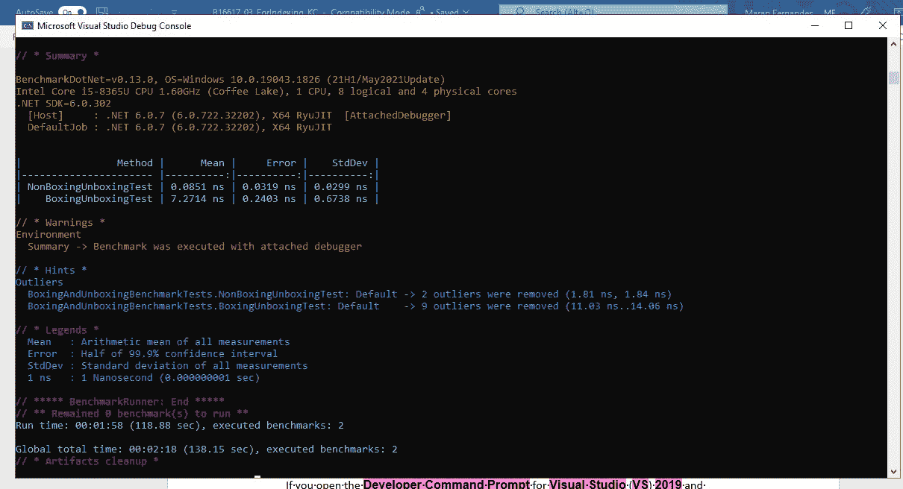
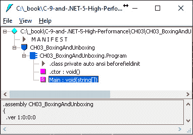

# *第三章*：预定义数据类型和内存分配

在本章中，你将了解 **C#** 预定义（即 *内置*）数据类型和 C# 对象类型，以及不同类型的 **内存分配**。

提高应用程序性能的最基本要求是理解预定义数据类型及其大小。在某些情况下，应用程序的内存使用可能至关重要。了解数据类型的大小和它们所持有的值可以帮助你做出准确的内存使用估计，正如内存分析工具如 **dotTrace** 和 **dotMemory** 所做的那样，这些工具由 **JetBrains** 开发。我们将在下一章讨论 dotTrace 和 dotMemory 的使用。了解不同类型的内存分配及其对代码性能的影响也是有意义的。在这里，我们将使用 **BenchmarkDotNet** 对各种操作的性能进行基准测试。

在本章中，我们将涵盖以下主题：

+   **理解预定义的 .NET 数据类型**：在本节中，我们将回顾 C# 编程语言中内置的 C# 值类型和对象类型。理解这些类型及其字节大小在需要提供内存使用估计时很有用。

+   **理解 C# 中使用的各种内存类型**：在本节中，我们将深入了解 C# 中使用的不同类型的内存，包括 *栈*、*堆*、*小对象堆* 和 *大对象堆*。了解数据存储在内存中的方式和位置很有用，这可能会对应用程序的性能产生重大影响。例如，你知道值类型并不总是存储在栈上吗？

+   **按值传递和按引用传递**：在本节中，我们将介绍按值传递和按引用传递之间的区别，以及这对原始变量的影响。你还将了解按值传递和按引用传递在内存中的工作方式。

+   **装箱和拆箱**：在本节中，我们将讨论当我们对变量进行 *装箱* 和 *拆箱* 时内存中发生的情况，并探讨装箱和拆箱如何对程序性能产生负面影响。你将使用反汇编器查看执行装箱和拆箱的中间语言命令。

到本章结束时，你将具备以下技能：

+   你将理解不同值类型的大小。

+   你将理解不同的引用类型。

+   你将理解不同类型的内存及其分配方式。

+   你将理解按值传递和按引用传递之间的区别。

+   你将理解装箱和拆箱如何对性能产生负面影响以及原因。

我们将首先查看跟随本章的技术要求，然后，我们将继续探讨各种预定义的 C# 数据类型。

# 技术要求

+   必需：**Microsoft** **Visual Studio** **2022**，最新版本 – 预览版

+   必需：BenchmarkDotNet

本章的代码文件可以在本书的 GitHub 仓库中找到：[`github.com/PacktPublishing/High-Performance-Programming-in-CSharp-and-.NET/tree/master/CH03`](https://github.com/PacktPublishing/High-Performance-Programming-in-CSharp-and-.NET/tree/master/CH03)

您需要克隆 Git 仓库并执行发布构建。编译后的可执行文件将在 C:\Development\perfview\src\PerfView\bin\Release\net45 下找到。

# 理解预定义 .NET 数据类型

预定义数据类型有两种：

+   **引用类型**

+   **值类型**

引用类型是对象和字符串。值类型包括枚举和结构类型。结构类型是由简单类型组成的聚合。简单类型包括布尔型、字符型和数值类型。

有三种主要的数值类型：十进制类型、浮点类型和整数类型。浮点类型包括十进制、双精度和单精度。整数类型包括字节、短整型、整型、长整型、值元组和字符。

我们将在本章后面更详细地讨论栈和堆。但就目前而言，我们应该了解栈是 *非托管* 内存，而堆是 *托管* 内存。

值类型位于栈上。数组中的值类型位于堆上。而引用类型位于堆上，它们的指针位于栈上。

注意

即使数组在某些场景下不是理想的选择，但在大多数情况下，数组通常会比列表和其他数据结构运行得更快。数组的内容会连续地放置在堆上。数组变量将放置在栈上，其内容在栈上将是堆上数组内存地址的指针。

栈和堆是 **.NET** 中的两种主要内存类型，正如之前提到的，我们将在本章后面详细讨论它们。

现在，让我们看看 C# 中的预定义值类型。

## 理解 C# 中的预定义值类型

在本节中，我们将描述每个预定义值类型及其字节数。这对于选择正确的数据类型以改善应用程序的内存性能非常重要。对于 C# 新手来说，应该知道 *有符号* 数据类型是可以有 *正* 值和 *负* 值的数据类型，而 *无符号* 数据类型是只能有 *正* 值的数据类型。

*表 3.1* 描述了不同的值类型、它们的内存大小、是否可以为空，以及它们的默认值、最小值和最大值，并在适用的情况下提供注释：


表 3.1 – C# 中的预定义值数据类型

注意

`enum` 数据类型的大小为 4 字节（即 32 位），是可空的，并且最小值为 `0`。你可以使用 `sizeof(Type type)` 来测量值类型的大小。自定义结构体可以使用 `Marshal.SizeOf(typeof(NameOfCustomStruct))` 来测量。`ValueTuple` 数据类型的大小为 1 字节（8 位），并且随着每个类型参数的增长而增长。例如，`ValueTuple<double, double, double>` 的大小为 24 字节（192 字节）。

我们现在将探讨理解 C# 中的预定义引用类型。

## 理解 C# 中的预定义引用类型

**引用类型**是一种放置在称为**托管堆**的托管内存中的类型。C# 中预定义的四种引用类型是对象类型、字符串类型、委托类型和动态类型。

注意

不幸的是，对于引用类型，你不能使用 `sizeof`（它属于对象类型）来获取引用类型的大小，并且 `BinaryFormatter` 类已经被弃用。这意味着你不能将对象序列化为二进制，将其保存到内存流中，并从内存流的位置获取其大小。

然而，我们建议使用 **JSON** 来序列化和反序列化对象。然后我们可以将 JSON 赋值给内存流，这样做的话，内存流的长度将给出我们的对象在内存中的大小。

让我们逐一查看这些类型在内存使用方面的表现。

### 描述对象引用类型

.NET 的 `System.Object` 类型在 C# 中被别名为 object。C# 中的所有类型要么直接要么间接继承自 `System.Object`。这包括预定义类型和用户类型（如类、枚举和结构体）、引用类型和值类型。对象可以是可空的。

要以编程方式获取对象的内存大小，可以将它们序列化为 **XML** 或 JSON，并将它们加载到内存流中，内存流的长度将给出你的对象大小（以字节为单位）。或者，你可以使用像 dotMemory 这样的工具来分析你的应用程序的内存使用情况。

### 描述字符串引用类型

`string` 类型为每个字符使用 2 个字节（16 位）。因此，我们著名的简短 `string`，*Hello, World!*，它使用了 13 个字符，长度为 13 x 2 字节，相当于 26 字节（208 位）的内存。字符串可以是可空的，也可以是空的。

在 .NET 中，字符串是不可变的。但我们的意思是什么？

当你创建一个 `string` 类型时，它会被添加到堆中。一个变量会被添加到栈上，该变量包含一个指向堆上字符串位置的地址指针。如果你将 `string` 类型添加到另一个变量中，该变量将被放置在栈上，并且它将持有堆上相同字符串的地址的副本。但是，如果你将一个现有的 `string` 类型与另一个 `string` 类型连接，内存中会创建一个新的 `string` 类型来保存现有的 `string` 类型，以及要连接的 `string` 类型。`string` 类型的地址指针在栈上被更新，以指向这个新位置。

#### 构建不可变字符串示例程序

我们将编写一个简单的 `CH03_StringsAreImmutable`。然后，按照以下方式更新 `Main(string[] _)` 方法：

```cs
static void Main(string[] _)
```

```cs
{
```

```cs
Console.WriteLine("Chapter 3: Strings are immutable");
```

```cs
var greeting1 = "Hello, world!";
```

```cs
var greeting2 = greeting1;
```

```cs
Console.WriteLine($"greeting1={greeting1}");
```

```cs
Console.WriteLine($"greeting2={greeting2}");
```

```cs
greeting1 += " Isn't life grand!";
```

```cs
Console.WriteLine($"greeting1={greeting1}");
```

```cs
Console.WriteLine($"greeting1={greeting2}");
```

```cs
}
```

我们将输出一个标题到控制台，然后我们将 `greeting1` `string` 类型设置为 `"Hello, world!"`。然后，我们将 `greeting1` 赋值给 `string` 类型的 `greeting2`。两个 `string` 变量的内容都输出到控制台窗口。然后，我们在 `greeting1` 的末尾追加 `" Isn't life grand!"` 来修改 `greeting1`。接下来，我们输出 `greeting1` 和 `greeting2` 的内容。运行程序，你应该看到以下内容：


Figure 3.1 – 不可变字符串示例

如你所见，尽管我们将 `greeting1` 赋值给 `greeting2` 并更新了 `greeting1`，但 `greeting2` 保持不变。因此，我们现在在堆上有两个字符串。我们有 `"Hello, world!"`，我们还有 `"Hello, world! Isn't life grand!"`。因此，从我们的小例子中，我们可以看到字符串确实是不可变的。现在，我们将描述 `delegate` 引用类型。

### 描述委托引用类型

`delegate` 类型必须具有相同的签名和返回类型。当你编译使用委托的代码时，会创建一个继承自 `System.MulticastDelegate` 的私有密封类。

注意

请查看以下链接中的 *第 I.8.9.3 节* 以获取有关委托的更多信息：[`www.ecma-international.org/publications/files/ECMA-ST/ECMA-335.pdf`](https://www.ecma-international.org/publications/files/ECMA-ST/ECMA-335.pdf)。

我们现在将描述 `dynamic` 引用类型。

### 描述动态引用类型

类型检查是在编译时执行的。这确保了在应用程序在运行时执行时的类型安全。类型安全旨在防止由类型之间的差异引起的错误或不希望的程序行为。

定义为 `dynamic` 的类型在编译时绕过类型检查，因为它们和成员在运行时解析。`dynamic` 类型的优点是它简化了我们访问 COM API（如 **Office Automation** API）到动态 API（如 **IronPython** 库）以及到 HTML **文档对象模型**（**DOM**）的访问。

动态类型在编译时作为对象存在，并在运行时作为对象存在。`dynamic` 类型仅在编译时存在，而不是在运行时。当 `dynamic` 类型被编译时，它成为 `object` 类型。在本节稍后，在我们编写并构建我们的控制台应用程序之后，我们将使用 ILDASM 来显示编译后的动态变量的 IL 类型。

当对象首次运行时，它会被运行时正确解析。这种解析会产生一个性能惩罚，这取决于正在解析的类型，可能会相当大。由于 `dynamic` 被编译成对象，因此会发生装箱和拆箱。正如你所知，装箱会消耗处理器周期。

让我们演示在声明变量和为它们赋值时使用不同的 `var` 和 `dynamic` 变体与使用正确的类型并无需进行转换赋值时的性能差异。

启动一个新的 .NET 6 控制台应用程序，名为 `CH03_DynamicPerformance`。你需要以下引用：

```cs
using System;
```

```cs
using System.Diagnostics;
```

```cs
using System.Security.Cryptography;
```

```cs
using BenchmarkDotNet.Attributes;
```

```cs
using BenchmarkDotNet.Running;
```

在 `Program` 类的顶部添加一个新的成员变量：

```cs
dynamic _dynamicType;
```

在我们运行基准测试后，将使用 ILDASM 对这个变量声明进行调查。接下来，更新 `Main(string[] _)` 方法如下：

```cs
static void Main(string[] _)
```

```cs
{
```

```cs
      BenchmarkRunner.Run<BenchmarkTests>();
```

```cs
}
```

我们在名为 `BenchmarkTests` 的类中运行基准测试。使用与前面示例相同的语句添加一个新类 `BenchmarkTests`。然后，添加 `MeasureVarUsage()` 方法：

```cs
[Benchmark]
```

```cs
public void MeasureVarUsage()
```

```cs
{
```

```cs
      var x = 3.14159;
```

```cs
}
```

这个方法将一个 `double` 对象分配给运行时解析类型的 `x` 变量。接下来，添加 `MeasureVarDynamicUsage()` 方法：

```cs
[Benchmark]
```

```cs
public void MeasureVarDynamicUsage()
```

```cs
{
```

```cs
      var x = (dynamic)3.14159;
```

```cs
}
```

这里，我们仍然在运行时解析类型的 `x` 变量上分配一个数字。但这次，我们在数字前加上 `(dynamic)` 转换。记住，`dynamic` 关键字只存在于编译时。当编译时，`dynamic` 类型变为 `object` 类型。现在，添加 `MeasureTypeDynamicUsage()` 方法：

```cs
[Benchmark]
```

```cs
public void MeasureTypeDynamicUsage()
```

```cs
{
```

```cs
      double x = (dynamic)3.14159;
```

```cs
}
```

这次，我们将变量声明为 `double` 并将分配的数字转换为 `(dynamic)`。在运行时，这个数字将被包装在 `object` 类型中，因此需要解包。并且为我们的最终方法，添加 `MeasureTypeTypeUsage()` 方法：

```cs
[Benchmark]
```

```cs
public void MeasureTypeTypeUsage()
```

```cs
{
```

```cs
      double x = 3.14159;
```

```cs
}
```

在这个方法中，我们声明一个 `double` 类型并分配一个 `double` 类型。以发布模式编译项目。然后，打开命令行并导航到您的发布文件夹。输入可执行文件名并按 *Enter*。这将导致 BenchmarkDotNet 检测项目中的基准测试并依次运行它们。你应该会看到一个类似于以下摘要的结果，尽管平均时间可能不同：


图 3.2 – 变量类型声明和赋值的基准平均时间

*图 3.2* 展示了当我们根据使用的方法声明变量和赋值时，性能存在差异。声明和赋值最快组合是 `var variableName = (dynamic)value`。

好的，我们已经运行了基准测试。那么，让我们查看动态变量的 IL 代码。打开开发者命令提示符，然后输入 `ildasm.exe` 并按 *Enter*。这将启动 ILDASM 应用程序。

注意

**.NET Core** 和 **.NET 6** 应用程序与之前的 **.NET Framework** 版本编译方式不同。之前，ILDASM 会打开编译后的可执行文件。但 .NET Core 和 .NET 6 应用程序被编译成 **动态链接库**（**DLL**），并生成一个本地可执行文件来运行结果 DLL 中的代码。

打开您的编译好的 DLL。展开 `CH03_DynamicPerformance` 节点，然后展开 `CH03_DynamicPerformance.Program` 节点。然后，找到如 *图 3.3* 所示的 `_dynamicType : private object` 行调用：


图 3.3 – ILDASM 显示编译器在编译时将动态类型转换为对象类型

如您所见，我们的 `dynamic` 类型在编译时被编译成 `object` 类型。作为一个小练习，您可以调整 ILDASM 设置并查看 `BenchmarkTests` 类的代码。现在，让我们看看静态类型。

## 理解静态类型

在 .NET Core 和 **.NET** **5.0** 之前的 .NET 版本中，当您编译和运行应用程序时，它们将在自己的应用程序域中运行。如果您多次运行应用程序，每个运行实例都将有自己的应用程序域。在 **ASP.NET** 中，您为单个应用程序使用多个应用程序域。当在 ASP.NET 应用程序中使用静态类型时，这变得很重要。在单个应用程序域中，将只有一个静态类型的实例。在可以使用之前，运行时必须创建静态类型的实例。

`AppDomain` 对象拥有自己的静态堆。静态值和引用类型将被放置在静态堆上，并由应用程序域管理。静态类型会被垃圾回收器考虑，但它们永远不会被回收。垃圾回收器考虑它们的原因是它们可能引用其他堆上的对象。其他应用程序域中的静态类型和变量彼此隔离。

在 `AssemblyLoadContext` 类中用于动态加载程序集。通过 *进程和/或容器*，Microsoft 意味着您应该将单个应用程序/模块拆分为单独的、相互交互的应用程序/模块/进程/容器。因此，Microsoft 鼓励您使用微服务重构代码，这样您就不再需要使用应用程序域。

`System.Runtime.Loader.AssemblyLoadContext` 对象表示一个加载上下文。一个 *加载上下文* 为加载、解析和卸载程序集创建了一个作用域。有关 `AssemblyLoadContext` 类的更多信息，请参阅官方 Microsoft 文档：[`docs.microsoft.com/dotnet/api/system.runtime.loader.assemblyloadcontext?view=net-5.0`](https://docs.microsoft.com/dotnet/api/system.runtime.loader.assemblyloadcontext?view=net-5.0)。

静态类仅由运行时实例化一次。您不能自己实例化一个静态类。静态构造函数在类被加载到内存时执行。如果一个非静态类有一个静态构造函数和一个实例构造函数，静态构造函数将在实例构造函数之前被调用。静态构造函数是无参的，并且每个类只能有一个静态构造函数。静态构造函数没有访问修饰符。当类加载时为静态变量分配内存，当类卸载时释放内存。变量、构造函数和方法属于类，而不是实例化的对象。因此，修改变量将修改类的所有实例中的变量。

在调用栈上，静态方法通常比实例方法调用更快。编译器会发出非虚拟调用站点静态成员。非虚拟调用站点防止了运行时检查，这些检查确保当前对象指针非空。尽管你可能看不到任何可视的性能改进，但对于性能敏感的代码，性能提升是可以衡量的。

现在我们已经涵盖了各种预定义的 C#数据类型，是时候看看 C#的内存以及它是如何工作的了。

# 理解 C#中使用的各种内存类型

C#中有两种主要的内存类型：栈和堆。堆进一步分为*小对象堆*和*大对象堆*。在物理内存方面，栈和堆之间没有区别，因为它们都存储在物理内存中。它们的不同之处在于它们的实现。

当你的应用程序启动时，它会被分配一部分内存。一个指针将被分配给你的应用程序，这将是你应用程序的内存起始点。指针上方是栈，指针下方是堆。堆向下增长，栈向上增长，如*图 3.4*所示：

![Figure 3.4 – The stack, heap, and application starting point memory address]

![Figure 3.4_B16617.jpg]

图 3.4 – 栈、堆和应用启动点内存地址

以下图表直观地表示了一个简单程序中的栈和堆：

![Figure 3.5 – The stack and heap at work]

![Figure 3.5_B16617.jpg]

图 3.5 – 栈和堆在工作

要理解 C#中的不同类型的内存，首先，我们将看看栈以及它是如何操作的。

## 栈

*栈*用于存储值类型和指向堆上内存位置的指针。当你调用一个方法时，它会被添加到栈上的一个栈帧中。然后，在该帧内，值类型被添加到栈上。如果有任何引用类型在方法中，这些类型将被放置在堆上，并且一个变量将被放置在栈上，并分配一个指向堆上引用类型内存地址的指针。

注意

尽管我们可以声明值类型被添加到栈上，但这并不总是正确的。例如，如果你有一个整数数组，由于数组是一个引用类型，它将被添加到堆上，并且数组中的每个整数将连续添加到堆上。

如果一个`struct`对象具有引用类型，该结构体将被放置在栈上，引用类型将被放置在堆上，并且将引用类型在堆上的地址的指针存储在堆上的变量中。

栈比堆快。它像栈数据结构一样排列。当你执行一个方法时，该方法被添加到栈上的栈帧中。然后，局部变量依次添加到栈帧的顶部。当方法执行完成后，内存立即被回收。然而，堆必须跟踪内存分配、指针和引用计数器，而栈则不需要以这种方式管理自己。

小贴士

使用栈，你可以简单地从栈上弹出和添加东西。为了提高应用程序的性能，查找应用程序中的堆使用情况。测量使用栈和使用堆时的性能。如果栈更快，那么用栈使用替换堆使用。

请记住，使用内存的成本不是在分配时，而是在释放时。栈上项的释放比堆上项的释放更可预测。在某些情况下，垃圾收集器在释放 0 代或 1 代内存时执行类似的指针运算。

内存调用也很昂贵，因为它们被放置在栈上，但可能也引用堆。方法性能受未执行代码的影响。因此，你应该重构你的方法，使其尽可能小，并删除任何不会执行的代码，例如不再使用的死代码。这将减少正在使用的局部变量数量，从而减少栈大小。这样，你将消除性能损失。

## 堆

*堆*用于存储引用类型。它们被称为引用类型，因为它们是引用计数的。引用计数意味着运行时会保持引用分配的引用类型的变量计数。当引用计数减少到零时，引用类型将由垃圾收集器释放。例如，如果我在内存中有一个产品对象，并且有两个在栈上指向该对象的变量，那么产品对象有一个引用计数为二。

你可能会惊讶地发现，在 C# 中分配对象有时可能比在 **C++** 中更快。但在垃圾回收方面，C# 需要付出代价。因此，实例化许多对象并不会给我们带来太多成本，但这些对象的清理却会。这意味着你创建的对象越多，垃圾收集器的工作就越困难，这会负面影响你的应用程序性能。因此，如果可以使用值类型，请避免使用引用类型。如果你不需要，请不要创建对象。

当创建一个新的对象时，它会被放置在堆上。变量会被放置在栈上，并分配一个指向堆上对象地址的指针。

引用类型数组被放置在堆上。引用数组的变量将被放置在栈上，并分配给堆上数组的内存地址。数组本身将包含一个连续的内存地址列表，如图 *图 3.5* 所示：


图 3.6 – 堆中显示对象及其在数组中的内存地址

这些内存地址是指向堆上引用类型地址位置的指针。这是因为当一个包含引用类型的数组放置在堆上时，数组中的每个引用类型都被分配到它自己的内存区域。然后，引用类型的内存地址被放置在数组内部。

注意

优先考虑了数组性能，其次是字符串性能。数组通常比列表和其他数据结构更快。但最好使用基准测试来决定哪种情况更适合你，并选择最适合你的数据结构。

当谈到最大化内存使用性能时，你需要确保堆上的对象尽可能靠近它们的引用指针。这样做的原因是为了减少定位指针所引用的内存所需的 CPU 周期。关于内存性能的经验法则是：内存距离其指针越远，它在你 CPU 性能上的成本就越高。尽管如此，必须指出的是，预测性内存访问大大减少了这一点，内存使用可能取决于系统页面文件设置。

注意

你实例化数组、实例化对象、为对象赋值以及为数组和对象赋值和分配值的顺序会影响你应用程序的性能。这取决于这些项目在内存中的放置。记住，堆上的项目应该靠近它们的内存指针，这些指针可能存储在堆上或栈上。

如前所述，堆上的对象释放比栈上的释放慢。你添加到堆上的对象越多，性能就会越慢。这是因为频繁的分配和释放导致垃圾收集器有更多的工作要做。正是这种分配和释放的循环导致了性能问题。

主堆中有两个堆：

+   **小对象堆**：当一个新对象被实例化时，如果其大小小于 80,000 字节，它将被放置在小对象堆上作为第 0 代。

+   **大对象堆**：当一个新对象被实例化，其大小为 80,000 字节或更大时，它将被添加到大对象堆上。大对象总是分配在第 2 代，因为它们只在第 2 代收集期间进行垃圾回收。

当我们查看垃圾收集时，我们将更详细地查看堆，见 *第四章*，*内存管理*。

## 构建栈与构建堆（示例项目）

现在，我们将编写一个简单的项目，该项目将获取具有和没有引用类型属性的实例化和结构体的 tick 数。首先，添加一个新的 .NET 6 控制台应用程序，名为 `CH03_StackAndHeap`。然后，添加 `BenchmarkDotNet nuget` 包。你需要使用以下 `using` 语句：

```cs
using System;
```

```cs
using System.Diagnostics;
```

```cs
using System.Security.Cryptography;
```

```cs
using BenchmarkDotNet.Attributes;
```

```cs
using BenchmarkDotNet.Running;
```

然后，更新 `Main(string[] _)` 方法，如下所示：

```cs
static void Main(string[] _)
```

```cs
{
```

```cs
      BenchmarkRunner.Run<BenchmarkTests>();
```

```cs
}
```

在该方法中，我们正在调用包含我们的基准测试的 `BenchmarkTests` 类。现在，添加 `ClassNoReference` 类：

```cs
internal class ClassNoReferences
```

```cs
{
```

```cs
      public ClassNoReferences(
```

```cs
          int id,
```

```cs
          decimal price,
```

```cs
          DateTime purchaseDate
```

```cs
      )
```

```cs
      {
```

```cs
          Id = id;
```

```cs
          Price = price;
```

```cs
          PurchaseDate = purchaseDate;
```

```cs
      }
```

```cs
      public int Id { get; private set; }
```

```cs
      public decimal Price { get; private set; }
```

```cs
      public DateTime PurchaseDate { get; private set; }
```

```cs
}
```

这个类有三个值类型属性而没有引用类型属性。在 `BenchmarkTests` 类中添加 `ProcessClassNoReferences()` 方法：

```cs
[Benchmark]
```

```cs
public void ProcessClassNoReferences()
```

```cs
{
```

```cs
      var _ = new ClassNoReferences()
```

```cs
      {
```

```cs
          1,
```

```cs
          1.50M
```

```cs
          DateTime.Now
```

```cs
      };
```

```cs
}
```

`ProcessClassNoReferences()` 方法声明了一个新的 `ClassNoReferences` 类实例。它将被用作基准测试方法。添加 `StructNoReferences` 类：

```cs
internal class StructNoReferences
```

```cs
{
```

```cs
      public StructNoReferences(
```

```cs
          int id,
```

```cs
          decimal price,
```

```cs
          DateTime purchaseDate
```

```cs
      )
```

```cs
      {
```

```cs
          Id = id;
```

```cs
          Price = price;
```

```cs
          PurchaseDate = purchaseDate;
```

```cs
      }
```

```cs
      public int Id { get; private set; }     
```

```cs
      public decimal Price { get; private set; }
```

```cs
      public DateTime PurchaseDate { get; private set; }
```

```cs
}
```

这个结构有三个值类型属性而没有引用类型。让我们向 `BenchmarkTests` 类添加 `ProcessStructNoReferences()` 方法：

```cs
[Benchmark]
```

```cs
public void ProcessStructNoReferences()
```

```cs
{
```

```cs
      var _ = new StructNoReferences()
```

```cs
      {
```

```cs
         1,
```

```cs
         1.50M,
```

```cs
         DateTime.Now
```

```cs
      };
```

```cs
}
```

`ProcessStructNoReferences()` 方法将被用作基准，并创建一个新的 `StructNoReferences` 结构体。接下来，添加 `ClassWithReferences` 类：

```cs
class ClassWithReferences
```

```cs
{
```

```cs
    public ClassWithReferences(
```

```cs
        int id,
```

```cs
        string name,
```

```cs
        decimal price,
```

```cs
        DateTime purchaseDate,
```

```cs
        Dictionary<string, string> keyValueData
```

```cs
    )
```

```cs
    {
```

```cs
        Id = id;
```

```cs
        Name = name;
```

```cs
        Price = price;
```

```cs
        PurchaseDate = purchaseDate;
```

```cs
        KeyValueData = keyValueData;
```

```cs
    }
```

```cs
    public int Id { get; private set; }
```

```cs
    public string Name { get; private set; }
```

```cs
    public decimal Price { get; private set; }
```

```cs
    public DateTime PurchaseDate { get; private set; }
```

```cs
    public Dictionary<string, string> KeyValueData 
```

```cs
        { get; private set; }
```

```cs
}
```

这个类具有值类型和引用类型属性。现在，我们将添加 `ProcessClassWithReferences()` 方法：

```cs
[Benchmark]
```

```cs
public void ProcessClassWithReferences()
```

```cs
{
```

```cs
      var _ = new ClassWithReferences(
```

```cs
         Id = 1,
```

```cs
         "The quick brown fox jumped over the lazy dog.",
```

```cs
         1.50M,
```

```cs
         DateTime.Now,
```

```cs
);
```

```cs
}
```

`ProcessClassWithReferences()` 方法将被用作基准，并创建一个 `ClassWithReferences` 类的实例。接下来，我们将添加 `StructWithReferences` 结构体：

```cs
internal struct StructWithReferences
```

```cs
{
```

```cs
      public StructWithReferences(
```

```cs
          int id,
```

```cs
          string name,
```

```cs
          decimal price,
```

```cs
          DateTime purchaseDate,
```

```cs
          Dictionary<string, string> keyValueData
```

```cs
      )
```

```cs
      {
```

```cs
          Id = id;
```

```cs
          Name = name;
```

```cs
          Price = price;
```

```cs
          PurchaseDate = purchaseDate;
```

```cs
          KeyValueData = keyValueData;
```

```cs
      }
```

```cs
      public int Id { get; private set; }
```

```cs
      public string Name { get; private set; }
```

```cs
      public decimal Price { get; private set; }
```

```cs
      public DateTime PurchaseDate { get; private set; }
```

```cs
      public Dictionary<string, string> KeyValueData 
```

```cs
          { get; private set; }
```

```cs
}
```

这个结构体具有值类型和引用类型。现在，我们将添加我们的最终方法，`ProcessStructWithReferences()`：

```cs
[Benchmark]
```

```cs
public void ProcessStructWithReferences()
```

```cs
{
```

```cs
      var _ = new StructWithReferences()
```

```cs
      {
```

```cs
         Id = 1,
```

```cs
         Name = "Discard",
```

```cs
         Price = 1.50M
```

```cs
      };
```

```cs
}
```

`ProcessStructWithReferences()` 方法将被用作基准，并创建一个新的 `StructureWithReferences` 结构体。

以发布模式编译代码。然后，运行可执行文件。你的代码将被基准测试，你将看到以下基准报告：

![图 3.7 – 比较带和不带引用的结构体和类的基准报告

![img/Figure_3.7.jpg]

图 3.7 – 比较带和不带引用的结构体和类的基准测试报告

基准测试结果揭示了以下见解：

+   没有引用的类的处理比没有引用的结构体的处理更快

+   使用引用处理类比使用引用处理结构体慢

如基准测试结果所示，根据场景的不同，结构体可能比类更快，反之亦然。这是基准测试代码的好理由，因为你可能会认为你的代码是最佳的，而实际上它很慢。

那么，你如何选择使用结构体还是类呢？

## 在结构体和类之间进行选择

按照经验法则，微软建议我们将我们的类型定义为类。如果一个类型嵌入在其他对象中，或者如果它是短暂的，那么考虑使用结构体。在定义结构体时，它应该具有以下特征：

+   从逻辑上讲，结构体代表一个单一值。

+   结构体实例的大小小于 16 字节。

+   结构体是不可变的。

+   结构体不经常进行装箱和拆箱。

*结构体* 是一种 *值类型*。值类型是在栈上分配或在包含类型内内联分配的。值类型将在栈展开或包含类型的释放期间被释放。值类型不会被垃圾回收。在栈上分配和释放值类型被认为是廉价的。然而，当一个值类型装箱时，它会被包裹在一个引用类型中或被转换为接口，这会导致性能下降。当值类型从引用类型内部解包时，也会经历性能下降，这被称为 *拆箱*。出于性能原因，你应该尽可能避免对值类型进行装箱和拆箱。当你分配值类型时，值的完整副本会被传递到分配中。大型值类型的分配可能比大型引用类型的分配更昂贵。

*类* 是一种 *引用类型*。引用类型是在堆上分配的对象，其内存位置通过指针放置在栈上。当引用类型的生命周期结束时，它会被垃圾回收。与在栈上分配和释放值类型相比，在堆上分配和释放引用类型被认为是昂贵的。与值类型不同，在转换引用类型时不会发生装箱。当你分配一个引用类型时，引用的副本会被传递给分配的变量。大型引用类型的分配可能比大型值类型的分配更便宜。

引用类型数组的数组包含指向堆上实际类型的指针。值类型数组的数组包含那些引用类型的实际值。值类型数组的分配和释放被认为是廉价的，并且与引用类型数组相比，它们具有更好的局部性，因为值类型的值是内联的。

让我们继续看看 *按值传递* 和 *按引用传递*。

# 按值传递和按引用传递

当将值传递到方法或构造函数时，有两种方式可以这样做。它们是*按值传递*和*按引用传递*：

+   **按值传递**：默认情况下，所有值类型都是通过使用*复制语义*按值传递到构造函数和方法的。这意味着会复制传递的值。原始值保持不变，并且使用构造函数或方法使用的是副本。

+   **按引用传递**：当一个引用类型被传递到构造函数或方法中时，在堆栈上创建一个变量，该变量指向堆上相同对象。因此，传入的变量和构造函数或方法内部使用的副本变量都在内存中操作同一个对象。

现在我们已经知道了按值传递和按引用传递是什么，让我们写一个简单的程序来演示我们所学的。

## 构建按引用传递的示例程序

我们将编写一个非常简单的程序来演示按值传递和按引用传递的效果。添加一个新的.NET 6 控制台应用程序，名为`CH03_PassByValueAndReference`。然后，按照以下方式修改`Main(string[] _)`方法：

```cs
static void Main(string[] args)
```

```cs
{
```

```cs
int x = 0;
```

```cs
Console.WriteLine("Chapter 3: Pass by value and reference");     
```

```cs
Console.WriteLine($"=====================================");
```

```cs
Console.WriteLine($"int x = 0;");
```

```cs
AddByValue(x);
```

```cs
Console.WriteLine($"    AddByValue(x): {x}");
```

```cs
AddByReference(ref x);
```

```cs
Console.WriteLine($"AddByReference(x): {x}");
```

```cs
}
```

在这里，我们声明了一个名为`x`的整数并给它赋值为`0`。一些文本被输出到控制台窗口，我们调用两个方法并在它们被调用后输出`x`的值。让我们添加第一个被调用的方法——`AddByValue(int x)`方法：

```cs
static void AddByValue(int x)
```

```cs
{
```

```cs
      x++;
```

```cs
}
```

如您所见，这是一个非常简单的函数，它增加了传入变量的值。现在，让我们重复同样的过程，但这次我们将按引用传递值：

```cs
static void AddByReference(ref int x)
```

```cs
{
```

```cs
      x++;
```

```cs
}
```

运行程序，你应该看到以下输出：


图 3.8 – 使用按值传递和按引用传递增加 x 后的值

我们可以看到，当我们按值传递时，原始值不会被更新。但是当我们按引用传递时，它会更新。现在我们将扩展应用以涵盖`in`参数修饰符。

使用`in`关键字传递的参数是按引用传递的。然而，`in`参数不能被修改。让我们演示这一点——添加一个名为`InParameterModifier()`的新方法：

```cs
static void InParameterModifier()
```

```cs
{
```

```cs
      int argument = 13;
```

```cs
      InParameterModifier(argument);
```

```cs
      Console.WriteLine(argument);
```

```cs
}
```

在`InParameterModifier()`方法中，我们创建了一个整数并将其赋值为`13`。然后我们调用一个同名的函数并将变量作为参数传入。然后，我们将值打印到控制台窗口。现在，我们将编写`InParameterModifier(in int argument)`方法：

```cs
static void InParameterModifier(in int argument)
```

```cs
{
```

```cs
      // Error CS8331: Cannot assign to variable 'in int'
```

```cs
      // because it is a readonly variable.
```

```cs
      // argument = 47; 
```

```cs
}
```

代码被注释掉了，因为如果我们给参数赋值，你将看到注释中提到的编译器警告。从`Main(string[] _)`对象中调用该方法并运行程序。你会看到变量保持在`13`，因为编译器阻止我们在被调用的方法中更改它。最后，在我们程序的下一部分，我们将探讨`out`关键字。

`out`参数在传递之前不需要初始化。这与在传递之前必须初始化的`ref`值不同。所有`out`参数都是通过引用传递的。在方法内部对参数进行的任何操作都对外部代码可见，这些代码可以看到参数。以下是一个示例，这将使理解更容易。

我们将添加两个方法来演示`out`参数的工作方式。向`Program`类添加一个名为`OutParameterModifier()`的新方法：

```cs
static void OutParameterModifier()
```

```cs
{
```

```cs
      int x;
```

```cs
      OutParameterModifier(out x);
```

```cs
      Console.WriteLine($"The value of x is: {x}.");
```

```cs
}
```

在前面的代码中，我们声明了一个整数变量。然后，我们调用一个具有`out`参数的方法，并将我们的整数及其默认值`0`传递给它。接下来，在方法返回后，我们打印出整数的值。现在，添加`outParameter(out x)`方法：

```cs
static void OutParameterModifier(out int argument)
```

```cs
{
```

```cs
      argument = 123;
```

```cs
}
```

这里，我们只是将参数设置为`123`并退出。从`Main(string[] _)`中调用`OutParameterModifier()`方法。如果你运行代码，你会看到我们调用的方法中的整数被更新为`123`。这如图*3.9*所示：

![Figure 3.9 – Our integer has been updated inside the method we passed it into

![Figure 3.9 – Our integer has been updated inside the method we passed it into

图 3.9 – 我们传递的方法中的整数已被更新

在下一节中，我们将探讨*装箱*和*解箱*。

# 装箱和解箱

*装箱*和*解箱*变量会对应用程序的性能产生负面影响。为了提高应用程序的代码质量，你应该尽力避免装箱和解箱 - 尤其是在代码是关键任务时。在本节中，我们将探讨当你包装（即装箱）类型时会发生什么。

## 执行装箱

当一个变量被装箱时，你是在将其包装在一个将被存储在堆上的对象中。正如你所知，堆上的对象会产生成本，因为它们必须由运行时来管理。除此之外，你还会增加变量使用的内存，以及处理该变量所需的 CPU 周期数。

在 32 位操作系统上，一个空的`class`定义占用 12 字节，而在 64 位操作系统上占用 24 字节。这听起来可能并不多。但如果将不需要装箱的值类型装箱，你将无谓地浪费 12 或 24 字节的内存。

现在，我们将探讨当你解箱一个变量时会发生什么

## 执行解箱

一个变量被复制到评估堆栈，它引用堆上的一个对象。然后，该变量被解封装（即，解包），并将变量放置在评估堆栈上。然后，可以对解封装的变量执行所需的任何操作。一旦完成对该变量的所有操作，它就必须再次封装并放置在堆上。这将创建堆上的新对象，并且堆栈上的变量将更新为其内存位置。

### 构建封装与解封装示例程序

现在，我们将编写一个简单的 .NET 6 控制台应用程序，使用 `BenchmarkDotNet` 来展示不封装与封装/解封装在性能上的差异。首先，启动一个新的 .NET 6 控制台应用程序，并将其命名为 `CH03_BoxingAndUnboxing`。您需要添加 `BenchmarkDotNet` 包和以下两个命名空间：

```cs
using System;
```

```cs
using System.Diagnostics;
```

```cs
using System.Security.Cryptography;
```

```cs
using BenchmarkDotNet.Attributes;
```

```cs
using BenchmarkDotNet.Running;
```

我们需要这些命名空间来执行基准测试。在 `Main(string[] _)` 方法中，添加以下行：

```cs
BenchmarkRunner.Run<BoxingAndUnboxingBenchmarkTests>();
```

这行代码开始运行基准测试。接下来，添加一个名为 `BoxingAndUnboxingBenchmarkTests` 的新类：

```cs
public class BoxingAndUnboxingBenchmarkTests { }
```

此类将包含两个基准测试方法，分别称为 `NonBoxingUnboxingTest()` 和 `BoxingUnboxingTest()`。添加 `NonBoxingUnboxingTest()` 方法：

```cs
[Benchmark]
```

```cs
public void NonBoxingUnboxingTest()
```

```cs
{
```

```cs
      int z = 0, a = 4, b = 4;
```

```cs
      z = a + b;
```

```cs
}
```

在此方法中，我们声明并赋值三个整数：`z = 0`、`a = 1` 和 `b = 6`。然后我们将 `a` 和 `b` 相加，并将结果赋值给 `z`。现在，添加 `BoxingUnboxingTest()` 方法：

```cs
[Benchmark]
```

```cs
public void BoxingUnboxingTest()
```

```cs
{
```

```cs
      object a = 4, b = 4;
```

```cs
      int z;
```

```cs
      z = (int)a + (int)b;
```

```cs
} 
```

这次，我们声明并赋值两个对象：`a = 4` 和 `b = 4`。我们还声明了一个整数：`z`。然后，我们将 `a` 和 `b` 转换为整数，将它们相加，并将结果赋值给 `z` 整数变量。

执行您的代码的发布构建。然后，打开命令行并导航到您的可执行文件。从命令行运行您的可执行文件，您应该会看到以下摘要：



图 3.10 – 封装与解封装示例项目添加输出

如您从 *图 3.10* 中的截图所看到的，解封装确实会增加您应用程序的性能开销。

如果您打开 `ILDASM`，这将加载中间语言反汇编器。打开您的构建文件夹中的 DLL 文件，展开树形结构，直到您看到 `Main : void(string[])` 行，如图 *图 3.11* 所示：



图 3.11 – 中间语言反汇编器 (ILDASM)

双击 `Main` 方法。这将打开一个窗口，显示我们的 `Main(string[] _)` 方法的反汇编中间语言，如图 *图 3.12* 所示：

![图 3.12 – 我们 Main(string[] _) 方法的反汇编中间语言

](img/Figure_3.12_B16617.jpg)

图 3.12 – 我们 Main(string[] _) 方法的反汇编中间语言

研究反汇编代码。当你看到`box`命令时，值类型被封装在一个对象中，这是一个引用类型，它会被放置在堆上。而当你看到`unbox.any`命令时，值类型被从对象中解包并分配给一个属于栈的 int 值类型。

现在，你理解了为什么装箱和拆箱会影响应用程序的性能，现在我们来到了本章的结尾。在下一章中，我们将关注垃圾回收器的工作原理以及我们可以做些什么来提高其性能。但首先，让我们总结一下我们已经学到的内容。然后，鼓励你回答以下问题，并进一步阅读这个主题。

# 摘要

我们在本章开始时探讨了各种预定义的.NET 数据类型。首先，我们描述了各种值类型，然后转向预定义的引用类型。然后，我们通过探索静态类型来结束对预定义.NET 数据类型的讨论。

你了解到值类型位于栈上。但如果它们是数组的一部分，它们会与数组一起放置在堆上，而数组是一个引用类型。你还了解到引用类型位于堆上，并且它们有指向它们的指针，这些指针以栈上变量的形式存在。

接下来，我们探讨了 C#中使用的不同类型的内存。首先，我们看到了栈。然后，我们看到了堆，它由小对象堆和大对象堆组成。在查看栈和堆之间的差异后，我们发现栈的执行速度比堆快得多。原因是栈内存不需要由运行时管理。当需要时，它简单地被推入栈中，当不再需要时，它被弹出栈。相比之下，堆必须由运行时管理，它分配对象——它跟踪所有引用这些对象的变量的引用计数，然后在它们不再需要时释放对象。

我们接着探讨了按值传递和按引用传递。按值传递时，会复制一个值并将其传递给构造函数或方法。这个副本被使用，而原始值保持不变。当按引用传递时，会创建一个值的副本并将其放置在栈上，并分配给堆上对象的内存位置。

最后，我们探讨了变量的装箱和拆箱以及为什么这会对应用程序的性能产生负面影响。

通过本章所学的内容，你可以通过使用正确的类型来减少应用程序使用的内存量，并且可以通过避免装箱和拆箱来减少每操作的 tick 数。现在，既然你知道了内存分配的工作原理，你可以在实际可行的情况下通过保持方法小和优先使用栈来提高性能。

在下一章中，我们将学习更多关于垃圾回收的内容。

# 问题

1.  列出预定义的.NET 值类型。

1.  列出预定义的引用类型。

1.  在静态类型可以被访问和使用之前，运行时必须做什么？

1.  使用栈而不是堆的内存在物理上有什么区别，使得栈比堆运行得更快？

1.  为什么栈比堆运行得更快？

1.  解释为什么字符串是不可变的。

1.  放置在小对象堆上的对象的大致大小是多少？

1.  放置在大对象堆上的对象的大致大小是多少？

# 进一步阅读

+   *C#类型系统*

+   [`docs.microsoft.com/en-us/dotnet/csharp/programming-guide/types/`](https://docs.microsoft.com/en-us/dotnet/csharp/programming-guide/types/)

+   *C#不同类型的堆内存*

+   [`vivekcek.wordpress.com/tag/stub-heap/`](https://vivekcek.wordpress.com/tag/stub-heap/)

+   *深入.NET 框架内部以查看 CLR 如何创建运行时对象*

+   [`web.archive.org/web/20140724084944/http://msdn.microsoft.com/en-us/magazine/cc163791.aspx`](https://web.archive.org/web/20140724084944/http://msdn.microsoft.com/en-us/magazine/cc163791.aspx)

+   *传递参数（C#编程指南）*

+   [`docs.microsoft.com/en-us/dotnet/csharp/programming-guide/classes-and-structs/passing-parameters`](https://docs.microsoft.com/en-us/dotnet/csharp/programming-guide/classes-and-structs/passing-parameters)

+   *装箱与拆箱（C#编程指南）*

+   [`docs.microsoft.com/en-us/dotnet/csharp/programming-guide/types/boxing-and-unboxing`](https://docs.microsoft.com/en-us/dotnet/csharp/programming-guide/types/boxing-and-unboxing)

+   *Windows 系统上的大对象堆*

+   [`docs.microsoft.com/en-us/dotnet/standard/garbage-collection/large-object-heap`](https://docs.microsoft.com/en-us/dotnet/standard/garbage-collection/large-object-heap)

+   *.NET 内存分配和性能*

+   [`www.youtube.com/watch?v=aylUPfOVM90`](https://www.youtube.com/watch?v=aylUPfOVM90)

+   *在.NET Core 中替换 AppDomain*

+   [`www.michael-whelan.net/replacing-appdomain-in-dotnet-core/`](https://www.michael-whelan.net/replacing-appdomain-in-dotnet-core/)
