# *第五章*：应用程序性能分析和跟踪

应用程序性能分析是对计算机程序内部运作的内部检查。我们使用应用程序性能分析来衡量程序内部性能。这有助于我们识别任何性能瓶颈和内存问题。然后，我们可以使用这些信息来重构和改进程序的性能。

应用程序跟踪用于监控计算机程序在运行时的内部性能。你可以在开发、测试以及将程序发布到生产时跟踪你的计算机程序的执行。

当结合使用时，应用程序性能分析和应用程序跟踪可以非常强大且有用，有助于识别为什么计算机程序运行缓慢。

在本章中，你将学习如何对应用程序进行性能分析以识别任何性能不佳的区域。你将了解代码指标以及如何进行静态代码分析。在你努力编写更高效代码的过程中，你将学习如何利用内存转储、已加载模块查看器、调试、跟踪和`dotnet-counters`。当你完成本章时，你将具备对自身应用程序进行性能分析和跟踪所需的技能和经验。

在本章中，我们将涵盖以下主要主题：

+   **理解代码指标**：在本节中，我们将探讨各种工具可以为我们提供哪些应用程序、程序集、命名空间、类型、方法和字段指标。

+   **执行静态代码分析**：在本节中，我们将探讨使用 Visual Studio 2022 执行静态代码分析。我们将为我们的软件生成指标，包括可维护性指数、循环复杂度、继承深度、类耦合、源代码单元和可执行代码行数。

+   **生成和查看内存转储**：在本节中，我们将探讨在代码中遇到断点或应用程序遇到时如何生成和查看内存转储。

+   **查看已加载模块**：在本节中，我们将展示 Visual Studio 中的**模块**窗口，以便我们可以查看由我们的应用程序加载到内存中的模块，并查看有关这些模块的信息。

+   **调试你的应用程序**：本节突出了我们可用的各种调试选项。

+   **使用跟踪和诊断工具**：在本节中，我们将介绍可以帮助我们在软件应用程序上执行跟踪和诊断的工具。具体来说，我们将考虑 Visual Studio 2022、JetBrains dotMemory 和 JetBrains dotTrace。

+   使用`dotnet-counters`并使用它们来列出可监控的.NET 进程、列出我们可以使用的可用计数器以收集性能数据、监控.NET 进程，并将该进程的数据收集到 CSV 文件中，以便在 Excel 中进行后续分析。

+   **使用 dotMemory 跟踪和修复内存泄漏**：在本节中，我们将使用 dotMemory 来追踪 WPF 应用程序中的内存泄漏并修复它。

+   **使用 dotTrace 查找 UI 冻结的原因**：在本节中，我们将使用 dotTrace 来追踪 WPF 应用程序中 UI 冻结的原因并修复它。

+   **优化应用程序性能和内存流量**：在本节中，我们将使用 dotTrace 来识别改进 WPF 应用程序性能和内存流量的机会。

完成本章后，您将掌握以下技能：

+   理解代码度量指标并能够使用它们来提高代码质量和性能

+   通过执行静态代码分析来提高代码质量和性能

+   使用加载的模块来识别您的代码使用了哪些模块

+   有效调试软件

+   有效跟踪软件

+   使用 `dotnet-counters` 进行初步的性能调查

+   使用 JetBrains dotMemory 跟踪内存泄漏并修复它们

+   使用 JetBrains dotTrace 跟踪 UI 冻结的原因并修复它们

+   使用 JetBrains dotTrace 跟踪性能和内存流量问题并修复它们

    注意

    如果您被要求访问前几章的代码以进行某些示例，请不要感到惊讶。由于章节的页面限制，为那些练习添加代码示例将超过本章的计数限制。

# 技术要求

遵循本章内容所需的技术要求如下：

+   Visual Studio 2022 或更高版本

+   JetBrains dotMemory

+   JetBrains dotTrace

+   源代码：[`github.com/PacktPublishing/High-Performance-Programming-in-CSharp-and-.NET/tree/master/CH05`](https://github.com/PacktPublishing/High-Performance-Programming-in-CSharp-and-.NET/tree/master/CH05)

+   可选：Microsoft Excel 或其他 CSV 文件查看器

# 理解代码度量指标

在本节中，我们将探讨使用各种付费、免费和开源工具可以收集到的代码度量指标。源代码度量指标是从源代码中提取出来的，用于衡量我们源代码的质量和性能。

注意

不同的工具可以测量和计算不同的度量指标。由于每个工具都不同，了解哪些工具和度量指标可以满足您自己的项目需求是个好主意。

在接下来的子章节中，我们将了解我们可以用来衡量我们的代码并提高性能的不同代码度量指标。

## 应用程序度量指标

应用程序度量指标涵盖了您的应用程序在整个程序集的完整源代码。它们为您提供了关于应用程序有多少行代码以及有多少行代码被测试覆盖的总体情况。

在本节中，我们将从高层次介绍某些工具（如 *ndepends* 工具）提供的各种指标。作为你自己的研究的一部分，确定不同的应用指标收集工具。然后，查看它们提供的指标。选择最适合你需求的工具。在下一节中，将使用 Visual Studio 的内置静态代码分析工具演示代码指标的生成，包括以下指标：可维护性指数、循环复杂度、继承深度、类耦合、源代码行数和执行代码行数。接下来将描述这些和其他指标。

尽管工具供应商之间的指标不同，但可用的应用指标可能包括以下内容：

+   **代码行数**（**LOC**）：有两种类型的 LOC 测量。它们包括逻辑 LOC 和物理 LOC。逻辑 LOC 指的是可以跨越一行或多行，并以闭合花括号或分号结束的代码行。物理 LOC 指的是包括注释和空白符的实际代码行。

+   **注释行数**：用于注释的行数。

+   **注释百分比**：此指标用于识别代码中注释所占的百分比。它是通过以下公式计算的：*100 x 注释行数/(注释行数 + 代码行数)*。

+   **IL 指令**：当你的代码编译时，它会被转换成**中间语言**（**IL**）代码。根据你如何编写 C# 代码，这可能导致生成大量或少量 IL 指令。测量你的代码生成的 IL 指令数量是有意义的。这是因为即使代码很小，它也可能生成许多 IL 指令。相反，一个方法可能很大，但与代码的小版本相比，生成的代码行数更少。IL 指令数量越少，该方法越容易维护。

    注意

    公司 *ndepend* 在他们的文档代码指标页面上有一个建议，指出生成 IL 指令超过 100 的方法难以理解和维护。此外，他们还表示，除非方法是代码生成工具自动生成的，否则生成 200 行或更多 IL 指令的方法非常复杂，应该拆分成更小的方法。

+   **应用汇编**：应用汇编计数。

+   **应用命名空间**：应用命名空间计数。

+   **应用方法**：应用方法计数。

+   **应用字段**：应用字段计数。

+   **代码行数覆盖**：被测试覆盖的代码行数。

+   **未覆盖的代码行数**：未由测试覆盖的代码行数。

现在我们将介绍什么是汇编指标以及可以收集哪些类型的指标。

## 汇编指标

程序集指标更侧重于衡量单个程序集的质量和稳定性。由于一个应用程序可以由许多程序集组成，因此任何单个或多个程序集中都可能出现问题。如果多个程序集依赖于一个性能不佳的程序集，那么整个应用程序都将受到影响。此外，能够在不同的项目中重用程序集是很好的，因此耦合应保持在绝对最小。

收集程序集指标使你能够了解你的程序集是如何耦合在一起的，你还可以看到它们是抽象和稳定的还是不稳定。此外，你可以根据这些指标确定它们是否以当前形式可重用。可用于衡量程序集源代码的各种指标包括以下内容：

+   **输入耦合**：这是其他程序集中依赖于当前程序集中类的类的数量。

+   **输出耦合**：这是当前程序集中依赖于其他包中类的类的数量。

+   **关联内聚性**：一个程序集中每个类型内部关系的平均数量。

+   **不稳定性**：输出耦合与总耦合的比率。

+   **抽象性**：内部抽象类和接口与内部类型的比率。

+   **主序列距离**：一个表示抽象性和稳定性之间平衡的数字。

现在，让我们看看命名空间指标是什么以及可以收集哪些类型的指标。

## 命名空间指标

命名空间是任何专业质量 API 的重要组成部分。正确地将你的代码分区到相关命名的命名空间有助于程序员理解你的 API，并更容易找到他们想要的东西。命名空间指标帮助你了解你是否存在依赖循环，以及你的程序集是高级、中级还是低级。

关于命名空间代码质量的可用指标包括以下内容：

+   **输入耦合**：直接依赖于当前命名空间的命名空间的数量。

+   **输出耦合**：当前命名空间所依赖的不同命名空间的数量。

+   **级别**：命名空间的水平值。这个指标可以帮助你识别依赖循环。此外，它还有助于你客观地将你的程序集、命名空间、方法和类型分类为高级、中级或低级。

是时候看看有哪些类型的指标以及可以收集哪些类型的指标了。

## 类型指标

类型指的是类类型、接口类型、数组类型、值类型、枚举类型、类型参数、泛型类型定义以及开放或封闭构造的泛型类型。

类型及其编码和使用方式是我们作为程序员和最终用户所遇到的所有问题的背后。理解它们在我们程序中的使用方式是识别我们代码中各种问题的有效方法。当问题被识别出来时，它们可以被纠正。

类型代码质量指标包括以下内容：

+   **类型排名**：基于对类型依赖图应用排名算法计算得出的值，类似于谷歌的 PageRank 算法。

+   **输入耦合**：依赖于当前类型的类型数量。

+   **输出耦合**：当前类型直接依赖的类型数量。

+   **缺乏内聚的方法**：为了使代码遵循**单一职责原则**（SRP），它将只有一个变更的理由，没有更多。

+   **循环复杂度**：通过方法路径的数量。

+   **IL 循环复杂度**：通过 IL 代码的路径数量。

+   **实例大小**：指定类型的实例的大小，以字节为单位。

+   **实现的接口**：实现的接口数量。

+   **类之间的关联**：在其他类型的成员中直接用于当前类型方法体内的成员数量。

+   **子类数量**：类的子类数量，或实现接口的类型数量。

+   **继承树深度**：类或结构的基础类数量。

现在我们将探讨方法指标是什么以及可以收集到的方法指标类型。

## 方法指标

通常，方法背后隐藏着大多数性能问题。是类中的方法执行指令，可能会给客户带来任何数量的问题。这些问题可能包括运行时错误、数据错误和性能问题。能够看到和理解方法如何与其他方法交互，对于解决包括性能问题在内的各种问题非常有帮助。可用于分析方法代码质量的指标包括以下内容：

+   **方法排名**：基于对方法依赖图应用排名算法计算得出的值，类似于谷歌的 PageRank 算法。

+   **输入耦合**：直接依赖于当前方法的方法数量。

+   **输出耦合**：当前方法直接依赖的方法数量。

+   **IL 嵌套深度**：从 IL 代码中计算出的方法体内封装的作用域的最大数量。

+   **参数**：在方法签名中使用的参数数量。

+   **变量**：方法体内的变量数量。

+   **重载**：方法重载的数量。

+   **分支覆盖率百分比**：由操作码生成的测试覆盖的分支百分比。

我们将要查看的最终指标是字段指标。

## 字段指标

用于在字段级别测量耦合的指标是**输入耦合**。这指的是直接使用变量的方法数量。数量越高，软件的稳定性越低。因此，这个指标可以用于提高软件的稳定性。

实例大小指标衡量的是指定类型实例的大小，以字节为单位。

在下一节中，我们将探讨如何通过执行静态代码分析来改进架构和代码质量。

# 执行静态代码分析

静态代码分析的目的在于通过以下方式帮助您提高整体架构质量、代码质量和性能：

+   可视化软件架构及其软件依赖关系

+   强制执行有关布局、子系统、调用规则等方面的指定架构规则

+   识别使用剪切、复制和粘贴方式克隆和修改的代码

+   识别可以删除的无效代码

+   计算各种软件度量

+   执行代码风格检查并标记违规项

许多公司将静态代码分析作为其**持续集成**（**CI**）流程的一部分。问题可能在以下各个阶段显现。这些阶段如下列出：

+   当在 IDE 中编译源代码时

+   当运行单元测试和端到端系统测试时

+   当将源代码推送到版本控制并提交拉取请求时

+   当提交拉取请求并将代码发送到构建管道时

在编码阶段执行静态代码分析有助于防止问题在开发发布流程的后期被标记。

在 Visual Studio 中，您可以通过**项目属性** | **代码分析**页面运行构建和实时分析的分析器。您可以启用 .NET 分析器并将分析级别设置为**预览**、**最新**、**5.0**和**无**。此外，您可以在构建上强制执行 CodeStyle。*图 5.1*显示了**代码分析**页面：

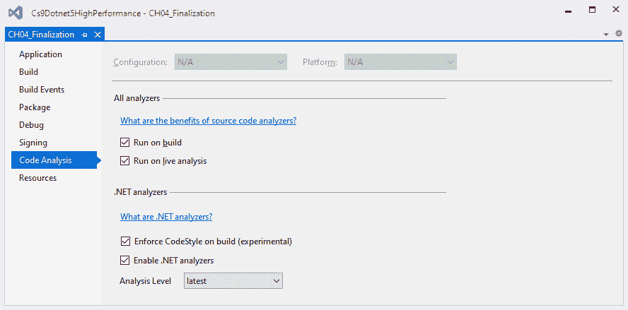

图 5.1 – 项目属性选项卡上的 Visual Studio Code 分析页面

**代码度量结果**窗口可通过**视图**菜单中的**视图** | **其他窗口 – 代码度量结果**访问。**代码度量结果**窗口如图 5.2 所示：

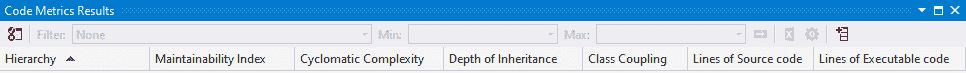

图 5.2 – 代码度量结果窗口

右键单击 `CH04_Finalization` 项目，并在上下文弹出菜单中选择**分析**和**代码清理** | **计算代码度量**。**代码度量结果**窗口将更新为分析结果：

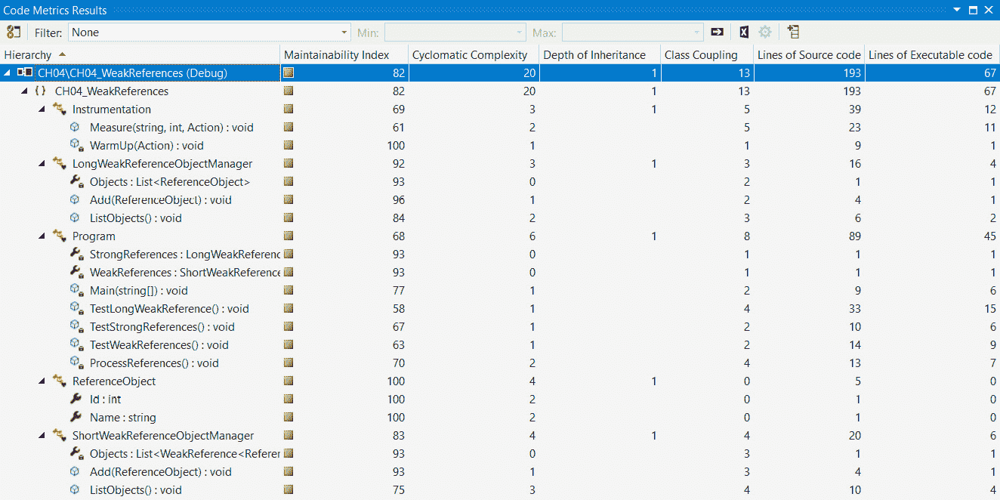

图 5.3 – CH04_WeakReference 项目的 Visual Studio 2022 代码度量结果

`CH04_Finalization`。

详细了解度量信息

如果你想了解更多关于指标（**可维护性指数**、**圈复杂度**、**继承深度**、**类耦合度**、**源代码行数**和**可执行代码行数**）的信息，那么你可以在我的另一本书中找到一个专门的章节（*第十二章*），这本书名为 *Clean Code in C#* ([`www.packtpub.com/product/clean-code-in-c/9781838982973`](https://www.packtpub.com/product/clean-code-in-c/9781838982973))），由 Packt 出版。

从 **可维护性指数** 列的交通灯指示器中，你可以看到我们的项目一路绿灯。这意味着我们的项目是可维护的。

我们方法的圈复杂度在 **1** 到 **2** 之间，所以我们的单个方法代码不包含任何风险。然而，我们项目的整体圈复杂度为 **31**，属于中等风险。这个值是项目中每个类整体圈复杂度的总和。我们每个类的圈复杂度是每个方法圈复杂度的总和。由于没有哪个类的圈复杂度超过 **13**，我们的代码复杂但只对我们项目构成低风险。因为项目的整体复杂度为 **31**，我们应该检查代码是否可以重构以降低圈复杂度。有时，你会发现代码已经尽可能简单，并且无法进一步降低圈复杂度。这是可以的。当你遇到这样的代码时，只需运用你的常识和更好的判断力即可。

我们项目中继承的最大深度是 `FreeAllocateMemory` 类继承自我们的 `DisposableBase` 类，而 `DisposableBase` 类又继承自 `System.Object` 类。如果我们研究一下 `DisposableBase` 类的功能，我们可以看到它不会给我们带来任何问题。

我们项目中的代码行数总计约为 **200**。有 **50** 行可执行代码。这是因为我们有效地使用了空白，使得代码易于阅读。易于阅读的代码更容易理解、扩展和维护。

打开 `CH06_Collections`：

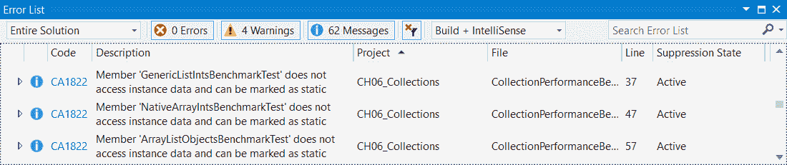

图 5.4 – CH04_Finalization 项目的 Visual Studio 2022 代码分析结果

在前面的屏幕截图中，我们可以看到我们有 0 个错误，4 个警告和 62 条消息。三条信息性消息告诉我们，有三个不同的方法没有访问实例数据，可以标记为静态。

在 `CH04_Finalization.DisposableBase` 类中，我们实现了 `IDisposable` 接口。在这个类中，代码分析会为代码分析规则 CA1816 产生两个信息性消息。这个代码分析规则告诉我们，`Dispose` 方法应该调用 `SuppressFinalize`。尽管调用了 `GC.SuppressFinalize`，但我们仍然收到这个代码分析规则的信息性消息。因此，为了移除（抑制）警告，我们将代码包裹在 `#pragma` 编译器指令中。这可以手动完成，或者通过右键单击消息并选择以下方式选择 `DisposableBase` 源文件：

```cs
#pragma warning disable CA1816 
```

```cs
// Dispose methods should call SuppressFinalize
```

```cs
public void Dispose()
```

```cs
#pragma warning restore CA1816 
```

```cs
// Dispose methods should call SuppressFinalize
```

```cs
{
```

```cs
    Dispose(true);
```

```cs
}
```

```cs
private void Dispose(bool disposing)
```

```cs
{
```

```cs
    if (disposing)
```

```cs
#pragma warning disable CA1816 
```

```cs
// Dispose methods should call SuppressFinalize
```

```cs
        GC.SuppressFinalize(this);
```

```cs
#pragma warning restore CA1816 
```

```cs
// Dispose methods should call SuppressFinalize
```

```cs
ReleaseManagedResources();
```

```cs
ReleaseUnmanagedResources();
```

```cs
}
```

现在，`DisposableBase` 类已经通过这些 `#pragma` 警告禁用 CA1816 语句进行了更新，请注意，这些消息不再在错误列表中显示。

好吧，我们已经了解了如何使用 Visual Studio 2022 生成代码度量值并对 `CH04_Finalization` 项目进行代码分析。现在，让我们看看如何生成内存转储并分析它们。

# 生成和查看内存转储

在 Visual Studio 中进行调试时，如果你的程序在断点或异常处停止，那么在 **Debug** 菜单中就会出现 **Save Dump As** 菜单选项。

包含堆文件的 minidump 提供了应用程序内存的快照，显示了当时正在运行的过程，并列出了在某个时间点加载的模块。转储文件使您能够检查在转储保存时应用程序和内存中的堆栈、线程和变量。

当在测试软件时遇到崩溃，并且无法在您的计算机上重现客户程序崩溃时，您会保存包含堆文件的 minidump。

让我们通过以下步骤保存和加载包含堆文件的 minidump：

1.  使用我们的 `CH04_WeakReferences` 项目，在 `program.cs` 文件中的以下行设置断点：

    ```cs
    Console.WriteLine("Press any key to continue.");
    ```

1.  运行项目到断点。然后，当断点被触发时，选择 `CH04_WeakReference.dmp`。这是一个包含堆文件的 minidump 文件。

1.  要读取文件，请选择 **文件** | **打开** | **文件**。然后，选择您刚刚保存的文件。您应该看到以下窗口：

![Figure 5.5 – 在 Visual Studio 2022 中加载堆文件的 minidump

![img/Figure_5.05_B16617.jpg]

图 5.5 – 在 Visual Studio 2022 中加载堆文件的 minidump

上述截图显示我们可以看到文件最后更新的时间、进程名称、计算机架构、异常代码和信息、堆信息以及错误信息。然后，我们有 CLR 和 OS 版本。最后，有一个模块列表，包括它们的名称、版本和路径。

您刚刚学习了如何在 Visual Studio 2022 中生成和读取内存转储。现在，我们将看看如何使用 Visual Studio 2022 中的 **Modules** 窗口查看我们的项目加载了哪些模块。

# 查看已加载的模块

为了确定可能引起性能问题，如过度的内存加载，或可能生成运行时错误的原因，查看已加载到内存中的模块可能会有所帮助。在本节中，您将学习如何查看加载的模块以及了解有关这些模块提供的信息项。

当您在 Visual Studio 2022 中进行调试时，**调试** | **窗口** 菜单包含以下菜单，如图 *图 5.6* 所示：

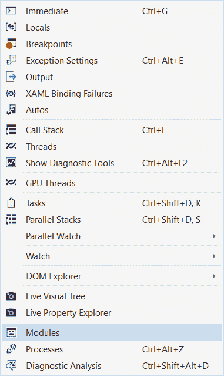

图 5.6 – 调试会话期间的 Windows 菜单

如 *图 5.6* 所示的先前菜单中，您可以在调试会话期间选择 **模块**。这将加载 **模块** 窗口，如图 *图 5.7* 所示：

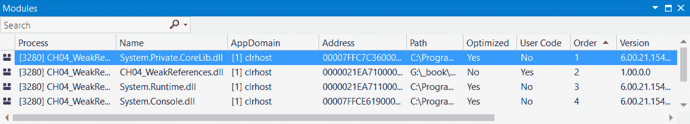

图 5.7 – 显示当前进程加载模块的模块窗口

如 *图 5.7* 所示，`CH04_WeakReferences.exe` 进程在 **clrhost** 应用域中运行，并加载以下模块：

+   `System.Private.CoreLib.dll`

+   `CH04_WeakReference.dll`

+   `System.Runtime.dll`

+   `System.Console.dll`

在 **模块** 窗口中显示的字段列表如下：

+   **名称**：已加载的汇编（加载的模块）的名称

+   **路径**：已加载模块的路径

+   **优化**：是/否

+   **用户代码**：是/否

+   **符号状态**：跳过加载符号/符号已加载

+   **符号文件**：已加载符号文件的路径和文件名

+   **顺序**：汇编加载的顺序

+   **版本**：汇编版本

+   **地址**：已加载模块的内存地址

+   **进程**：负责将模块加载到内存中的进程标识符和可执行文件名

+   **应用域**：模块正在运行的程序域的名称。在 .NET Core 和 .NET 5 或更高版本中，这没有任何意义。它被显示出来是因为调试器 UI 没有区分 .NET Framework 和 .NET Core。

您可以使用这些信息来查看已加载的模块，了解有关这些模块提供的信息项，包括它们在内存中的位置、符号是否已加载、代码是系统代码还是用户代码，以及代码是否已优化或未优化。如果您发现未优化的用户代码，则可以应用优化以提高性能。

在下一节中，我们将简要介绍如何通过介绍您应该已经熟悉的工具来进一步调试您的应用程序。

# 调试您的应用程序

假设您知道如何通过运行代码、单步执行和跳过代码、运行到光标处以及设置断点来调试您的代码。然而，当使用调试器时，还有其他有用的工具可用。以下是一些工具：

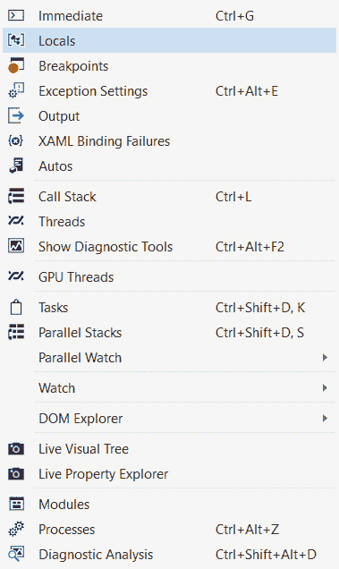

图 5.8 – 调试 | 窗口菜单

如您所见，有相当数量的不同窗口可供帮助调试您的应用程序。**立即**窗口在程序暂停时执行命令非常出色。**局部变量**窗口用于查看变量的当前状态，调用堆栈对于查找异常发生的位置非常有用，尤其是如果它是在您不熟悉的代码中！花些时间在打开这些窗口的情况下运行您的源代码。例如，**XAML 绑定失败**这样的窗口仅在处理基于 XAML 的代码时使用。但其他窗口，如**立即**、**局部变量**、**输出**、**自动**和**调用堆栈**，可以与所有项目类型一起使用。充分利用这些工具的最好方法是亲自使用它们，并在编写代码的过程中了解它们。接下来，我们将探讨使用跟踪和诊断工具。

# 使用跟踪和诊断工具

在本节中，我们将探讨一些分析工具，以帮助您跟踪和诊断代码中的任何问题。通过跟踪和诊断程序，您可以识别性能关注点并解决它们。这些关注点可能包括内存分配的数量和它们使用的字节数，以及识别垃圾回收后存活的对象数量。此类信息可用于提高内存使用率和性能，以及防止和移除内存泄漏。

我们将探讨来自 JetBrains 的两个产品，称为 **dotMemory** 和 **dotTrace**，这些工具在这方面非常有价值。但首先，我们将从 Visual Studio 2022 内置的名为 **性能分析器** 的分析器开始。

## 使用 Visual Studio 2022 性能分析器

现在，我们将查看我们项目的性能配置文件。这将显示随时间推移的对象数量以及垃圾回收在我们的项目中的使用方式，以及垃圾回收后存活的对象数量。我们可以将此配置文件深入到程序集和方法级别。这使得我们可以看到方法内的对象分配数量以及这些分配使用的总字节数。正因为有了这些信息，我们可以识别出程序中生成最多内存使用的区域。有了这样的信息，我们可以考虑对重分配代码进行重构以改善内存性能。

要访问 Visual Studio 2022 性能配置文件，请从 Visual Studio 2022 **调试**菜单中选择**性能分析器**。这将打开一个标签页，如图 *图 5.9* 所示：

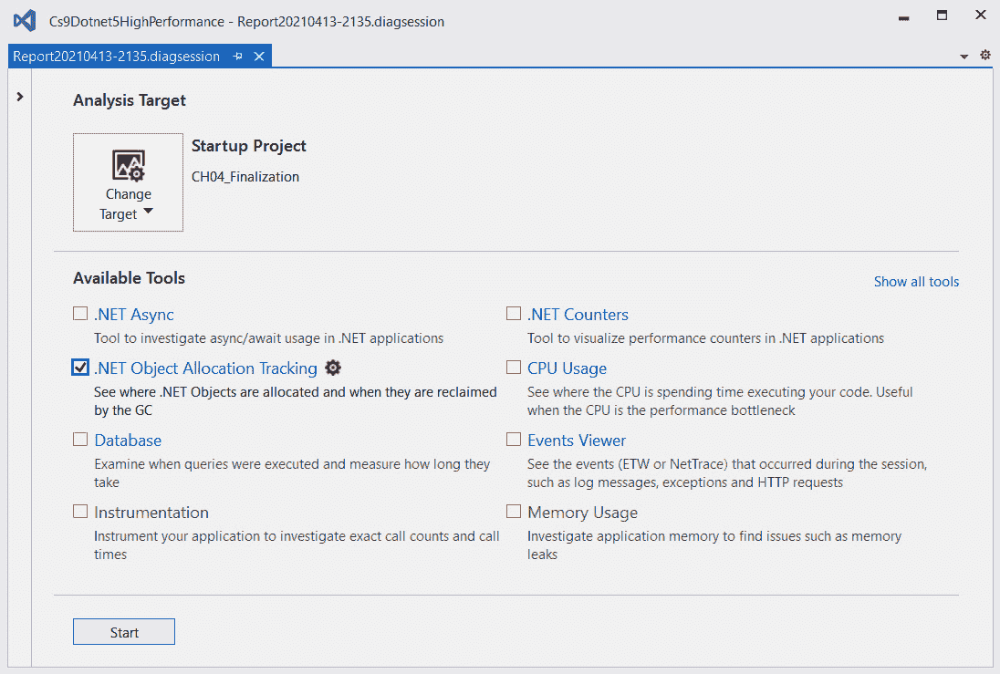

图 5.9 – Visual Studio 2022 性能分析器

现在，我们将对 `CH04_Finalization` 项目进行分析：

1.  选择你的启动项目。

1.  然后，选择您想要使用的工具。在我们的例子中，我们选择了`CH04_Finalization`。我们选择的工具是用于跟踪.NET 对象分配的工具。这使我们能够看到.NET 对象在哪里分配以及何时被回收。

1.  点击**开始**按钮以开始分析应用程序。分析器将运行，并在代码停止时停止。您将看到一个类似于*图 5.10*的报告：

![Figure 5.10 – 完整的 Visual Studio 2022 性能分析器报告

显示活动对象随时间变化

![img/Figure_5.10_B16617.jpg]

图 5.10 – 显示活动对象随时间变化的完整 Visual Studio 2022 性能分析器报告

主要图表区域显示了随着时间的推移活动对象的数量。此外，还有四个标签页，包含**分配**、**调用树**、**函数**和**收藏集**数据。

1.  在**分配**标签页上，您可以看到使用的类型及其分配数量。点击一个类型将显示该类型的**回溯**。您可以看到该类型的分配数量以及在您的函数中分配的字节数，如图*图 5.11*所示：

![Figure 5.11 – Visual Studio 2022 性能分析器中 System.Sbyte[]的分配]

![img/Image87475.jpg]

图 5.11 – Visual Studio 2022 性能分析器中 System.Sbyte[]的分配

在*图 5.11*中，我们可以看到在我们的`Main`方法中，有 19 次`System.Sbyte[]`类型的分配，分配大小为**952**字节。

1.  选择`DisplayGeneration(Product product)`方法，有一个大小为**24**字节的`System.Int32`分配，如图*图 5.12*所示：

![Figure 5.12 – Visual Studio 2022 性能分析器调用树标签页

![img/Figure_5.12_B16617.jpg]

图 5.12 – Visual Studio 2022 性能分析器调用树标签页

1.  选择`Main`方法总共有**347**次分配，**27**次自我分配，总大小为**1,438**字节，如图*图 5.13*所示：

![Figure 5.13 – Visual Studio 2022 性能分析器函数标签页显示各种方法的分配和大小

![img/Figure_5.13_B16617.jpg]

图 5.13 – Visual Studio 2022 性能分析器函数标签页显示各种方法的分配和大小

1.  点击**收藏集**标签页。然后，点击一行。您将看到两个饼图，分别显示**顶级收集类型**和**顶级存活类型**，如图*图 5.14*所示：

![Figure 5.14 – Visual Studio 2022 性能分析器显示垃圾回收的分解

![img/Figure_5.14_B16617.jpg]

图 5.14 – Visual Studio 2022 性能分析器显示垃圾回收的分解

在*图 5.14*中，我们可以看到随着时间的推移，活动对象的数量以及对象变化量（百分比变化）。此外，我们还可以在两个饼图中看到顶级收集类型和顶级存活类型。

Visual Studio 2022 性能分析器是一个非常实用的工具，它使您能够查看分配、字节大小以及垃圾回收和存活的对象。您还可以看到随时间变化的存活对象数量。现在您已经了解了分析器及其功能，让我们将注意力转向 JetBrains 的工具 **dotMemory**。

## 使用 JetBrains dotMemory

我们使用 dotMemory 来分析和优化内存，并帮助我们识别内存泄漏和其他内存相关的问题。在本节中，我们将讨论 JetBrains dotMemory 内存分析器。

内存分析器将在 *x* 轴上提供以毫秒为单位的图表，在 *y* 轴上提供以兆字节为单位的图表，该图表显示了您的应用程序随时间变化的内存使用情况。以下项目在图表上显示：

+   **总使用量**：使用的内存总量。

+   **未托管内存**：放置在堆栈上的内存总量。

+   **堆生成 0**：新对象占用的内存量。这些对象的大小将小于 80,000 字节。

+   **堆生成 1**：在生成 0 垃圾回收中存活的对象。

+   **堆生成 2**：在 1 级垃圾回收中存活的长期对象。

+   **大对象堆 (LOH)**：大小为 80,000 字节或更大的对象使用的内存量。

+   **自垃圾回收以来分配到 LOH**：垃圾回收发生后在 LOH 上使用的内存量。

让我们看看 dotMemory 内存分析器的实际应用。如果您还没有这样做，请从 JetBrains 下载并安装 dotMemory，以及从 GitHub 页面获取 `第四章` 的代码。打开 dotMemory，您将看到一个类似于 *图 5.15* 所示的屏幕：

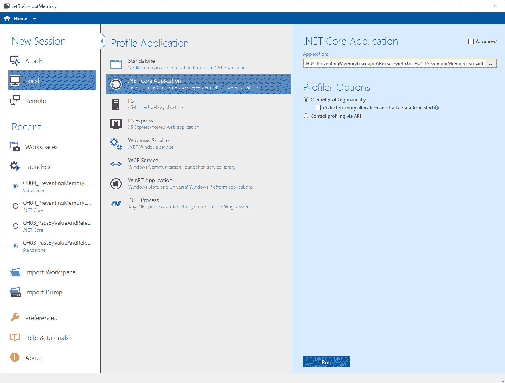

图 5.15 – 准备分析 .NET Core 应用程序的 dotMemory 内存分析器

在 *图 5.15* 中，我们选择了分析 `CH04_PreventingMemoryLeaks.dll`。点击 **运行** 按钮。这将使分析器开始运行并分析您的应用程序。一旦应用程序被分析，将显示一个报告，以图形形式显示结果，如图 *图 5.16* 所示：

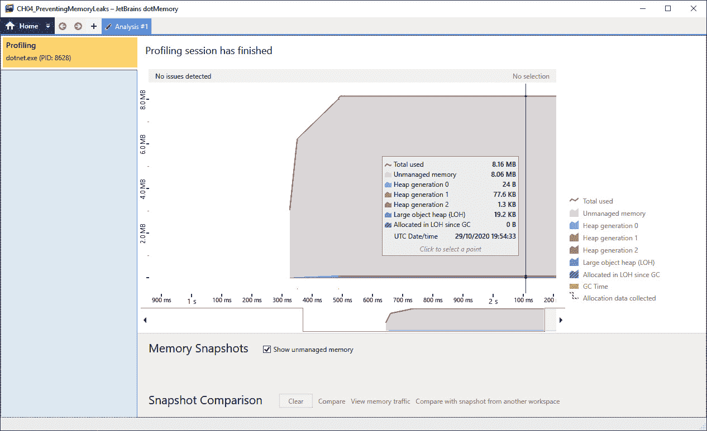

图 5.16 – CH04_PreventingMemoryLeaks.dll 的分析报告

如前一个屏幕截图所示，我们的应用程序总共使用了 **8.16 MB** 的内存。这并不多。大部分内存都放在堆栈上，如未托管内存使用量所示，为 **8.06 MB**。其余的内存位于堆上。在堆上，**0 代**分配了 **24 KB**，**1 代**分配了 **77.6 KB**，**2 代**分配了 **1.3 KB**。最多堆内存 **19.2 KB** 被放置在 LOH 上，并且在垃圾回收后没有保留。

在看到 dotMemory 工具的实际操作后，我们现在可以将注意力转向 JetBrains dotTrace 工具在跟踪和性能分析方面能为我们提供什么。

## 使用 JetBrains dotTrace

在本节中，我们将探讨 JetBrains dotTrace。您将学习如何使用 JetBrains dotTrace 工具在程序运行时进行应用程序跟踪。这将帮助您识别可执行程序中的瓶颈和内存问题。

dotTrace 中可用的分析器选项包括以下内容：

+   **采样**：对调用时间的精确测量。这对于大多数用例是最优的。

+   **跟踪**：对调用次数的精确测量。这对于分析算法复杂度是最优的。

+   **逐行分析**：仅适用于高级用例。

+   **时间线**：对时间性能数据的测量。这对于大多数用例是最优的，包括多线程应用程序的分析：

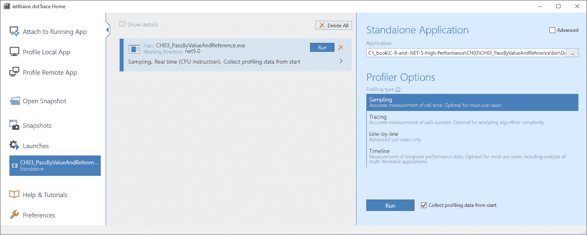


图 5.17 – JetBrains dotTrace 准备分析我们的应用程序

*图 5.17* 展示了 dotTrace 的初始状态。我们已将 **CH03_PassByValueAndReference.exe** 作为我们的分析应用程序。在我们的分析选项中，我们选择了默认的 **采样** 设置。确保已选中 **从开始收集分析数据**。然后，点击 **运行** 按钮开始跟踪。

当跟踪完成后，dotTrace 性能查看器将自动打开，如 *图 5.18* 所示：

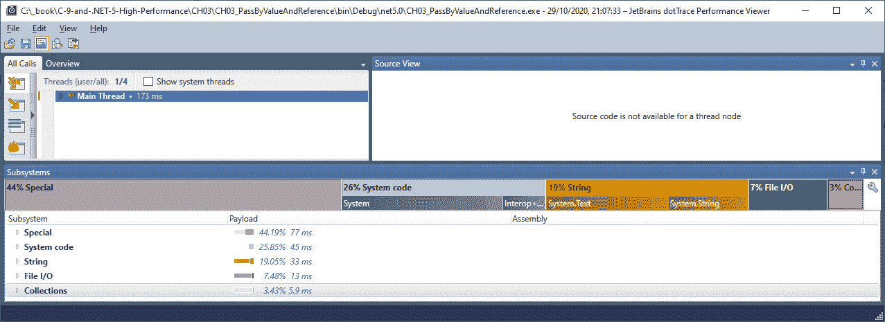


图 5.18 – JetBrains dotTrace 性能查看器

对 `CH03_PassByValueAndReference.exe` 文件进行性能分析的结果显示在 *图 5.18* 的默认视图中。如果您点击 `Main` 行，您将看到程序代码。`Main` 方法的分解显示，19 毫秒（43.20%）的时间用于执行系统代码，13 毫秒（29.56%）的时间用于执行文件 I/O，12 毫秒（27.24%）的时间用于执行 **String** 子系统，如 *图 5.19* 所示：

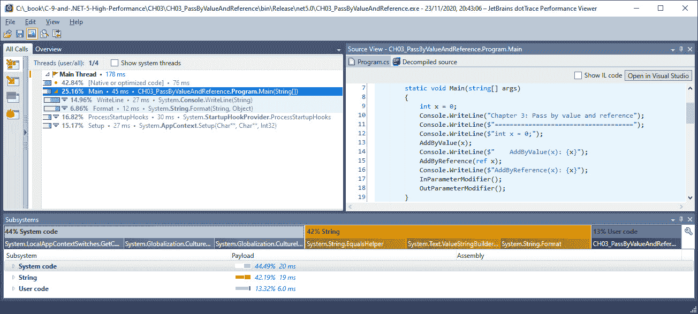


图 5.19 – 主要方法的分解

*图 5.19* 展示了 `Main` 方法的源代码以及从 `Main` 到 `InParameterModifier` 之间，`Main` 方法花费了最多时间进行处理的实际情况。这些信息有助于识别并处理瓶颈。

我们已经看到了两个用于内存分析和跟踪的工具，可以用来衡量性能、识别瓶颈和问题。现在，让我们将注意力转向安装和使用 `dotnet-counters`。

# 安装和使用 dotnet-counters

在本节中，我们将安装和使用 `dotnet-counters`。这些计数器是非常有用的数据收集工具，帮助我们监控程序的健康状况。

打开 Visual Studio 2022 的开发者命令提示符。然后，输入以下命令并按 *Enter* 键：

```cs
dotnet tool install --global dotnet-counters --version 3.1.141901
```

这将下载并安装 dotnet-tools。成功安装将显示，如图 *图 5.20* 所示：

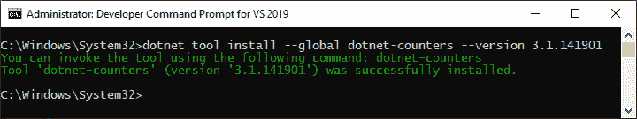

开发者命令提示符


图 5.20 – 使用开发者命令提示符成功安装 dotnet-tools 版本 3.1.141901

使用 `dotnet-counters` 的目的是对您的应用程序进行健康监控和初步的性能调查。如果在使用此程序时发现潜在的性能问题，则可以使用 PerfView 或 dotnet-trace 等工具进行更深入的性能调查：

+   要定期收集所选计数器值并将它们导出到文件以进行后期处理，请使用 `dotnet-counters collect` 命令。

+   `dotnet-counters list` 命令显示按提供程序分组的计数器名称和描述列表。

+   要显示可以监控的 .NET 进程列表，可以使用 `dotnet-counters ps` 命令。

+   使用 `dotnet-counters monitor` 命令，您可以定期显示所选计数器的刷新值。

要获取每个命令的可用选项列表，请附加 `-h` 或 `–help`。让我们使用这些命令中的每一个。在我们这样做之前，将以下行添加到 `CH04_WeakRefereces` `Main` 方法在 `Program` 类的末尾：

```cs
Console.WriteLine("Press any key to continue.");
```

```cs
Console.ReadKey();
```

运行程序。程序将暂停并等待你按下一个键后继续。

## 收集数据并将其保存到文件以供后期分析

现在我们将使用 `dotnet-counters` 将数据保存到文件中，以便我们的程序运行完成后进行分析：

1.  删除 `Program` 类中 `CH04_WeakReferences` 的断点。

1.  将 `Program` 类中的 `ProcessReferences()` 方法更新如下：

    ```cs
    private static void ProcessReferences()
    {
    int x = 0;
    while(x < 10000)
    {
        StrongReferences.ListObjects();
        WeakReferences.ListObjects();
        Thread.Sleep(2000);
        GC.Collect();
        x++;
    }
    }
    ```

1.  在 `Program` 类的 `while (x < 10000)` 循环中添加一个断点。

1.  然后，运行程序。运行程序将需要一些时间 - 大约 10,000 次迭代 x 2 秒 = 5.5 小时。

1.  当程序在 *步骤 3* 中添加的断点处停止时，以管理员身份打开命令提示符，并输入 `dotnet-counters ps` 然后按 *Enter*。如果您不以管理员身份运行，您将遇到计数器访问错误。

1.  获取程序的进程 ID。

1.  将命令提示符中的目录更改为指向 `C:\Temp`。如果不存在，则创建该目录。

1.  输入 `dotnet-counters collect --process-id 1234` 命令（将 **1234** 替换为你的 .NET 进程 ID），然后按 *Enter*。

1.  现在将收集性能数据。

1.  删除在 *步骤 3* 中添加的断点并继续程序。当你让程序运行了一段时间后，按 *q* 键。你的命令提示符屏幕应该类似于 *图 5.21*：

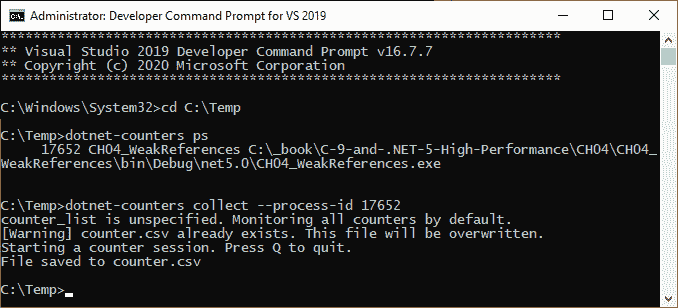


图 5.21 – 完成收集后开发者命令提示符

1.  在 **Excel** 中打开名为 `C:\Temp\counter.csv` 的文件。*Figure 5.22* 显示了电子表格中的数据摘录：

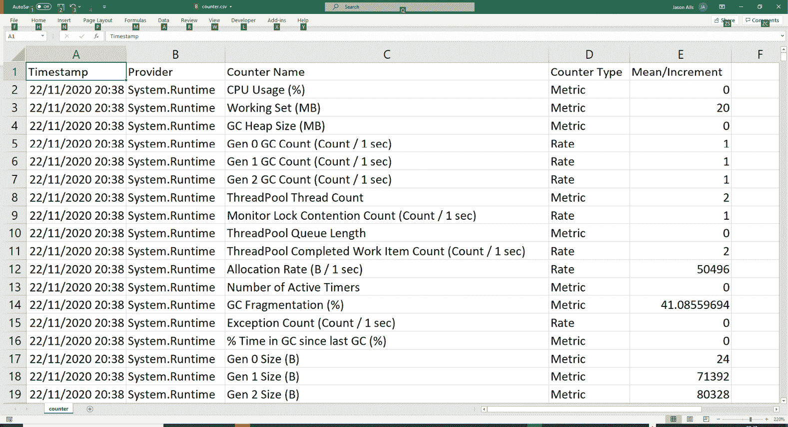

Figure 5.22 – counter.csv 的摘录

如你所见，`dotnet-counters` 收集过程记录了各种项目。这些项目包括 CPU 使用率、垃圾收集数据、堆信息、异常信息、加载的程序集数量和 JIT 编译信息。

## 列出可监控的 .NET 进程

要列出可监控的 .NET 进程，请打开开发者命令提示符窗口并输入 `dotnet-counters ps` 命令。你应该会看到类似以下输出：

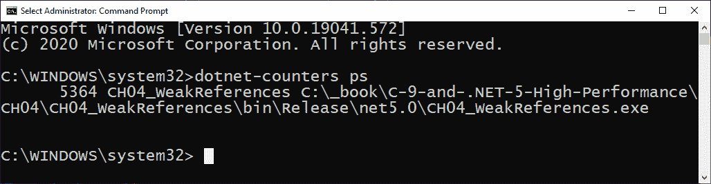

Figure 5.23 – 可监控的 .NET 进程列表

如 *Figure 5.23* 所示，唯一可监控的进程是进程 **5364**。进程 **5364** 是我们目前正在调试的程序。如果有更多的 .NET 程序在运行，那么这个列表中会有更多。

## 列出可用的已知 .NET 计数器列表

要列出可用的 .NET 计数器，请运行以下命令：

```cs
dotnet-counters list
```

你将在控制台看到计数器和它们的描述列表。对于 `Microsoft.AspNetCore.Hosting`，可用的计数器如下所示：

+   **requests-per-second**: 请求速率

+   **total-requests**: 请求总数

+   **current-requests**: 当前请求数量

+   **failed-requests**: 请求失败的数量

以下列出 `System.Runtime` 可用的已知计数器：

+   **cpu-usage**: 进程已使用的 CPU 时间（以毫秒为单位）

+   **working-set**: 进程使用的内存工作集大小（以兆字节为单位）

+   **gc-heap-size**: 垃圾收集器报告的总堆大小（以兆字节为单位）

+   **gen-0-gc-count**: 每分钟生成 0 收集器的垃圾收集次数

+   **gen-1-gc-count**: 每分钟生成 1 收集器的垃圾收集次数

+   **gen-2-gc-count**: 每分钟生成 2 收集器的垃圾收集次数

+   **loh size**: 大对象堆大小

+   **alloc-rate**: 每秒在托管堆中分配的字节数

+   **assembly-count**: 加载的程序集数量

+   **exception-count**: 每秒异常数量

+   **threadpool-thread-count**: 线程池线程数量

+   **monitor-lock-contention-count**: 每秒尝试获取监视器锁时的争用次数

+   **threadpool-queue-length**: 线程池队列中的工作项数量

+   **threadpool-completed-items-count**: 线程池中完成的工作项数量

+   **active-timer-count**: 当前活动的计时器数量

## 监控 .NET 进程

我们将运行 `CH04_WeakReferences` 项目。一旦项目运行，请运行以下命令以获取进程 ID：

```cs
dotnet-counters ps
```

然后，一旦你有了.NET 程序的进程 ID，运行以下命令：

```cs
dotnet-counters monitor –process-id 6719
```

对于我来说，该进程的 ID 为**6719**。将**6719**替换为你的进程 ID。结果应该是你看到.NET 计数器实时显示和更新，如图*图 5.24*所示：

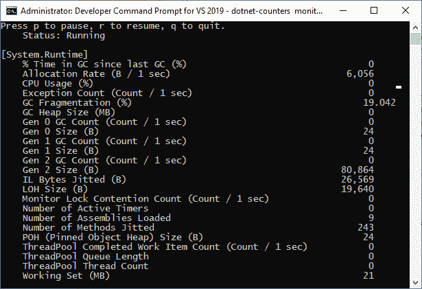

图 5.24 – dotnet-counters 正在实时列出和更新我们的 CH04_WeakReferences 项目

按*q*键退出。如你所见，我们有**19.042%**的垃圾收集碎片。在 LOH 上有**19,640**字节，**80,864**字节分配给了第**2**代。我们已加载**9**个程序集，**24**字节分配给了第**0**代和第**1**代。我们观察到内存碎片发生在**19.042**%，因此可以进一步调查为什么有碎片，以及我们是否可以避免这种情况。

在下一节中，我们将查看一个示例，该示例追踪一个 WPF 应用程序中的内存泄漏。

# 使用 dotMemory 追踪和修复内存泄漏

在本节中，我们将通过一个示例来演示如何追踪和修复内存泄漏。应用程序抛出的`OutOfMemoryException`异常。

我们的示例将是一个名为`CH05_GameOfLife`的 WPF 应用程序。为了节省时间和空间，下载 WPF 应用程序的源代码。这将帮助你专注于当前的任务，即追踪内存泄漏并修复它。

注意

在分析和跟踪时，你最好使用**发布**模式构建你的项目。原因是**调试**构建包含可能影响分析结果的编译指令。

执行以下步骤：

1.  下载并编译`CH05_GameOfLife`项目，以**发布**模式编译。

1.  打开**dotMemory**。本例中使用的版本是**2020.3.4**

1.  在**新会话**下，选择**本地**。然后，在**分析应用程序**下，选择**.NET Core 应用程序**。在**.NET Core 应用程序**下选择**CH05_GameOfLife.exe**文件，对于**分析器选项**，选择**从开始收集内存分配和流量数据**。*图 5.25*显示了 dotMemory 准备分析我们的应用程序：

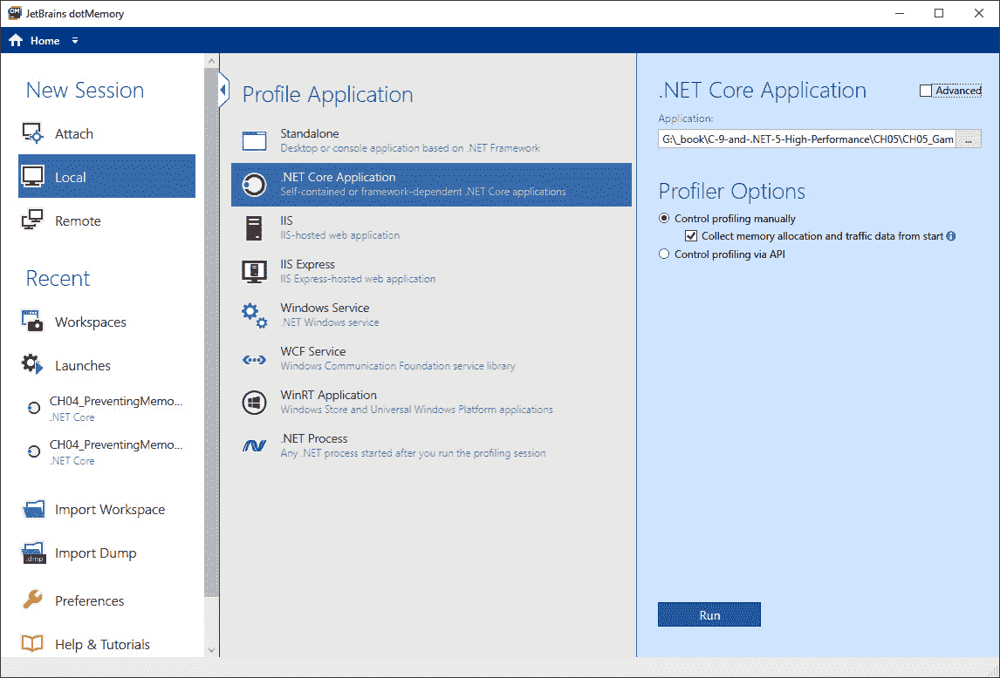

图 5.25 – dotMemory 准备分析我们的.NET 6.0 应用程序 CH05_GameOfLife.exe

1.  点击**运行**以开始分析我们的应用程序。你将看到 dotMemory 中出现一个新的**分析**标签，如图*图 5.26*所示：

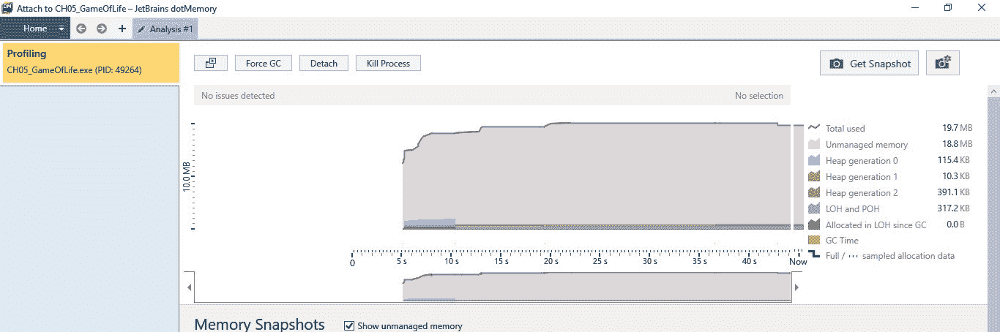

图 5.26 – dotMemory 在分析我们的应用程序时显示分析标签

1.  当分析器启动时，它也会启动我们的应用程序。点击应用程序的**开始**按钮，如图*图 5.27*所示：


图 5.27 – 运行 CH05_GameOfLife

1.  在 *生命游戏* 运行一段时间后，点击 **获取快照** 按钮以拍摄内存快照。这将捕捉到该时刻应用程序的托管堆。

1.  关闭广告。

1.  再次拍摄一个快照，以便我们有两个快照。然后，关闭 *生命游戏* 应用程序以停止分析器。*图 5.28* 显示了已拍摄两个快照的 dotMemory **分析** 选项卡：

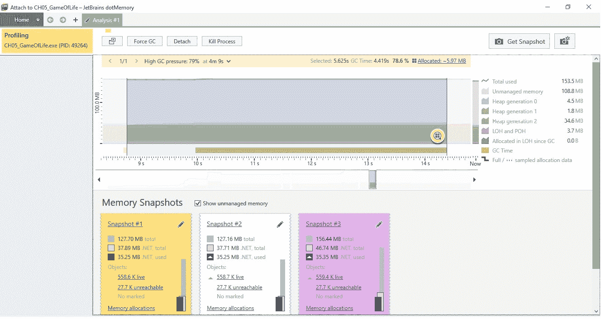

图 5.28 – 显示两个内存快照的 dotMemory 分析选项卡

1.  下一步是我们比较两个不同的快照。*图 5.29* 显示了两个快照并排的特写：

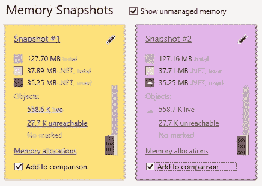

图 5.29 – dotMemory 快照 1 和 2

1.  点击 **比较** 打开两个快照的详细并排比较。您应该看到如图 *图 5.30* 所示的比较：

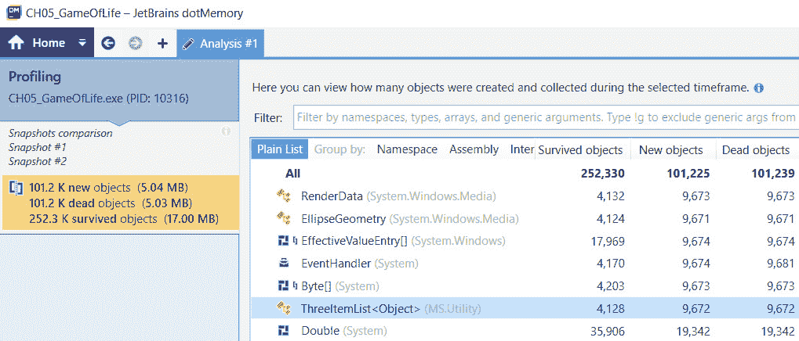

图 5.30 – 并排快照比较屏幕

如您所见，此视图显示了创建的新对象数量，垃圾收集器收集的对象数量（已死亡的对象），以及经过垃圾收集后存活的对象数量。这是可以用来识别内存泄漏的良好信息来源。

1.  点击 **命名空间** 列表。然后，展开 **CH05_GameOfLife** 命名空间并突出显示 **AdWindow** 条目，如图 *图 5.31* 所示：

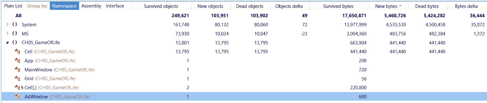

图 5.31 – 使用 CH05_GameOfLife 高亮的命名空间分析

1.  在 **存活对象** 列表中，点击 **AdWindow** 行中的数字 **1**。这将弹出对话框，如图 *图 5.32* 所示：

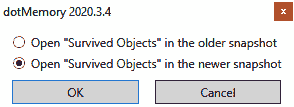

图 5.32 – dotMemory 对话框提示打开快照

1.  选择较新的快照选项。

1.  然后，点击 **关键保留路径** 选项卡。JetBrains dotMemory 视图将更改为类似于 *图 5.33* 的视图：

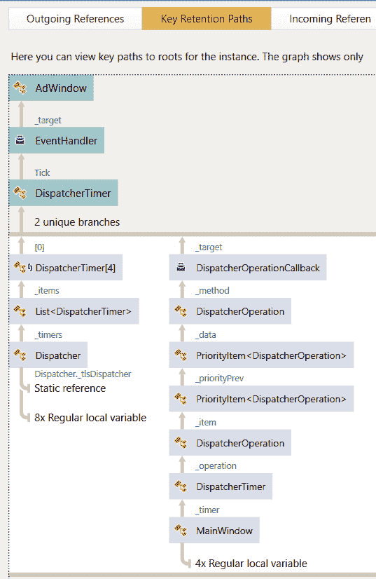

图 3.33 – 关键保留路径选项卡

您可以看到 `EventHandler` 正在保持 `AdWindow` 活跃，并且 `EventHandler` 被类 `DispatcherTimer` 引用。`DispatcherTimer` 类被 `Tick` 事件引用。

1.  点击 `DispatcherTimer` 框。这将带您到 `DispatcherTimer` 类，如图 *图 3.34* 所示：

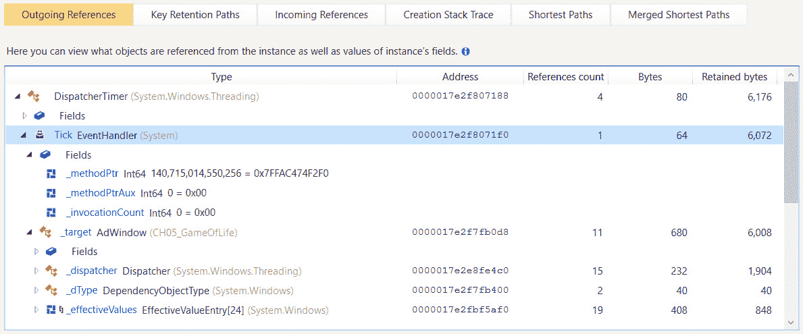

图 3.34 – 显示 DispatcherTimeruse 详细信息的输出引用表

此选项卡确实显示 `Tick EventHandler` 正在保留字节，这导致我们的 `DispatcherTimer` 对象在内存中保持活跃。

1.  点击 `EventHandler` 创建。方法出现在顶部，如图 *图 3.35* 所示：

![图 3.35 – 显示创建堆栈跟踪选项卡中的 AdWindow 构造函数，该构造函数创建计时器]

](img/Figure_5.35_B16617.jpg)

图 3.35 – 显示创建堆栈跟踪选项卡中的 AdWindow 构造函数，该构造函数创建计时器

1.  在 **CH05_GameOfLife** 项目的 `AdWindow` 类中定位 `AdWindow` 构造函数：

    ```cs
    public AdWindow(Window owner)
    {
        ... 
        _adTimer = new DispatcherTimer { 
            Interval = TimeSpan.FromSeconds(3) 
    };
      _adTimer.Tick += ChangeAds;
      _adTimer.Start();
    }
    ```

如前述代码片段所示，我们正在订阅 `Tick` 事件，该事件由 `ChangeAds` 方法处理。但我们没有做的一件事是在我们不再需要它时取消订阅事件。这就是内存泄漏的原因。

1.  为了纠正我们的内存泄漏，我们只需要在我们不再需要它时取消订阅事件。为此，我们更新 `OnClosed` 方法，如下面的代码所示：

    ```cs
    protected override void OnClosed(EventArgs e)
    {
      _adTimer.Tick -= ChangeAds;
      base.OnClosed(e);
    }
    ```

我们现在通过在关闭 `AdWindow` 构造函数时取消订阅 `Tick` 事件来纠正我们的内存泄漏。重复这些步骤来分析这个内存泄漏，你会看到它现在已经被修复，如图 *图 5.36* 所示：

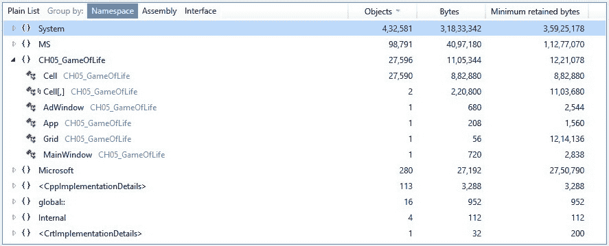

图 5.36 – dotMemory 显示内存泄漏已被修复

注意

我们已经有效地追踪并修复了一个内存泄漏，这是由于我们没有取消订阅我们订阅的事件。这是 C# 中内存泄漏的非常常见的原因。要了解更多关于 dotMemory 以及如何在各种场景中使用它的信息，请访问 JetBrains 的官方 How-To 文档，网址为 [`www.jetbrains.com/help/dotmemory/Examples.html`](https://www.jetbrains.com/help/dotmemory/Examples.html)。

在下一节中，我们将探讨如何使用 dotTrace 追踪和修复 UI 冻结。

# 使用 dotTrace 寻找 UI 冻结的原因

在本节中，我们将使用 dotTrace 来追踪 UI 冻结的原因，以便我们可以修复它。再次强调，为了节省时间，我们将使用已经为你提供的项目。从 *技术要求* 部分指定的 URL 获取书籍的源代码。在 `CH05` 的源代码中，你会找到一个名为 `CH05_BatchFileProcessing` 的项目。

此项目打开用户指定的多个文本文件，然后反转它找到的每个字符串。当用户点击 `BackgroundWorker` 线程时，它将在一个单独的线程上运行。在左上角，显示文件处理的进度。这会变为 **所有文件已成功处理**。然而，存在一个问题，即在文件处理过程中 UI 会冻结。

为了找到这个 UI 冻结的源头并修复它，我们将使用时间线分析，这是 dotTrace 提供的功能：

1.  在 **发布** 模式下构建 **CH05_BatchFileProcessing** 项目。

1.  打开 dotTrace。

1.  选择**配置文件本地应用** | **.NET Core 应用程序** | **时间线**，并选择您刚刚编译的可执行文件。请确保勾选**从开始收集分析数据**。*图 5.37* 展示了在运行 dotTrace 之前对其进行配置的情况：

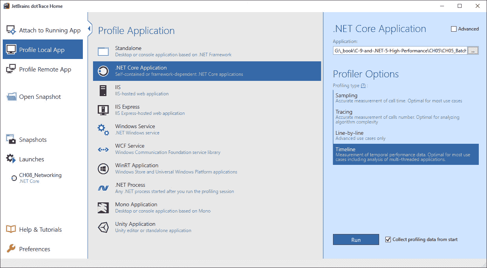

图 5.37 – 在我们运行时间线分析器之前 dotTrace

1.  点击**运行**按钮开始时间线分析。分析器将被打开，如图 *图 5.38* 所示：

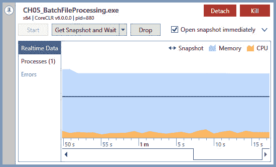

图 5.38 – dotTrace 时间线分析器

分析器将启动 **CH05_BatchFileProcessor** 程序，如图 *图 5.39* 所示：

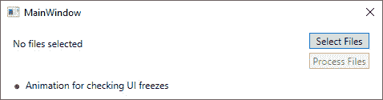

图 5.39 – 批处理文件处理器

当应用程序完成文件处理后，UI 将显示，如图 *图 5.40* 所示：

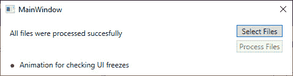

图 5.40 – CH05_BatchFileProcessor

1.  点击时间线分析器上的 **获取快照** 和 **等待** 按钮。这将保存快照并在 dotTrace **时间线查看器**应用程序中打开，如图 *图 5.41* 所示：

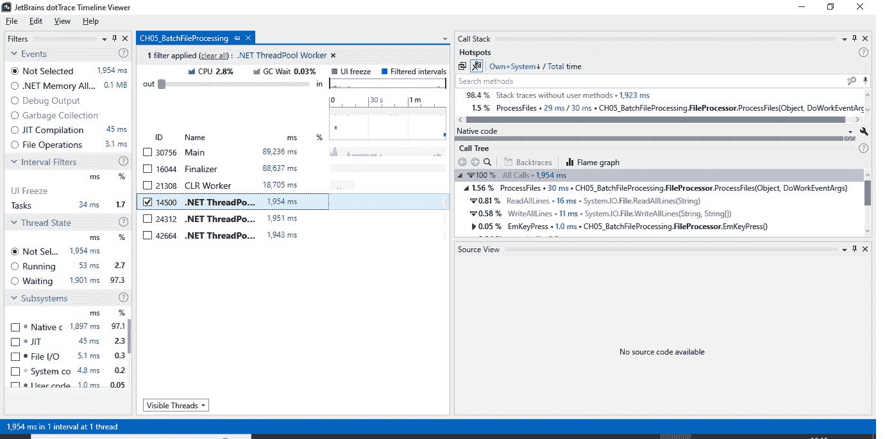

图 5.41 – 加载了时间线快照的 dotTrace 时间线查看器应用程序

1.  您可以关闭 **CH05_BatchFileProcessor** 和 dotTrace 分析器应用程序。但请保持 dotTrace **时间线查看器**应用程序打开。

1.  所有过滤器值都是针对所有当前可见的线程计算的。我们只对有活动的线程感兴趣。因此，通过选择它们，右键单击并选择**隐藏所选线程**来隐藏所有没有活动的线程。

1.  我们的 **BackgroundWorker** 线程是具有 ID **12764** 的 **.NET ThreadPoolWorker** 线程，如图 *图 5.42* 所示：

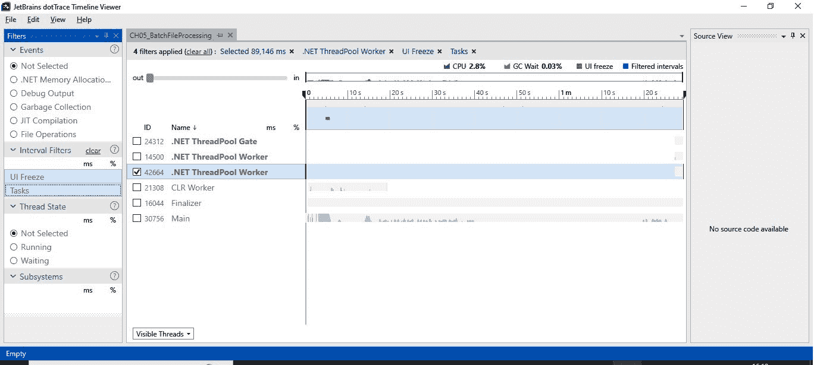

图 5.42 – 带有突出显示的 BackgroundWorker 线程的 dotTrace 时间线查看器应用程序

1.  将时间线放大到 **.NET ThreadPool Worker**。您可以看到时间线由三个状态组成。这些状态是**运行中**、**等待 CPU** 和 **等待**。您可以在 *图 5.43* 中看到我们的线程时间线：


图 5.43 – 我们线程在时间线跟踪中的活动

在屏幕的左侧，您将在 **过滤器** 面板中看到 **线程状态** 部分。依次选择每个状态，您将看到相应的时线被突出显示。尝试所有可用的不同过滤器。调查每个选项提供的内容。这是一种很好的学习方法。收起的 **过滤器** 面板在 *图 5.44* 中显示：

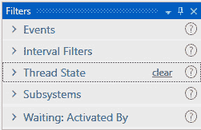

图 5.44 – 收起的 dotTrace 过滤器面板

1.  在屏幕的右侧，您将看到 **调用栈** 面板和 **源视图** 面板。如果您在线程的时间线上点击任何位置，您将看到该时间点的调用栈。对于该堆栈跟踪，将显示调用树。如果您在调用栈中点击一个条目，代码将被反编译并在 **源视图** 选项卡中显示。此功能使您能够看到在什么时间点运行什么代码。此外，此视图还显示了您正在查看的代码的完整程序集名称、命名空间和类名。*图 5.45* 显示了 **调用栈** 面板：

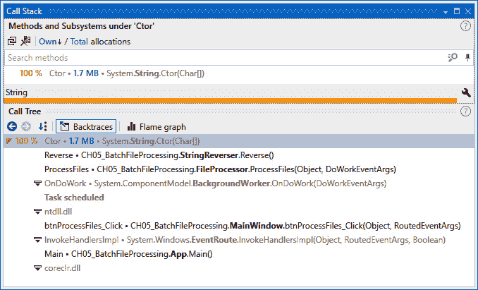

图 5.45 – 显示 Backtraces 选项卡的 dotTrace 调用栈面板

*图 5.46* 显示了 **源视图** 面板：

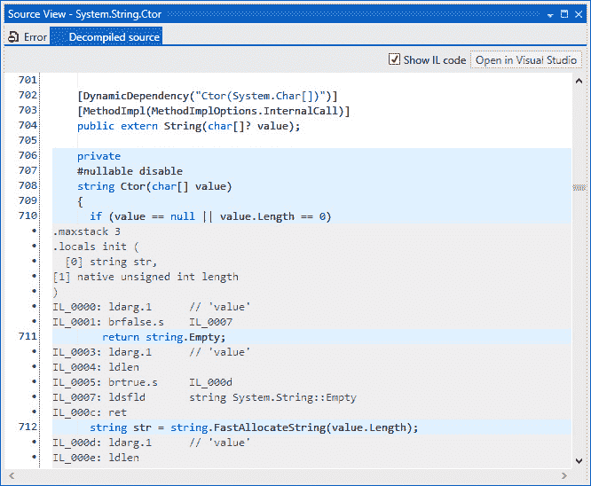

图 5.46 – 显示反编译的 C# 和 IL 源代码的 dotTrace 源视图屏幕

注意

横跨 `String` 的彩色条。根据特定时间点的发生情况，如果使用了多个子系统，则此行可能为多色。此条形也用于显示线程锁定等功能。

1.  现在我们准备调查为什么我们的 UI 会冻结。*图 5.47* 中的紫色线条代表我们的 UI 冻结的时刻：

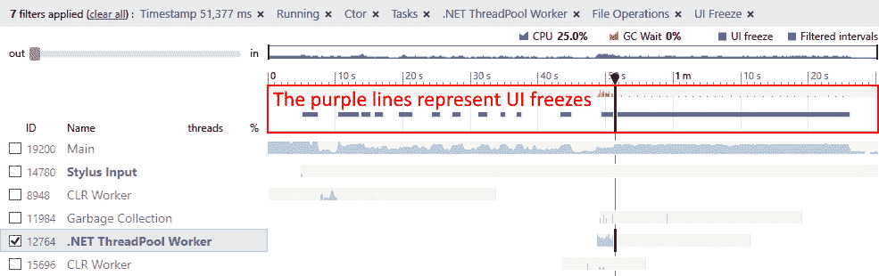

图 5.47 – 显示我们的线程并突出显示 UI 冻结的 dotTrace 过滤视图

我们感兴趣的紫色线条是最后非常长的一条。

1.  在 **过滤器** 部分选择 **事件** | **.NET 内存分配**。

1.  然后，选择 **线程状态** | **运行**。

1.  选择 **子系统** | **用户代码**，并取消选择其他所有选项。您应该在 **方法和子系统** 下看到以下内容：

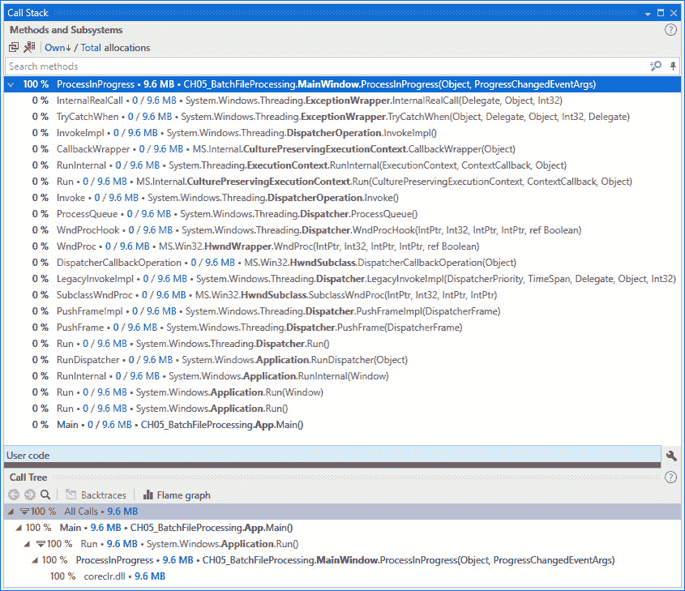

图 5.48 – 突出显示有问题的用户代码的 dotTrace 方法和子系统屏幕

查看前面高亮的方法`ProcessInProgress`，我们在 UI 冻结发生的时间段内 100%地调用它。点击`ProcessInProgress`将显示`MainWindow.xaml.cs`文件的內容。我们的违规代码如下：

```cs
private void ProcessInProgress(
object sender, 
ProgressChangedEventArgs e
)
{
var upd = (ProgressUpdater)e.UserState;
lblProgress.Content = $"File {upd.CurrentFileNmb} of {upd.
    TotalFiles}: {e.ProgressPercentage}%";
} 
```

我们的代码正在更新进度标签的值，该值是传递给方法的`ProgressChangedEventArgs`类型。那么，调用这个方法的是谁呢？它是`FileProcessor`类中的`ProcessFiles`方法：

```cs
...                
for (var i = 0; i < FilePaths.Count; i++)
{
     ...
for (var j = 0; j < _lines.Length; j++)
{
    var line = _lines[j];
    var stringReverser = new StringReverser(line);
    _lines[j] = stringReverser.Reverse();
    if (j % 5 == 0)
    {
        var p = (float)(j + 1) / _lines.Length * 100;
        Worker.ReportProgress((int)p, _updater);
    }
}
File.WriteAllLines(path, _lines);
}
```

此方法遍历用户选择的文件。每个文件逐行读取，一行一行地读取。每行文本都被反转。问题是，我们调用这个方法太频繁了。所以，解决方案是将`(j % 5 == 0)`改为`(j% 1000 == 0)`。

1.  对代码进行更改后重新编译并重新运行分析器。这次，将不会有延迟。您将看到 UI 冻结已被修复。

现在您已经使用了 dotTrace 和 Timeline 配置文件来跟踪并修复了 UI 冻结。在最后一节中，我们将探讨如何使用 dotTrace 来优化应用程序性能和内存流量。

# 使用 dotTrace 优化应用程序性能和内存流量

在本节中，我们将继续跟踪我们的`CH05_BatchFileProcessing`项目。我们已经修复了 UI 冻结，并将运行另一个跟踪以查看是否可以识别任何其他问题。在分析跟踪时，我们将看到产生了大量影响应用程序性能的内存流量。因此，我们将解决这个问题并修复它：

1.  打开 dotTrace。您的前一个会话应该已保存。选择它，然后点击**Run**按钮以开始跟踪。然后，将启动示例应用程序。

1.  选择文本文件，然后点击**Process Files**按钮。

1.  一旦处理完文件，终止应用程序。这将刷新数据并将我们的跟踪加载到跟踪查看器中。然后，关闭 dotTrace。

1.  一旦将跟踪快照加载到**Timeline Viewer**中，点击按钮以**显示快照**。

1.  在**Filters**视图中，选择**Events** | **.NET Memory Allocations and Thread State** | **Running**。

1.  隐藏除我们的**.NET ThreadPool Worker**线程之外的所有线程。

1.  在`System.String`类中。这将是我们`CH05_BatchFileProcessing.StringReverse.Reverse()`调用的结果。*图 5.49*显示了我们的跟踪结果，我们可以看到我们的方法和它们产生的内存流量百分比：

![Figure 5.49 – The dotTrace Timeline Viewer Call Stack screen showing our methods and memory traffic percentage]

![img/Figure_5.49_B16617.jpg]

![Figure 5.49 – The dotTrace Timeline Viewer Call Stack screen showing our methods and memory traffic percentage]

在这个方法中，两个不同的 MB 大小是我们自己的内存分配，不包括从该方法中调用的子方法中的内存分配/该方法或任何从该方法中调用的子方法分配的内存量。正如你所看到的，内存分配是`Reverse()`方法和`ProcessFiles()`方法。

1.  在 Visual Studio 中打开这个类。`Reverse()`方法的代码如下：

    ```cs
    public string Reverse()
    {
    char[] charArray = _original.ToCharArray();
    string stringResult = null;
    for (int i = charArray.Length; i > 0; i--)
    {
        stringResult += charArray[i - 1];
    }
    return stringResult;
    }
    ```

如你所见，这种方法通过将字符串分配给数组来反转字符串。然后，数组以反向迭代，每个字符通过字符串连接分配给字符串。这正是我们应用程序性能的问题所在。

有充分的文档记录表明，构建字符串的最高效方式是使用`StringBuilder`类。我们在这里也可以这样做。然而，还有另一种方法可以提高这个方法的表现。将现有的`Reverse()`字符串方法替换为以下版本：

```cs
public string Reverse()
{
     char[] charArray = _original.ToCharArray();
     Array.Reverse(charArray);
return new string(charArray);
}
```

在我们修改后的代码中，我们反转数组，并从反转后的数组返回一个新的字符串。

1.  在**发布**模式下构建你的项目，然后运行一个新的跟踪。*图 5.50*显示了新跟踪的结果：

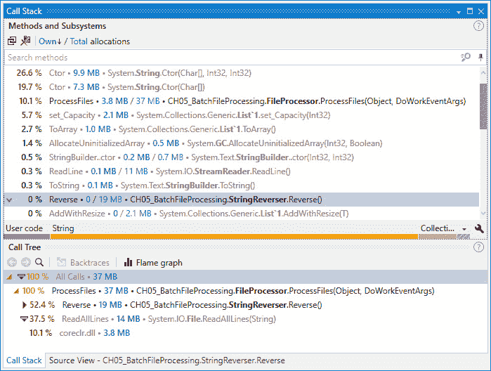

图 5.50 – 显示我们改进性能的新跟踪

从我们的跟踪中我们可以看到，`ProcessFiles`方法的内存分配从**2.9 MB**/**255 MB**，生成**1.2%**的内存流量，到**3.8 MB**/**37 MB**的内存分配，生成**10.1%**的内存流量。

此外，我们的`Reverse()`方法从分配**73 MB**/**252 MB**，生成**28.5%**的内存流量，到分配**0 MB**/**19 MB**的内存，生成**0%**的内存流量。

那是一个很好的性能提升！

在本章中，我们介绍了各种代码测量和分析的方法。通过我们获得的数据，我们成功地修复了由于未取消订阅事件处理程序而导致的内存泄漏，修复了由于 UI 更新过于频繁而导致的 UI 冻结，并改进了由于我们批量处理字符串反转的方式而引起的应用程序性能和内存流量。现在，是时候总结我们所学的知识了。

# 摘要

我们从查看我们可用的各种代码指标开始，进行应用程序分析和跟踪。不同的工具有不同的指标可用。这些指标涵盖了应用程序、程序集、命名空间、类型、方法和字段。

然后，我们继续研究我们如何执行静态代码分析。我们使用 Visual Studio 2022 内置的代码分析工具演示了静态代码分析。我们看到了如何生成以下指标：可维护性指数、循环复杂度、继承深度、类耦合、源代码行数和可执行代码行数。

我们接下来探讨了内存转储的生成以及如何在 Visual Studio 2022 中查看它们。我们可以查看转储时间、转储位置、进程名称、处理器架构、任何异常信息、操作系统版本和 CLR 版本。此外，我们还可以查看已加载的模块名称及其版本和物理路径。

接下来，我们探讨了如何在调试会话期间打开 **模块** 窗口。**模块** 窗口显示了模块的名称和路径，模块是否已优化，是否为用户代码或系统代码，其符号状态、顺序、版本、进程和 AppDomain。我们还看到了 **调试** | **窗口** 菜单中其他可用的选项，这些选项增加了我们的调试能力。

然后，我们探讨了名为 Visual Studio 2022、JetBrains dotMemory 和 JetBrains dotTrace 的跟踪和诊断工具。这些工具提供了全面的优秀调试体验，为我们提供了追踪任何类型错误所需的所有信息，包括导致内存泄漏和其他内存相关问题的错误。

接下来，我们探讨了 `dotnet-counters` 的使用方法。我们学习了如何列出可监控的 .NET 进程。然后，我们看到了如何列出可用的已知 .NET 计数器。在我们的结论部分，我们收集数据并将数据保存到文件中，以便进行后续分析。

最后，我们通过三个示例来演示如何使用 JetBrains dotMemory 和 JetBrains dotTrace 修复内存泄漏和 UI 冻结问题，提高性能，并减少内存流量。

在下一章中，我们将详细探讨 **集合** 框架。然而，在此之前，请花时间进一步阅读并回答以下问题，以巩固您所学的内容。

# 问题

1.  代码指标覆盖了我们计算机程序的哪些方面？

1.  Visual Studio 2022 静态代码分析产生哪些指标？

1.  我们可以从 Visual Studio 生成的 minidumps 中查看哪些类型的事物？

1.  **模块** 窗口中有哪些可用的列？

1.  执行我们之前提到的各种诊断操作的四款调试、分析和跟踪工具的名称是什么？

1.  我们使用 .NET 计数器执行了哪些操作？

# 进一步阅读

+   调试 Visual Studio 2019：[`docs.microsoft.com/en-us/visualstudio/get-started/csharp/tutorial-debugger?view=vs-2019`](https://docs.microsoft.com/en-us/visualstudio/get-started/csharp/tutorial-debugger?view=vs-2019).

+   Visual Studio 调试器中的转储文件：https://docs.microsoft.com/visualstudio/debugger/using-dump-files?view=vs-2019.

+   `dotnet-counters`: https://docs.microsoft.com/en-us/dotnet/core/diagnostics/dotnet-counters.

+   .NET Core 计数器内部机制：如何在监控管道中集成计数器: [`medium.com/criteo-engineering/net-core-counters-internals-how-to-integrate-counters-in-your-monitoring-pipeline-5354cd61b42e#:~:text=dotnet-counters%3A%20collect%20the%20metrics%20corresponding%20to%20some%20performance,how%20to%20fetch%20them%20via%20the%20EventPipe%20infrastructure`](https://medium.com/criteo-engineering/net-core-counters-internals-how-to-integrate-counters-in-your-monitoring-pipeline-5354cd61b42e#:~:text=dotnet-counters%3A%20collect%20the%20metrics%20corresponding%20to%20some%20performance,how%20to%20fetch%20them%20v).

+   *JetBrains dotTrace*: https://www.jetbrains.com/profiler/.

+   *JetBrains dotMemory*: [`www.jetbrains.com/dotmemory/`](https://www.jetbrains.com/dotmemory/).

+   *ndepend*: [`www.ndepend.com/`](https://www.ndepend.com/).

+   .NET 源代码分析概述: [`docs.microsoft.com/dotnet/fundamentals/code-analysis/overview`](https://docs.microsoft.com/dotnet/fundamentals/code-analysis/overview).
