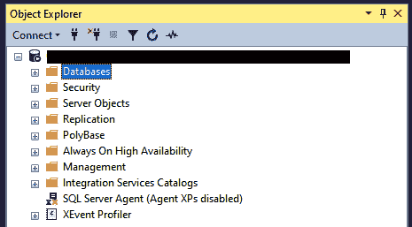
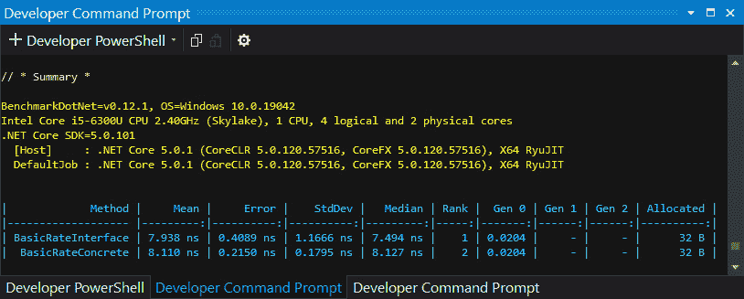
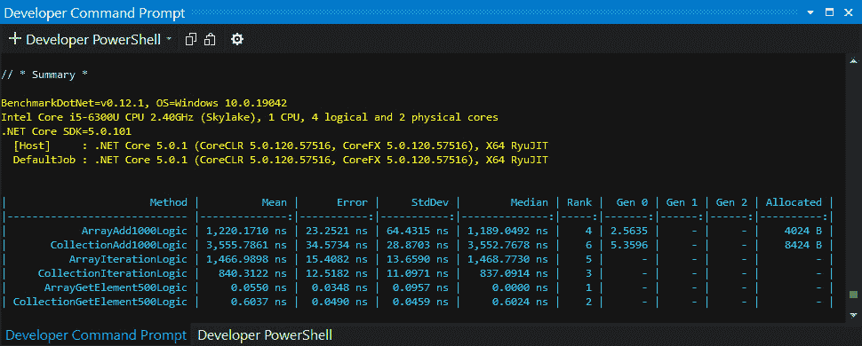
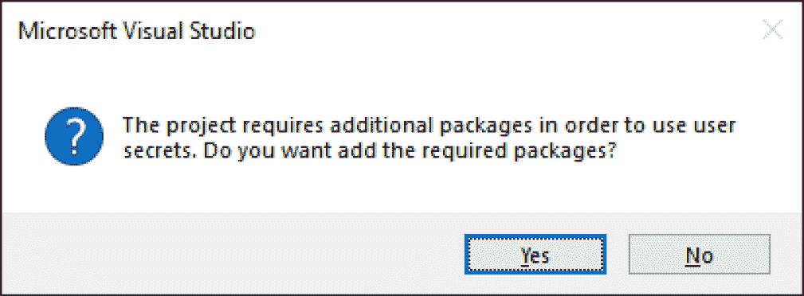
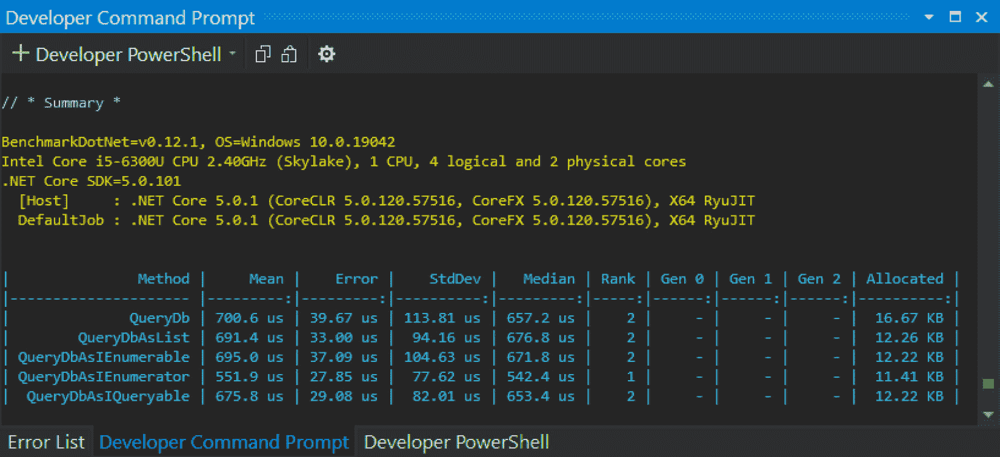
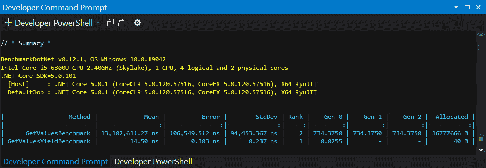
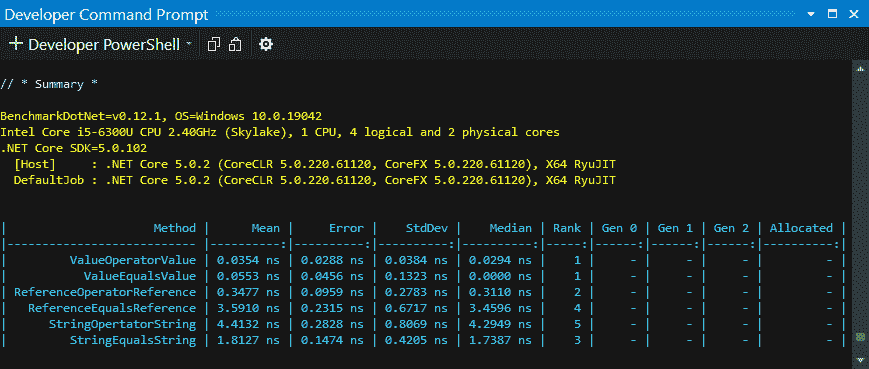

# *第六章*: .NET 集合

集合是 .NET 的一个重要组成部分。使用这些集合的方式有很多种。Microsoft .NET 在处理数据集、数组、列表、字典、栈和队列等事物时，大量使用了数组和集合。您很难编写一个不使用集合框架的 C# 程序。使用集合和数组的不同方式在性能下降和性能提升方面有所不同。因此，了解何时使用数组以及何时使用集合将成为您 C# 和 .NET 编程技能的一个重要方面。

在本章中，您将学习如何提高您的集合操作性能。通过使用 `BenchmarkDotNet` 与代码的不同版本，您将能够看到性能差异，并处于选择最适合您需求的最佳方法的位置。

我们将在本章中涵盖以下主题：

+   `System.Collections`、`System.Collections.Generic`、`System.Collections.Concurrent` 和 `System.Collections.Specialized` 命名空间。

+   `IEnumerable` 和 `IQueryable`。本节将向您展示如何使用样本数据开发我们的示例数据库，这些数据将在本章的后续部分使用。

+   **决定使用接口还是具体类**: 在本节中，您将基准测试使用类和接口的性能，然后您将能够决定最适合您需求的方法。

+   **决定使用数组还是集合**: 使用数组和集合各有优缺点。在本节中，您将基准测试数组和集合的性能，并根据性能需求决定使用哪种。

+   **使用索引器访问对象**: 在本节中，我们将讨论通过使用索引器以与访问数组项相同的方式访问对象。

+   **比较 IEnumerable 和 IEnumerator**: 在本节中，我们将使用 IEnumerable 和 IEnumerator 进行迭代基准测试。您将看到这两种枚举方式之间确实存在性能差异。

+   **数据库查询性能**: 在本节中，我们将使用五种不同的方法查询数据库，基准测试它们的性能，以查看哪种方法产生最快的性能。

+   `yield` 关键字及其与您应用程序性能的关系，尤其是在迭代集合和数组时。

+   **学习并发与并行之间的区别**: 在本节中，您将了解并发与并行之间的区别，并学习何时使用一种而非另一种。

+   **学习 Equals() 和 == 之间的区别**: 在本节中，您将了解不同相等运算符之间的区别，并学习何时使用一种而非另一种。

+   **研究 LINQ 性能**：LINQ 是一种 C#查询语言，在处理集合时被广泛使用，但它的速度可能快或慢，这取决于你编写查询的方式。在本节中，你将学习如何基准测试执行相同类型查询的不同方式。通过这样做，你将看到不同方式编写相同查询的性能差异。

到本章结束时，你将能够做到以下几点：

+   描述可用的不同集合及其用途

+   在使用接口和集合之间进行选择

+   理解数组和集合之间的权衡

+   编写索引器

+   选择最适合你特定需求的迭代形式

+   使用`yield`关键字

+   了解用于不同类型相等性检查的相等运算符

+   提高 LINQ 查询性能

# 技术要求

要跟随本章内容，你需要访问以下工具：

+   Visual Studio 2022

+   SQL Server（任何版本）Express 或更高版本

+   SQL Server Management Studio

+   本书源代码：[`github.com/PacktPublishing/High-Performance-Programming-in-CSharp-and-.NET/tree/master/CH06`](https://github.com/PacktPublishing/High-Performance-Programming-in-CSharp-and-.NET/tree/master/CH06)

# 理解不同的集合提供

集合是一组可以作为一个逻辑单元处理的记录。逻辑记录组的例子包括人、国家、产品、成分、书籍、作者等等。

主要有四种类型的集合，如下所示：

+   **基于索引**的集合，例如数组或列表。基于索引的集合包含一个内部索引。索引可以是数字或基于字符串的。基于索引的集合通常使用数字索引来访问。数字索引是从零开始的。这意味着集合的索引将从零开始，对于每个后续记录，其值将按顺序增加一。可以使用数字索引访问的集合包括数组和列表。

+   `Hashtable`和`SortedList`使用键来查找存储在集合中的值。例如，如果你有一个产品集合，你可以通过使用在将产品添加到键/值对集合时分配的产品代码作为键来访问所需的产品。

+   **优先级**集合，例如栈或队列。优先级集合允许你以特定顺序存储和提取记录。队列使用**先进先出**（**FIFO**）顺序，而栈使用**后进先出**（**LIFO**）顺序。

+   `CollectionsUtil`类，它创建忽略字符串大小写的集合，以及`ListDictionary`类，它适用于包含少于 10 个项目的集合。它使用单链表实现`IDictionary`。

.NET 集合框架由传统的 `System.Collections` 命名空间以及较新的 `System.Collections.Generic`、`System.Collections.Concurrent` 和 `System.Collections.Specialized` 命名空间组成。在我们深入研究集合的性能之前，重新熟悉上述每个命名空间中可用的不同集合是个好主意。

## `System.Collections` 命名空间

`System.Collections` 命名空间包含各种类、结构和接口。在本节中，我们将简要介绍可用的内容。此命名空间中的集合不是线程安全的。如果您需要线程安全的集合，最好使用 `System.Collections.Concurrent` 命名空间中的集合，正如微软所建议的！

`ICollection` 接口定义了所有非泛型集合的大小、枚举器和同步方法。要比较两个对象，您可以实现 `IComparer` 接口。您可以使用 `Idictionary` 来表示非泛型键/值对集合。要枚举非泛型字典，您可以使用 `IDictionaryEnumerator` 接口。非泛型集合的简单迭代由 `IEnumerator` 接口提供，而对象之间的相等性是通过 `IEqualityComparer` 接口实现的。`IList` 接口用于实现可以通过索引单独访问的对象的非泛型集合。对象的结构比较和对象的结构相等比较分别使用 `IStructuralComparable` 和 `IStructuralEquatable` 接口实现。

+   `ArrayList` 类使用可以按需增长和缩小的动态数组实现 `IList` 接口。

+   在（`0`）和关闭（`1`），分别由布尔值 `false` 和 `true` 表示，由 `BitArray` 类管理。

+   要在忽略字符串大小写的情况下比较两个对象，您可以使用 `CaseInsensitiveComparer` 类。使用 `CaseInsensitiveHashCodeProvider` 生成忽略字符串大小写的算法的哈希码。

+   在构建强类型集合时，从 `CollectionBase` 类继承。

+   `Comparer` 类用于对两个对象进行大小写敏感的字符串比较以确定它们是否相等。

+   在开发强类型键/值对集合时，使用 `DictionaryBase` 作为抽象类。

+   通过基于键的哈希码组织键/值对的集合由 `Hashtable` 类表示。

+   `Queue` 类提供了一个具有先进先出（FIFO）访问的集合。

+   `ReadOnlyCollectionBase` 抽象类被用作强类型非泛型、只读集合的基类。

+   使用 `SortedList` 类来保存按键排序且可以通过键或索引访问的键/值对集合。

+   如果您需要为您的集合提供后进先出（LIFO）访问，请使用 `Stack` 类。

+   要结构性地比较两个集合对象，您可以使用 `StructuralComparisons` 类。

+   `DictionaryEntry` 结构定义了一个可以设置或检索的字典键/值对。

    注意

    `IHashCodeProvider` 现已标记为过时，并且不再由 Microsoft 推荐用于新开发。Microsoft 建议您使用 `IEqualityComparer` 和 `IEqualityComparer<T>` 接口。

我们现在知道了 `System.Collections` 命名空间中有什么可用。现在，让我们看看 `System.Collections.Generic` 命名空间中有什么可用。

## `System.Collections.Generic` 命名空间

`System.Collections.Generic` 命名空间中提供的类和接口提供了强类型集合，其性能优于 `System.Collections` 命名空间中的类。此命名空间包含许多类、结构和接口。

`CollectionExtensions` 类为泛型集合提供了扩展方法。要比较两个对象，您可以使用实现 `IComparer<T>` 接口的 `Comparer<T>` 类。`IComparer<T>` 接口定义了实现比较两个对象的方法类型。

`IDictionary<TKey, TValue>` 接口提供了实现泛型字典的方法。要使字典为只读，它必须实现 `IReadOnlyDictionary<TKey, TValue>` 接口。键值对的集合由 `Dictionary<TKey, TValue>` 类表示。`Dictionary<TKey, TValue>.KeyCollection` 不能被继承，并代表 `Dictionary<TKey, TValue>` 集合中的键集合。最后，`Dictionary<TKey, TValue>.ValueCollection` 不能被继承，并代表 `Dictionary<TKey, TValue>` 集合中的值集合。

`IEqualityComparer<T>` 接口定义了您可以使用的方法来比较对象的相等性。为 `IEqualityComparer<T>` 接口的实现提供了一个基类，称为 `EqualityComparer<T>`。

`HashSet<T>` 表示一组值。当用于访问集合的键在正在搜索的集合中找不到时，将引发 `KeyNotFoundException`。使用 `KeyValuePair` 类生成键/值对实例。对于双向链表，请使用 `LinkedList<T>` 类。不可继承的 `LinkedListNode<T>` 类代表 `LinkedList<T>` 类型集合中的一个节点。

`IList<T>` 表示一个对象集合，用于实现可以通过索引访问的列表。只读列表实现了 `IReadOnlyList<T>` 接口。当您需要一个强类型集合，它支持搜索、排序和操作列表时，请使用 `List<T>` 类。对于先进先出（FIFO）集合，请使用 `Queue<T>` 类。

`ReferenceEqualityComparere` 是一个 `IEqualityComparer<T>`，它在比较两个对象实例时通过调用 `ReferenceEquals(Object, Object)` 而不是通过调用 `Equals(Object)` 来使用引用相等性。

按键排序的键/值对集合由 `SortedDictionary<TKey, TValue>` 类表示。此类集合由 `SortedDictionary<TKey, TValue>.KeyCollection` 表示，不能被继承。收集到的值由 `SortedDictionary<TKey, TValue>.ValueCollection` 表示，也不能被继承。

`SortedList<TKey, TValue>` 类表示一个按键排序的键/值对集合，基于关联的 `IComparer<T>` 实现进行排序。维护在排序顺序中的对象集合由 `SortedSet<T>` 类表示。`Stack<T>` 类为同一类型的实例提供 LIFO 操作。

对于各种通用集合类，有几种结构可供使用，允许您遍历集合中的元素。这些结构被称为枚举器。

通过实现 `IAsyncEnumerable<T>` 接口，可以异步遍历特定类型的值。`IAsyncEnumerator<T>` 提供了遍历泛型集合所需的必要支持。`ICollection<T>` 定义了操作泛型集合所需的方法。只读的强类型集合实现了 `IReadOnlyCollection<T>` 接口。集合实现了 `ISet<T>` 接口，而只读集合实现了 `IReadOnlySet<T>` 接口。

既然我们已经了解了 `System.Collections.Generic` 命名空间提供的内容，让我们将注意力转向 `System.Collections.Concurrent` 命名空间。

## `System.Collections.Concurrent` 命名空间

`System.Collections.Concurrent` 命名空间中的集合是线程安全的。当多个线程并发访问集合时，应使用此命名空间中的集合，而不是 `System.Collections` 和 `System.Collections.Generic` 命名空间中的集合。

注意

这些集合的扩展方法和显式接口实现不一定保证是线程安全的。为了确保线程安全，在这些情况下可能需要同步。

`IProducerConsumerCollection<T>` 定义了在生产者/消费者使用（也称为发布者/订阅者使用）中形成线程安全集合操作基础的方法。高级抽象，如 `BlockingCollection<T>` 类，可以使用此集合作为其底层存储机制。

`BlockingCollection<T>` 类为实现了 `IProducerConsumerCollection<T>` 接口的线程安全集合提供了阻塞和边界能力。

通过 `EnumerablePartitionerOptions` 枚举指定了控制分区器缓冲行为的选择项。

`Partitioner` 类提供了数组、列表和可枚举分区策略。`Partitioner<Tsource>` 类提供了一种将数据源分割成多个分区的方式，而 `OrderablePartioner<Tsource>` 则将可排序的数据源分割成多个分区。

`Concurrent<T>`类包含一个线程安全的对象无序列表。线程安全的 FIFO 集合使用`ConcurrentQueue<T>`类，而线程安全的 LIFO 集合使用`ConcurrentStack<T>`类。要线程安全地访问键/值对，请使用`ConcurrentDictionary<Tkey, Tvalue>`类。

有了这些，我们已经涵盖了`System.Collections.Concurrent`命名空间。现在，让我们看看`System.Collections.Specialized`命名空间。

## `System.Collections.Specialized`命名空间

`System.Collections.Specialized`命名空间包含专用和强类型的集合。让我们看看它有什么可以提供的。

`CollectionChangedEventManager`类提供了一个`WeakEventManager`实现。通过使用`WeakEventListener`模式，您可以附加集合更改事件的监听器。

要构建一个忽略字符串大小写的字符串集合，您可以使用`CollectionUtils`类。

当集合较小时，`HybrdDictionary`类会改变其行为；当集合增长并变得较大时，它也会改变行为。它是通过在集合较小时使用`ListDictionary`实现`IDictionary`，在集合增长并变得较大时使用`Hashtable`来实现的。

对于少于 10 个项的情况，您可以使用`ListDictionary`，它通过使用单链表实现`IDictionary`。

要保存集合的字符串键集合，请使用`NameObjectCollectionBase.KeysCollection`。

当您需要为`CollectionChanged`事件提供数据时，请使用`NotifyCollectionChangedEventArgs`类。

当您有一个需要通过键或索引访问的有序键/值对集合时，请使用`OrderedDictionary`。

您可以使用`StringCollection`类来保存字符串集合，并且可以使用`StringEnumerator`类对`StringCollection`类进行简单迭代。

要获取键和强类型字符串值的哈希表，请使用`StringDictionary`类。

要在 32 位内存中存储布尔值或小整数，您可以使用`BitVector32`结构。您可以使用向量的`BitVector32.Section`存储整数。

键/值对的索引集合由`IOrderedDictionary`接口表示。`INotifyCollectionChanged`接口用于通知监听器集合的动态更改，例如当项目被添加、修改或删除时。`NotifyCollectionChangedAction`枚举描述了导致`CollectionChanged`事件被触发的行为。

现在，让我们看看自定义集合并编写一个。

## 创建自定义集合

要创建自定义集合，你必须从 `CollectionBase` 继承。`CollectionBase` 类有一个只读的 `ArrayList` 属性，称为 `InnerList`，并且实现了 `IList`、`ICollection` 和 `IEnumerable` 接口。然后，你可以添加自己的 `Add`、`Remove`、`Clear` 和 `Count` 方法。我们将在我们的项目中这样做。我们将创建一个非常简单的自定义集合，它继承自 `CollectionBase`，这样你就可以看到创建自定义集合是多么容易。按照以下步骤操作：

1.  在 `CustomCollections` 文件夹下添加一个名为 `CustomCollections` 的新类，使其继承自 `CollectionBase`。

1.  将 `Add(object item)` 方法添加到类中：

    ```cs
    public void Add(object item)
    {
          InnerList.Add(item);
    }
    ```

此方法将一个项目添加到 `InnerList` 中，这是从 `CollectionBase` 类继承而来的。

1.  将 `Remove(object item)` 方法添加到类中：

    ```cs
    public void Remove(object item)
    {
          InnerList.Remove(item);
    }
    ```

此方法从继承的 `InnerList` 中移除一个项目。

1.  添加 `Clear()` 方法：

    ```cs
    public new void Clear()
    {
    InnerList.Clear();
    }
    ```

此方法清除 `InnerList` 中的所有项目。

1.  添加 `Count()` 方法：

    ```cs
    public new int Count()
    {
          return InnerList.Count;
    }
    ```

此方法返回 `InnerList` 中项目数量的计数。

如你所见，创建自定义集合并不一定困难。我们的实现非常简单和基础。然而，这样的类可以被设计为只持有特定类型，而不是泛型对象类型。你也可以使你的类成为泛型，以便它接受实现特定接口的类。

以下是由微软撰写的关于通过实现 `ICollection` 来实现自定义集合的详细文章：[`docs.microsoft.com/troubleshoot/dotnet/csharp/implement-custom-collection.`](https://docs.microsoft.com/troubleshoot/dotnet/csharp/implement-custom-collection.)

随着你阅读本章内容，你将看到集合的不同方面。你还将测量它们的性能。这样，当你创建自定义集合时，你可以为当前任务选择最有效的操作方式。

现在我们已经简要介绍了 .NET 集合框架中不同集合的提供情况，让我们来看看什么是 Big O 表示法。

# 理解 Big O 表示法

Big O 表示法用于确定算法效率。它决定了与输入相关的时间尺度。常数时间等于 Big O 表示法值 O(1)。随时间线性扩展的数据操作，根据操作的大小，具有 Big O 表示法值 (*N*)，其中 *N* 等于正在处理的数据量。

例如，如果你正在遍历数组或集合中的几个元素，你会使用 O(*N*)，这是一个线性时间，其中*N*是数组或集合的大小。如果一个迭代包含如*x*和*y*这样的成对元素，其中你在迭代中遍历*x*，然后是*y*，那么你的大 O 表示法将是 O(*N*2)。另一个场景是确定收获一块正方形土地所需的时间。这可以写成 O(*a*)，其中*a*是土地面积。或者，你也可以将大 O 表示法写成 O(*s*2)，其中*s*是一个尺寸的长度。

使用大 O 表示法时需要考虑一些规则：

+   你的算法中的不同步骤被相加。因此，如果步骤 1 需要 O(*a*)时间，步骤 2 需要 O(*b*)时间，那么你的算法的大 O 表示法将是 O(*a+b*)。

+   丢弃常数。例如，如果你算法中有两个都是常数的操作，你不需要写 O(*2N*)。表示法仍然是 O(*N*)。

+   如果你有不同的输入，这些输入是不同的变量，例如集合 a 和集合 b，那么你的大 O 表示法将是 O(*a*b*)。

+   丢弃非主导项。所以，O(*n*2)等同于 O(*n + n*2*)，等同于(*n*2*+n*2)。

现在我们已经了解了大 O 表示法是什么以及我们可用的各种集合，让我们看看如何为我们的工作项选择正确的集合。

## 选择正确的集合

在内存中处理多个数据项时，性能的关键是选择正确的存储机制，以提供满足你要求的最快处理时间。以下是一系列不同类型的集合及其优势，以帮助你为正确的任务选择正确的集合：

+   `Dictionary`是一个无序的集合，具有连续的存储，并且可以通过键直接访问。字典使用键的查找效率为 O(1)，其操作效率也为 O(1)。字典最适合用于高性能查找。

+   `HashSet`是无序的，具有连续的存储，并且可以通过键直接访问。使用键的查找效率为 O(1)，操作效率为 O(1)。`HashSet`是一个独特的无序集合，称为`Dictionary`，除了键和值是同一个对象。

+   `LinkedList`允许用户完全控制其顺序，没有连续的存储，并且不能直接访问。它的查找效率值为 O(*n*)，操作效率为 O(1)。当你需要插入或删除项目且不需要直接访问时，最好使用列表。

+   `List`允许用户完全控制其顺序，具有连续的存储，并且可以通过索引直接访问。使用索引的查找效率为 O(1)，使用值的查找效率为 O(*n*)。其操作效率为 O(*n*)。当需要直接访问、列表较小且不需要排序时，最好使用此列表。

+   `Queue`根据 FIFO 排序，具有连续存储，并且只能从队列的前端直接访问。它在队列前端具有 O(1)的查找效率，操作索引为 O(1)。它基本上与`List<T>`相同，只是它只使用 FIFO 进行处理。

+   `SortedDictionary`是有序的，没有连续存储，并且可以使用键直接访问。它使用键的查找效率为 O(*log n*)，操作效率为 O(*log n*)。这个集合在速度和排序之间做出了权衡，并使用二叉搜索树。

+   `SortedList`是有序的，具有连续存储，并且可以通过键直接访问。它使用键的查找效率为 O(*log n*)，操作效率为 O(*n*)。树作为数组实现，这使得在预加载数据上的查找更快，但在加载时较慢。

+   `SortedSet`是有序的，没有连续存储，并且可以通过键直接访问。它使用键的查找效率为 O(*log n*)，操作效率为 O(*log n*)。它是一个独特的有序集合，类似于`SortedDictionary`，但键和值是相同的对象。

+   `Stack`根据 LIFO 排序，具有连续存储，并且只能从堆栈的顶部直接访问。它具有 O(1)的顶部项查找效率，操作效率为 O(1)*。它基本上与`List<T>`相同，只是它只使用 LIFO 进行处理。

    注意

    对于关键任务代码，建议您避免在`System.Collection`命名空间中使用类。相反，您应该使用`System.Collections.Generic`命名空间中的类。尽管这听起来像是一条经过验证的建议，但建议您运行基准测试以查看哪种方法最适合您的特定场景。

现在您已经了解了数组和集合，在我们从性能角度继续查看集合之前，我们将设置我们的示例数据库。

# 设置我们的示例数据库

在本章中，我们将演示不同的集合接口如何处理数据之间的差异。为了我们的演示，我们需要访问数据库数据。为此，我们将创建一个数据库，向其中添加一个表，并用数据填充它。我们将使用 SQL Server 作为我们的数据库引擎，并使用 SQL Server Management Studio 来开发我们的示例数据库。

要添加我们的数据库，请按照以下步骤操作：

1.  打开**SQL Server Management Studio**并连接到您的数据库引擎。

1.  在**对象资源管理器**中的**数据库**文件夹上右键单击，如下面的截图所示：



图 6.1 – SQL Server Management Studio – 对象资源管理器

1.  从上下文菜单中选择**新建数据库**。这将显示**新建数据库**对话框，如下面的截图所示：

![图 6.2 – SQL Server Management Studio – 新建数据库对话框

![img/B16617_Figure_6.2.jpg]

图 6.2 – SQL Server Management Studio – 新数据库对话框

1.  在 **数据库名称** 下输入 `SampleData`，然后点击 **确定** 按钮创建数据库。

1.  通过展开 `Products` 定位数据库，如下所示：

![Table 6.1 – The Products table's design]

![img/Table_1.1.jpg]

表 6.1 – 产品表的设计

1.  **保存** 表，然后展开 **表** 文件夹。右键单击 **产品** 表，选择 **编辑前 n 条记录**，其中 *n* 将是配置要编辑的记录数。默认情况下为 200。

1.  将以下表中的数据添加到 **产品** 表：

![Table 6.2 – The Product table's row data]

![img/Table_6.2.jpg]

表 6.2 – 产品表的行数据

现在我们有一个包含数据的单个表数据库，我们将在本章后面使用。现在，让我们从性能的角度理解集合。让我们首先看看我们如何决定使用数组还是集合。

# 在接口和具体类之间做出决定

在本节中，我们将展示使用接口声明而不是具体类声明来声明集合可以提供更好的基于时间的性能。我们将通过基准测试使用 `IList` 接口生成的集合以及使用 `List` 具体类，以便您可以看到不同方法性能的差异。按照以下步骤操作：

1.  在 `CH06_Collections` 项目中，添加一个名为 `ConcreteVsInterface` 的新文件夹。

1.  在 `ConcreteVsInterface` 文件夹中，添加 `ITax` 接口：

    ```cs
    internal interface ITax
    {
          int Id { get; set; }
          TaxType TaxType { get; set; }
          TaxRate TaxRate { get; set; }
          decimal LowerLimit { get; set; }
          decimal UpperLimit { get; set; }
          decimal Percentage { get; set; }
          decimal Calculate(decimal amount);
    }
    ```

此接口定义了一个合同，各种具体税类都必须遵守。它强制执行影响分析，因为此接口的更改将影响所有实现它的类。

1.  接下来，添加 `BaseTax` 类：

    ```cs
    internal abstract class BaseTax : ITax
    {
        public int Id { get; set; }
        public TaxType TaxType { get; set; }
        public TaxRate TaxRate { get; set; }
        public decimal LowerLimit { get; set; }
        public decimal UpperLimit { get; set; }
        public decimal Percentage { get; set; }
        public abstract decimal Calculate(decimal amount);
    }
    ```

这个抽象类实现了 `ITax` 接口，但将 `Calculate(decimal amount)` 标记为抽象，因此其实现留给子类。

1.  现在，添加 `TaxRate` 枚举：

    ```cs
    using System;
    [Flags]
    internal enum TaxRate
    {
        TaxFreePersonalAllowance,
        StarterRate,
        BasicRate,
        IntermediateRate,
        HigherRate,
        AdditionalRate
    }
    ```

`TaxRate` 枚举提供了英国所得税的不同税率类型。

1.  添加 `TaxType` 枚举：

    ```cs
    [Flags]
    internal enum TaxType
    {
        CorporationTax,
        ValueAddedTax,
        IncomeTax,
        NationInsuranceContributions,
        ExciseDuties,
        RoadTax,
        StampDuty
    }
    ```

`TaxType` 接口提供了不同种类的英国税收。添加 `BaseRate` 类。这个类将继承自 `BaseTax` 类。

1.  然后，添加以下构造函数：

    ```cs
    public BasicRate()
    {
        this.LowerLimit = 14550M;
        this.UpperLimit = 24944M;
        this.TaxType = TaxType.IncomeTax;
        this.TaxRate = TaxRate.BasicRate;
        this.Percentage = 0.2M;
    }
    ```

此构造函数将 `BaseClass` 中包含的属性设置为适用于基本税率所得税的值。

1.  现在，实现 `Calculate(decimal amount)` 方法：

    ```cs
    public override decimal Calculate(decimal amount)
    {
          if (Percentage > 1)
                throw new Exception("Invalid percentage. 
                    Percentage must be between 0 and 1.");
    if (amount < LowerLimit & amount > UpperLimit)
        return 0;
    return Percentage * amount;
    }
    ```

此方法检查百分比是否小于一，如果不小于一则抛出异常。检查个人应税收入的下限和上限。如果金额超出此范围，则返回零。然后返回应税收入的税额，并退出方法。

1.  添加一个名为 `TaxMan` 的新类：

    ```cs
    using BenchmarkDotNet.Attributes;
    using BenchmarkDotNet.Engines;
    using BenchmarkDotNet.Order;
    using CH06_Collections.Linq;
    using System.Collections.Generic;
    using System.Threading;
    [MemoryDiagnoser]
    [Orderer(SummaryOrderPolicy.FastestToSlowest)]
    [RankColumn]
    public class TaxMan { }
    ```

我们班级现在已配置为使用 `BenchmarkDotNet` 进行基准测试。

1.  添加以下方法：

    ```cs
    [Benchmark]
    public void BasicRateInterface()
    {
          IList<BasicRate> basicRate = new 
              List<BasicRate>();
    }
    ```

`BasicRateInterface()` 方法使用 `IList` 接口声明了一个 `BasicRate` 对象的列表。

1.  添加 `BasicRateConcrete()` 方法：

    ```cs
    [Benchmark]
    public void BasicRateConcrete()
    {
          List<BasicRate> basicRate = new 
              List<BasicRate>();
    }
    ```

`BasicRateConcrete()` 方法使用具体的 `List` 类声明了一个 `BasicRate` 对象的列表。

1.  在 `Program` 类中，注释掉 `Main` 方法中的代码，并添加以下代码行：

    ```cs
    BenchmarkRunner.Run<TaxMan>();
    ```

这行代码将运行我们的基准测试。进行发布构建，然后从命令行运行可执行文件。您应该看到以下输出或类似内容：




图 6.3 – BenchmarkDotNet 汇总报告显示分配 IList<T> 和 List<T> 之间的时间差异

从报告中我们可以看出，接口和具体类实现之间的内存利用率是相同的。但是，通过分配 `IList<T>` 而不是 `List<T>` 可以获得更快的实例化时间。尽管这个值对肉眼来说可能不明显，但如果存在大量的赋值操作，比如在大数据迭代过程中，这个差异将变得更加明显。

现在，让我们看看数组和集合的性能。

# 在使用数组或集合之间做出决定

在本节中，我们将讨论使用数组和集合的优缺点。我们还将执行各种基准测试，以衡量数组和集合的性能。有了基准信息，您就可以做出明智的决定，确定数组或集合最适合您的特定需求。我们将首先查看数组。

使用数组的缺点如下：

+   数组的大小是固定的，这意味着一旦数组的尺寸被改变，其尺寸就不能再改变。

+   由于数组的大小是固定的，因此它们不推荐用于高效内存使用。

+   数组只能持有异构数据类型，数据类型可以是原始类型和对象类型。

+   `object` 类型的数据元素可以持有不同类型的数据元素。

+   数组缺少许多有用的方法。

使用数组的优点如下：

+   数组具有较小的内存占用，并且在 C# 9.0 和 .NET 5 中经历了某些严重的性能改进。

+   然而，由于数组速度快且经过速度改进，当性能很重要时，它们是推荐的。

使用集合的缺点如下：

+   在性能方面，它们不建议用于替代数组。

使用数组的优点如下：

+   集合有效地封装了数组；`generic List<T>` 是一个很好的例子。

+   它们是可增长的，这意味着我们可以根据需要缩小和扩大我们的集合。正因为如此，在高效内存利用方面，集合比数组更受欢迎。

+   集合中的数据元素（项目数据）可以是同构的也可以是异构的。

+   集合类为大多数操作提供了现成的方法支持，并且可以轻松扩展。这里的含义是，数组缺少一些在使用集合时我们免费获得的有用方法。

    注意

    建议您不要使用 `System.Collections` 命名空间中的集合。相反，鼓励您使用 `System.Collections.Generic` 命名空间中的集合。

大多数程序员都熟悉的标准集合是泛型 `List<T>` 类。在本节中，我们将创建一个新的项目。然后，我们将构建一个 `uint` 数组和 `List<uint>` 集合，并通过它们进行迭代。这个过程将使用 `BenchmarkDotNet` 进行基准测试。

我们将对添加项、迭代和从数组和集合中检索项进行基准测试。所以，让我们开始吧：

1.  在项目根目录下添加一个名为 `ArraysVsCollections` 的新类，并包含以下 `using` 语句：

    ```cs
    using BenchmarkDotNet.Attributes;
    using BenchmarkDotNet.Order;
    using System;
    using System.Collections;
    using System.Collections.Generic;
    using System.Linq;
    ```

这些 `using` 语句为我们提供了与数组和集合一起工作以及基准测试它们所需的内容。

1.  添加以下成员变量：

    ```cs
    private int[] array;
    private List<int> collection;
    ```

`int` 数组和 `int` 列表将被用来基准测试添加、获取和迭代数组和集合。

1.  接下来，添加 `GlobalSetup()` 方法：

    ```cs
    [GlobalSetup]
    public void GlobalSetup()
    {
    array = new int[1000];
    collection = new List<int>(1000);
    for (int i = 0; i < 1000; i++)
    {
        array[i] = i;
        collection.Add(i);
    }
    }
    ```

`GlobalSetup()` 方法被 `[GlobalSetup]` 属性标记。这通知 `BenchmarkDotNet` 在所有其他基准方法之前运行此方法。它使用大小为 `1000` 的数组集合初始化，并将当前迭代中的 `i` 值添加到数组和集合中。

1.  虽然我们不会使用 `GlobalCleanup()` 方法，但我们添加它以保持完整性，这样您就知道如何在基准测试时执行清理操作：

    ```cs
    [GlobalCleanup]
    public void GlobalCleanup()
    {
    // Disposing logic
    }
    ```

`GlobalCleanup()` 方法是您提供清理逻辑的地方，如果需要的话。

1.  现在，添加 `ArrayAdd1000Logic()` 方法：

    ```cs
    [Benchmark]
    public void ArrayAdd1000Logic1()
    {
    int[] list = new int[1000];
    for (int i = 0; i < 1000; i++)
    {
        list[i] = i;
    }
    }
    ```

`ArrayAdd1000Logic()` 方法声明了一个包含 1000 个 `int` 值的数组，随后对数组中的每个元素添加整数值。

1.  添加 `CollectionAdd1000Logic()` 方法：

    ```cs
    [Benchmark]
    public void CollectionAdd1000Logic()
    {
    Ilist<int> list = new new List<int>();
    for (int i = 0; i < 1000; i++)
          list.Add(i)
    }
    ```

`CollectionAdd1000Logic()` 方法声明了一个 `int` 元素列表。然后，它使用 `for` 循环循环 1,000 次，并将当前值添加到集合中。

1.  添加 `ArrayIterationLogic()` 方法：

    ```cs
    [Benchmark]
    public int ArrayIterationLogic()
    {
    int res = 0;
    for (int i = 0; i < 1000; i++)
        res += array[i];
    return res;
    }
    ```

`ArrayIterationLogic()` 方法声明了一个 `int` 变量，并将其赋值为 `0`。使用 `for` 循环迭代 1,000 次，并将数组在索引位置上的值添加到 `res` 值中。一旦迭代完成，返回 `res` 变量。

1.  现在，添加 `CollectionIterationLogic()` 方法：

    ```cs
    [Benchmark]
    public int CollectionIterationLogic()
    {
    int res = 0;
    for (int i = 0; i < 1000; i++)
        res += collection[i];
    return res;
    }
    ```

`CollectionIterationLogic()` 声明了一个 `int` 变量，并将其赋值为 `0`。使用 `for` 循环迭代 1,000 次，并将数组在索引位置上的值添加到 `res` 值中。一旦迭代完成，返回 `res` 变量。

1.  添加 `ArrayGetElement500Logic()` 方法：

    ```cs
    [Benchmark]
    public int ArrayGetElement500Logic()
    {
    return array[500];
    }
    ```

`ArrayGetElement500Logic()` 方法返回数组在位置 `500` 的值。

1.  现在，添加 `CollectionGetElement500Logic()` 方法：

    ```cs
    [Benchmark]
    public int CollectionGetElement500Logic()
    {
    return collection[500];
    }
    ```

`CollectionGetElement500Logic()`方法返回集合在位置`500`的值。

1.  将`Main`方法中的代码替换为以下代码行：

    ```cs
    BenchmarkRunner.Run<ArraysVsCollections>();
    ```

这个调用将运行我们的基准测试。发布构建您的代码，并在控制台运行它。您应该会看到一个与以下截图相似的报告：



图 6.4 – BenchmarkDotNet 对数组和集合操作的总结报告

从时间性能的角度来看，向数组中添加项目比向集合中添加项目更快。遍历集合比遍历数组更快，并且通过索引从数组中获取项目比通过索引从集合中获取集合更快。基于这些发现，您需要决定您的需求是什么，然后根据这些需求选择最佳类型。

现在，让我们看看索引器。

# 使用索引器访问对象

索引使类中的对象可以像访问数组中的项目一样访问。索引器将有一个修饰符、一个返回类型、一个`this`关键字来指示当前类的对象，以及一个参数列表。您在创建索引器时始终会使用`this`关键字。索引器是参数化属性的术语。索引是通过`get`和`set`访问器创建的。不允许使用`ref`或`out`关键字来修改索引器参数。应指定至少一个参数。索引器不能是静态的，因为它是一个实例成员。然而，索引器属性可以是静态的。如果您需要操作一组元素，则可以实现索引器。属性和索引器之间的主要区别在于，您通过其名称识别和访问属性。另一方面，使用索引器时，它通过其签名识别，并通过索引访问。此外，您可以重载索引器。

现在，让我们写一个简单的索引器示例。在这个例子中，我们将有一个类，它有一个构造函数，该构造函数接受一个大小。这个大小将设置一个内部字符串数组的大小。我们将能够通过名称获取数组中字符串的索引，并通过索引器使用索引从数组中获取项目。按照以下步骤操作：

1.  添加一个名为`Indexers`的新类，并将`using`语句添加到`System`命名空间。然后，在类的顶部添加以下数组和构造函数：

    ```cs
    private string[] _items;
    public Indexers(int size)
    {
          _items = new string[size];
    }
    ```

`_items`数组将包含几个字符串。数组的大小由传递给构造函数并初始化数组的值设置。

1.  添加索引器以通过索引获取字符串：

    ```cs
    public string this[int index]
    {
      get
    {
        if (IsValidIndex(index))
            return _items[index];
        else
            return string.Empty;
    }
      set
    {
        if (IsValidIndex(index))
            _items[index] = value;
    }
    } 
    ```

此索引器使用一个`int`值从数组中获取一个项目并设置给定索引处的数组值。只有当索引有效时，才会设置和检索项目。

1.  我们可以通过将其传递到`IsValidIndex(int index)`方法中来检查索引，该方法返回一个`bool`。让我们添加`IsValidIndex(int index)`方法：

    ```cs
    private bool IsValidIndex(int index)
    {
        return index > -1 && index < _items.Length;
    }
    ```

此方法如果索引大于-1 且小于数组的长度，则返回`true`。否则，返回`false`。

1.  现在，添加一个接受`string`并返回字符串索引的索引：

    ```cs
    public int this[string item]
    {
      get
    {
        return Array.IndexOf(_items, item);
    }
    }
    ```

此索引器接受一个`string`。然后，它查找字符串的索引并返回索引。此索引没有设置器。

1.  在`Program`类中添加`IndexerExample()`方法：

    ```cs
    public static void IndexerExample()
    {
          Indexers indexers = new Indexers(1000);
          for (int i = 0; i < 1000; i++)
                indexers[i] = $"Item {i}";
    Console.WriteLine($"The item at position 500 is 
         \"{indexers[500]}\".");
    Console.WriteLine($"The index of \"Item 500\" is 
         {indexers["Item 500"]}.");
    }
    ```

此方法创建一个新的`Indexer`对象，其内部数组大小为`1000`。然后，它循环 1,000 次并设置数组中每个元素的值。之后，它打印出数组位置 500 的值，并打印出`Item 500`的值。

1.  在`Main`方法中注释掉代码，然后添加以下行：

    ```cs
    IndexerExample();
    ```

这个语句调用了执行我们的`Indexer`方法的函数。你应该看到以下输出：

```cs
The item at position 500 is "Item 500".
The index of "Item 500" is 500.
```

这就结束了我们对索引器的探讨。正如你所见，它们相当简单。你可以为索引器使用任何你喜欢的数据项。然而，如何评估这些索引器的性能将取决于你。现在，让我们看看`IEnumerable`和`IEnumerator`接口之间的区别。

# 比较`IEnumerable`和`IEnumerator`

`IEnumerable`和`IEnumerator`接口都可以用于迭代，但方式不同。让我们简要了解每个接口。

`IEnumerable`类型的对象将知道如何遍历它所持有的集合，无论其内部结构如何。有一个方法构成了可枚举：`GetEnumerator()`。它返回一个实现`IEnumerable`接口的类的实例。迭代通常使用`foreach`循环进行。可枚举的迭代使用`foreach`循环进行。然而，可枚举在迭代时不会记住其位置。

`Ienumerator`类型的对象声明了两个方法：`MoveNext()`和`Reset()`。有一个名为`Current`的属性，用于获取正在枚举的列表中的当前项。`MoveNext()`方法将移动到集合中的下一个记录，并返回一个布尔值，指示集合的结束。`Reset()`将位置重置为集合中的第一个项。`Current`属性通过实现`IEnumerable`接口的对象调用，该接口返回集合中的当前元素。枚举器会记住其当前位置，并在迭代时使用`while`循环。

让我们看看哪种枚举方法最快。是使用可枚举的循环，还是使用迭代器的循环？

1.  添加一个名为`IEnumerableVsIEnumerable`的新类，并包含以下`using`语句：

    ```cs
        using BenchmarkDotNet.Attributes;
        using BenchmarkDotNet.Running;
        using System;
        using System.Collections;
        using System.Collections.Generic;
        using System.Diagnostics;
    ```

这些`using`语句提供了我们将需要构建和测试`IEnumerable`和`IEnumerator`性能的元素。

1.  将以下代码添加到类中：

    ```cs
    private List<int> _years;
    public IEnumerableVsIEnumerator()
    {
      _years = new List<int> { 1970, 1971, 1972, 1973, 1974, 
          1975, 1976, 1977, 1978, 1979 };
    }
    ```

在这里，我们声明了一个`int`值的列表，它将包含几个年份值。然后我们的构造函数初始化数组，包含年份`1970`到`1979`。

1.  添加`IterateEnumerator1970to1975()`方法：

    ```cs
    public void IterateEnumerator1970To1975()
    {
      var years = _years.GetEnumerator();
      while (years.MoveNext())
    {
        Debug.WriteLine(years.Current);
        if (years.Current > 1975)
            IterateEnumberator1976To1979(years);
    }
    }
    ```

此方法遍历值`1970`到`1975`并将值打印到调试窗口。

1.  如果当前年份大于`1975`，则枚举器将被传递到`IterateEnumerator1976To1979(IEnumerator<int> years)`方法中，我们将在下面添加它：

    ```cs
    public void IterateEnumberator1976To1979
        (IEnumerator<int> years)
    {
    while (years.MoveNext())
    {
        Debug.WriteLine(years.Current);
    }
    }
    ```

此方法接受一个枚举器并遍历它。在每次迭代中，它将当前年份打印到调试窗口。

1.  在`Program`类的`Main`方法末尾添加以下行：

    ```cs
    IEnumerableVsIEnumeratorExample();
    ```

这行代码调用一个方法，该方法将运行我们的示例并展示枚举器如何记住迭代中的位置。

1.  将`IEnumerableVsIEnumeratorExample()`方法添加到`Program`类中：

    ```cs
    private static void IEnumerableVsIEnumeratorExample()
    {
      IEnumerableVsIEnumerator eve = new 
        IEnumerableVsIEnumerator();
      eve.IterateEnumerator1970To1975();
    }
    ```

此方法运行我们的代码。如果你进行调试构建并运行代码，那么你应该看到年份*1970*到*1979*被打印到输出窗口。

现在你已经看到了枚举器的实际应用，我们将向`IEnumerableVsIEnumerator`类添加两个方法。

1.  添加`BenchmarkIEnumerabled()`方法：

    ```cs
    [Benchmark]
    public void BenchmarkIEnumerable()
    {
      IEnumerable<int> enumerable = IEnumerable<int>)_years;
      foreach (int i in enumerable)
          Debug.WriteLine(i);
    }
    ```

此方法使用可枚举和`foreach`循环遍历年份并将它们写入调试窗口。

1.  添加`BenchmarkIEnumerator()`方法：

    ```cs
    [Benchmark]
    public void BenchmarkIEnumerator()
    {
      IEnumerator<int> enumerator = _years.GetEnumerator();
      while (enumerator.MoveNext())
          Debug.WriteLine(enumerator.Current);
    }
    ```

此方法使用枚举器和`while`循环遍历年份并将它们写入调试窗口。

1.  在`Program`类的`Main`方法中注释掉代码，然后添加以下行：

    ```cs
    BenchmarkRunner.Run<IEnumerableVsIEnumerator>();
    ```

这行代码检测我们的基准测试并运行它们，以生成性能总结报告。进行发布构建并从命令提示符运行程序。你应该看到以下输出：


is faster than IEnumerable

](img/B16617_Figure_6.5.jpg)

图 6.5 – BenchmarkDotNet 总结报告显示 IEnumerator 比 IEnumerable 快

如我们所见，尽管`IEnumerable`和`IEnumerator`都在相同的集合上执行迭代，但它们以不同的方式执行。通过查看基准测试总结报告，我们可以看到在性能方面，`IEnumerator`接口是明显的赢家。现在，让我们看看`IEnumerable`、`IEnumerator`和`IQueryable`之间的区别，以及这些差异在执行数据库上的 LINQ 查询时的性能影响。

# 数据库查询性能

在前面的部分中，我们看到了`IEnumerator`在遍历内存集合时与`IEnumerable`的不同之处，以及它的性能更快。现在，让我们查询数据库并使用各种基准测试技术遍历结果集合。为此，我们将遵循以下步骤：

1.  添加一个名为`IEnumeratorVsIQueryable`的新类。

1.  我们将连接到 SQL Server 数据库，并且我们将拥有需要保密的信息。我们的 `secret.json` 文件不会提交到版本控制中。因此，右键单击项目并从上下文菜单中选择 **管理用户密钥**。

1.  将会弹出一个对话框，告知你需要额外的包来管理用户密钥。点击 **是**：




图 6.6 – 一个对话框，告知你需要额外的包来管理用户密钥

1.  Visual Studio 将在新标签页中打开 `secrets.json` 文件。这就是你添加用户密钥的地方。

1.  打开包管理控制台并添加以下包：

    +   `Microsoft.EntityFrameworkCore`

    +   `Microsoft.EntityFrameworkCore.SqlServer`

    +   `Microsoft.EntityFrameworkCore.Tools`

    +   `Microsoft.Extensions.Configuration`

    +   `Microsoft.Extensions.Configuration.EnvironmentVariables`

    +   `Microsoft.Extensions.Configuration.UserSecrets`

    +   `Microsoft.Extensions.OptionsConfigurationExtensions`

这些包允许你连接到并从我们的 SQL Server 数据库中提取数据。

1.  更新你的 `secrets.json` 文件，包含我们在这章开头创建的数据库的连接字符串：

    ```cs
    {
      "DatabaseSettings": {
        "ConnectionString": "YOUR_CONNECTION_STRING"
      }
    }
    ```

这个连接字符串将用于连接到我们的数据库，执行返回一些数据的查询，并允许我们遍历这些数据并对它进行操作。

1.  添加一个名为 `Configuration` 的文件夹。在该文件夹中，添加一个名为 `SecretsManager` 的类，它有一个空的静态构造函数和以下 `using` 语句：

    ```cs
    using Microsoft.Extensions.Configuration;
    using System;
    using System.IO;
    ```

我们需要这些 `using` 语句来进行文件 I/O 和系统配置，例如从 `secrets.json` 文件中获取密钥。

1.  在 `SecretsManager` 类的顶部添加以下行：

    ```cs
    public static IConfigurationRoot Configuration { get; 
        set; }
    ```

这行代码声明了我们的静态配置属性，它用于在我们的应用程序中获取配置数据。

1.  现在，添加以下代码：

    ```cs
    public static T GetSecrets<T>(string sectionName) 
        where T : class
    {
    var devEnvironmentVariable = Environment
        .GetEnvironmentVariable("NETCORE_ENVIRONMENT");
    var isDevelopment = string.IsNullOrEmpty
        (devEnvironmentVariable) || devEnvironmentVariable
            .ToLower() == "development";
    var builder = new ConfigurationBuilder()    
        .SetBasePath(Directory.GetCurrentDirectory())
    .AddJsonFile("appsettings.json", optional: true, 
        reloadOnChange: true)
    .AddEnvironmentVariables();
    if (isDevelopment) //only add secrets in development
    {
        builder.AddUserSecrets<T>();
    }
    Configuration = builder.Build();
    return Configuration.GetSection(sectionName).Get<T>();
    }
    ```

这段代码获取 .NET Core 环境的环境变量。然后，它获取代码以查看它是否在软件开发环境中运行。配置是为它将要运行的环境构建的。如果我们处于开发状态，那么我们必须添加由 `T` 变量定义的 `secrets` 类。切换到 `Models` 文件夹中的 `Product` 类。

1.  为 `System.ComponentModel.DataAnnotations` 添加一个 `using` 语句。将结构更改为类，并将 `[Key]` 属性添加到 `Id` 属性。我们需要这些更改，因为我们正在使用 Entity Framework 连接到数据库并提取数据。

1.  将 `DatabaseSettings` 类添加到 `Configuration` 文件夹：

    ```cs
    public class DatabaseSettings
    {
        public string ConnectionString { get; set; }
    }
    ```

这个类有一个名为 `ConnectionString` 的单个属性，它将保存我们到 `SampleData` 数据库的连接字符串。注意，类的名称和属性的名称与 JSON 部分的名称和属性名称相匹配！

1.  现在，将 `appsettings.json` 添加到项目的根目录，并包含以下内容：

    ```cs
    {
      "DatabaseSettings": {
        "ConnectionString": "Set in Azure. For 
            development, set in User Secrets"
      }
    }
    ```

此文件包含与`secrets.json`文件和`DatabaseSettings`类相同的布局。此文件用于存储我们的连接字符串。在开发中，它设置在我们的`secrets`文件中，而在生产中，它设置在 Azure 中。现在我们已经设置了数据库配置，我们可以添加我们的基准测试代码。

1.  在项目的根目录中添加一个名为`DatabaseQueryAndIteration`的新类，该类实现`IDisposable`，代码如下：

    ```cs
    using BenchmarkDotNet.Attributes;
    using BenchmarkDotNet.Order;
    using CH06_Collections.Configuration;
    using CH06_Collections.Data;
    using CH06_Collections.Models;
    using Microsoft.Extensions.Options;
    using System;
    using System.Collections.Generic;
    using System.Diagnostics;
    using System.Linq;
    [MemoryDiagnoser]
    [Orderer(SummaryOrderPolicy.Declared)]
    [RankColumn]
    public class DatabaseQueryAndIteration : IDisposable 
    {
    }
    ```

此代码声明我们的类并定义了它实现`IDisposable`的事实。它也被配置为可进行基准测试。

1.  在我们的类中实现`IDisposable`接口：

    ```cs
    private bool disposedValue;
    protected virtual void Dispose(bool disposing)
    {
        if (!disposedValue) {
            if (disposing)
                _context.Dispose();
            disposedValue = true;
        }
    }
    public void Dispose(){
        Dispose(disposing: true);
        GC.SuppressFinalize(this);
    }
    ```

此代码释放我们的托管资源并抑制对类终结器方法的调用。

1.  我们已经准备好对类中的方法进行基准测试，访问数据库资源，并在自己之后进行清理。将以下代码添加到类中：

    ```cs
    private DatabaseContext _context;
    [GlobalSetup]
    public void GlobalSetup()
    {
        var connectionString = SecretsManager.
            GetSecrets<DatabaseSettings>(nameof
              (DatabaseSettings)).ConnectionString;
    _context = new DatabaseContext(connectionString);
    }
    [GlobalCleanup]
    public void GlobalCleanup()
    {
            Dispose(true);
    }
    ```

`_`变量`context`为我们提供了数据库访问。`GlobalSetup()`方法从我们的秘密文件中获取连接字符串，并使用安全存储的连接字符串创建一个新的`DatabaseContext`。`GlobalSetup()`方法将在基准测试之前运行。`GlobalCleanup()`方法在基准测试完成后调用`Dispose(disposing)`方法来清理我们的托管资源。

1.  接下来，添加`QueryDb()`方法：

    ```cs
    [Benchmark]
    public void QueryDb()
    {
        var products = (from p in _context.Products
                        where p.Id > 1 select p);
    foreach (var product in products)
        Debug.WriteLine(product.Name);
    }
    ```

`QueryDb()`方法通过选择 ID 大于`1`的产品对数据库执行简单的 LINQ 查询。然后，它迭代`lQueryable<Product>`列表中的每个产品，并将产品名称写入调试窗口。

1.  现在，添加`QueryDbAsList()`方法：

    ```cs
    [Benchmark]
    public void QueryDbAsList()
    {
    List<Product> products = (from p in _context.Products
    where p.Id > 1
    select p).ToList<Product>();
    foreach (var product in products)
    Debug.WriteLine(product.Name);
    }
    ```

`QueryDbAsList()`执行与`QueryDb()`相同的查询，但处理类型为`List<Product>`类型。

1.  添加`QueryDbAsIEnumerable()`方法：

    ```cs
    [Benchmark]
    public void QueryDbAsIEnumerable()
    {
    var products = (from p in _context.Products
                    where p.Id > 1
                    select p).AsEnumerable<Product>();
    foreach (var product in products)
        Debug.WriteLine(product.Name);
    }
    ```

`QueryDbAsIEnumerable()`方法执行与`QueryDbAsList`相同的查询，但处理类型为`Ienumerable<Product>`类型。

1.  添加`QueryDbAsIEnumerator()`方法：

    ```cs
    [Benchmark]
    public void QueryDbAsIEnumerator()
    {
          var products = (from p in _context.Products
                    where p.Id > 1
                    select p).GetEnumerator();
    while (products.MoveNext())
        Debug.WriteLine(products.Current.Name);
    }
    ```

`QueryDbAsIEnumerator()`与前面的方法执行相同，但操作`IEnumerator<Product>`类型，并使用`while`循环而不是`foreach`循环进行迭代。

1.  本类中的最后一个方法是`QueryDbAsIQueryable()`方法：

    ```cs
    [Benchmark]
    public void QueryDbAsIQueryable()
    {
    var products = (from p in _context.Products
                    where p.Id > 1
                    select p).AsQueryable<Product>();
    foreach (var product in products)
        Debug.WriteLine(product.Name);
    }
    ```

此方法与`QueryDb`相同，但明确操作`IQueryable<Product>`类型。

1.  将`Program`类中的`Main`方法中的代码替换为以下代码：

    ```cs
    BenchmarkRunner.Run<DatabaseQueryAndIteration>();
    ```

此代码运行我们的基准测试。进行代码的发布构建并从命令行运行可执行文件。你应该看到类似于以下摘要报告：



图 6.7 – 使用 LINQ 的各种数据库查询类型的不同时间和内存分配

在内存使用方面，表现最差的是 `QueryDb()` 方法，其次是 `QueryDbAsList()` 方法。`QueryDbAsIEnumerable()` 和 `QueryDbAsIQueryable()` 都比前两种略好。然而，在所有五种方法中，就内存分配而言，表现最好的方法是 `QueryDbAsIEnumerator()` 方法。

在速度方面，`QueryDb()` 方法再次表现最差，其次是 `QueryDbAsIEnumerable()`，然后是 `QueryDbAsList()`，最后是 `QueryDbAsIQueryable()`。再次强调，就速度而言，表现最好的方法是 `QueryDbAsIEnumerator()`。

在这里，我们可以看到，在速度和内存使用方面，查询和迭代数据库表现最好的方法是 `QueryDbAsIEnumerator()` 方法。现在，让我们看看 `yield` 关键字。

# 探索 `yield` 关键字

`yield` 关键字：

+   `yield return <expression>;`：这将返回表达式的值。

+   `yield break;`：这将退出迭代

当使用 `yield` 关键字时，有一些限制需要注意。具体如下：

+   你不能在 `unsafe` 代码块中使用 `yield` 关键字。

+   你不能在方法、运算符或访问器中使用 `ref` 或 `out` 参数。

+   在 `try-catch` 块中，你不能使用 `yield` 关键字来返回。

+   你不能在匿名方法中使用 `yield` 关键字。

+   如果 `try` 块后面跟着 `finally` 块，你可以在 `try` 块中使用 `yield`。

+   你可以在 `try-catch` 块中使用 `yield break`，但不能在 `finally` 块中使用。

在本节中，我们将添加一个显示 `yield` 关键字实际用法的类。然后，我们将基准测试两种返回包含 1 百万项的 `IEnumerable<long>` 的方法，并展示它们之间在性能上的巨大差异。让我们开始：

1.  将一个名为 `Yield` 的新类添加到项目的根目录：

    ```cs
    using BenchmarkDotNet.Attributes;
    using BenchmarkDotNet.Order;
    using System;
    using System.Collections.Generic;
    [MemoryDiagnoser]
    [Orderer(SummaryOrderPolicy.Declared)]
    [RankColumn]
    public class Yield { }
    ```

这个类将基准测试 `yield` 关键字的用法。

1.  现在，添加 `YieldSample()` 方法：

    ```cs
    public void YieldSample()
    {
    DoCountdown();
    PrintMonthsOfYear();
    DoBreakIteration();
    }
    ```

`YieldSample()` 方法将从我们的 `Program` 类中调用。它将运行所有三个方法。

1.  添加 `Countdown()` 方法：

    ```cs
    private IEnumerable<int> Countdown()
    {
          for (int x = 10; x >= 0; x--)
          yield return x;
    }
    ```

这个方法从 `10` 循环到 `0`。每次迭代都使用 `yield` 关键字返回。

1.  添加 `DoCountdown()` 方法：

    ```cs
    private void DoCountdown()
    {
    foreach (int x in Countdown())
        Console.WriteLine(x);
    }
    ```

`DoCountdown()` 方法将 `10` 到 `0` 的倒计时打印到控制台窗口。

1.  添加一个名为 `Month` 的类：

    ```cs
    internal class Month
    {
          public string Name { get; set; }
          public int MonthOfYear { get; set; }
    }
    ```

这个类包含一年中月份的名称及其编号。

1.  现在，添加 `Months` 类：

    ```cs
    internal class Months
    {
       public IEnumerable<Month> MonthsOfYear
       {
        get
       {
        yield return new Month { Name = "January", 
            MonthOfYear = 1 };
        yield return new Month { Name = "February", 
            MonthOfYear = 2 };
        yield return new Month { Name = "March", 
            MonthOfYear = 3 };
        yield return new Month { Name = "April", 
            MonthOfYear = 4 };
        yield return new Month { Name = "May", 
            MonthOfYear = 5 };
        yield return new Month { Name = "June", 
            MonthOfYear = 6 };
        yield return new Month { Name = "July", 
            MonthOfYear = 7 };
        yield return new Month { Name = "August", 
            MonthOfYear = 8 };
        yield return new Month { Name = "September", 
            MonthOfYear = 9 };
        yield return new Month { Name = "October", 
            MonthOfYear = 10 };
        yield return new Month { Name = "November", 
            MonthOfYear = 11 };
        yield return new Month { Name = "December", 
            MonthOfYear = 12 };
        }
    }
    }
    ```

这个类使用 `yield` 关键字返回 `Month` 对象的集合。切换回 `Yield` 类。

1.  添加 `PrintMonthsOfYear()` 方法：

    ```cs
    private void PrintMonthsOfYear()
    {
    foreach (Month month in new Months().MonthsOfYear)
        Console.WriteLine($"{month.Name} is month 
            {month.MonthOfYear} of the year.");
    }
    ```

这个方法遍历年份中的月份并将它们打印到控制台窗口。

1.  添加 `BreakIteration()` 方法：

    ```cs
    private IEnumerable<int> BreakIteration()
    {
    int x = 0;
    while (x < 20)
    {
        if (x < 15)
            yield return x;
        else
            yield break;
        x++;
    }
    }
    ```

这个方法迭代 `20` 次。每次迭代都会进行检查。如果值小于 `15`，则产生结果并增加变量。否则，退出迭代。

1.  添加 `DoBreakIteration()` 方法：

    ```cs
    private void DoBreakIteration()
    {
            foreach (int x in BreakIteration())
                Console.WriteLine($"Line {x}:");
    }
    ```

`DoBeakIteration()` 方法遍历 `BreakIteraton()` 并将值写入控制台窗口。

1.  在`Program`类中，添加一个名为`Yield()`的方法，并在你的`Main`方法中调用它：

    ```cs
    private static void Yield()
    {
            var yieldToMe = new Yield();
            yieldToMe.YieldSample();
    }
    ```

此方法运行我们的`yield`关键字示例。进行调试构建并逐步执行代码，以便你可以看到它的行为。你会看到每次遇到`yield`关键字时，它都会返回到调用方法。然后，它从上次离开的地方继续迭代。

1.  现在，让我们添加基准测试来测试`yield`关键字的性能。添加`GetValues()`方法：

    ```cs
    public IEnumerable<long> GetValues()
    {
          List<long> list = new List<long>();
          for (long i = 0; i < 1000000; i++)
                list.Add(i);
    return list;
    }
    ```

此方法使用泛型`List`创建一个`long`值的集合。它迭代 1 百万个项并将它们添加到集合中。一旦完成，集合作为`IEnumerable<long>`集合返回给调用者。

1.  添加`GetValuesYield()`方法：

    ```cs
    public IEnumerable<long> GetValuesYield()
    {
          for (long i = 0; i < 1000000; i++)
              yield return i;
    }
    ```

此方法遍历 1 百万个项，并返回一个`IEnumerable<long>`集合。迭代使用`yield`关键字，因此每次迭代都会返回给调用者。

1.  添加`GetValuesBenchmark()`方法：

    ```cs
    [Benchmark]
    public void GetValuesBenchmark()
    {
          var data = GetValues();
    }
    ```

此方法对`GetValues()`方法进行基准测试。

1.  添加`GetValuesYieldBenchmark()`方法：

    ```cs
    [Benchmark]
    public void GetValuesYieldBenchmark()
    {
          var data = GetValuesYield();
    }
    ```

此方法对`GetValuesYield()`方法进行基准测试。

1.  将`Program`类中的`Main`方法中的代码替换为以下行代码：

    ```cs
    BenchmarkRunner.Run<Yield>();
    ```

这行代码运行我们的基准测试。进行发布构建，然后从命令行运行可执行文件。你应该会看到以下摘要报告：

![图 6.8 – BenchmarkDotNet 摘要报告显示了使用`yield`关键字的性能优势

图 6.8 – BenchmarkDotNet 摘要报告显示了使用`yield`关键字的性能优势

如报告所示，构建包含 1 百万个`long`值的列表比使用`yield`关键字慢得多。`yield`关键字显著提高了集合的处理速度。这相当于性能提高了 13,102,611.27 ns / 14.50 ns = 903,628.26 倍！所以，你可以看到使用`yield`关键字对你的计算机程序的性能是非常有益的。

在下一节中，我们将探讨并发和并行之间的区别以及它们对性能的影响。

# 学习并发和并行之间的区别

并发和并行经常被误认为是同一件事，但它们是不同的。并发使用多线程同时执行许多任务。多线程根据时间/上下文切换为各种线程分配时间。这给人一种计算机同时在做很多事情的错觉。但实际上，它只做了一件事。另一方面，并行性同时做很多事情。

并发用于同时管理多个计算。它通过交错操作来实现这一点。并发的优点是增加了在一段时间内可以完成的工作量。它使用上下文切换来执行交错操作。并发可以与单个处理器一起工作。你已经了解并发在工作中的应用，因为你可能已经同时运行了多个应用程序。所有这些程序都在使用并发。

并发的主要用途是拥有非阻塞的可用应用程序。例如，如果你有一个执行长时间运行操作的应用程序，这个操作可以在后台线程上运行，以便用户仍然可以使用该应用程序并完成工作。因此，并发不一定关乎性能——它更多的是关于不让用户在使用你的应用程序时受阻。 

并行化在彼此之间并行执行多个计算。为了实现并行化，需要多个处理器。使用并行化的好处是提高了计算处理速度。在集群上运行文档爬虫和执行并行查询以及大数据都是使用并行化的例子。

并行化的主要目标是性能。换句话说，使用并行的目的是在最短的时间内完成操作。并行化使用的一个例子是对报告生成进行数据密集型数值计算。

你永远不应该将并发与性能混合使用。如果你这样做，你的设计要么是糟糕的，要么是过度设计的。所以，如果你想用户界面非阻塞，使用并发。然而，如果你想非 UI 任务尽可能快地完成，使用并行化。在本书的后续章节中，我们将专门讨论并发、并行化和异步处理。但就目前而言，让我们将注意力转向`Equals()`和`==`之间的区别。

# 学习`Equals()`和`==`之间的区别

`==`运算符比较对象引用，称为浅比较，而`Equals()`方法比较对象内容，称为深比较。这两个运算符和方法都可以被重载。

注意

如果你重载了`==`运算符，那么你应该重载`Equals()`方法，反之亦然。

在以下情况下，`==`运算符返回`true`：

+   `Value Type Value == Value Type Value`

+   `Reference Type Instance == Reference Type Instance`

+   `String == String`

在以下情况下，`Equals()`方法返回`true`：

+   `ReferenceType.Equals(ReferenceType)`都指向相同的对象引用

+   `ValueType.Equals(ValueType)`都是同一类型且具有相同的值

现在，让我们向*CH06_Collections*项目的根目录添加一个名为`Equality`的新类，以演示`==`运算符和`Equals()`方法之间的性能差异。让我们开始吧：

1.  添加`Equality`类，如下所示：

    ```cs
    using BenchmarkDotNet.Attributes;
    using BenchmarkDotNet.Order;
    using System;
    using System.Collections;
    using System.Collections.Generic;
    using System.Diagnostics;
    using System.Linq;
    [MemoryDiagnoser]
    [Orderer(SummaryOrderPolicy.Declared)]
    [RankColumn]
    public class Equality { }
    ```

这样，我们的类已经配置好以执行基准测试。

1.  将以下代码添加到类的顶部：

    ```cs
    private List<string> _listOne;
    private List<string> _listTwo;
    private int _value1;
    private int _value2;
    private string _string1;
    private string _string2;
    ```

在这里，我们已经准备好了我们的值类型、引用类型和字符串类型，它们将进行相等性测试。

1.  现在，添加 `GlobalSetup()` 方法：

    ```cs
    [GlobalSetup]
    public void GlobalSetup()
    {
          _listOne = new List<string>
    {
        "Alpha", "Beta", "Gamma", "Delta", "Eta", "Theta"
    };
      _listTwo = _listOne;
      _value1 = 123;
      _value2 = _value1;
      _string1 = "Hello, world!";
      _string2 = _string1;
    }
    ```

此方法分配我们的变量，为我们的相等性基准测试做准备。

1.  添加 `ValueOperatorValue()` 方法：

    ```cs
    [Benchmark]
    public void ValueOperatorValue()
    {
          bool value = _value1 == _value2;
    }
    ```

`ValueOperatorValue()` 方法使用 `equality` 运算符对两个值进行相等性检查的基准测试。

1.  添加 `ValueEqualsValue()` 方法：

    ```cs
    [Benchmark]
    public void ValueEqualsValue()
    {
          bool value = _value1.Equals(_value2);
    }
    ```

`ValueEqualsValue()` 方法使用 `Equals(value)` 方法对两个值进行相等性检查的基准测试。

1.  添加 `ReferenceOperatorReference()` 方法：

    ```cs
    [Benchmark]
    public void ReferenceOperatorReference()
    {
          bool value = _listOne == _listTwo;
    }
    ```

`ReferenceOperatorReference()` 方法使用相等运算符对两个引用值进行相等性检查的基准测试。

1.  添加 `ReferenceEqualsReference()` 方法：

    ```cs
    [Benchmark]
    public void ReferenceEqualsReference()
    {
          bool value = _listOne.Equals(_listTwo);
    }
    ```

`ReferenceEqualsReference()` 方法使用 `Equals(reference)` 方法对两个值进行相等性检查的基准测试。

1.  添加 `StringOperatorString()` 方法：

    ```cs
    [Benchmark]
    public void StringOpertatorString()
    {
          bool value = _string1 == _string2;
    }
    ```

`StringOperatorString()` 方法使用 `==` 运算符对两个字符串进行相等性测试的基准测试。

1.  接下来，添加 `StringEqualsString()` 方法：

    ```cs
    [Benchmark]
    public void StringEqualsString()
    {
          bool value = _string1.Equals(_string2);
    }
    ```

`StringEqualsString()` 方法使用 `Equals()` 方法对两个字符串进行相等性测试的基准测试。

1.  将 `BenchmarkRunner.Run<Equality>();` 添加到 `Program` 类的 `Main` 方法中，进行 `Release` 构建并从命令行运行您的可执行文件。你应该会得到以下基准测试报告：



图 6.9 – BenchmarkDotNet 对各种相等性检查的总结报告

如我们所见，使用 `==` 运算符测试值类型相等性更快，使用 `==` 运算符测试引用类型相等性更快，而在比较字符串时使用 `Equals(string)` 更快。

这样，我们就完成了这一章。但在我们继续进入 *第七章*，*LINQ 性能* 之前，让我们总结一下本章学到的内容。

# 摘要

在本章中，我们学习了不同类型集合及其用法。我们了解到应该优先使用泛型集合而非非泛型集合。然后，我们简要介绍了大 O 表示法及其如何用于确定算法效率。之后，我们探讨了根据需要选择合适的集合类型。

之后，我们设置了一个示例数据库来测试本章后面部分的数据查询和迭代。然后，我们探讨了如何选择使用接口和具体类，以及选择使用数组还是集合。接下来，我们看了索引器，然后转向查看 `IEnumerable<T>`、`IEnumerator<T>` 和 `IQueryable<T>` 及其性能。

我们接下来探讨的是使用`yield`关键字。我们讨论了并发和并行之间的差异，并提到这些将在后面的章节中更深入地探讨。最后，我们探讨了在性能方面`==`运算符和`Equals()`方法之间的差异。

在下一章中，我们将探讨 LINQ 的性能。但到目前为止，尝试回答以下问题，并查看“进一步阅读”部分以巩固本章所学内容。

# 问题

回答以下问题以测试你对本章知识的掌握：

1.  列出不同的命名空间集合。

1.  大 O 表示法用于什么？

1.  算法效率衡量的是什么？

1.  在实例化速度方面，使用`IList<T>`还是`List<T>`更可取？

1.  我们应该使用集合还是数组？

1.  索引器的作用是什么？

1.  在`IEnumerable<T>`和`IEnumerator<T>`之间，哪种迭代方法在内存集合中速度最快？

1.  在内存和速度性能方面，哪种数据库查询方法表现最佳？

1.  当使用迭代构建集合时，最快的方式是构建集合并返回结果是什么？

# 进一步阅读

要了解更多关于本章所涉及主题的信息，请查看以下资源：

+   *索引器*: [`docs.microsoft.com/dotnet/csharp/programming-guide/indexers/`](https://docs.microsoft.com/dotnet/csharp/programming-guide/indexers/).

+   *ConsoleSecrets*: [`github.com/jasonshave/ConsoleSecrets`](https://github.com/jasonshave/ConsoleSecrets).

+   *等式运算符*: [`docs.microsoft.com/dotnet/standard/design-guidelines/equality-operators`](https://docs.microsoft.com/dotnet/standard/design-guidelines/equality-operators).

+   *C# 9 记录等性检查的有趣性能影响*: [`gmanvel.medium.com/interesting-performance-implications-of-c-9-records-equality-check-f0d0a3612919`](https://gmanvel.medium.com/interesting-performance-implications-of-c-9-records-equality-check-f0d0a3612919).

+   *改进 C#中结构体等性性能*: [`dontcodetired.com/blog/post/Improving-Struct-Equality-Performance-in-C`](http://dontcodetired.com/blog/post/Improving-Struct-Equality-Performance-in-C).

+   *C#中的字符串等性和性能*: [`rhale78.wordpress.com/2011/05/16/string-equality-and-performance-in-c/`](https://rhale78.wordpress.com/2011/05/16/string-equality-and-performance-in-c/).

+   *C#中默认结构体等性的性能影响*: [`devblogs.microsoft.com/premier-developer/performance-implications-of-default-struct-equality-in-c/`](https://devblogs.microsoft.com/premier-developer/performance-implications-of-default-struct-equality-in-c/).

+   *C#中的性能最佳实践*: [`kevingosse.medium.com/performance-best-practices-in-c-b85a47bdd93a`](https://kevingosse.medium.com/performance-best-practices-in-c-b85a47bdd93a).

+   *8 技巧避免 C# .NET 中的 GC 压力并提高性能*: [`michaelscodingspot.com/avoid-gc-pressure/`](https://michaelscodingspot.com/avoid-gc-pressure/).
