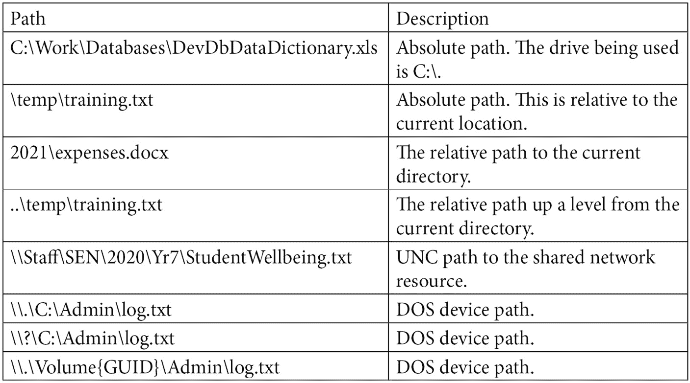
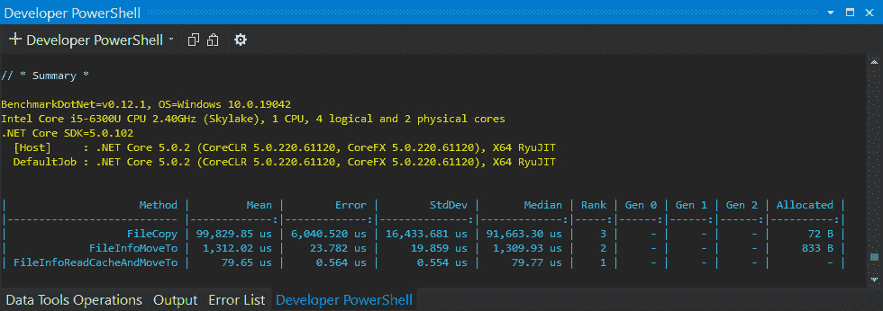
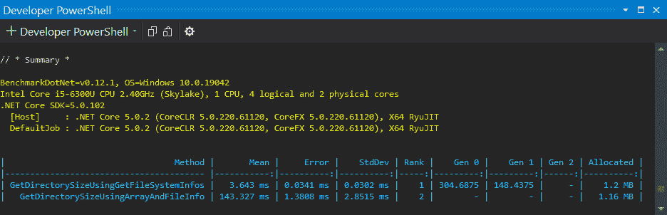
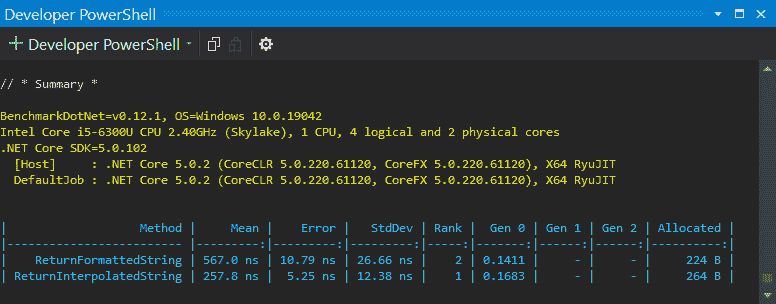

# *第八章*：文件和流 I/O

在本章中，您将学习如何提高目录、文件和流性能。您还将学习如何高效地枚举目录、处理小文件和大文件、执行异步操作、使用本地存储、处理异常以及高效地与内存协同工作。

本章我们将涵盖以下主题：

+   **理解各种 Windows 文件路径格式**：本节提供了关于您将在 Windows 操作系统上遇到的不同文件路径格式的信息。还涵盖了 Windows 上的 256 个字符文件路径限制，以及如何去除这一限制的技术。

+   **考虑改进 I/O 性能**：在本节中，我们将对一些代码进行基准测试，以查看在计算目录大小和移动文件时哪种编码方法性能最快。此外，我们还将探讨如何异步读取和写入文件。

+   **处理 I/O 操作异常**：在本节中，我们将介绍如何处理 I/O 异常。您将学习如何处理异常，以确保性能不受负面影响。您还将学习何时从异常中恢复，以及何时退出异常以在无法优雅恢复时保护数据完整性。

+   **高效执行内存任务**：在本节中，您将学习如何在处理字符串和处理对象时高效使用内存。我们还将讨论如何对大对象堆进行碎片整理。

+   **理解本地存储任务**：在本节中，我们将讨论本地文件存储的各种选项、网络环境中可能出现的某些问题，以及当多个人在同一台计算机上使用相同的软件时，用户只为自身安装软件的情况。

到本章结束时，您将能够做到以下事项：

+   了解不同的 Windows 文件路径格式。

+   超越 Windows 上的 256 个字符文件路径限制。

+   了解硬件如何影响您代码的性能。

+   选择计算目录大小的最佳选项。

+   选择移动文件的最佳选项。

+   异步读取和写入文件。

+   有效地处理 I/O 和其他异常。

+   提高基于内存的任务性能。

+   了解您可用的本地文件存储选项。

+   理解在网络环境中可能出现的问题，例如当应该为单台机器上的所有用户安装的应用程序仅安装给当前用户时，以及如何有效地解决这些问题。

# 技术要求

本章的技术要求如下：

+   Visual Studio 2022

+   本书源代码：[`github.com/PacktPublishing/High-Performance-Programming-in-CSharp-and-.NET/tree/master/CH08`](https://github.com/PacktPublishing/High-Performance-Programming-in-CSharp-and-.NET/tree/master/CH08)

# 理解各种 Windows 文件路径格式

您可能已经知道 .NET 提供了管理代码，它隐藏了与 Windows API 的交互。因此，当 System.IO 命名空间将文件路径信息传递给 Windows API 以处理时，这并不会令人惊讶。Windows API 执行所需的任务，然后将控制权交还给 .NET。

.NET 中的文件路径可以是绝对路径、相对路径、UNC 路径或 DOS 设备路径。非 Windows 文件和目录是区分大小写的。但在 Windows 上，文件和目录是不区分大小写的。以下表格提供了不同 Windows 文件路径格式的示例：



表 7.1 – Windows 路径格式示例

默认情况下，Windows 只能接受长度为 256 的路径。作为一名程序员，你可能遇到过在备份文件或移动文件时出现的“目标路径太长”警告。这种情况通常发生在使用 NPM 通过节点模块开发 Web 项目时。NPM 软件包可能具有特别长的文件路径，超过 256 个字符，这将导致此异常被触发。

您可以通过编辑注册表或编辑组策略来移除最大路径长度限制。首先，您将学习如何使用注册表来移除此限制。然后，您将学习如何使用组策略来移除此限制。

## 使用注册表移除最大路径长度限制

注意

在修改注册表时，请始终谨慎行事。

在本节中，您将学习如何通过修改注册表来移除 260 个字符的文件路径限制。

在性能方面，Windows 上的 `MAX_PATH` 问题可能会浪费您的时间。复制大量数据可能非常耗时。如果在您在不同磁盘之间移动文件 28 分钟后文件复制失败，这可能会使问题变得更糟。

因此，在使用文件管理应用程序时，例如，如果用户打算在两个位置之间复制文件，这可能会引发文件长度异常，最好提醒用户，并在他们执行复制操作之前提供重新组织文件的选择，或者为他们提供更新注册表的选项。这样，您可以节省最终用户大量的时间。

要手动移除 `MAX_PATH` 文件路径限制，请按照以下步骤操作：

1.  打开 `regedit`。

1.  一旦打开注册表编辑器，导航到以下键：

    ```cs
    HKEY_LOCAL_MACHINE\SYSTEM\CurrentControlSet\Control\
    FileSystem
    ```

1.  识别 `1`。

1.  如果键不存在，则将其添加为 `1`。

1.  可能没有必要，但重启计算机以使更改生效是个好主意。

现在，您应该能够处理路径长度超过 260 个字符的文件。如果在执行前面的步骤后遇到权限问题，请以管理员身份打开注册表编辑器。如果您仍然有问题，请联系系统管理员。

现在，让我们学习如何使用本地组策略编辑器来完成这项操作。

## 使用组策略移除最大路径长度限制

您还可以通过修改计算机的策略来移除 260 个字符的文件路径限制。您可以使用`gpedit.msc`工具完成此操作。在某些 Windows 版本上，这可能不可用，或者由于已实施的集团策略而不可用。如果您发现这种情况，请咨询系统管理员。否则，请按照以下步骤操作：

1.  打开`gpedit.msc`。

1.  在**计算机配置**下，导航到**管理模板** | **系统** | **文件系统**。

1.  默认情况下将有一个名为“未配置”的设置。通过将其设置为“启用”来编辑此设置。

1.  可能没有必要，但为了使更改生效，重启计算机是个好主意。

通过编辑注册表和本地组策略，我们已经学会了如何通过编辑注册表和本地组策略来克服 Windows 上的限制路径情况。

注意

移除文件路径限制非常重要。有实例表明，由于存在此限制，客户端和服务器计算机上的关键备份失败。当您与第三方库一起工作时，这也可能破坏您的开发项目。

现在我们将探讨一些有助于提升 I/O 操作的考虑因素。

# 考虑提高 I/O 性能

我们经常执行一些常见的 I/O 任务，例如遍历目录查找文件、添加、重命名、移动和删除目录、添加、重命名、移动和删除文件、对文件和目录进行密码保护、加密和解密文件和目录，以及压缩文件和目录。我们还同步、异步以及通过文件流和内存流等方式传输和加载文件。然后，还有所有 NoSQL 和 SQL 数据操作，这些操作将在企业网络中频繁发生，以及在工作场所和家中传输数据和音频/视频内容。

在处理 I/O 时，很容易完全减慢系统速度，以至于在文件读取和写入过程中变得无法使用。因此，如果您将要执行大量的 I/O 操作，您必须确保执行工作的地方的系统对最终用户和其他进程保持完全运行和响应。

如果您的硬件性能不佳，那么无论您的软件有多好，它很可能都会很慢！

注意

在考虑优化软件以提高 I/O 操作的速度和性能之前，您需要确保现有的硬件适合您将要执行的类型 I/O。否则，您可能会浪费时间试图改进软件！

当您处理硬件以加快输入和输出操作时，需要考虑的事项包括网卡的速度、是否使用 SSD 硬盘、CPU 的数量以及正在使用的 RAM 量。

您还需要考虑目标计算机上将要运行的其他软件进程。当涉及到应用程序速度减慢时，正在执行实时扫描的安全软件往往会被忽视。在这种情况下，您可以将应用程序添加为防病毒软件的例外，以便实时扫描不再减慢您的软件。

在野外遇到的一个问题是，在操作的关键时刻通过网络运行一个或多个备份。无论您的程序多么高效，如果它在备份服务器上运行，其性能可能会受到正在运行的备份软件和过程的严重影响。如果您的软件不在备份服务器上，但需要通过网络运行并发送接收文件和数据，这也可能发生。以下是需要考虑的事项：

+   将备份计划更改为在非关键时间运行。

+   在性能更好的服务器上安装您的软件。

+   检查您的网络是否存在瓶颈，并缓解这些瓶颈。

+   确保您的网络卡足够快并且配置得当。

+   确保您的以太网电缆是最新的。Cat-5 电缆适用于典型的互联网流量，但如果您在网络中进行大量的文件和数据操作，那么您可能需要升级到 Cat-6a/Cat-7 电缆以提高性能。然而，使用 Cat-7 电缆时，您需要小心不要在弯曲电缆时损坏箔屏蔽。

对于 Web 项目，减少文件大小以加快文件在互联网上的传输和接收速度非常重要。这有助于减少整体页面加载时间，并使客户更加满意。为了提高 Web 应用程序的加载性能，启用 Windows 动态内容压缩功能。这将减小数据的大小，从而从用户的角度提高响应时间。数据压缩的需求也适用于客户端/服务器应用程序，尤其是当传输的文件和数据大小非常大时。

使用缓存来提高网络性能。缓存将资源存储在本地或将其保留在内存中一段时间。如果再次请求这些资源，则将检查本地存储的资源并使用它们，而不是网络资源。这增加了资源的访问和加载时间，同时也减少了网络流量。如果资源已更新、缓存周期已过期或用户已清除其缓存，则缓存的资源将被更新。

两种最常见的数据传输机制是 XML 和 JSON。这些是存储结构化信息的文本文件。需要解析器从这些文件中提取信息，以便提取的数据可以在应用程序中使用。但并非所有 XML 和 JSON 解析器都表现相同。明智的做法是基准测试各种 XML 和 JSON 解析器的性能，以帮助你选择最适合你数据处理需求的最有效和性能最好的一个。

当你在序列化和反序列化数据时，你的对象及其层次结构应与你的 JSON 和 XML 格式相匹配，这样处理速度会更快。

微软建议开发者不要使用 BinaryFormatter 来传输二进制数据，因为它是不安全的，可能导致**拒绝服务**（**DOS**）攻击。.NET 提供了一些内置序列化器，可以安全地处理不受信任的数据：

+   `XmlSerializer`和`DataContractSerializer`可以将对象图序列化到 XML 中，也可以从 XML 中反序列化。不要将`DataContractSerializer`与`NetDataContractSerializer`混淆。

+   `BinaryReader`和`BinaryWriter`用于 XML 和 JSON。

+   `System.Text.Json` API 可以将对象图序列化到 JSON 中。

数据类型的大小可能不同，因为它们可以存储不同的数据值，数据值长度也可能不同。数值和字符串值都是可变长度的。数值或字符串越大，保存到文件中的字节数就越多。数值或字符串越小，保存到文件中的字节数就越少。同样，对于数据类型名称，名称越长，使用的字节数就越多，名称越短，使用的字节数就越少。

当偶尔移动一两个文件时，字节数量可能对最终用户或应用程序性能不是问题。但是，当你进入批量文件处理的领域时，每个文件需要写入的字节数越多，批量处理完成所需的时间就越长。

根据你的操作系统版本、驱动程序、磁盘和网络硬件，复制或移动小文件可能比移动大文件更消耗性能。你可以在操作系统级别通过利用突发复制或类似技术来优化文件传输。

例如，在移动媒体文件（照片/音频/视频）或 AI/ML 数据集（通常是文本）时，可能会遇到许多性能问题。如果文件很小（从几个 KB 到几个 MB 不等），你可以将它们分组到 ZIP 文件中（如果它们是媒体文件则不进行压缩），这样可以得到更大的文件，可以更快地传输。

在下一节中，我们将对三种不同的文件移动方法进行基准测试。我们将使用`File.Copy`、`FileInfo.MoveTo`以及从内存缓存中获取`FileInfo`并使用`FileInfo.MoveTo`。这将帮助我们确定在应用程序中使用最快的移动方法，尤其是在需要移动大量文件时。

## 文件移动

在各种企业应用程序中，一个常见的功能是需要移动大量文件。例如，一个报告功能可能需要将来自各个团队的上一月的销售数据合并到数据仓库中，以便进行报告处理。这些销售数据可能位于各种位置的电子表格中。每个电子表格都需要被移动到一个中央文件存储位置以进行进一步处理。在文件移动操作中，你拥有的文件越多，所需的处理时间就越多。因此，了解在 C#中移动大量文件哪种方法性能最佳是有益的。

考虑到这一点，我们将编写一个简单的应用程序来基准测试三种不同的文件移动方式。我们编写的每个方法在性能上都会有所不同。我们选择的方法将是执行最快的，一旦我们运行了编译后的可执行文件，这将在我们的基准测试总结报告中识别出来。让我们开始编写我们的基准测试：

1.  启动一个新的 C# .NET 5 控制台应用程序，并将其命名为`CH08_FileAndStreamIO`。

1.  安装`BenchmarkDotNet` NuGet 包。

1.  将名为`MovingFiles`的新类添加到项目的根目录：

    ```cs
    using BenchmarkDotNet.Attributes;
    using BenchmarkDotNet.Order;
    using System;
    using System.Collections.Generic;
    using System.IO;
    using System.Text;
    [MemoryDiagnoser]
    [Orderer(SummaryOrderPolicy.Declared)]
    [RankColumn]
    public class MovingFiles { }
    ```

我们现在的类已经设置好了，可以用来基准测试我们的方法并报告内存使用情况。

1.  在类顶部添加以下代码（你可以用你自己的文件替换`Moonshine-3.0.0.exe`文件）：

    ```cs
    private Dictionary<string, FileInfo> _cache;
    private const string SOURCE_DIRECTORY = 
    @"C:\Temp\Source\";
    private const string DESTINATION_DIRECTORY = 
    @"C:\Temp\Destination\";
    private const string FILENAME = "Moonshine-3.0.0.exe";
    ```

在这里，我们声明了一个`FileInfo`对象的字典，它将作为我们的内存缓存，以及三个常量用于我们的源目录、目标目录和文件名。我们将在我们将要编写的其他方法中需要这些常量。

1.  我们需要有一个程序来准备我们的代码，以便在没有抛出异常的情况下进行基准测试。如果没有，我们的基准测试将无法执行多次，因为文件已经被移动。每次基准测试运行时，移动的文件需要被移回到其原始位置。因此，我们需要一个`[GlobalSetup]`方法和一个`[GlobalCleanup]`方法。首先，将`[GlobalSetup]`方法添加到`MovingFiles`类中。我们将在那里调用`PreloadFilesAndCacheThem()`方法：

    ```cs
    [GlobalSetup]
    public void PreloadFilesAndCacheThem()
    {
    var files = new DirectoryInfo(SOURCE_DIRECTORY)
        .GetFileSystemInfos();
    _cache = new Dictionary<string, FileInfo>();
    foreach (var f in files)
    {
        _cache.Add(f.FullName, f as FileInfo);
    }
    }
    ```

此方法通过`SOURCE_DIRECTORY`字符串标识的源目录中的每个文件获取`FileSystemInfo`。然后，它将`_cache`实例化为一个`FileInfo`对象的字典。之后，遍历文件列表，并将当前文件的`FileInfo`对象添加到`_cache`中。

1.  添加`PreMoveCheck() [GlobalCleanup]`方法：

    ```cs
    [GlobalCleanup]
    public void PreMoveCheck()
    {
        if (File.Exists($"{SOURCE_DIRECTORY}{FILENAME}"))
        if (
            File.Exists(
                $"{DESTINATION_DIRECTORY}{FILENAME}")
        )
        {
            File.Delete(
                $"{DESTINATION_DIRECTORY}{FILENAME}");
        }
    if (
        !File.Exists($"{SOURCE_DIRECTORY}{FILENAME}")  
        && File.Exists(
            $"{DESTINATION_DIRECTORY}{ FILENAME}")
    )
    {
        FileInfo fileinfo = 
            new FileInfo(
                $"{DESTINATION_DIRECTORY}{FILENAME}") 
                  fileinfo.MoveTo(
                    $"{SOURCE_DIRECTORY}{FILENAME}");
    }
    }
    ```

1.  清理代码检查文件是否已存在于`SOURCE_DIRECTORY`中。如果存在，则检查`DESTINATION_DIRECTORY`中的文件。如果存在，则将其删除。如果文件不在`SOURCE_DIRECTORY`中但存在于`DESTINATION_DIRECTORY`中，则将文件从`DESTINATION_DIRECTORY`移回到`SOURCE_DIRECTORY`。

1.  我们需要`[GlobalSetup]`和`[GlobalCleanup]`方法，因为如果它们不在适当的位置执行它们的功能，基准测试将失败，因为文件找不到。

1.  将`FileCopy()`方法添加到`MovingFiles`类中：

    ```cs
    [Benchmark]
    public void FileCopy()
    {
        PreMoveCheck();
        File.Copy(
        $"{SOURCE_DIRECTORY}{FILENAME}"
        , $"{DESTINATION_DIRECTORY}{FILENAME}"
    );
    }
    ```

1.  `FileCopy()`方法执行`PreMoveCheck()`以确保文件已就位，准备进行基准测试而不会失败。然后，它继续将文件从`SOURCE_DIRECTORY`复制到`DESTINATION_DIRECTORY`。

1.  现在，添加`FileInfoMoveTo()`方法：

    ```cs
    [Benchmark]
    public void FileInfoMoveTo()
    {
        PreMoveCheck();
        FileInfo fileinfo = new FileInfo(
        $"{SOURCE_DIRECTORY}{FILENAME}"
    );
    fileinfo.MoveTo(
        $"{DESTINATION_DIRECTORY}{FILENAME}"
    );
    }
    ```

1.  `FileInfoMoveTo()`方法也执行`PreMoveCheck()`，确保文件已就位，准备移动。然后，它为指定的文件创建一个`FileInfo`对象，并使用`MoveTo(string destinatation)`方法将文件从`SOURCE_DIRECTORY`移动到`DESTINATION_DIRECTORY`。

1.  将`FileInfoReadCacheAndMoveTo()`方法添加到`MovingFiles`类中：

    ```cs
    [Benchmark]
    public void FileInfoReadCacheAndMoveTo()
    {
        PreMoveCheck();
        FileInfo fileInfo = 
        _cache[$"{SOURCE_DIRECTORY}{FILENAME}"];
    if (fileInfo.Exists)
        fileInfo.MoveTo(
                 $"{DESTINATION_DIRECTORY}{FILENAME}"
        );
    }
    ```

1.  `FileInfoReadCacheAndMoveTo()`方法执行`PreMoveCheck()`。然后，它从存储在`_cache`中的`FileInfo`对象创建一个`FileInfo`对象。如果`FileInfo`对象存在，它随后被移动到`DESTINATION_DIRECTORY`。

1.  在`Program`类的`Main`方法中添加以下代码行：

    ```cs
    BenchmarkRunner.Run<MovingFiles>();
    ```

1.  在`Release`模式下构建项目，然后从命令行运行可执行文件。你应该会看到以下基准摘要报告：



图 7.1 – BenchmarkDotNet 对各种文件移动操作的摘要报告

从时间统计中，我们可以看到`File.Copy(string source, string destination)`方法是移动文件中最慢的方法，其次是`FileInfo.MoveTo(string destination)`方法。

最快的文件移动操作是从内存缓存中提取`FileInfo`，然后使用`FileInfo.MoveTo(string destination)`方法执行移动操作。

在下一节中，我们将探讨两种不同的方法来计算目录中所有文件的大小。然后我们可以使用最快的方法来计算目录的大小，例如在企业中进行批量文件移动之前。

## 计算目录大小

当你对文件和目录进行批量处理时，在将它们移动到新位置之前了解文件总和的大小是有益的。这可以帮助你确定复制文件所需的时间，以及目标位置是否有足够的空间来存储所有文件。

当你复制或移动文件时，弹出的某些对话框示例是 Windows 资源管理器对话框。它遍历要移动或复制的文件和目录。在这个过程中，它记录文件和目录使用的总字节数。然后，它提供一个时间估计，关于移动或复制这些字节需要多长时间。有时这个过程可能非常耗时，对最终用户来说可能很令人沮丧。

另一个了解目录大小的理由是当您有紧急且时间敏感的业务需求时。长时间的文件移动操作可能会损害业务的进度计划。在本节中，我们将通过基准测试两种不同的方法来计算目录大小。执行最快的那个方法是我们计算目录大小时会选择的方法。让我们开始吧：

1.  向项目中添加一个名为 `GettingFileSizes` 的新类，并像对 `MovingFiles` 类所做的那样对其进行基准测试配置。然后，将 `DIRECTORY` 常量添加到类的顶部：

    ```cs
    public const string DIRECTORY = @"C:\Windows\System32\";
    ```

1.  添加 `GetDirectorySizeUsingGetFileSystemInfos()` 方法：

    ```cs
    [Benchmark]
    public int GetDirectorySizeUsingGetFileSystemInfos()
    {
    DirectoryInfo directoryInfo = 
        new DirectoryInfo(DIRECTORY);
    FileSystemInfo[] fileSystemInfos = 
        directoryInfo.GetFileSystemInfos();
    int directorySize = 0;
    for (int i = 0; i < fileSystemInfos.Length; i++)
    {
        FileInfo fileInfo = 
            fileSystemInfos[i] as FileInfo;
        if (fileInfo != null)
            directorySize += (int)fileInfo.Length;
    }
    return directorySize;
    }
    ```

1.  `GetDirectorySizeUsingGetFileSystemInfos()` 方法基于在 `DIRECTORY` 常量中定义的目录创建一个新的 `DirectoryInfo` 对象。然后，它从 `DirectoryInfo` 变量中获取一个 `FileSystemInfo` 数组。然后遍历 `FileSystemInfo` 数组，并将 `directorySize` 变量递增。一旦 `directorySize` 被计算出来，该值将被返回给调用者。

1.  将 `GetDirectorySizeUsingArrayAndFileInfo()` 方法添加到 `MovingFiles` 类中：

    ```cs
    [Benchmark]
    public int GetDirectorySizeUsingArrayAndFileInfo()
    {
        string[] files = Directory.GetFiles(DIRECTORY);
        int directorySize = 0;
    for (int i = 0; i < files.Length; i++)
    {
        directorySize += 
            (int)(new FileInfo(files[i]).Length);
    }
    return directorySize;
    }
    ```

1.  `GetDirectorySizeUsingArrayAndFileInfo()` 方法获取给定目录的文件名字符串数组。然后遍历数组，并将 `directorySize` 通过当前文件大小递增。一旦迭代完成，`directorySize` 被返回。

1.  将 `benchmark` 运行器方法添加到 `Program` 类的 `Main` 方法中，执行 `Release` 构建并从命令行运行可执行文件。您将看到以下报告：




图 7.2 – 获取目录大小的基准总结报告

如您所见，我们使用了两种不同的方法来计算 `System32` 目录的大小。计算目录大小的最慢方法是我们的第二种方法。因此，出于性能考虑，计算目录大小的最佳方法是获取相关目录的 `DirectoryInfo`。然后，您可以调用 `GetFileSystemInfos()` 并遍历结果，累加 `FileInfo` 对象的长度。

在下一节中，我们将探讨异步文件操作。

## 异步访问文件

为什么你应该异步访问文件？好吧，这里有一些原因，您可能在使用异步文件访问时考虑：

+   当文件操作需要几秒钟或更长的时间才能完成时，您的用户界面线程将更加响应，因为文件操作不会阻塞用户交互。

+   异步进程减少了手动管理的线程需求，使应用程序更具可扩展性。ASP.NET 和服务器端应用程序是具体的应用程序示例，它们将从异步文件处理中受益。

+   文件访问延迟也是你必须考虑的因素。计算机资源，如硬盘类型、网络上传和下载速度、安全软件的实时扫描，以及文件大小，都是可能影响文件访问时间的因素。

+   使用异步任务而不是线程只有很小的开销。

+   你可以并行运行异步任务。

`FileStream`类让你对文件访问操作有最大的控制权。你可以配置该类以在操作系统级别执行 I/O 操作。通过这样做，你可以避免阻塞线程池线程。要在构造函数调用中指定在操作系统级别执行 I/O 操作，你必须指定以下之一：

+   `useAsync=true`

+   `options=FileOptions.Asynchronous`

    注意

    这个选项只能与`StreamReader`和`StreamWriter`类一起使用，当提供给它们的流是由`FileStream`类打开的流时。

现在，让我们看看一个执行异步文件读写操作非常简单的例子。让我们先异步地将一些文本写入一个文本文件。然后，我们将异步地从同一个文件中读取文本。

## 异步写入文件

在本节中，我们将异步地将一些文本写入一个文本文件。虽然有一个更简单的方法来完成这个任务，但我们将使用的方法提供了最大的控制权，并且是在操作系统级别上操作的：

1.  将一个新文件添加到`CH08_FileAndStreamIO`项目，名为`AsyncFileAccess`。

1.  将一个名为`WriteTextToFileAsync(string text, string path)`的新方法添加到`AsyncFileAccess`类中：

    ```cs
    public async Task WriteTextToFileAsync(
    string text, string path
    )
    {
        byte[] encodeText = 
          Encoding.Unicode.GetBytes(text);
        using var fileStream = new FileStream(
            path, 
        FileMode.Create, 
        FileAccess.Write, 
        FileShare.None, 
        bufferSize: 4096, 
        useAsync: true
    );
    await fileStream.WriteAsync(
        encodeText, 0, encodeText.Length
    );
    }
    ```

在这里，我们传递一个文本字符串和一个要写入文本的文件名。然后，我们将所有文本读入一个字节数组。接下来，我们声明一个具有 4,096 字节缓冲区的异步`FileStream`变量，将文本异步写入指定的文件，并等待操作完成。使用 4,096 字节的原因是因为它是 2 的幂，并且是内存页面大小。页面，内存页面，或虚拟页面是由页面表中的单个条目描述的固定长度连续的虚拟内存块。因此，当系统选择将页面交换到磁盘时，它可以一次性完成，而不涉及任何开销。

1.  将`ReadTextFromFileAsync(string path)`方法添加到`AsynFileAccess`类中：

    ```cs
    public async Task<string> ReadTextFromFileAsync(string 
        path)
    {
    StringBuilder sb = new StringBuilder();
    byte[] buffer = new byte[0x1000];
    int numberOfBytesToDecode;
    using var fileStream = new FileStream(
            path,
        FileMode.Open, 
        FileAccess.Read, 
        FileShare.Read,
        bufferSize: 4096, 
        useAsync: true
    );
        while (
        (numberOfBytesToDecode = await fileStream.
          ReadAsync(buffer, 0, buffer.Length)) != 0
    ) 
        {
            sb.AppendLine(Encoding.Unicode.GetString(
            buffer, 0, numberOfBytesToDecode
        ));
    }
        return sb.ToString();
    }
    ```

在这个方法中，我们声明一个`StringBuilder`以实现高效的字符串连接。然后，我们声明并初始化一个新的字节数组，它将成为我们的缓冲区，并声明一个`numberOfBytesToDecode`变量。创建一个新的`FileStream`对象。

`numberOfBytesToDecode`变量通过等待对`ReadAsync`方法的调用来设置。这个变量在`For`循环的每次迭代中都会设置。对于循环的每次迭代，我们获取要解码的字节数。然后，我们向输出追加一行，其中包含从缓冲区中取出的项。最后，我们返回结果字符串。

1.  将 `DemonstrateAsyncFileOps()` 方法添加到 `AsyncFileAccess` 类：

    ```cs
    public async Task DemonstrateAsyncFileOps()
    {
    await WriteTextToFileAsync(
             "Supercalifragilisticexpialidocious",
            @"C:\Temp\File\film.txt"
    );
     string text = await ReadTextFromFileAsync(
        @"C:\Temp\File\film.txt"
    );
    Console.WriteLine($"The Text written was: {text}");
    }
    ```

`DemonstrateAsynFileOps()` 方法通过调用异步写入操作将一些文本异步写入文件。然后，它通过调用异步读取操作异步读取文本。结果随后打印到控制台窗口。

1.  按照以下方式修改您的 `Program` 类的 `Main` 方法：

    ```cs
    static async Task Main(string[] args)
    {
        AsyncFileAccess afa = new AsyncFileAccess();
        await afa.DemonstrateAsyncFileOps();
    }
    ```

此代码创建了我们 `AsyncFileAccess` 类的新实例，然后调用 `DemonstrateAsyncFileOps()` 方法。

1.  构建并运行您的代码。在您的控制台窗口中，您应该看到以下行被打印出来：

    ```cs
    The Text written was: Supercalifragilisticexpialidocious
    ```

如我们的简单示例所示，异步文件访问相当直接。在下一节中，我们将探讨如何处理 I/O 异常。

# 处理 I/O 操作异常

在处理 I/O 操作时，您可能会遇到几种不同的异常。基本的 I/O 异常是 `IOException`。区分不同的 I/O 异常并将它们记录下来是有益的，因为这有助于加快问题解决的速度。

以下表格提供了由您的 I/O 操作可能引发的各种 I/O 异常的分解。通过捕获这些特定的异常，您可以提供更详细的异常日志条目，这有助于更容易地识别问题的根本原因：

![表 7.2 – Microsoft .NET I/O 异常

![img/B16617_Table_8.2.jpg]

表 7.2 – Microsoft .NET I/O 异常

现在您已经了解了可能引发的 I/O 异常的类型，您还需要了解正确处理、记录和显示这些异常的方法。

作为程序员，我们需要编写能够检测代码故障的代码。故障代码会使计算机程序处于未定义的状态。这可能导致意外和不可预测的副作用。处于不可预测状态的计算机程序可能导致各种问题，如性能降低、应用程序挂起和无效数据，从而导致错误信息。这可能导致严重的商业和消费者问题，这是不好的。

因此，您的代码需要具有容错性，并且应该能够适当地处理故障。异常应该被处理，以确保数据完整性保持不变。您还应该记住，您的计算机程序应该了解两种异常类别：

+   **预期异常**是您的计算机程序可以从中恢复的异常。

+   **意外异常**是您的计算机程序无法从中恢复的异常。

预期异常需要静默处理。您知道什么有可能失败以及为什么，因此您可以在一开始就放置防御性代码来应对可能引发这些异常的代码。这很重要，因为您不希望异常冒泡，因为这会降低应用程序的性能。反过来，应用程序性能的降低会影响用户体验。

允许异常在您的计算机程序中传播会消耗大量的性能。考虑到这一点，最佳实践规定，最好在代码中异常发生的位置处理异常，以提高应用程序的性能。

当您使用 `try/catch` 块捕获错误时，拥有多个 `catch` 块也是一个好的做法。唯一会形成 `catch` 块的异常是当前方法可以抛出的异常。您应该将异常 `catch` 块按顺序放置，最具体的异常在顶部，然后逐渐减少到最不具体的，这将是您的底部 `catch` 块。这有助于使您的代码对其他程序员更易读，并且也使得针对特定异常调试您的代码变得更加容易。

您可以使用异常过滤器来处理在特定条件下出现的异常。如果异常过滤器返回 true，则异常被处理。但如果它返回 false，则继续搜索异常处理器。与捕获和重新抛出相比，使用异常过滤器更可取，因为过滤器不会损害调用栈。如果稍后的处理器清空了调用栈，您可以看到异常最初来自哪里，而不仅仅是它被重新抛出的最后位置。

当发生意外的异常时，它必须被抛出，因为它可能会对您计算机程序的预测性产生严重影响。当发生意外的异常时，您应该记录异常并退出以保护数据的完整性。

这就是为什么使用 `System.Exception` 是一个坏主意，因为它会吞没所有异常。您的方法应该只捕获它们预期会引发的异常。所有意外的异常都应该以记录异常并退出程序的方式由应用程序处理。在主应用程序的 `try/catch` 块中，您会有您的 `System.Exception` 捕获块来捕获意外的异常。这个块将处理所有允许冒泡回主应用程序代码的意外异常。

当意外的异常传播回主应用程序代码的异常 `catch` 块时，您可以通过调用 `Exception.GetBaseException()` 来提取基本异常。这将获取最初引发的异常，导致任何后续异常也被引发。

根据我的经验，我发现 IT 专业人士在故障排除时往往会忽略审查事件日志和应用程序日志。然而，当他们一无所获并寻求我的帮助时，这通常是我的首要任务。可能是在**事件查看器**中没有记录任何内容，应用程序也没有记录任何内容。但有时确实记录了有价值的信息，这可以在问题解决和以更稳定的方式重新使应用程序运行方面节省时间。

实际上，异常可以记录在三个不同的位置：

+   **应用程序日志文件**：当遇到异常时，应用程序会将异常记录到文本文件、JSON 文件或 XML 文件中。

+   **事件查看器**：当遇到预期的异常时，应用程序会将此异常记录到命名事件日志中。当遇到意外的异常，如应用程序挂起时，系统会将此异常记录在 Windows 应用程序日志或 Windows 系统日志中。

+   **数据库**：当遇到应用程序时，应用程序会将异常记录到数据库表中。

无论你选择哪种机制或机制，都取决于你和你应用程序的需求。然而，你必须确保日志格式良好，并且提供的数据是有意义的。如果日志难以阅读且包含大量噪声，那么日志就没有价值了！

注意

使用最佳实践，规定托管和非托管资源应正确释放，特别是如果应用程序崩溃的话。在提供技术支持时，我经常遇到应用程序崩溃并锁定资源的情况，以及资源在内存中保持活跃的情况。这会导致糟糕的用户体验，并可能导致文件、目录和其他资源不可访问，以及应用程序本身无法启动。在这些情况下，通常唯一的选择是使用任务管理器结束应用程序或重启计算机。

# 高效执行内存任务

当基准测试 C#程序时，你会看到有时分配最多内存的对象会比分配较少对象的方程序更快。一个例子是字符串。使用格式化字符串可以分配较少的内存插值字符串。然而，格式化字符串可能比使用插值字符串更慢。我们将用一个非常简单的代码片段来演示这一点：

1.  将一个类添加到`Memory`中，并配置它使用*BenchmarkDotNet*。

1.  添加`ReturnFormattedString()`方法：

    ```cs
    [Benchmark]
    public string ReturnFormattedString()
    {
    return string.Format("{0} {1} {2} {3} {4} {5} {6} 
        {7} {8} {9}", "The", "quick", "brown", "fox", 
        "jumped", "over", "the", "lazy", "dog", "."
    );
    }
    ```

此方法返回一个格式化字符串。它基本上是一行，不包含命名变量。

1.  将`ReturnInterpolatedString()`方法添加到`Memory`类中：

    ```cs
    [Benchmark]
    public string ReturnInterpolatedString()
    {
        string thep = "The";
        string quick = "quick";
        string brown = "brown";
        string fox = "fox";
        string jumped = "jumped";
        string over = "over";
        string thel = "the";
        string lazy = "lazy";
        string dog = "dog";
        string period = ".";
    return $"{thep} { quick } { brown } { fox } 
    {jumped} {over} {thel} {lazy} {dog} {period}";
    }
    ```

此方法声明了几个字符串并将值赋给它们。然后它返回一个插值字符串。此方法覆盖多行，看起来可能会更慢并使用最多的内存。然而，唯一确定的方法是运行基准测试。

1.  将`BenchmarkRunner.Run<Memory>();`调用添加到`Main`方法中，进行`Release`构建，然后从命令行运行可执行文件。以下截图显示了分配的内存以及执行每个方法所需的时间：



图 7.3 – 比较 String.Format 与可互操作字符串的基准测试总结报告

如你所见，尽管我们可以声明多个变量并使用我们的字符串互操作性方法分配最多的内存，但它比使用`String.Format`执行相同操作要快得多。如果你有很多字符串处理要做，比如在批量报告生成或文档处理中，那么你可以几乎将执行字符串操作所需的时间减半，使用字符串互操作性。内存也永远不会达到第 1 代，因此它被垃圾回收器有效地处理。

此外，你需要减少你进行的装箱和拆箱的数量。每次将值类型转换为引用类型时，它都会存储在堆上。每次将引用类型转换为值类型时，你都会将其放置在栈上。那么，这样做对性能有什么影响呢？装箱和拆箱是计算密集型的过程。需要执行函数的计算越多，过程就越慢。因此，通过消除由装箱和拆箱引起的非必要计算，你可以加快应用程序的速度，并最终使用更少的内存。所以，当你能这样做的时候，尽量使用栈上的值类型而不是堆上的引用类型。

避免在对象中重复代码。如果你有多个构造函数重写，那么将公共代码放在公共构造函数中，并对你自己的方法做同样的事情。具有重复代码的类将比正确编写的没有重复的相同类使用更多的内存。你应该始终寻找方法来重构你的对象以减少代码膨胀，移除代码重复和重用代码是这样做的一种简单方法。

内存碎片化可能是 C#程序性能问题的重大原因。当对象被添加到堆中，垃圾回收，然后其他对象填充可用空间时，就会发生内存碎片化。如果你在内存中的对象之间有空闲空间，那么你的内存已经碎片化了。GC 将在最有效的时候执行压缩收集。手动执行此操作应在仔细调查了相关场景之后进行。

在 C#中，你可以使用可用的垃圾回收设置来对**大型对象堆（LOH**）进行碎片整理，如下所示：

```cs
GCSettings.LargeObjectHeapCompactionMode = 
```

```cs
GCLargeObjectHeapCompactionMode.CompactOnce; 
```

```cs
GC.Collect();
```

此代码确保 LOH 上的对象占用连续的内存区域。所有位于内存中对象之间的空闲空间都被移除并放置在分配内存的末尾。

你还应该考虑不使用终结器。如果对象使用终结器，它将在内存中保持更长时间。这将导致内存使用量增加。内存使用量的增加会导致应用程序性能降低。

当你完成对象和资源时，销毁它们是一种最佳实践。这有助于防止未使用的对象留在内存中，并且还释放了文件和目录等资源上的锁。

当使用一次性对象时，你应该始终尝试使用`using`语句。这是因为当代码块执行完毕后，对象将自动被销毁。当你编写一个使用各种可处置资源的类时，即使它不拥有这些可处置资源，你也应该实现可处置模式。

到目前为止，我们已经讨论了文件和内存操作以及性能可能受到影响的情况。现在，让我们将注意力转向本地存储任务。

# 理解本地存储任务

在 Windows 10 上，有几个位置可以用来本地存储数据。具体如下：

+   `AppData`文件夹，这个文件夹可以包含设置、文件和文件夹。这个文件夹用于那些不容易重新创建或下载的数据。如果你有可以备份用户`AppData`文件夹的备份应用程序，那么存储在`Local`文件夹中的任何内容都将被备份。

+   `ApplicationData.LocalCacheFolder`属性可以存储在本地缓存中。使用本地缓存存储的项目将在会话之间持久化。

+   **漫游**：网络用户可以使用漫游配置文件在服务器上存储他们的本地数据。这有一个优点，那就是谨慎的网络管理员会确保配置文件定期备份，这样如果用户意外丢失数据，他们总有一个恢复点。

+   `AppData\Temp`文件夹用于临时数据。当你完成对临时文件夹的数据操作后，清理数据是一个好主意。应用程序的初始化和关闭是执行系统维护的好时机。

+   **C:\ProgramData**：这是一个存储应用程序数据的最佳实践位置。然而，这个位置并不总是会被备份。因此，始终提供一个应用程序内的方式以确保数据定期备份并存储在安全的位置是一个好主意，以防你的电脑出现故障，这种情况确实会发生！

关于如何以及在哪里存储你的数据，这取决于你。根据我提供学校 IT 支持的丰富经验，他们可能有一些极其复杂且在安全方面非常坚固的系统。你不能假设你的应用程序将安装在`C:\`驱动器上，也不能假设你将能够访问`C:\ProgramData`文件夹。

学校在尝试在如此复杂的系统上安装和运行教育供应商软件时，已经失去了许多商业和评估时间。这通常会导致远程技术支持会议。

另一个问题经常出现是使用微软虚拟存储。当用户安装软件并遇到问题，`为使用此计算机的任何人安装`或`仅为我安装`时，他们往往会选择后者。在 Windows 10 计算机上，选择`仅为我安装`会将已安装应用程序的存储数据放入用户的虚拟存储中。但选择`为使用此计算机的任何人安装`通常会将应用程序数据存储在`C:\ProgramData\YOUR_APPLICATION`文件夹中。

当多人登录到办公室计算机上，并且每个人都有一份数据副本时，一个明显的迹象是用户只为自己的使用安装了软件。当这种情况发生时，数据存在多个副本。这些副本可以在每个人的虚拟存储中找到。

这正是我和我的同事所经历的情况。我们开发的教育软件有独立、网络和在线格式。对于我们的独立客户，我们提供单用户许可证。应用程序的数据存储在 Microsoft Access 数据库中。最初是 Windows 7 上的一个问题，现在在 Windows 10 上仍然是一个潜在的问题，即用户被提示安装给自己或所有用户。当他们为所有用户安装时，Microsoft Access 数据库可以在 `C:\ProgramData\CompanyName\ProductName` 下找到。所有登录到计算机使用我们软件的用户将看到相同的数据集。但如果用户选择仅为自己安装，那么我们的软件数据将存储在用户配置文件的 VirtualStore 下

虚拟存储的位置是 `C:\Users\%USERNAME%\AppData\Local\VirtualStore`。了解这一点很有用，因为它可以减少你在各个用户配置文件下定位数据所需的时间。当客户要求将数据合并并存储在中央位置时，困难就出现了。在这种情况下，卸载软件并重新安装它，确保选择“为所有用户安装”选项。然后，要求用户停止使用软件，直到你为他们提供合并后的数据。此类信息可能不会提高你的 C#和.NET 程序的性能，但它确实在你提供技术支持时提高了你的效率。这可以成为你的优势，正如我发现的对我有益的那样！并且作为程序员/技术支持人员/软件开发人员，我们都会进行个人绩效评估，以了解我们在各自角色中的表现如何。

现在我们已经完成了本章的内容，让我们总结一下我们学到了什么。

# 摘要

在本章中，我们首先查看了几种不同的文件路径。有四种不同类型的文件路径——绝对路径、相对路径、UNC 路径和 DOS 设备路径。

在讨论了各种路径类型之后，我们了解到，默认情况下，Windows 和 Windows Server 被限制在 256 个字符的完整文件路径长度。在当今开源和基于 Web 的软件跨平台工作的世界中，Windows 计算机上的这个最大标准长度可能非常有限。这在进行磁盘到磁盘备份时可能会引起备份问题，并且深度嵌套的项目可能会超出最大文件路径长度。为了克服这一限制，我们学习了如何通过访问和修改注册表来移除限制。

我们接下来关注的是提高磁盘 I/O 的各种考虑因素。我们通过考虑可能影响性能的不同硬件设备开始考虑 I/O 性能考虑因素。然后，我们对一些代码进行了基准测试，以找到计算目录大小、移动文件和执行异步文件操作的最有效方法。

我们接下来关注的是异常处理。我们认识到，不必要地向上冒泡异常会影响性能，并且它们应该在源头被捕获和处理。我们还认识到，我们不应该通过捕获通用异常来吞没异常。通用异常只应在关闭应用程序以处理不可恢复异常之前，作为日志记录的最后一资源。

我们接下来关注的是内存任务。在基准测试`string.Format`和插值字符串之后，我们了解到使用插值字符串几乎将我们的`performane.Next`提高了两倍，然后我们考虑了内存碎片化，这可能会在添加和删除各种大小的对象时发生。我们还学习了如何压缩碎片化内存以提高其运行效率。

最后，我们探讨了本地存储任务。我们讨论了可用的各种本地存储类型及其用途。此外，我们还讨论了我们的产品的最终用户安装，这可能导致不同登录用户拥有自己的数据集。当用户选择为自己安装而不是为所有用户安装时，就会出现这个问题。因此，每个用户都有其应用程序数据的副本存储在`C:\Users\%USERNAME%\AppData\Local\VirtualStore`的配置文件中。

在下一章中，我们将探讨网络。但在我们这样做之前，看看你是否能回答以下问题。然后，通过查看*进一步阅读*部分来提高你对 I/O 性能主题的了解。

# 问题

回答以下问题以测试你对本章知识的了解：

1.  你需要了解哪些各种 Windows 文件路径格式？

1.  如何移除 Windows 文件路径的 256 字符限制？

1.  哪种方法是最有效的计算目录大小的方法？

1.  哪种方法是最有效的移动文件的方法？

1.  应该在何时使用`Exception`类来捕获异常？

1.  基础 I/O `Exception` 类是什么？

1.  对于本地存储，你有哪些文件位置选项？

1.  用户安装你的软件时可能会遇到哪些潜在陷阱？

1.  微软虚拟存储是什么？

1.  微软虚拟存储位于何处？

# 进一步阅读

关于本章涵盖的主题的更多信息，请参阅以下资源：

+   *文件和流 I/O*: [`docs.microsoft.com/dotnet/standard/io/`](https://docs.microsoft.com/dotnet/standard/io/).

+   *管道*: [`docs.microsoft.com/dotnet/standard/io/pipe-operations`](https://docs.microsoft.com/dotnet/standard/io/pipe-operations).

+   *除了 File.Move 之外更快的文件移动方法*: [`stackoverflow.com/questions/18968830/faster-file-move-method-other-than-file-move`](https://stackoverflow.com/questions/18968830/faster-file-move-method-other-than-file-move).

+   *C# GetFileSystemInfos 可以快速获取文件大小*: [`thedeveloperblog.com/getfilesysteminfos`](https://thedeveloperblog.com/getfilesysteminfos).

+   *C# 写入文件的性能*: [`stackoverflow.com/questions/9437265/performance-of-writing-to-file-c-sharp`](https://stackoverflow.com/questions/9437265/performance-of-writing-to-file-c-sharp).

+   *异步文件处理*: https://docs.microsoft.com/dotnet/csharp/programming-guide/concepts/async/using-async-for-file-access#:~:text=%20Asynchronous%20file%20access%20(C#)%20%201%20Use,writing%2010%20text%20files.%20For%20each...%20More.

+   *如何使用 PLINQ 遍历文件目录*: [`docs.microsoft.com/bs-cyrl-ba/dotnet/standard/parallel-programming/how-to-iterate-file-directories-with-plinq?view=dynamics-usd-3`](https://docs.microsoft.com/bs-cyrl-ba/dotnet/standard/parallel-programming/how-to-iterate-file-directories-with-plinq?view=dynamics-usd-3).

+   *在 .NET 中处理 I/O 异常*: [`docs.microsoft.com/dotnet/standard/io/handling-io-errors`](https://docs.microsoft.com/dotnet/standard/io/handling-io-errors).

+   *从桌面应用程序调用 Windows 10 API*: https://blogs.windows.com/windowsdeveloper/2017/01/25/calling-windows-10-apis-desktop-application/#vZiZ96PlZUqTduts.97.

+   *.NET 6 的性能改进*: [`devblogs.microsoft.com/dotnet/performance-improvements-in-net-6/`](https://devblogs.microsoft.com/dotnet/performance-improvements-in-net-6/).

+   *页面（计算机内存）*: [`en.wikipedia.org/wiki/Page_(computer_memory)`](https://en.wikipedia.org/wiki/Page_(computer_memory)).
