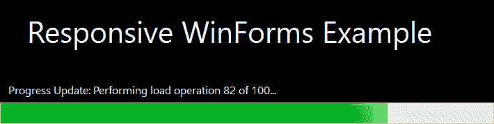
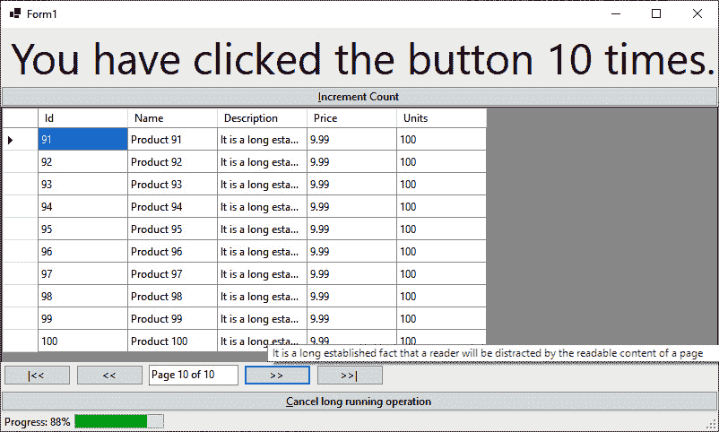
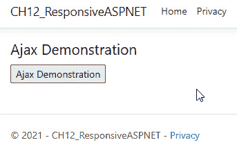
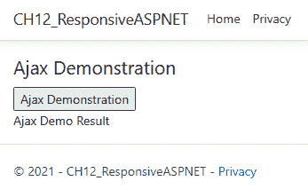
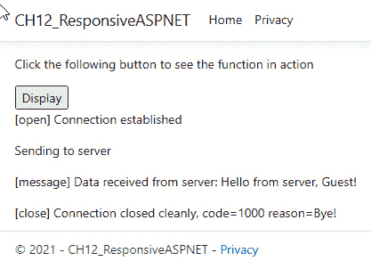
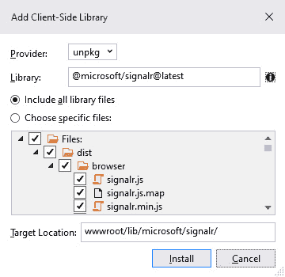
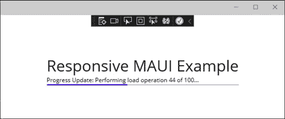
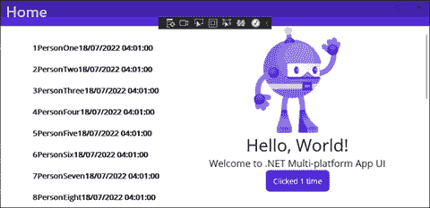

# *第十二章*：响应式用户界面

在本章中，你将学习如何编写响应式用户界面。你将编写响应式的 **Windows Forms**（**WinForms**）、**Windows Presentation Foundation**（**WPF**）、ASP.NET、.NET MAUI 和 WinUI 应用程序。通过使用后台工作线程，你将了解如何在后台运行长时间运行的任务，从而实时更新和与 **用户界面**（**UI**）交互。

在本章中，我们将探讨以下主题：

+   **使用 WinForms 构建响应式 UI**：在本节中，你将编写一个简单的 WinForms 应用程序，该应用程序在执行多项任务的同时保持对用户交互的响应性。

+   **使用 WPF 构建响应式 UI**：在本节中，你将编写一个简单的 WPF 应用程序，该应用程序在执行多项任务的同时保持对用户交互的响应性。

+   **使用 ASP.NET 构建响应式 UI**：在本节中，你将编写一个简单的 ASP.NET 应用程序，该应用程序在执行多项任务的同时保持对用户交互的响应性。

+   **使用 .NET MAUI 构建响应式 UI**：在本节中，你将编写一个简单的 Xamarin.Forms 应用程序，该应用程序在执行多项任务的同时保持对用户交互的响应性。然后，你将通过更新库引用将项目从 Xamarin.Forms 迁移到 .NET MAUI。

+   **使用 WinUI 构建响应式 UI**：在本节中，你将编写一个简单的 WinUI 应用程序，该应用程序在执行多项任务的同时保持对用户交互的响应性。

通过学习本章，你将获得以下技能：

+   使用后台工作线程保持 UI 响应

+   使用等待屏幕在用户需要等待时提供更新

+   使用 AJAX、WebSockets、SignalR 和 gRPC/gRPC-Web 发送和接收数据以及传输资产

+   编写响应式桌面、Web 和移动 UI

    注意

    为了澄清，当在本章中讨论响应式 UI 时，我们不是在谈论 UI 布局适应设备大小或屏幕可用空间。相反，我们专注于使忙碌的 UI 对用户输入做出响应，而不是在任务执行期间阻止用户工作。

# 技术要求

+   Visual Studio 2022 或更高版本。

+   本章源代码可在 [`github.com/PacktPublishing/High-Performance-Programming-in-CSharp-and-.NET/tree/master/CH12`](https://github.com/PacktPublishing/High-Performance-Programming-in-CSharp-and-.NET/tree/master/CH12) 获取。

# 使用 WinForms 构建响应式 UI

在本节中，我们将构建一个非常简单的 WinForms 应用程序，该应用程序对 **每英寸点数**（**DPI**）敏感，并允许用户在长时间运行的操作期间继续工作。应用程序具有带有进度条和更新标签的启动画面，为用户提供视觉反馈，表明应用程序正在忙于加载。一旦加载进度完成，启动画面关闭，主窗口显示。

在主窗口中，有一个标签，每次点击增加计数按钮时都会更新，一个可以通过提供的按钮进行导航的分页表格，以及一个用于长时间运行任务的进度指示器，它还有一个取消按钮。

在长时间运行的任务执行期间，您可以移动窗口，通过点击增加计数按钮来增加标签，并且您可以浏览数据。如果您选择的话，您还可以取消长时间运行的任务。

当长时间运行的任务完成、取消或遇到错误时，任务进度面板将被隐藏。

## 启用 DPI 感知和长文件路径感知

在本节中，我们将配置一个 WinForms 应用程序，使其在高 DPI 屏幕和普通 DPI 大屏幕上看起来很好。我们还将其配置为能够识别长文件路径。请按照以下步骤操作：

1.  启动一个新的.NET 6 WinForms 应用程序，并将其命名为`CH12_ResponsiveWinForms`。

1.  添加一个新的*应用程序清单*文件。

1.  打开`app.manifest`文件并更新`compatibility`部分如下：

    ```cs
    <compatibility xmlns=”urn:schemas-microsoft-
        com:compatibility.v1”>
        <application>
          <supportedOS 
            Id=”{e2011457-1546-43c5-a5fe-008deee3d3f0}” />
          <supportedOS 
            Id=”{35138b9a-5d96-4fbd-8e2d-a2440225f93a}” />
          <supportedOS 
            Id=”{4a2f28e3-53b9-4441-ba9c-d69d4a4a6e38}” />
          <supportedOS 
            Id=”{1f676c76-80e1-4239-95bb-83d0f6d0da78}” />
          <supportedOS 
            Id=”{8e0f7a12-bfb3-4fe8-b9a5-48fd50a15a9a}” />
        </application>
      </compatibility>
    ```

此 XML 代码使 Windows Vista 及更高版本的 WinForms 应用程序具有 DPI 感知能力。

1.  取消以下`application`部分的注释：

    ```cs
    <application xmlns=”urn:schemas-microsoft-com:asm.v3”>
         <windowsSettings>
              <dpiAware xmlns=””>
                 True
             </dpiAware>
              <longPathAware xmlns=””>
                 True
             </longPathAware>
            </windowsSettings>
    </application>
    ```

此代码通知编译器应用程序具有对长路径和 DPI 设置的感知能力。有了这些设置，应用程序现在将根据不同的屏幕 DPI 设置进行缩放，并且能够处理长达 256 个字符的长路径。

在下一节中，我们将添加一个带有加载进度反馈的启动画面。

## 添加一个随着加载进度更新的启动画面

应用程序可以非常快速地加载，或者加载相当缓慢。当它们正在加载时，用户并不知道应用程序正在做什么。您可以选择显示启动画面作为您应用程序品牌的一部分。如果您的应用程序加载速度快，那么您可能需要添加一个短暂的延迟，例如 3 秒，以便用户能够看到启动画面。否则，用户可能看到的只是屏幕快速闪烁。

如果应用程序有一些需要花费时间处理的繁重加载操作，用户可能会认为有问题，程序已崩溃。因此，提供提供视觉反馈的启动画面是一种良好的做法。这样，用户就知道应用程序正在忙于处理，并没有崩溃。当用户看到这样的反馈时，他们会更有耐心，并等待应用程序加载完成。

在本节中，我们添加了一个带有视觉反馈的启动画面。主窗口通过延迟模拟几个加载操作。然后，关闭启动画面并显示主窗口。现在，我们将开始添加必要的代码：

1.  添加一个名为`SplashScreenForm`的新表单，并将其**FormBorderStyle**属性更改为**None**，**StartPosition**属性更改为**CentreScreen**。将**BackColor**属性更改为**ActiveCaptionText**。

1.  在表单中添加一个`LoadingProgressBar`并将其停靠到表单底部。

1.  向 `LoadingProgressLabel` 添加一个标签并将其停靠到表单底部，使其出现在进度条上方。将 **Text** 属性设置为 **Loading. Please wait…**，并将 **Font** | **Size** 设置为 **12**。将 **ForeColor** 属性更改为 **HighlightWhite**。将 **Margin** | **All** 和 **Padding** | **All** 设置为 **8**。

1.  向 `TitleLabel` 添加另一个标签，其 **Text** 属性设置为 **Responsive WinForms Example**，**ForeColor** 设置为 **HighlightText**，**Font** | **Size** 设置为 **32**，并将 **Location** 设置为 **29, 126**。

1.  重命名 `MainForm` 并打开表单。双击 WindowsForm。这将打开代码窗口。

1.  向 `MainForm` 类添加以下 `using` 语句：

    ```cs
    using System;
    using System.Collections.Generic;
    using System.ComponentModel;
    using System.Threading;
    using System.Windows.Forms;
    ```

这些 `using` 语句为我们启动画面的代码提供了所需的所有功能。

1.  向 `MainForm` 类添加以下成员变量：

    ```cs
    private int _clickCounter;
        private int _operationNumber;
            private int _offset = 0;
        private int _pageSize = 10;
        private int _currentPage = 1;
    ```

这些成员变量将在我们的 `MainForm` 类的各个方法中被引用，以提供分页、内存数据存储以及存储正在处理操作的点击计数和操作编号。

1.  按照以下方式更新 `MainForm_Load` 方法：

    ```cs
    private void MainForm_Load(object sender, EventArgs e)
    {
        SplashScreenForm splashScreen = new 
            SplashScreenForm();
         splashScreen.Show(this);
        for (int x = 1; x <= 100; x++)
        {
             Thread.Sleep(500);
            splashScreen.UpdateProgress(x, $”Progress 
               Update: Performing load operation {x}
                   of 100...”);
             Application.DoEvents();
         }
        splashScreen.Close();
    }
    ```

此代码创建我们的启动画面，然后迭代 100 次，模拟许多加载操作。每次迭代都会使 UI 线程休眠半秒，更新启动画面进度，并通过调用 `Application.DoEvents()` 释放线程，以便其他线程可以通过调用 `Application.DoEvents()` 来执行它们的工作。

1.  打开 **SplashScreenForm** 并查看其代码。添加以下方法：

    ```cs
    public void UpdateProgress(int value, string message)
    {
            LoadingProgressBar.Value = value;
            LoadingProgressLabel.Text = message;
            Invalidate();
    }
    ```

此代码从 `MainForm` 类获取输入，并更新启动画面的标签和进度条，向用户提供应用程序正在加载和进度的反馈。

我们现在已经完成了进度条。如果您运行代码，您将看到以下启动画面：



图 12.1 – WinForms 启动画面

现在我们的启动画面已经工作，让我们添加显示按钮点击增量计数的标签和按钮。

## 添加增量计数按钮和标签

为了演示在执行长时间操作时 UI 不会被阻塞，我们将有一个标签，每次用户点击按钮时都会更新其文本。在我们的代码中，我们需要执行以下任务：

1.  向 `MainForm` 添加一个名为 `ClickCounterLabel` 的标签并将其停靠到顶部。将其文本设置为空字符串，文本属性设置为 **Segoe UI** 和 **36pt**，并将 **TextAlign** 设置为 **MiddleCenter**。

1.  向表单添加一个名为 `IncrementCountButton` 的按钮并将其停靠到表单顶部。将其文本设置为 **&Increment Text**。

1.  *双击* 按钮，生成其点击事件。更新点击事件的代码如下：

    ```cs
    private void IncrementCountButton_Click(object sender, 
        EventArgs e)
        {
            _clickCounter++;
            ClickCounterLabel.Text = $”You have clicked 
                the button {_clickCounter} times.”;
    }
    ```

每次用户点击按钮，`_clickCounter` 变量就会增加一。然后更新 `ClickCounterLabel` 文本，通知用户他们点击按钮的次数。

接下来，我们将添加一个带有分页导航的表格。我们将在下一节中完成这项工作。

## 添加具有分页数据的表格

在本节中，我们将添加一个带有分页导航的表格。这将演示，即使在后台运行长时间操作时，用户仍然可以通过 WinForms 应用程序中的数据与页面进行交互。让我们开始：

1.  添加 `DataTable`，并设置其 **Dock** 属性为 **Fill**。

1.  添加 `DataPagingPanel`，将其 **Dock** 属性设置为 **Bottom**。

1.  在 `FirstButton` 上添加一个按钮，文本设置为 **|<<**。*双击* 按钮以生成点击事件。然后，返回到设计窗口。

1.  在 `PreviousButton` 上添加一个按钮，文本设置为 **<<**。*双击* 按钮以生成点击事件。然后，返回到设计窗口。

1.  在 **FlowLayoutPanel** 中添加一个名为 `PageTextBox` 的文本框。

1.  在 **FlowLayoutPanel** 中添加一个名为 `NextButton` 的按钮，文本设置为 **>>**。*双击* 按钮以生成其点击事件。然后，返回到设计窗口。

1.  在 **FlowLayoutPanel** 中添加一个名为 `LastButton` 的按钮，文本设置为 **>>|**。*双击* 按钮以生成其点击事件。这次，保持代码视图，因为我们已经完成了本节 UI 需要完成的工作。

1.  添加 `BuildCollection` 方法：

    ```cs
    private void BuildCollection()
    {
        _products = new();
        for (int x = 1; x <= 100; x++)
        {
            _products.Add(new Product { Id = x, Name = 
                $”Product {x}” });
    }
    }
    ```

此方法构建一个包含 `100` 个产品的集合。

1.  在 `SplashScreenForm` 实例化行之前，将 `BuildCollection` 方法的调用添加到 `MainForm_Load` 方法中。

1.  在关闭启动屏幕的行之后，添加以下两行代码：

    ```cs
    DataTable.DataSource = PagedProducts();
    PageTextBox.Text = $”Page {_currentPage} of 
        {PageCount()}”;
    ```

此代码设置 `PagedProducts` 方法的数据源。

1.  添加 `PagedProducts` 方法：

    ```cs
    private List<Product> PagedProducts()
        {
            return _products.GetRange(_offset, _pageSize);
    }
    ```

此方法从 `_products` 集合返回一个范围。`_offset` 变量存储构成返回集合起始点的索引值，`_pageSize` 变量存储每页要返回的记录数。

1.  添加 `PageCount` 方法：

    ```cs
    private int PageCount()
        {
         return _products.Count / _pageSize;
    }
    ```

此方法获取 `_products` 集合中包含的产品数量，将该数量除以 `_pageSize` 变量，然后返回结果。结果是我们可以导航的数据页数。

1.  按如下方式更新 `FirstButton_Click` 方法：

    ```cs
    private void FirstButton_Click(object sender, 
        EventArgs e)
        {
            if (_currentPage > 1)
            {
                _offset = 0;
                _currentPage = 1;
                PageTextBox.Text = $”Page {_currentPage} 
                    of {PageCount()}”;
                DataTable.DataSource = PagedProducts();
         }
    }
    ```

此代码将数据集的第一页移动到当前页，并相应地更新 UI。

1.  使用以下代码更新 `PreviousButton_Click` 方法：

    ```cs
        private void PreviousButton_Click(object sender, 
            EventArgs e)
        {
            if (_currentPage > 1)
            {
                _offset -= _pageSize;
                _currentPage--;
                PageTextBox.Text = $”Page {_currentPage} 
                     of {PageCount()}”;
                DataTable.DataSource = PagedProducts();
         }
    }
    ```

此代码将数据集的前一页移动到当前页，并相应地更新 UI。

1.  添加 `NextButton_Click` 方法代码：

    ```cs
    private void NextButton_Click(object sender,
        EventArgs e)
        {
            if (_currentPage < PageCount())
            {
                _offset += _pageSize;
                _currentPage++;
                PageTextBox.Text = $”Page {_currentPage} 
                    of {PageCount()}”;
                DataTable.DataSource = PagedProducts();
         }
    }
    ```

此代码将数据集的下一页移动到当前页，并相应地更新 UI。

1.  添加 `LastButton_Click` 方法代码：

    ```cs
    private void LastButton_Click(object sender,
        EventArgs e)
        {
            if (_currentPage < PageCount())
            {
                _offset = _products.Count - _pageSize;
                _currentPage = PageCount();
                PageTextBox.Text = $”Page {_currentPage} 
                    of {PageCount()}”;
                DataTable.DataSource = PagedProducts();
         }
    }
    ```

此方法将数据集的最后页移动到当前页，并相应地更新 UI。

1.  最后，添加 `Product` 类：

    ```cs
    internal class Product
    {
        public int Id { get; set; }
        public string Name { get; set; }
        public string Description { get; set; } = “It is a 
          long established fact that a reader will be 
            distracted by the readable content of a page 
              when looking at its layout.”;
        public float Price { get; set; } = 9.99F;
        public int Units { get; set; } = 100;
    }
    ```

此类是 `Product` 类，我们的 `MainForm` 在其 `BuildCollection` 方法中使用它来构建其产品列表。

我们现在已经构建了我们的分页数据表，并且我们的增量按钮和标签已经就位。我们表单的最后一件事是添加我们的长时间运行的任务，以表明用户交互仍然可能，而不会因为长时间运行的任务而被阻塞。这将是下一节的主题。

## 在后台运行长时间运行的任务

在本节中，我们将升级我们的 UI 以显示在后台运行的长运行任务的进度。用户可以在任何时候取消长时间运行的任务。当任务完成时，无论其状态如何，长时间运行的任务更新进度控件将从用户隐藏。让我们开始添加代码：

1.  添加一个 `LongRunningOperationCancelButton` 并将其文本设置为 `&取消长时间运行操作`。

1.  添加一个 `StatusBar`。

1.  添加一个 `TaskProgressBar`。

1.  添加一个 `StatusLabel` 并确保其文本属性为空。

1.  添加一个 `CollectionBuilderBackgroundWorker`。

1.  添加一个 `LongRunningProcessBackgroundWorker`。

1.  在 `MainForm` 类的构造函数中，添加以下三行：

    ```cs
    LongRunningProcessBackgroundWorker.DoWork += 
        LongRunningProcessBackgroundWorker_DoWork;
    LongRunningProcessBackgroundWorker.ProgressChanged += 
        LongRunningProcessBackgroundWorker_ProgressChanged;
    LongRunningProcessBackgroundWorker
        .RunWorkerCompleted += LongRunning
            ProcessBackgroundWorker_RunWorkerCompleted;
    ```

此代码为我们的 `BackgroundWorker` 添加了处理程序，该处理程序将负责执行长时间运行的任务。

1.  在 `MainForm_Load` 方法的最后行（在闭合括号之前）添加以下方法调用：`LongRunningProcess();`。

1.  添加以下 `LongRunningProcess` 方法：

    ```cs
    private void LongRunningProcess()
        {    
            if (LongRunningProcessBackgroundWorker.IsBusy 
                != true)
            {                
             LongRunningProcessBackgroundWorker
                 .RunWorkerAsync();
         }
        }
    ```

如果 `LongRunningProcessBackgroundWorker` 没有忙碌，则调用 `RunWorkerAsync` 方法的 `LongRunningProcessBackground Worker_DoWork` 将被执行。

1.  将 `LongRunningProcessBackgroundWorker_DoWork` 添加到 `MainForm` 类：

    ```cs
    private void LongRunningProcessBackgroundWorker_DoWork
        (object sender, DoWorkEventArgs e)
        {
            BackgroundWorker worker = sender as 
                BackgroundWorker;
        for (int i = 1; i <= 100; i++)
            {
                if (worker.CancellationPending == true)
                {
                    e.Cancel = true;
                    break;
               }
                else
                {
                    _operationNumber = i;
                    System.Threading.Thread.Sleep(100);
                    worker.ReportProgress((i / 100)
                        * 100);
             }
         }
    }
    ```

我们将发送者强制转换为 `BackgroundWorker` 并将其分配给我们的本地工作变量。然后，我们迭代 100 次。每次迭代时，我们将 `_operationNumber` 变量设置为循环计数变量的值，休眠 100 毫秒，然后调用工作者的 `ReportProgress` 方法，传入已完成的工作百分比。

1.  将 `LongRunningProcessBackgroundWorker_ProgressChanged` 方法添加到 `MainForm` 类：

    ```cs
    private void LongRunningProcessBackgroundWorker
        _ProgressChanged(object sender, ProgressChanged
            EventArgs e)
        {
            StatusLabel.Text 
            = ($”Progress: {_operationNumber}%”);
        TaskProgressBar.Value = _operationNumber;
            if (_operationNumber == 100)
        {
                Thread.Sleep(100);
                LongRunningOperationCancelButton
                .Visible = false;
            StatusBar.Visible = false;
        }
    }
    ```

此代码使用长运行任务的进度更新 UI。如果所有操作都已完成，则隐藏任务取消按钮和状态栏。

1.  将 `LongRunningProcessBackgroundWorker_RunWorkerCompleted` 方法添加到 `MainForm` 类：

    ```cs
    private void LongRunningProcessBackgroundWorker
        _RunWorkerCompleted(object sender, 
            RunWorkerCompletedEventArgs e)
        {
            if (e.Cancelled == true)
                StatusLabel.Text = “Canceled!”;
         else if (e.Error != null)
                StatusLabel.Text = “Error: “ + 
                    e.Error.Message;
         else
                StatusLabel.Text = “Done!”;
    }
    ```

当长时间运行的任务完成时，此方法将 `StatusLabel.Text` 执行到方法的输出，输出结果为 `Cancelled`、`Error` 或 `Done`。

1.  在完成并运行我们的 WinForms 应用程序之前，我们需要编写的最后一部分代码是向 `MainClass` 的 `LongRunningOperationButton_Click` 方法添加代码，如下所示：

    ```cs
    private void LongRunningOperationCancelButton
        _Click(object sender, EventArgs e)
    {
        if (LongRunningProcessBackgroundWorker
            .WorkerSupportsCancellation == true)
    {
            LongRunningProcessBackgroundWorker
                .CancelAsync();
            LongRunningOperationCancelButton.Visible = 
                false;
            StatusBar.Visible = false;
         }
    }
    ```

此代码检查任务是否支持取消。如果支持，则取消任务，并将取消按钮和状态栏从用户隐藏。

1.  运行代码。您应该看到*图 12.1*中显示的启动画面。然后，您应该看到类似于*图 12.2*所示的主窗口。移动窗口并点击递增计数按钮。此外，点击翻页按钮在数据集的不同数据页之间移动，并取消任务。您应该看到窗口完全响应您的输入，如下所示：



图 12.2 – Windows Forms 主应用程序窗口

如您所见，我们编写了一个功能丰富的 WinForms 应用程序。我们有一个启动画面，它向用户提供视觉反馈，这样他们就不会认为应用程序以任何方式崩溃，并且我们有一个在长时间运行的任务期间对用户输入保持响应的 UI。

现在我们已经有一个工作的 WinForms 应用程序，让我们将注意力转向 WPF。在下一节中，我们将把我们在 WinForms 应用程序中学到的知识应用到 WPF 应用程序中。

# 使用 WPF 构建响应式 UI

在本节中，我们将构建与 WinForms 应用程序相同的界面，但这次将使用 WPF。我们现在将开始编写我们的代码：

1.  创建一个名为`CH12_ResponsiveWPF`的新 WPF 应用程序，并确保选择**.NET 6.0**作为目标框架。

1.  将`Product`类添加到项目中。它与我们在 WinForms 应用程序中使用的代码相同。

1.  添加一个名为`SplashWindow`的新窗口。

1.  按如下方式修改**SplashWindow** XAML：

    ```cs
    <Window x:Class=”CH12_ResponsiveWPF.SplashWindow”    
           xmlns=””
           xmlns:x=””
           xmlns:d=””
           xmlns:mc=””
           xmlns:local=”clr-namespace:CH12_ResponsiveWPF”
           mc:Ignorable=”d” 
           Background=”White”        
           Foreground=”White” 
           WindowStyle=”None”
           WindowStartupLocation=”CenterScreen”
           Title=”SplashWindow” Height=”450” Width=”800”>
        <StackPanel HorizontalAlignment=”Center” 
            VerticalAlignment=”Center”>
            <Label TextBlock.FontSize=”32” 
                Content=”Responsive WPF Example” />
            <Label x:Name=”LoadingProgressLabel” 
                TextBlock.FontSize=”12” 
                    Content=”Loading...” />
            <ProgressBar x:Name=”LoadingProgressBar” 
                Minimum=”0” Maximum=”100” />
        </StackPanel>
    </Window>
    ```

我们刚刚更新的 XAML 声明了一个包含两个标签和进度条的堆叠面板。第一个标签显示标题，第二个标签显示与进度条一起的加载进度。

1.  将以下方法添加到`SplashWindow`类中：

    ```cs
    public void UpdateProgress(int value, string message)
    {
        LoadingProgressBar.Value = value;
        LoadingProgressLabel.Content = message;
        InvalidateVisual();
    }
    ```

这段代码将由`MainWindow`类调用，并负责更新**SplashWindow**上的进度指示器。

1.  打开`MainWindow.xaml`文件，并用以下内容替换现有的 XAML：

    ```cs
    <StackPanel HorizontalAlignment=”Stretch” 
        VerticalAlignment=”Stretch” Background=”Red”>
        <Label x:Name=”CounterLabel” FontSize=”32” 
            Foreground=”Yellow” Margin=”8” Padding=”8” />
            <Button x:Name=”IncrementCounterButton” 
            Content=”Increment Counter” 
            Click=”IncrementCounterButton_Click” 
            HorizontalAlignment=”Center” Padding=”8” 
            Margin=”0, 0, 0 , 8” />
            <DataGrid x:Name=”DataTable” />
            <StackPanel Orientation=”Horizontal” 
                HorizontalAlignment=”Center” Margin=”0, 4, 
                    0, 4”>
                <Button x:Name=”FirstButton” 
                Content=”|&lt;&lt;” 
              Click=”FirstButton_Click” Margin=”4” 
              Padding=”8” />
                <Button x:Name=”PreviousButton” 
                Content=”&lt;&lt;” 
                Click=”PreviousButton_Click” Margin=”4” 
                Padding=”8” />
                <Label x:Name=”PageLabel” 
                Background=”White” Foreground=”Black” 
                Width=”110” Height=”32” 
                VerticalContentAlignment=”Center” />
                <Button x:Name=”NextButton” 
                Content=”&gt;&gt;” 
                Click=”NextButton_Click” Margin=”4” 
                Padding=”8” />
                <Button x:Name=”LastButton” 
                Content=”&gt;&gt;|” 
                Click=”LastButton_Click” Margin=”4” 
                Padding=”8” />
            </StackPanel>
            <StackPanel x:Name=”StatusPanel” 
            VerticalAlignment=”Bottom” 
            Orientation=”Horizontal” Background=”Yellow”>
                <Label x:Name=”StatusLabel” 
                Content=”Progress Update: ...” />
                <ProgressBar x:Name=”TaskProgressBar” 
                Minimum=”0” Maximum=”100” Width=”500” />
                <Button x:Name=”CancelTaskButton” 
                Content=”Cancel Task” 
                Click=”CancelTaskButton_Click” />
            </StackPanel>
        </StackPanel>
    ```

此 XAML 提供了一个状态面板，将显示任何后台任务的进度，一个递增标签和一个递增按钮，一个数据网格，以及用于翻页不同数据页面的导航面板。

1.  将以下`using`语句添加到`MainWindow.xaml.cs`文件中：

    ```cs
    using System;
    using System.Collections;
    using System.Collections.Generic;
    using System.ComponentModel;
    using System.Threading;
    using System.Windows;
    using System.Windows.Threading;
    ```

这些`using`语句对于我们的 WPF 窗口正常工作是必需的。

1.  将以下成员变量添加到`MainWindow`类中：

    ```cs
    private int _clickCounter;
    private int _operationNumber;
    private List<Product> _products;
    private int _offset = 0;
    private int _pageSize = 10;
    private int _currentPage = 1;
    BackgroundWorker _worker;
    ```

在这里，我们有与 WinForms 应用程序相同的变量，除了我们声明了一个后台工作线程。

1.  使用以下代码更新`MainWindow`构造函数：

    ```cs
    public MainWindow()
    {
        InitializeComponent();
        BuildCollection();
        SplashWindow splashWindow = new SplashWindow();
        splashWindow.Show();
        for (int x = 1; x <= 100; x++)
        {
            Thread.Sleep(100);
            splashWindow.UpdateProgress(x, $”Progress 
                Update: Performing load operation {x} of 
                    100...”);
            DoEvents();
    }
        splashWindow.Close();
        DataTable.ItemsSource = PagedData();
        PageLabel.Content = $”Page {_currentPage} of 
            {PageCount()}”;
         _worker = new BackgroundWorker();
        _worker.WorkerReportsProgress = true;
        _worker.WorkerSupportsCancellation = true;
        _worker.DoWork += Worker_DoWork;
        _worker.ProgressChanged += Worker_ProgressChanged;
        _worker.RunWorkerCompleted +=
             Worker_RunWorkerCompleted;
        _worker.RunWorkerAsync();
    }
    ```

这段代码基本上与我们的 WinForms 加载方法相同。唯一的真正区别是我们所有的初始化代码都在构造函数中。

1.  添加`Worker_DoWork`方法：

    ```cs
    private void Worker_DoWork(object sender, 
        DoWorkEventArgs e)
    {
        BackgroundWorker worker = sender as 
            BackgroundWorker;
    for (int i = 1; i <= 100; i++)
        {
            if (worker.CancellationPending == true)
            {
                e.Cancel = true;
                break;
         }
            else
            {
                _operationNumber = i;
                System.Threading.Thread.Sleep(100);
                 worker.ReportProgress((i / 100) * 100);
            }
         }
    }
    ```

这段代码模拟了 100 个操作的工作，每个操作之间有短暂的延迟。

1.  添加`Worker_ProgressChanged`方法代码：

    ```cs
    private void Worker_ProgressChanged(object sender, 
        ProgressChangedEventArgs e)
    {
        StatusLabel.Content = ($”Progress: 
            {_operationNumber}%”);
        TaskProgressBar.Value = _operationNumber;
    }
    ```

这段代码更新了长时间运行任务的进度指示器。

1.  添加 `Worker_RunWorkerCompleted` 方法：

    ```cs
    private void Worker_RunWorkerCompleted(object sender, 
        RunWorkerCompletedEventArgs e)
    {
        if (e.Cancelled == true)
            StatusLabel.Content = “Cancelled!”;
        else if (e.Error != null)
            StatusLabel.Content = “Error: “ + e.Error.
              Message;
        else
            StatusLabel.Content = “Done!”;
    Thread.Sleep(1500);
        StatusPanel.Visibility = Visibility.Collapsed;
    }
    ```

此方法报告长时间运行任务的结果，然后从最终用户那里隐藏状态面板。

1.  添加 `PagedData` 方法：

    ```cs
    private IEnumerable PagedData()
    {
        return _products.GetRange(_offset, _pageSize);
    }
    ```

此方法返回一个数据页，其索引从 `_offset` 开始，返回的行数由 `_pageSize` 定义。

1.  添加 `DoEvents` 方法：

    ```cs
    public static void DoEvents()
    {
        Application.Current.Dispatcher
             .Invoke(DispatcherPriority.Render, 
                 new Action(delegate { 
                    // Your operation goes here.
                }));
    }
    ```

此代码的行为类似于 WinForms 的 `Application.DoEvents()` 代码。您可以将非 UI 阻塞代码放在这里，并更新 UI。

1.  添加 `BuildCollection` 方法：

    ```cs
    private void BuildCollection()
    {
        _products = new();
        for (int x = 1; x <= 100; x++)
        {
            _products.Add(new Product { Id = x, Name = 
                $”Product {x}” });
         }
    }
    ```

`BuildCollection` 方法构建我们的 100 个产品数据集。

1.  添加 `PageCount` 方法：

    ```cs
    private int PageCount()
    {
        return _products.Count / _pageSize;
    }
    ```

`PageCount` 方法根据数据集大小和页面大小计算数据页数，然后返回结果。

1.  添加 `FirstButton_Click` 方法：

    ```cs
    private void FirstButton_Click(object sender, 
        RoutedEventArgs e)
    {
        if (_currentPage > 1)
        {
            _offset = 0;
            _currentPage = 1;
            PageLabel.Content = $”Page {_currentPage} of 
                {PageCount()}”;
            DataTable.ItemsSource = PagedData();
        }
    }
    ```

当执行时，此方法将导航到我们数据集的第一条记录，并相应地升级 UI。

1.  添加 `PreviousButton_Click` 方法：

    ```cs
    private void PreviousButton_Click(object sender, 
        RoutedEventArgs e)
    {
        if (_currentPage > 1)
        {
            _offset -= _pageSize;
            _currentPage--;
            PageLabel.Content = $”Page {_currentPage} of 
                {PageCount()}”;
            DataTable.ItemsSource = PagedData();
    }
    }
    ```

此方法将移动到数据集的前一页，并相应地更新 UI。

1.  添加 `NextButton_Click` 代码：

    ```cs
    private void NextButton_Click(object sender, 
        RoutedEventArgs e)
    {
        if (_currentPage < PageCount())
        {
            _offset += _pageSize;
            _currentPage++;
            PageLabel.Content = $”Page {_currentPage} of 
                {PageCount()}”;
            DataTable.ItemsSource = PagedData();
         }
    }
    ```

此方法移动到数据集的下一页，并相应地更新 UI。

1.  添加 `LastButton_Click` 方法：

    ```cs
    private void LastButton_Click(object sender, 
        RoutedEventArgs e)
    {
        if (_currentPage < PageCount())
        {
            _offset = _products.Count - _pageSize;
            _currentPage = PageCount();
            PageLabel.Content = $”Page {_currentPage} of 
                {PageCount()}”;
            DataTable.ItemsSource = PagedData();
    }
    }
    ```

此方法移动到最后一个数据集页面，并相应地更新 UI。

1.  添加 `IncrementCounterButton_Click` 方法：

    ```cs
    private void IncrementCounterButton_Click(object 
        sender, RoutedEventArgs e)
    {
        _clickCounter++;
        CounterLabel.Content = $”You have clicked the 
            button {_clickCounter} times.”;
    }
    ```

每次您点击 `IncrementCounterButton`，此方法将增加 `_clickCounter` 变量，并在屏幕上报告您点击按钮的次数。

1.  添加最终名为 `CancelTaskButton_Click` 的 WPF 方法：

    ```cs
    private void CancelTaskButton_Click(object sender, 
        RoutedEventArgs e)
    {
        if (_worker.WorkerSupportsCancellation == true)
            _worker.CancelAsync();
    }
    ```

如果支持取消，此方法将取消长时间运行的任务。

1.  运行 WPF 应用程序。您将看到显示加载进度的启动屏幕，如下所示：

![Figure 12.3 – WPF 应用程序的启动屏幕

![img/Figure_12.03_B16617.jpg]

图 12.3 – WPF 应用程序的启动屏幕

加载完成后，启动屏幕关闭，您将看到主窗口。在长时间运行的任务进行时，您可以移动窗口，点击增加计数器按钮，浏览分页数据，并取消长时间运行的任务。

如以下截图所示，我们已准备好一切，为最终用户提供进度视觉反馈，并在长时间运行的任务期间保持对用户输入的响应性 UI：

![Figure 12.4 – WPF 应用程序的主窗口

![img/Figure_12.04_B16617.jpg]

图 12.4 – WPF 应用程序的主窗口

在下一节中，我们将探讨如何保持 ASP.NET UI 对用户输入的响应性。

# 使用 ASP.NET 构建响应式 UI

在本节中，我们将探讨如何帮助 ASP.NET 应用程序快速响应。我们将首先查看内存和分布式缓存。然后，我们将探讨如何使用 AJAX 更新页面的一部分。接下来，我们将编写一个实时聊天应用程序，使用 SignalR。然后，我们将探讨在 ASP.NET 应用程序中使用 WebSockets。

注意

在本章中，我们将不会介绍 gRPC-Web，因为我们已经在 *第九章* 中通过示例代码介绍了该主题，即 *增强网络应用程序的性能*，其中我们探讨了 gRPC 用于非 Web 应用程序和 gRPC-Web 用于 Web 应用程序。在本章中，我们还使用 gRPC-Web 实现了一个简单的 Blazor Web 应用程序，因此你可以参考本章以了解 gRPC/gRPC-Web。

让我们通过关注缓存来开始查看一个响应式 ASP.NET 应用程序。我们将查看两种类型的缓存。这些是 **内存缓存** 和 **分布式缓存**。在下一节中，我们将实现内存缓存。

## 实现内存缓存

Web 应用程序通过网络（我们所有人都知道的网络）加载资源。从互联网访问、下载和渲染资源需要不同程度的时间。时间可能会因网络流量、网络质量以及计算机系统资源而变化。我们有没有办法加快这个过程？嗯，是的。我们可以实现缓存。但缓存究竟是什么呢？

**缓存**是将频繁访问的资源本地存储以提高访问和处理速度的一种方式。

在本节中，你将看到我们如何在 ASP.NET 中轻松实现内存缓存。要实现内存缓存，请按照以下步骤操作：

1.  开始一个新的 ASP.NET Core Web 应用程序（模型-视图-控制器）项目，并将其命名为 `CH12_ResponsiveASPNET`。

1.  添加 `Microsoft.Extensions.Caching.Memory` NuGet 包。如果 Visual Studio 无法安装它，请在包管理器中运行以下命令：

    ```cs
    Install-Package Microsoft.Extensions.Caching.Memory -
    Version 6.0.0-preview.7.21377.19 
    ```

1.  在 `HomeController` 类中，添加语句 `using Microsoft.Extensions.Caching.Memory`。

1.  添加以下成员变量：

    ```cs
    private readonly ILogger<HomeController> _logger;
    private IMemoryCache _memoryCache;
    ```

此代码声明了将存储我们的日志记录器和内存缓存对象的变量。

1.  如下更新 `HomeController` 构造函数：

    ```cs
    public HomeController(ILogger<HomeController> logger, 
        IMemoryCache memoryCache)
    {
      _logger = logger;
        _memoryCache = memoryCache;
    }
    ```

在此代码中，我们将注入我们将要使用的日志记录器和内存缓存对象，并传递变量以设置我们的成员变量。

1.  添加 `GetMemoryCacheTime` 方法：

    ```cs
    private DateTime GetMemoryCacheTime()
    {
        DateTime currentTime;
        bool alreadyExists = _memoryCache.TryGetValue
            (“CachedTime”, out currentTime);
        if (!alreadyExists)
        {
        currentTime = DateTime.UtcNow.ToLocalTime();
        _memoryCache.Set(
        “CachedTime”,
        currentTime,  MemoryCacheEntryExtensions
            .SetSlidingExpiration(
             new MemoryCacheEntryOptions() {  
                 SlidingExpiration
                     = TimeSpan.FromMinutes(5) },
                TimeSpan.FromMinutes(5)
         ));
        }
        return currentTime;
    }
    ```

在这里，我们检查我们的 `CachedTime` 变量是否存在于内存缓存中。如果它存在，则将 `currentTime` 变量设置并返回缓存的时长。否则，我们获取当前时间并将其存储在内存缓存中，并带有滑动过期值，然后返回缓存的时长。

1.  使用以下代码更新 `Index` 方法：

    ```cs
    [HttpGet]
    public string Index()
    {
    DateTime memoryCacheTime = GetMemoryCacheTime();
    return $”Current Time: {DateTime.UtcNow.ToLocalTime()}
        \nMemory Cache Time: {memoryCacheTime}”;
    }
    ```

`Index` 控制器方法返回一个字符串。返回的字符串是缓存的时长。

1.  运行项目并导航到 `https://localhost:5001/Home`。你应该会看到以下类似的输出：

**当前时间：2021 年 12 月 7 日 20:18:25**

**内存缓存时间：2021 年 12 月 7 日 20:18:25**

如你所见，时间不存在于缓存中，因此在返回之前被添加到缓存中。

注意

端口号的设置取决于端口的可用性。无论你选择哪个端口，如果它已被其他程序占用，则将无法工作。

1.  现在，刷新页面，你应该会看到当前时间和内存缓存时间的不同值：

**当前时间：12/07/2021 20:21:21**

**内存缓存时间：12/07/2021 20:18:25**

你可以清楚地看到内存缓存时间早于当前时间。这表明我们已经将时间存储在内存缓存中并成功检索。

在 ASP.NET 中实现内存缓存非常简单，你可以通过存储和检索内存缓存中的数据来提高页面加载和渲染时间。现在我们已经了解了内存缓存，我们将转向分布式缓存。

## 实现分布式缓存

在本节中，我们将使用相同的 ASP.NET Web 项目和控制器来实现分布式缓存。我们所说的分布式缓存是什么意思？分布式缓存扩展了本地缓存的概念，包括跨多台计算机的缓存。这种缓存使得事务数据的扩展成为可能。你主要会使用分布式缓存来存储位于数据库中的应用程序数据，以及与 Web 会话相关的数据。在本节中，我们使用 Redis 进行缓存。Redis 是一个内存数据结构存储，用作分布式、内存中的键值数据库、缓存和消息代理，具有可选的持久性。要实现分布式缓存，执行以下操作：

1.  将 `Microsoft.Extensions.Caching.Redis` NuGet 包添加到 Web 包中。你可以使用以下命令：

    ```cs
    Install-Package Microsoft.Extensions.Caching.Redis -
        Version 2.2.0
    ```

1.  在 `HomeController` 类中，添加 `using Microsoft.Extensions.Caching.Distributed` 语句。

1.  添加以下成员变量：

    ```cs
    private IDistributedCache _distributedCache;
    ```

这个变量将保存我们的分布式缓存对象，该对象通过构造函数注入。

1.  现在，更新构造函数代码：

    ```cs
    public HomeController(ILogger<HomeController> logger, 
        IMemoryCache memoryCache, IDistributedCache 
            distributedCache)
    {
        _logger = logger;
        _memoryCache = memoryCache;
        _distributedCache = distributedCache;
    }
    ```

我们正在注入分布式缓存对象并设置我们的成员变量。

1.  要使用我们的分布式缓存，我们需要对 Base64 字符串进行编码和解码。添加以下两个方法：

    ```cs
    private static string Base64Encode(string text)
    {
        byte[] bytes = Encoding.UTF8.GetBytes(text);
        return Convert.ToBase64String(bytes);
    }
    public static string Base64Decode(string text)
    {
        byte[] bytes = Convert.FromBase64String(text);
        return Encoding.UTF8.GetString(bytes);
    }
    ```

在这两个方法中，我们将字符串编码为 Base64 编码的字符串，同时也将字符串从 Base64 解码为 UTF8。

1.  添加 `GetDistriutedCacheString` 方法：

    ```cs
    private string GetDistributedCacheString()
    {
      string data = _distributedCache.GetString
          (“StringValue”);
      if (data == null)
      {
         data = Base64Encode($”Hello, World! 
              {DateTime.UtcNow.ToLocalTime()}”);
         _distributedCache.Set(“StringValue”,
         Convert.FromBase64String(data),
        new DistributedCacheEntryOptions()
        {
                 AbsoluteExpiration 
                 = DateTime.UtcNow.AddMinutes(10),
        });
        data = Base64Decode(data);
      }
    return data;
    }
    ```

在此代码中，我们从缓存中获取字符串数据。如果存在，则返回它。如果不存在，则将字符串的 Base64 编码版本保存到缓存中，并设置绝对过期时间，然后以 UTF 编码的字符串形式返回字符串的 Base64 解码版本。

1.  更新 `HomeController.Index` 方法，如下所示：

    ```cs
    [HttpGet]
    public string Index()
    {
    DateTime memoryCacheTime = GetMemoryCacheTime();
    string data = GetDistributedCacheString();
    return $”Current Time: {DateTime.UtcNow.ToLocalTime()}
        \nMemory Cache Time: {memoryCacheTime}
            \nDistributed Cache String: {data}”;
    }
    ```

此代码获取内存缓存和分布式缓存存储的数据，并将其输出给用户，显示当前时间、内存缓存时间和分布式缓存中的数据。

1.  运行程序并导航到 `https://localhost:5001`。你应该会看到以下输出：

    ```cs
    Current Time: 12/07/2021 21:05:59
    Memory Cache Time: 12/07/2021 21:05:59
    Distributed Cache String: Hello, World! 12/07/2021 
    21:05:59
    ```

我们可以看到，内存缓存时间和分布式缓存字符串都刚刚被添加到缓存中，因为它们与当前时间相同。现在，刷新你的浏览器。你应该会看到这两个缓存值都早于当前时间，如下所示：

```cs
Current Time: 12/07/2021 21:08:13
Memory Cache Time: 12/07/2021 21:05:59
Distributed Cache String: Hello, World! 12/07/2021 
21:05:59
It is plain to see that both cached values already 
existed in the cache, since they are older than the 
current time.
```

在本节和上一节中，您已经看到如何轻松地将内存和分布式缓存添加到我们的应用程序中。这两种缓存形式都可以在提高您的 ASP.NET Web 应用程序性能方面非常有用。在下一节中，我们将探讨如何使用 AJAX 更新当前显示页面的一个小部分。

## 使用 AJAX 更新当前显示页面的部分

在本节中，我们将使用 AJAX 来更新当前正在显示的页面的一部分。这样我们就不必加载整个页面。让我们开始编写我们的 AJAX 示例：

1.  右键单击 `Controllers` 文件夹。从上下文菜单中选择 **添加** | **控制器…**。然后，选择 **MVC 控制器 – 空的**。

1.  调用新的控制器`AjaxController`并打开类。

1.  通过添加以下方法来更新控制器：

    ```cs
    [Route(“Ajax/Demo”)]
    public IActionResult AjaxDemo()
    {
        return new JsonResult(“Ajax Demo Result”);
    }
    ```

当调用此方法时，将返回一个 JSON 结果，在我们的例子中是一个简单的字符串。

1.  *右键单击* `Index` 方法并选择 `index.cshtml`。

1.  使用以下 HTML 和 JavaScript 代码更新 `Views/Ajax/index.cshtml` 文件：

    ```cs
    <!DOCTYPE html>
    <html>
        <head>
            <meta name=”viewport” content=”width=device-
                width” />
            <title>Ajax Example</title>
        </head>
        <body>
            <fieldset>
                <legend>Ajax Demonstration</legend>
                <form>
                    <input type=”button” value=”Ajax 
                    Demonstration” id=”ajaxDemonstration
                    Button” />
                    <br />
                    <span id=”ajaxDemoResult”></span>
                </form>
            </fieldset>
            <script
                 src=”https://code.jquery.com/jquery-
                     3.6.0.slim.min.js”
                integrity=”sha256-u7e5khyithlIdTpu22P
                    HhENmPcRdFiHRjhAuHcs05RI=”
                crossorigin=”anonymous”
            >

            </script>
            <script>
                $(document).ready(function( ) {
                    $(‘#ajaxDemonstrationButton’)
                        .click(function() {
                        $.ajax({
                            type: ‘GET’,
                            url: ‘/Ajax/Demo’,
                            success: function (result) {
                              $(‘#ajaxDemoResult’)
                                .html(result);
                            }
                        });
                    });
                });            
            </script>
        </body>
    </html>
    ```

我们有一个 HTML 表单。该表单有一个按钮，当按下时，将执行 JavaScript，通过执行我们的`AjaxDemo`操作方法来检索 AJAX 数据。这将导致我们的 JSON 字符串在页面上显示。

1.  运行项目并导航到 `http://localhost:5001/Ajax`。您应该看到以下内容：




如您所见，我们的页面在没有我们的 JSON 字符串的情况下加载。现在，点击 **Ajax 演示** 按钮。您现在看到以下内容：




点击按钮后，我们可以看到 AJAX 操作检索了我们的 JSON 字符串，并在不进行完整页面加载的情况下将其显示在页面上。

我们已经看到如何使用 AJAX 更新页面的一部分，在此之前，我们看到了如何实现内存和分布式缓存。在下一节中，我们将探讨如何实现 WebSockets。

## 实现 WebSockets

在本节中，我们将实现 **WebSockets**。您可能已经听说过 WebSockets，但它们是什么？WebSocket 是一个全双工通信协议，用于通过单个 TCP 连接进行通信。要了解更多关于 WebSocket 规范的信息，您可以查阅 2011 年的 IETF RFC 6455（[`www.rfc-editor.org/rfc/rfc6455.txt`](https://www.rfc-editor.org/rfc/rfc6455.txt)）。

我们为什么要使用 WebSockets？嗯，我们可以使用它们在浏览器和服务器之间打开一个单一的双向交互会话。这样，我们可以取消服务器轮询，向服务器发送消息，并通过事件接收响应。从而使我们的应用程序成为事件驱动的。

在我们的 WebSocket 演示中，我们将点击一个按钮。它将打开一个 WebSocket，发送消息，接收响应，然后关闭连接。我们浏览器和服务器之间的通信将输出到我们的网页上。因此，让我们开始编写我们的 WebSocket 示例：

1.  添加一个名为`WebSocketsController`的新控制器。

1.  右键单击`Index`方法并从上下文菜单中选择**添加视图**。

1.  按照以下方式更新`Views/WebSockets/Index.cshtml`文件：

    ```cs
    <script type = “text/javascript”> 
        function WebSocketExample (){
            var socket = new WebSocket(“wss://
                javascript.info/article/websocket/
                    demo/hello”);
            var messages = document.getElementById
                (‘messages’)
            var innerHTML = messages.innerHTML;
            socket.onopen = function(e) {
                innerHTML += ‘<p>[open] Connection 
                    established</p>’;
                messages.innerHTML += innerHTML;
                innerHTML += ‘<p>Sending to server</p>’;
                messages.innerHTML += innerHTML;
                socket.send(‘WebSocket message!’);
            };
            socket.onmessage = function(event) {
                innerHTML += `<p>[message] Data received 
                    from server: ${event.data}</p>`;
            };
            socket.onclose = function(event) {  
                if (event.wasClean) {
                    innerHTML += `<p>[close] Connection 
                    closed cleanly, code=${event.code} 
                    reason=${event.reason}</p>`;
                messages.innerHTML = innerHTML;
                } else {
             // e.g. server process killed or network down
             // event.code is usually 1006 in this case
            innerHTML += ‘<p>[close] Connection died</p>’;
                    messages.innerHTML = innerHTML;
                }
            };
            socket.onerror = function(error) {
                innerHTML += `<p>[error] 
                    ${error.message}</p>`;
                messages.innerHTML = innerHTML;
            };
        }
    </script> 
    <p>Click the following button to see the function in 
        action</p>  
    <input type = “button” onclick = “WebSocketExample()” 
        value = “Display”>  
    <p id=”messages” onload=”WebSocketExample()”></p>
    ```

当通过按钮点击打开 WebSocket 时，`messages`段落会更新消息，然后向服务器发送一条消息。当服务器响应时，`messages`段落随后更新以通知用户服务器已响应。如果发生错误，则向用户显示一条消息。然后关闭 WebSocket 并在页面上显示一条消息。

1.  运行代码并导航到`http://localhost:5001/WebSockets`。点击按钮，你应该会得到以下结果：

![图 12.7 – 点击按钮并执行我们的 WebSocket 示例的最终结果]



图 12.7 – 点击按钮并执行我们的 WebSocket 示例的最终结果

WebSocket 的代码并不多。在这个示例中，我们发送了一条简单的消息并收到了响应。我们用于执行此操作的所有代码都存在于视图的`CSHTML`文件中。在下一节中，我们将探讨如何使用 SignalR 编写实时聊天程序。

## 使用 SignalR 实现实时聊天应用程序

在本节中，我们将学习如何使用 SignalR 在 ASP.NET web 应用程序中编写实时功能。我们将通过编写一个简单的聊天应用程序来演示 SignalR 的实际应用。现在，我们将开始编写应用程序：

1.  右键单击项目，并从上下文菜单中选择**添加** | **客户端库**，然后填写如图 12.8 所示的详细信息。然后，点击**安装**按钮：

![图 12.8 – 添加客户端库以配置安装 SignalR]



图 12.8 – 添加客户端库以配置安装 SignalR

1.  将`wwwroot/lib/microsoft/signalr`库复制并粘贴到`wwwroot/js`文件夹中。

1.  添加一个名为`SignalRController`的新控制器。

1.  在主项目根目录下添加一个名为`Hubs`的文件夹。

1.  在`Hubs`文件夹中添加一个名为`ChatHub`的类。然后，更新`ChatHub`类，如下所示：

    ```cs
    public class ChatHub : Hub
    {
         public async Task SendMessage(
             string user, string message
         )
         {
                 await Clients.All
                 .SendAsync(
                     “ReceiveMessage”, user, message
                 );
         }
    }
    ```

我们已经有了 SignalR hub 类，并且`SendMessage`方法异步地向指定用户发送消息。

1.  在`SignalRController`类的`Index`方法上右键单击，并从上下文菜单中选择**添加视图**。

1.  在`Views/SignalR/Index.cshtml`文件中，将现有内容替换为以下代码：

    ```cs
    @page
    <div class=”container”>
    <div class=”row”>&nbsp;</div>
         <div class=”row”>
             <div class=”col-2”>User</div>
               <div class=”col-4”>
                 <input type=”text” 
                     id=”userInput” />
             </div>
         </div>
         <div class=”row”>
             <div class=”col-2”>Message</div>
               <div class=”col-4”>
                 <input type=”text” 
                     id=”messageInput” />
             </div>
         </div>
         <div class=”row”>&nbsp;</div>
         <div class=”row”>
             <div class=”col-6”>
                  <input type=”button” 
                 id=”sendButton” value=”Send Message” />
              </div>
         </div>
    </div>
    <div class=”row”>
    <div class=”col-12”>
                 <hr />
         </div>
    </div>
    <div class=”row”>
    <div class=”col-6”>
                 <ul id=”messagesList”></ul>
         </div>
    </div>
    <script src=”~/js/signalr/dist/browser/signalr.js”>
        </script>
    <script src=”~/js/chat.js”></script>
    ```

我们已经构建了一个聊天 UI。脚本使用 SignalR。我们现在需要添加使我们的 UI 交互的 JavaScript。

1.  在`wwwroot/js`文件夹中，添加一个名为`chat.js`的文件，包含以下代码：

    ```cs
    “use strict”;
    var connection = new signalR.HubConnectionBuilder()
        .withUrl(“/chatHub”).build();
    document.getElementById(“sendButton”).disabled = true;
    connection.on(“ReceiveMessage”, function (user, 
        message) {
            var li = document.createElement(“li”);
         document.getElementById(“messagesList”)
             .appendChild(li);
         li.textContent = `${user} says ${message}`;
    });
    connection.start().then(function () {
            document.getElementById(“sendButton”)
             .disabled = false;
    }).catch(function (err) {
        return console.error(err.toString());
    });
    document.getElementById(“sendButton”)
         .addEventListener(“click”, function (event) {
             var user = document
                 .getElementById(“userInput”).value;
                 var message = document
                 .getElementById(“messageInput”).value;
             connection.invoke(
                 “SendMessage”, user, message
             ).catch(function (err) {
                     return console.error(err.toString());
                 });
                 event.preventDefault();
         });
    ```

我们添加了使我们的 UI 交互式的 JavaScript。此代码管理用户之间的聊天消息发送。

1.  在 `Program` 类中，添加以下服务：

    ```cs
    services.AddRazorPages();
    services.AddSignalR();
    ```

此代码将 SignalR 添加到我们的可用服务中，以便我们可以将 SignalR 请求传递给 SignalR。

注意事项

如果使用新的最小模板，代码是 `builder.Services.AddRazorPages(); builder.Services.AddSignalR();`。

1.  更新 `Program` 类以包含映射到我们的 `ChatHub` 的路由：

    ```cs
    app.MapHub<ChatHub>(“/chatHub”);
    ```

我们已经包含了到我们的 `ChatHub` 的路由，这样我们的聊天应用程序就知道如何处理传入的请求。

1.  运行代码并导航到 `https://localhost:5001/SignalR`。你需要两个并排的浏览器实例。在每个浏览器中输入用户名和消息，然后点击**发送消息**按钮。每次输入文本时，它都会出现在接收者的聊天页面上，就像这里所示：

![Figure 12.9 – Our SignalR application in action]

![img/Figure_12.09_B16617.jpg]

![Figure 12.9 – Our SignalR application in action]

设置和运行我们的 SignalR 比较直接。正如你所见，SignalR 是实时通信的一个优秀选择，我相信你将能够在你编写的网络应用程序中进一步运用这些知识。这就结束了本章关于 ASP.NET 的内容。现在，让我们继续下一节，看看 .NET MAUI。

# 使用 .NET MAUI 构建响应式 UI

Microsoft .NET MAUI 是 Xamarin.Forms 的新版本。在 Xamarin.Forms 5.0 版本和 .NET MAUI（Xamarin.Forms 6.0 版本）之间有一些重大变化。MAUI 最大的变化是将 Android、iOS 和 macOS 项目合并为一个主项目。虽然针对 Windows 的特定代码仍然位于其自己的项目中，但 Microsoft 正在努力将 Windows 代码包含到主项目中。这将使我们能够使用 C# 和 XAML 编写跨平台应用程序时拥有一个单一的项目。让我们看看使用 .NET MAUI 构建跨平台应用程序的其他一些改进。

注意事项

如果你使用的是 MAUI 的早期版本，要运行 Windows 项目，你需要将 Windows 项目设置为启动项目并部署项目。一旦项目部署完成，你就可以从 Windows 启动菜单中运行应用程序。

## 布局

在 .NET MAUI 中做出的另一个重大更改是，Xamarin.Forms 项目原本使用的布局已被移动到 `Microsoft.Maui.Controls.Compatibility` 命名空间。默认情况下，MAUI 将使用新的布局。这些布局基于一个新编写的 `LayoutManager`，它针对性能、一致性和可维护性进行了优化。新的布局包括 `Grid`、`FlexLayout` 和 `StackLayout`（`HorizontalStackLayout` 和 `VerticalStackLayout`）。Microsoft 鼓励你选择最适合你需求的堆叠布局。同时，也鼓励你用新的布局替换旧布局。

新布局的默认间距值已标准化为 0。将这些值设置为 0 设定了您将设置自己的首选值以满足设计要求的预期。最好在全局样式设置这些值，如下所示：

```cs
<ResourceDictionary>
```

```cs
    <Style TargetType=”StackLayout”>
```

```cs
        <Setter Property=”Spacing” Value=”8”/>
```

```cs
    </Style>
```

```cs
    <Style TargetType=”Grid”>
```

```cs
        <Setter Property=”ColumnSpacing” Value=”8”/>
```

```cs
        <Setter Property=”RowSpacing” Value=”8”/>
```

```cs
    </Style>
```

```cs
</ResourceDictionary>
```

让我们继续看看可访问性的改进。

## 可访问性

微软定期与那些致力于开发最高可访问性评级应用程序的开发者会面。这促使微软移除了`TabIndex`和`IsTabStop`属性，因为它们最终变得令人困惑，并且没有满足可访问性需求。为了提高可访问性，您可以通过实施深思熟虑的设计来提高屏幕阅读器识别 UI 阅读顺序的能力。如果您需要控制 UI 组件的顺序，微软建议您使用`SemanticOrderView`组件。

### SetSemanticFocus 和 Announce

屏幕阅读器是可访问且友好的应用程序的重要组成部分。为了帮助这些应用程序在读取正确组件方面的性能，有一个新的`SemanticExtensions`类。作为此类的一部分，有一个名为`SetSematicFocus`的新方法。此方法允许将屏幕阅读器的焦点设置到特定元素。

注意

在撰写本文时，`SetSemanticFocus`和`Announce`仅适用于 iOS、Android 和 Mac Catalyst。

这里是一个设置语义焦点的 XAML 示例：

```cs
<VerticalStackLayout>
```

```cs
    <Label
```

```cs
        Text=”SemanticExtensions:”
```

```cs
        TextColor=”Black”
```

```cs
        FontAttributes=”Bold”
```

```cs
        FontSize=”14”
```

```cs
        Margin=”0,8”/>
```

```cs
    <Button
```

```cs
        Text=”Semantic focus is applied to the label that 
```

```cs
            follows upon the button being pressed.”
```

```cs
        FontSize=”12”
```

```cs
        Clicked=”LabelFocusButton_Clicked”/>
```

```cs
    <Label
```

```cs
        x:Name=”SomeLabel”
```

```cs
        Text=”Hello, I am able to receive semantic focus!”
```

```cs
        FontSize=”12”/>
```

```cs
</VerticalStackLayout>
```

在这个 XAML 中，我们有一个指令标签和一个用户可以按下的按钮。当按钮被按下时，点击事件会将语义焦点设置到`semanticFocusLabel`。以下是点击事件代码：

```cs
private void LabelFocusButton_Clicked(object sender, 
```

```cs
    EventArgs e)
```

```cs
{
```

```cs
    SomeLabel.SetSemanticFocus();
```

```cs
}
```

以下代码使屏幕阅读器能够发出公告：

```cs
SemanticScreenReader.Announce(
```

```cs
    “Make your applications accessible to MAUI users!”
```

```cs
);
```

另一个可访问性新增功能是自动字体缩放。

### 字体缩放

默认情况下，所有组件现在都具有自动字体缩放，并且默认启用。这意味着当您的用户在各个平台上更改文本缩放时，您的应用程序的文本将自动缩放到他们选择的设置。您可以使用以下标记关闭自动字体缩放：`FontAutoScalingEnabled="False"`。将属性更改为`True`或删除它将重新启用字体自动缩放。

## BlazorWebView

使用 BlazorWebView，您可以在 Microsoft MAUI 应用程序中托管 Blazor 网站。这使得您的 Blazor 网站能够利用原生平台功能和各种用户控件。您可以将`BlazorWebView`添加到 XAML 页面，并将其指向 Blazor 应用程序的根：

```cs
<BlazorWebView HostPage=”wwwroot/index.html”
```

```cs
               Services=”{StaticResource Services}”>
```

```cs
     <BlazorWebView.RootComponent>
```

```cs
         <RootComponent Selector=”#app”
```

```cs
                ComponentType=”{x:Type local:Main}” />
```

```cs
     </BlazorWebView.RootComponent>
```

```cs
</BlazorWebView>
```

如您从 XAML 中看到的，我们 Blazor 应用程序的根是`wwwroot/index.html`。在下一节中，我们将探讨 WinUI 3。

注意

截至 2022 年 6 月 20 日，MAUI 已普遍可用，但为了开发 MAUI 应用程序，您需要安装.NET 2022 预览版。

# 使用 MAUI 构建响应式 UI

在本节中，我们将使用 MAUI 构建一个简单的响应式 UI。在 MAUI 包含在 Visual Studio 2022 之前，您需要确保您使用 Visual Studio 2022 预览版：

1.  启动一个新的.NET MAUI 应用程序，命名为`CH12_ResponsiveMAUI`。

1.  添加一个名为`Api`的新文件夹。

1.  在`Api`文件夹中，添加一个名为`PropertyChangedNotifier`的类，并用以下代码替换其内容：

    ```cs
    namespace CH12_ResponsiveMAUI.Api
    {
        using System.ComponentModel;
        using System.Runtime.CompilerServices;

        public class PropertyChangeNotifier : 
            INotifyPropertyChanged
        {
            public event PropertyChangedEventHandler 
                PropertyChanged;

            protected void OnPropertyChanged
                ([CallerMemberName] string propertyName = 
                   null)
            {
                PropertyChanged?.Invoke(this, new 
                    PropertyChangedEventArgs
                       (propertyName));
            }
        }
    }
    ```

此代码是一个实现`INotifyPropertyChanged`接口的基类。

1.  添加一个名为`Data`的新文件夹。

1.  在`Data`文件夹中添加一个名为`BaseEntity`的新类，并具有以下属性：

    ```cs
    public int Id { get; set; }
    public DateTime CreatedDate { get; set; }
    public DateTime ModifiedDate { get; set; }
    ```

这些是我们实体的基本属性，将继承此类。

1.  在`Data`文件夹中添加一个名为`IRepository`的新接口，并用以下代码替换类：

    ```cs
    public interface IRepository<T> where T : BaseEntity
    {
            T GetById(int id);
            T FirstOrDefault(Func<T, bool> query);
            void Add(T entity);
            void Update(T entity);
            void Remove(T entity);
            List<T> GetAll();
            List<T> Filter(Func<T, bool> query);
            int Count();
            int FilteredCount(Func<T, bool> query);
    }
    ```

此接口将由所有我们的存储库实现。

1.  在`Data`文件夹中添加一个名为`BaseRepository`的类，并用以下代码更新类：

    ```cs
    public class BaseRepository<T> : IRepository<T> where 
        T : BaseEntity
    {
            protected ICollection<T> Context;
            public BaseRepository(ICollection<T> context)
            {
                if (context == null)
                    throw new ArgumentNullException
                        (“context”);
                Context = context;
            }
    }
    ```

此类是一个通用的基本存储库，实现了`IRepository`接口。存储数据上下文为`ICollection`类型，我们将`Context`设置为作为参数传入的集合。

1.  添加`Add`方法：

    ```cs
    public void Add(T entity)
    {
    Context.Add(entity);
    }
    ```

此代码将一个实体添加到我们的集合中。

1.  添加`Count`方法：

    ```cs
    public int Count()
    {
    if (Context != null)
         return Context.Count;
    return 0;
    }
    ```

此代码返回我们集合中所有实体的数量。

1.  添加`Filter`方法：

    ```cs
     public List<T> Filter(Func<T, bool> query)
    {
    return Context.Where(query).ToList();
    }
    ```

此代码接收一个查询并返回一个过滤后的项目列表。

1.  添加`FilteredCount`方法：

    ```cs
    public int FilteredCount(Func<T, bool> query)
    {
        return Context.Where(query).Count();
    }
    ```

此代码返回我们过滤列表中的项目。

1.  添加`FirstOrDefault`方法：

    ```cs
    public T FirstOrDefault(Func<T, bool> query)
    {
        return Context.Where(query).FirstOrDefault();
    }
    ```

此方法返回与我们的查询匹配的第一条记录。如果没有匹配项，则返回默认值。

1.  添加`GetAll`方法：

    ```cs
    public List<T> GetAll()
    {
    return Context.ToList();
    }
    ```

此方法返回我们列表中的所有项。

1.  添加`GetById`方法：

    ```cs
    public T GetById(int id)
    {
    return Context.Where(t => t.Id == id)
        .FirstOrDefault();
    }
    ```

此方法根据其 ID 号从列表中获取一个项。

1.  添加`Remove`方法：

    ```cs
    public void Remove(T entity)
    {
    Context.Remove(entity);
    }
    ```

此方法从集合中删除一个实体。

1.  添加`Update`方法：

    ```cs
    public void Update(T entity)
    {
    T item = Context.FirstOrDefault(t => t.Id == 
        entity.Id);
    int index = Context.ToList().IndexOf(item);
    if (index != -1)
        Context.ToList()[index] = entity;
    }
    ```

此方法更新集合中的一个实体。

1.  在`Data`文件夹中添加一个名为`PeopleRepository`的新类，并按以下方式更新类定义：

    ```cs
    internal class PeopleRepository : BaseRepository
        <Person>
    {
    public PeopleRepository(ICollection<Person> context) : 
        base(context)
    {
    }
    }
    ```

此类创建了一个新的`Person`类型存储库。

1.  在`Data`文件夹中添加一个名为`Person`的新类。然后，按以下方式更新类：

    ```cs
    public class Person : BaseEntity
    {
         public string FirstName { get; set; }
                     public string LastName { get; set; }
            }
    ```

此类继承我们的`BaseEntity`类并添加了`FirstName`和`LastName`属性。

1.  添加一个名为`ViewModels`的新文件夹和一个名为`ViewModelBase`的新类。按以下所示更新类定义：

    ```cs
    public class ViewModelBase<T> : PropertyChangeNotifier
    {
    bool _isRefreshing;
    public ObservableCollection<T> Entities { get; private 
       set; } = new ObservableCollection<T>();
    public bool IsRefreshing
    {
             get { return _isRefreshing; }
             set
                      {
                            _isRefreshing = value;
                            OnPropertyChanged();
                        }
                }
    }
    ```

此类是所有视图模型的基本视图模型类。它可以被转换为任何类型，并实现了`PropertyChangeNotifer`。

1.  添加`PeopleViewModel`：

    ```cs
        public class PeopleViewModel : 
            ViewModelBase<Person>
        {
            public PeopleViewModel()
            {
                SeedPeopleRepository();
            }

            private void SeedPeopleRepository()
            {
                Entities.Add(new Person { Id = 1, 
                FirstName = “Person”, LastName = “One”, 
                CreatedDate = DateTime.Now, ModifiedDate = 
                DateTime.Now });
                Entities.Add(new Person { Id = 2, 
                FirstName = “Person”, LastName = “Two”, 
                CreatedDate = DateTime.Now, ModifiedDate = 
                DateTime.Now });
                Entities.Add(new Person { Id = 3, 
                FirstName = “Person”, LastName = “Three”, 
                CreatedDate = DateTime.Now, ModifiedDate = 
                DateTime.Now });
                Entities.Add(new Person { Id = 4, 
                FirstName = “Person”, LastName = “Four”, 
                CreatedDate = DateTime.Now, ModifiedDate = 
                DateTime.Now });
                Entities.Add(new Person { Id = 5, 
                FirstName = “Person”, LastName = “Five”, 
                CreatedDate = DateTime.Now, ModifiedDate = 
                DateTime.Now });
                Entities.Add(new Person { Id = 6, 
                FirstName = “Person”, LastName = “Six”, 
                CreatedDate = DateTime.Now, ModifiedDate = 
                DateTime.Now });
                Entities.Add(new Person { Id = 7, 
                FirstName = “Person”, LastName = “Seven”, 
                CreatedDate = DateTime.Now, ModifiedDate = 
                DateTime.Now });
                Entities.Add(new Person { Id = 8, 
                FirstName = “Person”, LastName = “Eight”, 
                CreatedDate = DateTime.Now, ModifiedDate = 
                DateTime.Now });
                Entities.Add(new Person { Id = 9, 
                FirstName = “Person”, LastName = “Nine”, 
                CreatedDate = DateTime.Now, ModifiedDate = 
                DateTime.Now });
                Entities.Add(new Person { Id = 10, 
                FirstName = “Person”, LastName = “Ten”, 
                CreatedDate = DateTime.Now, ModifiedDate = 
                DateTime.Now });
                Entities.Add(new Person { Id = 11, 
                FirstName = “Person”, LastName = “Eleven”, 
                CreatedDate = DateTime.Now, ModifiedDate = 
                DateTime.Now });
                Entities.Add(new Person { Id = 12, 
                FirstName = “Person”, LastName = “Twelve”, 
                CreatedDate = DateTime.Now, ModifiedDate = 
                DateTime.Now });
                Entities.Add(new Person { Id = 13, 
                FirstName = “Person”, LastName = 
                “Thirteen”, CreatedDate = DateTime.Now, 
                ModifiedDate = DateTime.Now });
                Entities.Add(new Person { Id = 14, 
                FirstName = “Person”, LastName = 
                “Fourteen”, CreatedDate = DateTime.Now, 
                ModifiedDate = DateTime.Now });
                Entities.Add(new Person { Id = 15, 
                FirstName = “Person”, LastName = 
                “Fifteen”, CreatedDate = DateTime.Now, 
                ModifiedDate = DateTime.Now });
                Entities.Add(new Person { Id = 16, 
                FirstName = “Person”, LastName = 
                “Sixteen”, CreatedDate = DateTime.Now, 
                ModifiedDate = DateTime.Now });
                Entities.Add(new Person { Id = 17, 
                FirstName = “Person”, LastName = 
                “Seventeen”, CreatedDate = DateTime.Now, 
                ModifiedDate = DateTime.Now });
                Entities.Add(new Person { Id = 18, 
                FirstName = “Person”, LastName = 
                “Eighteen”, CreatedDate = DateTime.Now, 
                ModifiedDate = DateTime.Now });
                Entities.Add(new Person { Id = 19, 
                FirstName = “Person”, LastName = 
                “Ninetenn”, CreatedDate = DateTime.Now, 
                ModifiedDate = DateTime.Now });
                Entities.Add(new Person { Id = 20, 
                FirstName = “Person”, LastName = “Twenty”, 
                CreatedDate = DateTime.Now, ModifiedDate = 
                DateTime.Now });
            }
        }
    ```

此代码用人员填充我们的集合。

1.  在项目根目录中添加一个名为`SplashPage`的新页面：

    ```cs
    public partial class SplashPage : ContentPage, 
        INotifyPropertyChanged
    {
        Timer _timer;
        double _progress;
        public event PropertyChangedEventHandler 
            PropertyChanged;
        public SplashPage()
        {
            InitializeComponent();
            _timer = new Timer(new TimerCallback((s) => 
                ReportProgress()), null, TimeSpan.Zero, 
                    TimeSpan.FromSeconds(3));
        }
        ~SplashPage() => _timer.Dispose();
    }
    ```

我们的`SplashPage`是一个加载页面，将以进度条和标签的形式向用户显示进度。该类继承自`Content`页面并实现了`INotifyPropertyChanged`事件。我们有一个计时器，其回调是一个报告加载进度的方法。

1.  添加`ReportProgress`方法：

    ```cs
        private void ReportProgress()
        {
            _timer.Dispose();

            Task.Run(() =>
            {
                // Run code here

                for (int i = 0; i <= 100; i++)
                {
                    Thread.Sleep(250);
                    _progress = (double)i / 100;
                    SafeInvokeInMainThread
                        (UpdateProgress);
                }
                SafeInvokeInMainThread(LoadMainPage);
            });
        }
    ```

此方法停止计时器并运行代码以更新应用程序加载进度状态。它使用一个安全调用方法来更新启动屏幕。

1.  添加`LoadMainPage`方法：

    ```cs
    private void LoadMainPage()
    {
    Application.Current.MainPage = new AppShell(new 
        BaseEntity() { Id = 1, CreatedDate = DateTime.Now, 
            ModifiedDate = DateTime.Now });
    Shell.Current.GoToAsync(“//main”);
    }
    ```

此方法将应用程序的`MainPage`设置为`AppShell`，并传递一个类型为`BaseEntity`的参数。

1.  添加`SaveInvokeInMaInThread`方法：

    ```cs
    private void SafeInvokeInMainThread(Action action)
    {
            if (DeviceInfo.Platform == 
                DevicePlatform.WinUI)
            {
                Application.Current.Dispatcher
                    .Dispatch(action);
            }
            else
            {
                MainThread.BeginInvokeOnMainThread
                    (action);
            }
    }
    ```

此代码在主线程上执行安全调用以更新 UI。该方法在调用设备对应的方法之前会检查应用程序正在运行的设备。

1.  添加`UpdateProgress`方法：

    ```cs
    private void UpdateProgress()
        {
            LoadingProgressBar.ProgressTo(_progress, 500, 
                Easing.Linear);
            LoadingProgressLabel.Text = $”Progress Update:
                 Performing load operation {(int)
                     (_progress * 100)} of 100...”;
    }
    ```

此方法更新进度条和标签。

1.  更新`SplashPage` XAML，如下所示：

    ```cs
    <?xml version=”1.0” encoding=”utf-8” ?>
    <ContentPage xmlns=”
          http://schemas.microsoft.com/dotnet/2021/maui”
          xmlns:x=”http://schemas.microsoft.com/winfx/
              2009/xaml”
          x:Class=”CH12_ResponsiveMAUI.SplashPage”
          Title=”SplashPage”>
        <VerticalStackLayout VerticalOptions=”Center”>
            <StackLayout HorizontalOptions=”Center” 
                VerticalOptions=”Center”>
                <Label FontSize=”32” Text=”Responsive 
                    MAUI Example” />
                <Label x:Name=”LoadingProgressLabel” 
                    FontSize=”12” Text=”Loading...” />
                <ProgressBar x:Name=”LoadingProgressBar” 
                    Progress=”0” />
            </StackLayout>
        </VerticalStackLayout>
    </ContentPage>
    ```

此标记包含我们的 UI 定义，当它运行时将由代码更新。

1.  通过替换以下 XAML 来更新`MainPage`：

    ```cs
    <?xml version=”1.0” encoding=”utf-8” ?>
    <ContentPage xmlns=
        “http://schemas.microsoft.com/dotnet/2021/maui”
        xmlns:x=”http://schemas.microsoft.com/winfx/
            2009/xaml”
        x:Class=”CH12_ResponsiveMAUI.MainPage”>

      <ScrollView>
          <HorizontalStackLayout
              Spacing=”25”
              Padding=”30,0”
              VerticalOptions=”Center”>

              <StackLayout Margin=”20” 
                  HorizontalOptions=”Start”>
                  <CollectionView x:Name=
                  “collectionView” ItemsSource=”{Binding 
                    Entities}”>
                      <CollectionView.ItemTemplate>
                          <DataTemplate>
                              <Grid Padding=”10”>
                                  <Grid.RowDefinitions>
                                      <RowDefinition 
                                      Height=”Auto” />
                                  </Grid.RowDefinitions>
                                  <Grid.ColumnDefinitions>
                                      <ColumnDefinition 
                                       Width=”Auto” />
                                        <ColumnDefinition 
                                         Width=”Auto” />
                                        <ColumnDefinition 
                                         Width=”Auto” />
                                        <ColumnDefinition 
                                         Width=”Auto” />
                                        <ColumnDefinition 
                                         Width=”Auto” />
                                 </Grid.ColumnDefinitions>
                                 <Label Grid.Column=”1” 
                                 Text=”{Binding Id}” 
                                 FontAttributes=”Bold” />
                                 <Label Grid.Column=”2” 
                                 Text=”{Binding 
                                 FirstName}” 
                                 FontAttributes=”Bold” />
                                 <Label Grid.Column=”3” 
                                 Text=”{Binding LastName}” 
                                 FontAttributes=”Bold” />
                                 <Label Grid.Column=”4” 
                                 Text=”{Binding 
                                 CreatedDate}” 
                                 FontAttributes=”Bold” />
                                 <Label Grid.Column=”5” 
                                 Text=”{Binding 
                                 ModifiedDate}” 
                                 FontAttributes=”Bold” />
                                </Grid>
                            </DataTemplate>
                        </CollectionView.ItemTemplate>
                    </CollectionView>
                </StackLayout>

                <StackLayout HorizontalOptions=”End”>
                    <Image
                    Source=”dotnet_bot.png”
                    SemanticProperties.Description=”Cute 
                        dot net bot waving hi to you!”
                    HeightRequest=”200”
                    HorizontalOptions=”Center” />

                    <Label
                    Text=”Hello, World!”
                    SemanticProperties.HeadingLevel=
                        “Level1”
                    FontSize=”32”
                    HorizontalOptions=”Center” />

                    <Label
                    Text=”Welcome to .NET Multi-platform 
                        App UI”
                    SemanticProperties.HeadingLevel=
                        “Level2”
                    SemanticProperties.Description=
                       “Welcome to dot net Multi platform 
                           App U I”
                    FontSize=”18”
                    HorizontalOptions=”Center” />

                    <Button
                    x:Name=”CounterBtn”
                    Text=”Click me”
                    SemanticProperties.Hint=”Counts the 
                        number of times you click”
                    Clicked=”OnCounterClicked”
                    HorizontalOptions=”Center” />
                </StackLayout>

            </HorizontalStackLayout>
        </ScrollView>

    </ContentPage>
    ```

此代码通过添加人员表来更新原始源代码。

1.  添加`PeopleRepository`类变量，并更新`MainPage`类的构造函数，如下所示：

    ```cs
        PeopleRepository _peopleRepository;

        public MainPage()
        {
            InitializeComponent();
            BindingContext = new PeopleViewModel();
    }
    ```

此代码通过将`MainPage`的`BindingContext`设置为`PeopleViewModel`来修改我们的`MainPage`。

1.  运行代码，你应该会看到以下屏幕：



Figure 12.10 – 启动页面

下一个屏幕是你将看到的：



Figure 12.11 – 带有滚动视图中的表格和响应点击按钮的主表单

我们成功构建了一个响应式启动屏幕，它还会填充表格并响应用户点击按钮。这标志着我们对 MAUI 的探讨结束。现在我们将转向 WinUI 3。

# 使用 WinUI 3 构建响应式 UI

在本节中，我们将探讨如何在 WinUI 3 应用程序中执行长时间运行的操作时使用`ProgressRing`组件来提供用户反馈。当用户触发一个长时间运行的操作并阻止 UI 时，在操作完成之前提供用户反馈是一个好主意。让我们编写一个简单的应用程序，使用以下步骤来模拟长时间运行的操作：

1.  启动一个新的 WinUI3 应用程序，并将其命名为`CH12_ResponsiveWinUI3`。

1.  打开`MainWindow.xaml`并替换窗口标签之间的现有 XAML，如下所示：

    ```cs
    <StackPanel VerticalAlignment=”Center” 
        HorizontalAlignment=”Center”>
        <ProgressRing x:Name=”ProgressRingIndicator1” 
            IsActive=”{x:Bind IsWorking, Mode=OneWay}” 
              Visibility=”{x:Bind IsWorking, Mode=OneWay}” 
                 />
        <Button x:Name=”DoWorkButton” Content=”Do Work” 
           Click=”DoWorkButton_Click” />
        <TextBlock x:Name=”MessageTextBlock” />
    </StackPanel>
    ```

我们已经使用`OneWay`绑定将`ProgressRing`类的`IsActive`和`Visibility`属性绑定到`IsWorking`属性。

1.  在类的代码后面实现`INotifyPropertyChanged`接口。

1.  将以下成员添加到类中：

    ```cs
    private DispatcherTimer _dispatcherTimer;
    public event PropertyChangedEventHandler 
        PropertyChanged;
    private bool _isWorking;
    ```

`_dispatcherTimer`将被用来模拟长时间运行的操作。`PropertyChanged`事件将被用来通知`ProgressRing`，`IsWorking`属性已更改，`_isWorking`变量将被更新，让`ProgressRing`知道是显示还是隐藏自己。

1.  如果`PropertyChanged`事件不是`null`，则添加一个方法来引发该事件：

    ```cs
    private void NotifyPropertyChanged(string property)
    {
    if (PropertyChanged != null)
    {
    PropertyChanged(this, 
        new PropertyChangedEventArgs(property));
    }
    }
    ```

当我们设置 `IsWorking` 属性时，我们调用此方法以引发 `PropertyChanged` 事件。

1.  在构造函数中添加以下三行代码：

    ```cs
    _dispatcherTimer = new DispatcherTimer();
    _dispatcherTimer.Interval = TimeSpan.FromSeconds(10);
    _dispatcherTimer.Tick += DispatcherTimer_Tick;
    ```

这三行代码实例化了我们的 `DispatcherTimer`，将其间隔设置为 `10` 秒，并添加了 `Tick` 事件处理程序。

1.  我们现在将添加 `DispatcherTimer_Tick` 事件处理程序：

    ```cs
    private void DispatcherTimer_Tick(object sender, 
        object e)
    {
    _dispatcherTimer.Stop();
    _dispatcherTimer.Tick -= DispatcherTimer_Tick;
    IsWorking = false;
    MessageTextBlock.Text = “Work completed.”;
    }
    ```

我们停止计时器并移除事件处理程序，以防止它再次触发并被保留在内存中。然后，我们将 `IsWorking` 属性设置为 `false`，这将导致 `ProgressRing` 被隐藏并变为不活动状态。然后，我们向 `MessageTextBlock` 添加一条消息。

1.  现在，添加 `IsWorking` 属性：

    ```cs
    public bool IsWorking
    {
    get { return _isWorking; }
    set
         {
                 _isWorking = value;
               NotifyPropertyChanged(“IsWorking”);
    }
    }
    ```

1.  当设置我们的属性时，我们调用 `NotifyPropertyChanged` 方法来引发 `PropertyChanged` 事件，让 `ProgressRing` 知道属性已更改。

1.  现在，添加按钮点击的代码：

    ```cs
    private void DoWorkButton_Click(object sender, 
        RoutedEventArgs e)
    {
    DoWorkButton.Visibility = Visibility.Collapsed;
    IsWorking = true;
    _dispatcherTimer.Start();
    }
    ```

我们折叠我们的按钮，因为它不再需要。将 `IsWorking` 属性设置为 `true`，并启动我们的 `DispatcherTimer`。

1.  运行代码。你应该看到一个显示 `ProgressRing` 的单个按钮，持续 10 秒。然后，`ProgressRing` 应该消失，并被文本 **工作完成** 替换。

现在我们已经结束了对响应式 UI 的探讨，让我们总结一下我们学到了什么。

# 摘要

在本章中，你学习了如何使用各种 UI 框架来使 UI 响应。首先，我们看了 WinForms。使用 WinForms，我们启用了 DPI 和长文件路径感知。我们还确保即使在运行长时间的后台任务时，我们也能在表格中翻页并执行其他 UI 操作，我们还添加了一个更新加载进度的启动画面。

使用 WPF，我们成功地创建了一个具有长时间运行任务（可以取消并显示进度指示）的窗口。它还有一个分页的数据表和按钮，当点击时，会更新点击计数标签。

然后，我们看了 ASP.NET 中的内存缓存和分布式缓存。我们还使用了 AJAX 来更新当前显示页面的部分，并研究了 WebSockets 和 SignalR。我们使用 SignalR 实现了一个实时 ASP.NET 聊天应用程序。

然后，我们继续研究 MAUI。特别是，我们研究了布局、可访问性和 `BlazorWebView`。最后，我们研究了 WinUI 3 以及如何在长时间运行的过程中提供用户反馈。

在下一章中，我们将探讨分布式系统。但首先，尝试回答下一节中的问题，然后进行一些进一步阅读，以增强你对响应式 UI 的了解。

# 问题

1.  你如何使 WinForms 应用程序在高清屏幕或普通 DPI 的大屏幕上正确缩放？

1.  你如何在 Windows 上处理长文件路径？

1.  当你的应用程序启动时间较长时，你如何保持用户的参与度？

1.  当你有一个长时间运行的过程正在运行时，你如何保持应用程序对用户输入的响应性？

1.  你可以使用哪些缓存方法来加速对资源的访问？

1.  你如何只加载网页的一部分？

1.  列出两个用于执行网络数据传输和实时网络通信的框架？

1.  列出 MAUI 中可用的三种无障碍方法。

1.  如何将现有的 Blazor Web 应用包含在 MAUI 项目中？

1.  当您的应用程序已经加载，并且用户启动一个长时间运行的操作时，您可以使用哪些控件来提供用户反馈，以便用户不会认为您的 WinUI 3 应用程序已崩溃？

# 进一步阅读

+   *哪个更好？WebSockets 还是 SignalR*: [`dotnetplaybook.com/which-is-best-websockets-or-signalr/`](https://dotnetplaybook.com/which-is-best-websockets-or-signalr/ )

+   *为什么 SignalR/messagepack 比 gRPC/protobuf 快两倍？*: [`github.com/grpc/grpc-dotnet/issues/812`](https://github.com/grpc/grpc-dotnet/issues/812 )

+   *教程：开始使用 ASP.NET Core SignalR*: [`docs.microsoft.com/aspnet/core/tutorials/signalr?view=aspnetcore-5.0&tabs=visual-studio`](https://docs.microsoft.com/aspnet/core/tutorials/signalr?view=aspnetcore-5.0&tabs=visual-studio )

+   *WebSocket*: [`javascript.info/websocket`](https://javascript.info/websocket)

+   *将您的应用从 Xamarin.Forms 迁移*: https://docs.microsoft.com/dotnet/maui/get-started/migrate

+   *Xamarin.Forms Made Easy*: [`winstongubantes.blogspot.com/2018/09/backgrounding-with-xamarinforms-easy-way.html`](https://winstongubantes.blogspot.com/2018/09/backgrounding-with-xamarinforms-easy-way.html)

+   *Xamarin – 与线程一起工作*: [`lukealderton.com/blog/posts/2016/october/xamarin-forms-working-with-threads/`](https://lukealderton.com/blog/posts/2016/october/xamarin-forms-working-with-threads/ )

+   在 Windows 上创建 Android 模拟器: [`docs.microsoft.com/xamarin/android/get-started/installation/android-emulator/device-manager?tabs=windows&pivots=windows`](https://docs.microsoft.com/xamarin/android/get-started/installation/android-emulator/device-manager?tabs=windows&pivots=windows)

+   安装 Microsoft OpenJDK: [`docs.microsoft.com/xamarin/android/get-started/installation/openjdk`](https://docs.microsoft.com/xamarin/android/get-started/installation/openjdk )

+   *为 VS 2022 的单项目 MSIX 打包工具*: https://marketplace.visualstudio.com/items?itemName=ProjectReunion.MicrosoftSingleProjectMSIXPackagingToolsDev17

+   *使用 Blazor 组件虚拟化提高渲染性能*: [`www.daveabrock.com/2020/10/20/blazor-component-virtualization/#:~:text=Improve%20rendering%20performance%20with%20Blazor%20component%20virtualization%20Use,the%20entire%20HTML%20tree%20loads%20from%20the%20server`](https://www.daveabrock.com/2020/10/20/blazor-component-virtualization/#:~:text=Improve%20rendering%20performance%20with%20Blazor%20component%20virtualization%20Use,the%20entire%20HTML%20tree%20loads%20from%20the%20server).

+   *如何在 .NET MAUI 中重用 Xamarin.Forms 自定义渲染器*: [`www.syncfusion.com/blogs/post/how-to-reuse-xamarin-forms-custom-renderers-in-net-maui.aspx`](https://www.syncfusion.com/blogs/post/how-to-reuse-xamarin-forms-custom-renderers-in-net-maui.aspx)

+   *宣布 .NET MAUI 预览版 7*: [`devblogs.microsoft.com/dotnet/announcing-net-maui-preview-7/`](https://devblogs.microsoft.com/dotnet/announcing-net-maui-preview-7/)

+   *.NET 多平台应用程序用户界面*: [`dotnet.microsoft.com/en-us/apps/maui`](https://dotnet.microsoft.com/en-us/apps/maui)
