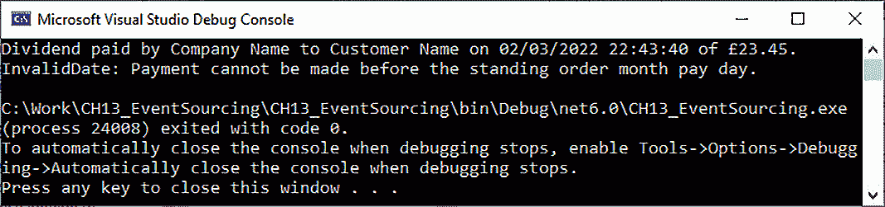
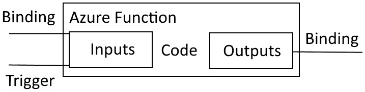

# *第十三章*：分布式系统

在本章中，你将学习关于分布式应用程序以及如何提高它们性能的知识。你将了解如何使用**命令查询责任分离**（**CQRS**）软件设计模式、事件溯源和微服务来构建高性能的应用程序。你将学习如何使用云服务提供商，如 Microsoft Azure，利用 Cosmos DB、Azure Functions 和开源的 Pulumi 基础设施工具构建可扩展的分布式解决方案。

在本章中，我们将涵盖以下主题：

+   **实现 CQRS 设计模式**：在本节中，我们将通过一个示例项目来演示如何实现 CQRS 设计模式，该示例项目展示了命令和查询的分离。

+   **实现事件溯源**：许多资源总是将事件溯源与 CQRS 结合展示。但在这个部分，我们将编写一个示例项目，展示没有 CQRS 的纯事件溯源。通过这样做，你将了解如何单独实现 CQRS 和事件溯源，并能够将它们结合起来协同工作。

+   **使用 Microsoft Azure 构建分布式系统**：在本节中，我们将提供 Azure Functions（特别是持久 Azure Functions）的高级概述，以提供在分布式环境中表现良好的强大、安全且可扩展的无服务器代码。我们还将探讨容器和无服务器之间的区别，以及何时使用其中一种而不是另一种。

+   **使用 Pulumi 管理你的云基础设施**：管理 Azure 资源可能会变得难以控制，尤其是在你部署的微服务数量增加时。因此，在本节中，我们将探讨 Pulumi 如何允许你使用纯 C# 来管理你的云基础设施和资源，这些代码可以包含在你的构建、测试和部署管道中。

通过完成本章，你将获得以下技能：

+   你将能够将命令和查询分离到不同的服务中。

+   你将能够将状态更改持久化为一系列状态更改事件。

+   你将能够理解容器和无服务器之间的区别，并知道何时使用其中一种而不是另一种。

+   你将理解不同的 Durable Azure Function 类型以及设计模式，以便你可以使用它们来构建无服务器函数。

+   你将能够使用 Pulumi 管理你的云。

# 技术要求

为了跟随本章并执行必要的编程任务，你需要以下组件：

+   Visual Studio 2022 或更高版本

+   本书源代码：[`github.com/PacktPublishing/High-Performance-Programming-in-CSharp-and-.NET/tree/master/CH13`](https://github.com/PacktPublishing/High-Performance-Programming-in-CSharp-and-.NET/tree/master/CH13)

+   可选：一个 Microsoft Azure 账户

+   可选：一个 Pulumi 订阅

# 实现 CQRS 设计模式

在本节中，我们将探讨 **命令查询责任分离**（**CQRS**）设计模式。简单来说，命令是一个执行动作的方法，而查询是一个返回数据的方法。命令不执行查询，查询也不执行命令。命令可以为查询有单独的模型。现在，让我们编写一个简单的控制台应用程序，演示实现此模式是多么简单，该模式在微服务开发中被广泛使用：

1.  启动一个名为 `CH13_CQRSPattern` 的新控制台应用程序。

1.  添加一个名为 `CQRSBasedClass` 的新类。

1.  添加 `SleepCommand` 方法：

    ```cs
    public void SleepCommand(int milliseconds)
    {
        Thread.Sleep(milliseconds);
    }
    ```

我们的 `SleepCommand` 方法是一个命令的例子。它接受一个长度为几毫秒的参数。然后执行一个命令，使当前线程休眠由调用者指定的毫秒数。这个特定的命令不返回任何值。

1.  添加 `DateTimeQuery` 方法：

    ```cs
    public DateTime DateTimeQuery()
    {
        return DateTime.Now;
    }
    ```

我们的 `DateTimeQuery` 方法是一个查询的例子。它是一个无参数查询，尽管查询可以有参数。查询不执行任何命令。它只是将当前日期和时间返回给调用者。

1.  在 `Program` 类中添加 `ExecuteCommand` 方法：

    ```cs
    private static void ExecuteCommand()
    {
        new CQRSBasedClass().SleepCommand(1000);
    }
    ```

`ExecuteCommand` 方法在我们的 `CQRSBasedClass` 中执行 `SleepCommand`，这将导致当前线程休眠 1 秒。

1.  添加 `ExecuteQuery` 方法：

    ```cs
    private static DateTime ExecuteQuery()
    {
        return new CQRSBasedClass().DateTimeQuery();
    }
    ```

`ExecuteQuery` 方法在我们的 `CQRSBasedClass` 中执行 `DateTimeQuery`，查询当前日期和时间并返回值。

1.  更新 `Program.cs` 文件，如下所示：

    ```cs
        Console.WriteLine("Hello, World! This is the most 
            simple example of CQRS in action.");
        ExecuteCommand();
        Console.WriteLine($"The current date and time is: 
          {ExecuteQuery()}.");
    ```

我们通过向控制台写入一条消息来开始我们的程序。然后，我们调用 `ExecuteCommand`。最后，我们向控制台写入一条消息，其中包含由 `ExecuteQuery` 调用返回的当前日期和时间。

如您所见，在它的最基本形式中，CQRS 模式实际上非常简单。命令执行一个动作，而什么都不做，而查询执行一个查询，而什么都不做。我们可以将命令移入它们自己的命令类，这样类的唯一目的就是执行命令。我们也可以通过将它们放入它们自己的查询类中来做同样的事情，这样查询类所做的只是返回查询。

如果你研究这本书的源代码，你会看到我们已经这样做了。我们有一个名为 `CommandClass` 的类，其中有一个名为 `Sleep` 的命令。我们还有一个名为 `QueryClass` 的类，其中有一个名为 `Now` 的查询。CQRS 是微服务开发中使用的启用模式。它通常与消息代理、消息总线、消息发送和接收、领域建模、领域事件、事件溯源、最终一致性、单独的读写模型以及 **领域驱动设计**（**DDD**）一起使用。这就是人们容易迷失的地方。但尽管 CQRS 模式与所有这些一起使用，该模式本身非常简单，它使这些其他模式和技术的结合变得非常融洽。

在数据库操作方面，你可以将`add`、`edit`、`delete`和`update`操作视为命令，而将`select`操作视为查询。

现在我们对 CQRS 模式有了简单的理解，在下一节中，我们将转向理解和实现事件溯源。

# 实现事件溯源

当你考虑文档存储中的文档和数据库中的记录时，这些通常是企业的真相来源。它们的状态是真相来源。

事件溯源记录的事件成为你的真相来源，而不是表格中的数据状态，或文档存储中的文档状态。

因此，我们不是使用状态作为真相来源，而是可以使用记录的事件作为真相来源。

在编程的旧时代，这被称为审计跟踪。我记得几年前我在一个数据库上工作。它有一个审计表。在那个表中，记录了在数据库上执行的所有操作以及由谁执行。我们可以知道数据操作发生的时间、那些数据操作是什么，以及谁或哪个过程执行了那些数据操作。然后，如果数据库出现任何问题，我们可以分析那个表并知道哪个操作导致了结果问题。为了存储这些信息，我们会使用在每次`add`、`update`、`delete`和`read`操作上触发的数据库触发器。这些触发器是在数据操作上触发的，记录了发生了哪些数据修改、谁进行了这些修改、为什么进行修改，以及修改发生的时间和日期。

在本节中，我们将探讨事件溯源，它记录的事件成为你的真相来源。事件允许你理解你如何在特定时间点达到特定的状态。

理解事件溯源的好处的一个简单方法就是看看你的银行对账单。当你收到银行对账单时，你从上个月结转的余额开始。然后，你看到一份在账单涵盖期间发生的交易列表，包括进入你账户的金钱和离开你账户的金钱。每一笔交易都是一个事件。这些事件可以是资金转入、资金转出、直接借记支付、利息支付、定期订单支付、银行费用支付、商品支付、工资/薪水的支付等等。

当你考虑这个场景时，你的银行对账单显示了你的钱是如何进入和离开账户的。但从数据库的角度来看，仅仅通过查看数据，这并不那么容易。当你查看数据时，你通常必须编写一个查询，将关系数据库中的多个表连接起来，以揭示你的账户状态是如何变化的实际情况。但你并不一定知道导致这些变化发生的原因。

然而，在相同的场景中，当你存储事件时，你是在存储事实。这些事实基于过去发生过的真实事件，这就是为什么它们可以信赖。

对于交易日志，它们会告知你发生了哪些状态变化。然而，它们并不一定告诉你为什么这些状态变化被做出。另一方面，当你存储事件时，它们会告知你发生了哪些状态变化，以及这些状态变化的原因。

事件以追加形式存储为聚合。聚合是一种一致性保护。你可以看到状态变化及其导致这些变化的环境。这意味着你可以通过向前或向后重放事件来将状态回滚到特定时间点的最后已知一致状态。你可以使用事件日志提供审计跟踪。诸如为什么和何时等信息对于各种业务功能，如高级管理层、市场营销、财务和资源规划等非常有用，因为事件日志充满了非常有价值的企业信息。

回到我们的示例场景，一个事件代表在我们银行领域发生的事实。我们银行系统中的每个事件都是真理的来源，我们的银行账户的当前状态就是从这些事实中得出的。这些事实是不可变业务事实。

我们的银行事件将遵循提供状态信息、提供上下文信息的元数据、发生的时间和日期以及其他必要和适当的信息的正常方法。

让我们看看一个例子，说明我们如何聚合事件，以便它们达到我们银行账户的特定状态：

+   事件：

    +   投资公司于 2021 年 6 月 12 日凌晨 12:43 向客户发放了 39 英镑的股息。

    +   投资公司于 2021 年 6 月 12 日凌晨 12:45 将 39 英镑的股息支付到客户的银行账户。

+   事件

    +   薪资 2300 英镑于 2021 年 7 月 25 日凌晨 12:00 通过 BACS 支付到客户的银行账户。

    +   客户于 2021 年 7 月 26 日上午 9:11 将 230 英镑的定期订单从客户的银行账户转入储蓄账户，以建立紧急储备金。

    +   客户的银行账户于 2021 年 7 月 25 日晚上 7:00 通过相关的安卓银行应用程序支付了 432 英镑的直接借记费用给当地政府缴纳租金。

    +   客户于 2021 年 7 月 26 日晚上 8:29 通过网上银行支付了 103 英镑的直接借记费用给当地政府缴纳地方税。

    +   客户于 2021 年 7 月 27 日晚上 9:35 使用非接触式支付向商家支付了 23.79 英镑的杂货费用。

如您从我们的银行场景中看到的，当我们使用事件作为基于事实的真理点时，我们可以看到资金的来源、去向、方式、金额以及发生的精确日期和时间。

这些事件确保数据处于一致状态，有审计跟踪，并提供有价值的信息，允许基于可信事实做出业务决策。

继续我们的银行场景，每个银行账户都会有一个流和唯一标识符。针对该银行账户发生的所有事件将通过其流进行记录。因此，我们为每个聚合体得到一个流。在我们的银行场景中，我们的聚合体是针对特定银行账户发生的事件组。

## 事件溯源示例项目

在本节中，我们将编写一个简单的事件溯源应用程序，并提供使用示例。要实现项目，请按照以下步骤操作：

1.  启动一个新的 .NET 6.0 控制台应用程序，并将其命名为 `CH13_EventSourcing`。

1.  添加一个名为 `IEvent` 的新公共接口，方法体为空。这是一个方便的接口，用于标记任何对象为事件。

1.  添加一个名为 `IRegisterable` 的新公共接口，并添加以下方法：

    ```cs
    void RegisterWithEventAggregator(IEventAggregator 
        eventAggregator);
    ```

此方法允许可注册的对象将自己注册到事件聚合器中。

1.  添加一个名为 `IEventAggregator` 的新公共接口，并添加以下方法：

    ```cs
    void Register(IRegisterable registerable);
    void Register<T>(EventHandler<T> eventhandler) where
         T : IEvent;
    void RaiseEvent(IEvent evt);
    ```

`Register` 方法用于将 `IRegisterable` 类型的对象注册到事件聚合器。`Register<T>` 方法注册一个指定对象类型的 `T` 类型的事件处理器。最后，`RaiseEvent` 执行传入的参数事件。

1.  添加一个名为 `EventHandler` 的新类，并用以下代码替换其内容：

    ```cs
    namespace CH13_EventSourcing;
    public delegate void EventHandler<T>(T evt) where T : 
        IEvent;
    ```

此委托定义了我们的事件处理器，该处理器为 `T` 类型，用于 `IEvent` 类型的事件。

1.  添加一个名为 `SingleThreadedEventAggregator` 的新类，该类实现了 `IEventAggregator` 接口。

1.  将以下字典字段添加以保存我们的事件处理器：

    ```cs
    IDictionary<Type, IList<EventHandler<IEvent>>> 
        _eventHandlers; 
    ```

此字典定义了指定类型对象的 `IEvent` 类型事件处理器列表。

1.  添加以下构造函数：

    ```cs
    public SingleThreadedEventAggregator()
    {
         _eventHandlers = new Dictionary<Type, 
             IList<EventHandler<IEvent>>>();
    }
    ```

在这里，我们实例化我们的事件处理器字典。

1.  更新 `Register` 方法，如下所示：

    ```cs
    public void Register(IRegisterable registerable)
    {
         registerable.RegisterWithEventAggregator(this);
    }
    ```

此方法将传入的可注册类型的事件聚合器注册。

1.  更新 `Register<T>` 方法，如下所示：

    ```cs
    public void Register<T>(EventHandler<T> eventHandler) 
        where T : IEvent
    {
         if (!_eventHandlers.ContainsKey(typeof(T)))
         {
              _eventHandlers[typeof(T)] = new 
                 List<EventHandler<IEvent>>();
         }
         var eventHandlerList = _eventHandlers[typeof(T)];
         eventHandlerList.Add(evt => eventHandler
              ((T)evt));
    }
    ```

此方法检查我们的字典是否包含指定类型的键；如果没有，则添加一个。然后，它创建一个新的指定类型的事件处理器列表，并将事件处理器添加进去。

1.  更新 `RaiseEvent` 方法：

    ```cs
    public void RaiseEvent(IEvent evt)
    {
         IList<EventHandler<IEvent>> eventHandlerList;
         if (_eventHandlers.TryGetValue(evt.GetType(), 
             out eventHandlerList))
         {
             foreach (EventHandler<IEvent> eventHandler in 
                 eventHandlerList)
             {
                   eventHandler.Invoke(evt);
               }
         }
    }
    ```

此方法获取传入事件的事件处理器列表，并遍历它们，调用它们。

1.  添加一个名为 `MultiThreadedEventAggregator` 的新类，该类实现了 `IEventAggregator` 接口。

1.  将以下字典添加到类中：

    ```cs
    IDictionary<Type, IList<EventHandler<IEvent>>> 
        _eventHandlers;
    ```

此字典将保存事件处理器及其事件的列表。

1.  添加以下构造函数：

    ```cs
    public MultiThreadedEventAggregator()
    {
         _eventHandlers = new ConcurrentDictionary<Type, 
             IList<EventHandler<IEvent>>>();
    }
    ```

我们的构造函数初始化我们的事件处理器列表。注意，我们正在使用并发字典来处理多线程场景。

1.  添加以下方法：

    ```cs
    public void Register(IRegisterable registerable)
    {              
         registerable.RegisterWithEventAggregator(this);
    }
    ```

此方法将可注册对象的的事件处理程序注册到多线程事件聚合器中。

1.  添加以下 `Register` 方法：

    ```cs
    public void Register<T>(EventHandler<T> eventHandler) 
        where T : IEvent
    {
         if (!_eventHandlers.ContainsKey(typeof(T)))
         {
             _eventHandlers[typeof(T)] = new 
                 List<EventHandler<IEvent>>();
         }
         var eventHandlerList = _eventHandlers[typeof(T)];
         eventHandlerList.Add(evt => eventHandler((T)evt));
    }
    ```

此方法检查我们的字典是否包含指定类型的键；如果没有，则添加一个。然后，它创建一个新的指定类型的事件处理程序列表并将事件处理程序添加进去。

1.  添加 `RaiseEvent` 方法：

    ```cs
    public void RaiseEvent(IEvent evt)
    {
         IList<EventHandler<IEvent>> eventHandlerList;
         if (_eventHandlers.TryGetValue(evt.GetType(), out 
            eventHandlerList))
          {
              Parallel.ForEach(eventHandlerList, 
                  eventHandler =>
                   {
                       eventHandler.Invoke(evt);
                   });
         }
    }
    ```

此方法遍历存储在事件处理程序列表中的所有事件处理程序，并为传入作为参数的指定事件调用它们。

这是完成的基础项目。现在，让我们看看如何使用我们的事件源代码的示例。

1.  添加一个名为 `BankApp` 的文件夹。

1.  将以下 `DividendPayment` 类添加到 `BankApp` 文件夹中：

    ```cs
    internal class DividendPayment : IEvent
    {
         public string From { get; set; }
         public string To { get; set; }
         public DateTime PaymentDate { get; set; }
         public Decimal Amount { get; set; }
    }
    ```

此类定义了我们的股息付款事件。此事件提供了有关股息付款的信息，包括谁发送了付款、付款对象是谁、付款日期以及付款金额。

1.  将 `InvalidDateException` 类添加到 `BankApp` 文件夹中：

    ```cs
    internal sealed class InvalidDateException : Exception
    {
         public InvalidDateException() : base()
         {
         }
         public InvalidDateException(string? message) 
             : base(message)
         {
         }
          public InvalidDateException(string? message, 
              Exception? innerException) : base(message, 
                  innerException)
         {
         }
    }
    ```

此类实现了 `System.Exception` 类，并将用于通知他人由于日期不正确而发生了异常。

1.  将 `StandingOrderPayment` 类添加到 `BankApp` 文件夹中：

    ```cs
    internal class StandingOrderPayment : IEvent
    {
         public string From { get; set; }
         public string To { get; set; }
         public DateOnly StartDate { get; set; }
         public decimal Amount { get; set; }
    }
    ```

此类定义了我们的定期订单付款事件，它通知我们谁支付了定期订单以及支付对象是谁，定期订单的开始日期以及应支付的金额。

1.  将 `EventHandlers` 类添加到 `BankApp` 文件夹中，并按以下方式更新：

    ```cs
    internal class EventHandlers : IRegisterable
    {
    }
    ```

我们的类实现了 `IRegisterable` 接口，并将用于将我们的事件注册到用于这些事件的聚合器中。

1.  添加以下属性和构造函数：

    ```cs
    public string Name { get; }
    public EventHandlers(string name)
    {
         Name = name;
    }
    ```

此属性在构造函数中设置，以便于人类参考 `EventHandlers` 类。

1.  添加以下注册代码：

    ```cs
    public void RegisterWithEventAggregator
         (IEventAggregator eventAggregator)
    {   
        eventAggregator.Register<DividendPayment>
             (OnDividendPayment);  
        eventAggregator.Register<StandingOrderPayment>
             (OnStandingOrderPayment);
    }
    ```

此方法将股息付款和定期订单的事件及其事件处理程序注册到事件聚合器中。

1.  为股息付款添加以下处理方法：

    ```cs
    private void OnDividendPayment(DividendPayment evt)
    {
        Console.WriteLine($"Dividend paid by {evt.From} to 
            {evt.To} on {evt.PaymentDate} of 
                £{evt.Amount}.");
    }
    ```

每次支付股息时，都会调用此事件处理程序，并将股息付款事件的属性记录到控制台窗口中。

1.  为定期付款添加以下处理方法：

    ```cs
    private void OnStandingOrderPayment
        (StandingOrderPayment evt)
    {
         try
         {
              Console.WriteLine($"Standing order paid by 
              {evt.From} to {evt.To} on {GetStanding
              OrderDate(evt.StartDate)} of 
              £{evt.Amount}.");
         }
         catch (InvalidDateException idex)
         {
              Console.WriteLine(idex.Message);
         }
    }
    ```

每次支付定期订单付款时，都会调用此事件处理程序。定期订单付款事件的属性将在控制台上输出。在此过程中，会检查付款日期是否有效；如果不是，则引发 `InvalidDateException`。

1.  添加 `GetStandingOrderDate` 方法：

    ```cs
    private static DateTime GetStandingOrderDate(DateOnly 
        startDate)
    {
         if (DateTime.UtcNow.Ticks < startDate.ToDateTime
             (TimeOnly.FromTimeSpan(TimeSpan.Zero)).Ticks)
              throw new InvalidDateException("Invalid 
                Date: Payment date cannot be before 
                  standing order start date!");
         if (DateTime.Now.Day < startDate.Day)
              throw new InvalidDateException("InvalidDate: 
                Payment cannot be made before the standing 
                  order month pay day.");
         return DateTime.Now;
    }
    ```

此方法接受定期订单的开始日期，并将该日期与当前日期进行比较。如果日期早于定期订单的开始日期或不在该月的付款日期或之后，则抛出异常。否则，返回当前日期和时间。

1.  将 `Program.cs` 类中的文本替换为以下内容：

    ```cs
    using CH13_EventSourcing;
    using CH13_EventSourcing.BankApp;
    using EventHandlers = CH13_EventSourcing.BankApp
        .EventHandlers;
    SingleThreadedEventAggregator eventAggregator = new();
    EventHandlers eventHandlers = new("Payment Event 
        Handlers");
    DividendPayment dividendPayment = new DividendPayment 
        { From = "Company Name", To = "Customer Name", 
            PaymentDate = DateTime.Now, Amount = 23.45M };
    StandingOrderPayment standingOrderPayment = new 
        StandingOrderPayment { From = "Customer Name", To 
            = "Company One", StartDate = DateOnly.Parse
                ("25/02/2022") };
    eventAggregator.Register(eventHandlers);
    eventAggregator.RaiseEvent(dividendPayment);
    eventAggregator.RaiseEvent(standingOrderPayment);
    ```

这是我们的应用程序入口点。我们创建了一个单线程的事件聚合器。然后，我们创建了一个 `EventHandlers` 类的实例，并将显示这些事件处理器用于处理支付事件的文本传递给它。接下来，我们创建了两个事件——一个是用于股息支付，另一个是用于定期订单支付。然后，将 `EventHandlers` 类的实例传递给事件聚合器，以便注册事件处理器。最后，引发了股息支付和定期订单的事件。

1.  运行程序。你应该会看到以下类似的输出：




图 13.1 – 我们事件源应用程序的输出

到此为止，你已经编码并运行了一个事件源应用程序。在此之前，你用 CQRS 应用程序做了同样的事情。通过编写这两个应用程序，你看到了纯 CQRS 和纯事件源的实际应用。有了这些知识，你现在可以编写使用这些模式单独或结合它们以协同工作的应用程序。在下一节中，我们将从编写分布式系统的角度提供一个关于微软 Azure 的高级概述。

# 使用微软 Azure 进行分布式系统

在本节中，我们将学习如何使用 Azure 通过无服务器功能实现持久化微服务，即 Azure Functions。

什么是 Azure？正如你现在已经意识到的，微软 Azure 是微软为托管你的数据库、API 和数据资源提供的云服务。它还有许多其他形式的云服务。微软 Azure 包括付费服务、免费一年的服务和始终免费的服务。建议你审查他们不同的云服务，并将它们与其他提供商进行比较，以满足你的需求。特别注意哪些服务是免费的，以及它们的用量限制，以及哪些服务你需要付费。

让我们列举一些将应用程序和数据库托管在云端而不是本地的一些好理由。首先，你不需要为硬件或电力成本付费。然后，当现有的基础设施达到最大容量时，就需要进行扩展和扩展。随着软件及其用户需求复杂性的增长，硬件可能会很快过时。因此，有许多理由使用云，你需要仔细考虑这些理由，并且随着这些理由的出现，会有利弊。因此，在决定使用云时，确保你研究、记录并评估一切，以便你有一个正确的起点。这将使系统管理、维护和长期业务增长变得更加容易。如果你从一开始就做对了，那么你将在未来的某个时候避免潜在的头痛！

微服务通常是一个简单的 Web 服务，它接收请求并发送响应。存在许多种类的微服务，例如电影和音乐流媒体服务以及文档上传和检索服务。在微服务的 DDD 中，微服务通常会有一个数据源。在 Azure 上，这可能是存储在 blob 存储中的文件，存储在 Azure SQL Server 关系型数据库中的数据，甚至是存储在 Azure Cosmos DB NoSQL 数据库中的数据。

现代微服务实现越来越不依赖于使用 Docker 和 Kubernetes 等工具的容器化，而是更多地依赖于如 Azure 函数这样的纯无服务器选项。Azure 函数的美丽之处在于它仅在调用期间处于活跃状态。一旦函数完成了它需要完成的工作，它就简单地进入休眠状态。与容器化解决方案相比，Azure 函数使用的计算资源和电力更少。唯一的缺点是你必须管理许多 Azure 函数。因此，就像容器化一样，你需要一种方法来以易于维护、扩展和实用的方式编排所有 Azure 函数。

## Azure 函数

Azure 函数是一个工作单元。当你实现 Azure 函数时，你不需要担心基础设施的配置和管理，因为 Azure 函数是微软的无服务器计算服务之一。

无服务器计算由无服务器提供商管理。这意味着无服务器计算提供商负责大量投资于配置和管理托管你的无服务器计算服务（如 Azure 函数）的基础设施。这意味着你可以节省硬件和电力成本，并可以将全部精力集中在开发、测试、部署和维护你的无服务器项目上。

微软对无服务器计算的投资为你的 Azure 函数提供了网络、服务发现、路由和事件，以促进你的函数与其他软件系统架构方面的性能通信。

Azure 函数通常由一个或多个你可以绑定和触发的输入组成，以及你可以绑定输出的部分，你的自定义代码位于输入和输出之间，如下面的图所示：



图 13.2 – 高级 Microsoft Azure 函数概念图

Azure 函数是开发分布式系统时使用的优秀工具。但是，当你的项目中 Azure 函数的数量开始增加时，使用 Azure 函数的复杂性开始显现。管理大量 Azure 函数需要一种编排形式。编排使得基础设施团队管理大量 Azure 函数变得更加简单。用于 Azure 函数的编排是可持久 Azure 函数。

## 可持久 Azure 函数

你可以使用持久化函数执行具有状态编排的 Azure Functions。Azure Functions 提供了一个名为 Durable Functions 的扩展。持久化函数应用程序由多个 Azure Functions 组成。持久化函数编排中的每个函数都可以执行不同的角色和/或功能。持久化函数的不同类型包括活动、编排器、实体和客户端。让我们简要地看一下每种持久化函数类型。

### 持久化函数类型 – 活动

基本的工作单元是在持久化函数编排中定义的活动函数。这意味着当编排函数执行多个任务，如数据验证、读取数据和更新数据时，每个这些任务将由持久化活动函数执行。一旦持久化活动函数完成，它可能将数据返回到编排该活动的函数。

活动函数由活动触发器定义。`DurableActivityContext`作为参数传递。事件触发器可以绑定到可序列化为 JSON 的对象，这些对象可以用于将输入数据传递到函数中。由于活动函数只能传递单个值，你可以通过使用数组、复杂类型和元组来克服这种限制。

注意

活动函数只能从编排器函数触发，并且由 Durable Task Framework 保证至少运行一次。因为我们不知道活动可能被调用多少次，所以 Microsoft 建议尽可能使持久化活动函数具有幂等性。

### 持久化函数类型 – 编排器

当你需要控制要执行的操作以及它们的执行顺序时，请使用编排器函数类型。

### 持久化函数类型 – 实体

持久化实体可以通过客户端和编排器函数调用，并由实体触发器触发。持久化实体函数用于读取和更新对象的状态。

### 持久化函数类型 – 客户端

持久化客户端函数是通过持久化客户端输出绑定定义的。客户端函数用于启动编排器和实体函数，因为在 Azure 门户中，这些函数不能通过按钮点击来触发。

### 持久化函数模式

你可以使用几种模式来管理你的持久化函数。这些包括以下内容：

+   聚合器（有状态实体）

+   异步 HTTP API

+   扇出/扇入

+   函数链

+   人工交互

+   监控

#### 聚合器（有状态实体）模式

在这个模式中，使用单个可寻址实体来聚合在一定时期内发生的事件数据。传递给聚合器的数据可以来自多个来源。数据可能随着时间的推移而分散，并且可以分批交付。你可以在数据到达时处理数据，并使聚合数据可供外部客户端查询。

在聚合器模式中，聚合器函数应在单个进程或虚拟机中运行。主要原因是因为当与无状态的普通函数一起使用时，并发控制的复杂性较高。

#### 异步 HTTP API

影响 API 调用完成时间因素包括数量和延迟，以及超出你控制的其他因素。可持续函数具有内置机制来处理长时间运行函数的执行，并且可持续函数的运行时还负责管理状态。

#### 扇出/扇入

可持续函数允许你并行执行函数并在任务的结果上执行。

#### 函数链

当使用服务总线队列与普通函数一起使用时，错误处理会更加复杂，并且很难可视化函数与队列之间的关系。

然而，当你使用可持续函数时，你有一个位置可以设置函数的顺序，存储队列由可持续函数自动管理，如果任何活动发生错误，它们会被传播回编排函数。

#### 人工交互

可持续函数可用于提升在约定时间内未收到人工交互的流程。

#### 监控（演员）

当你需要执行重复性任务时，例如释放系统资源，可持续函数为你提供了一种灵活的方式来管理重复间隔，使用单个编排来管理多个监控过程，并管理任务的生命周期。

## 容器和无服务器

容器和无服务器技术都在微服务生态系统中有一个合理的位置。主要思路是了解它们的优缺点，以帮助你选择最适合你需求的最佳选项。

### 容器

如果你希望将遗留代码迁移到更现代的平台和代码库，容器是一个不错的选择。你不必立即重写你的遗留代码库，例如 Web 服务和批处理过程。你可以将它们放入容器中，并将它们部署到云端。然后，当时间、金钱和资源可用时，你可以计划并实施重写你的遗留项目。

当你依赖第三方依赖项时，成本和 PaaS 可用性可能成为问题。例如，Docker Hub 等网站提供了许多可用的容器，用于各种第三方依赖项，你可以拉取并部署它们。

使用 Docker Compose 文件可以简化多个微服务的本地开发。你可以在 Docker Compose 文件中添加所需的服务数量，并在需要时启动它们。

使用 Kubernetes 集群，一个入口控制器用于仅暴露你想要暴露的服务。这允许你提供具有有限足迹的安全代码，让黑客难以生存。

容器的缺点之一是它们可能会鼓励使用更重量级且需要更多计算能力的旧开发技术。这可能导致计算成本增加。容器还需要一个核心数量的始终运行的数据节点，这会增加你的成本。

### 无服务器

外部服务可以通过 Azure Functions 等无服务器技术进行集成。无服务器计算的简化编程模型促进了快速应用开发。

当编写无服务器代码时，鼓励您采用事件驱动的函数方法。此类代码易于扩展，并且可以根据业务的发展轻松重写或丢弃。

无服务器代码支持*缩放至零*，因为函数仅在需要时运行，不需要时则不运行。这有助于降低运行成本，因为与始终运行的数据节点等服务相比，资源消耗非常小。

无服务器代码的快速扩展是此类技术的另一个优点，因为你只为函数的运行时间付费。

无服务器函数可能存在安全风险，因此您必须采取措施确保您的函数安全且受保护。

现在您已经了解了容器和无服务器函数的优缺点，并已审查了 Microsoft Azure 中可用的各种持久性函数以及一些持久性函数模式，让我们看看如何使用 C# 和 Pulumi 在 C# 中管理我们的云基础设施。

# 使用 Pulumi 管理您的云基础设施

在本节中，您将学习如何使用 Pulumi 管理您的云基础设施。在云基础设施中，保持一致性很重要。实现这一目标的一种方法是通过消除容易出错的人类因素，尽可能实现自动化。云中可以轻松自动化的一个重要方面是基础设施提供任务。这正是 Pulumi 发挥作用的地方。

使用 Pulumi，您可以编写**基础设施即代码**（**IaC**）解决方案。代码和配置文件用于管理和提供软件将运行的底层基础设施。

Pulumi 项目可以用各种编程语言编写，如 Python、VB.NET、F# 和 C#。我们感兴趣的是使用 C# 进行我们的 Pulumi 项目。您可以使用 Pulumi 执行以下操作：

+   指定您的基础设施。

+   自动化云资源的创建、更新和删除过程。

+   使用 Visual Studio 和 Visual Studio Code 等集成开发环境（IDE）和代码编辑器。

+   在编译过程中捕捉错误。

+   强制执行安全性、合规性和最佳实践。

+   使用现有的 NuGet 库以及编写自己的库。

+   使用 Kubernetes、Docker 容器、Azure Functions 和 Cosmos DB 来构建易于扩展的应用程序。

    注意

    要跟随，您需要安装 Chocolatey，因为它将被用作安装 Pulumi 的包管理器。您还需要一个 Microsoft Azure 账户来部署您的 IaC。在 Windows 上，当使用命令行时，请确保您正在使用 PowerShell，并且以管理员身份运行它。

现在，让我们看看一个配置 Blob 存储、向 Blob 存储添加文件以及销毁我们配置的资源的一个非常简单的示例。以下步骤将配置、使用和删除 Azure Blob 存储：

1.  使用以下命令安装 Pulumi：

    ```cs
    > choco install pulumi
    ```

1.  确保您已安装 .NET 6 SDK 或更高版本。

1.  通过输入以下命令配置 Pulumi 对您的 Microsoft Azure 账户的访问权限：

    ```cs
    az login
    ```

    注意

    您的凭据永远不会发送到 pulumi.com，并且它们仅用于 Pulumi 在管理和配置资源时的身份验证目的。

1.  到目前为止，您已经准备好开始使用 Pulumi。如果 `az` 术语不被识别，请尝试以下命令：

    ```cs
    Invoke-WebRequest -Uri https://aka.ms/
    installazurecliwindows -OutFile .\AzureCLI.msi; Start-
    Process msiexec.exe -Wait -ArgumentList '/I 
    AzureCLI.msi /quiet'; rm .\AzureCLI.msi
    ```

1.  使用以下命令创建一个新的项目：

    ```cs
    > Mkdir CH13_Pulumi
    > cd CH13_Pulumi
    > pulumi new azure-csharp
    ```

您将被要求输入您的令牌，或者您可以简单地按 *Enter* 键以登录到 Pulumi，让 Pulumi 为您获取令牌。如果您还没有，您可以在这一阶段轻松创建一个。一旦登录，您将在 PowerShell 中被问及一系列问题。您可以简单地接受所有默认值。

1.  在 Visual Studio 中打开项目。让我们回顾一下项目文件：

    1.  `Pulumi.yaml` 用于定义项目。

    1.  `Pulumi.dev.yaml` 用于存储您的堆栈配置值。

    1.  `Program.cs` 是您项目的入口点。

    1.  `MyStack.cs` 用于定义您的堆栈资源。

此类创建一个 Azure 资源组和一个存储账户。然后导出存储账户的主密钥。您可以在 `Pulumi.dev.yaml` 文件中找到资源组的定位，其属性名为 `azure-native:location`。

1.  现在，使用以下命令部署您的堆栈：

    ```cs
    Pulumi up
    ```

当提示时，选择 **是** 以将您的堆栈部署到 Azure。

1.  在此阶段，您应该能够登录到您的 Azure 账户并查看新创建的资源，并且它是一个存储账户。

1.  将名为 `index.html` 的 HTML 文件添加到您的项目中，并编辑该文件，添加一些 HTML 内容并保存。以下是一些示例内容：

    ```cs
    <html><head><title>Sample 
      HTML</title></head><body><h1>Hello, World!</h1>
    <hr /><p>This is a sample paragraph.</p></body></html>
    ```

1.  在创建 Azure 存储账户资源的代码块之后立即将以下代码添加到 `MyStack.cs` 类中：

    ```cs
    // Enable static website support
    var staticWebsite = new StorageAccountStaticWebsite(
         "staticWebsite",
         new StorageAccountStaticWebsiteArgs
    {
         AccountName = storageAccount.Name,
         ResourceGroupName = resourceGroup.Name,
         IndexDocument = "index.html",
    });
    ```

有了这些，我们就创建了一个新的静态网站资源，该资源利用了我们刚刚创建的存储账户。

1.  接下来，在 *步骤 10* 中显示的代码之后添加以下代码：

    ```cs
    // Upload the file
    var index_html = new Blob("index.html", new BlobArgs
    {
    ResourceGroupName = resourceGroup.Name,
    AccountName = storageAccount.Name,
    ContainerName = staticWebsite.ContainerName,
    Source = new FileAsset("index.html"),
    ContentType = "text/html",
    });
    ```

在这里，我们使用了我们的云资源和本地 `FileAsset` 将我们的 `index.html` 文件上传到 Blob 存储。

1.  在构造函数的末尾添加以下代码：

    ```cs
    // Web endpoint to the website
    this.StaticEndpoint = storageAccount
         .PrimaryEndpoints.Apply(
             primaryEndpoints => primaryEndpoints.Web
         );
    ```

此代码配置了 Web 端点到我们的静态网站。

1.  在构造函数上方添加以下属性：

    ```cs
    [Output]
    public Output<string> StaticEndpoint { get; set; }
    ```

此属性提供了我们的静态网站端点。

1.  现在，是时候通过输入以下命令来部署我们的更改了。

    ```cs
    pulumi up
    ```

这将上传`index.html`文件到 blob 存储，并使我们的静态网站对公众可用。您应该看到一个可以用来查看您创建和上传的网页的 URL。该文件应在您的 blob 存储中可见，您可以通过 Azure 门户或 Azure 存储资源管理器查看。

1.  一旦您确认前面的代码对您有效，就是时候销毁资源了。请输入以下命令：

    ```cs
    pulumi destroy
    ```

如果您想销毁整个堆栈，请输入以下命令：

```cs
pulumi stack rm dev
```

因此，堆栈已经完全从 Pulumi 中移除。

在本节中，您学习了如何使用 Pulumi 管理您的 Azure 堆栈。通过使用 Visual Studio 和 PowerShell 命令行，您创建了一个 Azure 资源帐户，并将 blob 存储分配给它。然后，您创建了一个静态网站资源，并使用云资源和本地`FileAsset`上传了静态网站，该网站由一个名为`index.html`的单个文件组成。您能够在 blob 存储中查看文件，并在浏览器中查看网页。

在下一节中，我们将探讨分布式系统的一些性能考虑因素。

# 分布式计算的性能考虑因素

我们现在知道如何开发分布式系统。但它们的性能如何？在分布式系统的性能方面，我们应该注意哪些方面？

首先考虑的是客户端和服务器之间的网络连接。TCP 冲突可能导致信息包丢失。这可能会破坏多个设备之间的通信，并导致连接超时。TCP 冲突最常见的原因是两台或多台计算机共享相同的 IP 地址。

同一网络上的任何计算机都不应具有与同一网络上的另一台计算机相同的地址。这会导致不可预测的网络行为，对网络应用程序的性能和稳定性有害。如果您遇到这种情况，只需将其中一台计算机的 IP 地址更改为不同的 IP 地址即可。

另一个可能导致网络通信缓慢的问题是**域名解析**（**DNS**）。如果 DNS 设置不正确，那么访问网络资源，如网页或网络服务，可能比预期花费更长的时间，并可能导致连接或请求超时。值得注意的是，在分布式网络中通常不止一个 DNS。您有外部网络的 DNS 服务器和您的路由器，后者为您的本地网络提供 DNS。这些中的任何一个都可能导致 DNS 解析缓慢。您可以采取以下一些步骤来解决 DNS 问题：

1.  检查您的网络连接。

1.  确保您的 DNS 地址正确，并且顺序正确。

1.  Ping 您试图访问的计算机名称、IP 地址或基本 URL（例如 google.co.uk），以查看它是否响应或超时。

1.  使用`nslookup`命令识别正在使用的域名服务器。

1.  检查 DNS 后缀。

1.  确保 DNS 设置已配置为从 DHCP 服务器获取 DNS IP 地址。

1.  使用 `ipconfig` 释放和更新 DHCP 地址和 DNS 信息。

1.  检查 DNS 服务器，看是否有服务需要重启或服务器需要重新启动。

1.  有时，路由器上的信息会过时，所以快速解决方案是重新启动路由器。

1.  有时，ISP 会遇到影响你的问题。在这种情况下，你需要与他们沟通，了解问题并了解何时恢复正常。

可以使用分布式防火墙来保护企业网络。防火墙配置错误可能导致资源访问被拒绝或不可见。如果机器无法访问分布式资源，那么分布式防火墙是一个好的起点。如果分布式防火墙配置正确，那么检查客户端和服务器防火墙是否启用或禁用，以及它们是否配置正确。

例如，我处理过很多 SQL Server 问题。有些是 DNS 和 DHCP 问题，但最常见的问题是 SQL Server 配置和防火墙配置。SQL Server 使用动态端口。但有时，这些端口可能会冲突，固定端口也是如此。我还发现，为了在许多网络上运行 SQL Server，必须启用命名管道和 TCP 协议。一旦在 SQL Server 配置管理器中更改了这些协议，就需要重新启动受影响的 SQL Server 实例，然后是 SQL Server 浏览器服务。如果你有防火墙，那么需要将实例的 SQL Server 可执行文件添加到防火墙作为应用程序异常。如果你需要使用特定端口，那么你需要添加端口异常。SQL Server 的标准端口异常是 TCP 的 `1433` 和 UDP 的 `1434`。

有时，即使完成了上述 SQL Server 故障排除，网络应用程序仍然看不到 SQL Server 实例。当这种情况发生时，一种解决方案是重新创建以下格式的数据库连接字符串：`IP_ADDRESS,PORT_NUMBER\INSTANCE_NAME`。

另一个可能影响分布式环境中 SQL Server 连接性的问题是安装和使用的 SQL Server 驱动程序。如果你使用特定版本的 SQL Server 原生客户端，那么你需要确保该特定版本的原生客户端已安装在所有计算机上，以便它们能够连接到 SQL Server。解决这个问题的方法是意识到 SQL Server 驱动程序默认安装在所有 Windows 计算机上，无论是服务器还是客户端。如果你使用此驱动程序，那么你不必担心将 SQL Server 原生客户端推广到分布式系统中的各种计算机。

另一个性能方面是数据库查询。为了获取一组结果，相同的查询可以以多种不同的方式编写，以获得所需的结果。这在结果集较大的情况下尤其如此，因为它们有更多的连接。动态 SQL 也可能运行缓慢。因此，加快查询速度可以显著提高数据库驱动的分布式应用程序。您可以使用 SQL Server 配置文件和审查 SQL Server 执行计划来识别瓶颈，并重写 SQL 以提高其性能。您还可以添加缺失的索引，纠正错误的索引，并使用预编译的存储过程来提高性能。

SQL Server 可能因多种原因而损坏和失败，因此必须定期更新安全补丁。在这里，您可以使用 Always-On 和故障转移集群来保持连接活跃，并在服务器宕机或需要离线进行维护时在 SQL 服务器之间切换。

资源连接的数量也可能使分布式系统过载到客户端无法连接的程度。为了克服这一点，您可以采用负载均衡，以便当资源服务器达到某个峰值时，客户端会被发送到替代服务器以获取那些资源。

在共享网络资源时，另一个常见的疏忽是网络权限。有时，可能没有共享应该共享的文件夹。一个真正棘手的问题可能是通过组策略强制执行的权限层次结构，它甚至可以覆盖网络域管理员执行其工作的能力。

完全记录您的组策略和权限结构对于当前和未来的员工来说非常重要。一个清晰的文档可以直观地显示权限组和层次结构，并提供资源及其权限集的列表，如果有人或应用程序在访问资源时遇到问题，此类文档可以减轻解决此类问题的痛苦。

值得注意的是，有时系统管理员和受信任的安装程序会控制某些资源，阻止您在本地和网络中访问资源。这可能导致您必须覆盖该网络或本地位置的文件资源所有权。

计算机安全软件也可能显著减慢网络流量，甚至停止程序运行。通常的罪魁祸首是防火墙，正如我们之前提到的，以及防病毒软件。如果您的软件没有使用权威批准的代码签名证书进行签名，那么 DLL 和可执行文件可能会被隔离并识别为恶意软件。这就是所谓的误报。您可以选择对软件进行签名，将软件添加为应用程序或文件夹例外项，或将软件传递给安全公司以评估您的软件，并更新他们的软件以防止未来发生此类情况。

当所有网络流量甚至本地文件都进行实时扫描时，杀毒软件也可能减慢应用程序的速度。一个例子是在评估期间通过网络拉取音频文件的教育软件。当音频文件被备份并一起播放时，这表明了这种情况。为了克服这个问题，你可以通过将应用程序、其文件夹及其资源添加为文件夹和或应用程序/文件异常来更新杀毒软件。

资源的大小也会影响网络性能。资源越大，请求和接收资源所需的时间就越长。在这里，你可以使用各种压缩技术来减小图像、视频和音频文件等资源的大小。你还可以在需要访问之前压缩资源并传输它们，例如在应用程序启动时。一旦请求并接收了资源，你就可以将它们存储在本地缓存中。

当工作负载增加到当前系统无法处理的地步时，你有两个选择：垂直扩展或水平扩展。垂直扩展涉及增加物理计算能力以应对增加的工作负载。水平扩展是指添加更多服务器以应对增加的工作负载。在撰写本文时，许多公司的前进方向是使用服务器虚拟机（VMs）和容器，并在 Azure、AWS、Google Cloud 等云平台上的 Docker 和 Kubernetes 等容器管理软件中运行容器。

通过将代码移动到微服务（如 Azure Functions）中，可以减小大型库和可执行文件的大小。Azure Functions 是一个事件驱动的按需计算体验，它通过在 Azure 或第三方服务以及本地系统中发生的事件触发代码的能力，扩展了现有的 Azure 应用程序平台。这些在线服务可以自动扩展和缩减，并且仅在需要时运行。这还带来了额外的优势，例如节省成本，如电力和设备成本。

你还可以使用浏览器开发者工具和 Postman 等工具来监控应用程序和网络性能。

现在，让我们总结一下我们所学到的内容。

# 摘要

在本章中，我们首先探讨了 CQRS 设计模式的实现。然后，我们研究了事件源的实施。你可以单独使用这两种模式，尽管它们也可以结合起来提供非常强大和功能性的微服务。

然后，我们以高级别概述了使用 Microsoft Azure 编写分布式系统的方法。我们涵盖了容器和无服务器函数的优点和缺点，以帮助您了解何时使用每种技术。

在 Microsoft Azure 方面，我们主要关注 Azure Functions。具体来说，我们研究了持久 Azure Functions。我们确定了各种持久函数及其持久函数模式。

现在，花些时间回答本章的问题，看看你记住了多少。请查阅*进一步阅读*部分，以巩固你在本章中学到的知识。

在下一章中，我们将探讨 C#中的多线程编程。

# 问题

回答以下问题以测试你对本章知识的掌握：

1.  CQRS 代表什么？

1.  为什么我们在开发微服务时使用 CQRS 模式？

1.  什么是事件溯源？

1.  为什么我们使用事件溯源？

1.  容器是什么？

1.  为什么我们会使用容器？

1.  什么是无服务器函数？

1.  为什么我们应该使用无服务器函数？

1.  什么是持久化函数？

1.  持久化函数有哪些不同类型？

1.  有哪些类型的持久化函数模式？

1.  Pulumi 是什么？

1.  为什么我们会使用 Pulumi？

# 进一步阅读

要了解更多关于本章所涵盖的主题，请查看以下资源：

+   *在 Azure 上使用 Pulumi 入门*：[`www.pulumi.com/docs/get-started/azure/`](https://www.pulumi.com/docs/get-started/azure/)

+   *使用 Pulumi 和.NET Core 构建现代云应用程序*：[`devblogs.microsoft.com/dotnet/building-modern-cloud-applications-using-pulumi-and-net-core/`](https://devblogs.microsoft.com/dotnet/building-modern-cloud-applications-using-pulumi-and-net-core/)

+   *使用持久化 Azure 函数进行编排*：[`blog.kiprosh.com/orchestration-using-durable-azure-function/`](https://blog.kiprosh.com/orchestration-using-durable-azure-function/)

+   *持久化函数编排*：[`docs.microsoft.com/en-us/azure/azure-functions/durable/durable-functions-orchestrations?tabs=csharp`](https://docs.microsoft.com/en-us/azure/azure-functions/durable/durable-functions-orchestrations?tabs=csharp)

+   *持久化函数模式的最佳实践*：[`www.serverless360.com/blog/azure-durable-functions-patterns-best-practices`](https://www.serverless360.com/blog/azure-durable-functions-patterns-best-practices)

+   *《C#中的 Clean Code》第九章和第十章* by Jason Alls：[`www.amazon.co.uk/Clean-Code-application-performance-practices-ebook/dp/B08614MS6S`](https://www.amazon.co.uk/Clean-Code-application-performance-practices-ebook/dp/B08614MS6S)

+   *10 种解决 DNS 解析问题的方法*：[`techgenix.com/10-Ways-Troubleshoot-DNS-Resolution-Issues/`](https://techgenix.com/10-Ways-Troubleshoot-DNS-Resolution-Issues/)
