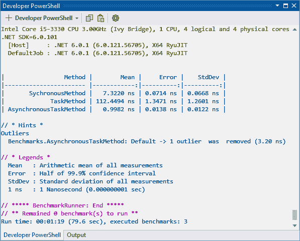
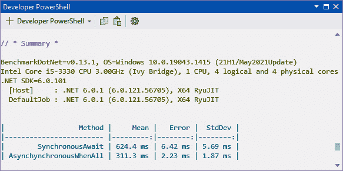

# 第十六章：*第十六章*：异步编程

在本章中，你将学习关于`async`、`await`和`WhenAll`的内容。你还将了解不同的返回类型并提取所需的结果。此外，你将学习如何正确地取消异步操作以及执行异步文件读写。

在本章中，我们将涵盖以下主题：

+   **理解 TAP 模型**：在本节中，我们提供了一个关于 TAP 模型的概述。

+   `Task.Run`)并异步执行。

+   `GetAwaiter.GetResult()`、`.Result`和`.Wait`对于`Task`和`ValueTask`都适用。

+   **取消异步操作**：在本节中，我们将编写演示异步任务取消的代码。

+   **异步写入文件**：在本节中，我们将异步地向文件中写入文本。

+   **异步读取文件**：在本节中，我们将异步地从文件中读取文本。

完成本章后，你将在以下领域具备技能：

+   理解 TAP 模型

+   异步处理网络资源

+   异步写入文件

+   异步读取文件

# 技术要求

你需要 Visual Studio 来处理本章中展示的代码。

本章的所有代码都放置在 GitHub 上，地址为[`github.com/PacktPublishing/High-Performance-Programming-in-CSharp-and-.NET/tree/master/CH16`](https://github.com/PacktPublishing/High-Performance-Programming-in-CSharp-and-.NET/tree/master/CH16)。

# 理解 TAP 模型

在我们开始之前，值得注意的是，处理异步编程有三种不同的模型。具体如下：

+   **异步编程模型**（**APM**）

+   **基于事件的异步模式**（**EAP**）模型

+   **任务并行库**（**TPL**）

APM 使用`BeginMethod`启动异步过程，使用`EndMethod`完成异步过程。EAP 使用`MethodAsync`启动异步过程，使用`CancelAsync`处理异步操作的取消，以及使用完成的事件处理器处理完成的异步操作。这两种执行异步操作的方式在 C# 4.5 中被 TPL 所取代。

TPL 使用`async`和`await`模式。异步方法名称以`async`结尾。异步方法通常返回一个可等待的`Task`或`Task<Result>`。从.NET 4.5 开始，建议使用 TPL 而不是使用 APM 和 EAP。

TAP 的基础类型是`System.Thread.Tasks`命名空间，以及通过异步操作提供的`Task`和`Task<Tresult>`类。Microsoft 建议在开始新项目时使用 TAP。

## 命名、参数和返回类型

使用 TAP 模型的异步方法在方法签名前缀为`async Task`（对于无返回值的方法），或`async Task<Tresult>`、`async ValueTask`或`async ValueTask<Tresult>`（对于返回值的方法）。不返回值的异步方法名称应以动词开头，如`Begin`或`Process`。

TAP 方法参数应与同步对应方法的参数匹配，并且顺序相同。您应避免完全使用免于遵守此规则的`out`和`ref`参数。如果您需要返回数据，请使用`Task<Tresult>`返回的`Tresult`。使用数据结构来适应多种返回类型。还值得考虑将取消令牌添加到 TAP 方法参数中，即使同步方法对应者没有这样的令牌也是如此。

当意图明确时，与多个任务一起工作的组合方法不必遵循此命名模式。`WhenAll`和`WhenAny`是组合方法的例子。

## 启动异步操作

您可能希望在异步方法开始时执行一些同步任务，例如验证和准备异步操作以执行。如果是这样，建议将这些任务保持到最小，并且它们所需的时间应尽可能短。原因是这些方法可能从**用户界面**（**UI**）线程调用，您不希望导致您的应用程序挂起或暂时冻结。

将同步操作保持到最小，并在异步操作中花费最短时间的原因之一是，当您运行并发异步方法时，长时间运行的同步操作会降低并发的好处。

有时，准备和启动异步操作所需的时间可能比同步完成相同操作所需的时间更长。在这些情况下，您可以同步运行该方法并返回一个任务。

## 异常

使用错误，如传递`null`参数，是异步方法中应该抛出的唯一错误。您可以通过修改调用代码来防止异步方法抛出使用错误，确保错误参数不会传递到异步方法中。所有其他类型的异常和错误应分配给返回的任务。通常，一个任务返回一个异常。但当单个任务表示多个操作时，单个任务可能会返回多个异常。

## 可选取消

异步方法实现者和消费者的取消是可选的。可以取消的任务公开了一个接受名为`cancellationToken`的`CancellationToken`的重载方法。

异步操作的取消请求被监控。当收到取消请求时，可能会被接受。如果取消导致未完成的工作，将返回一个`Canceled`状态的任务，没有可用的结果和没有异常。

`Canceled`状态是一个已完成的任务状态，`RanToCompletion`和`Faulted`也是如此。当一个任务的状态是`Canceled`、`RanToCompletion`或`Faulted`时，`IsCompleted`属性返回`true`。

当任务被取消时，除非指定了`NotOnCancelled`延续选项，否则延续将继续被安排和执行。如果指定了此选项，则在任务被取消时，延续将不会被安排或执行。

通过语言功能等待取消任务的异步代码将继续运行，但将接收到`OperationCanceledException`或其派生异常。而通过`Wait`和`WaitAll`等方法同步阻塞等待任务的代码将继续运行，并抛出异常。

当取消令牌在接受该令牌的 TAP 方法被调用之前请求取消时，TAP 方法应返回一个`Canceled`任务。在异步操作执行期间，可以忽略取消请求。在返回任务时，通常返回具有以下三种状态之一的任务：

+   `Canceled`：操作因取消请求而结束。

+   `RanToCompletion`：请求取消操作已完成并生成了结果。

+   `Faulted`：请求取消导致生成了异常。

如果你正在编写异步方法，并希望首先启用操作可取消，则不需要生成一个没有`CancellationToken`的重载方法。如果你正在编写无法取消的异步方法，则不需要提供接受`CancellationToken`的重载方法。这些指南有助于调用者了解目标方法是否可取消。当调用接受`CancellationToken`的方法的消费者没有取消方法调用的意愿时，可以将`None`传递给`CancellationToken`参数，因为这功能上等同于默认的`CancellationToken`。

## 可选进度报告

当异步操作作为 UI 流程的一部分运行时，提供进度更新可能是有益的。这有助于最终用户知道程序仍在运行。

`IProgress<T>`接口用于处理进度，并将其作为名为`progress`的参数传递给异步方法。将此接口传递给异步方法可以帮助防止在操作开始后错误注册事件处理器时可能发生的竞争条件，这可能导致更新丢失。将接口传递的另一个原因是，消费代码可以支持各种进度实现。只有当 TAP 实现支持进度通知时，才提供`IProgress<T>`接口。

与进度更新很好地匹配的示例是 `FindFilesAsync` 方法，该方法返回满足特定搜索模式的文件列表。在这种情况下，您可以提供已完成的工作百分比以及当前的中间结果集。这些信息将由特定于您的 API 的某些数据类型提供。这些数据类型通常以 `ProgressInfo` 后缀结尾。

提供进度参数的 TAP 方法应允许不进行进度报告，通过允许进度参数为 `null`。进度应同步报告给实现 `IProgress<T>` 接口的 `Progress<T>` 对象。这使异步方法能够快速提供进度。消费者可以确定他们想要如何以及在哪里处理进度更新提供的信息。

`ProgressChanged` 事件由 `Progress<T>` 类的实例公开。每次异步操作报告进度更新时都会触发此事件。当 `Progress<T>` 对象被实例化时，`ProgressChanged` 事件在捕获的 `SynchronizationContext` 对象上触发。如果没有可用同步上下文，则使用针对线程池的目标上下文作为默认上下文。

您可以像注册任何其他事件的处理程序一样注册此事件的处理程序，并且您还可以向 `Progress<T>` 构造函数提供一个处理程序，以方便起见。单个处理程序的行为与 `ProgressChanged` 事件的处理器相同。在执行事件处理器期间，通过异步地发出进度更新来避免对异步操作的延迟。

现在我们对基于任务的异步模式有了高级别的理解，在下一节中，我们将探讨 `async`、`await` 和 `Task`。

# async、await 和 Task

在本节中，我们将探讨同步运行方法、使用 `Task.Run` 和异步运行方法之间的性能差异。异步方法通过 `async` 关键字来标识。

`await` 关键字通知运行时在指定行等待，直到当前任务完成。它只能与前面带有 `async` 关键字的方法一起使用。

`System.Threading.Tasks` 命名空间。任务封装了线程，以便最大化利用计算机硬件的多核。

让我们编写一个简单的项目来基准测试调用方法的三种不同方式。我们将使用 `Task.Run` 同步调用该方法，并使用 `async/await` 异步调用。我们将使用 `BenchmarkDotNet` 来查看每种方法调用类型的性能。我们的目标是展示使用异步调用相对于同步和 `Task.Run` 调用的性能优势。

我们执行以下步骤来编写我们的小程序：

1.  启动一个新的 .NET 6.0 控制台应用程序，并将其命名为 `CH16_AsynchronousProgramming`。

1.  添加 `BenchmarkDotNet` NuGet 包。

1.  添加一个名为 `Benchmarks` 的新类，并在该类中添加以下方法：

    ```cs
    public static void LengthyTask()
    {
         int y = 0;
         for (int x = 0; x < 10; x++)
              y++;
    }
    ```

此方法是我们的工作方法。它所做的只是将`y`变量增加 1，重复十次。

1.  将`SynchronousMethod`添加到类中：

    ```cs
    [Benchmark]
    public void SychronousMethod()
    {
          LengthyTask();
    }
    ```

此方法同步调用`LengthyTask`方法，并作为一个基准测试。

1.  将`TaskMethod`添加到类中：

    ```cs
    [Benchmark]
    public void TaskMethod()
    {
         Task.Run(new Action(LengthyTask));
    }
    ```

此方法将`LengthyTask`方法作为一个新的`Action`运行，该`Action`被排队在`ThreadPool`上运行。该方法返回一个`Task`或`Task<Tresult>`句柄。

1.  将`AsynchronousTaskMethod`添加到类中：

    ```cs
    [Benchmark]
    public void AsynchronousTaskMethod()
    {
         var data = async () => await Task.Run(new   
             Action(LengthyTask));
    }
    ```

此方法以异步方式使用`Task.Run`运行`LengthyTask`方法，并在继续之前等待方法完成。

1.  我们现在已经完成了基准测试类。因此，在`Program.cs`文件中，将代码替换为以下内容：

    ```cs
    using BenchmarkDotNet.Running;
    using CH16_AsynchronousProgramming;
    Console.WriteLine("CH16 - Asynchronous Programming");
    var summary = BenchmarkRunner.Run<Benchmarks>();
    Console.ReadLine();
    ```

此代码将运行我们的基准测试并为我们生成报告。

1.  确保项目设置为`Release`构建。

1.  构建项目。

1.  打开命令窗口，并在`bin\Release\net6.0`文件夹中执行名为`CH16_AsynchronousProgramming.exe`的编译后的可执行文件。

1.  基准测试应该开始运行，一旦完成，您应该看到一个类似于*图 16.1*所示的报告：



图 16.1 – BenchmarkDotNet 报告，针对我们的 CH16_AsynchronusProgramming 项目

如您在*图 16.1*中可以看到，同步运行`LengthyTask`方法耗时`7.3220 ns`完成。使用`Task.Run`运行耗时最长，为`112.4494 ns`。而运行代码最快的方式是异步，只需`0.9982ns`即可完成。

我们可以从这些时间中清楚地看到，运行我们的代码异步确实有明显的性能优势，因为我们的代码完成所需的总时间更少。

在下一节中，我们将比较`await`与`GetAwaiter.GetResult()`、`.Result`和`.Wait`的性能。我们将涵盖`Task`和`ValueTask`。

# 对 Task 和 ValueTask 的 GetAwaiter.GetResult()、.Result 和.Wait 进行基准测试

在本节中，我们将编写一些代码来基准测试`GetAwaiter.GetResult()`、`.Result`和`.Wait`方法，以查看哪种方法最适合获取`Task`和`ValueTask`的返回值。

在[`github.com/dotnet/BenchmarkDotNet/issues/236`](https://github.com/dotnet/BenchmarkDotNet/issues/236)，`BenchmarkDotNet`的维护者*adamsitnik*回复了*@i3arnon*：

“@i3arnon 谢谢提示！我已经测量了`.Result`与`.Wait`与`GetAwaiter.GetResult()`的比较，对于`Tasks`来说，`GetAwaiter.GetResult()`似乎也是最快的方式。另一方面，对于`ValueTask`来说，它要慢得多，所以我继续使用`.Result`来处理 VT。”

因此，从我们将要编写的代码中，我们应该看到`.Result`在处理`ValueTask`时应该提供给我们最佳的性能。而`GetAwaiter.GetResult()`在处理`Task`时应该提供给我们最佳的性能。

我们现在将开始编写我们的代码。请在上一节中开始的 `CH16_AsynchronousProgramming` 项目中完成以下任务：

1.  打开 `CH16_AsynchronousProgramming` 项目。

1.  打开 `Benchmarks` 类。

1.  添加以下返回 `int` 的方法：

    ```cs
    public static int LengthyTaskReturnsInt()
    {
         int y = 0;
         for (int x = 0; x < 10; x++)
             y++;
          return y;
    }
    ```

在此代码中，我们增加 `y` 变量并返回结果。

1.  添加 `GetAwaiterGetResult` 方法：

    ```cs
    [Benchmark]
    public void GetAwaiterGetResult()
    {
         int value = Task.Run(() => 
             LengthyTaskReturnsInt()).GetAwaiter()
               .GetResult();
    }
    ```

此方法基准测试了使用 `GetAwaiter().GetResult()` 从方法返回 `int` 所花费的时间。

1.  添加 `Result` 方法：

    ```cs
    [Benchmark]
    public async Task Result()
    {
         int value = await Task.Run(() => 
           LengthyTaskReturnsInt()).ConfigureAwait(false);
    }
    ```

此方法基准测试了等待方法返回 `int` 所花费的时间。

1.  添加 `Wait` 方法：

    ```cs
    [Benchmark]
    public void Wait()
    {
         Task.Run(() => LengthyTask()).Wait();
    }
    ```

此方法运行一个长时间的任务，并在它完成之前等待。

1.  添加 `GetAwaiter` 方法：

    ```cs
    [Benchmark]
    public void GetAwaiter()
    {
             Task.Run(() => LengthyTask()).GetAwaiter();
    }
    ```

此方法获取一个用于等待任务完成的等待者。

1.  构建项目并通过命令行运行可执行文件。你应该会看到一个类似于 *图 16.2* 所示的总结报告：

![图 16.2 – 本节方法的 BenchmarkDotNet 总结报告]

![图 16.2 – 本节方法的 BenchmarkDotNet 总结报告]

图 16.2 – 本节方法的 BenchmarkDotNet 总结报告

从这些结果中我们可以看出，当从 `Task` 返回值时，`GetAwaiterGetResult` 方法比 `Result` 方法运行得快得多。并且当执行长时间运行的 `Task` 时，`GetAwaiter` 方法比 `Wait` 方法运行得更快。

在下一节中，我们将探讨如何通过使用 `WhenAll` 来加快我们异步等待多个任务时的代码。

# 使用 async、await 和 WhenAll

在本节中，我们将编写一些示例代码，演示 `async`、`await` 和 `WhenAll` 的使用及其对执行时间的影响。

如果你在一个方法中执行多个任务，并且对每个任务都使用 `await`，你的代码将以异步方式工作，执行时间将会很长。你可以通过使用 `WhenAll` 在继续之前等待所有完成的任务来避免这种时间开销，从而提高性能。在我们将要编写的代码中，你将看到 `WhenAll` 如何减少在函数内部执行两个异步方法所需的时间，与逐个等待每个任务相比。

让我们逐步完成以下任务：

1.  在 `Benchmarks` 类中，添加以下异步方法，该方法等待 `300` 毫秒然后返回一个 `int`：

    ```cs
    private async Task<int> TaskOne()
    {
         await Task.Delay(300);
         return 100;
    }
    ```

`TaskOne` 方法是我们将要由基准测试运行的方法之一。

1.  添加我们的第二个异步方法：

    ```cs
    private async Task<string> TaskTwo()
    {
         await Task.Delay(300);
         return "TaskTwo";
    }
    ```

`TaskTwo` 方法等待 `300` 毫秒然后返回一个 `string`。

1.  首先，我们将基准测试同步运行异步任务：

    ```cs
    [Benchmark]
    public async Task SynchronousAwait()
    {
         int intValue = await TaskOne();
         string stringValue = await TaskTwo(); 
    } 
    ```

在这里，我们有两个任务，我们需要等待它们都完成后再继续。

1.  现在，我们将添加一个方法，它将利用 `WhenAll`：

    ```cs
    [Benchmark]
    public async Task AsynchynchronousWhenAll()
    {
         var taskOne = TaskOne();
         var taskTwo = TaskTwo();
         await Task.WhenAll(taskOne, taskTwo);
    }
    ```

在此方法中，我们创建了我们的两个任务，然后将它们作为参数传递给 `WhenAll` 方法。我们不会继续，直到所有任务都完成。

1.  通过命令行构建和运行您的可执行文件。您应该会看到类似 *图 16.3* 的内容：



图 16.3 – 多个异步调用的同步和异步执行结果

从我们的基准测试结果中可以看出，使用 `WhenAll` 执行多个异步任务比依次等待它们要快得多。在下一节中，我们将探讨如何取消异步任务。

# 取消异步操作

在本节中，我们将探讨如何取消长时间运行的自异步操作。有时一个任务会花费比预期更长的时间。一个很好的例子是在网站宕机时从网站获取数据。由于像 `Error 404`、`Error 401` 或 `Error 500` 这样的原因，异步操作可能需要很长时间才能由服务器重置。因此，在设置的时间后取消异步操作以防止浪费最终用户的时间是很有用的。

我们将要编写的代码将从网站 URL 返回文本。我们将分配一个非常短的超时时间。这个超时将取消负责返回网站文本的任务。按照以下步骤操作：

1.  打开 `CH16_AsynchronousProgramming` 项目，并添加一个名为 `TaskCancellation` 的新类。

1.  添加 `using System.Text;` 语句。

1.  添加以下两个成员变量：

    ```cs
    private const string _website = 
        "https://docs.microsoft.com";
    private static readonly CancellationTokenSource 
        _cancellationTokenSource = new();
    ```

`_website` 变量持有我们将返回其页面文本的网站的 URL。`CancellationTokenSource` 将用于向 `CancellationToken` 发送取消信号。

1.  添加以下方法：

    ```cs
    private static readonly HttpClient HttpClient = new()
    {
         MaxResponseContentBufferSize = 1000000
    };
    ```

在这里，我们声明一个方法，该方法返回用于我们的 HTTP 请求的 `HttpClient`。`MaxResponseContentBufferSize` 设置在读取响应内容时缓冲的字节数。

1.  现在添加 `ReturnWebsiteTextAsync` 方法：

    ```cs
    private static async Task<string> 
        ReturnWebsiteTextAsync()
    {
         HttpResponseMessage response = await HttpClient
                 .GetAsync(
                 _website, 
                 _cancellationTokenSource.Token)
               .ConfigureAwait(false);
         byte[] contentAsByteArray = await response
             .Content
             .ReadAsByteArrayAsync(
                 _cancellationTokenSource.Token)
               .ConfigureAwait(false);
         return Encoding.ASCII.GetString(
             contentAsByteArray
         );
    }
    ```

在此方法中，我们声明 `HttpResponseMessage`，它等待一个异步任务，该任务返回网页的内容。然后读取响应并将其转换为字节数组。然后，这个字节数组被转换成 ASCII 字符串并返回。

1.  现在添加 `Start` 方法：

    ```cs
    public static async Task Start()
    {
         Console.WriteLine("Task started.");
         try {
             _cancellationTokenSource.CancelAfter(3000);
               await ReturnWebsiteTextAsync()
                 .ConfigureAwait(false);
         }
         catch (OperationCanceledException) {
           Console.WriteLine(
           "\nThe task has timed out and been cancelled.
             \n");
         }
         finally {
             _cancellationTokenSource.Dispose();
         }
         Console.WriteLine("Task completed.");
    }
    ```

在 `Start` 方法中，我们写入一个控制台消息，表明任务已开始。然后我们将 `cancellationTokenSource` 的取消时间设置为 30 秒，即 3000 毫秒。然后我们 `await` 调用 `ReturnWebsiteTextAsync`。如果在设置的超时时间后进程超时，将引发 `OperationCanceledException`，它将在控制台输出一条消息。最后，`cancellationTokenSource` 被释放，并输出一条控制台消息，表明任务已完成。

1.  在 `Program.cs` 文件中注释掉基准运行代码，并添加以下行：

    ```cs
    TaskCancellation.Start().GetAwaiter();
    ```

1.  运行项目，并尝试使用不同的超时时间多次运行，以测试代码成功完成并返回文本，以及测试操作超时并引发异常。

通过几次运行此代码并设置超时为`3000`和`30000`，将分别呈现操作超时异常并显示网页文本。正如你自己运行代码时可以看到的，编写在设定时间段后取消的任务的异步任务是很容易的。

在下一节中，我们将编写代码来展示如何异步地写入文件。

# 异步写入文件

在本节中，我们将异步地将文本写入文件。异步文件写入可能有用的场景包括将大量文本和数据写入不会立即读取的文件。

使用以下步骤来编写我们的代码：

1.  在您的`C:\`驱动器上，如果您还没有创建一个名为`Temp`的文件夹，请添加一个。

1.  打开`CH16_AsynchronousProgramming`项目。

1.  添加一个名为`FileReadWriteAsync`的类。

1.  添加以下方法：

    ```cs
    public static async Task WriteTextAsync()
    {
    string filePath = @"C:\Temp\Greetings.txt";
    string text = "Hello, World!";
    byte[] encodedText = 
         Encoding.Unicode.GetBytes(text);
    using (FileStream fileStream = new FileStream(
                        filePath,
                        FileMode.Append, 
                        FileAccess.Write, 
                        FileShare.None,
                        bufferSize: 4096, 
                        useAsync: true
                    )
                )
    {
             await fileStream.WriteAsync(
                 encodedText, 0, encodedText.Length); 
    };
    }
    ```

在`WriteTextAsync`方法中，我们声明一个文本文件的文件路径和一个包含要写入文件的文本的变量。要写入的文本被转换为字节数组。然后以追加模式打开一个可写的异步文件流。然后我们将文本写入文件流并关闭它。

在下一节中，我们将继续在本节课中添加我们的异步读取方法，展示如何异步地读取文件。

# 异步读取文件

在本节中，我们将异步地从文件中读取文本。我们将基于上一节中写入文本到文件的代码进行构建。

以下步骤将添加我们的异步读取方法并更新`Program.cs`文件以运行我们的异步代码：

1.  在`FileReadWriteAsync`类中，添加以下方法：

    ```cs
    public static async Task<string> ReadTextAsync()
    {
         string filePath = @"C:\Temp\Greetings.txt";
         using (FileStream fileStream = new FileStream(
                 filePath,
                   FileMode.Open, 
                   FileAccess.Read, 
                   FileShare.Read,
                   bufferSize: 4096, 
                   useAsync: true
             )
         )
         {
             StringBuilder sb = new StringBuilder();
             byte[] buffer = new byte[0x1000];
             int numRead;
             while (( numRead = await fileStream
               .ReadAsync(buffer, 0, buffer.Length)) != 0
             )
             {
                 string text = Encoding.Unicode
                     .GetString(buffer, 0, numRead);
                 sb.Append(text);
             }
             return sb.ToString();
         }
    }
    ```

在这里，我们定义了需要读取的文件的路径。然后我们以读取模式打开一个文件流，具有读取访问权限。接下来，我们定义`StringBuilder`和字节数组，它们将作为我们的缓冲区来存储读取的数据。然后我们读取流，直到读取完成。在每次读取迭代中，我们从文件中读取文本，将其编码为 Unicode，然后将其追加到`StringBuilder`。然后，一旦循环完成并退出，我们从方法中返回字符串。

1.  打开`Program.cs`类。

1.  注释掉以下行：

    ```cs
    //var summary = BenchmarkRunner.Run<Benchmarks>();
    // TaskCancellation.Start().GetAwaiter();
    ```

当我们运行代码时，我们不需要这些行。

1.  添加以下代码行：

    ```cs
    FileReadWriteAsync.WriteTextAsync().GetAwaiter();
    string data = FileReadWriteAsync.ReadTextAsync()
        .GetAwaiter().GetResult();
    Console.WriteLine(data);
    ```

在此代码中，我们调用将文本异步写入文件的方法，异步地将文本读取到变量中，然后将变量的内容打印到控制台。

1.  运行代码，你应该会看到类似于*图 16.3*的内容：

![Figure 16.4 – 我们异步写入和读取代码的结果]

![img/B16617_Figure_16.4.jpg]

图 16.4 – 我们异步写入和读取代码的结果

如从截图所示，我们已经成功地将文本异步写入文件，从该文件异步读取，并将内容打印到控制台窗口。

在下一节中，我们将总结本章所学的内容。

# 摘要

在这一章中，我们从基于任务的异步模式的高级概述开始。我们涵盖了命名、参数、返回类型、初始化异步操作、异常，以及可选地提供报告进度更新和取消操作的方法。我们了解到，我们可以有允许取消的异步操作，以及不允许取消的异步操作。此外，我们还了解到，当请求取消时，取消请求要么继续进行，要么被忽略。已完成的任务可以具有`已取消`、`已运行完成`或`已出错`的完成状态。

然后，我们对三种不同的同步调用方法、使用`Task.Run`和异步调用进行了基准测试。使用`Task.Run`花费的时间最长，其次是同步运行方法，而异步运行方法是运行该方法的最快方式。

然后，我们对`GetAwaiter.GetResult()`、`Result`和`Wait`方法在`Task`和`TaskValue`上的性能进行了基准测试。我们发现，当从`Task`返回值时，`GetAwaiterGetResult`方法比`Result`方法运行得快得多。而在执行长时间运行的`Task`时，`GetAwaiter`方法比`Wait`方法运行得更快。

接下来，我们探讨了取消异步操作。我们编写了一个示例，从网站获取文本并将文本输出到控制台。如果操作在设定的时间内未能完成，则取消操作。

在最后两个部分中，我们编写了一些代码来演示文本和数据异步的读写。

为了完成这一章，有一些问题供你回答，以检验你对所读内容的掌握程度，以及一些关于异步编程的进一步阅读材料。

感谢您购买这本书。希望您喜欢阅读它，并且学到了许多改进您自己代码的方法。祝您编码愉快！

# 问题

1.  TAP 代表什么？

1.  哪种参数类型标识异步操作可以被取消？

1.  将哪种参数类型传递给异步任务以提供进度更新？

1.  解释`async`、`await`和`Task`。

1.  如何取消异步操作？

1.  如何报告异步操作进度？

# 进一步阅读

+   异步编程；APM 与 EAP 的比较：[`stackoverflow.com/questions/11276314/asynchronous-programming-apm-vs-eap`](https://stackoverflow.com/questions/11276314/asynchronous-programming-apm-vs-eap)

+   异步编程：[`docs.microsoft.com/en-us/dotnet/csharp/async`](https://docs.microsoft.com/en-us/dotnet/csharp/async)

+   C#中异步编程的介绍：[`auth0.com/blog/introduction-to-async-programming-in-csharp/`](https://auth0.com/blog/introduction-to-async-programming-in-csharp/)

+   C# 中异步方法的性能特性：[`devblogs.microsoft.com/premier-developer/the-performance-characteristics-of-async-methods/`](https://devblogs.microsoft.com/premier-developer/the-performance-characteristics-of-async-methods/)

+   异常处理（任务并行库）：[`docs.microsoft.com/en-us/dotnet/standard/parallel-programming/exception-handling-task-parallel-library`](https://docs.microsoft.com/en-us/dotnet/standard/parallel-programming/exception-handling-task-parallel-library)
