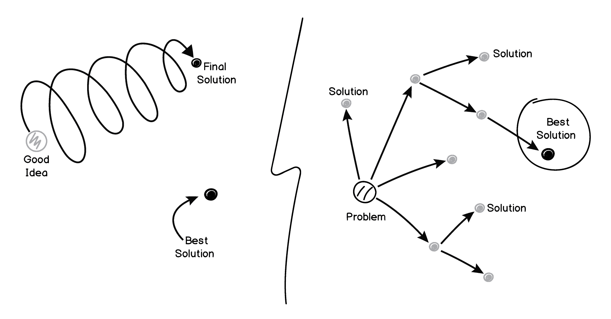
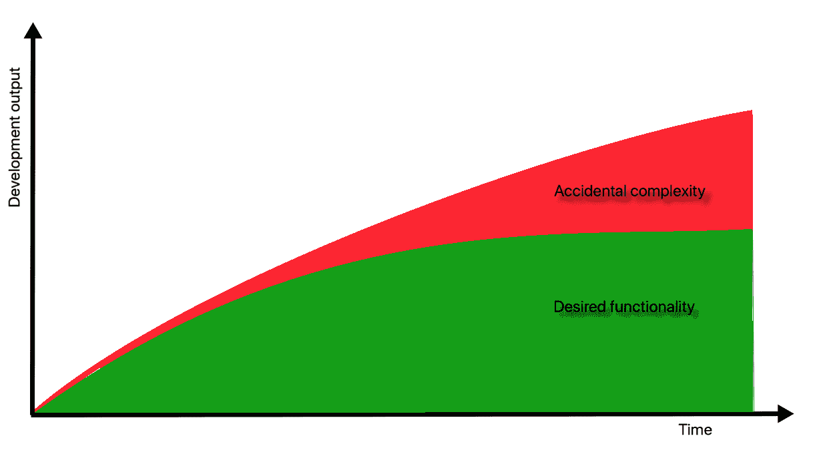
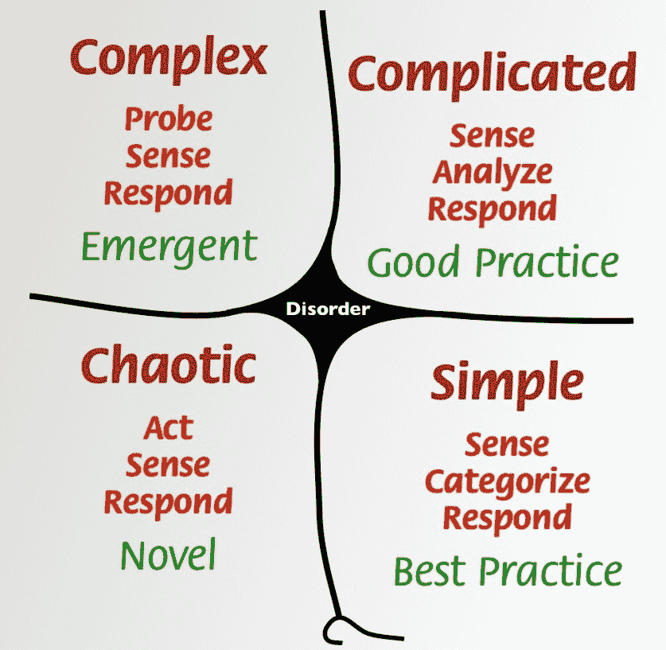
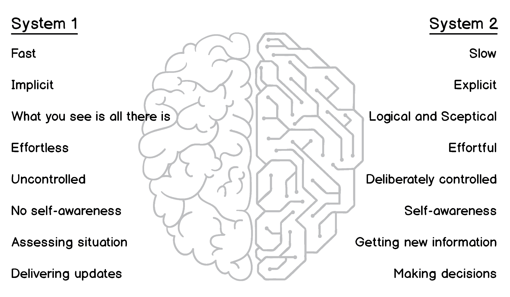
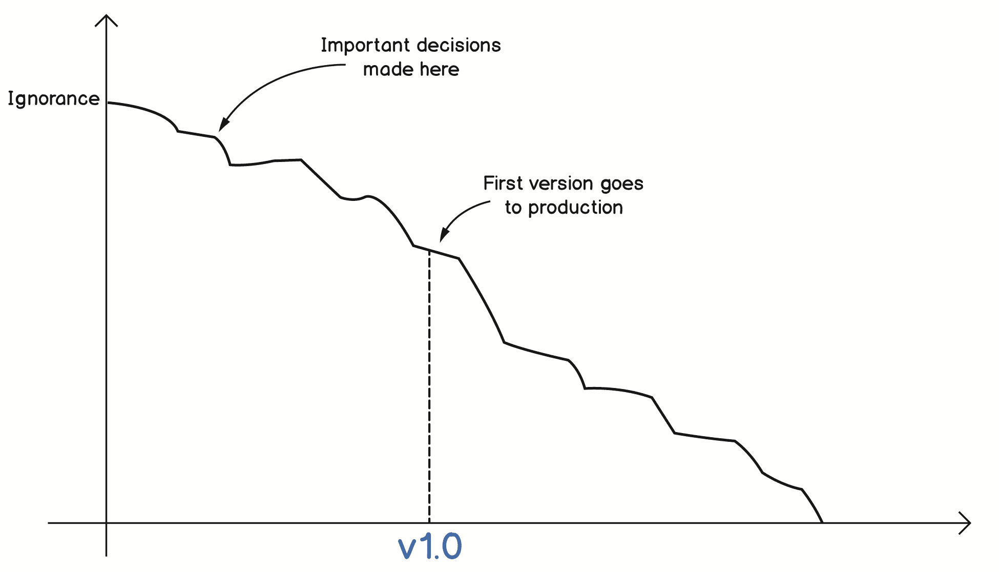

# 为什么是领域驱动设计？

软件行业早在 20 世纪 60 年代初就出现了，并且一直以来的增长。有人预测，总有一天所有软件都将被编写，软件开发者将不再需要，但这种预言从未成为现实，不断增长的软件工程师大军正在努力满足不断增长的需求。

然而，从行业的早期开始，大量项目交付延迟且严重超预算，以及大量失败的项目，令人难以承受。Standish Group 的 2015 年 CHAOS 报告([`www.projectsmart.co.uk/white-papers/chaos-report.pdf`](https://www.projectsmart.co.uk/white-papers/chaos-report.pdf))表明，从 2011 年到 2015 年，成功 IT 项目的百分比保持不变，仅为 22%。超过 19%的项目失败，其余项目面临挑战。尽管报告可能对项目成功的预期有些争议，但它仍然描绘了一幅许多人都熟悉的画面。这些数字令人震惊。在四十多年的时间里，许多方法被开发并宣传为软件项目管理中的银弹，但成功项目的数量几乎没有变化。

定义任何 IT 项目成功的关键因素之一是理解系统旨在解决的问题。我们都非常熟悉那些无法解决它们声称要解决的问题或效率非常低下的系统。敏捷开发方法中的 SCRUM 和 XP 都强调与用户互动和理解他们的问题。

术语**领域驱动设计**（**DDD**）由埃里克·埃文斯在他的现在已成为经典的书籍《领域驱动设计：软件核心的复杂性处理》（由 Addison-Wesley 于 2004 年出版）中提出。在本书出版十多年后，书中描述的实践和原则的兴趣开始呈指数级增长。许多因素影响了这种流行度的增长，但最重要的一个因素是 DDD 解释了软件行业的人如何理解用户的需求，并创建解决问题和产生影响的软件系统。

在本章中，我们将讨论如何通过理解业务领域、构建领域知识以及区分本质复杂性和偶然复杂性，有助于创建有意义的软件。

本章的目标是探讨以下主题：

+   问题空间与解决方案空间

+   需求出了什么问题

+   理解复杂性

+   知识在软件开发中的作用

# 理解问题

我们很少仅仅为了编写代码而编写软件。当然，我们可以为了乐趣和学习新技术而创建一个宠物项目，但在专业上，我们构建软件是为了帮助其他人更好地、更快地、更高效地完成他们的工作。否则，最初编写任何软件都没有意义。这意味着我们需要有一个我们打算解决的*问题*。认知心理学将这个问题定义为当前状态和期望状态之间的限制。

# 问题空间和解决方案空间

在他们的书《人类问题解决》中，艾伦·纽厄尔和赫伯特·西蒙概述了问题空间理论。该理论表明，人类通过在*问题空间*中寻找解决方案来解决问题。问题空间描述了初始状态和期望状态，以及可能的中间状态。它还可以包含定义问题背景的具体约束和规则。在软件行业中，在问题空间中操作的人通常是客户和用户。

每个实际问题都需要一个解决方案，如果我们正确地在问题空间中搜索，我们就可以概述出从初始状态到期望状态需要采取的步骤。这个概述以及关于解决方案的所有细节构成了一个*解决方案空间*。

问题空间和解决方案空间在实施过程中完全脱离的经典故事，是关于在太空中写作的故事。这个故事是这样的：在 20 世纪 60 年代，太空探索国家意识到，由于缺乏重力，普通的圆珠笔在太空中无法使用。因此，NASA 花费了 100 万美元来开发一种在太空中可以使用的笔，而苏联人则决定使用成本几乎为零的旧铅笔。

这个故事如此引人入胜，以至于它仍在流传，甚至被用于电视剧《白宫风云》，由马丁·辛扮演美国总统。我们很容易相信这个故事，不仅因为我们习惯了政府资助机构浪费资金，而且主要是因为我们看到了许多效率低下和现实问题误解释的例子，给他们的解决方案增加了巨大的不必要的复杂性，并解决了不存在的问题。

这个故事是一个神话。NASA 也尝试使用铅笔，但由于微尘的产生、笔尖断裂和木制铅笔的潜在易燃性，最终决定放弃它们。一家名为 Fisher 的私营公司开发了现在被称为**太空笔**的产品。后来，NASA 对该笔进行了测试，并决定使用它。该公司还从苏联获得了订单，笔在全球范围内销售。每个人的价格都是一样的，每支笔 2.39 美元。

在这里，你可以看到问题空间/解决方案空间问题的另一部分。尽管问题本身看起来很简单，但额外的限制，我们也可以称之为**非功能性需求**，或者更准确地说，操作需求，使得它比第一眼看起来更复杂。

直接跳到解决方案是非常容易的，因为我们大多数人都有解决日常问题的丰富经验，我们可以几乎立即找到许多问题的解决方案。然而，正如 Bart Barthelemy 和 Candace Dalmagne-Rouge 在他们 2013 年发表在《哈佛商业评论》上的文章《When You're Innovating, Resist Looking for Solutions》中建议的那样（[`hbr.org/2013/09/when-youre-innovating-resist-l`](https://hbr.org/2013/09/when-youre-innovating-resist-l)），思考解决方案会阻止我们的大脑去思考问题。相反，我们开始深入思考最初出现在脑海中的解决方案，添加更多细节，使其成为给定问题的最理想解决方案。

在寻找特定问题的解决方案时，还有一个方面需要考虑。有危险的是，你可能会把所有的注意力都集中在一种特定的解决方案上，而这可能根本不是最好的解决方案，只是基于你以前的经验、对问题的当前理解和其他因素而首先出现在脑海中的。

精细化与探索

寻找和选择解决方案的探索性方法涉及大量工作来尝试几种不同的事情，而不是专注于原始“好主意”的迭代改进。然而，在这种探索过程中找到的答案可能会更加精确和有价值。我们将在本章后面讨论对第一个可能解决方案的执着。

# 需求出了什么问题

我们都熟悉软件需求的概念。开发者很少直接与想要解决问题的人接触。通常，一些专门的人员，如需求分析师、业务分析师或产品经理，会与客户交谈，并将这些对话的结果概括为功能需求。

需求可以有不同的形式，从称为“需求规范”的大型文档到更敏捷的方法，如用户故事。让我们看看这个例子：

"每天，系统应为每家酒店生成一份预计当天入住和退房的客人名单。"

如您所见，这个陈述只描述了解决方案。我们不可能知道用户在做什么，我们的系统将解决什么问题。可能需要指定额外的需求，进一步细化解决方案，但问题描述永远不会包含在功能需求中。

相比之下，使用用户故事，我们对我们用户的期望有了更深入的了解。让我们回顾一下这个真实的用户故事：<q>"作为仓库经理，我需要能够打印库存水平报告，以便在库存耗尽时订购物品。"</q><q>这样我就可以在库存耗尽时订购物品。</q>在这种情况下，我们了解到了用户的需求。然而，这个用户故事已经规定了开发者需要做什么。它描述的是*解决方案*。真正的可能问题是客户需要一个更高效的采购流程，这样他们就不会出现库存耗尽的情况。或者，他们需要一个先进的采购预测系统，这样他们可以在不额外囤积库存的情况下提高吞吐量。

我们不应该认为需求是浪费时间。有许多优秀的分析师能够生产出高质量的规范。然而，理解这些需求几乎总是代表撰写者从其角度对实际问题的理解是至关重要的。在业界，普遍存在一种误解，即投入更多的时间和金钱来编写更高质量的需求规范。

然而，精益和敏捷方法论强调开发者和最终用户之间更直接的沟通。从最终用户到开发者和测试者，所有利益相关者共同理解问题，一起寻找解决方案，消除假设，为最终用户构建原型以供评估——所有这些做法都被成功的团队采纳，正如我们在本书后面将要看到的，它们也与领域驱动设计（DDD）密切相关。

# 处理复杂性

在撰写关于复杂性的内容之前，我试图找到一些关于这个词本身的花哨、引人注目的定义，但这似乎是一项复杂的任务。Merriam-Webster 将“复杂性”定义为“复杂性的质量或状态”，这个定义相当明显，甚至可能听起来有些愚蠢。因此，我们需要对这个主题进行更深入的探讨，并更多地了解复杂性。

在软件中，复杂性的概念与现实世界并没有太大的不同。大多数软件都是为了处理现实世界的问题而编写的。这些问题可能听起来很简单，但本质上很复杂，甚至很棘手。毫无疑问，问题空间复杂性将在试图解决这类问题的软件中体现出来。因此，在创建软件时意识到我们正在处理什么样的复杂性变得非常重要。

# 复杂性的类型

在 1986 年，图灵奖获得者弗雷德·布鲁克斯（Fred Brooks）撰写了一篇名为《没有银弹 – 软件工程中的本质与偶然》的论文，在其中他区分了两种类型的复杂性——本质复杂性和偶然复杂性。本质复杂性源于领域，源于问题本身，如果不减少问题的范围，就无法将其移除。相比之下，偶然复杂性是由解决方案本身带来的——这可能是框架、数据库或其他基础设施，以及不同类型的优化和集成。

布鲁克斯认为，当软件行业变得更加成熟时，偶然复杂性的水平会显著降低。高级编程语言和高效的工具为程序员提供了更多时间来处理业务问题。然而，正如我们今天所看到的，30 多年后，该行业仍在努力应对偶然复杂性。确实，我们手中握有强大的工具，但大多数这些工具都需要花费时间来学习使用这些工具本身。每年都会出现新的 JavaScript 框架，每个框架都有所不同，所以在写出任何有用的东西之前，我们需要学习如何高效地使用我们选择的框架。我多年前编写了一些 JavaScript 代码，当时我把 Angular 视为一种祝福，直到我意识到我花在与之斗争上的时间比写任何有意义的东西还要多。或者以容器为例，它承诺给我们带来一种简单的方式来隔离地托管我们的应用程序，无需处理物理或虚拟机器的所有麻烦。但随后我们需要一个协调器，我们得到了很多，花费时间学习如何与它们一起工作，直到我们得到了 Kubernetes 来统治它们所有，现在我们花在编写 YAML 文件上的时间比实际编写代码的时间还要多。我们将在下一节讨论这种现象的一些可能原因。

你可能已经注意到，本质复杂性与问题空间有很强的关联，而偶然复杂性则倾向于解决方案空间。然而，我们似乎经常遇到比问题本身更复杂的问题陈述。通常，这种情况是由于问题与解决方案混合在一起，正如我们之前讨论的那样，或者由于缺乏理解。

Gojko Adžić，一位软件交付顾问和几本有影响力的书籍的作者，如《示例规格说明》（Specification by Example）和《影响映射》（Impact Mapping），在他的研讨会中给出了这个例子：

“一家软件即服务公司收到了一个功能请求，要求提供特定报告的实时功能，而之前该报告是按计划每月执行一次。经过几个月的开发，销售人员试图获取一个估计的交付日期。然后，开发部门报告称，该功能至少还需要六个月才能交付，总成本约为 100 万英镑。这是因为该报告的数据源位于事务型数据库中，实时运行它将意味着性能显著下降，因此需要采取额外的措施，如数据复制、地理分布和分片。

公司随后决定分析请求此功能的客户实际需求。结果发现，客户希望执行与之前相同的操作，但他们希望改为每周执行，而不是每月执行。当被问及整个功能的预期结果时，客户表示，每周批量运行相同的报告可以解决问题。重新安排数据库作业远比重新设计整个系统容易，而对最终客户的影响是相同的。

这个例子清楚地表明，不理解问题可能会导致严重后果。我们作为开发者喜欢像 DRY（Don't Repeat Yourself）这样的原则。我们寻求抽象，使我们的代码更加优雅和简洁。然而，这往往可能是完全不必要的。有时，我们可能会陷入使用某些承诺解决世界上所有问题的工具或框架的陷阱。再次强调，这从来都不是没有代价的。作为一名.NET 开发者，当我看到社区对依赖注入的当前痴迷时，我清楚地看到了这一点。

足够真实，微软最终推出了一种有意义的 DI 容器，但当我看到它被用于一个小型控制台应用程序中，仅仅是为了初始化记录器时，我感到不安。有时，编写更多的代码只是为了满足工具、框架或环境，而不是提供实际价值的代码。在这个例子中看似必要的复杂性最终证明是浪费的：

随着时间的推移，复杂性增长

上述图表显示，随着系统复杂性的不断增长，本质的复杂性正在被推向下方，而偶然的复杂性正在接管。您可能会对这样一个事实表示怀疑，即当所需的功能几乎平坦时，偶然的复杂性会随着时间的推移而不断增长。这是怎么发生的，我们肯定不能只花费时间创造更多的偶然复杂性？当系统变得更加突出时，需要大量的努力来使整个系统工作，并管理大型数据模型，大型系统往往具有这样的数据模型。支持性代码增长，并且花费了大量努力来保持系统运行。我们引入缓存，优化查询，拆分和合并数据库，等等。最终，我们可能实际上决定减少所需功能的范围，只是为了使系统在没有太多故障的情况下运行。

DDD 帮助您专注于解决复杂的领域问题，并专注于本质的复杂性。当然，处理一个新潮的前端工具或使用云文档数据库是很有趣的。但如果没有理解我们试图解决的问题是什么，所有这些都可能只是浪费。对于任何企业来说，首先得到一些有用的东西并尝试它，比得到一个完美无缺的、完全偏离主题的尖端软件更有价值。为此，DDD 通过将系统拆分成更小的部分并提供一些有用的技术来管理复杂性，这些技术将使这些部分专注于解决一系列相关的问题。这些技术将在本书的后续章节中描述。

处理复杂性时的经验法则是——拥抱本质的复杂性，或者我们可能称之为领域复杂性，并消除或减少偶然的复杂性。作为开发者的您的目标不是创建过多的偶然复杂性。因此，非常常见的是，偶然的复杂性是由过度设计引起的。

# 复杂性的分类

当处理问题时，我们并不总是知道这些问题是否复杂。如果它们是复杂的，那么有多复杂？有没有一个工具可以测量复杂性？如果有，那么在开始解决问题之前对其进行测量或至少对其进行分类将是有益的。这种测量将有助于调节解决方案的复杂性，因为复杂问题也要求有复杂的解决方案，尽管这个规则很少例外。如果您不同意，我们将在下一节中更深入地探讨这个话题。

在 2007 年，Dave Snowden 和 Mary Boone 在《哈佛商业评论》2007 年发表了一篇名为《*领导者决策框架*》的论文。这篇论文获得了管理学会组织行为分部颁发的**杰出实践者导向出版物奖**。它有什么独特之处，它描述了哪个框架？

该框架是**Cynefin**。这个词在威尔士语中类似于*栖息地*，习惯，熟悉。斯诺登在 1999 年开始研究这个框架，当时他在 IBM 工作。这项工作非常有价值，以至于 IBM 成立了组织复杂性 Cynefin 中心，Dave Snowden 是其创始人兼总监。

Cynefin 将所有问题划分为五个类别或复杂性领域。通过描述每个领域内问题的属性，它为任何给定问题提供了一个*定位感*。在问题被归类到某个领域之后，Cynefin 还提供了一些处理这类问题的实用方法：

Cynefin 框架，图片由 Dave Snowden 提供

这五个领域具有特定的特征，该框架为这两个领域提供了属性，用于确定你的问题属于哪个领域，以及如何处理该问题。

**第一个领域是简单或明显**。在这里，你面临的问题可以描述为*已知已知*，这里有最佳实践和一套既定的规则可用，并且原因和结果之间存在直接联系。这个领域的行动顺序是*感知-分类-反应*。建立事实（感知），识别过程和规则（分类），并执行它们（反应）。

然而，斯诺登警告人们将问题错误地归类为*简单*的倾向。他为此识别了三种情况：

+   **过度简化**：这与下文所述的一些认知偏差相关。

+   **固有思维**：当人们盲目地使用他们在过去获得的技能和经验，因此对新思维方式视而不见。

+   **自满**：当事情顺利时，人们往往会放松并高估自己应对不断变化世界的能力。这种情况下存在的危险是，当问题被归类为简单时，由于未能充分评估风险，它可能会迅速升级到混乱领域。注意图中从简单领域到混乱领域的*捷径*，这通常会被研究框架的人忽略。

对于这本书，重要的是要记住两件事：

+   如果你将问题识别为明显，你可能不想设置一个复杂的解决方案，甚至可能会考虑购买一些现成的软件来解决问题，如果确实需要软件的话。

+   然而，请注意，不要错误地将这个领域中的更复杂问题归类，以避免应用错误的最佳实践，而不是进行更彻底的探索和研究。

**第二个领域是复杂**。在这里，你发现的问题是需要专家和技能来找到因果关系，因为这些问题的答案不是单一的。这些都是*已知未知*。这个领域行动的顺序是*感知-分析-响应*。正如我们所看到的，*分析*取代了*categorize*，因为在这个领域没有事实的明确分类。需要进行适当的分析来识别应该应用哪种良好实践。在这里也可以进行分类，但你需要经过更多的选择，并分析后果。这就是以往经验所必需的地方。工程问题通常属于这一类别，其中明确理解的问题需要复杂的技术解决方案。

在这个领域，指派合格的人事先进行一些设计，然后执行实施，这是完全合理的。当进行彻底的分析时，实施失败的风险很低。在这里，应用 DDD 模式进行战略和战术设计，以及实施，是有意义的，但你可能避免使用更高级的探索性技术，如 EventStorming。此外，如果问题被彻底理解，你可能花费在知识压缩上的时间会更少。

**复杂是 Cynefin 的第三个复杂性领域**。在这里，我们遇到了没有人做过的事情。即使是粗略的估计也是不可能的。预测我们对行动的反应是困难的或不可能的，我们只能在事后了解我们所产生的影响。这个领域行动的顺序是*探索-感知-响应*。这里没有正确答案，也没有可以依赖的实践。以往的经验也不会有帮助。这些都是*未知未知*，这也是所有创新发生的地方。在这里，我们找到了我们的核心领域，即概念，我们将在本书的后面部分讨论。

复杂领域的行动方案由实验和原型驱动。在事先创建一个大的设计几乎没有什么意义，因为我们不知道它将如何运作，以及世界将如何对我们所做的事情做出反应。在这里的工作需要以小迭代的方式进行，并持续进行密集的反馈。

在这个背景下，适合快速响应变化的精益建模和实施技术是完美的。特别是，使用 EventStorming 进行建模和使用事件溯源进行实施在复杂领域非常得心应手。彻底的战略设计是必要的，但在进行 spikes 和原型时，可以安全地忽略 DDD 的一些战术模式，以节省时间。然而，再次强调，事件溯源可能是你的最佳朋友。EventStorming 和事件溯源将在本书的后面部分进行描述。

**第四个领域是混沌**。这里烈火燃烧，地球旋转得比应有的速度还要快。没有人愿意在这里。这里合适的行动是*行动-感知-反应*，因为这里没有时间进行峰值操作。由于在这个阶段没有时间或预算进行任何设计，所以这里可能不是应用领域驱动设计（DDD）的最佳地点。

**混乱是第五个也是最后一个领域**，正位于中间。之所以如此，是因为在这个阶段，不清楚哪个复杂性情境适用于这种情况。摆脱混乱的唯一方法就是尝试将问题分解成更小的部分，然后可以将这些部分分类到那四个复杂性情境中，并相应地处理它们。

这只是对复杂性分类的简要概述。其中还有很多内容，我希望你的好奇心能够驱使你去看看关于这个主题的例子、视频和文章。这正是我引入这个话题的原因，所以请随时停止阅读，进一步探索复杂性这个主题。对于这本书来说，最重要的成果是领域驱动设计（DDD）几乎可以在任何地方应用，但在明显和混乱的领域中几乎毫无用处。在复杂系统中使用事件风暴法（EventStorming）作为设计技术对于复杂和复杂领域都是有用的，同时结合事件溯源（event-sourcing），这对于复杂领域最为合适。

# 决策和偏见

人类大脑每秒钟都在处理大量的信息。我们做很多事情都是自动化的，由本能和习惯驱动。我们的大部分日常惯例都是这样的。大脑活动的其他区域包括思考、学习和决策。这些行动执行得显著更慢，并且需要比自动操作更多的能量。

心理学中的双重过程理论表明，这些类型的脑活动确实是完全不同的，并且有两种不同的过程用于两种类型的思考。一种是隐含的、自动的、无意识的过程，另一种是显式的、有意识的过程。无意识的过程是在长时间内形成的，并且也很难改变，因为改变这样的过程需要培养新的习惯，而这并不是一件容易的事情。然而，有意识的过程可以通过逻辑推理和教育来改变。

这些过程或系统在一个大脑中愉快地共存，但在它们运作的方式上却相当不同。Keith Stanovich 和 Richard West 提出了隐含系统或**系统 1**和显式系统或**系统 2**（*Individual difference in reasoning: implications for the rationality debate*? Behavioral and Brain Sciences 2000）。Daniel Kahneman 在他获奖的书籍《思考，快与慢》（*Thinking Fast and Slow*，纽约：Farrar, Straus and Giroux，2011）中，为每个系统分配了几个属性：

系统 1 和系统 2

这一切与领域驱动设计（DDD）有什么关系呢？嗯，这里的重点更多的是关于我们如何做决定。科学研究表明，所有人类都有偏见，无论以何种方式。作为开发者，我们有自己的方式来解决技术问题，当然，当业务挑战我们编写软件解决问题的方法时，我们随时准备应战。另一方面，我们的客户也有自己的偏见，他们可能在没有我们的软件的情况下就已经赚钱了，或者他们可能有一些其他系统，这是二十年前由古老的 Cobol 程序员创建的，并且某种方式上它还能工作，所以他们只是想要一个*现代*的，甚至*基于云*的相同版本。我试图在这里说明的是，我们应该努力减轻我们的偏见，更加开放地倾听他人的意见，同时避免陷入自己偏见的陷阱。谷歌人力资源团队创建“工作中的无意识偏见”研讨会并非没有原因，这个研讨会旨在帮助他们的同事意识到自己的偏见，并展示一些处理它们的方法。***

Cynefin 复杂性模型要求我们至少将我们在问题空间（有时在解决方案空间）中处理到的复杂性进行分类。但为了分配正确的类别，我们需要做出很多决定，而在这里我们经常让系统 1 做出反应，基于我们的偏见和过去的经验做出假设，而不是让系统 2 开始推理和思考。当然，我们每个人都熟悉一个同事在你甚至还没描述完问题之前就大喊“是的，那很简单！”的情况。我们也经常看到人们组织无休止的会议和电话会议来讨论我们认为是一目了然的决策。***

认知偏差在这里起着至关重要的作用。一些偏见可以深刻地影响决策，这无疑是系统 1 在说话。以下是一些可能影响你对系统设计思考的偏见和启发式方法：***

+   **选择支持偏差**：***如果你已经做出了选择，即使这个选择可能已经被证明存在重大缺陷，你也会对这个选择持积极态度。通常，这种情况发生在我们提出了第一个模型并试图不惜一切代价坚持它的时候，即使很明显这个模型不是最优的并且需要改变。此外，当你选择使用某种技术，如数据库或框架时，也可以观察到这种偏差。***

+   **确认偏差**：与上一个类似，确认偏差会让你只听到支持你选择或立场的论点，而忽略那些与你选择支持的论点相矛盾的论点，尽管这些论点可能表明你的观点是错误的。***

+   **跟风效应**：当房间里的大多数人同意某事时，这“某事”开始对之前不同意的大多数人来说更有意义。在不调动系统 2 的情况下，多数人的观点在没有任何客观理由的情况下获得了更多的认可。记住，多数人决定的不一定是最佳选择！

+   **过度自信**：人们往往过于乐观地看待自己的能力。这种偏见可能导致他们承担更大的风险，做出没有客观依据但完全基于他们个人意见的错误决策。最明显的例子是估算过程。人们不可避免地低估而不是高估他们将花费在问题上的时间和精力。

+   **可得性启发式**：我们拥有的信息并不总是关于特定问题的所有信息。人们倾向于仅基于手头的信息做出决策，甚至不尝试获取更多细节。这通常会导致领域问题的过度简化和对基本复杂性的低估。这种启发式方法在我们在做技术决策时也可能欺骗我们，当我们选择总是“有效”的东西而不分析操作需求时，这些需求可能远远高于我们的技术能够处理的范围。

了解我们的决策过程是如何工作的，其重要性难以过高估计。本节中引用的书籍包含关于人类行为和可能对我们认知能力产生负面影响的不同因素的大量信息。我们需要记住，为了做出不基于情绪和偏见的更好决策，我们需要开启系统 2。

# 知识

许多初级开发者倾向于认为软件开发只是打代码，当他们打字更有经验、了解更多的 IDE 快捷键、对框架和库了如指掌时，他们将成为忍者开发者，能够在几天内写出类似 Instagram 的东西。

好吧，现实情况截然不同。事实上，在获得一些经验，并在故意花费数月甚至数年的时间在死亡行军中向不可能的截止日期和不切实际的目标迈进之后，人们通常会放慢脚步。他们开始理解，在收到规格说明后立即编写代码可能不是最好的主意。如果你已经阅读了所有前面的部分，这个原因可能已经很明显了。迷恋解决方案而不是理解问题，忽视基本复杂性，以及迎合偏见——所有这些因素在我们开发软件时都会影响我们。一旦我们获得更多经验，并从自己的错误以及最好是从他人的错误中学习，我们就会意识到，编写有用、有价值的软件的最关键部分是对问题空间的了解，这是我们正在为构建解决方案而了解的。

# 领域知识

在构建软件系统时，并非所有知识都具有同等的价值。在金融领域了解编写 Java 代码可能在你开始创建房地产管理的 iOS 应用时并不非常有用。当然，像清洁代码、DRY 等原则无论使用什么编程语言都是有帮助的。但一个领域的知识可能与另一个领域所需的完全不同。

正是在这里，我们遇到了领域知识的概念。领域知识是你将要使用软件操作的领域中的知识。如果你正在构建一个交易系统，你的领域就是金融交易，你需要获得一些关于交易的知识，以便理解你的用户在谈论什么，以及他们想要什么。

所有这些都归结于进入问题空间。如果你连问题空间的术语都无法至少理解，那么与未来的用户交流将会变得非常困难（如果不是不可能的话）。如果你缺乏领域知识，对你来说唯一的信息来源就是**规范**。当你至少拥有一些领域知识时，与用户的对话就会变得更加富有成效，因为你能够理解他们在谈论什么。这种结果之一就是建立客户和开发者之间的信任。这种信任很难被高估。一个值得信赖的人会获得更多的洞察力，而且错误也会更容易被原谅。通过用**领域语言**与**领域专家**（你的用户和客户）交流，你也会获得信誉，他们会把你和你的同事看作更胜任的人。

获得领域知识并不是一项容易的任务。人们在他们各自的领域里专研多年，成为他们领域的专家，并以这种方式谋生。软件开发人员和业务分析师做的是其他事情，而他们需要获得领域知识时，那个特定的领域可能知之甚少或完全未知。

获得领域知识的艺术在于有效的协作。领域专家是终极真理的来源（至少，我们希望这样对待他们）。然而，他们可能并不是。一些组织拥有碎片化的知识；一些可能只是错误的。在这样的环境中进行知识压缩甚至更困难，但可能有一些信息碎片正等待着在某个低级职员的书桌上被发现，而你的任务就是去发现它们。

这里的普遍建议是，与领域内部的不同人交谈，从整个组织的管理层到相邻的领域。获得领域知识有几种方法，以下是一些：

+   对话是最流行的方法，形式化为会议。然而，如果没有明显的成果，对话往往会变得一团糟。尽管如此，其中仍有一些价值，但你需要仔细倾听并问很多问题来获取有价值的信息。

+   观察是一种非常强大的技术。软件开发人员需要克服他们的内向，离开象牙塔，去到交易大厅、仓库、酒店，或者任何商业运行的地方，然后与人交谈，看看他们是如何工作的。杰夫·帕顿在 2017 年 DDD 交流会上提供了许多很好的例子（[`skillsmatter.com/skillscasts/10127-empathy-driven-design`](https://skillsmatter.com/skillscasts/10127-empathy-driven-design)）。

+   领域叙事，由汉堡大学的海因茨·霍弗和他的同事提出的一种技术（[`domainstorytelling.org/`](http://domainstorytelling.org/)），提倡使用图符、箭头和一点文字，以及按顺序编号行动，来描述领域内的不同交互。这种技术易于使用，通常在人们开始使用它来传递知识之前，不需要向他们解释太多。

+   EventStorming 是由阿尔贝托·布兰多利尼发明的。他在自己的书《介绍 EventStorming》（2017 年，Leanpub）中解释了这种方法，我们将在本书后面开始分析我们的示例领域时进一步详细介绍。EventStorming 使用便签和纸卷以直接的方式模拟各种活动。研讨会参与者将过去的事实（事件）写在便签上，并将它们贴在墙上，试图制作一个时间线。它允许发现活动、工作流程、业务流程等。通常，它还会揭示模糊性、假设、隐含术语、混淆，有时甚至冲突和愤怒。简而言之——构成领域知识的一切。

# 避免无知

回到 2000 年，菲利普·阿姆斯特朗发表了一篇名为《五级无知》（Communications of the ACM, 第 43 卷第 10 期，2000 年 10 月）的文章，副标题为《将软件开发视为知识获取和无知减少》。这条信息与上一节中阿尔贝托的引言非常相关，尽管它可能没有那么吸引人，但绝对不逊色。文章认为，增加领域知识和减少无知是创造能够带来价值的软件的两个关键因素。

文章专注于无知，并确定了五个层次：

+   零无知水平，作者称之为“无无知”，是最低的。在这个水平上，你没有无知，因为你拥有大部分知识，知道该做什么以及如何去做。

+   第一级是“缺乏知识”。这是当你不知道某事，但意识到并接受这个事实的时候。你想要获取更多的知识，减少你的无知到零水平，因此你有获取知识的渠道。

+   第二级也称为*缺乏意识*，是你不知道你不知道的情况。最常见的情况是你得到一份描述解决方案的规范，但没有指定这个解决方案试图解决哪个问题。当人们假装拥有他们并不具备的能力，同时对此一无所知时，这一级也可以观察到。这样的人可能既缺乏业务知识，也缺乏技术知识。在无知到这种程度时，会做出很多错误的决定。

+   第三级是*缺乏流程*。在这一级，你甚至不知道如何发现你的缺乏意识。字面上，你没有方法来确定你不知道你不知道，这听起来像是《盗梦空间》，但那正是它的本质。在这一级上做任何事情都很困难，因为显然没有方法可以接触到最终用户，甚至询问你是否理解他们的问题，以便降至第二级。本质上，缺乏流程几乎不可能确定你试图解决的问题是否存在。在这种情况下，构建一个系统可能是唯一的选择，因为这是获得任何反馈的唯一方式。

+   第四级也是最后一级的无知是元无知。这是当你不知道有五个无知级别的时候。

正如你所见，无知是知识的对立面。减少无知唯一的方法是增加理解。高水平的无知，无论是意识到的还是无意识的，都会导致知识缺乏和对问题的误解，因此增加了构建错误解决方案的机会：

无知在最初阶段是最高的。

DDD 之父埃里克·埃文斯将前期设计描述为*锁定我们的无知*。前期设计的问题在于我们在项目开始时进行它，那时我们知识最少，无知最多。在项目开始时，几乎没有任何东西可以依据来做出关于软件设计和架构的大部分重要决策，这已经成为了一种规范。这种做法显然不是最优的。

在文章《介绍刻意发现》([`dannorth.net/2010/08/30/introducing-deliberate-discovery/`](https://dannorth.net/2010/08/30/introducing-deliberate-discovery/))中，丹·诺斯建议，当我们开始任何项目时，我们应该意识到我们至少处于第二级无知的位置。特别是，以下三个风险需要考虑：

+   在项目过程中会发生一些*不可预测的坏事*。

+   *不可预测性*，这些*事物*事先是未知的。

+   *不良*，这些*事物*将对项目产生负面影响。

为了减轻这些风险，Dan 建议使用*引入有意识的发现*，即从一开始就寻求知识。由于并非所有知识都同等重要，我们需要尝试识别那些无知造成最大障碍的敏感区域。通过提高这些领域的知识水平，我们能够实现进步。同时，我们还需要关注新的麻烦区域，并解决它们；这个过程是持续和迭代的。

# 摘要

在本章中，我们简要介绍了问题和解决方案空间的概念、需求规范、复杂性、知识和无知。虽然最初，这些主题似乎与软件开发没有直接关系，但它们对我们如何以及交付什么有着重要影响。

不要陷入这样的陷阱，认为您只需编写代码就能向客户交付有价值的解决方案，而且您可以通过每秒输入更多字符和编写更干净的代码来更快、更好地交付。客户不关心您的代码或您打字的速度。他们只关心您的软件以他们以前从未做过的方式解决他们的问题。正如 Gojko Adžić在他关于影响映射的小书中所写（*《影响映射：软件产品和项目的重大影响》，2012，由 Provoking Thoughts 出版），您不能仅仅这样制定用户故事：

+   作为*某人*

+   要*做某事*

+   我需要*使用一些功能*

您的用户，*某人*，可能已经在执行*某些功能*的情况下进行*某些操作*，即使没有您的软件：使用笔和纸，使用 Excel，或者使用您竞争对手的系统。您需要确保的是，您要有所区别，有所影响。您的系统将使人们工作更快，更有效率，使他们能够节省金钱，甚至完全自动化这项工作，从而不必进行这项工作。

要构建这样的软件，您必须了解您用户的问题。您需要压缩领域知识，降低无知水平，准确分类问题的复杂性，并试图在实现目标的过程中避免认知偏差。这是领域驱动设计（DDD）的一个基本部分，尽管并非所有这些主题都在埃里克·埃文斯的原始著作《领域驱动设计：软件核心的复杂性处理》中有所涉及，尽管在 DDD 社区中被称为*蓝皮书*。

在下一章中，我们将深入探讨语言的重要性，并发现通用语言的定义。

# 进一步阅读

这里有一份您可以参考的信息列表：

+   *《决策者的框架》，Snowden D J，Boone M E. (2007)，哈佛商业评论 2007 年 11 月号

+   *《思考，快与慢》（第一版），Kahneman, Daniel (2011)，纽约：Farrar, Straus, and Giroux*

+   *《影响映射：软件产品和项目的重大影响》，Adžić, G. (2012)，启发思考。*
