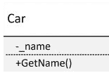
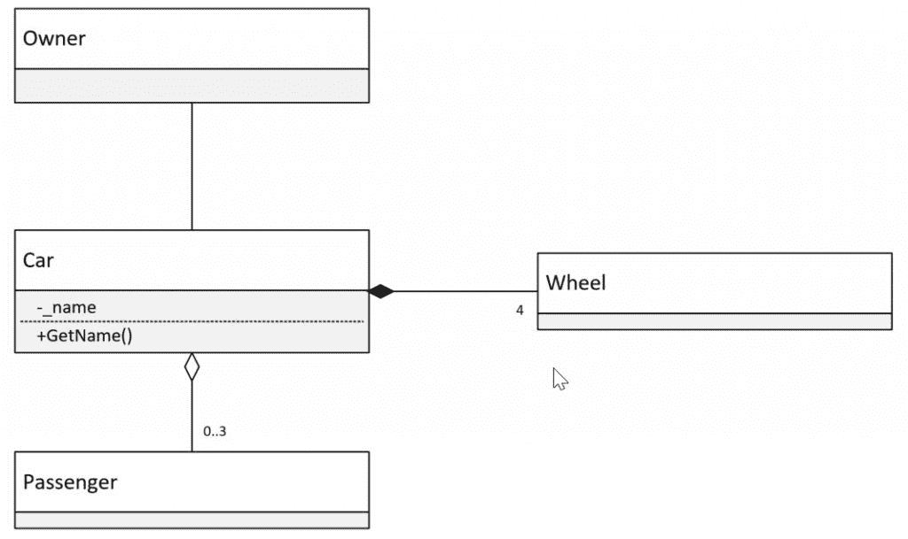
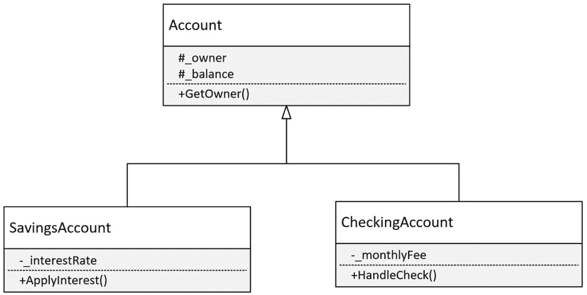
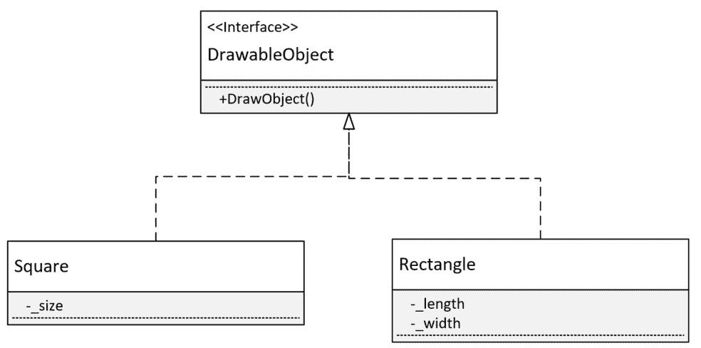
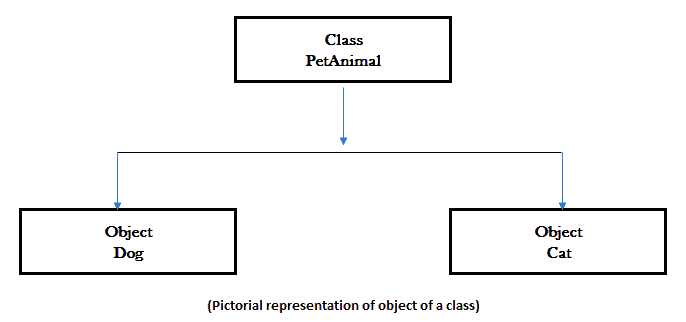
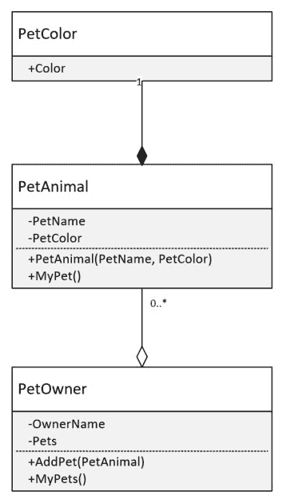
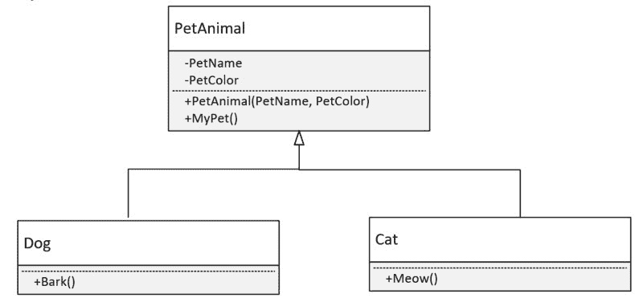
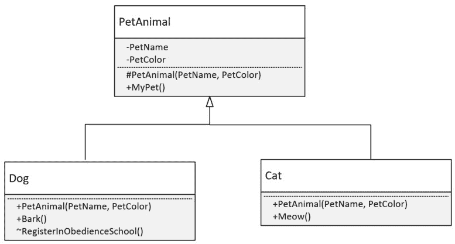

# .NET Core 和 C#中 OOP 概述

20 多年来，最受欢迎的编程语言都是基于**面向对象编程**（**OOP**）的原则。OOP 语言受欢迎的上升很大程度上归功于能够将复杂逻辑抽象成一个结构，即对象，这使得解释更加容易，更重要的是，可以在应用程序中重用。本质上，OOP 是一种软件开发方法，即使用包含数据和功能的概念来开发软件的模式。随着软件行业的成熟，OOP 中出现了针对常见问题的模式，因为它们在不同环境和行业中有效解决了相同的问题。随着软件从主机迁移到客户端服务器，再到云计算，出现了更多的模式来帮助降低开发成本和提高可靠性。本书将探讨设计模式，从 OOP 的基础到基于云软件的架构设计模式。

OOP 基于对象的概念。这个对象通常包含数据，称为属性和字段，以及称为方法的代码或行为。

**设计模式**是软件开发人员在开发过程中遇到的一般问题的解决方案，并基于成功和失败的经验构建。这些解决方案经过众多开发者在各种情况下的试验和测试。基于先前活动的模式使用的好处确保了相同的努力不会反复进行。此外，使用模式增加了问题将在不引入缺陷或问题的前提下得到解决的可靠性。

本章回顾 OOP 及其在 C#中的应用。请注意，这只是一个简短的介绍，并不旨在成为 OOP 或 C#的完整入门指南；相反，本章将详细涵盖这两个方面，以便您了解后续章节中将要介绍的设计模式。本章将涵盖以下主题：

+   关于 OOP 以及类和对象如何工作的讨论

+   继承

+   封装

+   多态

# 技术要求

本章包含各种代码示例来解释这些概念。代码保持简单，仅用于演示目的。大多数示例涉及用 C#编写的.NET Core 控制台应用程序。

要运行和执行代码，您需要以下内容：

+   Visual Studio 2019（您也可以使用 Visual Studio 2017 版本 3 或更高版本运行应用程序）

+   .NET Core

+   SQL Server（本章使用的是 Express 版）

# 安装 Visual Studio

为了运行这些代码示例，您需要安装 Visual Studio 或更高版本（您也可以使用您偏好的 IDE）。为此，请按照以下说明操作：

1.  从以下链接下载 Visual Studio：[`docs.microsoft.com/en-us/visualstudio/install/install-visual-studio`](https://docs.microsoft.com/en-us/visualstudio/install/install-visual-studio)。

1.  遵循链接中包含的安装说明。有多种版本的 Visual Studio 可用；在本章中，我们使用 Windows 版本的 Visual Studio。

# 设置.NET Core

如果您尚未安装.NET Core，您需要遵循以下说明：

1.  从以下链接下载.NET Core：[`www.microsoft.com/net/download/windows`](https://www.microsoft.com/net/download/windows)。

1.  请遵循相关库中的安装说明：[`dotnet.microsoft.com/download/dotnet-core/2.2`](https://dotnet.microsoft.com/download/dotnet-core/2.2)。

完整的源代码可在 GitHub 上获得。章节中显示的源代码可能不完整，因此建议您检索源代码以运行示例（[`github.com/PacktPublishing/Hands-On-Design-Patterns-with-C-and-.NET-Core/tree/master/Chapter1`](https://github.com/PacktPublishing/Hands-On-Design-Patterns-with-C-and-.NET-Core/tree/master/Chapter1)）。

# 本书所使用的模型

作为学习辅助，本书将包含许多 C#代码示例，以及图表和图像，以帮助描述尽可能具体的概念。这不是一本**统一建模语言**（**UML**）的书籍；然而，对于那些了解 UML 的人来说，许多图表应该看起来很熟悉。本节提供了将在这本书中使用的类图的描述。

在这里，一个类将被定义为包括字段和方法，字段和方法之间用虚线分隔。如果对讨论很重要，则可访问性将表示为`-`表示私有，`+`表示公共，`#`表示受保护，`~`表示内部。以下屏幕截图通过显示一个具有私有`_name`变量和公共`GetName()`方法的`Car`类来说明这一点：



当显示对象之间的关系时，关联用实线表示，聚合用开放菱形表示，组合用填充菱形表示。如果对讨论很重要，则多重性将显示在相关的类旁边。以下图说明了`Car`类有一个单一的**所有者**，最多有三个**乘客**；它由四个**轮子**组成：



**继承**使用基类底部的开放三角形，并通过实线显示。以下图显示了`Account`基类与`CheckingAccount`和`SavingsAccount`子类之间的关系：



**接口**以与继承类似的方式显示，但它们使用虚线以及额外的`<<interface>>`标签，如下面的图所示：



本节概述了本书中使用的模型。这种风格/方法被选择是因为，希望它对大多数读者来说将是熟悉的。

# 面向对象编程以及类和对象的工作原理

面向对象编程（OOP）是指使用定义为类的对象进行软件编程的方法。这些定义包括字段，有时称为属性，用于存储数据，以及方法以提供功能。第一种面向对象编程语言是名为 Simula 的模拟真实系统的语言（[`en.wikipedia.org/wiki/Simula`](https://en.wikipedia.org/wiki/Simula)），于 1960 年在挪威计算中心开发。第一种纯面向对象编程语言是在 1970 年作为 Smalltalk 语言出现的。这种语言被设计用来编程 Dynabook（[`history-computer.com/ModernComputer/Personal/Dynabook.html`](http://history-computer.com/ModernComputer/Personal/Dynabook.html)），这是由艾伦·凯创建的个人计算机。从那时起，发展出了几种面向对象编程语言，其中最流行的是 Java、C++、Python 和 C#。

面向对象编程（OOP）基于包含数据的对象。OOP 范式允许开发者将代码组织/安排成一个称为对象的抽象或逻辑结构。一个对象可以包含数据和行为。

使用面向对象的方法，我们正在做以下事情：

+   **模块化**：在这里，一个应用程序被分解成不同的模块。

+   **软件重用**：在这里，我们重新构建或组合应用程序来自不同的（即，现有或新的）模块。

在接下来的章节中，我们将详细讨论和理解面向对象编程的概念。

# 解释面向对象编程

早期的编程方法有局限性，它们往往变得难以维护。面向对象编程为软件开发提供了一种新的范式，它比其他方法具有优势。将代码组织到对象中的概念并不难解释，这对于新模式的采用是一个巨大的优势。可以从现实世界中提取许多例子来解释这个概念。复杂的系统也可以使用较小的构建块（即，*对象*）来描述。这允许开发者单独查看解决方案的部分，同时理解它们如何融入整个解决方案。

考虑到这一点，让我们如下定义程序：

"程序是一系列指令，指示语言编译器执行什么操作。"

正如你所见，对象是以逻辑方式组织指令列表的一种方式。回到房子的例子，建筑师的设计指导帮助我们建造房子，但它们本身不是房子。相反，建筑师的设计指导是房子的抽象表示。类类似，它定义了对象的特征。然后，根据类的定义创建对象。这通常被称为**实例化对象**。

为了更深入地理解 OOP，我们应该提及两种其他重要的编程方法：

+   **结构化编程**：这是一个由 Edsger W. Dijkstra 在 1966 年提出的术语。结构化编程是一种编程范式，它通过将问题分解成小部分来解决处理 1,000 行代码的问题。这些小部分通常被称为**子程序**、**块结构**、**for**和**while**循环等。使用结构化编程技术的语言包括 ALGOL、Pascal、PL/I 等。

+   **过程式编程**：这是一种从结构化编程衍生出来的范式，它简单地基于我们如何进行调用（也称为**过程调用**）。使用过程式编程技术的语言包括 COBOL、Pascal 和 C。Go 编程语言的一个近期例子是在 2009 年发布的。

过程调用

过程调用是指激活一组称为**过程**的语句。这有时也被称为被**调用**的过程。

这两种方法的主要问题是，一旦程序变得庞大，程序就难以管理。更复杂和更大的代码库的程序会拉伸这两种方法，导致难以理解和维护的应用程序。为了克服这些问题，OOP 提供了以下特性：

+   继承

+   封装

+   多态

在接下来的章节中，我们将更详细地讨论这些特性。

继承、封装和多态有时被称为 OOP 的三大支柱。

在我们开始之前，让我们讨论一些在面向对象编程（OOP）中常见的结构。

# 类

**类**是一组或模板定义，描述了对象的属性和方法。换句话说，类是一个蓝图，包含了所有类实例（称为对象）共有的变量和方法定义。

让我们看一下以下代码示例：

```cs
public class PetAnimal
{
    private readonly string PetName;
    private readonly PetColor PetColor;

    public PetAnimal(string petName, PetColor petColor)
    {
        PetName = petName;
        PetColor = petColor;
    }

    public string MyPet() => $"My pet is {PetName} and its color is {PetColor}.";
}
```

在前面的代码中，我们有一个名为`PetAnimal`的类，它有两个私有字段，分别称为`PetName`和`PetColor`，以及一个名为`MyPet()`的方法。

# 对象

在现实世界中，对象有两个共同的特征，即状态和行为。换句话说，我们可以这样说，每个对象都有一个名称、颜色等；这些特征仅仅是对象的状态。让我们以任何类型的宠物为例：狗和猫都会有一个名字，人们会叫它。所以，以这种方式，我的狗名叫 Ace，我的猫名叫 Clementine。同样，狗和猫都有特定的行为，例如，狗会吠叫，猫会喵喵叫。

在*解释 OOP*部分，我们讨论了 OOP 是一种旨在结合状态或结构（数据）和行为（方法）以提供软件功能的编程模型。在先前的例子中，宠物的不同状态构成了实际的数据，而宠物的行为则是方法。

对象将信息（即数据）存储在属性中，并通过方法展示其行为。

在面向对象的语言，如 C#中，对象是类的实例。在我们之前的例子中，现实世界的对象`Dog`将是`PetAnimal`类的一个对象。

对象可以是具体的（即现实世界的对象，如狗或猫，或任何类型的文件，如物理文件或计算机文件），也可以是概念性的，如数据库模式或代码蓝图。

以下代码片段展示了对象如何包含数据和方法，以及如何使用它：

```cs
namespace OOPExample
{
    class Program
    {
        static void Main(string[] args)
        {
            Console.WriteLine("OOP example");
            PetAnimal dog = new PetAnimal("Ace", PetColor.Black);
            Console.WriteLine(dog.MyPet());
            Console.ReadLine();
            PetAnimal cat = new PetAnimal("Clementine", PetColor.Brown);
            Console.WriteLine(cat.MyPet());
            Console.ReadLine();
        }
    }
}
```

在之前的代码片段中，我们创建了两个对象：`dog`和`cat`。这些对象是`PetAnimal`类的两个不同实例。您可以看到，包含有关动物数据的字段或属性是通过构造函数方法赋予值的。构造函数方法是一个特殊的方法，用于创建类的实例。

让我们在以下图中可视化这个例子：



以下图是之前代码示例的图形表示，其中我们创建了两个不同的`Dog`和`Cat`对象，它们都是`PetAnimal`类的实例。该图相对自解释；它告诉我们`Dog`类的对象是`PetAnimal`类的一个实例，`Cat`对象也是如此。

# 关联

对象关联是面向对象的一个重要特性。现实世界中的对象之间存在关系，在面向对象中，关联允许我们定义`has-a`关系；例如，自行车`有`骑手或猫`有`鼻子`。

以下是一些`has-a`关系类型的例子：

+   **关联**：关联用于描述对象之间的关系，这样就不会描述所有者关系，例如，汽车和人的关系。汽车和人之间的关系被描述，例如司机。一个人可以驾驶多辆车，一辆车也可以被多个人驾驶。

+   **聚合**：聚合是一种特殊的关联形式。类似于关联，对象在聚合中也有它们自己的生命周期，但它涉及所有者关系。这意味着子对象不能属于另一个父对象。聚合是一种单向关系，其中对象的生命是相互独立的。例如，子父关系是一种聚合，因为每个孩子都有一个父母，但并非每个父母都有一个孩子。

+   **组合**：组合指的是死亡关系；它表示两个对象之间的关系，其中一个对象（子对象）依赖于另一个对象（父对象）。如果父对象被删除，所有子对象将自动被删除。让我们以房屋和房间为例。一个房屋可以有多个房间，但一个房间不能属于多个房屋。如果我们拆除了房屋，房间将自动被删除。

让我们通过扩展之前的宠物示例并引入一个`PetOwner`类来在 C#中说明这些概念。`PetOwner`类可以关联一个或多个`PetAnimal`实例。由于`PetAnimal`类可以有无所有者而存在，这种关系是聚合关系。`PetAnimal`与`PetColor`相关联，在这个系统中，只有当它与`PetAnimal`相关联时，`PetColor`才存在，这使得关联成为组合。

以下图示说明了聚合和组合：



上述模型基于 UML，可能对您来说并不熟悉；因此，让我们指出关于该图的一些重要事项。类由一个包含类名以及其属性和方法的框表示（通过虚线分隔）。现在，忽略名称前的符号，例如`+`或`-`，因为我们将在讨论封装时介绍访问修饰符。关联通过连接类的线条表示。在组合的情况下，父类的一侧使用实心菱形，而父类的一侧使用开放菱形来表示聚合。此外，请注意，该图支持表示可能子数目的多值。在图中，`PetOwner`类可以有`0`个或更多`PetAnimal`类（注意，*****表示没有强制限制关联的数量）。

UML

UML 是一种专门为软件工程开发的建模语言。它经过 20 多年的发展，由**对象管理组**（**OMG**）管理。您可以参考[`www.uml.org/`](http://www.uml.org/)获取更多详细信息。

# 接口

在 C#中，**接口**定义了一个对象包含的内容，或其合同；特别是对象的方法、属性、事件或索引。然而，接口不提供实现。接口不能包含属性。这与基类形成对比，基类既提供合同也提供实现。实现接口的类必须实现接口中指定的所有内容。

抽象类

抽象类在接口和基类之间是一种混合体，因为它提供了实现和属性，以及必须在子类中定义的方法。

签名

术语*签名*也可以用来描述一个对象的合同。

# 继承

面向对象编程中最重要的概念之一就是继承。类之间的继承关系允许我们定义一个*类型关系*；例如，汽车*是一种*交通工具。这个概念的重要性在于它允许相同类型的对象共享相似的特征。假设我们有一个在线书店不同产品管理的系统。我们可能有一个类用于存储关于实体书的详细信息，另一个类用于存储关于数字或在线书的详细信息。两个类之间相似的特征，如名称、出版社和作者，可以存储在另一个类中。实体书和数字书类然后可以继承自这个其他类。

有不同的术语来描述继承中的类：一个*子*或*派生*类从另一个类继承，而正在被继承的类可以被称为*父*或*基*类。

在接下来的章节中，我们将更详细地讨论继承。

# 继承的类型

继承帮助我们定义一个子类。这个子类继承了父类或基类的行为。

在 C# 中，继承使用冒号（`:`）进行符号定义。

让我们看看不同的继承类型：

+   **单继承**：作为最常见的继承类型，单继承描述了一个从另一个类派生出来的单个类。

让我们回顾一下之前提到的 `PetAnimal` 类，然后使用继承来定义我们的 `Dog` 和 `Cat` 类。使用继承，我们可以定义一些两个类都共有的属性。例如，宠物的名字和宠物的颜色是共有的，所以它们会被放在一个基类中。猫或狗的具体特征然后会在特定的类中定义；例如，猫和狗发出的声音。以下图表展示了具有两个子类的 `PetAnimal` 基类：



C# 只支持单继承。

+   **多重继承**：当一个派生类从多个基类继承时，发生多重继承。例如，C++ 语言支持多重继承。C# 不支持多重继承，但我们可以通过接口的帮助实现类似多重继承的行为。

您可以参考以下帖子以获取有关 C# 和多重继承的更多信息：

[`blogs.msdn.microsoft.com/csharpfaq/2004/03/07/why-doesnt-c-supportmultiple-inheritance/`](https://blogs.msdn.microsoft.com/csharpfaq/2004/03/07/why-doesnt-c-supportmultiple-inheritance/).

+   **层次继承**：当多个类从另一个类继承时，发生层次继承。

+   **多层继承**：当一个类从已经是一个派生类的类派生时，它被称为多层继承。

+   **混合继承**：混合继承是多种继承的组合。

C# 不支持混合继承。

+   **隐式继承**：.NET Core 中的所有类型都隐式继承自`System.Object`类及其派生类。

# 封装

封装是面向对象编程中的另一个基本概念，其中类的细节，即属性和方法，可以在对象外部可见或不可见。通过封装，开发者提供了关于如何使用类的指导，同时帮助防止类被错误处理。例如，假设我们只想通过使用`AddPet(PetAnimal)`方法来添加`PetAnimal`对象。我们会通过使`PetOwner`类的`AddPet(PetAnimal)`方法可用，同时将`Pets`属性限制为`PetAnimal`类之外的所有内容来实现这一点。在 C#中，这是通过将`Pets`属性设置为私有来实现的。这样做的一个原因可能是，每当添加`PetAnimal`类时，都需要额外的逻辑，例如记录或验证`PetOwner`类是否可以有宠物。

C#支持可以在项目上设置的不同的访问级别。项目可以是类、类的属性或方法，或枚举：

+   **公共**：这表示可以在项目外部进行访问。

+   **私有**：这表示只有对象可以访问项目。

+   **受保护的**：这表示只有对象（以及扩展了该类的对象）可以访问属性或方法。

+   **内部**：这表示只有同一组件内的对象可以访问项目。

+   **受保护的内部**：这表示只有对象（以及扩展了该类的对象）可以访问同一组件内的属性或方法。

在以下图中，对`PetAnimal`应用了访问修饰符：



例如，宠物的名称和颜色被设置为私有，以防止从`PetAnimal`类外部访问。在这个例子中，我们限制了`PetName`和`PetColor`属性，以确保只有`PetAnimal`类可以访问它们，从而确保只有基类`PetAnimal`可以更改它们的值。`PetAnimal`的构造函数被设置为受保护的，以确保只有子类可以访问它。在这个应用程序中，只有与`Dog`类位于同一库中的类可以访问`RegisterInObedienceSchool()`方法。

# 多态

使用相同的接口处理不同对象的能力称为多态。这为开发者提供了将灵活性构建到应用程序中的能力，通过编写一个可以应用于不同形式的功能，只要它们共享一个公共接口即可。在面向对象编程（OOP）中，多态有不同的定义，我们将区分两种主要类型：

+   **静态或早期绑定**：这种多态发生在应用程序编译时。

+   **动态或晚期绑定**：这种形式的多态发生在应用程序运行时。

# 静态多态

静态或早期绑定多态发生在编译时，它主要是由方法重载组成，即一个类有多个具有相同名称但参数不同的方法。这通常有助于传达方法的含义或简化代码。例如，在计算器中，有多个方法用于添加不同类型的数字比每个场景都有不同的方法名称更易于阅读；让我们比较以下代码：

```cs
int Add(int a, int b) => a + b;
float Add(float a, float b) => a + b;
decimal Add(decimal a, decimal b) => a + b;
```

在以下代码中，代码再次展示了相同的功能，但没有重载`Add()`方法：

```cs
int AddTwoIntegers(int a, int b) => a + b;
float AddTwoFloats(float a, float b) => a + b;
decimal AddTwoDecimals(decimal a, decimal b) => a + b;
```

在宠物示例中，主人会使用不同的食物来喂养`cat`和`dog`类的对象。我们可以定义一个`PetOwner`类，其中包含两个`Feed()`方法，如下所示：

```cs
public void Feed(PetDog dog)
{
    PetFeeder.FeedPet(dog, new Kibble());
}

public void Feed(PetCat cat)
{
    PetFeeder.FeedPet(cat, new Fish());
}
```

两种方法都使用一个`PetFeeder`类来喂养宠物，而`dog`类被赋予`Kibble`，`cat`实例则被赋予`Fish`。`PetFeeder`类在*泛型*部分有所描述。

# 动态多态

动态或晚期绑定多态发生在应用程序运行时。有多个情况可以发生，我们将涵盖 C#中的三种常见形式：接口、继承和泛型。

# 接口多态

接口定义了一个类必须实现的签名。在`PetAnimal`示例中，想象我们定义宠物食品提供能量量，如下所示：

```cs
public interface IPetFood
{
    int Energy { get; }
}
```

界面本身不能被实例化，但它描述了`IPetFood`实例必须实现的内容。例如，`Kibble`和`Fish`可能提供不同水平的能量，如下面的代码所示：

```cs
public class Kibble : IPetFood
{
    public int Energy => 7;
}

public class Fish : IPetFood
{
    int IPetFood.Energy => 8;
}
```

在前面的代码片段中，`Kibble`提供的能量比`Fish`少。

# 继承多态

继承多态允许在运行时以类似于接口的方式确定功能，但应用于类继承。在我们的例子中，宠物可以被喂养，因此我们可以定义一个新的`Feed(IPetFood)`方法，它使用之前定义的接口：

```cs
public virtual void Feed(IPetFood food)
{
    Eat(food);
}

protected void Eat(IPetFood food)
{
    _hunger -= food.Energy;
}
```

上述代码表明，所有`PetAnimal`的实现都将有一个`Feed(IPetFood)`方法，并且子类可以提供不同的实现。`Eat(IPetFood food)`没有被标记为虚拟，因为预期所有`PetAnimal`对象都将使用该方法，而不需要覆盖其行为。它也被标记为受保护的，以防止从对象外部访问。

虚方法不需要在子类中定义；这与接口不同，在接口中所有方法都必须实现。

`PetDog`不会覆盖基类的行为，因为狗会吃`Kibble`和`Fish`。猫则更为挑剔，如下面的代码所示：

```cs
public override void Feed(IPetFood food)
{
    if (food is Fish)
    {
        Eat(food);
    }
    else
    {
        Meow();
    }
}
```

使用`override`关键字，`PetCat`将改变基类的行为，使得猫只能吃鱼。

# 泛型

泛型定义了一种可以应用于类的行为。这种形式最常见的应用是在集合中，其中可以应用相同的处理对象的方法，而不管对象的类型如何。例如，字符串列表或整数列表可以使用相同的逻辑进行处理，而无需区分具体的类型。

回到宠物的话题，我们可以定义一个用于喂养宠物的泛型类。这个类简单地根据提供的宠物和食物来喂养宠物，如下面的代码所示：

```cs
public static class PetFeeder
{
    public static void FeedPet<TP, TF>(TP pet, TF food) where TP : PetAnimal
                                                    where TF : IPetFood 
    {
        pet.Feed(food); 
    }
}
```

在这里有一些有趣的事情需要指出。首先，由于类和方法都被标记为静态，因此不需要实例化这个类。泛型方法使用方法签名`FeedPet<TP, TF>`进行描述。`where`关键字用于指示对`TP`和`TF`的额外要求。在这个例子中，`where`关键字定义`TP`必须是一个`PetAnimal`类型的类型，而`TF`必须实现`IPetFood`接口。

# 摘要

在本章中，我们讨论了面向对象编程（OOP）及其三个主要特性：继承、封装和多态。使用这些特性，应用程序中的类可以被抽象化，以提供既易于理解又受保护的定义，防止以与其目的不一致的方式使用。这是面向对象编程与一些早期的软件开发语言（如结构化和过程化编程）之间的基本区别。通过抽象功能的能力，代码的重用和维护能力得到了提高。

在下一章中，我们将讨论在企业软件开发中使用的各种模式。我们将涵盖编程模式以及**软件开发生命周期**（**SDLC**）中使用的软件开发原则和模式。

# 问题

以下问题将帮助您巩固本章包含的信息：

1.  晚绑定和早绑定这两个术语指的是什么？

1.  C#支持多重继承吗？

1.  在 C#中，可以使用什么级别的封装来防止从库外部访问类？

1.  聚合和组合之间的区别是什么？

1.  接口可以包含属性吗？（这是一个有点狡猾的问题。）

1.  狗吃鱼吗？
