# 第二章：现代软件开发模式和原则

在上一章中，为了探索不同的模式，讨论了**面向对象编程**（**OOP**）。由于许多模式依赖于 OOP 中的概念，因此介绍和/或回顾这些概念很重要。类之间的继承使我们能够定义一个*is-a-type-of*关系。这提供了更高的抽象程度。例如，使用继承可以进行诸如*cat*是*animal*类型和*dog*是*animal*类型的比较。封装提供了一种控制类细节可见性和访问性的方法。多态提供了使用相同接口处理不同对象的能力。通过 OOP，可以达到更高的抽象层次，提供了一种更易于管理和理解的方式来处理大型解决方案。

本章对现代软件开发中使用的不同模式进行了目录化和介绍。本书对模式的概念采取了非常宽泛的看法。在软件开发中，模式是对软件开发人员在开发过程中遇到的一般问题的任何解决方案。它们是从经验中构建的，这些经验包括哪些有效和哪些无效。此外，这些解决方案在多种情况下由众多开发者进行了试验和测试。使用模式的好处基于过去的活动，既不重复努力，又确保问题在没有引入缺陷或问题的情况下得到解决。

尤其是在考虑特定技术模式时，模式太多，一本书难以涵盖，因此本章将突出特定的模式来展示不同类型的模式。我们根据经验挑选出了最常见和最有影响力的模式。在随后的章节中，将更详细地探讨特定模式。

本章将涵盖以下主题：

+   设计原则，包括 SOLID

+   模式目录，包括**设计模式**（**GoF**）模式和**企业集成模式**（**EIP**）

+   软件开发生命周期模式

+   解决方案开发、云开发和服务开发的模式和惯例

# 技术要求

本章包含各种代码示例来解释概念。代码保持简单，仅用于演示目的。大多数示例涉及使用 C#编写的.NET Core 控制台应用程序。

要运行和执行代码，您需要以下内容：

+   Visual Studio 2019（您也可以使用 Visual Studio 2017 版本 3 或更高版本运行应用程序）

+   .NET Core

+   SQL Server（本章使用的是 Express 版本）

# 安装 Visual Studio

要运行这些代码示例，您需要安装 Visual Studio，或者您可以使用您首选的 IDE。为此，请按照以下说明操作：

1.  从以下链接下载 Visual Studio：[`docs.microsoft.com/en-us/visualstudio/install/install-visual-studio`](https://docs.microsoft.com/en-us/visualstudio/install/install-visual-studio).

1.  按照包含的安装说明进行操作。Visual Studio 安装有多个版本可用。在本章中，我们使用的是 Windows 版本的 Visual Studio。

# 设置.NET Core

如果你没有安装.NET Core，你需要遵循以下说明：

1.  从以下链接下载.NET Core：[`www.microsoft.com/net/download/windows`](https://www.microsoft.com/net/download/windows).

1.  按照安装说明和相关库：[`dotnet.microsoft.com/download/dotnet-core/2.2`](https://dotnet.microsoft.com/download/dotnet-core/2.2).

完整的源代码可在 GitHub 上找到。章节中显示的源代码可能不完整，因此建议检索源代码以运行示例：[`github.com/PacktPublishing/Hands-On-Design-Patterns-with-C-and-.NET-Core/tree/master/Chapter2`](https://github.com/PacktPublishing/Hands-On-Design-Patterns-with-C-and-.NET-Core/tree/master/Chapter2).

# 设计原则

不可否认，软件开发最重要的方面之一是软件设计。开发既功能准确又易于维护的软件解决方案具有挑战性，并且很大程度上依赖于使用良好的开发原则。随着时间的推移，项目早期做出的某些决策可能导致解决方案变得过于昂贵，难以维护和扩展，迫使系统需要重写，而那些设计良好的解决方案则可以根据业务需求和技术的变化进行扩展和适应。有许多软件开发设计原则，本节将突出一些你需要熟悉的流行且重要的原则。

# DRY – 不要重复自己

**不要重复自己**（DRY）原则背后的指导思想是，重复是时间和精力的浪费。重复可能以流程和代码的形式出现。处理相同的要求多次是浪费精力，并在解决方案中造成混乱。当首次看到这个原则时，可能不清楚一个系统是如何最终重复一个流程或代码的。例如，一旦有人确定如何完成一个需求，为什么其他人还要费力去重复相同的功能？在软件开发中，这种情况有很多，理解为什么会发生这种情况是理解这个原则价值的关键。

以下是一些常见的代码重复原因：

+   **缺乏理解**：在大型的解决方案中，开发者可能对现有解决方案没有全面的理解，或者不知道如何应用抽象来解决现有功能的问题。

+   **复制粘贴**：简单来说，代码在多个类中重复，而不是重构解决方案以允许多个类访问共享的功能。

# KISS – 保持简单，傻瓜

与 DRY 类似，**保持简单，傻瓜**（**KISS**）在软件开发中已经是一个重要的原则很多年了。KISS 强调简单应该是目标，复杂性应该被避免。这里的关键是避免不必要的复杂性，从而减少出错的可能性。

# YAGNI – 你不会需要它

**你不会需要它**（**YAGNI**）简单地说，只有在需要时才应该添加功能。在软件开发中，有时有一种趋势，即为了防止设计发生变化而进行**未来化**设计。这可能会产生实际上目前或未来都不需要的需求：

“总是在你需要的时候实现事物，而不是仅仅预见你需要它们的时候。”

*- 罗恩·杰弗里斯*

# MVP - 最小可行产品

通过采用**最小可行产品**（**MVP**）的方法，一项工作的范围被限制在最小的需求集，以便产生一个可工作的交付成果。MVP 通常与敏捷软件开发（见本章后面的*软件开发生命周期模式*部分）结合使用，通过限制需求到一个可管理的数量，以便设计、开发、测试和交付。这种方法非常适合小型网站或应用程序开发，其中功能集可以在单个开发周期中从生产中逐步推进。

在第三章，*实现设计模式 - 基础部分 1*中，将通过一个虚构场景来展示 MVP，其中将使用该技术来限制变更范围，并在设计和需求收集阶段帮助团队集中精力。

# SOLID

SOLID 是最有影响力的设计原则之一，我们将在第三章，*实现设计模式 - 基础部分 1*中更详细地介绍它。SOLID 实际上由五个设计原则组成，其目的是鼓励更易于维护和理解的代码设计。这些原则鼓励代码库更容易修改，并减少引入问题的风险。

在第三章，*实现设计模式 - 基础部分 1*中，将更详细地介绍 SOLID 原则，通过将其应用于 C#应用程序来展示。

# 单一职责原则

一个类应该只有一个职责。这个原则的目标是简化我们的类并逻辑地组织它们。具有多个职责的类更难以理解和修改，因为它们更复杂。在这个情况下，职责简单地说就是改变的理由。另一种看待职责的方式是将其定义为功能的一个单独部分：

“一个类应该只有一个，且仅有一个，改变的理由。”

*- 罗伯特·C·马丁*

# 开放/封闭原则

开放/封闭原则最好用面向对象编程（OOP）来描述。一个类应该通过继承作为扩展其功能的方式来进行设计。换句话说，改变是在类设计时就已经计划和考虑的。通过定义和使用类实现的接口，应用了开放/封闭原则。类对于修改是*开放*的，而其描述，即接口，对于修改是*封闭*的。

# 李斯克夫替换原则

能够在运行时替换对象是李斯克夫替换原则的基础。在面向对象编程中，如果一个类从基类继承或实现了一个接口，那么它可以被引用为基类或接口的对象。这可以通过一个简单的例子来更容易地描述。

我们将定义一个动物的接口，并实现两个动物，`Cat`（猫）和`Dog`（狗），如下所示：

```cs
interface IAnimal
{
     string MakeNoise();
}
class Dog : IAnimal
{
   public string MakeNoise()
     {
        return "Woof";
     }
}
class Cat : IAnimal
{
    public string MakeNoise()
    {
        return "Meouw";
    }
}
```

然后，我们可以将`Cat`（猫）和`Dog`（狗）作为动物来引用，如下所示：

```cs
var animals = new List<IAnimal> { new Cat(), new Dog() };

foreach(var animal in animals)
{
    Console.Write(animal.MakeNoise());
}
```

# 接口隔离原则

与单一职责原则类似，接口隔离原则指出一个接口应该仅包含与单一职责相关的方法。通过减少接口的复杂性，代码变得更容易重构和理解。遵循这个原则的系统的一个重要好处是，它通过减少依赖项的数量来帮助解耦系统。

# 依赖倒置原则

**依赖倒置原则**（**DIP**），也称为依赖注入原则，指出模块应该依赖于抽象而不是细节。这个原则鼓励编写松散耦合的代码，以增强可读性和维护性，尤其是在大型复杂的代码库中。

# 软件模式

多年来，许多模式被汇编成目录。本节将使用两个目录作为说明。第一个目录是**GoF**（ Gang of Four，四人帮）收集的与面向对象编程相关的模式。第二个与系统和技术的集成相关，保持技术中立。本章末尾有一些关于其他目录和资源的参考文献。

# GoF 模式

可能最有影响力和最著名的面向对象模式集合来自**GoF**（Gang of Four，四人帮）的《设计模式：可复用面向对象软件元素》一书。书中模式的目标是在较低层次上——即对象创建和交互——而不是更大的软件架构关注点。这个集合由可以应用于特定场景的模板组成，目标是产生坚实的构建块，同时避免面向对象开发中的常见陷阱。

*Erich Gamma, John Vlissides, Richard Helm* 和 *Ralph Johnson* 被称为 GoF，因为他们 90 年代广泛影响的出版物。这本书 *设计模式：可复用面向对象软件元素* 已被翻译成多种语言，并包含 C++和 Smalltalk 的示例。

该集合分为三个类别：创建型模式、结构型模式和行为型模式，将在以下章节中解释。

# 创建型模式

以下五个模式与对象的实例化有关：

+   **抽象工厂模式**：一种用于创建属于一组类对象的模式。具体的对象在运行时确定。

+   **建造者模式**：一种对于更复杂对象有用的模式，其中对象的构建由构建类外部控制。

+   **工厂方法模式**：一种在运行时确定具体类的情况下创建派生对象的模式。

+   **原型模式**：一种用于复制或克隆对象的模式。

+   **单例模式**：一种确保只有一个类实例的模式。

在 第三章，*实现设计模式 - 基础部分 1*，将更详细地探讨抽象工厂模式。在 第四章，*实现设计模式 - 基础部分 2*，将详细探讨单例和工厂方法模式，包括使用.NET Core 框架对这些模式的支持。

# 结构型模式

以下模式与定义类和对象之间的关系有关：

+   **适配器模式**：一种提供两个不同类之间匹配的模式

+   **桥接模式**：一种允许在不修改类的情况下替换类的实现细节的模式

+   **组合模式**：用于在树结构中创建类层次

+   **装饰器模式**：一种在运行时替换类功能模式的模式

+   **外观模式**：一种用于简化复杂系统的模式

+   **享元模式**：一种用于减少复杂模型资源使用的模式

+   **代理模式**：一种用于表示另一个对象，允许在调用对象和被调用对象之间增加一个控制层的模式

# 装饰器模式

为了说明一个结构型模式，让我们通过一个示例来更详细地看看装饰器模式。这个示例将在控制台应用程序上打印消息。首先，定义一个基消息及其相应的接口：

```cs
interface IMessage
{
    void PrintMessage();
}

abstract class Message : IMessage
{
    protected string _text;
    public Message(string text)
    {
        _text = text;
    }
    abstract public void PrintMessage();
}
```

基类允许存储一个文本字符串，并要求子类实现 `PrintMessage()` 方法。这将扩展到两个新的类。

第一个类是一个 `SimpleMessage`，它将给定的文本写入控制台：

```cs
class SimpleMessage : Message
{
    public SimpleMessage(string text) : base(text) { }

    public override void PrintMessage()
    {
        Console.WriteLine(_text);
    }
}
```

第二个类是一个 `AlertMessage`，它也将给定的文本写入控制台，但还会执行一个蜂鸣声：

```cs
class AlertMessage : Message
{
    public AlertMessage(string text) : base(text) { }
    public override void PrintMessage()
    {
        Console.Beep();
        Console.WriteLine(_text);
    }
}
```

两者之间的区别在于，`AlertMessage` 类将发出蜂鸣声而不是像 `SimpleMessage` 类一样仅将文本打印到屏幕上。

接下来，定义了一个基装饰者类，它将包含对 `Message` 对象的引用，如下所示：

```cs
abstract class MessageDecorator : IMessage
{
    protected Message _message;
    public MessageDecorator(Message message)
    {
        _message = message;
    }

    public abstract void PrintMessage();
}
```

以下两个类通过为我们现有的 `Message` 实现提供额外的功能来展示装饰者模式。

第一个是打印前景为绿色的消息的 `NormalDecorator`：

```cs
class NormalDecorator : MessageDecorator
{
    public NormalDecorator(Message message) : base(message) { }

    public override void PrintMessage()
    {
        Console.ForegroundColor = ConsoleColor.Green;
        _message.PrintMessage();
        Console.ForegroundColor = ConsoleColor.White;
    }
}
```

`ErrorDecorator` 使用红色前景色使消息在打印到控制台时更加突出：

```cs

class ErrorDecorator : MessageDecorator
{
    public ErrorDecorator(Message message) : base(message) { }

    public override void PrintMessage()
    {
        Console.ForegroundColor = ConsoleColor.Red;
        _message.PrintMessage();
        Console.ForegroundColor = ConsoleColor.White;
    }
}
```

`NormalDecorator` 将以绿色打印文本，而 `ErrorDecorator` 将以红色打印文本。这个例子中的重要之处在于装饰者正在扩展引用的 `Message` 对象的行为。

为了完成示例，以下展示了如何使用新消息：

```cs
static void Main(string[] args)
{
    var messages = new List<IMessage>
    {
        new NormalDecorator(new SimpleMessage("First Message!")),
        new NormalDecorator(new AlertMessage("Second Message with a beep!")),
        new ErrorDecorator(new AlertMessage("Third Message with a beep and in red!")),
        new SimpleMessage("Not Decorated...")
    };
    foreach (var message in messages)
    {
        message.PrintMessage();
    }
    Console.Read();
}
```

运行示例将说明不同的装饰者模式如何被用来改变引用的功能，如下所示：

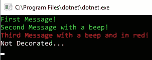

这是一个简化的例子，但想象一下，如果项目中添加了新的需求，而不是使用蜂鸣声，系统应该播放感叹号的声音。

```cs
class AlertMessage : Message
{
    public AlertMessage(string text) : base(text) { }
    public override void PrintMessage()
    {
        System.Media.SystemSounds.Exclamation.Play();
        Console.WriteLine(_text);
    }
}
```

由于我们已经有一个处理这种结构的机制，所以修改就像之前代码块中显示的那样，只是一行更改。

# 行为模式

以下行为模式可以用来定义类和对象之间的通信：

+   **责任链**：一种在对象集合之间处理请求的模式

+   **命令**：一种用于表示请求的模式

+   **解释器**：一种为程序中的指令定义语法或语言的模式

+   **迭代器**：一种在不知道集合中元素详细情况的情况下遍历项目集合的模式

+   **中介者**：一种简化类之间通信的模式

+   **备忘录**：一种捕获和存储对象状态的模式

+   **观察者**：一种允许对象被通知另一个对象状态变化的模式

+   **状态**：一种在对象状态改变时改变对象行为的模式

+   **策略**：一种实现算法集合的模式，其中可以在运行时应用特定的算法

+   **模板方法**：一种定义算法步骤的模式，同时将实现细节留给子类

+   **访问者**：一种促进数据与功能之间松散耦合的模式，允许在不修改数据类的情况下添加额外的操作

# 责任链

您需要熟悉的一个有用模式是责任链模式，因此我们将使用它作为示例。使用此模式，我们将设置一个用于处理请求的类集合或链。想法是请求将穿过每个类，直到被处理。此说明使用了一个汽车服务中心，其中每辆车将穿过中心的各个部分，直到服务完成。

首先，我们需要定义一组标志，这些标志将用于指示所需的服务：

```cs
[Flags]
enum ServiceRequirements
{
    None = 0,
    WheelAlignment = 1,
    Dirty = 2,
    EngineTune = 4,
    TestDrive = 8
}
```

C#中的`FlagsAttribute`是一种使用位字段来持有标志集合的绝佳方式。单个字段将用于通过位运算指示已**开启**的枚举值。

`Car`将包含一个字段来捕获所需的服务，以及一个字段，当服务完成时返回 true：

```cs
class Car
{
    public ServiceRequirements Requirements { get; set; }

    public bool IsServiceComplete
    {
        get
        {
            return Requirements == ServiceRequirements.None;
        }
    }
}
```

需要指出的一点是，一旦所有要求都已完成，`Car`被认为其服务已完成，这由`IsServiceComplete`属性表示。

将用于表示我们每个服务技术员的抽象基类如下所示：

```cs
abstract class ServiceHandler
{
    protected ServiceHandler _nextServiceHandler;
    protected ServiceRequirements _servicesProvided;

    public ServiceHandler(ServiceRequirements servicesProvided)
    {
        _servicesProvided = servicesProvided;
    }
}
```

注意，提供服务的`ServiceHandler`类扩展的类，换句话说，是技师，需要被传递进来。

然后将通过使用位运算符`NOT` (`~`) 来**关闭**给定`Car`上的位，在`Service`方法中指示需要服务：

```cs
public void Service(Car car)
{
    if (_servicesProvided == (car.Requirements & _servicesProvided))
    {
        Console.WriteLine($"{this.GetType().Name} providing {this._servicesProvided} services.");
        car.Requirements &= ~_servicesProvided;
    }

    if (car.IsServiceComplete || _nextServiceHandler == null)
        return;
    else
        _nextServiceHandler.Service(car);
}
```

如果汽车上的所有服务都已完成，或者没有更多的服务，则停止链。如果有其他服务且汽车未准备好，则调用下一个服务处理程序。

此方法需要设置链，前面的示例展示了这是如何通过使用`SetNextServiceHandler()`方法来设置下一个要执行的服务来完成的：

```cs
public void SetNextServiceHandler(ServiceHandler handler)
{
    _nextServiceHandler = handler;
}
```

服务专家包括`Detailer`、`Mechanic`、`WheelSpecialist`和`QualityControl`工程师。代表`Detailer`的`ServiceHandler`在以下代码中展示：

```cs
class Detailer : ServiceHandler
{
    public Detailer() : base(ServiceRequirements.Dirty) { }
}
```

机械师，其专业是调整引擎，在以下代码中展示：

```cs
class Mechanic : ServiceHandler
{
    public Mechanic() : base(ServiceRequirements.EngineTune) { }
}
```

车轮专家在以下代码中展示：

```cs
class WheelSpecialist : ServiceHandler
{
    public WheelSpecialist() : base(ServiceRequirements.WheelAlignment) { }
}
```

最后是质量控制，他将进行试驾：

```cs
class QualityControl : ServiceHandler
{
    public QualityControl() : base(ServiceRequirements.TestDrive) { }
}
```

服务中心的技师已经定义，所以下一步是为几辆汽车提供服务。这将在`Main`代码块中展示，从构建所需的对象开始：

```cs
static void Main(string[] args)
{ 
    var mechanic = new Mechanic();
    var detailer = new Detailer();
    var wheels = new WheelSpecialist();
    var qa = new QualityControl();
```

下一步将是设置不同服务的处理顺序：

```cs
    qa.SetNextServiceHandler(detailer);
    wheels.SetNextServiceHandler(qa);
    mechanic.SetNextServiceHandler(wheels);
```

然后将调用两次机械师，这是责任链的开始：

```cs
    Console.WriteLine("Car 1 is dirty");
    mechanic.Service(new Car { Requirements = ServiceRequirements.Dirty });

    Console.WriteLine();

    Console.WriteLine("Car 2 requires full service");
    mechanic.Service(new Car { Requirements = ServiceRequirements.Dirty | 
                                                ServiceRequirements.EngineTune | 
                                                ServiceRequirements.TestDrive | 
                                                ServiceRequirements.WheelAlignment });

    Console.Read();
}
```

需要注意的一个重要事项是链的设置顺序。对于这个服务中心，机械师首先进行调校，然后进行车轮定位。接着进行试驾，之后对汽车进行详细的工作。最初，试驾是作为最后一步进行的，但服务中心确定，在雨天，这需要重复汽车细节。这是一个有点愚蠢的例子，但它说明了以灵活的方式定义责任链的好处。

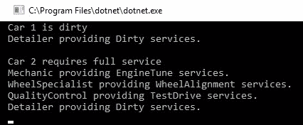

上述截图显示了我们的两辆车完成维修后的显示。

# 观察者模式

一个值得详细探索的有趣模式是 **观察者模式**。这个模式允许实例在另一个实例中发生特定事件时得到通知。这样，就有许多观察者和一个主题。以下图示说明了这个模式：

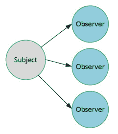

让我们通过创建一个简单的 C# 控制台应用程序来提供一个示例，该应用程序将创建一个 `Subject` 类的单个实例和多个 `Observer` 实例。当 `Subject` 类中的数量值发生变化时，我们希望通知每个 `Observer` 实例。

`Subject` 类包含一个私有数量字段，该字段通过公共的 `UpdateQuantity` 方法进行更新：

```cs
class Subject
{
    private int _quantity = 0;

    public void UpdateQuantity(int value)
    {
        _quantity += value;

        // alert any observers
    }
}
```

为了通知任何观察者，我们使用 C# 的 `delegate` 和 `event` 关键字。`delegate` 关键字定义了将被调用的格式或处理程序。当数量更新时将使用的代理如下所示：

```cs
public delegate void QuantityUpdated(int quantity);
```

代理定义 `QuantityUpdated` 为接收一个整数且不返回任何值的方法。然后，在 `Subject` 类中添加如下所示的事件：

```cs
public event QuantityUpdated OnQuantityUpdated;
```

在 `UpdateQuantity` 方法中，它被调用如下：

```cs
public void UpdateQuantity(int value)
{
    _quantity += value;

    // alert any observers
    OnQuantityUpdated?.Invoke(_quantity);
}
```

在这个例子中，我们将在 `Observer` 类中定义一个方法，该方法与 `QuantityUpdated` 代理具有相同的签名：

```cs
class Observer
{
    ConsoleColor _color;
    public Observer(ConsoleColor color)
    {
        _color = color;
    }

    internal void ObserverQuantity(int quantity)
    {
        Console.ForegroundColor = _color;
        Console.WriteLine($"I observer the new quantity value of {quantity}.");
        Console.ForegroundColor = ConsoleColor.White;
    }
}
```

当 `Subject` 实例的数量发生变化时，此实现将收到警报，并将消息以特定颜色打印到控制台。

让我们在一个简单的应用程序中将这些放在一起。在应用程序开始时，将创建一个 `Subject` 对象和三个 `Observer` 对象：

```cs
var subject = new Subject();
var greenObserver = new Observer(ConsoleColor.Green);
var redObserver = new Observer(ConsoleColor.Red);
var yellowObserver = new Observer(ConsoleColor.Yellow);
```

然后，每个 `Observer` 实例将注册以在数量变化时由 `Subject` 通知：

```cs
subject.OnQuantityUpdated += greenObserver.ObserverQuantity;
subject.OnQuantityUpdated += redObserver.ObserverQuantity;
subject.OnQuantityUpdated += yellowObserver.ObserverQuantity;
```

然后，我们将数量更新两次，如下所示：

```cs
subject.UpdateQuantity(12);
subject.UpdateQuantity(5); 
```

当应用程序运行时，我们会看到每个更新语句都打印出不同颜色的三条消息，如下面的截图所示：

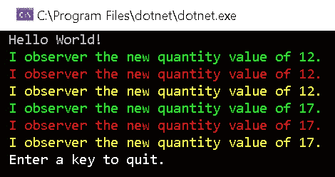

这是一个简单的示例，使用了 C# 的 `event` 关键字，但希望它能说明这种模式如何被使用。这里的优点是它松散地将主题与观察者耦合起来。主题不需要了解不同的观察者，甚至不需要知道是否存在任何观察者。

# 企业集成模式

**集成**是软件开发的一个学科，它极大地受益于利用他人的知识和经验。考虑到这一点，存在许多 EIPs 目录，其中一些是技术无关的，而另一些则是针对特定技术栈定制的。本节将突出一些流行的集成模式。

《*企业集成模式*》，作者*Gregor Hohpe*和*Bobby Woolf*，为各种技术下的许多集成模式提供了一个坚实的资源。这本书在讨论 EIPs 时经常被引用。本书可在[`www.enterpriseintegrationpatterns.com/`](https://www.enterpriseintegrationpatterns.com/)找到。

# 拓扑

企业集成的一个重要考虑因素是连接系统的拓扑结构。一般来说，有两种不同的拓扑结构：中心辐射和企业服务总线。

**中心辐射**（中心）拓扑描述了一种集成模式，其中单个组件，即中心，是集中的，并且它明确地与每个应用程序进行通信。这样集中了通信，使得中心只需要了解其他应用程序，如下面的图表所示：

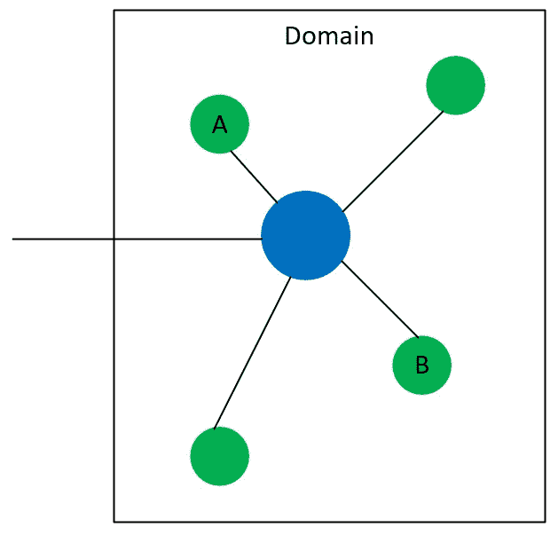

图表显示，中心（蓝色）明确知道如何与不同的应用程序进行通信。这意味着，当要从 A 发送消息到 B 时，消息是从 A 发送到中心，然后转发到 B。这种方法的优点是，对于企业来说，只需要在中心一个地方定义和维护到 B 的连接。这里的重点是安全在中央位置得到控制和维护。

**企业服务总线**（ESB）依赖于由发布者和订阅者（Pub-Sub）组成的消息模型。发布者向总线提交消息，订阅者注册接收发布的消息。以下图表说明了这种拓扑：

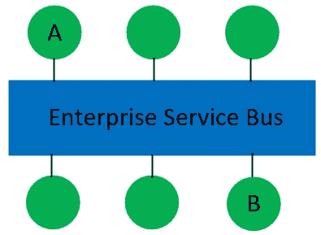

在前面的图表中，如果要将消息从**A**路由到**B**，**B**将订阅 ESB 以接收从**A**发布的消息。当**A**发布一条新消息时，该消息被发送到**B**。在实践中，订阅可能更复杂。例如，在一个订单系统中，可能会有两个订阅者分别用于优先订单和普通订单。在这种情况下，优先订单可能会与普通订单的处理方式不同。

# 模式

如果我们将两个系统之间的集成定义为具有不同的步骤，那么我们就可以在每个步骤中定义模式。让我们看一下以下图表来讨论集成管道：


这个管道被简化了，因为根据所使用的技术的不同，管道中可能会有更多或更少的步骤。图表的目的在于当我们查看一些常见的集成模式时提供一些上下文。这些可以按以下类别划分：

+   **消息处理**：与消息处理相关的模式

+   **转换**：与更改消息内容相关的模式

+   **路由**：与消息交换相关的模式

# 消息处理

与消息相关的模式可以采取消息构建和通道的形式。在这个上下文中，通道是端点以及/或者消息如何进入和退出集成管道。以下是一些与构建相关的模式示例：

+   **消息序列**：消息包含一个序列，以指示特定的处理顺序。

+   **关联标识符**：消息包含一个中等程度的标识符，用于识别相关消息。

+   **返回地址**：消息标识有关返回响应消息的信息。

+   **过期**：消息有一个有限的时间被认为是有效的。

在*拓扑*部分，我们讨论了一些与通道相关的模式，但以下是一些在集成中应考虑的附加模式：

+   **竞争消费者**：多个进程可以处理同一个消息。

+   **选择性消费者**：消费者使用标准来确定要处理的消息。

+   **死信通道**：处理未成功处理的消息。

+   **保证投递**：确保可靠地处理消息，确保没有消息丢失。

+   **事件驱动消费者**：消息的处理基于发布的事件。

+   **轮询消费者**：处理从源系统检索的消息。

# 转换

当集成复杂的业务系统时，转换模式允许在系统中灵活处理消息。通过转换，两个应用之间的消息可以被更改和/或增强。以下是一些与转换相关的模式：

+   **内容丰富器**：通过添加信息来丰富消息。

+   **规范数据模型**：将消息转换为一个应用中立的格式。

+   **消息转换器**：将一个消息转换为另一个消息的模式。

**规范数据模型**（**CDM**）是一个值得强调的模式。使用此模式，多个应用之间可以交换消息，而无需为每种特定的消息类型执行转换。以下是一个示例，展示了多个系统交换消息，如图所示：

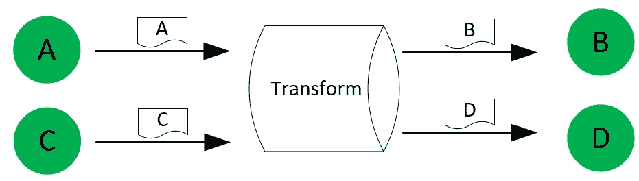

在图中，应用**A**和**C**希望以它们的格式向应用**B**和**D**发送消息。如果我们使用消息转换器模式，只有处理转换的过程需要知道如何从**A**转换到**B**以及从**A**转换到**D**，以及从**C**转换到**B**和从**C**转换到**D**。随着应用数量的增加，以及发布者可能不知道其消费者的详细信息时，这变得越来越困难。使用 CDM，**A**和**B**的源应用消息被转换为一个中立的模式 X。

规范模式

经典模式有时被称为中立模式，这意味着它没有直接与源或目标系统对齐。该模式被认为是中立的。

然后将中立模式格式的消息转换为**B**和**D**的消息格式，如下图所示：

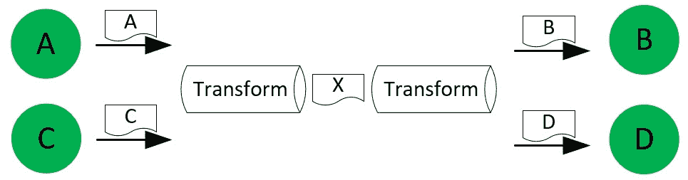

在企业中，如果没有一些标准，这将成为难以管理的情况，幸运的是，已经创建了众多组织来生产并管理许多行业的标准，以下是一些例子（但还有更多！）：

+   **电子数据交换行政管理、商业和运输** (**EDIFACT**)：贸易的国际标准

+   **IMS 问题和测试互操作性规范** (**QTI**)：**信息管理系统** **(IMS**) **全球学习联盟** (**GLC**) 产生的评估内容和结果的表示标准

+   **酒店业技术集成标准 (HITIS)**: 由美国酒店和汽车旅馆协会维护的物业管理系统标准

+   **X12 EDI (X12)**：由认证标准委员会 X12 维护的医疗保健、保险、政府、金融、运输和其他行业的模式集合

+   **业务流程框架** (**eTOM**)：由 TM Forum 维护的电信运营模型

# 路由

路由模式提供了处理消息的不同方法。以下是一些属于这一类别的模式示例：

+   **基于内容的路由**: 路由或目标应用程序由消息中的内容决定。

+   **消息过滤**: 只有感兴趣的邮件才会转发到目标应用程序。

+   **分割器**: 从单个消息生成多个消息。

+   **聚合器**: 从多个消息生成单个消息。

+   **分散-收集**: 处理多个消息广播并将响应聚合为单个消息的模式。

分散-收集模式是一个非常实用的模式，因为它结合了分割模式和聚合模式，是一个很好的探索例子。使用这个模式，可以模拟更复杂的业务流程。

在我们的场景中，我们将考虑小工具订购系统的履行。好消息是，有几个供应商销售小工具，但小工具的价格经常波动。那么，哪个供应商的价格最好？使用分散-收集模式，订购系统可以查询多个供应商，选择最佳价格，然后将结果返回给调用系统。

下图将展示如何使用分割模式向供应商生成多个消息：

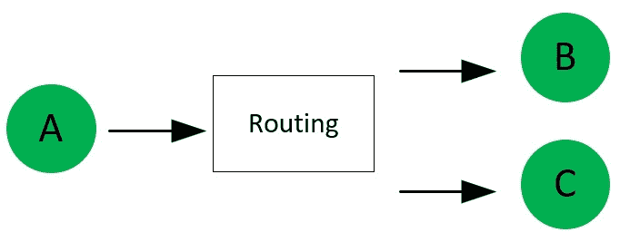

路由等待直到收到供应商的响应。一旦收到响应，就使用聚合器模式将结果编译成单个消息发送给调用应用程序：

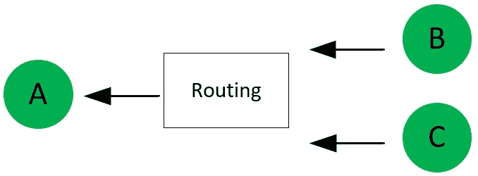

值得注意的是，这种模式有很多变体和情况。散点-聚合模式可能要求所有供应商都做出响应，也可能只是其中的一些。另一种情况可能要求对处理过程等待供应商响应的时间进行限制。有些消息可能只需毫秒级响应，而其他情况下可能需要几天才能返回响应。

集成引擎是一种支持多种集成模式的软件。集成引擎的范围可以从本地安装的服务到基于云的解决方案。其中一些更受欢迎的引擎包括微软 BizTalk、戴尔 Boomi、MuleSoft Anypoint 平台、IBM WebSphere 和 SAS 商业智能。

# 软件开发生命周期模式

管理软件开发有许多方法，其中最常见的是两种**软件开发生命周期**（**SDLC**）模式：**瀑布**和**敏捷**。这两种 SDLC 方法的变体很多，通常组织会根据项目、团队以及公司文化调整方法。

水平瀑布和敏捷 SDLC 模式只是两个例子，还有许多其他软件开发模式可能比其他模式更适合公司的文化、软件成熟度和行业。

# 水平瀑布 SDLC

水平瀑布方法包括项目或工作按顺序经历的不同阶段。从概念上讲，它很容易理解，并且遵循其他行业使用的模式。以下是一个不同阶段的例子：

+   **需求阶段**：所有要实施的需求都被收集和记录。

+   **设计阶段**：使用上一步产生的文档，完成要实施的设计。

+   **开发阶段**：使用上一步的设计，实施更改。

+   **测试阶段**：上一步实施的变化与指定的要求进行验证。

+   **部署阶段**：一旦完成测试，项目所做的更改就会被部署。

水平瀑布模型有许多优点。该模型易于理解和管理，因为每个阶段都有一个明确的定义，说明每个阶段必须完成什么以及必须交付什么。通过一系列阶段，可以定义里程碑，从而更容易报告进度。此外，由于有明确的阶段，可以更容易地规划所需资源的角色和责任。

但如果事情没有按计划进行或发生变化怎么办？瀑布 SDLC 确实有一些缺点，其中许多缺点源于其缺乏对变化的灵活性，或者在某些情况下，需要从先前步骤中获得输入。在瀑布模型中，如果出现需要从先前阶段获取信息的情况，则重复先前的阶段。这会带来几个问题。由于阶段可能会被报告，因此报告变得困难，因为已经通过一个阶段或里程碑的项目现在正在重复该阶段。这可能会促进一种*猎巫*的公司文化，其中努力被转向寻找责任而不是预防重复问题的措施。此外，资源可能不再可用，因为它们已经被转移到其他项目上，或者员工已经离职。

以下图表说明了问题发现得越晚，成本和时间增加的情况：

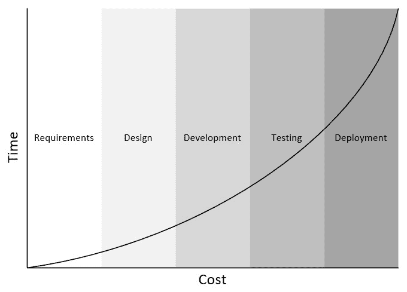

由于变化相关的成本，瀑布软件开发生命周期（SDLC）通常适合较小、变更风险较低的项目。较大和更复杂的项目增加了变更的可能性，因为需求可能会改变，或者业务驱动因素在项目期间发生变化。

# 敏捷 SDLC

敏捷 SDLC 软件开发方法试图拥抱变化和不确定性。这是通过使用一种允许变化和/或项目或产品开发生命周期中发现的问题的模式来实现的。关键概念是将项目分解为更小的开发迭代，通常称为开发周期。在每个周期中，基本的瀑布阶段被重复，因此每个周期都有需求、设计、开发、测试和部署阶段。

这是一个简化，但将项目分解为周期的方法与瀑布模型相比有几个优点：

+   由于范围较小，业务需求变更的影响减小。

+   与瀑布模型相比，利益相关者可以更早地获得一个可见的、可工作的系统。虽然还不完整，但这提供了价值，因为它允许在产品早期就纳入反馈。

+   资源可能受益，因为资源类型的变化幅度较小。

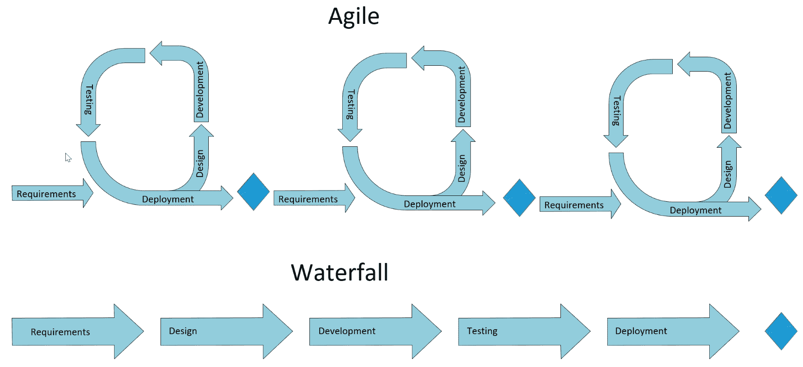

以下图表提供了两种方法的总结。

# 摘要

在本章中，我们讨论了在现代软件开发中使用的、在前一章中引入的主要设计模式。我们首先讨论了各种软件开发原则，如 DRY、KISS、YAGNI、MVP 和 SOLID 编程原则。然后，我们涵盖了软件开发模式，包括 GoF 和 EIPs。本章还涵盖了 SDLC 的方法，包括瀑布和敏捷。本章的目的是说明模式在软件开发的所有级别是如何被使用的。

随着软件行业的成熟，随着经验的积累、技术的增长和技术的进步，模式逐渐出现。一些模式是为了帮助 SDLC 的不同阶段而开发的。例如，在第三章，“实现设计模式 - 基础部分 1”，将探讨**测试驱动开发**（**TDD**），其中测试的定义被用来在开发阶段提供可衡量的进度以及明确的需求。随着章节的推进，我们将讨论软件开发中的更高层次抽象，包括 Web 开发模式以及本地和基于云的解决方案的现代架构模式。

在下一章中，我们将从构建一个虚构的.NET Core 应用程序开始。同时，我们将解释本章讨论的各种模式，包括 SOLID 等编程原则，并展示几个 GoF 模式。

# 问题

以下问题将帮助您巩固本章包含的信息：

1.  在 SOLID 原则中，S 代表什么？责任是什么意思？

1.  哪个 SDLC 方法是以周期为基础构建的：瀑布还是敏捷？

1.  装饰器模式是创建型模式还是结构型模式？

1.  Pub-Sub 集成代表什么？
