# 第三章：实现设计模式 - 基础部分 1

在前两个章节中，我们介绍了并定义了一系列与现代软件开发生命周期（**SDLC**）相关的现代模式和最佳实践，从低级开发模式到高级解决方案架构模式。本章将这些模式应用于一个示例场景，以便提供上下文和进一步理解定义。该场景是创建一个解决方案来管理电子商务书店的库存。

选择这个场景是因为它提供了足够的复杂性来展示模式，而概念相对简单。公司需要一种管理其库存的方法，包括允许用户订购他们的产品。组织需要尽快部署一个应用程序，以便跟踪他们的库存，但还有许多其他功能，包括允许客户订购产品和提供评论。随着场景的发展，所需的功能数量增长到开发团队不知道从哪里开始的地步。幸运的是，通过应用一些良好的实践来帮助管理期望和要求，开发团队能够简化他们的初始交付并回到正轨。此外，通过使用模式，他们能够建立一个坚实的基础，以便在添加新功能时帮助扩展解决方案。

本章将涵盖新项目的启动和应用程序第一个版本的创建。本章展示了以下模式：

+   **最小可行产品**（**MVP**）

+   **测试驱动开发**（**TDD**）

+   抽象工厂模式（Gang of Four）

+   SOLID 原则

# 技术要求

本章包含各种代码示例来解释概念。代码保持简单，仅用于演示目的。大多数示例涉及用 C# 编写的 .NET Core 控制台应用程序。

要运行和执行代码，你需要以下内容：

+   Visual Studio 2019（你也可以使用 Visual Studio 2017 版本 3 或更高版本来运行应用程序）

+   .NET Core

+   SQL Server（本章使用的是 Express 版本）

# 安装 Visual Studio

要运行这些代码示例，你需要安装 Visual Studio 或可以使用你喜欢的 IDE。为此，请遵循以下说明：

1.  从以下链接下载 Visual Studio：[`docs.microsoft.com/en-us/visualstudio/install/install-visual-studio`](https://docs.microsoft.com/en-us/visualstudio/install/install-visual-studio)。

1.  遵循包含的安装说明。Visual Studio 安装有多种版本可用。在本章中，我们使用 Windows 版本的 Visual Studio。

# 设置 .NET Core

如果你没有安装 .NET Core，你需要遵循以下说明：

1.  从以下链接下载 .NET Core：[`www.microsoft.com/net/download/windows`](https://www.microsoft.com/net/download/windows)。

1.  按照安装说明和相关库：[`dotnet.microsoft.com/download/dotnet-core/2.2`](https://dotnet.microsoft.com/download/dotnet-core/2.2)。

完整的源代码可在 GitHub 上获取。章节中展示的源代码可能并不完整，因此建议获取源代码以便运行示例：[`github.com/PacktPublishing/Hands-On-Design-Patterns-with-C-and-.NET-Core/tree/master/Chapter3`](https://github.com/PacktPublishing/Hands-On-Design-Patterns-with-C-and-.NET-Core/tree/master/Chapter3)。

# 最小可行产品

本节涵盖了启动新项目以构建软件应用的初始阶段。这有时被称为项目启动或项目发布，其中收集了应用的基本功能和能力（换句话说，需求收集）。

存在许多方法，可以被视为模式，用于确定软件应用的功能。关于如何有效地建模、进行访谈和研讨会、头脑风暴以及其他技术的最佳实践超出了本书的范围。相反，本书描述了一种方法，即最小可行产品（Minimum Viable Product），以提供一个这些模式可能包含的示例。

该项目是一个假设情景，其中一家名为 FlixOne 的公司希望使用库存管理应用来管理其不断增长的书籍收藏。这个新应用将由员工用于管理库存，以及由客户用于浏览和创建新订单。该应用需要具备可扩展性，并且作为业务的关键系统，计划在未来可预见的时期内使用。

公司大致分为*业务用户*和*开发团队*，其中业务用户主要关注系统的功能，而开发团队则关注满足需求，以及监控系统维护性。这是一个简化；然而，组织并不一定如此整洁地组织，个人可能不适合某一分类或另一分类。例如，**业务分析师**（**BA**）或**领域专家**（**SME**）通常既代表业务用户也是开发团队的一员。

由于这是一本技术书籍，我们将主要从开发团队的角度看待场景，并讨论用于实现库存管理应用的模式和最佳实践。

# 需求

在几次会议的过程中，业务和开发团队讨论了新库存管理系统的需求。定义清晰需求集的进展缓慢，最终产品的愿景并不明确。开发团队决定将庞大的需求列表缩减到足够的功能，以便关键个人可以开始记录一些库存信息。这将允许简单的库存管理，并为业务扩展提供一个基础。然后，可以将每个新的需求集添加到初始版本中。

最小可行产品（MVP）

最小可行产品（Minimum Viable Product，简称 MVP）是指一个应用可以发布的最小功能集，它仍然具有足够的用户价值。

MVP 方法的一个优点是它通过缩小应用的范围，为业务和开发团队提供了一个简化的交付视图。通过减少将要交付的功能，确定需要做什么的工作变得更加专注。在 FlixOne 场景中，会议的价值通常会降低到讨论一个特性的具体细节，尽管这对于产品的最终版本很重要，但需要在此特性之前发布几个功能。例如，围绕面向客户的网站的设计分散了团队对存储在库存管理系统中的数据的关注。

MVP 在需求复杂度不完全理解或最终愿景定义不明确的情况下非常有用。然而，仍然需要保持产品愿景，以避免开发最终版本可能不需要的功能的风险。

业务和开发团队能够为初始库存管理应用定义以下功能需求：

+   应用应该是一个控制台应用：

    +   应该打印一个包含汇编版本的欢迎信息。

    +   应该循环直到接收到退出命令。

    +   如果给定的命令不成功或未被理解，则应打印一条有用的信息。

+   应用应该响应对简单的不区分大小写的文本命令。

+   每个命令都应该有一个简短形式，即单个字符，以及一个长形式。

+   如果命令有附加参数：

    +   每个命令都应该按顺序输入，并通过回车键提交。

    +   每个命令都应该有一个提示 `Enter {parameter}:`，其中 `{parameter}` 是参数的名称。

+   应该有一个帮助命令（`?`）可用：

    +   打印可用命令的摘要。

    +   打印每个命令的示例用法。

+   应该有一个退出命令（`q`，`quit`）可用：

    +   打印一条告别信息

    +   结束应用

+   应该有一个添加库存命令（`"a"`，`"addinventory"`）可用：

    +   `name`参数的类型为字符串。

    +   应该在数据库中添加一个具有给定名称和 0 数量的条目。

+   应该有一个更新数量命令（`"u"`，`"updatequantity"`）可用：

    +   字符串类型的`name`参数。

    +   `quantity`参数为正整数或负整数。

    +   应该通过添加给定的数量来更新给定名称的书的数量值。

+   应该有一个获取库存命令（`"g"`，`"getinventory"`）可用：

    +   返回数据库中所有书籍及其数量。

以下是非功能性需求定义：

+   除了操作系统提供的之外，不需要其他安全措施。

+   命令的简短形式是为了可用性，而命令的完整形式是为了可读性。

FlixOne 示例说明了如何使用 MVP 来帮助聚焦和简化软件开发生命周期（SDLC）。需要强调的是，**概念验证**（**PoC**）和 MVP 之间的区别会因每个组织而异。在这本书中，PoC 与 MVP 的不同之处在于，生成的应用程序不被视为一次性或未完成的。对于一个商业产品，这意味着最终产品可以出售，而对于一个内部企业解决方案，应用程序可以为组织增加价值。

# MVP 如何与未来开发相匹配？

使用 MVP 来聚焦和限制需求的好处之一是其与敏捷软件开发的协同作用。将开发周期分解成更小的开发周期是一种在传统瀑布开发中越来越受欢迎的软件开发技术。其驱动概念是，需求和解决方案在应用程序的生命周期中演变，并涉及开发团队和最终用户之间的协作。通常，敏捷软件开发框架具有较短的发布周期，其中新功能被设计、开发、测试和发布。然后，随着应用程序包含更多功能，发布周期被重复。当工作范围适合发布周期时，MVP 非常适合敏捷开发。

Scrum 和 Kanban 是基于敏捷软件开发流行软件开发框架。

初始 MVP 需求范围被保持在可以设计、开发、测试和发布的大小，使用敏捷周期。在下一个周期中，将向应用程序添加更多需求。挑战是限制新功能的范围，使其在周期内可以完成。每个新功能发布都限于基本需求或其 MVP。这里的原理是，通过使用迭代软件开发方法，应用程序的最终版本将比使用需要提前定义所有需求的单个发布版本对最终用户具有更大的好处。

以下图表总结了敏捷和瀑布软件开发方法之间的区别：

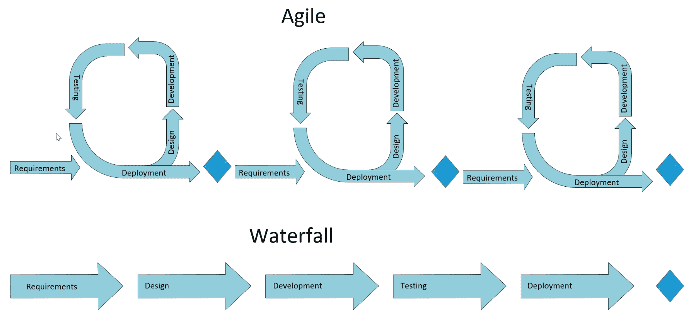

# 测试驱动开发

存在着不同的**测试驱动开发**（**TDD**）方法，一个*测试*可以从在开发过程中按需运行的单元测试，到在项目构建期间运行的单元测试，再到作为**用户验收测试**（**UAT**）一部分运行的测试脚本。同样，一个*测试*可以是代码或描述用户为验证需求而要执行的步骤的文档。之所以如此，是因为人们对 TDD 试图实现的目标有不同的看法。对于某些团队来说，TDD 是一种在编写代码之前细化需求的技术，而另一些团队则认为 TDD 是一种衡量或验证交付的代码的方式。

UAT

UAT 是在 SDLC（软件开发生命周期）期间用于验证产品或项目是否满足特定要求的活动术语。这通常由业务部门的成员或一部分客户执行。根据情况，这个阶段可以进一步细分为 alpha 和 beta 阶段，其中 alpha 测试由开发团队执行，beta 测试由最终用户执行。

# 为什么团队选择了 TDD？

开发团队决定使用 TDD 有几个原因。首先，团队希望有一种方法来清楚地衡量开发过程中的进度。其次，他们希望能够在后续的开发周期中重用测试，以便在添加新功能的同时继续验证现有功能。出于这些原因，团队将使用单元测试来验证编写的功能是否满足团队给出的要求。

以下图表展示了 TDD 的基本原理：

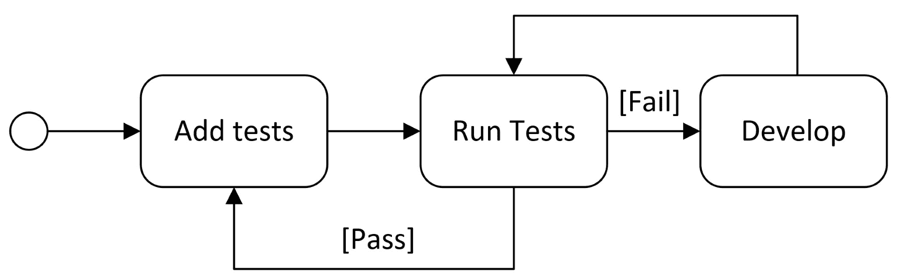

添加测试并更新代码库，直到所有定义的测试通过。重要的是要注意，这是一个重复的过程。在每次迭代中，都会添加新的测试，并且只有当所有测试（新的和现有的）都通过时，才认为测试通过。

FlixOne 开发团队决定将单元测试和 UAT 整合到单个敏捷周期中。在每个周期的开始，都会确定新的验收标准。这包括要交付的功能以及如何在开发周期结束时验证或接受这些功能。然后，这些验收标准将被用来向项目添加测试。开发团队将构建解决方案，直到新的和现有的测试都通过，然后准备一个用于验收测试的构建。然后，将运行验收测试，如果发现任何问题，开发团队将根据失败情况定义新的测试或修改现有的测试。应用程序将再次开发，直到所有测试通过并准备新的构建。这将重复进行，直到验收测试通过。然后，应用程序将被部署，并开始新的开发周期。

以下图表展示了这种方法：

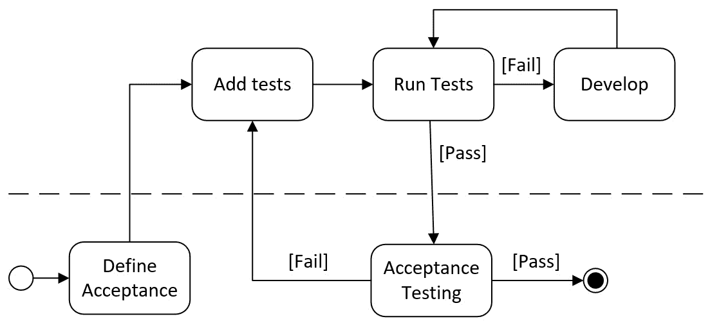

团队现在有了计划，让我们开始编码吧！

# 设置项目

在此场景中，我们将使用**微软单元测试**（**MSTest**）框架。本节提供了一些使用 .NET Core **命令行界面**（**CLI**）工具创建初始项目的说明。这些步骤也可以使用 Visual Studio 或 Visual Studio Code 等集成开发环境（**IDE**）完成。这里提供说明是为了说明如何使用 CLI 来补充 IDE。

CLI

.NET Core CLI 工具是用于开发 .NET 应用程序的跨平台实用工具，是更复杂工具（如 IDE）的基础。请参阅文档以获取更多信息：[`docs.microsoft.com/en-us/dotnet/core/tools`](https://docs.microsoft.com/en-us/dotnet/core/tools)。

本章的解决方案将包括三个项目：一个控制台应用程序、一个类库和一个测试项目。让我们创建一个名为 FlixOne 的解决方案目录，以包含解决方案和三个项目的子目录。在创建的目录中，以下命令将创建一个新的解决方案文件：

```cs
dotnet new sln
```

以下截图说明了创建目录和解决方案（注意：到目前为止，只创建了一个空解决方案文件）：

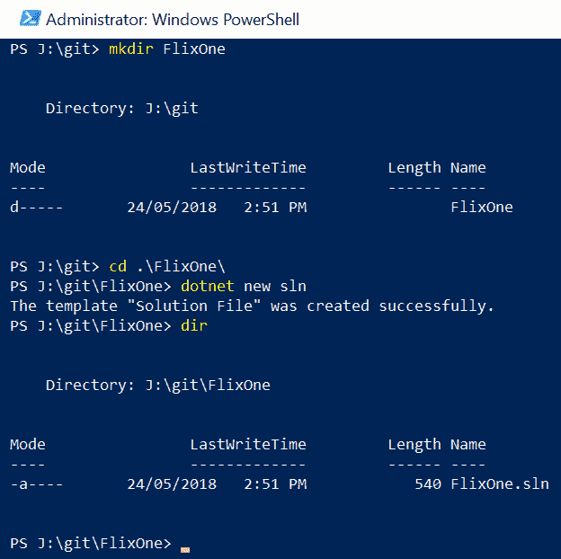

类库 `FlixOne.InventoryManagement` 将包含我们的业务实体和逻辑。在后面的章节中，我们将将这些内容拆分为单独的库，但由于我们的应用程序仍然很小，它们被包含在一个单独的程序集中。创建项目的 `dotnet` 核心 CLI 命令如下所示：

```cs
dotnet new classlib --name FlixOne.InventoryManagement
```

注意，在以下截图中，创建了一个包含新的类库项目文件的新目录：

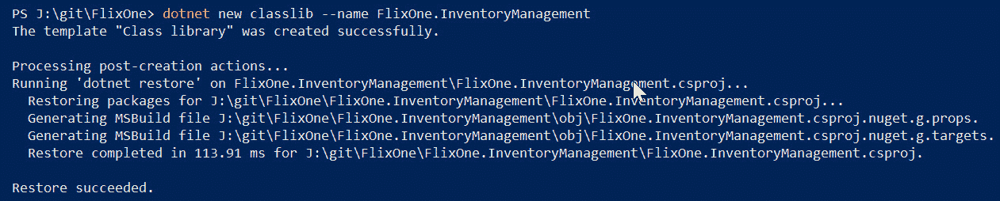

应使用以下命令从解决方案引用新的类库：

```cs
dotnet sln add .\FlixOne.InventoryManagement\FlixOne.InventoryManagement.csproj
```

要创建一个新的控制台应用程序项目，应使用以下命令：

```cs
dotnet new console --name FlixOne.InventoryManagementClient
```

以下截图显示了正在恢复的`控制台`模板：

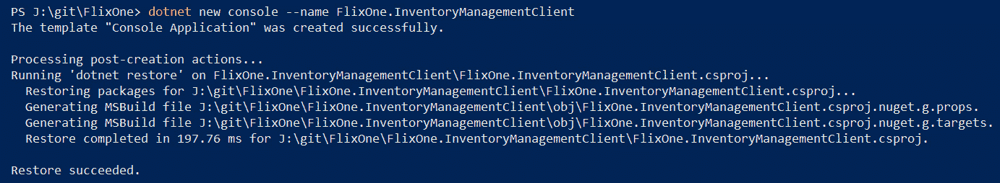

控制台应用程序需要引用类库（注意：需要在包含要添加引用的项目文件所在的目录中运行此命令）：

```cs
dotnet add reference ..\FlixOne.InventoryManagement\FlixOne.InventoryManagement.csproj
```

将使用以下命令创建一个新的 `MSTest` 项目：

```cs
dotnet new mstest --name FlixOne.InventoryManagementTests
```

以下截图显示了 MSTest 项目的创建，应在解决方案 FlixOne 的同一文件夹中运行（注意命令中恢复的包包含所需的 MSTest NuGet 包）：

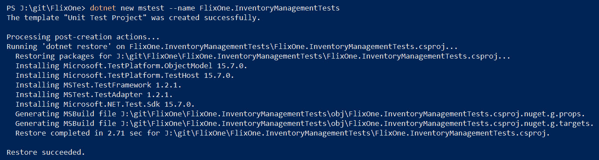

测试项目也需要对类库的引用（注意：此命令需要在 MSTest 项目文件所在的同一文件夹中运行）：

```cs
dotnet add reference ..\FlixOne.InventoryManagement\FlixOne.InventoryManagement.csproj
```

最后，通过在解决方案文件所在的同一目录中运行以下命令，将控制台应用程序和 MSTest 项目添加到解决方案中：

```cs
dotnet sln add .\FlixOne.InventoryManagementClient\FlixOne.InventoryManagementClient.csproj
dotnet sln add .\FlixOne.InventoryManagementTests\FlixOne.InventoryManagementTests.csproj
```

从视觉上看，解决方案如下所示：

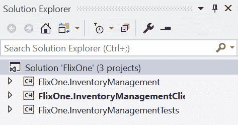

现在我们解决方案的初始结构已经准备好了，让我们首先从添加单元测试定义开始。

# 初始单元测试定义

开发团队首先将需求转录成一些基本的单元测试。由于还没有设计或编写任何内容，这些测试大多只是记录应该验证的功能。随着设计和开发的进展，这些测试也将向完成进化；例如，有一个添加库存的需求：

可用的添加库存命令（"a"，"addinventory"）：

+   字符串类型的`name`参数。

+   使用给定的名称和`0`数量将条目添加到数据库中。

为了捕捉这一需求，开发团队创建了以下单元测试作为占位符：

```cs
[TestMethod]
private void AddInventoryCommand_Successful()
{
  // create an instance of the command
  // add a new book with parameter "name"
  // verify the book was added with the given name with 0 quantity

  Assert.Inconclusive("AddInventoryCommand_Successful has not been implemented.");
}
```

随着应用程序设计变得明确并且开发开始，现有的测试将扩展，新的测试将被创建，如下所示：

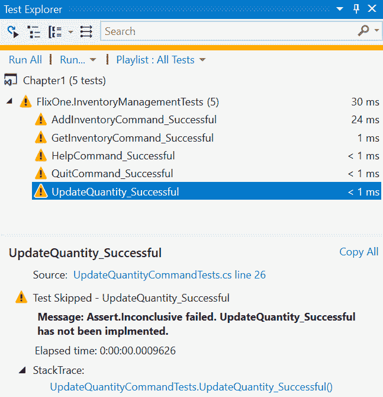

不确定测试的重要性在于它们向团队传达了需要完成的工作，并在开发过程中提供了一个衡量标准。随着开发的进展，不确定和失败的测试将表明需要开展的工作，而成功的测试将表明完成当前任务集的进展。

# 抽象工厂设计模式

为了说明我们的第一个模式，让我们回顾帮助命令和初始控制台应用程序的开发过程。初始控制台应用程序的版本如下所示：

```cs
private static void Main(string[] args)
{
    Greeting();

    // note: inline out variable introduced as part of C# 7.0
    GetCommand("?").RunCommand(out bool shouldQuit); 

    while (!shouldQuit)
    { 
        // handle the commands
        ...
    }

    Console.WriteLine("CatalogService has completed."); 
}
```

当应用程序启动时，会显示问候语和帮助命令的结果。然后应用程序将处理输入的命令，直到输入退出命令。

以下展示了处理命令的详细情况：

```cs
    while (!shouldQuit)
    { 
        Console.WriteLine(" > ");
        var input = Console.ReadLine();
        var command = GetCommand(input);

        var wasSuccessful = command.RunCommand(out shouldQuit);

        if (!wasSuccessful)
        {
            Console.WriteLine("Enter ? to view options.");
        }
    }
```

直到应用程序解决方案退出，应用程序将继续提示用户输入命令，如果命令未成功处理，则显示帮助文本。

RunCommand(out bool shouldQuit)

C# 7.0 引入了一种更流畅的语法来创建`out`参数。这将声明命令块的变量作用域。以下示例说明了这一点，其中`shouldQuit`布尔值不是提前声明的。

# InventoryCommand 抽象类

首先要指出的是，初始控制台应用程序团队正在使用**面向对象编程**（**OOP**）来创建处理命令的标准方式。从这个初始设计中，团队学到的经验是所有命令都将包含一个`RunCommand()`方法，该方法将返回两个布尔值，指示命令是否成功以及程序是否应该终止。例如，`HelpCommand()`将简单地向控制台显示帮助信息，不应导致程序结束。这两个返回布尔值将是*true*，表示命令运行成功，*false*，表示应用程序不应终止。以下显示了初始版本：

... 表示额外的声明，在这个特定例子中，是额外的 `Console.WriteLine()` 声明。

```cs
public class HelpCommand
{
    public bool RunCommand(out bool shouldQuit)
    {
        Console.WriteLine("USAGE:");
        Console.WriteLine("\taddinventory (a)");
        ...
        Console.WriteLine("Examples:");
        ...

        shouldQuit = false;
        return true;
    }
}
```

`QuitCommand` 将显示一条消息然后导致程序结束。最初的 `QuitCommand` 如下所示：

```cs
public class QuitCommand
{
    public bool RunCommand(out bool shouldQuit)
    {
        Console.WriteLine("Thank you for using FlixOne Inventory Management System");

        shouldQuit = true;
        return true;
    }
}
```

团队决定创建一个两个类都实现的接口，或者一个两个类都继承的抽象类。两者都可以实现所需的动态多态，但团队选择使用抽象类，因为所有命令都将具有共享的功能。

在面向对象编程，特别是在 C# 中，多态通过三种主要方式得到支持：函数重载、泛型和子类型或动态多态。

使用抽象工厂设计模式，团队创建了一个命令将继承的抽象类，`InventoryCommand`。`InventoryCommand` 类有一个单一的方法 `RunCommand`，它将执行命令并返回命令是否成功执行以及应用程序是否应该退出。该类是抽象的，这意味着该类包含一个或多个抽象方法。在这种情况下，`InternalCommand()` 方法是抽象的，意图是派生自 `InventoryCommand` 类的类将使用特定的命令功能实现 `InternalCommand` 方法。例如，`QuitCommand` 将扩展 `InventoryCommand` 并为 `InternalCommand()` 方法提供具体实现。以下代码片段显示了具有抽象 `InternalCommand()` 方法的 `InventoryCommand` 抽象类：

```cs
public abstract class InventoryCommand
{
    private readonly bool _isTerminatingCommand;
    internal InventoryCommand(bool commandIsTerminating)
    {
        _isTerminatingCommand = commandIsTerminating; 
    }
    public bool RunCommand(out bool shouldQuit)
    {
        shouldQuit = _isTerminatingCommand;
        return InternalCommand();
    }

    internal abstract bool InternalCommand();
}
```

抽象方法将在每个派生类中实现，如 `HelpCommand` 所示。`HelpCommand` 简单地打印一些信息到控制台，然后返回 `true`，表示命令已成功执行：

```cs
public class HelpCommand : InventoryCommand
{
    public HelpCommand() : base(false) { }

    internal override bool InternalCommand()
    { 
        Console.WriteLine("USAGE:");
        Console.WriteLine("\taddinventory (a)");
        ...
        Console.WriteLine("Examples:");
        ... 
        return true;
    }
}
```

开发团队随后决定对 `InventoryCommand` 进行两项额外更改。他们不喜欢的是 `shouldQuit` 布尔值作为 *out* 变量返回的方式。因此，他们决定使用 C# 7 的新元组功能，而是返回一个单一的 `Tuple<bool,bool>` 对象，如下所示：

```cs
public (bool wasSuccessful, bool shouldQuit) RunCommand()
{
    /* additional code hidden */

    return (InternalCommand(), _isTerminatingCommand);
}
```

元组

元组是 C# 类型，它提供了一种轻量级的语法，可以轻松地将多个值打包成一个单一的对象。与定义类相比的缺点是，你失去了继承和其他面向对象的功能。更多信息，请参阅 [`docs.microsoft.com/en-us/dotnet/csharp/tuples`](https://docs.microsoft.com/en-us/dotnet/csharp/tuples)。

另一项更改是引入另一个抽象类来指示命令是否是非终止命令；换句话说，是一个不会导致解决方案退出或结束的命令。

如以下代码所示，此命令仍然是抽象的，因为它没有实现 `InventoryCommand` 的 `InternalCommand` 方法，但它向基类传递了一个 false 值：

```cs
internal abstract class NonTerminatingCommand : InventoryCommand
{
    protected NonTerminatingCommand() : base(commandIsTerminating: false)
    {
    }
}
```

这里的优势是现在不会导致应用程序结束的命令——换句话说，是非终止的——现在有了一个更简单的定义：

```cs
internal class HelpCommand : NonTerminatingCommand
{
    internal override bool InternalCommand()
    {
        Interface.WriteMessage("USAGE:");
        /* additional code hidden */

        return true;
    }
}
```

下面的类图显示了`InventoryCommand`抽象类的继承关系：

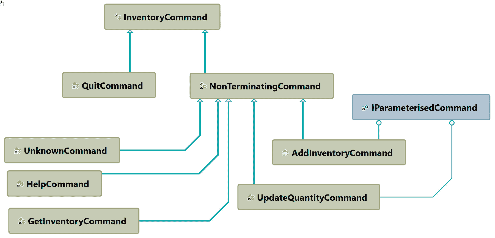

只有一个终止命令，即`QuitCommand`，而其他命令扩展了`NonTerminatingCommand`抽象类。还值得注意的是，除了基类`InventoryCommand`之外的所有类型都不是公开的（对外部程序集可见）。这一点将在本章后面的*访问修饰符*部分变得相关。图中另一个微妙之处在于，所有类型，除了基类`InventoryCommand`，都不是公开的（对外部程序集可见）。这一点将在本章后面的*访问修饰符*部分变得相关。

# SOLID 原则

通过使用模式简化代码，团队还使用 SOLID 原则来帮助识别问题。通过简化代码，团队旨在使代码更易于维护，并使新团队成员更容易理解。使用一组原则审查代码的方法在编写只做所需事情且具有抽象层的简洁类时非常有用，这有助于编写更容易修改和理解的代码。

# 单一职责原则（SRP）

团队应用的第一条原则是**单一职责原则**（**SRP**）。团队确定将信息写入控制台的实际机制不是`InventoryCommand`类的责任。因此，引入了一个`ConsoleUserInterface`类，该类负责与用户的交互。SRP 将帮助保持`InventoryCommand`类的大小，并避免代码重复的情况。例如，应用程序应该有一种统一的方式提示用户信息并显示消息和警告。而不是在`InventoryCommand`类中重复这些逻辑，这种逻辑被封装在`ConsoleUserInterface`类中。

`ConsoleUserInteraface`将包含三个方法，如下所示：

```cs
public class ConsoleUserInterface
{
    // read value from console

    // message to the console

    // writer warning message to the console
}
```

第一个方法将用于从控制台读取输入：

```cs
public string ReadValue(string message)
{
    Console.ForegroundColor = ConsoleColor.Green;
    Console.Write(message);
    return Console.ReadLine();
}
```

第二个方法将使用绿色在控制台打印一条消息：

```cs
public void WriteMessage(string message)
{
    Console.ForegroundColor = ConsoleColor.Green;
    Console.WriteLine(message);
}
```

最终的方法将以深黄色在控制台打印一条消息，表示警告信息：

```cs
public void WriteWarning(string message)
{
    Console.ForegroundColor = ConsoleColor.DarkYellow;
    Console.WriteLine(message);
}
```

使用`ConsoleUserInterface`类，我们可以减少我们与用户交互方式变化的影响。随着我们的解决方案的发展，我们可能会发现界面从控制台变为网络应用程序。理论上，我们将用`WebUserInterface`替换`ConsoleUserInterface`。如果我们没有将用户界面简化为单个类，这种变化的影响可能会更加破坏性。

# 开放/封闭原则（OCP）

**开闭原则**，SOLID 中的 O，由不同的`InventoryCommand`类表示。团队本可以定义一个包含多个`if`语句的单个类来替代每个命令的`InventoryCommand`类实现。每个`if`语句将确定要执行的功能。例如，以下说明了团队如何违反这一原则：

```cs
internal bool InternalCommand(string command)
{
    switch (command)
    {
        case "?":
        case "help":
            return RunHelpCommand(); 
        case "a":
        case "addinventory":
            return RunAddInventoryCommand(); 
        case "q":
        case "quit":
            return RunQuitCommand();
        case "u":
        case "updatequantity":
            return RunUpdateInventoryCommand();
        case "g":
        case "getinventory":
            return RunGetInventoryCommand();
    }
    return false;
}
```

上述方法违反了这一原则，因为添加新的命令会改变代码的行为。原则的想法是，它对会改变其行为的修改是**封闭**的，而相反，它是**开放**的，以扩展类以支持额外的行为。这是通过拥有抽象的`InventoryCommand`和派生类（例如，`QuitCommand`、`HelpCommand`和`AddInventoryCommand`）来实现的。特别是当与其他原则结合使用时，一个令人信服的原因是，它导致代码简洁，更容易维护和理解。

# 里氏替换原则（LSP）

退出、帮助和获取库存的命令不需要参数，而`AddInventory`和`UpdateQuantityCommand`则需要。有几种处理方法，团队决定引入一个接口来识别这些命令，如下所示：

```cs
public interface IParameterisedCommand
{
    bool GetParameters();
}
```

通过应用**里氏替换原则**（**LSP**），只有需要参数的命令应该实现`GetParameters()`方法。例如，在`AddInventory`命令中，`IParameterisedCommand`是通过在基类`InventoryCommand`上定义的方法实现的：

```cs
public class AddInventoryCommand : InventoryCommand, IParameterisedCommand
{
    public string InventoryName { get; private set; }

    /// <summary>
    /// AddInventoryCommand requires name
    /// </summary>
    /// <returns></returns>
    public bool GetParameters()
    {
        if (string.IsNullOrWhiteSpace(InventoryName))
            InventoryName = GetParameter("name");

        return !string.IsNullOrWhiteSpace(InventoryName);
    }    
}
```

`InventoryCommand`类上的`GetParameter`方法简单地使用`ConsoleUserInterface`从控制台读取一个值。该方法将在本章后面展示。在 C#中，有一种方便的语法可以很好地展示如何使用 LSP 将功能应用于特定接口的对象。在`RunCommand`方法的第 一行，使用`is`关键字来测试当前对象是否实现了`IParameterisedCommand`接口，并将对象转换为新的对象：`parameterisedCommand`。这在以下代码片段中被加粗显示：

```cs
public (bool wasSuccessful, bool shouldQuit) RunCommand()
{
    if (this is IParameterisedCommand parameterisedCommand)
    {
        var allParametersCompleted = false;

        while (allParametersCompleted == false)
        {
            allParametersCompleted = parameterisedCommand.GetParameters();
        }
    }

    return (InternalCommand(), _isTerminatingCommand);
}
```

# 接口隔离原则（ISP）

处理带参数和不带参数的命令的一种方法是在`InventoryCommand`抽象类上定义另一个方法`GetParameters`，对于那些不需要参数的命令，只需返回 true 来表示已经接收到了所有（在这种情况下是没有）参数。例如，`QuitCommand`、`**HelpCommand**`和`GetInventoryCommand`都将有一个类似于以下实现的实现：

```cs
internal override bool GetParameters()
{
    return true;
}
```

这将有效，但它确实违反了**接口隔离原则**（**ISP**），该原则指出，一个接口应该只包含所需的方法和属性。类似于 SRP，它适用于类，ISP 适用于接口，并且有助于保持接口小而专注。在我们的例子中，只有`AddInventoryCommand`和`UpdateQuantityCommand`类将实现`InventoryCommand`接口。

# 依赖倒置原则

**依赖倒置原则**（**DIP**），也称为**依赖注入****原则**（**DIP**），模块不应该依赖于细节，而应该依赖于抽象。这个原则鼓励编写松耦合的代码，以提高可读性和维护性，尤其是在大型复杂代码库中。

如果我们回顾一下之前引入的`ConsoleUserInterface`类（在*单一职责原则*部分），我们可以使用该类而不使用`QuitCommand`，如下所示：

```cs
internal class QuitCommand : InventoryCommand
{
    internal override bool InternalCommand()
    {
        var console = new ConsoleUserInterface();
        console.WriteMessage("Thank you for using FlixOne Inventory Management System");

        return true;
    }
}
```

这违反了几个 SOLID 原则，但在 DIP 方面，它使得`QuitCommand`和`ConsoleUserInterface`之间产生了紧密耦合。想象一下，如果控制台不再是向用户显示信息的方式，或者如果`ConsoleUserInterface`的构造函数需要额外的参数会怎样？

通过应用 DIP 原则，进行了以下重构。首先引入了一个新的接口`IUserInterface`，其中包含了`ConsoleUserInterface`中实现的方法的定义。接下来，在`InventoryCommand`类中使用接口而不是具体类。最后，将实现`IUserInterface`的对象的引用传递到`InventoryCommand`类的构造函数中。这种方法保护了`InventoryCommand`类免受`IUserInterface`类实现细节变化的影响，同时也提供了一个机制，以便在代码库演变过程中更容易地替换不同的`IUserInterface`实现。

以下是用`QuitCommand`说明的 DIP，这是本章的最终类版本：

```cs
internal class QuitCommand : InventoryCommand
{
    public QuitCommand(IUserInterface userInterface) : 
           base(commandIsTerminating: true, userInteface: userInterface)
    {
    }

    internal override bool InternalCommand()
    {
        Interface.WriteMessage("Thank you for using FlixOne Inventory Management System");

        return true;
    }
}
```

注意，该类扩展了`InventoryCommand`抽象类，提供了处理命令的通用方式，同时也提供了共享功能。构造函数要求在对象实例化时注入`IUserInterface`依赖。另外，请注意`QuitCommand`实现了一个单独的方法`InternalCommand()`，这使得`QuitCommand`简洁且易于阅读和理解。

为了完整地展示，让我们查看最终的`InventoryCommand`基类。以下显示了构造函数和属性：

```cs
public abstract class InventoryCommand
{
    private readonly bool _isTerminatingCommand;
    protected IUserInterface Interface { get; }

    internal InventoryCommand(bool commandIsTerminating, IUserInterface userInteface)
    {
        _isTerminatingCommand = commandIsTerminating;
        Interface = userInteface;
    }
    ...
}
```

注意，`IUserInterface`也被传递到构造函数中，以及一个布尔值，表示命令是否终止。然后，`IUserInterface`作为`Interface`属性对所有`InventoryCommand`的实现可用。

`RunCommand`是该类上的唯一公共方法：

```cs
public (bool wasSuccessful, bool shouldQuit) RunCommand()
{
    if (this is IParameterisedCommand parameterisedCommand)
    {
        var allParametersCompleted = false;

        while (allParametersCompleted == false)
        {
            allParametersCompleted = parameterisedCommand.GetParameters();
        }
    }

    return (InternalCommand(), _isTerminatingCommand);
}

internal abstract bool InternalCommand();
```

此外，`GetParameter` 方法是 `InventoryCommand` 所有实现中通用的方法，因此它被设置为内部访问级别：

```cs
internal string GetParameter(string parameterName)
{
    return Interface.ReadValue($"Enter {parameterName}:"); 
}
```

DIP 和 IoC

DIP（依赖倒置原则）和**控制反转**（IoC）密切相关，并且都解决了相同的问题，但以略微不同的方式。IoC 及其专用形式，**服务定位器模式**（SLP），使用一种机制按需提供抽象的实现。因此，而不是注入实现，IoC 作为代理提供所需的详细信息。在下一章中，我们将探讨 .NET Core 对这些模式的支持。

# InventoryCommand 单元测试

随着 `InventoryCommand` 类的成形，让我们重新审视单元测试，以便我们可以开始验证到目前为止所写的内容，并识别任何缺失的需求。SOLID 原则在这里将显示出其价值。因为我们保持了我们的类（SRP）和接口（ISP）的小型化，并专注于所需的最小功能（LSP），因此我们的测试也应该更容易编写和验证。例如，关于某个命令的测试不需要验证控制台消息的显示（例如，颜色或文本大小），因为这不是 `InventoryCommand` 类的责任，而是 `IUserInterface` 实现的责任。此外，通过依赖注入，我们能够将测试隔离到仅针对库存命令。以下图表说明了这一点，因为单元测试将仅验证绿色框内的内容：

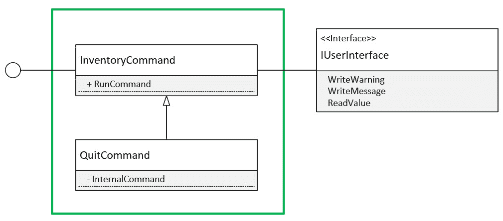

通过限制单元测试的范围，将更容易处理应用程序变化时的变更。在某些情况下，由于类之间的相互依赖性，分离功能可能更困难（换句话说，当不遵循 SOLID 原则时），测试可以跨越应用程序的更大部分，包括存储库。这些测试通常被称为集成测试而不是单元测试。

# 访问修饰符

访问修饰符是通过封装代码来处理类型和类型成员可见性的重要方式。通过使用清晰的访问策略，可以传达并强制执行程序集及其类型的使用意图。例如，在 FlixOne 应用程序中，只有那些应该直接由控制台访问的类型被标记为公共。这意味着控制台应用程序应该只能看到有限数量的类型和方法。这些类型和方法被标记为公共，而那些控制台不应访问的类型和方法则被标记为内部、私有或受保护的。

请参阅 Microsoft 文档编程指南以获取有关访问修饰符的更多信息：

[`docs.microsoft.com/en-us/dotnet/csharp/programming-guide/classes-and-structs/access-modifiers`](https://docs.microsoft.com/en-us/dotnet/csharp/programming-guide/classes-and-structs/access-modifiers)

`InventoryCommand` 抽象类被公开，因为控制台应用程序将使用 `RunCommand` 方法来处理命令。

在下面的代码片段中，请注意构造函数和接口被设置为受保护的，以便子类可以访问：

```cs
public abstract class InventoryCommand
{
    private readonly bool _isTerminatingCommand;
    protected IUserInterface Interface { get; }

    protected InventoryCommand(bool commandIsTerminating, IUserInterface userInteface)
    {
        _isTerminatingCommand = commandIsTerminating;
        Interface = userInteface;
    }
    ...
}
```

在下面的代码片段中，请注意 `RunCommand` 方法被公开，而 `InternalCommand` 被设置为内部使用：

```cs
public (bool wasSuccessful, bool shouldQuit) RunCommand()
{
    if (this is IParameterisedCommand parameterisedCommand)
    {
        var allParametersCompleted = false;

        while (allParametersCompleted == false)
        {
            allParametersCompleted = parameterisedCommand.GetParameters();
        }
    }

    return (InternalCommand(), _isTerminatingCommand);
}

internal abstract bool InternalCommand();
```

类似地，`InventoryCommand` 的实现被标记为内部，以防止它们在程序集外部被直接引用。以下 `QuitCommand` 说明了这一点：

```cs
internal class QuitCommand : InventoryCommand
{
    internal QuitCommand(IUserInterface userInterface) : base(true, userInterface) { }

    protected override bool InternalCommand()
    {
        Interface.WriteMessage("Thank you for using FlixOne Inventory Management System");

        return true;
    }
}
```

由于不同实现方式的访问不会直接对单元测试项目可见，因此需要额外的步骤来使内部类型可见。`assembly` 指令可以放置在任何编译文件中，对于 FlixOne 应用程序，添加了一个包含程序集属性的 `assembly.cs` 文件：

```cs
using System.Runtime.CompilerServices;
[assembly: InternalsVisibleTo("FlixOne.InventoryManagementTests")]
```

在组件签名的情况下，`InternalsVisibleTo()` 需要一个公钥。请参阅 Microsoft Docs C# 指南以获取更多信息：[`docs.microsoft.com/en-us/dotnet/csharp/programming-guide/concepts/assemblies-gac/how-to-create-signed-friend-assemblies`](https://docs.microsoft.com/en-us/dotnet/csharp/programming-guide/concepts/assemblies-gac/how-to-create-signed-friend-assemblies)。

# 辅助测试用户界面

作为对 `InventoryCommand` 实现之一单元测试的一部分，我们不想测试引用的依赖项。幸运的是，因为命令遵循 DIP，我们可以创建一个 `helper` 类来验证实现与依赖项的交互。其中一个依赖项是 `IUserInterface`，它在构造函数中传递给实现。以下是对接口方法的提醒：

```cs
public interface IUserInterface : IReadUserInterface, IWriteUserInterface { }

public interface IReadUserInterface
{
    string ReadValue(string message);
}

public interface IWriteUserInterface
{
    void WriteMessage(string message);
    void WriteWarning(string message);
}
```

通过实现一个辅助类，我们可以提供 `ReadValue` 方法所需的信息，并验证在 `WriteMessage` 和 `WriteWarning` 方法中是否接收到了适当的消息。在测试项目中，创建了一个名为 `TestUserInterface` 的新类，该类实现了 `IUserInterface` 接口。该类包含三个列表，包含预期的 `WriteMessage`、`WriteWarning` 和 `ReadValue` 调用，并跟踪被调用的次数。

例如，`WriteWarning` 方法如下所示：

```cs
public void WriteWarning(string message)
{
    Assert.IsTrue(_expectedWriteWarningRequestsIndex < _expectedWriteWarningRequests.Count,
                  "Received too many command write warning requests.");

    Assert.AreEqual(_expectedWriteWarningRequests[_expectedWriteWarningRequestsIndex++], message,                             "Received unexpected command write warning message");
}
```

`WriteWarning` 方法执行两个断言。第一个验证方法没有被调用超过预期次数，第二个验证接收到的消息与预期消息匹配。

`ReadValue` 方法与之前的方法类似，但它还会将一个值返回给调用 `InventoryCommand` 实现的代码。这将模拟用户在控制台输入信息：

```cs
public string ReadValue(string message)
{
    Assert.IsTrue(_expectedReadRequestsIndex < _expectedReadRequests.Count,
                  "Received too many command read requests.");

    Assert.AreEqual(_expectedReadRequests[_expectedReadRequestsIndex].Item1, message, 
                    "Received unexpected command read message");

    return _expectedReadRequests[_expectedReadRequestsIndex++].Item2;
}
```

作为额外的验证步骤，在测试方法结束时，调用 `TestUserInterface` 以验证是否接收到了预期的 `ReadValue`、`WriteMessage` 和 `WriteWarning` 请求次数。

```cs
public void Validate()
{
    Assert.IsTrue(_expectedReadRequestsIndex == _expectedReadRequests.Count, 
                  "Not all read requests were performed.");
    Assert.IsTrue(_expectedWriteMessageRequestsIndex == _expectedWriteMessageRequests.Count, 
                  "Not all write requests were performed.");
    Assert.IsTrue(_expectedWriteWarningRequestsIndex == _expectedWriteWarningRequests.Count, 
                  "Not all warning requests were performed.");
}
```

`TestUserInterface` 类说明了如何模拟依赖关系以提供模拟功能，并提供断言以帮助验证预期的行为。在后面的章节中，我们将使用第三方包来提供一个更复杂的框架来模拟依赖关系。

# 示例单元测试 – QuitCommand

从 `QuitCommand` 开始，需求相当直接：命令应该打印一条告别信息，然后导致应用程序结束。我们设计了 `InventoryCommand` 来返回两个布尔值，以指示应用程序是否应该退出以及命令是否成功结束：

```cs
[TestMethod]
public void QuitCommand_Successful()
{
    var expectedInterface = new Helpers.TestUserInterface(
        new List<Tuple<string, string>>(), // ReadValue()
        new List<string> // WriteMessage()
        {
            "Thank you for using FlixOne Inventory Management System"
        },
        new List<string>() // WriteWarning()
    );

    // create an instance of the command
    var command = new QuitCommand(expectedInterface);

    var result = command.RunCommand();

    expectedInterface.Validate();

    Assert.IsTrue(result.shouldQuit, "Quit is a terminating command.");
    Assert.IsTrue(result.wasSuccessful, "Quit did not complete Successfully.");
}
```

测试使用 `TestUserInterface` 来验证文本 `"感谢您使用 FlixOne 库存管理系统"` 被发送到 `WriteMessage` 方法，并且没有收到 `ReadValue` 或 `WriteWarning` 请求。后两个标准是通过 `expectedInterface.Validate()` 调用来验证的。`QuitCommand` 的结果是通过检查 `shouldQuit` 和 `wasSuccessful` 布尔值是否为真来验证的。

在 FlixOne 场景中，为了简化，要显示的文本在解决方案中是*硬编码*的。更好的方法是将使用资源文件。资源文件提供了一种将文本与功能分离的维护方式，同时也支持对不同文化的数据进行本地化。

# 摘要

本章介绍了在线书店 FlixOne 想要构建一个用于管理其库存的应用程序的场景。本章涵盖了开发团队在开发应用程序时可以使用的一系列模式和最佳实践。团队使用 MVP 来帮助将初始交付的范围控制在可管理的水平，并帮助业务专注于确定对组织最有益的需求。团队决定使用 TDD 来验证交付是否符合需求，并帮助团队衡量进度。创建了基本项目和单元测试框架 MSTest。团队还使用了 SOLID 原则来帮助以有助于可读性和代码库维护的方式结构化代码，因为应用程序的新增强功能被添加。第一个四人帮模式，即抽象工厂设计模式，被用来为所有库存命令提供一个基础。

在下一章中，团队将继续构建初始库存管理项目，以满足 MVP 中定义的需求。团队将使用四人帮的 Singleton 模式和 Factory Method 模式。这些模式将展示有和无 .NET Core 支持的这些功能的机制。

# 问题

以下问题将帮助您巩固本章包含的信息：

1.  在为组织开发软件时，为什么有时难以确定需求？

1.  水晶球软件开发与敏捷软件开发相比，有哪些优点和缺点？

1.  依赖注入在编写单元测试时是如何帮助的？

1.  为什么以下陈述是错误的？在使用 TDD（测试驱动开发）时，你不再需要人们来测试新的软件部署。
