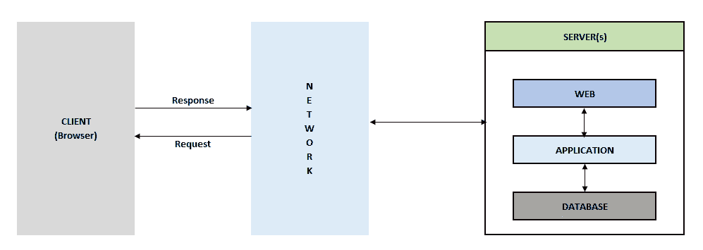
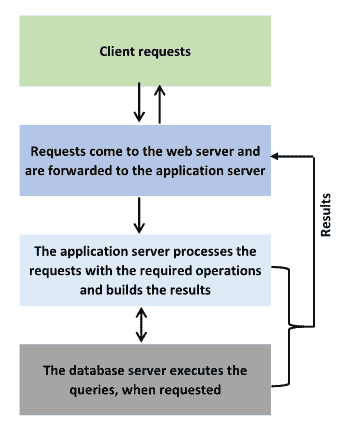
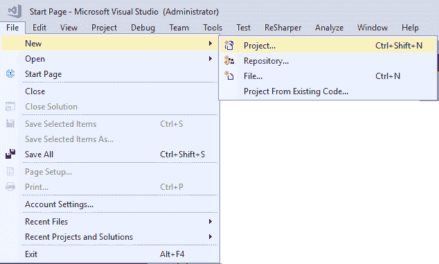
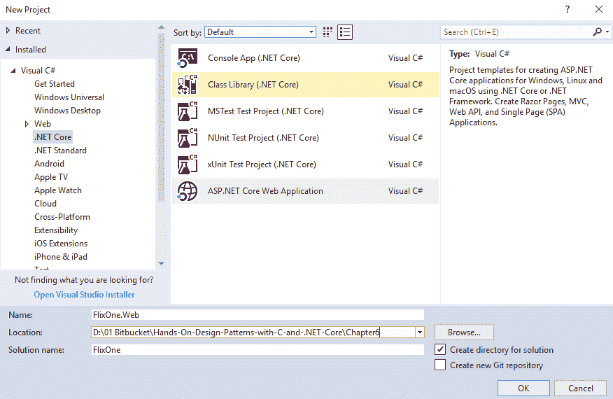
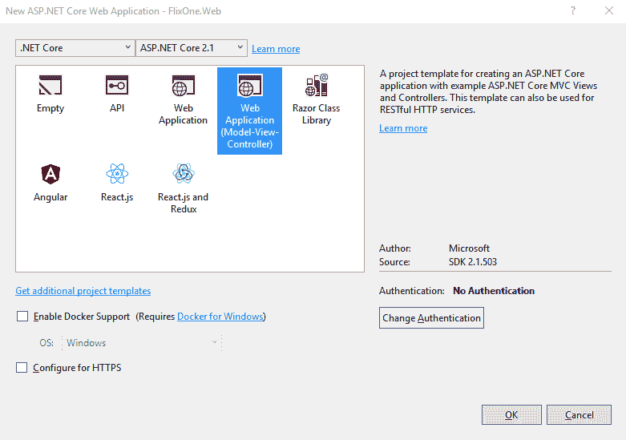
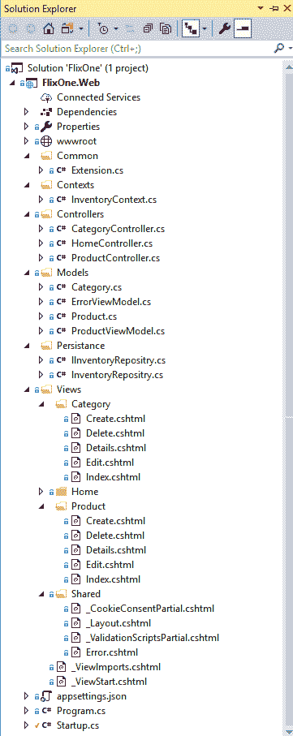
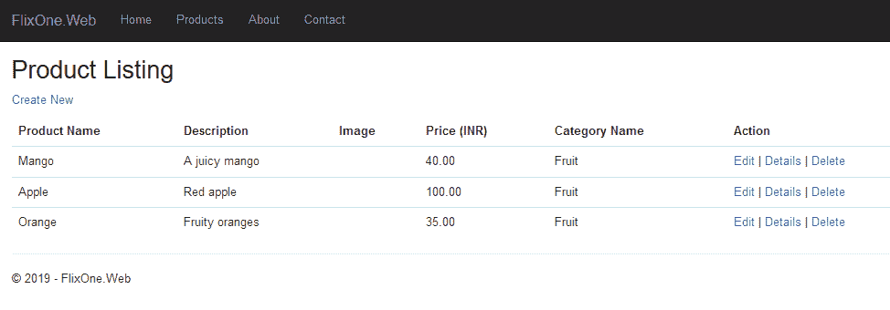

# 第六章：实施面向 Web 应用的设计模式 - 第一部分

在本章中，我们将继续构建 **FlixOne** 库存管理应用程序（参见 第三章，*实施设计模式基础 - 第一部分*），并将讨论将控制台应用程序转换为 Web 应用程序的过程。与控制台应用程序相比，Web 应用程序应该更吸引用户；在这里，我们还将讨论为什么我们要进行这种改变。

本章将涵盖以下主题：

+   创建 .NET Core Web 应用程序

+   构建一个 Web 应用程序

+   实施 CRUD 页面

如果您尚未查看前面的章节，请注意，**FlixOne 库存管理** Web 应用程序是一个虚构的产品。我们创建此应用程序是为了讨论在 Web 项目中所需的各个设计模式。

# 技术要求

本章包含各种代码示例，以解释概念。代码保持简单，仅用于演示目的。大多数示例涉及一个用 C# 编写的 **.NET Core** 控制台应用程序。

要运行和执行代码，您需要以下内容：

+   Visual Studio 2019（您也可以使用 Visual Studio 2017 更新 3 或更高版本运行应用程序）

+   .NET Core 环境设置

+   SQL Server（本章中使用的是 Express 版本）

# 安装 Visual Studio

要运行这些代码示例，您需要安装 Visual Studio（2017）或更高版本，例如 2019（或者您可以使用您首选的 IDE）。为此，请按照以下步骤操作：

1.  从：[`docs.microsoft.com/en-us/visualstudio/install/install-visual-studio`](https://docs.microsoft.com/en-us/visualstudio/install/install-visual-studio) 下载 Visual Studio。

1.  按照包含的安装说明操作。Visual Studio 安装有多个版本可用。在本章中，我们使用的是 Windows 版本的 Visual Studio。

# 设置 .NET Core

如果您尚未安装 .NET Core，您需要按照以下步骤操作：

1.  从：[`www.microsoft.com/net/download/windows`](https://www.microsoft.com/net/download/windows) 下载 .NET Core。

1.  按照安装说明，并遵循相关的库：[`dotnet.microsoft.com/download/dotnet-core/2.2`](https://dotnet.microsoft.com/download/dotnet-core/2.2)。

# 安装 SQL Server

如果您尚未安装 SQL Server，您需要按照以下说明操作：

1.  从：[`www.microsoft.com/en-in/download/details.aspx?id=1695`](https://www.microsoft.com/en-in/download/details.aspx?id=1695) 下载 SQL Server。

1.  您可以在以下位置找到安装说明：[`docs.microsoft.com/en-us/sql/ssms/download-sql-server-management-studio-ssms?view=sql-server-2017`](https://docs.microsoft.com/en-us/sql/ssms/download-sql-server-management-studio-ssms?view=sql-server-2017).

如需故障排除和更多信息，请参阅：[`www.blackbaud.com/files/support/infinityinstaller/content/installermaster/tkinstallsqlserver2008r2.htm`](https://www.blackbaud.com/files/support/infinityinstaller/content/installermaster/tkinstallsqlserver2008r2.htm).

本节旨在提供开始使用 Web 应用程序所需的基本信息。我们将在后续章节中查看更多细节。在本章中，我们将使用代码示例来阐述各种术语和部分。

完整的源代码可在以下链接获取：[`github.com/PacktPublishing/Hands-On-Design-Patterns-with-C-and-.NET-Core/tree/master/Chapter6`](https://github.com/PacktPublishing/Hands-On-Design-Patterns-with-C-and-.NET-Core/tree/master/Chapter6).

# 创建一个 .Net Core Web 应用程序

在本章的开头，我们讨论了我们的 FlixOne 基于控制台的应用程序，并且业务团队已经确定了采用 Web 应用程序的各种原因。现在是时候对应用程序进行更改了。在本节中，我们将开始创建一个具有新外观和感觉的现有 FlixOne 应用程序的新用户界面。我们还将讨论所有需求和初始化。

# 启动项目

在我们现有的 FlixOne 控制台应用程序的基础上，管理层决定用许多新特性来翻新我们的 FlixOne 库存控制台应用程序。管理层得出结论，我们必须将现有的控制台应用程序转换为基于 Web 的解决方案。

技术团队和业务团队坐下来讨论了为什么决定废弃当前控制台应用程序的多种原因：

+   界面不交互。

+   应用程序并非在所有地方都可用。

+   维护起来很复杂。

+   随着业务的增长，需要具有更高性能和适应性的可扩展系统。

# 开发需求

以下列表是讨论的结果，确定的高层次需求如下：

+   产品分类

+   产品添加

+   产品更新

+   产品删除

业务对开发者的实际需求包括以下技术要求：

+   **一个着陆页或主页**：这应该是一个包含各种小部件的仪表板，并显示商店的摘要。

+   **一个产品页面**：应该具有添加、更新和删除产品和类别的功能。

# 构建一个 Web 应用程序

根据刚刚讨论的需求，我们的主要目标是把现有的控制台应用程序转换为 Web 应用程序。在这个过程中，我们将讨论各种适用于 Web 应用程序的设计模式，以及这些设计模式在 Web 应用程序背景下的重要性。

# Web 应用程序及其工作原理

网络应用是客户端-服务器架构的最佳实现之一。一个网络应用可以是一小段代码、一个程序，或者是一个针对问题或业务场景的完整解决方案，在这个场景中，用户可以通过浏览器相互交流或与服务器交流。网络应用通过浏览器提供请求和响应，主要通过使用**超文本传输协议**（**HTTP**）来实现。

当客户端和服务器之间发生任何通信时，会发生两件事：客户端发起请求，服务器生成响应。这种通信由 HTTP 请求和 HTTP 响应组成。更多信息，请参阅[`www.w3schools.com/whatis/whatis_http.asp`](https://www.w3schools.com/whatis/whatis_http.asp)的文档。

在下面的图中，你可以看到网络应用的整体概述及其工作方式：



从这张图中，你可以很容易地看出，使用浏览器（作为客户端），你为成千上万的用户打开了大门，他们可以从世界任何地方访问网站并与你互动。有了网络应用，你和你的客户可以轻松沟通。通常，只有在捕获并存储了所有必要信息的数据时，才能实现有效的互动，这些信息对于你的业务和用户都是必需的。然后，这些信息被处理，并将结果呈现给用户。

通常，网络应用结合使用服务器端代码来处理信息的存储和检索，以及客户端脚本向用户展示信息。

网络应用需要一个网络服务器（如**IIS**或**Apache**）来管理来自客户端（从浏览器，如前图所示）的请求。还需要一个应用服务器（如 IIS 或 Apache Tomcat）来执行请求的任务。有时还需要数据库来存储信息。

简单来说，网络服务器和应用服务器都是为了提供 HTTP 内容而设计的，但存在某些差异。网络服务器提供静态 HTTP 内容，如 HTML 页面。应用服务器除了提供静态 HTTP 内容外，还可以使用不同的编程语言提供动态内容。更多信息，请参阅[`stackoverflow.com/questions/936197/what-is-the-difference-between-application-server-and-web-server`](https://stackoverflow.com/questions/936197/what-is-the-difference-between-application-server-and-web-server)。

我们可以详细说明网络应用的流程如下。这些被称为网络应用的五步工作流程：

1.  客户端（浏览器）通过 HTTP（在大多数情况下）在互联网上向网络服务器发送请求。这通常是通过网络浏览器或应用程序的用户界面完成的。

1.  请求在 Web 服务器上产生，Web 服务器将请求转发到应用服务器（对于不同的请求，可能会有不同的应用服务器）。

1.  在应用服务器中，完成请求的任务。这可能涉及查询数据库服务器，从数据库中检索信息，处理信息，并构建结果。

1.  生成的结果（请求的信息或处理的数据）被发送到 Web 服务器。

1.  最后，Web 服务器将带有请求信息的响应发送回请求者（客户端），这会显示在用户的显示设备上。

以下图表展示了这五个步骤的概览：



在以下章节中，我将描述使用 **模型-视图-控制器**（**MVC**）模式的 Web 应用程序的工作流程。

# 编写 Web 应用程序代码

到目前为止，我们已经了解了需求，并查看我们的目标，即把控制台应用程序转换成基于 Web 的平台或应用程序。在本节中，我们将使用 Visual Studio 开发实际的 Web 应用程序。

按照以下步骤使用 Visual Studio 创建 Web 应用程序：

1.  打开 Visual Studio 实例。

1.  点击 File|New|Project 或按 *Ctrl + Shift + N*，如下面的截图所示：



1.  从新建项目窗口，选择 Web|.NET Core|ASP.NET Core Web Application。

1.  命名它（例如，`FlixOne.Web`），选择位置，然后您可以更新解决方案名称。默认情况下，解决方案名称将与项目名称相同。选中 Create directory for solution 复选框。您还可以选择选中 Create new Git repository 复选框（如果您想为这个项目创建一个新的仓库，您需要一个有效的 Git 账户）。

以下截图显示了创建新项目的流程：



1.  下一步是选择适合您的 Web 应用程序的模板和 .NET Core 版本。我们不会为这个项目启用 Docker 支持，因为我们不会使用 Docker 作为容器来部署我们的应用程序。我们只会使用 HTTP 协议，而不是 HTTPS。因此，Enable Docker Support 和 Configure HTTPS 复选框应该保持未选中状态，如下面的截图所示：



现在我们有一个完整的项目，包括我们的模板和示例代码，使用 MVC 框架。以下截图显示了到目前为止的解决方案：


架构模式是在用户界面和应用本身的设计中实现最佳实践的一种方式。它们为我们提供了针对常见问题的可重用解决方案。这些模式还允许我们轻松实现关注点的分离。

最流行的架构模式如下：

+   **模型-视图-控制器**（**MVC**）

+   **模型-视图-表示器**（**MVP**）

+   **模型-视图-视图模型**（**MVVM**）

您可以通过按 *F5* 来尝试运行应用程序。以下截图显示了 Web 应用程序的默认主页：


在接下来的部分中，我将讨论 MVC 模式并创建 **CRUD**（**创建**、**更新**和**删除**）页面以与用户交互。

# 实现 CRUD 页面

在本节中，我们将开始创建用于创建、更新和删除产品的功能页面。要开始，打开您的 `FlixOne` 解决方案，并将以下类添加到指定的文件夹中：

**`Models`**: 在解决方案的 `Models` 文件夹中添加以下文件：

+   `Product.cs`: `Product` 类的代码片段如下：

```cs
public class Product
{
   public Guid Id { get; set; }
   public string Name { get; set; }
   public string Description { get; set; }
   public string Image { get; set; }
   public decimal Price { get; set; }
   public Guid CategoryId { get; set; }
   public virtual Category Category { get; set; }
}
```

`Product` 类代表了产品几乎所有的元素。它有一个 `Name`、完整的 `Description`、`Image`、`Price` 和唯一的 `ID`，以便我们的系统能够识别它。`Product` 类还包括一个属于此产品的 `Category ID`，以及 `Category` 的完整定义。

**为什么我们应该定义一个 `virtual` 属性？**

在我们的 `Product` 类中，我们定义了一个 `virtual` 属性。这是因为，在 **Entity Framework**（**EF**）中，这个属性有助于为虚拟属性创建代理。这样，属性可以支持延迟加载和更有效的更改跟踪。这意味着数据是按需提供的。EF 在您请求使用 `Category` 属性时加载数据。

+   `Category.cs`: `Category` 类的代码片段如下：

```cs
public class Category
{
    public Category()
    {
        Products = new List<Product>();
    }

    public Guid Id { get; set; }
    public string Name { get; set; }
    public string Description { get; set; }
    public virtual IEnumerable<Product> Products { get; set; }
}
```

我们的 `Category` 类代表产品的实际类别。一个类别有一个唯一的 `ID`、一个 `Name`、完整的 `Description` 和属于此类别的 `Products` 集合。每次我们初始化 `Category` 类时，它也会初始化我们的 `Product` 类。

+   `ProductViewModel.cs`: `ProductViewModel` 类的代码片段如下：

```cs
public class ProductViewModel
{
    public Guid ProductId { get; set; }
    public string ProductName { get; set; }
    public string ProductDescription { get; set; }
    public string ProductImage { get; set; }
    public decimal ProductPrice { get; set; }
    public Guid CategoryId { get; set; }
    public string CategoryName { get; set; }
    public string CategoryDescription { get; set; }
}
```

我们的 `ProductViewModel` 类代表了一个完整的 `Product`，它具有诸如唯一的 `ProductId`、`ProductName`、完整的 `ProductDescription`、`ProductImage`、`ProductPrice`、唯一的 `CategoryId`、`CategoryName` 和完整的 `CategoryDescription` 等属性。

`Controllers`: 将以下文件添加到解决方案的 `Controllers` 文件夹中：

+   `ProductController` 负责所有与产品相关的操作。让我们看看代码和我们在本控制器中试图实现的操作：

```cs
public class ProductController : Controller
{
    private readonly IInventoryRepositry _repositry;
    public ProductController(IInventoryRepositry inventoryRepositry) => _repositry = inventoryRepositry;

...
}
```

在这里，我们定义了继承自 `Controller` 类的 `ProductController`。我们使用了 **依赖注入**，这是 ASP.NET Core MVC 框架内置的支持。

我们在第五章中详细讨论了控制反转 - .Net Core；`Controller`是 MVC 控制器的一个基类。有关更多信息，请参阅：[`docs.microsoft.com/en-us/dotnet/api/microsoft.aspnetcore.mvc.controller`](https://docs.microsoft.com/en-us/dotnet/api/microsoft.aspnetcore.mvc.controller)。

我们已经创建了我们的主要控制器，`ProductController`。现在让我们开始添加 CRUD 操作的功能。

以下代码只是一个`Read`或`Get`操作，它请求仓库（`_inventoryRepository`）列出所有可用的产品，然后将此产品列表转换为`ProductViewModel`类型，并返回一个`Index`视图：

```cs
   public IActionResult Index() => View(_repositry.GetProducts().ToProductvm());
   public IActionResult Details(Guid id) => View(_repositry.GetProduct(id).ToProductvm());
```

在前面的代码片段中，`Details`方法根据其唯一的`Id`返回特定`Product`的详细信息。这也是一个类似于我们的`Index`方法的`Get`操作，但它提供一个单独的对象而不是列表。

MVC 控制器的方法定义为**操作方法**，并具有`ActionResult`的返回类型。在这种情况下，我们使用`IActionResult`。一般来说，可以说`IActionResult`是`ActionResult`类的一个接口。它还为我们提供了一种返回多种方式，包括以下内容：

+   `EmptyResult`

+   `FileResult`

+   `HttpStatusCodeResult`

+   `ContentResult`

+   `JsonResult`

+   `RedirectToRouteResult`

+   `RedirectResult`

我们不会详细讨论所有这些，因为这些超出了本书的范围。要了解更多关于返回类型的信息，请参阅：[`docs.microsoft.com/en-us/aspnet/core/web-api/action-return-types`](https://docs.microsoft.com/en-us/aspnet/core/web-api/action-return-types)。

在以下代码中，我们正在创建一个新的产品。以下代码片段有两个操作方法。一个有`[HttpPost]`属性，另一个没有属性：

```cs
public IActionResult Create() => View();
[HttpPost]
[ValidateAntiForgeryToken]
public IActionResult Create([FromBody] Product product)
{
    try
    {
        _repositry.AddProduct(product);
        return RedirectToAction(nameof(Index));
    }
    catch
    {
        return View();
    }
}
```

第一种方法简单地返回一个`View`。这将返回一个`Create.cshtml`页面。

如果 MVC 框架中的任何操作方法都没有任何属性，它将默认使用`[HttpGet]`属性。在其他视图中，默认情况下，操作方法是`Get`请求。每当用户查看页面时，我们使用`[HttpGet]`，或`Get`请求。每当用户提交表单或执行操作时，我们使用`[HttpPost]`，或`Post`请求。

如果我们在我们的操作方法中没有明确提及视图名称，那么 MVC 框架看起来像这样的视图名称：`actionmethodname.cshtml`或`actionmethodname.vbhtml`。在我们的例子中，视图名称是`Create.cshtml`，因为我们使用的是 C#语言。如果我们使用 Visual Basic，它将是`vbhtml`。它首先在名称类似于控制器文件夹名称的文件夹中查找。如果在这个文件夹中找不到文件，它将在`shared`文件夹中查找。

上述代码片段中的第二个操作方法使用`[HttpPost]`属性，这意味着它处理`Post`请求。此操作方法通过调用`_repository`的`AddProduct`方法简单地添加产品。在此操作方法中，我们使用了`[ValidateAntiForgeryToken]`属性和`[FromBody]`，这是一个模型绑定器。

MVC 框架通过提供`[ValidateAntiForgeryToken]`属性来为我们的应用程序提供大量安全保护，以防止**跨站脚本**/**跨站请求伪造**（XSS/CSRF）攻击。这类攻击通常包括一些危险的客户端脚本代码。

MVC 中的模型绑定将`HTTP`请求中的数据映射到操作方法参数。与操作方法一起频繁使用的模型绑定属性如下：

+   `[FromHeader]`

+   `` `[FromQuery]` ``

+   `[FromRoute]`

+   `[FromForm]`

我们不会对这些进行更详细的讨论，因为这超出了本书的范围。然而，您可以在官方文档中找到完整详情，网址为[`docs.microsoft.com/en-us/aspnet/core/mvc/models/model-binding`](https://docs.microsoft.com/en-us/aspnet/core/mvc/models/model-binding)。

在之前的代码片段中，我们讨论了`Create`和`Read`操作。现在是时候编写`Update`操作的代码了。在以下代码中，我们有两个操作方法：一个是`Get`，另一个是`Post`请求：

```cs
public IActionResult Edit(Guid id) => View(_repositry.GetProduct(id));

[HttpPost]
[ValidateAntiForgeryToken]
public IActionResult Edit(Guid id, [FromBody] Product product)
{
    try
    {
        _repositry.UpdateProduct(product);
        return RedirectToAction(nameof(Index));
    }
    catch
    {
        return View();
    }
}
```

之前代码中的第一个操作方法根据`ID`获取`Product`并返回一个`View`。第二个操作方法从视图中获取数据并根据其 ID 更新请求的`Product`：

```cs
public IActionResult Delete(Guid id) => View(_repositry.GetProduct(id));

[HttpPost]
[ValidateAntiForgeryToken]
public IActionResult Delete(Guid id, [FromBody] Product product)
{
    try
    {
        _repositry.RemoveProduct(product);
        return RedirectToAction(nameof(Index));
    }
    catch
    {
        return View();
    }
}
```

最后，之前的代码表示了`CRUD`操作中的`Delete`操作。它也有两个操作方法；一个从存储库检索数据并将其提供给视图，另一个接收数据请求并根据其 ID 删除特定的`Product`。

`CategoryController`负责`Product`类别的所有操作。将以下代码添加到控制器中，它表示`CategoryController`，其中我们使用了依赖注入来初始化我们的`IInventoryRepository`：

```cs
public class CategoryController: Controller
{
  private readonly IInventoryRepositry _inventoryRepositry;
  public CategoryController(IInventoryRepositry inventoryRepositry) => _inventoryRepositry = inventoryRepositry;
 //code omitted
}
```

以下代码包含两个操作方法。第一个获取类别列表，第二个基于其唯一 ID 获取特定类别：

```cs
public IActionResult Index() => View(_inventoryRepositry.GetCategories());
public IActionResult Details(Guid id) => View(_inventoryRepositry.GetCategory(id));
```

以下代码用于对系统的`Get`和`Post`请求创建新类别：

```cs
public IActionResult Create() => View();
    [HttpPost]
    [ValidateAntiForgeryToken]
    public IActionResult Create([FromBody] Category category)
    {
        try
        {
            _inventoryRepositry.AddCategory(category);

            return RedirectToAction(nameof(Index));
        }
        catch
        {
            return View();
        }
    }
```

在以下代码中，我们正在更新现有的类别。代码包含带有`Get`和`Post`请求的`Edit`操作方法：

```cs
public IActionResult Edit(Guid id) => View(_inventoryRepositry.GetCategory(id));
    [HttpPost]
    [ValidateAntiForgeryToken]
    public IActionResult Edit(Guid id, [FromBody]Category category)
    {
        try
        {
            _inventoryRepositry.UpdateCategory(category);

            return RedirectToAction(nameof(Index));
        }
        catch
        {
            return View();
        }
    }
```

最后，我们有一个`Delete`操作方法。这是我们的`CRUD`页面中`Category`删除操作的最终操作，如下代码所示：

```cs
public IActionResult Delete(Guid id) => View(_inventoryRepositry.GetCategory(id));

    [HttpPost]
    [ValidateAntiForgeryToken]
    public IActionResult Delete(Guid id, [FromBody] Category category)
    {
        try
        {
            _inventoryRepositry.RemoveCategory(category);

            return RedirectToAction(nameof(Index));
        }
        catch
        {
            return View();
        }
    }
```

`视图`: 将以下视图添加到相应的文件夹中：

+   `Index.cshtml`

+   `Create.cshtml`

+   `Edit.cshtml`

+   `Delete.cshtml`

+   `Details.cshtml`

`上下文`: 将`InventoryContext.cs`文件添加到`Contexts`文件夹中，并包含以下代码：

```cs
public class InventoryContext : DbContext
{
    public InventoryContext(DbContextOptions<InventoryContext> options)
        : base(options)
    {
    }

    public InventoryContext()
    {
    }

    public DbSet<Product> Products { get; set; }
    public DbSet<Category> Categories { get; set; }
}
```

前面的代码提供了使用 EF 与数据库交互所需的各个方法。在运行代码时，您可能会遇到以下异常：


为了修复这个异常，您应该在`Startup.cs`文件中将映射到`IInventoryRepository`，如图所示：


现在，我们已经为我们 Web 应用程序添加了各种功能，我们的解决方案现在看起来如下截图所示：



请参阅本章的 GitHub 仓库[`github.com/PacktPublishing/Hands-On-Design-Patterns-with-C-and-.NET-Core/tree/master/Chapter6`](https://github.com/PacktPublishing/Hands-On-Design-Patterns-with-C-and-.NET-Core/tree/master/Chapter6)。

如果我们将 MVC 模型可视化，那么它将如以下图示所示工作：


前面的图像改编自[`commons.wikimedia.org/wiki/File:MVC-Process.svg`](https://commons.wikimedia.org/wiki/File:MVC-Process.svg)

如前图所示，每当用户发起请求时，它都会到达控制器，并触发动作方法，以便进一步处理或更新，如果需要的话，到模型，然后向用户提供服务。

在我们的案例中，每当用户请求`/Product`时，请求就会发送到`ProductController`的`Index`动作方法，并在获取产品列表后提供`Index.cshtml`视图。您将看到如下截图所示的产品列表：



前面的截图是一个简单的产品列表，它代表了`CRUD`操作中的`Read`部分。在这个屏幕上，应用程序显示了所有可用的产品和它们的类别。

下面的图示展示了我们的应用程序如何交互：


它展示了我们应用程序流程的图示概述。`InventoryRepository`依赖于`InventoryContext`进行数据库操作，并与我们的模型类`Category`和`Product`交互。我们的`Product`和`Category`控制器使用`IInventoryRepository`接口与存储库进行 CRUD 操作。

# 摘要

本章的主要目标是启动一个基本的 Web 应用程序。

我们以讨论业务需求开始本章，为什么我们需要一个 Web 应用程序，以及为什么我们想要升级我们的控制台应用程序。然后，我们逐步介绍了使用 Visual Studio 在 MVC 模式中创建 Web 应用程序的步骤。我们还讨论了 Web 应用程序可以作为客户端-服务器模型工作，并探讨了用户界面模式。我们还开始构建 CRUD 页面。

在下一章中，我们将继续讨论 Web 应用程序，并讨论更多适用于 Web 应用程序的设计模式。

# 问题

以下问题将帮助您巩固本章包含的信息：

1.  什么是 Web 应用程序？

1.  设计一个你选择的 Web 应用程序，并描述它是如何工作的。

1.  控制反转是什么？

1.  我们在本章中介绍了哪些架构模式？你最喜欢哪一个，为什么？

# 进一步阅读

恭喜！你已经完成了这一章。我们涵盖了与身份验证、授权和测试项目相关的大量内容。这并不是你学习的终点；这只是开始，还有更多书籍你可以参考以加深理解。以下书籍深入探讨了 RESTful Web 服务和测试驱动开发：

+   《*使用.NET Core 构建 RESTful Web 服务*》，作者*Gaurav Aroraa*，*Tadit Dash*，由*Packt Publishing*出版，可在：[`www.packtpub.com/application-development/building-restful-web-services-net-core`](https://www.packtpub.com/application-development/building-restful-web-services-net-core)找到

+   《*C#和.NET Core 测试驱动开发*》，作者*Ayobami Adewole*，由*Packt Publishing*出版，可在：[`www.packtpub.com/application-development/c-and-net-core-test-driven-development`](https://www.packtpub.com/application-development/c-and-net-core-test-driven-development)找到
