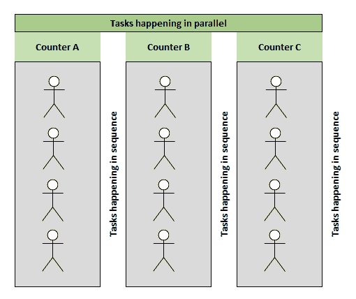
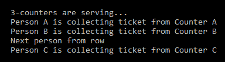
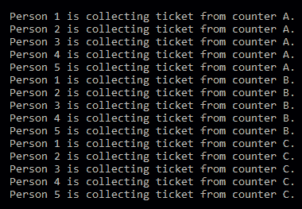
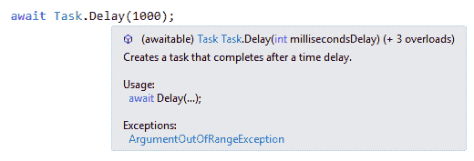
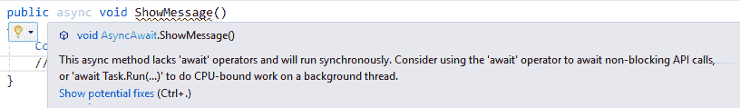
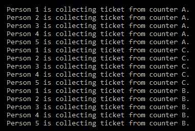
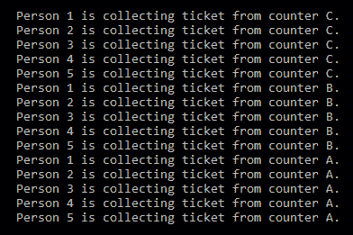
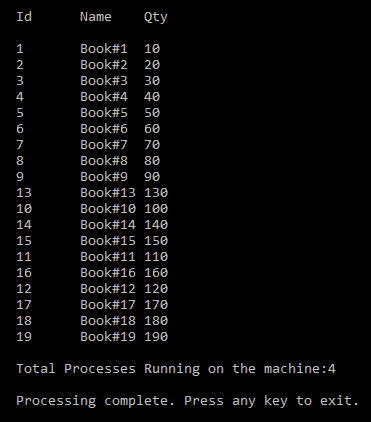
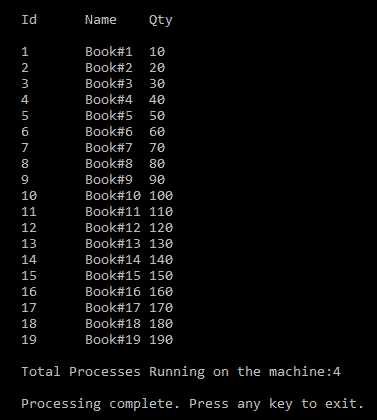
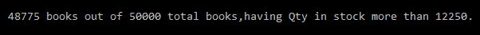

# 第八章：.NET Core 中的并发编程

在上一章（第七章，*实现 Web 应用程序的设计模式 - 第二部分*）中，我们借助各种模式创建了一个示例 Web 应用程序。我们调整了授权和认证机制以保护 Web 应用程序，并讨论了**测试驱动开发**（**TDD**）以确保我们的代码经过测试且正在运行。

本章将讨论在.NET Core 中进行并发编程的最佳实践。在本章的后续部分，我们将了解与 C#和.NET Core 应用程序中良好组织并发相关的模式。

本章将涵盖以下主题：

+   Async/Await – 为什么阻塞是坏事？

+   多线程和异步编程

+   并发集合

+   模式和实践 – TDD 和 Parallel LINQ

# 技术要求

本章包含各种代码示例来解释概念。代码保持简单，仅用于演示目的。大多数示例涉及使用 C#编写的.NET Core 控制台应用程序。

完整的源代码可在以下链接中找到：[`github.com/PacktPublishing/Hands-On-Design-Patterns-with-C-and-.NET-Core/tree/master/Chapter8`](https://github.com/PacktPublishing/Hands-On-Design-Patterns-with-C-and-.NET-Core/tree/master/Chapter8).

要运行和执行代码，您需要以下内容：

+   Visual Studio 2019（您也可以使用 Visual Studio 2017）

+   设置.NET Core

+   SQL Server（本章使用的是 Express 版）

# 安装 Visual Studio

要运行代码示例，您需要安装 Visual Studio（首选 IDE）。为此，您可以按照以下说明操作：

1.  从安装说明中提到的下载链接下载 Visual Studio：[`docs.microsoft.com/en-us/visualstudio/install/install-visual-studio`](https://docs.microsoft.com/en-us/visualstudio/install/install-visual-studio)。

1.  按照提到的安装说明进行操作。

1.  Visual Studio 安装有多种选择。在这里，我们使用的是 Windows 版本的 Visual Studio。

# 设置.NET Core

如果您尚未安装.NET Core，您需要遵循以下说明：

1.  在[`www.microsoft.com/net/download/windows`](https://www.microsoft.com/net/download/windows)下载.NET Core for Windows。

1.  对于多个版本和相关库，请访问[`dotnet.microsoft.com/download/dotnet-core/2.2`](https://dotnet.microsoft.com/download/dotnet-core/2.2)。

# 安装 SQL Server

如果您尚未安装 SQL Server，可以按照以下说明操作：

1.  从以下链接下载 SQL Server：[`www.microsoft.com/en-in/download/details.aspx?id=1695`](https://www.microsoft.com/en-in/download/details.aspx?id=1695)。

1.  您可以在此处找到安装说明：[`docs.microsoft.com/en-us/sql/ssms/download-sql-server-management-studio-ssms?view=sql-server-2017`](https://docs.microsoft.com/en-us/sql/ssms/download-sql-server-management-studio-ssms?view=sql-server-2017)。

对于故障排除和更多信息，请参阅以下链接：[`www.blackbaud.com/files/support/infinityinstaller/content/installermaster/tkinstallsqlserver2008r2.htm`](https://www.blackbaud.com/files/support/infinityinstaller/content/installermaster/tkinstallsqlserver2008r2.htm)。

# 现实世界中的并发

**并发**是我们生活的一部分：它在现实世界中存在。当我们讨论并发时，我们指的是多任务处理。

在现实世界中，我们中的许多人经常进行多任务处理。例如，我们可以在打电话的同时编写程序，我们可以在吃饭的同时看电影，我们可以在阅读乐谱的同时唱歌。有很多例子说明我们作为人类可以进行多任务处理。不必深入科学细节，我们可以将我们的大脑试图理解新事物的同时指挥身体的其他器官工作，如心脏或我们的嗅觉，视为一种多任务处理的形式。

同样的方法适用于我们的系统（计算机）。如果我们考虑今天的计算机，每台可用的计算机都有一个多核心的 CPU（超过一个核心）。这是为了允许同时执行多个指令，并让我们能够同时执行多个任务。

在单 CPU 机器上实现真正的并行是不可能的，因为任务是不可切换的，因为 CPU 只有一个核心。只有在具有多个 CPU（多个核心）的机器上才可能实现。简单来说，并发编程涉及两个方面：

+   **任务管理**：管理/分配工作单元到可用的线程。

+   **通信**：这设置了任务的初始参数并获取结果。

当事物/任务同时发生时，我们称之为*并发*。在我们的编程语言中，当我们的程序中的任何部分同时运行时，这被称为并发编程。您也可以将**并行编程**作为并发编程的同义词。

例如，想象一下你需要购票才能进入一个大型会议的特定会议厅。在会议厅门口，你必须购票，用现金或卡支付。在你支付的时候，柜台助手可以将你的详细信息输入系统，打印发票，并为你提供门票。现在考虑有更多的人想要购票。每个人都必须完成必要的活动才能从柜台领取门票。在这种情况下，每次只能从柜台服务一个人，其余的人则等待他们的轮次。假设一个人从柜台领取门票需要两分钟；因此，下一个人需要等待两分钟才能轮到他们。考虑队伍中最后一个人的等待时间，如果队伍有 50 人。这里可以有所改变。如果有两个额外的售票柜台，并且每个柜台每两分钟完成一次任务，这意味着每两分钟，将有三个人能够领取三张门票——或者说三个柜台每两分钟卖出两张门票。换句话说，每个售票柜台都在同一时间点执行相同的任务（即售票）。这意味着所有柜台都在并行服务；因此，它们是并发的。这在上面的图中有所展示：



在前面的图中，可以清楚地看到，队伍中的每个人要么处于等待位置，要么在柜台处活跃，有三个队列中正在按顺序发生任务。所有三个柜台（`CounterA`、`CounterB`和`CounterC`）都在同一时间点执行任务——它们在并行地进行活动。

**并发性**是指两个或更多任务在重叠的时间段内开始、运行和完成。

**并行性**是指两个或更多任务同时运行。

这些是并发活动，但想象一下这样一个场景：有成千上万的人排着长队（例如，10,000 人）；在这里执行并行操作是没有用的，因为这不会解决这个操作中可能出现的瓶颈问题。另一方面，你可以将计数器的数量增加到 50 个。这将解决这个问题吗？在我们使用任何软件时，这类问题都可能会发生。这是一个与阻塞相关的问题。在接下来的章节中，我们将更详细地讨论并发编程。

# 多线程和异步编程

简单来说，我们可以这样说，多线程意味着程序在多个线程上并行运行。在异步编程中，一个工作单元独立于主应用程序线程运行，并通知调用线程任务已完成、失败或正在进行。关于异步编程需要考虑的有趣问题是何时应该使用它以及它的好处是什么。

多个线程访问同一共享数据并更新它以产生不可预测结果的可能性可以被称为**竞态条件**。我们已经在第四章，*实现设计模式 - 基础部分 2*中讨论了竞态条件。

考虑我们在上一节中讨论的场景，其中排队的人正在领取他们的票。让我们尝试在多线程程序中捕捉这个场景：

```cs
internal class TicketCounter
{
    public static void CounterA() => Console.WriteLine("Person A is collecting ticket from Counter A");
    public static void CounterB() => Console.WriteLine("Person B is collecting ticket from Counter B");
    public static void CounterC() => Console.WriteLine("Person C is collecting ticket from Counter C");
}
```

这里，我们有一个`TicketCounter`类，它代表我们整个票务收集计数器的设置（我们在上一节中讨论了这些）。三个方法：`CounterA()`，`CounterB()`，和`CounterC()`代表一个单独的票务收集计数器。这些方法只是将消息写入控制台，如下面的代码所示：

```cs
internal class Program
{
    private static void Main(string[] args)
    {
        var counterA = new Thread(TicketCounter.CounterA);
        var counterB = new Thread(TicketCounter.CounterB);
        var counterC = new Thread(TicketCounter.CounterC);
        Console.WriteLine("3-counters are serving...");
        counterA.Start();
        counterB.Start();
        counterC.Start();
        Console.WriteLine("Next person from row");
        Console.ReadLine();
    }
}
```

前面的代码是我们的`Program`类，它从`Main`方法内部启动活动。在这里，我们为所有计数器声明并启动了三个线程。请注意，我们是按照顺序/顺序启动这些线程的。因为我们预计这些线程将以相同的顺序执行，所以让我们运行程序并查看输出，如下面的截图所示：


前面的程序没有按照代码中给出的顺序执行。根据我们的代码，执行顺序应该是这样的：

```cs
3-counters are serving...
Next person from row
Person A is collecting ticket from Counter A
Person B is collecting ticket from Counter B
Person C is collecting ticket from Counter C
```

这是因为线程，这些线程在没有任何保证它们应该按照它们被声明/启动的顺序/序列执行的情况下同时工作。

再次运行程序并查看我们是否得到相同的输出：



前面的快照显示了与之前结果不同的输出，因此现在我们按顺序/顺序有了输出：

```cs
3-counters are serving...
Person A is collecting ticket from Counter A
Person B is collecting ticket from Counter B
Next person from row
Person C is collecting ticket from Counter C
```

因此，线程正在工作，但不是我们定义的顺序。

你可以这样设置线程的优先级：`counterC.Priority = ThreadPriority.Highest;`，`counterB.Priority = ThreadPriority.Normal;`，和`counterA.Priority = ThreadPriority.Lowest;`。

要以同步方式运行线程，让我们修改我们的代码如下：

```cs
internal class SynchronizedTicketCounter
{
    public void ShowMessage()
    {
        int personsInQueue = 5; //assume maximum persons in queue
 lock (this)
        {
            Thread thread = Thread.CurrentThread;
            for (int personCount = 0; personCount < personsInQueue; personCount++)
            {
                Console.WriteLine($"\tPerson {personCount + 1} is collecting ticket from counter {thread.Name}.");
            }
        }
    }
}
```

我们创建了一个新的`SynchronizedTicketCounter`类，其中包含`ShowMessage()`方法；请注意前面的代码中的`lock(this){...}`。运行程序并检查输出：



现在我们计数器按正确的顺序/顺序服务，我们得到了预期的输出。

# Async/Await –为什么阻塞是坏的？

异步编程在期望同时进行各种活动的情况下非常有用。使用`async`关键字，我们定义我们的方法/操作为异步。考虑以下代码片段：

```cs
internal class AsyncAwait
{
    public async Task ShowMessage()
    {
        Console.WriteLine("\tServing messages!");
        await Task.Delay(1000);
    }
}
```

在这里，我们有一个`AsyncAwait`类，它有一个`async`方法，`ShowMessage()`。这个方法只是简单地打印出将在控制台窗口中显示的消息。现在，无论何时我们在其他代码中调用/消费这个方法，该部分的代码可能会等待/保持/阻塞操作，直到`ShowMessage()`方法执行并完成任务。请参见以下快照：



我们之前的截图显示，我们已经为`ShowMessage()`方法设置了 1,000 毫秒的延迟。在这里，我们指示程序在 1,000 毫秒后完成。如果我们尝试从之前的代码中移除`await`，Visual Studio 将立即给出警告，要求将`await`放回；请参见以下快照：



在`await`操作符的帮助下，我们使用了非阻塞的 API 调用。运行程序并查看以下输出：


我们将得到前面快照中显示的输出。

# 并发集合

.NET Core 框架提供了各种集合，我们可以使用 LINQ 查询。作为一个开发者，在寻找线程安全集合时，可用的选项要少得多。如果没有线程安全集合，当开发者必须执行多个操作时，可能会变得困难。在这种情况下，我们将遇到我们已经在第四章，“实现设计模式 - 基础部分 2”中讨论过的竞争条件。为了克服这种情况，我们需要使用`lock`语句，就像我们在前面的部分中使用的那样。例如，我们可以编写一个简化`lock`语句实现的代码——请参见以下代码片段，其中我们使用了`lock`语句和集合类`Dictionary`：

```cs
public bool UpdateQuantity(string name, int quantity)
{
    lock (_lock)
    {
        _books[name].Quantity += quantity;
    }

    return true;
}
```

上述代码来自`InventoryContext`；在这个代码中，我们正在阻止其他线程锁定我们试图更新的数量的操作。

`Dictionary`集合类的最大缺点是它不是线程安全的。当我们使用`Dictionary`时，我们必须在多个线程中使用`lock`语句。为了使我们的代码线程安全，我们可以使用`ConcurrentDictionary`集合类。

`ConcurrentDictionary`是一个线程安全的集合类，用于存储键值对。这个类实现了`lock`语句，并提供了一个线程安全的类。考虑以下代码：

```cs
private readonly IDictionary<string, Book> _books;
protected InventoryContext()
{
    _books = new ConcurrentDictionary<string, Book>();
}
```

上述代码片段来自我们的 FlixOne 控制台应用程序的`InventoryContext`类。在这个代码中，我们有`_books`字段，它被初始化为一个`ConcurrentDictionary`集合类。

由于我们正在使用 `InventoryContext` 类的 `UpdateQuantity()` 方法进行多线程操作，所以有可能一个线程增加数量，而另一个线程将数量重置为其初始水平。这是因为我们的对象来自单个集合，一个线程对集合的任何更改对其他线程都是不可见的。所有线程都在引用原始未修改的集合，简单来说，我们的方法不是线程安全的，除非我们使用 `lock` 语句或 `ConcurretDictionary` 集合类。

# 模式和实践 - TDD 和 Parallel LINQ

当我们处理多线程时，我们应该遵循最佳实践来编写**流畅的代码**。流畅的代码是指开发者不会遇到死锁。换句话说，多线程在编写过程中需要非常小心。

当多个线程在一个类/程序中运行时，如果每个线程都接近在 `lock` 语句下编写的对象或资源，就会发生死锁。实际的死锁发生在每个线程都试图锁定已被其他线程锁定的对象/资源。

一个小小的错误可能会导致开发者不得不解决由于线程阻塞而发生的未知错误。此外，代码中几个词的糟糕实现可能会影响 100 行代码。

让我们回到本章开头讨论的会议票务示例。如果售票窗口无法履行其职责分发票务，会发生什么？在这种情况下，每个人都会试图到达售票窗口并获取一张票，这可能会导致售票窗口拥堵。这可能会使售票窗口阻塞。同样的逻辑也适用于我们的程序。我们可能会遇到死锁情况，其中多个线程会尝试锁定我们的对象/资源。避免这种状况的最佳实践是使用一种同步访问对象/资源的机制。.NET Core 框架提供了一个 `Monitor` 类来实现这一点。我已经重写了我们的旧代码以避免死锁情况——请参阅以下代码：

```cs
private static void ProcessTickets()
{
    var ticketCounter = new TicketCounter();
    var counterA = new Thread(ticketCounter.ShowMessage);
    var counterB = new Thread(ticketCounter.ShowMessage);
    var counterC = new Thread(ticketCounter.ShowMessage);
    counterA.Name = "A";
    counterB.Name = "B";
    counterC.Name = "C";
    counterA.Start();
    counterB.Start();
    counterC.Start();
}
```

在这里，我们有 `ProcessTicket` 方法；它启动了三个线程（每个线程代表一个售票窗口）。每个线程都会尝试访问 `TicketCounter` 类的 `ShowMessage` 方法。如果我们的 `ShowMessage` 方法没有很好地编写以处理这种情况，将会出现死锁问题。所有三个线程都会尝试获取与 `ShowMessage` 方法相关的对象/资源的锁。

以下代码是 `ShowMessage` 方法的实现，我编写了这段代码来处理死锁情况：

```cs
private static readonly object Object = new object();
public void ShowMessage()
{
    const int personsInQueue = 5;
    if (Monitor.TryEnter(Object, 300))
    {
        try
        {
            var thread = Thread.CurrentThread;
            for (var personCount = 0; personCount < personsInQueue; personCount++)
                Console.WriteLine(
                    $"\tPerson {personCount + 1} is collecting ticket from counter {thread.Name}.");
        }
        finally
        {
            Monitor.Exit(Object);
        }
    }
}
```

前面的是我们的`TicketCounter`类的`ShowMessage()`方法。在这个方法中，每当一个线程尝试锁定`Object`时，如果`Object`已经被锁定，它会尝试 300 毫秒。`Monitor`类会自动处理这种情况。当使用`Monitor`类时，开发者不需要担心多个线程正在运行，并且每个线程都在尝试获取锁的情况。运行程序以查看以下输出：



在前面的快照中，你会注意到在`counterA`之后，`counterC`提供服务，然后是`counter B`。这意味着在`thread A`之后，`thread C`被启动，然后是`thread B`。换句话说，`thread A`首先获取锁，然后 300 毫秒后，`thread C`尝试获取锁，然后`thread B`尝试获取锁。如果你想设置线程的顺序或优先级，你可以添加以下代码行：

```cs
counterC.Priority = ThreadPriority.Highest
counterB.Priority = ThreadPriority.Normal;
counterA.Priority = ThreadPriority.Lowest;
```

当你将前面的行添加到`ProcessTickets`方法中时，所有线程都将工作：首先是`Thread C`，然后是`Thread B`，最后是`Thread A`。

线程优先级是一个枚举，它告诉我们如何调度线程，以及`System.Threading.ThreadPriority`具有以下值：

+   **Lowest**：这是最低优先级，这意味着具有`Lowest`优先级的线程可以在具有任何其他优先级的线程之后调度。

+   **BelowNormal**：具有`BelowNormal`优先级的线程可以在具有`Normal`优先级的线程之后调度，但在具有`Lowest`优先级的线程之前。

+   **Normal**：所有线程都默认具有`Normal`优先级。具有`Normal`优先级的线程可以在具有`AboveNormal`优先级的线程之后调度，但在具有`BelowNormal`优先级的线程之前。

+   **AboveNormal**：具有`AboveNormal`优先级的线程可以在具有`Normal`优先级的线程之前调度，但在具有`Highest`优先级的线程之后。

+   **Highest**：这是线程的最高优先级。具有`Highest`优先级的线程可以在具有任何其他优先级的线程之前调度。

在为线程设置优先级后，执行程序并查看以下输出：



根据前面的快照，在设置优先级后，计数器按顺序`C`、`B`和`A`提供服务。只要稍加小心和简单的实现，我们就可以处理死锁情况，并按特定的顺序/优先级调度线程。

.Net Core 框架还提供了一个**任务并行库（TPL**），它是一组属于`System.Threading`和`System.Threading.Tasks`命名空间的公共 API。借助 TPL，开发者可以通过采用其简化实现来使应用程序并发。

考虑以下代码，我们可以看到 TPL 的最简单实现：

```cs
public void PallelVersion()
{
    var books = GetBooks();
    Parallel.ForEach(books, Process);
}
```

上述是一个简单的`ForEach`循环，使用了`Parallel`关键字。在上述代码中，我们只是在迭代一个`books`集合，并使用`Process`方法来处理它：

```cs
private void Process(Book book)
{
    Console.WriteLine($"\t{book.Id}\t{book.Name}\t{book.Quantity}");
}
```

上述代码是我们的`Process`方法（再次，这是最简单的一个），它打印出`books`的详细信息。根据他们的要求，用户可以执行他们想要的任何操作：

```cs
private static void ParallelismExample()
{
    var parallelism = new Parallelism();
    parallelism.GenerateBooks(19);
    Console.WriteLine("\n\tId\tName\tQty\n");
    parallelism.PallelVersion();
    Console.WriteLine($"\n\tTotal Processes Running on the machine:{Environment.ProcessorCount}\n");
    Console.WriteLine("\tProcessing complete. Press any key to exit.");
    Console.ReadKey();
}
```

如你所见，我们有一个`ParallelismExample`方法，它生成书籍列表并通过执行`PallelVersion`方法来处理书籍。

在你执行程序以查看以下输出之前，首先考虑以下顺序实现的代码片段：

```cs
public void Sequential()
{
    var books = GetBooks();
    foreach (var book in books) { Process(book); }
}
```

上述代码是一个`Sequential`方法；它使用一个简单的`foreach`循环来处理书籍集合。运行程序并查看以下输出：



注意上述快照。首先，在我运行此演示的系统上有四个进程正在运行。第二个迭代的集合是从 1 到 19 的顺序/顺序。程序不会将任务划分到机器上运行的不同进程中。按任意键退出当前进程，执行`ParallelismVersion`方法的程序，并查看以下输出：



上述截图是并行代码的输出；你可能注意到代码不是按顺序处理的，ID 也不是按顺序出现的，正如我们所看到的`Id` `13`在`9`之后但在`10`之前。如果这些是按顺序运行的，那么`Id`的顺序将是`9`，`10`，然后是`13`。

LINQ 在.NET Core 诞生之前就在.NET 世界中存在很长时间了。`LINQ-to-Objects`允许我们通过使用任意对象的序列来执行内存查询操作。`LINQ-to-Objects`是`IEnumerable<T>`上的扩展方法集合。

**延迟执行**意味着数据被枚举后才会执行。

PLINQ 可以用作 TPL 的替代品。它是 LINQ 的并行实现。PLINQ 查询在内存中的`IEnumerable`或`IEnumerable<T>`数据源上操作。它还具有延迟执行。LINQ 查询按顺序执行操作，而 PLINQ 并行执行操作并充分利用机器上的所有处理器。考虑以下代码以查看 PLINQ 的实现：

```cs
public void Process()
{
    var bookCount = 50000;
    _parallelism.GenerateBooks(bookCount);
    var books = _parallelism.GetBooks();
    var query = from book in books.AsParallel()
        where book.Quantity > 12250
        select book;
    Console.WriteLine($"\n\t{query.Count()} books out of {bookCount} total books," +
                      "having Qty in stock more than 12250.");
    Console.ReadKey();
}
```

上述代码是我们 PLINQ 类的处理方法。在这里，我们使用 PLINQ 查询库存中数量超过`12250`的任何书籍。运行代码以查看此输出：



PLINQ 使用机器上的所有处理器，但我们可以通过使用`WithDegreeOfParallelism()`方法来限制 PLINQ 中的处理器数量。我们可以在`Linq`类的`Process()`方法中使用以下代码：

```cs
var query = from book in books.AsParallel().WithDegreeOfParallelism(3)
    where book.Quantity > 12250
    select book;
return query;
```

以下代码将仅使用机器的三个处理器。执行它们，你会发现你得到的输出与之前代码的情况相同。

# 摘要

在本章中，我们讨论了并发编程和现实世界中的并发。我们探讨了如何在日常生活中处理与并发相关的各种场景。我们研究了从服务台收集会议门票的情况，并理解了并行编程和并发编程是什么。我们还涵盖了多线程、`Async`/`Await`、`Concurrent`集合和 PLINQ。

在接下来的章节中，我们将通过使用 C#语言来体验函数式编程。我们将更深入地探讨那些展示我们如何在.NET Core 中使用 C#进行函数式编程的概念。

# 问题

以下问题将帮助你巩固本章包含的信息：

1.  什么是并发编程？

1.  真正的并行是如何发生的？

1.  什么是竞态条件？

1.  为什么我们应该使用并发字典？

# 进一步阅读

以下书籍将帮助你了解更多关于本章所涵盖的主题：

+   *《并发模式和最佳实践》*，作者*Atul S Khot*，由*Packt Publishing*出版：[`www.packtpub.com/in/application-development/concurrent-patterns-and-best-practices`](https://www.packtpub.com/in/application-development/concurrent-patterns-and-best-practices)
