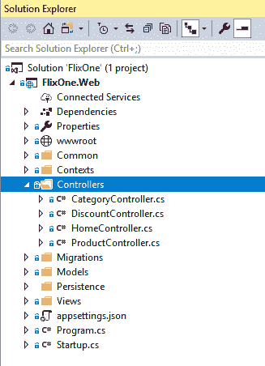
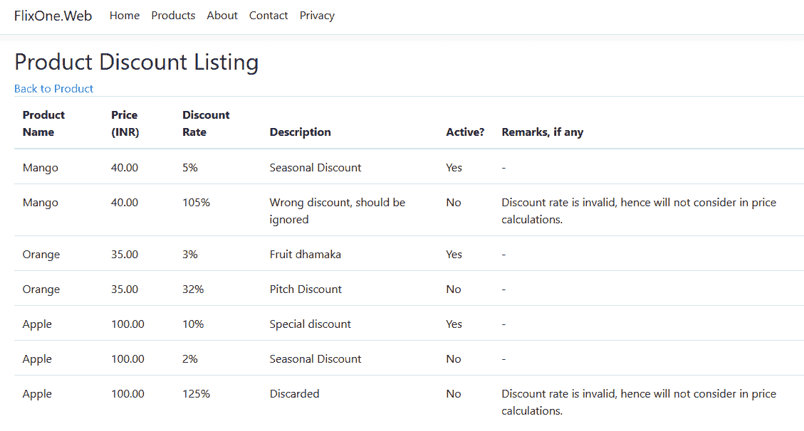

# 函数式编程实践

上一章（第八章，.NET Core 中的并发编程）介绍了 .NET Core 中的并发编程，本章的目标是利用 `async`/`await` 和并行性，使我们的程序更高效。

在本章中，我们将通过使用 C# 语言来体验函数式编程，并更深入地探讨如何利用 C# 在 .NET Core 中进行函数式编程的概念。本章的目的是帮助您了解函数式编程是什么，以及我们如何使用 C# 语言来使用它。

函数式编程受到数学的启发，并以函数式的方式解决问题。在数学中，我们有公式，在函数式编程中，我们以各种函数的形式使用数学。函数式编程的最好之处在于它有助于无缝地实现并发。

本章将涵盖以下主题：

+   理解函数式编程

+   库存应用程序

+   策略模式和函数式编程

# 技术要求

本章包含各种代码示例，用于解释函数式编程的概念。代码保持简单，仅用于演示目的。大多数示例涉及使用 C# 编写的 .NET Core 控制台应用程序。

完整的源代码可在以下链接获取：[`github.com/PacktPublishing/Hands-On-Design-Patterns-with-C-and-.NET-Core/tree/master/Chapter9`](https://github.com/PacktPublishing/Hands-On-Design-Patterns-with-C-and-.NET-Core/tree/master/Chapter9)。

要运行和执行代码，需要以下先决条件：

+   Visual Studio 2019（Visual Studio 2017 更新 3 或更高版本也可以用于运行应用程序）。

+   设置 .NET Core

+   SQL 服务器（本章使用的是 Express 版本）

# 安装 Visual Studio

要运行这些代码示例，您需要安装 Visual Studio 2017（或更高版本，如 2019）。为此，请按照以下说明操作：

1.  从以下下载链接下载 Visual Studio，其中包含安装说明：[`docs.microsoft.com/en-us/visualstudio/install/install-visual-studio`](https://docs.microsoft.com/en-us/visualstudio/install/install-visual-studio)。

1.  按照安装说明进行操作。

1.  Visual Studio 安装有多种版本。在这里，我们使用 Windows 版本的 Visual Studio。

# 设置 .NET Core

如果您未安装 .NET Core，请按照以下说明操作：

1.  在 [`www.microsoft.com/net/download/windows`](https://www.microsoft.com/net/download/windows) 下载 Windows 版本的 .NET Core。

1.  对于多个版本和相关库，请访问 [`dotnet.microsoft.com/download/dotnet-core/2.2`](https://dotnet.microsoft.com/download/dotnet-core/2.2)。

# 安装 SQL Server

如果您未安装 SQL Server，请按照以下说明操作：

1.  从以下链接下载 SQL Server：[`www.microsoft.com/en-in/download/details.aspx?id=1695`](https://www.microsoft.com/en-in/download/details.aspx?id=1695)。

1.  安装说明请在此处查找：[`docs.microsoft.com/en-us/sql/ssms/download-sql-server-management-studio-ssms?view=sql-server-2017`](https://docs.microsoft.com/en-us/sql/ssms/download-sql-server-management-studio-ssms?view=sql-server-2017)。

对于故障排除和更多信息，请参阅以下链接：[`www.blackbaud.com/files/support/infinityinstaller/content/installermaster/tkinstallsqlserver2008r2.htm`](https://www.blackbaud.com/files/support/infinityinstaller/content/installermaster/tkinstallsqlserver2008r2.htm)。

# 理解函数式编程

简而言之，**函数式编程**是一种与解决数学问题相同的方式进行符号计算的途径。任何函数式编程都基于数学函数及其编码风格。任何支持函数式编程的语言都适用于解决以下两个问题：

+   需要解决什么问题？

+   它是如何解决这个问题的？

函数式编程并非是一项新发明。这种语言在业界已经存在很长时间了。以下是一些支持函数式编程的知名编程语言：

+   Haskell

+   Scala

+   Erlang

+   Clojure

+   Lisp

+   OCaml

在 2005 年，Microsoft 发布了 F#（发音为 *EffSharp—*[`fsharp.org/`](https://fsharp.org/)) 的第一个版本。这是一种具有许多任何函数式编程都应该拥有的良好功能的函数式编程语言。在本章中，我们不会过多地讨论 F#，但我们将讨论函数式编程及其使用 C# 语言实现。

纯函数通过声明它们是纯的来加强函数式编程。这些函数在两个层面上工作：

+   对于提供的参数，最终结果/输出将始终保持相同。

+   即使它们被调用一百次，也不会影响程序的行为或应用程序的执行路径。

考虑以下来自我们 FlixOne 库应用的一个示例：

```cs
public static class PriceCalc
{
    public static decimal Discount(this decimal price, decimal discount) => 
        price * discount / 100;

    public static decimal PriceAfterDiscount(this decimal price, decimal discount) =>
        decimal.Round(price - Discount(price, discount));
}
```

如您所见，我们有一个名为 `PriceCalc` 的类，它包含两个扩展方法：`Discount` 和 `PriceAfterDiscount`。这些函数可以是纯函数；`PriceCalc` 函数和 `PriceAfterDiscount` 函数都符合成为 `Pure` 函数的标准；`Discount` 方法将根据当前价格和折扣计算折扣。在这种情况下，该方法对于提供的参数值将不会改变输出。这样，价格为 `190.00` 且折扣为 `10.00` 的产品将按以下方式计算：`190.00 * 10.00 /100`，这将返回 `19.00`。我们的下一个方法——`PriceAfterDiscount`——使用相同的参数值将计算 `190.00 - 19.00` 并返回 `171.00`。

函数式编程中的一个重要点是函数是纯净的，并且传达完整的信息（也称为**函数诚实性**）。考虑前一段代码中的 `Discount` 方法；这是一个既纯净又诚实的函数。所以，如果有人意外地提供了一个负折扣或超过其实际价格（超过 100%）的折扣，这个函数是否会保持纯净和诚实？为了处理这种情况，我们的数学函数应该编写得这样，如果有人输入 `discount <= 0 or discount > 100`，则系统将不予接受。以下是一个采用这种方法的代码示例：

```cs
public static decimal Discount(this decimal price, ValidDiscount validDiscount)
{
    return price * validDiscount.Discount / 100;
}
```

如您所见，我们的 `Discount` 函数有一个名为 `ValidDiscount` 的参数类型，它验证了我们之前讨论的输入。这样，我们的函数现在就是一个诚实的函数。

这些函数与函数式编程一样简单，但使用函数式编程仍然需要大量的实践。在接下来的章节中，我们将讨论函数式编程的高级概念，包括函数式编程原则。

考虑以下代码，其中我们正在检查折扣值是否有效：

```cs
private readonly Func<decimal, bool> _vallidDiscount = d => d > 0 || d % 100 <= 1;
```

在前面的代码片段中，有一个名为 `_validDiscount` 的字段。让我们看看它在做什么：`Func` 接受 `decimal` 作为输入并返回 `bool` 作为输出。从其名称中，你可以看出该 `field` 只存储有效的折扣。

`Func` 是一种委托类型，指向一个或多个参数的方法并返回一个值。`Func` 的一般声明为 `Func<TParameter, TOutput>`，其中 `TParameter` 是任何有效数据类型的输入参数，而 `TOutput` 是任何有效数据类型的返回值。

考虑以下代码片段，其中我们正在一个方法中使用 `_validDiscount` 字段：

```cs
public IEnumerable<DiscountViewModel> FilterOutInvalidDiscountRates(
    IEnumerable<DiscountViewModel> discountViewModels)
{
    var viewModels = discountViewModels.ToList();
    var res = viewModels.Select(x => x.Discount).Where(_vallidDiscount);
    return viewModels.Where(x => res.Contains(x.Discount));
}
```

在前面的代码中，我们有 `FilterOutInvalidDiscountRates` 方法。这个方法名本身就说明了我们的意图，即过滤掉无效的折扣率。现在让我们分析一下代码。

`FilterOutInvalidDiscountRates` 方法返回一个包含具有有效折扣的 `DiscountViewModel` 类的集合。以下是我们 `DiscountViewModel` 类的代码：

```cs
public class DiscountViewModel
{
    public Guid ProductId { get; set; }
    public string ProductName { get; set; }
    public decimal Price { get; set; }
    public decimal Discount { get; set; }
    public decimal Amount { get; set; }
}
```

我们的 `DiscountViewModel` 类包含以下内容：

+   `ProductId`: 这代表产品的 ID。

+   `ProductName`: 这代表产品的名称。

+   `价格`: 这包含产品的实际价格。实际价格是在任何折扣、税费等之前的。

+   `折扣`: 这包含折扣的百分比，例如 10 或 3\. 合法的折扣率不应为负数，等于零，或超过 100%（换句话说，不应超过产品的实际成本）。

+   `数量`: 这包含任何折扣、税费等之后的商品价值。

现在，让我们回到我们的`FilterOutInavlidDiscountRates`方法，看看`viewModels.Select(x => x.Discount).Where(_vallidDiscount)`。在这里，你可能注意到我们正在从`viewModels`列表中选择折扣率。这个列表包含根据`_validDiscount`字段有效的折扣率。在下一行，我们的方法返回具有有效折扣率的记录。

在函数式编程中，这些函数也被称为**一等函数**。这些是可以作为任何其他函数的输入或输出的函数值。它们也可以分配给变量或存储在集合中。

前往 Visual Studio 并打开`FlixOne`库存应用程序。从这里运行应用程序，你将看到以下截图：


之前的截图是产品列表页面，显示了所有可用的产品。这是一个简单的页面；你也可以称之为产品列表仪表板，在这里你可以找到所有产品。从“创建新产品”可以添加新产品，而“编辑”将提供更新现有产品的功能。此外，详情页面将显示特定产品的完整详情。通过点击“删除”，你可以从列表中移除现有产品。

请参考我们的`DiscountViewModel`类。我们有一个选项，可以为具有业务规则的产品设置多个折扣率，该规则规定一次只能有一个折扣率处于活动状态。要查看产品的所有折扣率，请从上一个屏幕（产品列表）中选择一个折扣率。这将显示以下屏幕：


前面的屏幕是产品折扣列表，显示了产品名称 Mango 的折扣列表。这里有两条折扣率，但只有季节性折扣率是活动的。你可能已经注意到备注列；这被标记为无效折扣率，因为根据前面章节中讨论的`_validDiscount`，这个折扣率不符合有效折扣率的标准。

`Predicate`也是一个委托类型，类似于`Func`委托。它表示一个验证一组标准的方法。换句话说，`Predicate`返回类型为`Predicate <T>`的值，其中`T`是一个有效的数据类型。如果条件匹配，它将返回类型为`T`的值。

考虑以下代码，其中我们正在验证产品名称是否为有效句子大小写：

```cs
private static readonly TextInfo TextInfo = new CultureInfo("en-US", false).TextInfo;
private readonly Predicate<string> _isProductNameTitleCase = s => s.Equals(TextInfo.ToTitleCase(s));
```

在前面的代码中，我们使用了`Predicate`关键字，并且使用`TitleCase`关键字来分析条件以验证`ProductName`。如果条件匹配，结果将是`true`。如果不匹配，结果将是`false`。考虑以下代码片段，其中我们使用了`_isProductNameTitleCase`：

```cs
public IEnumerable<ProductViewModel> FilterOutInvalidProductNames(
    IEnumerable<ProductViewModel> productViewModels) => productViewModels.ToList()
    .Where(p => _isProductNameTitleCase(p.ProductName));
```

在前面的代码中，我们有`FilterOutInvalidProductNames`方法。这个方法的目标是选择具有有效产品名称的产品（仅限`TitleCase`格式的产品名称）。

# 增强我们的库存应用程序

这个项目是一个假设情景，其中一家公司，FlixOne，希望增强其库存管理应用程序以管理其不断增长的产品集合。这不是一个新应用程序，因为我们已经开始了这个应用程序的开发，并在第三章，《实现设计模式 - 基础部分 1》中讨论了初始阶段，我们开始开发基于控制台的库存系统。不时，利益相关者将审查应用程序并尝试满足最终用户的需求。增强是重要的，因为这个应用程序将由员工（用于管理库存）和客户（用于浏览和创建新订单）使用。该应用程序需要可扩展，并且是业务的一个基本系统。

由于这是一本技术书籍，我们将主要从开发团队的角度讨论各种技术观察，并讨论用于实现库存管理应用程序的模式和实践。

# 需求

需要增强应用程序，这不可能在一天内完成。这需要很多会议和讨论。在多次会议的过程中，业务团队和开发团队讨论了新增强的库存管理系统的需求。明确需求定义的进展缓慢，最终产品的愿景并不清晰。开发团队决定将庞大的需求列表缩减到仅包含足够的功能，以便关键个人可以开始记录一些库存信息。这将允许进行简单的库存管理，并为业务扩展提供一个基础。我们将对需求进行工作，并采用**最小可行产品**（**MVP**）的方法。

MVP 是应用程序中最小的一组功能，仍然可以发布并具有足够的用户价值。

在管理层和业务分析师之间进行了多次会议和讨论后，产生了一份需求列表以增强我们的`FlixOne`网络应用程序。高级需求如下：

+   **分页实现**：目前，所有页面列表都没有分页。通过滚动屏幕上下查看具有大量页面计数的项目非常具有挑战性。

+   **折扣率**：目前，没有提供添加或查看产品各种折扣率的规定。折扣率的业务规则如下：

    +   一个产品可以有多个折扣率。

    +   一个产品只能有一个有效的折扣率。

    +   有效的折扣率不应为负值，且不应超过 100%。

# 返回 FlixOne

在上一节中，我们讨论了增强应用程序所需的内容。在本节中，我们将实现这些要求。让我们首先回顾一下我们项目的文件结构。看看下面的快照：


之前的快照展示了我们的 FlixOne 网络应用程序，其文件夹结构如下：

+   **wwwroot**：这是包含静态内容（如 CSS 和 jQuery 文件）的文件夹，这些内容对于 UI 项目是必需的。这个文件夹包含 Visual Studio 提供的默认模板。

+   **通用**：这包含所有与业务规则相关的通用文件和操作。

+   **上下文**：这包含 `InventoryContext`，它是一个 `DBContext` 类，提供了 `Entity Framework Core` 功能。

+   **控制器**：这包含我们 `FlixOne` 应用程序的所有控制器类。

+   **迁移**：这包含 `InventoryModel` 快照和最初创建的实体。

+   **模型**：这包含我们应用程序所需的数据模型和 `ViewModels`。

+   **持久化**：这包含 `InventoryRepository` 及其操作。

+   **视图**：这包含应用程序的所有视图/屏幕。

考虑以下代码：

```cs
public interface IHelper
{
    IEnumerable<DiscountViewModel> FilterOutInvalidDiscountRates(
        IEnumerable<DiscountViewModel> discountViewModels);

    IEnumerable<ProductViewModel> FilterOutInvalidProductNames(
        IEnumerable<ProductViewModel> productViewModels);
}
```

上述代码包含一个 `IHelper` 接口，它包含两个方法。我们将在以下代码片段中实现此接口：

```cs
public class Helper : IHelper
{
    private static readonly TextInfo TextInfo = new CultureInfo("en-US", false).TextInfo;
    private readonly Predicate<string> _isProductNameTitleCase = s => s.Equals(TextInfo.ToTitleCase(s));
    private readonly Func<decimal, bool> _vallidDiscount = d => d == 0 || d - 100 <= 1;

    public IEnumerable<DiscountViewModel> FilterOutInvalidDiscountRates(
        IEnumerable<DiscountViewModel> discountViewModels)
    {
        var viewModels = discountViewModels.ToList();
        var res = viewModels.Select(x => x.ProductDiscountRate).Where(_vallidDiscount);
        return viewModels.Where(x => res.Contains(x.ProductDiscountRate));
    }

    public IEnumerable<ProductViewModel> FilterOutInvalidProductNames(
        IEnumerable<ProductViewModel> productViewModels) => productViewModels.ToList()
        .Where(p => _isProductNameTitleCase(p.ProductName));
}
```

`Helper` 类实现了 `IHelper` 接口。在这个类中，我们有两个主要且重要的方法：一个是检查有效折扣，另一个是检查有效的 `ProductName` 属性。

在我们使用此功能之前，我们应该将其添加到我们的 `Startup.cs` 文件中，如下面的代码所示：

```cs
public void ConfigureServices(IServiceCollection services)
{
    services.AddTransient<IInventoryRepositry, InventoryRepositry>();
    services.AddTransient<IHelper, Helper>();
    services.AddDbContext<InventoryContext>(o => o.UseSqlServer(Configuration.GetConnectionString("FlixOneDbConnection")));
    services.Configure<CookiePolicyOptions>(options =>
    {
        // This lambda determines whether user consent for non-essential cookies is needed for a given request.
        options.CheckConsentNeeded = context => true;
        options.MinimumSameSitePolicy = SameSiteMode.None;
    });
}
```

在前面的代码片段中，我们有一个语句，`services.AddTransient<IHelper, Helper>();`。通过这个语句，我们向应用程序添加了一个瞬态服务。我们已经在 第五章 的 *实现设计模式 - .Net Core* 部分讨论了 *控制反转* 部分。

考虑以下代码，其中我们通过利用控制反转（Inversion of control）使用 `IHelper` 类：

```cs
public class InventoryRepositry : IInventoryRepositry
{
    private readonly IHelper _helper;
    private readonly InventoryContext _inventoryContext;

    public InventoryRepositry(InventoryContext inventoryContext, IHelper helper)
    {
        _inventoryContext = inventoryContext;
        _helper = helper;
    }

... 
}
```

上述代码包含 `InventoryRepository` 类，我们可以看到正确使用 **依赖注入**（**DI**）的情况：

```cs
    public IEnumerable<Discount> GetDiscountBy(Guid productId, bool activeOnly = false)
        {
            var discounts = activeOnly
                ? GetDiscounts().Where(d => d.ProductId == productId && d.Active)
                : GetDiscounts().Where(d => d.ProductId == productId);
            var product = _inventoryContext.Products.FirstOrDefault(p => p.Id == productId);
            var listDis = new List<Discount>();
            foreach (var discount in discounts)
            {
                if (product != null)
                {
                    discount.ProductName = product.Name;
                    discount.ProductPrice = product.Price;
                }

                listDis.Add(discount);
            }

            return listDis;
        }
```

上述代码是 `InventoryRepository` 类的 `GetDiscountBy` 方法，它返回 `active` 或 `de-active` 记录的折扣模型集合。考虑以下用于 `DiscountViewModel` 集合的代码片段：

```cs
    public IEnumerable<DiscountViewModel> GetValidDiscoutedProducts(
        IEnumerable<DiscountViewModel> discountViewModels)
    {
        return _helper.FilterOutInvalidDiscountRates(discountViewModels);
    }
}
```

使用 `DiscountViewModel` 集合的上述代码根据我们之前讨论的业务规则过滤掉没有有效折扣的产品。`GetValidDiscountProducts` 方法返回 `DiscountViewModel` 集合。

如果我们在项目 `startup.cs` 文件中忘记定义 `IHelper`，我们将遇到异常，如下面的截图所示：


前面的截图清楚地表明`IHelper`服务没有被解析。在我们的情况下，我们不会遇到这个异常，因为我们已经将`IHelper`添加到了`Startup`类中。

到目前为止，我们已经添加了辅助方法来满足我们对折扣率的新的要求，并对其进行验证。现在，让我们添加一个控制器和后续的动作方法。要做到这一点，从解决方案资源管理器中添加一个新的`DiscountController`控制器。之后，我们的`FlixOne` Web 解决方案将类似于以下快照：



在前面的快照中，我们可以看到我们的`Controller`文件夹现在多了一个控制器，即`DiscountController`。以下代码来自`DiscountController`：

```cs
public class DiscountController : Controller
{
    private readonly IInventoryRepositry _repositry;

    public DiscountController(IInventoryRepositry inventoryRepositry)
    {
        _repositry = inventoryRepositry;
    }

    public IActionResult Index()
    {
        return View(_repositry.GetDiscounts().ToDiscountViewModel());
    }

    public IActionResult Details(Guid id)
    {
        return View("Index", _repositry.GetDiscountBy(id).ToDiscountViewModel());
    }
}
```

运行应用程序，从主屏幕点击产品，然后点击产品折扣列表。从这里，您将看到以下屏幕：



前面的快照描述了所有可用产品的产品折扣列表。产品折扣列表有很多记录，因此需要向上或向下滚动以在屏幕上查看项目。为了处理这种困难的情况，我们应该实现分页。

# 策略模式和函数式编程

在本书的前四章中，我们讨论了很多模式和最佳实践。策略模式是**四人帮**（**GoF**）模式中的重要模式之一。这属于行为模式类别，也被称为策略模式。这是一个通常需要通过类来实现的模式。这也是使用函数式编程实现起来较为简单的一个模式。

回到本章的*理解函数式编程*部分，重新考虑函数式编程的范式。高阶函数是函数式编程的重要范式之一；使用它，我们可以轻松以函数式的方式实现策略模式。

**高阶函数**（**HOFs**）是接受函数作为参数的函数。它们也可以返回函数。

考虑以下代码，它展示了在函数式编程中高阶函数的实现：

```cs
public static IEnumerable<T> Where<T>
    (this IEnumerable<T> source, Func<T, bool> criteria)
{
    foreach (var item in source)
        if (criteria(item))
            yield return item;
}
```

前面的代码是`Where`子句的一个简单实现，其中我们使用了`LINQ 查询`。在这里，我们正在迭代一个集合，如果项目满足标准，则返回一个项。前面的代码可以进一步简化。考虑以下代码，这是前面代码的一个更简化的版本：

```cs
public static IEnumerable<T> SimplifiedWhere<T>
    (this IEnumerable<T> source, Func<T, bool> criteria) => 
    Enumerable.Where(source, criteria);
```

如您所见，`SimplifiedWhere`方法产生的结果与之前讨论的`Where`方法相同。这是一个基于标准的，有策略返回结果的方法，并且这个标准在运行时执行。我们可以轻松地在后续方法中调用前面的函数，以利用函数式编程。考虑以下代码：

```cs
public IEnumerable<ProductViewModel>
    GetProductsAbovePrice(IEnumerable<ProductViewModel> productViewModels, decimal price) =>
    productViewModels.SimplifiedWhere(p => p.ProductPrice > price);
```

我们有一个名为`GetProductsAbovePrice`的方法。在这个方法中，我们提供了价格。这个方法很直观，它在一个`ProductViewModel`集合上工作，根据产品价格是否高于参数价格来列出产品。在我们的`FlixOne`库存应用程序中，您可以找到进一步实现函数式编程的更多空间。

# 摘要

函数式编程全部关于函数，主要是数学函数。任何支持函数式编程的语言总是围绕两个主要问题来解决问题：需要解决什么以及如何解决这个问题？我们看到了使用 C#编程语言实现的函数式编程及其简单性。

我们还学习了`Func`、`Predicate`、LINQ、`Lambda`、匿名函数、闭包、表达式树、柯里化、闭包和递归。最后，我们探讨了使用函数式编程实现策略模式的方法。

在下一章（第十章，*响应式编程模式和技巧*）中，我们将讨论响应式编程及其模型和原则。我们还将讨论**响应式扩展**。

# 问题

以下问题将帮助您巩固本章包含的信息：

1.  什么是函数式编程？

1.  函数式编程中的引用透明性是什么？

1.  什么是纯函数？
