# 高级数据库设计和应用技术

在上一章中，我们通过讨论其原理和模型来了解响应式编程。我们还讨论并查看了一些关于响应式编程如何全部关于数据流的例子。

数据库设计是一项复杂的工作，需要很多耐心。在本章中，我们将讨论高级数据库和应用技术，包括应用**命令查询责任分离**（**CQRS**）和库存式数据库。

与前几章类似，为了确定**最小可行产品**（**MVP**），将展示一个需求收集会议。在本章中，将使用几个因素来引导设计到 CQRS。我们将采用一种库存式方法，该方法包括对库存水平变化的跟踪增加，以及希望提供用于检索库存水平的公共 API。本章将涵盖为什么开发者使用库存式数据库以及为什么我们应该关注 CQRS 实现。在本章中，我们将看到为什么我们采用 CQRS 模式。

本章将涵盖以下主题：

+   用例讨论

+   数据库讨论

+   库存式数据库

+   实现 CQRS 模式

# 技术要求

本章包含各种代码示例来解释概念。代码保持简单，仅用于演示目的。大多数示例涉及用 C#编写的.NET Core 控制台应用程序。

要运行和执行代码，Visual Studio 2019 是必备条件（您也可以使用 Visual Studio 2017 来运行应用程序）。

# 安装 Visual Studio

要运行这些代码示例，您需要安装 Visual Studio（首选 IDE）。为此，请按照以下说明操作：

1.  从以下下载链接下载 Visual Studio 2017（或版本 2019）：[`docs.microsoft.com/en-us/visualstudio/install/install-visual-studio`](https://docs.microsoft.com/en-us/visualstudio/install/install-visual-studio)。

1.  按照可从前一链接访问的安装说明进行操作。Visual Studio 安装有多种选项。在这里，我们使用 Windows 版本的 Visual Studio。

# 设置.NET Core

如果您尚未安装 .NET Core，您需要按照以下说明操作：

1.  下载.NET Core for Windows：[`www.microsoft.com/net/download/windows`](https://www.microsoft.com/net/download/windows)。

1.  对于多个版本和相关库，请访问[`dotnet.microsoft.com/download/dotnet-core/2.2`](https://dotnet.microsoft.com/download/dotnet-core/2.2)。

# 安装 SQL Server

如果您尚未安装 SQL Server，您需要按照以下说明操作：

1.  从以下链接下载 SQL Server：[`www.microsoft.com/en-in/download/details.aspx?id=1695`](https://www.microsoft.com/en-in/download/details.aspx?id=1695)。

1.  您可以在[`docs.microsoft.com/en-us/sql/ssms/download-sql-server-management-studio-ssms?view=sql-server-2017`](https://docs.microsoft.com/en-us/sql/ssms/download-sql-server-management-studio-ssms?view=sql-server-2017)找到安装说明。

如需故障排除和更多信息，请参阅以下链接：[`www.blackbaud.com/files/support/infinityinstaller/content/installermaster/tkinstallsqlserver2008r2.htm`](https://www.blackbaud.com/files/support/infinityinstaller/content/installermaster/tkinstallsqlserver2008r2.htm)。

# 用例讨论

在本章中，我们将继续讨论 FlixOne 库存应用。在整个章节中，我们将讨论 CQRS 模式，并扩展我们在前几章中开发的 Web 应用程序。

本章将继续讨论前一章中开发的 Web 应用程序。如果您跳过了前一章，请重新阅读以帮助您理解本章内容。

在本节中，我们将讨论需求收集的过程，然后讨论我们 Web 应用程序的各种挑战。

# 项目启动

在第七章《为 Web 应用程序实现设计模式 – 第二部分》中，我们扩展了 FlixOne 库存，并在 Web 应用程序中添加了身份验证和授权。在考虑以下要点后，我们扩展了应用程序：

+   当前应用程序对所有用户开放；因此，任何用户都可以访问任何页面，即使是受限页面。

+   用户不应访问需要访问权限或特殊访问权限的页面；这些页面也被称为受限页面或有限访问页面。

+   用户应能够根据其角色访问页面/资源。

在第十章《反应式编程模式和技巧》中，我们进一步扩展了 FlixOne 库存应用，并为显示列表的所有页面添加了分页、过滤和排序功能。在扩展应用时，我们考虑了以下要点：

+   **项目过滤**：目前，用户无法根据其类别过滤项目。为了扩展此功能，用户应能够根据其类别过滤产品项目。

+   **项目排序**：目前，项目以它们被添加到数据库中的顺序显示。没有机制允许用户根据项目名称或价格等类别对项目进行排序。

# 需求

经过与管理部门、**业务分析师**（**BA**）和预销售团队的多次会议和讨论后，管理部门决定着手以下高级需求：业务需求和技术需求。

# 业务需求

基于与利益相关者和最终用户的讨论，以及市场调查，我们的业务团队列出了以下需求：

+   **产品扩展**：产品正在触及不同的用户。现在是扩展应用的好时机。扩展后，应用将更加稳健。

+   **产品模型**：作为一个库存管理应用程序，用户应该感到自由（这意味着在模型级别没有限制，没有复杂的验证）并且在与应用程序交互时不应有任何限制。每个屏幕和页面都应该一目了然。

+   **数据库设计**：应用程序的数据库应该设计得尽可能快地扩展。

# 技术要求

满足业务需求的实际需求现在已准备好开发。经过与业务人员的多次讨论，我们得出以下结论：

+   以下是对**着陆页**或**主页**的要求：

    +   应该是一个包含各种小部件的仪表板

    +   应该展示商店的直观图像

+   以下是对**产品页**的要求：

    +   应该具备添加、更新和删除产品的功能

    +   应该具备添加、更新和删除产品类别的功能

FlixOne 库存管理 Web 应用是一个虚构的产品。我们创建这个应用是为了讨论在 Web 项目中需要/使用的各种设计模式。

# 挑战

尽管我们已经扩展了现有的 Web 应用程序，但它对开发者和商业都存在各种挑战。在本节中，我们将讨论这些挑战，然后我们将找出克服这些挑战的解决方案。

# 开发者面临的挑战

以下是由于应用程序发生重大变化而出现的挑战。它们也是将控制台应用程序升级到 Web 应用程序的主要扩展的结果：

+   **不支持 RESTful 服务**：目前没有支持 RESTful 服务，因为没有开发 API。

+   **安全性有限**：在当前的应用程序中，只有一个机制可以限制/允许用户访问应用程序的特定屏幕或模块：那就是登录。

# 商业面临的挑战

在我们适应新的技术栈时，会出现以下挑战，代码中也有很多变化。因此，达到最终输出需要花费时间，这导致产品延迟，从而给业务带来损失：

+   **客户流失**：在这里，我们仍处于开发阶段，但对我们业务的需求非常高。然而，开发团队交付产品的速度比预期要慢。

+   **推出生产更新需要更多时间**：目前开发工作耗时较多，这导致后续活动延迟，进而导致生产延迟。

# 提供解决问题/挑战的解决方案

经过几轮会议和头脑风暴会议后，开发团队得出结论，我们必须稳定我们的基于 Web 的解决方案。为了克服这些挑战并提供解决方案，技术团队和业务团队聚集在一起，确定各种解决方案和要点。

以下是由解决方案支持的要点：

+   发展 RESTful Web 服务——应该有一个 API 仪表板

+   严格遵循**测试驱动开发**（**TDD**）

+   重新设计**用户界面**（**UI**）以满足用户体验的期望

# 数据库讨论

在我们开始数据库讨论之前，我们必须考虑以下要点——我们 FlixOne Web 应用程序的总体情况：

+   我们应用程序的一部分是库存管理，但另一部分是电子商务 Web 应用程序。

+   挑战在于我们的应用程序还将作为**销售点**（**POS**）。在这一部分/模块中，用户可以从线下柜台/网点支付他们所购买的物品。

+   对于库存部分，我们需要确定我们将采取哪种方法来计算和维护账户和交易，以及确定任何售出物品的成本。

+   为了维护库存，有多种选择，其中最常用的两种选项是**先进先出**（**FIFO**）和**后进先出**（**LIFO**）。

+   大多数交易涉及财务数据，因此这些交易需要历史数据。每个记录都应该包含以下信息：当前价值，当前变化前的价值，以及所做的更改。

+   当我们在维护库存时，我们还必须维护所购买的物品。

在为任何电子商务 Web 应用程序设计数据库时，还有更多重要的要点。我们正在限制 FlixOne 应用程序的范围，以便展示库存和库存管理。

# 数据库处理

与我们在本书中涵盖的其他主题类似，数据库的种类繁多，从涉及数据库模式的基本模式到规范数据库系统如何组合的模式。本节将涵盖两个系统模式，**在线事务处理**（**OLTP**）和**在线分析处理**（**OLAP**）。为了进一步了解数据库设计模式，我们将更详细地探讨一个特定模式，即账簿式数据库。

数据库模式是表格、视图、存储过程和其他组成数据库的组件的集合的另一种说法。将其视为数据库的**蓝图**。

# OLTP

OLTP 数据库已被设计来处理大量导致数据库变化的语句。基本上，`INSERT`、`UPDATE`和`DELETE`语句都会导致变化，并且与`SELECT`语句的行为非常不同。OLTP 数据库正是基于这一点设计的。因为这些数据库记录变化，它们通常是**主要**或**主**数据库，这意味着它们是存储当前数据的存储库。

`MERGE`语句也符合导致变化的语句的资格。这是因为它提供了一个方便的语法，用于在不存在行时插入记录，在存在行时更新记录。当存在行时，它将进行更新。`MERGE`语句并不在所有数据库提供程序或版本中得到支持。

OLTP 数据库通常设计为快速处理变化语句。这通常是通过仔细规划表结构来完成的。简单来说，可以考虑数据库表。这个表可以包含用于存储数据的字段、用于高效查找数据的键、指向其他表的索引、用于响应特定情况的触发器以及其他表结构。这些结构中的每一个都有性能惩罚。因此，OLTP 数据库的设计是在表上使用最少数量的结构与其所需行为之间取得平衡。

让我们考虑一个记录我们库存系统中书籍的表。每本书可能记录名称、数量、出版日期，并包含作者信息、出版商和其他相关表的引用。我们可以在所有列上放置索引，甚至为相关表中的数据添加索引。这种方法的问题在于，每个索引都必须为每个导致变化的语句存储和维护。数据库设计者必须仔细规划和分析数据库，以确定添加索引和其他表结构的最佳组合，同样重要的是，不添加索引和其他结构。

可以将表索引视为一个虚拟查找表，它为关系数据库提供了一种更快的数据查找方式。

# OLAP

使用 OLAP 模式设计的数据库预计会有比导致变化的语句更多的`SELECT`语句。这些数据库通常有一个或多个数据库数据的综合视图。正因为如此，这些数据库通常不是主数据库，而是一个用于提供与主数据库分离的报表和分析的数据库。在某些情况下，这种部署是在与其他数据库隔离的基础设施上提供的，以避免影响操作数据库的性能。这种部署通常被称为**数据仓库**。

数据仓库可以用来提供一个企业内部系统或系统集合的统一视图。数据传统上通过较慢的周期性作业从其他系统刷新数据，但现代数据库系统正趋向于接近实时地合并。

OLTP 和 OLAP 之间的主要区别在于数据的存储和组织方式。在许多情况下，这需要创建表或持久视图——取决于所使用的技术——以支持特定的报告场景并复制数据。在 OLTP 数据库中，数据复制是不希望的，因为它会引入需要维护的多个表，而这些表只针对一个引起变化的单个语句。

# 账簿式数据库

账簿式数据库设计将被突出显示，因为它是一种在许多金融数据库中使用了几十年的模式，并且可能一些开发者并不知道。账簿式数据库源于会计的账簿，其中交易被添加到文件中，数量和/或金额被总计，以便得出最终的数量或金额。以下表格显示了苹果销售的账簿：

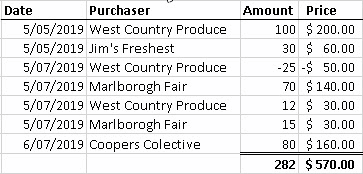

关于示例，有几件事情需要指出。购买者信息是单独写在不同的行上，而不是删除它们的金额并输入新的金额。考虑两个购买和一个对西乡村产品的信用。这通常与许多数据库不同，在许多数据库中，一个单独的行包含购买者信息，有单独的字段用于金额和价格。

账簿式数据库通过为每笔交易保留单独的行来采用这个概念，从而消除了`UPDATE`和`DELETE`语句，并且只依赖于`INSERT`语句。这有几个好处。类似于账簿，一旦每笔交易被写入，就不能被删除或更改。如果发生错误或更改，例如对西乡村产品的贷方，就需要写入一笔新的交易，以便达到期望的状态。这个有趣的好处是，源表现在立即具有提供详细活动日志的价值。如果我们添加一个*修改者*列，我们就可以有一个全面的日志，记录谁或什么导致了更改以及更改的内容。

这个例子是一个单条目账簿，但在现实世界中，会使用双条目账簿。区别在于在双条目账簿中，每一笔交易都记录在一个表中的贷方和另一个表中的借方。

下一个挑战是捕获表的最终或汇总版本。在这个例子中，就是购买了多少苹果以及价格。第一种方法可以使用一个`SELECT`语句，简单地根据购买者执行`GROUP BY`，如下所示：

```cs
SELECT Purchaser, SUM(Amount), SUM(Price)
FROM Apples
GROUP BY Purchaser
```

虽然这对于较小的数据量来说是可行的，但问题是随着行数的增加，查询的性能会随着时间的推移而下降。一个替代方案是将数据聚合成另一种形式。主要有两种实现方式。第一种是在将信息从账本表写入另一个表（或支持的持久视图）时同时执行此活动，该表以聚合形式存储数据。

**持久**或**物化视图**类似于数据库视图，但视图的结果被缓存。这使我们无需在每次请求时重新计算视图，并且视图要么定期刷新，要么在底层数据更改时刷新。

第二种方法依赖于一种与`INSERT`语句不同的机制，在需要时检索聚合视图。在某些系统中，将更改写入表并检索结果的主要场景执行得较少。在这种情况下，优化数据库以使写入速度比读取速度快，因此当新记录插入时，可以限制所需的处理量。

下一个部分将处理一个有趣的 CQRS 模式，该模式可以在数据库级别应用。这可以用于账本式数据库设计。

# 实现 CQRS 模式

CQRS 简单地基于查询（读取）和命令（修改）之间的分离。**命令-查询分离**（**CQS**）是**面向对象设计**（**OOD**）的一种方法。

CQRS 首次由 Bertrand Meyer 提出（[`en.wikipedia.org/wiki/Bertrand_Meyer`](https://en.wikipedia.org/wiki/Bertrand_Meyer)）。他在 1980 年代末在其著作《面向对象软件构造》中提到了这个术语：[`www.amazon.in/Object-Oriented-Software-Construction-Prentice-hall-International/dp/0136291554`](https://www.amazon.in/Object-Oriented-Software-Construction-Prentice-hall-International/dp/0136291554)。

CQRS 与某些场景非常契合，并且具有一些有用的因素：

+   **模型分离**：在建模术语中，我们能够为我们的数据模型拥有多个表示形式。这种清晰的分离允许我们选择比其他更适合查询或命令的框架或技术。可以说，这可以通过**创建、读取、更新和删除**（**CRUD**）-风格的实体来实现，尽管通常会出现单一数据层组装。

+   **协作**：在某些企业中，查询和命令之间的分离将有利于参与构建复杂系统的团队，尤其是当某些团队更适合实体的不同方面时。例如，一个更关注展示的团队可以专注于查询模型，而另一个更专注于数据完整性的团队可以维护命令模型。

+   **独立可伸缩性**：许多解决方案倾向于根据业务需求，要么需要更多的模型读操作，要么需要更多的写操作。

对于 CQRS，请记住，命令更新数据，查询读取数据。

在处理 CQRS 时需要注意的一些重要事项如下：

+   命令应该异步放置，而不是作为同步操作。

+   永远不要用查询修改数据库。

CQRS 通过使用单独的命令和查询简化了设计。此外，我们可以物理上分离读数据和写数据操作。在这种安排中，读数据库可以使用单独的数据库模式，或者换句话说，我们可以称它为使用针对查询优化的只读数据库。

由于数据库使用物理分离方法，我们可以可视化应用 CQRS 流程，如下面的图所示：

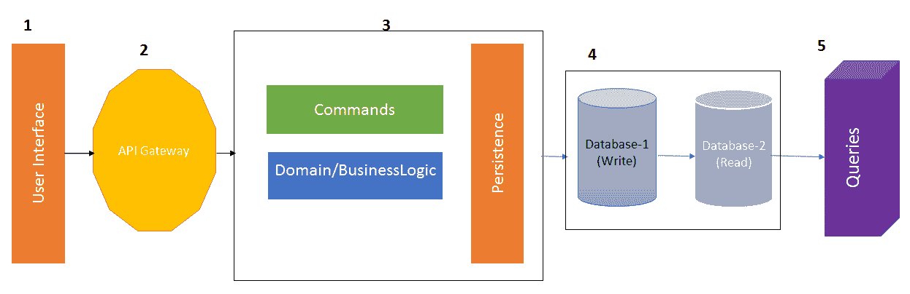

以下图展示了 CQRS 应用的虚构工作流程，其中应用在物理上分别有用于写操作和读操作的数据库。这个虚构的应用基于 RESTful Web 服务（.NET Core API）。没有 API 直接暴露给使用这些 API 的客户端/最终用户。有一个 API 网关暴露给用户，任何对应用的请求都将通过 API 网关。

API 网关为具有相似类型服务的组提供了一个入口点。您也可以使用分布式系统的一部分外观模式来模拟它。

在之前的图中，我们有以下内容：

+   **用户界面**：这可以是任何客户端（使用 API 的客户端），Web 应用，桌面应用，移动应用或任何其他应用。

+   **API 网关**：所有来自 UI 和响应到 UI 的请求都由 API 网关传递。这是 CQRS 的主要部分，因为可以通过使用命令和持久层来集成业务逻辑。

+   **数据库（s）**：该图显示了两个物理上分离的数据库。在实际应用中，这取决于产品的需求，你可以使用数据库进行写操作和读操作。

+   查询是通过`Read`操作生成的，这些操作是**数据传输对象**（**DTOs**）。

您现在可以回到*用例*部分，其中我们讨论了我们的 FlixOne 库存应用的新功能/扩展。在本节中，我们将使用 CQRS 模式创建一个具有先前讨论的功能的新 FlixOne 应用。请注意，我们将首先开发 API。如果您没有安装先决条件，我建议重新查看*技术要求*部分，收集所有必需的软件，并将它们安装到您的机器上。如果您已完成先决条件，那么让我们按照以下步骤开始：

1.  打开 Visual Studio。

1.  点击文件 | 新建项目以创建一个新的项目。

1.  在新建项目窗口中，选择 Web，然后选择 ASP.NET Core Web 应用。

1.  给您的项目起一个名字。我已将我们的项目命名为 `FlixOne.API` 并确保解决方案名称为 `FlixOne`。

1.  选择您的 `解决方案` 文件夹的位置，然后单击以下截图所示的 OK 按钮：

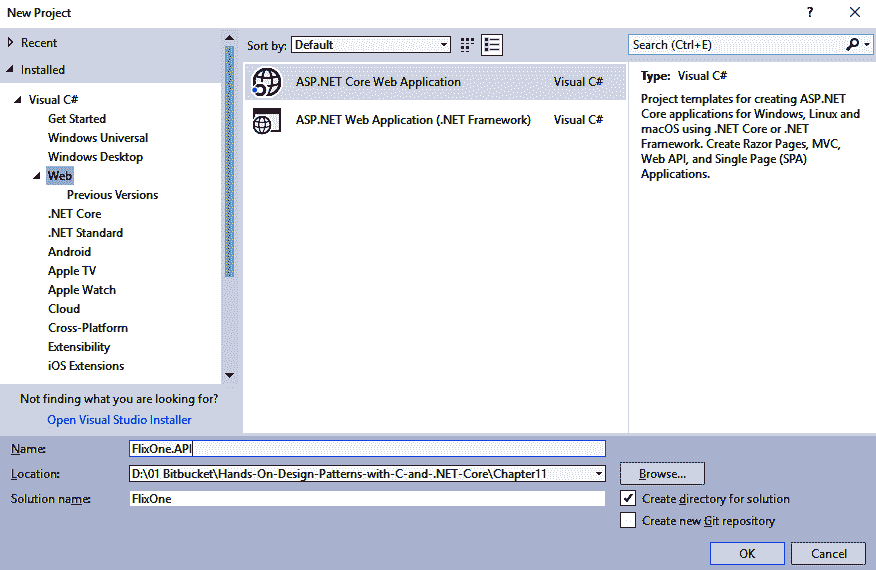

1.  现在，您应该在新 ASP.NET Web 核心应用程序 - FlixOne.API 界面上。确保在此界面上，您选择 ASP.NET Core 2.2。从可用的模板中选择 Web 应用程序（模型-视图-控制器），并取消选中配置 HTTPS 复选框，如以下截图所示：

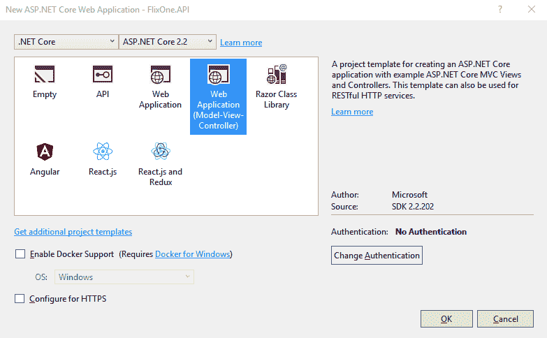

1.  您将看到一个默认页面出现，如以下截图所示：

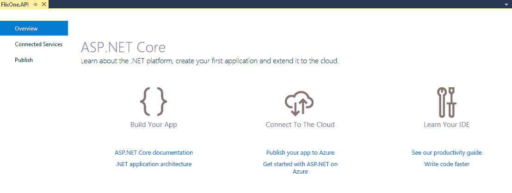

1.  展开解决方案资源管理器并单击显示所有文件。您将看到 Visual Studio 创建的默认文件夹/文件。参考以下截图：

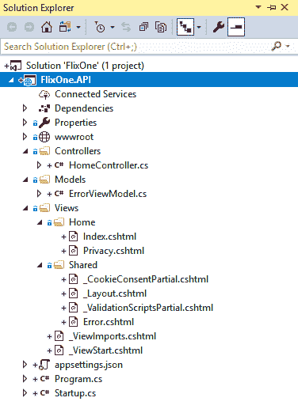

我们选择了 ASP.NET Core Web (模型-视图-控制器) 模板。因此，我们有默认的文件夹，控制器、模型和视图。这是一个 Visual Studio 提供的默认模板。要检查此默认模板，按 *F5* 运行项目。然后，您将看到以下默认页面：

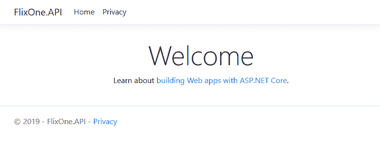

上述截图是我们 Web 应用程序的默认主页。您可能会想 *这是一个网站吗？* 并期望在这里看到 API 文档页面而不是网页。这是因为，当我们选择模板时，Visual Studio 默认添加 MVC 控制器而不是 API 控制器。请注意，在 ASP.NET Core 中，MVC 控制器和 API 控制器使用相同的控制器管道（请参阅控制器类：[`docs.microsoft.com/en-us/dotnet/api/microsoft.aspnetcore.mvc.controller?view=aspnetcore-2.2`](https://docs.microsoft.com/en-us/dotnet/api/microsoft.aspnetcore.mvc.controller?view=aspnetcore-2.2)）。

在详细讨论 API 项目之前，让我们首先向我们的 FlixOne 解决方案添加一个新的项目。为此，展开解决方案资源管理器，右键单击解决方案名称，然后单击添加新项目。参考以下截图：

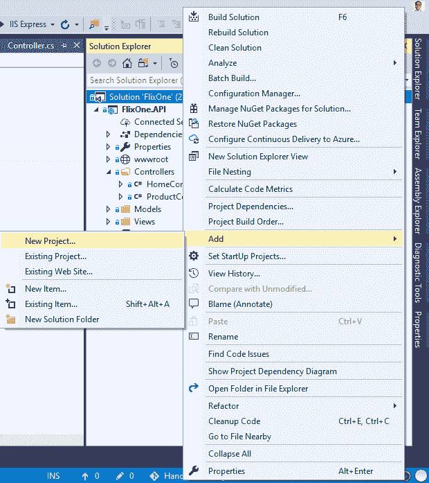

在新项目窗口中，添加新的 `FlixOne.CQRS` 项目，然后单击 `OK` 按钮。参考以下截图：

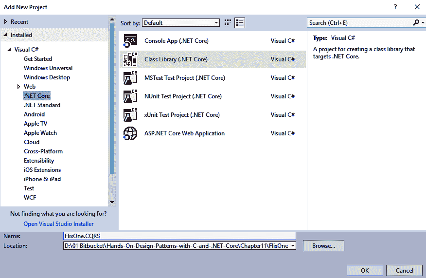

上述截图是新项目窗口。在它上面，选择 .NET Core，然后选择类库(.NET Core)项目。输入名称 `FlixOne.CQRS` 并单击 OK 按钮。已将新项目添加到解决方案中。然后您可以为新解决方案添加文件夹，如以下截图所示：

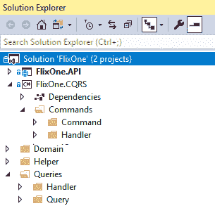

之前的截图显示我已经添加了四个新文件夹：`Commands`、`Queries`、`Domain`和`Helper`。在`Commands`文件夹中，我有`Command`和`Handler`子文件夹。同样，对于`Queries`文件夹，我添加了名为`Handler`和`Query`的子文件夹。

要开始项目，让我们首先在项目中添加两个域实体。以下是需要使用的代码：

```cs
public class Product
{
    public Guid Id { get; set; }
    public string Name { get; set; }
    public string Description { get; set; }
    public string Image { get; set; }
    public decimal Price { get; set; }
}
```

上述代码是一个具有以下属性的`Product`域实体：

+   `Id`: 唯一标识符

+   `Name`: 产品名称

+   `Description`: 产品描述

+   `Image`: 产品图片

+   `Price`: 产品价格

我们还需要添加`CommandResponse`数据库。当与数据库/存储库交互时，它起着重要作用，确保系统得到响应。以下是从`CommandResponse`实体模型的代码片段：

```cs
public class CommandResponse
{
    public Guid Id { get; set; }
    public bool Success { get; set; }
    public string Message { get; set; }

}
```

上述`CommandResponse`类包含以下属性：

+   `Id`: 唯一标识符。

+   `Success`: 值为`True`或`False`，告诉我们操作是否成功。

+   `Message`: 作为操作响应的消息。如果`Success`为假，则此消息包含`Error`。

现在，是时候为查询添加接口了。要添加接口，请按照以下步骤操作：

1.  从“解决方案资源管理器”中，右键单击`Queries`文件夹，点击“添加”，然后点击“新建项”，如下截图所示：

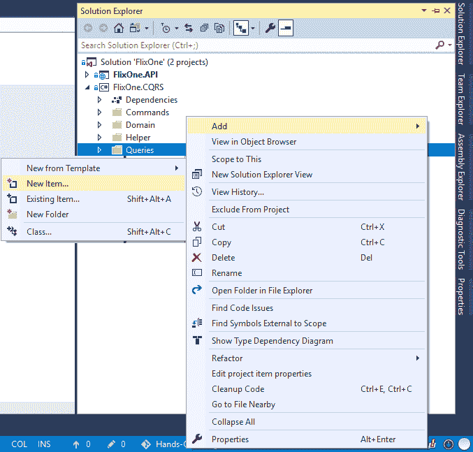

1.  从“添加新项”窗口中选择接口，命名为 IQuery，然后点击“添加”按钮：

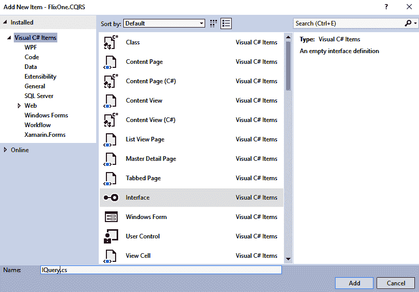

1.  按照前面的步骤操作，并添加`IQueryHandler`接口。以下是从`IQuery`接口的代码：

```cs
public interface IQuery<out TResponse>
{
}
```

1.  之前的接口作为查询任何类型操作的骨架。这是一个使用`TResponse`类型的`out`参数的通用接口。

以下是我们`ProductQuery`类的代码：

```cs
public class ProductQuery : IQuery<IEnumerable<Product>>
{
}

public class SingleProductQuery : IQuery<Product>
{
    public SingleProductQuery(Guid id)
    {
        Id = id;
    }

    public Guid Id { get; }

}
```

以下是我们`ProductQueryHandler`类的代码：

```cs
public class ProductQueryHandler : IQueryHandler<ProductQuery, IEnumerable<Product>>
{
    public IEnumerable<Product> Get()
    {
        //call repository
        throw new NotImplementedException();
    }
}
public class SingleProductQueryHandler : IQueryHandler<SingleProductQuery, Product>
{
    private SingleProductQuery _productQuery;
    public SingleProductQueryHandler(SingleProductQuery productQuery)
    {
        _productQuery = productQuery;
    }

    public Product Get()
    {
        //call repository
        throw new NotImplementedException();
    }
}
```

以下是我们`ProductQueryHandlerFactory`类的代码：

```cs
public static class ProductQueryHandlerFactory
{
    public static IQueryHandler<ProductQuery, IEnumerable<Product>> Build(ProductQuery productQuery)
    {
        return new ProductQueryHandler();
    }

    public static IQueryHandler<SingleProductQuery, Product> Build(SingleProductQuery singleProductQuery)
    {
        return  new SingleProductQueryHandler(singleProductQuery);
    }
}
```

类似于`Query`接口和`Query`类，我们需要为命令及其类添加接口。

在我们为产品域实体创建 CQRS 之后，你可以遵循此工作流程并多次添加更多实体。现在，让我们继续我们的`FlixOne.API`项目，并按照以下步骤添加一个新的 API 控制器：

1.  从“解决方案资源管理器”中，右键单击`Controllers`文件夹。

1.  选择“添加 | 新项”。

1.  选择 API 控制器类，命名为`ProductController`；参考以下截图：

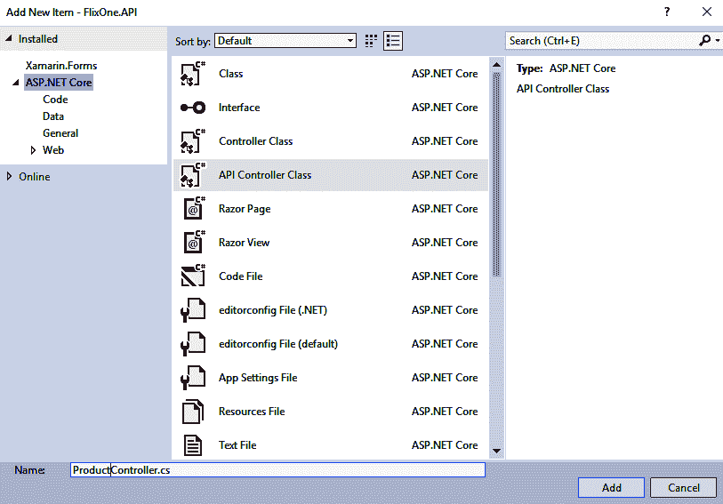

1.  在 API 控制器中添加以下代码：

```cs
[Route("api/[controller]")]
public class ProductController : Controller
{
    // GET: api/<controller>
    [HttpGet]
    public IEnumerable<Product> Get()
    {
        var query = new ProductQuery();
        var handler = ProductQueryHandlerFactory.Build(query);
        return handler.Get();
    }

    // GET api/<controller>/5
    [HttpGet("{id}")]
    public Product Get(string id)
    {
        var query = new SingleProductQuery(id.ToValidGuid());
        var handler = ProductQueryHandlerFactory.Build(query);
        return handler.Get();
    }
```

以下代码用于保存产品：

```cs

    // POST api/<controller>
    [HttpPost]
    public IActionResult Post([FromBody] Product product)
    {
        var command = new SaveProductCommand(product);
        var handler = ProductCommandHandlerFactory.Build(command);
        var response = handler.Execute();
        if (!response.Success) return StatusCode(500, response);
        product.Id = response.Id;
        return Ok(product);

    }
```

以下代码用于删除产品：

```cs

    // DELETE api/<controller>/5
    [HttpDelete("{id}")]
    public IActionResult Delete(string id)
    {
        var command = new DeleteProductCommand(id.ToValidGuid());
        var handler = ProductCommandHandlerFactory.Build(command);
        var response = handler.Execute();
        if (!response.Success) return StatusCode(500, response);
        return Ok(response);
    }

```

我们已经创建了产品 API，我们不会在本节中创建 UI。要查看我们所做的工作，我们将向我们的 API 项目添加**Swagger**支持。

Swagger 是一个可用于文档的工具，它在一个屏幕上提供了有关 API 端点的所有信息，您可以通过设置参数来可视化 API 并进行测试。

要开始在我们的 API 项目中实现 Swagger，请按照以下步骤操作：

1.  打开 Nuget 包管理器。

1.  前往 Nuget 包管理器 | 浏览并搜索`Swashbuckle.ASPNETCore`；参考以下截图：

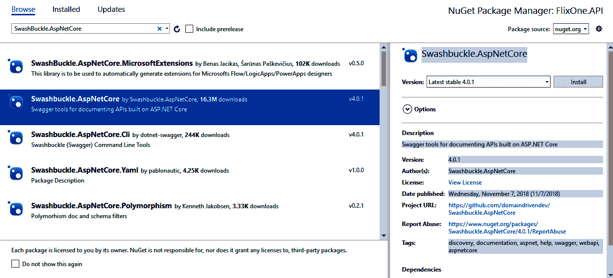

1.  打开`Startup.cs`文件，并将以下代码添加到`ConfigureService`方法中：

```cs
//Register Swagger
            services.AddSwaggerGen(swagger =>
            {
                swagger.SwaggerDoc("v1", new Info { Title = "Product APIs", Version = "v1" });
            });
```

1.  现在，将以下代码添加到`Configure`方法中：

```cs
// Enable middleware to serve generated Swagger as a JSON endpoint.
app.UseSwagger();

// Enable middleware to serve swagger-ui (HTML, JS, CSS, etc.), specifying the Swagger JSON endpoint.
app.UseSwaggerUI(c =>
{
    c.SwaggerEndpoint("/swagger/v1/swagger.json", "Product API V1");
});
```

我们现在已经完成了所有旨在展示 CQRS 在应用程序中强大功能的更改。在 Visual Studio 中按*F5*键，并通过访问以下 URL 打开 Swagger 文档页面：[`localhost:52932/swagger/`](http://localhost:52932/swagger/)（请注意，端口号`52932`可能会根据您的项目设置而有所不同）。您将看到以下 Swagger 文档页面：

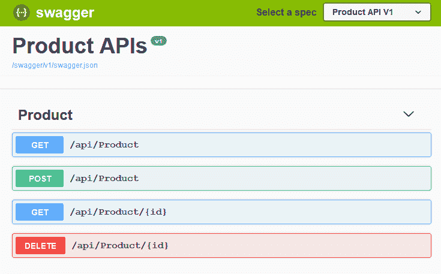

在这里，您可以测试产品 API。

# 摘要

本章介绍了 CQRS 模式，然后我们将该模式实现到了我们的应用程序中。本章的目标是介绍数据库技术，并探讨账本式数据库在库存系统中的应用。为了展示 CQRS 的强大功能，我们创建了产品 API，并增加了对 Swagger 文档的支持。

在下一章中，我们将讨论云服务，并详细探讨微服务和无服务器技术。

# 问题

以下问题将帮助您巩固本章包含的信息：

1.  什么是账本式数据库？

1.  什么是 CQRS？

1.  我们应该在什么情况下使用 CQRS？
