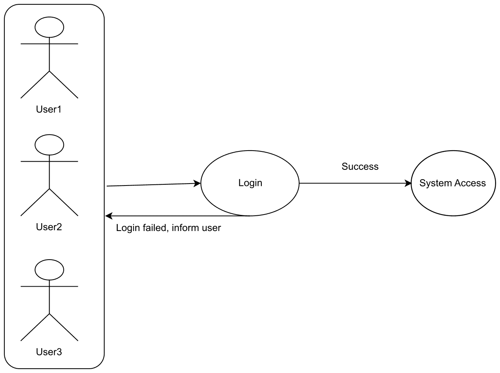

# 第十三章：其他最佳实践

到目前为止，本书已讨论了各种模式、风格和代码。在这次讨论中，我们的目标是理解编写整洁、干净和健壮代码的模式和实践。本附录将主要关注实践。在遵守任何规则或任何类型的编码风格时，实践非常重要。作为一名开发者，你应该每天练习编码。根据古老的谚语，“熟能生巧”。

这通过以下事实得到体现，即像玩游戏、开车、阅读或写作这样的技能并不是立刻就能掌握的。相反，我们应该通过时间和实践来完善这些技能。例如，当你开始开车时，你应该慢慢开始。在那里，你需要记住何时踩离合器，何时踩刹车，需要将方向盘转多远，等等。然而，一旦司机对驾驶非常熟悉，就无需记住这些步骤；它们会自然而然地出现。这是因为练习。

在本附录中，我们将涵盖以下主题：

+   用例讨论

+   最佳实践

+   其他设计模式

# 技术要求

本附录包含各种代码示例，以解释涵盖的概念。代码保持简单，仅用于演示目的。本章中的大多数示例都涉及用 C#编写的.NET Core 控制台应用程序。

要运行和执行代码，有以下先决条件：

+   Visual Studio 2019（然而，您也可以使用 Visual Studio 2017 运行应用程序）

# Visual Studio 的安装

要运行本章包含的代码示例，您需要安装 Visual Studio 或更高版本。为此，请按照以下说明操作：

1.  从以下下载链接下载 Visual Studio：[`docs.microsoft.com/en-us/visualstudio/install/install-visual-studio`](https://docs.microsoft.com/en-us/visualstudio/install/install-visual-studio)。

1.  按照安装说明操作。

1.  Visual Studio 有多种版本可供选择。我们正在使用 Windows 版本的 Visual Studio。

本章的示例代码文件可在以下链接中找到：[`github.com/PacktPublishing/Hands-On-Design-Patterns-with-C-and-.NET-Core/tree/master/Appendix`](https://github.com/PacktPublishing/Hands-On-Design-Patterns-with-C-and-.NET-Core/tree/master/Appendix)。

# 用例讨论

简而言之，用例是一个预先创建或象征性的业务场景表示。例如，我们可以用图示/象征性的方式表示我们的登录页面用例。在我们的例子中，用户正在尝试登录系统。如果登录成功，他们可以进入系统。如果失败，系统会通知用户登录尝试失败。请参考以下**登录**用例的图示：



在前面的图中，用户**User1**、**User2**和**User3**正在尝试使用应用程序的登录功能进入系统。如果登录尝试成功，用户可以访问系统。如果不成功，应用程序会通知用户登录失败，用户无法访问系统。前面的图比我们实际冗长的描述要清晰得多，我们在描述这个图。该图也是自我解释的。

# UML 图

在上一节中，我们通过符号表示讨论了登录功能。您可能已经注意到了图中使用的符号。前面图中使用的记法或符号是统一建模语言（Unified Modeling Language）的一部分。这是一种可视化我们的程序、软件甚至类的方法。

UML 中使用的符号或记法是源于 Grady Booch、James Rumbaugh、Ivar Jacobson 和 Rational Software Corporation 的工作。

# UML 图的类型

这些图分为两大类：

+   **结构化 UML 图**: 这些图强调在所建模的系统中的必须存在的元素。这一组图进一步分为以下不同类型的图：

    +   类图

    +   包图

    +   对象图

    +   组件图

    +   组合结构图

    +   部署图

+   **行为 UML 图**: 这些图用于展示系统的功能，包括用例图、序列图、协作图、状态机图和活动图。这一组图进一步分为以下不同类型的图：

    +   活动图

    +   序列图

    +   用例图

    +   状态图

    +   通信图

    +   交互概览图

    +   时序图

# 最佳实践

正如我们已经建立的，练习是一种发生在我们日常活动中的习惯。在软件工程中——在这里软件是设计而不是制造——我们必须练习才能编写高质量的代码。可能还有更多解释软件工程中涉及的最佳实践的观点。让我们来讨论它们：

+   **简洁但简化的代码**: 这是一个非常基础的事情，确实需要练习。开发者应该每天使用简洁但简化的代码来编写简洁的代码，并在日常生活中坚持这一实践。代码应该是干净的，不应该重复。关于代码整洁和代码简化在之前的章节中已有介绍；如果您错过了这个主题，请回顾第二章，*现代软件开发模式和原则*。请看以下简洁代码的例子：

```cs
public class Math
{
    public int Add(int a, int b) => a + b;
    public float Add(float a, float b) => a + b;
    public decimal Add(decimal a, decimal b) => a + b;
}
```

之前的代码片段包含一个具有三个`Add`方法的`Math`类。这些方法被编写来计算两个整数和两个浮点数及十进制数的和。`Add(float a, float b)`和`Add(decimal a, decimal b)`方法是`Add(int a, int b)`的重载方法。之前的代码示例代表了一个要求实现一个方法，该方法可以输出 int、float 或 decimal 数据类型的场景。

+   **单元测试**：当我们通过编写代码来测试我们的代码时，这是开发的一个基本部分。**测试驱动开发**（**TDD**）是应该遵循的最佳实践之一。我们在第七章，“实现 Web 应用程序的设计模式 - 第二部分”中讨论了 TDD。

+   **代码一致性**：如今，开发者独自工作的机会非常罕见。开发者大多在团队中工作，这意味着在整个团队中保持代码一致性非常重要。代码一致性可以指代码风格。有一些推荐的实践和编码约定，开发者在编写程序时应经常使用。

声明变量的方式有很多。以下是变量声明的一个最佳示例：

```cs
namespace Implement
{
    public class Consume
    {
        BestPractices.Math math = new BestPractices.Math();
    }
}
```

在之前的代码中，我们已经声明了一个`math`变量，其类型为`BestPractices.Math`。在这里，`BestPractices`是我们的命名空间，`Math`是类。如果我们不在代码中使用`using`指令，那么使用完全命名空间限定的变量是一种良好的实践。

C#语言的官方文档对这些约定描述得非常详细。您可以通过以下链接参考它们：[`docs.microsoft.com/en-us/dotnet/csharp/programming-guide/inside-a-program/coding-conventions`](https://docs.microsoft.com/en-us/dotnet/csharp/programming-guide/inside-a-program/coding-conventions)。

+   **代码审查**：犯错误是人类的天性，这在开发中也会发生。代码审查是实践编写无错误代码和揭示代码中不可预测错误的第一步。

# 其他设计模式

到目前为止，我们已经涵盖了各种设计模式和原则，包括编写代码的最佳实践。本节将总结以下模式，并指导您编写高质量和健壮的代码。这些模式的详细内容和实现超出了本书的范围。

我们已经涵盖了以下模式：

+   GoF 模式

+   设计原则

+   软件开发生命周期模式

+   测试驱动开发

在本书中，我们涵盖了众多主题，并开发了一个示例应用程序（控制台和 Web）。这并不是世界的尽头，世界上还有更多东西要学习。

我们可以列出更多模式：

+   **基于空间的架构模式**：**基于空间的模式**（**SBP**s）是通过最小化限制应用程序扩展的因素来帮助应用程序可扩展性的模式。这些模式也被称为**云架构模式**。我们在第十二章，*为云编码*中讨论了许多这样的模式。

+   **消息模式**：这些模式用于根据消息（以数据包的形式发送）连接两个应用程序。这些数据包或消息通过一个逻辑路径进行传输，各种应用程序通过这个逻辑路径连接（这些逻辑路径被称为通道）。可能存在一种情况，其中一个应用程序有多个消息；在这种情况下，不是所有消息都可以一次性发送。在存在多个消息的情况下，一个通道可以被称为队列，多个消息可以在通道中排队，并且可以在同一时间从不同的应用程序访问。

+   **领域驱动设计（Domain-Driven Design）的附加模式—分层架构**：这描绘了关注点的分离，其中分层架构的概念就出现了。幕后，开发应用程序的基本想法是将其结构化为概念层。一般来说，应用程序有四个概念层：

    +   **用户界面层**：这一层包含了所有终端用户交互的部分，这一层接受命令并相应地提供信息。

    +   **应用层**：这一层更偏向于事务管理、数据转换等。

    +   **领域层**：这一层坚持领域的行为和状态。

    +   **基础设施层**：所有与存储库、适配器和框架相关的事情都发生在这里。

+   **容器化应用程序模式**：在我们深入探讨之前，我们应该知道什么是容器。容器是一种轻量级、可移植的软件；它定义了软件可以运行的环境。通常，运行在容器内的软件被设计为单用途应用程序。对于容器化应用程序来说，最重要的模式如下：

    +   **Docker 镜像构建模式**：这个模式基于 GoF 设计模式中的 Builder 模式，我们在第三章，*实现设计模式-基础部分 1*中讨论过。它只描述了设置，以便它可以用来构建容器。除此之外，还有一个多阶段镜像构建模式，它提供了一种从单个 Dockerfile 构建多个镜像的方法。

# 摘要

本附录的目的是强调实践的重要性。在本章中，我们讨论了如何提升我们的技能。一旦我们掌握了这些技能，就无需记住完成特定任务的具体步骤。我们讨论了来自现实世界的几个用例，讨论了我们日常代码中的最佳实践，以及其他可以在日常实践中使用的设计模式来提升我们的技能。最后，我们总结了这本书的最后一章，并了解到通过实践和适应各种模式，开发者可以提高他们的代码质量。

# 问题

以下问题将帮助你巩固本附录中包含的信息：

1.  什么是实践？从我们的日常和生活中举几个例子。

1.  我们可以通过实践获得特定的编码技能。解释这一点。

1.  测试驱动开发是什么，以及它是如何帮助开发者进行实践的吗？

# 进一步阅读

我们几乎到达了这本书的结尾！在本附录中，我们涵盖了许多与实际操作相关的内容。这并不是学习的终点，而只是一个开始，你还可以参考更多书籍来学习和获取知识：

+   *《.NET Core 动手实践领域驱动设计》*，由*Alexey Zimarev*著，由*Packt Publishing*出版：[`www.packtpub.com/in/application-development/hands-domain-driven-design-net-core`](https://www.packtpub.com/in/application-development/hands-domain-driven-design-net-core)。

+   *《C#和.NET Core 测试驱动开发》*，由*Ayobami Adewole*著，由*Packt Publishing*出版：[`www.packtpub.com/in/application-development/c-and-net-core-test-driven-development`](https://www.packtpub.com/in/application-development/c-and-net-core-test-driven-development)。

+   *《架构模式》*，由*Pethuru Raj, Harihara Subramanian, 等人*著，由*Packt Publishing*出版：[`www.packtpub.com/in/application-development/architectural-patterns`](https://www.packtpub.com/in/application-development/architectural-patterns)。

+   *《并发模式和最佳实践》*，由*Atul S. Khot*著，由*Packt Publishing*出版：[`www.packtpub.com/in/application-development/concurrent-patterns-and-best-practices`](https://www.packtpub.com/in/application-development/concurrent-patterns-and-best-practices)。
