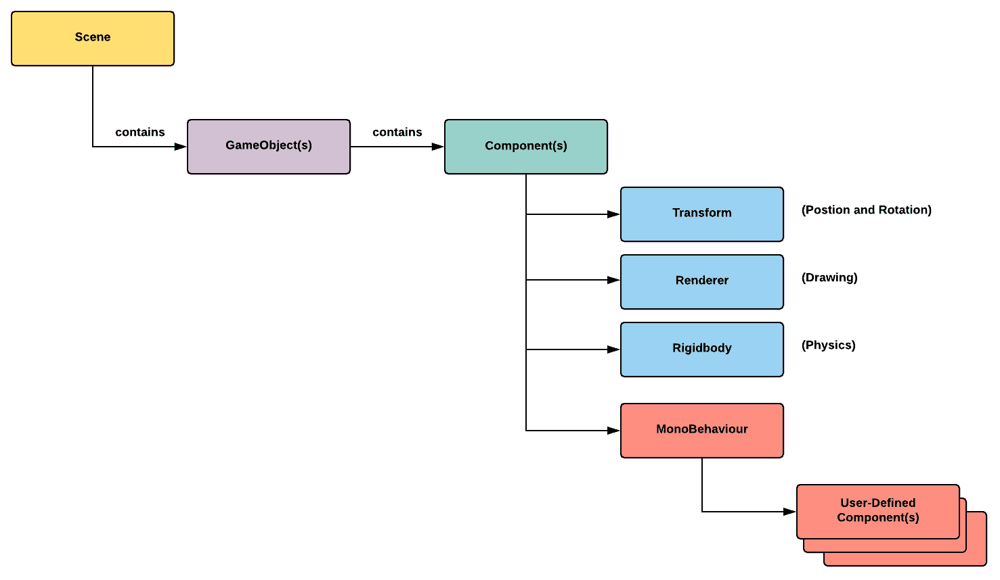
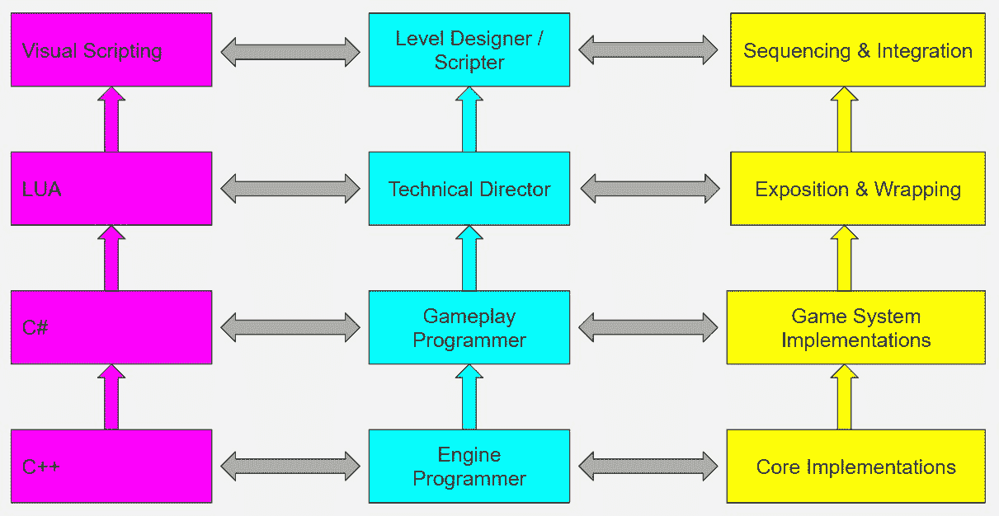

# Unity 引擎架构

我们即将开始一段旅程，这段旅程将教会我们如何在 Unity 引擎的开发环境中使用软件设计模式。本书采用非常实践的方法来学习和应用设计模式。我们将避免陷入模式的学术定义中，而是专注于使用 Unity 的 API 在真正的游戏开发用例中实现它们。对于那些想要深入研究特定模式的理论的人，在每一章的结尾，都会有进一步阅读材料的参考。

但最重要的注意事项是，这本书的重点是简洁而非复杂。这意味着代码示例和用例被设计得尽可能简单，这样我们就可以专注于模式的基本要素，同时避免陷入复杂的实现中。作为读者，我鼓励你获取每一章的源代码，对其进行扩展，然后使其成为你自己的。

然而，在深入一个新游戏引擎并开始使用其 API 进行编码之前，理解其架构是至关重要的。因此，在本章中，我们将回顾 Unity 引擎的核心工程支柱。但首先，对于那些对游戏开发还不太熟悉的人来说，我们将快速讨论大多数游戏引擎共有的核心组件以及它们如何影响我们编写游戏代码的方式。

本章将涵盖以下主题：

+   引擎架构

+   Unity 的组件系统

+   Unity 的脚本 API

# 引擎架构

在本节中，我们将回顾游戏引擎背后的基本原理。当然，本书的重点不是掌握引擎架构。尽管如此，在用这个引擎制作游戏之前花时间熟悉其核心架构是明智的。我们不希望后来被那些会破坏我们的设计选择的技术细节所困扰。

# 什么是游戏引擎？

游戏引擎是推动游戏行业前进的动力，Unity 是这一点的最佳例证。自从其发布以来，游戏工作室的数量以指数级增长。Unity 通过为业余爱好者和专业人士 alike 提供可扩展的开发环境，使制作视频游戏的过程民主化。

但对于那些不熟悉游戏引擎的概念，甚至不知道为什么它们被称为引擎的人来说，我有一个简单的方法来描述它们。看看你汽车的引擎盖下，你看到了什么？电缆、过滤器、管道、电池和齿轮连接在一起，但协同工作以运行车辆。游戏引擎与汽车引擎的概念非常相似，但不同的是，它不是由金属和橡胶制成的，而是纯软件。如果你查看所谓的“引擎盖”，即任何现代游戏引擎的代码库，你将看到数百个系统、工具和组件相互连接并协同工作。

因此，如果你计划制作一款视频游戏，你必须做出的最关键决定是选择哪个引擎，因为这将运行你的游戏。这个单一的选择将影响你生产的各个方面。每个部门都需要调整和改变他们的管道和工作流程。许多游戏因为引擎技术选择不当而被取消或最终成为充满 bug 的灾难。

这也是 Unity 变得如此受欢迎的原因之一，正如其名字所暗示的，它是一个具有统一游戏行业核心意图的引擎。你可以找到 Unity 被用来构建从愤怒的小鸟克隆到史诗般的**日本角色扮演游戏**（**JRPGs**）的游戏；换句话说，它是跨类型的。通过结合行业中的最佳实践并将它们整合到一个独特但直观的开发环境中，Unity 使其引擎成为行业的基石。

请注意，Unity 是一个闭源代码库。只有 Unity 的合作伙伴才能直接访问引擎的源代码。因此，当我们谈论 Unity 架构的内部运作时，会有一定程度的推测。这就是为什么我们将本章保持在一个非常高级的水平，并没有深入到具体规格。

# Unity 的架构

现在是时候处理我们的主要主题了，Unity 及其核心引擎架构支柱。我们必须牢记的一点是，Unity 是一个闭源引擎；这意味着我们必须从其官方文档中推断出我们对它整体架构的心理模型。为了避免深入 Unity 设计中的灰色区域，这些区域难以验证，我们将专注于对我们来说最明显和最有用的支柱。以下是我们需要了解的两个主要核心引擎架构支柱：

+   组件

+   脚本 API

# 组件

Unity 是一个以组件驱动的引擎，我们正是通过组件的组合来构建我们的游戏。如果我们分析以下图表，我们可以看到存在一个高级层次结构，实体包含其他实体。这个结构的基本元素是组件；它们是游戏的基本构建块：



一种可视化这种架构的简单方法是考虑一个**场景**是一组 GameObject，而 GameObject 是一组可以实现和包含以下内容的组件：

+   系统（摄像头和物理）

+   数据（配置、动画和纹理）

+   行为（游戏机制和脚本事件）

因此，通过这种方法，我们只需更改它所持有的组件，就可以快速将一个表现像摄像机的 GameObject 转换成一个动画角色。这意味着 GameObject 是由组件组成的，并且，根据我们附加到 GameObject 的组件类型，它将将其转换成特定类型的实体，如摄像机、动画角色或粒子。因此，这是一种非常直接和模块化的构建游戏的方法。

在下一节中，我们将回顾 Unity 提供的 API，它允许我们编写这些各种组件。

# 脚本 API

Unity 的原始设计者明白，如果他们想要制作一个可以被不同技能水平的开发者使用的引擎，他们需要设计一个易于使用但足够灵活的编程环境，以便制作任何类型的游戏。他们通过封装和暴露引擎的核心功能和库，通过一个受管理的脚本 API 实现了这一点。这意味着 Unity 开发者可以专注于编写代码，而无需担心内存管理的复杂性或引擎内部的工作原理。

这种方法甚至在 AAA 内部引擎中也很常见。引擎的核心组件通常使用低级编程语言，如 C++和汇编语言编写，因为需要对内存和处理使用进行精确控制。但负责实现游戏内系统，如 AI 行为或游戏机制的程序员，可以在引擎架构的更高层进行编码。因此，引擎程序员通常会向游戏程序员公开一个 API 或库，以便他们在安全和受控的环境中实现游戏内组件。

游戏程序员通常会通过一种简单的脚本语言，如 LUA，实现另一层抽象，这样设计师就可以在不了解如何编码的情况下编写脚本。一些引擎甚至通过实现一个可视化的脚本环境来进一步简化这种简化方法；一个很好的例子是 Unreal 的蓝图系统。

所有这些抽象层的目标是使构建游戏的过程对各种专业水平的开发者更加容易接近，同时保护引擎免受因代码实现不当而崩溃的影响。换句话说，我们希望避免设计师因为编写了一个在场景中一次性生成一千个敌人角色的脚本而导致引擎崩溃，从而引发内存不足异常。因此，我们希望确保我们提供给使用我们引擎的内容创作者的 API 或脚本库能够帮助他们避免引发可能影响开发环境整体稳定性的关键错误。

下面的图展示了典型 AAA 游戏开发团队的架构层次和责任链。随着我们向上移动链，技术细节变得更加抽象，对内容创作的关注级别更高：



这样做的目的是控制对引擎有限资源的访问，同时向最终用户（通常是设计师和艺术家）暴露核心功能。因此，Unity 的脚本 API 具有类似的目的；其目标是向最终用户（在这种情况下，是开发者）暴露 Unity 的核心功能，同时保护引擎的内部运作。

因此，脚本 API 和组件系统的结合为 Unity 提供了一个非常简单但强大的编码模型。您可以通过以下代码示例看到实现 GameObject 组件引用并调用其`public`方法是多么容易：

```cs
using UnityEngine;

public class PlayerCharacter : MonoBehaviour
{
    public float m_Range = 10.0f;
    public float m_Damage = 12.0f;

    private Weapon m_Weapon;
    private Inventory m_Inventory;

    void Awake()
    {
        m_Weapon = GetComponent<Weapon>();
        m_Inventory = GetComponent<Inventory>();
    }

    void Start ()
    {
        m_Inventory.Loadout("default");
    }

    void Update()
    {
        if (Input.GetKeyDown(KeyCode.UpArrow))
        {
            m_Inventory.EquipNextWeapon();
        }

        if (Input.GetKeyDown(KeyCode.Return))
        {
            m_Weapon.Shoot(m_Range, m_Damage);
        }
    }
}
```

这种编程游戏的方法简单直接，但也很强大。在这本书中，我们将利用 Unity 的 API 和以组件驱动的架构的灵活性，同时应用经典和现代的软件设计模式，使我们的代码更加健壮。我们的最终目标是构建一套适应 Unity 独特编码模型的模式工具包，以便我们可以用健壮的架构开发游戏。

对于每个行业标准模式或最佳实践，都可能存在相应的反模式或缺点。作为程序员，不仅要记住实现模式的好处，还要记住如果错误地集成到整体架构中，其潜在的风险。

# 摘要

在本章中，我们开始探索游戏引擎的世界，以及 Unity 的两个核心工程支柱：

+   组件系统

+   脚本 API

引擎是非常复杂的软件组件，Unity 有数百个功能，我们在这本书中无法全部涵盖，但如果我们专注于掌握 Unity 的 API，我们将知道在需要时如何访问它们。

在接下来的章节中，我们将专注于架构，但更具体地说，是设计模式。我们将学习如何将经过验证的行业模式和最佳实践适应 Unity 独特的编码模型，同时避免过度工程化的陷阱。在下一章中，我们将回顾游戏编程中最关键的两种概念和模式：游戏循环和更新方法，它们可以被认为是视频游戏的脉搏和耳朵。

# 进一步阅读

+   《游戏引擎架构》由 Jason Gregory 著：[`www.gameenginebook.com`](http://www.gameenginebook.com)
