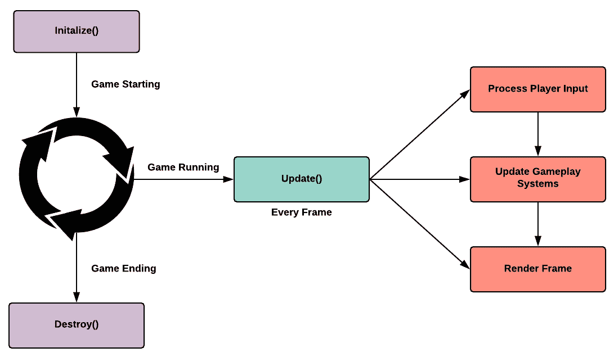
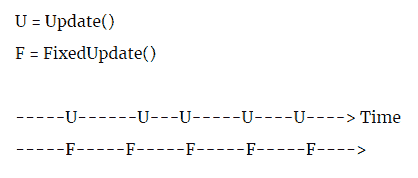

# 游戏循环和更新方法

在本章中，我们将探讨游戏循环和更新方法。两者都是游戏开发的核心模式，初学者经常将它们混淆，因为它们都可以与连续循环序列的概念相关联。但是，正如我们将要看到的，游戏循环和更新方法可能有关联，但它们具有非常不同的职责，并且在 Unity 架构的不同层上实现。

如果我们要理解游戏循环和更新方法背后的核心原则，那么我们需要考虑视频游戏在其最基本的形式下是什么。我遇到的最佳定义是，视频游戏是由交互式虚拟空间组成的模拟，这些空间充满了物体和动画实体，具有不同的行为。这些虚拟空间是逐帧绘制在屏幕上的，而持续运行的系统会根据用户的输入进行监听和响应。

但是，究竟是什么使得视频游戏能够持续运行模拟并即时响应用户的输入而没有任何延迟？答案是游戏循环的组合，它可以被描述为运行中的游戏的脉搏，但同时也是更新方法，它可以充当系统的耳朵。

但是作为一个 Unity 开发者，你永远不会需要手动编写游戏循环或更新方法，因为它们已经在引擎中本地实现了。所以，在接下来的章节中，我们只是将要探索这些模式背后的理论，这样我们就能在 Unity 工作中意识到它们的存在。

本章将涵盖以下主题：

+   快速回顾游戏循环和更新方法模式背后的核心概念

# 技术要求

在本章中，我们将专注于理论而不是实践；对编程的基本理解就足够了。

# 是什么让游戏运行？

如前所述，视频游戏是模拟；子弹在空中嗡嗡作响，然后在《使命召唤》中击中敌人战斗人员，这是由于一系列系统相互作用，共同营造出一种 3D 圆柱形网格在弯曲矢量上穿越空间时受到重力和空气阻力的影响的错觉。

但是，我们需要回答的问题是，是什么驱动所有这些系统以完美的同步运行？与电子表格或浏览器不同，视频游戏不是事件驱动的；它是持续处理的，即使玩家没有按任何按钮。通过实现游戏循环模式，可以有一个以恒定速率自行循环的系统，同时以完美的同步调用子系统，但仍能动态地响应用户的输入。

因此，在本节中，我们将回顾两个核心概念：主循环的实现和计时的重要性，因为游戏循环的主要目的是模拟时间，而不仅仅是重复执行代码。

你可能会注意到游戏设计师经常谈论核心游戏循环。他们通常指的是我们所说的体验或奖励循环。这个主题超出了本书的范围，但我们可以这样说，游戏几乎在每一个层面上都是由循环组成的。

# 主要循环

即使在 20 世纪 80 年代初，程序员在没有像 Unity 这样的引擎的帮助下用纯汇编语言编写游戏时，游戏循环的概念就已经存在了。在那个时期，游戏循环的实现需要在时序上非常精确，因为它必须正确地与 CRT 电视电子枪的运动同步，否则屏幕上的图像会扭曲，游戏将变得无响应。

以下是一个为 Atari 2600 编写的游戏循环汇编代码示例。你可以看到主程序周期性地调用一系列子程序。每个子程序在模拟电视屏幕绘制序列的特定阶段运行。在每一步之间，你可以进行计算、捕获玩家的输入或绘制精灵：

```cs
Main: 
 jsr VSync ; Beginning of frame
 jsr VBlank ; Wait for electron gun to line up 
 jsr Draw ; Draw sprites, UI and background
 jsr OverScan ; Ending frame
 jmp Loop ; Loop again
```

现代游戏循环的实现并没有太大差异，它们可能更加复杂，但核心原则和顺序模式是相似的。每个游戏循环都必须在调用渲染管线（也称为绘制循环）之前收集玩家的输入数据，并在场景中的实体上计算新的变换。在不知道事物应该与玩家最新的输入相关联的位置之前，你不能绘制任何东西。

在本节中，我们回顾了游戏循环的主要职责之一是确保在每一周期中按正确顺序调用子程序。换句话说，它是在维护系统调用的连续序列。但在下一节中，我们将回顾游戏循环的另一个重要职责，即保持一定程度的时序一致性。

总要记住，游戏循环和更新方法相关联，但它们并不相同。它们都是顺序模式，但实现方式不同，且责任也不同。

# 这一切都关乎时机

就像喜剧一样，时机对于游戏编程至关重要；在屏幕上渲染数千个像素的同时，复杂的物理计算在毫秒级内完成。了解每一帧被调用的是什么，对于掌握优化至关重要。

在 Unity 这样的引擎中，核心游戏循环和渲染管线被抽象化，我们只能通过脚本 API 的魔法函数（如：`FixedUpdate()`、`Update()`和`LateUpdate()`）来挂钩其顺序机制。这种方法允许引擎保护其内部时钟和已建立的系统调用序列，同时让我们能够在游戏循环的特定时刻安全地执行代码。

但这种权衡是我们失去了对特定系统更新确切时刻的精确控制。在大多数情况下，这不是问题，但对于大规模 AAA 制作来说，这种限制可能是一个决定性的因素。通常，复杂的 CPU 密集型游戏需要更细粒度的方法来管理精确计算的时机；当有一个滴答机制时，这变得至关重要。而不是依赖于尝试与 CPU 的内部时钟同步，游戏循环有一个类似于模拟手表的滴答机制。像时钟一样，游戏循环不会循环，而是滴答。游戏循环管理滴答之间的时间变化，这取决于可用的操作系统和硬件资源。这种方法允许我们在每一帧之间以更细粒度的控制方式安排特定游戏系统的处理时间。

在游戏行业中，术语*帧*和*滴答*经常被互换使用，但请注意，它们并不一定是同义词。我们可以这样说，**帧**是基于生成和绘制新帧到屏幕上所需延迟的时间单位。而**滴答**是与游戏内部时钟相关的时间单位，它通过主游戏循环的执行来模拟；它类似于一个模拟时钟的秒针在时钟上移动时的滴答声。

在前面的章节中，我们考察了游戏循环模式的一个非常高级和简化的概述。当然，现代 AAA 游戏引擎中游戏循环的实际实现细节超出了本书的范围。对于那些想要深入研究主题并对此有更学术性理解的人，我建议阅读*进一步阅读*部分列出的书籍。

在下一节中，我们将探索 Unity 对更新方法的实现。

# 更新方法

如果我们都同意游戏循环模式的主要目标是通过实现一个计时器来抽象 CPU 的时钟周期，以便我们可以以一致的方式在每一帧上计时我们的代码执行，那么我们可以说更新方法模式通过提供一种封装我们的游戏实体并让它们在每一帧自行更新的方式来简化这一过程。

在本书的下一节中，我们将回顾更新方法和它在 Unity 引擎中的实现。

这些年来，我发现游戏编程主要是由精确的时间控制来操纵数据。因此，了解如何管理数据和时间是掌握游戏编程的关键。

# 概述

实现游戏循环的最大挑战之一是跟踪场景中包含的所有实体，以及如何在每一帧更新它们的状态。但更新方法提供了一种可扩展且直接的解决方案，通过让每个对象都暴露一个每帧被调用的`Update()`函数。

游戏循环并不了解每个对象`Update()`函数的内容，只知道每个拥有该函数的对象都应该在每一帧被调用。因此，我们基本上通过一个单一接口封装了每个游戏对象状态的更新过程。

# 挑战

正如我们可以在以下示例中看到的那样，一个基本的游戏循环实现看起来很简单，但正确实现可能会非常复杂：

```cs
while (true)
{
    Capture();    // Listen and process the player's input. 
    Update();    // Update the scene entity's positions and states.
    Render();   // Draw the frame.
}
```

一旦我们捕获了玩家的控制器输入，我们必须在屏幕上绘制游戏对象之前更新游戏对象的变换和状态。但要实现这一点，我们需要知道要更新哪些实体，以及如何请求它们这样做。如果这些实体没有共同的类型或接口，我们就需要逐个管理它们：

```cs
Update()
{
    sceneEntities = scene.getEntities();

    for each entity in sceneEntities
    {   
        switch (entity.type)
        {
            case Player:
            MovePlayer()
            break;

            case Camera:
            MoveCamera()
            break;

            // This switch case will get long. 
            // Let's find a better way to do this.
            ..........
    }
}
```

但我们的问题还没有结束；我们还需要维护一个动态的实体列表，以在它们的整个生命周期中持有每个对象。正如我们所看到的，这种类型的方案对于大型游戏来说扩展性不好。因此，最好的解决方案是让实体在每一帧自行更新。换句话说，让我们让它们封装自己的行为，而提醒它们自行更新的最简单方法是在每一帧调用一个标准的公共函数。

让我们在下一节中看看我们如何通过更新方法来解决所有这些问题。

# 解决方案

现在我们已经找到了一个提供标准接口给游戏场景实体并将它们封装起来的解决方案，我们仍然需要维护一个列表。游戏是动态的软件；实体在几秒钟内爆炸和生成，手动管理对象列表是容易出错的。

但是，如果我们为所有游戏对象有一个共同的类型，那么我们就可以很容易地动态维护一个实体列表，并在每一帧遍历它。如果我们有一个包含所有游戏对象的容器，比如场景，那么我们可以遍历它以找到特定类型的所有对象，并调用它们的`Update()`方法。

这基本上就是 Unity 中的`MonoBehaviour`；它为需要每帧更新自己的场景中的对象提供了一个共同的父类型。因此，任何是`MonoBehaviour`父类子类的组件都有一个名为`Update()`的魔法方法，它在每一帧被调用。因此，虽然 Unity 在幕后做了所有繁重的工作，但你可以通过在脚本的`Update()`方法中编写代码来专注于实现你想要在每一帧*触发*（更新）的行为。

在下一节中，我们将更深入地探讨 Unity 的更新方法实现。

# Unity 的更新方法

作为 Unity 开发者，我们不需要实现自己的更新方法；它是引擎脚本 API 的固有部分。但 Unity 工程师扩展了核心概念，并公开了几种类型的`Update()`方法；每一种都允许我们在帧的不同时刻执行代码。

以下是在屏幕上渲染帧所需时间内执行步骤的示例：



图表中的每一步都在不到 1/30 秒内完成，并且按照恒定的顺序进行。但 Unity 工程师有远见，知道只有一个 `Update()` 是不够的，因为特定的系统需要在帧的不同时刻进行处理。因此，他们决定公开三种主要的 `Update()` 方法，我们将逐一进行回顾。

注意，只有场景中活跃且继承自 `MonoBehaviour` 父类的对象才会调用它们的各种 `Update()` 方法：

+   **Update()**: 此方法以与游戏帧率相同的频率被调用，这可能是不可靠的，但至少是频繁的。在其中，你应该只实现需要与每个渲染帧相对应的代码。由于其更高的调用频率，这是一个实现输入监听器的好地方。

+   **LateUpdate()**: 此方法在 `Update()` 之后被调用。它用于需要在 `Update()` 调用完成后执行的代码。对于依赖于玩家控制的角色的移动的相机移动转换非常有用。

+   **FixedUpdate()**: 每当物理模拟被触发（更新）时，都会调用此方法。`FixedUpdate()` 方法的调用时机在每一帧之间提供了稳定的 delta 时间。这种方法对于物理计算和某些类型行为的模拟（如加速运动）是必要的。

    以下部分展示了 `Update()` 和 `FixedUpdate()` 之间的间隔：



如我们所见，`FixedUpdate()` 调用是一致的，而 `Update()` 随时间变化。

以下是在典型 `MonoBehaviour` 脚本内部各种更新方法的外观：

```cs
void FixedUpdate ()
{

}

void Update ()
{

}

void LateUpdate ()
{

}
```

最重要的是，我们始终需要意识到我们的代码将在何时执行。Unity 通过抽象引擎的内部触发（更新）机制，并通过 API 中的各种更新方法来简化这项任务。

# 摘要

在本章中，我们回顾了游戏循环模式及其核心原则。像许多现代引擎一样，Unity 抽象了其核心游戏循环的内部工作，而不是一些 API 钩子，这允许我们在每个帧控制代码的执行时间，而无需手动与 CPU 的内部时钟同步。

我们也简要地提到了包含更新方法模式的核心理念。作为 Unity 程序员，我们不需要手动实现这个模式，因为它已经是脚本 API 的本地功能，但我们仍然需要了解其目的。对 Unity 更新函数的时机和顺序有扎实的理解是至关重要的。即使我们不知道底层发生了什么，我们至少可以控制我们代码的执行顺序。

在下一章中，我们将深入探讨实际的设计模式，并将它们应用于解决现实生活中的游戏架构问题和挑战。我们的第一个主题将是*原型*模式。

# 进一步阅读

+   Jason Gregory 的*《游戏引擎架构》*：[`www.gameenginebook.com`](http://www.gameenginebook.com)

+   Nick Montfort 和 Ian Bogost 的*《赛跑光束》*：[`mitpress.mit.edu/books/racing-beam`](https://mitpress.mit.edu/books/racing-beam)
