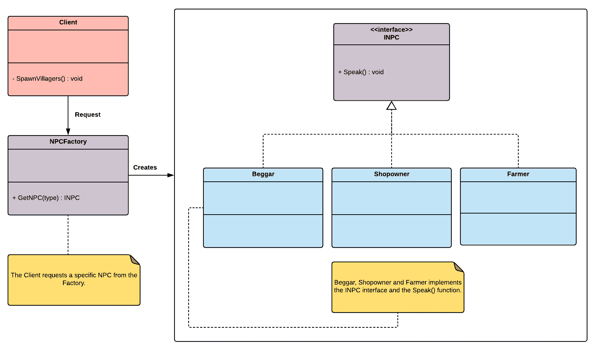

# 工厂方法

工厂方法可能是最著名的设计模式，因为它为大多数软件架构提供了一个坚实的结构基础。这个模式主要有两种变体：

+   工厂方法

+   抽象工厂

这两种模式之间的主要区别在于，工厂方法围绕一个单一的工厂方法，而抽象工厂提供了一种封装和组合具有相似主题的工厂的方法。这些描述现在可能听起来很抽象，但我们将分别在单独的章节中实现这两种变体，以便我们更好地理解每种工厂模式的核心区别。

说到个人观点，我对工厂模式的一般问题在于程序员在实现它时往往不够规范，因此有时由于个人风格的原因，一致性会丢失。但正如我们将在整本书中看到的那样，最受欢迎的模式往往在专业程序员实现它们的方式上有显著的改变。我们将尝试采取一种始终与 Unity 的 API 和编码模型兼容的方法。

本章将涵盖以下主题：

+   工厂方法的概述

+   在使用工厂方法作为我们架构基础的同时实现**非玩家角色**（**NPC**）生成系统

工厂模式和原型模式之间的核心区别在于，当您想要委托对象的创建过程时，工厂模式是有用的，而原型模式在创建新实例的成本过高时是一个最优解。

# 技术要求

本章是实践性的；你需要对 Unity 和 C#有基本的了解才能继续。

我们将使用以下特定的 Unity 引擎和 C#语言概念：

+   枚举

+   构成

如果你对这些概念不熟悉，请在开始本章之前复习它们。

本章的代码文件可以在 GitHub 上找到：

[`github.com/PacktPublishing/Hands-On-Game-Development-Patterns-with-Unity-2018`](https://github.com/PacktPublishing/Hands-On-Game-Development-Patterns-with-Unity-2018)

查看以下视频以查看代码的实际应用：

[`bit.ly/2WvN2vp`](http://bit.ly/2WvN2vp)

# 工厂方法的概述

工厂模式是那些其名称很好地说明了其核心目的的模式之一。有一个稳健的现实世界相关性可以帮助我们可视化其意图——想象一下你在经销商那里订购一辆新车。在这个过程中，经销商会告诉你新车的制造过程吗？答案很可能是不会；通常，经销商会将你的订单发送到工厂，然后他们把请求的最终产品运回给你。

换句话说，作为产品的消费者，你应该专注于订购和接收，而不是制造和分销。这就是工厂模式的主要目标；它通过提供一个对请求对象制造过程的内部工作抽象的接口，简化了特定类型对象的*订购*过程。

正如我们在引言中提到的，工厂有两种主要的变化形式，但在这个章节中，我们将只回顾这种模式最简单的形式，即工厂方法。

让我们先回顾一个使用工厂方法的用例的 UML 图：



如我们从这张图中可以看出，`NPCFactory` 类的 `GetNPC()` 方法负责获取特定类型的 NPC（**乞丐**、**店主**或**农民**）。因此，如果客户端请求特定类型的 NPC，它需要请求`NPCFactory`来生产它。

工厂模式的核心目的是抽象创建并局部化特定类型对象的创建过程。

# 好处和缺点

工厂方法模式享有极好的声誉，并且通常是可靠代码库的基石。让我们看看工厂方法的一些好处和缺点。

这些是好处：

+   **松散耦合**：因为客户端不需要知道特定类型对象的初始化过程的细节，这减少了类之间的耦合和依赖。

+   **创建过程的封装**：由于工厂方法负责创建特定类型的对象，你可以将复杂的初始化过程局部化在一个类中。

这些是缺点：

+   **额外的代码复杂性**：由于你正在添加抽象和额外的类，代码变得难以阅读。

+   **开放性解释**：程序员经常混淆工厂方法及其近亲抽象工厂。这个问题可能会导致不一致的实现，这可能会在同一个代码库上工作的程序员之间引起不确定性和混淆。

有时很难将反复出现的缺点与特定的模式隔离，因为这通常是一个关于上下文的问题。但关于设计模式的一个普遍真理是，如果你误用它们，它们可能会成为你架构中的退步部分。

# 用例示例

现在我们对工厂方法有了基本的了解，让我们用它来构建一个游戏系统。为了与之前的章节保持一致，我们将实现另一个生成系统，但这次是为 NPC。因为工厂方法是一种创建型模式，它非常适合生成系统。正如我们将在下面的代码示例中看到的，工厂方法是在需要集中初始化各种实体初始化管道时使用的完美模式。

在一个专业的游戏项目中，你可能会不得不为不同实体组构建独立的出生系统。例如，在一个开放世界游戏中，你可能会有一个特定的方法来生成平民和警察，因为每种主要的 AI 角色可能有不同的要求和加载过程。

# 代码示例

如我们之前提到的，工厂方法是实现工厂模式最直接的方法。正如其名所示，它主要关注通过工厂方法提供创建特定对象类型的标准接口。因此，如果我们有一个`Client`类需要初始化特定类型的对象（也称为**产品**），但我们不知道确切的类或调用过程，我们只需引用工厂来生产所需的产品并将其返回给我们。让我们按照以下步骤开始我们的示例：

1.  让我们使用工厂方法作为基础，为 NPC 构建一个简单的出生系统。但在我们这样做之前，我们需要声明我们的通用 NPC 类型。在代码中，最好的方法是为我们所有的 NPC 角色提供一个标准接口。出于简单性的考虑，我们所有的 NPC 实体都将具有一个共同的功能；它们可以说话脚本对话：

```cs
public interface INPC
{
   void Speak();
}
```

1.  现在我们有一个名为`INPC`的标准 NPC 接口，我们需要为可能想要生成的每种 NPC 类型创建具体的类。我们将限制自己到在经典 RPG 游戏中的农场村庄中可能找到的典型角色：

+   首先是我们的“乞丐”，他们乞求珍贵的硬币：

```cs
using UnityEngine;

public class Beggar : INPC
{
    public void Speak()
    {
        Debug.Log("Do you have some change to spare?");
    }
}
```

+   然后是我们的“店主”，他们总是准备好卖给我们一些商品：

```cs
using UnityEngine;

public class Shopowner : INPC
{
    public void Speak()
    {
        Debug.Log("Do you wish to purchase something?");
    }
}
```

+   最后，我们有我们的“农夫”，他们有智慧的话语：

```cs
using UnityEngine;

public class Farmer : INPC
{
    public void Speak()
    {
        Debug.Log("You reap what you sow!");
    }
}
```

1.  因此，现在我们已经为我们的主要 NPC 类型创建了具体的类，我们需要一种方法在需要时引用它们。让我们编写一个公共的`enum`，它将易于访问。我们将公开一个可用的 NPC 类型列表：

```cs
public enum NPCType
{
    Farmer,
    Beggar,
    Shopowner
}
```

1.  下一步是实现我们的`NPCFactory`类，它有一个公共的工厂方法，将创建请求的 NPC 实例（产品）：

```cs
using UnityEngine;

public class NPCFactory : MonoBehaviour
{
    public INPC GetNPC(NPCType type)
    {
        switch (type)
        {
            case NPCType.Beggar:
                INPC beggar = new Beggar();
                return beggar;
            case NPCType.Farmer:
                INPC farmer = new Farmer();
                return farmer;
            case NPCType.Shopowner:
                INPC shopowner = new Shopowner();
                return shopowner;
        }
        return null;
    }
}
```

如我们所见，我们的工厂方法的具体实现是一个名为`GetNPC()`的函数，它由一个返回指定`NPCType`的`INPC`实例的 switch case 组成。

1.  但这种设计的优势在我们的客户端中很明显，在这个例子中，将是我们的`NPCSpawner`类：

```cs
using UnityEngine;

public class NPCSpawner : MonoBehaviour
{
    public NPCFactory m_Factory;

    private INPC m_Farmer;
    private INPC m_Beggar;
    private INPC m_Shopowner;

    public void SpawnVillagers()
    {
        /** 
        We don't want to specify the class to instiate for each type 
        of villager.
        Instead, we ask the factory to "manufacture" it for us.
        **/

        m_Beggar = m_Factory.GetNPC(NPCType.Beggar);
        m_Farmer = m_Factory.GetNPC(NPCType.Farmer);
        m_Shopowner = m_Factory.GetNPC(NPCType.Shopowner);

        m_Beggar.Speak();
        m_Farmer.Speak();
        m_Shopowner.Speak();
    }
}
```

1.  我们可以使用以下测试类来测试工厂方法实现和`NPCSpawner`：

```cs
using UnityEngine;

public class Client : MonoBehaviour
{
    public NPCSpawner m_SpawnerNPC;

    public void Update()
    {
        if (Input.GetKeyDown(KeyCode.S))
        {
            m_SpawnerNPC.SpawnVillagers();
        }
    }
 }
```

现在，我们能够生成特定 NPC 的实例，而无需知道其位置或具体类的确切名称。当只处理三种基本类型时，这可能看起来并不令人印象深刻，但想象一下，如果每种 NPC 类型都有不同的初始化过程和多个依赖项。

例如，想象一个场景，其中“乞丐”NPC 不是一个角色，而是一个可以附加到我们场景中任何平民角色上的行为组件，而“农夫”NPC 类型是一个自包含的预制件。使用工厂方法，我们不必每次想要生成特定的 NPC 时都记住所有这些规范；相反，我们让工厂方法为我们做脏活，并决定创建这些特定实体的最佳方式。

在实现特定对象家族的通用父类时，在抽象和接口之间进行选择可能会让人感到困惑。在这个例子中，我决定选择接口，因为我不想共享实现——我想声明一个类型组。

# 摘要

在本章中，我们介绍了工厂模式的核心原则，并实现了其第一种变体，即工厂方法。使用这种模式，我们可以本地化对象的类型创建过程。这可能很好，但如果我们想要复杂的产品，这些产品结合了各种类型的对象，每种对象都有其特定的创建方法呢？我们是否需要分别了解和调用每个工厂，并手动组装它们？

在下一章中，我们将通过实现工厂模式的更高级版本——**抽象工厂**来解决这个问题的。

当你分析设计模式的有用性时，始终记住它们是为团队合作而设计的。工厂是一个完美的例子。作为一个独立开发者，你可能会发现大多数设计模式都是多余的，但想象一下你在一个大型的代码库上工作，有几十个程序员。在这种情况下，抽象层和通用接口可以帮助你在团队和代码库增长时保持理智。

# 实践

在上一章中，我们学习了如何使用原型模式作为基础来设计生成系统。因此，我们的系统基本上就像一台复印机；它复制现有的实例。这种机制减少了初始化开销，但这只有在内存中已经有引用可以复制的情况下才有益。

但现在，我们的工具箱中已经有了工厂方法；我们可以将创建特定类型新对象的过程本地化。有趣的是尝试将两者结合起来。工厂方法能否检查该类型对象在内存中是否已经存在一个实例？

结合模式是一个很好的练习，这将为你提供更广泛的方法来处理复杂的实现。

# 进一步阅读

+   《*游戏编程模式*》由 Robert Nystrom 所著：[`gameprogrammingpatterns.com`](http://gameprogrammingpatterns.com/)

+   《*设计模式：可复用面向对象软件元素*》由 Erich Gamma、John Vlissides、Ralph Johnson 和 Richard Helm 所著：[`www.informit.com/store/design-patterns-elements-of-reusable-object-oriented-9780201633610`](http://www.informit.com/store/design-patterns-elements-of-reusable-object-oriented-9780201633610)
