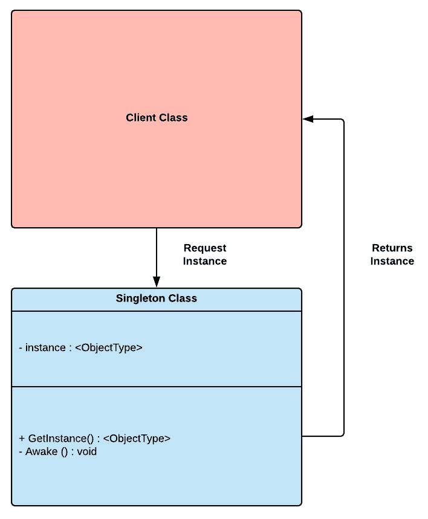

# 第六章：Singleton

Singleton 是行业中最臭名昭著的模式，但讽刺的是，它在 Unity 开发者中非常受欢迎。因此，它已经变成了程序员的胶带，被过度用作快速修复而不是稳健架构的基石。实现 Singleton 有许多方法，从简单但不安全到复杂但稳健；我们将选择后者，因为如果我们需要实现不受欢迎的模式，让我们以一种不会对我们产生反作用的方式去做。

本章将涵盖以下主题：

+   Singleton 模式的基础

+   在 Unity 中实现完美的 Singleton

程序员喜欢争论，有时甚至到了瘫痪的地步，因此永远不要对设计模式过于虔诚。始终记住，没有完美的解决方案；你做出的每一个设计决策都会有权衡。

# 技术要求

这是一个实践性章节；你需要对 Unity 和 C# 有基本的了解。

我们将使用以下特定的 Unity 引擎和 C# 语言概念：

+   泛型

如果不熟悉这个概念，请在开始本章之前查看它们。

本章的代码文件可以在 GitHub 上找到：

[`github.com/PacktPublishing/Hands-On-Game-Development-Patterns-with-Unity-2018`](https://github.com/PacktPublishing/Hands-On-Game-Development-Patterns-with-Unity-2018)

查看以下视频以查看代码的实际应用：

[`bit.ly/2YwBVEv`](http://bit.ly/2YwBVEv)

# Singleton 模式的概述

如其名所示，Singleton 模式的主要目标是保证唯一性。这种方法意味着如果一个类正确实现了这个模式，一旦初始化，它将在运行时内存中只有一个自身的实例。这种机制在需要从单一入口点全局访问系统时非常有用。

如下图中所示，Singleton 的设计相当简单；与原型模式不同，作为 Singleton 实现的类不会复制自身，而是仅将其当前实例返回给请求它的客户端：



如果正确实现，Singleton 实例甚至可以销毁任何其他自身的实例，以防有人试图复制它。换句话说，只能有一个。但我们将在本章中进一步看到，在 Unity 中实现一个稳固的 Singleton 并不像看起来那么简单。

# 优点和缺点

Singleton 是一个非常具有争议的模式；许多人不喜欢它，因为 Unity 开发者经常误用它。如果对这种模式的蔑视是合理的，我会说是的，但只到一定程度。而不是列出这个模式的所有潜在优点和缺点，我将只提出一个优点和缺点；两者都是我认为支持或反对使用这个模式的最有力的论据。

这是优点：

+   **唯一的入口点**：Singleton 提供了一个唯一的但全局的访问点，用于访问其自身的实例。这种机制使得访问由 Singleton 实例暴露的依赖项变得更加容易。

这是缺点：

+   **依赖项的混淆**：Singleton 通常被用作“胶带”来简化对复杂互锁依赖项的访问。这是一个简单的解决方案，可以防止错误的架构选择被清除。

因此，考虑到这两个论点，当我们决定使用 Singleton 时，我们必须问一个简单的问题；这是因为它需要并且与我们的整体架构相匹配，还是我们使用它是因为它是一个解决复杂问题的快速解决方案？从我们的答案中，我们可以确定我们在设计选择上是聪明还是懒惰。

当你在做设计选择时，始终牢记你的架构是否可维护、可扩展和可测试非常重要。如果你不能单独测试你的模块，那么这可能是一个很好的迹象，表明你的设计已经使你的代码库耦合并依赖于全局依赖项。

# 用例示例

我们必须考虑，大多数游戏都是由一系列关卡组成的，但每个关卡在其生命周期内都包含一系列事件，如下所示：

+   加载上一个保存

+   触发引导序列

+   环境和角色的生成

+   管理运行时游戏状态

+   触发结束场景序列

+   保存当前玩家状态

+   触发下一级

为了能够管理这一点，我们需要一个在整个场景生命周期中保持活跃的游戏管理器。作为一个类比，如果我们看看经典的纸笔版《龙与地下城》，通常有一个游戏大师来调节和监督游戏的流程，以便玩家能够有一个一致但结构化的体验。

因此，对于我们的用例，我们需要类似的东西，但当然，不如人类游戏大师那样复杂。Singleton 是一个完美的模式来实现 GM，因为它为我们提供了一种将类编写为单一但全局实体的方式，该实体将在我们游戏的整个运行时中可访问。

# 代码示例

在本节中，我们将探讨 Unity 中 Singleton 模式实现的两种版本。第一个例子是不安全的但直接的。第二个例子是高级的但更健壮的，如本章开头所述。

# 简单方法

让我们先回顾一下在 Unity 中实现 Singleton 的简单方法。我们必须记住，当我们使用`MonoBehaviours`时，我们没有访问构造函数，因此我们需要在`Awake()`魔法函数中控制任何成员变量的初始化，如下所示：

```cs
using UnityEngine;

public class GameManager: MonoBehaviour 
{
    public static GameManager instance;

    void Awake()
    {
        instance = this;
    }

    public void InitializeScene()
    {
        // Load persistent game state variables from the save system.
        // Load game systems and dependencies.
    }
}
```

如我们所见，我们只有一个成员，它是静态且公开的，这将使我们的客户端更容易引用它。在我们的`Awake()`方法中，我们将当前的`this`实例传递给公开的静态实例变量。这种方法意味着我们的客户端将有一个恒定且持久的访问点来访问我们的`GameManager`，如下面的代码片段所示：

```cs
using UnityEngine;

public class Client: MonoBehaviour
{
    void Start()
    {
        GameManager.instance.InitializeScene();
    }
}
```

它看起来很简单。我们需要引用`GameManager`类的静态实例成员，并且我们可以在任何点调用其公共函数。但有一个巨大的问题：这不是一个单例，因为没有机制可以防止在内存中有两个该对象的实例。

我们只是实现了一个全局管理器实例的接口，但我们没有保护它免受内存中重复或保持其完整性的影响。让我们看看在下一个示例中我们是否能做得更好：

```cs
using UnityEngine;

public class GameManager: MonoBehaviour 
{
    public static GameManager _instance;

    void Awake()
    {
        if (_instance == null)
        {
            // Assigning only if there's no other instances in memory.
            _instance = this; 
        }
        else if (_instance != null)
        {
            // Destroying itself if detects duplication.
            Destroy(gameObject) 
        }
    }
}
```

现在，这已经变得更好了。我们至少在分配`_instance`静态成员之前检查`null`引用，并通过在它们`awake`时销毁它们来避免`GameManager`的潜在重复实例。

这种方法看起来是有效的，但如果决定有多个类实现为单例，则没有任何机制可以保证一致性。你可能会有一位程序员以一种方式编写单例，而另一位则以完全不同的方式编写。从长远来看，这抵消了设计模式的基本好处之一；架构的一致性。

在下一节中，我们将探讨一个高级单例实现的潜在候选者，它可以成为我们代码库的支柱，并为我们提供完全的可重用性。

# 高级方法

以下类是一个完整的单例实现的示例，但这里有很多东西需要解释，因此我们将尝试关注以下基本元素：

```cs
using UnityEngine;

// <T> can be any type.
public class Singleton<T> : MonoBehaviour where T : Component
{
    // The instance is accessible only by the getter.
    private static T m_Instance; 
    public static bool m_isQuitting;

    public static T Instance
    {
        get
        {
            if (m_Instance == null)
            {
                // Making sure that there's not other instances 
                // of the same type in memory. 
                m_Instance = FindObjectOfType<T>();

                if (m_Instance == null)
                {
                    // Making sure that there's not other instances 
                    // of the same type in memory.
                    GameObject obj = new GameObject();
                    obj.name = typeof(T).Name;
                    m_Instance = obj.AddComponent<T>();
                }
            }
            return m_Instance;
        }
    }

    // Virtual Awake() that can be overridden in a derived class.
    public virtual void Awake()
    {
        if (m_Instance == null)
        {
            // If null, this instance is now the Singleton instance 
            // of the assigned type. 
            m_Instance = this as T;

            // Making sure that my Singleton instance 
            // will persist in memory across every scene.
            DontDestroyOnLoad(this.gameObject);
        }
        else
        {
            // Destroy current instance because it must be a duplicate.
            Destroy(gameObject);
        }
    }
}
```

在这个例子中，我们介绍了**泛型**，这是一个令人信服的 C#特性，允许我们在运行时延迟类的类型。当我们说一个类是泛型时，这意味着它没有定义的对象类型。这种方法的优势在于，当我们初始化它时，我们可以将其分配为特定的类型。换句话说，它可以成为我们想要的任何东西，这可以解决我们与单例相关的核心问题，即我们的单例类之间实现的一致性。

让我们将我们的通用单例类应用到几个管理器上，看看我们如何保持编写单例类的方式的一致性，如下所示：

```cs
using UnityEngine;

// Inheriting Singleton and specifying the type.
public class GameManager : Singleton<GameManager>
{
    public void InitializeGame()
    {
        Debug.Log("Initializing the game.");
    }
}
```

如我们所见，通过继承单例父类，我们只需一行代码（`Singleton<GameManager>`）就将`GameManager`变成了单例。这种机制之所以可行，是因为我们的父类拥有单例的核心组件。

接下来是一个将`Manager`类转换为单例模式的示例，只需一行代码即可实现：

```cs
using UnityEngine;

// Inheriting the Singleton and specifying it's type.
public class InventoryManager : Singleton<InventoryManager> 
{
    public void AddItem(int itemID)
    {
        Debug.Log("Adding item to the inventory.");
    }

    public void RemoveItem(int itemID)
    {
        Debug.Log("Removing item to the inventory.");
    }
}
```

我们可以用以下`Client`类来测试我们新的单例：

```cs
using UnityEngine;

public class Client : MonoBehaviour
{
    void Update()
    {
        if (Input.GetKeyDown(KeyCode.I))
        {
            GameManager.Instance.InitializeGame();
        }

        if (Input.GetKeyDown(KeyCode.A))
        {
            InventoryManager.Instance.AddItem(001);
        }

        if (Input.GetKeyDown(KeyCode.R))
        {
            InventoryManager.Instance.RemoveItem(023);
        }
    }
}
```

现在我们已经找到了实现单例模式的结构化和可重用方法，我们可以在不过度使用的情况下安全地将它集成到我们的代码库中。

# 摘要

在本章中，我们解决了最具有争议性的设计模式之一。但我们找到了一种以一致和可重用的方法来实现它的方法。即使关于单例有用性的争论持续存在，我们也可以看到它对 Unity 开发者是有益的。

我们已经完成了创建型模式章节，现在我们的工具箱中有三个核心模式，每个模式都有其特定的功能：

+   原型模式为我们提供了一种通过复制引用来创建对象的方法

+   抽象模式强制执行对象的创建过程的本地化

+   单例提供了一种实现机制，确保在内存中只有一个对象的唯一实例

在下一章中，我们将从创建型模式过渡到行为型模式。我们列表中的第一个是策略模式，这是一个经典的模式，它关注于在运行时动态选择算法。

# 练习

单例模式的主要问题在于其实例是全局可访问且持久的，因此如果任何与单例对象相关的依赖组件，它就不能作为一个独立的单元进行测试。但在现实世界中，代码库从不完美，程序员经常使用单例。

因此，即使在与高度依赖全局单例实例的架构打交道时，你也必须找到一种方法来维护适当的单元测试最佳实践。所以，作为一个练习，我建议你阅读有关**测试驱动开发**（**TDD**）实践的内容，特别是像**存根**和**模拟**这样的核心概念。

TDD 超出了本书的范围，所以请参考*进一步阅读*部分以获取更多关于该主题的信息。

# 进一步阅读

+   *《通过示例的测试驱动开发》* by Kent Beck[`www.pearson.com/us/higher-education/program/Beck-Test-Driven-Development-By-Example/PGM206172.html`](https://www.pearson.com/us/higher-education/program/Beck-Test-Driven-Development-By-Example/PGM206172.html)

+   *《现实世界的测试驱动开发》* by Mauricio Aniche[`www.goodreads.com/book/show/24400837-real-world-test-driven-development`](https://www.goodreads.com/book/show/24400837-real-world-test-driven-development)
