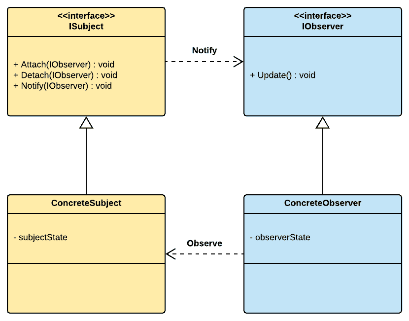

# 第九章：观察者

在本章中，我们将学习观察者模式，但我们将采取与之前章节不同的方法，简单的原因是观察者模式已经在 Unity 引擎中以 C# 事件系统的形式原生实现。但为了全面起见，我们将快速回顾观察者模式的经典形式，然后将其与 C# 事件系统进行比较。

本章将涵盖以下主题：

+   观察者模式的基本原理

+   检查它如何在 C# 事件系统中原生实现

# 技术要求

这是一个实践性章节，因此您需要具备对 Unity 和 C# 的基本理解。

我们将使用以下 Unity 特定引擎和 C# 语言概念：

+   事件

+   代理

+   协程

在开始本章之前，您不需要了解它们，但花时间回顾一些关于该主题的在线文档会有所帮助。

本章的代码文件可以在 GitHub 上找到：

[`github.com/PacktPublishing/Hands-On-Game-Development-Patterns-with-Unity-2018`](https://github.com/PacktPublishing/Hands-On-Game-Development-Patterns-with-Unity-2018)

查看以下视频，看看代码的实际运行情况：

[`bit.ly/2Fy4HvP`](http://bit.ly/2Fy4HvP)

# 观察者模式的预览

如其名所示，观察者模式的目的就是观察。更准确地说，观察者的核心目的是观察其他对象及其内部状态的具体变化。在观察者模式之前，从“外面看”观察一个对象的唯一方法是通过不断调用或“ping”其公共成员，希望捕捉到其值的变化。

观察者模式旨在通过定义一个系统来解决这个问题，在该系统中，对象（主题）维护一个其他对象（观察者）的列表。当主题需要广播其方面的变化时，它们会调用观察者。

我们可以通过以下现实世界的例子来可视化这个系统的原理：一位华尔街经纪人管理着一组与客户列表（观察者）关联的股票目录（主题）。当特定市场事件发生时，经纪人会联系所有客户，告知他们其股票的价值已发生变化。

让我们回顾一个典型实现观察者模式的 UML 图，看看它在代码中实现时可能的工作方式：



如您所见，主题和观察者都有自己的接口，但最重要的分析接口是 `ISubject`，它包括以下公共函数：

+   `Attach()`: 这个函数允许将观察者对象添加到要通知的观察者列表中。

+   `Detach()`: 这个函数会从观察者列表中移除一个观察者。

+   `Notify()`: 这将通知所有已附加到主题观察者列表中的观察者。

尽管这不是一个非常复杂的设计来实现，但每次你需要观察其他对象时，编写它都可能变得非常繁琐。现代语言，如 C#，已经以事件系统的形式原生实现了观察者模式，因此程序员不需要手动编写它。

与通常只根据用户交互改变当前运行状态的电子表格应用程序不同，我们必须注意，游戏不是事件驱动的；相反，是主游戏循环推动游戏向前发展。

# C#事件系统

作为一名 Unity 开发者，你可能永远不需要手动实现完整的观察者模式，因为 C#已经以事件系统的形式提供了原生的观察者实现。但在我们开始编写代码之前，让我们回顾一下 C#事件系统的核心组件：

+   **事件**：当一个对象（发布者）引发事件时，它会发送一个信号，其他对象（订阅者）可以捕获这个信号。这个概念可能听起来非常熟悉，就像抛出和处理异常一样，当异常被抛出时，它会沿着调用栈向上传递，直到被处理。但在事件系统的案例中，实际上并没有调用链，因为一旦一个对象广播了一个事件，只有订阅了它的对象才会被通知，并且可以选择被它触发或只是忽略它。所以，我们基本上可以想象它就像一个突然爆发的无线电信号，只有那些有天线的人才能听到。

+   **代表（Delegates）**：当你理解它们背后的底层机制时，代表的概念很简单。代表的高级定义是它们持有函数的引用。当你想要从一个调用中触发多个函数时，它们非常有用——换句话说，当你想要多播（multicast）时。但这是对代表在幕后实际做什么的一个非常抽象的定义。它们基本上是函数指针，这意味着它们持有其他函数的内存地址。因此，我们可以将它们想象成一个包含函数位置的地址簿。这就是为什么代表可以持有多个函数并一次性调用它们。

# 好处和缺点

观察者模式是那些已经嵌入到现代语言和代码库中的模式之一。很难不使用这个模式，因为它的缺点是有限的。

以下是一些好处：

+   **松耦合**：观察者的主要优势是它将观察对象与观察者解耦。它们不需要相互了解；它们只需要广播或监听。

+   **向任何人发送数据**：你可以轻松地将数据从一个对象发送到另一个对象。

+   **随时停止监听**：主体和听众之间没有明确的合同，因此如果需要，他们可以随时停止广播。

以下是一个缺点：

+   **嘈杂的代码**：观察者模式带来了事件驱动范式，但如果过度使用，它可能会变得嘈杂且难以管理。

# 用例示例

以事件系统形式的观察者模式通常用于管理用户输入，但让我们看看我们是否可以用事件做其他事情，比如一个自动系统，它将广播其状态变化给其他系统。

假设我们正在构建一个带有倒计时计时器的经典益智游戏。在大多数有计时器的游戏或运动中，我们将给玩家一个独特的标志和反馈，以提醒他们剩余多少时间。

我们三个主要的计时器反馈事件如下：

+   时钟开始

+   半场

+   时间到

对于每个事件，让我们触发一些独特的事情，如下所示：

+   减弱灯光

+   触发蜂鸣器

+   在屏幕上显示一条消息

但这里的挑战是：我们如何通知管理照明、声音和 UI 的各个系统或组件计时器的状态？当我们遇到这类问题时，观察者模式就变得非常有用，以事件系统的形式：我们将能够让所有这些个别系统在计时器广播特定时间事件时进行监听。

# 代码示例

我们将通过实现观察者模式最重要的组件：主题来开始这个代码示例。如果没有东西可以观察，观察者模式就没有用途。请参考以下步骤：

1.  在我们的代码示例中，`Timer`类将是我们主题：

```cs
using UnityEngine;
using System.Collections;

public class Timer : MonoBehaviour
{
    private float m_Duration = 10.0f;
    private float m_HalfTime;

    public delegate void TimerStarted();
    public static event TimerStarted OnTimerStarted;

    public delegate void HalfTime();
    public static event HalfTime OnHalfTime;

    public delegate void TimerEnded();
    public static event TimerEnded OnTimerEnded;

    private IEnumerator m_Coroutine;

    IEnumerator Start()
    {
        m_HalfTime = m_Duration / 2;

        if (OnTimerStarted != null)
        {
            OnTimerStarted();
        }

        yield return StartCoroutine(WaitAndPrint(1.0F));

        if (OnTimerEnded != null)
        {
            OnTimerEnded();
        }
    }

    private IEnumerator WaitAndPrint(float waitTime)
    {
        while (Time.time < m_Duration)
        {
            yield return new WaitForSeconds(waitTime);

            Debug.Log("Seconds: " + Mathf.Round(Time.time));

            if (Mathf.Round(Time.time) == Mathf.Round(m_HalfTime))
            {
                if (OnHalfTime != null)
                {
                    OnHalfTime();
                }
            }
        }
    }
}
```

如您所见，代码并不多；使用 C#事件系统实现一个主题相当简单。最重要的是`委托`和`事件`类型之间的关系。一个`事件`是对象发送的消息，但在通信过程中，它并不知道哪些对象会接收其消息，因此需要一个类似指针的机制，可以在发送者和接收者之间充当中间人，这就是委托所需的地方。只需想象一下，委托就是将事件消息指向正确的`观察者`。

还有另一个重要的细节需要注意。请注意，每次我们调用像`OnTimerEnded()`这样的事件时，它都会在其相关的事件类型引用上检查 null，然后再引发事件：

```cs
....        
if (OnTimerEnded != null)
{
    OnTimerEnded();
}
```

我们这样做是因为如果没有人在听，就无法广播事件。我们需要至少一个处理事件接收的观察者。这就是事件系统实现和管理其引用的方式。

1.  现在我们已经准备好了主题，是时候实现那些将注册自己以接收来自我们的`Timer`事件消息的系统了。换句话说，我们将实现我们的观察者。第一个是`Buzzer`，它将通过发出蜂鸣声来通知玩家计时器已经开始或结束：

```cs
using UnityEngine;

public class Buzzer : MonoBehaviour
{
    void OnEnable()
    {
        Timer.OnTimerStarted += PlayStartBuzzer;
        Timer.OnTimerEnded += PlayEndBuzzer;
    }

    void OnDisable()
    {
        Timer.OnTimerStarted -= PlayStartBuzzer;
        Timer.OnTimerEnded -= PlayEndBuzzer;
    }

    void PlayStartBuzzer()
    {
        Debug.Log("[BUZZER] : Play start buzzer!");
    }

    void PlayEndBuzzer()
    {
        Debug.Log("[BUZZER] : Play end buzzer!");
    }
}
```

1.  我们列表中的下一个是`WarningLight`，当计时器达到半场时将闪烁：

```cs
using UnityEngine;

public class WarningLight : MonoBehaviour
{
    void OnEnable()
    {
        Timer.OnHalfTime += BlinkLight;
    }

    void OnDisable()
    {
        Timer.OnHalfTime -= BlinkLight;
    }

    void BlinkLight()
    {
        Debug.Log("[WARNING LIGHT] : It's half-time, blinking the warning light!");
    }
}
```

1.  作为我们的最终观察者，我们将实现`Notifier`，它负责在时间到游戏结束时弹出消息：

```cs
using UnityEngine;

public class Notifier : MonoBehaviour
{
    void OnEnable()
    {
        Timer.OnTimerEnded += ShowGameOverPopUp;
    }

    void OnDisable()
    {
        Timer.OnTimerEnded -= ShowGameOverPopUp;
    }

    void ShowGameOverPopUp()
    {
        Debug.Log("[NOTIFIER] : Show game over pop up!");
    }
}
```

我们应该注意到我们所有的观察者有一个共同点：它们都通过指向一个特定的本地函数来注册自己以接收来自`Timer`的事件。这种实现方式意味着当`Timer`广播一个事件时，所有观察它的对象将自动调用它们的一个本地方法。因此，远程事件可以触发对象的本地函数调用：

```cs
// Adding the object as a observer of the OnTimerEnded event once it //get's enabled.
void OnEnable() 
{
    Timer.OnTimerEnded += ShowGameOverPopUp;
}

// In case the object is disabled, removing it as an observer of //OnTimerEnded.
void OnDisable()
{
    Timer.OnTimerEnded -= ShowGameOverPopUp;
}
```

另一个需要记住的点是一个事件不能指向`null`引用，因此确保一个对象在禁用时作为观察者移除是一个好的实践。

通过 C#事件系统表达的观察者模式提供了一种简单但强大的方法来实现对象之间的观察者-主题关系，无需显式耦合，并且只需要几行代码。

# 摘要

在本章中，我们学习了如何通过构建一个计时器来实现观察者模式，该计时器可以通过组件监听特定的定时事件来触发场景中的行为。从这个模式中，我们得到的一个重要启示是，观察者模式在 Unity 中以 C#事件系统的形式原生化实现。

在下一章中，我们将探讨状态模式。这是游戏编程中另一个有用的模式，它与观察者模式有些相关。

# 练习

正如我们在本章中学到的，观察者模式是 C#事件系统的灵感来源。但当然，它并不是这个模式的精确实现。所以，作为一个练习，我会鼓励你重新编写我们刚刚实现的计时器系统，但不要使用 C#事件系统；相反，遵循观察者模式的设计。

您可以使用本章开头所示的 UML 图作为起点。

在不寻常的方式中实现设计模式是很常见的。通常，设计模式会激发程序员以某种方式结构化他们的代码，但在生产代码库中，你很少会看到特定模式的准确和“按部就班”的实现。

# 进一步阅读

《*设计模式*》，作者：Erich Gamma, Richard Helm, Ralph Johnson, 和 John Vlissides([`www.pearsoned.co.uk/bookshop/detail.asp?WT.oss=design%20patterns%20elements&WT.oss_r=1&item=171742`](http://www.pearsoned.co.uk/bookshop/detail.asp?WT.oss=design%20patterns%20elements&WT.oss_r=1&item=171742))
