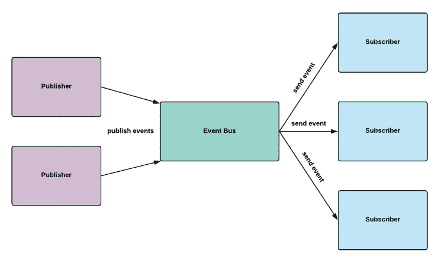

# 事件总线

在本书的*解耦*部分，我们将回顾事件总线模式。但首先，我们需要解决经常出现在事件总线定义及其紧密相关的表亲事件队列定义之间的混淆。我们可以从它们的名字中快速总结出两者之间的核心区别。

公交车允许数据在不同组件之间流动，而队列收集需要按顺序间隔处理的数据列表。通过这个高级的公交车定义，我们可以得出结论，事件总线将专注于作为事件发布和广播的中心枢纽，而不是作为这些事件的队列。

因此，在本章中，我们将专注于构建一个事件总线，这将优化我们在 Unity 中解耦事件监听者和消费者事件的方式。

本章将涵盖以下主题：

+   检查事件总线模式的基本原理

+   实现一个可以适应任何游戏的全球消息系统

# 技术要求

事件总线是观察者模式的扩展，因此在开始这一部分之前，我建议您重新阅读第十章，*观察者*。

我们还将使用以下特定的 Unity 引擎 API 功能：

+   `UnityEvents`

+   `UnityActions`

如果您对这些不熟悉，请查阅它们的官方 Unity API 文档，但请注意，我们将在本章的*代码示例*部分对其进行回顾。

本章的代码文件可以在 GitHub 上找到：

[`github.com/PacktPublishing/Hands-On-Game-Development-Patterns-with-Unity-2018`](https://github.com/PacktPublishing/Hands-On-Game-Development-Patterns-with-Unity-2018)

查看以下视频以查看代码的实际效果：

[`bit.ly/2OxHxto`](http://bit.ly/2OxHxto)

# 事件总线模式概述

在事件总线模式周围可能存在一些混淆点。有时它被称为**消息系统**或**发布-订阅**模式，后者是我们在本章中实现的最准确名称。但因为我们在这本书中采取了一种非常实际的方法，所以我们将会把这种模式的设计称为事件总线，这是一个更高级和系统化的名称。

正如我们在第九章中看到的，*观察者*，C#有原生的实现，通过提供事件驱动机制简化了集成事件的过程，允许主题和观察者相互通信。但 C#的原生事件系统确实有一个缺点——观察者需要*意识到*潜在主题的存在，否则可能会出现意外的行为。

因此，我们将学习如何使用事件总线——使用这种模式，我们将消除这种依赖关系，并使任何对象都能够发布事件并订阅它们，而无需彼此之间有任何直接依赖。因此，我们将从观察者/主题安排转变为更灵活的发布者/订阅者方法。



让我们回顾一下事件总线图，并检查其元素：

如我们所见，有三个主要成分：

+   **出版商**：这些对象可以请求中心管理特定事件并将它们广播给正确的听众

+   **事件中心**：该对象负责协调发布者和订阅者之间的事件通信

+   **订阅者**：这些对象将自己订阅到中心的广播事件频道，以便它们可以监听特定事件

# 优点和缺点

事件总线的优点和缺点相当适中——这是一个允许在不要求对代码库进行重大架构更改的情况下实现事件管理系统的模式：

**优点**如下：

+   **解耦系统**：因为发布者和订阅者只通过事件总线进行通信，这减少了直接引用，并使对象彼此解耦

+   **广播频道**：类似于电视或广播系统，您可以使用事件总线作为通过特定频道传输消息的方式，听众可以自行订阅

应注意的**缺点**如下：

+   **内存开销**：在任何一个事件系统的底层，都有大量的低级内存机制被触发以管理对象之间的通信，因此如果您需要从每一帧中挤出毫秒级的处理时间，这可能不是最佳选择

# 示例用例

与本书中的其他模式不同，事件总线是一个功能完整且自成一体的系统。这一事实意味着我们可以在不将其映射到特定游戏系统的情况下实现它，并且它仍将成为我们游戏架构的一个关键组件。

我们几乎可以将事件总线视为一个全局服务，它为所有我们的组件提供了一个在特定频道上相互发送消息的方法。因此，在*代码示例*部分，我们将以原生形式实现事件总线，并确保它作为一项服务对所有我们的组件都是全局可访问的。

在开始*代码示例*部分之前，我建议回顾第六章，*单例*，因为我们打算将其用作事件总线类的基础。

# 代码示例

如*示例用例*部分所述，我们将实现事件总线作为一个服务，所有我们的组件在需要向其他对象广播事件时都可以使用。

因此，让我们首先通过编写事件总线类来实现系统的核心：

```cs
using UnityEngine.Events;
using System.Collections.Generic;

public class EventBus : Singleton<EventBus>
{
    private Dictionary<string, UnityEvent> m_EventDictionary;

    public override void Awake()
    {
        base.Awake();
        Instance.Init();
    }

    private void Init()
    {
        if (Instance.m_EventDictionary == null)
        {
            Instance.m_EventDictionary = new Dictionary<string, UnityEvent>();
        }
    }

    public static void StartListening(string eventName, UnityAction listener)
    {
        UnityEvent thisEvent = null;
        if (Instance.m_EventDictionary.TryGetValue(eventName, out thisEvent))
        {
            thisEvent.AddListener(listener);
        }
        else
        {
            thisEvent = new UnityEvent();
            thisEvent.AddListener(listener);
            Instance.m_EventDictionary.Add(eventName, thisEvent);
        }
    }

    public static void StopListening(string eventName, UnityAction listener)
    {
        UnityEvent thisEvent = null;
        if (Instance.m_EventDictionary.TryGetValue(eventName, out thisEvent))
        {
            thisEvent.RemoveListener(listener);
        }
    }

    public static void TriggerEvent(string eventName)
    {
        UnityEvent thisEvent = null;
        if (Instance.m_EventDictionary.TryGetValue(eventName, out thisEvent))
        {
            thisEvent.Invoke();
        }
    }
}
```

如我们所见，我们正在将我们的类变成一个单例（Singleton），这将允许我们的`EventBus`实例全局可访问。但我们需要注意的最关键元素是，我们正在使用两个新的特定 Unity API 功能：`UnityEvent`和`UnityAction`。

`UnityEvent`和`UnityAction`是.NET 原生委托类型的 API 包装器。在底层，它们的行为几乎与常规委托完全相同，但它们提供了 Unity 特有的额外功能，例如以下内容：

+   检查器访问

+   持久回调

我们在示例中使用它们是为了简化，同时确保我们最大限度地利用 Unity API 的功能。

对于`UnityEvent`提供的特定功能的更详细信息，请参阅*进一步阅读*部分的官方 API 文档。

如果我们将类进一步分解，我们可以看到四个核心函数使事件中心（Event Hub）功能得以实现：

+   `Init()`: 这个函数初始化一个字典，该字典将存储内存中的事件，这些事件是`Subscribers`注册的。

+   `StartListening()`: 这是一个`Listeners`使用的函数，用于将自己注册为监听特定事件。

+   `StopListening()`: 这个函数允许`Listeners`停止监听特定事件。

+   `TriggerEvent()`: 这个函数将触发一个事件并将其广播给所有监听者。

理论上，我们的工作已经完成——通过一个类，我们能够实现一个全局可访问的事件总线（Event Bus），它可以管理对象之间的事件通信。因此，现在我们唯一要做的就是编写一个发布者（Publisher）对象的示例，以及几个订阅者（Subscribers）来测试我们新的事件总线服务。

让我们从发布者开始，因为没有发布者，我们的`Listeners`除了沉默之外将没有可以监听的内容。我们将实现一个简单的发布者，根据用户输入触发特定事件的广播：

```cs
using UnityEngine;

public class EventPublisher : MonoBehaviour
{
    void Update()
    {
        if (Input.GetKeyDown("s"))
        {
            EventBus.TriggerEvent("Shoot");
        }

        if (Input.GetKeyDown("l"))
        {
            EventBus.TriggerEvent("Launch");
        }
    }
}
```

我们的`EventPublisher`类很简单——它要求事件中心根据用户输入广播`Launch`和`Shoot`事件。这种实现意味着任何监听名为`Launch`或`Shoot`事件的`Listeners`都将被触发。

为了验证这个功能，让我们实现两个监听者，每个监听者都有不同的职责：

+   `Rocket`：这个类监听`Launch`命令事件，当它接收到这个命令时，将触发发射序列：

```cs
using UnityEngine;

public class Rocket : MonoBehaviour
{
    private bool m_IsQuitting;
    private bool m_IsLaunched = false;

    void OnEnable()
    {
        EventBus.StartListening("Launch", Launch);
    }

    void OnApplicationQuit()
    {
        m_IsQuitting = true;
    }

    void OnDisable()
    {
        if (m_IsQuitting == false)
        {
            EventBus.StopListening("Launch", Launch);
        }
    }

    void Launch()
    {
        if (m_IsLaunched == false)
        {
            m_IsLaunched = true;
            Debug.Log("Received a launch event : rocket launching!");
        }
    }
}
```

+   `Cannon`: 与`Rocket`类类似，`Cannon`监听`Shoot`命令，并在接收到消息时触发射击机制：

```cs
using UnityEngine;

public class Cannon : MonoBehaviour
{
    private bool m_IsQuitting;

    void OnEnable()
    {
        EventBus.StartListening("Shoot", Shoot);
    }

    void OnApplicationQuit()
    {
        m_IsQuitting = true;
    }

    void OnDisable()
    {
        if (m_IsQuitting == false)
        {
            EventBus.StopListening("Shoot", Shoot);
        }
    }

    void Shoot()
    {
        Debug.Log("Received a shoot event : shooting cannon!");
    }
}
```

监听者只需要通过调用`StartListening()`函数并指定他们想要监听的事件名称以及回调函数来注册自己为特定事件的监听者。事件总线将负责协调将事件广播给正确的监听者，并在需要时触发它们各自的回调函数。

我们还需要解决其他问题。请注意，我们在调用`EventBus.StopListening()`函数之前，使用`OnApplicationQuit()`检查应用程序是否正在退出，并验证`m_IsQuitting`的布尔值为`false`。这种方法是为了避免在应用程序退出后调用可能不再存在于内存中的对象。

总之，事件总线（Event Bus）在某种程度上几乎执行着与主板总线相似的功能，因为它在充当着不同组件之间的通信系统。但即使是像我们刚刚实现的这样一个简单的事件总线，如果需要的话，也可以扩展成一个更复杂的系统，比如事件队列（Event Queue）或多通道消息系统（multi-channel Messaging System）。

# 摘要

在本章中，我们回顾并实现了事件总线（Event Bus），这是一种关注解耦广播事件的对象和监听这些事件的对象之间关系的模式。通过利用新的原生 Unity API 功能，如`UnityEvents`，我们能够以最少的代码量快速实现这一模式。

在下一章中，我们将回顾服务定位器（Service Locator），这是另一种关注解耦依赖项之间复杂关系的模式，但这次是通过提供一种对象定位服务的方法来实现的。

我鼓励任何 Unity 程序员花时间阅读整个引擎的 API 文档，目前这些文档可在 Unity 的官方网站上找到，并尽可能多地记住其中的内容。这项练习将使你更加了解它提供的功能，甚至可能使你成为更快的程序员。对这一 API 的深入了解也会给你的同事或潜在的未来的面试官留下深刻印象。

# 练习

如本章开头所述，我们决定专注于事件总线模式，而不是它的近亲事件队列（Event Queue）。但是，总线机制可以被转换成队列。因此，作为一个实际练习，我建议将我们刚刚完成的事件总线示例进行转换，而不仅仅是将触发的事件转发给订阅者，它应该将它们保存在队列中以便按顺序处理。

您可以参考本章“**进一步阅读**”部分中指出的材料以获取灵感。

# 进一步阅读

+   *Unity - 手册: UnityEvents:*[`docs.unity3d.com/Manual/UnityEvents.html`](https://docs.unity3d.com/Manual/UnityEvents.html)

+   *Unity - 脚本 API 文档:*

    **[`docs.unity3d.com/ScriptReference/`](https://docs.unity3d.com/ScriptReference/**) 

+   由**罗伯特·尼斯特罗姆**（Robert Nystrom）所著的《**游戏编程模式**》:[`gameprogrammingpatterns.com`](http://gameprogrammingpatterns.com/)
