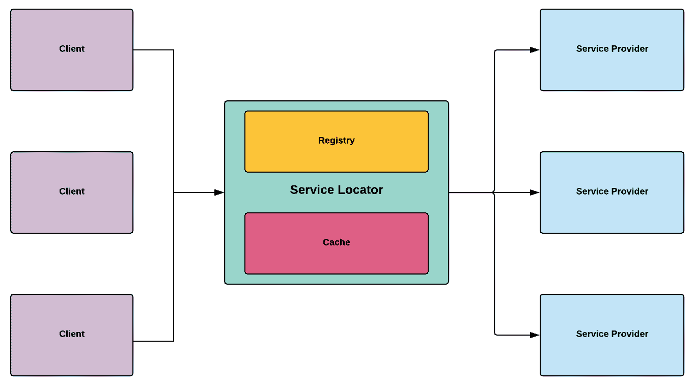

# 服务定位器

服务定位器是一个非常简单的模式，其名称完美地暗示了其目的，即定位服务。在游戏开发中，服务通常是提供特定功能的游戏机制相关的系统——例如：生成器、保存状态和在线连接。因为游戏主要由游戏内系统层组成，这些系统层相互通信、运行和同步以模拟交互式体验，所以服务定位器在系统组件之间创建了大量的依赖关系。

因此，通过一个中央定位器让服务相互查找可以简化组件之间的通信，同时避免显式引用系统可能需要以正确运行所需的依赖项的位置。这正是服务定位器模式所提供的：程序核心服务的全局访问点和注册表。

在本章中，我们将涵盖以下主题：

+   服务定位器模式的基本原理

+   实现一个作为运行时链接器的全局服务定位器

# 技术要求

下一章是实践性的，因此你需要对 Unity 和 C#有一个基本的了解。

我们将使用以下 Unity 特定的引擎和 C#语言概念：

+   泛型

+   单例

如果你对这些概念不熟悉，请回顾第六章，*单例*。

本章的代码文件可以在 GitHub 上找到：

[`github.com/PacktPublishing/Hands-On-Game-Development-Patterns-with-Unity-2018`](https://github.com/PacktPublishing/Hands-On-Game-Development-Patterns-with-Unity-2018)

查看以下视频以查看代码的实际效果：

[`bit.ly/2U8Mb6H`](http://bit.ly/2U8Mb6H)

# 服务定位器概述

服务定位器是一个简单的模式，它背后没有太多的学术理论，所以我们可以说它属于实用模式的范畴。正如其名称所暗示的，它为客户端定位服务；它通过维护一个提供特定服务的类别的中央注册表来实现这一点。这个注册表可以在运行时通过服务在可用时注册自己来动态更新。

服务定位器的另一个常见组件是其本地缓存，它使用与对象池相同的原理。服务定位器可能会在内存中保留其最常请求的服务实例，以避免使用过多的内存。

让我们回顾一个典型服务定位器实现的图解：



如我们所见，我们可以很容易地说，**服务定位器**在客户端（请求者）和服务提供者之间充当代理，这意味着两者之间的关系是解耦的。客户端只有在需要解决依赖项时才需要调用**服务定位器**。

重要的是要记住，软件架构术语“客户端”通常用来描述使用另一个类或其他类的功能性的类，它与应用程序的最终用户无关。系统可以是其他系统的客户端，而不需要任何人为输入。

# 好处和缺点

服务定位器是一个较新的模式；与更传统的模式相比，它在行业中的声誉相当有限。

以下是使用 Service Locator 的好处：

+   **运行时优化**：Service Locator 可以通过动态检测根据上下文更好的库或组件来优化应用程序。

+   **上下文运行时定位器**：内存中可以存在多个 Service Locators，每个 Service Locator 都针对特定的运行时上下文进行配置，例如测试、预发布和生产。

+   **比依赖注入更简单**：Service Locator 比依赖注入（DI）驱动的架构更容易实现，主要是因为它是一种集中式管理依赖的方法。

以下是使用 Service Locator 的缺点：

+   **黑盒化**：注册表中的服务可能对系统中的其他组件不可见。这种方法可能会使检测错误或回归变得更困难。

+   **安全漏洞**：根据代码库的整体架构，Service Locator 可能会允许注入代码，这些代码可能会利用您的系统。

+   **全局可访问**：如果实现为 Singleton，Service Locator 可能会遭受与全局可访问的管理器和组件相同的问题，使得它们更难进行单元测试。

# 用例示例

我们的使用案例将非常直接，我们不会专注于特定的游戏内系统。相反，我们将专注于构建一个简单的 Service Locator，它将能够动态地将客户端与服务链接起来：

+   **货币转换器**：一个将游戏内货币转换为现实世界价值的服务

+   **照明协调员**：一个管理我们场景中灯光的系统

+   **大厅协调员**：一个与多人大厅协调以设置“死亡比赛”的服务

但是，当然，我们可以向注册表中添加许多可用的服务，但在这个例子中，我们将专注于这三个。

# 代码示例

正如我们从下面的代码示例中将要看到的，实现一个基本的 Service Locator 是一个简单直接的过程：

1.  让我们先从实现最重要的成分开始：`ServiceLocator`类：

```cs
using System;
using System.Collections.Generic;

public class ServiceLocator : Singleton<ServiceLocator>
{
    private IDictionary<object, object> m_Services;

    public override void Awake()
    {
        base.Awake();
        FillRegistry();
    }

    private void FillRegistry()
    {
        m_Services = new Dictionary<object, object>();

        m_Services.Add(typeof(LobbyCoordinator), new 
        LobbyCoordinator());
        m_Services.Add(typeof(CurrencyConverter), new 
        CurrencyConverter());
        m_Services.Add(typeof(LightingCoordinator), new 
        LightingCoordinator());
    }

    public T GetService<T>()
    {
        try
        {
            return (T)m_Services[typeof(T)];
        }
        catch
        {
            throw new ApplicationException("The requested service is not found.");
        }
    }
}
```

1.  这个版本的 Service Locator 有两个主要职责：

    +   使用`FillRegistry()`函数管理注册表

    +   使用`GetService(T)`函数向客户端返回指定的服务

这两个函数指的是以`Dictionary`形式存在的中央注册表。当然，我们可以将这些职责分离到单独的类中，而不是将它们封装在局部函数中，但在这个例子中，我们将保持简单。

现在我们已经设置了服务定位器，我们现在可以开始为我们的客户端实现一些服务。

1.  我们的第一项服务是`货币转换器`；这在现代游戏中是必不可少的，考虑到它们通常包括游戏内购买和宝箱机制：

```cs
using UnityEngine;

public class CurrencyConverter
{
    public void ConvertToUsDollar(int inGameCurrency)
    {
        Debug.Log("Players in-game currency is worth 100$ US");
    }
}
```

1.  我们的第二项服务是`照明协调器`；它负责管理场景中的所有灯光：

```cs
using UnityEngine;

public class LightingCoordinator
{
    public void TurnOffLights()
    {
        Debug.Log("Turning off all the lights.");
    }
}
```

1.  我们的最后一项服务是`大厅协调器`；这确保了我们的玩家在需要时可以加入一个活跃的大厅：

```cs
using UnityEngine;

public class LobbyCoordinator
{
    public void AddPlayerToLobby()
    {
        Debug.Log("Adding a player to the lobby.");
    }
}
```

现在我们有三个服务，每个服务都有特定的职责，如果需要的话，可供客户端使用。但我们有一个明显的限制：目前，我们只能手动将服务添加到中央注册表，当然，这不是生产代码的最佳方法；然而，对于我们测试服务定位器的第一次实现来说，这是可以接受的。稍后，作为一个实际练习，明智的做法是为服务提供者添加动态注册到服务注册表的功能：

```cs
    // TODO: We need to be able to fill the registry dynamically.    
    private void FillRegistry()
    {
        m_Services = new Dictionary<object, object>();
        m_Services.Add(typeof(LobbyCoordinator), new 
        LobbyCoordinator());
        m_Services.Add(typeof(CurrencyConverter), new 
        CurrencyConverter());
        m_Services.Add(typeof(LightingCoordinator), new 
        LightingCoordinator());
    }
```

1.  现在，对于我们的最后一个类，我们将实现客户端：

```cs
using UnityEngine;

public class ClientServiceLocator : MonoBehaviour
{
    void Update()
    {
        if (Input.GetKeyDown("o"))
        {
            ServiceLocator.Instance.GetService<LightingCoordinator>
            ().TurnOffLights();
        }

        if (Input.GetKeyDown("c"))
        {
            ServiceLocator.Instance.GetService<CurrencyConverter>
            ().ConvertToUsDollar(10);
        }

        if (Input.GetKeyDown("l"))
        {
            ServiceLocator.Instance.GetService<LobbyCoordinator>
            ().AddPlayerToLobby();
        }
    }
}
```

一旦我们实现了客户端代码，我们就能欣赏到服务定位器的优势。我们现在能够访问代码库中的任何核心服务，而无需知道其类的位置或如何初始化它。我们有一个全局但简单的接口，可以从任何地方查询，它动态地将客户端与服务链接起来，同时解耦整个定位服务和初始化的过程。

# 摘要

在本章中，我们回顾了服务定位器模式，这是一种全局解决方案，可以解决依赖服务（功能）的对象之间管理的重复挑战。在其最简单形式中，服务定位器解耦了客户端（请求者）与服务提供者之间的关系。但在其最先进形式中，如果扩展到具有本地缓存的本地缓存，它还可以优化内存使用，当需要时可以重用提供者的实例。

在下一章中，我们将探讨依赖注入（DI）模式，可以说它在方法上与服务定位器相反，但具有相似的目的。

# 练习

在代码示例中，我们实现了一个简单的服务定位器版本，以便我们可以清楚地了解其核心意图和设计。但作为一个练习，我建议你将这个基本的服务定位器草案扩展成一个可以投入生产的版本，方法如下：

+   将注册表和缓存组件封装到自包含的类中。

+   使用工厂模式和原型模式组合实现缓存。

+   实现服务动态添加到注册表的能力。

+   为你的服务提供者编写一个标准接口，以便你可以有效地管理它们。

将设计模式视为爵士乐手对待旋律的做法是一种良好的实践。一旦你理解了一个模式的核心理念，就扩展它，即兴发挥，使其成为你自己的，同时保持对其基本设计的准确性。

# 进一步阅读

*控制反转容器和依赖注入* 模式，由马丁·福勒撰写([`martinfowler.com/articles/injection.html#UsingAServiceLocator`](https://martinfowler.com/articles/injection.html#UsingAServiceLocator))
