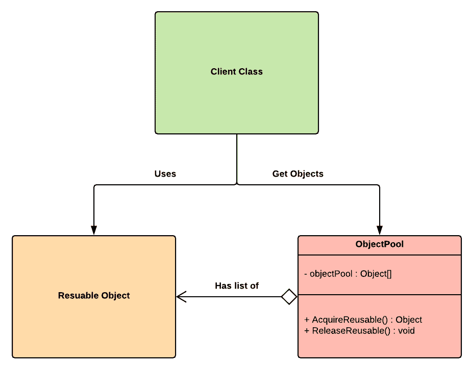
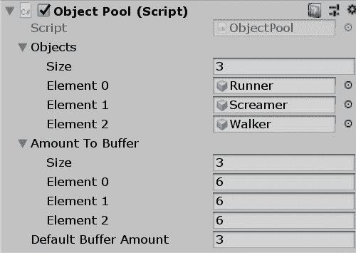

# 第十八章：对象池

对象池模式很容易理解；正如其名所示，它组织了一个对象池。可视化这个模式背后的设计意图的最简单方式是想象一个装满了各种颜色气球的游泳池。如果你愿意，你可以拿出所有的绿色气球，玩一玩，完成后，再放回去。换句话说，你始终有一组特定类型的对象可供使用，并在之后有一个地方来存储它们。

如果我们将这个概念转化为代码，我们得到的是已经包含在内存中的特定类型的对象，当我们需要时可以从中提取，完成后再将它们池化回内存。这种方法意味着我们为特定类型的现成对象使用了一个恒定的预留内存大小。正如你可能已经预想的，这对于视频游戏项目来说是一种非常优化的对象管理方式。

本章将涵盖以下主题：

+   我们将回顾对象池模式的基础知识

+   我们将实现对象池模式来管理僵尸游戏的可重用游戏对象

# 技术要求

本章是实践性的；你需要对 Unity 和 C#有基本的了解。

我们将使用以下特定的 Unity 引擎和 C#语言概念：

+   预制体

+   单例

+   命名空间

如果你对这些概念不熟悉，请在开始本章之前复习它们。

本章的代码文件可以在 GitHub 上找到：

[`github.com/PacktPublishing/Hands-On-Game-Development-Patterns-with-Unity-2018`](https://github.com/PacktPublishing/Hands-On-Game-Development-Patterns-with-Unity-2018)

观看以下视频，看看代码的实际应用：

[`bit.ly/2WutcB2`](http://bit.ly/2WutcB2)

# 对象池模式的概述

对象池模式通常在学术文档中被定义为一种创建型设计模式，但在这本书中，我们将它归类为优化模式，因为其核心目的与优化比创建过程更契合——至少在我们将要使用它的方式上是这样。

这个模式的核心概念很简单；一个以容器形式存在的池子包含了一组初始化后的对象。客户端可以请求对象池提供特定类型和数量的对象。一旦客户端使用完毕，必须将对象返回给对象池。这意味着池子总是会被填满，而不会耗尽。

以下图表展示了`Client`和`ObjectPool`之间的来回交互：



如你所见，可重用对象始终在内存中；只是它的所有者会在客户端和`ObjectPool`之间切换，这取决于它是否处于获取或释放状态。

# 优点和缺点

对象池模式在 Unity 开发者中相当受欢迎，但在更广泛的软件开发社区中也有其批评者：

**优点**：

+   **可预测的内存使用**：由于对象池模式是可配置的，您可以设置特定对象实例数量的限制。

+   **性能提升**：由于对象已经在内存中初始化，因此避免了初始化新对象时的加载成本。

**缺点**:

+   **在已管理的内存上分层**：有些人批评对象池模式在大多数情况下是不必要的，因为现代托管编程语言如 C#已经最优地控制内存分配。

+   **不可预测的对象状态**：对象池模式的主要缺陷在于，如果管理不当，对象将不会返回到其默认状态，而是返回到当前状态。这可能导致在下次从池中取出对象时出现不可预测的行为，因为对象可能处于意外的状态。

对比于普通的 PC 或游戏机，对象池对于移动游戏来说具有很多附加价值，因为手机内存和资源有限。

# 用例示例

与其他创建型模式一样，对象池在设计生成系统时可以是一个很好的模式。但这次，我们将专注于客户端直接从对象池中拉取和池化，而不在它们之间有任何抽象层，这样我们就可以看到系统的工作情况。

为了给下面的代码示例提供一些背景信息，让我们想象我们正在制作一个《植物大战僵尸》的克隆版。像大多数僵尸游戏一样，我们有成群的僵尸向目标移动。每个群体可以包含各种类型的僵尸，例如以下几种：

+   Walkers

+   Runners

但是，重要的是要考虑的是，每次我们的玩家杀死其中一个僵尸时，我们不必在内存中销毁被击败僵尸的实例，而是可以将其送回对象池，以便之后再次使用。采用这种方法，我们正在回收僵尸类型的实体，而不是初始化新的实体。

在下一节中，我们将实现此用例并对其进行调整，以便它与 Unity 的 GameObject 一起工作。

# 代码示例

仅通过阅读代码可能难以理解本章内容，因为我们正在场景内部管理预制体。因此，我们建议您在我们的 Git 仓库[`github.com/PacktPublishing/Hands-On-Game-Development-Patterns-with-Unity-2018`](https://github.com/PacktPublishing/Hands-On-Game-Development-Patterns-with-Unity-2018)上下载与本书相关的 Unity 项目。

在 Unity 项目中，应该有一个名为 Object Pool 的文件夹，其中包含一个场景，该场景将包含运行此示例所需的全部依赖项。

但是，如果 GitHub 地址不可用，以下是一个快速步骤列表，用于在 Unity 场景中执行以下代码示例：

1.  打开一个新的场景，添加一个空的`GameObject`，并将其命名为`Object Pool`。

1.  为每种僵尸类型创建一组预制体和相关脚本。以下是一些僵尸行为脚本的示例：

+   `Runner`:

```cs
using UnityEngine;

namespace Zombie
{
    public class Runner : MonoBehaviour
    {
        public void Run()
        {
            // Zombie runs!
        }
    }
}
```

+   `Walker`:

```cs
using UnityEngine;

namespace Zombie
{
    public class Walk: MonoBehaviour
    {
        public void Walk()
        {
            // Zombie walks!
        }
    }
}
```

+   `Screamer`:

```cs
using UnityEngine;

namespace Zombie
{
    public class Screamer : MonoBehaviour
    {
        public void Scream()
        {
            // Zombie screams!
        }
    }
}
```

1.  将`ObjectPool`脚本附加到`GameObject`对象池。

1.  在`GameObject`对象池的检查器中，配置`ObjectPool`实例将要管理的僵尸预制体列表。你可以参考以下截图作为参考：



现在，是我们编写`ObjectPool`类的时候了。正如你将看到的，它相当长，因此我们阅读它并随后审查其核心功能是至关重要的：

```cs
using UnityEngine;
using System.Collections.Generic;

public class ObjectPool : Singleton<ObjectPool>
{
        // The objects to pool.
        public GameObject[] objects;

        // The list of pooled objects.
        public List<GameObject>[] pooledObjects;

        // The amount of objects to buffer.
        public int[] amountToBuffer;

        public int defaultBufferAmount = 3;

        // The container of pooled objects.
        protected GameObject containerObject;

        void Start()
        {
            containerObject = new GameObject("ObjectPool");
            pooledObjects = new List<GameObject>[objects.Length];

            int i = 0;
            foreach (GameObject obj in objects)
            {
                pooledObjects[i] = new List<GameObject>();

                int bufferAmount;

                if (i < amountToBuffer.Length)
                {
                    bufferAmount = amountToBuffer[i];
                }
                else
                {
                    bufferAmount = defaultBufferAmount;
                }

                for (int n = 0; n < bufferAmount; n++)
                {
                    GameObject newObj = Instantiate(obj) as GameObject;
                    newObj.name = obj.name;
                    PoolObject(newObj);
                }

                i++;
            }
        }

        // Pull an object of a specific type from the pool.
        public GameObject PullObject(string objectType)
        {
            bool onlyPooled = false;
            for (int i = 0; i < objects.Length; i++)
            {
                GameObject prefab = objects[i];

                if (prefab.name == objectType)
                {
                    if (pooledObjects[i].Count > 0)
                    {
                        GameObject pooledObject = pooledObjects[i][0];
                        pooledObject.SetActive(true);
                        pooledObject.transform.parent = null;

                        pooledObjects[i].Remove(pooledObject);

                        return pooledObject;
                    }
                    else if (!onlyPooled)
                    {
                        return Instantiate(objects[i]) as GameObject;
                    }

                    break;
                }
            }

            // Null if there's a hit miss.
            return null;
        }

        // Add object of a specific type to the pool.
        public void PoolObject(GameObject obj)
        {
            for (int i = 0; i < objects.Length; i++)
            {
                if (objects[i].name == obj.name)
                {
                    obj.SetActive(false);
                    obj.transform.parent = containerObject.transform;
                    pooledObjects[i].Add(obj);
                    return;
                }
            }

            Destroy(obj);
        }
    }
```

因此，以下是对`ObjectPool`类中每个函数所发生情况的快速概述：

+   `Start()`: 在此函数中，我们正在初始化一个`list()`，它将包含我们的池化对象实例。

+   `PullObject()`: 通过调用此函数，客户端可以通过指定对象类型的名称来请求池中的对象实例。如果我们有存储，我们返回其实例；如果没有，我们初始化它的一个新实例。

+   `PoolObject()`: 客户端可以使用此函数将对象实例返回到池中。`ObjectPool`将使返回的对象失效，并将其作为子对象附加回自身，以便将其包含在内。

我们还可以看到，我们的`ObjectPool`类是一个单例；这是一种常见的做法，因为我们通常需要全局访问对象池，并且始终可用。要了解如何实现单例，请参阅第六章，*单例*。

下一步是使用`Client`类测试我们的`ObjectPool`：

```cs
using UnityEngine;

public class Client : MonoBehaviour
{
    void Update()
    {
            if (Input.GetKeyDown(KeyCode.G))
            {
                GameObject walker = ObjectPool.Instance.PullObject("Walker");
                walker.transform.Translate(Vector3.forward * Random.Range(-5.0f, 5.0f));
                walker.transform.Translate(Vector3.right * Random.Range(-5.0f, 5.0f));
            }

            if (Input.GetKeyDown(KeyCode.P))
            {
                object[] objs = GameObject.FindObjectsOfType(typeof(GameObject));

                foreach (object o in objs)
                {
                    GameObject obj = (GameObject)o;

                    if (obj.gameObject.GetComponent<Zombie.Walker>() != null)
                    {
                        ObjectPool.Instance.PoolObject(obj);
                    }
                }
            }
        }
```

我们的`Client`类相当简单：

+   如果玩家按下*G*键，我们从`ObjectPool`请求一个 Walker 僵尸的实例。然后，我们将它随机放置在场景中。

+   如果玩家按下*P*键，我们将场景中当前的所有 Walker 对象送回池中。

就这样；通过一个类，我们可以实现一个简单、可配置和可扩展的对象池。

# 摘要

我们刚刚将对象池模式添加到我们的工具箱中；这是 Unity 开发者最有用的模式之一，因为我们从代码示例中看到，我们可以轻松地回收场景中已经存在的 GameObject，而无需初始化新的 GameObject。当处理包含大量数据和组件的巨大预制体时，此模式可以帮助你避免不稳定的帧率。

在下一章中，我们将探讨空间分区模式——这是构建开放世界游戏时理解的一个重要主题。

# 练习

现在你已经学完了所有核心创建型模式，例如工厂模式、原型模式和对象池模式，将所有这些模式结合起来构建终极生成系统将是一项非常有价值的实践练习。目标是拥有一个系统，它可以重用特定类型的对象实例，并且只有在必要时才创建新的实例，如果需要，则使用工厂。

# 进一步阅读

+   《*游戏编程模式*》由罗伯特·尼斯特罗姆[`gameprogrammingpatterns.com`](http://gameprogrammingpatterns.com/)
