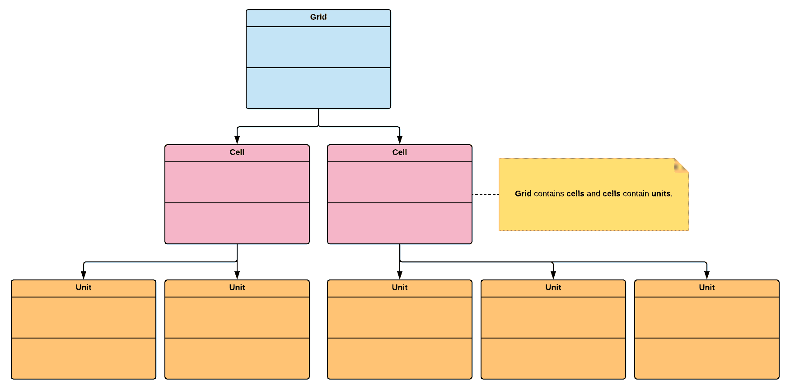

# 第十九章：空间划分

在本章中，我们将回顾空间划分模式；空间划分的概念在计算机图形学中很普遍，用于以最佳方式组织虚拟空间中的对象。这种方法也适用于管理 Unity 场景中放置的 GameObject。通过实现空间划分模式的核心原则，我们可以将充满二维或三维对象的大型环境划分为两部分，同时仍然能够保持一定程度的性能一致性。正如您在本章中将会看到的，这种模式是使大型 AAA 开放世界游戏制作成为可能的核心成分之一。

本章将涵盖以下主题：

+   我们将回顾空间划分模式背后的基本原理

+   我们将实现一个迷你游戏，其中捕食者在场景中猎捕猎物

# 技术要求

本章是实践性的，您需要对 Unity 和 C#有基本的了解。

我们将使用以下特定的 Unity 引擎和 C#语言概念：

+   LINQ

如果您不熟悉这个概念，请在继续之前进行复习。

LINQ 是一种非常强大的查询语言，与 SQL 有些相似；当您想简单地遍历数据结构时，它可以节省时间。

本章的代码文件可以在 GitHub 上找到：

[`github.com/PacktPublishing/Hands-On-Game-Development-Patterns-with-Unity-2018`](https://github.com/PacktPublishing/Hands-On-Game-Development-Patterns-with-Unity-2018)

查看以下视频，以查看代码的实际运行情况：

[`bit.ly/2FAyWCf`](http://bit.ly/2FAyWCf)

# 空间划分模式的概述

游戏程序员经常面临的问题是如何快速定位场景中与参考点最近的特定实体，例如玩家角色。在 Unity 中，有许多解决这个问题的方法，如下所示：

+   实现一个射线投射系统，该系统将扫描玩家角色周围的区域，并报告特定实体的位置。

+   使用 Unity 的 API 功能，例如`GameObject.Find()`函数，在场景中定位特定实体，然后比较它们的坐标与玩家角色的坐标。

第一个选项是有效的，但如果我们的三维环境复杂，可能很难定位我们正在寻找的所有实体，因为它们可能被其他对象遮挡，无法被射线相交。第二个选项在性能方面可能不是最佳选择，因为我们可能需要遍历包含场景中每个实体的列表，直到找到特定类型的每个实例。

我们可以通过使用空间分区模式来解决这种类型的技术挑战；它是为此目的而设计的。我们需要首先解决的问题是这个模式的名字。术语**空间分区**可能会误导：我们不是在组织或修改我们正在分区的虚拟空间。我们做的是相反的；我们在方程中移除空间。

我们通过将场景中的三维物体放入一个平面数据结构中来实现这一点，该数据结构在内存中有效地表示这些物体之间的距离，而无需对精确坐标进行计算。这种方法允许我们快速直接地计算找到最接近或最远离参考点的实体。

换句话说，我们正在将虚拟空间细分成一个更容易分析的结构。一个易于在内存中表示的通用结构（通常用于将空间划分为单个容器）是一个固定网格。在以下图中，您可以看到这个概念的可视表示。网格包含正方形，我们将它们称为**单元格**。这些单元格包含**单位**。这些单位可以是任何东西——一个特定的敌人角色类型或散布在广阔地图上的隐藏宝藏箱：



现在，让我们想象这个网格叠加在一个大型开放世界地图的 RPG 视频游戏上。每个单元格（正方形）代表一个虚拟的 2x2 平方公里区域。我们知道我们的玩家角色在地图上的一个特定单元格（正方形）中出生，但我们想给他提供快速前往一个充满他可以战斗的 2 级怪物的区域的选择。通过使用空间分区，我们可以轻松地计算内存中特定类型的最近实体，而无需扫描整个三维环境。

计算结果可以向我们建议一个包含 2 级敌人最大群体的附近单元格（正方形）。有了这个信息，我们可以将我们的玩家角色移动到建议单元格（正方形）内的随机位置，以便他可以掠夺该区域。正如您将在下一节中看到的那样，空间分区简化了管理位于复杂二维和三维空间中的实体的过程。

# 优点和缺点

这种模式的缺点相当有限（在大多数情况下并不存在），因为它非常容易使用。

优点如下：

+   **可重用性**：我们可以使用空间分区模式来优化我们管理由二维或三维空间中的实体组成的事物的方式（例如，用户界面）。

+   **简化**：空间分区使得实现计算对象之间空间关系的代码变得更加容易。这对数学能力不强的人来说非常有用。

缺点是：

+   **不太动态**：如果你试图管理在广阔区域内不断移动的实体，空间划分可能会失去其所有的优化优势。因此，如果你有一个场景中充满了以全速弹跳的物体，你需要不断地更新包含实体及其网格位置的集合的数据结构。在这种情况下，这个过程可能会消耗大量资源，不值得付出努力。

游戏程序员应该掌握的最重要技能是数学。了解设计模式对于进入行业是必要的，但它并不像对高级数学的深入理解那样重要。

# 用例示例

假设我们需要快速原型化一个简单的迷你游戏，该游戏模拟一个非玩家捕食者角色在地图上狩猎猎物。在环境中生成实体（猎物和捕食者）的过程并不复杂；实际上，它相当简单。然而，我们如何知道我们的捕食者是否接近潜在的猎物并将其移动到那里呢？

考虑以下可能的解决方案：

+   我们可以查询场景中的每个物体，并将它们的坐标与捕食者的坐标进行比较。

+   我们可以实现一个射线投射系统，扫描捕食者附近的每个物体，以发现潜在的猎物。

这些解决方案可能有效，但它们在短时间内实施可能会很繁琐。然而，使用空间划分模式，我们可以通过确保场景中的所有实体都包含在一个按相对位置组织猎物和捕食者的数据结构中来避免这个过程。正如你将在我们的代码示例中看到的那样，编写这个实现非常快且有用，尤其是在你匆忙并想在代码中草拟一些基本的 AI 导航行为时。

# 代码示例

以下代码示例可能看起来非常基础，但它可以很容易地扩展以实现更复杂的使用案例。从某种意义上说，它是一个我们将能够在此基础上构建的基础：

1.  让我们从实现我们模式的核心元素`Grid`开始：

```cs
using System;
using System.Linq;
using UnityEngine;

public class Grid: MonoBehaviour
{
    private int m_SquareSize;
    private int m_NumberOfSquares;

    public Grid(int squareSize, int numberOfSquares)
    {
        // The size can represent anything (meters, km)
        m_SquareSize = squareSize;

        // Squares permits to subdivide the grid granulary
        m_NumberOfSquares = numberOfSquares;
    }

    public void AddToRandomnPosition(IUnit unit)
    {
        unit.AddToGrid(UnityEngine.Random.Range(0, m_NumberOfSquares));
    }

    public int FindClosest(IUnit referenceUnit, IUnit[] list)
    {
        if (list != null)
        {
            // Using LINQ queries
            var points = list.Select(a => a.GetGridPosition()).ToList();
            var nearest = points.OrderBy(x => Math.Abs(x - referenceUnit.GetGridPosition())).First();
            return nearest;
        }
        else
        {
            throw new ArgumentException("Parameters cannot be null", "list");
        }
    }
}
```

你应该注意的第一件事是`AddToRandomnPosition()`函数，在其中我们通过`Random.Range()`调用将单位添加到网格中的方块。我们这样做有两个原因。我们想快速测试我们的`Grid`实现，所以我们模拟了实体在随机位置的环境中分散。我们还想展示我们如何结合使用空间划分和生成系统来管理特定优化网格空间内的实体生成。换句话说，我们可以在初始化将占据它的东西之前，在内存中对场景的虚拟空间进行划分。

另一个需要分析的功能是`FindClosest()`；请注意，我们使用了两个 LINQ 查询。第一个查询从一个单位列表中提取网格位置列表。第二个查询是查询这个列表，以找到相对于参考单位最近的单元格。对于那些从未使用过 LINQ 的人来说，它是一种内置的 C#查询语言，允许使用一行代码在集合中查找和提取元素。当你需要原型设计和快速编写使用数据结构和集合的实现时，这是一个非常出色的工具。

1.  现在，我们需要一种方法让我们的单位将自己注册到`Grid`的特定单元格中。让我们首先实现一个接口来管理我们的单位类型：

```cs
public interface IUnit
{
    // The Unit can add itself to the grid
    void AddToGrid(int cell);

    // The Unit can return is current grid position
    int GetGridPosition();
}
```

这是一个相当直接的接口；`GetGridPosition()`函数返回`Unit`的网格位置。可能出现的疑问是，为什么我们不实现一个返回`Unit`在场景中实际位置的函数？这是因为，在 Unity 中，如果一个 GameObject 附加了`Transform`组件，我们可以直接要求这个组件返回它在三维场景中的位置。换句话说，我们正在使用 Unity 的 API 为我们做繁重的工作。

1.  我们将为我们的代码示例实现两种类型的单位；让我们从`Prey`开始：

```cs
using UnityEngine;

public class Prey : MonoBehaviour, IUnit
{
    private int m_Square;

    public void AddToGrid(int square)
    {
        m_Square = square;
    }

    public int GetGridPosition()
    {
        return m_Square;
    }
}
```

1.  接下来是我们的`Predator`类；他猎捕我们的`Prey`：

```cs
using UnityEngine;

public class Predator : MonoBehaviour, IUnit
{
    private int m_Square;

    public void AddToGrid(int square)
    {
        m_Square = square;
    }

    public int GetGridPosition()
    {
        return m_Square;
    }
}
```

我们可以看到，我们的`Predator`和`Prey`都有两个主要职责，将它们的位置链接到网格中的特定单元格，并在需要时返回该单元格编号。

1.  最后，我们的`Client`类，我们使用它来在`Grid`上生成`Prey`并释放`Predator`，如下所示：

```cs
using UnityEngine;

namespace Pattern.SpatialPartition
{
    public class Client : MonoBehaviour
    {
        private Grid m_Grid;
        private IUnit[] m_Preys;

        void Start()
        {
            m_Grid = new Grid(4, 16);
            Debug.Log("Grid generated");
        }

        void Update()
        {
            if (Input.GetKeyDown(KeyCode.P))
            {
                IUnit prey;
                int numberOfPrey = 5;
                m_Preys = new IUnit[numberOfPrey];

                for (int i = 0; i < numberOfPrey; i++)
                {
                    prey = new Prey();
                    m_Grid.AddToRandomnPosition(prey);
                    m_Preys[i] = prey;

                    Debug.Log("A prey was spawned @ square: " + m_Preys[i].GetGridPosition());
                }
            }

            if (Input.GetKeyDown(KeyCode.H))
            {
                IUnit predator;
                predator = new Predator();
                m_Grid.AddToRandomnPosition(predator);
                Debug.Log("A predator was spawned @ square: " + predator.GetGridPosition());

                int closest = m_Grid.FindClosest(predator, m_Preys);
                Debug.Log("The closest prey is @ square: " + closest);
            }
        }

        void OnGUI()
        {
            GUI.color = Color.black;
            GUI.Label(new Rect(10, 10, 500, 20), "Press P to spawn prey on the grid.");
            GUI.Label(new Rect(10, 30, 500, 20), "Press H to hunt some prey.");
            GUI.Label(new Rect(10, 50, 500, 20), "Open Debug Console to view the output.");
        }
    }
}
```

就这些了；请注意，我们从未需要处理对象的实际三维坐标来找到它们的相对位置。通过将空间划分为网格并将对象包含在其中，我们避免了大量的不必要的计算。我们通过分块来降低复杂性。

当然，在我们的代码示例中，我们选择了简单的方法，在将`Units`添加到`Grid`中的特定方格之前，避免了计算它们的相对位置，但如果需要的话，这可以很容易地添加。最重要的启示是，如果我们可以在一个可以轻松搜索和操作的数据结构中分区和管理它们，我们就应该始终避免在三维空间中的实体上进行复杂的计算。

# 摘要

在本章中，我们采取了一种简单的方法来学习一个提供复杂问题解决方案的模式，即如何在空间中优化组织对象。我们现在有一个可以用来构建开放世界游戏和快速原型化以网格为中心的游戏（例如，解谜游戏）的工具。

在本书的最后一章，我们将回顾一个与我们刚刚探讨的内容完全相反的主题：反模式，它是设计模式的对立面。

# 练习

在我们的代码示例中，我们实现了一个关于空间划分模式的直接应用案例。然而，我们仅限于二维空间；作为一个实际练习，我建议在此基础上扩展这个基本示例，并在三维空间中组织对象。作为灵感，我建议观察魔方的结构设计。注意，它由一系列小立方体组成；每个小立方体都可以被视为一个组中的单元格。

# 进一步阅读

+   *《三维游戏编程与计算机图形学中的数学》* 由 Eric Lengyel 编著：[`www.mathfor3dgameprogramming.com`](https://www.mathfor3dgameprogramming.com/)
