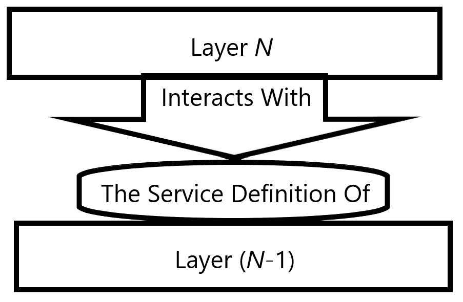
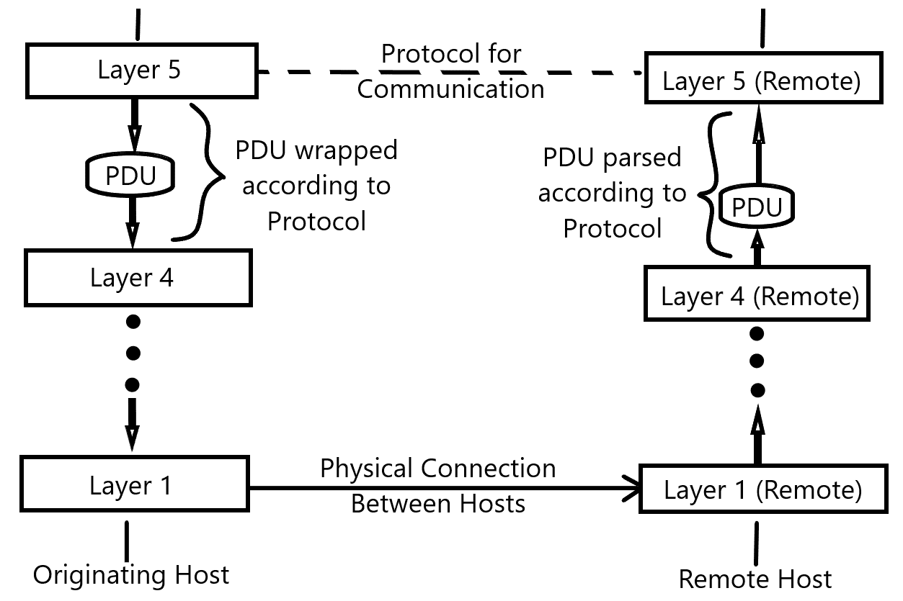

# 通信协议

我们在这本书的前两章中讨论了什么使得网络难以编程以实现开放通信和设备无关性。网络的这些方面需要标准化，在本章中，我们将探讨标准如何为网络软件提供一种共同的语言，通过网络软件进行通信。首先，我们将了解定义这些标准的监管机构。我们将简要了解他们是谁以及他们试图实现的目标。一旦我们了解了谁定义了网络的共同架构，我们将深入探讨他们是如何组织和分类网络层级的每一层的。

本章将涵盖以下主题：

+   当前网络架构标准的起源及其简要历史，以及负责该标准的组织背景。

+   应用代码如何通过应用层与网络资源交互，以及为该层提供的通信标准。

+   在网络架构标准中，数据如何在传输层上与网络进行通信或从网络中读取。

# 技术要求

与第一章“网络概要”一样，这将是对于为网络定义的标准的一种概念性考察。本书不需要特定的技术。我们将使用与之前章节相同的技术：NET Core 2.1 SDK 以及 Visual Studio Code 或 Visual Studio Community Edition 作为 IDE。

查看以下视频以查看代码的实际运行情况：[占位符链接]

# 开放系统互联（Open Systems Interconnection）网络栈

在通过网络从远程源发送或接收资源的过程中，有几个步骤，每个步骤都由负责执行这些步骤的网络工程师进行了深入考虑。在本节中，我们将探讨这些网络工程师是谁，以及他们是如何定义实现该过程中每一步的一般模式的。本节将全部关于 OSI，以及该规范如何定义特定网络设备的网络栈。

# 开放系统互联（Open Systems Interconnection）究竟是什么？

为了讨论通信协议，我们需要了解每个协议如何适应网络连接的更大图景，为此，我们需要一个共同模型来思考过程中的每一步。为此，我们有用于计算机和电信网络的 OSI 模型。该模型试图将标准化通信的不同步骤组织成一个抽象层级的分层模型。与我们在第一章“网络概要”中讨论的网络逻辑拓扑类似，OSI 模型存在于纯粹的概念和抽象层面。

正如其名所示，它被定义为在保持对模型中定义的任何层级在物理层面上最终如何实现完全无知的条件下，作为一个参考是有用的。事实上，许多通信协议或标准的实现并没有干净地映射到 OSI 网络模型上。然而，该模型被广泛认为是黄金标准，自从 1984 年正式化以来一直如此。因此，让我们看看它是如何成为这样的。

# OSI 的起源

对于网络实现需要一个标准化模型的需求几乎在 networking 成为可能的同时就变得明显。为此，早在 1970 年代末，两个不同的组织开始着手定义这样一个模型，以实现这一目标。这些组织中的第一个是**国际标准化组织**（**ISO**）。另一个组织在几乎同一时间开始解决相同的问题，即**国际电报电话咨询委员会**（**CCITT**，该名称的法文翻译的首字母缩写）。

有趣的是，国际标准化组织（ISO）的简称并不是该组织名称的缩写词。相反，由于该组织的名称在每种认可的语言中都会有所不同，成员们选择将名称缩短为 ISO。这是指希腊语的 isos，意为相等，反映了该组织实现平等理解的宗旨。

两个组织几乎在同一时间寻求定义自己的模型这一事实并不完全令人惊讶。这个问题被众多学科的工程师所面临，缺乏标准化很快成为这些学科进步的瓶颈。然而，令人惊讶的是，这些解决方案彼此之间是多么相似。就像莱布尼茨和牛顿独立发明微积分一样，这些组织意外地找到了一个共同的解决方案来解决他们共同的问题。然而，这个愉快的巧合有助于加快标准化过程，因为它们解决方案的相似性有助于验证这两个模型都极有可能正确。

由于两个组织的努力都取得了成功，因此仅用了几年时间，这两个模型就被合并为一个单一的标准。因此，在 1983 年，OSI 的基本参考模型诞生了。随着时间的推移，该名称当然被缩短为 OSI 模型。到 1984 年，每个组织都在自己的官方参考文件中发布了这个新的共享模型，将模型及其特定的协议正式化，并在国际社会中确立。因此，让我们看看这个模型包含哪些内容。

# 基本参考模型

基本参考模型由 ISO 正式化为标准 ISO-7498（以及由 ITU 正式化为标准 X.200，CCITT 的继任者）。该模型可以被干净地分为两部分。第一部分是网络的基本抽象参考模型。第二部分是组织认为适合标准化并用于实现参考模型的协议列表。

参考模型定义了网络通信流，这是由网络上的合规设备实现的，以七个不同的概念层级或层的形式组织在堆栈中。这个堆栈被定义为从物理媒体上原始比特的传输开始，一直到可能使用网络上任何资源的低级应用软件。 

对于我们的目的而言，当我们描述这些层级时，当我们说一个层在堆栈中更高时，我们指的是离物理介质上位传输的硬件层级更远。

该模型定义了层之间单向交互的严格机制。根据这个通信标准，一个给定的层只能通过由该下层暴露的抽象接口与直接下方的层进行通信。这个接口被称为层的**服务定义**，它定义了高层可以通过哪些有效操作与任何低层进行交互。OSI 网络堆栈层之间的交互模型显示了相同的情况：

当数据通过堆栈的层级移动时，每一层都会用自己的一系列头部和尾部包装数据包，以便由接收设备解析。这包含了关于数据包起源于堆栈中哪一层的详细信息，以及如何解析它。在网络堆栈中，层与层之间传递的数据包被称为**协议数据单元**（**PDU**）。

当服务定义提供从一层到其下一层交互的接口时，**协议**则为网络堆栈中给定层级的实体提供标准化的交互，以便直接与远程主机上同一层级的相应组件进行交互。这些协议假设原始主机堆栈中的交互顺畅，然后在远程主机上反向堆栈。一旦它冒泡到远程主机的目标层，协议就确定接收实体应该如何处理数据。

因此，我们可以如下描述通过 OSI 堆栈的数据传输整个过程：

1.  原始主机上的实体在网络的 N 层创建一个数据包，称为 PDU。

1.  原始层通过利用其下一层的服务定义将其传递到堆栈中。

1.  低层接收 PDU，每一层都会用一组头部和尾部包装它，以便由远程主机上的相应层解析。

1.  一旦 PDU 被堆栈最底层的层封装了头部和尾部，它就被传输到远程主机。

1.  远程主机上的堆栈每一层都移除了由源主机相应层应用的头部和尾部，将 PDU 通过堆栈向上传递。

1.  PDU 由远程主机上的第 **N** 层接收。接收层随后根据第 **N** 层协议的规范解析 PDU 的数据，*如源主机所指定。

就这样，我们的数据可靠地通过网络传输。这是使用协议通过网络堆栈中每一层的定义来传输数据单元的完整、如果说是抽象的过程。我知道，一次性吸收这么多信息可能有些困难，但随着我们更完整地构建这幅图景，它将变得稍微清晰一些。因此，让我们看看堆栈的各个单独层是什么，为什么它们以这种方式排序，以及它们最终负责什么。

# 网络堆栈的层

当我们检查网络堆栈的每一层及其最终负责的内容时，有一些关键事项需要记住。首先，记住这个模型在本质上是非常抽象的，并且仅作为参考。因此，有时可能不清楚某个责任或任务属于哪一层。其次，记住，当我们讨论堆栈中每一层的责任时，我们是在具体讨论该层在数据通过网络成功传输方面的责任。*因此，在网络堆栈的上下文中，会话层的责任与在 Web 应用程序上下文中管理用户会话的责任完全独立。

最后，记住，随着我们向下移动到堆栈的更深处，我们离通过物理介质传输数据就越近。*我们将按从上到下的顺序编号我们的层，这样数字越小，我们就越接近线上的信号。这将在考虑为什么某一层比另一层低，以及其责任如何与上层责任不同时有所帮助。考虑到所有这些，让我们从头到尾深入探讨 OSI 网络堆栈。

# 主机/媒体的区别

关于网络堆栈的第一件事要理解的是，你可以看到不同级别的抽象。从概念上讲，你观察网络交互的位置越高，层就越少，区分这些层的责任也就越容易。同时，当你构建一个更接近其具体实现的模型时，你会看到模型中每个实体更微妙的角色和责任之间的区别。我们将要查看 OSI 参考模型提供的完整、低级模型，但我想要花一点时间来考虑网络实体之间的高级区分，这可以分为两个基本层。

这些层中的第一层是主机层。它封装了 OSI 堆栈的四个更高层，并描述了特定主机在网络上尝试通信的实体或特定责任。在两个网络主机之间双向通信的最基本背景下，每个主机完全负责其自身在主机层下聚合的 OSI 层的实现（因此得名）。将应用数据打包、指定编码和可靠性期望以及向特定目标发送 PDU 的方法都大致属于主机层。

在网络的高级视图中，第二层是媒体层。这些层描述了两个主机之间网络组件的物理实现。这提供了主机层实体所指定或请求的预期功能。这个层的实体通常在硬件级别或 C 或 C++等低级系统语言中实现。因此，这个层的实体通常超出了本书的范围。然而，C#提供了封装和表示该层实体功能的抽象，因此了解媒体层下层的层如何在基本层面上实际工作是很重要的。

在做出这一高级区分之后，让我们来看看网络的完整 OSI 模型，从最顶层开始。

# 应用层

网络堆栈的最顶层也是开发者在其职业生涯中会与之互动最多的层。应用层为与网络通信的交互提供了最高级别的接口。这是业务应用软件用来与堆栈其他部分交互的层。应用层上的实体使用了多种协议，我们将在本章后面讨论它们。不过，现在重要的是要记住，应用层是实际终端用户应用与 OSI 网络堆栈之间的接入点。

# 表示层

虽然听起来像是一种视觉表示数据的方式，但表示层实际上是一种定义数据如何被任何想要查看它的消费者解释的方式。这一层为来自不同主机的应用层实体提供了相互交互 PDU 的上下文。表示层上的实体负责描述从应用层传递的数据在给定数据事务的另一侧应该如何被解释。它完成了将 PDUs 的编码或序列化从应用层实体的更高层业务逻辑中抽象出来的工作。

# 会话层

会话层上的实体负责在网络上两个主机之间建立、维护、恢复和终止一个活跃的通信会话。在这个层上工作的实体提供如全双工交互、半双工交互和单工交互等通信机制，这些机制由所使用的协议约束指定。

# 全双工、半双工和单工通信

当两个主机之间建立会话时，有几种方式可以在该会话上进行通信。最常见的是全双工和半双工实现。这些只是简单地描述了一个连接的双方都可以进行通信的会话。

在全双工会话中，双方可以同时相互通信。这种通信的典型例子是电话通话。在电话通话中，双方可以同时说话并听到对方在说话。一个人在说话的同时还能听到别人对他说的话，这允许更高效的数据传输，并可以促进可靠的通信系统。

半双工系统是一种双方可以在会话中通信，但一次只有一个参与者可以通信的系统。这种系统的常见例子是对讲机或步话机。在这些系统中，激活一个无线电的麦克风会锁定频道，防止另一个无线电传输，直到第一个麦克风被断开。这可以在有限的带宽上提供更可靠的通信，因为信号干扰的机会更少。

最后，单工通信会话是指只有一个参与者实际上可以传输数据的情况。也就是说，有一个发送者和一个接收者。这种通信的常见例子是网络电视；有一个单一的广播源，有多个接收器实际接收传输的信号。在大多数现代通信网络中，这种情况并不常见，因为实现双工通信会话的额外成本通常与单工连接相比微不足道。然而，应该注意的是，双工通信系统只是一个由两个单工连接组成的系统，每个主机之间有一个连接方向。

# 传输层

传输层中的实体使用专门为与其他主机以及中间网络实体交互而设计的协议。鉴于我们对表示层和会话层的描述，这似乎是多余的；然而，这里有一个重要的角色要扮演。表示层关注字符编码，即从平台特定的数据表示到平台无关的描述的映射。然而，传输层查看由表示层传递下来的完整编码数据块，并确定如何将其拆分。它负责将数据切割成其他情况下无用的二进制流段。并且，重要的是，它以这种方式拆分这些段，以便它们可以在连接的另一侧重新组装。传输层还负责错误检测和恢复，不同的协议提供不同级别的可靠性。

这一层是之前描述的主机层伞形结构中的最低层。确定主机可以和将支持哪种传输机制是主机的责任。然而，这是给定主机在成功实现网络交互中的最低边界。此层以下的所有内容都落入媒体层，这是支持主机部署的网络工程师的责任。

# 网络层

网络层中的实体管理网络拓扑结构上的交互。它们负责地址解析，并在地址解析后将数据路由到目标主机。它们还根据物理网络的约束或资源可用性处理消息传递。因此，虽然传输层确定连接两端的网络堆栈主机层之间的交互，但网络层负责在形成两个主机之间路由的设备链上应用传输协议。相邻层之间的区别可能很微妙，我们将在本章后面讨论一些特定于网络层的责任。所以，如果传输层和网络层之间的区别不清楚，请相信我们（至少，尝试）会在后面澄清这一区别。

# 数据链路层

数据链路层非常明显地属于媒体层分组，因为这个层中的实体负责在网络中的节点之间实际传输数据。它负责从物理层检测错误，并控制节点之间通过物理媒体传输比特流的流量。例如，在半双工通信设置中，数据链路层中的实体负责在另一方向数据传输时限制一个方向的数据传输。这个层中的实体几乎充当了在节点到节点连接的道路上指挥交通的红绿灯。根据电气和电子工程师协会（**IEEE**）的标准 802，数据链路层被进一步细分为两个子层。这两个子层如下：

+   **介质访问控制**（**MAC**）子层：这个子层控制哪些实体可以通过数据链路层传输数据，以及数据如何传输。

+   **逻辑链路控制**（**LLC**）子层：这个子层封装了网络交互的逻辑协议。它本质上是一个接口，提供实体链接作为一系列抽象协议操作。

为了说明数据链路层在网络责任方面的具体性，它最常用的协议是**点对点协议**（**PPP**）。这仅仅突出了数据链路层的实体实际上只关注促进两点之间的连接。

# 物理层

最后，我们到达了堆栈的底部，这是最容易理解的层。物理层封装了负责将原始、无结构数据从网络中的一个节点传输到另一个节点的实体。这是负责发送与数据包中比特串相对应的电气信号的层。它封装了负责调制电压、定时信号以及无线发射机和接收机频率的设备。这个层中的实体明确地超出了本书的范围，但无论如何都是一个有趣的问题。

# 将所有这些放在一起

现在，我们已经看到了 OSI 模型是如何组织数据传输责任的。希望到这一点，你应该已经清楚每一层在堆栈中的意图是为它上面的层提供一个可靠的抽象。然而，与远程主机进行通信的整体过程可能仍然显得有些模糊。所以，让我们考虑一个具体的例子，并在数据传输过程中，针对我们讨论的每个概念进行说明。

首先，让我们假设我们的主机（会话层）的第 5 层上的一个实体想要与远程主机上的**第 5 层**上的一个实体建立会话。我之前没有明确说明，但我们总是可以假设一个主机上给定层上的实体只与远程主机上同一层的相应实体直接通信。因此，在我们的例子中，第 5 层的实体将与也位于第 5 层的远程实体通信。

与远程实体通信总是通过**协议**进行的。鉴于这一点，任何寻求与远程主机通信的实体的首要责任是将传输数据包裹在适当的协议头部和尾部中。对于我们的会话层实体，假设他们希望通过**会话控制协议**（SCP）建立会话。这意味着我们的本地实体将生成建立会话所需的数据，然后将这些数据包裹在 SCP 头部和尾部中，创建一个格式良好的 PDU（希望这清楚地说明了为什么这个名字描述了这个包）。这确保了接收主机将能够根据我们 PDU 头部和尾部中存储的信息解包数据。

由于位于物理层之上的任何层中的实体不能直接相互通信，我们必须将我们的 PDU 向下传递到堆栈。在我们的例子中，我们可以通过利用其服务定义并相信通过该定义公开的逻辑操作被所有位于**第 5 层**以下的负责实体准确实现，来可靠地将 PDU 向下传递到**第 4 层**。因此，我们不需要知道**第 4 层**如何实现传输机制。相反，我们只需要求它使用适用于此特定实例的适当传输机制，并相信它会适当地这样做。

这种相信堆栈中较低层将正确实现堆栈中较高层请求的操作的模式一直延续到**第 1 层**。在这个过程中，堆栈中的每一层都会在其 PDU 上添加自己的头部和尾部。这些标准化的数据块为接收主机上的每个中间层提供了足够的信息，以便知道将 PDU 向上传递到自己的堆栈。通过持续地将数据包裹在格式良好、易于理解的二进制数据块中，远程主机上的每一层都可以信任向上传递的数据段正是应该向上移动的内容。

这个将 PDU 包裹在越来越深的元数据层的过程一直持续到我们达到**第 1 层**。**第 1 层**承载着我们的主机与远程主机之间的物理连接。一旦达到这个级别，我们就可以跨越网络的广阔空间，开始观察我们的 PDU 如何沿着网络栈向上移动，直到它到达目标实体的**第 5 层**。远程主机每一层的实体都将勤奋地移除并读取由原始主机相应层应用的头部和尾部。这些包装器中的信息将表明 PDU 是发往当前层之上的一个层。因此，实体将简单地移除它们的头部，并将剩余的数据向上推送到网络栈。

当数据达到远程主机的第 5 层时，该层的一个实体将读取在原始主机的**第 5 层**上应用的 PDU 头部和尾部。这些元数据将表明第 5 层实际上是这个特定 PDU 的目标层。元数据还将指示应该使用什么**协议**来解析传递给远程主机的数据。使用这些信息，接收主机将有足够的数据正确读取 PDU 中的数据，并构建它自己的响应 PDU。

一旦原始主机收到响应，就会建立一个会话，并可供原始主机或远程主机会话层之上的任何实体使用。整个过程在以下 OSI 栈数据传输全生命周期的图中得到体现：

考虑到这个图，很容易看出 OSI 模型提供的标准化如何使工程师更容易为网络编写软件。关注点的清晰分离和通过栈传递数据的明确模式允许形成良好的契约，所有相关方都可以据此设计和开发。在应用层编程实体的工程师可以忽略数据传输的细节。他们只需通过栈向下传递一个格式良好的 PDU。

希望这个描述能够阐明特定层上的实体如何通过服务定义来暴露它们的抽象，以及处于不同主机上同一网络栈层的实体如何通过协议可靠地通信。带着这个观点，让我们更深入地看看我们将要频繁编程的这些栈层，以及 C#提供的用于表示这些层实体的类。

# 应用层

我之前提到过，但值得再次强调，应用层是日常网络编程的大部分工作将发生的地方。这在.NET Core 框架中尤其如此，因为该框架提供的库为必须在栈的较低层编程的实体或责任提供了广泛清洁、易于使用的抽象。因此，首先，让我们看看为什么我们应该如此关注应用层的责任。我们将查看通常委托给该层实体的责任类型，并看看这些责任与日常.NET Core 开发者面临的要求重叠的频率。然后，鉴于应用层实体的广泛用例，我们将查看该层实体使用的某些常见协议。我们将从基本层面理解它们。我们将查看我们为每一层可用的类和库；然而，在本书的这一章之后，我希望你将拥有足够的理解，能够自己重构这些类。

# 栈中最常见的层

在这一点上可能感觉有些重复，但确实值得强调的是，应用层是绝大多数.NET 开发者将要进行网络编程的地方。既然这占了你们中的大多数，我们将继续讨论它。但*为什么*应用层如此重要？

其核心在于应用层充当了业务逻辑对网络活动的大门。当你深入探索.NET 如何彻底隐藏了网络栈低层任何责任实现的细节时，这一点变得非常明显。本质上，如果你需要在栈的任何位置指定关于你的应用程序应该如何行为的内容，你将通过一个.NET 库类来完成。

我真的无法强调理解协议底层行为的重要性。了解库是如何实现的将使你在未来使用它们时更加得心应手。这就像学习手动换挡一样。如果你只学会了换挡所需的步骤，没有持续的练习，你可能会变得生疏。随着时间的推移，你可能会忘记足够多的东西，以至于无法再驾驶手动变速器。然而，如果你学会了这些步骤是如何让你的汽车行驶的，你将永远不会忘记这些步骤本身。即使你已经很多年没有开过手动变速器，你也能根据对这些步骤实际完成的事情的理解来重建所需的步骤。按照同样的标准，理解.NET 核心库为你做了什么将使你能够更高效、更正确地使用它们。你会发现你不需要经常查阅文档，并且能够通过 IntelliSense 更好地找到你需要的函数或属性。话虽如此，让我们仔细看看最常见的网络层协议中的一些最常见协议。

# HTTP – 应用程序到应用程序的通信

欢迎来到几乎所有当前正在工作的.NET Core 开发者的基本功。HTTP 是目前应用最普遍且最有用的网络交互协议。为什么这么说呢？因为 HTTP 是互联网上几乎每个网页都是由远程主机提供并由本地客户端请求的协议。仅此一点就足以称其为使用最普遍的协议。如果你还需要更多证据，那么考虑一下，大多数提供托管在 Web 上的数据的原生移动应用程序都是从通过 HTTP 公开的 API 请求这些数据的。几乎感觉没有必要为理解 HTTP 的重要性进行辩护，因为我确信阅读这本书的每个人至少都有一些与 HTTP 相关的经验或理解。

那么，为什么还要如此彻底地介绍它，如果大多数读者都被假设对它有一些基本了解呢？答案有两个方面。首先，这是因为它作为一种通信协议是多么普遍！HTTP 如此普遍，如果不给予它应有的考虑，那就犯了刑事上的疏忽。第二个原因是，至少在我个人的经验中，大多数开发人员，甚至是每天与之打交道的工程师，对规范提供的了解只是肤浅的或表面的。我的希望是，到这本书的结尾，任何从头到尾读过这本书的人都能自信和熟练地编写利用目标网络每个方面的软件。没有对 HTTP 是什么、为什么被定义以及每天每秒都有数千个应用程序如何使用它的深入、全面的理解，这是不可能做到的。考虑到这一点，让我们来看看这个协议。

# 什么是 HTTP？

几乎每一位这本书的读者可能都已经对着页面大喊，让我们继续到 HTTP**。**正如已经显而易见的那样，HTTP 是在 OSI 网络堆栈的应用层中实现并由软件利用的协议。它是通过互联网暴露的应用程序的主要通信机制，旨在在网络中传输超媒体。超媒体通常指的是包含多媒体信息的超文本文档，以及可以用来导航到并从其他远程主机加载额外资源的超链接。

HTTP 的传输组件本质上是一种请求/响应协议，它假设在活跃的 HTTP 会话中，主机之间存在着客户端-服务器的关系。为了理解这是如何实现的，让我们从客户端-服务器关系的概念开始。

# HTTP 中的客户端-服务器模型

在本章中，我们一直将网络上的通信简单地描述为发生在源主机和目标主机之间，好像这两个主机在功能上是相同的，这取决于哪个在发送数据包。然而，在客户端-服务器模型中，这两个主机实际上执行着不同的特定任务，因此它们在概念上不可互换。客户端实体是请求并得到使用由服务器实体（或称为服务端）提供的（或称为服务的）服务或资源的实体。服务器不会主动向客户端发出请求，除非这是完成客户端已经提出的某个服务请求所必需的（例如，当客户端通过请求受保护的数据来启动事务时，从客户端请求额外的登录信息）。同样，客户端也不需要向服务器提供任何特定的资源，除非这些信息对于服务器足够处理并响应请求是必要的。

现在，两个应用程序使用 HTTP 相互交互并不罕见，在这种情况下，根据交互方式，任一应用程序都可以被认为是客户端或服务器。例如，一个桌面财务应用程序可能负责存储本地用户数据，同时使用远程 API 来访问关于不同类型贷款的当前利率的实时数据流。现在假设该桌面应用程序的作者想要定期访问有关其软件用户的信息。在用户登录其应用程序以查找抵押贷款市场利率的情况下，桌面应用程序将从远程 API 请求信息；因此，桌面应用程序是客户端，而 API 是服务器。然而，当远程软件决定查询其桌面应用程序的实例以获取用户数据时，角色会颠倒。远程软件将从桌面应用程序的已知主机请求数据；在这种情况下，远程软件是客户端，从运行桌面应用程序的计算机请求信息，这些计算机是服务器。

或者，一个应用程序或主机可能是一个远程主机的客户端，同时作为另一个远程主机的服务器运行。考虑这样一个 API 的例子，它通过聚合来自多个其他 API 的信息来响应请求。在为下游消费者提供服务请求的过程中，相关应用程序显然是一个服务器。然而，当应用程序从其他 API 上游请求信息时，它扮演的是客户端的角色。

我提出这些例子是为了强调客户端-服务器关系主要是概念性的。将客户端或服务器角色分配给特定主机是特定于特定交互上下文的。如果该上下文发生变化，那么涉及的宿主的观念角色也可能发生变化。我们只在与特定交互上下文相关的范围内提及客户端和服务器，以避免混淆是很重要的。

# 请求/响应

在描述客户端-服务器关系时，我们也触及了 HTTP 请求/响应协议的本质。作为提供信息的一种方式，该协议相当直观易懂。当客户端向服务器发出请求（请求/响应中的请求部分）时，如果服务器符合协议规范，它应预期以有意义的信息响应该请求的成功或失败，并提供最初请求的具体数据。

有时，请求信息和接收有意义响应的完整过程需要客户端和服务器之间进行几次中间往返，以建立初始连接，确定服务器处理请求的能力，然后提交启动请求所需的信息。然而，从应用层软件的角度来看，整个过程将被视为一个单独的请求/响应会话。这很自然地引出了我们最初是如何建立这些会话的问题。

# HTTP 会话

到目前为止，我们讨论了 HTTP 请求/响应通信模式的来回过程，但我们忽略了允许这种交流如此无缝发生的环境。这种流畅的交互是由客户端发出的第一个请求之前建立的底层会话所促进的。历史上，这种会话是由针对主机服务器上特定端口的**传输控制协议**（**TCP**）连接提供的。当指定目标主机时，可以在 URI 中指定此端口，但通常将使用 HTTP 的默认端口，例如`80`、`8080`或`443`（用于稍后本书中将要介绍的 HTTPS）。一旦建立连接，HTTP 通信的往返就可以自由进行，直到会话终止。

你可能已经注意到，我特别提到 TCP 在历史上被用于 HTTP。这是因为，对于 HTTP 的当前所有版本（1.0、1.1 以及现在的 HTTP/2），TCP 一直是支持它的标准传输层协议。然而，在当前提出的 HTTP/3 规范中，该协议正在被修改以利用替代传输协议，包括**用户数据报协议**（**UDP**），或者谷歌的实验性**快速 UDP 互联网连接**（**QUIC**）协议。虽然这些替代传输协议有一些权衡，但它们提供的底层会话对我们来说是一样的。每种协议都旨在与监听主机建立连接，并促进请求和响应消息的传输。接下来，让我们看看客户端可能请求服务器执行的一些操作，以及这些操作是如何通过 HTTP 标准中的请求动词来指定的。

# 请求方法

当客户端想要向服务器发送请求时，它必须指定服务器将如何响应该请求的方法。这些方法规范通常被称为**HTTP 动词**，因为它们大多数描述了服务器在处理客户端发送的请求时将采取的动作。标准方法如下：

+   **OPTIONS**：此操作返回服务器在给定 URL 上支持的其他 HTTP 方法列表。

+   **TRACE**: 这是一个实用方法，它将简单地回显服务器接收到的原始请求。这对于识别在请求传输过程中网络实体对请求所做的任何修改非常有用。

+   **CONNECT**: CONNECT 请求在源主机和远程主机之间建立一个透明的 TCP/IP 隧道。

+   **GET**: 此操作检索由 HTTP 请求发送的 URL 指定的资源的副本。按照惯例，GET 请求将仅检索资源，而不会对服务器上资源的状态产生任何副作用（然而，这些惯例可能会被书中稍后提到的糟糕的编程实践所破坏）。

+   **HEAD**: 此方法请求与对给定 URL 的 GET 请求相同的响应，但不需要响应体。返回的内容只有响应头。

+   **POST**: POST 方法在请求体中传输数据，并请求服务器将请求体的内容作为由服务器托管的新资源存储。

+   **PUT**: PUT 方法与 POST 方法类似，客户端请求服务器存储请求体的内容。然而，在 PUT 操作的情况下，如果请求 URL 上已经存在内容，则该内容将使用请求体的内容进行修改和更新。

+   **PATCH**: PATCH 方法将对请求 URL 的资源执行部分更新，使用请求体的内容对其进行修改。如果没有在服务器上找到要修补的资源，则典型情况下 PATCH 请求将失败。

+   **DELETE**: DELETE 方法将永久删除指定 URL 的资源。

服务器不会对针对给定位置的请求方法做出响应，除非服务器已被配置为这样做。这是因为 HTTP 标准定义的一些方法可能会永久影响该服务器上资源的状态，因此只有在安全地不可撤销地更新该状态时才应调用和处理。然而，按照惯例，有许多方法被指定为安全的。这仅仅意味着它们可以被服务器处理，而不会对该服务器上资源的状态产生任何副作用。HEAD、GET、OPTIONS 和 TRACE 都按惯例指定为安全。

# 状态码

即使应用程序已构造了一个有效的 HTTP 请求对象，并将其提交到活动主机上的有效路径，服务器无法正确响应的情况也并不少见。因此，HTTP 将状态码指定为响应对象的一部分，以传达服务器正确处理请求的能力。按照惯例，HTTP 状态码是作为每个响应的一部分返回的 3 位数数字码。第一位数字表示响应的一般性质，第二位和第三位数字将告诉您遇到的精确问题。这样，我们可以这样说，状态码是根据它们的第一位数字进行分类的。

当你编写响应 HTTP 请求的软件时，向不同的错误发送准确的状态码非常重要。HTTP 是一个标准，开发者必须遵守才能保持其有用性。

HTTP 状态码的第一位数字只有五个有效值，因此有五个响应类别；它们如下所示：

+   **1XX：信息状态码**。这表示请求确实已接收，并且该请求的处理正在继续。

+   **2XX：成功状态码**。这表示请求已被成功接收并响应。

+   **3XX：重定向**。这表示请求的主机必须将它们的请求发送到新位置才能成功处理。

+   **4XX：客户端错误**。这是一个由客户端操作产生的错误，例如发送格式不正确的请求或尝试从错误的位置访问资源。

+   **5XX：服务器错误**。服务器出现故障，阻止其能够满足请求。客户端正确提交了请求，但服务器未能满足它。

状态码是服务器对每个针对服务器的 HTTP 请求返回的，因此对于构建客户端软件的弹性非常有用。

# HTTP 消息格式

HTTP 中的请求和响应始终以纯文本消息发送。这些纯文本消息由一系列有序且结构良好的消息段组成，这些段可以被接收者可靠地解析。在请求中，消息由三个必需的消息组件和一个可选组件组成：

+   请求行由方法、请求资源的路径以及用于确定消息其余部分有效性的特定协议版本组成；例如，`GET /users/id/12 HTTP/1.1`。

+   一系列请求头及其值，例如，`Accept: application/json`。

+   一个空行。

+   （可选）请求消息体。这包括内容头，它提供了关于内容类型以及内容的元数据，以及内容本身。

每个段由一个`<CR>`回车字符和一个`<LF>`换行字符分隔；这些是特殊的空白字符，它们的特定**美国信息交换标准代码**（**ASCII**）值允许它们可靠地用于在消息流中指示段之间的分隔。

同时，HTTP 响应由其几乎具有相同结构的多个段组成，每个段也由`<CR><LF>`字符分隔。就像请求消息一样，它包含三个必需的段和一个可选的消息体段，如下所示：

+   由特定协议、HTTP 状态码及其相关原因短语组成的状态行：

    +   `HTTP/1.1 401 Bad Request`：包含 401 客户端错误状态码的响应（表示客户端发送了不正确的请求消息以查找其资源）。

    +   `HTTP/2.0 201 Created`：表示 201 成功状态码的响应，意味着所需的资源已在服务器上创建。

+   与请求消息段一样，头提供了关于如何解析响应的元数据。

+   一行空行。

+   可选的消息体。

这些简单的段完全定义了互联网上发送的每个有效 HTTP 消息。这解释了每秒数百万次请求，涉及数百万或数十亿台设备。正是消息规范的简单性使得这种规模成为可能。

# C# 中的 HTTP

记住 HTTP 消息中段的正确字符分隔符和顺序，任何人都可以从头开始构建一个请求。幸运的是，你不必记住这些细节；.NET Core 通过 `System.Net.Http` 命名空间为你提供了支持。我们将在本书的后面部分更详细地探讨这个命名空间，但到目前为止，只需相信你在应用程序中需要利用 HTTP 通信的任何功能或细节都可以通过该命名空间暴露出来。这个命名空间提供了状态码和头值枚举类型，以及一个 `HttpMethod` 类来指定你的消息动词。作为一个库，它具有丰富的开箱即用功能，同时足够灵活和可扩展，可以在任何用例中使用。

# FTP 和 SMTP – 应用层的其余部分

尽管由于 HTTP 在网络程序员日常生活中的突出地位，我们已经对其有了深入的了解，但我们还必须花时间提及并简要地查看一些今天正在使用的其他常见应用层协议。在本节中，我们将探讨 **文件传输协议**（**FTP**）和 **SSH 文件传输协议**（**SFTP**），它们允许远程文件复制操作和文件系统导航；以及 **简单邮件传输协议**（**SMTP**），它用于在网络上传输电子邮件。

有趣的是，由于这些协议都在应用层运行，因此看到一种协议提供另一种协议历史上所提供的功能并不罕见。例如，HTTP 的纯文本消息结构的无数据感知特性使得通过 HTTP 会话传输完整文件数据变得极其简单。这就像在服务器上编写软件通过响应的消息体传输文件一样简单。因此，FTP 和在某种程度上较小的 SMTP，近年来在网络程序员中已经不再受欢迎，他们更倾向于在支持 HTTP 的软件宿主中实现其职责。然而，这些协议仍然存在，考虑它们的缺陷和优点将对我们有益。

# FTP 和 SFTP

FTP（以及 SFTP）利用类似于 HTTP 所使用的客户端-服务器模型，但其连接规范比我们之前看到的要复杂一些。HTTP 通过一系列无状态请求/响应事务在单个连接上发送消息，而 FTP 在状态会话期间维护客户端和服务器之间的两个连接。一个连接建立了一个状态控制管道，该管道跟踪 FTP 服务器暴露的目录的当前状态，并提交执行所需文件传输的必要命令。另一个连接是无状态的，它促进了主机之间原始文件数据的传输。为单个 FTP 会话建立这两个连接，在引入可靠性的同时，也带来了延迟和复杂性的代价。此外，随着时间推移，FTP 作为通信协议能够可靠执行的任务性质有限，这仅仅限制了其流行的使用。幸运的是，正如 HTTP 的情况一样，在.NET 核心中，实现 FTP 服务器或客户端的大部分细节都由`System.Net`命名空间处理，我们将在本书的后续部分探讨这些工具。

# SMTP

与 FTP 类似，SMTP 所支持的功能集相当有限，且针对执行几个特定任务进行了精确定制。然而，实现电子邮件服务器的需求实际上相当普遍，理解通过 SMTP 发送或接收消息的复杂性仍然是一项相关且有用的技能；与 FTP 相比，这一点在当今更为重要。SMTP 是一种面向连接的协议，用于向配置为接收它们的远程服务器发送邮件消息。它利用客户端-服务器模型，通过可靠的会话，一系列命令和数据传输过程将电子邮件单方面从客户端传输到服务器。SMTP 会话的来回实际上比 HTTP 和 FTP 要复杂得多，这种复杂性超出了本章的范围。然而，目前来说，可以说任何有价值的网络程序员都应该对 HTTP、FTP 和 SMTP 有一个良好的理解。

# 传输层

虽然应用层是大多数.NET 开发者在日常生活中与 OSI 模型打交道的层，但没有在传输层上的可靠、稳定的协议实现，它将毫无用处。正是在这一层上建立连接并传输数据。它是单个主机直接负责的堆栈中的最低层，在传输层，TCP 和 UDP 占据主导地位。每个都提供自己的机制将数据流传输到目的地，并且每个都提供了自己的权衡，这些权衡在选择网络服务的传输协议时需要考虑。与所有这些协议一样，我们将在本书的后面更详细地探讨它们，但现在让我们了解它们是什么以及为什么会出现。

# TCP

由 IEEE 工程师于 1974 年开发，TCP 被定义为一种基于连接的通信协议，它提供了有序数据包的可靠交付。它被用于促进各种主机之间的通信，从互联网到 SMTP 客户端和服务器，**Secure Shell** (**SSH**)连接，FTP 客户端和服务器，以及 HTTP。作为几乎所有现代应用的首选传输层协议，它无处不在。

TCP 作为支持大多数应用层请求的传输层协议被广泛采用，这主要归功于 TCP 连接的可靠性。按照惯例，实现 TCP 的实体被编写来检测数据包丢失和数据流顺序错误，重新请求丢失的数据，并重新排序顺序错误的数据流。这种错误纠正是在将数据返回到使用 TCP 连接的应用层实体之前解决的。

当然，这种错误处理显然产生的成本是延迟和性能。为了获取本质上相同的数据，多次往返可以给客户端应用增加大量的停机时间。TCP 的可靠性是通过利用往返链请求、请求接收的确认、然后另一个请求，等等来保证的。这种持续的来回交流使得 TCP 对于实时应用，如游戏、视频流或视频会议，远非理想。相反，当可以牺牲可靠性或保证顺序以换取性能时，应使用 UDP 或类似协议作为传输层的选择。

# UDP

如果一个应用不需要严格保证 TCP 的可靠性，那么 UDP 由于其简单性和性能开始看起来是一个非常吸引人的选择。UDP 是一种简单、不可靠且无连接的通信协议，用于在网络中传输数据。TCP 通过其重复请求和确认的模式提供了强大的错误处理，而 UDP 没有握手或确认信号来指示数据包是否正确地从主机传输到主机。

虽然 UDP 在数据包丢失或顺序错误的情况下不提供强大的错误处理，但它至少在数据包级别上提供了错误检查。它是通过使用存储在数据包头部的校验和值来实现的。区别在于，当检测到数据包中的错误时，UDP 实体简单地丢弃该数据包，并且不会发送任何请求来尝试再次以有效状态检索该数据包。

这种以数据包投递为导向的模型，即发送单个数据包而不考虑其成功投递，也意味着 UDP 数据请求可以在主机之间没有建立任何先前连接的情况下发送。这种缺乏初始往返极大地减少了需要在大批主机之间频繁进行实时连接的软件系统中的开销。事实上，这种缺乏初始握手是连接和无连接通信协议之间主要的区别之一，这一点值得详细阐述。

# 连接与无连接通信

无连接通信的概念一开始可能看起来像是自相矛盾。如果两个实体在连接之前就无法通信，它们怎么可能进行交流？一个人甚至怎么知道另一个实体存在以便进行通信呢？

基本原理是，在基于连接的通信协议中，两个主机必须首先建立一条通信线路，然后才能开始传输任何特定应用的数据。TCP 中的握手序列是这一点的最明显例子。必须在成功建立连接之前，发送/接收消息完成一个完整的往返。在这个上下文中，建立的那条通信线路就是“连接”。它消耗时间和带宽，但提供可靠性和错误纠正，在几乎所有情况下，可靠性和错误纠正的价值远远超过所承受的成本。

同时，在无连接通信中，数据可以在没有从客户端到服务器，再从服务器返回客户端的单个完整往返的情况下进行传输和通信终止。数据包在其自己的头部中包含足够的信息，以便正确路由到监听主机。只要该主机没有对初始请求的后续操作，那么通信将仅通过单向数据包投递停止。这种传输模式的低延迟可能在某些应用场景中是一个主要优势。

关于这两个协议，还有很多东西需要进一步探索，但这将是本书后面章节的内容。然而，现在，我希望这能清楚地说明为什么传输层及其协议在设计和实现高性能和高可靠性网络软件中扮演着如此重要的角色。

# 摘要

在本章中，我们学习了关于 OSI 网络模型的所有知识。首先，我们了解了定义标准参考模型的监管机构，包括他们何时以及为何着手解决统一网络建模的问题。然后，我们仔细研究了他们定义的模型，包括查看其堆栈中的每一层，以及那些层中的实体承担的责任。我们学习了协议如何为在同一网络堆栈层级但位于网络中不同主机上的实体定义标准化的通信模式。我们还看到了服务定义如何允许实体通过网络堆栈传递数据并将消息发送到远程实体。

我们还仔细研究了本书其余部分中我们将与之交互的一些最常用的通信协议。我们从所有网络协议之王 HTTP 开始。我们了解了 HTTP 会话是如何建立的，以便客户端和服务器之间进行通信。我们看到了 HTTP 如何通过一系列请求和响应以及定义良好的动词来操作，以指定在处理这些请求时需要执行的操作。我们还研究了 TCP 和 UDP，以及传输层如何作为所有应用层网络交互必须通过的总线。最后，我们研究了网络层如何通过 IP 寻址系统和离散数据包传输来促进这种通信。

在这个基础上，我们很好地定位了在下一章中深入探讨数据如何被分解成离散的数据包并通过数据流在网络中传输。

# 问题

1.  OSI 代表什么，哪个组织标准化了它？

1.  OSI 网络堆栈的层通过哪个抽象层与下层的层进行通信？

1.  OSI 网络堆栈有多少层，它们是什么？

1.  在不同主机上同一网络堆栈层级的实体之间通信的标准机制叫什么名字？

1.  HTTP 代表什么？HTTP 用作哪个网络层的通信协议？

1.  列出所有可以从客户端发送的 HTTP 动词。

1.  TCP 和 UDP 传输协议之间有哪些主要区别？

# 进一步阅读

更多关于 OSI 参考模型的信息，请参阅 Steven Noble 所著的《Building Modern Networks》，由 Packt Publishing 出版。

此外，您可以参考由 Ramon Nastase 编写的《Computer Networking: Beginner's Guide for Mastering Computer Networking》和《The OSI Model》以及 Al Rivas 的《The OSI Model for Network Engineers: Improve Your Network Troubleshooting》。这两本书都可以在[amazon.com](http://amazon.com)以电子书形式获得，并将提供比我在这章的上下文中有时间或空间覆盖的更彻底的 OSI 堆栈的检查。
