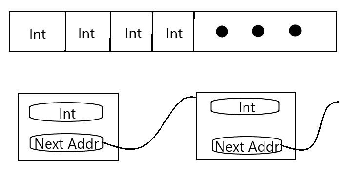

# 在 C# 中生成网络请求

因此，现在我们对网络的本质有了深入和完整的理解。我们理解了网络对部署在那些网络上的软件和硬件的设计和实现提出的要求。但我们应该用这些知识做什么呢？在本章中，我们将最终探讨在 .NET Core 中利用网络资源的最常见范例。我们将查看在互联网上实现请求/响应事务模型的通用接口（您将与之工作的最普遍的网络），并检查其一些具体实现。在这个过程中，我们将通过拆解我们将要使用的 .NET 类的一些源代码来查看底层的操作。

本章将涵盖以下主题：

+   `WebRequest` 类的基本结构，以及每个子类通过其方法保证暴露的功能

+   如何根据您可能遇到的不同用例利用 `WebRequest` 类的不同子类，并理解它们提供的不同操作

+   C# 实现的请求执行的内部阶段

# 技术要求

本章的所有代码都可以在本书的 GitHub 仓库中找到，网址为 [`github.com/PacktPublishing/Hands-On-Network-Programming-with-CSharp-and-.NET-Core/tree/master/Chapter%205`](https://github.com/PacktPublishing/Hands-On-Network-Programming-with-CSharp-and-.NET-Core/tree/master/Chapter%205)。

如前所述，本章中的所有代码都可以使用 Visual Studio Code 或 Visual Studio Community Edition（或者对于 macOS 系统上的用户，是 Visual Studio for macOS）进行阅读、操作、构建和部署。您使用的具体源代码控制编辑器通常是个人观点的问题，但我向您保证，您用于处理本章代码的任何工具都足以满足本书其余部分的所有代码。我鼓励您坚持这个决定，并花些时间熟悉它。我预计本书的大多数读者对 .NET Core 开发的最佳环境已经有了根深蒂固的看法。如果您还没有，我鼓励您选择您感觉最舒适的一个（无论是功能丰富的 Visual Studio Community Edition，还是轻量级、多平台友好的 Visual Studio Code）。一旦您做出了选择，请确保您花大量时间熟悉该环境中的工具。学习键盘快捷键并设置您的自动格式化选项。让它成为您的专属；一旦您做到了，您就可以开始学习了。

# 一切尽在一类——`WebRequest` 抽象类

任何软件工匠都会告诉你，如果你想了解如何利用其他开发者提供的库或工具集，只需查看公共接口。如果接口设计得足够好，那么如何使用该工具就会一目了然。良好的接口设计能够传达大量关于某块库软件使用限制和原始意图的信息，这正是本节将要探讨的内容。`System.Net`命名空间中的`WebRequest`抽象类是创建和操作旨在通过互联网发送的通用网络请求的公共接口。

# 接口或抽象类

我一直在描述抽象的`WebRequest`基类，它提供了如何让微软希望开发者与网络操作交互的接口。然而，我必须承认这并不完全准确；从技术上讲，`WebRequest`是一个抽象类。对于那些对这种区别不熟悉的读者，对我们来说这实际上是非常微不足道的。

抽象类实际上确实定义了一个与其实现一起工作的接口。两者之间的相关区别在于，使用抽象类时，接口中提供的任何给定方法通常在抽象基类本身中定义了一个默认实现。因此，抽象类提供的方法仍然通过接口定义了作为具体类消费者的你将如何与类的实现交互。这实际上只是定义该接口预期行为义务所在的一个区别。既然你不能像实例化接口定义一样实例化抽象类，所以这种区别完全是微不足道的。除非，当然，你选择从`WebRequest`类继承（我们将在本章末尾这样做）。不过，现在，让我们先回顾一下`WebRequest`提供的规范。

# 接口

对于任何类型的抽象类或接口定义，它们恰当的使用方式可以通过两个不同的视角来理解。抽象的形状通过接口的属性变得清晰。这使用户对接口实例应该使用的适当上下文有一个具体的概念。它应该清楚地传达抽象应该操作的领域。同时，抽象的范围通过类的`方法签名`传达。这是告诉用户类如何在其形状或属性定义的领域内操作的。

一个命名良好的接口应该为类的有用性界限提供清晰的界限。如果一个接口定义良好，就像`WebRequest`基类一样，它的属性和方法签名应该清楚地表明何时应该使用，以及何时不应该使用。更重要的是，如果应该使用，命名良好且范围明确的函数签名将告诉用户如何使用该方法。

因此，带着这个观点，让我们来看看`WebRequest`类的基定义中有什么。这个规范将告诉我们它应该如何使用，以及我们如何为自己扩展或实现它。那么，从构造函数开始不是更好吗？

# 构造函数

`WebRequest`只为它的子类定义了两个基构造函数。第一个是默认的无参数构造函数。第二个允许开发者指定`SerializationInfo`和`StreamingContext`类的实例，以便更精确地定义新创建的类实例的有效用例范围。因此，我们的构造函数签名将类似于以下代码块：

```cs
public WebRequest() {
    ...
}

public WebRequest(SerializationInfo si, StreamingContext sc) {
    ...
}
```

到目前为止，这相当直接，但为什么要使用第二个构造函数呢？在`WebRequest`实例中使用`SerializationInfo`和`StreamingContext`有什么如此普遍的地方，以至于基类定义了一个接受这些类实例的构造函数？

我们将在后面的章节中更详细地研究流上下文，但在上一章中我们简要讨论了可靠序列化数据的需求，这是一个更全面考虑该概念的好地方。每个请求或响应的有效负载在传输之前都需要进行序列化，在到达目标机器后进行反序列化。正如我们之前讨论的，这是一个将无序、本地寻址的数据块转换为有序的零和一字符串的过程。具体来说，它必须以这种方式排序，以便相同的字符串可以按顺序遍历，并由接收机器用来组合本地寻址的内存对象。

因此，虽然我们的软件可能将有序整数列表存储为一个连续内存地址的数组，但这是一种与表示的数据结构基本无关的实现细节。唯一的关键细节是列表是有序的，并且它是一个整数列表。它同样可以表示为一个底层的链表，其中列表中的每个节点包含存储在该节点的整数，以及列表中下一个节点的地址，这些地址可能连续也可能不连续。在内存中，这两个数据结构有显著的不同：



然而，只要为如何表示这两个列表提供了适当的序列化信息，它们对于接收这些列表作为请求或响应负载的任何接收者来说应该看起来是相同的。它们应该只是整数的一个良好分隔的列表。如果你的序列化机制是典型的**JavaScript 对象表示法**（**JSON**）格式，这两个实现都会序列化相同的输出：

```cs
[
    int,
    int,
    int,
    ...
]
```

通常，你会发现`WebRequest`和`WebResponse`实例经常被用于相同类型的消息，并且它们的负载应该以相同的方式进行序列化。能够将`SerializationInfo`作为构造函数的输入参数，这给了你一次定义你的序列化规则和细节，然后可以在理论上无限数量的请求中利用它们的灵活性。

对于`StreamingContext`参数也是如此。由于大多数网络软件都是编写来促进在软件的生命周期中以相同方式执行的操作，因此在一个特定的应用程序中，你的请求不太可能需要利用不同类型的 I/O 流。稍后，我们将更详细地查看可用的不同类型的流。这是一个密集的主题；然而，现在，只需知道这个输入参数给你与`SerializationInfo`参数相同的灵活性。它允许你一次定义你的流上下文，然后重复使用它。

仅通过这两个签名，我们就涵盖了`WebRequest`基类中明确定义的所有构造函数。这应该给你一个相当清晰的想法，即这个库的编写者预计它可能会如何被使用。当然，如果你想的话，你可以编写一个子类，它接受 HTTP 动词和默认的头部值，以及你发送请求之前可能需要定义的给定请求的所有其他方面。但就其最基本的形式而言，这些构造函数签名告诉你，这是一个旨在提供**可靠序列化**的**可靠数据流**的类的实例。

# 类属性

因此，你的构造函数清楚地说明了类预期在什么上下文中使用，而你的属性定义了请求的整体形状。它们定义了类实际是什么的最清晰和最无歧义性的描述。我们可以从`WebRequest`的属性中学到什么？好吧，让我们更仔细地看看。

根据基类规范，类的公共属性按字母顺序排列（正如它们在 Microsoft 文档中列出，这里：[`docs.microsoft.com/en-us/dotnet/api/system.net.webrequest?view=netcore-3.0`](https://docs.microsoft.com/en-us/dotnet/api/system.net.webrequest?view=netcore-3.0)），如下所示：

+   `AuthenticationLevel`

+   `CachePolicy`

+   `ConnectionGroupName`

+   `ContentLength`

+   `ContentType`

+   `Credentials`

+   `DefaultCachePolicy`

+   `DefaultWebProxy`

+   `Headers`

+   `ImpersonationLevel`

+   `Method`

+   `PreAuthenticate`

+   `Proxy`

+   `RequestUri`

+   `Timeout`

+   `UseDefaultCredentials`

那么，这告诉我们从该抽象类派生的实例有什么信息呢？显然的信息是，它封装了在互联网上使用的任何协议中进行的请求的常见方面。`Headers`、`Method`（即特定的协议方法，如`GET`、`POST`或`PUT` HTTP 方法）和`RequestUri`都是您从实用程序类中期望得到的。然而，其他如`ImpersonationLevel`、`AuthenticationLevel`和`CachePolicy`等属性表明，`WebRequest`类不仅仅是封装请求负载，而是真正旨在封装一个操作。

验证和缓存响应的操作超出了简单请求负载的责任范围，更多地属于负责在您的应用程序和外部资源之间进行请求和响应代理的软件部分。这些方法的存在表明，此类（及其子类）旨在成为请求和响应网络资源的代理。其定义清楚地表明，它可以处理连接到远程主机、验证自身以及通过扩展，您的应用程序的细微细节，序列化负载，反序列化响应，并通过干净简单的接口提供所有这些。

通过`ContentType`和`ContentLength`属性，它提供了一种干净的方式来访问和设置任何带有负载的请求最常用的头值。规范告诉您：“就给我这个包，告诉我你想把它发送到哪里，剩下的交给我处理。”它甚至提供了一个接口，通过`ConnectionGroupName`属性将类似的操作组合在一起，在连接组中进行批量处理。

假设您有多个请求同一个外部 RESTful API，该 API 位于`https://financial-details.com/market/api`，并且您的应用程序在其运行期间访问了十几个不同的端点。同时，您还有少量请求需要路由到`https://real-estate-details.com/market/api`。您可以简单地关联所有针对财务详情 API 的请求到一个连接组名称下，并将房地产详情 API 请求关联到另一个。这样做允许.NET 更可靠地管理对单个`ServicePoint`实例的连接。这允许将多个请求路由到单个端点，通过相同的活跃连接，提高性能并降低所谓的连接池饥饿的风险。

尽可能地，确保你使用 `ConnectionGroupName` 来将请求关联到单个端点，并通过单个连接进行。在任何 .NET Core 应用程序中，你可以在给定时间内保持有限数量的活动连接，如果没有 `ConnectionGroupName` 将请求绑定到单个连接，每个请求都将从 .NET Core 运行时的可用连接池中分配其自己的连接。在具有高网络流量或频繁外部请求的应用程序中，这可能导致线程饥饿和不稳定的性能。

实现此功能相当简单，但它可以在性能调整和调试错误时为你节省大量时间。只需为每个你想要利用的连接组定义一个静态常量名称，如下所示：

```cs
namespace WebRequest_Samples
{
    // Service class to encapsulate all external requests.
    public class RequestService {
        private static readonly string FINANCE_CONN_GROUP = "financial_connection";
        private static readonly string REAL_ESTATE_CONN_GROUP = "real_estate_connection";

...
```

然后，每次你需要为目标端点实例化一个新的请求时，你只需通过赋值指定连接组名称，然后底层 `ServicePoint` 实例将检查任何共享组名称的连接，如果发现了一个，就会为你的新请求利用该连接：

```cs
public static Task SubmitRealEstateRequest() 
{
    WebRequest req = WebRequest.Create("https://real-estate-detail.com/market/api");
    req.ConnectionGroupName = REAL_ESTATE_CONN_GROUP;
    ...
}
```

就这样，你的请求将利用到与相同外部资源建立的任何连接。如果没有其他请求与指定的 `ConnectionGroupName` 属性相关联，那么 .NET Core 将在其连接池中创建一个连接，并将你的请求作为连接组中的第一个关联。这对于一组请求针对需要访问凭证的资源特别有用，因为连接一旦建立，就会与后续请求共享，这些请求使用相同的访问凭证！

一旦建立了连接，我们就需要知道如何处理该请求的响应。为此，我们有 `CachePolicy` 属性。该属性指定了你的请求应该如何处理远程资源缓存的响应的可用性。该属性为我们提供了对何时以及如何依赖缓存响应的精确控制，如果确实需要的话。例如，如果我们有一个几乎不断更新的数据集，并且我们始终希望获得最新的响应，我们可以通过相应地设置策略来完全避免缓存：

```cs
using System.Net.Cache;
...

public static Task SubmitRealEstateRequest()
{
    WebRequest req = WebRequest.Create("https://real-estate-detail.com/market/api");
    req.ConnectionGroupName = REAL_ESTATE_CONN_GROUP;
    var noCachePolicy = new RequestCachePolicy(RequestCacheLevel.NoCacheNoStore);
    req.CachePolicy = noCachePolicy;
    ...
}
```

就这样，请求将忽略任何可用的缓存响应，同样，它也不会缓存从外部资源接收到的任何响应。正如你所看到的，该属性期望一个 `RequestCachePolicy` 对象的实例，通常使用 `System.Net.Cache` 命名空间中找到的 `RequestCacheLevel` 枚举定义的值进行初始化（如代码块顶部的包含所示）。

这又是一个熟悉 Visual Studio 的 IntelliSense 工具可以给你一个清晰想法的例子，了解那个枚举中可用的值。当然，如果你使用的是 Visual Studio Code 或其他源代码编辑器，你总是可以在制造商的网站上查找它的源代码或文档。无论你使用哪个编辑器，对于使用起来不易推断的属性或方法，养成查阅实现细节和 Microsoft 文档上的注释的习惯。但是，对于像定义缓存策略的枚举这样明显直接的东西，Visual Studio 的自动完成和 IntelliSense 功能可以节省你从 IDE 转移注意力去查找有效值的时间和精力。

就像你定义围绕缓存或可缓存的响应的行为一样，你可以使用 `WebRequest` 实例的公共属性来定义和指定应用程序的认证行为以及你对远程资源认证的期望。这是通过 `AuthenticationLevel` 属性暴露的，其行为与我们刚刚查看的 `CachePolicy` 属性非常相似。

假设，例如，你的软件依赖于一个明确配置为仅与你的软件一起工作的远程资源。远程服务器需要认证请求以确保它们是由你的软件的有效实例生成的。同样，你也会想确保你是在直接与正确配置的服务器通信，而不是某个中间人代理试图窃取你的宝贵财务和房地产细节。在这种情况下，你可能会想确保每个请求都是**双向认证**的，我相信你已经能预见我接下来要说什么了。

由于 `WebRequest` 类旨在封装与远程资源交互的整个操作，我们应该期望能够使用适当的认证策略来配置该类的实例，而不必自己管理它。这正是我们可以做到的。基于我们之前的例子，我们可以定义 `AuthenticationLevel` 属性来强制执行我们想要使用的策略，然后让 `WebRequest` 实例接管：

```cs
using System.Net.Security;
...
public static Task SubmitRealEstateRequest() 
{
    WebRequest req = WebRequest.Create("https://real-estate-detail.com/market/api");
    req.ConnectionGroupName = REAL_ESTATE_CONN_GROUP;
    var noCachePolicy = new RequestCachePolicy(RequestCacheLevel.NoCacheNoStore);
    req.CachePolicy = noCachePolicy;
    req.AuthenticationLevel = AuthenticationLevel.MutualAuthRequired;
    ...
}
```

注意到我们在 `using` 指令中包含了 `System.Net.Security` 命名空间。这就是 `AuthenticationLevel` 枚举被定义的地方。这很有道理，因为认证是大多数网络软件认证和授权安全组件的一半。但我们会稍后再深入探讨这一点。

如你所猜，获取你自己的软件认证可能需要一些凭证。

分配凭据就像定义你的身份验证或缓存策略一样简单。在 `WebRequest` 类定义中，`Credentials` 属性是 `System.Net` 命名空间中的 `ICredentials` 接口的一个实例，通常实现为 `NetworkCredential` 类的一个实例。同样，实现网络请求可靠安全性的完整范围将在本书的后面部分进行讨论，但就目前而言，让我们看看我们如何向我们的相互认证的 Web 请求添加一些凭据。它使用 `System.Net` 命名空间，因此不需要额外的 `using` 语句。相反，我们可以简单地将属性设置为 `NetworkCredential` 的新实例，然后继续，如下所示：

```cs
req.Credentials = new NetworkCredential("test_user", "secure_and_safe_password");
```

实际上我们应该将密码存储为 `SecureString`，但这个构造函数是有效的，正如我所说的，我们将在后面的章节中更详细地探讨安全性。

通过这个简短、直接的示例，我们可以清楚地看到 `WebRequest` 类的属性如何定义了实现和扩展它的具体子类的预期使用场景。现在我们了解了 `WebRequest` 想要为我们抽象的操作的形状和范围，让我们看看通过类公开的方法来实际执行这些操作。 

# 类方法

现在我们对 `WebRequest` 类的形状有了足够完整的了解，让我们来探索它的范围或适当的使用。让我们看看它的公共方法。了解基类中可用的功能将为你提供在大多数使用场景中利用任何具体实现所需的一切，可能只需要进行一些小的修改。因此，就像我们查看类属性一样，让我们看看以下公共方法列表，并看看我们可以推断出关于如何使用该类的哪些信息：

+   `Abort()`

+   `BeginGetRequestStream(AsyncCallback, Object)`

+   `BeginGetResponse(AsyncCallback, Object)`

+   `Create(string)`

+   `Create(Uri)`

+   `CreateDefault(Uri)`

+   `CreateHttp(string)`

+   `EndGetRequestStream(IAsyncResult)`

+   `EndGetResponse(IAsyncResult)`

+   `GetObjectData(SerializationInfo, StreamingContext)`

+   `GetRequestStream()`

+   `GetRequestStreamAsync()`

+   `GetResponse()`

+   `GetResponseAsync()`

+   `GetSystemWebProxy()`

+   `RegisterPrefix(string, IWebRequestCreate)`

我只包括了针对 `WebRequest` 类的特定方法，并省略了从父类继承的公共方法，例如 `MarshalByRefObject` 和 `Object`，因为那些与我们目的无关。然而，有了这个基本的操作列表，该类的实用性应该相当明显。

最可能引起注意的第一件事是，这个类应该异步使用。所有的 `Begin` 和 `End` 方法，以及许多其他方法上的 `Async` 后缀，都告诉你这个类通过 .NET Core 的异步特性支持对请求生命周期的精细控制。现在，如果你从未做过异步编程（正如我经常发现的那样，对于刚刚从学校毕业的新程序员，或者对网络开发新手来说），我们将在下一章中更详细地介绍这个心理飞跃。如何最好地利用异步功能，或者幕后发生了什么，并不总是直观明了；所以，现在就把它想成是推迟方法的实际执行直到以后。就像所有那些方法所暗示的那样，你 `Begin` 执行一个任务，然后当你准备好时，你 `End` 它并查看你的结果。

这个类中的方法可以分为两个概念组。有用于状态管理的方法和用于请求执行的方法。状态管理方法允许你修改或进一步定义 `WebRequest` 实用类实例的状态。利用它们进一步配置和定义实例的行为，类似于我们在上一节“类属性”中设置的任何公共属性。之所以有执行此操作的方法，而不是简单地有更多可设置的属性，是因为这样做至少涉及一些非平凡的逻辑或特定情况下的细节，这些细节在每个方法调用时都会应用。同时，请求执行函数允许你使用实例的行为来定义、调用和解决网络请求。它们是那些使所有早期配置变得有价值的“工作马”。因此，让我们依次查看这些方法集，并完全明确我们对这个类的理解。

# 状态管理方法

我鼓励你尝试将我列出的方法分类到我将要为你描述的两个类别中。将来，我也鼓励你尝试以这种方式对接口和公共类定义进行分类。这样做将提高你快速阅读和吸收新软件功能的能力，并有效地利用它们，而不是从 [StackOverflow.com](https://stackoverflow.com/) 复制代码片段，直到你找到可以工作的事情。话虽如此，让我们来看看状态管理函数。

首先，我们有 `Create` 方法。这些方法中的每一个都将返回一个可用的具体 `WebRequest` 子类实例。它们都是静态的，因此可以在不首先创建其实例的情况下从类定义中调用它们（显然的原因；为什么您需要创建一个类的实例然后创建另一个类的实例呢？）。根据使用的方法，这将为方法提供的 URI 中指定的给定方案设置默认子类的实例。因此，如果我们想要访问 RESTful HTTP 服务中的数据、从指定的 FTP 服务器收集文件以及从远程文件系统中读取数据，我们可以通过简单调用 `Create(uriString)` 来完成所有这些操作：

```cs
var httpRequest = WebRequest.Create("http://test-domain.com");
var ftpRequest = WebRequest.Create("ftp://ftp.test-domain.com");
var fileRequest = WebRequest.Create("file://files.test-domain.com");
```

您可能已经从我们在 *类属性* 部分编写的 `SubmitRealEstateRequest` 示例方法中认出了这段代码。我之前没有解释它，但因为这个类定义得如此清晰简单，我预计您能够从我的代码中很好地推断出它的用途，而无需这种解释。但以防您想知道为什么它看起来像是在创建一个抽象类的实例（C# 中的编译时错误），那就是原因。我实际上是从抽象基类中请求适当的子类实例，这是一个静态定义。

上述代码块中的三个用例涵盖了您可以使用 `Create()` 方法直接完成的大部分操作，但这当然并不意味着 `Create()` 只能应用于这些用例。该功能使用 URI 的通用协议前缀来确定要实例化的默认子类。因此，只需将 [`test-domain.com`](http://test-domain.com) 传递给该方法，默认实现就足以返回 `HttpWebRequest` 类的实例。用于解析前面字符串的相同逻辑也用于告诉 `WebRequest` 应为哪个协议创建子类。

正如我所说的，但是，默认行为仅针对有限的一组用例进行了定义。有四个特定的协议，它们的具体子类在运行时已预先注册到 `WebRequest` 类中；它们如下所示：

+   `http://`

+   `https://`

+   `ftp://`

+   `file://`

因此，任何以这四个前缀之一作为字符串首字符的 URI 字符串，都将被 `WebRequest` 基类可靠地处理。由于基类为其子类提供了执行核心操作所需足够接口，因此您甚至不需要知道具体返回了哪个子类。多亏了类型继承，您只需将您的实例声明为 `WebRequest` 类型，并相应地使用它，就像我在之前的示例方法中所做的那样。

但如果你不想使用这四种预注册的类型之一怎么办？如果你编写了自己的自定义`WebRequest`子类，专门用于处理**WebSocket**（**WS**）协议，并且你希望通过传递一个带有 WebSocket 前缀`ws://`的 URI 来从`WebRequest`获得相同支持？那么，这种确切的使用场景就引出了另一种状态管理方法：`RegisterPrefix(string, IWebRequestCreate)`。

`RegisterPrefix`是一个强大的新工具，支持所谓的**可插拔协议**。它基本上是一种让你将自定义实现和`WebRequest`和`WebResponse`基类的子类纳入应用程序运行时的方式。当正确完成时，你的自定义代码可以被视为`System.Net`命名空间中的第一类公民，由系统类型和方法适当委派，并能够完全访问网络堆栈，就像你接下来将要学习的原生库类一样。

完全实现自定义协议处理器的范围和深度超出了本章的内容，将在本书的后续章节中更详细地探讨。不过，现在只需知道，一旦完成编写自定义协议处理器的任务，将其连接起来就像调用`RegisterPrefix`一样简单。这就是为什么这属于状态管理方法范畴；因为它关乎为应用程序运行时配置`WebRequest`的工作条件。

该方法返回一个`bool`来指示你尝试注册自定义协议的成功或失败，并相应地抛出或处理异常。因此，虽然设置可插拔协议的过程超出了本章的范围，但在此阶段，只需相信一旦这项工作完成，将其配置为`WebRequest`类有效状态的一部分是一个简单直接的事情：

```cs
if(!WebRequest.RegisterPrefix("cpf://", new CustomRequestCreator())) {
    throw new WebException("Failure to register custom prefix protocol handler.");
}
```

有了这些，我们就拥有了配置和初始化网络请求所需的所有工具。状态管理已经完成，剩下的就是开始提交请求和处理响应。

# 请求执行方法

正如我之前所说，这些方法中的大多数都是设计用来异步使用的，但至少有少数几个有同步的或阻塞的对应方法。虽然我们稍后会更多地讨论异步编程，但重要的是现在要注意，围绕`WebRequest`类有两个主要操作或任务。第一个是访问实际请求数据流，第二个是访问远程资源返回的响应。

使用`WebRequest`实例，`RequestStream`是.NET 中表示的开放连接。把它想象成你可以传输信号的电线。任何时候你想通过`WebRequest`实例传递数据，你首先需要访问这条电线。一旦你拥有了它，你就可以开始通过这条流传递数据，并相信`WebRequest`类会相应地处理其传输。

请记住，向流写入通常需要给定对象的原始字节数组（这就是序列化的作用所在），因此一旦我们有了流，写入它并不像直接通过线缆传递我们的对象或消息那样简单，尽管它也不是特别复杂。在实践中，无论你选择如何访问`WebRequest`活动实例的请求流，写入它通常看起来像以下代码块：

```cs
using System.Text;
...
// convert message to bytes
string message = "My request message";
byte[] messageBytes = Encoding.UTF8.GetBytes(message);

//write bytes to stream
Stream reqStream = req.GetRequestStream();
reqStream.Write(messageBytes, 0, messageBytes.length);
```

这就是全部内容。在`WebRequest`的一些常见子类中，这种方法有一些细微差别，但基本原理始终适用。

正如你所看到的，这解释了请求执行方法的一半左右。`BeginGetRequestStream()/EndGetRequestStream()`、`GetRequestStream()`和`GetRequestStreamAsync()`方法是以不同方式访问网络事务相同逻辑组件的三种不同方法。它们只是提供了不同级别的操作同步控制。例如，`BeginGetRequestStream()/EndGetRequestStream()`方法为用户提供了一个在完成传输之前通过显式调用`Abort()`方法取消请求的机会。同时，`GetRequestStreamAsync()`方法不提供显式中止操作的机会，但它确实以异步方式执行操作。具体情况将决定你应该使用哪种方法或哪些方法，但如果处理得当并由底层连接正确解决，结果对象是相同的。

最后，我们可以看看响应处理方法，对于大多数网络事务典型的请求/响应模式，响应处理程序几乎与请求处理程序方法签名完全匹配。因此，在`WebRequest`实例中检索请求流通过四个不同方法暴露，并具有不同级别的操作同步粒度控制，响应处理也是如此。我们可用的方法有`BeginGetResponse()/EndGetResponse()`（其处理不能被`Abort()`中断），`GetResponseAsync()`，当然还有`GetResponse()`。

理解给定响应的形状将取决于它所接收的具体协议。正如`WebRequest`类有特定协议的子类一样，`WebResponse`基类也是如此。我们将在各自的章节中探讨它们，并查看如何更具体地处理它们的响应。但到目前为止，可以说`WebResponse`类为我们提供了一个足够可靠的接口，可以有意义地与请求返回的任何内容进行交互。

到现在为止，你应该对`WebRequest`类旨在解决的确切问题有极其清晰的理解。你应该了解其范围和使用案例的限制，并且希望你能确切地知道如何调整它，以便在它能节省你时间和精力的任何场景中充分利用它。带着这种理解，让我们看看一些最常见的方式，即通过.NET 标准提供的子类，明确地利用基类。

# WebRequest 类的子类

对于许多典型用例，你可以依赖底层`WebRequest`类提供的基本功能。然而，你实际上永远不会直接在你的代码中使用它的实例（你不能……它是抽象的，记得吗？），所以现在是时候看看当你使用它的常见具体实例时，还有哪些其他功能或特性存在。我们将查看`WebRequest`具有默认、预先注册处理器的所有子类。

# 关于已弃用子类的一个说明

在这里，重要的是要注意，`WebRequest`类主要是用于与网络上其他资源创建低级、协议无关的请求/响应事务的工具。.NET 标准提供的子类，虽然并未明确弃用，但已被稍微更健壮的客户端类，如`HttpClient`或`WebClient`类，所取代。

实际上，微软最近发布了一项建议，即始终使用较新的客户端类，而不是我即将讨论的任何稍微老旧的子类。这正是为什么本章如此少地致力于具体类的原因。请求/响应模型的重要方面仍然由.NET 的`WebRequest`和`WebResponse`类在新的`WebClient`类的底层处理。更重要的是，这些基类是你构建自己的自定义协议处理器的最基本构建块。这就是为什么理解`WebRequest`类是如何以及为什么被编写成这样，对于任何初学网络或网络编程的读者来说如此重要的原因。然而，正如软件通常的情况一样，时代在变化，因此，作为对特定实现常见模式的实用指南，本课程的有用程度将随着时间的推移而逐渐降低。

话虽如此，考察这些类之间的不同之处以及它们如何从头开始构建网络请求是值得的，让我们简要地看一下。

# HttpWebRequest

`HttpWebRequest`类很有趣，因为在最近非常长的一段时间里，它是.NET 网络编程中的工作马。这一点从类规范的大量爆炸性增长与`WebRequest`类相对简单性的比较中可以明显看出。对于给定的有效负载，有每个标准 HTTP 头可能定义的属性，以及从基类继承的 headers 属性，用于指定自定义或非标准头。有属性用于指定传输细节，例如`TransferEncoding`，或者是否以分块段的形式发送数据。有属性用于指定如何处理来自远程主机的异常行为，例如`MaximumResponseHeadersLength`和`MaximumAutomaticRedirections`属性。所有这些属性都允许你从头开始构建一个完整的、强大的 HTTP 请求有效负载。然而，正如你可以想象的那样，对于每个 HTTP 资源的每个请求，这样做通常是繁琐的、容易出错的、冗长的。通常，开发者会手动编写自定义 HTTP 客户端类，以将应用程序的这一方面隔离在“一次编写，到处使用”的方法中。正是这种粒度级别使得微软的工程师决定编写一个更健壮、更易于使用的客户端来处理常见的 HTTP 请求。

然而，值得注意的是，如果你并排查看类规范，`HttpWebRequest`公开的方法签名与`WebRequest`公开的方法签名完全相同。这两者之间唯一有意义的区别是`HttpWebRequest`作为类属性提供的上下文特定配置。这进一步突显了`WebRequest`设计的优雅。通过采用直接、通用的方法来解决问题，它可以使用相同的模式服务于所有可能的特定用例。

# FtpWebRequest

`FtpWebRequest`类提供了与`HttpWebRequest`类许多相同的属性。区别在于一些特定的属性，用于在处理可能通过不可靠或慢速连接传输的潜在大文件时配置可靠行为。为此，它提供了`ReadWriteTimeout`属性，该属性指定处理文件流允许的最大时间量。还有 FTP 特定的`UsePassive`属性，允许用户指定使用被动传输过程，在服务器上留下一个开放的监听连接，以便客户端相应地访问文件。

此外，还有一个显式的`EnableSsl`参数，你可能已经注意到它不是`HttpWebRequest`的属性。有趣的是，这对于`FtpWebRequest`类是必要的，但对于`HttpWebRequest`类则不是，因为 HTTP 中**安全套接字层（SSL**）的使用实际上是在 URI 的协议组件中指定的（即 HTTP 与 HTTPS 之间的区别）；而 FTP，该功能必须显式启用。

再次强调，`FtpWebRequest`类的实际使用与`WebRequest`基类完全相同。一旦通过类属性正确配置了特定协议的设置，FTP 最终只是另一种用于访问远程资源的请求/响应协议。

# FileWebRequest

`FileWebRequest`可能是所有子类中最不常用的。它的签名几乎完美地匹配`WebRequest`基类。它的目的是暴露相同的可靠请求/响应模式，用于访问本地文件系统上的资源。

到目前为止，你可能想知道为什么这样一个类会有任何用处。好吧，像任何优秀的工程师一样，我们最终都希望能够对我们的网络软件进行单元和集成测试。然而，这并不总是可行的，因为我们期望在生产环境中可用的远程资源可能并不总是可用在我们的开发环境中。在这种情况下，你将想要能够访问你本地系统上的模拟资源。多亏了`WebRequest`类的共享父类，替换开发环境和生产环境中的`FileWebRequest`和`HttpWebRequest`实例是一件微不足道的事情。由于每个子类都仅通过`WebRequest`类上的`Create()`方法实例化，这样做就像更改应用程序配置文件中存储的远程资源 URI 一样简单。

`FileWebRequest`类的强大之处在于其接口的一致性。因此，尽管与这个类的实例没有特殊属性或方法相关联，但将`WebRequest`的行为扩展到本地文件访问实际上才是这个类有价值的地方。

有了这些，我们对网络交互构建块的基础速成课程就完成了。

# 摘要

在本章中，我们全面审视了`WebRequest`实用类，以及它如何在.NET 应用程序的上下文中处理各种常见的网络操作。我们通过类的公共接口来推断类的适当使用和用例，以及确定其作用域和操作的局限性。我们考虑了在基类上定义的每个公共属性和方法的适当使用和调用，并编写了一些广泛适用的示例来展示该类及其子类的简单性和实用性。然后，我们考虑了`WebRequest`的三个最常见的具体子类。我们考察了它们之间的细微差别，并研究了它们如何促进它们设计要操作的特定协议的细节。现在，我们准备探讨如何以最优化方式处理这些请求的结果，以适应.NET 运行时。是时候研究数据流处理、多线程和异步编程了，这些内容将在下一章中探讨。

# 问题

1.  `WebRequest` 类的 `CachePolicy` 属性的有效值有哪些，它们可以在哪里找到？

1.  用于将 `WebRequest` 类的定制子类与该定制子类关联的协议的请求关联的方法是什么？

1.  在 .NET 连接池中，用于关联多个请求到同一连接的属性是什么？

1.  对于 `WebRequest` 类配置为从 `Create(uri)` 方法返回有效子类的四个预注册协议是什么？

1.  `BeginGetRequestStream()`、`GetRequestStreamAsync()` 和 `GetRequestStream()` 之间的区别是什么？

1.  请列举一些 `HttpWebRequest` 类与 `WebRequest` 类默认行为不同的方式？

1.  为什么在可能的情况下始终利用 `ConnectionGroupName` 非常重要？

# 进一步阅读

关于这个主题的进一步阅读，或者在你征服了网络编程领域之后拓展视野，可以查看由 Packt Publishing 出版的 *Building Microservices with .NET Core*，作者为 Gaurav Aroraa, Lalit Kale 和 Kanwar Manish，[`www.packtpub.com/web-development/building-microservices-net-core`](https://www.packtpub.com/web-development/building-microservices-net-core)。

此外，我还建议查看 Packt Publishing 出版的 *C# 7 and .NET: Designing Modern Cross-platform Applications*，作者为 Mark J. Price 和 Ovais Mehboob Ahmed Khan，以获取关于此处讨论的概念在实际应用中的实用建议。你可以在这本书的[`www.packtpub.com/application-development/learning-path-c-7-and-net-designing-modern-cross-platform-applications`](https://www.packtpub.com/application-development/learning-path-c-7-and-net-designing-modern-cross-platform-applications)找到这本书。
