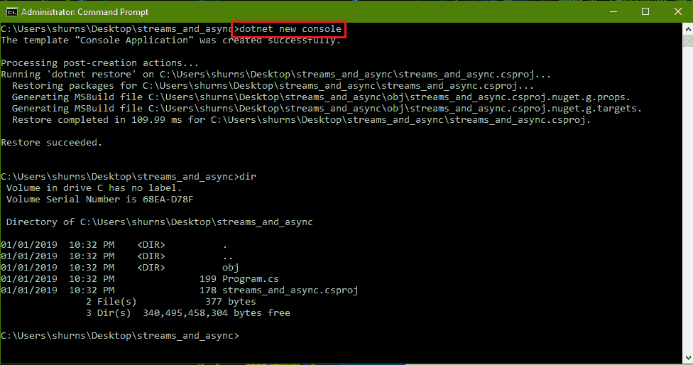
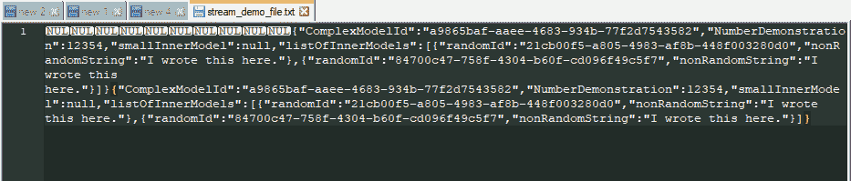
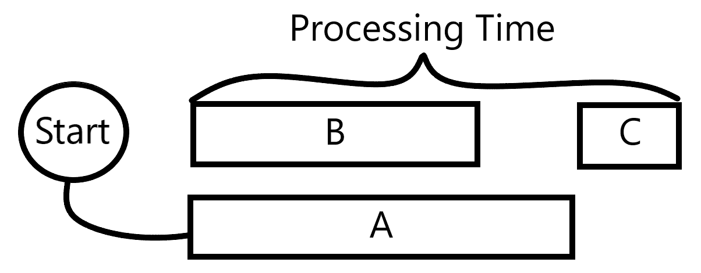

# 流、线程和异步数据

在我们有资源开始发送网络请求的情况下，我们需要考虑如何最好地将这些请求集成到我们的应用程序中。我们需要以一种不会影响应用程序的业务逻辑或用户的体验的方式与这些资源一起工作。因此，在本章中，我们将探讨如何处理数据流，以便对应用程序的其他性能方面具有弹性和非阻塞性。

本章将涵盖以下主题：

+   理解 C#中 I/O 流的本性，以及如何写入、读取和管理打开的流

+   如何不同类型的 I/O 流暴露对不同类型数据的访问，以及父`Stream`类如何简化这些不同流类型的用法

+   处理大型或性能不佳的数据流可能带来的潜在性能成本，以及如何减轻这种成本

+   利用 C#的异步编程功能集来最大化软件的性能和可靠性

# 技术要求

本章将包含多个示例和驱动程序来展示所讨论的概念，所有这些都可以在[`github.com/PacktPublishing/Hands-On-Network-Programming-with-CSharp-and-.NET-Core/tree/master/Chapter%206`](https://github.com/PacktPublishing/Hands-On-Network-Programming-with-CSharp-and-.NET-Core/tree/master/Chapter%206)找到。

如往常一样，我们鼓励您在本地克隆此存储库并开始尝试源代码，或者编写自己的代码，以便熟悉本章的一些主题。

查看以下视频以查看代码的实际应用：[`bit.ly/2HYmhf7`](http://bit.ly/2HYmhf7)

# 随着 C#中的数据流而行——C#中的数据流

在上一章中，当我们讨论`WebRequest`类的请求流属性时，我们简要地提到了访问数据流。当时我略过了这个主题，但现在我们应该真正理解我们的数据是如何作为请求有效载荷准备进行传输的。我们将查看 C#中数据流的通用接口，并对流的一些更复杂或不太明显的方面给予特别关注，这些方面可能会在您的代码中引入一些难以发现的错误。因此，让我们从`Stream`类开始，然后继续前进。

# 初始化数据流

就像网络请求一样，向数据流写入和从数据流读取是软件工程中常见且直接的任务。实际上，微软为此提供了非常精心设计的通用规范，用于在 C#中执行此操作。基类定义的方法是您将用于任何合理需要执行的数据传输类型，因此以此为起点，让我们看看这个类提供了什么。

`Stream` 类的目标非常简单，就是提供对有序字节序列的直接访问。关于这个信息没有额外的上下文，因此字节序列可以是本地磁盘存储上的文件，也可以是来自传入请求流的字节，或者是在两个协同定位的应用程序进程之间打开的通信管道，完全存在于内存中。

这个简单的定义提供了一个简单的方法来定义通用的、与环境无关的方法，用于处理有序的零和一列表。然而，它没有提供任何有用的方法来解析、处理和将这些字节转换为和从有意义的内存对象，这些对象对应用程序的其他部分来说是有意义的。作为一个编程任务，这可能有点繁琐，但幸运的是，一些特定的实现提供了一些可靠的实用方法，用于更常见的解析情况。这特别令人愉快，因为流的大部分工作都集中在这里。

一旦你的信息准备好通过二进制数据流传递，或者从数据流中获取字节，你只需要关注三个主要操作。前两个很明显：从数据流中按顺序读取和写入，收集字节，或者将你自己的字节推送到它。第三个不那么明显，但同样重要。因为数据流是有序的任意字节数组，从它读取和写入是单向操作。它们总是按顺序处理。然而，我们并不总是需要或想要按顺序从数据流中获取信息，因此能够查找流中的特定索引是关键，这将是遍历你的数据流的主要机制。

因此，带着这个想法，让我们看看它是如何付诸实践的。首先，创建一个基本的应用程序来利用数据流。为此，你可以使用 .NET Core CLI，并创建一个新的控制台应用程序，如下面的截图所示：



类似于我们在第二章，*DNS 和资源定位*，在 *C# 中的 DNS* 部分中创建的示例项目，我们使用了 `dotnet new` 命令来创建一个基本的控制台应用程序作为我们的测试平台。这次的不同之处在于，我们将使用 `dotnet new console` 命令专门创建一个新的控制台应用程序。我会继续在处理新项目时做笔记，以突出 .NET Core CLI 的速度和价值；它的速度和实用性真的无法过分强调。

现在，我们想要建立一个用于工作的流，所以我们将首先添加一个`using`指令来包含`System.IO`命名空间，因为 I/O 流位于 I/O 命名空间中。然后，为了演示的目的，我们将从文件中读取，并将数据写入磁盘上的文件，使用`FileStream`。我们将我们的变量声明为`Stream`类型，这样编译器的类型检查就不会允许我们使用`FileStream`特定的方法或属性。重点是理解如何使用`Stream`类提供的抽象。实际上，我们读取的内容并不重要；在到达我们的应用程序代码之前，它只是一些输入字节。使用本地文件系统只是让我们能够更直接地访问我们的操作结果，而无需通过设置本地 API 并将其数据发送到该 API 的过程。

在你能够做到的范围内，通常明智的做法是在声明变量时尽可能使用通用的类型。这样，如果你以后需要更改实现策略，你会拥有更多的灵活性。今天可能只是本地存储的文件系统访问，明天可能就变成了远程 API 调用。如果你的代码只关注`Stream`类的通用概念，那么在以后对不同来源进行更改会容易得多。

要编写这个演示，你首先需要理解的是，流是一个到数据源的活跃连接。这意味着在使用之前需要打开它，完成使用后应该关闭，然后销毁。未能这样做可能会导致内存泄漏、线程饥饿以及其他与代码的性能或可靠性相关的问题。幸运的是，.NET Core 为每个生命周期任务提供了一个内置的模式。大多数`Stream`类的构造函数将返回一个已经打开的实例，这样你就可以立即开始从流中读取和写入。至于确保流的销毁，我们有永远有用的`using`语句。

如果你之前没有见过，`using`语句与文件顶部允许你引用当前命名空间外部的类和数据结构的`using`指令不同。在方法的上下文中，在 C#中，`using`语句用于实例化一个可处置的类（也就是说，任何实现了`IDisposable`接口的类），并定义实例应该保持活跃的作用域。使用此语句的语法如下：

```cs
using (variable assignment to disposable instance) {
    scope in which the disposable instance is alive.
}
```

我们很快就会看到这个功能的实际应用。但就像在`for`循环或`if`语句的作用域内声明变量一样，你在`using`语句的签名内创建的变量在代码块的开闭花括号之外将不再存在。

或者，使用 C# 8，你可以通过选择利用`using`声明来避免由`using`语句创建的深层嵌套。这功能与`using`语句完全相同，但它将变量声明为封装方法的范围，而不是为实例的生命周期建立内部作用域。因此，你不会使用`using`语句及其开闭括号来定义作用域，而是简单地创建变量，并使用`using`关键字声明它，就像这里所示：

```cs
using var fileStream = new FileStream(someFileName);
```

两个实例之间的主要区别在于实例所绑定的作用域。使用`using`语句时，实例的作用域由语句块的括号定义。与此同时，使用`using`声明时，作用域由声明可处置实例的代码块定义。在大多数情况下，`using`声明应该足够，并且有助于减少方法中的深层嵌套。然而，你应该始终注意考虑可处置实例的使用方式，并将其绑定到适当的范围以适应其使用场景。

一旦程序控制流的流程退出与实例绑定的作用域，.NET 运行时将采取所有必要的步骤来调用`Dispose()`方法，该方法负责确保对象的状态对于处置是有效的。在这个过程中，`using`语句隐式地承担了清理任何未管理资源以及为创建的对象设置的任何连接池的责任。这种明确的作用域意味着每次你离开`using`指令的作用域时，你都会失去资源句柄，并将不得不实例化一个新的句柄。

这种明确的作用域意味着每次你关闭`using`语句时，你都会失去资源句柄。这意味着稍后访问资源将需要你为它创建一个新的句柄，然后相应地处置它。这可能会在应用程序的生命周期中产生性能成本，因此你应该在确定不再需要资源句柄时小心处置它。

有趣的是，虽然`using`语句作用域内声明的对象总是会得到适当的处置，但`using`语句并不能保证对象创建的任何可处置实例都会被处置。假设如果任何`A`类将其自身作为成员创建了一个可处置的`B`类实例，那么`A`类的拥有实例也应该负责在`A`类的拥有实例被处置时清理`B`类的成员实例。规则是，如果你创建了它，你就处置它。

现在我们已经知道了如何创建`Stream`实例，让我们动手实践，开始使用它吧。

# 向数据流写入和读取

现在我们知道了`Stream`类的生命周期是如何管理的，让我们用它来向本地文件写入一条消息。首先，我们将字符串写入流，然后检查流的目的地以确认它已被正确写入：

```cs
using System;
using System.Text;
using System.IO;
using System.Threading;

namespace StreamsAndAsync {
  public class Program {
    static void Main(string[] args) {
      string testMessage = "Testing writing some arbitrary string to a stream";
      byte[] messageBytes = Encoding.UTF8.GetBytes(testMessage);
      using (Stream ioStream = new FileStream(@"stream_demo_file.txt", FileMode.OpenOrCreate)) {
        if (ioStream.CanWrite) {
          ioStream.Write(messageBytes, 0, messageBytes.Length);
        } else {
          Console.WriteLine("Couldn't write to our data stream.");
        }
      }
      Console.WriteLine("Done!");
      Thread.Sleep(10000);
    }
  }
}
```

就像在第五章中提到的*在 C#中生成 Web 请求*一样，我们无法直接将字符串写入流。字节流的任务不是确定更复杂对象应该如何表示为字节。它只是它们通过的路线。因此，我们负责首先获取我们想要发送的字符串的字节表示。为此，我们使用`System.Text.Encoding`类来获取我们想要使用的特定字符串编码的字节表示。

一旦我们有了这个，我们就可以将其写入流中。或者至少，我们假设我们可以。但首先进行检查总是明智的。这就是为什么`Write`操作被包裹在检查我们流`CanWrite`属性的条件块中。这是`Stream`类提供的一个非常好的便利，它允许你在尝试执行操作之前确认流中操作的有效状态。这样，我们就可以在不需要在所有内容周围使用笨拙的`try`/`catch`块的情况下控制错误处理和纠正。

因此，我们在`using`块中声明了我们的`Stream`对象，并将其初始化为打开或创建一个名为`stream_demo_file.txt`的文件，位于应用程序可执行文件目录的根目录下。然后，一旦我们检查了它，我们就传递了我们的字节数组，并指示流将这个数组写入其目标资源。但`Write`方法中的那两个附加参数是什么？嗯，就像流不会合理地了解在其上通过的内容一样，它也不知道何时应该从字节数组中读取哪些字节。它需要字节数组，然后是关于从哪里开始读取的指令，以及它应该精确写入多少字节。`Write`方法签名中的第二个参数是你的起始索引。它从零开始，就像数组一样。第三个参数是你想要在这个`Write`操作中发送的字节总数。这里有一个运行时错误检查，如果你尝试发送比数组中剩余的字节更多的字节（从你指定的任何索引开始），你会得到一个索引越界错误。

因此，如果你导航到应用程序运行的文件夹，你应该找到一个新的文本文件。打开它，你应该会发现我们的消息；就这么简单。但如果我们再次运行该文件会发生什么？消息会被连接到我们之前写入的第一个消息吗？它会覆盖现有的消息吗？

# 寻找操作

再次运行你的应用程序，然后在文本编辑器中重新加载文件。无论你期待发生什么，你应该看到文件没有任何变化。然而，假设你的应用程序运行成功，你在控制台上看到的是持续 10 秒的“完成！”消息而不是我们的错误消息，你应该有信心写入操作执行了第二次。所以，这应该告诉你操作是成功的，并且实际上它确实覆盖了原始消息的值。这可能一开始并不明显，因为我们第二次使用了相同的信息，但如果你想确认这种行为，只需将程序中的`testMessage`变量更改为读取*测试向流写入不同的字符串*并再次运行。你应该看到新的消息，希望这会使发生的事情更加明显。

每次我们打开一个连接到数据源的流时，我们都会得到存储在该源中的完整有序的字节列表，以及该数组的起始指针。我们对流执行的每个操作都会将我们的指针移动一个方向。如果我们写入 10 个字节，我们会发现自己比开始时在数组中更远 10 个位置。如果我们读取 10 个字节，情况也是一样。所以，我们的每个主要操作员只能从我们在开始执行它们时沿流的任何位置向一个方向移动。那么，我们如何设置这些操作来读取或写入我们想要的位置呢？答案是，使用`Seek()`方法。

`Seek`方法通过指定几个简单的参数，让我们能够任意访问字节数组中的任何索引。只需指定相对于一个指定的起始位置你想从哪里开始，然后使用`SeekOrigin`枚举的三个值之一来指定起始位置。

所以，如果我想从当前数组的最后一个字节开始，并将我的当前消息附加到上一个消息的末尾，代码块将如下所示：

```cs
using (Stream ioStream = new FileStream(@"../stream_demo_file.txt", FileMode.OpenOrCreate)) {
  if (ioStream.CanWrite) {
    ioStream.Seek(0, SeekOrigin.End);
    ioStream.Write(messageBytes, 0, messageBytes.Length);
  } else {
    Console.WriteLine("Couldn't write to our data stream.");
  }
}
```

适当地修改你的`using`语句，并再次运行程序。查看你的输出文件，你应该看到以下消息：

```cs
Testing writing a different string to a streamTesting writing a different string to a stream
```

我们从原始的字节数组开始，导航到已写入字节的流末尾，然后从那里写入我们的消息；就这么简单。

这可能看起来是一件微不足道的事情，但想象一下你正在解包一个数据大小可变的消息有效负载。通常，你会有一系列头信息或一个映射你的字节数组，指定不同组件的起始索引和总长度。仅使用这两条信息，你可以直接导航到消息的相关组件，并且只读取你需要的确切数量。以`Stream`类的方式减少这种数据操作在简单性上非常强大。

但也许你不想将数据写入请求流。也许你已经编写了服务器代码来读取请求并相应地做出响应。让我们简要地看看这是如何实现的。

# 从流中读取

正如我说的，读取是一个单向操作。无论你的当前索引是什么，你都将一次读取一个字节，并在读取过程中将光标在索引中向前移动一个位置。所以，你的下一个`Read`操作总是从上次读取的地方开始，再向后移动一个字节。这里的技巧是，每次你想读取超过单个字节的内容（你可以简单地将它分配给一个字节类型的变量），你必须将它读取到一个目标数组中。所以，在读取之前，你需要声明并分配一个目标数组。让我们看看这是如何实现的；不过，首先，让我们移除`Seek`操作，这样每次运行你的应用程序时，你都不会增加你的文本文件的大小：

```cs
using (Stream ioStream = new FileStream(@"../stream_demo_file.txt", FileMode.OpenOrCreate)) {
  if (ioStream.CanWrite) {
    ioStream.Write(messageBytes, 0, messageBytes.Length);
  } else {
    Console.WriteLine("Couldn't write to our data stream.");
  }

  if (ioStream.CanRead) {
    byte[] destArray = new byte[10];
    ioStream.Read(destArray, 0, 10);
    string result = Encoding.UTF8.GetString(destArray);
    Console.WriteLine(result);
  }
}
```

因此，就像我们之前做的那样，我们检查是否从我们的流中读取是有效的。然后，我们指定一个新的字节数组，我们将从我们的数据流中读取字节，然后从索引零开始`Read`，读取 10 个字节。

我确信在这个阶段，你已经看到了这种方法给开发者带来的许多问题。即使只是使用老式的方括号数组而不是更灵活且易于处理的列表类，也会给开发者带来许多痛点。为了将老式数组作为`Read`操作的靶子，你必须事先知道数组的确切大小。这意味着你可能需要明确地为你的数组（以及随后的`Read`操作）设置一个预定的长度，或者你需要有一个变量，你可以从中确定数组的初始长度（因为你不能在不指定长度的情况下初始化方括号数组）。

这是非常僵化和繁琐的。它使得你的反序列化代码变得脆弱。另一种选择是指定一个合理的最大长度，并使用该值来初始化任何将从数据流中读取的字节数组。当然，这种方法将你的软件固定在当前已知的限制上，使其缺乏灵活性，并且在未来难以扩展。所有这些都是`Stream`类定义的优雅简单性所带来的挑战。幸运的是，随着`Stream`类的强大功能，还带来了.NET Core 提供的许多实用类库的简单性。

# 适合这项工作的正确流

使用代表你的网络连接的最底层数据流进行工作确实给你提供了很多权力和控制，可以精确地解析和处理传入的消息。当性能或安全性是一个问题时，这种字节级别的控制对于为熟练的开发者提供他们需要的工具以产生最优化解决方案来说是无价的。

然而，我们中的大多数人不会编写对性能或安全性有如此高要求的网络代码。实际上，我们编写的代码大多数都将遵循相同的简单直接的序列化和消息生成模式。这就是额外的 `Stream` 类真正派上用场的地方。

# 流读取器和写入器

虽然在需要直接与数据流工作并弯曲其用途以适应特定目的时，了解如何操作是非常有用的，但简单的事实是，大多数时候你不需要这样做。实际上，在我多年的软件工程师生涯中，我能数得出来的需要自己设计序列化策略并使用低级类来实现以追求性能或安全性的次数屈指可数。在我的职业生涯中，使用更简单、更成熟的序列化策略，这些策略利用了 .NET 核心库提供的实用类，要常见得多。

在现代网络中，通信的通用语言无疑是 **JavaScript 对象表示法**（**JSON**）。这种用于组合和解析层次数据的简单规范，几乎可以优雅地转换成几乎任何语言中你可能会设计的几乎任何数据结构，因此，到目前为止，它已成为几乎所有正在编写的 API 或网络服务的首选传输格式。

就像我们之前讨论的所有内容一样，它的强大之处在于其简单性。它是一种数据字符串表示，具有简单的规则来界定和嵌套不同的对象及其相应的属性。尽管 JSON 对象的层次结构是严格定义的，但该对象内属性的顺序完全是任意的，这为用户提供了高度的灵活性和可靠性。

在这种普遍的序列化标准下，存在广泛支持且易于使用的工具来处理以 JSON 表示法表示的对象，这并不令人惊讶。不仅如此，由于简单的字符串占据了我们在网络上读取和写入数据源之间的大部分内容，因此存在专门设计用于通过流处理这些字符串的 `System.IO` 类。

# Newtonsoft.Json

让我们熟悉一下这样一个非微软库，它因其可靠性而广受欢迎，最终被微软采纳为官方的 C# 和 .NET 解析 JSON 的库。随着你与网络事务的更多合作，你将更加欣赏 `Newtonsoft.Json` 库强大的简单性。它并没有太多内容，所以现在让我们花点时间看看它的内部结构，因为我们将在接下来的工作中大量依赖它。

重要的是要知道，尽管`Newtonsoft.Json`仍然是 C#中 JSON 解析的首选库，但微软实际上已经为.NET Core 3.0 开发了一种替代方法。这个新库已经被添加到`System.Text.Json`命名空间中。然而，与`Newtonsoft.Json`为了用户友好性而编写的，提供了一组易于利用的功能相比，这个新的 JSON 库的重点在于性能和对序列化过程的精细控制。因此，与`Newtonsoft.Json`相比，`System.Text.Json`库的功能集严重受限。由于我们更关注 JSON 序列化的基本概念，而不是性能，所以在这本书中，我们将使用`Newtonsoft.Json`作为我们的首选库。

要开始使用它，你需要将库包含到你的项目中。如果你使用的是 Visual Studio Code，你只需在编辑器的终端窗口中输入以下命令：

```cs
dotnet add package Newtonsoft.Json
```

如果你使用的是 Visual Studio，你可以在解决方案资源管理器中右键单击你的项目依赖项，然后选择管理 NuGet 包。从那里，搜索`Newtonsoft.Json`并安装包。

一旦你有了它，我们就会想要一个稍微复杂一些的对象，以真正展示`Newtonsoft`能做什么。所以，让我们通过添加一个名为`ComplexModels.cs`的新文件来向我们的项目中添加一个模型定义，并在其中定义几个类：

```cs
using System;
using System.Collections.Generic;

namespace StreamsAndAsync {
    public class ComplexModel {
        public string ComplexModelId { get; set; } = Guid.NewGuid().ToString();
        public int NumberDemonstration { get; set; } = 12354;
        public InnerModel smallInnerModel { get; set; }
        public List<InnerModel> listOfInnerModels { get; set; } = new List<InnerModel>() {
            new InnerModel(),
            new InnerModel() 
        };
    }

    public class InnerModel {
        public string randomId { get; set; } = Guid.NewGuid().ToString();
        public string nonRandomString { get; set; } = "I wrote this here.";
    }
}
```

在这里，我们有一个类型，它的属性是另一个类型的实例，以及另一个类型的实例列表。请注意，我正在使用 C# 6 中添加的内置属性初始化功能。这允许我们确保不定义默认构造函数的情况下初始化我们类的每个成员。因此，只需添加一个`ComplexModel`实例，我们就会有一个完全初始化的对象。

现在，我相信你可以想象自己尝试独立遍历这个嵌套结构，然后再将其解析成格式良好的序列化字符串的痛苦。而且，这还是针对我们需要自己定义的对象！考虑一下，为任何可能需要在你的网络流类中传输的对象编写通用序列化代码所增加的复杂性。这将是一团糟，充满了递归或反射，以及一大堆其他繁琐且耗时的工作，很少有开发者喜欢做这些。

幸运的是，我们通常不必这样做。如果我们想将我们刚刚定义的类的实例写入我们的数据流，这只需要一行代码来生成输出字符串。让我们重新设计我们的示例程序，从一个新的`ComplexModel`类实例开始，然后使用`Newtonsoft.Json`将其序列化为更易于流传输的格式：

```cs
using System;
using System.Text;
using System.IO;
using System.Threading;
using Newtonsoft.Json;

namespace StreamsAndAsync
{
    public class Program
    {
        static void Main(string[] args)
        {
            ComplexModel testModel = new ComplexModel();
            string testMessage = JsonConvert.SerializeObject(testModel);
            byte[] messageBytes = Encoding.UTF8.GetBytes(testMessage);

            using (Stream ioStream = new FileStream(@"../stream_demo_file.txt", FileMode.OpenOrCreate)) {
                if (ioStream.CanWrite) {
                    ioStream.Write(messageBytes, 0, messageBytes.Length);
                } else {
                    Console.WriteLine("Couldn't write to our data stream.");
                }
            }

            Console.WriteLine("Done!");
            Thread.Sleep(10000);
        }
    }
}
```

在我们方法的第二行那个简单的声明中，我们将我们的模型转换为一个完整的字符串表示形式，适合序列化传输。运行程序，然后再次检查你的目标文件。你应该会发现一串由双引号分隔的属性名称及其值，以及大量的花括号。相反的方向同样简单，只需将你的 JSON 字符串传递给`Deserialize<T>()`方法，如下所示：

```cs
ComplexModel model = JsonConvert.Deserialize<ComplexModel>(testMessage);
```

就这样，你可以干净可靠地将你的数据序列化和反序列化到网络消息中广泛使用的格式。

JSON 记法的规范不在这个书的范围之外，但如果你有任何编程 JavaScript 的经验，它应该看起来很熟悉。否则，我建议查看 MDN 关于此主题的文章：[`developer.mozilla.org/en-US/docs/Web/JavaScript/Reference/Global_Objects/JSON`](https://developer.mozilla.org/en-US/docs/Web/JavaScript/Reference/Global_Objects/JSON)。

如果你需要帮助组织 JSON 字符串以使其结构更清晰，你可以将其粘贴到[`jsonlint.com`](https://jsonlint.com/)以验证其结构是否良好，并获得一个格式化的字符串版本。

# `StreamReader`和`StreamWriter`类

因此，如果我们能够轻松高效地将几乎任何可以想象的对象序列化为字符串，那么（你肯定在想）一定有更简单的方法直接用字符串写入和读取流。

当然，有；当你开始这一节时你就知道了。进入始终多才多艺的`StreamReader`和`StreamWriter`类。这些类都是专门设计用来读取/写入字符串的。实际上，它们都从`System.IO`命名空间中的`TextReader`类派生出来，并扩展了其功能以直接与字节流接口。它们是为处理字符串量身定制的，并且每个类，结合`Newtonsoft.Json`的简单性，都可以轻松处理通过网络传输的最复杂的数据结构。所以，让我们看看如何使用它们来处理我们的网络流。

首先，我们想要获取我们的流，就像之前一样，使用`using`语句，如下所示：

```cs
using (Stream s = new FileStream(@"../stream_demo_file.txt", FileMode.OpenOrCreate)) {
```

然而，在我们做任何事情之前，我们还想初始化我们的`StreamWriter`实例，提供我们的流作为其初始化参数：

```cs
using (StreamWriter sw = new StreamWriter(s)) {
```

`StreamReader`/`StreamWriter` 有多个构造函数，可以接受编码规格、字节顺序标记检测和缓冲区大小等参数。然而，在网络编程中，我们始终会使用接受 `Stream` 作为第一个参数的构造函数。仅接受字符串的构造函数只会创建指向本地文件路径的 `FileStream` 实例。尽管在这里我们使用 `FileStream` 进行演示，但在实际的网络编程中，我们希望直接连接到远程资源的数据流。为此，我们首先需要初始化流（可能是 `NetworkStream` 类的实例），然后将它提供给我们的写入器/读取器实例。

一旦初始化了 `StreamWriter`，写入就变得简单，只需调用 `Write(string)` 或 `WriteLine(string)` 即可。由于该类假设它将处理字符串，我们的示例方法简化如下：

```cs
static void Main(string[] args) {
  ComplexModel testModel = new ComplexModel();
  string testMessage = JsonConvert.SerializeObject(testModel);

  using (Stream ioStream = new FileStream(@"../stream_demo_file.txt", FileMode.OpenOrCreate)) {
    using (StreamWriter sw = new StreamWriter(ioStream)) {
      sw.Write(testMessage);
    }
  }

  Console.WriteLine("Done!");
  Thread.Sleep(10000);
}
```

只需五行代码，我们就成功地序列化了一个复杂的嵌套对象实例，并将其写入输出流。

当处理来自远程资源的字符串时，知道用于将传入的字节转换为特定编码的方法是关键。如果一个字符被编码为 UTF32，并使用 ASCII 进行解码，结果将不会匹配输入，导致输出字符串变得混乱不堪。如果你发现解析的消息无法解读，请确保你使用了正确的编码。

由于这些类旨在专门与字符串内容一起使用，它们甚至提供了有用的扩展，例如 `WriteLine(string)` 方法，它会在你传入的字符串后面添加一个行终止符字符（在 C# 中，这默认为回车符后跟换行符，即 `\r\n`，尽管你可以根据你的环境覆盖此值）。同时，`ReadLine()` 方法将返回从当前索引到下一个行终止符（包括）的字符。这对于序列化对象来说并不特别有用，因为你不想读取 JSON 字符串的一行。然而，如果你正在处理纯文本响应，它可以使读取和写入该响应变得容易。

# 搜索与预览

然而，可能不明显的一个注意事项是使用`StreamWriter`或`StreamReader`实例更改当前索引时的差异。对于`Stream`类及其子类，我们只是简单地应用`Seek`操作，通过给定数量的位置从给定的起始点向前移动我们的字节数组。然而，当你使用 writer/reader 实用程序类工作时，你会注意到你没有那个选项。包装类只能通过在流上的当前索引使用其基本操作向前移动。但是，如果你想更改那个索引，你可以通过直接访问底层流来做到这一点。包装类通过`BaseStream`属性暴露它。因此，如果你想在不执行包装器操作的情况下更改流中的位置，你可以使用`BaseStream`的`Seek`操作，如下所示：

```cs
using (Stream ioStream = new FileStream(@"../stream_demo_file.txt", FileMode.OpenOrCreate)) {
    using (StreamWriter sw = new StreamWriter(ioStream)) {
        sw.Write(testMessage);
        sw.BaseStream.Seek(10, SeekOrigin.Begin);
        sw.Write(testMessage);
    }
}
```

修改包装类底层的`Stream`类将直接更改包装类可以写入的位置。运行此代码后，我们的输出文件应该看起来像以下截图：



我们输出文件的前 10 个字符是`null`，因为底层的`Stream`类将其写入索引向前移动了 10 个字符！

在字符串中向前搜索直到到达终止字符或标志值并不罕见。使用`StreamReader.Read()`操作这样做会导致索引移动到终止字符之后，并将终止字符从数组中移除。然而，如果你想简单地读取终止字符之前的最后一个字符，你可以使用`Peek()`操作。`Peek()`会返回数组中的下一个字符，而不会前进`StreamReader`的当前索引。这个小小的技巧在你确定何时停止读取长度不可知的字符串的某个部分时，可以提供相当大的灵活性。

# `NetworkStream`类

当我们在寻找适合工作的正确流时，我们应该花点时间看看`NetworkStream`类。它的工作方式与我们在迄今为止的示例代码中使用的`FileStream`类非常相似，其底层数据源是连接到外部资源的`Socket`类的一个实例。然而，除了指定底层`Socket`连接以供流读取和写入之外，它几乎与`FileStream`类完全相同。各种`Read`、`Write`和`Seek`方法的行为与我们在本地文件示例中看到的行为完全一致。同样重要的是，`NetworkStream`的实例可以用作`StreamReader`和`StreamWriter`类实例的`BaseStream`，因此通过电线发送原始文本消息与写入本地文本文件一样简单。当我们开始在后面的章节中实现自己的套接字连接时，我们将大量使用这个类，但这些将仅建立在我们在本章中奠定的基础上。

# 提高速度 - 多线程数据处理

到目前为止，我们只看了我们数据流上的读写操作的简单示例，而且我们只使用了同步的`Read()`和`Write()`方法。对于我们的 50 或 500 个字符长度的消息和单一用途的测试应用来说，这并没有成为问题。然而，不难想象数据流足够大，以至于仅仅从开始到结束读取就需要相当多的时间的情况。想象一下请求一个 200MB 大的 FTP 文件，或者想象从远程服务器上托管的数据表请求 200 万个记录。如果必须执行这些操作的进程还负责通过图形界面响应用户行为，那么长时间运行的数据处理任务将使 GUI 完全无响应。这种行为绝对是不可接受的。为此，.NET Core 为程序员提供了**线程**的概念。

使用线程，某些操作可以被委派为后台任务，这些任务在主机进程可以执行时立即执行，但不会阻塞应用程序的主线程。因此，通过这个简单而强大的概念，我们可以将可能长时间运行或计算密集型的操作分配给后台线程，从而减轻该操作对应用程序其余性能的影响。这种性能提升是使用线程的最大好处。

.NET Core 应用程序的这个方面可以通过`System.Threading`命名空间访问，该命名空间提供了从`ThreadPool`类到用于保护资源免受并发访问或修改的**信号量**，再到用于更精细控制何时以及如何分配后台线程的`Timer`类和`WaitHandles`类的所有内容。

由于网络连接的易变性和远程资源的不可靠可用性，任何尝试从远程资源访问数据或服务的操作都应该在后台线程中处理。幸运的是，将这些任务分配给后台线程进行并行处理实际上相当简单。我们只需要开始利用那些我们之前一直忽略的异步方法。

# 异步编程用于异步数据源

如果你对异步编程不熟悉，那么我们接下来要讨论的内容一开始可能有些令人困惑，但我保证在实践中，它实际上非常简单。它仅仅意味着以不按顺序或不同步的方式执行单个计算任务。它允许工程师将阻塞程序执行的等待长时间任务推迟到他们绝对必须这样做的时候。为了使这一点更清楚，让我们看一个例子。

让我们想象我们有一个方法，它必须让步骤**A**发送一个请求以获取大量数据，步骤**B**在本地执行长时间计算，最后**C**将两个结果作为单个响应返回。如果我们同步地从我们的网络请求中读取响应，那么我们的方法完成所需的时间将是每个步骤的时间总和，**A** + **B** + **C**。处理时间将如下所示：


但如果我们以异步方式运行我们的网络请求，*我们可以在后台任务中同时运行这个任务，与我们的长时间运行的本地进程同步进行。这样做，我们可以将处理时间减少到仅两个任务中较长的那个，再加上**C**。现在我们的处理时间看起来如下所示：



由于**C**是唯一依赖于**A**以完成处理的步骤，我们可以在准备执行**C**之前，将阻塞我们的应用程序代码在**A**完成上推迟。为了在代码中看到这一点，让我们首先说我们有一个`ResultObject`类，它包含我们想要返回给用户的本地和远程信息。接下来，让我们假设这个方法的部分**B**中进行的长时间运行的工作是在名为（恰当地）`LongRunningSlowMethod()`的私有本地方法中完成的。所以，有了这些简单的假设，让我们看看处理长时间运行的网络请求的异步方法，如下所示：

```cs
public async Task<ResultObject> AsyncMethodDemo() {
  ResultObject result = new ResultObject();
  WebRequest request = WebRequest.Create("http://test-domain.com");
  request.Method = "POST";
  Stream reqStream = request.GetRequestStream();

  using (StreamWriter sw = new StreamWriter(reqStream)) {
    sw.Write("Our test data query");
  }
  var responseTask = request.GetResponseAsync();

  result.LocalResult = LongRunningSlowMethod();

  var webResponse = await responseTask;

  using (StreamReader sr = new StreamReader(webResponse.GetResponseStream())) {
    result.RequestResult = await sr.ReadToEndAsync();
  }

  return result;
}
```

这里发生了很多事情，但希望现在很明显，我们为什么以这种方式处理最后几章。让我们一点一点地看；首先，注意方法签名，如下所示：

```cs
public async Task<ResultObject> AsyncMethodDemo() {
```

任何利用异步操作编写的方法都必须在其签名中使用 `async` 关键字进行标记。这告诉方法的用户，这个方法中的操作可能需要一段时间，并且将在后台线程上运行。你可能已经注意到，返回类型并不是简单的 `ResultObject`，尽管我们的返回值 `result` 在方法开始时被声明为这样的类型。这是因为异步方法只有三种有效的返回类型：`void`、`Task` 和 `Task<T>`。

如果你的方法返回一个结果，你必须在你方法的签名中将该结果的类型包裹在 `Task<>` 中。然而，你不需要将实际返回的值包裹在 `Task<>` 对象中。当你有一个异步方法签名时，编译器会为你完成这个操作。这就是我们能够在方法签名中声明一个看似与我们在方法体中声明的返回值类型不匹配的返回类型的原因。

在我们的方法中继续前进，我们创建一个指向我们的测试域的 `WebRequest` 类，然后使用 `StreamWriter` 将我们的数据查询直接写入 `WebRequest` 的请求流。接下来发生的事情很有趣，也就是说，我们可以在我们的代码中调用以下行：

```cs
var responseTask = request.GetResponseAsync();
```

`GetResponseAsync()` 方法分配给我们的 `responseTask` 变量的结果是实际上并不是 `WebResponse` 类。相反，它是对由 `GetResponseAsync()` 方法在后台线程中启动的任务的引用。因此，我们不必等待从我们的服务器返回响应，`GetResponseAsync` 只给我们一个获取该响应的线程的句柄，然后立即将控制权返回到我们方法中的下一个操作。这使得我们几乎可以立即开始执行 `LongRunningSlowMethod()`。

现在，由于我们的 `LongRunningSlowMethod()` 不是异步的，控制流会阻塞，直到它完成执行，并且其输出被分配到 `result.LocalResult`。一旦完成，我们实际上不能继续执行函数，直到我们从网络请求中获取完结果。因此，我们程序中的下一行如下：

```cs
var webResponse = await responseTask;
```

通过调用 `await` 关键字，我们告诉我们的程序，只有在等待的操作完成之前，我们才能有意义地继续执行。因此，如果任务尚未完成，程序现在应该阻塞进一步的执行，直到它完成。这就是我所说的延迟阻塞程序执行。当我们无法在没有异步任务的结果的情况下完成更多工作，我们必须阻塞并等待结果时，我们才能继续执行。这就是我们在 `await` 调用中所做的。

等待此`async`任务的结果是`async`方法中`Task<T>`返回类型所包装的内容。因此，在这种情况下，分配给`webResponse`变量的是我们之前期望的`WebResponse`类的实例。

现在我们已经得到了响应，我们可以从中读取。在接下来的几行中，我们实例化了`StreamReader`，并提供了从我们得到的`WebResponse`实例中获取的响应流。最后，我们从响应流中读取并将其分配给我们的结果对象：

```cs
result.RequestResult = await sr.ReadToEndAsync();
```

注意，即使在这个函数中我们没有额外的代码要执行，我们仍然使用`ReadToEndAsync()`方法并等待结果。这样做的原因是，尽管在我们的方法中没有更多的执行内容，但调用我们的方法的人可能能够延迟处理我们返回的结果。使用`await`操作符告诉编译器这是另一个延迟执行的机会，因此当我们的方法达到这一点时，控制权可能会返回到调用方法，直到再次等待我们的方法的结果。因此，在可能的情况下始终使用异步方法，并且在整个调用链中使用它们是非常重要的。随着时间的推移，性能提升将显著增加。

# 关于阻塞代码的最后一句话

你可能会注意到，每次调用异步方法时，任务实例上都有一个`Result`属性。虽然使用`GetResponseAsync().Result`来避免等待异步操作，以及避免在整个堆栈中应用异步模式，可能看起来很有吸引力，但这是一种糟糕的做法。

永远不要使用`.Result`来访问异步任务的结果。

它不仅通过强制同步执行来阻塞你的代码，而且还阻止了调用你的方法的人能够延迟执行。不幸的是，这是新开发者在开始使用异步编程时犯的最常见的错误之一。然而，你几乎永远不应该混合异步和阻塞代码。一个非常简单的规则是，如果你的任何代码需要异步处理，那么所有代码都应该这样做。

# 摘要

在本章中，我们进一步构建了所有 C#网络编程的基础。我们学习了.NET 如何将基本物理概念——物理流（流入或流出的位流）——封装成一个优雅简单且广泛有用的`Stream`类。然后我们探讨了通过`StreamWriter`和`StreamReader`包装类与`Stream`一起工作的最佳模式。为了便于我们通过这些类传输数据，我们首次了解了 JSON 的惊人力量以及`Newtonsoft.Json`库。

一旦我们牢固地掌握了数据流，我们就研究了如何优化与它们的工作。我们讨论了多线程的力量，以及这对长时间运行的任务和操作的性能改进意味着什么。最后，我们快速学习了异步编程。通过了解如何利用后台任务和异步方法定义的力量，我们看到了如何充分利用多线程和后台任务来减轻可能长时间运行的操作的延迟。现在，我们更舒适地定位了与远程数据源一起工作，我们将下一章学习如何响应来自远程数据源的错误。

# 问题

1.  JSON 代表什么，为什么它很有用？

1.  通过`Stream`类你可以使用哪些三个主要操作？

1.  `using`语句的目的是什么？

1.  在通过`StreamReader`和`StreamWriter`类处理字符串时，最重要的因素是什么？

1.  利用后台线程在程序中的最大单一好处是什么？

1.  程序员在使用异步方法时最常见的错误是什么？

1.  异步方法只有三种有效的返回类型，它们是什么？

# 进一步阅读

关于这些主题的更多信息，我建议查看 *C# 多线程食谱*，由 *Eugene Agafonov* 编著，*Packt Publishing* 出版，你可以在[`www.packtpub.com/application-development/multithreading-c-cookbook-second-edition`](https://www.packtpub.com/application-development/multithreading-c-cookbook-second-edition)找到这本书。

要深入了解现代异步编程实践，你应该查看 *C# 7.1 和 .NET Core 2.0 - 现代跨平台开发*，由 *Mark J. Price* 编著，*Packt Publishing* 出版。你可以在[`www.packtpub.com/application-development/c-71-and-net-core-20-modern-cross-platform-development-third-edition`](https://www.packtpub.com/application-development/c-71-and-net-core-20-modern-cross-platform-development-third-edition)找到这本书。
