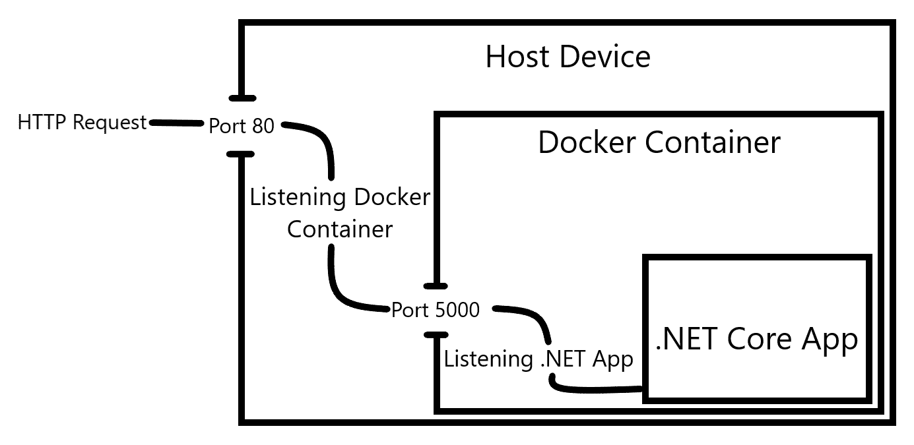
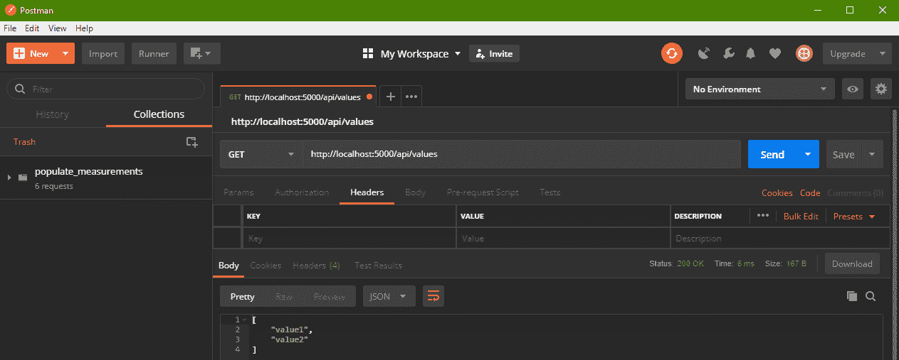
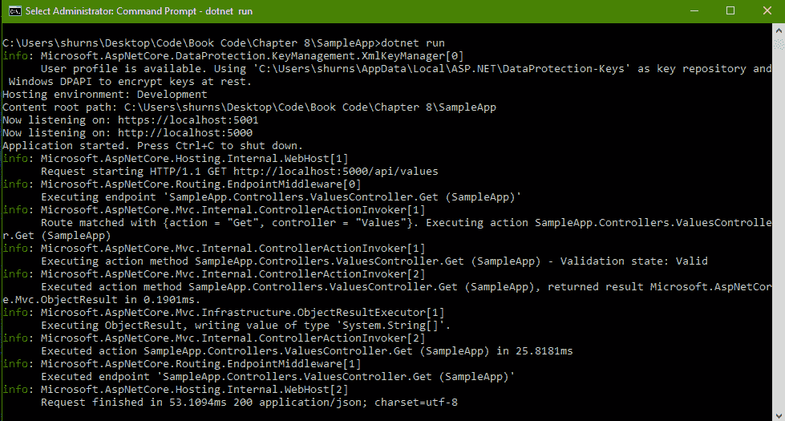

# 第八章：套接字和端口

在这个阶段，我们已经了解了如何处理来自远程主机的数据流，如何在后台线程上异步处理这些流，以及如何处理处理这些数据时出现的错误。现在，我们将探讨你可以与远程主机建立的最原始的连接。在本章中，我们将探讨你的机器将要通过这些物理端口来完成这项工作，并且我们将探讨套接字的概念：一种软件结构，它暴露了对端口的访问以进行网络交互。我们将检查 WinSocks 库以实例化和使用这些端口，并考虑各种方式，你的应用程序代码可以利用套接字与目标主机进行高效、低级别的通信。

本章将涵盖以下主题：

+   `System.Net.Sockets`类如何作为 C#接口服务于你的硬件级网络 API，用于与外部机器通信

+   如何连接到网络上另一台机器暴露的套接字

+   如何编写暴露套接字以接受外部连接请求的服务器应用程序

+   在串行端口上进行通信的性质，以及如何将串行端口暴露出来以接受用于处理的数据，以及这如何为你打开 C#和.NET Core 的有趣用例。

# 技术要求

本章将包含多个示例和驱动程序程序来演示所讨论的概念，每个都将在此处提供：[`github.com/PacktPublishing/Hands-On-Network-Programming-with-CSharp-and-.NET-Core/tree/master/Chapter%208`](https://github.com/PacktPublishing/Hands-On-Network-Programming-with-CSharp-and-.NET-Core/tree/master/Chapter%208)。

和往常一样，在本地克隆存储库，开始与源代码一起玩耍，或者编写你自己的代码，与章节中的主题一起熟悉它。

我们还将开始使用外部工具来测试和检查示例 API 的行为。为此，你需要下载并安装 Postman，它可以在以下位置找到：[`www.getpostman.com/apps`](https://www.getpostman.com/apps)，或者你需要 Insomnia REST 客户端，它可以在以下位置找到：[:](https://www.getpostman.com/apps) [`insomnia.rest/`](https://insomnia.rest/)。

这些应用程序的功能集几乎完全相同，每个都将允许你通过直观的用户界面向本地 API 发送任意请求。我们将使用它们来测试我们的网络软件，并建议你至少花一点时间熟悉你选择的工具的一些基本功能。在本章中，我将展示从 Postman 捕获的屏幕截图，但这并不是对 Postman 优于 Insomnia 的认可，并且跟随步骤和 UI 在两者中应该是几乎相同的。

最后，我们将使用 Docker 来演示端口映射。虽然您可以在没有这个工具的情况下理解本章的具体概念，但我强烈建议您下载并熟悉它。它是现代 Web 应用程序开发体验的核心，您将从中受益匪浅。本章提供了最好的实践机会之一，我肯定会鼓励您尝试。Docker 可以在此处下载：[`hub.docker.com/editions/community/docker-ce-desktop-windows`](https://hub.docker.com/editions/community/docker-ce-desktop-windows)。

查看以下视频以查看代码的实际运行情况：[`bit.ly/2HYmX49`](http://bit.ly/2HYmX49)

# 套接字与端口

当我们查看这些连接机制时，我们应该首先区分这两者。虽然它们是两个标识常见硬件交互的词，但每个术语所标识的软件或抽象概念实际上是相互排斥的。这些术语不像之前章节中的抽象类和接口那样可以互换，因此当我们使用每个术语时，它将具有特定的目的，您需要知道它是什么。

# 端口 – 硬件接口

正如我们所知，机器通过其 IP 地址或 DNS 注册表中映射到该 IP 地址的主机名来识别。因此，对于任何给定机器之间的连接要得到解决，发起主机最终需要目标主机的底层 IP 地址。然而，仅指定目标 IP 地址不足以针对在主机上运行的服务或应用程序。它只给出了主机本身的位置。这就是端口的作用所在。端口是一个表示目标机器上运行进程的两个字节的无符号整数。

您的主机上的每个将与远程进程交互的应用程序都必须在指定的端口上进行操作。此外，没有任何两个应用程序可以监听相同的端口。每次您想要启动应用程序并将其指定为监听网络请求时，您都必须将其分配到您机器上的一个无符号端口。如果您曾经尝试在本地机器上的`8099`或`8080`端口（或任何其他常见监听端口）上运行多个 API 项目的实例，您将看到启动失败的消息，表明目标端口已被占用。该端口已被占用，因此您必须找到一个不同的端口来处理针对您新应用程序的事务。

这种原因应该是相当明显的。如果你想在一个设备上托管多个服务，你需要一种方法来区分对服务 A 的入站请求和对服务 B 的入站请求。通过为每个托管应用程序指定互斥的监听端口，你将正确的路由负担转回到客户端。这是完全可以接受的，因为客户端已经需要跟踪远程主机的 URI，而且如果你记得我们之前章节的内容，端口号只是该 API 的另一个组成部分。另一种选择需要应用程序作为你的托管监听应用程序和所有入站网络请求之间的中介。这样的应用程序必须对每个监听应用程序的状态或期望有合理的了解，然后它将解析每个入站请求以确定哪些期望被后续请求满足。这将变成一大堆状态管理，很快就会变得不可行。所以，我们只是在我们的 URI 规范中添加 2 字节地址后缀来指定目标监听应用程序，它是直接嵌入到我们的 URI 规范中的。

# 保留端口

如果你已知一个无符号 2 字节`int`的有效整数值，那么你已经知道了机器可能暴露的所有端口的完整范围。使用这种数据类型，端口号的指定值可以从`0`到`65535`。然而，仅仅因为端口号的指定值落在这个数据类型允许的范围内，并不意味着你应该尝试监听它。实际上，有一些端口号范围是你用户应用程序代码绝对不应该尝试监听的。这些被指定为保留端口，通常处理非常特定的功能。

第一组保留的端口，因此你不能注册你的应用程序，被称为**知名端口**。这些端口介于`0`和`1023`之间，用于从 DNS 地址解析（用于确保在注册表中列出的地址上仍然有机器在监听，该端口号为`53`）到 FTP 数据和控制端口（分别为端口号`20`和`21`）。如果你在阅读这本书之前做过任何形式的网络编程，你很可能已经熟悉了这样一个事实，即`80`端口是入站 HTTP 请求指定的端口，而`443`端口是为 HTTPS 保留的。

您无法注册应用程序的另一组端口被称为**动态端口范围**。动态端口，或称为私有端口，用于建立私有或定制服务或交互的连接，或用于两个主机之间的临时**传输控制协议**（**TCP**）或**用户数据报协议**（**UDP**）交互。当在临时环境中为机器的短暂需求提供服务时，指定的端口被称为**临时端口**。这些端口不能在给定的主机上注册给**互联网数字分配机构**（**IANA**）用于通用网络交互。这些端口的范围从端口号`49152`开始，到`65535`结束。

**互联网数字分配机构**（**IANA**）是一个负责管理 IP 地址分配（以及其他事项）的非营利组织。正如我在第一章，“网络概要”中提到的，一个集中化的标准（和名称）系统对于确保每个设备将一个 IP 地址的请求路由到同一设备非常重要。

根据该规范，这似乎意味着在`1024`和`49151`之间以及包括这两个端口号的所有内容都可用于您的应用程序。这些被称为**已注册端口**。它们可根据需要由用户应用程序或系统服务分配，并且不会干扰您的硬件或其他连接主机的默认行为。

可能看起来将您的应用程序配置为在已注册端口范围内监听就足够使用了。然而，这仍然不是**完全**如此。如果您曾经运行过 JBoss 应用程序服务器（在像 JBoss 这样的膨胀应用程序服务器的糟糕旧日子里，您可能记得通过访问`http://localhost:8080/my-java-application`来访问您本地的开发环境，或者至少这是我过去不得不做的。JBoss 总是配置那个端口的原因是它实际上充当了`80`端口的别名，即 HTTP 端口。`8008`也是一样。因此，尽管端口位于已注册端口范围内，但对其行为有特定的期望。它实际上只是为用户提供了一个值，以便在已注册端口范围内定义默认的 HTTP 处理器，因为您无法直接将应用程序分配到`80`端口。

在已注册端口范围内还有其他端口，这些端口可能被您本地机器上的常见服务和应用程序占用。尽管.NET Core 如果无法在指定端口上注册自己就会停止，但您会立即注意到，如果您需要使用不同的端口号更新您的配置。

# 在单个端口上暴露多个应用程序

如果你已经在网络开发领域工作了相当长的时间，你可能已经熟悉了在 Windows 宿主上部署网络应用程序时，如何处理 **Internet Information Services**（IIS）或上述 JBoss 的各种配置和设置。这被称为 **应用服务器**，它本质上为系统上任何公开的网络应用程序提供了一个共享的托管环境。当使用 IIS 时，你可以注册任意数量的应用程序以响应针对单个端口的请求（HTTP 的 `80` 端口或 HTTPS 的 `443` 端口），并通过 URI 中的应用程序路径或子域规范来区分它们。

因此，如果你有两个名为 `TestApp` 和 `SampleApp` 的应用程序，并且你希望在单个机器上托管它们，同时通过 HTTP 端口公开它们，你可以通过在 IIS 中注册和部署它们来实现。这样做时，你会在 IIS 中指定一个应用程序目录，例如 `/sample` 和 `/test`。这将告诉 IIS，任何通过 `80` 端口到达你的主机名的请求，其请求路径的第一个组件是 `/sample` 目录，应该被路由到你的 `SampleApp`，就像请求直接发送到该应用程序一样。这实际上将映射特定端口的问题转化为映射特定应用程序目录的问题。

虽然 IIS 仍然支持部署 .NET Core 应用程序，但在现代网络托管环境中，这种情况要少得多。IIS 特别以其复杂的配置方案以及它对宿主机器造成的巨大内存和 CPU 使用影响而闻名。更不用说 IIS 仅限于 Windows 操作系统，这使得 IIS 托管应用程序的可移植性几乎不存在。

更常见的是，工程师们正在采用更轻量级的方法来处理托管问题。随着 .NET Core 运行时的跨平台支持，那些在绿色场应用中工作的工程师被鼓励追求更前沿的解决方案。通常，.NET Core 开发者通过 Docker 容器将应用程序部署到远程主机。Docker 为你的应用程序提供了一个隔离的托管环境，并通过将容器的内部监听端口映射到运行 Docker 容器的机器上的可用端口，将你的应用程序监听的端口暴露给外界。你可以在所谓的 **Dockerfile** 中指定应用程序希望监听的端口，该文件指定了 Docker 托管应用程序的构建和部署步骤。它与 PowerShell 脚本或 bash 脚本类似，用于自动化常见的操作系统级操作。一旦指定了所需的端口，你可以在 `run` 命令中将它映射到宿主机器上的一个端口，如下所示：

```cs
docker run -p 80:5000 -p 443:5001 SampleApp
```

此命令将把我们的**Docker 容器**内部的`5000`端口映射到主机机器上的`80`端口，以及`5001`端口映射到`443`端口。因此，从我们的托管上下文来看，我们将收到针对`80`端口的请求，这将由我们的 Docker 实例监听，并将请求转发到我们的正在运行的**.NET Core 应用程序**，该应用程序将监听`5000`端口：



从这里，由 IIS 或 JBoss 解决的在单个端口后面托管多个应用程序的问题通常只是配置问题。如果你的应用程序是云托管，你通常可以执行与 IIS 提供的相同类型的路由前缀映射。在其他上下文中，你可以在所谓的**反向代理**后面托管你的应用程序套件。

我们将在后面的章节中花时间查看，在某些情况下甚至构建这些方法中的每一个。然而，现在，你只需要理解端口作为外部请求可以通过它访问目标设备上特定服务或应用程序的机制的性质就足够了。当将你的应用程序暴露给网络资源时，你使用的特定端口通常是简单配置和惯例的问题；现在，我们将看看如何通过套接字在我们的软件中与这些特定端口进行交互。

# 套接字 – 对端口的软件接口

既然我们已经了解了端口是如何用于将请求路由到主机设备上的特定进程的，我们该如何设置我们的应用程序以实际*接受*通过这些端口的请求呢？这就是套接字发挥作用的地方。

套接字为特定远程主机上的特定端口提供了一个软件接口。它是在你指定的服务器和端口地址处暴露的任何远程应用程序与你的应用程序之间的开放连接流。一旦建立这种连接，你就可以自由地向该连接的开放流写入（或读取）任何你需要的数据。套接字是一个多用途的概念，几乎在任何服务器端编程语言中都有实现，.NET Core 也不例外。

套接字与其底层端口之间的一个关键区别是，端口代表对远程设备上单个进程的访问。因此，端口只能为单个应用程序注册。然而，套接字代表对该单个资源的活动连接。因此，可以连接到资源的活动套接字数量可以由网络和远程主机支持：


因此，端口代表在远程机器上运行的单个进程，而套接字代表一个连接到远程机器上进程的连接，该进程由端口号指定。当我们运行应用程序并打算将其暴露给远程资源时，我们必须将其注册到特定的端口。如果我们想通过一个暴露的端口连接到我们的应用程序，我们使用套接字来完成。端口仅仅是配置问题，而利用套接字则是实现细节，因此现在让我们看看如何实例化和利用套接字进行网络通信。

虽然我把端口注册视为仅仅是配置问题，但这并不意味着你不负责任去理解和配置。全栈网络工程要求你不仅要了解如何编写应用程序，还要了解如何正确配置和部署它们到各种预生产和生产环境中，以便其他人可以使用它们。我们将在下一章中探讨应用程序部署。

# 在 C#中利用套接字

C#中的套接字是一个极其灵活和通用的概念。正如其定义所示，它们仅暴露对远程资源的连接，而如何使用该连接几乎完全取决于建立该连接的开发者。C#中`Socket`类的一个实例提供了同步和异步的数据包传输，这些数据包是任意字节数组的集合。这些数据包的内容、结构和甚至用于传输这些数据包的协议都由你决定（尽管我强烈建议你始终优先考虑异步通信而不是同步通信）。因此，让我们看看我们将如何使用它。

# 网络套接字规范

了解套接字的第一件事是了解如何初始化它。初始化套接字所需的最基本信息是理解我们将要处理哪种类型的套接字，以及它将运行在哪种协议上。

该规范的第一个方面，即套接字类型，告诉我们的代码一旦建立连接，我们将如何与之交互。这由`SocketType`数组定义，位于`System.Net.Sockets`命名空间中，该命名空间定义了完整的有效交互机制。`enum`的值包括`Dgram`，表示我们将直接与我们的软件和连接的主机之间的无序、无连接的数据报进行工作；`Seqpacket`类型，它通过有序、边界保护的字节在流中来回传输；以及`Stream`类型，它提供了我们迄今为止已经熟悉的`Stream`实例上的异步字节流。还有一些其他的`SocketType`值，你可以在微软文档页面上找到它们以及它们的意义和用法描述。对于本章，我们只需使用`Stream`类型，因为它与我们已经非常熟悉的`System.IO`命名空间中的`Stream`类最为相似。

`Socket`可以连接并使用 OSI 网络栈传输层上的多种协议进行通信。这意味着当你构造一个套接字时，你需要指定一旦建立连接，你将使用什么协议进行通信。这会通知远程主机在连接建立后如何解析它将接收到的原始数据报或数据包（前提是主机最初支持请求的协议）。为了定义你的`Socket`实例将使用的协议，你将查看`System.Net.Sockets`命名空间中`ProtocolType`枚举的值。有几个定义的值对应于已建立的传输协议，包括 IPv4、IPv6、TCP、UDP、IDP、原始协议等。为了我们代码的目的，我们将连接到一个本地应用程序，该应用程序正在监听 HTTP 请求，由 TCP 协议处理，因此我们在初始化`Socket`时将指定 TCP 协议。

这两块信息是我们为套接字所必需的最小细节，公共构造函数的签名如下：

```cs
public Socket (System.Net.Sockets.SocketType socketType, System.Net.Sockets.ProtocolType protocolType);
```

还有一个选项可以指定连接的`AddressFamily`。这实际上可以从你的连接端点推导出来，并提供给套接字构造函数。通常，对于通过 TCP 传输的 HTTP 资源，你的指定将是`AddressFamily.Osi`，表示你正在使用 OSI 寻址方案。既然我们已经知道了如何初始化套接字，让我们看看连接套接字到远程端点需要什么。

# 建立套接字连接

我们首先想要做的是设置一个简单的监听服务器，我们可以将其连接到我们的套接字驱动程序。为此，我们将启动一个简单的`WebAPI`项目并运行它。首先，打开命令提示符并导航到你想要创建示例 API 的目录。接下来，使用以下命令从.NET Core CLI 创建一个新的`WebAPI`：

```cs
dotnet new webapi -n SampleApp
```

这将从头开始启动一个新的应用程序，该应用程序将准备好接收和响应发送到你的本地机器和预配置端口的 HTTP 和 HTTPS 请求。

为了本次演示的目的，我们实际上需要禁用此应用程序中的一些默认功能。WebAPI 的模板将重定向所有发送到 HTTP 端口的调用到 HTTPS 端口。我们希望阻止这种情况发生，以便 HTTP 端口可以直接服务请求。你稍后会明白原因，但现在你可以通过打开你的`SampleApp`项目并导航到`Startup.cs`文件来禁用此功能。在这个文件中，你会找到一个具有以下签名的函数：

```cs
public void Configure(IApplicationBuilder app, IHostingEnvironment env)
```

在此方法的底部，删除或注释掉读取以下代码行的行：

```cs
app.UseHttpsRedirection();
```

完成这些后，您可以关闭该文件夹，并在本示例项目的剩余部分忽略其内容。现在，让我们运行它并测试它，首先导航到刚刚创建的文件夹，然后调用 CLI 的 `dotnet run` 命令。完成这些操作后，您应该会看到运行中的应用程序以下输出：


如果您对由 `dotnet new` 命令创建的项目模板感兴趣，可以花些时间进行调查，但我们将在本章的下一部分更详细地介绍 WebAPI 应用程序，以及其他许多内容。现在，重要的是我们有一个正在监听请求并返回响应的应用程序。如果您愿意稍后再学习，可以简单地相信我对其预期功能的前进，如果愿意的话。

您控制台输出的最后三行提供了有价值的信息；它们告诉您应用程序通过哪个确切的主机和端口对外暴露连接。如您所见，由 .NET 创建的新 WebAPIs 的默认端口将是 `5000`，用于传入的 HTTP 请求，而 `5001` 用于 HTTPS。

为了确认应用程序正在响应用户请求，请打开 Postman（或如果您选择的是 Insomniac，则打开 Insomniac），并发送一个 GET 请求到 `http://localhost:5000/api/values`。您应该在输出中看到以下响应：



我们可以在 `JSON` 数组中看到一个有效的响应，包含两个字符串。一旦您有了这些，我们就可以使用 `Socket` 进行连接。

在 `SampleApp` 的父目录中创建一个新的控制台应用程序，使用 CLI 中的 `dotnet new console -n SocketTest` 命令。这将是我们与 `Socket` 类一起工作的驱动应用程序。本示例项目的目标是连接到正在 `5000` 端口监听的 `SampleApp`，向 `/api/values` 端点提交请求，然后解析并打印响应。

因此，我们首先需要为 `Socket` 定义一个 `IPEndPoint` 实例以进行连接。`IPEndPoint` 是 `EndPoint` 抽象类的一个特定实现，该类是我们将要使用的 `Socket.ConnectAsync()` 方法所要求的。它定义了我们打算连接到的远程资源的特定位置，并公开了有关该端点的元数据。它还为我们 `Socket` 构造函数签名提供了 `AddressFamily` 值。所以让我们首先使用主机地址和端口定义它，并使用它来构造 `Socket`。

要做到这一点，我们需要一个`IPAddress`实例，我们可以根据存储在我们本地主机地址`127.0.0.1`中的 4 个字节自己构建它，或者我们可以简单地使用`Dns.GetHostEntry()`方法从第二章，*DNS 和资源定位*显式请求它。当你跟随时，你可以随意操作，但由于它涉及较少的数学，我将使用 DNS。然而，由于主机条目返回的`AddressList`可以包含一个任意大的 IP 地址列表，这些地址可以解析该名称，我们希望连接到允许我们连接的第一个地址，并从这里开始。这意味着我们需要在`AddressList`中循环，直到建立连接。因此，尝试建立我们连接的初始设置将看起来像这样：

```cs
static async Task Main(string[] args) {
  string server = "localhost";
  int port = 5000;
  string path = "/api/values";

  Socket socket = null;
  IPEndPoint endpoint = null;
  var host = Dns.GetHostEntry(server);

  foreach (var address in host.AddressList) {
    socket = new Socket(address.AddressFamily, SocketType.Stream, ProtocolType.Tcp);
    endpoint = new IPEndPoint(address, port);
    await socket.ConnectAsync(endpoint);
    if (socket.Connected) {
      break;
    }
  }
  ...
}
```

这段代码可能让你注意到的是，我们正在使用`Main()`方法的`async`版本。这是一个仅在 C# 7.2 版本中添加的功能，如果你的项目没有配置为至少针对那个版本，你将遇到构建错误。要解决这些问题，只需修改`.csproj`文件的`PropertyGroup`标签，包括带有其版本设置为`latest`的`LangVersion`标签，就像这里看到的那样：

```cs
<PropertyGroup>
    <OutputType>Exe</OutputType>
    <TargetFramework>netcoreapp2.2</TargetFramework>
    <LangVersion>latest</LangVersion>
</PropertyGroup>
```

一旦你做了这个更改，你的源代码将始终针对 C#的最新次要版本。有了这个，你应该没有问题异步运行你的`Main()`方法。

如果你想要确保一切按预期运行，你可以运行你的应用程序，在`break;`操作符上放置一个断点，你应该会看到断点被命中，这意味着你的两个应用程序之间已经建立了连接。然而，你会注意到，仅仅建立连接并没有在你的运行 WebAPI 应用程序中触发任何日志消息。这是因为，尽管建立了连接，但我们没有对连接到的资源发出请求。请求必须作为格式良好的消息通过已建立的连接发送。所以现在，让我们构建我们的请求，并通过连接的套接字发送它。

发送请求就像在我们的套接字上调用`SendAsync()`方法一样简单，该方法需要一个表示要发送的数据缓冲区的字节数组。因此，对于一个 HTTP 请求，我们必须从头开始构建我们的消息。这意味着指定我们将要使用的方法或 HTTP 动词，我们请求的资源的具体 URL，我们打算发送的任何内容的尺寸，以及我们需要附加的任何请求头。我相信到现在你已经能看出直接与套接字工作是多么繁琐。然而，对于这样一个简单的请求，我们可以通过一个简单的实用函数轻松构建我们的消息：

```cs
private static string GetRequestMessage(string server, int port, string path) {
  var message = $"GET {path} HTTP/1.1\r\n";
  message += $"Host: {server}:{port}\r\n";
  message += "cache-control: no-cache\r\n";
  message += "\r\n";
  return message;
}
```

然后，我们可以像写入流一样构建我们的字节数组。所以回到我们的主方法中，我们将获取我们的请求消息，将其转换为字节数组，然后将请求发送到我们的远程主机（*SampleApp*，运行在`http://localhost:5000`）。在通过`Socket`实例建立连接后，将以下几行代码添加到主方法中：

```cs
var message = GetRequestMessage(server, port, path);
var messageBytes = Encoding.ASCII.GetBytes(message);
var segment = new ArraySegment<byte>(messageBytes);

await socket.SendAsync(segment, SocketFlags.None);
```

如果你添加了这段代码并运行你的应用程序，当你开始在 WebAPI 项目的控制台看到日志信息时，你就知道你已经成功了，就像这里看到的那样：



就这样，你已经成功地在套接字连接上发送了你的第一条传输层消息。

现在，为了确认我们正确地收到了服务器的响应，我们将尝试将之前在 Postman（或 Insomnia）请求的响应中看到的相同消息写入我们的`SocketTest`应用程序的控制台。为了做到这一点，我们必须使用`ReceiveAsync()`方法来接收服务器针对我们的请求返回的任何字节数组。

就像我们在前面的章节中使用的`Stream`类的实例一样，`ReceiveAsync()`方法接受一个字节数组，它将写入这个数组。为此，我们将提供一个长度为 512 字节的空数组。一旦我们定义了这一点，我们就可以接收来自远程资源的响应，并将其逐行写入我们的控制台。只需将以下几行代码添加到`Main()`方法的底部：

```cs
var receiveSeg = new ArraySegment<byte>(new byte[512], 0, 512);

await socket.ReceiveAsync(receiveSeg, SocketFlags.None);

string receivedMessage = Encoding.ASCII.GetString(receiveSeg);

foreach(var line in receivedMessage.Split("\r\n")) {
    Console.WriteLine(line);
}
Thread.Sleep(10000);
```

当你现在运行应用程序时，你应该会在控制台看到消息头，以及包含我们之前在 Postman 中看到的字符串数组的正文打印出来：


就这样，你已经成功地在 TCP 上从头开始执行了一个 HTTP 请求。

最后一件事情是从你的主机断开连接，并销毁你的套接字。让你的应用程序`Main()`方法的最后两行看起来像这样：

```cs
  ...
  socket.Disconnect(false);
  socket.Dispose();
}
```

这是你的一大礼貌。尽管端口可以同时处理多个连接，但在任何给定时间点，它能够服务的连接请求数量是有限的。断开你自己的套接字会为其他人腾出远程主机上的资源。虽然对于非活动连接有一个最大时间限制，在此之后远程主机将强制取消连接，但你绝对不应该让非活动连接保持那么长时间。如果你完成了主机的工作，就断开与主机的连接。

# 解析响应

如您所料，封装您远程主机响应全部内容的简单 ASCII 字符字符串并不是一个计算机友好的格式。接收响应是一回事，但在您的应用程序中利用其内容则是完全不同的一种生物。每次需要访问不同机器上的内容时，从头开始做这种工作将使软件开发周期慢如蜗牛。

这就是为什么.NET Core 为日常可能遇到的具体协议和交互提供了如此多的功能灵活的包装类和实用类。因此，虽然我认为了解如何从您的应用程序直接连接到网络中任何其他机器上运行的任何其他应用程序的建立和利用是非常重要的，但这并不常见，您不太可能需要这样做。随着我们进入下一章，我们将看到.NET Core（以及 ASP.NET Core，在 HTTP 的情况下）提供的模板和库是如何完成所有繁重的工作，这样我们就不必亲自去做。如果您对 C#中低级网络交互感兴趣，那么有一个关于知识和用例的广阔海洋，我简单地没有时间在这一章中涵盖，我鼓励您花些时间深入研究。尽管如此，如果这个内容看起来有点无聊或乏味，请不要担心。它即将变得更有趣。

# 摘要

在本章中，我们开始利用并最终构建在前几章中奠定的基础，使我们的应用程序能够访问 C#中可用的全部网络功能。我们了解到，我们编写的任何应用程序，如果预期将在我们的网络上使用资源，必须首先通过我们主机机器上的端口向这些资源公开。我们研究了端口的指定和注册方式，并了解了一些关于我们如何注册自己的限制，包括知名端口号的原因和范围，以及我们不能（或至少不应该）注册应用程序的动态或临时端口号的范围。

一旦我们确立了这一概念，我们就转向连接的另一端，并开始使用套接字。我们了解到套接字是远程机器上开放端口上活跃连接的通用代码表示。我们看到了这个概念的简单性如何为基于套接字的网络代码和它对数据包级通信的低级控制开辟了广泛的应用。

通过本书到目前为止所涵盖的概念，你拥有了编写任何可能需要的网络软件所需的资源。理解异步流的本质、数据包构造和解析，以及与远程资源的套接字连接就足以实现任何可能的网络功能。然而，使用这些原始构建块远非理想。这就是为什么.NET Standard 为可能需要编写的各种应用程序提供了如此多的有用模板、模式和库，我们将在下一章开始探讨这些内容，从基于 HTTP 的应用程序开始。

# 问题

1.  端口的定义是什么？

1.  已知端口的范围是什么？

1.  动态端口的范围是什么？

1.  应用服务器的主要功能之一是什么？

1.  端口的定义是什么？

1.  套接字和端口之间的一些主要区别是什么？

1.  哪个构造提供了套接字可以连接的协议范围？

1.  套接字支持哪些协议？

# 进一步阅读

关于这个主题的进一步阅读，我在前几章推荐的大多数书籍仍然适用。

然而，为了获得更多见解，你可以查看 *ASP.NET Core 1.0 高性能*，*詹姆斯·辛顿*，*Packt 出版*.* 虽然那本书的主题是特定于应用层网络编程，但他讨论了管理直接连接 I/O 的性能优势，这个主题可能很有趣。你可以在 *Packt 出版* 上找到它：[`www.packtpub.com/application-development/aspnet-core-10-high-performance.`](https://www.packtpub.com/application-development/aspnet-core-10-high-performance)
