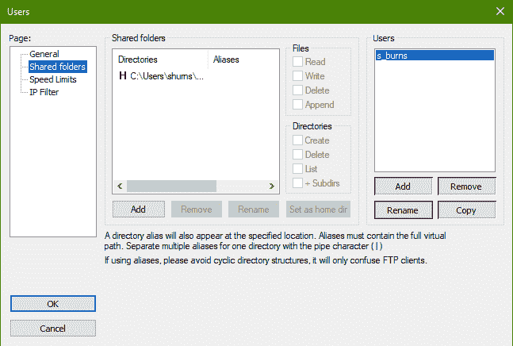
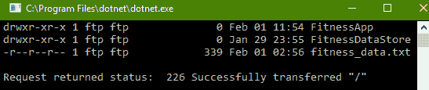
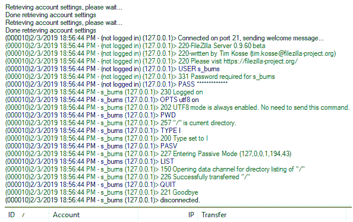

# 第十章：FTP 和 SMTP

在本章中，我们通过关于 HTTP 的章节探讨了应用层协议的重磅内容，因此，审视一些不太常见的协议对我们来说将大有裨益。这正是本章我们将要探讨的内容。虽然 HTTP 是一种通用的工作马协议，但有许多原因可能促使你考虑在自己的软件中针对特定任务使用**文件传输协议**（**FTP**）或**简单邮件传输协议**（**SMTP**），或者这些协议可能在 .NET Core 的某些常见抽象之下被利用。因此，在本章中，我们将探讨这些原因，并学习在需要时如何实现这些协议。

本章将涵盖以下主题：

+   FTP 标准是如何定义的，以及 C# 在 .NET Core 中如何实现该协议

+   理解确保文件传输安全的过程

+   理解 SMTP 的本质及其所扮演的角色

# 技术要求

在本章中，我们将使用本书 GitHub 仓库中提供的示例应用程序：[`github.com/PacktPublishing/Hands-On-Network-Programming-with-CSharp-and-.NET-Core/tree/master/Chapter%2010`](https://github.com/PacktPublishing/Hands-On-Network-Programming-with-CSharp-and-.NET-Core/tree/master/Chapter%2010)。

我们将主要使用控制台应用程序，因此您不需要为本章特别准备任何 REST 或 Web 客户端。

此外，在本章中，我们将编写一个客户端来与 FTP 服务器交互。为此，我们需要一个我们可以自行管理的 FTP 服务器。我将使用 FileZilla，并建议你也这样做。它轻量级、稳定且开源。您可以在以下位置找到它：[`filezilla-project.org/download.php?type=server`](https://filezilla-project.org/download.php?type=server)。如果您的开发环境不支持 FileZilla，请不要担心。目标仅仅是拥有一个可供应用程序交互的服务器。演示应该足够简单，以便使用支持您操作系统的任何 FTP 服务器进行跟随。

查看以下视频，了解代码的实际应用：[`bit.ly/2HYmsHj`](http://bit.ly/2HYmsHj)

# 通过网络进行文件传输

关于 FTP 和文件传输的第一件事要注意的是，作为 **开放系统互联**（**OSI**）堆栈上的应用层协议，其设计的主要关注点是优化特定常见业务任务在网络上的执行。然而，仅仅因为一项任务在某个协议上执行得最优化，并不意味着它必须通过该协议执行。实际上，理论上几乎任何在应用层执行的任务都可以通过任何应用层协议完成。那么，是什么使得 FTP 对我们这些工程师来说有用呢？

# FTP 的意图

虽然 FTP 针对主机之间的文件传输进行了优化，但我敢打赌，这本书的每一位读者都曾将文件作为电子邮件附件在网络中传输过。同样的任务完成了，也就是说，文件从一个网络主机传输到另一个网络主机，但这是通过不同的应用层协议（SMTP 而不是 FTP）完成的。确实，HTTP 规范的多功能性使其能够远远超出其优化的任务（传输超文本文档）并成为网络通信的通用工作马。

事实上，有无数的应用程序直接通过 HTTP 传输文件。甚至有一个广为人知且广泛支持的媒体类型，专门用于与`multipart/form-data`进行此类交互。那么，使用 FTP 进行文件传输而不是其他更通用的应用层协议，我们能获得哪些优势呢？

建立在客户端-服务器模型架构之上，FTP 被设计和实现为利用两个独立的连接来建立目标文件系统的状态和传输文件。这些连接中的第一个被称为控制连接，它用于保存有关远程主机状态的详细信息，例如向 FTP 客户端公开的当前工作目录。同时，对于每次数据传输，使用控制连接维护的信息建立第二个数据连接。当数据连接建立并传输数据时，控制连接处于空闲状态。

在大多数实现中，建立控制连接可能有些麻烦，并且通常性能较慢。这是因为每个连接都需要多次往返，向远程主机发送各种命令以建立目标目录，协商任何身份验证，并确定和存储远程状态以供数据连接使用。这种高性能成本，以及控制连接的状态性，是使 FTP 不适合用于传输简单的、简短的超文本文档页面的原因，因此需要 HTTP。然而，这种状态连接以及它提供给客户端有关目录当前状态的信息对于 FTP 所支持的一些操作是必不可少的（例如检测远程主机上的文件存在或目录中所有文件的批量下载）。

# 激活和被动连接

一旦建立了控制连接，数据连接可以使用两种可能的模式之一。服务器可以建立激活连接，这是大多数 FTP 服务器的默认状态，或者被动连接。这些不同类型的连接具体指的是数据连接的建立和处理方式。在任何情况下，客户端都使用底层传输协议（通常是**传输控制协议**（**TCP**））的消息来初始化控制连接。

在主动连接中，一旦控制连接建立并且可以开始数据传输，服务器将建立数据连接来通过线路传输文件。客户端在命令连接阶段传输信息，通知服务器哪个端口正在积极监听数据连接。然后服务器尝试在指定的端口上与客户端建立连接，该端口用于服务器推送文件数据。服务器被称为*主动传输*数据到客户端。

在被动连接中，客户端使用控制连接来通知服务器该连接应为被动模式。然后服务器响应一个 IP 地址和端口号，客户端可以据此建立连接。在那个时刻，客户端将建立数据连接到服务器的指定 IP 地址和端口。一旦这个连接建立，客户端就可以传输文件数据。

# 传输模式和数据处理

一旦实际数据连接被建立为主动或被动模式，并且文件传输准备就绪，就有多种方式来传输文件，使其在目标机器上可读。请记住，在 Unix 系统上编写的文本文件与在 Windows 机器上编写的文本文件将具有不同的字符编码或行终止符。如果你曾经打开过文本编辑器或源代码控制界面，并被提示规范化文件的行终止符，这就是原因。这是为了弥补不同原生环境之间细微差异的一种方式。

由于 FTP 是一种平台无关的网络传输协议，它必须考虑到不同系统上文件内容二进制表示可能存在的差异。为此，FTP 为通过连接传输的文件提供了三种不同的常见数据表示机制：

+   **ASCII 模式**：这种模式仅应用于文本文件。字符和字节在传输之前从源机器的本地字符表示转换为 8 位 ASCII 编码，然后再次从该 8 位 ASCII 编码转换为目标机器的本地字符表示。当然，如果任一机器的本地字符编码已经是 8 位 ASCII，那么在该机器和数据连接之间不需要进行转换。

+   **图像（或二进制）模式**：在这种模式下，源机器上文件的底层二进制数据以未更改的状态，以顺序字节流的形式发送。目标机器随后在本地系统上的目标文件位置，逐字节存储该流，因为它从源接收数据包。

+   **本地模式**：这是用于两台具有共享本地配置的计算机，以任何专有表示形式传输数据，而无需将其转换为 ASCII。它与图像模式并不完全不同，只是在专有格式允许的情况下，数据可以非顺序地传输。

然而，一旦你确定了表示数据传输的最佳方式，FTP 还将提供三种执行该传输的机制。它们如下：

+   **流模式**：数据报以连续流的形式发送。这有几个性能优势，因为不需要在头部或元数据中封装离散的数据包来启用解析。字节简单地发送出去，直到源系统上的文件结束。

+   **块模式**：这种机制将文件数据分成离散的应用层数据包，并一次传输一个数据包到源系统，然后源系统根据数据包元数据中的信息重建原始文件结构。

+   **压缩模式**：这种模式简单地启用了一种简单的数据压缩算法，以最小化主机之间发送的数据总量。

# 暴露目录以供 FTP 使用

我在本节中描述的所有功能都是为了在两个远程主机之间高效传输文件而服务的特定目的。虽然显然该协议不适合像将网页传输到远程浏览器渲染这样的任务，但它确实在 HTTP 等其他应用协议上具有许多优势。这包括给工程师提供灵活性，以确定他们如何以及以何种格式传输大文件。

因此，既然我们已经了解了 FTP 的使用方式和原因，让我们看看我们如何在自己的程序中使用它。我们将使用.NET 库类编写一个简单的客户端。最终状态将是一个可以上传和下载文件，以及从远程主机请求目录信息的客户端。

这次我们的应用程序将是一个控制台应用程序，所以通过你选择的终端导航到你的工作目录，并创建一个新的项目：

```cs
dotnet new console -n FtpClientSample
```

接下来，你需要确保你的文件服务器在本地运行正常。当你安装软件时，你应该会看到一个窗口提示你选择一个端口，服务器将在这个端口上监听管理连接。

# 配置你的 FTP 服务器

如果您仔细阅读那个提示，您会注意到它非常明确地指出您选择的端口是用于对 FTP 服务器的管理连接，而不是活动 FTP 连接。这是因为（如果您记得回想起第八章中的*保留端口*部分，*套接字和端口*），已经配置了一个默认端口来监听传入的 FTP 命令连接。就像`80`端口是 HTTP 的默认监听端口一样，`21`端口是 FTP 命令连接的默认端口。这意味着，通常情况下，发送到没有指定端口的`ftp://...` URI 的连接将自动连接到`21`端口。

这也是为什么您在 FileZilla 上配置的端口被明确指定为仅用于管理。您并不是连接到 FTP 命令连接。您是连接到管理该 FTP 命令连接的 FileZilla 服务器。因此，考虑到这一点，启动服务器并将其配置为指向安装时指定的 localhost 和端口。

一旦应用程序开始运行，您将看到一个通知，表明**传输层安全性**（**TLS**）的 FTP 未启用。尽管这条消息是用令人警觉的红色文字写的，但现在您可以忽略它。当我们稍后在后续章节中探讨 TLS 时，我们会进一步研究它。目前，缺少安全密钥只会让我们在尝试理解 FTP 时生活变得稍微容易一些。我们引入的变量越少，在接收新信息时理解起来就越容易。

最后，我们需要在我们的应用程序中注册一个用户到 FTP 管理 UI，并为该用户设置一个工作目录。为此，在 FileZilla 管理员控制台上的菜单中点击编辑 | 用户。然后导航到共享文件夹配置页面，以设置您希望允许特定用户访问的特定目录：



为了演示的目的，我将创建一个名为`s_burns`的新用户，并授予该用户访问第九章[《.NET 中的 HTTP》](https://cdp.packtpub.com/hands_on_network_programming_with_c__and__net_core/wp-admin/post.php?post=33&action=edit#post_32)源代码目录的权限。请注意，我为 FTP 服务器创建的用户与我的本地机器用户名不同。当您编写 FTP 客户端以登录并访问远程目录时，您需要的是注册在 FTP 服务器软件上的用户凭据，而不是主机机的凭据。如果我要尝试使用我的操作系统用户名从我的本地服务器下载文件，即使密码正确，我也会收到一个未经授权的异常。用户凭据应该是注册在服务器本身的用户，通常情况下，除非您编写了一个允许开放和匿名连接的 FTP 服务器，否则您应该始终使用凭据进行连接。

FTP 服务器本身将拥有主机机器授予它的给定目录的权限。因此，如果你在一个系统身份有限制只读权限的进程中运行服务器，那么它能够提供给客户端的操作范围就是这些。然而，默认情况下，FileZilla 是以授予安装用户的相同权限安装的。由于我是本地管理员，FileZilla 在我的系统上安装时具有本地管理员权限。但是，仅仅因为授予了 FileZilla 这些权限，并不意味着任何使用有效凭据连接到服务器的客户端也会拥有本地管理员权限。这将是一个巨大的安全漏洞！相反，当为你的服务器注册新用户时，管理员（在这种情况下是你）为新用户授予在共享目录中写入、读取和删除文件的单独权限。为了本章的目的，只需为自己创建一个具有完全权限的新用户即可。

# 编写 FTP 客户端

现在我们将设置我们的应用程序以与正在运行的 FTP 服务器进行交互。你们中的一些人可能还记得第五章，*在 C#中生成网络请求*，我提到了`WebRequest`实用类中的`FtpWebRequest`/`FtpWebResponse`子类。如果你们记得，那么现在你们已经比我领先了。这些是.NET Core 应用程序与 FTP 服务器交互的主要机制，我们将利用它们来满足这个程序的需求。

# 获取目录列表

我们将请求`FtpWebRequest`类的实例，然后使用其方法来查看我们监听 FTP 服务器的目录信息。该实例将指向`ftp://localhost`，正如我提到的，由于`ftp://`方案的存在，默认端口为`21`，实际上不需要指定。就像 HTTP 有与服务器交互的方法一样，FTP 也有它自己的方法来确定如何与服务器交互。在代码中，这是通过一系列静态常量属性来设置的，这些属性由`FtpWebRequest`类使用，以确定如何启动所需的行为：

```cs
static async Task<string> GetDirectoryListing() {
  StringBuilder strBuilder = new StringBuilder();
  FtpWebRequest req = (FtpWebRequest)WebRequest.Create("ftp://localhost");
  req.Method = WebRequestMethods.Ftp.ListDirectoryDetails;
  ...
}
```

HTTP 方法或动词与可以为`FtpWebRequest`设置的`.Method`属性之间的区别在于它们在底层是如何操作的。正如我们在第九章《.NET 中的 HTTP》中看到的，HTTP 方法是在请求本身上指定为一个头部的。如果该方法对于指定的地址是允许的，那么请求的其余部分将立即解析和处理，并生成一个响应。然而，在 FTP 连接中，您在`FtpWebRequest`实例上设置的`Method`属性实际上是对通过 FTP 命令连接发送到服务器的命令序列的抽象。`FtpWebRequest`客户端实际上将通过其底层的 TCP 连接发送适当的命令，并且只有在整个交换过程中从服务器获得预期的响应时才会继续进行。

现在，在我们能够向服务器请求我们所需的信息之前，我们需要验证我们的应用程序作为服务器注册用户的代表在操作。为此，我们将使用有用的实用工具类`NetworkCredential`。这个类封装了用户名和密码的基本概念，并将其映射到进行认证网络请求所需的底层表示。因此，您无需担心您的认证机制是基本认证还是摘要认证，这个类只是让您从登录信息的角度来考虑它。只需使用在 FileZilla 管理应用程序中创建的 FTP 用户的登录凭证实例化一个新的实例，并将这些凭证应用到您的请求中：

```cs
req.Credentials = new NetworkCredential("s_burns", "test_password");
```

一旦我们登录，我们可以像在第五章《在 C#中生成网络请求》中做的那样与请求对象进行交互。我们将请求我们的请求的响应，然后使用`StreamReader`读取响应数据流，并将结果写入我们的输出以确认我们的预期结果：

```cs
using (FtpWebResponse resp = (FtpWebResponse)await req.GetResponseAsync()) {

  using (var respStream = resp.GetResponseStream()) {
    using (var reader = new StreamReader(respStream)) {
      strBuilder.Append(reader.ReadToEnd());

      strBuilder.Append($"Request returned status:  {resp.StatusDescription}");
    }
  }
}
return strBuilder.ToString();
```

现在只需在您的`Main`方法中等待对这个方法的调用，并观察结果。由于我在 FTP 服务器上注册的用户只有对第九章《.NET 中的 HTTP》源代码目录根部的权限，所以我运行应用程序时在我的控制台看到以下输出：



如果您以前从未见过每行开头的字符序列，这些是定义您在目录列表中每个文件权限的代码。如果有字母存在，这意味着该文件夹的权限或状态为真。结构如下：

```cs
[directoryFlag][owner-set][group-set][other-set]
```

目录标志表示列出的条目本身是否是一个目录，可以导航到并且可以从它那里提取文件。如果条目开头有`d`，它是一个包含文件的文件夹，而不是文件本身。接下来是每种可能与之交互的用户类型的权限集。这些是三个字符的组合，表示该组中成员对列出的文件有哪些权限。按显示顺序，这些字符如下：

+   `r`：读

+   `w`：写

+   `x`：执行

因此，对于每一组，有三个字符要么被设置要么为空（在这里用`-`字符表示），表示该组是否有权限。

使用这个，我们可以看到，在我们的目录中，`FitnessApp`和`FitnessDataStore`都是目录（它们的权限记录以`d`开头），并且它们对每个组的权限如下：

+   所有者：读、写和执行权限

+   组：读和执行权限

+   其他：读和执行权限

同时，我们可以看到`fitness_data.txt`文件不是一个目录，该列表中每个组的权限如下：

+   所有者：读和写权限

+   组：只读访问

+   其他：只读访问

在权限之后，您可以看到文件（在这种情况下，FTP）的当前所有者和组，然后是文件大小（对于目录为 0），最后修改日期和文件或子目录的名称。因此，我们可以看到我们的 FTP 服务器被列为我们的文件的所有者，因此它有`rwx`权限可以授予用户。

现在我们已经成功连接到我们的 FTP 服务器，并且能够访问我们凭据可以访问的目录信息，让我们回顾一下服务器对该请求的响应。如果您打开了 FileZilla 服务器管理控制台，您会看到我们的运行应用程序和服务器之间的所有交互都显示在服务器控制台中：



注意，第一行表明 TCP 连接是在`21`端口上发起的，尽管我们在 URI 中从未指定该端口。以时间戳开始的这一行是命令连接的发起。从那里，控制台中的每一行蓝色都表示从我们的应用程序发送给服务器的信号，每一行绿色代表服务器的响应。从我们的应用程序发送的所有的四个大写字母单词和缩写都是 FTP 标准中的 FTP 命令，它们都是我们的应用程序代码发送的，我们甚至都没有意识到。这一切都是在我们的应用程序软件的底层发生的，仅仅因为我们设置了我们的请求方法为`WebRequestMethods.Ftp.ListDirectoryDetails`。

# 文件传输

因此，现在我们了解了在底层如何通过命令连接到 FTP 服务器，以及它是如何允许我们打开数据连接的，让我们利用这一点来实际请求一个文件。我们将使用我们在第五章中看到的相同的请求处理结构，即[C#中生成网络请求]。到目前为止，这一切都应该感觉非常熟悉，但我将利用`FtpWebRequest`类的一些特定属性来突出一些你可以使用的选项。那么，让我们编写下载文件的函数。

我们首先要做的事情将是指定我们想要查找的文件的子目录路径。我们将使用 FitnessApp 中的`Startup.cs`文件，这样就可以很容易地确认我们已经正确地传输了它。然后，我们将请求的`Method`属性设置为`WebRequestMethods.Ftp.DownloadFile`的值。最后，我们将明确通知服务器以被动模式操作，这意味着我们的应用程序将在幕后在`20`（FTP 服务器数据连接的默认连接端口）上建立自己的连接到远程服务器，然后一旦连接打开，就请求该文件。因此，我们的下载方法的初始化代码将看起来像这样：

```cs
public static async Task<string> RequestFile() {
  StringBuilder strBuilder = new StringBuilder();
  FtpWebRequest req = (FtpWebRequest)WebRequest.Create("ftp://localhost/FitnessApp/Startup.cs");
  req.Method = WebRequestMethods.Ftp.DownloadFile;

  req.Credentials = new NetworkCredential("s_burns", "test_password");
  req.UsePassive = true;
  ...
  using(FtpWebResponse resp = (FtpWebResponse) await req.GetResponseAsync()) {
    ...
  }
}
```

现在，为了复制文件，我们将直接从响应流中读取，并将其写入到我们的目标文件的`StreamWriter`中。由于嵌套的作用域，这看起来可能很复杂，但所有那些制表符只是为了处理每个可处置的`Stream`对象及其相应的`Reader`或`Writer`辅助类：

```cs
using (var respStream = resp.GetResponseStream()) {
  strBuilder.Append(resp.StatusDescription);
  if(!File.Exists(@"../Copy_Startup.cs")) {
    using (var file = File.Create(@"../Copy_Startup.cs")) {
      //We only use this to create the file in the path if it doesn't exist.
    }
  }
  using (var respReader = new StreamReader(respStream)) {
    using (var fileWriter = File.OpenWrite(@"../Copy_Startup.cs")) {
      using (var strWriter = new StreamWriter(fileWriter)) {
        await strWriter.WriteAsync(respReader.ReadToEnd());
      }
    }
  }
}

return strBuilder.ToString();
```

现在，让我们在我们的`Main`方法中添加对这个方法的调用，它应该看起来像这样：

```cs
static async Task Main(string[] args) {
  Console.WriteLine(await GetDirectoryListing());
  Console.WriteLine(await RequestFile());
}
```

如果你从终端运行此项目，你的输出应该列出目录结构，并且当导航到项目的根目录时，我们应该找到我们的`Copy_Startup.cs`文件，看起来正好如我们所期望的那样！

# 通过 FTP 上传文件

为了完成这个客户端示例，让我们看看如何上传到服务器。记住，这是 FTP，而不是文件下载协议。文件传输可以双向进行。对于这个方法，我们将把我们的文件转换为字节流，以便在建立连接后与我们的请求一起上传。

我们还将把我们的`WebRequest` URI 指向新创建的文件。我们只是将当前项目的`Program.cs`文件复制到远程目录的根目录。那么，让我们看看初始化代码看起来像什么：

```cs
public static async Task<string> PushFile() {
    StringBuilder strBuilder = new StringBuilder();
    FtpWebRequest req = (FtpWebRequest)WebRequest.Create("ftp://localhost/Program.cs");
    req.Method = WebRequestMethods.Ftp.UploadFile;

    req.Credentials = new NetworkCredential("s_burns", "test_password");
    req.UsePassive = true;
```

到目前为止，一切顺利。现在我们需要创建一个字节数组并将我们的`Program.cs`文件写入其中。然后，将这个字节数组写入请求流。在你阅读了第六章后，*流、线程和异步数据传输*，这应该对你来说应该很熟悉：

```cs
byte[] fileBytes;

using (var reader = new StreamReader(@"Program.cs")) {
    fileBytes = Encoding.ASCII.GetBytes(reader.ReadToEnd());
}

req.ContentLength = fileBytes.Length;

using (var reqStream = await req.GetRequestStreamAsync()) {
    await reqStream.WriteAsync(fileBytes, 0, fileBytes.Length);
}
```

最后，为了实际传输上传我们的文件以及该文件内容的流，我们只需从服务器请求一个响应。

```cs
  using (FtpWebResponse resp = (FtpWebResponse)req.GetResponse()) {
        strBuilder.Append(resp.StatusDescription);
  }

  return strBuilder.ToString();
}
```

就这样，我们正在将文件上传到我们的远程 FTP 服务器。只需在我们的`Main`方法中添加一行，然后运行应用程序。如果您以与我相同的方式配置了您的服务器，现在您应该在我们的第九章的根目录中看到我们刚刚编写的程序的副本，即.NET 中的*HTTP*源代码，紧挨着`FitnessApp`和`FitnessDataStore`项目文件夹。

# 保护 FTP 请求

虽然您可能怀疑向我们的服务器提供用户凭证意味着在文件访问中涉及了一定程度的安全性，但实际上我们是以完全不安全的方式与我们的服务器交互的。这些凭证只有在服务器收到它们并且我们的命令连接建立的那一刻才有价值。然而，在那之后，它们为我们传输的数据提供的保护并不比我们允许完全匿名访问我们的目录更多。因此，让我们看看为什么是这样，以及如何解决这个问题。

# FTP 的风险

使用我们的示例软件，我们无需对安全性有任何真正的担忧，因为我们的数据永远不会通过实际的网络连接进行传输。我们的请求永远不会越过我们的`hosts`文件，因为我们总是指向`localhost`。然而，如果情况不是这样，我们需要与远程服务器进行身份验证，并且我们使用为这个演示设置的 FTP 标准连接这样做，我们就会遇到麻烦。我们用来登录服务器的凭证完全以纯文本形式发送。此外，最终建立的数据连接也是以完全未加密的方式通过电线发送的。

如果我们仅使用我们提供的服务器凭证尝试与远程服务器进行通信，我们就会面临各种不同恶意攻击的风险。想象一下一个简单的中间人攻击者读取包含**个人身份信息**（**PII**）的文件的字节流，例如社会安全号码、医疗信息或银行账户详情。FTP 标准实际上并没有设计来考虑这种风险。更重要的是，由于文件传输机制是在命令连接之前协商的，实际的文件数据通常以不间断的字节流的形式发送，容易被恶意方重新组装和读取。只需按顺序接受底层的包流，移除标准的传输层头部，并将接收到的字节拼接起来。因此，在受保护的私有网络之外使用标准 FTP 连接通常是非常危险的。

# 使用 SFTP 和 FTPS 保护 FTP

虽然 FTP 固有的存在一些安全风险，但幸运的是，你可以采取一些方法来减轻这些风险的影响。我们将探讨的两个方法都旨在使恶意行为者干扰或读取传输中的文件内容变得非常困难。那么，它们是什么呢？

# SFTP

我们的老朋友**互联网工程任务组**（**IETF**）为文件传输交互设计了一个新标准，该标准利用了**安全外壳协议**（**SSH**）进行身份验证和安全的隧道传输。被称为**SSH 文件传输协议**，或**安全文件传输协议**（**SFTP**），它被构建为 SSH 的一个扩展，提供了之前不存在的文件传输能力。

此应用协议通过在两个主机之间建立安全隧道来提供安全性。一旦客户端主机被服务器主机认证（与上一节中我们示例中的简单服务器用户认证不同），所有数据都通过该隧道发送。这与简单地通过 VPN 传输文件并没有太大的不同。它只是使用不同的安全协议。然而，这种机制与其说是 FTP 的安全实现，不如说是 SSH 的扩展，以提供 FTP 功能。因此，在.NET Core 中，对它的支持几乎是默认的。

# FTPS

虽然 SFTP 作为一个文件传输子系统被添加到 SSH 中，但加密通过开放连接（尚未在主机之间建立安全隧道）发送的流量的替代方法是用所谓的 FTPS。FTPS 是 FTP over SSL 的缩写，或 FTP Secure，FTPS 利用底层传输层的加密机制为在主机之间传输的数据提供加密。这与我们在第九章中探讨的 HTTPS 协议几乎完全相同。

在现代实现中，这将会使用 FTP 客户端正在使用的底层传输层协议的安全传输机制。今天，这意味着它通常利用 TLS，但历史上选择的加密机制一直是 SSL。因此，当你想要配置你的 FTP 客户端以利用 FTPS 时，你只需将你的`FtpWebRequest`对象的`EnableSsl`属性设置为 true。然后，如果你的服务器支持通过 TLS（或 SSL）的 FTP，你每次连接都会利用它。

虽然关于 SSL 和 TLS 及其提供的安全性的话题还有很多可以说的，但这将是后续章节的主题。所以，现在，只需遵循一个简单的规则：在可能的情况下，始终在你的代码中使用 FTPS。风险不值得。

# SMTP 和 MIME

最后，我们将通过探讨可能是第二常见的协议（仅次于 HTTP）来结束我们对应用层协议的探索。尽管它如此普遍，但我猜受益于 SMTP 的令人震惊的人数甚至不知道它的存在。那么，它是什么呢？我们如何使用它，为什么我们要使用它？

# 邮件协议

**简单邮件传输协议**（**SMTP**）最早在 1982 年定义，是传输电子消息的事实上的协议。它是一个面向连接的协议，使用我们在本书中已经非常熟悉的客户端-服务器架构。与 FTP 类似，SMTP 事务通过一系列命令和响应在专用的 SMTP 会话中传输。这些命令通知服务器消息的地址信息（电子邮件的“收件人”和“发件人”部分），传输消息本身，并最终确认消息的接收。

与 FTP 不同，这些交互都在与服务器相同的单一连接上发生。一旦与服务器建立连接（对于好奇的人来说，通常是在默认的 SMTP 端口`25`），该连接就构成了一个会话。一旦会话开始，就会接收并响应服务器发送的命令，直到消息的所有组件都已传输，会话结束。

关于 SMTP 的重要一点是，它完全是关于新消息的*出站*传输。该协议本身没有请求从服务器返回消息的机制。为用户提供邮箱以访问的应用程序是通过利用完全不同的消息协议来做到这一点的，例如**互联网消息访问协议**（**IMAP**）或**邮局协议**（**POP**）。然而，尽管这些协议对于更新手机邮件应用很有用，但应用程序仍然依赖于 SMTP 来传输您想要发送到远程地址的任何新消息。

这种仅限出站的属性以及软件实现各种不同协议以满足电子邮件应用用户期望的需要意味着，管理电子邮件接收和交付的整个过程可能是一个痛苦的过程。这通常涉及多个子系统协同工作，以确保可靠地处理交易的每一步。

# 使用 MIME 扩展 SMTP

由于在 1982 年就已经定义，严格按照标准实施时，SMTP 存在一些局限性。这包括有效字符编码的范围以及某些内容（如图像或声音）的替代表示，这些内容直接在电子邮件的消息正文中。为此，IETF 通过**多用途互联网邮件扩展**（**MIME**）扩展了该协议。

MIME 为用户提供以下功能：非 ASCII 字符表示；音频、图像、视频和应用附件；多部分消息体；以及消息头中的附加上下文和元数据。有趣的是，这正是 SMTP 与 HTTP 重叠最多的地方。尽管 MIME 最初是作为 SMTP 扩展设计和实现的，但指定传入消息的字符编码和数据结构很快就被识别为其他传输文本内容的应用协议的有用功能。自然地，HTTP 很快就采用了这一功能。"MIME-type"是包含消息体的 HTTP 消息中`ContentType`头部的值名称，这正是 SMTP 使用扩展的方式。

希望这些 SMTP、FTP 和 HTTP 之间的共性能向您突出显示核心应用层协议实现之间有多么相似。

# .NET Core 中的 SMTP

您可能有很多理由想在软件中集成 SMTP。也许您想为用户提供一种直接向开发团队发送电子邮件的反馈机制，并且您希望在幕后使用 SMTP 客户端来实现这一点。或者，也许您想将错误处理基础设施连接起来，以便在应用程序抛出不可接受的异常时向支持人员发送电子邮件。无论情况如何，您可能需要一个客户端来构建这些邮件消息并将它们发送到目标收件人。

尽管您可以使用针对此类问题的解决方案，但目前这些解决方案并非由微软或.NET Core 框架提供。虽然.NET Framework 中包含一个`SmtpClient`类，该类与`MailMessage`类一起使用，可以生成并发送自动电子邮件到有效的 SMTP 服务器，但这些类并未包含在.NET Core 1.0 版本的规范中。它们确实包含在最初的.NET Core 2.0 版本中，但几乎一出现，微软就因为对协议现代特性的支持不足而将其弃用。更甚者，在它们的弃用说明中，他们明确表示弃用这些库是因为它们“设计不佳”。我理解为“设计得不够好，无法随着协议的发展而成长。”

因此，现在，微软建议使用一个名为 MailKit 的第三方库，其源代码控制和文档可以在以下链接找到：[`github.com/jstedfast/MailKit`](https://github.com/jstedfast/MailKit)。

因此，尽管 SMTP 支持强大的消息生成，但交互的性质是这样的，我们不会在这里涵盖它们。相反，我将仅允许这作为一个例子，说明为什么你总是在将过去使用的任何库纳入新项目之前检查其状态。即使它们在你上次使用时很出色，进步的步伐可能在你能够在新项目中使用它们之前使它们过时和弃用。有了这一点，我们可以从应用层协议转移到查看使其成为可能的所有可能的底层传输层。

# 摘要

在本章中，我们覆盖了今天仍在使用的某些最常见应用层协议的很多内容。我们探讨了不同的协议是如何设计和优化的，以执行不同的特定任务。然后我们具体探讨了 FTP 是如何优化以执行其远程文件传输和目录查找任务的。

我们学习了 FTP 如何使用两个独立的连接在客户端之间进行通信。我们看到了命令连接是如何设置的，以初始化文件传输、协商身份验证以及确定后续数据连接的机制。我们探讨了 FTP 可以格式化文件进行数据传输的多种方式，以及 FTP 连接可以配置的各种传输技术。我们还利用 FTP 服务器管理控制台观察了当我们在使用.NET `FtpWebRequest`和`FtpWebResponse`类的高级抽象时，我们的应用程序和远程服务器之间正在进行的底层交互。

一旦我们能够以编程方式与我们的服务器交互，我们就研究了 FTP 需要考虑的安全问题，并大致了解了这是如何完成的。

我们通过查看另一个常见的应用层协议 SMTP 来结束本章。我们将其实现与 FTP 和 HTTP 进行了比较和对比，以了解它做得好的地方，然后探讨了在.NET Core 平台上随着.NET 库的弃用和第三方开源解决方案的认可，其未来的情况。随着这个主题结束我们对 OSI 堆栈应用层的探索，我们终于可以深入探讨使这一切成为可能的底层软件组件。在下一章中，我们将最终探讨使 HTTP、FTP 和 SMTP 成为可能的第一层传输层协议。

# 问题

1.  FTP 和 HTTP 之间的主要区别是什么？

1.  FTP 连接有两个阶段吗？它们是如何工作的？

1.  FTP 中的数据传输有两种模式，它们之间有什么不同？何时应该使用其中一种而不是另一种？

1.  FTP 数据传输有三种模式吗？

1.  FTP 中编码传输中数据的三种方式是什么？何时应该使用它们？

1.  SMTP 和 MIME 的定义是什么？它们之间有何关联？

1.  SMTP 与 HTTP 或 FTP 有何区别？

# 进一步阅读

如果你感兴趣于了解其他人如何使用 FTP 和 SMTP 库的一些方法，你可以查阅由 Fiqri Ismail* 编著的 *.NET Standard** 2.0 Cookbook,*。其中有一章专门介绍网络应用程序，包括 SMTP 实现。你可以在这里找到它： [`www.packtpub.com/application-development/net-standard-20-cookbook.`](https://www.packtpub.com/application-development/net-standard-20-cookbook)
