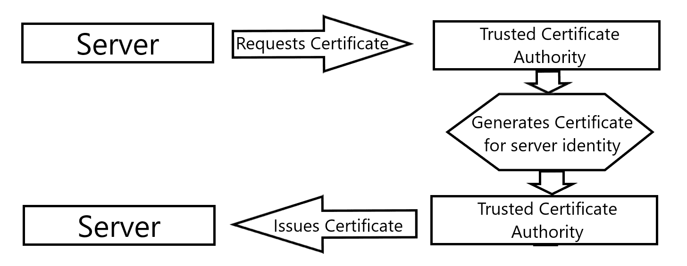
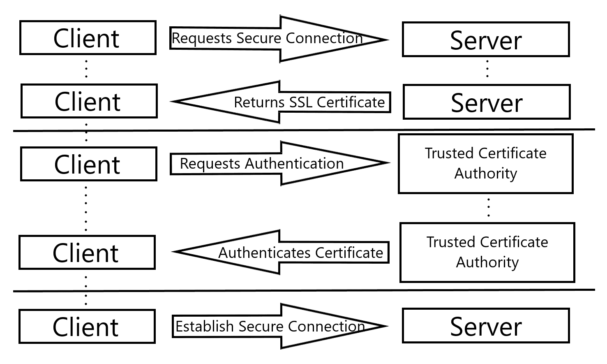
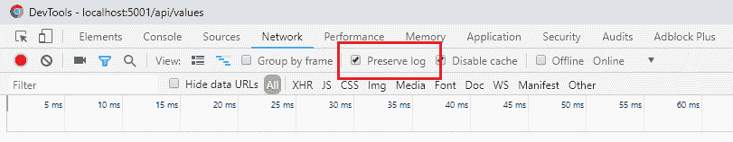
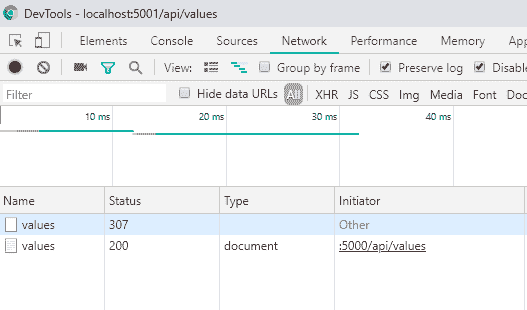

# 传输层安全性

现在我们已经看到了网络交互是如何在最低级别执行的，我们需要了解这些交互如何为用户提供安全保障。公共互联网最基本的一个方面就是能够在两个主机之间安全地执行某些交互。在本章中，我们将探讨这是如何实现的。我们将从查看支持原始**安全套接字层**（**SSL**）的底层安全机制开始，这是数十年来安全网络交互的标准。然后，我们将仔细研究其继任者**传输层安全性**（**TLS**），并考虑一些过渡的原因。最后，我们将看到这两种机制是如何通过实现我们自己的协议模拟来为网络主机提供安全交互的。在这个过程中，我们还将看到如何利用 TLS 和网络安全性，直接在.NET Core 中实现。

本章节将涵盖以下主题：

+   当应用程序利用 TLS 时，用户应该期望的数据完整性和会话隐私水平

+   为什么 SSL 正在被弃用，以及 TLS 是如何支持安全连接的

+   理解如何利用.NET Core 的即用功能来支持 TLS

# 技术要求

在本章中，我们将编写示例软件，从 Web API 应用程序配置和利用 SSL 和 TLS。你需要你的.NET Core IDE 或你选择的代码编辑器，并且你可以在这里访问示例代码：[`github.com/PacktPublishing/Hands-On-Network-Programming-with-CSharp-and-.NET-Core/tree/master/Chapter%2013`](https://github.com/PacktPublishing/Hands-On-Network-Programming-with-CSharp-and-.NET-Core/tree/master/Chapter%2013)。

查看以下视频以查看代码的实际运行情况：[`bit.ly/2HY63Ty`](http://bit.ly/2HY63Ty)

# 私人连接和 SSL

当互联网开始支持像实时聊天或电子邮件这样简单的东西时，两个网络主机之间建立安全连接的需求就变得明显了。想象一下，如果你无法合理地假设你的消息会保持私密，向你的朋友发送一个机密信息。当然，你只会将在线交互限制在最为平凡的任务和消息上。而且这仅仅考虑了我们对于个人事务隐私的直观需求。对于保护可能被恶意行为者用来进行欺诈的私人、个人识别信息的需求，更是不言而喻。

如果在我们的在线交互中没有一定的安全措施，没有人会梦想进行像银行、访问医疗信息或支付税款这样关键的事情。确实，对现代互联网用户来说，这些看似基本和根本的任务如果没有来自恶意第三方的某种保护，将是不可想象的。正是这些场景使得安全连接被设计出来以促进。但你有没有想过它们是如何工作的？你有没有考虑过 Chrome 地址栏中的那个锁形图标意味着什么？

我们将在本节中探讨这个问题。我们将了解最初为什么需要网络主机之间的安全交互机制。然后，我们将看看如何确保这种安全交互的安全性。我们将弄清楚你的浏览器是如何知道如何警告你潜在的不安全连接，以及我们如何为我们自己的用户提供这种级别的安全性。最后，我们将了解 SSL 是什么，以及如何在我们的软件中利用它为我们自己的消费者提供安心。

# 建立安全连接

如果你曾经点击链接访问网站，浏览器首先警告你即将进入一个不安全的连接，你可能想知道为什么以及如何生成这个警告。答案是，你的浏览器检测到尝试使用 SSL 标准建立连接的尝试。SSL 是建立远程服务器与其客户端之间加密链接的普遍同意的标准。

你可能还记得第九章，“.NET 中的 HTTP”，`https://`方案指定是安全超文本传输协议的方案。这个方案指定是向你的浏览器发出信号，表明在机器和远程主机之间来回发送的内容应该首先加密。当你导航到具有方案的 URL 时，你的浏览器将首先尝试与服务器协商一个安全连接。它是否能做到这一点，或者在某些情况下不能做到这一点，决定了你是否在渲染从服务器接收到的内容之前看到一个警告提示。

当用户或情况要求使用安全连接（例如，通过在 URI 中指定 HTTPS 作为方案）时，建立该连接的软件有责任确保其安全性。这意味着，如果你从头开始编写一个网络浏览器（使用像 C++这样的底层语言），你的软件将负责验证用户想要进行的任何 https 请求的接收端服务器。那么，这个连接是如何建立的？建立良好安全连接的主要机制是加密转换和第三方权威。让我们首先看看第三方权威，因为它比 SSL 中工作的加密机制更为直接。

# 信任的证书颁发机构

当服务器声称支持安全连接（历史上通过 SSL，今天通过 TLS）时，客户端必须有一种方式来确保服务器就是它所声称的那个。如果没有这个身份验证步骤，恶意行为者将很容易使安全连接的前提无效。你只需要设置一个目标网站的模拟版本作为陷阱。然后，通过提供指向恶意网站的欺诈链接，伪装成指向合法网站的链接，他们可以诱骗易受攻击的用户向恶意模拟界面提供访问凭证、用户信息等。HTTPS 的全部目的就是向用户提供一种保证，即他们的信息正在以他们期望的方式发送到他们期望的实体，在信息传输过程中，没有人能看到他们发送的内容。

通过认证证书来确认安全连接另一端的服务器确实是它所声称的实体，这是由**受信任的证书授权机构**（**CA**）发行的。CA 是一个组织或实体，它将为任何想要支持通过 HTTPS 或 TLS 进行交互的服务器生成、签名和发行认证证书。具体来说，受信任机构发行的证书是加密安全的 X.509 公钥证书。

这种公钥加密我们很快就会看到更多，但基本上是一种单向安全机制，允许私钥的所有者验证一个自由分发的公钥。公钥是通过接收者的身份和私钥的组合生成的，私钥必须保持秘密，以便证书保持有效。然后，每当客户端想要验证**服务器**的身份时，他们就会将证书以及展示该证书的服务器身份直接发送回受信任的机构。使用他们的私钥，受信任的机构检查身份和证书的公钥，以确保它没有被篡改或欺诈性地生成。

整个过程可以分解为两个关键步骤。首先，服务器请求并从**受信任的证书授权机构**获得一个 X.509 证书：



然后，每当客户端想要与服务器建立安全连接时，它必须首先通过检查其 X.509 证书与发行 CA 来确认服务器的身份：



通过这一系列往返，可以确保服务器的身份，并且客户端至少在一定程度上可以信任所建立的加密连接是与预期的实体。

# 证书授权机构信任的基础

但是，你可能已经猜到了，这个证书机构的系统在各个层面上都内置了一定程度的信任。首先，用户必须信任他们的网络浏览器确实已经从远程服务器请求了证书，并从签名机构请求了认证。接下来，用户和浏览器必须信任 CA 只为有效证书持证人认证有效证书。

这可能看起来很明显，但完全有可能认证机构（CA）并不像你希望的那样值得信赖。2013 年，我们得知政府情报机构严重违反了基本的互联网安全协议，包括与受信任的证书机构合作，为无效持证人生成已签名和认证的证书，用于监视和反情报行动。无论你对这些行为的道德影响有何个人看法，都无法否认，通过这样做，负责的机构严重破坏了工程师和更广泛公众对受信任第三方安全措施有效性的信任。

然而，只要 CA 可以被（合理地）信赖，那么该机构签发的证书通常也可以被认为是可信的。有了这些证书和受信任机构的验证，就可以确定服务器的身份。一旦这一步骤完成，就需要确保传输中的数据包安全。

# 简单和相互认证

到目前为止，我们只关注在建立安全连接时验证服务器的身份。这就是所谓的**简单认证**机制****。客户端从服务器获得一个证书，并使用证书机构进行验证。只要证书有效，客户端就可以继续进行安全连接。服务器没有努力去验证客户端。

然而，这种模式同样可以应用于客户端。这种证书验证程序的扩展被称为**相互认证**。在相互认证方案中，双方都使用自己的证书进行认证。这可以允许服务器在每次建立连接时无需直接从客户端请求访问凭证或认证信息来验证用户。

在相互认证中，服务器仍然需要向任何想要建立安全连接的客户端提供由受信任机构签发的 X.509 证书。客户端也仍然需要负责使用该机构验证该证书。不同之处在于客户端证书的获取和验证方式。虽然服务器必须允许第三方机构为其证书签名，但客户端无需麻烦。相反，在大多数相互认证场景中，服务器本身为客户端签名并发起一个 X.509 证书。

服务器需要自己的私钥来生成颁发给客户端的公钥，但只要它拥有这个密钥，它就可以验证它颁发的任何证书。这样，服务器可以可靠地限制只有它颁发证书的客户端才能访问。身份验证步骤是过程问题，服务器所有者负责在颁发证书之前确定什么构成足够的身份验证。然而，一旦这个过程建立，它应该有充分的理由信任客户提供的证书，它可以验证这些证书。

现在，可能并不立即明显为什么服务器需要可信权威机构来签署其身份证书，而客户则不需要。这是因为互联网上客户端-服务器交互的特定性质。在几乎所有情况下，客户端负责与服务器建立连接。按照设计，服务器对何时或从何地收到特定客户端的请求没有任何先验知识。

对于每个请求，服务器必须以客户可以依赖的方式声明自己的身份。它必须能够对任何客户端做到这一点，无论是否已经建立了先前的关系。必须有一种方式来验证服务器对任何特定客户端和任何特定请求的身份。因此，最初验证然后随后验证服务器身份的工作集中在所有潜在客户都可以信任并作为单一共享资源的实体：可信权威机构。

然而，对于客户端证书，服务器可以合理地信任自己的公钥验证，并将自己的私钥应用于验证与客户端声明的身份相符的证书。生成 X.509 证书的加密机制在服务器或可信权威机构执行证书验证时是相同的。唯一的区别是信任放置的位置和原因。

客户使用第三方权威机构，因为否则，如果客户一开始就不知道服务器的声明可以信赖，他们怎么能信任由服务器签发的证书呢？服务器不需要使用第三方权威机构，因为并没有在客户身上建立信任。服务器使用自己的私钥进行自己的验证。无效的客户证书根本无法通过验证。因此，服务器颁发的证书足以识别客户。所以，一旦客户在自己的主机上安装了证书，他们就可以使用它来访问服务器，完全认证，并建立和利用安全连接，无需任何额外步骤。

# 加密传输数据

一旦以这种方式确立了服务器身份，使得客户端可以信任两个主机之间的任何交互，下一步就是确保没有其他人可以观察这些交互。为此，必须在传输过程中加密数据包。然而，为了利用客户端和服务器都可以使用的加密机制，必须事先确定具体细节。

# 非对称和对称加密

当使用带有签名 X.509 证书的服务器身份时，客户端正在使用所谓的**非对称加密**。这仅仅意味着在各方之间，对于加密所需必要秘密信息的分配上存在不平衡。双方使用相同的加密方案，但只有一方可以访问秘密密钥。这种系统对于像安全证书这样的东西是必要的，因为其中一些信息必须对任何请求的人公开。记住，当证书从服务器传到客户端时，安全连接尚未建立。任何想要从传输中的数据包中读取该信息的恶意方都可以自由地这样做。非对称加密方案考虑到这种不可避免性，并且设计成即使在公钥自由分发的情况下也能保持安全。

然而，一旦最终建立了安全连接，主机将利用所知的**对称加密**。这就是加密和解密消息所需的秘密信息在所有相关方之间平等（或对称）共享的地方。交换中的双方都必须就一个双方都有实现可以利用的安全加密算法达成一致。接下来，他们需要就每个将使用该算法与对方加密的消息进行解密的加密密钥达成一致。正是这种对称加密方法被两个主机用于通过安全传输协议进行通信。

# 协商加密密钥

现在，你可能已经注意到使用对称加密来避免监听主机之间传输的数据包时存在一点鸡生蛋的问题。具体来说，如何在尚未建立安全连接的情况下发送将被用于建立安全连接的共享私有加密密钥？为此，我们必须利用我们在考虑如何在相互认证设置中验证客户端证书时所考虑的非对称加密。

在通过 CA 验证服务器身份后，建立安全连接的第一步是确定双方将用于加密数据包的算法。存在许多被认为是安全的加密算法（尽管有一些，由于本书范围之外的原因，以前被认为是安全的，但现在不再是这样），它们都可以在 C#的`System.Security.Cryptography`命名空间中找到。建立算法的原因是，两个主机可能没有相同算法的实现，因此在他们继续之前，确定一个双方都实现的算法是很重要的。

一旦选择了算法，主机必须交换一组唯一的私钥，这些私钥将在会话期间用于加密和解密数据包。为了进行这种交换，服务器首先发送一个只有它自己拥有的私钥的公钥。然后，客户端使用这个公钥加密一个随机数，并将该值返回给服务器。在这个时候，如果数据包被截获是完全可以接受的。相关信息（客户端生成的随机数）被加密了，用于加密的那个公钥没有私钥就无用了，而私钥尚未传输，因此不可能被截获。

当服务器接收到客户端生成的随机数时，它可以使用其私钥对其进行解密，然后使用该数字作为初始化值，为整个会话中将要使用的、商定的算法生成一个合适的加密密钥。客户端也会做同样的事情，这样双方就无需以不安全的方式传输该秘密的细节，就能建立一个共享的秘密。

# SSL 协议

多年来，实现安全网络连接的标准是众所周知的**SSL**。NetScape 公司利用之前为网络交互开发安全传输机制的早期努力，开发了 SSL，作为一种建立全球网络安全标准的方式。SSL 作为标准的历史实际上作为了一个关于网络安全性质的启发性的警告。

网络安全始终是黑客和安全研究人员之间的一场猫捉老鼠的游戏。为了建立一个可靠加密数据的安全算法而做出的每一项努力，几乎都会成为未预见的漏洞的牺牲品，使得该算法作为安全措施变得无用。这一点在从网络安全协议到数字版权管理应用，再到基本的操作系统级库和工具的各个方面都是如此。

尽管这超出了本书的范围，但在计算机科学界正在进行一项非常有趣的研究，这可能会对安全软件的现状产生重大影响。它围绕算法分析中的一个定理，如果最终被**证伪**，将同时使所有已知的安全算法失效。如果你对此感兴趣，我建议研究 P=NP 问题。如果你开始阅读它，要做好准备迎接高阶数学，但也要注意，截至本书出版时，仍有百万美元的奖金悬赏给第一个证明或证伪该定理的人。

这种在安全算法和算法漏洞之间的持续跳跃，特别是在 SSL 的早期版本中尤为明显。事实上，SSL 1.0 由于在测试阶段发现协议中存在明显的安全漏洞，从未向公众发布。相反，SSL 2.0 在 1995 年初向公众发布。然而，仅仅一年后，下一个版本，即对协议的全面改版，于 1996 年作为 SSL 3.0 发布。这是由于黑客社区迅速发现的一系列重大缺陷，使得 SSL 2.0 对于许多机密交易来说不够安全。与之前的版本相比，SSL 3.0 在其继任者最终于 1999 年被设计出来之前，拥有相对较长的使用寿命。

SSL 生命周期中从一个版本到下一个版本的跳跃多少有些令人震惊，这主要是由于每个标准背后的哈希和加密算法中的缺陷所引起的。在 SSL 2.0 中，处理安全密钥的易受攻击的过程以及生成这些密钥所使用的算法中的缺陷，共同构成了一个明显不安全的协议。它没有为初始握手提供保护，使得交互容易受到我们在上一节中描述的中间人攻击。它使用了已知存在冲突的哈希算法（当两个不同的输入可以生成相同的哈希输出时），使得其密钥在功能上不安全。最后，其在 CA 验证过程中的怪癖使得大多数面向消费者的网站最初都无法支持该协议。所有这些加在一起说明了为什么在 3.0 版本中如此快速地进行协议的重大重新设计是必要的。

SSL 3.0 的故事比其前身要成功得多。尽管其加密密钥生成算法的部分内容完全依赖于不安全的哈希函数，但它也引入了当时的新标准 SHA-1。这个新算法没有已知的哈希冲突，从而增强了新协议的安全声明。它还引入了今天仍可见的 CA 支持模式，使得公共网站能够更广泛地采用和支持该协议。

虽然 3.0 版本并非没有缺陷。因为它至少部分依赖于一个已知碰撞的哈希算法，所以美国政府的**联邦信息处理标准**（**FIPS**）并没有认为它足够安全，适用于高度关键或机密的应用。此外，尽管在协议设计（与加密漏洞相比）中的程序漏洞要少得多，但在 2014 年 10 月发现它容易受到一种相当复杂的程序攻击。这种漏洞使得 2015 年官方废弃该标准成为必要。这为它的继任者 TLS 敞开了大门。

# TLS 作为新的标准

目前，全球安全的网络交互标准 TLS 最初是在 1999 年作为对当时标准 SSL 协议的改进而开发的。虽然它被设计为现有 SSL 3.0 协议的升级，但每个协议的设计差异足够大，使得两种方案之间的互操作性变得不可行。相反，作者将其作为更新、更安全协议的第一个版本发布。

# 从 SSL 的微小演变

当 TLS 被引入时，它确实代表了相对于 SSL 3.0 的改进。然而，主要的区别在于连接建立握手阶段交换的数据包的头部设计。底层算法和原理基本保持不变。事实上，如果不是因为头部不兼容，TLS 在发布时完全可以被命名为 SSL 4.0。

从第十二章，“互联网协议”中记住，正是这个头部不兼容问题使得 IPv4 和 IPv6 的互操作性成为不可能。解析标准化头部是任何主机之间共享交互的最基本第一步。两个版本协议头部之间的不匹配或不兼容将使这一步成为不可能，使得数据包无法读取。这通常会导致具有不同头部定义的协议版本之间相互兼容性受阻。

然而，TLS 确实有安全性的改进。首先，在 TLS 中，其加密算法的任何一部分都不完全依赖于一个已知碰撞的哈希算法。任何生成的密钥总是至少使用一些来自加密安全哈希算法的输入。

它还在连接尝试的手动阶段引入了对丢失或修改数据的额外保护。它是通过在连接协商的最后一步发送每条消息的安全哈希来实现的。这样，客户端和服务器都可以将结果与其自己的哈希值进行比较，并验证每个主机是否感知到相同的交互，从而消除了中间人攻击修改任何交换部分的可能性。然而，这仍然不能保证中间人攻击在尝试读取数据包时没有成功——只是没有成功修改。

# 前向保密

TLS 引入的最重要特性之一是**前向保密**的概念。这是在安全通信中的一个概念，通过在每个交互过程中使用唯一的会话密钥，两个主机可以保证即使某个秘密通过某种攻击被暴露，之前的交互仍然保持安全，即使它们被攻击者记录并存储。这是因为唯一的会话密钥被用作加密机制的一个额外输入，以保护消息。因此，仅凭私钥本身不足以解密之前发送的消息。

为了实现完美的保密，会话密钥必须通过非确定性函数随机生成。对于那些不了解的人来说，在计算机科学的背景下，一个函数被认为是非确定性的，当且仅当它可以在给出相同的输入时返回两个不同的结果。通常，这种非确定性是通过使用随机数生成器和一些其他临时外部状态来实现的。所以，如果我有，例如，`GetNextPrime(startingIndex)`方法，那么我们就会期望它是确定性的。对于任何数字*n*，在它之后只有一个下一个素数。每次尝试使用`GetNextPrime(n)`调用该方法都会产生相同的结果。与此同时，如果我有名为`RollDie(sides)`的方法，那么我合理地期望它是非确定性的。我可以传递相同的`sides`参数五次，并得到五个完全不同的结果。这就是非确定性算法的精髓。

这种非确定性的概念在生成会话密钥时很重要，因为它确保了后续尝试生成相同的会话密钥将失败。因此，当攻击者获取到服务器的私钥时，他们仍然缺少解码之前会话消息所需的关键组件。如果会话密钥在会话生命周期结束后仍然持续存在，那么这个缺失的拼图碎片将更容易找到。因此，确保前向保密的关键是，一旦会话终止，就销毁会话密钥。

# 加密消息的可靠性

数据包中的数据完整性对于其成功交付和解密至关重要。如果即使是一个比特位出现错误，解密消息的值将变得完全不可读。这种安全加密的特性，即消息的微小变化会导致其加密副本发生剧烈变化，反之亦然，这意味着在传输过程中发生错误时，从错误中恢复比不安全消息要困难得多。因此，TLS 利用所谓的**消息认证码（MACs）**。

这些 MACs 用于验证已传输的数据是否以任何方式被修改，以及是否由接收者期望的主机发送。在 TLS 中，这些代码使用顺序包 ID 号作为额外的安全措施来生成。这个顺序标签为消息提供了额外的验证级别，从而增加了恶意行为者成功修改有效载荷及其相应 MAC 以成功发送欺诈数据包的复杂性。

这项额外的安全措施，以及用于前向安全的会话 ID，以及用于生成加密和解密共享密钥的多层安全哈希算法，为 TLS 提供了坚实的基础，并使其在近二十年的时间里在少数几个版本中可靠地使用。

# 在.NET Core 中配置 TLS

虽然我们已经深入探讨了想要建立安全通信的主机之间的交互性质，但到目前为止，我们的讨论还停留在相当高的层面。这样做是有原因的。在.NET Core 中，你永远不会直接编写 TLS 协议的具体步骤。作为一个在可移植运行时上执行的高级语言，.NET Core 并不是尝试自行实现这些操作的理想环境。而且，正如你可能已经猜到的，用于在主机之间促进低级套接字交互的 ASP.NET Core 库已经为我们实现了 TLS。我们只需要知道如何配置它并强制其使用。因此，虽然 TLS 的逐步交互对于任何网络工程师来说都很重要，但低级细节已经远远超出了本书的范围。

尽管在这个演示中，我们将编写一个简单的 Web API 项目来模拟 TLS 握手的交互过程。希望这样能通过在代码中给出具体的表示来巩固你心中的一些更抽象的概念。我们还将配置我们的应用程序以利用 HTTPS，这样你就可以看到在你的项目中提供此功能时将采取的步骤。

# 在.NET Core 中启用 HTTPS

我们首先要做的是使用.NET CLI 命令将我们的项目设置为一个新的 Web API 项目：

```cs
dotnet new webapi -n DemoTLS
```

现在，我们希望允许客户端使用 TLS 与我们服务交互。幸运的是，为了启用这一点，我们实际上并不需要做任何事情！敏锐的读者会记得，在我的上一章演示应用程序中，在第九章*《.NET 中的 HTTP》*的*使用 launchSettings.json*部分，我让您从我们的应用程序的`Startup.cs`文件中删除了以下代码行：

```cs
app.UseHttpsRedirection();
```

嗯，结果证明，如果没有删除这一行，我们的应用程序的 Web 服务器将使用`307 - Temporary Redirect`状态码响应任何标准的 HTTP 请求，将客户端重定向到 HTTPS 交互的适当端口。我们在之前的演示中移除了这一点，以简化我们对第九章*《.NET 中的 HTTP》*中 HTTP 具体讨论，但现在让我们保留它并看看它的实际效果。

简单地运行您的应用程序，当您的默认浏览器打开时，您应该会注意到它被路由到为每个新的 Web API 项目配置的`https://localhost:5001/api/values`启动 URL。这没有什么特别有趣的地方，但现在打开您的浏览器开发者工具，导航到显示请求流量的标签页。我自己使用 Chrome，可以通过设置导航或简单地按*F12*来访问开发者工具。一旦进入网络标签页，有一个选项可以保留浏览器会话的网络日志，如下面的截图所示：



在选择该设置后，尝试直接导航到您 API 的不安全 URL `http://localhost:5000/api/values`，然后查看您在网络标签页中收到的响应。您应该看到浏览器自动将页面重新加载到安全的 URL，并在您的网络标签页中看到以下响应：



当您使用`UseHttpsRedirection`中间件配置启用 HTTPS 时，您的 Web 服务器会提供这种行为。对不安全 URL 的初始请求没有得到满足，相反，浏览器被赋予了使用安全 URL 的指令。这就是我们日志中的第二行所告诉我们的。它告诉我们，当我们尝试导航到不安全的 URL 时（日志中的发起者字段），服务器启动了对安全 URL 的导航（返回了 200 响应的那个 URL）。这为我们提供了大量的功能和可靠性，而无需我们做任何工作！

# 使用 HSTS 强制执行 HTTPS

现在，如果我们想通知我们的客户他们应该始终使用 HTTPS，而不是简单地信任他们遵循我们的重定向消息，我们可以通过利用**HTTP 严格传输安全**（**HSTS**）来实现。这是一种交互机制，其中 Web 服务器可以通知通过 HTTPS 连接与之交互的任何客户端，所有后续交互都应该通过 HTTPS 进行。它通过带有`Strict-Transport-Security`键和一些任意值（例如过期时间戳）的 HSTS 头来传递此通知，在此之后，客户端可以重新尝试使用未加密的 URL 进行连接。

如果客户端遵守 HSTS，它将通过更新任何包含对未加密 URL 引用的缓存链接来响应头，使其现在引用安全的 URL。它还将防止任何用户与未加密的 URL 交互，即使无法建立到安全 URL 的连接。

现在，您可能想知道我们如何在我们的 Web 服务器中启用此功能，并在我们的响应中开始返回该头。希望您不会对它和最初启用 HTTPS 重定向一样简单感到惊讶。如果您查看检查应用程序是否正在开发环境中运行的`if/else`条件语句，您将看到以下内容：

```cs
if (env.IsDevelopment()) {
  app.UseDeveloperExceptionPage();
} else {
  // The default HSTS value is 30 days. You may want to change this for production scenarios, see https://aka.ms/aspnetcore-hsts.
  app.UseHsts();
}
```

如您所见，我们已经在利用 HSTS。但我们看不到这么多，因为我们正在本地使用开发设置运行我们的应用程序。这完全是出于设计考虑。强烈建议您在开发环境中不要使用 HSTS，因为浏览器认为其头值及其相应的过期时间被认为是高度可缓存的。这可能会使开发期间的调试和故障排除特别困难。在您的本地环境中，该设置甚至默认不可用，因为中间件默认排除了本地回环地址。

# HTTPS 端口配置

重要的是要注意，我们的应用程序成功重定向到我们的 HTTPS URL 的唯一原因是因为我们默认监听一个独立的端口来接收 HTTPS 请求。新 Web API 项目的`launchSettings.json`文件始终配置为监听 HTTP 和 HTTPS 端口。当在应用程序上调用时，`UseHttpsRedirection`中间件使用相同的端口。如果没有为我们的应用程序配置要监听的 HTTPS 端口，重定向中间件将无法解析，并且对未加密的 HTTP URL 的请求将被相应地处理和响应。

有多种方式来配置你的中间件应重定向用户到的端口，但在每种情况下，你仍然需要确保你也配置了你的 Web 服务器来监听该端口。这包括在你的应用程序的服务解析器中注册`HttpsRedirectionOptions`，在`ConfigureServices(IServiceCollection services)`方法中包含以下代码段，如下所示：

```cs
services.AddHttpsRedirection(options => {
    options.RedirectStatusCode = StatusCodes.Status307TemporaryRedirect;
    options.HttpsPort = 443;
});
```

或者，您可以在配置 `Program.cs` 文件中的 `IWebHostBuilder` 对象的 `UseUrls()` 方法时设置一个安全方案。这还有一个额外的好处，即同时配置您的 web 服务器在安全端口上监听，同时配置 `UseHttpsRedirection()` 中间件将用户重定向到它。

然而，正如您现在可能希望看到的，.NET Core 提供的 HTTPS 和安全交互的默认支持将使您的生活大大简化。这尤其适用于您必须实现任何类型的机密交互时，正如我们在下一章讨论 Web 应用程序中的身份验证和授权时将要做的。

# 信任您的开发证书

正如我们在本章关于 CA 的部分详细讨论的那样，任何通过典型浏览器通过 HTTPS 与资源交互的尝试，如果浏览器无法使用受信任的证书颁发机构验证服务器的身份，都会导致警告。由于我们的应用程序在开发和调试期间通常会在本地托管和运行，我们将无法访问由受信任的 CA 签署的证书。相反，我们将使用所谓的自签名证书。这正是我警告您不要信任的证书类型，因为您无法信任服务器的签名，直到您信任自己知道服务器的身份。然而，在这种情况下，当我们在本地的应用程序中进行开发并通过我们的浏览器或 REST 客户端测试响应时，我们确切地知道服务器是谁。那就是我们！

由于这种场景很常见，Microsoft 和 Windows 提供了一种简单的单次机制，用于在本地测试 HTTPS 时绕过不受信任的证书问题。每次您安装 .NET Core SDK 时，它都会包含一个 HTTPS 开发证书，该证书由您的 web 服务器在由 `dotnet` 运行时应用程序托管时颁发。要配置您的本地网络浏览器和其他客户端信任此自签名证书，您只需使用以下 CLI 命令将其注册到您的操作系统：

```cs
dotnet dev-certs https --trust
```

执行此命令会将包含在您的 .NET SDK 中的自签名证书添加到操作系统的受信任根证书存储中。然后，任何需要验证外部主机身份的应用程序都会使用此存储。通过使用该 CLI 命令将我们的开发证书存储在此存储中，我们可以在测试配置为使用 HTTPS 的应用程序时消除浏览器中的警告和警报。就这样，您就可以在 .NET Core 应用程序中利用 TLS 了。

# TLS 握手模拟

为了使事情简单明了，并阐明本章的内容，我们编写的演示 API 的实际实现将突出 TLS 握手中的每个步骤。我已经将我的一个控制器重命名为`TlsController`，并将每个步骤实现为其自己的控制器操作。这样做的目的是反映您的 Web 服务器在用户通过 TLS 与您的应用程序连接时采取的概念步骤。

# 身份验证

如您所知，TLS 协议的第一步是建立服务器的身份。在这一步中，客户端只需通过向一个安全端点（利用 HTTPS 的端点）发送请求来启动一个安全连接，服务器就会响应一个 X.509 证书。为此目的，我们创建了一个简单的`GET`方法，名为`initiate-connection`，它返回一个证书，这里只是一个字符串：

```cs
[HttpGet("initiate-connection")]
public ActionResult<string> GetCertificate() {
    return "SSL_CERTIFICATE";
}
```

如您所知，与受信任的 CA 交互的责任在于客户端。因此，在这个时候，我们只是等待他们确认我们就是他们所说的那个人。一旦他们通知我们证书已被验证，我们就可以发送我们的公钥加密密钥，他们可以使用它来加密随后的握手协议请求。为此交互，我们有一个名为`certificate-verified`的方法：

```cs
[HttpGet("certificate-verified")]
public ActionResult<string> GetVerification() {
    return "PUBLIC_KEY_FOR_ENCRYPTING_HANDSHAKE";
}
```

就这样，我们准备好开始协商我们的加密方案了。

# 协商加密方案

现在我们已经给了他们一个公钥加密密钥，我们正在等待我们的客户使用它来加密他们的下一条消息。双方必须确定他们支持的加密算法，以便可以商定一个共同的强大算法。为此，我们给我们的客户一个名为 hash-algorithms 的端点，该端点将返回我们支持的所有安全算法，并允许他们选择一个他们也支持的算法来使用：

```cs
[HttpGet("hash-algorithms-requested")]
public ActionResult<IEnumerable<string>> GetAlgorithms() {
    return new string[] {
        "SHA-256",
        "AES",
        "RSA"
    };
}
```

一旦他们确定哪种算法最适合他们的需求和目的，他们就会通知我们。因此，我们已配置了另一种方法来处理来自我们客户的响应。然而，一旦这项工作完成，我们就可以使用他们选择的算法，结合我们的私钥，生成一个会话密钥，该密钥将作为我们之间通信会话数据传输段的共享秘密。因此，我们模拟 API 的最后一个方法使用一个静态的`SessionService`类来存储所选算法，然后使用它来返回一个共享密钥，该密钥是由我们的私钥和一个随机会话密钥生成的：

```cs
[HttpPost("hash-algorithm-selected")]
public ActionResult<string> Post([FromBody] string sharedAlgorithm) {
    SessionService.CurrentAlgorithm = sharedAlgorithm;
    return SessionService.GenerateSharedKeyWithPrivateKeyAndRandomSessionKey();
}
```

使用该方法，我们的会话就建立了，数据传输可以安全进行。希望通过将其分解为最基本、最高级步骤，每次您导航到使用`https://`方案的网站时，事情会变得更加清晰。更重要的是，现在您知道如何从您的.NET Core 项目中配置和强制执行 HTTPS 和 TLS。

# 摘要

在本章中，我们涵盖了大量的内容，同时成功地聚焦于一个非常狭窄的主题。我们首先从高层次上审视了在开放网络中保护两个主机之间通信所需的必要步骤。然后，我们探讨了这些步骤是如何实现的（至少在概念上）。首先，我们研究了验证你想要交互的主机身份的过程。我们了解了受信任的证书颁发机构，并学习了它们是如何通过检查签名的加密证书来由 Web 客户端验证服务器身份的。

在探讨这个主题时，我们还考虑了必须对这些 CA 投入多少信任，以及如果这种信任水平被违反，它如何使更广泛的公众面临极高的风险。我们还了解到，CA 是验证服务器身份所必需的，但在相互认证场景中验证客户端身份则不是必需的。

接下来，我们探讨了两个主机（其身份已得到充分验证）如何在会话过程中继续确保其通信的安全性。我们看到了对称加密和非对称加密是如何在传输任何应用数据字节之前就确保交互加密的。

接下来，我们探讨了这些用于保护通信会话的高级步骤是如何在过去的几年中被标准化并由安全协议所利用的。我们看到了安全漏洞如何使协议功能上不安全，以及后续版本或标准如何利用不断增长的工具集来领先于漏洞并随时间发展。

最后，我们探讨了所有这些在.NET Core 框架中的处理方式。我们看到了如何配置我们的 Web 服务以支持并依赖 TLS，以及如何在项目开发阶段避免使用 CA 的一些额外开销。所有这些都使我们能够考虑如何利用这些来允许在应用程序中进行身份验证和授权，这将在下一章中进行探讨。

# 问题

1.  HTTPS 代表什么？它与 HTTP 有什么区别？

1.  什么是受信任的证书颁发机构？它们在验证服务器身份方面扮演什么角色？

1.  简单认证和相互认证之间有什么区别？

1.  对称加密和非对称加密之间有什么区别？

1.  前向保密是什么？它是如何提供的？

1.  非确定性函数是什么？为什么它在保护通信会话中很重要？

1.  消息认证码是什么？它们是如何在 TLS 中提供可靠性的？

# 进一步阅读

若想了解更多关于建立安全的软件开发实践以及 SSL、TLS 等网络安全相关原则的信息，我推荐阅读 *《网络安全 – 攻击与防御策略》*，作者：Yuri Diogenes，Dr. Erdal Ozkaya，Packt Publishing。这是一本关于设计 TLS 等安全协议的工程师日常考量的启发式指南。你可以在 Packt Publishing 购买，链接如下：[`www.packtpub.com/networking-and-servers/cybersecurity-attack-and-defense-strategies`](https://www.packtpub.com/networking-and-servers/cybersecurity-attack-and-defense-strategies)

要了解每次将你的软件暴露在开放网络中时你承担的风险有多大，我也推荐阅读 *《网络漏洞评估》*，作者：Sagar Rahalkar，Packt Publishing。这本书更多地从 DevOps 工程师或系统工程师的角度来探讨这个问题，而不是从软件工程师的角度，但我认为拥有这种宏观理解是很重要的。这本书也是这方面的宝贵资源。你还可以通过 Packt 购买，链接如下：[`www.packtpub.com/networking-and-servers/network-vulnerability-assessment`](https://www.packtpub.com/networking-and-servers/network-vulnerability-assessment)
