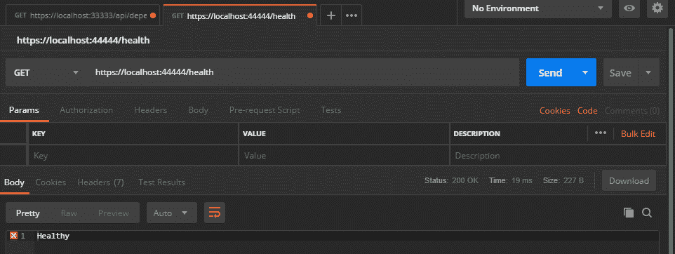
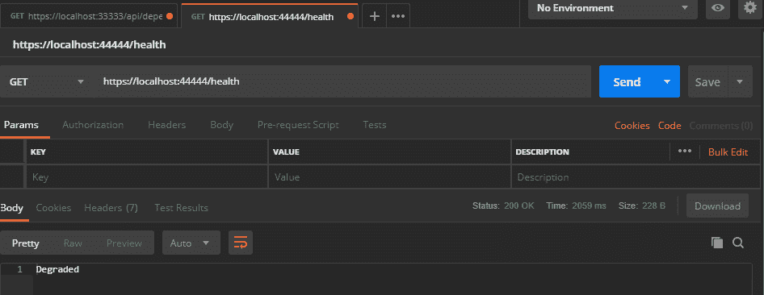
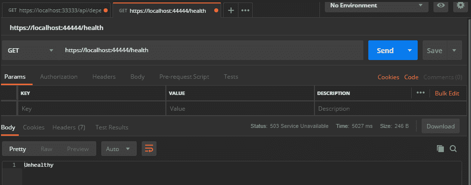
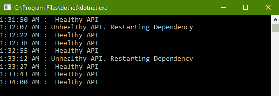

# 性能分析和监控

随着你继续发展构建网络软件的知识，我们不能忽视监控和性能调优的关键任务。这两个责任将是本章的重点，我们将探讨 .NET Core 应用程序中可用于监控和测试应用程序性能和稳定性的工具。我们将探讨开发者可用于在受控环境中对应用程序施加重负载并观察其稳定性的工具。我们将探讨一些简单的日志记录和监控方法，并考虑如何使用 .NET Core 的一些功能来加强这些方法。

本章将涵盖以下主题：

+   识别网络架构中的性能瓶颈，并设计以最小化它们

+   识别端到端性能测试和报告策略

+   使用 C# 建立稳健和有弹性的性能监控

# 技术要求

在本章中，我们将编写一些示例来展示性能跟踪和监控的各个方面，所有这些都可以在这里找到：[`github.com/PacktPublishing/Hands-On-Network-Programming-with-CSharp-and-.NET-Core`](https://github.com/PacktPublishing/Hands-On-Network-Programming-with-CSharp-and-.NET-Core/tree/master/Chapter%2016)/tree/master/Chapter 16。

观看以下视频以查看代码的实际效果：[`bit.ly/2HYmD5r`](http://bit.ly/2HYmD5r)

要使用此代码，您希望使用我们信任的代码编辑器之一：Visual Studio 或 Visual Studio Code。我们还将使用您所熟悉和喜爱的 REST 客户端，所以请确保您已安装 PostMan ([`www.getpostman.com/downloads/`](https://www.getpostman.com/downloads/)) 或 Insomnia REST 客户端 ([`insomnia.rest/`](https://insomnia.rest/))。

# 网络性能分析

当你开始构建更复杂的分布式软件系统时，你开始失去对较小、更独立的软件项目所拥有的细粒度控制和微调。每个新的网络交互都增加了系统故障的风险，减少了查找错误来源的可见性，并在寻找性能瓶颈时使问题复杂化。减轻这些影响的最佳方式是提前做好准备，并从一开始就将性能监控纳入你的分布式系统设计中。那么，你该如何做呢？你应该关注哪些关键指标和交互？.NET Core 为你提供了哪些支持？

# 端到端性能影响

想象一下，如果你负责一个云托管的应用程序套件。它包括半打微服务，每个微服务都依赖于另外半打服务。更不用说，每个并行资源都部署在负载均衡网络网关后面，该网关负责将请求路由到当前负载最低的服务器。

现在，想象一下，该系统的每个组件几乎都是独立于其他组件编写的。你的工程师团队专注于关注点分离的设计原则，因此他们彻底地分离了这些关注点。每个数据存储都分配了自己的、有限的公共 API，没有其他系统被允许直接访问其底层数据库。所有聚合 API 都负责访问每个记录系统，以产生与你的业务用例相关的领域模型。在责任上几乎没有重叠。

现在，让我们慷慨地假设你的工程师们在测试策略上也非常自律。每个服务都包含了一套完整的单元测试，代码覆盖率接近 100%。每个单元测试都是完全隔离的，并为每个依赖项定义了良好的模拟。你的工程师们如此自律和细致，以至于那些模拟被配置为返回服务在实时系统中可能返回的每个可能的有效和异常响应的组合。你生态系统中的每个服务的数据契约都定义得很好，所有变更都得到了依赖系统的良好跟踪和记录。

在所有这些工作都得到仔细记录、维护和测试之后，你终于准备好部署你应用程序的版本 1。现在，我想让你想象一下，当有人第一次尝试查询你的应用程序时，整个生态系统变得缓慢，响应需要整整 25 秒才返回。

这可能看起来像是一个荒谬的案例，但我确实见过几乎完全相同的场景，那是经验不足的云架构师团队在部署他们的第一个完全分布式的基于微服务应用时发生的。那么，在我们这个假设的场景中，到底出了什么问题，我们如何在实践中避免这种情况呢？

# 累积延迟

到目前为止，这一点应该是显而易见的，但在这种特定场景中，性能不佳的主要原因是隔离。由于每个服务都是完全在隔离的环境中开发和测试的，因此工程师们无法衡量所有后端依赖的全面影响。通过始终假设与上游依赖项的接近零延迟的最佳情况，开发者为他们单元测试创造了不切实际的测试场景。

集成和端到端测试对于设计能够承受基于网络托管环境的压力和不一致性的系统至关重要。在我们这个并非完全假设的开发场景中，随着每个新功能或微服务的开发，开发者应该将他们的解决方案部署到一个尽可能接近生产配置的环境。他们应该在实施过程中识别性能瓶颈，并减轻这些影响。

优化网络软件的一个更具挑战性的方面是，你的单个应用程序几乎永远不会是用户与之交互的最后一站。通常，你的.NET Core 服务至少会被用户的浏览器或其他应用程序服务调用。此外，它们也常常依赖于通过 HTTP 或 TCP 等网络协议访问的其他服务。在这个场景中，开发者没有意识到，而你作为构建越来越复杂的分布式系统时应该始终注意到的，是依赖链中的每个网络跳步都会引入延迟和失败的风险。

每个上游依赖都会使你的应用程序的延迟增加其上游依赖的总平均延迟。同样，如果你的上游依赖本身也有上游依赖，那么它的延迟将是其自身操作产生的操作延迟加上其上游依赖的总平均延迟。这种将网络系统延迟复合化的属性，在编写依赖于其他网络服务的网络服务时，是一个非常重要的属性需要记住。这就是为什么经验丰富的云架构师通常会对请求解析流程实施严格的分层架构模型。

# 三层架构

为了最小化复合延迟的影响，在架构中减少垂直依赖性是很常见的。就我们的目的而言，我们可以将水平依赖性视为源自同一来源的完整上游依赖集。同时，垂直依赖性描述了任何具有额外上游依赖的上游依赖：


在这个图中，架构 A 具有我们所说的三层架构。也就是说，最多有三层服务封装整个应用程序交互的垂直依赖图。这是云托管服务的理想组织结构。由于大多数托管环境（实际上，.NET Core 本身）支持处理大量的并行请求，因此给定系统内水平依赖性的延迟增加将永远不会超过所有水平依赖性中最慢的那个。这与我们在第六章的“加快速度 - 多线程数据处理”部分讨论的并行化异步操作带来的好处并不完全不同。第六章，“流、线程和异步数据传输”。

在严格的分层架构中，用户与最终呈现给他们的任何数据之间最多只能有两个网络跳数。三层架构很容易理解，在我们讨论 MVC 设计范式（第九章，*HTTP in .NET*）之后，你应该已经熟悉了。第一层是用户交互层，它定义了任何外部用户能够访问你生态系统中的数据或过程的系统或机制。接下来是聚合层，或领域层。这是在用户感兴趣看到的所有数据上执行父用户交互的所有业务逻辑的地方。最后但同样重要的是，是数据层。在现代云系统中，这些通常是基于 HTTP 的 API，它们公开一个内部数据库，作为企业数据集的记录系统。

当三层架构得到良好执行时，不允许任何系统通过其定义良好的 API 之外的方式与数据库交互。同时，如果一个 UI 需要定义在多个聚合服务中的业务逻辑，它必须要么自己访问所有聚合层系统，从而增加其水平依赖图（这被认为是可接受的），或者必须编写一个新的聚合服务来重复其他服务的任务。任何聚合系统都不应该调用任何其他聚合系统。这样做会增加该工作流程的垂直依赖性，并违反三层架构。

考虑到这一点，应该很容易理解为什么确保应用程序高性能并实施可管理的监控系统最可靠的方法之一是通过最小化垂直依赖。如果我们能将瓶颈搜索限制在尽可能少的垂直层级中，我们识别问题和解决问题的能力几乎可以变得非常简单。随着你的软件在网络堆栈中的层级越来越低，这些累积的延迟交互变得更加相关。为任何在本地网络和更广泛的互联网之间移动的流量实施一系列网关或防火墙将影响企业中通过的所有流量。如果你希望有希望最小化网关引入的延迟，那么最小化此类系统的垂直依赖性应该是你的首要任务。

# 压力下的性能

当一个未经充分测试的系统首次部署到生产环境时，一个常见的问题就是应用程序无法处理施加在其上的负载。即使是严格执行的三层架构也无法最小化由于极高的网络负载而未处理的多个响应的影响。大量网络请求能够完全摧毁网络资源的能力如此之大，以至于这实际上成为了一种极其著名的软件攻击的基础，这种攻击被称为**专用拒绝服务**（**DDoS**）攻击。在这种攻击中，一个分布式的恶意软件网络向单个主机发送协调一致的简单网络请求。 incoming requests absolutely destroys the host's ability to continue responding to them, locking up the resource for legitimate users, and even destabilizing the host's OS and physical infrastructure.

虽然 DDoS 攻击可能是一个极端且相对罕见的例子，但同样的影响也可能出现在处理大量合法同时请求时带宽和水平可扩展性不足的系统上。这里的挑战在于，在部署时，你并不总是能提前知道你的系统将遇到什么样的流量。

如果你正在为特定的一组内部商业用户编写企业级网络服务，你很可能可以非常清楚地定义你的操作参数。进行简单的员工人数统计，结合用户访谈来确定特定用户将多久与你的系统交互一次，可以给你很高的信心，确保你知道在给定的一天里你可以合理地预期多少流量。然而，如果你的应用程序是为公开发布而编写的，那么事先知道在给定的一天里会有多少用户访问你的服务可能是不可能的。

在那些在遇到大量请求之前无法合理确定最大潜在网络流量的场景中，你至少想知道你的应用程序可以处理多少流量的大致情况。这就是负载测试的作用所在。通过负载测试，你应该针对网络流量对你的系统可能造成的最坏情况做出最佳猜测。

一旦你确定了最大潜在负载，你将执行一系列测试，尽可能多地与你的系统进行交互，包括你预定的最大值。为了真正有价值，你的测试应该在尽可能接近你的生产配置的软件实例上运行。在整个测试过程中，你应该记录和监控响应时间和任何异常响应。当测试完成时，如果设计得当，你应该有一套稳健的指标，这些指标可以告诉你当前基础设施在失败之前可以合理处理多少流量，以及当失败最终发生时它看起来是什么样子。

# 性能监控

我刚才讨论的每个性能瓶颈和风险都可以通过良好的设计和稳健的测试策略来缓解。然而，在分布式系统中，失败是不可避免的。因此，我们通过系统的测试和设计来寻求最小化的失败风险永远无法完全消除。然而，通过使用我们的性能测试结果作为指导，我们可以最小化这种不可避免失败的影响。为此，我们需要实施一个稳健的系统来监控我们服务的健康和可用性。

# 天真的监控策略

开发者将应用程序监控的概念与日志记录混淆的情况并不少见。这并不是一个完全不合理的问题。当正确执行时，一个好的日志策略可以作为一个相对低可见性的监控系统。然而，那种方法的问题在于，日志往往非常**嘈杂**。

# 日志记录过度使用

想想当你代码中捕获异常时的初始方法。我敢打赌，相当一部分人从基本的**记录并抛出**方法开始。你只是记录发生了错误（通常没有太多细节或上下文），然后重新抛出相同的错误，或者可能抛出一个调用代码可能配置为响应的新错误。

同时，我相信至少有几位读者在这样一个环境中工作过，那里的任何范围变化都会被记录下来。引入一个新方法？记录它。退出当前方法？记录它。向主机发送 TCP 数据包？记录它。接收 TCP 数据包？记录它。我可以继续说，但我会避免让你感到沮丧。

这种记录一切的方法在大规模企业中非常常见。然而，大多数人很少考虑的是，你记录的信息越多，那些日志就越不有用。随着你的日志文件随着记录范围或上下文中的琐碎变化而增长，找到真正重要的日志变得越来越困难。相信我，当你发现自己正在浏览一个 200,000 行长的日志文件时，你将需要找到那些日志。

如果您从未听说过这个术语，那么这就是您日志的**信号与噪声比**。在这个比率中，信号描述的是您当前时刻有意义的信息。另一方面，噪声描述的是围绕并掩盖您信号的信息，这些信息在当前时刻对您没有意义。纪律性日志不是关于勤奋地记录所有事情。纪律性日志是关于始终只记录重要的事情。这种纪律应该应用于您的日志，以及您在软件中使用的任何性能或健康监控器。

# 延迟警报

另一种常见的日志方法缺陷是，我们想要了解的应用程序信息直到太晚才呈现给我们。通常，对于性能和健康监控的日志策略，日志是在故障发生后编写的。虽然这当然比完全没有警报系统更有用（当您只能通过接到用户愤怒的电话通知系统故障时），但它远非理想。

您应该在其他人遇到之前了解系统断电。然而，如果您只是被动地写入日志文件，并且只有在抛出异常时才这样做，那么这种可见性是不可能的。在网络软件中，您的应用程序可能被广泛的其他资源以某种方式利用，以至于系统断电可能会传播到您的网络并损害软件旨在支持的业务。那么，您如何能够提前应对那些不可避免的断电，并在任何用户感受到影响之前做出响应？

# 建立主动监控

最有效地减少对用户造成断电影响的方法是主动识别断电何时发生，或可能发生。为此，您需要为对系统进行健康检查定义一个策略。该策略必须确定向系统发送请求的合理频率。您确定的频率必须在频繁到有高概率在断电影响客户之前检测到断电，以及不频繁到不会在系统最重负载下对系统性能产生负面影响之间取得平衡。除此之外，您还需要识别所有可能的不健康系统信号，以便您的监控器能够针对软件性能的最相关方面进行精准监控。

# 定义阈值

在定义性能监控策略时，你应该首先定义你应用程序的性能阈值。这些阈值将告诉你，超出这些阈值，你的应用程序很可能会出现故障。例如，如果你对你的应用程序进行了广泛的负载测试，你可能会有一大堆关于你的应用程序服务器可以处理多少流量的指标。通过使用网络跟踪，它将提供针对监听网络应用程序的每个请求的记录，你可以确定你的流量何时出现峰值，在达到故障阈值之前发送警报。

此外，如果你有上游依赖项，你应该注意它们随时间的变化，识别出任何你的依赖项成为系统故障来源的实例。你应该寻求利用识别依赖响应内容或延迟中的信号，这些信号可能导致你的用户系统出现故障的策略。一旦你有了这些信息，你就处于一个很好的位置来应对它们。

# 积极的健康检查

一旦你了解了系统内潜在的故障点或条件，鲁棒的监控策略就会频繁地测试这些点和条件。旨在积极监控你的系统的服务通常被称为**看门狗**。大多数云托管编排器或 CI/CD 软件都会允许你配置一个健康检查访问点到你的软件中，这样它们就可以使用自己的看门狗实现来识别应用程序崩溃的情况。如果你的托管解决方案提供了这些功能，例如 Azure 健康验证工具，那么你应该充分利用它们。如果你的主机不提供可靠、定期（或可配置的定期）的健康检查机制，那么我强烈建议你自行实现。这对你的开发过程的影响很小，但好处是巨大的。

我们将在接下来的示例代码中查看这一点，但这种类型的积极健康和性能监控的典型模式是暴露一个可以被你的托管提供商 ping 的端点。然后，该端点将对关键潜在的故障点运行一系列自我诊断检查，并返回成功（健康的应用程序，没有即将发生的可能故障）或失败（系统已关闭，或很快将被关闭）。

# 活跃的消息传递和活跃的恢复

一个主动的健康监控系统需要主动的响应。对于你的健康监控系统检测到的任何错误状态，你将希望定义一个合理的响应方法。例如，如果你的网络流量激增，主动的方法可能是配置你的健康检查系统自动提供额外的并行应用服务器来响应额外的请求负载。同时，如果你的健康检查表明上游依赖已经离线，主动恢复系统可能会尝试重新启动托管该依赖的应用服务器，以解决该问题。

无论你的系统如何响应（尽管它应该至少定义某种类型的故障响应），它绝对应该通知任何正在处理该应用程序的工程师。具体来说，它应该**主动**通知工程师。虽然事件当然应该记录到你用来跟踪应用程序可靠性的任何审计系统中，但请记住，**日志****不是警报**。日志本质上是被动的。对于负责系统的工程师来说，要从日志消息中了解到系统已失败，该工程师必须自己寻找并检查日志。与此同时，通过主动的消息响应，你的监控平台可以配置为获取任何应该知道故障的工程师的联系方式。然后，当发生故障时，主动监控器可以将通知推送到它配置通知的每个工程师的联系方式。

# C#中的性能和健康监控

因此，我们应该对什么是健壮和有弹性的性能和健康监控系统有一个相当清晰的理解。它应该配置为响应定义良好的阈值，以便在发生之前发现和缓解潜在的故障。它应该主动检查应用程序的状态，而不是被动地等待用户交互来触发系统故障。最后，一旦识别到故障，它应该主动响应，通知任何可能响应的人，并采取措施将系统恢复到健康状态。那么，在.NET Core 中这看起来是什么样子呢？

# 一个不稳定的分布式架构

为了展示我们如何使用性能监控来保持对不稳定系统健康状态的了解，我们首先必须构建一个不稳定系统。在这个例子中，我们将使用三层架构，以 PostMan（或 Insomnia）作为我们的交互层，然后使用两个不同的 Web API 来模拟我们的聚合层和数据层。首先，我们将创建我们的聚合服务：

```cs
dotnet new webapi -n AggregatorDemo
```

我们稍后会讨论这个问题，因为这个聚合器将是我们要监控性能的应用程序。不过，现在我们需要定义一个上游依赖。这将设计成随着时间的推移对我们的聚合服务性能产生负面影响：

```cs
dotnet new webapi -n DataAccessDemo
```

我们首先将关注`DataAccessDemo`应用程序。在这里，我们的目标将是创建一个包含自身恢复机制的失稳系统。我们将使用这个系统在我们的聚合器应用程序中检测到性能不佳时，主动从系统性能下降中恢复。为此，我们的`DataAccessDemo`应用程序将相对简单。我们将提供两个端点：一个将用作聚合器应用程序的上游依赖项，另一个将用于从性能下降中恢复。

在实践中，提供一个作为性能管理访问点的端点是常见的。它可能重新初始化缓存，强制垃圾回收，或者丢弃其线程池中的任何挂起的线程。在我们的情况下，我们只需重置一个计数器以重新稳定我们应用程序的性能。然后，这个计数器将被我们的依赖端点用来强制应用程序中不断增长的延迟。

为了启动这个过程，我们首先定义我们的监听端口，以避免与我们的聚合器 API 冲突：

```cs
public static IWebHostBuilder CreateWebHostBuilder(string[] args) =>
    WebHost.CreateDefaultBuilder(args)
        .UseUrls("https://[::]:33333")
        .UseStartup<Startup>();
```

现在，我们将定义一个静态类来保存我们的延迟计数器。这将设计成每次访问时都会增加下一次调用的延迟。此外，为了方便我们的恢复端点，我们将提供一个机制来重置计数器到其初始状态，如下所示：

```cs
public static class Latency {
    private static int initialLatency = 1;
    private static int counter = 1;

    public static int GetLatency() {
        //milliseconds of latency. increase by .5 second per request
        return counter++ * 500; 
    }

    public static void ResetLatency() {
        counter = initialLatency;
    }
}
```

最后，从我们的控制器中，我们将设置一个延迟到我们的依赖请求，之后我们将返回一个任意值。然后，我们将公开一个重置端点以稳定我们的应用程序，如下所示：

```cs
[Route("api/[controller]")]
[ApiController]
public class DependencyController : ControllerBase {
    [HttpGet("new-data")]
    public ActionResult<string> GetDependentValue() {
        Thread.Sleep(Latency.GetLatency());
        return $"requested data: {new Random().Next() }";
    }

    [HttpGet("reset")]
    public ActionResult<string> Reset() {
        Latency.ResetLatency();
        return "success";
    }
}
```

这个控制器签名将定义我们的聚合器 API 的垂直依赖关系。因此，现在，让我们看看我们将如何监控这个应用程序随时间推移的性能下降。

# 性能监控中间件

为了监控我们应用程序特定方面的健康状态，我们将创建一个`IHealthCheck`中间件的实例。这个中间件用于定义确定系统相对健康所需的操作。就我们的目的而言，我们希望定义一个健康检查，确认我们依赖的数据服务的响应时间低于两秒。一旦达到这个阈值，我们将认为系统已经退化。这将允许我们的看门狗通知我们可能需要重启。然而，如果服务响应时间增加到五秒，我们将认为它不健康，通知看门狗启动重置。

这个`IHealthCheck`中间件的实例将在启动时由我们的系统注册，当我们向应用程序添加健康检查时。而且，正如.NET Core 中的所有事情一样，添加健康检查就像注册一个服务和配置你的应用程序一样简单。所以，首先，在你的`ConfigureServices(IServicesCollection services)`方法中，只需添加以下代码行来设置所有必要的支持类和扩展，以便使用健康检查：

```cs
services.AddHealthChecks();
```

然后，在你的 `Configure(IApplicationBuilder app, IHostingEnvironment env)` 方法中，添加以下代码：

```cs
app.UseHealthChecks("/health");
```

这种简单的注册模式将你的应用程序设置为在用户向 `UseHealthChecks(<path>)` 中指定的路径发送请求时提供所有配置的健康检查中间件的结果。因为我们没有在我们的中间件中指定任何特定的系统检查，所以此端点将返回无趣的内容。要测试它，只需导航到你的应用程序的主机根目录，并附加 `/health` 路径。你应该看到以下输出：



这确认了我们的应用程序正在响应健康检查。因此，现在，我们需要通过定义我们的中间件来定义我们想要在验证系统健康时使用的特定检查。我们将首先创建 `IHealthCheck` 接口的一个实现，为了简单起见，我们将称之为 `DependencyHealthCheck`。这个类将包含我们的响应阈值的定义，以毫秒为单位，如下面的代码所示：

```cs
public class DependencyHealthCheck : IHealthCheck {
    private readonly int DEGRADING_THRESHOLD = 2000;
    private readonly int UNHEALTHY_THRESHOLD = 5000;
```

现在，我们需要实现公共的 `CheckHealthAsync()` 方法以满足 `IHealthCheck` 接口的要求。对于这个方法，我们将向我们的上游依赖发送一个请求，并使用 `System.Diagnostics` 命名空间中的 `Stopwatch` 类跟踪解决它所需的时间。

`CheckHealthAsync()` 方法的签名接受一个 `HealthCheckContext` 实例，该实例将为我们的类提供注册信息以及一个取消令牌。我们将忽略这些信息，但它们仍然是满足接口签名的必需条件。然后，我们将创建我们的 `HttpClient` 实例（使用我们在第九章（e93c024e-3366-46f3-b565-adc20317e6ec.xhtml），*HTTP in .NET*）中讨论的 `HttpClientFactory`）并构建一个请求到我们想要验证其稳定性的端点。因此，我们的 `CheckHealthAsync()` 方法的第一部分应该看起来像这样：

```cs
public async Task<HealthCheckResult> CheckHealthAsync(
    HealthCheckContext context,
    CancellationToken token = default(CancellationToken)
) {
    var httpClient = HttpClientFactory.Create();
    httpClient.BaseAddress = new Uri("https://localhost:33333");
    var request = new HttpRequestMessage(HttpMethod.Get, "/api/dependency/new-data");
```

在这一点上，我们将想要设置我们的计时器来跟踪请求花费的时间，以便我们可以确认它是否低于我们指定的阈值：

```cs
Stopwatch sw = Stopwatch.StartNew();
var response = await httpClient.SendAsync(request);
sw.Stop();
var responseTime = sw.ElapsedMilliseconds;
```

最后，我们将检查响应时间与我们的阈值，根据外部依赖的稳定性返回一个 `HealthCheckResult` 实例，如下所示：

```cs
if (responseTime < DEGRADING_THRESHOLD) {
    return HealthCheckResult.Healthy("The dependent system is performing within acceptable parameters");
} else if (responseTime < UNHEALTHY_THRESHOLD) {
    return HealthCheckResult.Degraded("The dependent system is degrading and likely to fail soon");
} else {
    return HealthCheckResult.Unhealthy("The dependent system is unacceptably degraded. Restart.");
}
```

这完成了我们的 `IHealthCheck` 中间件的实现，因此现在我们只剩下将其注册为健康检查到我们的应用程序服务。为此，只需调用 `Startup.cs` 文件中 `AddHealthChecks()` 方法返回的 `IHealthChecksBuilder` 类的 `AddCheck()` 方法。此方法接受一个名称以及你的 `IHealthCheck` 中间件实现的一个显式实例。

添加此代码后，你的 `Startup.cs` 文件应该包含以下代码：

```cs
services.AddHealthChecks()
    .AddCheck("DataDependencyCheck", new DependencyHealthCheck());
```

并且，有了这个，我们就得到了一个自定义的健康检查，它将通知任何监控系统我们系统中的不稳定状态，这是由于上游依赖项的失败引起的！为了确认它返回了适当的响应，只需 ping 你的 `/health` 端点 5 到 10 次，以增加依赖服务上的延迟计数器，然后观察健康状态如何超过两秒和五秒的阈值。

在这里，你可以看到当响应时间超过两秒阈值时，我的服务返回的响应为 `Degraded`：



并且在仅经过几次更多请求后，响应下降到 `Unhealthy`：



因此，现在你已经看到了如何仅用几行代码就实现了一个可扩展的系统，用于监控你整个系统的健康状态。

# 实现看门狗

我们主动监控解决方案的最后一部分是实现我们自己的看门狗服务。由于我们已经为不稳定 API 的性能重置配置了一个外部钩子，我们将想要定义一个利用它的主动恢复机制。因此，对于这个服务，我们将设置一个循环，定期 ping 我们的聚合器 API 的 `/health` 端点，并在系统返回 `Degraded` 或 `Unhealthy` 时重置数据依赖 API。由于在这种情况下这是一个相当简单的练习，我们可以保持我们的看门狗简单。我们将从一个控制台应用程序开始，使用我们的 CLI 创建：

```cs
dotnet new console -n WatchdogDemo
```

我们只会向我们的项目中添加几行代码。首先，我们将设置我们的 `HttpClient` 实例。由于我们应用程序的范围从未离开 `Main()` 方法，我们可以安全地创建一个私有、静态、单例的 `HttpClient` 类，而无需依赖于 `HttpClientFactory` 来管理我们客户端的多个实例并防止线程饥饿。我们还将把我们的 `Healthy` 状态代码分配给一个 `private readonly` 变量：

```cs
public class Program {
    private static readonly HttpClient client = new HttpClient();
    private static readonly string HEALTHY_STATUS = "Healthy";
```

一旦设置好，我们的 `Main()` 方法就变成了十几行相对简单的代码。首先，我们创建一个无限循环，以便我们的服务在明确停止之前一直运行。然后，我们向我们的聚合器 API 发送请求以获取健康状态响应：

```cs
static async Task Main(string[] args) {
  while(true) {
    var healthRequest = new HttpRequestMessage(HttpMethod.Get, "https://localhost:44444/health");
    var healthResponse = await client.SendAsync(healthRequest);
    var healthStatus = await healthResponse.Content.ReadAsStringAsync();
```

一旦我们收到响应，我们可以确认它已经返回健康状态。如果没有，我们只需向数据服务的 `/reset` 端点发送另一个请求。同时，如果它已经返回健康状态，我们只需记录请求并继续处理：

```cs
if (healthStatus != HEALTHY_STATUS) {
  Console.WriteLine($"{ DateTime.Now.ToLocalTime().ToLongTimeString()} : Unhealthy API. Restarting Dependency");
  var resetRequest = new HttpRequestMessage(HttpMethod.Get, "https://localhost:33333/api/dependency/reset");
  var resetResponse = await client.SendAsync(resetRequest);
} else {
  Console.WriteLine($"{DateTime.Now.ToLocalTime().ToLongTimeString()} : Healthy API");
}
Thread.Sleep(15000);
```

注意，对于这个例子，我确定我们的健康检查间隔应该是 15 秒。在我们的情况下，我主要是随机选择这个值。然而，当你配置或实现自己的应用程序中的看门狗解决方案时，你最好考虑过于频繁或过于稀疏的间隔的影响，并相应地配置你的系统。当所有三个应用程序都运行起来后，你可以看到我的看门狗系统正在按预期运行，当响应时间变得无法接受地慢时，它会重置我的数据服务：



如此一来，我们的主动监控系统就完成了。虽然在这个示例代码中我们不得不制造不稳定性，但我们制定的监控和缓解这种不稳定性的策略将适用于你未来可能要编写的任何项目。

# 摘要

本章以一个不幸常见的、天真实现的分布式架构的例子开头。以此为基准，我们考虑了架构设计决策对应用程序性能的影响。我们了解了分布式架构中的垂直依赖，以及我们如何通过严格遵守的三层设计来减轻其影响。

接下来，我们探讨了糟糕的日志记录实践如何使将日志记录作为性能监控解决方案变得不可行。我们讨论了日志解决方案的信噪比的概念，并检查了我们应应用于我们自己的日志策略的实践，以最大限度地提高日志的有效性。

一旦我们全面分析了为什么日志记录构成一个不足够的监控策略，我们就深入研究了真正稳健方法的属性。我们了解到，一个设计良好的监控策略应该利用你进行的各种单元和负载测试，以及它们提供的信息。我们了解到，一个稳健的策略涉及主动监控，并且应该在用户遇到问题之前系统地识别问题。最后，我们看到了这样的解决方案如何以及应该采取主动方法来尝试解决任何健康或性能问题，并通知相关工程师问题。

最后但同样重要的是，我们探讨了如何在.NET Core 中精确地实现这样的监控策略。在 ASP.NET Core 应用程序中实现我们自己的监控中间件，我们看到了框架提供的内置监控解决方案的强大和灵活性。随着这个架构拼图块的到位，我们准备开始探索一些更高级的主题。考虑到这一点，我们将使用下一章来探讨我们如何利用.NET Core 中的可插拔协议的概念来设计自己的应用程序层协议。

# 问题

1.  水平依赖和垂直依赖有什么区别？它们如何影响性能？

1.  什么是三层架构？

1.  信号与噪声比是什么？为什么它在日志记录中很重要？

1.  为什么日志记录对于性能监控来说是不足够的？

1.  稳健的监控策略的关键属性是什么？

1.  负载测试是什么？它能提供哪些信息？

1.  严格的日志策略意味着什么？

# 进一步阅读

对于在您的 ASP.NET Core 应用程序中利用健康检查和性能监控的额外资源，我推荐 Jason de Oliveira 和 Michel Bruchet 所著的 *Learning ASP.NET Core 2.0*，特别是其中名为 *Managing and Supervising ASP.NET Core 2.0 Applications* 的章节。这是一本非常优秀的读物，它将提供大量可以横向迁移到不同情境的技能。您可以在 Packt 找到它：[`www.packtpub.com/application-development/learning-aspnet-core-20`](https://www.packtpub.com/application-development/learning-aspnet-core-20)。

此外，如果您想继续学习架构设计，并专注于基于微服务的生态系统，我推荐 Ganesan Senthilvel、Ovais Mehboob Ahmed Khan 和 Habib Ahmed Qureshi 所著的 *Enterprise Application Architecture with .NET Core*。他们深入探讨了在云环境中多层架构的广度，非常具有启发性。您可以通过 Packt 找到它：[`www.packtpub.com/application-development/enterprise-application-architecture-net-core`](https://www.packtpub.com/application-development/enterprise-application-architecture-net-core)。
