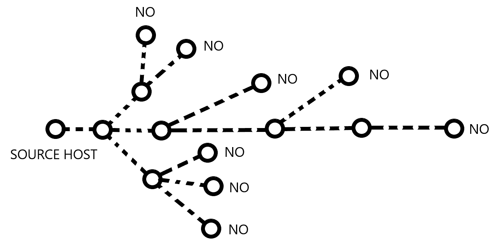
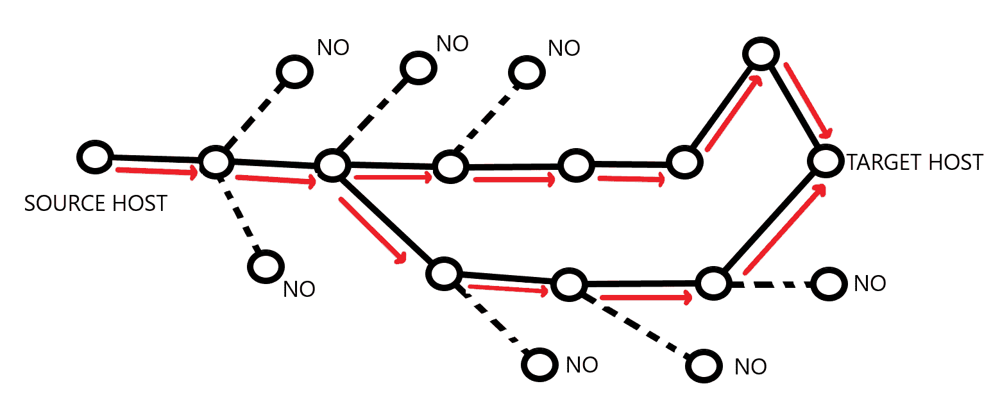
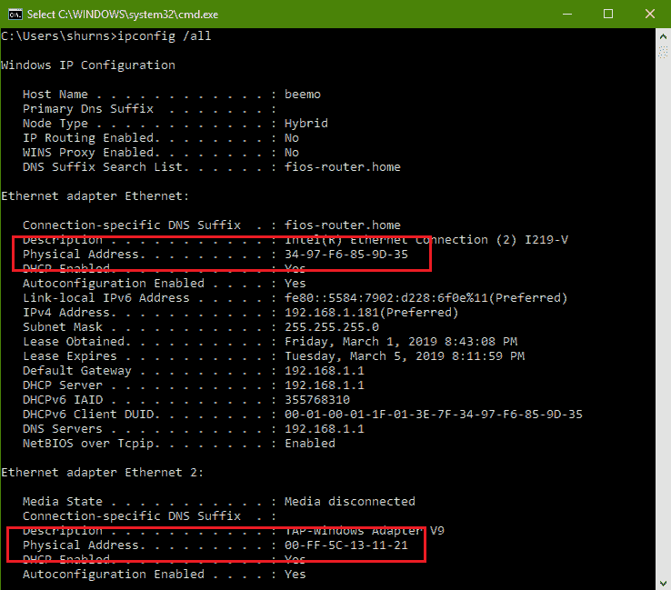
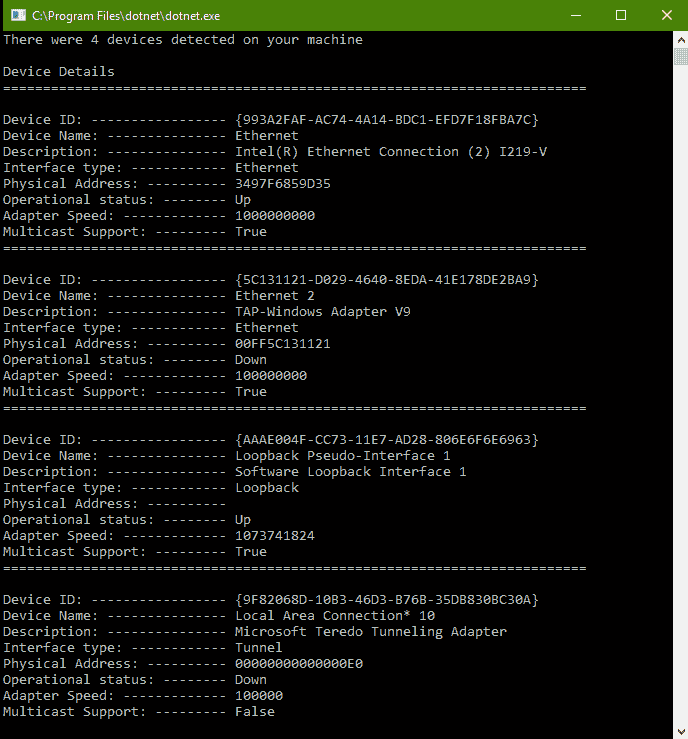

# 网络分析和数据包检查

在本章中，我们将探讨编写软件和系统，使我们能够探索它们部署的网络。而之前，我们研究了我们的软件在网络环境中的表现，在本章中，我们将具体探讨网络本身的表现。我们将检查如何在网络软件内部实现资源和设备发现，以及我们如何收集、检查并传递通过网络传输的数据包。我们将考虑我们的网络活动如何可能对我们的软件产生负面影响，以及如何积极应对这些影响并从中恢复或完全避免它们。

本章将涵盖以下主题：

+   广播端口和 IP 地址，以及如何使用它们来识别网络上的自己的软件或主机，或了解网络上其他主机的信息

+   捕获和分析部署软件的主机上的设备和流量信息

+   识别我们网络上的一些风险以及如何构建我们的应用程序以抵御这些风险

# 技术要求

在本章中，我们将使用本书 GitHub 仓库中可用的示例代码，链接如下：[`github.com/PacktPublishing/Hands-On-Network-Programming-with-C-and-.NET-Core/tree/master/Chapter%2018`](https://github.com/PacktPublishing/Hands-On-Network-Programming-with-C-and-.NET-Core/tree/master/Chapter%2018)。

查看以下视频以查看代码的实际运行情况：[`bit.ly/2HUai2a`](http://bit.ly/2HUai2a)

此外，我们将简要讨论使用 Wireshark 检查和理解与我们的机器交互的网络请求的广度和数量的优点。如果您还没有为前几章下载此软件，它可以在以下链接找到：[`www.wireshark.org/#download`](https://www.wireshark.org/#download)。

我强烈建议您熟悉它，因为它可以证明作为网络软件工程师的工具是无价的。

# 网络资源和拓扑结构

就像我们在第一章“网络概览”中讨论的那样，网络是一个对系统参与者无差别的系统。任何给定的网络对其连接的实体或主机没有任何了解。因此，它不能向任何试图连接到它的新主机提供此类信息。相反，这些主机负责向其他主机广播有关自己的信息。不仅如此，它们还负责监听来自其他主机的广播信息，以便它们可能知道网络上有哪些其他资源或主机。那么，这究竟是如何发生的呢？

# 节点间通信

在本书中描述的大多数主机到主机的交互中，一个主机必须通过路由器、交换机和网关的路径与另一个主机通信，以解析域名或 IP 地址。然而，通过外部主机设备链的地址解析过程并不能帮助我们建立与网络中下一个主机的**初始**通信。如果我们想让我们的主机成功地将信息传输到网络路径中的最近邻居，我们需要知道它可能监听的具体地址。

虽然我意识到你已经知道这个事实，但我敢打赌你并不经常思考这样一个事实：当你建立两个主机之间的连接时，那个连接完全是**逻辑上的**。预期是，在您的主机之间的网络路径上的每个路由器或交换机将简单地转发您的数据包到其目标，创建一个不间断的物理连接链。这些连接的总和构成了一个单一的逻辑连接。然而，为了使这起作用，您的宿主必须首先连接到该连接链中的下一个最近邻居。

每当我们想要通过 TCP 或 HTTP 等协议与远程主机建立高级连接时，运行在设备和网络层的软件必须为我们确定路径。它是通过向其最近的邻居发送消息并本质上询问该邻居是否可以解析路径来做到这一点的。然后，该网络设备将请求转发给其任何邻居，询问同样的问题。只要其中之一做出肯定的回答，你的最近邻居也会做出肯定的回答。如果我们把我们的网络看作一棵树，以我们的主机为根，我们可以用递归树遍历算法来考虑这个过程。这个递归算法会一直持续到做出两种可能的确定之一。在无法建立路径的情况下，网络树中的每个叶节点都会做出否定的回答，如下面的图所示：



同时，在成功确定路径的情况下，目标主机最终将通过我们的网络树中的某些路径到达。在这种情况下，**任何**可以直接连接到我们的目标主机的主机节点都会做出肯定的回答，肯定的回答会一直传播回我们的源主机，通知它可以建立连接，如下面的图所示：



注意，尽管如此，源端只知道可以建立一条路径。即使在最好的情况下，如果两个主机之间可以建立多条路径，也无法保证任何给定的数据包都会沿着最优路径（如果存在最优路径的话）传输。实际上，也无法保证给定请求的所有数据包都会沿着相同的路径传输。这正是我们在第十一章“传输层——TCP、UDP 和多播”中讨论的乱序数据包传输的原因。

到目前为止，我们只考虑了在传输层或应用层协议之间建立两个主机之间的连接。在这个背景下，我们没有必要使用 IP 地址或域名以及指定的监听端口来识别除了目标主机以外的任何东西。仅使用这些识别细节，网络和设备层协议就完成了在我们的网络上建立路径并将我们的请求数据包沿该路径转发的工作。我们的软件只是简单地接收两个主机之间的开放通信线路。

然而，您可能没有意识到，在网络层运行的软件必须通过其网络地址明确标识我们网络中的最近邻。此外，我们的主机必须通过邻居配置为监听的端口和通信机制与其最近邻进行通信。这使我们陷入了一种常见的鸡生蛋问题，即在尝试解决无差别的网络通信时经常遇到的问题。源主机如何识别与目标主机通信的地址和协议，而不首先与目标主机通信以了解这些细节？答案是使用广播地址。

# 广播地址

当你首次将设备连接到网络时，在设备能够有效地通过该网络进行通信之前，需要在新的设备和网络上的其他设备之间协调许多事情。您的设备必须分配一个本地 IP 地址，并且必须通知它直接连接的任何设备的 IP 地址和监听端口或套接字。此外，您的子网络中的任何网关都必须知道新设备，这样，如果子网络外的任何主机想要建立连接，网关将对其收到的任何路径请求做出肯定响应，以尝试建立连接。

为了在网络上建立新主机的初始身份，每个标准网络设备都将有一个被称为**广播地址**的属性。广播地址简单地是指任何给定网络或子网络上的每个设备都期望监听其上的地址。随着这一标准的普遍建立，任何试图连接到网络的新的主机可以通过向广播地址发送基本识别信息来建立其存在，以便任何可能需要了解它的设备。一旦消息被广播，路由器、交换机和网关可以使用它们配置的任何约定或协议来相互同意为新主机提供的新网络地址。

在初始广播消息中，新主机尚未从其网络分配 IP 地址。然而，它仍然需要通过其他设备可以与之通信的唯一标识符来建立身份。为了给其最近的物理邻居提供一个标识符，以便返回配置信息，新主机通常会将其**媒体访问控制地址**，或**MAC 地址**，作为其初始广播消息的一部分发送。MAC 地址是一个全球唯一的标识符，分配给每个单独的物理**网络接口卡**（**NIC**）。

MAC 地址有时被称为**烧录**地址，因为它在网卡制造时在硬件级别配置并固定，无法通过任何方式更改。MAC 地址由六个十六进制数字组成，由冒号、破折号或没有任何分隔符分隔。由于每个网卡都有一个唯一的 MAC 地址，因此配置了多个网络卡的主机将拥有多个 MAC 地址，以标识它可用的每个物理接口。如果你曾经打开过命令终端并运行此命令，你会看到你机器上安装的任何网络卡的 MAC 地址：

```cs
ipconfig /all
```

在以下命令终端中，它是指示为物理地址的属性：



由于 MAC 地址不能更改且众所周知是全球唯一的，新主机可能会将其广播到其网络中，并希望获得网络配置细节，包括 IP 地址分配和子网掩码指定作为回应。

通过使用每个连接主机的广播信息，网络服务器和路由器可以构建其网络的逻辑拓扑的内部表示。这个拓扑和设备配置的注册表用于控制和监控互联网通信的流量。因此，现在的问题是，当我们需要建立关于我们软件托管网络的相同知识时，我们如何利用这些广播和其他信息？

# 网络分析

现在我们已经对网络信息如何在我们的网络中任意节点之间进行通信有一个基本的了解，我们可以开始利用这些信息在我们的 .NET Core 项目中实现低级网络软件。那么，我们在寻找什么信息，我们如何在代码中使用它呢？

# 理解 NetworkInformation 命名空间

我们在上一个章节中讨论的许多细节和网络交互都存在于网络堆栈中比 .NET Core 库可以提供访问权限的软件和设备中。然而，关于通过您的应用程序的监听网络套接字和接口传输的传输层流量，有大量信息。为此信息，.NET Standard 提供了 `System.Net.NetworkInformation` 命名空间。

`NetworkInformation` 命名空间提供了一系列实用类和接口，可用于构建软件与连接的网络交互的全面图景。使用这个命名空间中的类，您可以了解数据包流量、设备地址，包括您当前子网络中路由器和网关的注册 IP 地址，以及用于识别网络中远程设备可用性的实用工具。

这个命名空间及其用例特别有趣的地方在于，它可以用来调查**所有**跨越您主机机器的连接和流量。这使您能够分析针对您机器上不同进程的网络请求可能会如何影响您自己的网络软件的性能和行为。此外，利用这个类可以为您的代码提供管理更多内部进程的连接和套接字所需的信息，从而允许编写自己的应用程序服务器或请求管理解决方案等应用。那么，我们能从这个命名空间中的类中获得哪些信息呢？

# 查询物理设备信息

假设您想编写一个提供主机计算机上网络设备详细信息的应用程序。当然，您可以使用诸如 Powershell 脚本或简单的批处理过程来运行终端命令，如 `ipconfig /all` 或 `netsh dump` 命令，并将结果写入文本文件。但如果你想要更多关于你系统的信息呢？如果你想要将此软件部署到具有不兼容终端的多台主机上呢？虽然脚本解决方案相对简单，但它非常不灵活，其潜在范围有限。

相反，使用`NetworkInterface`类及其子类，您可以直接从您的软件解决方案中访问有关网络设备的信息。使用`NetworkInterface`抽象类，我们可以访问从我们的软件的主操作系统可检测到的每个物理网络设备，并显示有关当前活动状态、接口类型、物理 MAC 地址、当前操作状态等信息。为了看到这一点，让我们编写我们的网络信息显示软件。我们将从为这一章的演示代码创建一个控制台应用程序开始：

```cs
dotnet new console -n NetworkAnalysisDemo
```

然后，从我们的`Main()`方法内部，我们将使用`NetworkInterface`类上的`GetAllNetworkInterfaces()`静态方法获取当前由我们的操作系统检测到的所有网络适配器的列表。这将返回一个`NetworkInterface`抽象类的子类的数组，数组中的每个实例代表系统上的一个物理设备。一旦我们有了设备列表，我们将遍历它们，并使用此接口查看我们可以发现有关它们的信息：

```cs
private static void DisplayDeviceInformation() {
  var adapters = NetworkInterface.GetAllNetworkInterfaces();
  Console.WriteLine($"There were {adapters.Length} devices detected on your machine");
  Console.WriteLine();
```

`NetworkInterface`类实际上是一个抽象基类。返回到我们的适配器容器中的实例将是`SystemNetworkInterface`的实例。现在，让我们找出我们可以从这些适配器实例中获取哪些信息。我们将通过遍历我们的适配器来打印一些更有趣的属性，并找出我们可以学习到的详细信息的类型：

```cs
Console.WriteLine("Device Details");
foreach (NetworkInterface adapter in adapters) {
  Console.WriteLine("=========================================================================");
  Console.WriteLine();
  Console.WriteLine($"Device ID: ----------------- {adapter.Id}");
  Console.WriteLine($"Device Name: --------------- {adapter.Name}");
  Console.WriteLine($"Description: --------------- {adapter.Description}");
  Console.WriteLine($"Interface type: ------------ {adapter.NetworkInterfaceType}");
  Console.WriteLine($"Physical Address: ---------- {adapter.GetPhysicalAddress().ToString()}");
  Console.WriteLine($"Operational status: -------- {adapter.OperationalStatus}");
  Console.WriteLine($"Adapter Speed: ------------- {adapter.Speed}");
  Console.WriteLine($"Multicast Support: --------- {adapter.SupportsMulticast}");
}

Thread.Sleep(20000);
```

如您通过属性所看到的，通过这个类，我们可以收集到与通过终端命令查询我们的网络接口卡（NIC）所收集到的几乎相同水平细节关于我们的宿主机器。实际上，我们可以通过运行一个`ipconig /all`命令来确认这一点，并将返回的设备细节与我们的程序输出进行比较。在我的机器上这样做，我们可以将我的程序输出与上一节中展示的终端输出进行比较：



在这里，我们可以看到我们可以访问上一节中`ipconfig /all`调用返回的大部分信息。虽然十六进制数字没有分组为破折号分隔的对，但`PhysicalAddress`属性显然直接映射到适配器的 MAC 地址，而`OperationalStatus`属性给出了设备对网络请求可用性的准确表示。我们还可以看到，我的操作系统配置为使用 Teredo 隧道适配器，以便在 IPv6 子网络上进行 IPv4 通信，正如我们在第十二章 The Internet Protocol 中讨论的那样。

更深入地探索`NetworkInterface`类，你可以找到有关你的网络适配器连接到的设备的信息。通过请求通过`GetIPProperties()`方法的信息，你可以访问每个适配器当前设置的网络配置信息的细节。这包括 DHCP 服务器、DNS 服务器以及你的子网网关设备的 IP 地址，以及在你机器上注册的任何多播或单播地址，这些地址是为你的网络上的其他设备设置的。

从这门课程中我们可以学习到的有关我们物理适配器的信息深度，比从我们的终端命令中学习到的要广泛得多。特别是当我们考虑到通过`GetIPProperties()`方法检索到的信息时。然而，使用这个类而不是简单的终端命令的好处是，它让我们能够从软件内部访问所有这些信息。我们可以根据设备可用性实现条件行为，或者向系统健康报告提供有意义的统计数据和信息，而无需依赖于特定主机的终端命令和外部加载模块。

通过这些信息，我们可以实际实现自己的软件来广播我们的 MAC 地址并请求地址配置，以及从我们的网络获取配置信息。即使你永远不会找到自己实现该代码的需求，这也可能清楚地描绘出这个类为你打开的功能类型。这提供了一个主机无关的机制，用于低级网络细节和编程。那么，我们还能从`System.Net.NetworkInformation`命名空间中的类中学习到哪些其他信息？

# 查询连接信息

虽然了解我们自己的网络接口的状态和可用性是有用的（实际上，在许多情况下甚至至关重要），但它并不能描绘出完整的画面。为了做到这一点，我们需要检查我们的适配器所暴露的进出网络流量。幸运的是，就像我们网络适配器的信息一样，.NET 标准提供了一套可以通过简洁且易于使用的抽象来显示和监控这些信息的类。

我们不想与 `NetworkInterface` 方法交互，而想查看我们的 TCP 连接，因此在这个下一部分，我们将查看 `IPGlobalProperties` 抽象基类。与通过调用 `GetAllNetworkInterfaces()` 方法检查网络接口信息的方式非常相似，我们可以使用 `GetIpGlobalProperties()` 静态方法收集大量的 IP 流量信息。一旦我们有了这些信息，我们可以从所有活动 TCP 连接的列表（对于确定设备当前负载很有用）到关于传入和传出 IP 数据包的统计信息获取一切。你甚至可以根据促进其交付的传输协议对 IP 流量统计信息进行排序，有专门针对 TCP 统计信息和 UDP 统计信息的方法。

让我们看看我们可以通过这些类及其查询了解哪些信息。我们将从了解当前时刻正在我们机器上运行的哪些活动 TCP 连接开始。首先，我们将获取我们的全局属性，然后请求我们的活动 TCP 连接信息：

```cs
private static void DisplayActiveTcpConnections() {
  var ipStats = IPGlobalProperties.GetIPGlobalProperties();
  var tcpConnections = ipStats.GetActiveTcpConnections();

  Console.WriteLine($"There are {tcpConnections.Length} active TCP connections on this machine");
  Console.WriteLine();
```

现在我们有了我们的活动连接，我们可以遍历它们以确定谁连接到谁，以及连接的状态：

```cs
foreach(var connection in tcpConnections) {
    Console.WriteLine("=============================================");
    Console.WriteLine($"Local host:");
    Console.WriteLine($" Connected On Address: {connection.LocalEndPoint.Address.ToString()}");
    Console.WriteLine($" Over Port Number: {connection.LocalEndPoint.Port}");
    Console.WriteLine($"Remote host: {connection.RemoteEndPoint.Address}");
    Console.WriteLine($" Connected On Address: {connection.RemoteEndPoint.Address.ToString()}");
    Console.WriteLine($" Over Port Number: {connection.RemoteEndPoint.Port}");
    Console.WriteLine($"Connection State: {connection.State.ToString()}");
}
```

运行此命令后，你应该会看到本地地址（无论是 `192.168.1.XXX` 还是 `127.0.0.1`）作为每个连接的本地地址的某种变化，这可能并不完全明显为什么你可能想要访问这些信息。然而，考虑一个场景，你有一个单一的主机注册了多个 IP 地址，并且每个地址都映射到一个单一、独特的应用程序进程。假设你已经通过我们在第九章 HTTP in .NET 中讨论的 `IWebHostBuilder` 的 `UsingUrls(...)` 方法配置了这些不同的监听模式。如果那样的话，你可以使用本地地址信息来区分主机上不同应用程序的连接。这可能会让你对应用程序流量和资源使用有更深入的了解。我预计你现在已经对这种信息在许多情况下可能非常有用有了直观的认识。

# 监控流量和远程设备信息

最后，让我们通过查看通过其类提供的某些流量统计信息和信息来总结我们对 `System.Net.NetworkInterface` 命名空间的讨论。这将为我们提供关于在特定时间点接收到的总数据包数量、分段失败、丢弃的出站数据包以及更多统计信息的统计信息。我们可以根据 IP 版本请求这些统计信息，使用 `GetIPv4GlobalStatistics()` 和 `GetIPv6GlobalStatistics()` 不同的方法，以及通过 `GetTcpIPv4Statistics()` 和 `GetUdpIPv4Statistics()` 过滤这些统计信息，按传输协议进行过滤。

通过查看`IPGlobalStatistics`类实例提供的某些属性，我们可以看到我们可以从我们的流量中提取出的有价值信息。让我们通过一些示例代码来看看其中的几个例子：

```cs
private static void DisplayIPv4TrafficStatistics() {
    var ipProperties = IPGlobalProperties.GetIPGlobalProperties();
    var ipStats = ipProperties.GetIPv4GlobalStatistics();
    Console.WriteLine($"Incoming Packets: {ipStats.ReceivedPackets}");
    Console.WriteLine($"Outgoing Packets: {ipStats.OutputPacketRequests}");
    Console.WriteLine($"Discareded Incoming Packets: {ipStats.ReceivedPacketsDiscarded}");
    Console.WriteLine($"Discarded Outgoing Packets: {ipStats.OutputPacketsDiscarded}");
    Console.WriteLine($"Fragmentation Failures: {ipStats.PacketFragmentFailures}");
    Console.WriteLine($"Reassembly Failures: {ipStats.PacketReassemblyFailures}");
}
```

在这里，你可以看到关于你的网络整体健康和稳定性的各种可能描绘的图片。我们可以获取有关碎片化和重组失败、丢失的数据包以及整体进出流量的信息。在这种情况下，我们正在查看我们的全球 IP 流量，但我们可以很容易地按 TCP 和 UDP 排序，以获得我们网络交互的更有意义的细分。

并非所有`IpGlobalStatistics`的属性在所有平台上都受支持。有关丢弃的数据包和碎片失败的信息将仅在 Windows 主机上可用。请确保你想要访问的统计信息受你软件将部署到的平台支持，并且始终编写代码以便在主机支持可能有限的情况下优雅地降级。

虽然我希望这已经清楚地说明了你可以了解关于你托管软件周围更广泛网络环境中的哪些信息，但我只是刚刚开始探索通过`System.Net.NetworkInformation`命名空间可用的信息。我强烈建议你自己阅读 Microsoft 文档，看看还有哪些工具可供使用。

# 其他工具和分析

虽然我们可以使用`System.Net.NetworkInformation`命名空间捕获的信息为我们提供了关于我们网络状态的非常清晰的画面，但它在对网络分析来说有一个主要的缺点：它不能提供任何关于实时流量或请求内容的洞察。在代码中访问这些信息的唯一方法是在一个开放的端口上主动注册一个监听器，并相应地处理传入的流量。因此，对于需要监控其网络流量内容以及流量量和上下文的网络和 DevOps 工程师来说，还有哪些其他工具可用？

# 使用 Wireshark 进行数据包检查

如我们在第四章“数据包和流”中看到的，Wireshark 可以是一个强大的网络分析和所谓的**数据包嗅探**工具。简单来说，数据包嗅探是在不考虑其预期接收者的上下文的情况下检查数据包的内容。例如，如果我通过浏览器请求了一个网页，然后用 Wireshark 之类的工具调查构成该网页的数据包流，那么这就算作数据包嗅探。这些数据包原本是打算由我的浏览器接收和使用的，而不是 Wireshark。实际上，我是否是第一个通过浏览器请求它们的人并不重要。

在某些情况下，这可能是一个恶意行为者获取对其他互联网流量访问权限的危险工具。然而，在遵守道德的网络工程师手中，它可以是一种识别网络上的意外或不希望的活动的好方法。那么，我们如何利用这一点呢？

考虑这样一个案例，你有一个正在运行的软件，它使用`System.Net.NetworkInformation`类来提供关于托管环境的实时健康信息。如果你已经很好地设计了你的警报机制（如第十六章[5abf726d-855c-410e-8547-a54da3deac58.xhtml]，*性能分析和监控*所述），你会迅速意识到任何超出给定阈值的意外网络流量峰值。如果发生这种情况，从你的健康监控软件中可获得的信息将受到`System.Net.NetworkInformation`库提供的限制。

在本章中，我们讨论了这些资源，你可以制定一个合理的策略来检测和响应这些类型的网络事件。简单地将`System.Net.NetworkInformation`类提供的统计信息作为你的警报系统，并在出现警报时使用更强大的检查工具，如 Wireshark，进行深入分析。这可以让你更深入地了解在数据包高流量峰值中向你的主机传达了哪些信息。

在第四章[9d6266fb-4428-4044-b63b-44f1317f64e7.xhtml]，*数据包和流*的*数据包解剖学*部分中，讨论了使用 Wireshark 进行基本数据包嗅探的基本方法。考虑到这一点，我不会过多地强调这一点，因为 Wireshark 的更高级用法超出了本书的范围。然而，我认为在本章中讨论它很重要，因为任何对网络编程及其所有内容认真的人都应该尽可能拥有尽可能多的工具。为此，我强烈建议你在工作中或甚至在业余时间抽出时间学习和练习使用 Wireshark 和其他数据包检查工具进行深入的网络分析。

在解决了这些问题之后，我们准备处理我们的最后一个主题。在下一章中，我们将探讨 SSH 交互方案。我们将了解它是如何产生的，它是如何随着时间的推移而演变的，以及我们如何使用它进行远程过程调用和主机访问。

# 摘要

在本章中，我们探讨了使用.NET Core 库进行网络设备分析的非常小众但极其强大的主题。我们首先学习了网络设备如何通过设备无关的连接来传递关于自身的信息，以建立附近设备地址和交互机制的内部注册表。在这个过程中，我们了解了广播和广播地址的使用，即使没有关于您打算与之通信的设备任何连接信息，也能可靠地传输消息。最后，我们学习了如何通过唯一地寻址硬件接口，即使在没有注册的网络地址的情况下，也能促进设备识别。

一旦我们了解了促进网络中主机之间更典型交互所需的特性和交互，我们就研究了如何在.NET 应用程序中访问这些低级网络信息。我们探索了`System.Net.NetworkInformation`命名空间内的各种类，并看到了如何使用它们来访问有关我们的网络适配器和它们所连接的设备的有价值信息。我们看到了如何通过编程方式访问有关我们的物理网络适配器的关键操作信息，这为我们提供了广泛的诊断和统计信息。我们还研究了如何检查和监控每个网络接口的 IP 流量，以执行数据包检查和网络健康分析。最后，我们考虑了其他可用的工具，这些工具可以提供更多关于网络流量的上下文和细节，以及我们如何使用所有这些信息来识别和响应不稳定的网络。在进入最后一章时，我们将探讨计算机如何通过网络使用 SSH 远程控制和操作主机。

# 问题

1.  描述地址解析的过程，如它在网络层发生的那样。

1.  广播地址是什么？它是如何使用的？

1.  MAC 地址是什么？它与其他网络地址有什么区别？

1.  我们可以从`NetworkInterface`类的实例中学习哪些信息？

1.  数据包嗅探是什么？它在网络分析中有什么用途？

1.  我们可以使用`NetworkInformation`类查询哪些类型的流量信息？

1.  我们如何利用流量统计来检测和响应不稳定的网络条件？

# 进一步阅读

再次强调，在本章中，我们讨论了一个相对小众的主题，而且学习更多相关内容的额外资源也相对稀少。我当然建议您探索微软关于`System.Net.NetworkInformation`命名空间的文档，您可以通过以下链接找到：[`docs.microsoft.com/en-us/dotnet/api/system.net.networkinformation?view=netcore-3.0`](https://docs.microsoft.com/en-us/dotnet/api/system.net.networkinformation?view=netcore-3.0)

此外，如果你对继续深入网络流量分析和数据包检查的路径感兴趣，我推荐阅读 Anish Nath 所著的《Wireshark 数据包分析》一书。这本书提供了详尽的指南，用于调查和理解与你的网络适配器时刻接触的原始网络数据包的本质。你可以在 Packt 购买此书，链接如下：[`www.packtpub.com/networking-and-servers/packet-analysis-wireshark`](https://www.packtpub.com/networking-and-servers/packet-analysis-wireshark).
