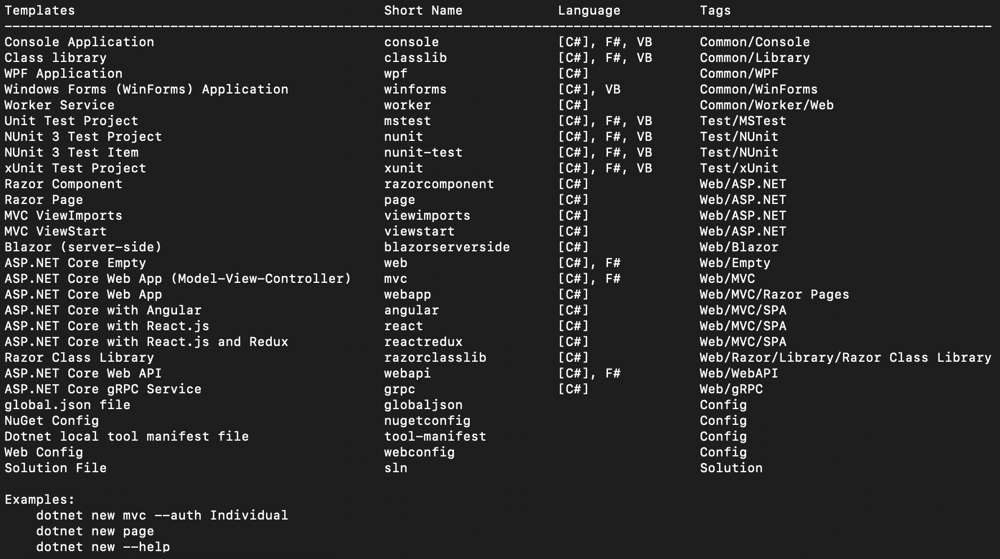

# ASP.NET Core 概述

在本章中，我们将探讨 ASP.NET Core 的一些基本概念。.NET Core 是跨平台的，但与其一起使用的 IDE 和代码编辑器可能会根据它们运行的操作系统而有所不同。为了避免重复并涵盖所有操作系统变体，我在本书中提供的示例中始终使用 CLI。此外，`dotnet` 指令是唯一的入口点，并且也被代码编辑器和 IDE 在幕后使用。

本章将涵盖以下主题：

+   设置 .NET Core 3.1 和 ASP.NET Core 项目

+   .NET Core 项目模板的文件结构

# 设置我们的 .NET Core 项目

本章假设您已经在您的机器上安装了 .NET Core 3.1 或更高版本。首先，让我们在我们的控制台中启动以下命令：

```cs
dotnet new
```

输出将如下所示：



`dotnet new` 指令的结果

上述输出显示了本地机器上可用的所有 .NET Core 项目模板。每个模板都有一个用户友好的名称、简短名称和标签。它们支持 C#、F# **和** VB；默认为 C#。

要创建一个新的模板，我们将使用简短名称。例如，为了创建一个控制台应用程序，我们应该运行以下指令：

```cs
dotnet new console -n HelloWorld
```

上述指令将在当前文件夹中创建一个新的项目，其结构如下：

```cs
.
├── HelloWorld.csproj
├── Program.cs
└── obj
    ├── ...
```

`HelloWorld.csproj` 文件包含有关项目的所有元信息。与之前版本的 .NET Framework 中的 `.csproj` 文件相比，.NET Core 版本的 `.csproj` 文件更轻量。我们将在本章中讨论此项目文件的新结构。`Program.cs` 文件是应用程序的入口点。

要构建和执行我们的项目，我们可以在项目文件夹中运行以下命令：

```cs
dotnet build
dotnet run
```

如预期，我们得到以下结果：

```cs
Hello World!
```

与旧 .NET Framework 项目不同，构建和运行步骤是轻量级过程，并且不需要任何额外的工具或配置。实际上，.NET Core 并不是像 .NET Framework 那样严格绑定到开发机器。最终，开发者可以编写代码而无需其他 IDE 或代码编辑器。然而，出于明显的原因，始终建议您使用它们以简化开发过程。

还必须注意的是，一旦我们执行 `dotnet build` 命令，项目文件将按以下方式更改：

```cs
.
├── HelloWorld.csproj
├── Program.cs
├── bin
│   └── Debug
│       └── netcoreapp3.1
│           ├── ...
└── obj
├── Debug
│   └── netcoreapp3.1
│       ├── ...
```

`bin/Debug/` 文件夹包含所有应用程序的 DLL 文件。在其下方，我们可以看到 `netcoreapp3.1` 文件夹，它指的是当前的目标框架。因此，如果你使用多目标方法构建项目，你将找到一个针对你指定的每个目标框架的文件夹。现在我们已经能够运行一个简单的控制台应用程序，让我们更仔细地看看项目中的 *csproj* 文件。

# .csproj 概述

如前所述，在纯控制台应用程序模板中，有两个基本文件：`ProjectName.csproj` 和 `Program.cs`。首先，让我们看看 `.csproj` 文件：

```cs
<Project Sdk="Microsoft.NET.Sdk">
    <PropertyGroup>
        <OutputType>Exe</OutputType>
        <TargetFramework>netcoreapp3.0</TargetFramework>
    </PropertyGroup>
</Project>

```

`.csproj` 文件的格式是 XML，就像 .NET Framework 的早期版本一样。以下内容省略，因为它是无意义的空行。

`Sdk="Microsoft.NET.Sdk"` 命名空间指的是我们想要用于构建项目的 SDK。`PropertyGroup` 节点包含一组属性，并且可以与一些条件行为相关联。`ItemGroup` 是一个通常包含包引用的节点。在 .NET Core 中，我们可以指定 `TargetFramework` 属性为项目分配目标框架。为了将我们的应用程序设置为 *多目标应用程序*，因此，我们可以将我们的 `TargetFramework` 节点更改为以下内容：

```cs
<Project Sdk="Microsoft.NET.Sdk">
    <PropertyGroup>
        <OutputType>Exe</OutputType>
<TargetFrameworks>netcoreapp3.1;netstandard2.0</TargetFrameworks>
    </PropertyGroup>
</Project>
```

注意，XML 节点已从 `TargetFramework` 更改为 `TargetFrameworks`，此外我们的项目将在 .NET Core 3.1 和 .NET Standard 2.0 上构建。

根据 MSBuild 文档（[`docs.microsoft.com/en-us/visualstudio/msbuild/msbuild?view=vs-2019`](https://docs.microsoft.com/en-us/visualstudio/msbuild/msbuild?view=vs-2019)），可以为每个目标框架定义不同的包。例如，在一个双目标框架项目中，如前所述，我们可能为每个目标定义各种依赖项，如下所示：

```cs
<Project Sdk="Microsoft.NET.Sdk">

  <PropertyGroup>
    <OutputType>Exe</OutputType>
    <TargetFrameworks>netcoreapp3.1;netstandard2.0</TargetFrameworks>
  </PropertyGroup> 
 ...

  <ItemGroup Condition=" '$(TargetFramework)' == 'netstandard2.0' ">
    <PackageReference Include="Microsoft.AspNetCore.Server.Kestrel.Core" Version="2.2.0" />
  </ItemGroup>
</Project>
```

在这个例子中，我们将为每个目标设置单独的引用：在编译时，框架生成两个目标版本，`netstandard2.0` 生成的输出将引用 `Microsoft.AspNetCore.Server.Kestrel.Core` 包。这是一种不寻常的配置类型，但如果我们项目有高度定制化，或者如果我们的项目是一个由不同版本的 .NET 消耗的库，它就很有用。`dotnet new` 命令还根据你创建的项目类型设置一个特定的 `OutputType` 属性：`OutputType` 属性定义项目是可执行的（`Exe`）还是库（`Library`）。显著的区别在于，在前一种情况下它可以被执行，而在后一种情况下它不包含任何运行应用程序的入口点。因此，我们无法在 `<OutputType>Library</OutputType>` 项目类型上执行 `dotnet run` 命令。另一方面，如果我们有一个 `<OutputType>Exe</OutputType>` 项目，我们确实需要指定 `static void Main` 入口点方法。让我们通过查看标准控制台模板的 `Program.cs` 文件来继续讨论可执行项目的领域。

# `Program.cs` 文件详细说明

`Program.cs` 文件是应用程序的主要入口点。它设置并运行我们需要的所有组件。默认情况下，控制台应用程序模板执行单个语句：

```cs
using System;

namespace HelloWorld 
{
    class Program
    {
        static void Main(string[] args)
        {
 Console.WriteLine("Hello World!");
        }
    }
}
```

前面的代码片段是一个普通的.NET Core 应用程序，它运行`Console.WriteLine`在控制台打印一条消息。在一个 ASP.NET Core 应用程序中，`Program.cs`文件通常用于初始化和运行 Web 宿主。

C# 7.1 版本引入了`async void Main`方法。这个特性是为了避免运行异步代码时涉及到的解决方案：

```cs
using System;
using System.Threading.Tasks;

namespace HelloWorld
{
    class Program
    {
         static async Task Main(string[] args)
         {
             await Task.Delay(10);
             Console.WriteLine("Hello World!");
         }
     }
}
```

总结来说，`Program.cs`文件是建立在.NET Core 3.1 之上的应用程序的主要执行根。它通常运行一系列语句以启动我们的应用程序。一般来说，我们应该尽可能保持`Program.cs`的简洁，以提高我们类的可重用性。在下一节中，我们将看到如何结合`csproj`结构和`Program.cs`文件来构建一个简单的 API 项目。

# 设置 ASP.NET Core 项目

如第一章中提到的，“REST 101 和 ASP.NET Core 入门”，MVC 模式的核心是分离关注点。它的目的是为开发者提供一些指导原则，以确保 Web 应用程序的不同组件不会混淆。以下是对 MVC 模式的复习：

+   模型旨在定义我们应用程序的领域模型。还应注意的是，模型不包含对我们数据源和数据库的任何引用。它们描述了我们的应用程序中的实体。

+   视图部分以 HTML 页面的形式呈现数据。在 Web 服务中，视图不包括在内，因为模型以 JSON、HTML 或其他类似格式序列化。关键点是视图不应包含逻辑。它们难以测试和难以维护。在过去的几年里，视图变得越来越强大。Razor 引擎，ASP.NET Core 提供的默认视图渲染引擎，最近提供了一些新功能。开发者很容易在视图中实现逻辑，但应尽量避免这样做。

+   MVC 的控制器部分处理来自用户的请求。它们从请求中获取信息并更新模型。在实际的商业应用程序中，控制器通常由服务或存储库类支持，这为领域模型层增加了另一个层次。

让我们详细了解一下默认的 ASP.NET Core Web API 项目模板。该项目使用 MVC 模式的模型和控制器部分来提供简单的 HTTP 响应，内容以 JSON 序列化。

首先，让我们使用以下命令创建一个新的项目：

```cs
dotnet new webapi -n SampleAPI

```

执行前面的命令将创建以下文件夹结构：

```cs
.
├── Controllers
│ └── WeatherForecastController.cs
├── Program.cs
├── Properties
│ └── launchSettings.json
├── SampleAPI.csproj
├── Startup.cs
├── WeatherForecast.cs
├── appsettings.Development.json
├── appsettings.json
└── obj
```

执行`dotnet new webapi`命令将在同名文件夹内创建一个名为`SampleAPI`的新项目文件。以下是`dotnet new webapi`命令生成的`SampleAPI.csproj`文件：

```cs
<Project Sdk="Microsoft.NET.Sdk.Web">
    <PropertyGroup>
 <TargetFramework>netcoreapp3.1</TargetFramework>
    </PropertyGroup>
</Project>

```

首先要注意的是，该项目使用 `Microsoft.NET.Sdk.Web` SDK，它指的是网页应用程序 SDK。此外，.NET Core 框架根据我们即将创建的项目目的提供不同的 SDK。例如，在桌面应用程序的情况下，项目将指定另一个 SDK：`Microsoft.NET.Sdk.WindowsDesktop`。在不同的 SDK 之间进行选择确保了开发者能够获得优秀的模块化水平。其次，项目文件没有指定任何特定的依赖项，除了应用程序使用的 `netcoreapp` 目标框架。

# 项目结构

所有 ASP.NET Core 网页模板都有类似的结构。主要区别在于 `views` 文件夹，在网页 API 项目中不存在。

在继续之前，让我们更详细地查看 `SampleAPI` 文件夹的结果内容：

+   `Program.cs` 是应用程序的主要入口点，它运行 API 使用的默认网页服务器。

+   `Startup.cs` 定义并配置我们的应用程序管道和服务。

+   `Controllers` 文件夹包含我们应用程序的所有控制器。根据默认的命名约定，ASP.NET Core 会在这个文件夹中搜索我们应用程序的控制器。

+   `Properties/launchSettings.json` 文件代表我们项目的设置。当您尝试更改项目的任何属性时，该文件会被创建，并且通常存储我们的服务或应用程序的应用程序 URL。此外，如果我们快速查看文件内容，我们可以注意到两个不同的配置文件：一个以创建的项目名称命名，另一个以 `IISExpress` 命名。每个项目都可以与多个配置文件相关联。它们可以用来指定一些启动设置和应用程序使用的环境变量。因此，可以通过使用 `dotnet run` 命令并指定配置文件使用 `--launch-profile` 标志来运行应用程序；

+   `appsettings.json` 和 `appsettings.{Environment}.json` 包含基于我们环境的设置。它们是 `web.config` 文件中设置部分的替代品。

# Program.cs 和 Startup.cs 文件

让我们继续通过检查网页 API 项目的 `Program.cs` 文件：

```cs
using System;
using System.Collections.Generic;
using System.Linq;
using System.Threading.Tasks;
using Microsoft.AspNetCore.Hosting;
using Microsoft.Extensions.Configuration;
using Microsoft.Extensions.Hosting;
using Microsoft.Extensions.Logging;

namespace SampleAPI
{
    public class Program
    {
        public static void Main(string[] args)
        {
            CreateHostBuilder(args).Build().Run();
        }

        public static IHostBuilder CreateHostBuilder(string[] 
        args) =>
            Host.CreateDefaultBuilder(args)
                .ConfigureWebHostDefaults(webBuilder =>
                {
                    webBuilder.UseStartup<Startup>();
                });
    }
}
```

以下代码导入了 `Microsoft.AspNetCore.Hosting` 和 `Microsoft.Extensions.Hosting` 命名空间。它们为在 `CreateHostBuilder` 函数中创建的新 `IHostBuilder` 实例的初始化提供了必要的引用。`CreateHostBuilder` 函数执行 `Host.CreateDefaultBuilder` 方法，该方法初始化我们的 API 的网页宿主。此外，我们还应该注意，`CreateDefaultBuilder` 方法返回的 `IHostBuilder` 实例指向项目的 `Startup` 类。`Main` 方法调用 `CreateHostBuilder` 函数并执行 `IHostBuilder` 接口公开的 `Build` 和 `Run` 方法。

让我们检查`Startup`类（在`Startup.cs`文件中定义），它用于配置应用程序堆栈：

```cs
using Microsoft.AspNetCore.Builder;
using Microsoft.AspNetCore.Hosting;
using Microsoft.Extensions.Configuration;
using Microsoft.Extensions.DependencyInjection;
using Microsoft.Extensions.Hosting;

namespace SampleAPI
{
    public class Startup
    {
        public Startup(IConfiguration configuration)
        {
            Configuration = configuration;
        }

        public IConfiguration Configuration { get; }

        public void ConfigureServices(IServiceCollection services)
        {
            services.AddControllers();
        }

        public void Configure(IApplicationBuilder app, 
        IWebHostEnvironment env)
        {
            if (env.IsDevelopment())
            {
                app.UseDeveloperExceptionPage();
            }

            app.UseHttpsRedirection();

            app.UseRouting();

            app.UseAuthorization();

            app.UseEndpoints(endpoints =>
            {
                endpoints.MapControllers();
            });
        }
    }
}
```

`Startup`类通过依赖注入初始化`IConfiguration`属性。`IConfiguration`对象代表一个键/值对象，其中包含应用程序的配置。默认情况下，`Program.cs`文件中声明的`CreateDefaultBuilder`方法将`appsettings.json`设置为默认配置文件。

`Startup`类有两个不同的方法，它们的行为如下：

+   `ConfigureServices`方法通过依赖注入配置我们应用程序中的服务。默认情况下，它通过执行`.AddControllers`扩展方法来添加控制器。在 ASP.NET Core 中，术语服务通常指任何为我们应用程序提供功能和功能的组件或类。正如我们将在下一章中看到的，ASP.NET Core 经常使用依赖注入来维护良好的设计和松散耦合的类。

+   `Configure`方法用于配置应用程序的中间件管道。它接受两个参数：`IApplicationBuilder`和`IWebHostEnvironment`。第一个包含我们应用程序的所有管道并公开扩展方法来构建带有中间件的应用程序。我们将在第三章，*与中间件管道一起工作*中详细查看中间件。`IWebHostEvironment`接口提供了有关应用程序当前托管环境的某些信息，例如其类型和名称。在一个 Web API 项目中，`Configure`方法执行一系列扩展方法。其中最重要的是`UseRouting`和`UseEndpoints`扩展方法。`UseRouting`方法的执行定义了管道中路由决策的点。`UseEndpoints`扩展方法定义了之前选择的端点的实际执行。在 Web API 项目中，涉及的端点只有控制器。因此，`UseEndpoints`方法执行`MapControllers`扩展方法来初始化由.NET Core 提供的控制器类的默认路由约定。

应该注意的是，ASP.NET Core 的`Startup`类通过依赖注入提供了一种高级、代码优先的方式来配置应用程序的依赖项，这意味着它只初始化你所需要的。此外，.NET Core 具有强烈的模块化导向；这也是它比.NET Framework 表现更好的原因之一。

由于所有管道和依赖项都在上述类中初始化，你知道它们可以更改的位置。在具有许多不同组件的大型应用程序和服务中，建议创建自定义扩展方法来处理应用程序特定部分的初始化。

# 控制器概述

控制器是 ASP.NET Core 项目中 Web API 的基本部分。它们处理传入的请求并作为我们应用程序的入口点。我们将在第四章*依赖注入*中更详细地探讨控制器，但就目前而言，让我们检查 Web API 模板提供的默认 `WeatherForecastController`：

```cs
using System;
using System.Collections.Generic;
using System.Linq;
using Microsoft.AspNetCore.Mvc;
using Microsoft.Extensions.Logging;

namespace SampleAPI.Controllers
{
    [ApiController]
    [Route("[controller]")]
    public class WeatherForecastController : ControllerBase
    {
        private static readonly string[] Summaries = new[]
        {
            "Freezing", "Bracing", "Chilly", "Cool", "Mild", "Warm", 
            "Balmy", "Hot", "Sweltering", "Scorching"
        };

        private readonly ILogger<WeatherForecastController> _logger;

        public WeatherForecastController(ILogger<WeatherForecastController> 
        logger)
        {
            _logger = logger;
        }

        [HttpGet]
        public IEnumerable<WeatherForecast> Get()
        {
            var rng = new Random();
            return Enumerable.Range(1, 5).Select(index => 
            new WeatherForecast
            {
                Date = DateTime.Now.AddDays(index),
                TemperatureC = rng.Next(-20, 55),
                Summary = Summaries[rng.Next(Summaries.Length)]
            })
            .ToArray();
        }
    }
}
```

`WeatherForecastController` 包含基本方法。默认情况下，它不使用任何数据源；它只是返回一些模拟值。让我们通过查看 `WeatherForecastController` 类的主要元素来继续：

+   `ApiController` 属性表示控制器及其所有扩展控制器提供 HTTP API 响应。它在 ASP.NET Core 2.1 版本中引入，通常与 `ControllerBase` 类结合使用。

+   `Route("api/[controller]")` 属性定义了我们的控制器的路由。例如，在这种情况下，控制器将响应以下 URI：`https://myhostname:myport/api/weatherforecast`。`[controller]` 占位符用于表示控制器的名称。

+   `ControllerBase` 类通常与 `ApiController` 属性结合使用，并在 `Microsoft.AspNetCore.Mvc` 命名空间中定义。`ControllerBase` 类表示一个不支持视图部分的控制器。它提供了一些基本方法，例如 `Created`、`CreatedAtAction`*、* 和 `NotFound`*。它还提供了一些属性，例如 `HttpContext`，它包含我们 Web 服务的请求和响应。

+   `HttpGet` 属性是 `Microsoft.AspNetCore.Mvc` 命名空间的一部分。它标识了动作接受的 HTTP 方法类型。它还接受一个额外的参数，例如 `[HttpGet("{id}")]`，该参数定义了动作的路由模板。ASP.NET Core 为每个 HTTP 动词暴露了一个 HTTP 属性，例如 `HttpPost`*、* `HttpPut`*、* 或 `HttpDelete`。

最后，我们可以简要地看一下 `WeatherForecastController()` 构造方法以及 `Get()` 方法的实现。第一个初始化控制器类的所有依赖项，它是我们类的依赖注入入口点；所有与控制器相关的依赖项都在构造函数中解决。`Get()` 方法实现逻辑并返回一个将被序列化然后传递到 Web API HTTP 响应中的元素集合。

# 摘要

在本章中，我们介绍了 .NET Core 的一些核心概念。我们探讨了控制台应用程序和 Web API 模板，以及 ASP.NET Core Web API 结构*、*和控制器类的结构。

本章涵盖的主题提供了在 .NET Core 上开始控制台应用程序项目所需的技能，并且它们还提供了有关 ASP.NET Core 项目安排的基本知识。

在下一章中，我们将探讨 ASP.NET Core 的一个核心概念——中间件，以及如何使用它来拦截请求并增强我们的应用程序堆栈。
