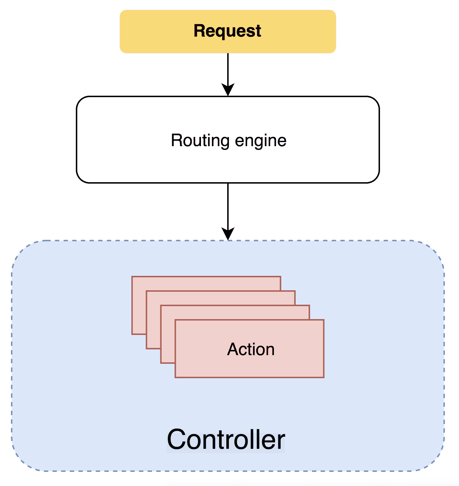
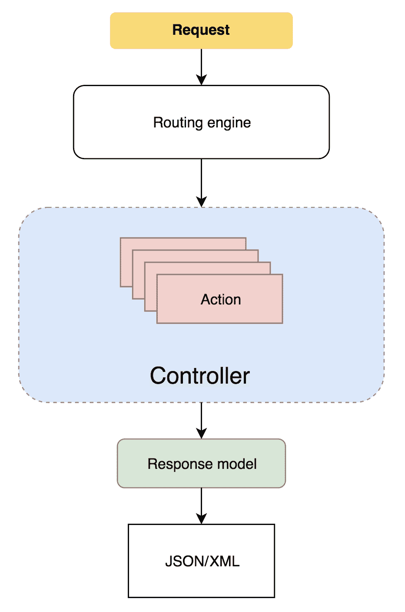
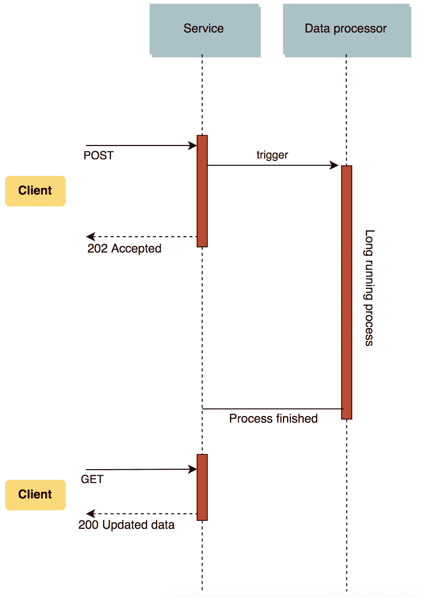

# ASP.NET Core 中的 Web 服务栈

本章介绍了如何在 Web 服务栈中处理控制器和操作。控制器是 ASP.NET Core 的一个基本部分；它们是 HTTP 请求的入口点。在本章中，我们将仔细研究控制器类的机制以及它们如何使用 HTTP 协议将信息传输到客户端。

本章涵盖了以下主题：

+   控制器是什么？

+   使用控制器和操作处理请求

+   如何处理 DTO 对象

+   实现验证

到本章结束时，读者将对该章提供的 Web 栈有一个总体概述，并将知道如何使用控制器和操作处理传入的 HTTP 请求。

# 控制器是什么？

控制器是 MVC 模式中的 *C* 部分。它们是一组通常处理来自客户端请求的操作。你应该记住，本章所讨论的内容是指由 ASP.NET Core 定义的 MVC 栈。此外，如果我们以传入的请求为参考，请记住它们已经通过了中间件管道中的其他中间件，并且已经触发了 *MVC 中间件*。

下图显示了请求通常是如何处理的：



如我们在 第一章 中所讨论的，“REST 101 和 ASP.NET Core 入门”，传入的请求通常由客户端生成：浏览器、另一个 API 或外部系统。请求由一个 *HTTP 动词*、一个 *URI*、*请求体有效载荷*和其他附加信息组成。**路由引擎**处理请求并将其传递到我们 *控制器* 中的一个 *操作方法*。**操作方法**通常通过提供响应来继续执行。此外，控制器通常通过其他类（如数据库或其他服务）与第三方系统交互。最后，它们以特定格式提供服务。在 MVC 应用程序的情况下，它们通常返回一个视图，而在 Web API 的情况下，它们以 **JSON/XML** 等格式返回结果：



上述图示显示了传入请求通过模型-控制器栈的流程。正如你所见，流程省略了 MVC 栈中的视图部分，因为它对于构建 Web 服务没有太大用处。下一部分将重点介绍控制器，并解释如何识别控制器。

# 识别控制器

控制器和操作通常以某种元编程风格装饰属性和过滤器，这允许开发者理解实现代码的目的。ASP.NET Core 遵循一系列标准来在我们的项目中查找控制器，通常是通过使用文件系统约定。控制器通常存储在 `Controllers` 文件夹中。

为了被路由系统识别，控制器类需要遵守以下规则之一：

+   类以 `Controller` 后缀结尾，或者它继承自具有 `Controller` 后缀的类

+   类被装饰了 `[Controller]` 或 `[ApiController]` 属性，这表明它是一个控制器类

如我们在第四章中提到的*依赖注入*，建议显式使用构造函数或操作注入来定义控制器依赖项。依赖注入方法提高了控制器的可测试性和可维护性。

现在，让我们看看如何将像继承这样的广泛概念应用于控制器以扩展其功能，以及 ASP.NET Core 如何使用这种技术为控制器类提供一些基本属性。

# 扩展控制器

如前所述，控制器是类，因此它们可以扩展其他类型，包括其他控制器。这种技术可以应用，以便我们可以重用特定的实现或功能。通常，控制器扩展 `Controller` 或 `ControllerBase` 类，这些类是 ASP.NET Core 框架的一部分。这些基类为控制器提供了管理请求和响应的一些工具。首先，让我们分析 `Controller` 和 `ControllerBase` 类之间的区别：

+   `ControllerBase` 代表一个没有视图支持的 MVC 控制器的基类。它为子类提供了一些基本属性，例如 `HttpContext`、`Request` 和 `Response` 属性。

+   `Controller` 类扩展了 `ControllerBase` 类，但它还添加了一些用于管理视图的属性和方法，例如 `ViewData` 属性和 `View()` 以及 `PartialView()` 方法。

当我们处理 RESTful API 和一般意义上的 Web 服务时，`ControllerBase` 类提供了足够的工具。然而，如果我们处理视图，则应扩展 `Controller` 类。

# `ApiController` 属性

从 2.1 版本开始，ASP.NET Core 引入了一个新的属性，即 `ApiController` 属性：

```cs
using Microsoft.AspNetCore.Mvc;

namespace SampleAPI.API.Controllers
{
    [Route("api/[controller]")]
    [ApiController]
    public class ValuesController : ControllerBase
    {
      // ...
    }
{
```

`ApiController` 属性通常与 `ControllerBase` 类结合使用，以使控制器能够实现 REST 特定的行为，并允许我们构建 HTTP API。首先，它提供了*隐式模型状态验证*，这意味着我们不需要在每个操作中显式检查 `ModelState.IsValid` 属性。其次，它还隐式定义了模型绑定属性，这意味着我们不需要为每个参数指定 `[FromBody]`、`[FromForm]`、`[FromHeader]`、`[FromQuery]` 或 `[FromRoute]` 属性。ASP.NET Core 将根据以下标准为我们定义这些属性：

+   `[FromBody]` 用于复杂类型参数，例如自定义类或内置对象。

+   `[FromForm]` 用于推断 `IFormFile` 或 `IFormFileCollection` 类型的操作参数。

+   `[FromRoute]` 用于任何名称与路由模板中设置匹配的操作参数。

+   `[FromQuery]` 用于推断任何其他操作参数。

让我们检查以下通用操作方法：

```cs
    [Route("api/[controller]")]
    public class ValuesController : ControllerBase
    {
        // ...

        [HttpPost]
        public IActionResult Post([FromBody]ValueRequest request)
        {
            if (ModelState.IsValid) 
            {
                return BadRequest(ModelState);
            }

            return Ok();
        }

        // ..
    }
```

在应用了 `ApiController` 属性之后，操作方法可以最小化，如下所示：

```cs
    [Route("api/[controller]")]
    [ApiController]
    public class ValuesController : ControllerBase
    {
        // ...

        [HttpPost]
        public IActionResult Post(ValueRequest request)
 {
 return Ok();
 }

        // ..
    }
```

`[FromBody]` 属性由于 `ValueRequest` 复杂类型而被隐式指定。同样，`ModelState.IsValid` 检查也是隐式的：如果客户端传递了一个对操作无效的模型，它将返回 `400 bad requests`。在下一节中，我们将探讨一个简单控制器的实现，该控制器可以使用仓库类处理和执行一些逻辑。

# 使用控制器和操作处理请求

操作方法的目的在于处理和响应传入的请求。本节中描述的示例将向您展示如何使用控制器处理 HTTP 请求。我们将应用我们在前几章中探讨的一些概念，例如依赖注入。以下示例将使用我们在 第二章 的 *设置 ASP.NET Core 项目* 部分中创建的相同项目结构，*ASP.NET Core 概述*。

本节的源代码可在 GitHub 上找到：[`github.com/PacktPublishing/Hands-On-RESTful-Web-Services-with-ASP.NET-Core-3`](https://github.com/PacktPublishing/Hands-On-RESTful-Web-Services-with-ASP.NET-Core-3)。

下一个子节介绍了一个简单的内存中仓库，它将被用来存储一些数据并通过我们的控制器堆栈检索它。这种类型仓库的目的是设置一个快速存储系统，而不引入任何额外的应用程序复杂性。

# 创建内存中仓库

创建一个 *内存中* 仓库的最简单方法是通过定义一个具有私有属性的单一实例类，该属性代表一个元素集合。仓库将被初始化为 *单一实例类型*；因此，这种特定的生命周期保证了数据将持续到应用程序重启。

在这个阶段，我们不需要使用带有真实数据源的仓库，因为我们只需要关注示例中的 HTTP 部分，而不是数据的存储方式。在本书的后续部分，我们将更详细地探讨数据访问部分。

首先，我们需要一个模型来表示我们想要使用仓库存储的数据。让我们创建一个名为 `Models` 的新文件夹，并创建一个名为 `Order.cs` 的新类：

```cs
using System;
using System.Collections.Generic;

namespace SampleAPI.Models
 {
  public class Order
     {
         public Guid Id { get; set; }
         public IEnumerable<string> ItemsIds { get; set; }
     }
 }
```

现在，我们需要定义一个新的接口，称为 `IOrderRepository`。该接口表示我们的订单仓库，它将位于一个名为 `Repositories` 的新文件夹中：

```cs
using System;
using System.Collections.Generic;
using SampleAPI.Models;

namespace SampleAPI.Repositories
{
    public interface IOrderRepository
    {
        IEnumerable<Order> Get();
        Order Get(Guid orderId);
        void Add(Order order);
        void Update(Guid orderId, Order order);
        Order Delete(Guid orderId);
    }
}
```

我们接口由 `MemoryOrderRepository` 类实现，它提供了我们接口的具体逻辑：

```cs
using System;
using System.Collections.Generic;
using System.Linq;
using SampleAPI.Models;

namespace SampleAPI.Repositories
{
    public class MemoryOrderRepository : IOrderRepository
    {
        private IList<Order> _orders { get; set; }

        public MemoryOrderRepository()
        {
            _orders = new List<Order>();
        }
        public IEnumerable<Order> Get() => _orders;

        public Order Get(Guid orderId)
        {
            return _orders.FirstOrDefault(o => o.Id == orderId);
        }
        public void Add(Order order)
        {
            _orders.Add(order);
        }

        public void Update(Guid orderId, Order order)
        {
            var result = _orders.FirstOrDefault(o => o.Id == orderId);

            if (result != null) result.ItemsIds = order.ItemsIds;
        }
        public Order Delete(Guid orderId)
        {
            var target = _orders.FirstOrDefault(o => o.Id == orderId);
            _orders.Remove(target);

            return target;
        }
    }
}
```

`MemoryOrderRepository` 类初始化一个私有的 `Order` 类型列表。此外，它还定义了一些我们可以用来操作订单列表的操作，即 `Get`、`Add`、`Update` 和 `Delete` 方法。这些方法使用 LINQ 语法对列表元素进行操作。此外，由 `_orders` 属性表示的主要集合被声明为私有，以防止任何外部访问。

注意，每个命名空间路径反映了文件系统的结构。例如，`SampleAPI.Repositories` 命名空间反映了 `Sample.API/Repositories` 文件系统路径。

最后，我们可以通过初始化 `MemoryOrderRepository` 实现作为 *单例* 来继续。为此，我们需要修改 `Startup` 类，并使用 `AddSingleton` 方法将我们的服务添加到 *服务集合* 中：

```cs
using Microsoft.AspNetCore.Builder;
using Microsoft.AspNetCore.Hosting;
using Microsoft.Extensions.Configuration;
using Microsoft.Extensions.DependencyInjection;
using Microsoft.Extensions.Hosting;
using SampleAPI.Repositories;

namespace SampleAPI
{
    public class Startup
    {

        public IConfiguration Configuration { get; }

        // ..

        public void ConfigureServices(IServiceCollection services)
        {
            services
                .AddSingleton<IOrderRepository, MemoryOrderRepository>()
                .AddControllers();
        }
        // ...
    }
}
```

以下示例使用 `IOrderRepository` 接口进行演示和学习目的。我强烈建议您避免使用单例实例在内存中存储数据，因为单例实例不是持久存储，这也导致我们的应用程序性能下降。

总结来说，我们现在有一个描述单个订单的 `Order` 类。`IOrderRepository` 接口允许我们存储和读取数据，并且由 `MemoryOrderRepository` 类型提供的内存实现，它使用内存作为数据存储。现在，我们拥有了处理数据和通过控制器处理客户端请求的所有必要组件。

# 处理客户端请求

每次我们实现一个类时，我们都应该始终牢记 *单一* *责任* *原则*。因此，*我们的控制器中的动作方法应该是简单的处理程序，调用作为数据操作的方法。ASP.NET Core 中的控制器通常表现如下：

+   他们调用其他类以获取或更新存储在，例如，仓库类中的数据。

+   他们处理异常。动作方法通常封装对其他对象的调用以捕获异常。然后，这些异常被呈现给客户端。

+   他们使用所需的 HTTP 规范增强返回的数据。

让我们继续前进，通过在 `Controllers` 文件夹内创建一个新的 `OrderController` 类型来构建我们的控制器类。这段代码包括 `ApiController` 属性和对 `ControllerBase` 类的扩展：

```cs
...
[Route("api/order")]
[ApiController]
public class OrderController : ControllerBase {}
...

```

ASP.NET Core 提供两种处理路由的方式：

+   使用属性装饰控制器

+   扩展默认的路由系统（例如，使用 `MapRoute` 方法）

使用属性定义路由可以覆盖很多情况，并且适用于各种业务需求。它也使得我们代码的维护性和可读性更加直接。`[Route("api/order")]` 属性将一个特定的控制器映射到一条特定的路由。在这种情况下，`OrderController` 将响应于 `//hostname/api/order` URI。此外，ASP.NET Core 框架还提供了两个占位符：`[controller]` 和 `[action]`。它们可以用来引用当前控制器或直接的动作。例如，前面的代码片段也可以写成如下形式：

```cs
...
[Route("api/[controller]")]
[ApiController]
public class OrderController : ControllerBase
...

```

我强烈建议避免使用 `[controller]` 和 `[action]` 占位符。如果你重构控制器或动作的名称，你也会改变服务的路由而不会抛出任何错误。因此，它可能会在相互依赖的服务系统中引起问题。

让我们初始化并解析 `OrderController` 类的依赖项。此外，我们将看到如何将 `IOrderRepository` 接口注入并初始化到控制器中。

# 使用动作处理 HTTP 方法

现在我们有了 `OrderController` 的定义，并且 `IOrderRepository` 接口已经通过依赖注入引擎注册，我们可以通过定义显式依赖项来继续，使用 *构造函数注入*：

```cs
using System;
using Microsoft.AspNetCore.Mvc;
using SampleAPI.Models;

namespace SampleAPI.Controllers
 {
     [Route("api/order")]
     [ApiController]
     public class OrderController : ControllerBase
     {
         private readonly IOrderRepository _orderRepository;

         public OrderController(IOrderRepository orderRepository)
 {
 _orderRepository = orderRepository;
 }

        ...
    }
 }
```

`OrderController` 类依赖于 `IOrderRepository` 类，并且它使用构造函数注入来解析依赖。如果我们检查控制器的构造函数签名，这种依赖关系将非常明显。在大多数情况下，你可以通过计算注入到 *构造函数* 中的依赖项数量来了解一个类的复杂程度。因此，作为一般规则，当你看到一个有很多依赖项注入到其中的类时，它可能不符合 *单一职责原则*。

控制器类通常将一组动作方法分组在一起。正如我们在 第一章 中讨论的，*REST 101 和 ASP.NET Core 入门*，HTTP 动词在 Web API 和 REST 服务中至关重要。它们用于指示我们对数据执行的具体操作。例如，HTTP GET 对应于读取操作，而 HTTP POST 对应于创建动作。让我们继续实现 HTTP GET 动作：

```cs
[Route("api/order")]
[ApiController]
public class OrderController : ControllerBase
     {
  private readonly IOrderRepository _orderRepository;

  public OrderController(IOrderRepository orderRepository)
  {
     _orderRepository = orderRepository;
  }

  [HttpGet]
 public IActionResult Get()
 {
 return  Ok(_orderRepository.Get());
 }

  [HttpGet("{id:guid}")]
 public IActionResult GetById(Guid id)
 {
 return Ok(_orderRepository.Get(id));
 } ... 
```

实现描述了两个动作，这意味着存在两条不同的路由：

| **Http verb** | **URI** | **Action** |
| --- | --- | --- |
| `GET` | `hostname/api/order` |

```cs
[HttpGet]
IActionResult Get()
```

|

| `GET` | `hostname/api/order/<guid>` |
| --- | --- |

```cs
[HttpGet("{id:guid}")]
IActionResult GetById(Guid id)
```

|

正如我们之前提到的，ASP.NET Core 通过路由中间件处理传入的请求并将它们映射到动作。路由既在启动代码中定义，也在属性中定义。每个 HTTP 动词都有一个对应的属性：`HttpGet` 对应于 `GET` 方法，`HttpPost` 对应于 `POST` 方法，依此类推。

通常，HTTP 动词属性具有以下签名：

```cs
[HttpVerbAttribute(string template, [Name = string], [Order = string]]
```

*模板*是一个字符串参数，表示特定操作的 URL。它也可以接受一些*路由约束*。例如，`[HttpGet("{id:guid}")]`将接收一个以字符串形式出现的 GUID 标识符：

```cs
https://localhost:5001/api/order/7719c8d3-79f4-4fbd-b99a-2ff54c5783d2
```

我们将在第六章路由系统中更详细地探讨路由约束。

必须牢记，路由约束并不是为了成为一个验证系统。如果我们有一个无效的路由，我们的服务将返回`404 Not Found`而不是`400 Bad Request`。

属性的`Name`参数表示标识该操作方法的路由名称。通常，它对路由系统没有影响。此外，它用于在生成 URL 时引用路由规则，并且在整个代码库中必须是唯一的。遵循前面的规范，我们很容易在我们的控制器中实现其他 CRUD 操作。结果如下所示：

```cs
using System;
using System.Collections.Generic;
using Microsoft.AspNetCore.Mvc;
using SampleAPI.Models;
using SampleAPI.Repositories;

namespace SampleAPI.Controllers
{
    [Route("api/order")]
    [ApiController]
    public class OrderController : ControllerBase
    {
        private readonly IOrderRepository _orderRepository;

        public OrderController(IOrderRepository ordersRepository)
        {
            _orderRepository = ordersRepository;
        }

        [HttpGet]
        public IActionResult Get()
        {
            return Ok(_orderRepository.Get());
        }

        [HttpGet("{id:guid}")]
        public IActionResult GetById(Guid id)
        {
            return Ok(_orderRepository.Get(id));
        }

        [HttpPost]
        public IActionResult Post(Order request)
        {
            var order = new Order()
            {
                Id = Guid.NewGuid(),
                ItemsIds = request.ItemsIds
            };

            _orderRepository.Add(order);
            return Ok();
        }

        [HttpPut("{id:guid}")]
        public IActionResult Put(Guid id, Order request)
        {
            var order = new Order
            {
                Id = id,
                ItemsIds = request.ItemsIds
            };

            _orderRepository.Update(id, order);
            return Ok();
        }

        [HttpDelete("{id:guid}")]
        public IActionResult Delete(Guid id)
        {
            _orderRepository.Delete(id);
            return Ok();
        }
    }
}
```

现在我们已经快速浏览了实现控制器，让我们更仔细地看看由它定义的操作：

| **HTTP 动词** | **URI** | **操作** |
| --- | --- | --- |
| `GET` | `hostname/api/order` |

```cs
[HttpGet]
IActionResult Get()
```

|

| `GET` | `hostname/api/order/<guid>` |
| --- | --- |

```cs
[HttpGet("{id:guid}")]
IActionResult GetById(Guid id)
```

|

| `POST` | `hostname/api/order` |
| --- | --- |

```cs
 [HttpPost]
 IActionResult Post(Order request)
```

|

| `PUT` | `hostname/api/order/<guid>` |
| --- | --- |

```cs
[HttpPut("{id:guid}")]
IActionResult Put(Guid id, Order request)
```

|

| `DELETE` | `hostname/api/order/<guid>` |
| --- | --- |

```cs
[HttpDelete("{id:guid}")]
IActionResult Delete(Guid id)
```

|

我们还应该注意到，控制器不对输入数据进行任何验证。此外，当`[ApiController]`属性应用于类之上时，它提供了 ASP.NET Core 的*开箱即用验证*和模型绑定。因此，所有相关的对象，例如`Order 请求`参数，如果需要，必须从请求体中传递。

要运行 ASP.NET Core api，我们应该在项目文件夹中执行`dotnet run`来运行我们的应用程序，并使用`curl`或其他客户端执行 HTTP 请求，如下所示：

```cs
curl -X GET  https://localhost:5001/api/order  -H 'Content-Type: application/json' -k
```

以下命令在`/api/order` URL 上执行一个 GET 请求，使用`Content-Type: application/json`。由于 ASP.NET Core 默认提供 HTTPS，我们可以使用`-k`标志忽略证书验证。本书后面我们将看到如何在本地上安装证书。

输出将如下所示：

```cs
[]
```

对于 Windows 用户，从 Windows 10 版本 17063 开始（[`devblogs.microsoft.com/commandline/tar-and-curl-come-to-windows/`](https://devblogs.microsoft.com/commandline/tar-and-curl-come-to-windows/))，操作系统自带了一个已经设置好并准备好使用的`curl`副本。然而，您也可以从[`curl.haxx.se/`](https://curl.haxx.se/)下载并安装`curl`。另一个选项是使用 Chocolatey 包管理器通过在命令行中执行`choco install curl`来安装`curl`。

此外，如果我们尝试执行一个带有空有效载荷的`curl`命令如下：

```cs
curl -X POST   https://localhost:5001/api/order -H 'Content-Type: application/json' -d '' -k
```

输出将如下所示：

```cs
{
  "type": "https://tools.ietf.org/html/rfc7231#section-6.5.1",
  "title": "One or more validation errors occurred.",
  "status": 400,
  "traceId": "|7c58576e-47baf080f74cf2ab.",
  "errors": {
    "": [
      "A non-empty request body is required."
    ]
  }
}
```

在这种情况下，我们使用 `-d` 空标志传递了一个空的正文有效载荷。因此，默认的模型验证在请求的响应中返回错误消息，并返回一个 HTTP `400 Bad request` 消息。

在现实世界的应用程序中，这类验证是不够的。通常会被一些自定义验证所取代，例如 *数据注释* 或 *流畅验证*。我们将在本章的后面部分更详细地探讨这些技术。

# 响应请求

现在我们有一个能够处理我们请求的控制器，我们应该关注响应部分。从响应的角度来看 `OrderController`，我们可能会注意到它不符合 REST 规范。没有任何动作方法考虑任何失败状态。如果我们的数据源出现故障会发生什么？如果请求的订单不在我们的存储库中，会发生什么？

让我们先检查一下当我们请求一个不存在的订单时会发生什么。为了进行这项检查，我们只需要使用一个不存在的 GUID 进行 `curl` 请求：

```cs
curl -X GET https://localhost:5001/api/order/a54f58bc-216d-4a40-8040-bafaec68f2de -H 'Content-Type: application/json' -i -k
```

之前的命令行指令将产生以下输出：

```cs
HTTP/1.1 204 No Content
Date: Fri, 17 Aug 2018 14:37:58 GMT
Server: Kestrel
Content-Length: 0

```

从响应中我们可以看到，ASP.NET Core 自动处理了空结果，并返回了 HTTP 状态 `204 No Content`。需要注意的是，所有这些行为都是默认提供的。此外，还可以覆盖默认组件，并添加我们自己的自定义验证实现和响应处理。

# CreateAt 响应

`Post` 动作方法负责创建资源。`Post` 动作方法的另一个主要责任是告诉客户端资源创建的位置以及如何访问它。这种责任通常在动作方法中实现。ASP.NET Core 提供了两种可以向客户端提供这种信息的方法，即 `CreatedAtAction` 和 `CreatedAtRoute`。以下示例展示了如何在我们的 `Post` 动作中使用 `CreatedAtAction` 方法：

```cs
...
        [HttpPost]
        public IActionResult Post(Order request)
        {
            var order = new Order()
            {
                Id = Guid.NewGuid(),
                ItemsIds = request.ItemsIds
            };

            _orderRepository.Add(order);
            return CreatedAtAction(nameof(GetById), new { id = order.Id }, null);
        }
...
```

之后，对以下 `POST` 请求的响应将如下所示：

```cs
curl -X POST https://localhost:5001/api/order/ -H 'Content-Type: application/json' -d '{"itemsIds": ["1","4"]}' -i -k

HTTP/1.1 201 Created
Date: Mon, 20 Aug 2018 11:19:49 GMT
Server: Kestrel
Content-Length: 0
Location: https://localhost:5001/api/orders/372459c7-6e16-4276-b286-f341d7009c43
```

如您所见，响应包含 `201 Created` 标头。它还提供了资源的 `Location`。这类信息对客户端很有用，我们可以获取更多关于资源的信息。

`CreateAtAction` 方法接受三个参数：

+   `actionName` 表示用于生成 URL 的操作名称。

+   `routeValues` 是一个包含动作所有参数的对象。

+   `value` 是一个表示响应内容的对象。

`CreateAtAction` 的另一种选择是 `CreateAtRoute`，它接受 `routeName` 并生成与 `CreateAtAction` 相同的结果。

# 更新资源

`Put`操作处理资源的更新方式。我们应该记住，`PUT`动词的目的是完全替换特定的资源。因此，当我们使用`PUT`动词调用 API 时，所有资源字段都将被`body payload`替换。正如我们将在本章后面看到的那样，为了对实体的一些特定字段进行更精确的更新，最好使用`PATCH`动词。

在我们实施`Put`操作时，需要记住的另一件重要的事情是我们需要处理不存在的 Ids。API 通常在`Put`操作中使用两种不同的方法来管理不存在的 Ids：

+   当客户端对一个不存在的 ID 发起更新请求时，API 会使用该资源创建一个新的记录。

+   当客户端对一个不存在的 ID 发起更新请求时，API 会通过一个`404 Not Found`错误通知客户端该资源不存在。

我并不是`CreateOrUpdate`方法的强烈支持者。我更喜欢让`Put`操作符合`单一`职责原则。因此，将`创建`和`更新`操作分别放入两个不同的操作方法中。

让我们看看我们如何实现我们的`Put`操作：

```cs
...
        [HttpPut("{id:guid}")]
        public IActionResult Put(Guid id, Order request)
        {
            var order = _orderRepository.Get(id);

           if (order == null) 
 return NotFound(new { Message = $"Item with id {id} not exist." }); 

            order.ItemsIds = request.ItemsIds;

            _orderRepository.Update(id, order);
            return Ok();
        }
...
```

第一步是检查是否存在具有相应`id`的订单。如果不存在，应用程序将返回一个`404 Not Found`错误。否则，它将执行更新操作并返回`200 Ok`。

注意，`NotFound`结果还包含一条消息。在实际应用中，这条消息通常与一段代码相关联，即自定义错误，并将其序列化为 JSON 或 XML 格式。

考虑到请求中`itemsIds`包含`null`的情况也是非常重要的。理解`null`请求对象和空请求对象之间的区别是至关重要的。在前一种情况下，客户端可能意外地调用我们的 API 而没有传递任何值。在后一种情况下，客户端明确请求我们的资源被空值替换。让我们修改我们的代码，通过在`Put`方法的第一个语句中添加以下保护措施来避免`null`请求值：

```cs
...
  [HttpPut("{id:guid}")]
  public IActionResult Put(Guid id, Order request)
        {
            if (request.ItemsIds == null) 
 return BadRequest();
...
```

前面的`if`语句会在`ItemsIds`字段为`null`时返回一个`BadRequest`消息。因此，发送请求的客户端现在会知道问题的来源。在下一节中，我们将发现 RESTful Web 服务中实施的一种广泛使用的更新技术。

# 部分更新

`Put`操作用于用另一个资源替换资源。因此，客户端必须在请求的`body payload`中添加整个实体。如果我们的实体是一个复杂对象，将整个实体保留在内存中可能会导致性能问题。通过实现`Patch`操作可以避免这些问题。`Patch`操作通常在不替换资源的情况下修改现有的资源，因此您只能指定要更新的字段之一。让我们看看我们如何在 ASP.NET Core 中执行这种类型的操作。

首先，让我们在我们的 `Order.cs` 类中添加一个新字段：

```cs
using System;
using System.Collections.Generic;

namespace SampleAPI.Models
 {
  public class Order
     {
         public Guid Id { get; set; }
         public IEnumerable<string> ItemsIds { get; set; }
         public string Currency { get; set; }
     }
 }
```

现在，`Order` 类包含了一个表示我们订单货币的额外字段。让我们在我们的 `OrderController` 中创建一个 `Patch` 动作。我们将要实现的代码使用了两个 NuGet 包，这些包提供了对 PATCH 方法的支持以及所有帮助我们执行与该类型 HTTP 动词相关的操作的类型。我们可以通过在 `SampleAPI` 项目文件夹中运行以下指令将包添加到我们的项目中：

```cs
dotnet add package Microsoft.AspNetCore.JsonPatch
dotnet add package Microsoft.AspNetCore.Mvc.NewtonsoftJson 
```

第一个 NuGet 包提供了 `JsonPatchDocument` 类类型，第二个包启用了 PATCH 操作支持所需的 `NewtonsoftJson` 序列化器。此外，我们还应该在 `Startup` 类中添加以下扩展方法来将 NewtonsoftJson 序列化器启用到应用程序中：

```cs
public class Startup
{
    ...

    public void ConfigureServices(IServiceCollection services)
    {
        services
            .AddSingleton<IOrderRepository, MemoryOrderRepository>()
            .AddControllers()
            .AddNewtonsoftJson();
    }
```

此外，还可以以下方式实现 `Patch` 动作方法：

```cs
[HttpPatch("{id:guid}")] 
public IActionResult Patch(Guid id, JsonPatchDocument<Order> requestOp)
{
    var order = _orderRepository.Get(id);
    if (order == null)
    {
        return NotFound(new { Message = $"Item with id {id} not exist." });
    }

    requestOp.ApplyTo(order);
    _orderRepository.Update(id, order);

    return Ok();
}
```

上述代码有三个关键点：

+   动作方法响应 `HttpPatch` 动词请求。就像 `Put` 动作一样，它接受一个 `Guid` 作为输入参数，用于标识目标资源。

+   动作方法还接受一个 `JsonPatchDocument` 作为请求体的有效载荷。`JsonPatchDocument` 类是一个泛型类，它是 ASP.NET Core 框架的一部分。更具体地说，我们的动作使用 `JsonPatchDocument<Order>` 类型来对 `Order` 类执行操作。

+   动作方法使用 `ApplyTo` 方法应用 `JsonPatchDocument` 类，该方法将请求中的更改合并到我们的目标资源中。最后，它更新了存储库。

`JsonPatchDocument` 类接受特定的请求模式。例如，以下 `curl` 操作通过 `PATCH` 动词执行部分更新：

```cs
curl -X PATCH \
 https://localhost:5001/api/order/5749c944-239c-4c0c-8549-2232cf585473 \
 -H 'Content-Type: application/json' \
 -d '[
 {
 "op": "replace", "path": "/itemsIds", "value" : [1,2]
 }
]' -k
```

在这种情况下，请求体有效载荷是一个对象的 JSON 数组：每个对象由一个 `op` 字段、一个 `path` 和一个 `value` 组成。

`op` 字段描述了对目标要执行的操作，`path` 指的是我们字段的名称，而 `value` 是目标的替换值。在这种情况下，请求将用值 `[1,2]` 替换 `itemsIds` 字段。此外，`op` 字段接受对数据的一组操作，包括 `add` 和 `remove`。正如我们之前看到的，语法几乎与上一个示例相同：

```cs
[{
    "op": "add", "path": "/itemsIds", "value" : [3]
},
{
    "op": "remove", "path": "/itemsIds"
}]
```

`JsonPatchDocument` 符合 **互联网工程任务组**（**IETF**）的规范，这是一个推广互联网标准的组织。您可以在以下链接的标准声明中找到有关 `Patch` 文档语法的更多信息：[`tools.ietf.org/html/rfc5789`](https://tools.ietf.org/html/rfc5789)。本章中讨论的所有其他关于 HTTP 方法的规范也可以在这里找到。

在使用 `JsonPatchDocument` 对象时，你应该注意。客户端可能请求更新只读字段或不存在字段。此外，`JsonPatchDocument` 类型需要一个**验证步骤**。这个问题通常通过为这种请求创建一个自定义的**数据传输对象**（**DTO**）模型来解决。

让我们继续到下一个子节，它描述了资源的删除过程以及如何在控制器类中实现产生的动作方法。

# 删除资源

`Delete` 动作方法被标记为 `HttpDelete` 属性。它通常接受要删除的资源标识符。

在现实世界的应用中，`Delete` 动作方法不会在数据库上执行物理删除操作。它们实际上执行更新操作。现实世界的应用和网络服务通常执行软删除而不是物理删除，因为这对于跟踪我们服务存储的历史数据和信息至关重要。如果我们考虑一个电子商务应用，例如，跟踪我们系统分发的订单就至关重要。*软删除*通常使用一个 `isDeleted` 标志或表示我们资源状态的对象来实现。我们 API 中实现的所有其他路由都应该实现逻辑来过滤掉所有处于删除状态的资源。例如，一个 `Get` 路由应该在将它们呈现给客户端之前排除所有已删除资源。

在我们的情况下，我们将在 `IOrderRepository` 上实现一个真正的删除操作。`Delete` 动作方法通常返回一个 `204 No Content` 错误以确认删除，或者如果客户端传递一个不存在的标识符，则返回一个 `404 Not Found` 错误：

```cs
[HttpDelete("{id:guid}")]
public IActionResult Delete(Guid id)
{
    var order = _orderRepository.Get(id);

    if (order == null)
    {
        return NotFound(new { Message = $"Item with id {id} not exist." });
    }

    _orderRepository.Delete(id);
    return NoContent();
}
```

实现从 `IOrderRepository` 接口获取具有相应 `id` 的资源。它通过检查资源是否为 `null` 来继续，在这种情况下，它将产生一个未找到错误。如果订单实体存在于数据源中，它将继续删除过程，并返回一个无内容结果。现在，让我们通过查看使用网络服务的异步过程来继续。

# 异步处理和接受状态

有时，我们对资源的操作不会立即应用。考虑一个电子商务网站上的订单：它需要时间来分发并发送到我们的存储系统。因此，数据被放入队列或类似的东西，并尽快处理。

这类异步处理结构也可能存在于一个网络服务中。当这些过程启动时，我们还需要表示它们并与客户端进行通信。

通常，这类过程具有以下工作流程：



之前的架构展示了客户端如何与异步过程交互：

1.  客户端向我们的服务发送 `POST` 请求。`POST` 请求触发异步操作，更新并添加订单到我们的存储中。

1.  动作方法从客户端接收请求，如果请求结构符合预期，则触发异步过程并向客户端返回 `202 已接受`。否则，它返回 `403 请求错误`。`202 接受` 代码表示异步操作正在进行，但尚未完成。

1.  客户端不知道异步过程何时结束，但一旦信息更新，它就有责任调用我们的服务。通常与包含一些信息（如估计时间或进程代码）的 JSON 消息一起使用的 `202 已接受` 消息。

注意，本书中出现的所有示例 URI 都不包含**动词**。例如，前面的实现描述了生成新订单的过程。如您所见，URI 是 `<hostname>/api/orderrequest`，唯一包含动词的元素是 HTTP 方法，即 `POST`。我们不应该在 URI 中使用**动词**，因为它们用于标识资源，因此必须是名词。

我们 Web 服务堆栈之旅的下一步是了解我们如何将请求和响应对象与我们的应用程序使用的核心实体解耦。当 Web 服务的复杂性增加时，这种方法变得非常有用。

# 数据传输对象

在上一节中，我们探讨了如何使用控制器管理 HTTP 请求和响应。在本节中，我们将探讨如何管理请求和响应中的复杂对象。本节更侧重于 MVC 模式中的 *M* 部分。首先，让我们区分通常存在于 Web 服务中的三种不同类型的模型：

+   **领域模型**描述了我们 Web 服务中的实体和资源。它通常反映了我们的数据源模式，并且非常接近应用的底层和业务逻辑。

+   **请求模型**是请求模型的表示。我们控制器中的每个动作方法通常都有自己的**请求模型**。正如我们将在本章后面看到的那样，这也是与请求验证关联的模型。

+   **响应模型**是 Web 服务的视图模型或表示模型。它表示请求的响应，通常每个动作方法都有一个**响应模型**。

下面的工作流程图展示了我们应用程序中的模型是如何布局的：


如您所见，**请求模型**是我们服务的最前端；它表示请求。**领域模型**用于描述我们存储的数据。最后，*响应模型*将数据呈现给客户端。请求和响应模型也被定义为**数据传输对象**（**DTOs**）。它们根本不是模型类；它们在客户端和服务器之间传输信息。

# 实现请求模型

现在，让我们看看一些 DTOs 的实际实现。`Order`实体描述了一些接受`List<string>`作为输入的操作。假设实现变得越来越复杂，我们的服务需要存储有关我们订单的额外信息：

```cs
using System;
using System.Collections.Generic;

namespace SampleAPI.Models
 {
  public class Order
     {
         public Guid Id { get; set; }
         public IEnumerable<string> ItemsIds { get; set; }
         public string Currency { get; set; }
     }
 }
```

*领域模型*是我们应用程序的关键部分。将其与*请求/响应模型*分离至关重要。因此，我们应该避免将*领域模型*与*请求*和*响应*模型紧密耦合。让我们从实现`OrderRequest`类开始，它将代表*创建请求模型*。它将被`Post`动作方法用于创建新实体：

```cs
using System.Collections.Generic;

namespace SampleAPI.Requests
{
    public class OrderRequest
    {
        public IEnumerable<string> ItemsIds { get; set; }

        public string Currency { get; set; }
    }
}
```

`OrderRequest`类包含与`Order` *领域模型*相同的字段，除了`Id`字段。这是因为 API 的客户端不应该插入`Id`信息。请求模型使我们的文件系统在单独的文件夹中。在这种情况下，正如您从命名空间中可以看到的，`OrderRequest`存储在`Requests`文件夹中。我们的`OrderController`可以使用`OrderRequest`如下：

```cs
     [Route("api/order")]
     [ApiController]
     public class OrderController : ControllerBase
     {

         ...

        [HttpPost]
        public IActionResult Post(OrderRequest request)
        {
            var order = Map(request);

            _orderRepository.Add(order);

            return CreatedAtAction(nameof(GetById), new { id = order.Id }, 
            null);
        }

        ...

 private Order Map(OrderRequest request)
 {

 return new Order
 {
 Id = Guid.NewGuid(),
 ItemsIds = request.ItemsIds,
 Currency = request.Currency
 };
 }
         ...
```

`Post`动作方法接受一个`OrderRequest`类型的参数，这是我们想要创建的订单请求的表示。为了将传入的数据与领域模型关联起来，我们应该创建一个`Map`方法，该方法初始化一个新的领域模型，并用请求模型填充。此外，我们还应该创建一个新的`Order`对象实例，并用请求的数据填充，然后与`IOrderRepository`结合。同样的概念也可以应用于我们控制器的`Put`动作方法：

```cs
         ...

         [HttpPut("{id:guid}")]
         public IActionResult Put(Guid id, OrderRequest request)
         {
             var order = _orderRepository.Get(id);

             if (order == null)
             {
                 return NotFound(new { Message = $"Item with id {id} not exist." });
             }

             order = Map(request, order);

             _orderRepository.Update(id, order);

             return Ok();
         }

 private Order Map(OrderRequest request, Order order)
         {
             order.ItemsIds = request.ItemsIds;
             order.Currency = request.Currency;

             return order;
         } 
         ...
```

在这种情况下，我们创建一个新的`Map`方法，它接受两个输入参数：`OrderRequest`和`Order`，然后我们可以通过将请求对象的每个属性分配给订单来继续操作。

# 实现响应模型

如我们之前提到的，我们 API 的另一个关键部分是响应模型。响应模型类在*领域模型*和*客户端*之间充当过滤器。例如，让我们考虑领域模型中的一个特定字段，出于某种原因，它必须不包含在我们的响应中。响应模型帮助我们处理这类情况。

假设我们需要在我们的 API 中实现*软删除*。正如我们之前提到的，*软删除*是一种标记记录以进行删除或暂时防止其被选择的方法。要在`MemoryOrderRepository`上执行软删除，我们应该添加一个`IsInactive`标志，该标志将目标记录标记为已删除：

```cs
public class Order
{
     public Guid Id { get; set; }

     public IEnumerable<string> ItemsIds { get; set; }

     public string Currency;

     public bool IsInactive { get; set; }
 }

```

`IsInactive` 标志表示 `Order` 是否处于非活动状态。为了完成 *软删除* 的实现，我们应该更改 `MemoryOrderRepository`。现在它应该使用 `IsInactive` 标志来取消订单。

此外，仓库内的 `Get` 方法应该通过排除非活动订单来过滤所有记录：

```cs
...
public class MemoryOrderRepository : IOrderRepository
 {

        public IEnumerable<Order> Get() => _orders.Where(o => !o.IsInactive).ToList();

        public Order Get(Guid orderId)
        {
            return _orders
                .Where(o => !o.IsInactive)
                .FirstOrDefault(o => o.Id == orderId);
        }

        public Order Delete(Guid orderId)
        {
            var target = _orders.FirstOrDefault(o => o.Id == orderId);

            target.IsInactive = true;
            Update(orderId, target);

            return target;
        }
...

```

这些更改消除了我们 API 响应中的非活动订单。由于 `IsInactive` 标志在我们的 API 响应中是隐含的，我们不需要在响应 JSON 中序列化 `IsInactive` 标志。因此，我们可以通过添加一个名为 `OrderResponse` 的新响应类来解耦 `Get` 操作方法的响应和我们的领域模型。它可以按以下方式定义：

```cs
using System;
using System.Collections.Generic;

namespace SampleAPI
{
    public class OrderResponse
    {
        public Guid Id { get; set; }
        public IEnumerable<string> ItemsIds { get; set; }
        public string Currency { get; set; }
    }
}
```

如您所见，`OrderResponse` 类模型公开了除了 `IsInactive` 标志之外的所有字段。在这个时候，我们可以通过编辑 `OrderController` 类来继续操作，使其以以下方式将 `Order` 实体映射到 `OrderResponse` 模型：

```cs
 ...

 public class OrderController : ControllerBase
 {

     ...

     [HttpGet]
     public IActionResult Get()
     {

         return Ok(Map(_orderRepository.Get()));
     }

     [HttpGet("{id:guid}")]
     public IActionResult GetById(Guid id)
     {
         return Ok(Map(_orderRepository.Get(id)));
     }

    ...

     private IEnumerable<OrderResponse> Map(IEnumerbale<Order> orders)
 {
 return orders.Select(Map).ToList();
 }

 private OrderResponse Map(Order order)
 {
 return new OrderResponse
 {
 Id = order.Id,
 ItemsIds = order.ItemsIds,
 Currency = order.Currency
 };
 }
 } 
```

这种方法允许我们将领域模型与我们的 API 响应解耦。`Map` 方法是我们决定应该显示哪些字段的地方。

# 实现请求验证

我们现在可以创建专门的数据类型来表示我们的请求，但我们也应该考虑添加验证。如果我们希望防止数据混乱和可能出现的异常，验证是非常重要的。ASP.NET Core 提供了一种现成的方式，让我们在我们的控制器和服务中实现验证：`System.ComponentModel.DataAnnotations`。该命名空间提供了一组属性，可以用来描述模型字段的验证。例如，考虑以下代码片段：

```cs
using System.Collections.Generic;

namespace SampleAPI.Requests
{
    public class OrderRequest
    {
        public IEnumerable<string> ItemsIds { get; set; }
        public string Currency { get; set; }
    }
}
```

在这种情况下，`[Required]` 属性指定 `ItemsIds` 和 `Currency` 属性都不应该是 `null` 或空；否则，API 将返回以下验证消息：

```cs
{
    "ItemsIds": [
        "The ItemsIds field is required."
    ]
}
```

通过简单地阅读模型，我们可以理解为模型定义的约束，因此这种方法提高了我们代码的可读性和可维护性。此外，ASP.NET Core 提供了几个流行的内置验证属性：`[EmailAddress]`、`[StringLength]`、`[Url]`、`[CreditCard]` 和 `[RegularExpression]`。

在 `Currency` 字段中，我们可以添加以下约束：

```cs
   public class OrderRequest
     {
         [Required]
         public IEnumerbale<string> ItemsIds { get; set; }
         [Required]
 [StringLength(3)]
         public string Currency {get; set;} 
     }

```

在这种情况下，`Currency` 属性将包含货币代码，例如 EUR 或 USD。我们可以添加一个限制，以限制字段的长度，使其限于三个字符。

# 自定义验证属性

ASP.NET Core 提供了一种通过扩展 `ValidationAttribute` 来创建我们请求的自定义验证的方法，这意味着我们可以为我们的类型创建自定义验证器。让我们为我们的 `Currency` 属性创建一个更合适的验证：

```cs
using System.Collections.Generic;
using System.ComponentModel.DataAnnotations;
using System.Linq;

namespace SampleAPI.Requests
{
    public class CurrencyAttribute : ValidationAttribute
    {
        private readonly IList<string> _acceptedCurrencyCodes = 
        new List<string>{
            "EUR",
            "USD",
            "GBP"
        };

        protected override ValidationResult IsValid(object value, 
        ValidationContext validationContext)
        {
            return _acceptedCurrencyCodes.Any(c => c == value.ToString()) ?
                ValidationResult.Success 
                : new ValidationResult($"{validationContext.MemberName} is 
                not an accepted currency");
        }
    }
}
```

前面的实现将请求模型货币与`_acceptedCurrencyCodes`列表进行匹配。如果匹配成功，则返回`ValidationResult.Success`；否则，返回一个包含验证信息的新的验证结果。`MemberName`属性提供了与自定义验证属性关联的属性的名称。在实现涉及第三方服务或对验证主题进行聚合操作的更复杂验证时，创建自定义验证属性可能很有用。

# 摘要

在本章中，我们看到了如何使用 ASP.NET Core 构建一个 Web 服务堆栈。我们还探讨了如何在存储库上实现 CRUD 操作，以及如何处理数据传输对象和验证。本章提供了一个起点和构建一个非常简单的 ASP.NET Core Web 服务所需的知识，包括如何处理请求、如何使用模型绑定以及如何验证请求。

在下一章中，我们将通过探索如何扩展和自定义它来更详细地介绍 ASP.NET Core 的路由系统。
