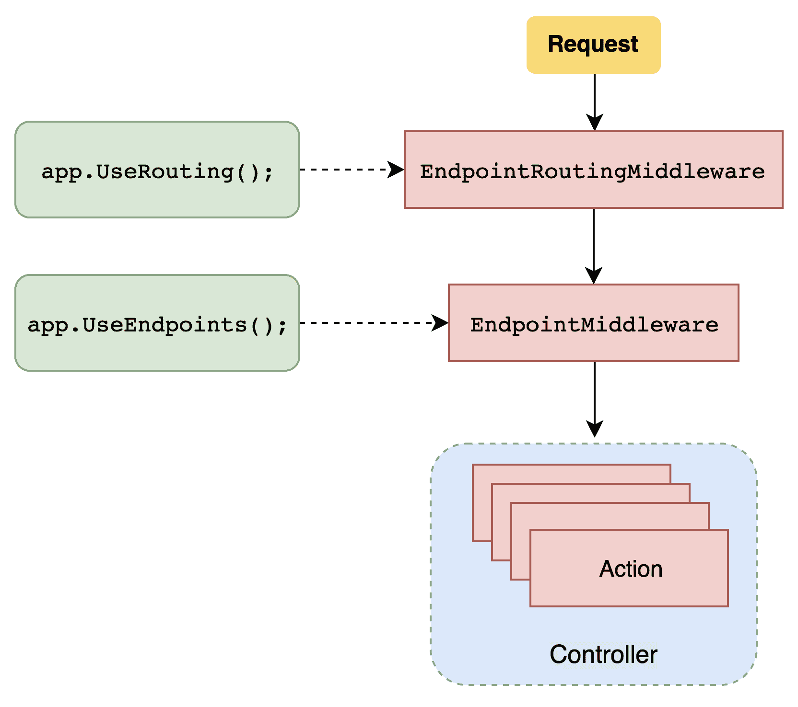

# 路由系统

本章介绍了 ASP.NET Core 的路由功能。框架的路由部分旨在提供一个完全可定制和可覆盖大多数网络服务用例的可动态路由系统。在这里，我们将了解如何使用*传统*和*属性路由*方法，然后我们将深入研究使用路由约束来匹配复杂规则和提供更高定制的使用方法。

在本章中，我们将涵盖以下主题：

+   路由系统简要概述

+   传统路由与属性路由的比较

+   绑定路由参数

+   路由约束

+   自定义属性路由和自定义路由约束

本章涵盖的主题为 ASP.NET Core 的路由系统提供了一些基本知识，以及如何使用 ASP.NET Core 的路由引擎来覆盖我们网络服务所需的所有用例。

# 路由系统概述

ASP.NET Core 的路由系统将传入请求映射到一个*路由处理程序*。在 ASP.NET Core 中，`Startup` 类负责配置应用程序需要的路由。此外，ASP.NET Core 的路由功能是通过中间件方法实现的。让我们更详细地看看 `Startup` 类以及它是如何初始化路由系统的：

```cs
public class Startup
{
    ...

    public void Configure(IApplicationBuilder app, IWebHostEnvironment env)
    {
        app.UseRouting();
        ...
        app.UseEndpoints(endpoints =>
 {
 endpoints.MapControllers();
 });
    }
}
```

上述代码使用了两个扩展方法：`UseRouting` 和 `UseEndpoints`。这些方法是在 ASP.NET Core 的最新版本中引入的。在框架的先前版本中，路由系统是通过 `UseMvc` 扩展方法初始化的，现在已弃用。`UseRouting` 扩展方法用于定义在中间件管道中路由决策的位置。另一方面，`UseEndpoints` 扩展方法声明了有效路由的映射。例如，在前面的代码片段中，`Startup` 类使用 `MapControllers()` 扩展方法映射控制器路由并声明了 ASP.NET Core 实现的默认路由约定。

总结来说，当 `Startup` 类执行 `UseRouting` 和 `UseEndpoints` 扩展方法时，ASP.NET Core 在管道中添加了一个新的 `EndpointRoutingMiddleware` 类来标记路由点，以及 `EndpointMiddleware` 来描述我们的路由。前面的调用可以总结如下：



此外，我们还可以使用以下语法在 `Startup` 类内部定义新的*路由模板*：

```cs
...
public void Configure(IApplicationBuilder app, IWebHostEnvironment env)
{
    ...

    app.UseEndpoints(endpoints =>
    {
        endpoints.MapControllerRoute("default", "{controller}/{action}/{id?}");
    });
}
...

```

此实现创建了一个新的*路由模板*，将一个通用的路由，如`https://myhostname/mycontroller/myaction`，映射到一个名为`MyController`的控制器和一个名为`MyAction`的操作。这种定义路由的方式被称为**传统路由**，在这种意义上，它在我们处理程序（控制器）和 URI 系统之间建立了一种约定。我们将在下一节中更详细地讨论传统路由。

# 传统路由

*传统* *路由*是 ASP.NET Core 中的默认路由方法*.* 如我们所见，这种方法使用`Startup`类中的`app.UseEndpoints`扩展方法来声明路由模板：

```cs
    app.UseEndpoints(endpoints =>
    {
        endpoints.MapControllerRoute("default", "{controller}/{action}/{id?}");
    });
```

默认情况下，ASP.NET Core 将`default` *路由模板*应用于路由引擎，将我们的 URL 的每个段映射到`controller`名称、`action`名称和`id`名称，分别对应*.* 此外，我们可以在`Startup`类中的路由构建器中添加多个路由，以在我们的应用程序中定义多个路由：

```cs
app.UseEndpoints(endpoints =>
{
    endpoints.MapControllerRoute("default", "{controller}/{action}/{id?}");

    endpoints.MapControllerRoute("order", "order/givemeorders", new { controller = "Order", action = "Get" });
});
```

在这种情况下，`https://myhostname/order/givemeorders`路由将被映射到`OrderController`的`Get`操作。我们应该注意到，我们在前面代码中定义的路由模板示例不符合 REST 架构风格。因此，它不尊重理查森成熟度模型的第 2 级，如第一章中提到的，*REST 101 和 ASP.NET Core 入门*。此外，如果我们将`default`路由模板应用于前面章节中讨论的`OrderController`，`Get`操作方法将响应以下 URI：`https://localhost/order/get`。

为了使我们的路由模板符合理查森成熟度模型，让我们引入 ASP.NET Core 提供的`Map`方法。可以使用*路由模板*映射不同的 HTTP 动词，如下所示：

```cs
app.UseEndpoints(endpoints =>
{
 endpoints.MapGet("order", context => context.Response.WriteAsync("Hi, from GET verb!"));
 endpoints.MapPost("order", context => context.Response.WriteAsync("Hi, from POST verb!"));
});
```

`MapGet`、`MapPost`、`MapPut`和`MapDelete`方法接受*路由模板*作为第一个参数和一个`RequestDelegate`方法，它提供了一种处理当前请求的`HttpContext`的方式。然而，在`RequestDelegate`中调用`OrderController`逻辑是不可能的，因为没有一种轻松访问控制器实例的方法。因此，没有简单的方法来实现符合 REST 的路由系统*。一般来说，传统路由主要设计用于提供视图和 HTML 的 Web 应用程序。一个替代方案是使用*属性路由*技术，这是在 Web 服务环境中实现控制器路由的最可靠方式。

# 属性路由

*属性路由*技术是另一种在 ASP.NET Core 中实现路由的方法。它通过使用属性以元编程方式描述路由，将路由的声明移动到控制器实现内部：

```cs
 [Route("api/order")]
     [ApiController]
     public class OrderController : ControllerBase
     {
         private readonly IOrderRepository _orderRepository;

         public OrderController(IOrderRepository orderRepository)
         {
             _orderRepository = orderRepository;

         } 
     ...
```

`Route`属性在控制器或操作中声明路由模板。路由属性是 ASP.NET Core 中 Web API 模板的默认方法。另一个需要注意的关键点是，这种做法不需要在`Startup`类中定义任何路由定义；因此，`app.MapControllers()`在没有路由参数的情况下被调用。

此外，这种方法在将每个操作方法绑定到特定路由时也提供了更多的灵活性：

```cs
    [Route("api/order")]
    [ApiController]
    public class OrderController : ControllerBase
    {
        [HttpGet]
        public IActionResult Get() {
            ...
        }

        [HttpGet("{id:guid}")]
        public IActionResult GetById(Guid id) {
            ...
        }

        [HttpPost]
        public IActionResult Post(OrderRequest request) {
            ...
        }

        [HttpPut("{id:guid}")]
        public IActionResult Put(Guid id, OrderRequest request) {
            ...
        }

        [HttpPatch("{id:guid}")]
        public IActionResult Patch(Guid id, JsonPatchDocument<Order> 
        requestOp) {
            ...
        }

        [HttpDelete("{id:guid}")]
        public IActionResult Delete(Guid id) {
            ...
        }
    }
```

前面的控制器使用 `HttpVerb` 将每个操作方法映射到特定的 HTTP 动词。此外，它还使用 `HttpVerb` 属性来定义 URI 的最后一个段，这通常包含我们目标资源的参数。

`Route("api/order")` 属性定义了一个静态路由段。ASP.NET Core 提供了一些保留占位符，即 `[controller]`、`[action]` 和 `[area]`，它们在运行时会被相应的 `controller`、`action` 或 `area` 替换。例如，我们可以通过使用 `Route("api/[controller]")` 来达到相同的结果，因为 `OrderController` 名称将替换 `[controller]` 占位符。正如我在上一章中提到的，我强烈建议您避免这种做法，因为在实际应用中，您可能仅仅通过重构控制器名称就意外地更改了 API 的路由。

接下来，让我们看看自定义属性路由。

# 自定义属性路由

ASP.NET Core 的路由引擎还提供了一种方法，让我们创建自己的路由属性。这种技术在复杂的路由系统中非常有用，因为它对于保持不同路由之间的概念顺序至关重要。一个自定义路由定义的例子如下：

```cs
using System;
using Microsoft.AspNetCore.Mvc.Routing;

namespace SampleAPI.CustomRouting
{
    public class CustomOrdersRoute : Attribute, IRouteTemplateProvider
    {
        public string Template => "api/orders";

        public int? Order { get; set; }

        public string Name => "Orders_route";
    }
}
```

该类扩展了 `Attribute` 抽象类，它将被用作属性。它实现了 `IRouteTemplateProvider` 接口以获取 *路由模板工作流程* 的属性。因此，属性的运用如下所示：

```cs
[CustomOrdersRoute]
[ApiController]
public class OrderController : ControllerBase
{
    ...
```

当我们想要实现更复杂的路由系统时，这种方法非常有用。因此，我们可以应用诸如继承等概念来提高实现的路由规则的复用性。

本节提供了对 ASP.NET Core 不同路由方法的理解：*传统路由* 和 *属性路由*。在下一节中，我们将了解如何使用框架提供的 *路由约束* 规则。

# 路由约束

*路由约束* 是 ASP.NET Core 模板路由系统的一部分。它们提供了一种方式，让我们可以匹配一个参数类型或一组值的路由，如下所示：

```cs
app.UseEndpoints(endpoints =>
{
    endpoints.MapControllerRoute("default", "{controller}/{action}/{id:guid?}");
});
```

在这个例子中，我们的路由模板将匹配所有 `https://myhostname/mycontroller/myaction` 调用以及所有呈现有效 `Guid` 作为 `id` 参数的调用，例如，`https://myhostname/mycontroller/myaction/4e10de48-9590-4531-9805-799167d58a44`。`{id:guid?}` 表达式给我们提供了关于约束的两条信息：首先，参数必须具有 `guid` 类型，其次，它使用 `?` 字符指定为可选。

```cs
app.UseEndpoints(endpoints =>
{
    endpoints.MapControllerRoute("default", "{controller}/{action}/{id:int:min(1)}");
});
```

在此情况下，我们将 `int` 约束与 `min(1)` 约束相结合。因此，我们可以覆盖大量用例和业务规则。此外，我们可以通过为接收不同类型数据的同一 URI 提供不同的操作方法来改进我们的路由匹配逻辑。值得注意的是，相同的 *路由约束* 也可以应用于属性路由部分：

```cs
    [Route("api/mycontroller")]
    [ApiController]
    public class MyControllerController : ControllerBase
    {
        [HttpGet({id:int:min(1)})]
        public IActionResult Get() {
            ...
    }
```

ASP.NET Core 提供了一组丰富的默认路由约束，可以直接使用。以下链接列出了 ASP.NET Core 的所有附加默认路由约束：[`docs.microsoft.com/en-us/aspnet/core/fundamentals/routing?view=aspnetcore-3.0#route-constraint-reference`](https://docs.microsoft.com/en-us/aspnet/core/fundamentals/routing?view=aspnetcore-3.0#route-constraint-reference)。

# 自定义约束

如果默认约束无法覆盖应用程序的所有业务规则，ASP.NET Core 提供了所有必要的组件来扩展路由约束的行为，以便您可以定义自己的规则。可以通过实现 `Microsoft.AspNetCore.Routing` 提供的 `IRouteConstraint` 接口来扩展路由约束，如下所示：

```cs
using System.Collections.Generic;
using Microsoft.AspNetCore.Http;
using Microsoft.AspNetCore.Routing;

namespace SampleAPI.CustomRouting
{
    public class CurrencyConstraint : IRouteConstraint
    {
        private static readonly IList<string> _currencies =  
            new List<string> { "EUR", "USD", "GBP" };

        public bool Match(HttpContext httpContext, IRouter route,
            string routeKey, RouteValueDictionary values,
            RouteDirection routeDirection)
        {
            return  _currencies.Contains(values[routeKey]?.ToString().ToLowerInvariant());
        }
    }
}
```

上一段代码展示了 `IRouteConstraint` 实现的示例。该接口公开了 `Match` 方法，它允许我们将传入的路由值与一组自定义值进行匹配。在这种情况下，约束匹配一组货币。为了使用 `CurrencyConstraint`，必须在 `ConfigureServices` 方法中对其进行配置：

```cs
public void ConfigureServices(IServiceCollection services)
{
   ...
    services.Configure<RouteOptions>(options => {
 options.ConstraintMap.Add("currency", typeof(CurrencyConstraint));
 });
    ...
}
```

可以使用常规语法使用自定义的 `CurrencyConstraint` 路由约束：

```cs
endpoints.MapControllerRoute("default", "{controller}/{action}/{currency}");
```

在这种情况下，`default` 路由将仅匹配使用 `CurrencyConstraint` 类中实现的逻辑的参数。因此，它将匹配 `https://localhost/controller/action/eur`、`https://localhost/controller/action/usd` 和 `https://localhost/controller/action/gbp` URI。

# 摘要

ASP.NET Core 路由系统可以扩展并用于覆盖大量用例。通常，它提供所有必要的功能。重要的是要理解，*传统路由* 通常用于 Web 应用程序，而 Web 服务路由通常是通过应用 *属性路由* 来实现的。本章介绍了如何处理这两种方法，如何使用 ASP.NET Core 提供的内置约束，以及如何实现我们自己的路由约束。在下一章中，我们将探讨如何处理 ASP.NET Core 的过滤器管道以及它们与中间件类实现的区别。
