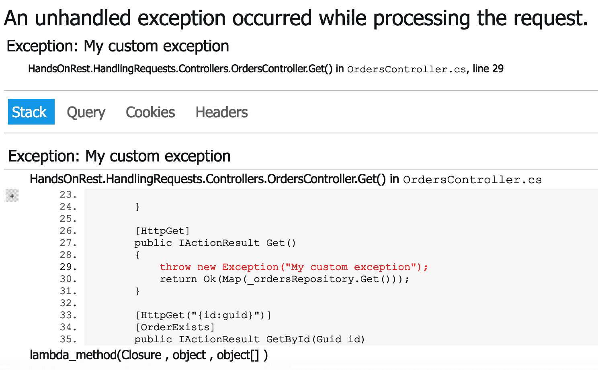

# 过滤器管道

在本章中，我们将介绍 ASP.NET Core 中的另一个重要主题：过滤器管道。过滤器是我们可以在服务中实现横切实现的一个关键组件。尽管我们已经看到了如何使用中间件管道实现横切功能，但过滤器是更专业的组件，它们与 MVC 管道相关联。因此，过滤器可以用来实现更具体的逻辑，与控制器的执行相关。本章将向您展示如何实现这些过滤器，并描述一些具体用例。

本章将涵盖以下主题：

+   ASP.NET Core 中过滤器简介

+   如何实现和应用过滤器到过滤器管道

+   过滤器的具体用例

+   如何在过滤器管道中使用解析依赖项

本章提供了有关.NET Core 中过滤器堆栈的信息以及如何使用过滤器来增强我们 Web 服务的功能。

# 过滤器简介

当我们希望在 ASP.NET Core 的 MVC 堆栈中构建*横切概念*时，过滤器非常有用。当我们需要实现如授权或缓存等功能时，它们非常有用。ASP.NET Core 提供了一些现成的过滤器类型。每个都可以在我们的服务中用于特定目的：

| **过滤器类型** | **类型描述** |
| --- | --- |
| 授权 | 这种过滤器与用户的授权相关。它是过滤器管道中执行的第一个过滤器，并且可以短路请求管道。 |
| 资源 | 资源过滤器在授权过滤器之后以及管道中的其余部分完成后立即运行。当我们需要实现缓存或性能实现时，它们非常有用。 |
| 动作 | 动作过滤器专注于动作方法的生命周期。它们拦截并更改动作方法的参数和返回结果。 |
| 异常 | 异常过滤器用于拦截并应用跨切面策略到未处理的异常。 |
| 结果 | 结果过滤器在动作结果执行之前和之后立即执行。它们通常被实现来更改结果的格式。重要的是要注意，它们仅在动作方法成功完成后才会执行。 |

重要的是要注意，过滤器在 MVC 中间件的领域中起作用，这意味着动作过滤器无法在 MVC 上下文之外操作。因此，过滤器比中间件更具体；它们可以应用于请求的子集，并且可以访问一些 MVC 组件，例如，`ModelState`。

以下图显示了不同类型的动作过滤器在请求-响应工作流程中的工作流程：


如您所见，在请求-响应管道中，不同类型的过滤器在各个阶段发挥作用。*授权过滤器*在所有其他操作之前执行，并在任何权限错误的情况下阻止请求。*资源过滤器*在请求的模型验证和模型绑定之前以及我们的请求结果从服务器返回时操作。*操作过滤器*类型在操作调用之前和之后执行。此外，如果操作抛出异常，则触发*异常过滤器*。在管道的末尾，*结果过滤器*作用于`IActionResult`最终对象实例。现在我们了解了 ASP.NET Core 提供的不同过滤器类型，我们将查看一些具体的实现示例。

# 具体过滤器实现

通常，可以通过扩展 ASP.NET Core 提供的内置类型来实现过滤器。让我们通过一个简单的自定义操作过滤器声明来了解一下：

```cs
using Microsoft.AspNetCore.Mvc.Filters;

namespace SampleAPI.Filters
{
        public class CustomActionFilter : IActionFilter
        {
            public void OnActionExecuting(ActionExecutingContext context)
            {
                // do something before the action executes
            }

            public void OnActionExecuted(ActionExecutedContext context)
            {
                // do something after the action executes
            }
        }
}
```

`CustomActionFilter`类实现了`IActionFilter`接口类型，该接口提供了两种不同的方法：

+   `OnActionExecuting`方法在操作执行之前触发。

+   `OnActionExecuted`方法在操作之后执行。

两种方法都将执行`上下文`作为回调参数，该参数提供有关*过滤器堆栈元数据*、*控制器*、*操作参数*和*路由数据*的一些有用信息。此外，`上下文`参数还提供了访问我们在前几章中查看的`HttpContext`属性。`HttpContext`提供了所有必要的属性，以便我们可以访问依赖注入服务和请求/响应数据。ASP.NET Core 大量使用异步堆栈。这意味着它还提供了一个接口，我们可以用它来实现异步过滤器。

# 异步过滤器

过滤器支持异步和同步行为。正如我们在前面的示例中所见，`CustomActionFilter`实现了两个同步方法：`OnActionExecuting`和`OnActionExecuted`。对于异步过滤器，实现方式不同：

```cs
using System.Threading.Tasks;
using Microsoft.AspNetCore.Mvc.Filters;

namespace SampleAPI.Filters
{
    public class CustomActionFilterAsync : IAsyncActionFilter
    {
        public async Task OnActionExecutionAsync(ActionExecutingContext 
         context, ActionExecutionDelegate next)
        {
            //Before 

            var resultContext = await next();

            //After
        }
    }
}
```

`CustomActionFilterAsync`实现了操作过滤器类的异步版本，即`IAsyncActionFilter`，并且只实现了一个方法，即`OnActionExecutionAsync`。这个模板与中间件实现类似；`next()`方法触发管道其余部分的执行。因此，在`await next()`语句之前执行的所有内容都在操作过滤器的执行之前执行，而在`await next()`语句之后执行的所有内容都在操作执行之后执行。重要的是要注意，框架首先搜索异步实现，然后搜索*同步*实现。

# 过滤器的作用域

过滤器根据我们在代码库中的初始化继承不同的作用域。在实践中，过滤器可能有三个不同的作用域：

+   **全局作用域**：这意味着过滤器覆盖了整个 MVC 管道。每次对特定 MVC 路由的调用都会通过该过滤器。

+   **控制器作用域**：在这种情况下，过滤器被初始化为单个或多个控制器类中的一个属性。它只会在请求被定向到目标控制器时起作用。

+   **操作作用域**：过滤器被初始化为单个或多个操作方法中的一个属性。它只会在请求被定向到目标方法时起作用。

同样重要的是要理解，根据作用域，过滤器会按照特定的顺序执行：首先，所有*全局作用域过滤器*运行，然后是*控制器作用域过滤器*，最后是*操作作用域过滤器*。在下一小节中，我们将更详细地探讨不同作用域的实现。

# 过滤器的使用

如我们之前提到的，过滤器可以有三种不同的作用域：*全局*、*控制器*和*操作*。在第一种情况下，过滤器在`Startup`类中全局应用。在其他两种情况下，过滤器以属性的形式使用，通常应用于控制器类定义或操作方法定义。让我们更详细地看看这些不同的方法。在`Startup`类中应用过滤器意味着过滤器覆盖了 MVC 管道中的所有路由，如下所示：

```cs
    public class Startup
    {
        ...

        public void ConfigureServices(IServiceCollection services)
        {
            services
                .AddControllers(config => config.Filters.Add(new 
                 CustomFilter()));
        }

        ...
    }
```

在这种情况下，`CustomFilter`具有*全局作用域*。`config.Filters`属性是一个`IFilterMetadata`接口的集合。该接口用于描述我们 MVC 管道中存在的过滤器。需要注意的是，该集合不检查重复项，这意味着我们可能潜在地添加了两个相同类型的过滤器。

由于`FilterCollection`不考虑重复项，因此在大型的代码库中，一个过滤器类型可能会意外地初始化多次，这可能会影响我们服务的性能。在分布式团队中，注意代码合并至关重要。通过使用拉取请求和举行代码审查会议，可以避免这类静默问题。

另一方面，*控制器作用域*和*操作作用域*仅限于特定的控制器或操作。在特定控制器或操作上使用过滤器的最佳方式是通过扩展过滤器属性。ASP.NET Core 提供了一些内置的过滤器属性。对于每种过滤器类型，框架提供了一个相应的类，该类提供了重写方法。例如，这是`ActionFilterAttribute`类型的情况：

```cs
using Microsoft.AspNetCore.Mvc.Filters;

namespace SampleAPI.Filters
{
        public class CustomControllerFilter : ActionFilterAttribute
        {
            public override void OnActionExecuting(ActionExecutingContext 
             context)
            {
                // do something before the action executes
            }

            public override void OnActionExecuted(ActionExecutedContext 
             context)
            {
                // do something after the action executes
            }
        }
}
```

`CustomControllerFilter`扩展了`ActionFilterAttribute`类型，它包含`OnActionExecuting`和`OnActionExecuted`方法。可以使用属性的语法将过滤器应用于特定的控制器类或操作方法：

```cs
...
     [Route("api/order")]
     [CustomControllerFilter]
     public class OrderController : ControllerBase
     { 
...
```

在底层，`ActionFilterAttribute` 是一个抽象类，并实现了之前我们提到的 `IActionFilter` 接口类型。因此，通过快速查看 `ActionFilterAttribute` 类，我们可以假设这个抽象类也提供了 `IAsyncActionFilter`、`IResultFilter` 和 `IAsyncResultFilter` 方法：

```cs
[AttributeUsage(AttributeTargets.Class | AttributeTargets.Method, AllowMultiple = true, Inherited = true)]
public abstract class ActionFilterAttribute : 
Attribute, IActionFilter, IFilterMetadata, IAsyncActionFilter, IResultFilter, IAsyncResultFilter, IOrderedFilter
{
    ...
}

```

之前的代码片段描述了 ASP.NET Core 总是提供一种简单的方法来让我们自定义和扩展框架的行为。此外，用户对框架提供的代码和接口有完全的控制权。最终，我们可以轻松创建一个自定义抽象类型，该类型实现了过滤器的自定义行为，并且可以被其他具体的过滤器类扩展。

# 生命周期和依赖注入

正如我们之前所说的，依赖注入是 ASP.NET Core 的核心技术。过滤器通常依赖于其他组件来提供过滤器逻辑。在讨论在过滤器中注入依赖项之前，我们需要了解生命周期过程。一般来说，当我们将过滤器作为属性应用时，过滤器的生命周期被限制在请求范围内，这意味着它为每个请求重新初始化。`ServiceFilter` 属性提供了对这种行为的有效替代。因此，`ServiceFilter` 属性使用 *服务提供者* 来创建过滤器对象，这意味着我们的过滤器就像通过 ASP.NET Core 的依赖注入系统声明的任何其他服务一样被管理。

例如，让我们考虑之前定义的 `CustomActionFilter` 类的实现：

```cs
using Microsoft.AspNetCore.Mvc.Filters;

namespace SampleAPI.Filters
{
        public class CustomActionFilter : IActionFilter
        {
            public void OnActionExecuting(ActionExecutingContext context)
            {
                // do something before the action executes
            }

            public void OnActionExecuted(ActionExecutedContext context)
            {
                // do something after the action executes
            }
        }
}
```

可以使用 `Startup` 类中的 `AddSingleton` 扩展方法来初始化 `CustomActionFilter` 类型：

```cs
...
public void ConfigureServices(IServiceCollection services)
{
    services
        .AddSingleton<IOrderRepository, MemoryOrderRepository>()
        .AddSingleton<CustomActionFilter>()
 ...
}
...
```

然后，我们可以在我们的控制器或操作方法中使用它，如下所示：

```cs
...
[ServiceFilter(typeof(CustomActionFilter))]
public class OrderController : ControllerBase
{
...

```

这种方法通过在 *服务提供者* 中显式定义生命周期类型来保证我们覆盖了过滤器的生命周期。因此，过滤器管道是通过 ASP.NET Core 的依赖注入引擎进行集成和初始化的。此外，还可以使用依赖注入引擎解析过滤器依赖项。与过滤器相关的有两种注入技术：

+   使用 `ServiceFilter` 技术方法

+   使用 `TypeFilterAttribute` 技术方法

正如我们之前所看到的，`ServiceFilter` 类型将过滤器实例添加到服务提供者中。可以通过将其添加到构造函数中来将依赖项注入到过滤器中。我们可以通过 *构造函数注入* 来实现这一点：

```cs
using Microsoft.AspNetCore.Mvc.Filters;
using Microsoft.Extensions.Logging;

namespace SampleAPI.Filters
{
    public class CustomActionFilter: IActionFilter
    {
        private readonly ILogger _logger;

        public CustomActionFilter(ILogger logger)
        {
            _logger = logger;
        }

        public void OnActionExecuting(ActionExecutingContext context)
        {
            _logger.LogInformation("Logging OnActionExecuting");
        }

        public void OnActionExecuted(ActionExecutedContext context)
        {
            _logger.LogInformation("Logging OnActionExecuted");
        }
}
```

之前的代码将 `ILogger` 接口注入到构造函数中，并使用暴露的 `LogInformation` 扩展方法。也可以通过使用 `TypeFilterAttribute` 并通过类型而不是实例来引用我们的过滤器来不通过 *服务提供者* 传递。我们通过声明另一个扩展 `TypeFilterAttribute` 的类来实现这一点，该类将我们的过滤器类型传递给基类：

```cs
public class CustomActionFilterAttribute : TypeFilterAttribute
{
    public CustomActionFilterAttribute() : base(typeof(CustomActionFilter))
    {
    }
}
```

然后将属性应用到目标控制器：

```cs
...
[CustomActionFilterAttribute]
public class OrderController : ControllerBase
{
...

```

`CustomActionFilterAttribute`类扩展了`TypeFilterAttribute`基类，并通过引用`CustomActionFilter`类型调用基构造函数。这种方法增强了依赖于其他类的过滤器属性的可用性。现在，我们已经完全理解了过滤器，并知道如何将它们应用到过滤器管道中，我们可以看看一些具体用例。

# 过滤器用例

本节将展示一些过滤器的具体用例。一般来说，每次您需要在动作或控制器中复制行为时，您都可以使用过滤器来集中逻辑。过滤器还提供了一种声明式方法，这有助于我们保持代码的整洁和可读性。

# 现有实体约束

控制器的动作方法通常对传入的数据执行约束。一种常见的做法是将这种逻辑集中到过滤器中。以我们在上一章中讨论的`OrderController`为例：

```cs
using System;
using System.Collections.Generic;
using System.Linq;
using Microsoft.AspNetCore.JsonPatch;
using Microsoft.AspNetCore.Mvc;
using SampleAPI.Filters;
using SampleAPI.Models;
using SampleAPI.Repositories;
using SampleAPI.Requests;

namespace SampleAPI.Controllers
{
    [Route("api/order")]
    [ApiController]
    public class OrderController : ControllerBase
    {
        private readonly IOrderRepository _orderRepository;

        public OrderController(IOrderRepository ordersRepository)
        {
            _orderRepository = ordersRepository;
        }

        ...

        [HttpPut("{id:guid}")]
        [OrderExists]
        public IActionResult Put(Guid id, OrderRequest request)
        {
            if (request.ItemsIds == null)
            {
                return BadRequest();
            }

            var order = _orderRepository.Get(id);

 if (order == null)
 {
 return NotFound(new { Message = $"Item with id {id} 
                 not exist." });
 }

            order = Map(request, order);

            _orderRepository.Update(id, order);
            return Ok();
        }

        [HttpPatch("{id:guid}")]
        [OrderExists]
        public IActionResult Patch(Guid id, JsonPatchDocument<Order> 
         requestOp)
        {
            var order = _orderRepository.Get(id);

 if (order == null)
 {
 return NotFound(new { Message = $"Item with id {id} not 
                 exist." });
 }

            requestOp.ApplyTo(order);
            _orderRepository.Update(id, order);

            return Ok();
        }

        [HttpDelete("{id:guid}")]
        [OrderExists]
        public IActionResult Delete(Guid id)
        {
            var order = _orderRepository.Get(id);

 if (order == null)
 {
 return NotFound(new { Message = $"Item with id {id} not 
                 exist." });
 }

            _orderRepository.Delete(id);
            return NoContent();
        }

        ...
    }
}
```

五个动作方法中有三个通过调用`_orderRepository`执行相同的*存在检查*：

```cs
var order = _orderRepository.Get(id);

 if (order == null)
 {
   return NotFound(new { Message = $"Item with id {id} not exist." });
 }
```

一种推荐的做法是将这种逻辑提取出来并放在其他地方，可能是一个动作过滤器，这样它就可以在动作方法中使用。它足够具体，只有在必要时才使用。让我们首先设置我们的过滤器并添加`IOrderRepository`的依赖项：

```cs
using System.Threading.Tasks;
using Microsoft.AspNetCore.Mvc;
using Microsoft.AspNetCore.Mvc.Filters;
using SampleAPI.Repositories;

namespace SampleAPI.Filters
{
    public class OrderExistsAttribute : TypeFilterAttribute
    {
        public OrderExistsAttribute() : base(typeof
            (OrderExistsFilterImpl)) { }

        private class OrderExistsFilterImpl : IAsyncActionFilter
        {
            private readonly IOrderRepository _orderRepository;

            public OrderExistsFilterImpl(IOrderRepository orderRepository)
            {
                _orderRepository = orderRepository;
            }

            public async Task OnActionExecutionAsync(ActionExecutingContext 
            context, ActionExecutionDelegate next)
            {
                ...
            }
        }
    }
}
```

`OrderExistsFilterImpl`类为动作过滤器提供了基本设置。它接受`IOrderRepository`作为依赖项并实现`OnActionExecutionAsync`。这个实现类包含在一个实现`TypeFilterAttribute`的属性类中。

在声明属性类之后，我们可以通过实现逻辑来继续。`OrderExistsAttribute`有三个目的：

+   检查传入的请求是否包含`id`

+   检查请求的`id`是否为`Guid`

+   查询`IOrderRepository`以检查实体是否存在

让我们继续描述之前逻辑的可能实现：

```cs
using System;
using System.Threading.Tasks;
using Microsoft.AspNetCore.Mvc;
using Microsoft.AspNetCore.Mvc.Filters;
using SampleAPI.Repositories;

namespace SampleAPI.Filters
{
    public class OrderExistsAttribute : TypeFilterAttribute
    {
        public OrderExistsAttribute() : base(typeof(OrderExistsFilterImpl))
        {
        }

        private class OrderExistsFilterImpl : IAsyncActionFilter
        {
            private readonly IOrderRepository _orderRepository;

            public OrderExistsFilterImpl(IOrderRepository orderRepository)
            {
                _orderRepository = orderRepository;
            }

            public async Task OnActionExecutionAsync(ActionExecutingContext 
            context, ActionExecutionDelegate next)
            {
                if (!context.ActionArguments.ContainsKey("id"))
 {
 context.Result = new BadRequestResult();
 return;
 }

                if (!(context.ActionArguments["id"] is Guid id))
                {
                    context.Result = new BadRequestResult();
                    return;
                }

               var result = _orderRepository.Get(id);

                if (result == null)
                {
                    context.Result = 
                     new NotFoundObjectResult(
                     new {Message = $"Item with id {id} not exist."});
                    return;
                }

                await next();
            }
        }
    }
} 
```

首先，代码通过使用`!context.ActionArguments.ContainsKey("id")`语句检查我们的动作参数（由模型绑定填充）是否包含任何键。如果检查结果为假，动作过滤器通过向响应中添加`BadRequestResult`并退出方法来中断管道。其次，代码使用`!(context.ActionArguments["id"] is Guid id)`检查请求的`id`是否为`Guid`。在这种情况下，如果条件失败，它返回一个`BadRequestResult`并中断管道。最后，动作过滤器调用`IOrderRepository`并检查请求的实体是否存在。如果测试结果为正，它通过调用`await next();`方法继续管道；否则，它返回一个`BadRequestResult`。

总之，我们可以在执行实际检查的方法上添加我们的属性，并删除之前在每个动作方法中复制的代码：

```cs
[Route("api/order")]
[ApiController]
public class OrderController : ControllerBase
{
    ...

    [HttpGet("{id:guid}")]
    [OrderExists]
    public IActionResult GetById(Guid id) { ... }

    [HttpPut("{id:guid}")]
    [OrderExists]
    public IActionResult Put(Guid id, UpdateOrderRequest request) { ... }

    [HttpPatch("{id:guid}")]
    [OrderExists]
    public IActionResult Patch(Guid id, JsonPatchDocument<Order> requestOp) 
    { ... }

    [HttpDelete("{id:guid}")]
    [OrderExists]
    public IActionResult Delete(Guid id) { ... }

    ...
}
```

这种方法符合*DRY 原则*。此外，我们可以重用过滤器，并在一个独特的入口点处理逻辑。

在 ASP.NET Core 2.1 之前，同样的方法被用来检查模型是否有效。而不是在每个操作中复制`Model.IsValid` *检查*，逻辑被集中在一个操作过滤器中。随着内置的`ApiController`属性的引入，约束现在已成为隐式约束。

接下来，让我们看看如何修改异常。

# 修改异常

过滤器的另一个常见用途是改变特定请求的响应。在这些情况下，过滤器很方便，因为它们只能应用于特定的操作方法。一些服务需要向客户端返回自定义格式，例如，当它们被一个只接受特定格式的旧系统使用时，或者当它们需要提供一个被特定信封包装的响应时。ASP.NET Core 提供了`IExceptionFilter`接口来实现这一点，它允许我们重载异常并向客户端发送自定义响应。

此外，如果抛出异常，根据环境的不同，会有两种不同的行为。如果 API 触发异常并且它正在开发环境中运行，它将返回一个当前详细的异常页面，如下所示：



如果我们处于*生产环境*，它仅仅返回一个通用的`500 Internal Server Error`。这两种行为默认由 ASP.NET Core 的 Web API 模板定义：

```cs
public class Startup
{
    ....
    public void Configure(IApplicationBuilder app, IWebHostEnvironment env)
    {
        if (env.IsDevelopment())
 app.UseDeveloperExceptionPage();
 else
            app.UseHsts();

       ...
    }

```

在实际应用中，通常需要向客户端提供详细信息，从而确保服务器和客户端之间可靠的通信。

在实际应用中，错误是服务的重要组成部分。在某些情况下，公司会制定内部错误代码定义，以便它们可以构建更灵活的 API，更好地处理错误，并在彼此之间建立弹性的通信。

要实现自定义异常，我们应该扩展`IExceptionFilter`接口。以下代码是这种实现的可能示例：

```cs
using System.Net;
using Microsoft.AspNetCore.Hosting;
using Microsoft.AspNetCore.Mvc;
using Microsoft.AspNetCore.Mvc.Filters;
using Microsoft.Extensions.Hosting;
using Microsoft.Extensions.Logging;

namespace SampleAPI.Filters
{
    public class CustomExceptionAttribute : TypeFilterAttribute
    {
        public CustomExceptionAttribute() : base(typeof
            (HttpCustomExceptionFilterImpl))
        {
        }

        private class HttpCustomExceptionFilterImpl : IExceptionFilter
        {
            private readonly IWebHostEnvironment _env;
            private readonly ILogger<HttpCustomExceptionFilterImpl> 
             _logger;
            public HttpCustomExceptionFilterImpl(IWebHostEnvironment env,    
              ILogger<HttpCustomExceptionFilterImpl> logger)
            {
                _env = env;
                _logger = logger;
            }

            public void OnException(ExceptionContext context)
            {
                _logger.LogError(new EventId(context.Exception.HResult),
                    context.Exception,
                    context.Exception.Message);

                var json = new JsonErrorPayload
                {
                    Messages = new[] {"An error occurred. Try it again."}
                };

                if (_env.IsDevelopment())
                {
                    json.DetailedMessage = context.Exception;
                }

                var exceptionObject = new ObjectResult(json) 
                {StatusCode = 500};

                context.Result = exceptionObject;
                context.HttpContext.Response.StatusCode = 
                 (int) HttpStatusCode.InternalServerError;
            }
        }
    }

    public class JsonErrorPayload
    {
        public string[] Messages { get; set; }

        public object DetailedMessage { get; set; }
    }
}
```

每次抛出异常时，框架都会调用`HttpCustomExceptionFilterImpl`类。该类有两个依赖项：`ILogger`和`IWebHostEnvironment`。`OnException`方法使用`ILogger`类记录异常，并创建一个新的`JsonErrorPayload`实例，其中包含一个通用消息和一些关于异常的详细信息。最后，`OnException`方法返回`500 Internal server error`状态码，以及刚刚创建的`exceptionObject`。

详细异常消息可能具有一些价值，这取决于`IWebHostEvinronment`。这种在生产环境中避免泄露关于服务敏感信息的方法是有用的。

总之，如果我们的服务抛出异常，我们的`IExceptionFilter`将其转换成一个新的 JSON 响应：

```cs
{
    "messages": [
        "An error occurred. Try it again."
    ],
    "detailedMessage": {
        "ClassName": "System.Exception",
        "Message": "My custom exception",
        "Data": null,
        "InnerException": null,
        "HelpURL": null,
        "StackTraceString": " at 
         Sample.API.Filters.Controllers.OrderController.Get() in               
         /Projects/Sample.API.Filters/
         Controllers/OrderController.cs:line 30\n at 
         lambda_method(Closure , Object , Object[] )\n ",
        "RemoteStackTraceString": null,
        "RemoteStackIndex": 0,
        "ExceptionMethod": null,
        "HResult": -2146233088,
        "Source": "HandsOn.API.Filters",
        "WatsonBuckets": null
    }
}

```

# 摘要

在本章中，我们探讨了 ASP.NET Core 中的一些过滤器概念。我们介绍了不同类型的过滤器，它们的工作方式以及每种类型在 MVC 管道中的具体用途。我们还看到了如何实现过滤器，并探讨了某些具体用例，以理解和发现过滤器的强大功能，以便我们能够实现横切关注点。

下一章将专注于 ASP.NET Core 中的数据访问层方法。您将了解到仓储模式，它将描述使用 EF Core 和 Dapper 实现数据访问层的方法。此外，我们还将描述一些测试技术，这些技术用于验证 ASP.NET Core 应用程序的数据访问层部分。
