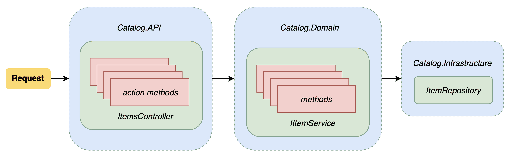
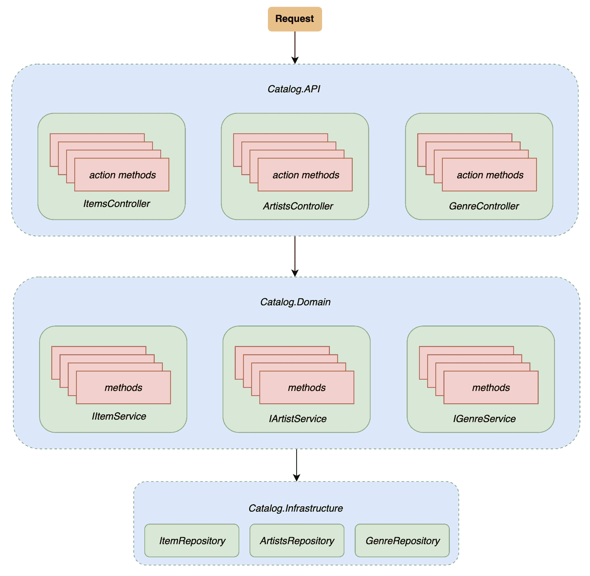

# 实现 RESTful HTTP 层

在上一章中，我们学习了如何在 `Catalog.Domain` 项目中处理我们网络服务的逻辑。本章将向您介绍网络服务的 HTTP 部分，以及 `Catalog.API` 项目中的所有组件。

我们还将演示如何实现和测试网络服务的控制器部分。到本章结束时，您将能够使用 ASP.NET Core 实现、测试和验证 HTTP 路由。我们将涵盖以下主题：

+   实现服务的 HTTP 层

+   使用 ASP.NET Core 提供的工具进行测试

+   提高 HTTP 层的弹性

本章中展示的代码可以从以下 GitHub 仓库获取：[`github.com/PacktPublishing/Hands-On-RESTful-Web-Services-with-ASP.NET-Core-3`](https://github.com/PacktPublishing/Hands-On-RESTful-Web-Services-with-ASP.NET-Core-3).

# 实现项目控制器

本节重点介绍构建读取、写入目录数据和使用 HTTP 协议公开我们在领域层中已构建的功能的路线。我们的控制器将包括以下路由表中列出的动词：

| **动词** | **路径** | **描述** |
| --- | --- | --- |
| `GET` | `/api/items` | 获取我们目录中存在的所有项目 |
| `GET` | `/api/items/{id}` | 获取具有相应 ID 的项目 |
| `POST` | `/api/items/` | 通过请求体有效载荷创建一个新的项目 |
| `PUT` | `/api/items/{id}` | 更新具有相应 ID 的项目 |

上述路由允许网络服务消费者获取、添加和更新 `Item` 实体。在开始实现之前，让我们看一下我们将要实现的解决方案架构概述：



在 第八章，*构建数据访问层* 和 第九章，*实现领域逻辑* 中，我们分别实现了并测试了 `Catalog.Infrastructure` 和 `Catalog.Domain` 项目。本章重点介绍 `Catalog.API` 项目。我们将构建并测试将调用在 `Catalog.Domain` 项目中构建的服务层的动作方法。让我们首先在 `Catalog.API` 项目的 `Controllers` 文件夹中定义一个新的控制器，命名为 `ItemController`：

```cs
using Microsoft.AspNetCore.Mvc;

namespace Catalog.API.Controllers
{
    [Route("api/items")]
    [ApiController]
    public class ItemController : ControllerBase
    {
    }
}
```

`ItemController` 类将反映我们之前定义的路由。我们应该注意，我们使用 `Route` 和 `ApiController` 属性装饰了控制器类：第一个指定了控制器的基 URL，第二个为动作方法产生的响应类型提供了一些实用工具和约定。控制器还将使用 `IItemService` 接口来查询和写入我们的数据源。我们可以通过构造函数注入将 `IItemService` 接口用于 `ItemController` 类：

```cs
using Catalog.Domain.Services;
using Microsoft.AspNetCore.Mvc;

namespace Catalog.API.Controllers
{
    [Route("api/items")]
    [ApiController]
    public class ItemController : ControllerBase
    {
        private readonly IItemService _itemService;

        public ItemController(IItemService itemService)
        {
            _itemService = itemService;
        }
    }
}
```

之前的代码使用依赖注入将 `IItemService` 类添加为 `ItemController` 类的依赖项。一旦我们添加了 `IItemService` 接口，我们就可以通过实现控制器中的操作方法来继续进行。

# 实现操作方法

我们已经在 第五章 中处理了操作方法，*ASP.NET Core 中的网络服务堆栈*。在以下实现中，我们将在操作方法中使用 `IItemService` 接口，如下所示：*

```cs
using System;
using System.Threading.Tasks;
using Catalog.Domain.Requests.Item;
using Catalog.Domain.Services;
using Microsoft.AspNetCore.Mvc;

namespace Catalog.API.Controllers
{
    [Route("api/items")]
    [ApiController]
    public class ItemController : ControllerBase
    {
        private readonly IItemService _itemService;

        public ItemController(IItemService itemService)
        {
            _itemService = itemService;
        }
        [HttpGet]
        public async Task<IActionResult> Get()
        {
            var result = await _itemService.GetItemsAsync();
            return Ok(result);
        }

        [HttpGet("{id:guid}")]
        public async Task<IActionResult> GetById(Guid id)
        {
            var result = await _itemService.GetItemAsync(new GetItemRequest 
             { Id = id });
            return Ok(result);
        }
    }
}
```

`Get` 和 `GetById` 操作方法通过引用 `IItemService` 接口并调用底层服务层（在这种情况下是 `IItemService` 接口）的 `GetItemsAsync` 和 `GetItemAsync` 方法来执行读取操作。让我们继续使用相同的方法来实现控制器的 `Post` 和 `Put` 操作方法：

```cs
using System;
using System.Threading.Tasks;
using Catalog.Domain.Requests.Item;
using Catalog.Domain.Services;
using Microsoft.AspNetCore.Mvc;

namespace Catalog.API.Controllers
{
    [Route("api/items")]
    [ApiController]
    public class ItemController : ControllerBase
    {
        ...
        [HttpPost]
        public async Task<IActionResult> Post(AddItemRequest request)
        {
            var result = await _itemService.AddItemAsync(request);
            return CreatedAtAction(nameof(GetById), new { id = result.Id }, 
             null);
        }

        [HttpPut("{id:guid}")]
        public async Task<IActionResult> Put(Guid id, EditItemRequest 
         request)
        {
            request.Id = id;
            var result = await _itemService.EditItemAsync(request);

            return Ok(result);
        }
    }
}
```

`Post` 和 `Put` 动作分别使用 `AddItemRequest` 和 `EditItemRequest` 来绑定来自 HTTP 请求的数据，并通过 `IItemService` 接口传递。在底层，`IItemService` 实现引用 `IItemMapper` 来从请求类型获取实体，并通过 `IItemRepository` 实现发送。借助依赖注入，我们可以轻松地将不同组件之间的依赖解耦。我们还应该注意，`Post` 操作方法使用 `ControllerBase` 提供的 `CreatedAtAction()` 方法来检索创建资源的位置作为响应的一部分。一旦我们将 `IItemService` API 绑定到 `ItemController` 操作方法中，我们就可以继续测试实现。

# 使用 WebApplicationFactory<T> 类测试控制器

ASP.NET Core 框架提供了一个使用 `WebApplicationFactory<T>` 类执行 *集成测试* 的方法。这个类允许我们创建一个新的 `TestServer`，它在一个单独的进程中模拟真实的 HTTP 服务器。因此，我们可以通过调用由工厂提供的 `HttpClient` 实例来测试我们的 `ItemController`。需要注意的是，`WebApplicationFactory` 是一个泛型类，它接受一个 `TEntryPoint` 类型，这由我们的网络服务的 `Startup` 类表示。在继续实现测试类之前，让我们在 `tests` 文件夹中创建一个新的项目，该项目将包含与 `Catalog.API` 项目相关的所有测试。因此，我们可以在 `tests` 文件夹中执行以下命令：

```cs
dotnet new xunit -n Catalog.API.Tests
cd Catalog.API.Tests dotnet add reference ../Catalog.Fixtures
dotnet add reference ../../src/Catalog.API
dotnet sln ../../Catalog.API.sln add .
```

之前的命令在解决方案的 `tests` 文件夹中添加了一个新的 `Catalog.API.Tests` 项目，它引用了 `Catalog.Fixtures` 和 `Catalog.API` 项目。该项目包含在项目的解决方案文件中。下一节将描述如何扩展 `WebApplicationFactory` 类以支持执行网络服务。

# 扩展 WebApplicationFactory

`WebApplicationFactory`类公开了用于配置`TestServer`实例和为我们的控制器创建适当测试固定值的属性和方法。此外，可以通过覆盖`ConfigureWebHost`方法并替换`Catalog.API`项目原始`Startup`类中声明的*依赖注入服务*的行为来扩展`WebApplicationFactory`。`WebApplicationFactory`类是`Microsoft.AspNetCore.Mvc.Testing`包的一部分；因此，有必要通过在项目的测试文件夹中运行以下命令将 NuGet 包添加到`Catalog.Fixture`项目和`Catalog.API.Tests`项目：

```cs
dotnet add Catalog.Fixtures package Microsoft.AspNetCore.Mvc.Testing
dotnet add Catalog.API.Tests package Microsoft.AspNetCore.Mvc.Testing
```

让我们继续在`Catalog.Fixtures`项目中创建一个新的`InMemoryWebApplicationFactory`类。该类将由测试类用于实例化一个新的`TestServer`对象。因此，下一步是创建一个新的`InMemoryWebApplicationFactory`类，它扩展了`WebApplicationFactory`基类并覆盖了`ConfigureWebHost`方法以注入自定义的*内存*数据库提供程序：

```cs
using System;
using Catalog.Infrastructure;
using Microsoft.AspNetCore.Hosting;
using Microsoft.AspNetCore.Mvc.Testing;
using Microsoft.AspNetCore.TestHost;
using Microsoft.EntityFrameworkCore;
using Microsoft.Extensions.DependencyInjection;

namespace Catalog.Fixtures
{
    public class InMemoryApplicationFactory<TStartup>
        : WebApplicationFactory<TStartup> where TStartup : class
    {
        protected override void ConfigureWebHost(IWebHostBuilder builder)
        {
            builder
                .UseEnvironment("Testing")
                .ConfigureTestServices(services =>
                {
                    var options = new 
                     DbContextOptionsBuilder<CatalogContext>()
                        .UseInMemoryDatabase(Guid.NewGuid().ToString())
                        .Options;

                    services.AddScoped<CatalogContext>(serviceProvider => 
                     new TestCatalogContext(options));

                    var sp = services.BuildServiceProvider();

                    using var scope = sp.CreateScope();

                    var scopedServices = scope.ServiceProvider;
                    var db = scopedServices.GetRequiredService
                     <CatalogContext>();
                    db.Database.EnsureCreated();
                });
        }
    }
}
```

之前的`InMemoryApplicationFactory`类实现了`ConfigureWebHost`方法，并使用`UseInMemoryDatabase`扩展方法初始化内存数据库。它还在使用依赖注入注册的`CatalogContext`服务中插入`TestCatalogContext`类的新实例。因此，测试将使用我们在`Catalog.Infrastructure.Tests`和`Catalog.Domain.Tests`项目中实现的测试用例所使用的相同内存数据库基础设施。

此外，`InMemoryApplicationFactory`实现创建了一个新作用域，该作用域将用于执行`EnsureCreated`方法。因此，每个新的`InMemoryApplicationFactory`实例将生成来自相同数据快照的数据库。

最后，整个实现都在`ConfigureTestServices`方法中执行，该方法提供了一种覆盖`Catalog.API`项目`Startup`类中定义的依赖注入服务的方法。

如第八章中所述，*构建数据访问层*，内存数据库并不总是首选的替代方案，有两个原因。首先，它不能反映具有真实数据约束的真实关系数据库。其次，当多个测试方法使用相同的实例时，处理内存数据库很棘手，因为它们可能会生成不一致的数据。因此，我们为每个测试类创建一个新的实例，使用`UseInMemoryDatabase(Guid.NewGuid().ToString());`语句。`Guid.NewGuid()`指令保证了实例之间的唯一性。在实际应用中，另一种常见的方法是创建一个临时数据源的新实例，并在每次测试后重新创建它。

# 测试控制器

一旦我们实现了 `InMemoryApplicationFactory` 类，就可以通过在测试类中实现 `IClassFixture` 接口来利用它。因此，让我们首先在 `Catalog.API.Tests` 项目中初始化一个新的 `ItemControllerTests` 类：

```cs
using System.Net.Http;
using System.Text;
using System.Threading.Tasks;
using Newtonsoft.Json;
using Shouldly;
using Catalog.Domain.Infrastructure.Entities;
using Catalog.Fixtures;
using Xunit;

namespace Catalog.API.Tests.Controllers
{
    public class ItemControllerTests : IClassFixture<InMemoryApplicationFactory<Startup>>
    {
        private readonly InMemoryApplicationFactory<Startup> _factory;
        public ItemControllerTests(InMemoryApplicationFactory<Startup> 
         factory)
        {
            _factory = factory;
        }
        ....
    }
}
```

`ItemControllerTests` 类为操作方法提供了显著的测试覆盖率。首先，测试类实现了由 `xUnit.Sdk` 包提供的通用 `IClassFixture` 接口。`IClassFixture` 接口引用了之前定义的 `InMemoryApplicationFactory<Startup>`，并将 `factory` 类的新实例注入到测试类的构造函数中。因此，对于每个执行的测试类，都将提供一个 `factory` 的新实例。

让我们看看覆盖 `ItemController` 获取操作的测试方法：

```cs
..
[Theory]
[InlineData("/api/items/")]
public async Task get_should_return_success(string url)

{
    var client = _factory.CreateClient();
    var response = await client.GetAsync(url);

    response.EnsureSuccessStatusCode();
}

[Fact]
public async Task get_by_id_should_return_item_data()
{
    const string id = "86bff4f7-05a7-46b6-ba73-d43e2c45840f";
    var client = _factory.CreateClient();
    var response = await client.GetAsync($"/api/items/{id}");

    response.EnsureSuccessStatusCode();
    var responseContent = await response.Content.ReadAsStringAsync();
    var responseEntity = JsonConvert.
     DeserializeObject<Item>(responseContent);

    responseEntity.ShouldNotBeNull();
}
```

之前实现的代码使用了由 `InMemoryApplicationFactory<Startup>` 提供的 `CreateClient` 方法来初始化一个新的 `HttpClient` 实例。因此，如果我们以 `get_by_id_should_return_item_data` 方法为例，它使用客户端调用 `/api/items/{id}` 路由，并检查返回的信息不是 `null`。我们可以通过向 `ItemControllerTests` 类中添加以下测试方法来继续测试添加项目操作：

```cs
[Fact]
public async Task add_should_create_new_record()
{
    var request = new AddItemRequest
    {
        Name = "Test album",
        Description = "Description",
        LabelName = "Label name",
        Price = new Price { Amount = 13, Currency = "EUR" },
        PictureUri = "https://mycdn.com/pictures/32423423",
        ReleaseDate = DateTimeOffset.Now,
        AvailableStock = 6,
        GenreId = new Guid("c04f05c0-f6ad-44d1-a400-3375bfb5dfd6"),
        ArtistId = new Guid("f08a333d-30db-4dd1-b8ba-3b0473c7cdab")
    };

    var client = _factory.CreateClient();

    var httpContent = new StringContent(JsonConvert.SerializeObject(request), Encoding.UTF8, "application/json");
    var response = await client.PostAsync($"/api/items", httpContent);

    response.EnsureSuccessStatusCode();
    response.Headers.Location.ShouldNotBeNull();
}
```

因此，我们可以为控制器中实现的 `Put` 操作方法选择类似的方法：

```cs
[Fact]
public async Task update_should_modify_existing_item()
{
    var client = _factory.CreateClient();

    var request = new EditItemRequest
    {
        Id = new Guid("b5b05534-9263-448c-a69e-0bbd8b3eb90e"),
        Name = "Test album",
        Description = "Description updated",
        LabelName = "Label name",
        Price = new Price { Amount = 50, Currency = "EUR" },
        PictureUri = "https://mycdn.com/pictures/32423423",
        ReleaseDate = DateTimeOffset.Now,
        AvailableStock = 6,
        GenreId = new Guid("c04f05c0-f6ad-44d1-a400-3375bfb5dfd6"),
        ArtistId = new Guid("f08a333d-30db-4dd1-b8ba-3b0473c7cdab")
    };

    var httpContent = new StringContent(JsonConvert.SerializeObject(request), Encoding.UTF8, "application/json");
    var response = await client.PutAsync($"/api/items/{request.Id}", httpContent);

    response.EnsureSuccessStatusCode();

    var responseContent = await response.Content.ReadAsStringAsync();
    var responseEntity = JsonConvert.DeserializeObject<Item>(responseContent);

    responseEntity.Name.ShouldBe(request.Name);
    responseEntity.Description.ShouldBe(request.Description);
    responseEntity.GenreId.ShouldBe(request.GenreId);
    responseEntity.ArtistId.ShouldBe(request.ArtistId);
}
```

`add_should_create_new_record` 测试方法和 `update_should_modify_existing_item` 方法采用了相应的策略来测试 `Post` 和 `Put` 请求以及相应的操作方法。在这种情况下，我们使用了为 `ItemServiceTests` 和 `ItemRepositoryTests` 类定义的相同请求对象。

我们可以通过在解决方案文件夹中运行 `dotnet test` 命令或使用我们首选 IDE 的测试运行器来执行之前实现的测试。在接下来的下一小节中，我们将探讨如何优化请求的初始化并在一个独特的点保持测试数据。

使用 `IClassFixture` 意味着相同的 `InMemoryApplicationFactory` 实例将由所有测试方法共享。因此，每个测试方法将具有相同的基本数据。如果我们想完全隔离测试，我们可以避免使用类固定装置，并在测试类的构造函数中初始化一个新的 `InMemoryApplicationFactory` 实例：

```cs
 public class ItemControllerTests
    {
        private readonly InMemoryApplicationFactory<Startup> _factory;

        public ItemControllerTests()
        {
            _factory = new InMemoryApplicationFactory<Startup>();
        }
        ....
    }
```

这种方法还保证了测试类中每个测试方法之间的隔离。此外，构造函数将在每次调用时提供一个新实例。

接下来，让我们看看如何使用 xUnit 数据属性来加载测试数据。

# 使用 xUnit 数据属性加载测试数据

*xUnit* 框架是测试 .NET 应用程序和服务的首选选择。该框架还提供了一些工具来扩展其功能并实现更易于维护的测试代码。可以扩展 `xUnit.Sdk` 命名空间公开的 `DataAttribute` 类以在属性内部执行自定义操作。例如，假设我们创建了一个新的自定义 `DataAttribute` 来从文件中加载测试数据，如下所示：

```cs

namespace Catalog.API.Tests.Controllers
{
    public class ItemControllerTests : IClassFixture<InMemoryApplicationFactory<Startup>>
    {
       ...

        [Theory]
        [LoadData( "item")]
        public async Task get_by_id_should_return_right_data(Item request)
        {
            var client = _factory.CreateClient();
            var response = await client.GetAsync($"/api/items/{request.Id}");

            response.EnsureSuccessStatusCode();

            var responseContent = 
             await response.Content.ReadAsStringAsync();
            var responseEntity = JsonConvert.DeserializeObject
             <ItemResponse>(responseContent);

            responseEntity.Name.ShouldBe(request.Name);
            responseEntity.Description.ShouldBe(request.Description);
            responseEntity.Price.Amount.ShouldBe(request.Price.Amount);
            responseEntity.Price.Currency.ShouldBe(request.Price.Currency);
            responseEntity.Format.ShouldBe(request.Format);
            responseEntity.PictureUri.ShouldBe(request.PictureUri);
            responseEntity.GenreId.ShouldBe(request.GenreId);
            responseEntity.ArtistId.ShouldBe(request.ArtistId);
        }

        ...
    }
}
```

在这种情况下，实现使用 `LoadData` 属性装饰测试方法，该属性从文件中读取一个 `item` 部分。因此，我们将有一个包含所有测试记录的 JSON 文件，我们将使用 `LoadData` 属性加载其中之一。为了为 `ItemControllerTests` 类自定义行为，我们应该创建一个新的类并扩展由 xUnit 提供的 `DataAttribute` 类：

```cs
using System;
using System.Collections.Generic;
using System.IO;
using System.Linq;
using System.Reflection;
using Newtonsoft.Json;
using Newtonsoft.Json.Linq;
using Xunit.Sdk;

namespace Catalog.Fixtures
{
    public class LoadDataAttribute : DataAttribute
    {
        private readonly string _fileName;
        private readonly string _section;
        public LoadDataAttribute(string section)
        {
            _fileName = "record-data.json";
            _section = section;
        }
        public override IEnumerable<object[]> GetData(MethodInfo testMethod)
        {
            if (testMethod == null) throw new ArgumentNullException(nameof(testMethod));

            var path = Path.IsPathRooted(_fileName)
                ? _fileName
                : Path.GetRelativePath(Directory.GetCurrentDirectory(), _fileName);

            if (!File.Exists(path)) throw new ArgumentException
             ($"File not found: {path}");

            var fileData = File.ReadAllText(_fileName);

            if (string.IsNullOrEmpty(_section)) return 
             JsonConvert.DeserializeObject<List<string[]>>(fileData);

            var allData = JObject.Parse(fileData);
            var data = allData[_section];
            return new List<object[]> { new[] {              
             data.ToObject(testMethod.GetParameters()
             .First().ParameterType) } };
        }
    }
}
```

`LoadDataAttribute` 类重写了由 `DataAttribute` 类提供的 `GetData(MethodInfo testMethod);` 方法，并返回测试方法使用的数据。`GetData` 方法的实现读取由 `_filePath` 属性定义的文件内容；它尝试将文件指定的 `section` 的内容序列化为一个泛型 `object`。最后，实现调用 `ToObject` 方法将泛型 `JObject` 转换为与测试方法第一个参数关联的类型。该过程最后一步是在 `Catalog.API.Tests` 项目中创建一个新的名为 `record-data.json` 的 JSON 文件。该文件将包含我们测试使用的测试数据：

```cs
{
  "item": {
    "Id": "86bff4f7-05a7-46b6-ba73-d43e2c45840f",
    "Name": "DAMN.",
    "Description": "DAMN. by Kendrick Lamar",
    "LabelName": "TDE, Top Dawg Entertainment",
    "Price": {
      "Amount": 34.5,
      "Currency": "EUR"
    },
    "PictureUri": "https://mycdn.com/pictures/45345345",
    "ReleaseDate": "2017-01-01T00:00:00+00:00",
    "Format": "Vinyl 33g",
    "AvailableStock": 5,
    "GenreId": "c04f05c0-f6ad-44d1-a400-3375bfb5dfd6",
    "Genre": null,
    "ArtistId": "3eb00b42-a9f0-4012-841d-70ebf3ab7474",
    "Artist": null
  },
  "genre": {
    "GenreId": "c04f05c0-f6ad-44d1-a400-3375bfb5dfd6",
    "GenreDescription": "Hip-Hop"
  },
  "artist": {
    "ArtistId": "f08a333d-30db-4dd1-b8ba-3b0473c7cdab",
    "ArtistName": "Anderson Paak."
  }
}
```

JSON 片段包含以下字段：`item`、`artist` 和 `genre`。这些字段包含与测试实体相关的数据。因此，我们将使用它们将数据反序列化到请求模型和实体类型中。因此，我们可以将 `LoadData` 属性应用于以下方式的 `ItemControllerTests` 类：

```cs
using System;
using System.Net;
using System.Net.Http;
using System.Text;
using System.Threading.Tasks;
using Newtonsoft.Json;
using Shouldly;
using Catalog.Domain.Infrastructure.Entities;
using Catalog.Domain.Requests.Item;
using Catalog.Fixtures;
using Xunit;

namespace Catalog.API.Tests.Controllers
{
    public class ItemControllerTests : IClassFixture<InMemoryApplicationFactory<Startup>>
    {
        ...

        [Theory]
        [LoadData("item")]
        public async Task get_by_id_should_return_right_data(Item request){...}

        [Theory]
        [LoadData("item")]
        public async Task add_should_create_new_item(AddItemRequest request){...}

        [Theory]
        [LoadTestData("item")]
        public async Task update_should_modify_existing_item(EditItemRequest request){...}

    }
}
```

现在，测试方法接受一个 `Item`、`EditItemRequest` 或 `AddItemRequest` 类型的 `request` 参数，该参数将包含由 `record-data.json` 文件提供的数据。然后，该对象被序列化为 `request` 参数，并通过 `InMemoryApplicationFactory` 提供的 `HttpClient` 实例发送：

```cs
[Theory]
[LoadData( "item")]
public async Task add_should_create_new_record(AddItemRequest request)
{
    var client = _factory.CreateClient();

    var httpContent = new StringContent(JsonConvert.SerializeObject(request), Encoding.UTF8, "application/json");
    var response = await client.PostAsync($"/api/items", httpContent);

 response.EnsureSuccessStatusCode();
 response.Headers.Location.ShouldNotBeNull();
}

```

`LoadData` 将 `record-data.json` 文件中定义的内容序列化为 `AddItemRequest` 类型。然后，请求被序列化为 `StringContent` 并通过工厂创建的 HTTP 客户端发送。最后，该方法断言结果代码是成功的，并且 `Location` 标头不是 `null`。

我们现在可以通过在解决方案根目录中执行 `dotnet test` 命令，或者通过运行我们首选 IDE 提供的测试运行器来验证 `ItemController` 类的行为。

总结来说，现在我们能够在一个独特的中央 JSON 文件中定义测试数据。除此之外，我们还可以通过向 JSON 文件添加新的部分来添加尽可能多的数据。本节接下来的部分将专注于通过添加一些存在性检查和处理异常使用过滤器来提高 API 的弹性。

# 提高 API 的弹性

前面的章节展示了`ItemController`类的可能实现以及如何使用 ASP.NET Core 提供的工具对其进行测试。在本节中，我们将学习如何通过在`ItemController`公开的信息上执行一些*限制检查*来提高我们服务的弹性。此外，我们还将探讨如何展示验证错误以及如何分页返回的数据。本节将应用前几章中解释的概念到 Web 服务项目中。

# 存在性检查

让我们先实现一个执行请求数据存在性检查的动作过滤器。该过滤器将被用于获取或编辑单个项的动作方法。如第七章中所述的*过滤器管道*，我们将实现以下过滤器：

```cs
using System;
using System.Threading.Tasks;
using Catalog.Domain.Requests.Item;
using Catalog.Domain.Services;
using Microsoft.AspNetCore.Mvc;
using Microsoft.AspNetCore.Mvc.Filters;

namespace Catalog.API.Filters
{
    public class ItemExistsAttribute : TypeFilterAttribute
    {
        public ItemExistsAttribute() : base(typeof
            (ItemExistsFilterImpl))
        {
        }

        public class ItemExistsFilterImpl : IAsyncActionFilter
        {
            private readonly IItemService _itemService;

            public ItemExistsFilterImpl(IItemService itemService)
            {
                _itemService = itemService;
            }

            public async Task OnActionExecutionAsync(ActionExecutingContext context,
                ActionExecutionDelegate next)
            {
                if (!(context.ActionArguments["id"] is Guid id))
                {
                    context.Result = new BadRequestResult();
                    return;
                }

                var result = await _itemService.GetItemAsync(new GetItemRequest { Id = id });

                if (result == null)
                {
                    context.Result = new NotFoundObjectResult($"Item with id {id} not exist.");
                    return;
                }

                await next();
            }
        }
    }
}
```

动作过滤器在构造函数中解析`IItemService`接口，并使用注入的实例通过请求中存在的`id`验证实体的存在。如果请求包含有效的`Guid id`，并且`id`存在于我们的数据源中，`OnActionExecutionAsync`方法将通过调用`await next()`方法继续管道。否则，它将停止管道并返回一个`NotFoundObjectResult`实例。我们可以通过添加`[ItemExists]`属性来将过滤器应用于`ItemController`的动作方法：

```cs
using Catalog.API.Filters;

namespace Catalog.API.Controllers
{
    [Route("api/items")]
    [ApiController]
    public class ItemController : ControllerBase
    {
        ...

        [HttpGet("{id:guid}")]
        [ItemExists]
        public async Task<IActionResult> GetById(Guid id)
        {
           ...
        }

        [HttpPut("{id:guid}")]
        [ItemExists]
        public async Task<IActionResult> Put(Guid id, EditItemCommand request)
        {
          ...
        }
    }
}
```

在应用了`ItemExists`属性后，如果请求发送的 ID 不存在，API 将返回 404。我们还可以通过注入`IItemService`接口的模拟实例并对结果响应进行一些断言来验证在动作过滤器中实现的逻辑。在下面的测试类中，我们将使用`Moq`来验证对`next()`方法的调用。作为第一步，我们需要在项目文件夹内使用以下命令将`Moq`添加到`Catalog.API.Tests`项目中：

```cs
dotnet add package Moq
```

此外，我们可以继续定义`ItemExistsAttributeTests`类：

```cs
using System;
using System.Collections.Generic;
using System.Threading.Tasks;
using Catalog.API.Filters;
using Catalog.Domain.Requests.Item;
using Catalog.Domain.Responses;
using Catalog.Domain.Services;
using Microsoft.AspNetCore.Http;
using Microsoft.AspNetCore.Mvc;
using Microsoft.AspNetCore.Mvc.Abstractions;
using Microsoft.AspNetCore.Mvc.Filters;
using Microsoft.AspNetCore.Routing;
using Moq;
using Xunit;

namespace Catalog.API.Tests.Filters
{
    public class ItemExistsAttributeTests
    {
        [Fact]
        public async Task should_continue_pipeline_when_id_is_present()
        {
            var id = Guid.NewGuid();
            var itemService = new Mock<IItemService>();

            itemService
                .Setup(x => x.GetItemAsync(It.IsAny<GetItemRequest>()))
                .ReturnsAsync(new ItemResponse { Id = id });

            var filter = new ItemExistsAttribute.ItemExistsFilterImpl(itemService.Object);

            var actionExecutedContext = new ActionExecutingContext(
                new ActionContext(new DefaultHttpContext(), new RouteData(), new ActionDescriptor()),
                new List<IFilterMetadata>(),
                new Dictionary<string, object>
                {
                    {"id", id}
                }, new object());

            var nextCallback = new Mock<ActionExecutionDelegate>();

            await filter.OnActionExecutionAsync(actionExecutedContext, nextCallback.Object);

            nextCallback.Verify(executionDelegate => executionDelegate(), Times.Once);
        }
    }
}
```

在前面的`ItemExistsAttributeTests`类中，我们模拟了整个`IItemService`接口以模拟`GetItemAsync`方法的响应。然后，它通过注入模拟的`IItemService`接口初始化`ItemExistsAttribute`。最后，它调用由`filter`类公开的`OnActionExecutionAsync`方法，并将其与`Moq`框架提供的`Verify`方法结合使用，以检查`ItemExistsFilter`类是否正确调用了`next()`回调方法。

# JSON 自定义错误

异常的自定义和序列化是简化*错误处理*和改进 Web 服务监控的有用方法*.* 这些技术有时对于将异常传达给客户端以处理和管理错误是必要的。一般来说，虽然*HTTP 状态码*提供了关于请求状态的摘要信息，但响应内容提供了关于错误的更详细信息。

使用过滤器扩展错误处理行为是可能的。首先，让我们创建一个新的标准模型来表示错误结果：

```cs
namespace Catalog.API.Exceptions
{
    public class JsonErrorPayload
    {
        public int EventId { get; set; }
        public object DetailedMessage { get; set; }
    }
}
```

上述类位于`Filters`文件夹结构下。它包含一个`EventId`属性和一个`DetailedMessage`，类型为`object`。其次，我们应该继续实现一个新的过滤器，该过滤器扩展了`IExceptionFilter`接口。当引发异常时，该过滤器将被触发，并将修改返回给客户端的响应内容：

```cs
using System.Net;
using Catalog.API.Exceptions;
using Microsoft.AspNetCore.Hosting;
using Microsoft.AspNetCore.Mvc;
using Microsoft.AspNetCore.Mvc.Filters;
using Microsoft.Extensions.Hosting;
using Microsoft.Extensions.Logging;

namespace Catalog.API.Filters
{
    public class JsonExceptionAttribute : TypeFilterAttribute
    {
        public JsonExceptionAttribute() : base(typeof(HttpCustomExceptionFilterImpl))
        {
        }

        private class HttpCustomExceptionFilterImpl : IExceptionFilter
        {
            private readonly IWebHostEnvironment _env;
            private readonly ILogger<HttpCustomExceptionFilterImpl> _logger;

            public HttpCustomExceptionFilterImpl(IWebHostEnvironment env,
                ILogger<HttpCustomExceptionFilterImpl> logger)
            {
                _env = env;
                _logger = logger;
            }

            public void OnException(ExceptionContext context)
            {
                var eventId = new EventId(context.Exception.HResult);

                _logger.LogError(eventId,
                    context.Exception,
                    context.Exception.Message);

                var json = new JsonErrorPayload { EventId = eventId.Id };

                if (_env.IsDevelopment())
                {
                    json.DetailedMessage = context.Exception;
                }

                var exceptionObject = new ObjectResult(json) { StatusCode = 500 };

                context.Result = exceptionObject;
                context.HttpContext.Response.StatusCode = (int) HttpStatusCode.InternalServerError;
            }
        }
    }
}
```

上述代码实现了`IExceptionFilter`接口。该类包含用于注入过滤器依赖项的一些构造函数的定义。它还包含`OnException`方法，该方法初始化一个新的`JsonErrorPayload`对象，该对象包含`eventId`字段和异常中包含的消息内容。根据环境，查看`IsDevelopment()`检查；它还向结果异常对象填充详细的错误消息。最后，`OnException`方法使用定义为参数的`HttpContext`来设置`HttpStatusCode.InternalServerError`，并添加之前创建的`exceptionObject`作为执行结果。这种方法保证了以独特的方式处理异常，通过集中序列化和所有由 Web 服务返回的错误的结果消息格式。

# 实现分页

分页是 API 的另一个基本功能。`Get`操作通常返回大量记录和信息。有时，实现分页以避免大响应大小是必要的。

如果您的 API 暴露给外部客户端，在可能的情况下减少响应大小是至关重要的。此外，客户端可能将信息存储在具有有限内存的设备内存中，例如智能手机或物联网设备。

让我们看看如何在`ItemController`类中实现可维护和可重用的分页。首先，我们需要创建一个新的分页响应模型来表示请求的页面。我们可以在`Catalog.API`项目中的`ResponseModels`文件夹内创建一个新的`PaginatedItemResponseModel.cs`文件，内容如下：

```cs
using System.Collections.Generic;

namespace Catalog.API.ResponseModels
{
    public class PaginatedItemsResponseModel<TEntity> where TEntity : class
    {
        public PaginatedItemsResponseModel(int pageIndex, int pageSize, long total, IEnumerable<TEntity> data)
        {
            PageIndex = pageIndex;
            PageSize = pageSize;
            Total = total;
            Data = data;
        }

        public int PageIndex { get; }
        public int PageSize { get; }
        public long Total { get; }
        public IEnumerable<TEntity> Data { get; }
    }
}
```

`PaginatedItemsResponseModel`函数接受一个泛型模型，它表示分页响应类型。它还实现了与页面相关的某些属性，例如`PageIndex`、`PageSize`和`Total`。此外，它包括一个`IEnumerable`接口，表示响应返回的记录。下一步是更改`ItemController`类中已经存在的`Get`操作方法，如下所示：

```cs
using Catalog.API.ResponseModels;
...

    public class ItemController : ControllerBase
    {
        ...

        [HttpGet]
        public async Task<IActionResult> Get(int pageSize = 10, int pageIndex = 0)
        {
            var result = await _itemService.GetItemsAsync();

            var totalItems = result.Count();

            var itemsOnPage = result
                .OrderBy(c => c.Name)
                .Skip(pageSize * pageIndex)
                .Take(pageSize);

            var model = new PaginatedItemsResponseModel<ItemResponse>(
 pageIndex, pageSize, totalItems, itemsOnPage);

            return Ok(model);
        }
        ...
    }
}
```

我们将`Get`操作方法更改为实现分页。首先，请注意，该方法接收一些与分页相关的参数：`pageSize`和`pageIndex`参数。其次，它执行`IItemService`以获取相关记录并执行 LINQ 查询以仅获取所选页面的元素。最后，它使用与页面和数据相关的元数据实例化一个新的`PaginatedItemsResponseModel<ItemResponse>`，并返回该实例。

我们可以通过更改现有的`ItemsControllerTests`文件来使用单元测试来覆盖实现：

```cs
using Catalog.API.ResponseModels;
...

    public class ItemControllerTests : IClassFixture<InMemoryApplicationFactory<Startup>>
    {

        ...

        [Theory]
        [InlineData("/api/items/?pageSize=1&pageIndex=0", 1,0)]
 [InlineData("/api/items/?pageSize=2&pageIndex=0", 2,0)]
 [InlineData("/api/items/?pageSize=1&pageIndex=1", 1,1)]
        public async Task get_should_return_paginated_data(string url, int pageSize, int pageIndex)

        {
            var client = _factory.CreateClient();
            var response = await client.GetAsync(url);

                response.EnsureSuccessStatusCode();

            var responseContent = await response.Content.ReadAsStringAsync();
 var responseEntity = JsonConvert.DeserializeObject<PaginatedItemsResponseModel<ItemResponse>>(responseContent);

 responseEntity.PageIndex.ShouldBe(pageIndex);
 responseEntity.PageSize.ShouldBe(pageSize);
 responseEntity.Data.Count().ShouldBe(pageSize);
        }
       ...
    }
} 
```

`should_get_item_using_pagination`测试用例使用`InlineData`属性来测试一些分页路由。它调用`Get`操作方法，将结果序列化为`PaginatedItemsResponseModel<ItemResponse>`，最后检查结果。

尽管本章中检查的分页实现技术提供了一些性能优势，但它并没有限制我们的服务与数据库之间的交互。为了将性能优势扩展到服务的数据源，我们应该考虑实现一个专门查询，直接从我们的数据源分页数据。

在下一节中，我们将继续我们的旅程，通过扩展 API 来处理相关实体。目前，请注意，我们正在暴露`Item`、`Artist`和`Genre`实体的信息，而不管理相关实体，并且我们没有暴露任何编辑`Artist`和`Genre`实体的路由。

# 暴露相关实体

目前，`Catalog.API`项目中的当前实现允许我们读取和修改`Item`实体及其与`Genre`和`Artist`实体的关系。在本节中，我们将使客户端能够列出和添加`Genre`和`Artist`实体。因此，我们将扩展允许客户端与这些实体交互的 API。此实现要求我们对整个网络服务栈采取行动；此外，它还涉及`Catalog.Infrastructure`、`Catalog.Domain`和`Catalog.API`项目。在我们开始之前，让我们看看我们将要实现的路由：

| **动词** | **路径** | **描述** |
| --- | --- | --- |
| `GET` | `/api/artists` | 获取数据库中所有存在的艺术家 |
| `GET` | `/api/artist/{id}` | 获取具有相应 ID 的艺术家 |
| `GET` | `/api/artist/{id}/items/` | 获取与相应艺术家 ID 对应的物品 |
| `POST` | `/api/artist/` | 创建一个新的艺术家并检索它 |

同样，我们将为`Genre`实体获取相应的路由：

| **动词** | **路径** | **描述** |
| --- | --- | --- |
| `GET` | `/api/genre` | 获取数据库中存在的所有流派 |
| `GET` | `/api/genre/{id}` | 获取具有相应 ID 的流派 |
| `GET` | `/api/genre/{id}/items/` | 获取具有相应流派 ID 的项目 |
| `POST` | `/api/genre/` | 创建一个新的流派并获取它 |

在前表中提到的路由提供了一种与`Genre`和`Artist`实体交互的方式。这些功能的实现将遵循我们在前几节中看到的项实体所使用的相同方法。在继续之前，我们需要通过添加代表`Artist`和`Genre`实体的属性来扩展`CatalogContext`类：

```cs
...
public class CatalogContext : DbContext, IUnitOfWork
{

    public DbSet<Item> Items { get; set; }
    public DbSet<Artist> Artists { get; set; }
 public DbSet<Genre> Genres { get; set; }

    protected override void OnModelCreating(ModelBuilder modelBuilder)
    {
        modelBuilder.ApplyConfiguration(new ItemEntitySchemaDefinition());
 modelBuilder.ApplyConfiguration(new ArtistEntitySchemaConfiguration());
 modelBuilder.ApplyConfiguration(new GenreEntitySchemaConfiguration());

        base.OnModelCreating(modelBuilder);   
    }
..
```

现在`CatalogContext`也通过使用`modelBuilder.ApplyConfiguration`方法处理`Artists`和`Genres`实体。在下一个小节中，我们将通过使用`Repositories`类扩展数据访问层的实现。

# 扩展数据访问层

为了扩展我们的 API 以包含相关实体，我们应该从我们的堆栈底部开始。首先，让我们通过在`Catalog.Domain`项目的`Repositories`文件夹中添加以下接口来扩展数据访问层的功能：

```cs
// Repositories/IArtistsRepository.cs

using System;
using System.Collections.Generic;
using System.Threading.Tasks;
using Catalog.Domain.Entities;

namespace Catalog.Domain.Repositories
{
    public interface IArtistRepository : IRepository
    {
        Task<IEnumerable<Artist>> GetAsync();
        Task<Artist> GetAsync(Guid id);
        Artist Add(Artist item);
    }
}

// Repositories/IGenreRepository.cs using System;
using System.Collections.Generic;
using System.Threading.Tasks;
using Catalog.Domain.Entities;

namespace Catalog.Domain.Infrastructure.Repositories
{
    public interface IGenreRepository : IRepository
    {
        Task<IEnumerable<Genre>> GetAsync();
        Task<Genre> GetAsync(Guid id);
        Genre Add(Genre item);
    }
}
```

`IArtistRepository`和`IGenreRepository`接口反映了本节最初定义的路由：`GetAsync`方法返回次要实体的列表，`GetAsync(Guid id)`返回单个对象，而`Add`方法允许我们创建新实体。我们现在可以定义指定接口的实际实现。同样，`ItemRepository`类的实现将存储在`Catalog.Infrastructure`项目中：

```cs
//Repositories/ArtistRepository.cs using System;
using System.Collections.Generic;
using System.Threading.Tasks;
using Microsoft.EntityFrameworkCore;
using Catalog.Domain.Entities;
using Catalog.Domain.Repositories;

namespace Catalog.Infrastructure.Repositories
{
    public class ArtistRepository : IArtistRepository
    {
        private readonly CatalogContext _catalogContext;
        public IUnitOfWork UnitOfWork => _catalogContext;

        public ArtistRepository(CatalogContext catalogContext)
        {
            _catalogContext = catalogContext;
        }

        public async Task<IEnumerable<Artist>> GetAsync()
        {
            return await _catalogContext.Artist
                .AsNoTracking()
                .ToListAsync();
        }

        public async Task<Artist> GetAsync(Guid id)
        {
            var artist = await _catalogContext.Artist
                .FindAsync(id);

            if (artist == null) return null;

            _catalogContext.Entry(artist).State = EntityState.Detached;
            return artist;
        }

        public Artist Add(Artist artist)
        {
            return _catalogContext.Artist.Add(artist).Entity;
        }
    }
}
```

上述代码定义了`ArtistRepository`类型，并为`IArtistRepository`接口提供了实现。该类使用`CatalogContext`作为我们的应用程序和 SQL 数据库之间的通信中心。`GetAsync`和`GetAsync(Guid id)`方法使用已在`ItemRepository`类中实现的相同模式来检索与所需实体相关的信息。此外，`Add`方法引用了`CatalogContext`公开的`Artists`字段以添加新艺术家。需要注意的是，在这种情况下，`Add`操作并不直接更新数据源。

让我们通过定义`GenreRepository`类来继续：

```cs
//Repositories/GenreRepository.cs using System;
using System.Collections.Generic;
using System.Threading.Tasks;
using Microsoft.EntityFrameworkCore;
using Catalog.Domain.Entities;
using Catalog.Domain.Repositories;

namespace Catalog.Infrastructure.Repositories
{
    public class GenreRepository : IGenreRepository
    {
        private readonly CatalogContext _catalogContext;
        public IUnitOfWork UnitOfWork => _catalogContext;

        public GenreRepository(CatalogContext catalogContext)
        {
            _catalogContext = catalogContext;
        }

        public async Task<IEnumerable<Genre>> GetAsync()
        {
            return await _catalogContext.Genre
                .AsNoTracking()
                .ToListAsync();
        }

        public async Task<Genre> GetAsync(Guid id)
        {
            var item = await _catalogContext.Genre
                .FindAsync(id);

            if (item == null) return null;

            _catalogContext.Entry(item).State = EntityState.Detached;
            return item;
        }

        public Genre Add(Genre item)
        {
            return _catalogContext.Genre.Add(item).Entity;
        }
    }
}
```

与 `ArtistRepository` 类似，我们正在实现查询和操作 `Genre` 实体的操作。尽管方法和实现方式非常相似，但我选择保持存储库接口分离，并分别重新定义每个实现。一个更快的方法是创建一个代表 `ItemRepository`、`ArtistRepository` 和 `GenreRepository` 典型行为的通用类，但通用存储库并不总是最佳选择。此外，构建错误抽象的成本远高于代码重复，为所有内容构建唯一的通用存储库意味着实体之间紧密耦合。

# 扩展测试覆盖率

正如我们在 `ItemRepositoryTests` 类中所做的那样，我们可以通过使用相同的方法来测试 `ArtistRepository` 和 `GenreRepository`。在 第八章 “构建数据访问层” 中，我们定义了 `TestDataContextFactory`，它是 `Catalog.Fixtures` 项目的一部分。我们可以使用它来为测试目的实例化一个内存数据库：

```cs
using System;
using System.Linq;
using System.Threading.Tasks;
using Catalog.Domain.Entities;
using Catalog.Fixtures;
using Catalog.Infrastructure.Repositories;
using Shouldly;
using Xunit;

namespace Catalog.Infrastructure.Tests
{
    public class ArtistRepositoryTests :
        IClassFixture<CatalogContextFactory>
    {
        private readonly CatalogContextFactory _factory;

        public ArtistRepositoryTests(CatalogContextFactory factory)
        {
            _factory = factory;
        }

        [Theory]
        [LoadData("artist")]
        public async Task should_return_record_by_id(Artist artist)
        {
            var sut = new ArtistRepository(_factory.ContextInstance);
            var result = await sut.GetAsync(artist.ArtistId);

            result.ArtistId.ShouldBe(artist.ArtistId);
            result.ArtistName.ShouldBe(artist.ArtistName);
        }

        [Theory]
        [LoadData("artist")]
        public async Task should_add_new_item(Artist artist)
        {
            artist.ArtistId = Guid.NewGuid();
            var sut = new ArtistRepository(_factory.ContextInstance);

            sut.Add(artist);
            await sut.UnitOfWork.SaveEntitiesAsync();

            _factory.ContextInstance.Artist
                .FirstOrDefault(x => x.ArtistId == artist.ArtistId)
                .ShouldNotBeNull();
        }
    }
}
```

之前的代码探索了实现 `ArtistRepository` 类测试的方法。`ArtistRepositoryTests` 类扩展了 `IClassFixture<CatalogContextFactory>` 以检索 `CatalogContextFactory` 类型的实例。测试方法使用 `ContextInstance` 属性来检索一个新的目录上下文并初始化一个新的存储库。

他们通过执行方法作为测试并检查结果来继续。重要的是要注意，每个测试方法都使用 `LoadData` 属性来加载 `record-data.json` 文件的 `artist` 部分。为了简洁，我省略了一些测试用例；然而，它们背后的概念与我们之前看到的相同，并且可以扩展到 `GenreRepository` 测试。

# 扩展 IItemRepository 接口

我们可以采取的另一步是扩展我们的 Web 服务项目，以包含相关的实体，即在 `IItemRepository` 接口中实现两个新的方法来检索与艺术家或流派相关的项目：`GetItemsByArtistIdAsync` 和 `GetItemsByGenreIdAsync` 方法。这两个方法都可以由 `GET /api/artists/{id}/items` 和 `GET /api/genre/{id}/items` 路由使用来检索项目。

让我们通过向 `IItemsRepository` 接口添加以下方法并在相应的实现中实现它们来继续：

```cs
 //Repositories/IItemRepository.cs
    public interface IItemRepository : IRepository
    {
        ...
        Task<IEnumerable<Item>> GetItemByArtistIdAsync(Guid id);
 Task<IEnumerable<Item>> GetItemByGenreIdAsync(Guid id);
        ...
    }

 //Repositories/ItemRepository.cs
    public class ItemRepository
        : IItemRepository
    {
        ...
        public async Task<IEnumerable<Item>> GetItemByArtistIdAsync(Guid id)
 {
 var items = await _context
 .Items
 .Where(item => item.ArtistId == id)
 .Include(x => x.Genre)
 .Include(x => x.Artist)
 .ToListAsync();

 return items;
 }

 public async Task<IEnumerable<Item>> GetItemByGenreIdAsync(Guid id)
 {
 var items = await _context.Items
 .Where(item => item.GenreId == id)
 .Include(x => x.Genre)
 .Include(x => x.Artist)
 .ToListAsync();

 return items;
 }
       ...
    }
}
```

此代码扩展了 `IItemRepository` 接口及其实现，以便包括使用 `ArtistId` 和 `GenreId` 查询项目的功能。这两个方法都使用 `Where` 子句和调用 `Include` 语句来包含查询结果中的相关实体。一旦我们完全扩展了存储库层，我们还可以继续扩展服务类。

# 扩展服务层的功能

新的`Catalog.Infrastructure`功能扩展了`Catalog.Domain`项目，并将`IArtistRepository`和`IGenreRepository`暴露给 API 项目的控制器。首先，我们应该在`Catalog.Domain`项目中创建几个新的服务类，以便查询底层的`Catalog.Infrastructure`层。让我们从在`Catalog.Domain`项目的`Services`文件夹中定义`IArtistService`和`IGenreService`接口开始：

```cs
using System.Collections.Generic;
using System.Threading;
using System.Threading.Tasks;
using Catalog.Domain.Requests.Artists;
using Catalog.Domain.Responses;

namespace Catalog.Domain.Services
{
    public interface IArtistService
    {
        Task<IEnumerable<ArtistResponse>> GetArtistsAsync();
        Task<ArtistResponse> GetArtistAsync(GetArtistRequest request);
        Task<IEnumerable<ItemResponse>> GetItemByArtistIdAsync(GetArtistRequest request);
        Task<ArtistResponse> AddArtistAsync(AddArtistRequest request);
    }

    public interface IGenreService
    {
        Task<IEnumerable<GenreResponse>> GetGenreAsync();
        Task<GenreResponse> GetGenreAsync(GetGenreRequest request);
        Task<IEnumerable<ItemResponse>> GetItemByGenreIdAsync(GetGenreRequest request);
        Task<GenreResponse> AddGenreAsync(AddGenreRequest request);
    }
}
```

上述代码片段包含了`IArtistService`和`IGenreService`接口的声明。为了简洁，我将它们保留在同一代码片段中。两个接口都定义了列表中的方法，获取详细信息，然后添加相关实体。`GetArtistsAsync()`和`GetGenreAsync()`方法可以根据是否指定`request`参数返回完整的实体列表或单个实体。此外，还可以使用`GetItemByArtistIdAsync`和`GetItemByGenreIdAsync`方法通过艺术家 ID 或流派 ID 检索`ItemResponse`列表。最后，我们可以使用`AddArtistAsync`和`AddGenreAsync`方法添加新的艺术家和流派。

上述实现还依赖于以下请求模型的定义：

```cs
namespace Catalog.Domain.Requests.Artists
{
    public class AddArtistRequest
    {
        public string ArtistName { get; set; }
    }

    public class GetArtistRequest
    {
        public Guid Id { get; set; }
    }
}

namespace Catalog.Domain.Requests.Genre
{
    public class AddGenreRequest
    {
        public string GenreDescription { get; set; }
    }

    public class GetGenreRequest
    {
        public Guid Id { get; set; }
    }
}
```

在这里，请求类定义了`Artist`和`Genre`实体的允许操作。它们分别存储在`Requests/Artist`和`Requests/Genre`文件夹中。我们可以继续实现`ArtistService`类的具体部分，如下所示：

```cs
using System;
using System.Collections.Generic;
using System.Linq;
using System.Threading;
using System.Threading.Tasks;
using Catalog.Domain.Mappers;
using Catalog.Domain.Repositories;
using Catalog.Domain.Requests.Artists;
using Catalog.Domain.Responses;

namespace Catalog.Domain.Services
{
    public class ArtistService : IArtistService
    {
        private readonly IArtistRepository _artistRepository;
        private readonly IItemRepository _itemRepository;
        private readonly IArtistMapper _artistMapper;
        private readonly IItemMapper _itemMapper;

        public ArtistService(IArtistRepository artistRepository, IItemRepository itemRepository,
            IArtistMapper artistMapper, IItemMapper itemMapper)
        {
            _artistRepository = artistRepository;
            _itemRepository = itemRepository;
            _artistMapper = artistMapper;
            _itemMapper = itemMapper;
        }
        ...
    }
}
```

上述代码定义了`ArtistService`类的属性和构造函数。实现注入了`IArtistRepository`、`IItemRepository`、`IArtistMapper`和`IItemMapper`依赖项。`Repositories`类将被用于与应用程序底层数据源通信。另一方面，调用映射器来初始化和映射作为响应发送的值。

一旦我们定义了`ArtistService`类的依赖关系，我们就可以继续实现核心方法：

```cs
    public class ArtistService : IArtistService
    {
        ...

        public async Task<IEnumerable<ArtistResponse>> GetArtistsAsync()
        {
            var result = await _artistRepository.GetAsync();

            return result.Select(_artistMapper.Map);
        }

        public async Task<ArtistResponse> GetArtistAsync(GetArtistRequest
            request)
        {
            if (request?.Id == null) throw new ArgumentNullException();

            var result = await _artistRepository.GetAsync(request.Id);

            return result == null ? null : _artistMapper.Map(result);
        }

        public async Task<IEnumerable<ItemResponse>> GetItemByArtistIdAsync(GetArtistRequest request)
        {
            if (request?.Id == null) throw new ArgumentNullException();

            var result = await _itemRepository.GetItemByArtistIdAsync(request.Id);

            return result.Select(_itemMapper.Map);
        }

        public async Task<ArtistResponse> AddArtistAsync(AddArtistRequest request)
        {
            var item = new Entities.Artist {ArtistName = request.ArtistName};

            var result = _artistRepository.Add(item);

            await _artistRepository.UnitOfWork.SaveChangesAsync();

            return _artistMapper.Map(result);
        }
    }
```

实现表示在`IArtistService`接口中已定义的方法。通过查看

它们的签名。

`GetAsync`方法调用`IArtistRepository`依赖项来映射和检索结果，在`ArtistResponse`对象中。`GetItemByArtistIdAsync`执行在`IItemRepository`接口中定义的同名方法。最后，`AddArtistAsync`执行`IArtistRepository`接口中定义的`Add`方法，并执行`UnitOfWork.SaveChangesAsync`方法将更改应用到数据源，然后映射结果数据。

`GenreService`实现类也可以采用相同的方法，它将依赖于`IGenreRepository`和`IGenreMapper`接口。

你可以在本书的官方 GitHub 仓库中找到`GenreService`类的实现：[`github.com/PacktPublishing/Hands-On-RESTful-Web-Services-with-ASP.NET-Core-3`](https://github.com/PacktPublishing/Hands-On-RESTful-Web-Services-with-ASP.NET-Core-3)。

最后，我们还应该记得将之前章节中定义的`AddServices`扩展方法中的这些接口定义包括在内，通过以下更改：

```cs
using Catalog.Domain.Mappers;
using Catalog.Domain.Services;
using Microsoft.Extensions.DependencyInjection;

namespace Catalog.Domain.Extensions
{
    public static class DependenciesRegistration
    {
        ...

        public static IServiceCollection AddServices(this IServiceCollection services)
        {
            services
                .AddScoped<IItemService, ItemService>()
                .AddScoped<IArtistService, ArtistService>()
 .AddScoped<IGenreService, GenreService>();
            return services;
        }
    }
}
```

这些更改注册了`IArtistService`和`IGenreService`接口，以便它们可以被控制器和其他应用程序依赖项使用。在下一节中，我们将继续实现，通过向请求模型添加一些验证逻辑来完成。

# 改进验证机制

正如我们在上一章中解释的，我们正在使用`FluentValidation`包来实现 Web 服务的验证机制。由于我们已经构建了服务接口来处理`Artist`和`Genre`实体，现在我们可以改进`AddItemRequestValidator`和`EditItemRequestValidator`类中现有的验证检查。现在，我们将实现`Artist`和`Genre`相关实体的存在检查。

让我们从扩展`AddItemRequestValidator`类的实现开始：

```cs
using System;
using FluentValidation;
using System.Threading.Tasks;
using Catalog.Domain.Requests.Artists;
using Catalog.Domain.Requests.Genre;
using Catalog.Domain.Services;

namespace Catalog.Domain.Requests.Item.Validators
{
    public class AddItemRequestValidator : AbstractValidator<AddItemRequest>
    {
        private readonly IArtistService _artistService;
 private readonly IGenreService _genreService;

 public AddItemRequestValidator(IArtistService artistService, IGenreService genreService)
 {
 _artistService = artistService;
 _genreService = genreService;
 }

       private async Task<bool> ArtistExists(Guid artistId, CancellationToken cancellationToken)
        {
            if (string.IsNullOrEmpty(artistId.ToString()))
                return false;

            var artist = await _artistService.GetArtistAsync(new GetArtistRequest {Id = artistId});

            return artist != null;
        }

        private async Task<bool> GenreExists(Guid genreId, CancellationToken cancellationToken)
        {
            if (string.IsNullOrEmpty(genreId.ToString()))
                return false;

            var genre = await _genreService.GetGenreAsync(new GetGenreRequest {Id = genreId});

            return genre != null;
        }
    }
}
```

现在，`AddItemRequestValidator`类使用构造函数注入模式注入了`IArtistService`和`IGenreService`接口。除此之外，验证类还定义了两个方法，`ArtistExists`和`GenreExists`，这些方法将通过调用`IArtistService`和`IGenreService`接口方法来验证`ArtistId`和`GenreId`字段是否存在于数据库中。此外，我们可以通过以下方式改进验证规则：

```cs
using System;
...

namespace Catalog.Domain.Item.Validators
{
    public class AddItemRequestValidator : AbstractValidator<AddItemRequest>
    {
         ..
        public AddItemRequestValidator(IArtistService artistService, IGenreService genreService)
        {
            _artistService = artistService;
            _genreService = genreService;
            RuleFor(x => x.ArtistId)
 .NotEmpty()
 .MustAsync(ArtistExists).WithMessage("Artist must exists");
 RuleFor(x => x.GenreId)
 .NotEmpty()
 .MustAsync(GenreExists).WithMessage("Genre must exists");
           ...
        }
...
```

新的规则将`ArtistId`和`GenreId`字段分别绑定到`ArtistExists`和`GenreExists`方法。同样的方法也可以用于`EditItemRequestValidator`的实现，它将使用相同的模式来验证相关实体。因此，我们现在需要扩展测试类以验证新的验证规则：

```cs
...
using FluentValidation.TestHelper;
using Moq;

namespace Catalog.Domain.Tests.Requests.Item.Validators
{
    public class AddItemRequestValidatorTests
    {
        private readonly Mock<IArtistService> _artistServiceMock;
        private readonly Mock<IGenreService> _genreServiceMock;
        private readonly AddItemRequestValidator _validator;

        public AddItemRequestValidatorTests()
        {
            _artistServiceMock = new Mock<IArtistService>();
            _artistServiceMock
                .Setup(x => x.GetArtistAsync(It.IsAny<GetArtistRequest>()))
                .ReturnsAsync(() => new ArtistResponse());

            _genreServiceMock = new Mock<IGenreService>();
            _genreServiceMock
                .Setup(x => x.GetGenreAsync(It.IsAny<GetGenreRequest>()))
                .ReturnsAsync(() => new GenreResponse());

            _validator = new AddItemRequestValidator(_artistServiceMock.Object, _genreServiceMock.Object);
        }

        [Fact]
        public void should_have_error_when_ArtistId_doesnt_exist()
        {
            _artistServiceMock
                .Setup(x => x.GetArtistAsync(It.IsAny<GetArtistRequest>()))
                .ReturnsAsync(() => null);

            var addItemRequest = new AddItemRequest { Price = new Price(), ArtistId = Guid.NewGuid() };

            _validator.ShouldHaveValidationErrorFor(x => x.ArtistId, addItemRequest);
        }

        [Fact]
        public void should_have_error_when_GenreId_doesnt_exist()
        {
            _genreServiceMock
                .Setup(x => x.GetGenreAsync(It.IsAny<GetGenreRequest>()))
                .ReturnsAsync(() => null);

            var addItemRequest = new AddItemRequest { Price = new Price(), GenreId = Guid.NewGuid() };

            _validator.ShouldHaveValidationErrorFor(x => x.GenreId, addItemRequest);
        }
    }
}
```

上述代码将`Mock<IArtistService>`和`Mock<IGenreService>`类型注入到验证类构造函数中，以模拟服务层的操作并验证验证类的逻辑。它还使用`ShouldHaveValidationErrorFor`方法来检查预期的响应。如果相关实体的 ID 缺失于数据源，`ArtistExists`和`GenreExists`方法应该抛出验证错误。

# 更新`Startup`类中的依赖项

在前面的几个部分中，我们创建了 `IArtistService` 和 `IGenreService` 接口及其相应的实现。因此，我们想要更新应用程序的依赖图。尽管我们已经在 `ConfigureService` 方法中调用了 `DependenciesRegistration` 静态类的 `AddMappers` 和 `AddServices` 扩展方法，但我们需要以下方式更新依赖项：

```cs
    public static class DependenciesRegistration
    {
        ...

        public static IServiceCollection AddServices(this IServiceCollection services)
        {
            services
                .AddScoped<IItemService, ItemService>()
                .AddScoped<IArtistService, ArtistService>()
 .AddScoped<IGenreService, GenreService>();

            return services;
        }
    }
```

我们还应该在 `ConfigureService` 方法中添加 `IArtistRepository` 和 `IGenreRepository`：

```cs
...
public void ConfigureServices(IServiceCollection services)
{
    services
         ...
        .AddScoped<IItemRepository, ItemRepository>()
 .AddScoped<IArtistRepository, ArtistRepository>()
 .AddScoped<IGenreRepository, GenreRepository>()
        ....
}
```

现在，`Startup` 类的 `ConfigureServices` 方法定义了我们堆栈中所需的所有依赖项。我们目前能够解析与 `ArtistController` 和 `GenreController` 类相关的依赖链，这些类我们将在下一节中定义。

# 添加相关控制器

现在，`Catalog.Domain` 项目能够通过我们在 `IArtistService` 和 `IGenreService` 类中实现的逻辑来处理与 `Artist` 和 `Genre` 实体相关的请求。因此，我们可以通过创建控制器层来处理传入的 HTTP 请求。由于我们有不同的独立实体，我们将实现 `ArtistController` 和 `GenreController` 控制器类。让我们首先关注 `ArtistController`：

```cs
using Catalog.API.Filters;
using Catalog.Domain.Services;
using Microsoft.AspNetCore.Mvc;

namespace Catalog.API.Controllers
{
    [Route("api/artist")]
    [ApiController]
    [JsonException]
    public class ArtistController : ControllerBase
    {
        private readonly IArtistService _artistService;

        public ArtistController(IArtistService artistService)
        {
            _artistService = artistService;
        }
    }
}
```

上述代码定义了 `ArtistController` 类的初始签名：实现注入了来自服务层的 `IArtistService` 接口，以便与存储在数据库中的信息进行交互。我们可以进一步定义 `Get` 和 `GetById` 动作方法的实现：

```cs
using System;
using System.Linq;
using System.Threading;
using System.Threading.Tasks;
using Catalog.API.ResponseModels;
using Catalog.Domain.Requests.Artists;
using Catalog.Domain.Responses;

namespace Catalog.API.Controllers
{
    ..
    public class ArtistController : ControllerBase
    {
        ...
        [HttpGet]
        public async Task<IActionResult> Get([FromQuery] int pageSize = 10, [FromQuery] int pageIndex = 0)
        {
            var result = await _artistService.GetArtistsAsync();

            var totalItems = result.ToList().Count;

            var itemsOnPage = result
                .OrderBy(c => c.ArtistName)
                .Skip(pageSize * pageIndex)
                .Take(pageSize);

            var model = new PaginatedItemsResponseModel<ArtistResponse>(
                pageIndex, pageSize, totalItems, itemsOnPage);

            return Ok(model);
        }

        [HttpGet("{id:guid}")]
        public async Task<IActionResult> GetById(Guid id)
        {
            var result = await _artistService.GetArtistAsync(new GetArtistRequest {Id = id});

            return Ok(result);
        }
    }
}
```

前面的代码展示了 `ArtistController` 的实现，它对应于 `/api/artist` 路由。`ArtistController` 使用 `PaginatedItemsResponseModel` 来检索所有艺术家的相关信息。同样地，我们可以使用 `IAritstService` 接口来执行其他操作，并将它们映射到动作方法：

```cs
...
        [HttpGet("{id:guid}/items")]
        public async Task<IActionResult> GetItemsById(Guid id)
        {
            var result = await _artistService.GetItemByArtistIdAsync(new GetArtistRequest { Id = id });

            return Ok(result);
        }

        [HttpPost]
        public async Task<IActionResult> Post(AddArtistRequest request)
        {
            var result = await _artistService.AddArtistAsync(request);

            return CreatedAtAction(nameof(GetById), new { id = result.ArtistId }, null);
        }
}
```

前面的 `ArtistController` 类定义了以下路由：

| **动词** | **路径** | **描述** |
| --- | --- | --- |
| `GET` | `/api/artist` | 检索数据库中存在的所有艺术家 |
| `GET` | `/api/artist/{id}` | 获取具有相应 *ID* 的艺术家 |
| `GET` | `/api/artist/{id}/items/` | 获取具有相应艺术家 *ID* 的项目 |
| `POST` | `/api/artist/` | 创建一个新的艺术家并检索它 |

对于每个路由，*目录服务* 将通过执行 `IArtistService` 接口方法来检索相应的数据。`ArtistService` 的实现将请求调度到包含在 `Catalog.Infrastructure` 项目中的存储库实现对应的相应方法。类似于 `ItemController`，我们可以通过使用 `FluentValidation` 来实现任何额外的验证行为。例如，在 `AddArtistRequest` 的情况下，我们可以进行以下实现：

```cs
using FluentValidation;

namespace Catalog.Domain.Requests.Artists.Validators
{
    public class AddArtistRequestValidator : AbstractValidator<AddArtistRequest>
    {
        public AddArtistRequestValidator()
        {
            RuleFor(artist => artist.ArtistName).NotEmpty();
        }
    }
}
```

在`AddArtistRequest`的情况下，我们希望防止用户添加空的`ArtistName`字段。我们可以在`Requests/Artist/Validator`路径下创建一个额外的`AddArtistRequestValidator`类。验证类只包含一个与非空`ArtistName`字段相关的规则。

同样的实现模式也可以应用于`GenreController`类。以下代码定义了类实现的签名：

```cs
using System;
using System.Linq;
using System.Threading;
using System.Threading.Tasks;
using Catalog.API.Filters;
using Catalog.API.ResponseModels;
using Catalog.Domain.Requests.Genre;
using Catalog.Domain.Responses;
using Catalog.Domain.Services;
using Microsoft.AspNetCore.Mvc;

namespace Catalog.API.Controllers
{
    [Route("api/genre")]
    [ApiController]
    [JsonException]
    public class GenreController : ControllerBase
    {
        private readonly IGenreService _genreService;

        public GenreController(IGenreService genreService)
        {
            _genreService = genreService;
        }
    }
}
```

上述代码使用*构造函数注入*实践注入了`IGenreService`接口。此外，我们可以继续创建为`ArtistController`类定义的相应路由：

```cs
...

[HttpGet]
public async Task<IActionResult> Get([FromQuery] int pageSize = 10, [FromQuery] int pageIndex = 0)
{
    var result = await _genreService.GetGenreAsync();

    var totalItems = result.ToList().Count;

    var itemsOnPage = result
        .OrderBy(c => c.GenreDescription)
        .Skip(pageSize * pageIndex)
        .Take(pageSize);

    var model = new PaginatedItemsResponseModel<GenreResponse>(
        pageIndex, pageSize, totalItems, itemsOnPage);

    return Ok(model);
}

[HttpGet("{id:guid}")]
public async Task<IActionResult> GetById(Guid id)
{
    var result = await _genreService.GetGenreAsync(new GetGenreRequest {Id = id});

    return Ok(result);
}

[HttpGet("{id:guid}/items")]
public async Task<IActionResult> GetItemById(Guid id)
{
    var result = await _genreService.GetItemByGenreIdAsync(new GetGenreRequest {Id = id});

    return Ok(result);
}

[HttpPost]
public async Task<IActionResult> Post(AddGenreRequest request)
{
    var result = await _genreService.AddGenreAsync(request);

    return CreatedAtAction(nameof(GetById), new {id = result.GenreId}, null);
}
...
```

上述代码在`GenreController`类中定义了`Get`、`GetById`、`GetItemById`和`Post`操作方法。每个操作都调用底层服务层以与数据库交互。尽管操作方法的实现与`ArtistController`类相似，但我仍然保持类分开；因此，`Genre`和`Artist`实体可以独立演变，而不相互依赖。

# 扩展`ArtistController`类的测试

一旦我们通过`ArtistController`和`GenreController`类公开了 API 路由，我们就可以使用与`ItemController`相同的方法来测试这些公开的路径。我们应该继续在`Catalog.API.Tests`项目中创建一个新的`ArtistControllerTests`类：

```cs
using System.Collections.Generic;
...

namespace Catalog.API.Tests.Controllers
{
    public class ArtistControllerTests : IClassFixture<InMemoryApplicationFactory<Startup>>
    {
        public ArtistControllerTests(InMemoryApplicationFactory<Startup> factory)
        {
            _factory = factory;
        }

        private readonly InMemoryApplicationFactory<Startup> _factory;

        [Theory]
        [InlineData("/api/artist/")]
        public async Task smoke_test_on_items(string url)

        {
            var client = _factory.CreateClient();
            var response = await client.GetAsync(url);

            response.EnsureSuccessStatusCode();
        }

        [Theory]
        [InlineData("/api/artist/?pageSize=1&pageIndex=0", 1, 0)]
        public async Task get_should_returns_paginated_data(string url, int pageSize, int pageIndex)

        {
            var client = _factory.CreateClient();
            var response = await client.GetAsync(url);

            response.EnsureSuccessStatusCode();

            var responseContent = await response.Content.ReadAsStringAsync();
            var responseEntity =
                JsonConvert.DeserializeObject<PaginatedItemResponseModel<GenreResponse>>(responseContent);

            responseEntity.PageIndex.ShouldBe(pageIndex);
            responseEntity.PageSize.ShouldBe(pageSize);
            responseEntity.Data.Count().ShouldBe(pageSize);
        }

        [Theory]
        [LoadData("artist")]
        public async Task get_by_id_should_return_right_artist(Artist request)
        {
            var client = _factory.CreateClient();
            var response = await client.GetAsync($"/api/artist/{request.ArtistId}");

            response.EnsureSuccessStatusCode();

            var responseContent = await response.Content.ReadAsStringAsync();
            var responseEntity = JsonConvert.DeserializeObject<Artist>(responseContent);

            responseEntity.ArtistId.ShouldBe(request.ArtistId);
        }
  ...
```

上述代码描述了获取分页艺术家操作方法和按 ID 获取操作方法的测试用例。两者都使用相同的`InMemoryApplicationFactory`工厂来设置模拟的内存数据源。也可以结合额外的测试来验证添加艺术家过程：*

```cs
...
        [Fact]
        public async Task add_should_create_new_artist()
        {
            var addArtistRequest = new AddArtistRequest{ ArtistName = "The Braze" };

            var client = _factory.CreateClient();
            var httpContent = new StringContent(JsonConvert.SerializeObject(addArtistRequest), Encoding.UTF8,
                "application/json");
            var response = await client.PostAsync("/api/artist", httpContent);

            response.EnsureSuccessStatusCode();

            var responseHeader = response.Headers.Location;

            response.StatusCode.ShouldBe(HttpStatusCode.Created);
            responseHeader.ToString().ShouldContain("/api/artist/");
        }
    }
}
```

固定类为每个测试方法初始化一个新的`TestServer`实例，并通过`CreateClient`方法提供一个新的`HttpClient`实例来测试`ArtistController`类公开的路由。测试还使用`LoadData`属性从`record-data.json`文件中获取有关测试记录的匹配信息。可以采用类似的实现方法来测试`GenreController`类的操作方法。

# 最终概述

最后，让我们快速概述一下我们在第八章，*构建数据访问层*，第九章，*实现领域逻辑*和本章中实现的代码结构。以下架构图展示了`Catalog.API`解决方案的实际构建：



一旦 Web 服务实例接收到客户端请求，它将请求调度到控制器的相应操作方法。随后，操作方法执行由 `Catalog.Domain` 项目中定义的服务类公开的相应功能，将请求发送到 `Catalog.Infrastructure` 项目中定义的相关存储库，然后映射实体与请求和响应模型。

# 摘要

本章涵盖了关于 `Catalog.API` 项目设计和开发的各个方面。此外，它还展示了如何构建我们的 API 路由。本章涵盖的主题是我们 Web 服务核心实现的一部分；因此，它们提供了在 .NET Core 中公开 HTTP 路由和处理请求和响应所需的所有知识。除此之外，本章还涵盖了使用框架提供的 Web 工厂工具进行的集成测试和实现。

在下一章中，我们将介绍关于 Web 服务的一些其他附加主题，例如如何实现数据软删除方法以及如何使用 **Hypermedia As The Engine Of Application State** （**HATEOAS**） 方法。本章还将涵盖一些与 .NET Core 相关的主题，例如对异步编程的简要介绍以及在 .NET Core 中的最佳实践。
