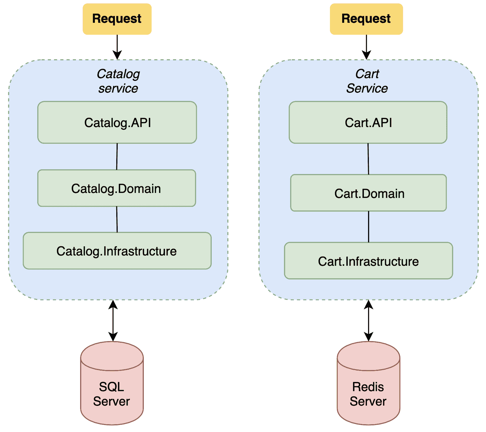
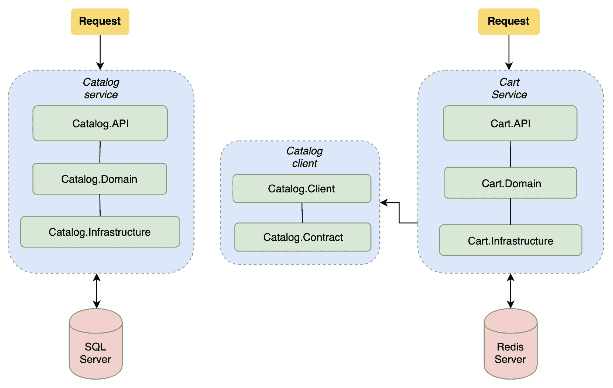
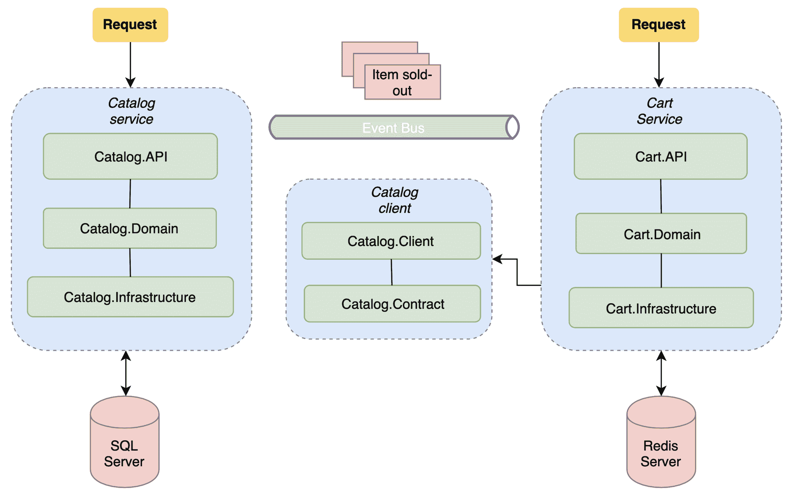

# 服务生态系统模式

在上一章中，我们提供了容器化过程的概述以及如何使用容器来运行服务。我们还学习了如何使用 Docker 在容器上托管目录服务，以及如何使用多阶段构建方法创建和运行我们的容器镜像。

本章重点介绍在多个服务属于同一生态系统时使用的某些模式。然后，我们将查看这些服务之间的实现。我们还将学习如何构建属于同一系统的各种 Web 服务之间的弹性连接，以避免与数据交换相关的某些常见陷阱。

在本章中，我们将涵盖以下主题：

+   购物车服务简介

+   使用 HTTP 客户端实现弹性通信

+   事件总线简介

+   如何使用 RabbitMQ 执行事件总线通信

到本章结束时，您将了解如何使用 `Polly` 提高弹性，以及如何使用事件总线在两个系统之间交换信息。

# 购物车服务简介

虽然 `Catalog.API` 项目处理我们商店的商品目录，但我们没有处理购物车功能的东西。在本节中，我们将发现一个新的 .NET Core 解决方案，该方案实现了一个购物车服务来完成这项工作。此外，我们还将介绍一种新的实现方法：**中介者模式**。在我们深入了解这个新服务的实现之前，让我们先看看项目结构概述，它提供了目录服务和购物车服务解决方案：



上述架构描述了目录服务和购物车服务的项目结构*.* 如我们所知，目录服务通过实现 `API`、`Domain` 和 `Infrastructure` 项目来分离实现的各个层，并且它使用 SQL Server，结合 Entity Framework Core 作为主要的数据源。然而，尽管购物车服务遵循类似的项目结构，但它使用了一种略微不同的实现模式，并将购物车数据存储在 Redis 中。因此，主要用于缓存目的的 Redis 提供了一个非常轻量级/高性能的键值数据存储，也可以用作数据库。

购物车服务解决方案具有以下结构：

+   `Cart.API` 项目包含控制器，该控制器处理来自客户端的传入 HTTP 请求。它还包括错误处理聚合点和 `Startup` 类，该类初始化依赖注入引擎。

+   `Cart.Domain` 项目包含中介逻辑和处理程序，它们将操作调度到底层层。此外，它还包括应用程序使用的实体。

+   `Cart.Infrastructure` 项目是 Web 服务及其依赖项（如数据存储和其他第三方服务）之间的桥梁。

本章不会详细探讨购物车服务的发展过程：一些技术方面已经在 第八章，*构建数据访问层*，第九章，*实现领域逻辑*，和 第十章，*实现 RESTful HTTP 层* 中进行了讨论。购物车服务的介绍将有助于你确定多个 Web 服务之间的不同通信技术。尽管本章将涵盖实现的一些关键部分，例如处理器，但为了继续前进，你需要从 [`github.com/PacktPublishing/Hands-On-RESTful-Web-Services-with-ASP.NET-Core-3`](https://github.com/PacktPublishing/Hands-On-RESTful-Web-Services-with-ASP.NET-Core-3) 下载购物车服务的源代码。

# 中介模式背后的理论

中介模式是一种封装逻辑在唯一入口点的方法。它使用请求、响应、命令或事件的概念来抽象单个入口点背后的实现。这种实现应用程序逻辑的方式有助于你的团队中的开发者将逻辑与应用程序的 Web 部分分离。为了了解中介模式是如何工作的，让我们看看它的组件。

上述架构描述了中介模式的一个简单实现。中介模式的消费者通过引用 `IMediator` 接口调用 `Send` 方法。中介实现传递一个特定的 `IRequest` 接口类型。因此，`Mediator` 实例使用 `IRequest` 接口的具体实现将消息派发到目标处理器，该处理器由 `IMessageHandler` 实现表示。在下一章中，我们将学习如何使用 `IMediator` 接口将消息派发到特定的处理器。

此外，我们将使用命令方法来应用中介模式。实现中介模式的方法略有不同。在本章中，我们将介绍一个非常流行的中介 NuGet 包，称为 **MediatR**。MediatR 是一个全功能的中介模式实现，涵盖了进程内消息传递。你可以在 GitHub 上找到有关 MediatR 项目的更多信息：[`github.com/jbogard/MediatR`](https://github.com/jbogard/MediatR)。

为了实现 *购物车服务*，我们将使用以下组件，所有这些组件都由 MediatR 库公开：

+   `IMediator` 接口是中介模式的入口点。它公开了一个 `Send` 方法，用于将命令或请求派发到特定的处理器以获取结果。

+   `IRequestHandler` 接口是一个通用接口，用于定义处理器的实现。每个 `IRequestHandler` 类型都需要一个 `IRequest` 类型，该类型代表通过 `IMediator` 接口发送的请求。

+   `IRequest` 接口定义了用于执行特定处理器的请求或命令类型。

现在我们对中介者模式的工作方式有了更多的了解，我们可以继续进行购物车服务解决方案的具体实现。在下一节中，我们将查看如何定义服务的领域模型并实现数据访问层抽象，该抽象覆盖 Redis 数据存储。

# 领域模型和数据访问层

购物车服务的领域模型代表了我们需要描述用户购物车会话的实体。具体来说，购物车服务的领域模型实现了三个不同的实体类：`Cart`、`CartItem` 和 `CartUser`。与目录服务一样，所有实体都存储在 `Cart.Domain` 项目中，该项目将由 `Cart.Infrastructure` 和 `Cart.API` 项目引用。

让我们从代表单个购物车会话的 `CartSession` 类开始：

```cs
using System;
using System.Collections.Generic;

namespace Cart.Domain.Entities
{
    public class CartSession
    {
        public string Id { get; set; }
        public IList<CartItem> Items { get; set; }
        public CartUser User { get; set; }
        public DateTimeOffset ValidityDate { get; set; }
    }
}
```

`CartSession` 实体代表一个由用户创建的单个购物车实例。因此，它引用了包含用户信息的 `CartUser` 类。此外，`CartSession` 实体还提供了 `IList<CartItems>` 字段，该字段表示购物车中的项目及其各自的数量。让我们继续定义 `CartItem` 类：

```cs
using System;

namespace Cart.Domain.Entities
{
    public class CartItem
    {
        public Guid CartItemId { get; set; }

        public int Quantity { get; set; }

        public void IncreaseQuantity()
        {
            Quantity = Quantity + 1;
        }

        public void DecreaseQuantity()
        {
            Quantity = Quantity - 1;
        }
    }
}
```

`CartItem` 类实现了 `CartItemId` 字段和 `Quantity` 字段。此外，它还提供了 `IncreaseQuantity` 和 `DecreaseQuantity` 字段，分别用于增加和减少特定项目的数量。最后，我们可以确定 `CartUser` 类，该类代表与购物车相关的用户：

```cs
namespace Cart.Domain.Entities
{
    public class CartUser
    {
        public string Email { get; set; }
    }
}
```

为了演示目的，我们用只有一个属性来表示 `CartUser`；这将包含用户的电子邮件。前面的实体存储在 `Entities` 文件夹中，位于 `Cart.Domain` 项目内。

一旦我们定义了领域模型，我们就可以继续实现数据访问抽象。具体来说，购物车服务将使用我们之前为目录服务定义的相同访问模式来获取有关购物车会话的信息：

```cs
// src/Cart.Domain/Repositories/ICartRepository.cs

using System;
using System.Collections.Generic;
using System.Threading.Tasks;
using Cart.Domain.Entities;

namespace Cart.Domain.Repositories
{
    public interface ICartRepository
    {
        IEnumerable<string> GetCarts();
        Task<CartSession> GetAsync(Guid id);
        Task<CartSession> AddOrUpdateAsync(CartSession item);
    }
}
```

`ICartRepository` 方法实现了检索和更新我们数据的方法，`GetCarts` 方法检索当前购物车的 ID，而 `GetAsync` 方法收集有关特定购物车的信息。最后，`AddOrUpdateAsync` 方法允许我们在数据存储中不存在时更新或添加一个新的购物车，而 `ICartRepository` 定义了我们的数据存储执行的操作。在下一小节中，我们将查看 `CartRepository` 类的具体实现。

这个领域模型已被简化，以提供一个购物车可能的实现示例。在实际应用中，我们应该考虑购物车状态的其他重要信息。

# ICartRepository Redis 实现

购物车服务使用 Redis ([`redis.io/`](https://redis.io/)) 来存储购物车数据。购物车服务中 `CartRepository` 类的实际实现使用由 Stack Exchange 提供的 NuGet 包 `StackExchange.Redis`。此外，我们将使用 `Newtonsoft.Json` 包将对象序列化为 Redis，使用 JSON 格式。

`CartRepository` 类的具体实现将位于 `Cart.Infrastructure` 项目中，而 `ICartRepository` 接口类型将位于 `Cart.Domain` 项目中。此外，`Cart.Infrastructure` 项目还将依赖于 `StackExchange.Redis` 和 `Newtonsoft.Json` 包。`StackExchange.Redis` 库提供了对 Redis 的低级抽象，以便我们的 .NET 应用程序可以在 Redis 实例上读取或写入数据。让我们看一下 `CartRepository` 类的实现：

```cs
using System;
using System.Collections.Generic;
using System.Linq;
using System.Threading.Tasks;
using Cart.Domain.Entities;
using StackExchange.Redis;
using Cart.Domain.Repositories;
using Cart.Infrastructure.Configurations;
using Microsoft.Extensions.Options;
using Newtonsoft.Json;

namespace Cart.Infrastructure.Repositories
{
    public class CartRepository : ICartRepository
    {
        private readonly IDatabase _database;
        private readonly CartDataSourceSettings _settings;

        public CartRepository(IOptions<CartDataSourceSettings> options)
        {
            _settings = options.Value;

            var configuration = ConfigurationOptions
                .Parse(_settings.RedisConnectionString);

            try
            {
                _database = ConnectionMultiplexer
                    .Connect(configuration).GetDatabase();
            }
            catch (Exception e)
            {
                Console.WriteLine(e.ToString());
            }
        }
        ...
    }
}
```

`CartRepository` 类使用 `StackExchange.Redis` 库与 Redis 实例交互。它声明了一个 `IDatabase` 属性，它代表与 Redis 实例的连接，并使用一个自定义设置类来定义与 Redis 实例关联的连接字符串。在类的初始化过程中，构造函数调用 `ConnectionMultiplexer` 静态实例来创建一个新的数据库连接。让我们继续查看 `ICartRepository` 接口方法实现的细节：

```cs
...

        public IEnumerable<string> GetCarts()
        {
            var keys = _database.Multiplexer.GetServer
                (_settings.RedisConnectionString).Keys();

            return keys?.Select(k => k.ToString());
        }

        public async Task<CartSession> GetAsync(Guid id)
        {
            var data = await _database.StringGetAsync(id.ToString());

            return data.IsNullOrEmpty
                ? null
                : JsonConvert.DeserializeObject
                   <Domain.Entities.CartSession>(data);
        }

        public async Task<CartSession> AddOrUpdateAsync(CartSession 
            item)
        {
            var created = await _database.StringSetAsync(item.Id, 
                JsonConvert.SerializeObject(item));

            if (!created) return null;

            return await GetAsync(new Guid(item.Id));
        }
..
```

上述代码定义了 `ICartRepository` 接口的核心方法。`GetCarts` 方法收集表示存储在 Redis 实例中的所有购物车 ID 的键。`GetAsync` 方法通过传递特定购物车的 ID 并在 `CartSession` 实体中反序列化结果内容来检索卡片详情。最后，`AddOrUpdateAsync` 方法通过序列化其内容并使用库提供的 `StringSetAsync` 方法更新数据源来添加或更新与购物车 ID 相关的信息。我们使用 Redis 是因为它作为一个内存数据结构存储，可以非常快速地检索信息。通常，Redis 的主要目的是作为缓存系统，但它也可以用来临时存储信息。然而，Redis 并不是防止数据丢失的最佳系统。所有数据都在内存中处理，并且只能通过创建内存当前状态的快照来保存。有关更多信息，请访问以下网站：[`redis.io/topics/persistence`](https://redis.io/topics/persistence)。

之前 `CartRepository` 的实现产生了两个主要问题。首先，Redis 不是一个设计用于扫描和检索多个键的数据库。此外，这种类型的数据存储设计用于执行 O(1) 操作，就像哈希表或字典一样。因此，`GetCarts` 方法非常低效。一个替代且更有效的方法是将列表 ID 存储在特定且唯一的字段中，并在我们添加/删除新的购物车记录时保持它们更新。其次，尽管 `CartRepository` 类的构造函数在每次类初始化时都调用 `ConnectionMultiplexer` 静态类，但强烈建议您将 `IConnectionMultiplexer` 接口初始化为单例实例，以避免性能问题。

下一个子节描述了通过中介逻辑公开购物车操作的处理器实现。此外，处理器将调用底层的 `ICartRepository` 接口以在 Redis 上执行 I/O 过程。

# 处理器和路由实现

*购物车服务* 实现了处理器，这些处理器反映了在服务域部分发生的不同购物车数据操作。正如我们将在本章后面看到的那样，处理器与特定请求相关联，并由 MediatR 库提供的 `IMediator` 接口执行。此外，在这种情况下，这些类位于 `Cart.Domain` 项目中。

让我们从查看 `CreateCartHandler` 类的实现开始：

```cs
//Handlers/Cart/CreateCartHandler.cs 
using System;
...

namespace Cart.Domain.Handlers.Cart
{
    public class CreateCartHandler : IRequestHandler<CreateCartCommand, CartExtendedResponse>
    {
        private readonly ICatalogService _catalogService;
        private readonly IMapper _mapper;
        private readonly ICartRepository _repository;

        public CreateCartHandler(ICartRepository repository, IMapper 
            mapper, ICatalogService catalogService)
        {
            _repository = repository;
            _mapper = mapper;
            _catalogService = catalogService;
        }

        public async Task<CartExtendedResponse> Handle
            (CreateCartCommand command, CancellationToken 
            cancellationToken)
        {
            var entity = new CartSession
            {
                Items = command.ItemsIds.Select(x => new CartItem { 
                  CartItemId = new Guid(x), Quantity = 1 }).ToList(),
                  User = new CartUser { Email = command.UserEmail },
                  ValidityDate = DateTimeOffset.Now.AddMonths(2),
                  Id = Guid.NewGuid().ToString()
            };

            var result = await _repository.AddOrUpdateAsync(entity);

            var response = _mapper.Map<CartExtendedResponse>(result);

            var tasks = response.Items
                .Select(async x => await _catalogService
                .EnrichCartItem(x, cancellationToken));

            response.Items = await Task.WhenAll(tasks);

            return response;
        }
    }
}
```

上述代码是 `CreateCartHandler` 类的定义，该类执行创建购物车的过程。该类使用构造函数注入技术通过 ASP.NET Core 的依赖注入引擎解决依赖关系。此外，处理器类依赖于 `IMapper` 和 `ICartRepository` 接口：`IMapper` 接口用于将 `CartSession` 实例映射到 `CartExtendedResponse` 响应类，而 `ICartRepository` 接口用于通过使用 `AddOrUpdateAsync` 方法在 Redis 上存储购物车数据。

处理器为实体分配一个新的 `Guid`，并为每个项目分配 2 个月的 `ValidityDate`。此外，它还通过为每个项目设置默认数量 1 来将新的购物车项目列表添加到购物车会话中。以类似的方式，`GetCartHandler` 类根据购物车的 `Id` 实现读取操作：

```cs
using System.Threading;
...

namespace Cart.Domain.Handlers.Cart
{
    public class GetCartHandler : IRequestHandler<GetCartCommand, 
        CartExtendedResponse>
    {
        private readonly ICatalogService _catalogService;
        private readonly IMapper _mapper;
        private readonly ICartRepository _repository;

        public GetCartHandler(ICartRepository repository, IMapper 
            mapper, ICatalogService catalogService)
        {
            _repository = repository;
            _mapper = mapper;
            _catalogService = catalogService;
        }

        public async Task<CartExtendedResponse> Handle(GetCartCommand 
            command, CancellationToken cancellationToken)
        {
            var result = await _repository.GetAsync(command.Id);
            var extendedResponse = _mapper.Map<CartExtendedResponse>
                (result);

            var tasks = extendedResponse.Items
                .Select(async x => await _catalogService
                .EnrichCartItem(x, cancellationToken));

            extendedResponse.Items = await Task.WhenAll(tasks);
            return extendedResponse;
        }
    }
}
```

在这种情况下，`Handle` 方法执行由底层存储库接口提供的 `GetAsync(Guid id)` 方法，并将响应映射到 `CartExtendedResponse` 类型。由 `Cart.Domain` 项目实现的最后一个处理器增加了特定购物车中项目的数量或减少了数量：

```cs
using System.Linq;
...

namespace Cart.Domain.Handlers.Cart
{
    public class UpdateCartItemQuantity : IRequestHandler
        <UpdateCartItemQuantityCommand, CartExtendedResponse>
    {
        private readonly ICatalogService _catalogService;
        private readonly IMapper _mapper;
        private readonly ICartRepository _repository;

        public UpdateCartItemQuantity(ICartRepository repository, 
            IMapper mapper, ICatalogService catalogService)
        {
            _repository = repository;
            _mapper = mapper;
            _catalogService = catalogService;
        }

        public async Task<CartExtendedResponse> Handle(UpdateCartItemQuantityCommand command, CancellationToken cancellationToken)
        {
            var cartDetail = await 
                _repository.GetAsync(command.CartId);

            if (command.IsAddOperation)
                cartDetail.Items.FirstOrDefault(x => x.CartItemId == 
                command.CartItemId)?.IncreaseQuantity();
            else
                cartDetail.Items.FirstOrDefault(x => x.CartItemId == 
                command.CartItemId)?.DecreaseQuantity();

            var cartItemsList = cartDetail.Items.ToList();

            cartItemsList.RemoveAll(x => x.Quantity <= 0);

            cartDetail.Items = cartItemsList;

            await _repository.AddOrUpdateAsync(cartDetail);

            var response = _mapper.Map<CartExtendedResponse>
                (cartDetail);
            var tasks = response.Items
                .Select(async x => await 
                _catalogService.EnrichCartItem(x, cancellationToken));

            response.Items = await Task.WhenAll(tasks);

            return response;
        }
    }
}
```

处理器接受`UpdateCartItemQuantityRequest`，它定义了`CartId`、`CartItemId`以及一个表示是否请求增加或减少指定项目数量的布尔值。

处理器使用与其他处理器相同的依赖项，并在数量等于零的情况下执行一些关于移除项目的额外检查。如果与`CartItemId`关联的数量达到`0`，则该项目将从购物车会话中移除；否则，数量将被更新，并通过更新 Redis 存储和检索`cartDetail`来继续购物车流程。

现在我们已经设置了处理器，我们将定义将公开 Web 服务 HTTP 路由的控制器类。

# 使用`CartController`公开功能

正如我们已经提到的，购物车服务负责电子商务店铺购物页面上执行的操作。此外，该服务公开以下路由表：

| **HttpVerb** | **URL** | **描述** |
| --- | --- | --- |
| `GET` | `api/cart/{cartId}` | 此操作检索有关特定购物车及其内部产品的信息。 |
| `POST` | `api/cart` | 此操作通过请求体中的产品列表创建一个新的购物车。 |
| `PUT` | `api/cart/{cartId}/items/{id}` | 此操作通过添加一个单位来增加指定`cartId`中指定项目的数量。 |
| `DELETE` | `api/cart/{cartId}/items/{id}` | 此操作通过移除一个单位来减少指定`cartId`中指定项目的数量。 |

上述表格提供了我们需要在控制器中定义的路由的一些详细信息。因此，以下代码片段显示了在`Cart.API`项目中使用`CartController`类实现此路由表的实现：

```cs
using System;
using System.Threading.Tasks;
using MediatR;
using Microsoft.AspNetCore.Mvc;
using Cart.API.Infrastructure.Filters;
using Cart.Domain.Commands.Cart;

namespace Cart.API.Controllers
{

    [Route("api/cart")]
    [ApiController]
    [JsonException]
    public class CartController : ControllerBase
    {
        private readonly IMediator _mediator;

        public CartController(IMediator mediator)
        {

            _mediator = mediator;
        }

          [HttpGet("{id:guid}")]
        public async Task<IActionResult> GetById(Guid id)
        {
            var result = await _mediator.Send(new GetCartCommand { Id = 
                id });
            return Ok(result);
        }

        [HttpPost]
        public async Task<IActionResult> Post(CreateCartCommand 
            request)
        {
            var result = await _mediator.Send(request);
            return CreatedAtAction(nameof(GetById), new { id = 
                result.Id }, null);
        }
..
```

正如你所见，与之前实现的控制器类似，`CartController`使用依赖注入来通过初始化`IMediator`接口来解析其依赖项。让我们继续查看`Put`和`Delete`操作方法的实现：

```cs
...

    [HttpPut("{cartId:guid}/items/{id:guid}")]
        public async Task<IActionResult> Put(Guid cartId, Guid id)
        {
            var result = await _mediator.Send(new 
                UpdateCartItemQuantityCommand
            {
                CartId = cartId,
                CartItemId = id,
                IsAddOperation = true
            });
            return Ok(result);
        }
        [HttpDelete("{cartId:guid}/items/{id:guid}")]
        public async Task<IActionResult> Delete(Guid cartId, Guid id)
        {
            var result = await _mediator.Send(new 
                UpdateCartItemQuantityCommand
            {
                CartId = cartId,
                CartItemId = id,
                IsAddOperation = false
            });

            return Ok(result);
        }
}
```

`DELETE`和`PUT`方法使用`IsAddOperation`标志来通知处理器请求的操作是用于增加还是减少数量。因此，每次我们使用`DELETE` HTTP 动词和`UPDATE` HTTP 动词调用路由时，服务将增加和减少 URL 中指定的项目 ID 的数量。

本章跳过了我们在第八章“构建数据访问层”、第九章“实现领域逻辑”和第十章“实现 RESTful HTTP 层”中涵盖的大量验证和 REST 兼容特性，然后在`Catalog.API`项目中实现。从下一节开始，本章旨在向您展示如何在独立服务之间共享信息和事件。因此，购物车服务将通过调用目录服务来收集与项目相关的信息。

现在我们已经了解了实现栈，我们可以通过实现目录服务与购物车服务之间的通信来继续前进*.*

# 使用 HTTP 客户端实现弹性通信

在上一节中，我们查看了一个购物车服务项目的概述。我们学习了购物车服务如何在 Redis 实例中存储信息以及如何为客户检索与购物车相关的数据。

必须注意的是，Redis 数据源中存储的信息与服务公开的数据之间存在差距。此外，通过检查`CartItem`实体，我们可以看到它仅实现了检索项目的`CartItemId`和`Quantity`信息：

```cs
namespace Cart.Domain.Entities
{
    public class CartItem
    {
        public string CartItemId { get; set; }

        public int Quantity { get; set; }

        ...
    }
}
```

另一方面，我们可以看到`CartItemResponse`提供了许多与项目数据相关的字段：

```cs
namespace Cart.Domain.Responses.Cart
{
    public class CartItemResponse
    {
        public string CartItemId { get; set; }

        public string Name { get; set; }

        public string Description { get; set; }

        public string LabelName { get; set; }

        public string Price { get; set; }

        public string PictureUri { get; set; }

        public string GenreDescription { get; set; }

        public string ArtistName { get; set; }

        public int Quantity { get; set; }
    }
}
```

`CartItemResponse`类所提供的附加信息是通过调用目录服务获取的。因此，购物车服务拥有关于项目 ID 的数据，并且它可以执行`GET /api/items/{itemId}`请求以检索项目信息。在本节中，我们将专注于实现一个 HTTP 客户端，以公开目录服务拥有的信息。

重要的是不要在 Web 服务之间复制信息。我们需要尽可能地将 Web 服务的数据源分开。每个服务拥有一个单一的数据源及其适当的信息。使用 HTTP 调用进行服务间通信是一种常见的做法。在下面的示例中，我们将看到购物车服务如何直接调用目录服务以检索项目信息。在实际应用中，所有服务之间的 HTTP 调用都通过代理进行，以确保服务的可靠性。

# 实现目录 HTTP 客户端

实现客户端库与 Web 服务一起是常见的做法。此外，提供与服务通信的方式是 Web 服务的责任。因此，我们可以使用以下方案来表示客户端的实现：



这使我们能够将目录服务客户端库发布到内部 NuGet 仓库，以便我们可以将客户端传播到其他服务。此外，拥有特定服务的团队应该知道如何实现它以及如何正确地公开信息。让我们从在 `Catalog.API` 解决方案中创建两个新的 `classlib` 项目开始，该解决方案位于 `src` 文件夹中：

```cs
dotnet new classlib -n Catalog.API.Client -f netstandard2.1
dotnet sln ../Catalog.API.sln add Catalog.API.Client 
dotnet new classlib -n Catalog.API.Contract -f netstandard2.1
dotnet sln ../Catalog.API.sln add Catalog.API.Contract

dotnet add Catalog.API.Client reference Catalog.API.Contract
```

`Catalog.API.Client` 项目将包含我们查询目录服务所需的所有方法。`Catalog.API.Contract` 包含客户端用于传输数据的请求和响应，因此我们可以通过将 `Catalog.Domain` 项目的 `Responses` 文件夹中的类复制到之前创建的 `Catalog.API.Contract` 项目中来进行操作。结果文件夹结构将如下所示：

```cs
.
├── Item
│   ├── ArtistResponse.cs
│   ├── GenreResponse.cs
│   ├── ItemResponse.cs
│   └── PriceResponse.cs
├── Catalog.API.Contract.csproj
├── bin
└── obj
```

为了在项目中使用响应模型，必须引用 `Catalog.API.Contract`。这种做法通常应用于请求和响应类。通过这样做，可以将 API 的契约保存在一个单独的、持续集成管道中。作为第二步，我们需要在 `Catalog.API.Client` 项目中创建一个新的基础客户端。以下 `IBaseClient` 接口定义了客户端暴露的方法：

```cs
// /Base/IBaseClient.cs

using System;
using System.Threading;
using System.Threading.Tasks;

namespace Catalog.API.Client.Base
{
        public interface IBaseClient
        {
            Task<T> GetAsync<T>(Uri uri, CancellationToken 
                cancellationToken);
            Uri BuildUri(string format);
        }
}

```

`IBaseClient` 接口建立了客户端的接口。它暴露了两个主要方法：`GetAsync` 和 `BuildUri`。这两个方法都在 `BaseClient` 具体类中实现。`BaseClient` 类依赖于框架提供的 `HttpClient` 和我们 API 的 `string Url`。`GetAsync` 方法调用 `HttpClient` 并使用 `Newtonsoft.Json` 包将客户端的响应反序列化为一个通用的模型 `T`。

让我们继续定义 `ICatalogItemResource` 接口和 `CatalogItemResource` 类。这些类代表 `Item` 资源：

```cs
// Resources/ICatalogItemResource.cs

using System;
using System.Threading;
using System.Threading.Tasks;
using Catalog.Contract.Item;

namespace Catalog.API.Client.Resources
{
    public interface ICatalogItemResource
    {
        Task<ItemResponse> Get(Guid id, CancellationToken 
            cancellationToken = default);
    }
}

```

`ICatalogItemResource` 通过接受 `id` 和 `cancellationToken` 来暴露 `Get` 方法。它返回一个 `Task<ItemResponse>` 类型的值。因此，`CatalogItemResource` 模型在 `Catalog.API.Client.Resources` 项目中定义如下：

```cs
// Resources/CatalogItemResource.cs

using System;
using System.Threading;
using System.Threading.Tasks;
using Catalog.API.Client.Base;
using Catalog.Domain.Responses;

namespace Catalog.API.Client.Resources
{
    public class CatalogItemResource : ICatalogItemResource
    {
        private readonly IBaseClient _client;

        public CatalogItemResource(IBaseClient client)
        {
            _client = client;
        }

        private Uri BuildUri(Guid id, string path = "")
        {
            return _client.BuildUri(string.Format("api/items/{0}", id, 
                path));
        }

        public async Task<ItemResponse> Get(Guid id, CancellationToken 
            cancellationToken)
        {
            var uri = BuildUri(id);
            return await _client.GetAsync<ItemResponse>(uri, 
                cancellationToken);
        }
    }
}
```

`CatalogItemResource` 指向 `IBaseClient` 接口，并通过使用 `IBaseClient` 接口实现 `Get` 方法。同样，`CatalogItemResource` 也负责通过构建 Web 服务的 `Uri` 来提供项目的路径。除此之外，`CatalogItemResource` 使用 `IBaseClient` 包装器来执行 HTTP 操作。让我们深入了解 `IBaseClass` 接口的实现：

```cs
// /Base/BaseClient.cs

using System;
using System.Net.Http;
using System.Threading;
using System.Threading.Tasks;
using Newtonsoft.Json;

namespace Catalog.API.Client.Base
{
    public class BaseClient : IBaseClient
    {
        private readonly HttpClient _client;
        private readonly string _baseUri;

        public BaseClient(HttpClient client, string baseUri)
        {
            _client = client;
            _baseUri = baseUri;
        }

        public async Task<T> GetAsync<T>(Uri uri, CancellationToken 
            cancellationToken)
        {
            var result = await _client.GetAsync(uri, 
            cancellationToken);
            result.EnsureSuccessStatusCode();

            return JsonConvert.DeserializeObject<T>(await 
            result.Content.ReadAsStringAsync());
        }

        public Uri BuildUri(string format)
        {
            return new UriBuilder(_baseUri)
            {
                Path = format
            }.Uri;
        }
    }
}
```

上述代码使用框架提供的 `HttpClient` 类来实现 `GetAsync<T>` 泛型方法。因此，使用这种泛型模式允许我们使用自定义模型反序列化响应。

最后，我们可以通过添加以下组件来实现服务的实际客户端：

```cs
// ICatalogClient.cs

using Catalog.API.Client.Resources;

namespace Catalog.API.Client
{
    public interface ICatalogClient
    {
        ICatalogItemResource Item { get; }
    }
}

// CatalogClient.cs

using System.Net.Http;
using Catalog.API.Client.Base;
using Catalog.API.Client.Resources;

namespace Catalog.API.Client
{
    public class CatalogClient : ICatalogClient
    {
        public ICatalogItemResource Item { get; }

        public CatalogClient(HttpClient client)
        {
            Item = new CatalogItemResource(new BaseClient(client, 
            client.BaseAddress.ToString()));
        }
    }
}

```

最后，可以使用 `Catalog.API.Client` 实例化一个新的 HTTP 客户端实例，并使用独特且通用的合约调用目录服务：

```cs
var catalogClient = new CatalogClient(new HttpClient());
var result = await catalogClient.Item.Get(new Guid(item.CartItemId), cancellationToken);
```

现在，我们有一些独立的 DLL，它们提供了我们所需要的一切，因此我们可以查询目录 Web 服务。在下一节中，我们将学习如何使用本节中实现的客户端对目录服务执行 HTTP 调用。

# 将 HTTP 客户端集成到购物车服务中

下一步是将目录服务提供的 HTTP 客户端集成到购物车服务中。因此，我们将添加一个新的类，其职责是调用目录服务并检索特定购物车所需的信息。让我们从在 `Cart.Domain` 项目中创建一个名为 `ICatalogService` 的接口开始：

```cs
using System.Threading;
using System.Threading.Tasks;
using Cart.Domain.Responses.Cart;

namespace Cart.Domain.Services
{
    public interface ICatalogService
    {
        Task<CartItemResponse> EnrichCartItem(CartItemResponse item, 
            CancellationToken cancellationToken);
    }
}
```

`ICatalogService` 接口位于 `Cart.Domain` 项目的 `Services` 文件夹中。它公开了一个名为 `EnrichCartItem` 的异步方法，该方法接受 `CartItemResponse` 并返回相同类型。就像我们对 `ICartRepository` 接口所做的那样，我们可以在 `Cart.Infrastructure` 项目中创建 `ICatalogService` 接口的具体实现。因此，我们可以使用之前在 *目录服务* 中实现的 `ICatalogClient` 接口来检索目录信息。在实际应用中，这些 DLL 通常作为公司内部存储库中的 NuGet 包进行管理。在我们的情况下，我们将复制它们并将它们包含在 `Cart.Infrastructure` 项目中，如下所示：

```cs
<Project Sdk="Microsoft.NET.Sdk">

    <PropertyGroup>
        <TargetFramework>netcoreapp3.1</TargetFramework>
    </PropertyGroup>

 ...

    <ItemGroup>
 <Reference Include="Catalog.API.Client, Version=1.0.0.0, 
        Culture=neutral, PublicKeyToken=null">
        <HintPath>ExternalDll\Catalog.API.Client.dll</HintPath>
      </Reference>
      <Reference Include="Catalog.API.Contract, Version=1.0.0.0, 
       Culture=neutral, PublicKeyToken=null">
        <HintPath>ExternalDll\Catalog.API.Contract.dll</HintPath> </Reference>
    </ItemGroup>
</Project>

```

让我们通过在 `Cart.Infrastructure` 项目中创建 `CatalogService` 类来继续操作：

```cs
using System;
using System.Globalization;
using System.Threading;
using System.Threading.Tasks;
using Cart.Domain.Responses.Cart;
using Cart.Domain.Services;
using Catalog.API.Client;
using Catalog.API.Contract.Item;

namespace Cart.Infrastructure.Services
{
    public class CatalogService : ICatalogService
    {
        private readonly ICatalogClient _catalogClient;

        public CatalogService(ICatalogClient catalogClient)
        {
            _catalogClient = catalogClient;
        }

        public async Task<CartItemResponse> EnrichCartItem
        (CartItemResponse item, CancellationToken cancellationToken)
        {
            try
            {
                var result = await _catalogClient.Item.Get(new 
                    Guid(item.CartItemId), cancellationToken);
                return Map(item, result);
            }
            catch (Exception)
            {
                return item;
            }
        }

        private static CartItemResponse Map(CartItemResponse item, 
            ItemResponse result)
        {
            item.Description = result.Description;
            item.LabelName = result.LabelName;
            item.Name = result.Name;
            item.Price = result.Price.Amount.ToString
                (CultureInfo.InvariantCulture);
            item.ArtistName = result.Artist.ArtistName;
            item.GenreDescription = result.Genre.GenreDescription;
            item.PictureUri = result.PictureUri;

            return item;
        }
    }
}
```

`CatalogService` 使用构造函数注入解决 `ICatalogClient` 依赖关系。该类通过以下方式调用目录服务客户端来实现 `EnrichCartItem` 函数：

```cs
var result = await _catalogClient.Item.Get(new Guid(item.CartItemId), cancellationToken);
```

现在，该方法检索与目录项相关的信息，并使用 `Map` 方法将这些数据映射到 `CartItemResponse`。因此，我们将拥有每个已填充新数据的项目的信息。可以通过在 `Cart.Domain` 中实现的处理器中引用 `ICatalogService` 接口来继续操作。以下以 `GetCartHandler` 作为此示例：

```cs
using System.Linq;
...

namespace Cart.Domain.Handlers.Cart
{
    public class GetCartHandler : IRequestHandler<GetCartCommand, 
        CartExtendedResponse>
    {
        private readonly ICatalogService _catalogService;
        private readonly IMapper _mapper;
        private readonly ICartRepository _repository;

        public GetCartHandler( ICartRepository repository, IMapper 
            mapper, ICatalogService catalogService)
        {
            _repository = repository;
            _mapper = mapper;
            _catalogService = catalogService;
        }

        public async Task<CartExtendedResponse> Handle(GetCartCommand 
        command, CancellationToken cancellationToken)
        {
            var result = await _repository.GetAsync(command.Id);
            var extendedResponse = _mapper.Map<CartExtendedResponse>
                (result);

            var tasks = extendedResponse.Items
                .Select(async x => await 
                _catalogService.EnrichCartItem(x, cancellationToken));

            extendedResponse.Items = await Task.WhenAll(tasks);
            return extendedResponse;
        }
    }
}
```

我们可以执行 `_catalogService.EnrichCartItem` 方法来检索 `extendedResponse` 对象中每个 `Item` 的填充数据。此外，`GetCartHandler` 使用 `Task.WhenAll` 方法等待任务完成并返回其数据。为了在运行时执行此过程，有必要声明以下扩展方法，该方法将在 `Cart.API` 项目的 `Startup` 类中初始化依赖关系并在其中执行，通过传递 API 的端点：

```cs
using System;
using Microsoft.Extensions.DependencyInjection;
using Cart.Domain.Services;
using Cart.Services;
using Catalog.API.Client;

namespace Cart.Infrastructure
{
    public static class CatalogServiceExtensions
    {
        public static IServiceCollection AddCatalogService(this 
        IServiceCollection services, Uri uri)
        {
           services.AddScoped<ICatalogClient>(x => new 
                CatalogClient(uri));
 services.AddScoped<ICatalogService, CatalogService>();

            return services;
        }
    }
```

`AddCatalogService` 将在 `Startup` 类的 `CofigureService` 方法中被调用。它通过使用作用域生命周期将 `ICatalogClient` 和 `ICatlogService` 添加到依赖注入服务中。

# 使用 Polly.NET 实现弹性

在前面的章节中，我们描述了如何实现目录服务和购物车服务之间的通信。现在，我们应该问自己关于服务运行时执行和通信的以下问题：如果目录服务宕机了会怎样？如果目录服务响应时间变慢了会怎样？**Polly.NET** 包对于这类问题非常有用 ([`github.com/App-vNext/Polly`](https://github.com/App-vNext/Polly))。

Polly.NET 基于 *策略*，其中每个 *策略* 都可以单独使用或与其他策略结合使用，以向客户端提供弹性。开箱即用，该库提供了一些标准的弹性策略，例如重试、断路器和超时*.* 让我们快速看一下一个示例策略，以便我们了解如何使用它们：

```cs
...

    services.AddHttpClient<IMyService, MyService>()
        .AddPolicyHandler(RetryPolicy());

...

static IAsyncPolicy<HttpResponseMessage> RetryPolicy()
{
    return HttpPolicyExtensions
        .HandleTransientHttpError()
 .OrResult(msg => msg.StatusCode == 
           System.Net.HttpStatusCode.NotFound)
 .WaitAndRetryAsync(6, retryAttempt =>             
            TimeSpan.FromSeconds(Math.Pow(2,retryAttempt)));
}

```

之前的代码将一个 `HttpClient` 实例注入到 `IMyService` 中。该 `HttpClient` 实例结合了 `RetryPolicy` 和 `Polly` 包。此外，如果 HTTP 调用返回 `404 NotFound` 消息，它将触发 `RetryPolicy`，该策略会在指定的时间后指数级增加的间隔内重试请求。

# 将 Polly 集成到 ICatalogService 中

让我们看看如何将 Polly.NET 集成到购物车服务中*.* 如我们之前所看到的，我们的用例使用目录服务来收集用户购物车中项目的详细信息并将其返回给客户端。此外，我们将在 `ICatalogClient` 上实现 `CircuitBreakerPolicy`。`CircuitBreakerPolicy` 采用快速失败的方法，这意味着即使目录服务的响应没有到达，运行时也会继续执行应用程序*.*

在开始之前，让我们通过在项目文件夹中使用 `add package` 命令将一些 Polly.NET 包添加到 `Cart.Infrastructure` 项目中：

```cs
dotnet add package Polly
```

让我们通过在 `Cart.Infrastructure` 中创建一个新的 `CatalogServicePolicies` 静态类来为 `ICatalogClient` 创建一些策略：

```cs
using System;
using System.Net;
using System.Net.Http;
using Polly;
using Polly.Extensions.Http;

namespace Cart.Infrastructure.Extensions.Policies
{
    public static class CatalogServicePolicies
    {
        public static IAsyncPolicy<HttpResponseMessage> RetryPolicy()
        {
            return HttpPolicyExtensions
                .HandleTransientHttpError()
                .OrResult(msg => msg.StatusCode == 
                    HttpStatusCode.NotFound)
                .WaitAndRetryAsync(3, retryAttempt => 
                  TimeSpan.FromSeconds(Math.Pow(2, retryAttempt)));
        }

        public static IAsyncPolicy<HttpResponseMessage> 
        CircuitBreakerPolicy()
        {
            return HttpPolicyExtensions
                .HandleTransientHttpError()
                .CircuitBreakerAsync(3, TimeSpan.FromMinutes(1));
        }
    }
} 
```

上述代码定义了两个策略：

+   `RetryPolicy` 静态方法定义在执行其他策略之前要进行的重试次数。它使用 `.HandleTransientHttpError` 和 `.OrResult` 方法来检测客户端返回的所有失败条件。此外，它调用 `WaitAndRetryAsync` 方法，该方法将 `RetryPolicy` 限制在最多三次重试。每次重试都会增加睡眠时间。

+   `CircuitBreaker` 静态方法通过使用 `.HandleTransientHttpError` 捕获所有错误条件。它调用 `.CircuitBreakerAsync` 方法来定义 `CircuitBreakerPolicy`。`CircuitBreakerPolicy` 在三次尝试后会触发，并保持活跃状态 1 分钟。

现在，我们可以将这些策略的定义注入到我们的 `HttpClient` 实例中，如下所示：

```cs
public static class CatalogServiceExtensions
{
    public static IServiceCollection AddCatalogService(this 
    IServiceCollection services, Uri uri)
    {
        services.AddScoped<ICatalogService, CatalogService>();

        services.AddHttpClient<ICatalogClient, CatalogClient>(client =>
            {
                client.BaseAddress = uri;
            })
            .SetHandlerLifetime(TimeSpan.FromMinutes(2)) 
            .AddPolicyHandler(CatalogServicePolicies.RetryPolicy())
 .AddPolicyHandler(CatalogServicePolicies.
             CircuitBreakerPolicy());

        return services;
    }
}
```

如您所见，我们使用`AddPolicyHandler`方法注入这些策略，并调用`CatalogServicePolicies`静态类来获取它们。同样重要的是要注意，在定义策略之前，我们使用`SetHandlerLifetime`方法来确定`HttpClient`的生存期。这种方法保证了购物车服务与目录服务之间更健壮的通信。此外，请注意，`Polly`策略可以应用于任何第三方依赖调用，这意味着每次我们依赖第三方服务时，我们都需要预见这种类型的做法，以便优雅地处理错误。

# 使用事件总线共享事件

到目前为止，在本章中，我们看到了如何通过调用其他 Web 服务通过 HTTP 共享信息。正如我们已经提到的，避免在服务之间复制信息非常重要，更重要的是，每个服务必须是单个数据源的所有者，该数据源需要尽可能隔离。我们可以用来共享信息的另一种技术是使用事件推送数据。在本节中，我们将首先检查一个适合事件总线的用例。

假设目录中的一个商品达到零的可用库存量并进入售罄状态。我们需要传播这个信息并告诉购物车服务这个特定商品已售罄。这个用例可以使用事件总线来实现。

要理解这个架构，请看以下图示：



目录服务在某个商品的可用库存达到零时触发一个事件。购物车服务监听此事件，然后触发更新存储在 Redis 数据源中的购物车。为此，我们将使用 RabbitMQ，这是最常见的消息总线之一。RabbitMQ 提供了一个.NET 包，可用于实现两个解决方案之间的通信：[`github.com/rabbitmq/rabbitmq-dotnet-client`](https://github.com/rabbitmq/rabbitmq-dotnet-client)。

# 设置 RabbitMQ 实例并发布事件

事件总线通信由两部分组成：发送者和接收者。在事件的情况下，参与者的名称是发布者和订阅者。上一节描述了订阅者部分的实现。在这种情况下，目录服务将是发布者，而购物车服务将是订阅者。在我们查看如何实现发布者部分之前，我们需要创建一个 RabbitMQ 实例，使用 Docker 容器，通过向目录服务添加`docker-compose.yml`文件来实现：

```cs
version: "3.7"
services:
    ...        
 catalog_esb:
    container_name: catalog_esb
    image: rabbitmq:3-management-alpine
    ports:
      - 5672:5672
      - 15672:15672
    networks:
      - my_network
    ...
networks:
    my_network:
        driver: bridge
```

`docker-compose.yml`文件使用`rabbitmq:3-management-alpine`镜像定义了一个名为`catalog_esb`的新容器。它还确定了在本地主机网络中映射的两个端口：`5672:5672`和`15672:15672`。第一个端口映射用于暴露 RabbitMQ 实例，而第二个则用于显示管理控制台。

此外，我们还需要在目录网络服务中定义一个配置 RabbitMQ 的扩展方法。我们可以使用以下命令将 `RabbitMQ.Client` 包添加到 `Catalog.Infrastructure` 项目中：

```cs
dotnet add package RabbitMQ.Client 
```

此外，我们还需要在 `Catalog.Domain` 项目的 `Events` 文件夹中实现 `ItemSoldOutEvent` 类型：

```cs
namespace Catalog.Domain.Events
{
    public class ItemSoldOutEvent
    {
        public string Id { get; set; }
    }
}
```

上述类反映了我们在购物车项目中已经实现的事件，它将通过事件总线发送消息。事件总线还需要一个配置类，该类表示与 RabbitMQ 实例的连接参数。该类将存储在 `Catalog.Domain` 项目的 `Configuration` 文件夹中：

```cs
namespace Catalog.Domain.Configurations
{
    public class EventBusSettings
    {
        public string HostName { get; set; }
        public string User { get; set; }
        public string Password { get; set; }
        public string EventQueue { get; set; }
    }
}
```

`EventBusSettings` 类型描述了 RabbitMQ 实例的 `HostName`、用户的 `User` 和 `Password` 以及用于推送消息的 `EventQueue` 名称。因此，我们可以通过在 `Catalog.Infrastructure` 项目中实现扩展方法来设置并启动事件总线：

```cs
using Catalog.Domain.Configurations;
using Microsoft.Extensions.Configuration;
using Microsoft.Extensions.DependencyInjection;
using RabbitMQ.Client;

namespace Catalog.Infrastructure.Extensions
{
    public static class EventsExtensions
    {
        public static IServiceCollection AddEventBus(this 
            IServiceCollection services, IConfiguration configuration)
        {
            var config = new EventBusSettings();
            configuration.Bind("EventBus", config);
            services.AddSingleton(config);

            ConnectionFactory factory = new ConnectionFactory
            {
                HostName = config.HostName,
                UserName = config.User,
                Password = config.Password
            };

            services.AddSingleton(factory);
            return services;
        }
    }
}
```

上述代码定义了如何将事件发布到 RabbitMQ。扩展方法执行以下操作：

+   它使用 `EventBus` 字符串部分作为参数初始化一个新的 `EventBusSettings`，并将配置作为一个单例实例添加到 ASP.NET Core 的依赖注入引擎中。

+   它使用 RabbitMQ 类型初始化传输协议，通过初始化一个新的 `ConnectionFactory` 类型。`ConnectionFactory` 将提供所有与通过 RabbitMQ 发布消息相关的工具。

+   它将新的 `ConnectionFactory` 类型添加到依赖注入服务中作为一个单例类型。

此外，可以使用 .NET Core 的开箱即用的依赖注入来解析 `ConnectionFactory` 和 `EventBusSettings` 类型，并使用 `RabbitMQ.Client` 包提供的方法发布事件：

```cs
using Catalog.Domain.Events;
using RabbitMQ.Client;

namespace Catalog.Domain.Services
{
    public class ItemService : IItemService
    {
        private readonly IItemMapper _itemMapper;
        private readonly IItemRepository _itemRepository;
 private readonly ConnectionFactory _eventBusConnectionFactory;
 private readonly ILogger<ItemService> _logger;
        private readonly EventBusSettings _settings;

        public ItemService(IItemRepository itemRepository, IItemMapper 
            itemMapper,
            ConnectionFactory eventBusConnectionFactory, 
            ILogger<ItemService> logger, EventBusSettings settings)
        {
            _itemRepository = itemRepository;
            _itemMapper = itemMapper;
 _eventBusConnectionFactory = eventBusConnectionFactory;
            _logger = logger;
            _settings = settings;
        }

        ...

        public async Task<ItemResponse> DeleteItemAsync(DeleteItemRequest request,
            CancellationToken cancellationToken = default)
        {
            if (request?.Id == null) throw new ArgumentNullException();

            var result = await _itemRepository.GetAsync(request.Id);
            result.IsInactive = false;

            _itemRepository.Update(result);
            await _itemRepository.UnitOfWork.
                SaveChangesAsync(cancellationToken);

            SendDeleteMessage(new ItemSoldOutEvent { Id = request.Id.ToString() });
            return _itemMapper.Map(result);
        }

 private void SendDeleteMessage(ItemSoldOutEvent message)
        {
            try
            {
                var connection = _eventBusConnectionFactory.
                  CreateConnection();

                using var channel = connection.CreateModel();
                channel.QueueDeclare(queue: _settings.EventQueue, true, 
                    false);

                var body = Encoding.UTF8.GetBytes
                    (JsonSerializer.Serialize(message));

                channel.ConfirmSelect();
                channel.BasicPublish(exchange: "", routingKey: 
                    _settings.EventQueue, body: body);
                channel.WaitForConfirmsOrDie();
            }
            catch (Exception e)
            {
                _logger.LogWarning("Unable to initialize the event bus: 
                    {message}", e.Message);
            }
        }
    }
}
```

在这里，`ItemService` 类使用依赖注入将新的 `ConnectionFactory` 实例和 `EventBusSettings` 注入到类中。正如你可能已经注意到的，`DeleteItemAsync` 方法也调用了我们定义的 `SendDeleteMessage`。此外，`SendDeleteMessage` 方法使用 `CreateConnection` 方法来与 RabbitMQ 创建新的连接。然后，它继续使用 `CreateModel` 方法创建一个新的通道，并定义一个与 `EventBusSettings` 配置中定义的队列同名的新队列。最后，它通过使用 `EventQueue` 字段序列化 `ItemSoldOut` 事件并发布消息。整个流程被封装在一个 try-catch 块中，以便在目录服务和队列之间出现通信错误时忽略。现在我们已经设置了发送者，我们可以在 `Catalog.API` 的 `Startup` 类中以下方式调用之前定义的 `AddEventBus` 扩展方法：

```cs
public void ConfigureServices(IServiceCollection services)
{
        ... 
        services.AddEventBus(Configuration);
}
```

`AddEventBus` 方法现在使用 `EventBus` 部分为新实例的 `ConnectionFactory` 类型提供必要的配置。现在，我们可以将配置添加到 `appsettings.json` 文件中：

```cs
...   
 "EventBus": {
        "HostName": "catalog_esb",
        "User": "guest",
        "Password": "guest",
        "EventQueue": "ItemSoldOut"
    }
...
```

`ConnectionString` 指定了 `catalog_esb` 实例作为主机名，以及 RabbitMQ 提供的默认 `username` 和 `password`。此外，它还指定了 `ItemSoldOut` 端点名称。现在，每次我们在目录服务中删除一个项目时，它都会将一个新的 ItemSoldOut 事件排队到 RabbitMQ。在下一章中，我们将看到如何在购物车服务中消费这些消息。在下一节中，我们将继续学习如何设置和配置购物车服务 Docker 镜像。

# 使用 Docker 运行购物车服务

让我们学习如何使用 Docker 运行之前实现的购物车服务。正如我们在上一章中描述的，我们将在购物车服务项目的根目录中定义 `docker-compose.yml` 文件和 Dockerfile。`docker-compose` 文件将定义两个容器：第一个托管购物车服务 ASP.NET Core 实例，而另一个代表 Redis 实例：

```cs
version: "3.7"
services:
    cart_api:
        container_name: cart_api
        build:
            context: .
        env_file:
            - .env
        networks:
            - my_network
        ports:
            - 5002:5002
        depends_on:
            - cart_db

    cart_db:
        container_name: cart_db
        networks:
            - my_network
        env_file:
            - .env
        ports:
            - 6378:6378
        image: redis:alpine

networks:
    my_network:
        driver: bridge
```

首先，前面的代码定义了 `cart_api` 容器。它是 `my_network` 的一部分，该网络在同一个文件中定义，并暴露端口 `5002`（HTTP）和 `5003`（HTTPS）。它还引用了位于项目根目录的 Dockerfile。其次，`docker-compose.yml` 文件定义了 `cart_db` 容器，它暴露了 Redis 的默认端口（`6378`）。`cart_db` 容器使用 Alpine 版本的 Redis，以便可以节省容器大小。该容器共享 `my_network`。

在这种情况下，我们使用运行在容器上的存储系统。请注意，这个信息不是持久的，有两个原因。第一个原因是 Redis 使用 TTL 存储信息。默认的 TTL 是 24 小时；在此之后，购物车信息将被清除。在向 Redis 实例添加新键时，可以指定另一个 TTL。第二个原因是，一旦 `cart_db` 容器被终止，我们将丢失其中的信息。我们使用 Redis 实例仅作为演示目的。

现在，让我们看一下 Dockerfile 定义的概述：

```cs
FROM mcr.microsoft.com/dotnet/core/aspnet:3.1 AS base
WORKDIR /app
EXPOSE 5002

FROM mcr.microsoft.com/dotnet/core/sdk:3.1 AS build
WORKDIR /project

COPY ["/src/Cart.API/Cart.API.csproj", "/src/Cart.API/"]
RUN dotnet restore "/src/Cart.API/Cart.API.csproj"

COPY . .
WORKDIR "/project/src/Cart.API"
RUN dotnet build "Cart.API.csproj" -c Release -o /app/build

FROM build AS publish
RUN dotnet publish "Cart.API.csproj" -c Release -o /app/publish

FROM base AS final
WORKDIR /app

COPY --from=publish /app/publish .
ENTRYPOINT ["dotnet", "Cart.API.dll"]
```

Dockerfile 完成了与为 `Catalog.API` 项目定义的相同指令：它使用 `microsoft/dotnet:sdk` 镜像来构建项目并发布它，然后使用 `microsoft/dotnet:3.0-aspnetcore` 镜像来运行它。为了使容器正常工作，我们需要在 `Catalog.API` 项目和 `Cart.API` 项目容器之间共享信息。此外，还需要在同一个项目中初始化容器，通过将以下 `.env` 文件添加到与 `docker-compose.yml` 文件相同级别的位置来实现：

```cs
COMPOSE_PROJECT_NAME=store
ASPNETCORE_URLS=http://*:5002
ASPNETCORE_ENVIRONMENT=Integration
```

`COMPOSE_PROJECT_NAME` 变量设置项目名称。此值在启动时附加到容器名称之前，以及服务名称一起。最后，可以通过在 `Catalog.API` 和 `Cart.API` 项目文件夹中执行 `docker-compose up --build` 命令来运行两个项目：`Catalog.API` 文件夹中的 `docker-compose` 命令将初始化 `catalog_api`、`catalog_db` 和 `catalog_esb` 容器。另一方面，`Cart.API` 文件夹中的 `docker-compose` 命令将初始化 `cart_api` 和 `cart_db` 容器。

此外，通过以下一系列 HTTP 调用来创建一个新的目录项目也是可能的：

```cs
POST /api/genre HTTP/1.1
Host: localhost:5000
Content-Type: application/json
{
 "genreDescription": "R&B"
}

POST /api/artist HTTP/1.1
Host: localhost:5000
Content-Type: application/json
{
    "artistName": "Anderson .Paak"
}
```

这两个请求直接发送到 `localhost:5000` URL，代表目录网络服务。它们返回一个包含每个创建的艺术家和流派实体 ID 的 `201 Created` HTTP 状态码。此外，我们可以通过以下 HTTP 请求在目录中创建一个新的项目：

```cs
POST /api/items HTTP/1.1
Host: localhost:5000
Content-Type: application/json
{
 "name": "Test",
 "description": "Description",
 "labelName": "Label",
 "price": {
 "currency": "EUR",
 "amount": 34.3
 },
 "pictureUri": "",
 "releaseDate": "2019-11-21T16:18:42+00:00",
 "format": "",
 "availableStock": 4,
 "genreId":"<genre_id>",
 "artistId":"<artist_id>"
}
```

现在，我们可以通过调用购物车 API 服务来创建一个新的购物车会话，并使用我们刚刚创建的项目：

```cs
POST /api/cart/ HTTP/1.1
Host: localhost:5002
Content-Type: application/json
{
 "ItemsIds": ["<item_id>"],
 "UserEmail":"youremail@gmail.com"
}
```

最后，我们可以通过调用购物车会话的详细信息来验证目录服务与购物车服务之间的通信：

```cs
GET /api/cart/<cart_id> HTTP/1.1
Host: localhost:5002
cache-control: no-cache
```

购物车服务应该通过检索目录网络服务暴露的信息来响应与购物车中项目相关的详细信息。如果目录网络服务出现故障，购物车服务将仅返回相应的 ID，省略所有项目的详细信息。

# 摘要

在本章中，你学习了如何在服务生态系统中实现不同类型的通信。我们详细探讨了如何使用 HTTP 客户端在服务之间共享信息。我们还探讨了如何使用 `Polly` 结合弹性技术。

然后，我们描述了如何使用事件总线向 RabbitMQ 队列发送事件；我们使用了 `RabbitMQ.Client` 和 RabbitMQ 来完成这个任务。本章中涵盖的主题在你需要在不同或多个网络服务或系统之间传输数据或执行操作时将非常有用。

在下一章中，我们将学习如何通过使用 ASP.NET Core 的工作服务功能来消费 `ItemSoldOut` 事件。
